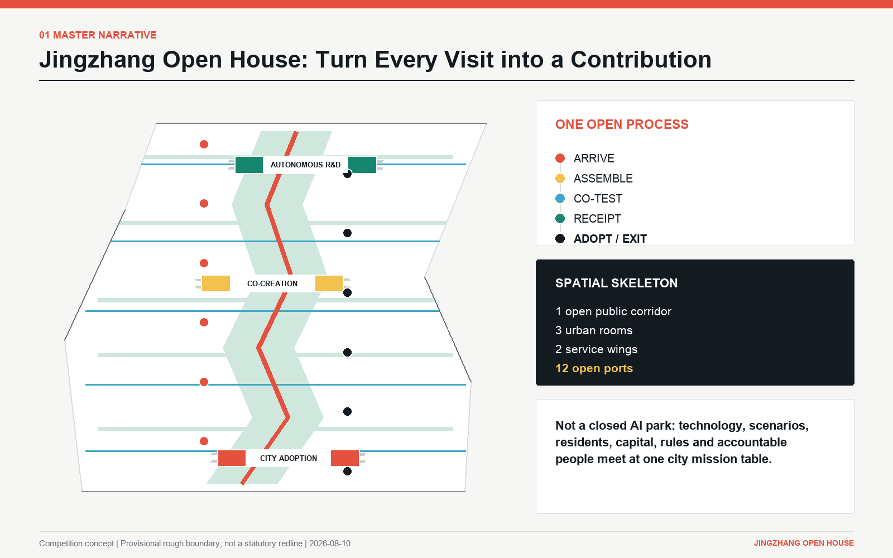
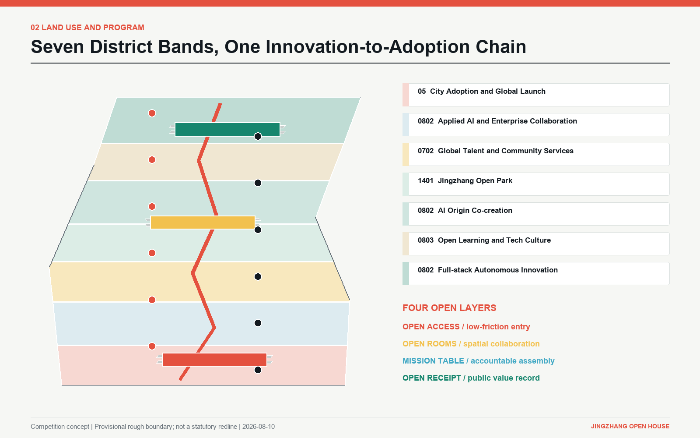
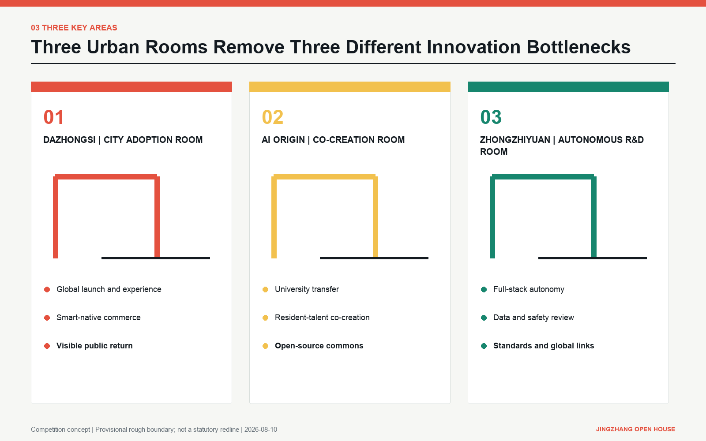
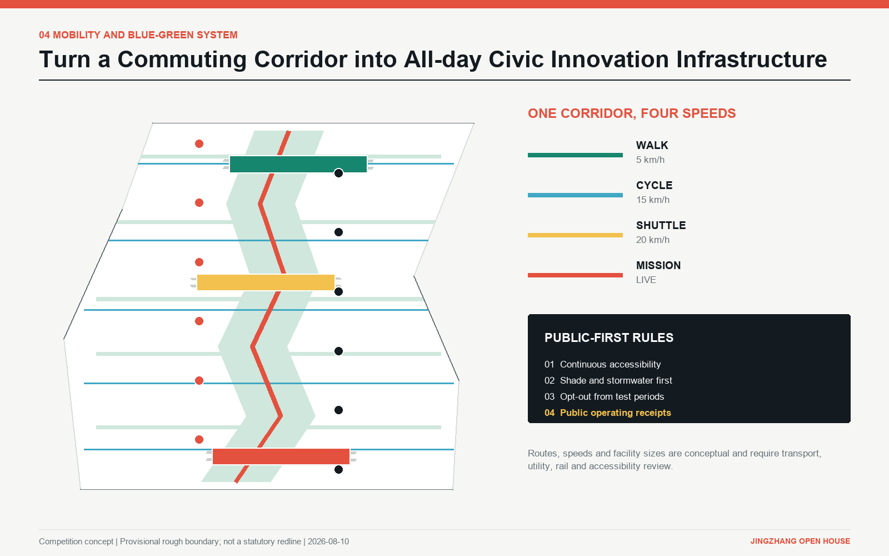
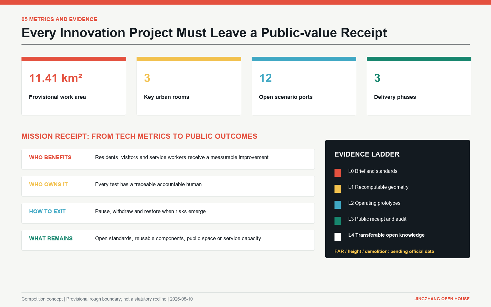

# JINGZHANG OPEN HOUSE / 京张开放之家

> **Core proposition: Turn every visit by global AI talent into a contribution to the city.**

Open House is not a hotel, visitor centre or closed technology park. It is an innovation-city operating system: technology, scenarios, residents, capital, rules and accountable people meet in real places; every test leaves a public-value receipt; useful results are adopted, while failed ideas can exit safely.

## Design Basis and Source List

The controlling references are the official Haidian announcement, the open-call taskbook and local snapshots of professional standards. Generation and recalculation use the provisional rough Overall Design Area and three Key Areas supplied by the competition [source:OFFICIAL-ANNOUNCEMENT] [source:AGENT-TASKBOOK] [standard:PROJECT-OFFICIAL-ANNOUNCEMENT]. The approximately 11.4 sq km overall area, the names of the three Key Areas and their approximate sizes come from the announcement. The current polygons are not official redlines; `official_boundary=false`, and they must not be interpreted as road, ownership, heritage or statutory planning boundaries [data:geometry/site_boundary.geojson#SITE-001].

Four external evidence groups support mechanism design: the OECD regional-attractiveness framework, Brainport's regional vision for international talent, JTC's account of Punggol Digital District, and the Quayside digital-governance proposal. They do not replace Beijing statutory information and are not used to derive boundaries or controls [source:OECD-REGIONAL-ATTRACTIVENESS-2023] [source:BRAINPORT-TALENT-2024] [source:JTC-PDD-2024].

Missing inputs include official overall and Key Area redlines, measured existing conditions, ownership, road and rail controls, heritage controls, building-condition surveys, underground space, utility capacity, and fine-grained demographic and industry data. The gaps do not prevent conceptual competition review, but FAR, height, demolition, investment and implementation timing must be recalculated by professional teams after formal data is obtained [depth:existing_conditions_diagnosis] [source:SOURCE-REGISTRY].

## Three-Level Scope Framework

The Coordinated Research Area asks why a world-class AI ecosystem should form here; the Overall Design Area asks how the ecosystem becomes urban structure; the three Key Areas ask how that structure works in a building, street and service. One open process connects all three levels: **arrive -> assemble -> co-test -> receipt -> adopt or exit -> open knowledge** [depth:three_level_scope_framework].

| Scope | Critical decision | Open House response |
| --- | --- | --- |
| Coordinated Research Area | Why global talent comes and stays | Shift from one-way recruitment to mission attraction: problems to solve, partners to meet, a city to test with, and contributions to leave |
| Overall Design Area | How industry and city are organised | 1 open public corridor, 3 urban rooms, 2 service wings and 12 open ports |
| Key Areas | How visible operating prototypes emerge | Dazhongsi handles adoption and launch; AI Origin handles co-creation; Zhongzhiyuan handles autonomy and rule-making |

This framework does not draw a new statutory boundary. It translates the competition's three positions, five functions and three zones/two wings into testable roles. Seven land-use bands cover the provisional boundary without gaps or overlaps, while the corridor, rooms, ports and phases derive from the same GeoJSON [data:geometry/land_use.geojson#LU-001] [data:geometry/roads.geojson#ROAD-OPEN-SPINE] [metric:key_area_count].

## Coordinated Research Area: Industry and Future City Research

The Jing-Zhang Railway was China's first independently designed railway; its legacy is mastery of a complex system, not nostalgia. Today that gene maps onto three chains: full-stack independent innovation at Zhongzhiyuan, university transfer at AI Origin, and city adoption at Dazhongsi. Tsinghua, Beihang, BUPT and the Chinese Academy of Sciences are linked along 9.35 km, forming the world's only “laboratory-density corridor.” The Open Corridor converts physical distance between laboratories into collaboration density.

### Brand and visual identity

The Chinese name is “京张开放之家” and the English name is “JINGZHANG OPEN HOUSE.” Its everyday codename is “OPEN DESK,” taken from the six-seat mission table. “House” signals entry, co-presence and long-term belonging; “open” makes it an institutional promise rather than a real-estate label. The logo combines three strokes: a doorway, the Jing-Zhang trajectory and an open port. The doorway stands for civic access, the line for historic movement and innovation transfer, and the node for each participant's contribution. Rail ink, signal coral, civic green, collaboration yellow and infrastructure blue represent history, action, public value, joint work and enabling systems. Signal coral comes from railway signal lamps and carries Jing-Zhang's history from physical to digital signals: it once directed movement; now it marks missions, validation and receipts [standard:PROJECT-AGENT-OPEN-CALL-TASKBOOK].

### Global cases are mechanisms, not forms to copy

| Case | Transferable mechanism | Jingzhang translation | What is not copied |
| --- | --- | --- | --- |
| Punggol Digital District | District platform, mixed use and living lab | The open corridor becomes an operating and testing interface | Digital twin is not an end in itself |
| Brainport Eindhoven | Talent services, family integration and regional coordination | The Zhongguancun Wing offers talent and family soft landing | Services are not restricted to highly paid engineers |
| STATION F | Dense founder community and partner network | AI Origin assembles missions and open-source communities | No single-building incubator formula |
| Smart Kalasatama | Everyday time benefits as a smart-city measure | Receipts record real improvements for residents | Device counts do not replace quality of life |
| Kendall Square | Proximity of research, firms and public realm | Open ground floors and walkable links connect the three rooms | No single property-value logic |
| Woven City | Real-life testing and iteration | Xiaoyue River hosts reversible daily-life tests | No closed demonstration community |
| Quayside | Review of data use, transparency and public oversight | The six-seat mission table includes data safety and residents | Governance promises are treated critically |
| IN Amsterdam | Soft-landing services for international talent | Legal, IP, housing and education navigation in the Zhongguancun Wing | Attractiveness is not reduced to visa speed |

The OECD framework treats attractiveness as more than a single economic indicator; connectivity, environment, wellbeing, land and housing matter too. Open House therefore frames talent attraction as a combined experience of mission, life and public trust [source:OECD-REGIONAL-ATTRACTIVENESS-2023]. Three industry chains follow: full-stack independent innovation at Zhongzhiyuan, university transfer and open source at AI Origin, and city adoption and global launch at Dazhongsi. The two wings provide capital/IP/talent services and real-life scenarios [depth:overall_spatial_structure].

## Overall Design Area: Urban Renewal and Regulatory-Plan-Level Urban Design

The master structure is **one corridor, three rooms, two wings and twelve ports**. A conceptual 9.35 km Open Corridor links seven program bands: city adoption and global launch in the south; talent services, open park and AI Origin co-creation in the centre; open learning and full-stack independent innovation in the north [metric:open_corridor_length_m] [data:geometry/land_use.geojson#LU-004]. Five transverse “Open Thresholds” reconnect adjacent communities and campuses, preventing innovation resources from circulating only inside the spine.

One corridor and three rooms also change gear over time: at 8 a.m., angled light reaches the desks as coffee and wet-grass scents enter the thresholds; at 3 p.m., train hum, device cues, conversation and footsteps separate into near and far layers; at 8 p.m., office traffic recedes while mission tables, classes and walkers concentrate activity again on open ground floors and courtyards.

Urban form begins with open ground floors, visible research, bookable courtyards, shared test streets and continuous accessible edges, rather than landmark towers. Prototype buildings use compact courtyards and adaptable ground floors so labs, studios, meetings, exhibitions and community services can change through the day. The 18 generated footprints express massing relationships only; they are not demolition or development approvals [data:geometry/buildings.geojson#BLDG-01-01] [depth:height_massing_character].

Public space follows three clocks: weekday research and enterprise collaboration; evening learning, demonstrations and community events; weekend public experiments, cultural walks and family learning. AI can never be the only gateway. Every public scenario retains a staffed option, accessible route, non-digital alternative and explicit opt-out.

## Detailed Design of Key Areas

### 1. Dazhongsi: City Adoption Room

The southern gateway moves prototypes toward city adoption. It includes the Arrival Exchange, AI City Gallery, Smart-native Market, Public Receipt Wall and an evening launch courtyard. Companies must communicate the user problem, operating boundary, accountable owner, failure exit and public benefit, not only model capability. Commercial vitality is tied to public legibility so Dazhongsi does not become a showroom alone [data:geometry/key_areas.geojson#PROV-KEY-003].

In winter the cast-iron doorway feels cold; low light cuts across brick joints as the smells of coffee and rain-wet masonry linger under the threshold. Torn paper fibres remain on the Receipt Wall, while suitcase wheels and shoes leave shallow wear on the steps.

### 2. Beijing AI Origin Community: Co-creation Room

This is the mission-assembly centre for universities, developers, residents and founders. Its core spaces are the Open-source Foundry, Resident Co-design Desk, Family Learning Yard, AI Origin Salon and bookable prototype courts. Every mission assembles six seats: technology, scenario operator, data/safety, resident/user, capital/legal/IP, and an accountable human lead [data:geometry/key_areas.geojson#PROV-KEY-002].

OPEN DESK's oak surface keeps cup rings and pencil dents; skylight moves along its edge as paper and sawdust scents mix. The scrape of chairs stops before a vote, while handwritten notes preserve traces of working together.

### 3. Zhongzhiyuan: Autonomous Innovation Room

The northern engine focuses on full-stack independence, standards validation and international technical collaboration. It includes the Compute and Data Match Desk, Standards and Safety Lab, trusted evaluation field and Global Release Hall. Success is measured by substitutability, auditability, critical-stack independence and real adoption, not model size alone [data:geometry/key_areas.geojson#PROV-KEY-001] [depth:three_key_area_detailed_design].

Perforated metal and frosted glass filter laboratory light into the walkway, where equipment warmth meets the damp smell of a rain-wet drain. Wheel tracks, chalk marks and bent cable sleeves record each retest.

### One Person's 24 Hours

A young AI researcher returning from the Bay Area walks into Jingzhang Open House for the first time.

In the morning, he scans his passport to register at the Arrival Exchange. Palms have polished the copper handrail; his suitcase wheels make a soft click over the joints between stone slabs.

Later that morning, AI Origin matches him to a mission table. The oak top holds cup rings and pencil dents; he writes his name on a note and sticks it in front of his seat.

In the afternoon, he enters Zhongzhiyuan's Open Test Yard. The equipment's low hum overlaps with discussion in the courtyard as the test moves from the table into the field.

At dusk, he returns to Dazhongsi's Receipt Wall. A new sheet overlaps old paper edges; his fingertip brushes a staple and raises a sandy rustle.

At night, he walks out of Dazhongsi. The steps keep shallow marks from suitcase wheels and shoe soles; turning back, he sees his freshly posted name in the Contribution Gate's low light.

All three rooms share a mission ID, entry gate and receipt format. A technology may pass safety and performance tests in Zhongzhiyuan, co-design with residents and operators at AI Origin, and enter public experience at Dazhongsi. A failed gate sends the project back or exits it; publicity cannot substitute for evidence.

## AI Innovation Ecosystem, Personas, and AI+ Scenarios

### Six personas

| Persona | Real task | Spatial and service response |
| --- | --- | --- |
| International early-career researcher | Find a mission, collaborators and a compliant entry within 48 hours | Arrival Exchange, bilingual mission map and mentor matching |
| Haidian AI founder | Find a scenario, data, first customer and IP support | Mission table, cross-border IP clinic and adoption path |
| Local resident | Know what is being tested, whether it can be refused, and what improves | Resident seat, non-digital alternative and public receipt |
| Service and property worker | Participate in workflow improvement instead of becoming invisible to automation | Labour-impact review, training path and accountable human |
| Child, older person or disabled user | Use AI safely, understandably and reversibly | Accessible route, slow mode and Family Learning Yard |
| Enterprise R&D or scenario owner | Validate at low cost and obtain a procurement basis | Standards lab, real-world test and adopt/exit decision |

### Twelve scenario cards

| ID | Open port | Core behaviour | Success receipt | Stop condition |
| --- | --- | --- | --- | --- |
| 01 | Arrival Exchange | One registration for mission, life and rule navigation | Shorter time to first mission table | Data collection beyond necessity |
| 02 | AI City Gallery | Exhibit problems being solved, not product advertising | Every exhibit links to evidence and accountability | No exit plan or exaggerated performance |
| 03 | Smart-native Market | Test translation, guidance, accessibility and night service | Customers and workers both benefit | Mandatory facial recognition or discriminatory pricing |
| 04 | Resident Co-design Desk | Residents define problems and join acceptance | Accepted, rejected and explained decisions are visible | Consultation without decision feedback |
| 05 | Family Learning Yard | Children and carers learn AI capability and risk together | Repeatable curriculum and family feedback | Collection of children's sensitive data |
| 06 | AI Origin Salon | Talent, professors, firms and communities assemble | Named mission brief | Attendance without follow-up action |
| 07 | Open-source Foundry | Turn projects into reusable code and documentation | Repository, licence and maintainer are clear | Unclear ownership or licence |
| 08 | Cross-border IP Clinic | Review patents, standards, licensing and market entry | Risk list and next accountable step | Automated legal advice presented as certainty |
| 09 | Standards and Safety Lab | Test performance, bias, robustness and takeover | Reproducible test report | Untraceable data or irreproducible test |
| 10 | Compute and Data Match Desk | Match resources under compliant conditions | Cost, access, purpose and expiry are explicit | Purpose drift or access loss |
| 11 | Forest Mobility Lab | Test walking, shuttle, shade and accessibility | Safety, time and comfort improve together | Threshold breach or blocked public passage |
| 12 | Global Release Hall | Release outcomes that have passed city testing | Evidence, limits and public benefit published together | Launch event without an adopter |

Three principal cards add touch and sound. **Arrival Exchange:** palms polish the brass rail, and suitcase wheels click over stone joints. **Resident Co-design Desk:** leaning rounds the oak edge, while chair-scrape stops before a vote. **Open Receipt Wall:** new sheets cover old edges, and a fingertip crossing staples raises a paper hiss.

The twelve ports are encoded as `SCENARIO_NODE` features and can be counted from structured data [data:geometry/public_space.geojson#PORT-01] [metric:open_port_count]. They are conceptual proposals whose exact siting and entry rules require joint work by operators, local authorities, professional teams and the public.

### Three industry validation missions

1. **Embodied AI in public space:** test obstacle avoidance, human takeover, bias affecting children and older people, and restoration of public passage. Move from low-speed controlled test to time-limited public test and then adopt or exit.
2. **Multilingual public-service assistant:** test translation accuracy, data minimisation, human escalation and cross-cultural comprehension at the Arrival Exchange and Dazhongsi. Resolution and misleading-answer rates matter more than conversation volume.
3. **SME AI adoption path:** connect the IP Clinic, Compute and Data Match Desk and Smart-native Market to test cost, compliance and actual business improvement. Scale only when an auditable procurement basis exists.

Together they place R&D, adoption and public governance in one loop, addressing the five functions of full-stack innovation, world-class ecosystem, AI+ scenarios, a lively intelligent city and governance influence [standard:PROJECT-AGENT-OPEN-CALL-TASKBOOK].

## Land Use, Building Scale, and Retain-Renovate-Demolish Strategy

The seven program bands use permitted codes 05, 0702, 0802, 0803 and 1401, covering the full provisional area [standard:MNR-LAND-USE-CLASSIFICATION-GUIDE] [data:geometry/land_use.geojson#LU-001] [depth:land_use_layout]. Conceptual building footprints total approximately 187,500 sq m and express courtyard, street-wall and open-ground-floor relationships in the three Key Areas only; they do not represent added floor area or investment [metric:building_footprint_area_sqm].

Retain-renovate-demolish decisions follow an evidence-first ladder: preserve historic and high-quality buildings; open the ground floor and interface of structurally sound but closed buildings; use reversible additions on underused ancillary space; discuss demolition only after ownership, structure, heritage, carbon and public-interest reviews. No parcel-level demolition list is produced without a building survey. FAR, height, total floor area and parking remain pending official data and multidisciplinary review [depth:development_intensity_controls] [depth:retain_renovate_demolish].

## Transport, Rail, Municipal Infrastructure, and Public Services

The Open Corridor supports four speeds: continuous walking, cycling, low-speed shuttle and real-time mission flow. Five transverse thresholds connect communities, campuses and city streets. Priority is pedestrian and accessible movement, cycling, public shuttle and necessary service vehicles. Autonomous-vehicle tests cannot permanently occupy public passage [data:geometry/roads.geojson#ROAD-OPEN-SPINE] [depth:traffic_rail_slow_parking].

Municipal and digital infrastructure follows minimum-necessary sensing. Existing systems are reused first; every new sensor must publish purpose, data class, retention, accountable owner and exit route. Energy, communications, computing, stormwater and emergency capacity require specialist verification. Staffed public-service options ensure equal access for older, young, disabled and international users, and those without smart devices [depth:municipal_new_infrastructure].

## Blue-Green Network, Public Space, and Urban Character

The continuous Open Park links rain gardens, forest learning, pocket activities and the three urban rooms. The conceptual green-space ratio is about 22.26%, and the three rooms account for about 5.56% public space; both are recalculated against the provisional boundary and are not statutory indicators [metric:green_ratio] [metric:public_space_ratio]. Mature trees and historic traces come first, supported by shade, permeable ground, seating, night safety and all-age accessibility. AI services are removable layers on top of this civic foundation [data:geometry/green_space.geojson#GREEN-OPEN-PARK] [depth:blue_green_public_space].

Three “AI pilgrimage landmarks” are usable public devices, not monumental objects: the **Jingzhang Contribution Gate** records city contributions and owners; the **Origin Mission Table** displays open problems, seats and progress; the **Open Receipt Wall** shows adoption, failure, exit and public value. The cultural narrative is: rail brought people and knowledge into Beijing; AI returns global collaboration to the real city. Industrial memory is preserved without superficial historic styling.

## Renewal Projects, Implementation Policy, and Phasing

| Phase | Suggested period | Priority projects | Gate to pass |
| --- | --- | --- | --- |
| Open First | 2026-2028 | Arrival Exchange, Origin Mission Table, Open Receipt protocol and two transverse thresholds | Operator, accountable human, privacy and exit rules confirmed |
| Connect the Rooms | 2028-2030 | Three urban rooms, continuous Open Park, cross-area mission system and Family Learning Yard | Cross-organisation budget, maintenance and public evaluation |
| Scale the System | 2030-2035 | Full-stack validation, international standards work, Global Release Hall and transferable ports | Independent proof of public value and transferability |

Phase polygons are stored in `phasing.geojson`; dates are competition recommendations, not government commitments [data:geometry/phasing.geojson#PHASE-01] [metric:phase_count]. Policy proposals include an open-scenario register, six-seat mission table, public receipts, sensor-purpose register, reversible test permits, open-ground-floor incentives, international talent soft landing and archiving of failed knowledge [depth:renewal_project_list] [depth:phasing_implementation].

Long-term operations follow four seasons, seven days and three daily periods: spring problem calls, summer city co-tests, autumn global release and winter evidence review; weekday R&D, evening learning and communities, weekend public participation. The annual **OPEN HOUSE 168** is a 168-hour cross-area mission relay, not a conventional trade show. A governing council represents government/parks, universities, firms, residents, professional bodies, and an independent ethics and safety voice. No vendor owns the rules.

## Metrics, Area Recalculation, and Compliance Matrix

Spatial metrics are recalculated from GeoJSON in EPSG:4548: an approximately 11.413 million sq m provisional overall area, three Key Areas, twelve open ports and three phases. Green, public-space and prototype-building areas retain formula, source, confidence and assumptions in `metrics.json` [metric:site_area_sqm] [metric:open_port_count] [depth:metrics_recalculation].

Operations are evaluated not by the amount of AI deployed but by four receipt questions: who benefits, who is accountable, how can it exit, and what remains. Each mission records baseline, affected groups, technical and human workflow, risk threshold, adopt/exit decision, public benefit and reusable outcome. Requirements 1.3, 1.4, 1.5 and agent.1-agent.6 map to sections, geometry, drawings and metrics in `compliance_matrix.json`; standards and design depth are registered in `standard_matrix.json` and `design_depth_matrix.json` [standard:MOHURD-URBAN-DESIGN-MEASURES].

## Risk, Copyright, and Compliance

The main risk is not insufficient spectacle but “open” becoming a slogan without power. Five gates respond: provisional data never masquerades as official; residents and vulnerable groups hold real seats; public space keeps non-digital alternatives; every test has an accountable human and stop condition; failures enter the receipt record [depth:risk_missing_data].

Reversal triggers are explicit. If talent services displace local public resources, redesign them as universal infrastructure. If testing adds surveillance or blocks passage, stop and restore. If the three rooms cannot create cross-area mission flow, reduce capital works and validate operations first. If official boundary, heritage or utility data conflicts with current layers, replace and recalculate. If independent evaluation cannot show public value, do not advance the phase.

All spatial, identity, event and policy moves are competition concepts for professional deepening. They are not approved plans, government or investment commitments, or engineering-feasibility conclusions. Figures derive from submission data. Global cases support mechanism research only; protected design expression is not copied. The package uses `COMMUNITY-DISPLAY-ONLY`; see the copyright statement for reuse conditions.

## References

1. Haidian Branch, Beijing Municipal Commission of Planning and Natural Resources, *Announcement for the Centennial Jing-Zhang AI Innovation Belt Open Call*, 2026 [source:OFFICIAL-ANNOUNCEMENT].
2. open-city-ai/haidian, `agent_taskbook.json`, formal submission guide and local professional-standard snapshots [source:AGENT-TASKBOOK] [source:SITE-PACKAGE].
3. OECD, *Rethinking Regional Attractiveness in the New Global Environment*, 2023 [source:OECD-REGIONAL-ATTRACTIVENESS-2023].
4. Brainport Eindhoven, *Regional Vision on International Talent*, 2024 [source:BRAINPORT-TALENT-2024].
5. JTC, *Sustainability Report FY2024*, Punggol Digital District section [source:JTC-PDD-2024].
6. Sidewalk Labs, *Digital Governance Proposals for Quayside*, 2018, used as a governance lesson rather than a claim about later project outcomes [source:QUAYSIDE-DIGITAL-GOVERNANCE-2018].
