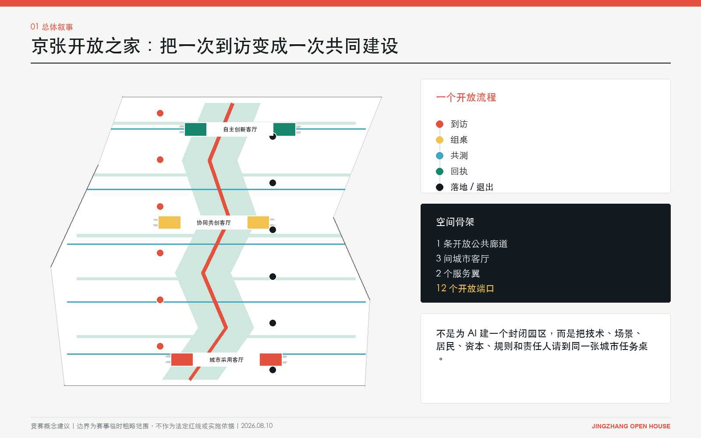
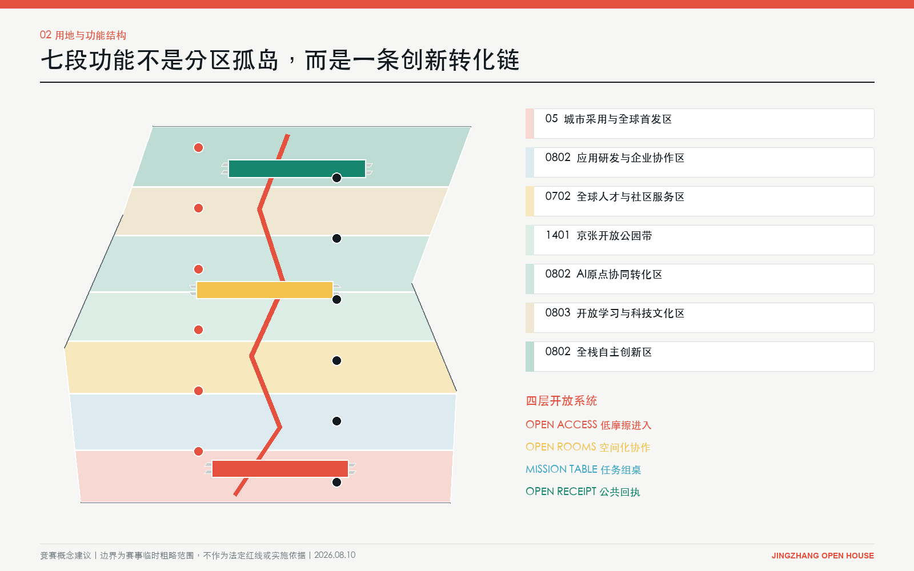
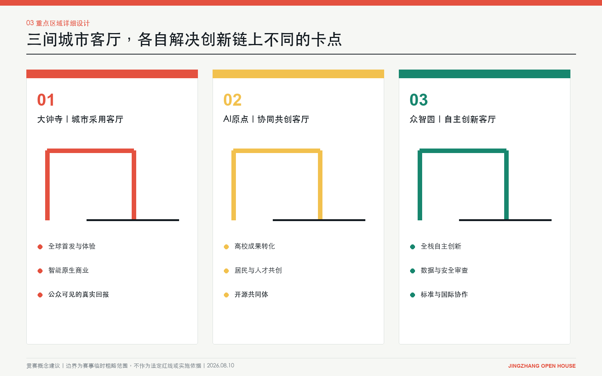
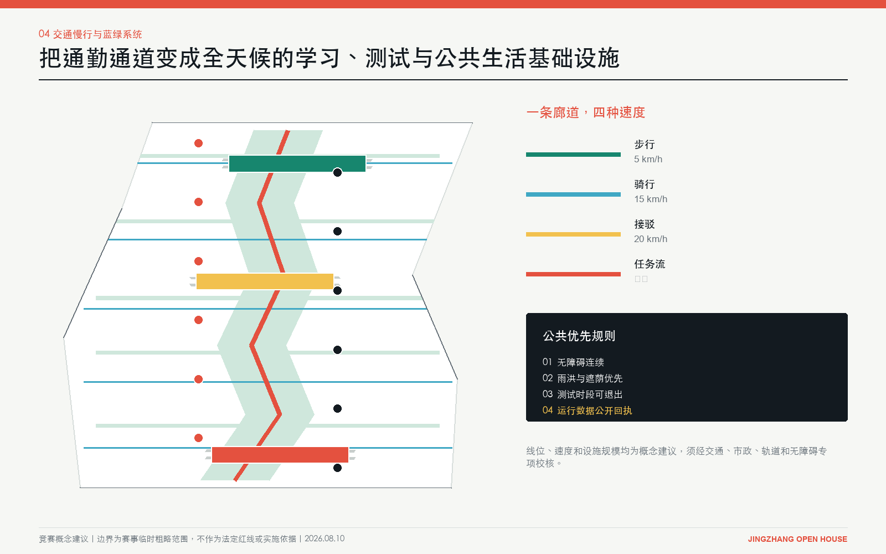
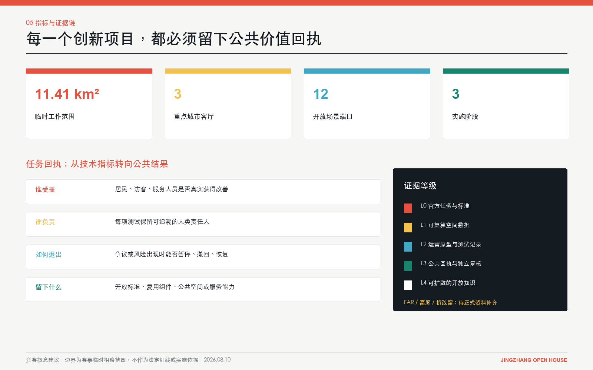

# 京张开放之家 / JINGZHANG OPEN HOUSE

> **核心主张：把全球 AI 人才的一次到访，变成一次共同建设。**

“开放之家”不是酒店、游客中心或封闭科技园，而是一套创新城市操作系统：让技术、场景、居民、资本、规则与责任人，在真实空间里低摩擦相遇；让每次试验留下公共价值回执；让可行成果被采用，让失败方案能安全退出。

## 设计依据与资料清单

本方案以北京市海淀区发布的资格预审公告、赛事任务书和本地专业标准快照为主控依据，并使用赛事提供的临时粗略总体范围与三处重点区图形开展生成和复算 [source:OFFICIAL-ANNOUNCEMENT] [source:AGENT-TASKBOOK] [standard:PROJECT-OFFICIAL-ANNOUNCEMENT]。总体范围约 11.4 平方公里、三处重点区名称及约规模来自官方公告；当前 polygon 不是官方红线，`official_boundary=false`，不得解释为道路、权属、文保或法定控规边界 [data:geometry/site_boundary.geojson#SITE-001]。

研究补充四类可复核外部材料：OECD 的区域吸引力框架、Brainport 国际人才区域愿景、JTC 对 Punggol Digital District 的运营总结，以及 Quayside 数字治理提案。它们只支持机制判断，不替代北京法定资料，也不用于推导场地边界和规划控制 [source:OECD-REGIONAL-ATTRACTIVENESS-2023] [source:BRAINPORT-TALENT-2024] [source:JTC-PDD-2024]。

当前待补资料包括：官方总体与重点区红线、现状测绘、权属、道路和轨道控制线、文保控制、现状建筑质量、地下空间、市政容量、人口与产业微观数据。缺口不妨碍竞赛概念评审，但任何 FAR、高度、拆改、投资和实施时序结论均须在专业团队取得正式资料后复算 [depth:existing_conditions_diagnosis] [source:SOURCE-REGISTRY]。

## 三层范围工作框架

统筹研究范围回答“为何形成世界级 AI 创新生态”；总体设计范围回答“生态如何变成城市结构”；三处重点区回答“结构如何在一栋楼、一段街、一项服务中运行”。本方案以同一条开放流程贯通三层：**到访 -> 组桌 -> 共测 -> 回执 -> 采用或退出 -> 开放知识** [depth:three_level_scope_framework]。

| 工作层级 | 关键决策 | “开放之家”的回答 |
| --- | --- | --- |
| 统筹研究范围 | 全球人才为何来、为何留下 | 从单向招商转为任务吸引：有问题可解、有伙伴可组、有城市可测、有成果可留下 |
| 总体设计范围 | 产业与城市如何组织 | 1 条开放公共廊道、3 间城市客厅、2 个服务翼、12 个开放端口 |
| 重点区域 | 如何形成可见、可运营原型 | 大钟寺负责采用与首发，AI 原点负责协同共创，众智园负责自主创新与规则输出 |

这个框架不是另画一套红线，而是把赛事的“三大定位、五大功能、三区两翼”转为可检验的角色分工。用地七段完整覆盖临时边界且无重叠；开放廊道、房间、端口和分期从同一套 GeoJSON 派生 [data:geometry/land_use.geojson#LU-001] [data:geometry/roads.geojson#ROAD-OPEN-SPINE] [metric:key_area_count]。

## 统筹研究范围产业与未来城市研究

京张铁路是中国第一条自主设计铁路，其基因是掌握复杂系统，而非怀旧符号。今天，它映射为众智园全栈自主创新、AI 原点高校转化、大钟寺城市采用三条产业链。清华、北航、北邮与中科院沿 9.35 公里廊道串联，构成全球唯一的“实验室密度走廊”。开放廊道要把实验室间的物理距离转为协作密度。

### 品牌与视觉身份

中文名“京张开放之家”，英文名“JINGZHANG OPEN HOUSE”。日常代号“OPEN DESK”（开放桌），取自六席任务桌。“家”表达可进入、可共处、可长期归属；“开放”把它从房地产命名转为制度承诺。Logo 采用**门框 + 京张轨迹 + 开放端口**三笔结构：门框是城市公共性，折线是百年京张与创新转化路径，节点是参与者留下的贡献。主色不是单一科技蓝，而是铁路墨黑、信号珊瑚红、公共绿、协作黄与基础蓝，分别对应历史、行动、公共利益、共同建设与基础设施。信号珊瑚红源自铁路信号灯，是京张从物理信号到数字信号的历史延续：过去指挥通行，今天标记任务、验证与回执 [standard:PROJECT-AGENT-OPEN-CALL-TASKBOOK]。

### 国际案例不是抄形态，而是拆机制

| 案例 | 可迁移机制 | 京张转译 | 不照搬的部分 |
| --- | --- | --- | --- |
| Punggol Digital District | 园区数字底座、混合使用、living lab | 开放廊道承担测试与运营接口 | 不把数字孪生当作目的 |
| Brainport Eindhoven | 国际人才服务、家庭融入、区域协作 | 中关村翼设置人才与家属一站式服务 | 不只服务高薪工程师 |
| STATION F | 高密度创业社群与伙伴网络 | AI 原点设置任务组桌和开源共同体 | 不复制单体孵化器模式 |
| Smart Kalasatama | 以日常时间收益评估智慧城市 | 场景回执记录居民获得的真实改善 | 不用设备数量代替生活质量 |
| Kendall Square | 研究、产业与公共空间邻近 | 三间客厅嵌入开放首层和步行网络 | 不依赖单一地产增值逻辑 |
| Woven City | 真实生活测试与持续迭代 | 小月河翼承载可退出的生活场景测试 | 不建立封闭样板社区 |
| Quayside | 数据用途审查、透明与公众监督 | 六席任务桌设置数据安全与居民席位 | 不沿用失败的治理承诺 |
| IN Amsterdam | 外籍人才软着陆服务 | 中关村翼提供法律、IP、住房、教育导办 | 不把城市吸引力简化为签证效率 |

OECD 指出区域吸引力不能由单一经济指标代表，还包括连接、环境、居民福祉、土地与住房等维度；因此本方案把“人才吸引”改写为“任务、生活与公共信任的综合体验” [source:OECD-REGIONAL-ATTRACTIVENESS-2023]。这一判断形成三条产业链：众智园的全栈自主创新链、AI 原点的高校转化与开源链、大钟寺的城市采用与全球发布链，并由两翼提供资本/IP/人才和真实生活场景 [depth:overall_spatial_structure]。

## 总体设计范围城市更新与控规深度城市设计

总体结构是**一廊三室、两翼十二端口**。约 9.35 公里的概念开放廊道串联七段功能：南端城市采用与全球首发，中段人才社区、开放公园和 AI 原点协同转化，北端开放学习与全栈自主创新 [metric:open_corridor_length_m] [data:geometry/land_use.geojson#LU-004]。五条横向“开放门廊”把沿线园区与周边社区接回公共网络，防止创新资源只沿纵轴内部循环。

一廊三室随时间换挡：早上 8 点，斜光上桌，咖啡与湿草气味进门；下午 3 点，列车低鸣、提示音、讨论和脚步分出远近；晚上 8 点，办公人流退去，组桌、课程与散步把密度推回首层和庭院。

城市形态不以造地标高楼为先，而以“开放首层、可见研发、可预约中庭、共享测试街、连续无障碍界面”为优先。建筑原型采用小尺度围合院落与可变首层，允许实验室、工作室、会议、展览和社区服务在一天中切换。生成的 18 个建筑基底只是体量与空间关系原型，不是现状拆改或建设许可结论 [data:geometry/buildings.geojson#BLDG-01-01] [depth:height_massing_character]。

公共空间采用三重时间表：工作日服务研发与企业协作；夜间转为学习、路演和社区活动；周末形成开放实验、文化漫游与亲子学习。AI 服务不得成为强制入口，所有公共场景保留人工通道、无障碍通道、非数字替代和清晰退出机制。

## 重点区域详细设计

### 1. 大钟寺：城市采用客厅

定位为“从原型到被城市采用”的南部门户。空间组织为到达交换台、AI 城市展厅、智能原生商业街、公共回执墙和夜间发布庭院。企业不能只展示模型能力，必须说明用户问题、运行边界、责任主体、失败退出和公共收益。设计将商业活力与公众可见性绑定，避免把大钟寺变成纯展销中心 [data:geometry/key_areas.geojson#PROV-KEY-003]。

铸铁门框冬天发凉，低光切过砖缝，咖啡和雨后砖面的气味停住。回执墙留着揭纸纤维，台阶有轮箱和鞋底磨出的浅痕。

### 2. AI 原点社区：协同共创客厅

定位为高校、开发者、居民与创业者的任务组桌中心。核心空间包括开源铸造所、居民共创桌、家庭学习院、AI 原点会客厅和可预约样机院。每个任务由六席共同入桌：技术方、场景方、数据/安全方、居民/用户方、资本/法律/IP 方、可追责的人类负责人 [data:geometry/key_areas.geojson#PROV-KEY-002]。

OPEN DESK 的橡木台面留着杯圈与铅笔压痕，天窗光沿桌边移动，纸与木屑气味相混。表决前移椅声停住，手写便签留下共事痕迹。

### 3. 众智园：自主创新客厅

定位为全栈自主创新、标准验证与国际技术协作的北部引擎。设置算力数据撮合台、标准与安全实验室、可信评测场和全球发布厅。这里不以“模型更大”作为唯一成功标准，而以可替换性、可审计性、关键环节自主性和真实场景采用为共同门槛 [data:geometry/key_areas.geojson#PROV-KEY-001] [depth:three_key_area_detailed_design]。

穿孔金属与磨砂玻璃把实验室灯光滤到廊下，设备热气与雨后边沟潮味相遇。车轮轨迹、粉笔和弯折线缆套管记录每次复测。

### 一个人的 24 小时

一个从湾区回来的研究员，第一次走进京张开放之家。

早上，他在到达交换台刷护照登记。铜扶手被手掌磨亮，行李轮碾过石板接缝，发出轻响。

上午，AI 原点把他匹配到任务桌。橡木桌面留着杯圈与铅笔压痕，他把名字写在便签上，贴在自己席位前。

下午，他走进众智园开放测试院。设备的低频嗡鸣与院子里人的讨论声叠在一起，测试从桌面进入现场。

傍晚，他回到大钟寺回执墙。新纸压住旧纸边，指腹擦过订书钉，带起沙响。

晚上，他走出大钟寺。台阶留着轮箱与鞋底磨出的浅痕；回头时，贡献门的夜间低光照着刚贴上去的名字。

三处重点区之间使用统一任务编号、准入门槛和回执格式。一项技术可以在众智园完成安全与性能验证，在 AI 原点与居民和场景方共创，再到大钟寺公开体验；任何环节不通过，项目回到上一步或退出，不靠宣传包装跨越证据等级。

## AI 创新生态、人才画像与 AI+ 场景

### 六类使用者

| 人物 | 真实任务 | 空间与服务回应 |
| --- | --- | --- |
| 国际青年研究员 | 48 小时内找到课题、合作者与合规入口 | 到达交换台 + 双语任务地图 + 导师匹配 |
| 海淀 AI 创业者 | 找场景、数据、首个客户与 IP 支持 | 任务组桌 + 跨境 IP 诊所 + 城市采用通道 |
| 周边居民 | 知道门口在测什么、能否拒绝、能得到什么 | 居民席位 + 非数字替代 + 公共回执 |
| 服务业与物业人员 | 不被自动化隐形替代，参与流程改进 | 劳动影响评估 + 培训岗位 + 人工责任人 |
| 儿童、老人和残障人士 | 安全、可理解、可退出地使用 AI 服务 | 无障碍连续线 + 慢速模式 + 家庭学习院 |
| 企业研发与场景负责人 | 低成本完成验证并形成采购依据 | 标准实验室 + 真实测试 + 采用/退出决策 |

### 十二张场景卡

| ID | 场景端口 | 核心行为 | 成功回执 | 停止条件 |
| --- | --- | --- | --- | --- |
| 01 | 到达交换台 | 一次登记获得任务、生活与规则导办 | 首次组桌时间下降 | 收集超出必要范围的个人数据 |
| 02 | AI 城市展厅 | 展示正在解决的问题而非产品广告 | 每项展项可追溯责任人与证据 | 无退出方案或夸大效果 |
| 03 | 智能原生商业街 | 测试翻译、导购、无障碍和夜间服务 | 顾客与店员同时受益 | 强制人脸识别或歧视性定价 |
| 04 | 居民共创桌 | 居民提出问题并参与验收 | 采纳、拒绝和解释均公开 | 只有咨询、没有决策反馈 |
| 05 | 家庭学习院 | 儿童与家长共同理解 AI 风险和能力 | 可重复课程与家长反馈 | 收集未成年人敏感数据 |
| 06 | AI 原点会客厅 | 全球人才、教授、企业和社区组桌 | 形成具名任务书 | 只有活动人数、没有后续行动 |
| 07 | 开源铸造所 | 把项目沉淀为开源组件与文档 | 可复用仓库、许可与维护人 | 权属或许可不清 |
| 08 | 跨境 IP 诊所 | 专利、标准、许可和出海合规会诊 | 风险清单和下一步责任人 | 把法律意见自动化为确定结论 |
| 09 | 标准与安全实验室 | 性能、偏差、鲁棒性与人工接管测试 | 可复现实验报告 | 不可追溯数据或不可复现实验 |
| 10 | 算力数据撮合台 | 在合规前提下匹配资源 | 成本、权限、用途和到期日明确 | 用途漂移或权限失控 |
| 11 | 林下移动实验场 | 测试慢行、接驳、遮荫与无障碍 | 安全、时间和舒适度共同改善 | 风险越过阈值或阻断公共通行 |
| 12 | 全球发布厅 | 发布通过城市验证的成果 | 同步公开证据、限制与公共收益 | 只有发布会、没有采用主体 |

三张主卡：**到达交换台**：手掌磨亮铜扶手，行李轮过石缝发出轻响。**居民共创桌**：橡木边缘因倚靠变圆，移椅声在表决前停住。**开放回执墙**：新纸压着旧纸边，指腹擦过订书钉带起沙响。

十二端口均写入 `SCENARIO_NODE`，数量可由结构化数据核对 [data:geometry/public_space.geojson#PORT-01] [metric:open_port_count]。它们是概念建议，需由运营方、属地、专业团队和公众共同确定点位与准入规则。

### 三个产业验证任务

1. **具身智能公共空间协作**：在林下移动实验场验证避障、人工接管、儿童老人识别偏差和公共通行恢复；先低速封闭测试，再限时公开测试，最后决定采用或退出。
2. **多语言公共服务助手**：在到达交换台和大钟寺验证翻译准确性、隐私最小化、人工转接和跨文化可理解性；关键指标是解决率与误导率，而非对话量。
3. **中小企业 AI 采用通道**：从跨境 IP 诊所、算力数据撮合到智能商业街验证成本、合规和真实经营改善；只有产生可审计采购依据才进入规模化。

这些任务把技术研发、场景采用和公共治理放进同一闭环，回应 AI 全栈自主创新、世界级生态、AI+ 场景、活力城市和治理话语权五大功能 [standard:PROJECT-AGENT-OPEN-CALL-TASKBOOK]。

## 用地、建筑规模与拆改留方案

七段功能分区使用赛事允许的用地代码 05、0702、0802、0803、1401，并完整覆盖临时范围 [standard:MNR-LAND-USE-CLASSIFICATION-GUIDE] [data:geometry/land_use.geojson#LU-001] [depth:land_use_layout]。概念建筑基底合计约 18.75 万平方米，只用于表达三处重点区的围合、街墙、院落和开放首层关系；不代表新增建筑量或投资规模 [metric:building_footprint_area_sqm]。

拆改留采用“先证据、后动作”四级门槛：历史与高质量建筑优先保留；结构可用但功能封闭的建筑做首层与界面改造；低效附属空间可做可逆加建；只有经权属、结构、文保、碳排和公共利益综合评估后才讨论拆除。当前缺少建筑普查，因此不制作 parcel 级拆除清单。FAR、限高、建筑总量和停车配建保持“待正式数据补齐”，由规划、建筑、结构、交通和文保专业团队深化 [depth:development_intensity_controls] [depth:retain_renovate_demolish]。

## 交通、轨道、市政与公共服务设施

概念开放廊道组织四种速度：连续步行、骑行、低速接驳和实时任务流；五条横向门廊负责连接社区、园区和城市道路。优先级是行人和无障碍、骑行、公共接驳、必要服务车辆，自动驾驶测试不得占用永久公共通行权 [data:geometry/roads.geojson#ROAD-OPEN-SPINE] [depth:traffic_rail_slow_parking]。

市政与新型基础设施采用“最小必要感知”：优先复用既有网络，新增传感器必须公开用途、数据类别、保存期限、责任人和退出方式；能源、通信、算力、雨洪和应急容量均须专项核定。公共服务设置人工窗口，保证老人、儿童、残障人士、外籍人士和无智能设备者能平等使用 [depth:municipal_new_infrastructure]。

## 蓝绿空间、公共空间与城市风貌

连续开放公园把廊道两侧雨洪花园、林下学习、口袋活动场与三间城市客厅串联，概念绿地比例约 22.26%，三间客厅公共空间比例约 5.56%；两项都基于临时边界复算，不能作为法定指标 [metric:green_ratio] [metric:public_space_ratio]。设计优先保留成熟树木和历史轨迹，采用遮荫、透水、可坐、可停、夜间安全和全龄无障碍的低技术底座，再叠加可关闭的 AI 服务 [data:geometry/green_space.geojson#GREEN-OPEN-PARK] [depth:blue_green_public_space]。

三处“AI 朝圣地标”不是纪念性巨构，而是能被使用和验证的公共装置：**京张贡献门**记录每项城市贡献及责任人；**原点任务桌**公开正在组队的问题、席位和进度；**开放回执墙**展示采用、失败、退出和公共收益。文化叙事以“铁路把人和知识带进北京，AI 把全球协作带回真实城市”为主线，保留京张工业记忆的时间感，同时拒绝仿古符号贴图。

## 更新项目清单、实施政策与分期计划

| 阶段 | 时间建议 | 优先项目 | 通过门槛 |
| --- | --- | --- | --- |
| 先开门 | 2026-2028 | 到达交换台、原点任务桌、开放回执协议、两处横向门廊 | 有运营主体、人工责任人、隐私与退出规则 |
| 连成线 | 2028-2030 | 三间城市客厅、开放公园连续段、跨区任务系统、家庭学习院 | 形成跨主体预算、维护和公共评价机制 |
| 成体系 | 2030-2035 | 全栈验证、国际标准协作、全球发布厅、可复制开放端口 | 独立复核公共收益，确认可扩散而非只扩张 |

分期范围记录在 `phasing.geojson`，年份是竞赛建议，不是政府时序承诺 [data:geometry/phasing.geojson#PHASE-01] [metric:phase_count]。实施政策建议包括：开放场景清单制、任务六席制、公共回执制、传感器用途登记、可逆测试许可、首层开放激励、跨境人才软着陆服务和失败知识归档 [depth:renewal_project_list] [depth:phasing_implementation]。

长期运营采用“一年四季、一周七日、一天三时段”：春季开放问题征集、夏季城市共测、秋季全球发布、冬季证据复盘；工作日服务研发，夜间服务学习与社群，周末面向公众。年度核心活动“OPEN HOUSE 168”不是大型会展，而是 168 小时跨区任务接力。运营委员会由政府/园区、大学、企业、居民、专业机构和独立伦理安全代表组成，任何单一技术供应商不得独占规则。

## 指标体系、面积复算与合规矩阵

空间指标全部从 EPSG:4548 下的 GeoJSON 复算：临时总体范围约 1,141.28 万平方米、三处重点区、12 个开放端口、3 个实施阶段；绿地、公共空间和建筑原型面积均在 `metrics.json` 记录公式、来源、置信度和假设 [metric:site_area_sqm] [metric:open_port_count] [depth:metrics_recalculation]。

运营评价不以“部署多少 AI”计分，而以四类回执审查：谁受益、谁负责、如何退出、留下什么。每个任务至少记录问题基线、受影响人群、技术与人工流程、风险阈值、采用/退出决定、公共收益和可复用成果。任务书 1.3、1.4、1.5 与 agent.1-agent.6 已在 `compliance_matrix.json` 对应章节、图层、图纸和指标；专业标准与设计深度分别由 `standard_matrix.json` 和 `design_depth_matrix.json` 完整登记 [standard:MOHURD-URBAN-DESIGN-MEASURES]。

## 风险、版权与合规说明

最大风险不是技术不够炫，而是“开放”成为没有权力的口号。为此设置五道门槛：边界与控制资料不冒充官方；居民和弱势群体拥有真实席位；公共空间保留非数字替代；每项测试有人工责任人与停止条件；失败同样进入公开回执 [depth:risk_missing_data]。

反向触发条件如下：若国际人才服务挤压本地公共资源，则调整为普惠服务底座；若场景测试增加监控和通行负担，则暂停并恢复原状；若三间客厅无法形成跨区任务流，则缩减空间建设、先验证运营；若官方红线、文保或市政资料与当前图层冲突，则以正式资料为准全量重算；若独立评估不能证明公共收益，则不进入下一阶段。

所有空间、Logo、活动和政策均为竞赛概念建议，可供专业团队深化研究，不构成批准规划、政府承诺、投资承诺或工程可行性结论。图件由本方案结构化数据生成；外部案例只做文字机制研究，不复制其受版权保护的设计表达。提交包采用 `COMMUNITY-DISPLAY-ONLY`，具体再利用以版权声明为准。

## 参考资料

1. 北京市规划和自然资源委员会海淀分局，《百年京张 AI 创新带城市设计国际方案征集资格预审公告》，2026 [source:OFFICIAL-ANNOUNCEMENT]。
2. open-city-ai/haidian，`agent_taskbook.json`、formal submission guide、专业标准本地快照 [source:AGENT-TASKBOOK] [source:SITE-PACKAGE]。
3. OECD, *Rethinking Regional Attractiveness in the New Global Environment*, 2023 [source:OECD-REGIONAL-ATTRACTIVENESS-2023]。
4. Brainport Eindhoven, *Regional Vision on International Talent*, 2024 [source:BRAINPORT-TALENT-2024]。
5. JTC, *Sustainability Report FY2024*, Punggol Digital District 部分 [source:JTC-PDD-2024]。
6. Sidewalk Labs, *Digital Governance Proposals for Quayside*, 2018；作为治理教训背景，不代表后续项目结论 [source:QUAYSIDE-DIGITAL-GOVERNANCE-2018]。
