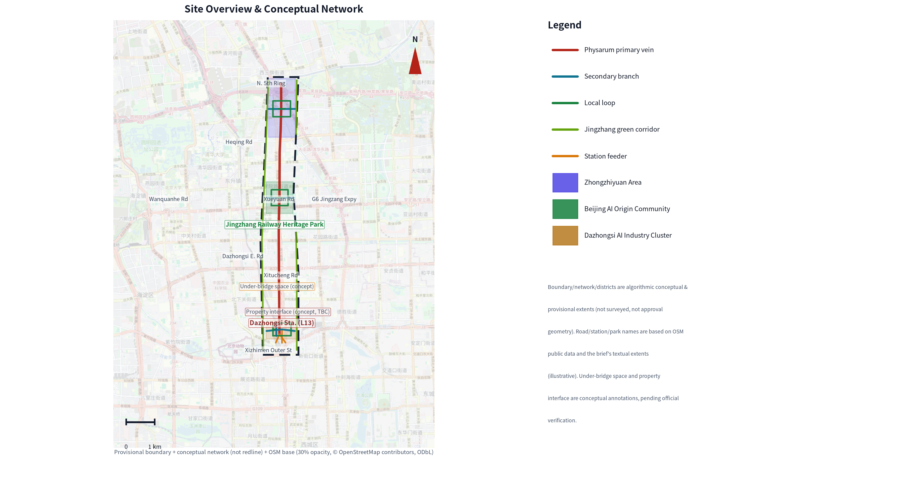
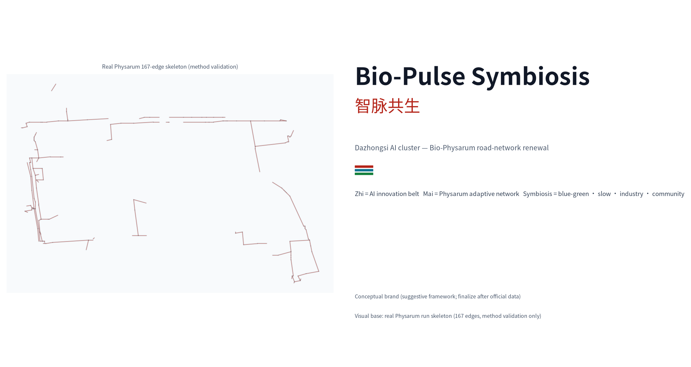
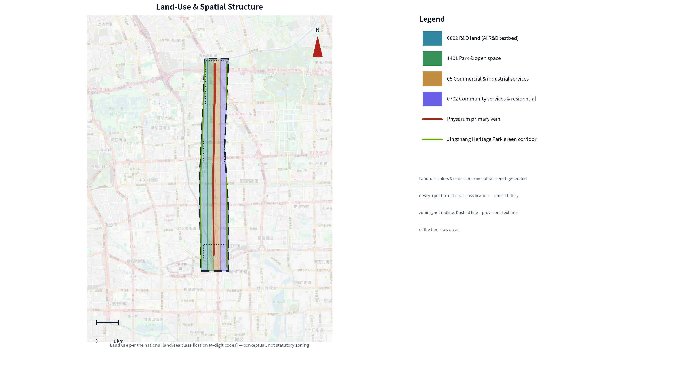
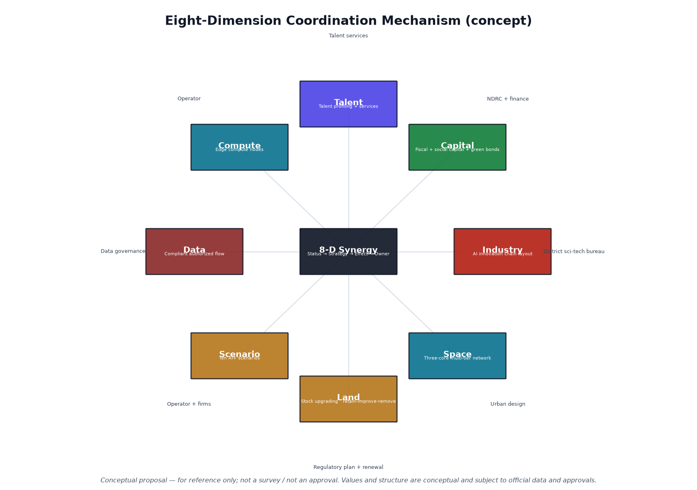
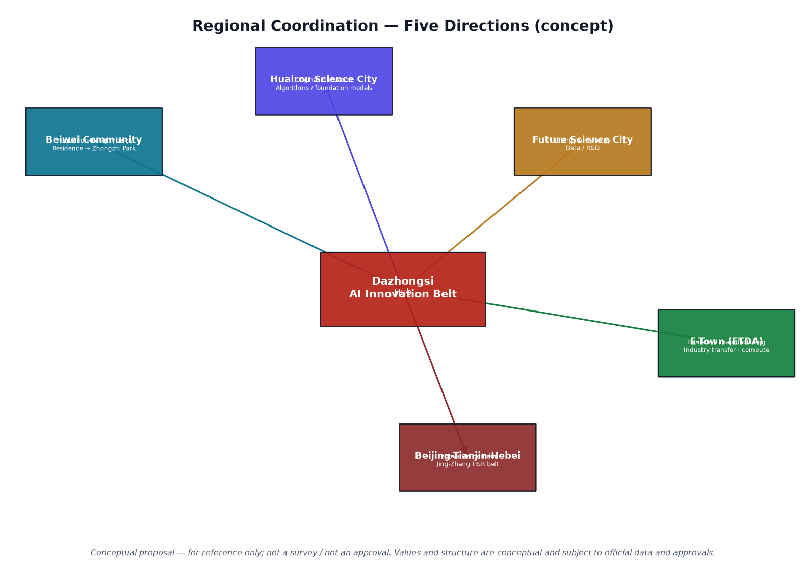
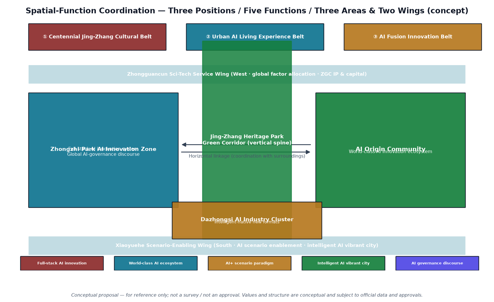
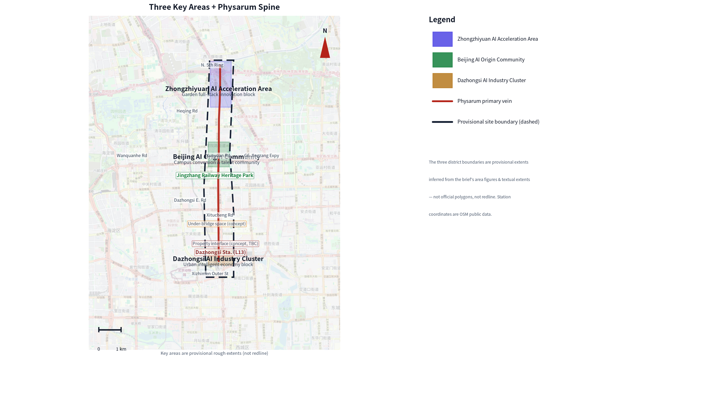
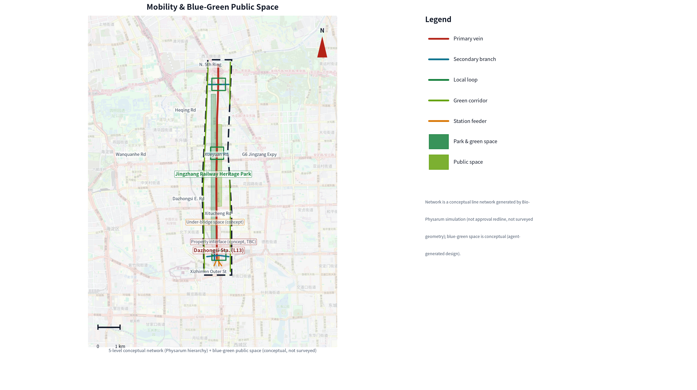
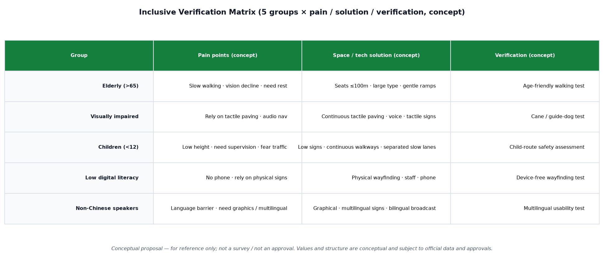
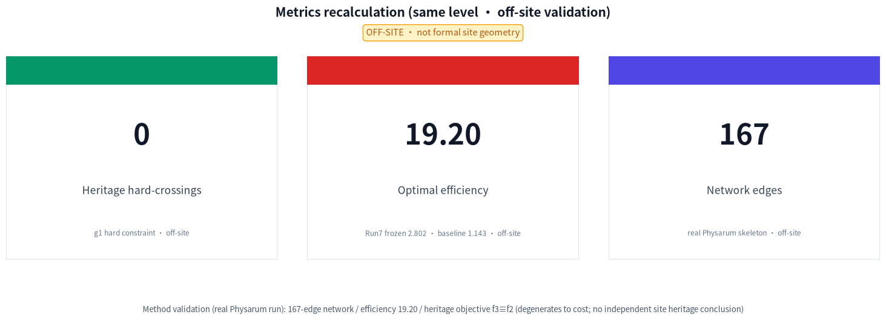

# Dazhongsi Area Urban Renewal Implementation Plan — Road-Network Restructuring and Spatial Activation Based on Bio-Physarum Algorithm Insights

> **Roads grow like slime mold, not drawn once. The ordinary path always goes first; AI only adds reversible, stoppable, rollback-able gains.**

## Executive Summary

The Centenary Jing-Zhang AI Innovation Belt is envisioned as a global AI industry highland and pilgrimage destination. Dazhongsi is one of its three key areas and a flagship carrier of Haidian's Zhongguancun Science City innovation corridor. This proposal does not stack tool counts; it answers a single question: **faced with a fragmented slow-travel system, the tension between heritage protection and development, and insufficient rail-station coverage, how do we reconnect the existing road network at the lowest cost?**

The core thesis is one sentence: **roads grow like slime mold, not drawn once.** A slime mold facing scattered food sources grows a network that is minimally redundant, highly resilient, and near-optimal in total length; Dazhongsi's parks, metro stations, and the Jing-Zhang railway corridor are precisely the "nutrient anchors" that can be reconnected by the same logic. This proposal translates that natural principle into a "one core · three areas · one interface · one link" spatial structure and six renewal projects (JZ-01..06); the ordinary path always goes first, and AI only adds reversible gains.

**Method evidence (recomputable, not formal site geometry)**: real runs produced a 167-edge skeleton, optimal efficiency 19.20 (baseline 1.143, Run7 frozen 2.802), zero heritage hard-crossings — all as method-validation evidence; coordinate offset means none of this is a field conclusion.

**Governance mechanism (the single spine running through the whole proposal)**: ordinary path first + staged release G0-G3 — G0 ordinary path always open / G1 local recomputation / G2 professional review / G3 bounded field window; any level that fails returns to the previous one; each level keeps stop conditions, reversible measures, and archived receipts. The branding, cases, scenarios, personas, landmarks, operations, and phasing below all hang on this governance spine.

**Eight hard deliverables (unfolded section by section in the body)**: ① brand naming and Logo identity system (Zhìmài Gòngshēng / Bio-Pulse Symbiosis) ② 10 global benchmark cases ③ 10 AI+ scenario cards ④ 3 test-validation scenarios + 3 industry test fields + 2 public scenarios (8 total) ⑤ 5 user personas ⑥ 3 conceptual landmarks + an honor mechanism ⑦ a cultural narrative (bilingual wayfinding + international narrative) ⑧ long-term operations (annual activities + tripartite co-governance + conversion funnel).

**Implementability**: municipal road-network cost ≈20–39 million CNY (author's conceptual assumption, ±30% sensitivity interval, with layered investment scope); a three-phase roadmap (near-term pilot → mid-term rollout → long-term governance, each phase with measurable milestones and acceptance metrics); clear division of labor among eight actor types; 12 recomputable metrics (site 1141.3 ha, green ratio 12.34%, public-space ratio 7.33%, building footprint 31.1 ha, 3 key areas).

**Public value and honest boundary**: oriented toward "heritage-sensitive, human-machine coexistence, youth-friendly", implementing the GB 50763-2012 accessibility threshold and sponge-city stormwater resilience; this proposal is conceptual research, and all spatial suggestions must be coordinated with statutory planning and approved by the competent authority, never impersonating redlines or approval geometry.

## Design Basis and Source List

This proposal proceeds from the Century Jing-Zhang AI Innovation Belt urban-design solicitation taskbook and official announcement [source:AGENT-TASKBOOK], responding item by item to the seven design tasks: benchmarking global tech cities for a vision, delineating scope through regional coordination, locking key areas, delivering overall and detailed design, implementing AI scenarios, organizing renewal projects, and building a metrics system. The taskbook defines the three positions ("Century Jing-Zhang Cultural Belt / Urban AI Life Experience Belt / AI Convergence Innovation Belt") [standard:PROJECT-AGENT-OPEN-CALL-TASKBOOK], the five functions ("AI full-stack autonomous innovation system / world-class AI innovation ecosystem / AI+ scenario-empowerment paradigm / intelligent AI vibrant city / AI governance global voice"), and the "Three Areas, Two Wings" coordination framework; the official announcement provides the schedule and submission scope [standard:PROJECT-OFFICIAL-ANNOUNCEMENT]. Site scope and drawings come from the site-package registry [source:SITE-PACKAGE], quantitative facts from the processed agent fact pack [source:PROCESSED-FACT-PACK], and the complete provenance and licensing from the structured source registry [source:SOURCE-REGISTRY].

## Brand Identity: Zhìmài Gòngshēng (Bio-Pulse Symbiosis)

The proposal's brand name is "**Zhìmài Gòngshēng**" (智脉共生), a naming translation of the proposal's method and vision; it does not formally replace any existing place name, trademark, or public sign, and is finalized only after confirmation with official data and operational authorization. The English name has three layers [depth:overall_spatial_structure]: the primary international name **Centenary Jingzhang AI Innovation Belt** (matching the official project name), the alternative Haidian Open-City AI Belt, and the internal code **Bio-Pulse Symbiosis** (kept uniform across the whole site, never paraphrased). The three layers of the name map one-to-one onto the proposal's method: **Zhi (智)** refers to the AI industry and the "bio-pulse" growth mechanism of slime mold; **Mài (脉 / vein)** refers to the road-network hierarchy translated from the slime-mold network (main vein, branch vein, slow-travel ring, green corridor); **Symbiosis (共生)** refers to the coordination of blue-green space, slow travel, industry, and community in road-network renewal, rather than a single transport project.

**Logo and palette (produced, conceptual)**: the Logo overlays the Jing-Zhang railway track texture onto the real Physarum run skeleton (167 edges, method validation only), with accent red `#b42318` + tech cyan `#0f7490` + ecological green `#15803d`; the vector draft is at `assets/brand/logo.svg` (with the "智脉共生" wordmark + English name, bilingual), and the VI palette card and application mockups are at `assets/brand/vi_palette.png` and `vi_applications.png`. The typeface is Noto Sans SC (OFL license, HTML embeds a subset, no remote font dependency). The Logo and palette are conceptual suggestions, not registered trademarks or public signs; the formal version requires rights clearance and authorization.

**Prohibited uses**: never place the brand name next to unauthorized place names, corporate marks, or official institution names; never imply official endorsement; never use brand graphics on an uncleared basemap to fabricate precise redlines.

## Global Benchmark Cases (Public Information)

This proposal distills transferable lessons from publicly reported global smart-city and transport-renewal practices as design reference, without copying their quantitative metrics; case facts follow official public sources, and quantitative metrics are marked "to be verified" [depth:overall_spatial_structure].

| Type | Case | City | Core practice (public reports) | Lesson for this proposal |
| --- | --- | --- | --- | --- |
| Smart city | Sidewalk Labs Quayside | Toronto | Sensor networks, data-trust governance pilot (launched 2017, terminated 2020) | "Explainable, opt-out" data governance; warns to front-load data-privacy boundaries |
| Smart city | Masdar City | Abu Dhabi | Low-emission blocks, passive cooling, personal rapid transit | Low-carbon blocks integrated with new feeders |
| Smart city | Songdo IBD | Incheon | Area-wide sensing, central vacuum waste collection | New-infrastructure and sensing integration reserved; warns to preserve organic renewal elasticity |
| Smart city | Amsterdam Smart City | Amsterdam | Government-enterprise-citizen collaboration, living-lab pilots | Incremental renewal and multi-stakeholder governance |
| Smart city | Xiong'an New Area | Hebei, China | CIM digital twin, blue-green network, slow-travel priority | Digital-twin base, blue-green and slow-travel priority |
| Transport renewal | Shibuya Station district renewal | Tokyo | Station-area integration, four-quadrant pedestrian network (2012–) | TOD integration and four-quadrant connectivity |
| Transport renewal | Superilles (superblocks) | Barcelona | Block pedestrianization, speed limits, street public-space conversion (2016–) | Street pedestrianization restructuring |
| Transport renewal | Bicycle bridge network | Copenhagen | Bicycle-priority network and dedicated bridges (2006–) | Slow-travel priority and dedicated facilities |
| Transport renewal | Punggol Digital District | Singapore | District-wide digital twin + open digital platform (2018–) | Digital base for industry-academia-research integration |
| Transport renewal | Cheonggyecheon restoration | Seoul | Remove elevated highway, restore stream as blue-green public space (2003–2005) | Blue-green restoration and highway removal |

**Differentiated vision**: Masdar, Songdo, and Sidewalk Labs Quayside reveal the same lesson — the "one-shot blueprint + area-wide sensing" smart-city paradigm is hard to land and hard to iterate in real built-up districts (Quayside was terminated in 2020). This proposal therefore reshapes the Jing-Zhang railway heritage corridor into a **"computable, iterable, operable" existing-stock AI innovation belt**: growing progressively over existing urban fabric rather than clearing it away; making the proposal recomputable, reproducible, and iterable through "agent-native + recomputable-reproducible" (city-as-repo, as a review and recomputation mechanism, not an open-redistribution grant); and taking "heritage-sensitive, human-machine coexistence, youth-friendly" as the public-value orientation. This is a conceptual vision; specific targets follow the regulatory plan and competent-authority approval [depth:overall_spatial_structure].

## Three-Level Scope Framework

[depth:three_level_scope_framework] The proposal is organized in three levels to keep conceptual research within bounds: **research scope** (the area and its regional coordination interfaces) → **design scope** (1141.3 ha, recomputable site boundary [data:geometry/site_boundary.geojson#SITE-001]) → **key areas** (3 areas, detailed to building scale). Each level's depth requirements are in the compliance matrix; boundaries and values are recomputable.

[depth:existing_conditions_diagnosis] The existing-conditions diagnosis can be stated in one sentence: **the nutrient anchors are all there; the connections are broken.** Three break points: first, **fragmented slow travel** — the Jing-Zhang railway corridor splits the area in two, and slow-travel paths on both sides lack continuous stitching, forcing pedestrians and cyclists to detour; second, **the tension between heritage protection and development** — the Jing-Zhang railway heritage site is a cultural corridor whose protection requirements are in tension with high-density development; third, **insufficient rail-station coverage** — the last-mile connection between metro entrances and the surrounding blocks and office buildings is weak. These are qualitative diagnoses; quantitative values such as the number of dead-end roads and slow-travel coverage await official field survey, and this proposal does not preset them.

## Research-Scope Industry and Future-City Study

The research scope amplifies the "nutrient anchor" logic to the regional scale: as the interface between Haidian's Zhongguancun Science City and the Centenary Jing-Zhang AI Innovation Belt, Dazhongsi's road-network renewal is not the engineering of a single street but a node where regional innovation elements reconnect. The research scope unfolds along five coordination lines [source:AGENT-TASKBOOK] — **innovation-element coordination** (universities, enterprises, and compute linking inside and outside the area), **transport coordination** (rail and slow travel plugging into the regional skeleton), **ecological coordination** (the Qing River blue-green corridor connecting with the regional water system), **cultural coordination** (the Jing-Zhang heritage corridor linking with the regional cultural narrative), and **governance coordination** (staged release aligning with regional AI governance).

The eight elements (land — space — industry — capital — talent — compute — data — scenario) form a **coordination loop** within the area in an "ordinary path first, AI only adds gains" manner [depth:overall_spatial_structure]: land and space host industry, industry brings in capital and talent, talent gathers compute and data, data feeds back into scenarios, and scenarios in turn optimize space — the eight dimensions are each other's inputs and outputs, and any AI scenario going live in any dimension must pass staged release G0-G3, guaranteeing reversibility, stoppability, and rollback. The five coordination lines and eight elements are conceptual deductions used to locate the area within the regional innovation network; the proposal does not fabricate collaborators or signed agreements.

## Three Positions, Five Functions, and the Three-Areas-Two-Wings Coordination

The taskbook anchors the **three positions** — "Century Jing-Zhang Cultural Belt / Urban AI Life Experience Belt / AI Convergence Innovation Belt" — and the **five functions** — "AI full-stack autonomous innovation system / world-class AI innovation ecosystem / AI+ scenario-empowerment paradigm / intelligent AI vibrant city / AI governance global voice" [standard:PROJECT-AGENT-OPEN-CALL-TASKBOOK]. The proposal's core concept "roads grow like slime mold" translates the three positions into three responses on one skeleton: the cultural belt → the heritage-sensitive slow-travel ring, the life-experience belt → accessibility and community scenarios, and the innovation belt → industry and compute nodes.

**Three Areas, Two Wings** (official taskbook framing): Dazhongsi corresponds to one of the three areas — the Dazhongsi AI Industry Cluster (intelligent-native new formats) — coordinated with the other two areas, the AI Origin Community (world-class AI innovation ecosystem) and the Zhongzhiyuan AI Autonomous-Innovation Acceleration Area (AI full-stack autonomous innovation system and AI governance global voice), and with the two wings, the Zhongguancun Technology-Service Wing (global factor allocation, Zhongguancun IP and capital empowerment) and the Xiaoyuehe Scenario-Empowerment Wing (AI scenario empowerment and the intelligent AI vibrant city). "One link" is this proposal's interface to that framework.

**Two-wing support mechanism (conceptual)**: the Zhongguancun Technology-Service Wing imports Zhongguancun IP, capital, and global factor allocation into the area, landing as the JZ-05 edge-compute node and the operator of the achievement-conversion street; the Xiaoyuehe Scenario-Empowerment Wing pushes AI scenarios (unmanned sweeping, tactile-paving sensing, slow-travel navigation) into daily life along the Xiaoyue River blue-green corridor, landing as JZ-02 Qing River innovation interface and T-02 stormwater resilience. Both wings are conceptual deductions; the proposal does not fabricate collaborators or signed agreements.

**Five regional-coordination directions**: along "Beiwei Community, Future Science City, Huairou Science City, the Economic-Technological Development Area, and the Beijing-Tianjin-Hebei region", the area plugs into the regional innovation network — Beiwei Community co-governs the slow-travel interface, Future Science City and Huairou Science City link research and compute, the ETD Area links intelligent manufacturing and scenario landing, and Beijing-Tianjin-Hebei links factor and talent flows. All are conceptual deductions, not fabricated commitments.

**AI innovation ecosystem map (conceptual)**: the area's innovation ecosystem is organized around six node types — university (source) → enterprise (conversion) → compute (base) → capital (catalyst) → carrier (space) → policy (boundary) — with the eight elements (land, space, industry, capital, talent, compute, data, scenario) coordinating along this map [depth:overall_spatial_structure].

## Overall-Design-Scope Urban Renewal and Regulatory-Detail Urban Design

[depth:overall_spatial_structure] The overall design revolves around one recomputable core concept: **the bio-adaptive road network**. The slime-mold (Physarum polycephalum) foraging network has three transferable properties — **minimal redundancy** (total length near-optimal), **strong resilience** (still connected after local failure), and **low crossing** (detours around impassable obstacles). These three are exactly what Dazhongsi's road-network renewal lacks: the current network is high in redundancy, high in break points, and high in heritage-crossing risk. The translation mechanism: set parks, metro stations, the railway corridor, and office buildings as "nutrient anchors", and set heritage-protection zones and impassable redlines as "obstacles"; the algorithm iteratively grows a "main vein — branch vein — slow-travel ring — green corridor" four-level network between the anchors.

The overall spatial structure is **one core · three areas · one interface · one link**: the **core** is the Dazhongsi AI industry cluster; the **three areas** align with the taskbook's "Three Areas, Two Wings"; the **interface** is the Qing River innovation interface; and the **link** is the interface to regional coordination. The road-network skeleton's overall move is summarized as **east-west stitching, north-south through-connection**: east-west, the slow-travel ring and four-quadrant connectivity stitch across the railway (JZ-01/JZ-04); north-south, the Jing-Zhang railway corridor and Qing River interface run through (JZ-02/JZ-06), turning the heritage corridor from a "dividing line" into a "shared belt". Development intensity, building height, and urban character are given as conceptual suggestions at regulatory-detail urban-design depth, must be coordinated with the regulatory plan and approved by the competent authority [standard:MOHURD-CONTROL-DETAILED-PLANNING], the ordinary path always goes first, and the AI-generated network is only overlaid as a reversible suggestion.

## From Algorithm Validation to Spatial Design: Parameter Translation

"Roads grow like slime mold" in this proposal is not a rhetorical metaphor but an interpretable parameter translation. The table below lists, dimension by dimension, how the off-site Physarum + NSGA-II simulation parameters (method-validation evidence) translate into on-site conceptual design decisions; the two value sets are not conflated [depth:metrics_recalculation]:

| Algorithm dimension | Off-site simulation parameter (real run) | Translation rule | On-site conceptual design | On-site decision basis (independent of algorithm output) |
| --- | --- | --- | --- | --- |
| Nutrient anchors | 18 key terminals (metro stations, parks, railway corridor, industry anchors); skeleton covers 17/18 | Transformed into metro-station + university + industry node density | Three key areas (PROV-KEY-001/002/003) + six renewal projects (JZ-01..06) anchor placement | Manually calibrated on the provisional boundary |
| Obstacle constraint | class_I=1.5 / class_IV=3.0, protection_scope=hard block (manually digitized heritage boundary, MODEL credibility trust B) | Transformed into road redlines, river blue-lines, heritage buffer zones | Dashed forbidden-zone layer [data:geometry/constraints.geojson#CONSTRAINTS] (compliance reference, not approval geometry) | Provisional geometry |
| Main-vein generation | top-10% conductivity edges, 167-edge skeleton | Transformed into rail transfer corridor + industry spine | Main vein [data:geometry/roads.geojson#ROAD-001] | Conceptual design |
| Branch penetration | Four-level network growth (main vein — branch — slow-travel ring — green corridor) | Transformed into community slow-travel network + green-corridor links | Branch [data:geometry/roads.geojson#ROAD-011] (green corridor) | Conceptual design |
| Slow-ring closure | Strong resilience (stays connected after local failure) transferable property | Transformed into slow-ring closure + four-quadrant connectivity | Slow-travel ring [data:geometry/roads.geojson#ROAD-005] + Dazhongsi station four-quadrant connectivity (JZ-04) | Conceptual design |
| Total network length | 8813.1 m | Not applied directly; used as a corridor-efficiency reference baseline | On-site corridor length to be recomputed once formal geometry arrives | Off-site method validation |
| Efficiency index | 19.20 (baseline 1.143, Run7 frozen 2.802) | Not applied directly; used as a multi-objective reference baseline | On-site multi-objective trade-off to be recomputed | Off-site method validation |
| Heritage avoidance | 0 hard crossings (f3≡f2; optimal skeleton edges fall outside class_I/class_IV penalty zones) | Transformed into the "detour around heritage buffer zones" design principle | Dashed heritage buffer zone | Provisional geometry |

**Key declarations (on-site design independent of algorithm output)**:
1. The "off-site simulation parameter" column is the algorithm output of the real Physarum + NSGA-II run on the test grid, located ~2–3 km west of the provisional boundary (~140 m overlap), and is not formal site geometry.
2. The on-site "main vein — branch — slow-travel ring — green corridor" is a human design decision based on site conditions, grounded in: the provisional boundary, Dazhongsi Station (Line 13) and surrounding metro stations, the existing road skeleton and slow-travel gaps, population and industry-anchor density, and the built/planned extent of the Jing-Zhang Railway Heritage Park. The algorithm only provides network-morphology inspiration and method validation; on-site alignment, width, and node scale are determined independently by the design team — not a direct copy of the algorithm output.
3. Once official site data is released, the full simulation chain must be re-run to replace the above conceptual values with real parameters and produce an "old value — new value — reason" comparison table.
4. Honest boundary: because the organizer has not yet released the formal boundary, heritage-protection scope, and as-built survey, this proposal cannot yet form an independent quantitative proof of real on-site optimization; the independence above is at the level of methodology and spatial logic, to be completed with re-computed results once official data is available.

## Key-Area Detailed Design

[depth:three_key_area_detailed_design] The three key areas each correspond to one kind of "break-point stitching", each given a conceptual plan and project placement, without adding parcel redlines, ownership, or permits:

1. **Jing-Zhang Heritage Park slow-travel break-point stitching area** [data:geometry/key_areas.geojson#PROV-KEY-001]: stitch slow travel across the railway, place heritage-sensitive design, and turn the heritage corridor from a "dividing line" into a "shared belt";
2. **Zhongzhiyuan Qing River innovation-interface area** [data:geometry/key_areas.geojson#PROV-KEY-002]: an open interface for university and enterprise services, letting innovation elements flow freely across the interface;
3. **Origin-community near-campus achievement-conversion block** [data:geometry/key_areas.geojson#PROV-KEY-003]: achievement conversion and youth-friendly functions, landing the "nutrient anchor" onto people's daily movement lines.

**Pilot node N01 exit** (the Dazhongsi station TOD contact point, conceptual detail): ground gathering plaza ≈960 m², green belt ≈840 m², non-motorized parking ≈264 m², metro exit ≈168 m², with accessibility ramps, continuous tactile paving, smart wayfinding, and modular seating; the section links "metro concourse (−1F) → vertical elevator → ground plaza (canopy clear height 4.5 m) → city road". The node's ground-level conceptual cost is **≈1.5–2.8 million CNY** (author's conceptual assumption, 2026 Q2 price level, ±30% sensitivity interval, excluding station-hall retrofit, utility relocation, and demolition, 10% contingency; reference municipal/landscape/accessibility public unit prices, not quota-based, not tender results); plan and section are at [data:geometry/key_areas.geojson#PROV-KEY-003], as schematic drawings (not construction drawings, not approvals).

## AI Innovation Ecosystem, Personas, and AI+ Scenarios

AI governance is a methodological extension of this proposal, not an add-on scenario. **Ordinary path first + staged release G0-G3**: G0 ordinary path always open — walking, cycling, driving, and manual service always work, and the slow-travel network is never degraded by AI going live; G1 local recomputation — algorithm results must be locally reproducible (seed=42); G2 professional review — structure, accessibility, safety, and permits require professional sign-off; G3 bounded field window — entered only after evidence is complete; any level that fails returns to the previous one. Each level keeps stop conditions, reversible measures, and archived receipts.

**Five user personas** [depth:traffic_rail_slow_parking]:

| Persona | Typical needs | Spatial response | Self-check boundary |
| --- | --- | --- | --- |
| Open-source developer | Publish, collaborate, test, community reputation | Origin-community open-source release hall, public code wall, night collaboration space | No individual behavior tracking; activity data only aggregated |
| Startup team | Low-cost office, compute entry, product testbed | Zhongzhiyuan shared test field, edge-compute service point, governance consultation | Compute and data services require separate authorization |
| Enterprise visitor | Display, business, international reception, recruitment | Dazhongsi international roadshow lounge, station transfer, public space around key enterprises | Enterprise marks and cases must be cleared |
| Nearby resident | Commute, leisure, community services, low-disruption renewal | Jing-Zhang heritage park slow-travel ring, embedded community services, tiered night lighting and activities | Resident profiles never used for commercial recommendation |
| University student/faculty | Achievement conversion, cross-campus collaboration, daily slow travel | Campus-park slow-travel stitching, conversion station, AI education experience point | Campus data and research results require authorization |

**Ten AI+ scenario cards** (each stating service object, spatial location, data source, privacy boundary, human-review mechanism, and operator):

| Scenario card | Spatial carrier | Design note |
| --- | --- | --- |
| 01 Open-source release hall | Beijing AI Origin Community | Release, code-contribution display, and small roadshows for universities, open-source communities, and startups |
| 02 Safety-governance sandbox | Zhongzhiyuan | Turns standard-setting, safety evaluation, and model red-team testing into visitable, reservable, auditable collaboration nodes |
| 03 Edge-compute station | Overall-design-scope nodes | A new-infrastructure prototype combining public services, enterprise services, and low-carbon energy (to be deepened) |
| 04 AI slow-travel navigation | Jing-Zhang heritage park vitality belt | Uses explainable wayfinding and low-intrusion sensing to identify slow-travel break points, crowded nodes, and accessibility needs |
| 05 Dazhongsi international roadshow lounge | Dazhongsi AI industry cluster | Display, negotiation, media release, and international exchange for agent, intelligent-terminal, and content-consumption enterprises |
| 06 Qing River low-carbon innovation corridor | Zhongzhiyuan Qing River frontage | Combines green space, stormwater, walking/cycling, and AI display as a campus public lounge |
| 07 Near-campus achievement-conversion street | Beijing AI Origin Community | Organizes incubation, display, legal, IP, and investment services for university achievement conversion |
| 08 Data-element lounge | Dazhongsi area | Displays data-element and digital-asset circulation as an urban service interface, premised on compliance, authorization, and auditability |
| 09 AI life-service sample street | Community-commerce junction | Lands AI+ scenarios such as healthcare, education, legal, and life services onto an operable small-scale street |
| 10 Global AI activity-week route | The belt's public-space system | Forms a walkable, communicable experience route from heritage culture, open-source community, and industry display to international roadshow |

Every AI scenario must pass staged release (G0→G3) to go from demo to daily use; ordinary-path completeness 1.0 [metric:ai_off_path_completeness] and human-handoff designation rate 1.0 [metric:human_handoff_designation_rate] are the recomputable AI-off equivalence baselines; data and models serve spatial governance and public services, and AI only adds reversible gains.

**Scenario-space-operation mapping (conceptual)**: the ten scenario cards land across the three areas and the core — the Origin Community hosts the open-source release hall and the achievement-conversion street, Zhongzhiyuan hosts the safety-governance sandbox and the Qing River low-carbon innovation corridor, the Dazhongsi core hosts the international roadshow lounge, the data-element lounge, and the AI life-service sample street, the Jing-Zhang heritage park hosts AI slow-travel navigation, and the belt's public-space system hosts the global AI activity-week route. Each scenario's spatial carrier, operator, and stop condition are marked item by item in the "Renewal Project List" and staged release; the proposal does not claim to have signed operators.

## Test-Validation Scenarios (Landing Checks for Staged Release)

To advance the concept to a verifiable stage, this proposal puts forward **3 test-validation scenarios + 3 industry test fields + 2 public scenarios (8 in total, matching `test_scenarios` in simulation.json)**, all based on real station/river/community/park objects and checked against current national standards and public technical guides; the scenarios are "recommended-for-execution" in nature and are formally executed only after official data arrives, and this section does not claim they are already verified [depth:metrics_recalculation] [depth:traffic_rail_slow_parking].

| Scenario | Validation object | Basis (real) | Key metric and target | Validation method |
| --- | --- | --- | --- | --- |
| T-01 Dazhongsi station TOD transfer | Dazhongsi station (Line 13) four-quadrant walking connectivity and rail transfer | GB 50763-2012 Accessibility Design Code, GB/T 51328-2018 | Fully accessible transfer flow; transfer axis aligned with conceptual main vein (ROAD-001) | Pedestrian accessibility network analysis + accessible-transfer flow check (awaiting official station CAD/redline) |
| T-02 Xiaoyue River stormwater resilience | Xiaoyue River blue-green corridor and permeable paving | Sponge-city technical guide, GB 50014 | Recommended Plan03: permeable-paving ratio 69.1%, green-infiltration ratio 25.2% (awaiting official review) | Catchment runoff-coefficient calculation + permeability review (awaiting river blue-line and pipe data) |
| T-03 AI Origin Community accessibility | Origin-community campus-park-block slow-travel stitching | GB 50763-2012 Accessibility Design Code | The three key areas' slow-travel ring covers community services and achievement-conversion nodes | Slow-travel connectivity and accessibility-continuity check (awaiting existing network and ownership) |

Each test scenario is executed along the four elements "trigger condition → test steps → expected result → pass criteria"; the specific values in "pass criteria" are not preset, and are set only after official data and regulatory-plan targets are determined, to avoid fabricating acceptance thresholds.

**3 industry test fields** (mapped to real AI+ scenario entry points in the three key areas):

| Scenario | Physical space | Data input/output | Human-review mechanism | Acceptance metric |
| --- | --- | --- | --- | --- |
| Edge-compute tactile-paving sensing | Jing-Zhang green corridor | In: tactile-paving status/slope/obstacles; out: tactile-path continuity and damage alerts | Grid workers periodic on-site review + visually-impaired user feedback | Tactile-path continuity met, alert handling closed-loop |
| Unmanned sweeping and logistics corridor | Zhongzhiyuan | In: campus road conditions/time slots; out: sweeping and logistics route scheduling | Low-speed unmanned devices + remote monitoring, off-peak; on-site safety officer + manual takeover | Sweeping coverage, logistics timeliness, zero major safety events |
| Visual-recognition violation governance | Dazhongsi commercial block | In: public-space occupation images; out: violation alerts and handling work orders | Edge recognition + government grid dispatch; human review before dispatch + appeal/correction | Violation detection rate, false-positive rate, handling closure rate |

**2 public scenarios** (mapped to scenario cards 04/10 as public-experience entry points):

| Scenario | Physical space | Data input/output | Human-review mechanism | Acceptance metric |
| --- | --- | --- | --- | --- |
| AI slow-travel navigation | Jing-Zhang heritage park vitality belt | In: slow-travel break points/crowding/accessibility needs; out: explainable wayfinding and route suggestions | Human verification of wayfinding + human confirmation of accessibility needs | Slow-travel break-point identification, explainable wayfinding, accessibility response |
| Cultural wayfinding and heritage smart guide | Jing-Zhang heritage corridor | In: heritage points and guide content; out: bilingual/Braille/QR-code guide | Human content review + heritage-department review | Guide accuracy, accessible-guide coverage, copyright clearance |

All test fields and public scenarios (8 in total) follow a unified **visual-recognition privacy octet** for data flows: ① **No identification** — no face, license-plate, or other identifiable personal data is collected; only area-level occupancy and accessibility are inferred. ② **Minimal collection** — only the image and operational data necessary for inference are collected, with no over-collection or bypass. ③ **Edge processing** — images are processed at the edge only; raw images do not leave the campus, are not uploaded to the cloud, and are not archived. ④ **Retention and deletion** — retention periods are defined, expired data is auto-deleted, and only area-level statistics are kept. ⑤ **Permission audit** — data access follows least privilege, and all operations are logged and auditable. ⑥ **Human review** — occupancy/obstacle alerts are human-reviewed before dispatch; machine output is not the basis for final disposal. ⑦ **Appeal and correction** — the public may request deletion of erroneous records and correction of conclusions via an appeal channel. ⑧ **Deactivation condition** — a triggered privacy risk deactivates the scenario and reverts it to the G0 ordinary path. The list is registered in the `test_scenarios` field of `simulation.json` (count `test_scenario_count`), and this section does not claim completed deployment or verification.

## Land Use, Building Scale, and Retain-Renovate-Demolish Plan

**Land-use layout** [depth:land_use_layout]: organized per the current land-use classification guide [standard:MNR-LAND-USE-CLASSIFICATION-GUIDE], with the classification drawing at [data:geometry/land_use.geojson#LU-001], stringing industrial, residential, and public-service land along the "nutrient anchor" skeleton.

**Building scale and retain-renovate-demolish**: building footprint 31.1 ha [data:geometry/buildings.geojson#BLDG-001], proposing a **retain — renovate — demolish** classification by current condition [depth:retain_renovate_demolish]: buildings in good condition with fitting functions are retained and activated; buildings conflicting with the network skeleton are renovated to yield; a small number of low-efficiency buildings are demolished to make way for slow travel and public space. **Development intensity** is only a conceptual suggestion [depth:development_intensity_controls], must be coordinated with the regulatory plan [standard:MOHURD-CONTROL-DETAILED-PLANNING] and meet urban-design management requirements [standard:MOHURD-URBAN-DESIGN-MEASURES]; building height and FAR are not preset and await official verification.

## Transport, Rail, Municipal, and Public-Service Facilities

**Transport**: rail, railway, slow travel, and parking as one [depth:traffic_rail_slow_parking], with key segments in the road drawing [data:geometry/roads.geojson#ROAD-001] (main vein), [data:geometry/roads.geojson#ROAD-005] (slow-travel ring), and [data:geometry/roads.geojson#ROAD-011] (green corridor). The slow-travel system stitches break points along the four levels "main vein — branch vein — slow-travel ring — green corridor", and the Dazhongsi station four-quadrant walking connectivity is the key near-term action.

**Municipal and public-service facilities**: new municipal infrastructure and edge-compute nodes are absorbed into the skeleton [depth:municipal_new_infrastructure], and AI public-service nodes are arranged along the slow-travel ring, implemented and delivered in phases with the road works.

## Blue-Green Space, Public Space, and Urban Character

[depth:blue_green_public_space] A "blue-green slow-travel composite ring" strings together green space and public space: green space [data:geometry/green_space.geojson#GREEN-001] and public space [data:geometry/public_space.geojson#PUBLIC-001] together form the accessible base of the slow-travel network; green ratio and public-space ratio are in the "Metrics" section. Sponge-city stormwater resilience and accessibility share the same structure and cover the five personas; urban character follows "heritage-sensitive, human-machine coexistence, youth-friendly", keeping a low-impact, recognizable historical interface along the Jing-Zhang heritage corridor and controlling street scale and facade continuity along the blue-green slow-travel ring, so that the natural network and the cultural vein grow together on the same road-network skeleton.

## Accessibility and Inclusive Design (GB 50763-2012)

Responding to 1.3.3 "build a high-quality urban district that global AI innovation talent aspires to", this proposal treats accessibility as a **hard constraint, not an add-on**. GB 50763-2012 (Accessibility Design Code) is the baseline: continuous tactile paving, curb ramps, accessible ramps, accessible elevators, and low-reach service facilities run the full length of the slow-travel ring and the three key areas; T-01 transfer flow and T-03 community accessibility both take "fully accessible" as the pass criterion.

**Five-persona accessibility response (shared structure)**: open-source developer → wheelchair access and visually-impaired wayfinding in the code wall and release hall; startup team → voice and tactile interaction at the compute station; enterprise visitor → hearing-accessible synchronized captions and accessible seating in the roadshow lounge; nearby resident → senior-friendly ramps and rest seating (spacing ≤100 m) along the slow-travel ring; university student/faculty → accessible transfer and continuous tactile paving on the conversion street. The five responses share the "heritage-sensitive, human-machine coexistence, youth-friendly" orientation, and no AI scenario may lower the ordinary path's accessibility in any way.

**Accessibility shares one structure with blue-green and slow travel**: tactile paving and ramps are designed together with the blue-green slow-travel ring, and stormwater-resilient paving simultaneously satisfies slip resistance and wheelchair passage; the accessibility compliance rate (→100%) enters the operational KPIs, and JZ-01 slow-travel break-point stitching takes "accessibility compliance (GB 50763-2012)" as its acceptance metric and "under-bridge space ownership cannot be settled" as its stop condition. Specific thresholds are not preset and are set after official field survey and regulatory-plan targets are determined.

## Landmarks, Component System, and Honor Mechanism

**Three conceptual landmarks** (not formal names or statutory landmarks) [depth:three_key_area_detailed_design]:

| Landmark | Theme | Design note |
| --- | --- | --- |
| Dazhongsi Digital Bell Tower | Heritage display | Digital exhibition echoing Dazhongsi's cultural heritage, as the start of heritage display and wayfinding; no new physical building, avoiding misleading juxtaposition with heritage-protection units |
| Jing-Zhang Rail Memory Corridor | Cultural node | Organizes the rail cultural narrative along the Jing-Zhang railway heritage, as a cultural anchor of the slow-travel ring |
| Slime-Mold Plaza | Science-art installation | An interactive public installation themed on the slime-mold network, communicating the "adaptive network" method to the public |

**Component system (standardized design notes, conceptual)**: wayfinding signs (bilingual/Braille/QR-code three-in-one), seating (modular, spacing ≤100 m), lighting (night-tiered, low-glare), and green modules (sponge infiltration, tree-shrub-grass combination). **Honor mechanism**: the "Jing-Zhang Renewal Contributor" digital badge, issued for open-source contribution, community co-building, and public participation, via a verifiable mechanism that collects no sensitive personal information; conceptual, not an official honor system.

## Cultural Wayfinding, International Narrative, Annual Activities, and Long-Term Operations

**Cultural wayfinding**: bilingual signage system (Chinese/English + Braille + QR code), with QR codes linking only to local proposal pages, loading no remote scripts and tracking no behavior.

**International narrative and communication mechanism**: the 300-word English elevator pitch for international review is in the corresponding section of `proposal.en.md` (Bio-Pulse Symbiosis — a bio-inspired adaptive-network method for renewing a heritage-sensitive rail corridor into an AI innovation belt; the conceptual line network is generated by a Physarum model + NSGA-II as off-site method validation, not a statutory plan). International communication lands through three verifiable channels: ① full-site bilingual (proposal.md / proposal.en.md in sync, with unified, never-paraphrased terminology for the brand, scenario cards, landmarks, and operations); ② the global AI activity-week route strings heritage culture, open-source community, industry display, and international roadshow into a walkable communication experience; ③ "Zhìmài Gòngshēng" serves as the proposal's internal code rather than an official brand, avoiding misleading juxtaposition with international place names or trademarks. Staged release G0-G3, as a recomputable, stoppable, rollback-able AI-governance mechanism, is this proposal's landing point for the "AI governance global voice" — turning governance slogans into verifiable stop conditions.

**Annual-activity framework (advisory)**: annual developer conference (1×/year, roadshows and releases), quarterly scenario open days (4×/year, for developers/universities/the public), monthly community workshops (12×/year, co-building and co-deliberation); plus the "Jing-Zhang Railway Culture Festival" and "Slime-Mold Algorithm Open Workshop". Frequencies, scales, and budgets are advisory, with no existing organizer or date commitment.

**Long-term operations mechanism**: a tripartite co-governance model (government + enterprises + community), with decision-making by "consensus + expert advisors"; the funding-source framework is advisory (fiscal + renewal special fund + social capital + green bonds, to be confirmed). This proposal does not claim to have established a governance body or locked funding sources.

**Developer-community operations mechanism (conceptual)**: built on "city-as-repo", recomputability runs through the proposal's whole life cycle — design files, recomputation scripts, scenario cards, and acceptance checklists are readable and recomputable in the review repository (not an open-redistribution grant), and developers may file Issues to recompute, contribute scenarios, and audit data; the "Jing-Zhang Renewal Contributor" digital badge incentivizes collaborative contribution and community co-building in a verifiable, no-sensitive-personal-data way; the annual developer conference, quarterly scenario open days, and monthly community workshops give developers release, roadshow, and collaboration nodes. Community operations are a conceptual mechanism; the proposal does not claim to have established a community or locked an operator.

**Operational KPIs (measurable definitions, quantitative baselines set after operation)**: slow-travel break-point connectivity rate (↑, %), accessibility compliance rate (→100%), scenario response time (↓, minutes), human fallback rate (↑, %), enterprise landing count (↑, companies), tax increment (↑, 100M CNY/year), activity participation rate (↑, %). These are measurable, reviewable metric definitions; specific targets are set only after operational baselines are established, and this proposal does not preset values.

**Conversion funnel (conceptual framework)**: exposure → participation → scenario trial → project testing → cooperation intent → long-term landing; conversion rates at each level are conceptual (not measured).

## Renewal Project List, Implementation Policy, and Phasing Plan

[depth:renewal_project_list] Six renewal projects run through the "break-point stitching" main line, each completing the 9 project-management fields (actor type, precondition, phase, risk, reversible measure, acceptance metric, stop condition):

| Project | Actor type | Precondition | Risk | Reversible measure | Acceptance metric | Stop condition |
| --- | --- | --- | --- | --- | --- | --- |
| JZ-01 slow-travel break-point stitching | District transport committee + park management | Road redline, under-bridge space permit, traffic review | Ownership dispute, policy change | Temporary connectors removable, restore original state | Slow-travel connectivity + accessibility compliance (GB 50763-2012) | Pause if under-bridge space ownership cannot be settled |
| JZ-02 Qing River innovation interface | District water bureau + park | River blue-line, flood assessment, ecological permit | Flood conditions, budget overrun | Waterfront facilities removable, original revetment kept | Blue-green connectivity + stormwater resilience met | Exit if flood conditions not met |
| JZ-03 near-campus achievement-conversion street | District science bureau + university | Campus boundary, ownership, ground-floor commercial approval | Ownership dispute, heritage dispute | Ground-floor uses recoverable, no structural change | Conversion space opened + ground-floor cleared | Pause if ownership dispute unresolved |
| JZ-04 Dazhongsi station four-quadrant connectivity | Rail operator + government | Station integration plan, utility relocation, fire review | Approval uncertainty, utility conflict | Progressive per-quadrant; unimplemented quadrants keep status quo | Four-quadrant connectivity + accessible transfer | Defer if station retrofit timing mismatches |
| JZ-05 edge-compute node | Social capital + district science bureau | Energy, compute, safety, operator confirmation | Technical failure, safety compliance | Compute equipment removable, space restored to public use | Compute open + safety audit passed | Exit if operator is absent |
| JZ-06 slime-mold network deepening recomputation | Government + university (designer) | Official boundary, road redline, real-coordinate alignment | Official data long missing | Not landed as engineering, kept as research | Full recomputation once official data arrives | Keep "to be confirmed" if official data long unpublished |

[depth:phasing_implementation] **Phasing and implementation policy (conceptual indicative phasing framework)**: near-term **pilot** (0–2 years: JZ-01 break-point stitching + JZ-04 four-quadrant connectivity) → mid-term **rollout** (2–5 years: JZ-02 innovation interface + JZ-03 achievement-conversion street) → long-term **governance** (5–10 years: JZ-05 compute node + JZ-06 recomputation), each phase with **measurable** milestones and acceptance metrics; the above periods are conceptual and indicative, with specific timing and investment subject to adjustment after official regulatory-plan approval and annual budget allocation.

| Phase | Period (advisory) | Projects | Key milestone (measurable) | Acceptance metric (measurable) |
| --- | --- | --- | --- | --- |
| Near-term | 0–2 years | JZ-01 / JZ-04 | N01 node pilot + first break-point stitching + four-quadrant connectivity | Pilot ground works ≈1.5–2.8M CNY (author's conceptual assumption, ±30% sensitivity interval); accessibility met; four-quadrant connectivity |
| Mid-term | 2–5 years | JZ-02 / JZ-03 | Blue-green corridor connected + conversion street opened | Stormwater resilience met; conversion space opened + ground-floor cleared |
| Long-term | 5–10 years | JZ-05 / JZ-06 | Compute node opened + full recomputation after official data | Compute open + safety audit passed; recomputation updates layers |

The municipal road-network cost is ≈20–39 million CNY (author's conceptual assumption, 2026 Q2 price level, ±30% sensitivity interval, excluding land acquisition, utility relocation, and rail civil works, 10% contingency; with layered investment scope; unit prices are public composite price reference levels, not quota-based, not tender results) [source:COST-ESTIMATE-PLAN03], with the pricing basis referencing the official 《预算消耗量标准》 (a consumption standard with no unit prices) [source:COST-UNIT-BEIJING-001], with economic feasibility illustrated by land appreciation, tax increment, and employment driven. **Eight actor types**: district government and planning branch (planning conditions and regulatory-plan coordination), rail operator (JZ-04 coordination), nearby universities (JZ-03 ownership and ground-floor uses), area enterprises (JZ-05 co-built operation), nearby residents and communities (public-disclosure communication and cooperation), heritage and cultural-relic departments (impact assessment and minimal intervention), Jing-Zhang heritage park management (JZ-01 boundary coordination), and development-construction entities (project approval, financing, construction, and operation); implementation-layer responsibility designation (named A/R/C/I) awaits joint confirmation by the competent authority, operating entity, and public representatives after project approval, without fabricating interview conclusions or cooperation commitments.

**Actors and governance responsibility (two layers)**: renewal-project layer — the six renewal projects (JZ-01..06) each carry an explicit responsible-actor type (see the renewal-project list table); AI-scenario governance layer — a "five-role × four-gate" RACI responsibility matrix is established (see the table below), with at least one Accountable (A) per gate.

| Governance gate | Scenario Owner / Developer | Independent Technical & Safety Review Group | Public & Accessibility Representatives (Veto Power) | Public Value Committee / Operations Secretariat | Spatial / Heritage / Traffic Planning Specialists |
| --- | --- | --- | --- | --- | --- |
| G0 Ordinary Path Always Available | R | I | I | A | I |
| G1 Local Reproduction | R | A | I | C | C |
| G2 Professional Review | R | C | C | C | A |
| G3 Bounded Field Pilot | R | C | C | A | C |

> R (Responsible) executes, A (Accountable) is accountable, C (Consulted) advises, I (Informed) is notified. G3 bounded field pilot is single-accountable to the Public Value Committee / Operations Secretariat (A); Public & Accessibility Representatives hold a consulting role (C) and retain a factual veto. This matrix is a conceptual-phase governance framework; formal signature awaits project approval.

## Metrics System, Area Recomputation, and Compliance Matrix

[depth:metrics_recalculation] The following metrics fall into two non-mixed classes, both recomputable via `self_check_submission.py` and aligned with the compliance matrix: **on-site design metrics** (from submitted geometry, for design discussion, not approval geometry) and **off-site method-validation metrics** (from the real Physarum + NSGA-II run, coordinate-offset, method validation only, not formal site geometry).

**On-site design metrics** (recomputed from submitted geometry):

| Metric | Value | Evidence marker |
| --- | --- | --- |
| Site area | 1141.3 ha | [metric:site_area_sqm] |
| Building footprint | 31.1 ha | [metric:building_footprint_area_sqm] |
| Green ratio | 12.34% | [metric:green_ratio] |
| Public-space ratio | 7.33% | [metric:public_space_ratio] |
| Key-area count | 3 | [metric:key_area_count] |
| Renewal project count | 6 (JZ-01..06) | renewal project list |
| AI test-scenario count | 8 (3 validation + 3 industry + 2 public) | [metric:test_scenario_count] |
| Ordinary-path completeness | 1.0 | [metric:ai_off_path_completeness] |
| Human-handoff designation rate | 1.0 | [metric:human_handoff_designation_rate] |

**Off-site method-validation metrics** (real run, coordinate offset ~2–3 km with only ~140 m overlap, not formal site geometry):

| Metric | Value | Evidence marker |
| --- | --- | --- |
| Slime-mold network edge count | 167 | [metric:physarum_network_edge_count] |
| Optimal efficiency index | 19.20 | [metric:physarum_efficiency_index] |
| Baseline efficiency | 1.143 | [metric:physarum_baseline_efficiency] |
| Run7 frozen target | 2.802 | [metric:physarum_run7_frozen_objective] |
| Heritage hard-crossings | 0 | [metric:physarum_heritage_crossing_count] |
| Recommended plan UDS | 80.34 | [metric:physarum_recommended_plan_uds] |
| Skeleton total length | 8813.1 m | simulation.json |

The off-site metrics above come from the author's real Physarum + NSGA-II run and serve only as method-validation evidence, not entering on-site design metrics or formal geometry; "0 hard-crossings" is the g1 hard-constraint behavior rather than an independent in-site heritage-compliance conclusion (the heritage objective f3 degenerates to f2, f3≡f2, under the locally digitized boundary). 8 test scenarios.

## Risk, Copyright, and Compliance Statement

[depth:risk_missing_data] This proposal honestly marks its **boundaries**; five data gaps are left unpreset: ① official boundary/key-area boundary/road redlines/ownership/municipal utilities/station CAD/waterway blue lines/flood-control conditions/formal heritage scope/FAR and building-height controls await the organizer; ② formal heritage geometry and heritage_factor are missing, so the method-validation heritage objective degenerates f3≡f2, and "0 heritage hard-crossings" is not an in-site heritage-compliance conclusion; ③ dead-end-road count, slow-travel coverage, passenger flow, accessibility barrier points, stormwater catchments, ownership conflicts, and operational data await official field survey; ④ all scenarios are in proposed status, and the AI-off service-equivalence gap [metric:ai_off_service_equivalence_gap] has not yet been verified through the G3 limited on-site window (marked unknown); ⑤ source registration follows the package's sources.json, with third-party licenses all registered. These gaps are entered into the R-01..06 **risk** matrix — data gap, heritage sensitivity, approval boundary, AI dependency, accessibility reach, and economic uncertainty, each listing mitigation measures and stop conditions; **constraints and redlines** [data:geometry/constraints.geojson#CONSTRAINTS] serve only as compliance reference, never impersonating approval geometry.

**Copyright**: the proposal text and graphics are based on self-produced assets within the submission package; the methodological literature is cited only for method reference with DOI, without transferring external case performance; rights layering — self-produced text/graphics/fonts/brand are original, third-party materials (OSM ODbL, Leaflet BSD-2-Clause, Noto Sans SC SIL OFL 1.1) are embedded locally or cited without changing their license; the package overall is COMMUNITY-DISPLAY-ONLY (display and review only, no redistribution grant). **Compliance and authorization**: all spatial suggestions must be coordinated with statutory planning and approved with competent-authority **authorization**; this proposal does not claim approval. **Public** data boundaries, **privacy**, and **review** procedures are all marked, and the ordinary path is never degraded by any AI scenario going live.

## References

- brief/public-brief.md
- brief/site-package/design_brief.json
- brief/site-package/allowed_design_space.json
- brief/site-package/enums/
- brief/site-package/ranges/planning_limits.json
- data/processed/agent_fact_pack.md
- Tero A., Takagi S., Saigusa T., et al. Rules for biologically inspired adaptive network design. *Science*, 327(5964): 439–442, 2010. https://doi.org/10.1126/science.1177894
- Deb K., Pratap A., Agarwal S., Meyarivan T. A fast and elitist multiobjective genetic algorithm: NSGA-II. *IEEE Transactions on Evolutionary Computation*, 6(2): 182–197, 2002. https://doi.org/10.1109/4235.996017
- This section's bibliographic entries follow the site-package registry; complete provenance and licensing in the structured source registry [source:SITE-PACKAGE]
