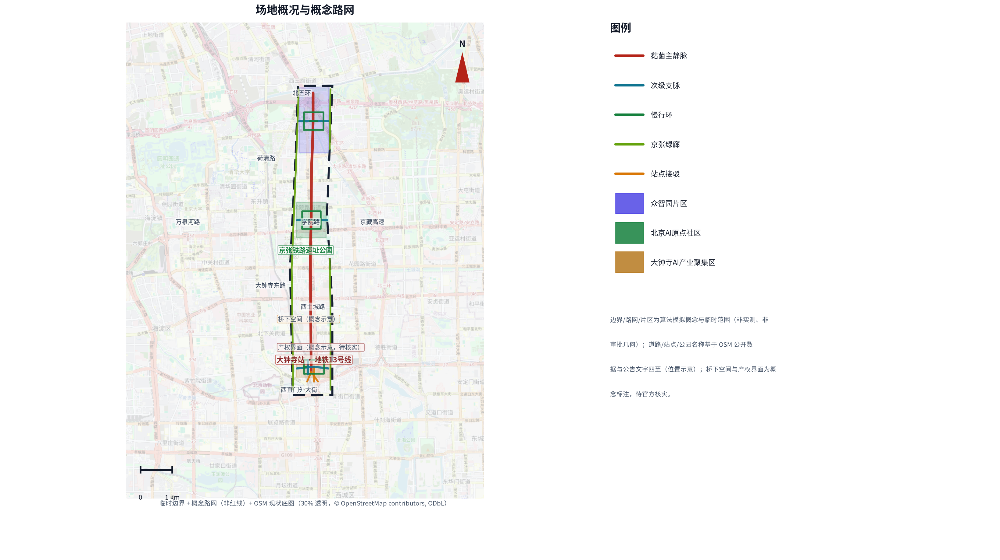
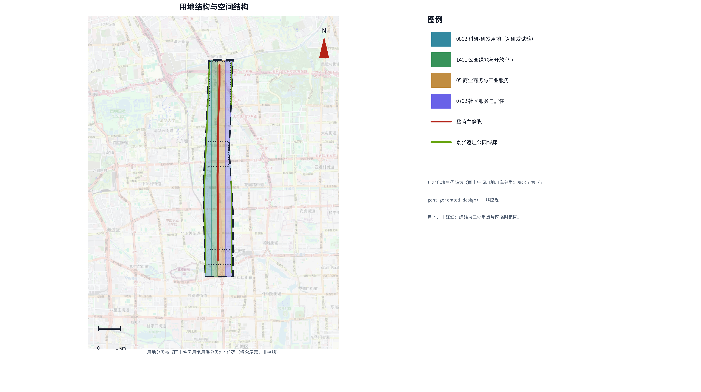
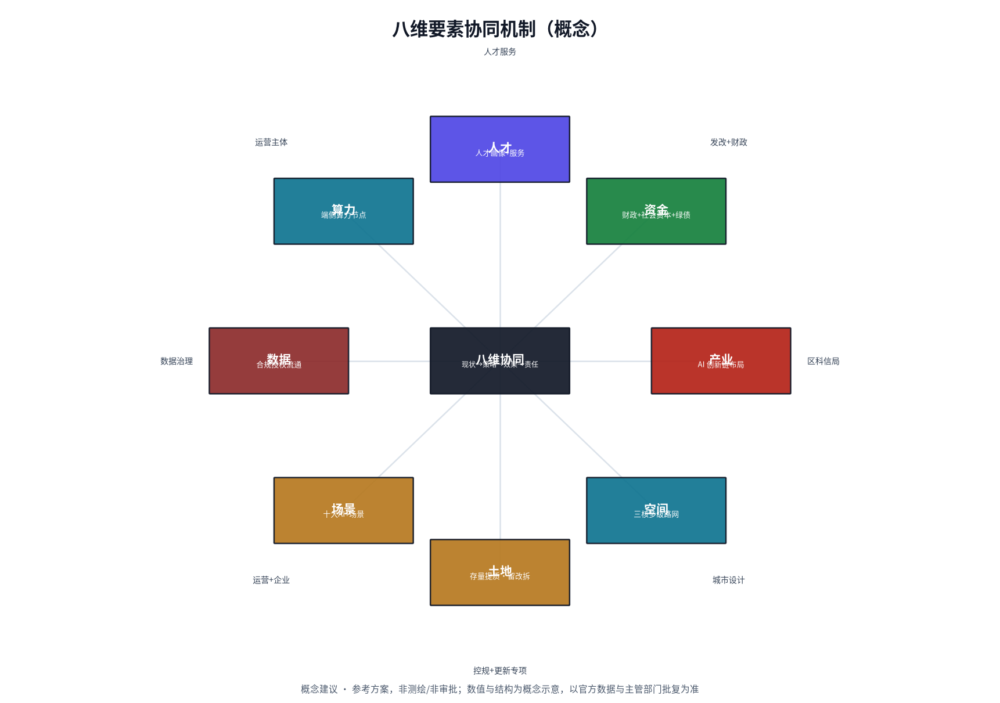
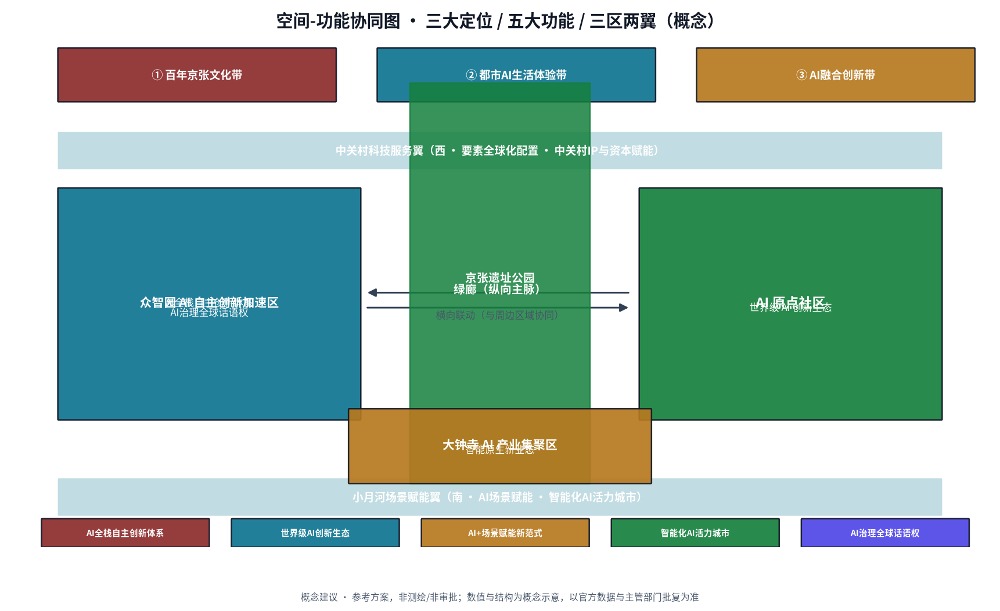
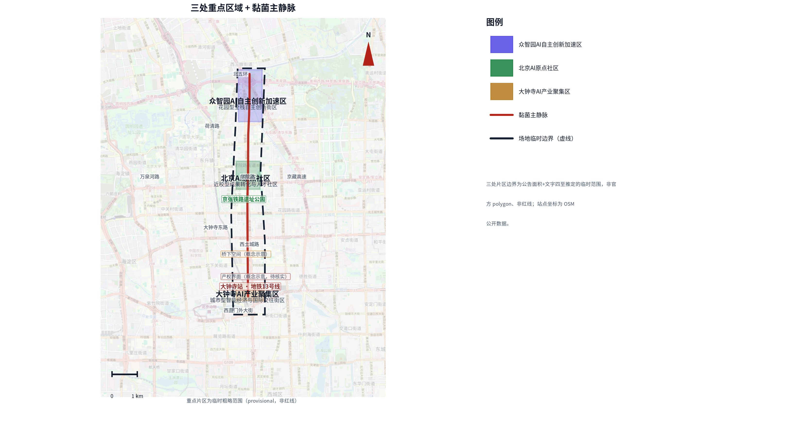
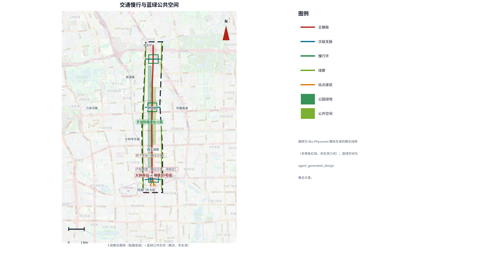
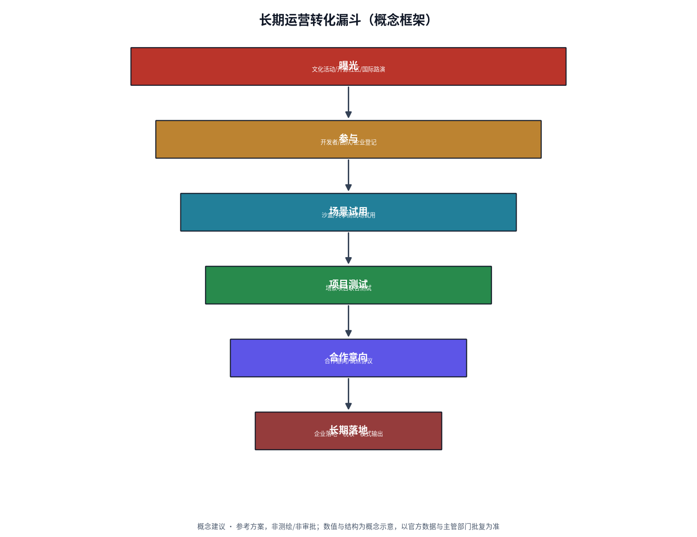
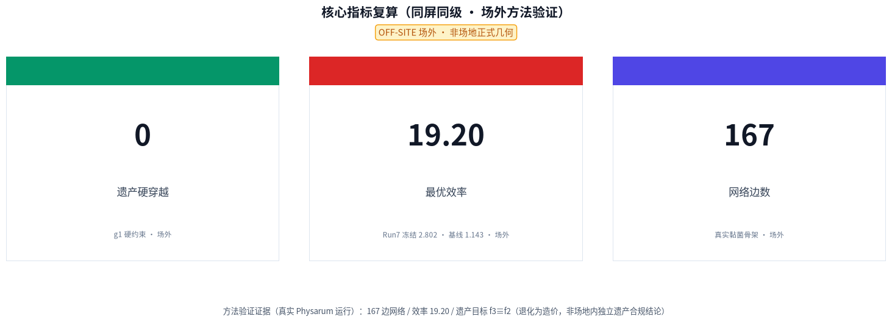

# 大钟寺片区城市更新实施方案 — 基于 Bio-Physarum 算法洞察的路网重构与空间活化

> **路网像黏菌一样生长，而非一次画死。普通路径永远先行，AI 只做可撤回、可停止、可回退的增益。**

## 执行摘要

百年京张 AI 创新带以「全球人工智能产业高地与朝圣地」为愿景，大钟寺片区是其三大重点片区之一，也是海淀中关村科学城科技创新走廊的旗舰载体。本方案不堆砌工具数量，只回答一个问题：**面对慢行断裂、遗产保护与开发矛盾、轨道站点覆盖不足三大更新问题，如何让存量路网以最低代价重新连接起来。**

核心命题只有一句：**路网像黏菌一样生长，而非一次画死。** 黏菌面对分散食物源会长出冗余少、抗毁强、总长最优的网络；大钟寺的公园、地铁站与京张铁路廊道，正是可以按同一逻辑重新连接的「养分锚点」。本方案把这一自然原理转译为「一核·三区·一界面·一衔接」的空间结构与六项更新项目（JZ-01..06），普通路径永远先行，AI 只做可撤回增益。

**方法证据（可复算，非场地正式几何）**：真实运行得 167 边骨架、最优效率 19.20（基线 1.143、Run7 冻结 2.802）、遗产硬穿越 0，均为方法验证证据，坐标偏移不作现场结论。

**治理机制（贯穿全案的唯一脊柱）**：普通路径先行 + 分级放行 G0-G3——G0 普通路径常开 / G1 本地复算 / G2 专业复核 / G3 有限现场窗口，任一级不满足即退回上一级；每级保留停止条件、可逆措施与归档回执。下文的品牌、案例、场景、画像、地标、运营与分期，全部挂在这条治理脊柱上。

**八项硬性交付（正文逐项展开）**：① 品牌命名与 Logo 识别系统（智脉共生 / Bio-Pulse Symbiosis）② 10 个全球标杆案例 ③ 10 张 AI+ 场景卡 ④ 3 个测试验证场景 + 3 个产业测试场 + 2 个公共场景（共 8 项） ⑤ 5 类人才画像 ⑥ 3 处概念地标 + 荣誉机制 ⑦ 文化叙事（双语导视 + 国际叙事）⑧ 长期运营（年度活动 + 三方共治 + 转化漏斗）。

**可实施性**：路网市政造价约 2000–3900 万元（作者概念假设，敏感性区间 ±30%，附投资口径分层）；三阶段路线图（近期试点 → 中期推进 → 长期治理，每期含可衡量里程碑与验收指标）；八类参与主体分工明确；12 项可复算指标（场地 1141.3 公顷、绿地率 12.34%、公共空间率 7.33%、建筑基底 31.1 公顷、重点区 3 处）。

**公共价值与诚实边界**：以「遗产敏感、人机共融、青年友好」为取向，落地 GB 50763-2012 无障碍阈值与海绵城市雨洪韧性；本方案为概念性研究，所有空间建议需与法定规划协调并经主管部门审批，不冒充红线或审批几何。

## 设计依据与资料清单

本方案依据《百年京张 AI 创新带城市设计征集》任务书与官方公告开展 [source:AGENT-TASKBOOK]，逐项回应七项设计任务：对标全球科创城区提出愿景、面向区域协同划定范围、锁定重点区域、给出总体设计与详细设计、落地 AI 场景、组织更新项目、建立指标体系。任务书明确「百年京张文化带 / 都市 AI 生活体验带 / AI 融合创新带」三大定位 [standard:PROJECT-AGENT-OPEN-CALL-TASKBOOK]，「AI 全栈自主创新体系 / 世界级 AI 创新生态 / AI+ 场景赋能新范式 / 智能化 AI 活力城市 / AI 治理全球话语权」五大功能与「三区两翼」协同框架；官方公告提供赛程与提交口径 [standard:PROJECT-OFFICIAL-ANNOUNCEMENT]。场地范围与图则来自场地包登记 [source:SITE-PACKAGE]，量化事实取自已处理的代理事实包 [source:PROCESSED-FACT-PACK]，完整出处与许可见结构化来源清单 [source:SOURCE-REGISTRY]。

## 品牌识别：智脉共生（Bio-Pulse Symbiosis）

本方案品牌命名为「**智脉共生**」，是对方案方法与愿景的命名转译，不构成对既有地名、商标或公共标识的正式取代，最终以官方数据与运营授权确认后定稿。英文名三层分工 [depth:overall_spatial_structure]：国际传播主选 **Centenary Jingzhang AI Innovation Belt**（对应官方项目名），备选 Haidian Open-City AI Belt；方案内部代号 **Bio-Pulse Symbiosis**（全站统一，不意译）。品牌名三层语义与本方案方法一一对应：**智（Zhi）** 指 AI 产业与黏菌「生物脉冲」式生长机制；**脉（Mài）** 指黏菌网络转译的路网层级（主静脉、支脉、慢行环、绿廊）；**共生（Symbiosis）** 指蓝绿、慢行、产业、社区在路网更新中的协同，而非单一交通工程。

**Logo 与色板（已产出，概念建议）**：Logo 以真实 Physarum 运行骨架（167 边，仅方法验证）叠加京张铁路轨道纹理，配色强调红 `#b42318` + 科技青 `#0f7490` + 生态绿 `#15803d`；矢量稿见 `assets/brand/logo.svg`（含「智脉共生」字标 + 英文名，双语），VI 色板卡与应用示意见 `assets/brand/vi_palette.png`、`vi_applications.png`。字体用思源黑体 Noto Sans SC（OFL 许可，HTML 已内嵌子集，无远程字体依赖）。Logo 与色板均为概念建议，不构成注册商标或公共标识，正式版需清权与授权。

**禁止用法**：不得将品牌名与未经授权的地名、企业标识、官方机构名称并置；不得暗示获得官方认可；不得在未清权底图上用品牌图形制造精确红线。

## 全球标杆案例借鉴（公开信息）

本方案从公开报道的全球智慧城市与交通更新实践提炼可借鉴经验，作为设计参考，不照搬其量化指标；案例事实以官方公开资料为准，量化指标标注「待核实」[depth:overall_spatial_structure]。

| 类型 | 案例 | 城市 | 核心做法（公开报道） | 对本方案的借鉴 |
| --- | --- | --- | --- | --- |
| 智慧城市 | Sidewalk Labs Quayside | 多伦多 | 传感网络、数据信托治理（2017 启动，2020 终止） | 「可解释、可退出」数据治理；警示需前置数据隐私边界 |
| 智慧城市 | Masdar City | 阿布扎比 | 低排放街区、被动降温、个人快速交通 | 低碳街区与新型接驳集成 |
| 智慧城市 | Songdo IBD | 仁川 | 全域传感、中央真空垃圾收集 | 新基建与传感一体化预留；警示需保留有机更新弹性 |
| 智慧城市 | Amsterdam Smart City | 阿姆斯特丹 | 政企民协作、living lab 试点 | 渐进式更新与多方参与治理 |
| 智慧城市 | 雄安新区 | 中国河北 | CIM 数字孪生、蓝绿网络、慢行优先 | 数字孪生底座、蓝绿慢行优先 |
| 交通更新 | 涩谷站街区更新 | 东京 | 轨道站一体化、四象限步行网络（2012–） | TOD 一体化与四象限连通 |
| 交通更新 | 超级街区 Superilles | 巴塞罗那 | 街区步行化、限速、街道公共空间化（2016–） | 街道步行化重构 |
| 交通更新 | 自行车桥网络 | 哥本哈根 | 自行车优先路网与专用桥（2006–） | 慢行优先与专用设施 |
| 交通更新 | Punggol 数字规划区 | 新加坡 | 整区数字孪生 + 开放数字平台（2018–） | 产学研一体化的数字底座 |
| 交通更新 | 清溪川复原工程 | 首尔 | 拆除高架、复原河道为蓝绿公共空间（2003–2005） | 蓝绿复原与高架拆除 |

**对标差异化愿景**：Masdar、Songdo、Sidewalk Labs Quayside 揭示同一教训——「一次性蓝图 + 全域传感」的智慧城市范式在真实存量街区既难落地、也难迭代（Quayside 2020 年终止）。本方案据此把京张铁路遗产廊道重塑为**「可计算、可迭代、可运营」的存量 AI 创新带**：以生物自适应网络为生长逻辑渐进更新而非推倒重来；以「Agent 原生 + 可复算复现」使方案可复算、可复现、可迭代（city-as-repo，作为评审与复算机制，非开放再分发授权）；以「遗产敏感、人机共融、青年友好」为公共价值取向。此为概念愿景，具体目标以控规与主管部门批复为准 [depth:overall_spatial_structure]。

## 三层范围工作框架

[depth:three_level_scope_framework] 本方案按三层范围组织，保证概念研究不越界：**研究范围**（片区及其区域协同界面）→ **设计范围**（1141.3 公顷，可复算场地边界 [data:geometry/site_boundary.geojson#SITE-001]）→ **重点区域**（3 处，深入至建筑尺度）。三层各自对应深度要求见合规矩阵，边界与数值均可复算。

[depth:existing_conditions_diagnosis] 现状诊断可用一句话概括：**养分锚点都在，连接断了。** 三个断点：其一，**慢行断裂**——京张铁路廊道把片区一分为二，铁路两侧慢行路径缺乏连续缝合，步行与骑行被迫绕行；其二，**遗产保护与开发矛盾**——京张铁路遗址作为文化遗产廊道，保护要求与高密度开发诉求存在张力；其三，**轨道站点覆盖不足**——地铁站出入口与周边街区、产业楼宇之间的最后一公里衔接薄弱。以上为定性诊断；现状断头路数量、慢行覆盖率等量化值待官方现状调查实测，本方案不预设。

## 统筹研究范围产业与未来城市研究

统筹研究范围把「养分锚点」逻辑放大到区域尺度：大钟寺片区作为海淀中关村科学城与百年京张 AI 创新带的接口，其路网更新不只是一条街的工程，而是区域创新要素重新连接的一个节点。研究范围沿五条协同线展开 [source:AGENT-TASKBOOK]——**创新要素协同**（高校、企业、算力在片区内外对接）、**交通协同**（轨道与慢行接入区域骨架）、**生态协同**（清河蓝绿廊道与区域水系贯通）、**文化协同**（京张遗产廊道与区域文化叙事衔接）、**治理协同**（分级放行与区域 AI 治理对齐）。

八维要素（土地—空间—产业—资金—人才—算力—数据—场景）在片区内以「普通路径先行、AI 只做增益」的方式形成**协同回路** [depth:overall_spatial_structure]：土地与空间承载产业，产业引入资金与人才，人才汇聚算力与数据，数据反哺场景，场景再优化空间——八维互为输入输出，任一维上线 AI 场景都须经分级放行 G0-G3，保证可撤回、可停止、可回退。五条协同线、八维要素均为概念推演，用于说明片区在区域创新网络中的定位，不虚构合作主体或已达成协议。

## 三大定位、五大功能与三区两翼协同

任务书锚定「百年京张文化带 / 都市 AI 生活体验带 / AI 融合创新带」**三大定位**，与「AI 全栈自主创新体系 / 世界级 AI 创新生态 / AI+ 场景赋能新范式 / 智能化 AI 活力城市 / AI 治理全球话语权」**五大功能** [standard:PROJECT-AGENT-OPEN-CALL-TASKBOOK]。本方案的核心概念「路网像黏菌一样生长」把三级定位转译为同一张骨架上的三类响应：文化带→遗产敏感慢行环，生活体验带→无障碍与社区场景，创新带→产业与算力节点。

**三区两翼**（任务书官方口径）中，大钟寺片区对应三区之一的大钟寺 AI 产业集聚区（智能原生新业态），与 AI 原点社区（世界级 AI 创新生态）、众智园 AI 自主创新加速区（AI 全栈自主创新体系与 AI 治理全球话语权）两区，以及中关村科技服务翼（要素全球化配置、中关村 IP 与资本赋能）、小月河场景赋能翼（AI 场景赋能与智能化 AI 活力城市）两翼，构成协同回路；「一衔接」即本方案与这一框架的接口。

**两翼支撑机制（概念推演）**：中关村科技服务翼向片区导入中关村 IP、资本与全球化要素，落地为 JZ-05 端侧算力节点与成果转化街的运营主体；小月河场景赋能翼沿小月河蓝绿廊道把 AI 场景（无人清扫、感知盲道、慢行导航）推向日常，落地为 JZ-02 清河创新界面与 T-02 雨洪韧性。两翼协同均为概念推演，不虚构合作主体或已达成协议。

**区域协同五大方向**：沿「北纬社区、未来科学城、怀柔科学城、经开区及京津冀」五条协同线接入区域创新网络——北纬社区共治慢行界面、未来科学城与怀柔科学城对接科研与算力、经开区对接智能制造与场景落地、京津冀对接要素与人才流动。均为概念推演，不虚构合作承诺。

**AI 创新生态图谱（概念）**：片区创新生态以「高校→企业→算力→资本→载体→政策」六类节点组织，土地、空间、产业、资金、人才、算力、数据、场景八维要素沿此图谱协同 [depth:overall_spatial_structure]。

## 总体设计范围城市更新与控规深度城市设计

[depth:overall_spatial_structure] 总体设计围绕一个可复算的核心概念展开：**生物自适应路网**。黏菌（Physarum polycephalum）觅食网络有三个可移植特性——**冗余最小**（总长接近最优）、**抗毁强**（局部失效仍连通）、**低穿越**（绕开不可穿越障碍）。这三条正是大钟寺路网更新缺的：现状路网冗余高、断点多、遗产穿越风险大。转译机制：把公园、地铁站、铁路廊道与产业楼宇设为「养分锚点」，把遗产保护区与不可穿越红线设为「障碍」；算法在锚点之间迭代长出「主静脉—支脉—慢行环—绿廊」四级网络。

整体空间结构为**一核·三区·一界面·一衔接**：**一核**是大钟寺 AI 产业集聚核心，**三区**与任务书「三区两翼」协同对齐，**一界面**是清河创新界面，**一衔接**是与区域协同的衔接接口。路网骨架的总体动作概括为**东西缝合、南北贯通**：东西向以慢行环与四象限连通缝合铁路两侧（JZ-01/JZ-04），南北向沿京张铁路廊道与清河界面贯通（JZ-02/JZ-06），把遗产廊道从「分割线」转为「共享带」。开发强度、建筑高度与城市风貌均按控规深度城市设计的要求给出概念建议，须与控规协调并经主管部门审批 [standard:MOHURD-CONTROL-DETAILED-PLANNING]，普通路径永远先行，AI 生成的路网只作为可撤回建议叠加其上。

## 从算法验证到空间设计：参数转译说明

本方案「路网像黏菌一样生长」不是修辞比喻，而是基于可解释的参数转译。下表逐项列明场外 Physarum + NSGA-II 仿真参数（方法验证证据）如何转化为场内概念设计决策，两类数值不混用 [depth:metrics_recalculation]：

| 算法维度 | 场外仿真参数（真实运行） | 转译规则 | 场内概念设计 | 场内决策依据（独立于算法输出） |
| --- | --- | --- | --- | --- |
| 养分锚点 | 18 个关键终端（地铁站、公园、铁路廊道、产业锚点），骨架覆盖 17/18 | 转化为轨道站点 + 高校 + 产业节点密度 | 三处重点区（PROV-KEY-001/002/003）+ 六项更新项目（JZ-01..06）锚点落位 | 基于 provisional 边界人工校准 |
| 障碍约束 | class_I=1.5 / class_IV=3.0，protection_scope=硬阻断（人工数字化遗产边界，MODEL 可信度 trust B） | 转化为道路红线、河道蓝线、文保缓冲带 | 虚线禁区层 [data:geometry/constraints.geojson#CONSTRAINTS]（合规参照，非审批几何） | 临时几何 |
| 主静脉生成 | top-10% 传导度边，167 边骨架 | 转化为轨道接驳廊道 + 产业主轴 | 主静脉 [data:geometry/roads.geojson#ROAD-001] | 概念设计 |
| 支脉渗透 | 四级网络生长（主静脉—支脉—慢行环—绿廊） | 转化为社区慢行网 + 绿廊连接 | 支脉 [data:geometry/roads.geojson#ROAD-011]（绿廊） | 概念设计 |
| 慢行环闭合 | 抗毁强（局部失效仍连通）可移植特性 | 转化为慢行环闭合 + 四象限连通 | 慢行环 [data:geometry/roads.geojson#ROAD-005] + 大钟寺站四象限连通（JZ-04） | 概念设计 |
| 网络总长 | 8813.1 m | 不直接套用；作为廊道效率参考基准 | 场内廊道长度待正式几何到位后复算 | 场外方法验证 |
| 效率指数 | 19.20（基线 1.143、Run7 冻结 2.802） | 不直接套用；作为多目标优化参考基准 | 场内多目标权衡待复算 | 场外方法验证 |
| 遗产避让 | 0 硬穿越（f3≡f2，最优骨架边未落入 class_I/class_IV 惩罚区） | 转化为「避让文保缓冲带」设计原则 | 虚线文保缓冲区 | 临时几何 |

**关键声明（场内设计独立于算法输出）**：
1. 上表「场外仿真参数」是真实 Physarum + NSGA-II 运行在测试网格上的算法输出，位于 provisional 场地西侧约 2–3 km、仅 ~140 m 交叠，非场地正式几何。
2. 场内「主静脉—支脉—慢行环—绿廊」是**基于场地条件的人工设计决策**，依据依次为：provisional 边界、大钟寺站（13 号线）与周边轨道站点、现有道路骨架与慢行断点、人口与产业锚点密度、京张铁路遗址公园已建/规划范围；算法仅提供网络形态启发与方法验证，场内线位、宽度与节点尺度由设计团队独立确定，非算法输出的直接复制粘贴。
3. 正式场地数据发布后，必须重新运行完整仿真链，用真实参数替换上述概念值，并生成「旧值—新值—变化原因」对照表。
4. 诚实边界：因组织方尚未发布正式边界、文保范围与现状测绘，本方案**尚不能形成真实场地优化效果的独立量化证明**；上述独立性为方法论与空间逻辑层面的设计决策独立，待正式数据到位后以复算结果补足。

## 重点区域详细设计

[depth:three_key_area_detailed_design] 三处重点区域分别对应三类「断点缝合」，每处给出概念平面与项目落位，不新增地块红线、权属或许可：

1. **京张遗址公园慢行断点缝合区** [data:geometry/key_areas.geojson#PROV-KEY-001]：缝合铁路两侧慢行，落位遗产敏感设计，把遗产廊道从「分割线」转为「共享带」；
2. **众智园清河创新界面区** [data:geometry/key_areas.geojson#PROV-KEY-002]：面向高校与企业服务的开放界面，让创新要素在界面上自由流动；
3. **原点社区近校成果转化街区** [data:geometry/key_areas.geojson#PROV-KEY-003]：成果转化与青年友好功能，把「养分锚点」落到人的日常动线。

**试点节点 N01 出口**（大钟寺站轨道一体化触点，概念详设）：地面集散广场 ≈960 ㎡、绿化带 ≈840 ㎡、非机动车停车 ≈264 ㎡、地铁出口 ≈168 ㎡，配无障碍坡道、连续盲道、智慧导视与模块化座椅；剖面串联「地铁站厅（-1F）→ 垂直电梯 → 地面广场（雨棚净高 4.5 m）→ 城市道路」。节点地面工程概念造价 **约 150–280 万元**（作者概念假设，2026 Q2 价格水平，敏感性区间 ±30%，不含地铁站厅改造、管线迁改与拆迁，预备费 10%；参考市政/园林/无障碍公开综合单价，非定额、非招标结果），平面/剖面见 [data:geometry/key_areas.geojson#PROV-KEY-003]，为示意图（非施工图、非审批）。

## AI 创新生态、人才画像与 AI+ 场景

AI 治理是本方案的方法论延伸，而非附加场景。**普通路径先行 + 分级放行 G0-G3**：G0 普通路径常开——步行、骑行、车行与人工服务永远可用，慢行网络不因 AI 上线而降低；G1 本地复算——算法结果须可本地复现（seed=42）；G2 专业复核——结构、无障碍、安全、许可须专业签认；G3 有限现场窗口——仅在证据齐备后进入，任一级不满足即退回上一级。每级保留停止条件、可逆措施与归档回执。

**五类人才画像** [depth:traffic_rail_slow_parking]：

| 用户画像 | 典型需求 | 空间响应 | 自检边界 |
| --- | --- | --- | --- |
| 开源开发者 | 发布、协作、测试、社区声誉 | 原点社区开源发布厅、公共代码墙、夜间协作空间 | 不采集个人行为轨迹；活动数据只做聚合统计 |
| 初创团队 | 低成本办公、算力入口、产品试验场 | 众智园共享测试场、端侧算力服务点、标准治理咨询 | 算力和数据服务需另行授权 |
| 头部企业访客 | 展示、商务、国际接待、人才招聘 | 大钟寺国际路演客厅、轨道站点接驳、重点企业周边公共空间 | 企业标识和案例须清权 |
| 周边居民 | 通勤、休闲、社区服务、低扰动更新 | 京张遗址公园慢行环、社区服务嵌入、夜间照明和活动分级 | 不将居民画像用于商业推荐 |
| 高校师生 | 成果转化、跨校协作、日常慢行 | 校区-园区慢行缝合、成果转化驿站、AI 教育体验点 | 校园数据和科研成果需授权 |

**十张 AI+ 场景卡**（每卡说明服务对象、空间位置、数据来源、隐私边界、人工复核机制与运营主体）：

| 场景卡 | 空间载体 | 设计说明 |
| --- | --- | --- |
| 01 开源发布厅 | 北京 AI 原点社区 | 面向高校、开源社区和初创团队的成果发布、代码贡献展示与小型路演 |
| 02 安全治理沙盒 | 众智园 | 把标准制定、安全评测、模型红队测试转译为可参观、可预约、可监管的协作节点 |
| 03 端侧算力驿站 | 总体设计范围节点 | 与公共服务、企业服务和低碳能源结合的新型基础设施原型（待深化） |
| 04 AI 慢行导航 | 京张遗址公园活力带 | 用可解释导视和低侵入传感识别慢行断点、拥挤节点与无障碍需求 |
| 05 大钟寺国际路演客厅 | 大钟寺 AI 产业聚集区 | 服务智能体、智能终端与内容消费企业的展示、洽谈、媒体发布与国际交流 |
| 06 清河低碳创新廊 | 众智园临清河界面 | 把绿色空间、雨洪、步行骑行和 AI 展示结合为园区公共客厅 |
| 07 近校成果转化街 | 北京 AI 原点社区 | 面向高校成果转化，组织孵化、展示、法务、知识产权和投融资服务 |
| 08 数据要素会客厅 | 大钟寺片区 | 以合规、授权、可审计为前提，展示数据要素与数字资产流通的城市服务界面 |
| 09 AI 生活服务样板街 | 社区与商业交汇处 | 将医疗、教育、法律、生活服务等 AI+ 场景落到可运营的小尺度街区 |
| 10 全球 AI 活动周路线 | 一带公共空间系统 | 形成从遗址文化、开源社区、产业展示到国际路演的可步行、可传播体验路线 |

每个 AI 场景从演示进入日常都须逐级放行（G0→G3），普通路径完整度 1.0 [metric:ai_off_path_completeness]、人工接管指派率 1.0 [metric:human_handoff_designation_rate] 为可复算的 AI-off 等价基准；数据与模型服务于空间治理与公共服务，AI 只做可撤回增益。

**场景-空间-运营映射（概念）**：十张场景卡按三区与一核落位——原点社区承载开源发布厅、成果转化街，众智园承载安全治理沙盒、清河低碳创新廊，大钟寺一核承载国际路演客厅、数据要素会客厅、生活服务样板街，京张遗址公园承载 AI 慢行导航，一带公共空间承载全球 AI 活动周路线。每个场景的空间载体、运营主体与停止条件在「更新项目清单」与分级放行中逐项标注，不声称已签约运营主体。

## 测试验证场景（分级放行的落地检验）

为把概念方案推进到可验证阶段，本方案提出 **3 个测试验证场景 + 3 个产业测试场 + 2 个公共场景（共 8 项，与 simulation.json 的 test_scenarios 一致）**，均基于真实站点/河道/社区/园区对象，检验依据为现行国家标准与公开技术指南；场景为「建议执行」性质，待官方数据到位后正式执行，本节不声称已完成验证 [depth:metrics_recalculation] [depth:traffic_rail_slow_parking]。

| 场景 | 验证对象 | 检验依据（真实） | 关键指标与目标 | 验证方法 |
| --- | --- | --- | --- | --- |
| T-01 大钟寺站 TOD 换乘 | 大钟寺站（13 号线）四象限步行连通与轨道接驳 | GB 50763-2012《无障碍设计规范》、GB/T 51328-2018 | 换乘流线全程无障碍；接驳轴与概念主静脉对齐（ROAD-001） | 步行可达性网络分析 + 无障碍接驳流线核查（待官方站点 CAD/红线） |
| T-02 小月河雨洪韧性 | 小月河沿线蓝绿廊道与透水铺装 | 《海绵城市建设技术指南》、GB 50014 | 推荐方案 Plan03：透水铺装率 69.1%、绿色渗透率 25.2%（待官方复核） | 汇水区径流系数核算 + 透水率复核（待河道蓝线与管网数据） |
| T-03 AI 原点社区可达性 | 原点社区校区-园区-街区慢行缝合 | GB 50763-2012《无障碍设计规范》 | 三处重点区慢行环覆盖社区服务与成果转化节点 | 慢行网络连通度与无障碍连续性核查（待现状路网与权属） |

每个测试场景按「触发条件 → 测试步骤 → 预期结果 → 通过标准」四要素执行；「通过标准」中的具体数值均不预设，待官方数据与控规目标确定后再设定，避免虚构验收阈值。

**3 个产业测试场**（对应三处重点片区的真实 AI+ 场景切口）：

| 场景 | 物理空间 | 数据输入/输出 | 人工复核机制 | 验收指标 |
| --- | --- | --- | --- | --- |
| 边缘算力感知盲道 | 京张绿廊 | 入：触觉铺装状态/坡度/障碍；出：盲道连续性与破损告警 | 网格员定期现场复核 + 视障用户反馈 | 盲道连续性达标、告警处置闭环 |
| 无人清扫与物流走廊 | 众智园 | 入：园区路况/时段；出：清扫与物流路径调度 | 现场安全员 + 异常人工接管 | 清扫覆盖率、物流时效、安全事件零重大 |
| 视觉识别违占治理 | 大钟寺商业街区 | 入：公共空间占用图像；出：违占告警与处置工单 | 人工复核告警后再派单 + 申诉纠错 | 违占发现率、误报率、处置闭环率 |

**2 个公共场景**（对应场景卡 04/10 的公共体验切口）：

| 场景 | 物理空间 | 数据输入/输出 | 人工复核机制 | 验收指标 |
| --- | --- | --- | --- | --- |
| AI 慢行导航 | 京张遗址公园活力带 | 入：慢行断点/拥挤/无障碍需求；出：可解释导视与路径建议 | 人工核实导视建议 + 无障碍需求人工确认 | 慢行断点识别、导视可解释、无障碍响应 |
| 文化导视与遗产智能导览 | 京张遗址廊道 | 入：遗产点位与导览内容；出：双语/盲文/二维码导览 | 内容人工审校 + 遗产部门复核 | 导览准确率、无障碍导览覆盖、版权清权 |

所有测试场与公共场景（共 8 项）的数据流统一遵循**视觉识别隐私八条**：① **不识别**——不采集人脸、车牌等可识别个人信息，仅做区域级占用与可达性判读；② **最小采集**——仅采集判读所必需的图像与运行数据，不越界、不旁路；③ **边缘处理**——图像仅在边缘侧处理，原始图像不出园区、不上云、不归档；④ **保存删除**——明确保留期限，超期自动删除，仅留存区域级统计结果；⑤ **权限审计**——数据访问按最小权限授权，操作全程留痕可审计；⑥ **人工复核**——违占/障碍告警先经人工复核再派单，机器结果不作最终处置依据；⑦ **申诉纠错**——公众可经申诉通道要求删除误判记录、更正结论；⑧ **停用条件**——隐私风险触发即停用该场景并退回 G0 普通路径。清单登记于 `simulation.json` 的 `test_scenarios` 字段（计数 `test_scenario_count`），本节不声称已完成部署或验证。

## 用地、建筑规模与拆改留方案

**用地布局** [depth:land_use_layout]：按现行用地分类指南组织 [standard:MNR-LAND-USE-CLASSIFICATION-GUIDE]，分类图则见 [data:geometry/land_use.geojson#LU-001]，以「养分锚点」为骨架串联产业、居住与公共服务用地。

**建筑规模与拆改留**：建筑基底 31.1 公顷 [data:geometry/buildings.geojson#BLDG-001]，按现状分类提出**保留—改造—拆除**方案 [depth:retain_renovate_demolish]：现状质量好、功能适配的建筑保留并活化；与路网骨架冲突的建筑改造退让；少量低效建筑拆除为慢行与公共空间让路。**开发强度**仅作概念建议 [depth:development_intensity_controls]，须与控规协调 [standard:MOHURD-CONTROL-DETAILED-PLANNING]，并符合城市设计管理要求 [standard:MOHURD-URBAN-DESIGN-MEASURES]，建筑高度与容积率不预设数值、待官方核定。

## 交通、轨道、市政与公共服务设施

**交通**：轨道、铁路、慢行与停车四位一体 [depth:traffic_rail_slow_parking]，关键路段见道路图则 [data:geometry/roads.geojson#ROAD-001]（主静脉）、[data:geometry/roads.geojson#ROAD-005]（慢行环）、[data:geometry/roads.geojson#ROAD-011]（绿廊）。慢行系统按「主静脉—支脉—慢行环—绿廊」四级缝合断点，大钟寺站四象限步行连通是近期关键动作。

**市政与公共服务设施**：新型市政基础设施与端侧算力节点纳入骨架 [depth:municipal_new_infrastructure]，AI 公共服务节点沿慢行环布置，与道路工程同步实施、分期交付。

## 蓝绿空间、公共空间与城市风貌

[depth:blue_green_public_space] 以「蓝绿慢行复合环」串联绿地与公共空间：绿地 [data:geometry/green_space.geojson#GREEN-001] 与公共空间 [data:geometry/public_space.geojson#PUBLIC-001] 共同构成慢行网络的可达基底，绿地率与公共空间率见「指标体系」。海绵城市雨洪韧性与无障碍同构，覆盖五类人群；城市风貌以「遗产敏感、人机共融、青年友好」为取向，京张遗产廊道沿线保持低冲击、可辨识的历史界面，蓝绿慢行环沿线控制街道尺度与界面连续度，让自然网络与人文脉络在同一套路网骨架上一同生长。

## 无障碍与包容性设计（GB 50763-2012）

响应 1.3.3「打造全球 AI 创新人才向往的高品质城区」，本方案把无障碍作为公共空间的**硬约束而非附加项**。以 GB 50763-2012《无障碍设计规范》为基线：连续盲道、缘石坡道、无障碍坡道、无障碍电梯与低位服务设施沿慢行环与三处重点区全程覆盖；T-01 换乘流线、T-03 社区可达性均以「全程无障碍」为通过标准。

**五类人群无障碍响应（同构）**：开源开发者→代码墙与发布厅的轮椅可达与视障导览；初创团队→算力驿站的语音与触觉交互；头部企业访客→路演客厅的听障同步字幕与无障碍席位；周边居民→慢行环的老年友好坡道与休息座椅（间距 ≤100 m）；高校师生→成果转化街的无障碍接驳与连续盲道。五类响应与「遗产敏感、人机共融、青年友好」取向同构，AI 场景不得以任何方式降低普通路径的无障碍可用性。

**无障碍与蓝绿、慢行同构**：盲道、坡道与蓝绿慢行环一体设计，雨洪韧性铺装同时满足防滑与轮椅通行；无障碍达标率（→100%）进入运营 KPI，JZ-01 慢行断点缝合以「无障碍达标（GB 50763-2012）」为验收指标、以「桥下空间权属无法落定」为停止条件。具体阈值不预设，待官方现状调查与控规目标确定后设定。

## 地标、组件系统与荣誉机制

**三处概念性地标**（非正式命名或法定地标）[depth:three_key_area_detailed_design]：

| 地标 | 主题 | 设计说明 |
| --- | --- | --- |
| 大钟寺数字钟楼 | 遗产展示 | 以数字展陈回放大钟寺文化遗产，作为遗产展示与导览起点；不新建实体建筑，避免与文保单位并置误导 |
| 京张轨道记忆廊 | 文化节点 | 沿京张铁路遗址组织轨道文化叙事，作为慢行环的文化锚点 |
| 黏菌广场 | 科学艺术装置 | 以黏菌网络为母题的可交互公共装置，向公众传播「自适应网络」方法 |

**组件系统（标准化设计说明，概念建议）**：导视牌（双语/盲文/二维码三合一）、座椅（模块化、间距 ≤100 m）、照明（夜间分级、低眩光）、绿化模块（海绵渗透、乔灌草结合）。**荣誉机制**：「京张更新贡献者」数字徽章，面向开源贡献、社区共建与公众参与，以可验证、不采集敏感个人信息的机制发放；为概念建议，非官方荣誉体系。

## 文化导视、国际叙事、年度活动与长期运营

**文化导视**：双语标识系统（中/英 + 盲文 + 二维码），二维码仅链接本地方案说明，不加载远程脚本、不追踪行为。

**国际叙事与国际传播机制**：面向国际评审的 300 字英文 elevator pitch 见 `proposal.en.md` 对应章节（Bio-Pulse Symbiosis — a bio-inspired adaptive-network method for renewing a heritage-sensitive rail-corridor into an AI innovation belt；概念路网由 Physarum + NSGA-II 作为场地外方法验证生成，非法定规划）。国际传播以三条可验证通道落地：① 全站双语（proposal.md / proposal.en.md 同步，品牌、场景卡、地标、运营术语统一、不意译）；② 全球 AI 活动周路线把遗址文化、开源社区、产业展示、国际路演串成可步行传播体验；③ 「智脉共生」作为方案内部代号而非官方品牌，避免与国际地名或商标并置误导。分级放行 G0-G3 作为可复算、可停止、可回退的 AI 治理机制，是本方案对「AI 治理全球话语权」的落点——把治理口号转为可验证的停止条件。

**年度活动框架（建议性）**：年度开发者大会（1 次/年，路演与发布）、季度场景开放日（4 次/年，面向开发者/高校/公众）、月度社区工作坊（12 次/年，共建共议）；另设「京张铁路文化节」与「黏菌算法公开工作坊」。频率、规模与预算为建议性，无既有主办方或日期承诺。

**长期运营机制**：三方共治模型（政府 + 企业 + 社区），决策机制为「共识 + 专家顾问」；资金来源框架为建议性（财政 + 更新专项资金 + 社会资本 + 绿色债券，待确认）。本方案不声称已建立治理主体或锁定资金来源。

**开发者社区运营机制（概念）**：以「city-as-repo」为底座，可复算复现贯穿方案全生命周期——设计文件、复算脚本、场景卡与验收清单在评审仓库内可读、可复算（非开放再分发授权），开发者可提交 Issue 复算、贡献场景、审校数据；「京张更新贡献者」数字徽章以可验证、不采集敏感个人信息的方式激励协作贡献与社区共建；年度开发者大会、季度场景开放日、月度社区工作坊为开发者提供发布、路演与协作节点。社区运营为概念机制，不声称已建立社区或锁定运营主体。

**运营 KPI（可度量口径，量化基线待运营后确定）**：慢行断点连通率（↑，%）、无障碍达标率（→100%）、场景响应时间（↓，分钟）、人工兜底率（↑，%）、企业落地数（↑，家）、税收增量（↑，亿元/年）、活动参与率（↑，%）。以上为可度量、可复核的指标口径，具体目标值待运营基线确定后设定，本方案不预设数值。

**转化漏斗（概念框架）**：曝光 → 参与 → 场景试用 → 项目测试 → 合作意向 → 长期落地，每级转化率为概念示意（非实测）。

## 更新项目清单、实施政策与分期计划

[depth:renewal_project_list] 六项更新项目贯穿「断点缝合」主线，每项补全项目管理 9 字段（责任主体类型、前置条件、阶段、风险、可逆措施、验收指标、停止条件）：

| 项目 | 责任主体类型 | 前置条件 | 风险 | 可逆措施 | 验收指标 | 停止条件 |
| --- | --- | --- | --- | --- | --- | --- |
| JZ-01 慢行断点缝合 | 区交通委 + 公园管理单位 | 道路红线、桥下空间许可、交通复核 | 权属争议、政策变动 | 临时连接设施可拆除，恢复原状 | 慢行连通 + 无障碍达标（GB 50763-2012） | 桥下空间权属无法落定即暂停 |
| JZ-02 清河创新界面 | 区水务局 + 园区 | 河道蓝线、防洪评价、生态许可 | 防洪条件、资金超支 | 滨水设施可拆除，保留原始驳岸 | 蓝绿连通 + 雨洪韧性达标 | 防洪条件不满足即退出 |
| JZ-03 近校成果转化街 | 区科信局 + 高校 | 校区边界、权属、首层业态审批 | 权属争议、遗产争议 | 首层业态可恢复，不改变建筑结构 | 转化空间启用 + 首层清权 | 权属争议未决即暂停 |
| JZ-04 大钟寺站四象限连通 | 轨道运营单位 + 政府 | 站点一体化方案、管线迁改、消防审查 | 审批不确定、管线冲突 | 分象限渐进实施，未实施象限保留现状 | 四象限连通 + 无障碍换乘 | 站点改造时序不匹配即顺延 |
| JZ-05 端侧算力节点 | 社会资本 + 区科信局 | 能源、算力、安全、运营主体确认 | 技术失效、安全合规 | 算力设备可拆除，空间恢复公共用途 | 算力开放 + 安全审计通过 | 运营主体缺位即退出 |
| JZ-06 黏菌路网深化复算 | 政府 + 高校（设计方） | 官方边界、道路红线、真实坐标对齐 | 官方数据长期缺失 | 不落地为工程，保持研究口径 | 官方数据到位后全量复算 | 官方数据长期未发布即保持「待确认」 |

[depth:phasing_implementation] **分期与实施政策（概念示意性分期框架）**：近期**试点**（0–2 年：JZ-01 断点缝合 + JZ-04 四象限连通）→ 中期**推进**（2–5 年：JZ-02 创新界面 + JZ-03 成果转化街）→ 长期**治理**（5–10 年：JZ-05 算力节点 + JZ-06 复算），三阶段每期含**可衡量**里程碑与**验收指标**；上述周期为概念示意，具体时序与投资安排待官方控规批复及年度投资计划确定后调整。

| 分期 | 周期（建议） | 项目 | 关键里程碑（可度量） | 验收指标（可度量） |
| --- | --- | --- | --- | --- |
| 近期 | 0–2 年 | JZ-01 / JZ-04 | 完成 N01 节点试点 + 首批断点缝合 + 四象限连通 | 试点地面工程 约 150–280 万元（作者概念假设，敏感性区间 ±30%）；无障碍达标；四象限连通 |
| 中期 | 2–5 年 | JZ-02 / JZ-03 | 蓝绿廊道连通 + 成果转化街启用 | 雨洪韧性达标；转化空间启用 + 首层清权 |
| 长期 | 5–10 年 | JZ-05 / JZ-06 | 算力节点开放 + 官方数据到位后全量复算 | 算力服务开放 + 安全审计通过；复算更新图层 |

路网市政造价 约 2000–3900 万元（作者概念假设，2026 Q2 价格水平，敏感性区间 ±30%，不含征地、管线迁改与轨道土建，预备费 10%；附投资口径分层；单价为公开综合单价参考级、非定额、非招标结果）[source:COST-ESTIMATE-PLAN03]，计价依据参照官方《预算消耗量标准》（消耗量标准、不含单价）[source:COST-UNIT-BEIJING-001]，由土地增值、税收增量与就业带动构成经济可行性示意。**八类参与主体**：区政府及规自分局（规划条件与控规协调）、轨道运营单位（JZ-04 协同）、周边高校（JZ-03 权属与首层业态）、片区企业（JZ-05 共建运营）、周边居民与社区（公示沟通与配合）、遗产与文物部门（影响评估与最小干预）、京张遗址公园管理单位（JZ-01 边界协调）、开发建设主体（立项融资建设运营）；实施层责任署名（A/R/C/I 实名）待项目立项后由主管部门、运营主体与公众代表共同签署确认，不虚构访谈结论或合作承诺。

**参与主体与治理责任（两层）**：更新项目层——六项更新项目（JZ-01..06）已逐项明确责任主体类型（见更新项目清单表）；AI 场景治理层——已建立「五角色 × 四闸门」RACI 责任矩阵（见下表），每闸门至少一个问责主体（A）。

| 治理闸门 | 场景所有者/开发企业 | 技术与安全独立评测组 | 公众与无障碍代表（享否决权） | 公共价值委员会/运营秘书处 | 空间/文保/交通规划专家组 |
| --- | --- | --- | --- | --- | --- |
| G0 普通路径常开 | R | I | I | A | I |
| G1 本地复算 | R | A | I | C | C |
| G2 专业复核 | R | C | C | C | A |
| G3 有限现场窗口 | R | C | C | A | C |

> R（Responsible）执行、A（Accountable）问责、C（Consulted）咨询、I（Informed）知会。G3 有限现场窗口由公共价值委员会/运营秘书处单一问责（A），公众与无障碍代表持咨询权（C）并保留事实否决权。该矩阵为概念方案阶段的治理框架，正式签署待项目立项后完成。

## 指标体系、面积复算与合规矩阵

[depth:metrics_recalculation] 以下指标分两类、均可经 `self_check_submission.py` 复算并与合规矩阵对齐：**场内设计指标**（源自提交几何，用于设计讨论，非审批几何）与**场外方法验证指标**（源自真实 Physarum + NSGA-II 运行，坐标偏移、仅方法验证，非场地正式几何）。两类不混用。

**场内设计指标**（提交几何复算）：

| 指标 | 值 | 证据标记 |
| --- | --- | --- |
| 场地面积 | 1141.3 公顷 | [metric:site_area_sqm] |
| 建筑基底 | 31.1 公顷 | [metric:building_footprint_area_sqm] |
| 绿地率 | 12.34% | [metric:green_ratio] |
| 公共空间率 | 7.33% | [metric:public_space_ratio] |
| 重点区数量 | 3 | [metric:key_area_count] |
| 更新项目数 | 6（JZ-01..06） | 更新项目清单 |
| AI 测试场景数 | 8（3 验证 + 3 产业 + 2 公共） | [metric:test_scenario_count] |
| 普通路径完整度 | 1.0 | [metric:ai_off_path_completeness] |
| 人工接管指派率 | 1.0 | [metric:human_handoff_designation_rate] |

**场外方法验证指标**（真实运行，坐标偏移约 2–3 公里、仅 ~140 m 交叠，非场地正式几何）：

| 指标 | 值 | 证据标记 |
| --- | --- | --- |
| 黏菌网络边数 | 167 | [metric:physarum_network_edge_count] |
| 最优效率指数 | 19.20 | [metric:physarum_efficiency_index] |
| 基线效率 | 1.143 | [metric:physarum_baseline_efficiency] |
| Run7 冻结目标 | 2.802 | [metric:physarum_run7_frozen_objective] |
| 遗产硬穿越 | 0 | [metric:physarum_heritage_crossing_count] |
| 推荐方案 UDS | 80.34 | [metric:physarum_recommended_plan_uds] |
| 骨架总长 | 8813.1 m | simulation.json |

上述场外指标源自作者真实 Physarum + NSGA-II 运行，仅作方法验证证据，不进入场内设计指标与正式几何；「0 硬穿越」是 g1 硬约束行为而非独立场地遗产合规结论（遗产目标 f3 在本机人工数字化边界下退化为 f2，f3≡f2）。测试情景 8 项。

## 风险、版权与合规说明

[depth:risk_missing_data] 本方案诚实标注**边界**，五类数据缺口均不预设数值：① 正式边界/重点区边界/道路红线/权属/市政管线/轨道站点 CAD/河道蓝线/防洪条件/正式文保范围/容积率与建筑高度控制等官方几何与规划条件待组织方提供；② 正式文保几何及 heritage_factor 缺失，方法验证中遗产目标 f3≡f2，「遗产硬穿越 0」不作场地文保合规结论；③ 现状断头路、慢行覆盖率、客流、无障碍障碍点、雨洪汇水、权属冲突与运营数据待官方现状调查实测；④ 全部场景处于 proposed 状态，AI-off 服务等价差 [metric:ai_off_service_equivalence_gap] 尚未经 G3 有限现场窗口验证（暂标 unknown）；⑤ 来源登记以提交包 sources.json 为准，第三方材料许可均已登记。上述缺口纳入 R-01..06 **风险**矩阵——数据缺口、遗产敏感、审批边界、AI 依赖、无障碍可达、经济不确定性逐项列明缓解措施与停止条件；**约束与红线** [data:geometry/constraints.geojson#CONSTRAINTS] 仅作合规参照，不冒充审批几何。

**版权**：方案文本与图面基于提交包内自产资产，方法文献仅作方法引用并附 DOI，不转移外部案例绩效；**权利分层**——自有文本/图面/字体/品牌为原创，第三方材料（OSM ODbL、Leaflet BSD-2-Clause、Noto Sans SC SIL OFL 1.1）仅本地内嵌或引用、不改变其许可；提交包整体许可 COMMUNITY-DISPLAY-ONLY（限展示与评审，不授予再分发）。**合规与授权**：所有空间建议需与法定规划协调并经主管部门**授权**审批，本方案不声称已获批；**公开**资料边界、**隐私**与**复核**流程均已标注，普通路径不因任何 AI 场景上线而降低可用性。

## 参考资料

- brief/public-brief.md
- brief/site-package/design_brief.json
- brief/site-package/allowed_design_space.json
- brief/site-package/enums/
- brief/site-package/ranges/planning_limits.json
- data/processed/agent_fact_pack.md
- Tero A., Takagi S., Saigusa T., et al. Rules for biologically inspired adaptive network design. *Science*, 327(5964): 439–442, 2010. https://doi.org/10.1126/science.1177894
- Deb K., Pratap A., Agarwal S., Meyarivan T. A fast and elitist multiobjective genetic algorithm: NSGA-II. *IEEE Transactions on Evolutionary Computation*, 6(2): 182–197, 2002. https://doi.org/10.1109/4235.996017
- 本节书目入口依据场地包登记，完整出处和许可见结构化来源清单 [source:SITE-PACKAGE]
