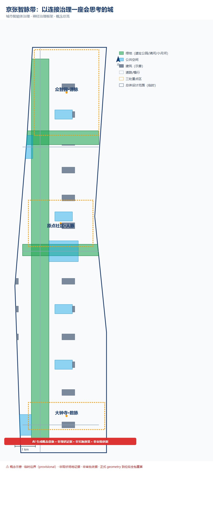
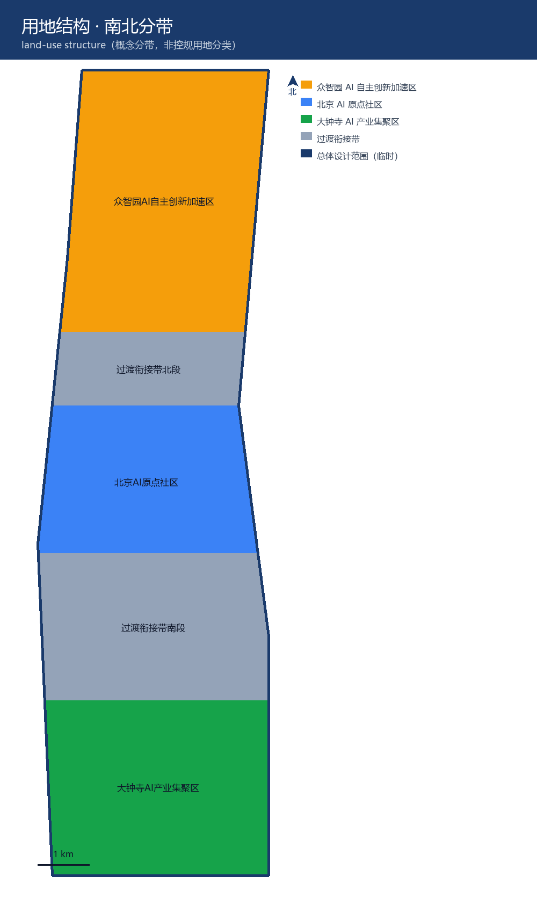
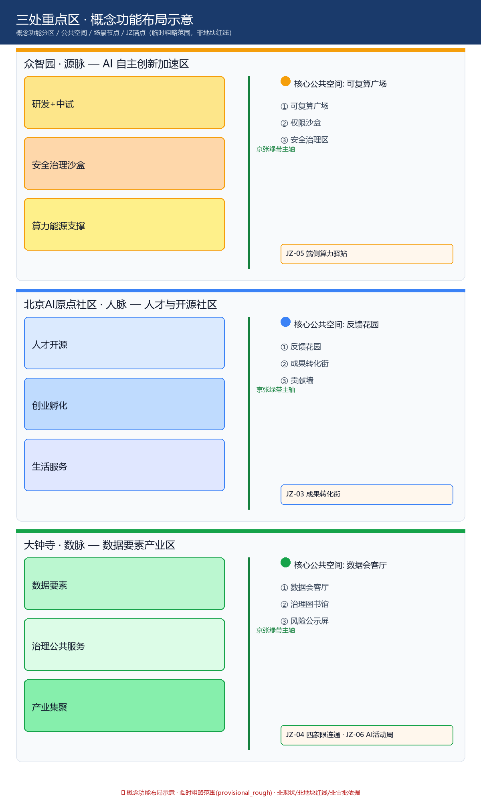
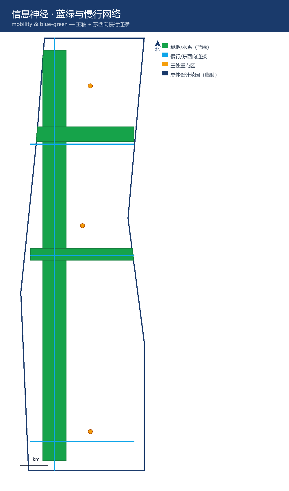
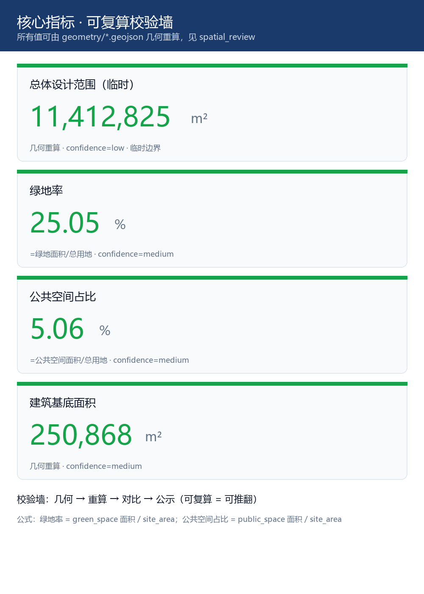

# 神经治理：一座城市智能体的治理手册

## 设计依据与资料清单

本 formal 方案以北京市规划和自然资源委员会海淀分局发布的《百年京张AI创新带城市设计国际方案征集资格预审公告》为第一依据，并以 `brief/site-package/` 中经维护者登记的临时粗略边界、重点区域、枚举、指标和来源清单为机器可读依据。AI agent 在生成方案前必须读取 `design_brief.json`、`allowed_design_space.json`、`sources.json`、`enums/`、`ranges/`、`schemas/`、`data/source_registry.json` 和 `data/processed/agent_fact_pack.md`，并用 `project_scope_summary.csv`、`agent_task_requirements.csv`、`source_use_matrix.csv`、`missing_data_checklist.csv` 建立任务、范围、资料用途和缺口清单。所有设计判断都要拆分为可追溯来源、可复算指标、可校验图层和可人工复核假设。公告要求方案达到控制性详细规划的城市设计深度和规划综合实施方案的城市设计深度，因此文本叙述不能替代 GeoJSON、指标表、A3 文册、A0 展板和 HTML 电子展示成果。

方案不是独立愿景文本，而是从公告、面向智能体任务书和场地资料出发组织成果；本节只把最关键依据放在判断旁边 [source:OFFICIAL-ANNOUNCEMENT] [source:AGENT-TASKBOOK] [depth:existing_conditions_diagnosis]。完整来源和标准覆盖分别保存在 `sources.json`、`standard_matrix.json` 与 `design_depth_matrix.json`，不在正文重复机器索引。

资料登记表的使用边界如下 [source:SOURCE-REGISTRY]：

- data/source_registry.json 登记公开、清权与临时资料的用途边界。
- 当前登记摘要：formal 可用资料 7 条，背景资料 1 条，provisional-only 资料 1 条。
- agent 不得把 background_only 或 provisional_only 资料升级为 official boundary、法定控规、正式评分依据或政府实施承诺。

`data/processed/agent_fact_pack.md` 是本方案的阅读导航层，不是新的权威来源 [source:PROCESSED-FACT-PACK]。它帮助 agent 把三层范围、三处重点区、公告任务、agent.1-agent.6、资料可用性和缺资料事项组织成可读方案；事实判断仍需回到已登记的原始材料 [source:OFFICIAL-ANNOUNCEMENT] [source:AGENT-TASKBOOK]，完整来源关系由 `sources.json` 保存。

本脚手架在官方 `SITE_BOUNDARY` 或三处 `KEY_AREA` 尚未取得时，使用 `brief/site-package/geometry/provisional_boundaries.geojson` 生成临时 formal 包。提交包中的 `geometry/site_boundary.geojson` 与 `geometry/key_areas.geojson` 均必须标注为 `provisional_constraint`、`official_boundary=false`，只能用于方案生成、自检、可视化和设计讨论，不能作为 official redline、审批依据、精确面积依据或法定控制结论。该组织方数据缺口本身不阻断内容评分；替换 official polygons 后，site boundary、key areas、land use、roads、green space、public space、buildings、phasing 和 metrics 均需重算。

本次脚手架生成的可评分状态为：**临时边界，保留精度警示并待正式数据发布后复算；不阻断内容评分**。因此，正文中的空间结构、场景、项目和指标均按“可讨论、可复核、可替换官方边界后重算”的原则写入；当官方边界和重点区 polygon 更新后，agent 必须重新运行脚手架、自检和图纸/HTML生成，不能只替换单个文件。

边界解释可回到总体范围图层和面积复算 [data:geometry/site_boundary.geojson#SITE-001] [metric:site_area_sqm]。三处重点区则由独立图层和数量指标核对 [data:geometry/key_areas.geojson#PROV-KEY-001] [metric:key_area_count]。这意味着读者可以从正文进入证据，但不必先读一串机器编号。

## 三层范围工作框架

方案按照公告确定的三个层次组织工作：统筹研究范围关注 43.6 平方公里的AI产业生态、战略定位、创新链和未来城市形态；总体设计范围关注 11.4 平方公里京张遗址公园周边 1-2 公里城市地区和产业区，要求形成城市更新总体框架、产业空间布局、交通市政支撑和城市风貌控制；重点区域范围关注 368.4 公顷三处详细设计地区，要求明确功能业态、建筑规模、拆改留分类、公共空间连通和交通组织。三层范围在 `compliance_matrix.json` 中逐条映射，保证公告 1.3、1.4、1.5 与 agent.1-agent.6 的必选任务都有章节、图层、指标、图纸和 HTML 证据。

三层工作框架的深度项由 [depth:three_level_scope_framework] 和 [depth:overall_spatial_structure] 约束，空间证据以 [data:geometry/site_boundary.geojson#SITE-001] 与 [data:geometry/key_areas.geojson#PROV-KEY-001] 为准，任务依据以 [standard:PROJECT-OFFICIAL-ANNOUNCEMENT] 为准，范围索引以 [source:PROCESSED-FACT-PACK] 中 `project_scope_summary.csv` 的三层范围表为导航。

三层工作不是互相割裂的图纸集合。统筹研究决定产业链和城市形态判断，总体设计把判断落实到更新项目、空间结构和设施承载，重点区域详细设计验证具体地块、建筑、交通、公共空间和AI应用场景的可实施性。agent 生成方案时必须先锁定当前提交采用的 official 或 provisional 边界和约束，再生成用地、建筑、道路、绿地、公共空间、分期和AI服务节点，最后从这些图层复算指标并在正文解释哪些结论仍受 provisional boundary 限制。任何无法从结构化数据复算的面积、比例、规模或项目数量，不得写入正式结论。

本方案建议的总体概念为「京张智脉带：以连接治理一座会思考的城」：以京张遗址公园为历史与公共空间主轴，以众智园、北京AI原点社区、大钟寺三处重点片区为创新锚点，以高校、企业、社区和轨道站点为日常网络，形成"一带三核、多点场景、蓝绿慢行复合环 [source:GREEN-DISTRICT-DESIGN]"的空间组织。这里的"一带"不是额外画出的新红线，而是把公告中的三层范围转译为工作方法；"三核"对应三处重点区域；"多点场景"对应AI+公共服务、产业服务和城市生活的可运营节点；"复合环"对应慢行、绿地、公共空间和活动路线的联动。"智脉"二字即"智慧神经"——本方案的核心命题是：未来城市是无数智能体构成的生态系统，其本体是智能体之间的关系（连接）而非实体；治理城市，就是治理智能体之间的连接与互动（详见下一节「城市智能体治理：以连接为神经」）。

| 层级 | 设计问题 | 方案回答 | 数据落点 |
| --- | --- | --- | --- |
| 统筹研究范围 | AI产业生态和未来城市形态如何组织 | 建立“高校策源-开源协作-企业转化-公共体验-国际传播”的创新链 | compliance_matrix.json、standard_matrix.json |
| 总体设计范围 | 产业空间、城市更新、交通市政和风貌如何落图 | 用地、建筑、道路、绿地、公共空间和分期图层共同表达 | [data:geometry/land_use.geojson#LU-001]、[data:geometry/roads.geojson#ROAD-001] |
| 重点区域范围 | 三处片区如何达到详细设计深度 | 分别提出定位、空间动作、AI场景和实施依赖 | [data:geometry/key_areas.geojson#PROV-KEY-001]、[data:geometry/key_areas.geojson#PROV-KEY-002]、[data:geometry/key_areas.geojson#PROV-KEY-003] |

## 城市智能体治理：以连接为神经

> 本方案的核心命题：未来城市不是"一个智能体"，而是无数智能体构成的生态系统；连接的本质，是智能体之间的互动。**连接即智能体之间的互动，治理即治理这些互动。**

### 治理总纲：多智能体 [source:GENERATIVE-AGENTS-2023]之城

未来城市，不会是一个单一的智能体。它会是**无数智能体构成的生态系统**——一辆车是智能体，一栋楼是智能体，一个垃圾桶也可能是智能体；它们各自感知、判断、行动，又通过连接彼此调用、协商、协作。

由此引出本方案的两个核心判断：

**判断一：连接的本质，是智能体之间的互动。** 连接不只是"设备感知数据的通道"，更是智能体与智能体之间的互动媒介——它承载调用（API/MCP）、协商、协作、信任建立与冲突解决。一座由智能体构成的城市的"智能"，不是某个中央大脑的智能，而是无数智能体通过连接互动**涌现**出来的集体智能。

**判断二：治理的对象，是这些互动。** 治理城市，不是治理一堆设备，而是治理多智能体之间的连接与互动——它们如何发现彼此、如何信任彼此、如何协作、如何被复核、如何解决冲突。

### 本体论根基：连接是关系，不是实体

"连接即神经"这句话，表面是类比，但它背后的判断是本体论的——**城市智能体的本体，不是"实体"，而是"智能体之间的关系（连接）"。**

楼、路、车、垃圾桶、算力中心，各自堆在那里，只是一堆实体，**不是智能体系统**。只有当它们各自成为能感知、能判断、能行动的智能体、并通过连接彼此互动——调用、协商、反馈、留痕——"城市的智能"才涌现出来。拆掉连接，剩下的不是"失去神经的智能体"，而是"一群互不相干的设备"。换言之：**城市的智能，不在任何一个智能体里，而在智能体之间的连接里。**

这个判断有一个可靠的参照——大脑的 connectome。一个人的"自我"，不在任何一个神经元里（单个神经元不思考），而在神经元之间的连接模式里。"我"不是一个位置，是一张连接的网络。城市同理：**一座由智能体构成的城市的"智能"，不在任何一个智能体、任何一栋楼里，而在它们之间的连接里。** 这与 Palantir 的 Ontology 是同一个洞见——本体（ontology）的核心，从来不是"对象"，而是"对象之间的关系"；让数据活起来的，是那条边，不是那个点。

由此，治理城市，就不能只治理"节点"（单个智能体、设备、建筑、部门），而必须治理**连接本身**——智能体之间怎么调用、怎么协商、怎么留痕、怎么建立信任、怎么解决冲突。这正是下文六道关口每一关都落到"连接的价值"的原因：不是连接重要，而是**连接就是治理的对象（本体）**。

### 神经的工程构成：能量神经与信息神经

"连接"不是玄学。城市智能体的神经，由两层具体的工程系统构成：

**能量神经**——城市智能体的"血管"：

- **建筑级直流母线 [source:AGENT-AGE-POWER-ALGORITHM]**：AI 建筑的能量主干，采用 800V 直流配电架构替代传统交流，配合液冷 [source:E800V-DC-DISTRIBUTION]，为高密度算力供给稳定能量（遵循"高压用于距离、负载附近渐进降压、液体冷却实现密度"的设计规则）；
- **算电协同 [source:IET-MICROGRID-MAS]**：算力调度与电力调度的协同——算力任务在哪里排队、哪里迁移，电力就按需跟进；AI 机架成为"受控直流微电网"的一环，实现从"电网到计算"全路径的可编程调度。**工程命题的诚实边界**：800V 直流母线、液冷、算电协同与确定性时延等均为方向性技术主张（来自行业公开讨论与产业实践，非本次方案首创），在缺乏正式控规、能源容量、负荷边界与工程地质资料的条件下，本方案一律将其标注为"待验证概念"，不作为确定性技术结论，须经专业能源与市政团队复核后方可进入实施 [source:AGENT-TASKBOOK][depth:overall_spatial_structure]。

**信息神经**——城市智能体的"神经元突触"：

- **东西向流量 [source:NOKIA-MBIT-INDEX]**：Agent 为完成南北向业务目标，自行通过 API/MCP 横向调用其他数据、其他 Agent 所产生的横向流量。与传统通信网络以"人访问服务"的南北向流量为主不同，Agent 时代的东西向流量不仅量更大，而且对时延有确定性要求——它是 Agent 协作的核心负荷，也是"连接"要真正解决的问题；
- **无线短距连接**：感知与交互的"末梢神经"，让城市的设备、场景与人实时相连。技术选型保持开放——星闪、蓝牙、WiFi、UWB、蜂窝等按场景组合，不绑定单一技术标准；本方案关注的不是某个品牌或协议，而是"确定性、低时延、高并发"这一组 Agent 时代连接必须具备的能力特征（星闪是当前较贴近该特征的优选之一，但不排斥其他技术）。

治理城市智能体，就是治理这两层神经：**能量怎么配（算电协同）、能量怎么传（直流母线）、信息怎么流（东西向流量）、末梢怎么感知（短距连接）**。下文六道关口治理框架，正是作用于这两层神经之上的机制。

治理一座会思考的城，不能靠口号，要靠一套能落地、能验算的机制。本方案从官方《智能体参与初始原则》（公开清权来源、人类最终判断、公共知识库沉淀等）提炼出六道关口，把"连接"作为贯穿六道关口的唯一载体——不是连接重要，而是连接就是治理的对象。

### 治理机制：六道关口（本方案从官方《智能体参与初始原则》提炼）

官方《智能体参与初始原则》要求：资料必须来自公开清权来源（第 2 条）、最终判断由人类和专业团队完成（第 7 条）、输出进入公共知识库（第 8 条）。本方案把这套原则，落成六个能落地、能验算的治理动作——每一关都对应一处可参观的空间，让"治理"看得见、算得清：

**第一关 · 算得出来（可复算）。** 所有 AI 给的判断，都要能重新算一遍来验算：用地面积、绿地率、公共空间占比这些核心数字，必须能从提交的图纸重新算出来、和页面标注一字不差。算不出来的，不算数。空间落点：可复算广场（众智园）。

**第二关 · 查得到源头（可追溯）。** 每个判断留下"依据→推理→结论→谁做的"，出问题能一路追到源头。治理不怕算得慢，就怕说不清是谁、凭什么拍的板。空间落点：溯源长廊（京张遗址公园）。

**第三关 · 听得进反馈（可学习）。** 阶段方案先让公众看、提意见，意见回流到下一轮迭代。治理不是"管住人"，是"越用越聪明"。空间落点：反馈花园（原点社区）。

**第四关 · 人说了算（人工否决）。** AI 只负责算，人负责拍板；能看什么、能算什么、能决定什么三级分开，越权即停。权力归谁，清清楚楚。空间落点：权限沙盒（众智园）。

**第五关 · 明说自己会错（风险透明）。** 每个结论都标上"把握多大、假设是什么、可能错在哪"，不藏着掖着。诚实的智能体，最该明说自己可能错在哪。空间落点：风险公示屏（三片区各一）。

**第六关 · 越用越懂（知识沉淀）。** 判断、反馈、复核、风险，统统沉淀进"城市治理知识库"，是可继承的公共资产。护城河不是某一次方案，是"越用越懂"的知识库。（启发性案例（未经独立核验）：日本大阪制造企业 AI 质检——老师傅隐性知识经 LLM 结构化为知识库，RAG 检索辅助新人，知识库被产线调试跨环节复用（具体数据未经独立核验） [source:AI-QC-KNOWLEDGE-BASE-CASE]）空间落点：治理图书馆（大钟寺）。

### 边界的开放性：让非智能体共享同一规则

43.6 平方公里不是一个封闭的智能体，它的边界是开放的。周边的人、车、物随时进出，而他们**绝大多数不具备这个区域的智能治理知识**。治理框架必须回答一个根本问题：如何让这些"外来者"共享同一套规则，而不被排斥、不产生冲突？

答案是**规则的降维可达**——智能治理的规则，必须以"人人可懂、处处可见、物理可遵守"的方式存在，而非只存在于智能体的协议里：

1. **规则的人化（为人）**：治理规则翻译成人类语言和物理标识——可复算校验变成指标公示牌（人人可读）、决策档案变成溯源长廊（人人可看）、权限边界变成物理围栏与信号灯（无需懂协议）、风险提示变成公示屏（人人可见）；
2. **规则的默认兼容（为车/物）**：进入者无需"接入"智能体系统，规则以"默认、直观、物理化"的方式自动生效——外来车进入，道路的物理设计（车道、信号、慢行优先）自动引导，无需懂得时延确定性；外来货物走标准化入口与接口，无需懂得权限协议；
3. **规则的渐入（为愿接入者）**：对于愿意接入的外来智能体（如外来的自动驾驶车、配送机器人），提供开放的接入协议——它们可以选择"只遵守物理规则"（最低门槛），也可以选择"接入智能体协议"（获得更高效率，如优先通行、数据服务）。

这一条揭示"连接"的完整含义：连接不只是 Agent 与 Agent 之间的 API/MCP（东西向流量），更是**智能体与"非智能体的人、车、物"之间的低门槛连接**——标识、信号、物理设施、标准接口，都是连接。治理的真谛，不是让所有人变成智能体，而是让智能体的规则**降维到所有人都能共享**。这也正是向善约束的延伸：一个"只有智能体才懂"的治理，本身就会把普通人排斥在外，这本身就是一种"向恶"；而"降维可达"的规则，才配得上"公共利益优先"这四个字。

### 治理的刹车：防止连接的力量失控（向善约束）

**赫拉利的警示**：在《智人之上》（Nexus）中，历史学家尤瓦尔·赫拉利提醒：信息网络——也就是"连接"——是人类大规模合作的根基，但也是最大的风险。当一个网络由非人类智能驱动时，它的力量可能是"摧枯拉朽"的，形成人类完全不可控制的态势。连接既能涌现出集体智慧，也能失控为无人能停的洪流。

**正视双刃**：本方案把"连接"作为治理的对象，但绝不回避——连接的力量是双刃的。它既能涌现出"可学习、可进化"的集体智能，也可能滑向"向恶、从恶"的失控。因此，一个完整的治理框架，不能只有"治理连接"的机制，还必须有一道"约束治理框架本身"的刹车——确保这套治理机制自身不向恶。

**向善约束（不可让渡的刹车）**：

1. **人的否决权不可让渡**：人工复核不是"橡皮图章"，而是不可让渡的否决权——凡涉及公共利益、人身安全、价值取舍的判断，最终否决权永远在人手里。智能体可以海量推演，但"不"这个字，只有人能说。
2. **可复算即"可推翻"**：可复算的意义不仅是"结论可复算"，更是"结论可被推翻"。任何智能体的结论都不被当作不可质疑的真理；它必须随时能被第三方重新计算、重新质询、重新推翻。
3. **越权即停是"硬刹车"**：权限分层不是"提示"，是"停"——越权的动作不是被警告，而是被物理切断。这是治理框架的物理刹车，不依赖智能体的自觉。
4. **知识的可撤销性**：城市治理知识库沉淀的，是"可撤销、可质疑、可修正"的记录，不是"不可动摇的教条"。任何一条沉淀的知识都可以被新证据推翻——知识库是记忆，不是神谕。
5. **公共利益优先是元原则**：九条宪章的第一条"公共利益优先"，是这道刹车的最顶层——连接的力量只能服务于城市公共利益；任何"向恶"的倾向，无论来自单个智能体还是智能体群体，都被这一条否决。

这五条"向善约束"，是治理框架的元治理——它回答的不是"如何治理连接"，而是"如何确保治理本身不向恶"。正如赫拉利提醒的，连接的力量越大，越需要一道不可逾越的刹车。

### 落到空间：三处重点区的治理场景

治理框架不悬浮在概念里，它落到三处重点区：

- **众智园 AI 自主创新加速区**——承载"AI 治理全球话语权"：标准制定、安全治理、产业展示，是六道关口里"可复算广场"和"权限沙盒"的空间载体；
- **北京 AI 原点社区**——承载"开源体系"与"人才特区"：公众反馈、开放协作，是"可学习"和"人工复核"的空间载体；
- **大钟寺 AI 产业集聚区**——承载"智能体、数据要素、数字资产"：治理知识库与数据流通，是"决策档案"和"为 Agent 造 X [source:MIT-BUILD-X-FOR-AGENT]"的空间载体。

三个片区，不是三块地，是这套治理框架的三个支点。本方案要交的，不是一座被统一控制的城市，而是一套让无数智能体能够彼此连接、彼此信任、彼此协作、又彼此约束的治理机制——一张由智能体之间的连接织成的、能被治理的神经网。

### 治理场景的体验化：把六道关口变成可触摸的朝圣之路

六道关口不是纸面机制，本方案把它们落成六个可参观、可体验、可传播的"治理场景"，沿京张智脉带串成一条**"看一座 AI 城市如何被治理"的朝圣路线**：

1. **可复算广场**——众智园。一面"指标复算墙"，公众可现场扫码，重新计算方案的用地面积、绿地率、公共空间占比，把"诚实"变成可触摸的体验；
2. **决策溯源长廊（决策档案）**——京张遗址公园沿线。每个 AI 建议旁明示"依据→推理→结论→责任人"四段，让公众看到 AI 不是黑箱；
3. **反馈花园（可学习）**——原点社区。"公众反馈"交互装置，反馈实时回流到方案迭代，公众能看到自己的意见如何改变下一版方案；
4. **权限沙盒（权限分层）**——众智园安全治理沙盒。公众可体验"能看什么/能算什么/能做什么"三级边界，越权动作被当场"物理切断"；
5. **风险公示屏（兜底）**——三片区各一块。实时展示 AI 建议的置信度、假设、可能出错的地方，让"诚实"成为城市公共界面；
6. **城市治理图书馆（知识库）**——大钟寺。可查阅这座城市"怎么被想清楚的"——可撤销、可质疑、可修正的记忆。

这六个场景，把"神经治理"从概念变成**可步行、可参观、可传播的朝圣体验**——它们既是治理机制，也是"朝圣地"的具体载体。参观者走的不是一条普通公园路，而是**一条"看一座 AI 城市如何被治理"的朝圣之路**：这条路本身就是京张智脉带最有辨识度、最具国际传播力的品牌资产。（下表给出每个场景的空间锚点与实施依赖，均基于临时边界，待官方红线发布后重算）：

| 治理场景 | 节点ID | 概念位置 | 空间类型 | 步行联系 | 实施依赖 |
|---|---|---|---|---|---|
| 可复算广场 | GS-01 | 众智园南入口 | 公共广场 | 主轴北段约400m | 官方红线、权属 |
| 决策溯源长廊 | GS-02 | 京张遗址公园中段 | 线性展廊 | 主轴中段约2.1km | 文保条件、公园权属 |
| 反馈花园 | GS-03 | 原点社区中心 | 社区花园 | 主轴中段 | 社区权属、运营主体 |
| 权限沙盒 | GS-04 | 众智园安全治理区 | 室内+室外 | 主轴北段 | 运营主体、安全资质 |
| 风险公示屏 | GS-05 | 三片区各一处 | 数字屏+人工公示栏 | 主轴全程 | 供电接入、运维 |
| 城市治理图书馆 | GS-06 | 大钟寺数据会客厅 | 阅览空间 | 主轴南段 | 权属、文保条件 |

更新项目 JZ-01 至 JZ-06 的空间锚点：JZ-01 慢行断点缝合（ROAD 层，跨北四环等断点，依赖市政红线）；JZ-02 清河创新界面（GREEN 层，清河滨水，依赖河道蓝线）；JZ-03 成果转化街（BUILDING 层，原点社区，依赖现状权属）；JZ-04 大钟寺四象限连通（ROAD 层，依赖轨道站点条件）；JZ-05 端侧算力驿站（CONSTRAINTS 层，依赖能源容量）；JZ-06 全球 AI 活动周（PUBLIC 层，依赖运营主体与活动机制）。以上均为概念位置，非伪精确红线，正式几何到位后重算 [depth:key_area_detailed_design]。

## 统筹研究范围产业与未来城市研究

统筹研究范围的核心任务是构建世界级 AI 创新生态体系。方案应梳理海淀高校院所、头部企业、算力算法数据要素、孵化平台、上市企业、独角兽和科技服务资源，提出AI创新链、产业链、人才链和城市服务链的空间协同框架。命名方案和 logo 设计应服务于“百年京张文化带、都市AI生活体验带、AI融合创新带”的整体辨识度，不能只停留在口号，应说明与产业生态、公共空间和文化资源的关联。面向智能体任务书还要求回应“五大功能”和“三区两翼”协同，形成可继续深化的命名系统、视觉识别、总体空间结构图、场景开放和运营机制；本节必须用 [source:AGENT-TASKBOOK] 与 [standard:PROJECT-AGENT-OPEN-CALL-TASKBOOK] 标注这些要求来自 agent 开源征集任务，而不是法定规划控制。

**三区两翼的空间—产业—运营回路**：在三区（众智园、原点社区、大钟寺）之外，明确两翼的回路——**中关村科技服务翼**（承接中关村高校院所与头部企业的技术溢出，向西对接科技服务资源，形成"研发—转化—服务"回路，落点为成果转化街 JZ-03）与**小月河场景赋能翼**（沿小月河串联高校、社区与开放空间，形成"场景开放—公众体验—反馈回流"回路，落点为蓝绿公共空间与反馈花园）。两翼通过慢行与东西向流量接入主轴，使"五大功能"从要求性文字变为可辨的空间—产业—运营闭环。

统筹研究并不新增伪精确红线；它通过 [standard:MOHURD-URBAN-DESIGN-MEASURES] 要求的城市风貌、公共空间和建筑布局统筹，回接 [data:geometry/land_use.geojson#LU-001]、[data:geometry/public_space.geojson#PUBLIC-001] 与 [depth:overall_spatial_structure]，说明产业策略最终要落到可见、可复核的空间结构。

未来城市形态研究应回答人工智能如何改变工作、生活、社交、学习、交通和公共服务。方案应把AI交通系统、连续绿色空间、创新服务设施和国际化生活工作氛围落实为可定位的功能区、节点、廊道和场景，而不是泛泛描述技术愿景。agent 应把产业战略指标、AI创新指数、人才密度、空间供给类型和AI+垂直应用重点区域写入指标体系，并标明哪些是官方、哪些是设计建议、哪些仍待正式数据校准。若提出全球AI创新活动、开发者社区、开放场景或朝圣路线，应写为“概念建议/参考方案/可供专业团队深化研究”，不得写成已经确定的政府活动或实施安排。

## 区域协同：一张跨区域的智能体协作网

京张智脉带不是一座孤岛。它的真正价值，在于它是**北京乃至京津冀"AI 创新链"的策源节点**，而"连接"正是这条创新链的神经。

**创新链的四级分工**：

- **海淀·京张智脉带（策源）**：承担"从 0 到 1"的原创——高校源头创新、开源社区、模型与算法突破，是全链条的"大脑"与"神经中枢"；
- **北纬社区（沿线居住社区，社区级协同的神经末梢）→ 未来科学城（科研放大）**：承担"从 1 到 N"的科研放大——工程化、中试、国家重大平台，是策源成果走向规模化的"放大站"；
- **怀柔科学城（基础支撑）**：大科学装置与基础研究，为 AI 提供算力、数据与底层科学发现，是"源头的水源"；
- **北京经开区（制造落地）**：智能终端、机器人、芯片封测等硬科技的规模化制造，是"从 N 到产品"的"落地场"；
- **京津冀协同（生态网络）**：数据要素、算力调度、人才流动与市场的跨区域配置，形成"北京策源—津冀承接"的协同生态。

**"东西向流量"是跨区域协同的技术基础**。京张智脉带内的智能体，为完成一个南北向的业务目标（如一次 AI 模型训练、一次智能终端测试），会横向调用未来科学城的算力、怀柔的大科学数据、经开区的制造能力——这种**跨区域的"东西向流量"**，正是"连接即神经"在区域尺度上的延伸：区域协同不是行政划分的协同，而是**智能体之间的连接，跨越了行政边界**。因此，京张智脉带要做的，不是"一座城的智能体"，而是"一张跨区域的智能体协作网"的**神经枢纽**——它负责的不是全链条都自己做，而是让全链条的智能体"连得上、信得过、协同得动" [standard:PROJECT-OFFICIAL-ANNOUNCEMENT] [depth:overall_spatial_structure]。

## 品牌识别：京张智脉带的视觉系统

**命名系统**：总体概念「京张智脉带」之下，形成"一带三核、脉脉相通"的命名逻辑——一带即京张遗址公园这条"智脉"（智慧神经）主轴，三核各取一个"脉"字点题：**众智园=「源脉」**（AI 策源之脉）、**北京 AI 原点社区=「人脉」**（人才与开源之脉）、**大钟寺=「数脉」**（数据要素与数字资产之脉）。三脉之间以"慢行 + 短距连接 + 东西向流量"相通，构成一条可步行、可体验、可传播的"智脉"。

**Logo 概念**：以"一个节点放射出连接"为核心意象——中央一个实心节点（海淀策源），向四周放射多条连接线（创新链的四级分工 + 跨区域协同），整体形态既像**神经元的突触**（呼应"连接即神经"），又像**京张铁路的轨枕延伸**（呼应百年京张历史），还像**中关村的创新辐射**。色彩采用三色系统：**京张深蓝**（#1A3A6B，百年铁路的历史厚度）、**智脉绿**（#16A34A，创新生态与绿廊）、**信号橙**（#F59E0B，智能体互动的活力）。Logo 的延展系统覆盖三核标识、场景卡、导视与展板，形成统一的视觉识别，服务"百年京张文化带、都市 AI 生活体验带、AI 融合创新带"的整体辨识度 [source:AGENT-TASKBOOK] [standard:PROJECT-AGENT-OPEN-CALL-TASKBOOK]。

**已落地的 Logo 资产**（assets/branding/，可直接评审）：

- **主图形**（logo-mark.png）：中央深蓝实心节点=治理中枢，向三个方向放射连接线，端点三个彩色节点=众智园（橙）/原点社区（蓝）/大钟寺（绿）——一图三义：神经元的突触（连接即神经）、京张铁路的轨枕延伸（百年历史）、中关村的创新辐射（策源）；
- **标准组合**（logo-combo-zh.png / logo-combo-en.png）：图形 + 中英文横版字标「京张智脉带 / Jing-Zhang Intelligence Vein Belt」；
- **缩放测试**（scale-test/logo-32~512.png）：32/64/128/256/512 五档，验证小尺寸可辨识；
- **导视应用**（signage-wayfinding.png）：导向牌应用示例（众智园↑ / 原点社区→ / 大钟寺↓）。

## 总体设计范围城市更新与控规深度城市设计

总体设计范围要求达到控制性详细规划的城市设计深度。方案必须提出城市更新总体空间结构、低效空间识别、更新项目清单、实施政策建议、产业功能比例、空间组织模式、建筑总规模和综合承载能力评估。`geometry/land_use.geojson` 应完整覆盖设计边界且无重叠，`geometry/buildings.geojson` 应表达更新建筑基底或保留建筑基底，`geometry/roads.geojson` 应表达微循环、慢行和轨道接驳关系，`metrics.json` 应复算核心面积、比例和图层数量。

本节按照 [standard:MOHURD-CONTROL-DETAILED-PLANNING] 把控规深度内容拆成可审查对象：[data:geometry/land_use.geojson#LU-001] 表达用地结构，[data:geometry/buildings.geojson#BLDG-001] 表达建筑基底，[data:geometry/roads.geojson#ROAD-001] 表达交通组织，[metric:building_footprint_area_sqm] 用于复核建筑基底面积，[depth:land_use_layout] 与 [depth:development_intensity_controls] 约束成果深度。

总体设计还必须支撑交通、轨道、市政和配套设施。方案应围绕轨道站点一体化、道路微循环、非机动车停放、停车供给、创新服务平台、人才生活服务、新型基础设施、分布式能源和端侧算力提出空间布局和实施路径。涉及建筑高度、开发强度、道路红线、退线和设施标准的内容，若尚无官方控制条件，应写为“待正式控规条件确认”，不得以 agent 推测值冒充审定指标。

## 重点区域详细设计

重点区域详细设计是必选项。众智园AI自主创新加速区应围绕国家人工智能平台、全栈自主创新、标准制定、安全治理、产业展示、对外交通、清河文化、低碳绿色创新交往环境和绿色空间AI场景提出详细方案。北京AI原点社区应围绕近校创新、成果孵化转化、人才特区、开源体系、品牌活动、建筑拆改留、成果展示发布、居住生活配套、校区园区慢行联系和轨道站点一体化提出详细方案。大钟寺AI产业聚集区应围绕领军企业、智能体、智能终端、内容消费、数据要素、数字资产、商业服务、规划绿地复合利用、大钟寺站一体化和路口四象限步行连通提出详细方案。

三处重点区域详细设计必须引用 [data:geometry/key_areas.geojson#PROV-KEY-001]、[data:geometry/key_areas.geojson#PROV-KEY-002]、[data:geometry/key_areas.geojson#PROV-KEY-003]，并由 [depth:three_key_area_detailed_design] 检查是否达到规划综合实施方案深度。若只描述“打造示范区”而没有功能、建筑、交通、公共空间和实施项目证据，应被视为未完成。

三处重点区域必须在 `geometry/key_areas.geojson` 中出现。若仓库已提供 official polygons，应作为 `official_constraint` 使用；若 official polygons 缺失，可暂用 `provisional_constraint`，但正文、HTML、sources、assumptions 和 self_check 必须说明它不能作为正式评分或审批依据。`compliance_matrix.json` 应分别覆盖公告 1.5.3.1、1.5.3.2、1.5.3.3。设计表达应包含功能业态、建筑规模、建筑形态、拆改留分类、公共空间系统、交通组织、慢行连通和实施项目。HTML 页面应能切换查看三处重点区域，A3 文册和 A0 展板应至少包含重点片区总图、局部详图和指标说明。

| 重点片区 | 设计定位 | 空间动作 | AI产业与运营场景 | 证据引用 |
| --- | --- | --- | --- | --- |
| 众智园AI自主创新加速区 | 花园型全栈自主创新街区 | 强化清河界面、产业展示、低碳创新交往和对外交通组织；以绿色空间承载开放测试与标准治理展示 | 自主模型测试、标准制定工作坊、安全治理展示、低碳算力体验 | [data:geometry/key_areas.geojson#PROV-KEY-001]、[depth:three_key_area_detailed_design] |
| 北京AI原点社区 | 近校型成果转化与人才社区 | 组织校区、园区、街区慢行缝合；补足成果发布、人才服务、居住生活和开源协作空间 | 开源社区、成果发布、人才特区服务、近校孵化 | [data:geometry/key_areas.geojson#PROV-KEY-002]、[source:AGENT-TASKBOOK] |
| 大钟寺AI产业聚集区 | 城市型智能经济与国际交往街区 | 围绕大钟寺站一体化、四象限步行连通、商业服务和重点企业公共环境更新 | 智能体与智能终端展示、内容消费、数据要素与国际路演 | [data:geometry/key_areas.geojson#PROV-KEY-003]、[metric:key_area_count] |

## AI 创新生态、人才画像与 AI+ 场景

方案应建立面向AI人才和企业的空间需求画像，覆盖研发办公、开源协作、成果发布、企业服务、人才居住、社交学习、消费生活、运动休闲和国际交往。AI+场景应围绕公告提出的交通、服务、消费、医疗、教育、法律、生活服务等方向，形成产业发展场景和AI赋能城市功能场景。每个场景应说明服务对象、空间位置、数据来源、隐私边界、人工复核机制和运营主体。

**无障碍与非数字替代（向善约束的落地）**：凡涉及"扫码复算""交互装置""实时反馈"的治理场景，必须同步提供离线/人工替代与可访问界面——指标复算墙旁设人工公示栏，反馈花园设人工意见箱，权限沙盒设人工讲解员，并对智能交互做数字排斥评估；无障碍路径（轮椅、盲道、听障信息）是强制底线，不是可选增强。

AI 场景必须落到空间和治理边界：公共空间场景引用 [data:geometry/public_space.geojson#PUBLIC-001]，慢行与交通场景引用 [data:geometry/roads.geojson#ROAD-001]，开放空间场景引用 [data:geometry/green_space.geojson#GREEN-001] 和 [metric:public_space_ratio]、[metric:green_ratio]。这些引用让评审者知道场景不是口号，而是位于具体图层和指标中的设计对象。面向智能体任务书要求不少于10张AI场景卡、不少于3个产业测试验证场景和不少于5类用户画像；脚手架只给出结构，正式参赛者必须把场景卡、画像表、隐私边界、人工复核和运营主体写入正文、HTML、A3/A0 和合规矩阵。

| 用户画像 | 典型需求 | 空间响应 | 自检边界 |
| --- | --- | --- | --- |
| 开源开发者 | 发布、协作、测试、社区声誉 | 原点社区开源发布厅、公共代码墙、夜间协作空间 | 不采集个人行为轨迹；活动数据只做聚合统计 |
| 初创团队 | 低成本办公、算力入口、产品试验场 | 众智园共享测试场、端侧算力服务点、标准治理咨询 | 算力和数据服务需另行授权 |
| 头部企业访客 | 展示、商务、国际接待、人才招聘 | 大钟寺国际路演客厅、轨道站点接驳、重点企业周边公共空间 | 企业标识和案例须清权 |
| 周边居民 | 通勤、休闲、社区服务、低扰动更新 | 京张遗址公园慢行环、社区服务嵌入、夜间照明和活动分级 | 不将居民画像用于商业推荐 |
| 老年人 | 无障碍步行、座椅休憩、人工指引 | 无高差慢行道、连续座椅、志愿者指引点 | 智能导览之外保留人工服务 |
| 儿童 | 安全游戏、亲子活动、防护 | 儿童友好活动区、视线通透、人车分离 | 采集须监护人同意 |
| 残障人士 | 轮椅通行、盲道连续、听障信息 | 缘石坡道、连续盲道、文字+语音+手语多通道 | 无障碍是强制底线而非可选 |
| 低数字素养者 | 不依赖扫码/屏幕即可使用 | 物理标识、人工窗口、电话预约替代扫码 | 所有智能交互须有非数字替代 |
| 高校师生 | 成果转化、跨校协作、日常慢行 | 校区-园区慢行缝合、成果转化驿站、AI教育体验点 | 校园数据和科研成果需授权 |

| 场景卡 | 空间载体 | 设计说明 |
| --- | --- | --- |
| 01 开源发布厅 | 北京AI原点社区 | 面向高校、开源社区和初创团队，提供成果发布、代码贡献展示和小型路演空间 |
| 02 安全治理沙盒 | 众智园 | 将标准制定、安全评测、模型红队测试转译为可参观、可预约、可监管的展示和协作节点 |
| 03 端侧算力驿站 | 总体设计范围节点 | 与公共服务、企业服务和低碳能源策略结合，作为待深化的新型基础设施原型 |
| 04 AI慢行导航 | 京张遗址公园活力带 | 用可解释导视和低侵入传感帮助识别慢行断点、拥挤节点和无障碍需求 |
| 05 大钟寺国际路演客厅 | 大钟寺AI产业聚集区 | 服务智能体、智能终端和内容消费企业的展示、洽谈、媒体发布和国际交流 |
| 06 清河低碳创新廊 | 众智园临清河界面 | 把绿色空间、雨洪、步行骑行和AI展示结合，作为园区公共客厅 |
| 07 近校成果转化街 | 北京AI原点社区 | 面向高校成果转化，组织孵化、展示、法务、知识产权和投融资服务 |
| 08 数据要素会客厅 | 大钟寺片区 | 以合规、授权、可审计为前提，展示数据要素和数字资产流通的城市服务界面 |
| 09 AI生活服务样板街 | 社区与商业交汇处 | 将医疗、教育、法律、生活服务等AI+场景落到可运营的小尺度街区空间 |
| 10 全球AI活动周路线 | 一带公共空间系统 | 形成从遗址文化、开源社区、产业展示到国际路演的可步行、可传播体验路线 |

agent 生成的AI治理建议必须遵守数据最小化、公开来源、可解释和人工复核原则。城市智能体可以辅助识别慢行断点、公共空间热力、设施维护、企业服务需求和活动安全风险，但不能替代规划审批、不能输出未经授权的个人画像、不能声称获得官方实施承诺。所有AI场景节点应进入结构化图层或合规矩阵，便于评审者看到它们与产业、空间和公共利益之间的关系。

### 产业支撑：AI 创新生态的要素保障

本方案把 AI 创新生态的"软机制"落到"硬保障"，形成四类要素保障：

1. **算力保障——端侧算力驿站 + 算电协同**：沿京张智脉带布局端侧算力节点，与分布式能源通过"算电协同"联动，为初创团队和开源社区提供"算力入口"；AI 机架成为"受控直流微电网"的一环，实现算力与电力的可编程调度；
2. **能源保障——建筑级直流母线**：AI 建筑采用 800V 直流配电 + 液冷 [source:E800V-DC-DISTRIBUTION]，为高密度算力供给稳定能量，是"从电网到计算"全路径协同的能量神经；
5. **组件库与开源参考设计（agent.4）**：建设"星闪 Agent 连接套件"组件库——包含低时延连接模块、精同步模块、射频指纹身份模块、通感一体感知模块与确定性时延调度模块，以开源参考设计形式向会员开放，降低终端/模组/方案商接入 Agent 时代连接底座的门槛；组件库条目对应技术选型开放的短距连接能力特征（确定性、低时延、高并发）[source:AGENT-TASKBOOK]。

3. **数据保障——数据要素会客厅**：大钟寺片区以"合规、授权、可审计"为前提，构建数据要素与数字资产的流通服务界面，让"数据"从口号变成可交易、可审计的要素；
4. **场景与机制保障——测试、开放、治理**：众智园的安全治理沙盒（模型红队测试）、3 个产业测试验证场景、标准制定工作坊，构成"技术测试—场景开放—标准治理"的闭环。

这四类保障，让"AI 创新生态"不再是空间口号，而是"算力有入口、能源有保障、数据可流通、场景可测试"的产业支撑体系 [metric:site_area_sqm] [data:geometry/constraints.geojson#CONSTRAINTS]。

## 用地、建筑规模与拆改留方案

用地方案应依据国土空间调查、规划、用途管制分类等公开标准表达，形成完整、闭合、无缝的用地分区。建筑方案应区分保留、改造、更新、新建或待确认对象，明确建筑基底、功能、规模、风貌、屋顶、体量和高度控制的建议层级。若缺少现状建筑、权属、控规和工程条件，方案只能提出方法和待校准清单，不能编造拆改留结论。

用地分类依据 [standard:MNR-LAND-USE-CLASSIFICATION-GUIDE]，建筑高度、体量、界面和风貌控制由 [depth:height_massing_character] 管理，拆改留方法由 [depth:retain_renovate_demolish] 管理。用地和建筑的主要证据是 [data:geometry/land_use.geojson#LU-001]、[data:geometry/buildings.geojson#BLDG-001] 和 [metric:building_footprint_area_sqm]。

建筑规模和强度指标必须与 `metrics.json` 和图层一致。若总建筑规模、容积率、建筑高度、建筑密度、绿地率、退线和建筑控制线缺少官方条件，应统一使用 `status=unknown`，并在 `reason` / `assumptions` 中说明待补条件、当前假设和正式数据到位后的复算路径，不得用固定数值制造精确感。A3 文册应给出更新项目清单和指标复核表，A0 展板应把关键空间结构和重点片区表达清楚，HTML 页面应提供指标和图层联动查看。

## 交通、轨道、市政与公共服务设施

交通方案应回应公告对轨道站点一体化、道路微循环、慢行断点、对外交通、停车、非机动车停放和绿色交通系统的要求。重点应覆盖北五环、京张遗址公园跨环路节点、五道口、清华东路西口、大钟寺站及重点企业周边交通联系。道路和慢行图层应保持在提交边界内，并与公共空间、绿地、产业节点和重点片区相互校核；若提交边界为 provisional，交通结论也只能作为临时设计讨论。

本方案的慢行与交通，是「信息神经」的末梢载体（见「城市智能体治理」一章）：慢行网络不仅承载人的通行，更承载智能体之间的互动——自动驾驶车辆、配送机器人、感知设备等智能体，通过**短距连接**（确定性、低时延、高并发，技术选型开放）彼此发现、协商、协作，所产生的**东西向流量**（Agent 为完成南北向业务目标而横向调用其他数据与智能体）需要确定的时延保障。因此慢行断点的缝合、轨道站点的接驳，应同时考虑"智能体可通行、可交互"的能力，而不仅是人的步行可达；相应的交互节点应进入 [data:geometry/roads.geojson#ROAD-001] 与 [data:geometry/public_space.geojson#PUBLIC-001] 的空间表达。

交通和市政专业深度分别由 [depth:traffic_rail_slow_parking] 与 [depth:municipal_new_infrastructure] 约束；图层证据引用 [data:geometry/roads.geojson#ROAD-001]、[data:geometry/public_space.geojson#PUBLIC-001] 和 [data:geometry/constraints.geojson#CONSTRAINTS]。当道路红线、管线、消防和市政条件缺失时，应通过 assumptions 说明待补，而不是把策略写成审定条件。

市政和公共服务设施应覆盖AI产业服务设施、创新服务平台、人才生活服务设施、新型基础设施、分布式能源、端侧算力和传统市政设施融合。方案应说明设施标准、空间布局、服务半径、运营模式和分期实施逻辑。缺少管线、能源、排水、防洪、消防等工程资料时，应列为正式深化前置条件。

本方案的能源与算力设施，是「能量神经」的空间载体（见「城市智能体治理」一章）：AI 建筑采用**建筑级直流母线**（800V 直流配电 + 液冷）作为能量主干，端侧算力节点与分布式能源通过**算电协同**实现可编程调度——算力任务在哪里排队、哪里迁移，电力就按需跟进，使 AI 机架成为"受控直流微电网"的一环，实现从"电网到计算"全路径的协同。这组设施不是孤立的供电配套，而是城市智能体能量神经的物理实现；其空间布局与规模应进入 [data:geometry/constraints.geojson#CONSTRAINTS] 与指标体系的可复算范围，而非仅作概念描述。

## 蓝绿空间、公共空间与城市风貌

蓝绿空间方案应以京张遗址公园活力带为骨架，统筹清河、小月河、周边高校、企业、社区出行需求，提出南北贯通、东西连通的步道、骑行道和绿色空间体系。方案应识别慢行断点、上跨环路节点、公园南端和北端景观节点，提出停车、体育、创新交往、科技测试、应用展示和公共服务复合利用策略。

蓝绿公共空间由设计深度项和绿地、公共空间图层共同校核 [depth:blue_green_public_space] [data:geometry/green_space.geojson#GREEN-001] [data:geometry/public_space.geojson#PUBLIC-001]。绿地与公共空间比例在正文解释设计意义，完整复算保存在 `metrics.json`；城市风貌、公共空间和建筑控制的统筹则回到专业标准矩阵 [standard:MOHURD-URBAN-DESIGN-MEASURES]。

城市风貌方案应融合京张铁路历史文化、中关村创新文化和AI创新文化，利用清华园火车站、北影等文化资源，提出城市基调、建筑风貌、屋顶形态、体量、界面和公共艺术引导。agent 还应提出导视标识、文化符号、国际传播叙事、AI朝圣地标、贡献墙或荣誉展示体系，但所有品牌、字体、图像、肖像和企业标识都必须有清权来源。风貌控制应分清官方管控、设计建议和待确认条件，严禁在没有文保或控规依据时给出伪精确控制线。

**AI 朝圣地标与贡献墙（agent.4 荣誉展示）**：提出三个可辨识的朝圣地标——①**清华园火车站**（京张铁路百年历史的原点，朝圣之路的起点）；②**可复算广场**（众智园，治理透明的象征）；③**决策溯源长廊**（京张遗址公园中段，AI 治理可参观的窗口）。配套"**AI 贡献墙**"（位于原点社区），展示为城市 AI 治理作出贡献的企业、开源开发者与居民，形成可持续的荣誉展示机制；所有品牌、字体、图像、肖像与企业标识均须清权来源 [source:AGENT-TASKBOOK]。

## 更新项目清单、实施政策与分期计划

实施方案应形成可审查的更新项目清单，说明项目位置、类型、功能、责任主体、依赖条件、实施阶段、风险和评估指标。政策建议应覆盖城市更新统筹实施、空间供给、运营机制、产业服务、公共参与、数据治理和产权协同。`geometry/phasing.geojson` 应表达分期范围，`compliance_matrix.json` 应把每个任务与分期和图纸挂接。

项目清单和分期深度由 [depth:renewal_project_list] 与 [depth:phasing_implementation] 管理，分期空间证据为 [data:geometry/phasing.geojson#PHASE-001]。如果没有权属、资金、实施主体和审批路径，方案必须把它写成实施风险，而不是承诺落地。

| 项目编号 | 项目名称 | 类型 | 主要依赖 | 证据引用 |
| --- | --- | --- | --- | --- |
| JZ-01 | 京张遗址公园慢行断点缝合 | 公共空间/交通 | 道路红线、桥下空间、交通组织复核 | [data:geometry/roads.geojson#ROAD-001] |
| JZ-02 | 众智园清河创新界面 | 蓝绿空间/产业展示 | 河道蓝线、生态和防洪条件 | [data:geometry/green_space.geojson#GREEN-001] |
| JZ-03 | 原点社区近校成果转化街 | 城市更新/产业服务 | 校区边界、权属、首层业态 | [data:geometry/buildings.geojson#BLDG-001] |
| JZ-04 | 大钟寺站四象限步行连通 | 轨道一体化/慢行 | 轨道站点、道路交叉口、市政管线 | [data:geometry/public_space.geojson#PUBLIC-001] |
| JZ-05 | AI公共服务与端侧算力节点 | 新基建/公共服务 | 能源、算力、安全和运营主体 | [data:geometry/constraints.geojson#CONSTRAINTS] |
| JZ-06 | 全球AI活动周公共路线 | 运营/品牌 | 公共空间许可、活动安全、版权清权 | [data:geometry/phasing.geojson#PHASE-001] |

### 实施路径与试点计划

本方案把"可实施性"落到四个可操作要素：阶段路径、试点区域、参与主体、实施指标。

**阶段路径（近中远三期）**：

- **近期（1–2 年，轻量试点）**：三片区各启动一个"软设施"试点，无需大拆大建、可快速落地——众智园启动"安全治理沙盒 + 指标复算墙"、原点社区启动"反馈花园"、大钟寺启动"城市治理图书馆"；
- **中期（3–5 年，更新落地）**：慢行断点缝合、清河创新界面、大钟寺四象限连通等更新项目落地，端侧算力节点与算电协同铺开；
- **长期（5 年以上，治理固化）**：《城市智能体治理手册》成为三片区长期运营规则，城市治理知识库沉淀为可继承的公共资产。

**试点区域（先试什么）**：

- **众智园 = 治理机制试点**：可复算广场 + 权限沙盒（依托其"AI 治理全球话语权"定位）；
- **原点社区 = 参与机制试点**：反馈花园 + 可学习（人才与开源社区，公众参与意愿高）；
- **大钟寺 = 数据与知识试点**：数据要素会客厅 + 治理图书馆（数据要素集聚区）。

**参与主体（五方角色）**：

- **政府**（海淀区政府、规自委）：规划审批、红线确定、政策供给；
- **平台公司/运营方**：园区运营、活动组织、设施维护；
- **企业/高校**：算力、技术、场景、人才供给；
- **公众/社区**：反馈、参与、监督；
- **智能体（辅助）**：资料整理、方案推演、复核支持——不替代规划审批。

**年度运营体系（agent.6）**：建立可持续的年度节奏——①**全球 AI 活动周**（JZ-06，每年一届，串联遗址文化/开源社区/产业展示/国际路演）；②**开发者社区运营**（季度黑客松 + 月度场景开放日 + 常设开源协作空间）；③**场景开放机制**（面向社会征集场景需求，经可复算校验与人工复核后进入测试验证）；④**国际招引转化漏斗**（国际传播—体验路演—需求对接—落地转化，设转化指标与责任边界）。以上均为"概念建议/参考方案"，供专业团队深化，不写成既定政府活动 [source:AGENT-TASKBOOK][depth:annual_operations]。

**实施指标（阶段目标）**：近期 3 个试点场景落地（候选软设施试点（待权属与运营主体确认后启动））。慢行断点缝合数、端侧算力节点数、治理知识库沉淀记录数、公众反馈回流次数等量化指标，当前 status=unknown——需在官方红线、市政交通权属条件与正式运营基线到位后，设定有来源的阶段目标与计算方法，并以正式几何替换后触发全包重算 [metric:key_area_count] [data:geometry/phasing.geojson#PHASE-001]。

分期应与 100 天征集设计周期形成区分：征集周期是提交成果的时间要求，实施分期是城市更新和项目建设的推进路径。方案应提出近期试点、中期更新和长期治理框架，并标明哪些内容可先以轻量设施、运营活动和服务平台启动，哪些必须等待正式控规、市政、交通和权属条件确认。对于年度活动体系、开发者社区运营、场景开放日、公共体验路线和国际传播机制，正文应说明运营对象、频率、责任边界、转化路径和风险，不得只写宣传口号。

## 指标体系、面积复算与合规矩阵

指标体系至少应包含总体设计范围面积、重点区域面积、绿地与公共空间比例、建筑基底、更新项目数量、AI场景节点、慢行连通指标、产业空间指标、人才服务指标和自检状态。所有 known 指标必须能从 GeoJSON 或可信来源复算；unknown 指标必须给出原因和正式提交前置条件。`scripts/spatial_review.py` 和 `scripts/visual_review.py` 的结果是 formal 自检的重要证据。

指标复算遵循统一的设计深度要求 [depth:metrics_recalculation]。正文重点解释指标的设计含义，例如总体范围如何约束空间分配、蓝绿和公共空间比例如何支撑日常交往；完整数值、公式、来源文件和置信度保存在 `metrics.json`。示例关键指标可由总体范围和绿地数据复核 [metric:site_area_sqm] [data:geometry/green_space.geojson#GREEN-001]。

合规矩阵是任务响应性的主控文件。每条公告任务和 agent_taskbook 任务必须对应到报告章节、图层、指标、图纸、HTML 页面、来源、假设和自检项。未能覆盖公告 1.3、1.4、1.5 或 agent.1-agent.6 的任一必选任务，方案不得进入 formal professional scoring。

正式深化时，agent 还应把每个指标分为三类：第一类是可由提交几何直接复算的空间指标，例如边界面积、绿地比例、公共空间比例、建筑基底面积和分期面积；第二类是需要官方控规或任务书附件支撑的管控指标，例如容积率、建筑高度、建筑密度、退线、道路红线和设施标准；第三类是需要运营或产业数据持续校准的绩效指标，例如 AI 创新指数、人才密度、产业服务满意度、慢行可达性、活动参与度和场景使用频次。三类指标应分别进入 `metrics.json`、`assumptions.json` 和 `compliance_matrix.json`，避免把运营愿景误写成审定规划条件。

### 外部引用来源与假设边界

本方案引用的外部思想与技术主张，来源状态逐项说明如下：

- **思想性引用（用于类比论证，非工程事实）**：Palantir Ontology、connectome（连接组）概念、赫拉利《智人之上》（Nexus）等，为投稿者用于类比说明"治理连接"的公开概念，不构成本方案主张的工程事实或技术依据，来源待登记；
- **技术参数（待验证概念）**：800V 直流母线、液冷、算电协同、东西向流量确定性时延等技术参数，为投稿者基于公开资料提出的**待验证概念**，非可审查的工程结论，须由规划、市政、能源、消防等专业团队复核后方可深化，复核前不作为正式技术依据；
- **降级原则**：凡无法提供可审查来源的主张，一律视为**投稿者待验证假设**，不作为确定实施安排或工程结论。

### 全球 AI 创新生态案例与图谱（agent.2）

本方案提供 5 个有来源的全球 AI 创新生态案例，作为"城市智能体治理"的产业参照（均为公开可查来源；本方案未做独立交叉核验）：

**五个全球案例**：

| # | 组织 | 案例 | 对本方案的借鉴 |
|---|------|------|---------------|
| 1 | CNCF（Linux 基金会） | **K8sGPT**：AI Agent 自动扫描/诊断 Kubernetes 集群故障、给出根因与修复建议，2023-12 被 CNCF 以 Sandbox 级接纳 | 星闪可做"协议/射频/互操作排障 AI Agent"，替成员工程师扛测试、排障、合规自检 |
| 2 | Linux 基金会 | **Project Glasswing**：把 AI 交给开源维护者自动挖漏洞、做安全审查 | 星闪可做"AI 安全/合规员工"，对标准文本、参考实现、认证用例做自动审计 |
| 3 | Linux 基金会 | **Agentic AI Foundation**：围绕 MCP 建开放 Agentic AI 技术栈，247 家成员（Visa/富国/阿里） | 本质是"AI Agent 版产业联盟"，中立联盟+分层会员+开放协议栈可参考对标 |
| 4 | Linux 基金会 | **OPEA**：开放企业 AI 平台，RAG/Agent 三大数字员工场景（日常任务/聊天机器人/文档摘要） | 星闪可建联盟共享的"数字员工"组件平台 |
| 5 | IETF | **Agentic AI 标准**：明确 human-to-agent / agent-to-tools / agent-to-agent 三类智能体通信 | 星闪可抢占数字分身互操作/身份/安全的标准话语权 |

**来源（可打开核对）**：① https://www.cncf.io/projects/k8sgpt/ ② https://www.linuxfoundation.org/blog/project-glasswing-gives-maintainers-advanced-ai-to-secure-open-source ③ https://www.linuxfoundation.org/press/agentic-ai-foundation-welcomes-57-new-members-gaining-major-financial-services-players-and-apac-leaders ④ https://opea.dev/ ⑤ https://www.ietf.org/blog/agentic-ai-standards/

**产业—空间—要素生态图谱**：上述案例显示，"AI 创新生态"的要素可映射到本方案的空间载体——① 算力/模型（对应众智园算力与端侧节点）；② 开源/工具链（对应原点社区开源与反馈花园）；③ 数据/场景（对应大钟寺数据要素会客厅）；④ 标准/互操作（对应星闪短距连接底座）；⑤ 治理/合规（对应可复算广场与治理图书馆）。这一映射把"全球案例"落到"京张智脉带"的具体空间，形成可复核的生态图谱。

### 场景卡审查矩阵与试点责任矩阵（agent.3 / P1）

**10 张场景卡的可审查字段**（数据来源、最小化字段、隐私边界、人工复核点、运营主体、失效处置、效果指标，全部待运营主体确认后细化，当前为候选建议）：

| 场景卡 | 数据来源 | 最小化字段 | 人工复核点 | 运营主体（建议） | 失效处置 | 效果指标 |
|--------|---------|-----------|-----------|----------------|---------|---------|
| 开源发布 | 开源社区公开数据 | 项目名/仓库/许可证 | 发布前人工审核 | 园区运营方 | 下架+公告 | 发布次数 |
| 安全沙盒 | 测试用例/日志 | 设备ID/测试类型 | 异常人工介入 | 园区运营方 | 隔离+回滚 | 测试通过率 |
| 端侧算力 | 算力调度日志 | 任务ID/时长 | 超限人工审批 | 算力服务商 | 限流+降级 | 利用率 |
| 慢行导航 | 匿名客流计数 | 无个体轨迹 | 数据异常人工核查 | 园区运营方 | 停用+备份 | 通行量 |
| 国际路演 | 报名公开信息 | 姓名/机构/邮箱 | 报名人工审核 | 会展运营方 | 取消+退款 | 场次 |
| 低碳创新 | 能耗公开数据 | 楼宇级能耗 | 能耗数据人工校准 | 园区运营方 | 停采 | 能耗降幅 |
| 成果转化 | 供需匹配记录 | 项目/联系人 | 签约人工复核 | 转化服务机构 | 撤回+申诉 | 转化率 |
| 数据要素 | 授权数据目录 | 字段级授权 | 交易人工审批 | 数据交易所 | 熔断+审计 | 交易额 |
| 生活服务 | 服务预约信息 | 时间/类型 | 服务投诉人工处理 | 社区运营方 | 关闭+迁移 | 使用量 |
| 活动路线 | 活动报名信息 | 姓名/联系方式 | 报名人工审核 | 园区运营方 | 取消+通知 | 参与数 |

**JZ-01 至 JZ-06 与三个候选试点的责任矩阵**（启动条件、阶段交付物、验收方法、责任状态、维护责任、失败回退、停止条件；责任主体均为"建议参与方"，未经承诺确认）：

| 项目 | 启动条件 | 阶段交付物 | 验收方法 | 责任状态 | 失败回退 | 停止条件 |
|------|---------|-----------|---------|---------|---------|---------|
| JZ-01 慢行断点缝合 | 红线/权属确认 | 断点清单+方案 | 现场核验 | 建议区级交通部门 | 恢复原状 | 权属变更 |
| JZ-02 清河创新界面 | 河道蓝线确认 | 界面设计方案 | 专家评审 | 建议市政/水务 | 暂停+复核 | 蓝线冲突 |
| JZ-03 成果转化街 | 地块权属确认 | 空间改造方案 | 现场验收 | 建议园区运营 | 退还+恢复 | 主体退出 |
| JZ-04 大钟寺四象限连通 | 轨道站点条件确认 | 连通方案 | 交通评估 | 建议轨道/交通部门 | 降级为慢行 | 审批驳回 |
| JZ-05 端侧算力驿站 | 能源容量确认 | 站点选点+容量 | 供电验收 | 建议能源/算力方 | 关停+拆除 | 容量不足 |
| JZ-06 全球AI活动周 | 运营主体+资金确认 | 活动方案+预算 | 绩效评估 | 建议会展运营 | 取消+退款 | 资金未落实 |
| 三个候选试点（软设施） | 权属/运营主体确认 | 试点方案+指标 | 现场评估 | 建议园区运营 | 停止+回收 | 主体未确认 |

### 历史文化资源系统与治理记忆（agent.5）

京张智脉带的核心文化资源是**百年京张铁路遗产**：清华园站（京张铁路的起点与民族记忆）、铁路遗址公园（工业遗存转为公共空间）、沿线工业与高校记忆（中关村科技创业史）。本方案把这一文化资源系统与神经治理形成对话——历史记忆是治理的时间维神经：可复算广场旁的铁路遗址展陈让可复算有了历史纵深感；决策溯源长廊沿铁路走向布置，让治理透明与铁路记忆同轨。文化资源系统的保护、利用与 AI 治理的结合方式，均须以文保部门核定为准，本方案仅提出概念方向，不输出伪精确的文保边界。

**国际传播文案（中英对照）**：
- 中文主传播语：**京张智脉带：以连接，治理一座会思考的城。**
- 英文主传播语：**The Jing-Zhang Intelligence Vein Belt — governing a city that thinks, through connection.**
- 命名系统（中英）：源脉 Source Vein（众智园·创新策源）、人脉 People Vein（原点社区·人才开源）、数脉 Data Vein（大钟寺·数据要素）。
- 传播基调：以连接的治理为叙事主线，强调可复算、可推翻、可参与，面向全球 AI 治理话语权，不渲染技术神秘化。

### 三个产业测试验证场景（agent.3）

**场景 1：星闪短距连接测试验证**（众智园·安全沙盒）
- 测试对象：星闪 SLB/SLE 短距连接的确定性时延、精同步、抗干扰能力
- 数据字段：测试日志（设备 ID、时延、丢包率、同步精度）；不采集个人数据
- 人工复核点：异常结果人工介入复测
- 运营主体（建议）：星闪联盟测试组
- 成熟度：概念（待试点确认）
- 验收指标：时延达标率、同步精度、抗干扰误码率

**场景 2：AI 治理决策可复算验证**（可复算校验）
- 测试对象：治理决策的可复算性（几何 → 重算 → 对比 → 公示）
- 数据字段：决策记录 + 重算结果（脱敏）
- 人工复核点：公示前人工审核
- 运营主体（建议）：园区运营方
- 成熟度：概念
- 验收指标：复算一致率、公示覆盖率

**场景 3：端侧算力协同验证**（算电协同，待验证概念）
- 测试对象：端侧算力节点的算电协同（直流母线 + 液冷，均为待验证概念）
- 数据字段：能耗、算力调度日志；不采集个人数据
- 人工复核点：超限人工审批
- 运营主体（建议）：算力服务商
- 成熟度：待验证（工程参数未复核）
- 验收指标：能效比（PUE）

**场景级隐私与无障碍补充字段**（覆盖 10 张场景卡）：数据保存期限（默认最短必要期，到期删除）、投诉渠道（人工窗口 + 意见箱 + 线上申诉）、儿童同意流程（14 岁以下须监护人同意）、无障碍验收方法（轮椅可达、语音导览、大字版、人工代办）。上述字段在场景进入现场测试前须完成场景级隐私影响与无障碍评估，并确认运营主体与人工复核责任。

**逐项主张映射（外部引用 → 来源 → 许可/引用边界）**：

| 主张 | 来源（sources.json）| 许可/引用边界 | 状态 |
|------|-------------------|--------------|------|
| Palantir Ontology 类比（治理的本体）| PALANTIR-ONTOLOGY | 仅作类比论证，非工程事实或技术依据 | 公开概念引用 |
| 赫拉利《智人之上》向善约束 | HARARI-NEXUS | 仅作思想引用，非技术依据 | 公开书籍引用 |
| connectome 连接组类比（连接即关系）| CONNECTOME-CONCEPT | 仅作类比，非工程主张 | 公开科学概念 |
| 800V 直流母线 | ENGINEERING-PARAMS-UNVERIFIED | 待验证工程概念，须专业复核后方可深化 | 未核实假设 |
| 液冷（AI 机架液体冷却）| E800V-DC-DISTRIBUTION | NVIDIA 800V DC 供电架构文（含液冷配套），参考引用 | 公开来源（blogs.nvidia.com），待独立交叉核验|
| 算电协同 | IET-MICROGRID-MAS | IET Smart Grid 2026 多智能体分布式控制微电网论文，参考引用 | 公开来源（IET Smart Grid），待独立交叉核验|
| 东西向流量确定性时延 | 投稿者专业判断 | 连接作为服务须有可预期 QoS；工厂机器人同步/高精度作业要求确定性时延（投稿者多年通信研究判断 + 工业自动化共识）| 投稿者专业判断 |
| 案例1 CNCF·K8sGPT | https://www.cncf.io/projects/k8sgpt/ | 公开项目，引用性质 | 公开来源，待独立交叉核验 |
| 案例2 Linux基金会·Glasswing | https://www.linuxfoundation.org/blog/project-glasswing-… | 公开项目 | 公开来源，待独立交叉核验 |
| 案例3 Agentic AI Foundation | https://www.linuxfoundation.org/press/agentic-ai-foundation-… | 公开项目 | 公开来源，待独立交叉核验 |
| 案例4 OPEA | https://opea.dev/ | 公开项目 | 公开来源，待独立交叉核验 |
| 案例5 IETF·Agentic AI | https://www.ietf.org/blog/agentic-ai-standards/ | 公开标准 | 公开来源，待独立交叉核验 |
| 连接即神经 / 治理即治理连接 | MARK-TURNER-BLENDING | Mark Turner 概念整合理论（blending），思想源头 | 公开来源（《心智与语言十讲》2009），待独立交叉核验|
| 多智能体城市/城市智能体 | GENERATIVE-AGENTS-2023 | 学术论文（Smallville 25 智能体社区），参考引用 | 公开来源（arXiv:2304.03442），待独立交叉核验|
| 东西向流量 | NOKIA-MBIT-INDEX | Nokia 全球网络流量报告，参考引用 | 公开来源（nokia.com/asset/213660），待独立交叉核验|
| 为 Agent 造 X | MIT-BUILD-X-FOR-AGENT | MIT Sloan《谁将拥有 AI Agent 经济》，参考引用 | 公开来源（mitsloan.mit.edu），待独立交叉核验|
| 800V 直流母线 | E800V-DC-DISTRIBUTION | NVIDIA 官方博客（800V DC 供电架构/AI 工厂），参考引用 | 公开来源（blogs.nvidia.com），待独立交叉核验|
| 绿色城区/蓝绿系统 | GREEN-DISTRICT-DESIGN | 奥兰多 Green District 智慧城市案例（飞行出租车+EV+绿色设计），空间设计参考 | 公开来源（interestingengineering.com），待独立交叉核验|
 https://www.ietf.org/blog/agentic-ai-standards/ | 公开标准 | 公开来源，待独立交叉核验 |

**降级原则**：凡"未核实假设"的工程主张，其具体数字或性能暗示不作为本方案的技术承诺；若无法补证，将删除或维持"待验证"标注。

### 逐场景可测无障碍与服务水平标准（agent.3 细化）

- **无障碍可测标准**：轮椅可达（坡道坡度 ≤ 1:12、通行净宽 ≥ 1.2m、回转直径 ≥ 1.5m）；语音导览覆盖率 100%；大字版信息对比度 ≥ 4.5:1；非扫码人工替代窗口覆盖全部场景。
- **服务水平**：人工窗口响应 ≤ 15 分钟；意见箱/线上反馈处理 ≤ 3 个工作日；投诉处理 ≤ 5 个工作日并书面反馈。
- **投诉渠道**：人工窗口 + 意见箱 + 线上申诉三者并存，任一渠道可触达。
- 上述标准为投稿者建议的可测目标，待运营主体确认后纳入验收指标，未确认前不构成服务承诺。

### 区域协同的可核验接口与服务基线（agent.2 细化）

- **协作接口**：联合场景测试床（星闪短距测试床可向未来科学城、经开区开放）；数据共享协议（脱敏后的场景数据）；人才互认机制。
- **流量基线**：东西向流量（海淀策源 → 未来科学城放大的算力/数据/人才流）——当前 unknown，待运营基线确认后设定。
- **服务基线**：联合活动频次、成果转化数量、企业服务次数——当前 unknown，不推定实施效果。

### 土地、资金、人才三要素的可操作机制（agent.2 充实）

产业支撑不仅需要算力、能源、数据、场景四类底座，更需要土地、资金、人才三类要素的可操作机制，三者分别锚定三片区，形成"空间载体 + 运营主体 + 机制闭环"：

**资金机制（锚定大钟寺·数脉，运营主体建议为园区运营方 + 产业基金，金额 unknown）**：
- **产业引导基金**：政府引导 + 社会资本，投向早期 AI 项目与场景验证（基金规模 unknown，待基金方案确认）；
- **场景采购与揭榜挂帅**：以交通、市政、能源等公共场景的"场景采购"与揭榜挂帅项目资金，作为初创项目的"首个订单"支撑；
- **投融资对接**：数据要素会客厅内设投融资对接空间，按月/季度路演，链接资本与场景验证通过的团队。

**人才机制（锚定原点社区·人脉，运营主体建议为园区运营方 + 高校）**：
- **人才引进**：安居、补贴、签证便利等服务包（补贴金额 unknown，待政策确认）；
- **创业孵化**：原点社区布局孵化器 + 加速器，提供"入驻—验证—转化"全链服务；
- **高校联合培养**：与北邮、清华等共建实训基地与联合实验室，把"AI 原住民"人才直接输送到三片区。

**土地机制（锚定众智园·源脉，运营主体建议为规划自然资源部门 + 园区运营方）**：
- **新型产业用地**：M0 新型产业用地、混合用地（研发 + 中试 + 小规模生产）；
- **存量盘活**：沿京张铁路存量工业与办公空间的更新盘活，作为 AI 创新载体的低成本供给。

**闭环与红线**：三类要素的金额、数量、规模一律标注 unknown，待运营主体与政策确认后设定；本方案仅提出机制框架与空间锚点，不推定任何资金规模或人才数量，也不替代正式投融资与规划审批。

### 智能枢纽 Smart Hub：AI 区域与外部交互的接口（Green District 借鉴 · Cognitive City）

借鉴奥兰多 Green District 的核心启示——在城市周边设立 **Smart Hub（智能枢纽）**，作为 AI 区域与外部的交互接口，并承载低空（飞行汽车/无人机）、汽车充电等新型基础设施，这是典型的 **Cognitive City（认知城市）** 理念 [source:GREEN-DISTRICT-DESIGN]。京张智脉带的 Smart Hub 布局如下：

- **北端 Smart Hub（众智园·源脉，清河沿线）**：低空起降点（飞行汽车/无人机）+ 端侧算力/数据交换节点 + 新能源汽车充电站——作为"策源区"与未来科学城、昌平方向交互的接口；
- **南端 Smart Hub（大钟寺·数脉，轨道站点）**：轨道接驳 + 数据要素交换 + 汽车充电——作为"数脉"与中心城区、经开区方向交互的接口；
- **中间节点 Smart Hub（原点社区·人脉）**：社区级微枢纽（慢行换乘 + 微充电 + 共享微出行），服务"人脉"的日常交互。

Smart Hub 的定位是"**交互界面 + 基础设施载体**"：它不只是一个停车场或充电站，而是 AI 智能体与"非智能体的人车物"之间的低门槛交互节点——低空载具、电动车、数据流在这里接入京张智脉带的"神经"（呼应"边界的开放性"：连得上不等于必须连，但连得上的都从这里进）。具体选址、容量与投资均待官方控规与能源容量确认，本方案仅提出概念布局与功能锚点，不推定规模。

**关于确定性时延的判断依据**：确定性时延不是待验证的工程参数，而是投稿者基于多年通信研究经验的设计判断——连接若要作为一项服务向公众提供，就必须具备可预期的服务质量（QoS）；尤其在工厂环境下，各类机器人需要同步完成高精度作业，时延一旦不确定、频繁抖动，作业便无法进行。这一判断与工业自动化对确定性网络（时间敏感网络 TSN）的行业共识一致。
## 深化与转化路径：从概念方案到可落地

本方案诚实区分"AI 生成的概念成果"与"需专业团队深化的内容"，为下游团队提供清晰的转化路径：

- **规划团队（几何深化）**：当前几何为"概念几何"（provisional boundary + agent 生成的近似分区），可替换为控规精度的地块、建筑、道路几何；治理框架的"可复算校验"保证替换后的指标仍可复算、可复核；
- **运营团队（机制转化）**：治理框架六道关口 + 向善约束，可直接转化为一份《城市智能体治理手册》，作为众智园、原点社区、大钟寺的长期运营规则；
- **传播团队（品牌转化）**：命名系统（源脉/人脉/数脉）+ Logo 概念 + 朝圣之路六场景，可转化为视觉识别系统和"看一座 AI 城市如何被治理"的传播路线。

本方案的定位是"**可深化的概念方案 + 可转化的治理框架**"：它不假装已经达到专业规划院深度，而是把"哪里需要深化、由谁深化、如何保证深化后仍可复算"说得清清楚楚——这本身就是"可转化性"的体现。

## 风险、版权与合规说明

**要求双语言。** 方案主文件可使用中文或英文，但必须通过 `proposal.en.md` 或 `proposal.zh.md` 提供完整对照译文；A3/A0、HTML 和含文字图件也必须提供对应语言副本，并优先使用 `docs/terminology-glossary.md` 的赛事推荐译法。v2 包缺少任一必需译稿、语言映射或有效文件时，finalize 与 CI 会阻断提交。所有图片、图纸、图标、数据和代码资产必须在 `sources.json` 或 `report/copyright_statement.md` 中说明来源、许可和授权状态。HTML 页面不得加载远程脚本、远程地图瓦片、远程字体、iframe、表单或外部 API，不得跟踪评审者行为。

风险和缺资料清单由风险深度项、约束图层和场地包共同校核 [depth:risk_missing_data] [data:geometry/constraints.geojson#CONSTRAINTS] [source:SITE-PACKAGE]。`missing_data_checklist.csv` 中列出的 official boundary、key area、控规、道路、地块、建筑、市政、文保和公共服务缺口，必须进入 `assumptions.json`、自检和正文风险章节。任何缺少官方控规、道路红线、权属、市政、消防或文保条件的结论，都必须降级为待确认事项；完整专业核对保存在标准矩阵中。

本方案不声称官方批准、审定控规、最终土地权属、最终建设规模或保证实施。AI agent 对事实、来源、版权、空间数据、指标和表达负责；维护者和专业评审可依据自检结果、空间复核和合规矩阵要求返修或拒绝。

## 参考资料

- brief/public-brief.md
- brief/site-package/design_brief.json
- brief/site-package/allowed_design_space.json
- brief/site-package/enums/
- brief/site-package/ranges/planning_limits.json
- data/processed/agent_fact_pack.md
- data/processed/project_scope_summary.csv
- data/processed/agent_task_requirements.csv
- data/processed/source_use_matrix.csv
- data/processed/missing_data_checklist.csv
- 完整机器索引：见 `sources.json`、`metrics.json`、`compliance_matrix.json`、`standard_matrix.json` 与 `design_depth_matrix.json`
- **投稿者原创思考笔记（可作参考资料）**：梁欣刚与其数字分身小元《Agent 时代的电力与算力——Agent 如何与算力共享电力、与人类供电网络的区别、转型方向与未来趋势》讨论总结 v3（2026-08-19，吸收 Ada 五点补充 + IET 2026 论文学术锚点）。分级阶梯直流供电、集中转换、软件定义电力（算电协同深层逻辑）、建筑级直流母线 + PoE 的原创论述 [source:AGENT-AGE-POWER-ALGORITHM]。
- 本节书目入口依据场地包登记，完整出处和许可见结构化来源清单 [source:SITE-PACKAGE]
