# Open Weave: Centennial Jing-Zhang AI Civic Loop

> One historic line, three innovation roles: turn AI from a back-end capability into a public loop that is usable, human-reviewable and operable over time.

## Design Basis and Source List

This proposal uses the official prequalification announcement as the controlling source for the project name, three scope levels and design tasks, and uses the agent taskbook to address naming, ecosystem cases, AI+ scenarios, public space, culture and long-term operation [source:OFFICIAL-ANNOUNCEMENT] [standard:PROJECT-AGENT-OPEN-CALL-TASKBOOK]. Spatial layers, metrics and presentation figures are derived from this package's GeoJSON and recalculation files so that conceptual prose is not mistaken for a planning redline.

The public package does not contain a precise official boundary, formal key-area polygons, regulatory controls, heritage-control geometry, cadastral parcels, road redlines, rail or municipal engineering data. This package therefore uses the maintainer-provided provisional constraint only for generation, visualization, self-check and public discussion; boundary, land use, buildings, blue-green, mobility, phasing and metrics must all be recalculated when official data arrives [source:BOUNDARY-SOURCE] [data:geometry/site_boundary.geojson#SITE-001]. No missing condition is presented as confirmed.

Rights are recorded in `sources.json` and the copyright statement: public or cleared sources are used for the announcement, standards and case mechanisms; no personal data, internal drawings, commercial basemaps, corporate logos, portraits or unlicensed images/fonts are used [source:SOURCE-REGISTRY].

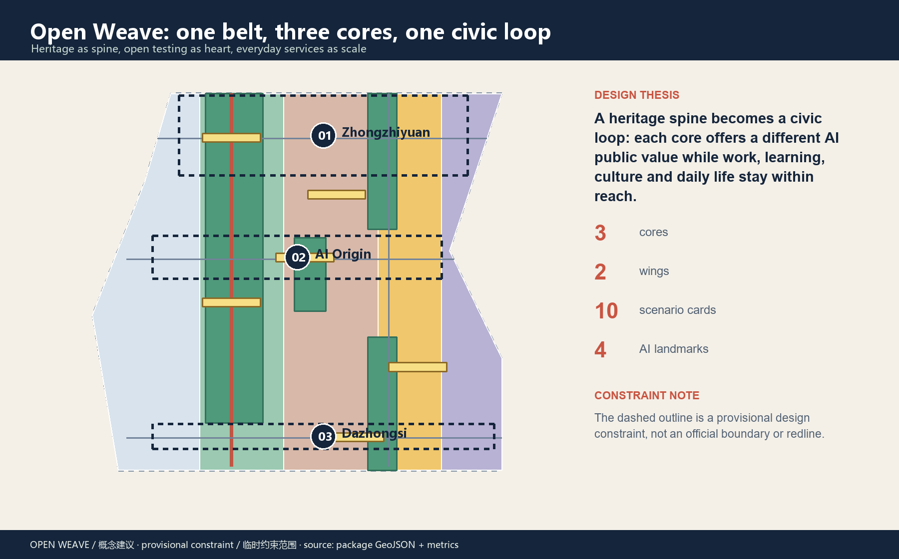

## Three-Level Scope Framework

Open Weave uses one heritage public-space spine, three innovation cores, two wings, ten scenario cards and four contribution nodes. The coordinated research area is approximately 43.6 km² and frames the ecosystem, talent and future-city hypothesis; the overall design area is approximately 11.4 km² and frames spatial structure, renewal projects and mobility/blue-green strategy; the key-area scope is approximately 368.4 ha and tests three detailed design areas [source:OFFICIAL-ANNOUNCEMENT] [metric:site_area_sqm].

| Scope | Design judgment | Open Weave spatial answer |
| --- | --- | --- |
| Coordinated research area | Connect research, open source, enterprise services, public life and global communication | “source—co-create—transfer—experience—remember” innovation loop |
| Overall design area | Give the industry strategy visible public-space and daily-service carriers | Heritage spine + two cross-links + blue-green commons nodes |
| Key-area scope | Give the three areas distinct but complementary public values | Zhongzhiyuan for standards, AI Origin for near-campus transfer, Dazhongsi for urban exchange |

The provisional boundary is shown as a low-contrast dashed constraint. It carries no official area or engineering meaning. Land-use polygons are complete intersections with the same boundary, and metrics are recalculated in EPSG:4548 [data:geometry/land_use.geojson#LU-001] [depth:three_level_scope_framework].

### Taskbook anchors and inspectable evidence

To keep “three areas and two wings” from remaining a narrative only, the proposal translates the taskbook into an evidence chain: the three scope levels have overview, structure and key-area drawings; the three cores and two wings have role assignments and project packages; the AI ecosystem has scenario cards, personas and an open challenge channel; public space and culture have the heritage spine, contribution nodes and an accessibility matrix; implementation has eight packages, stage gates and retrospectives. Every future refinement must answer who is responsible, what input is required, how it is accepted and when it stops.

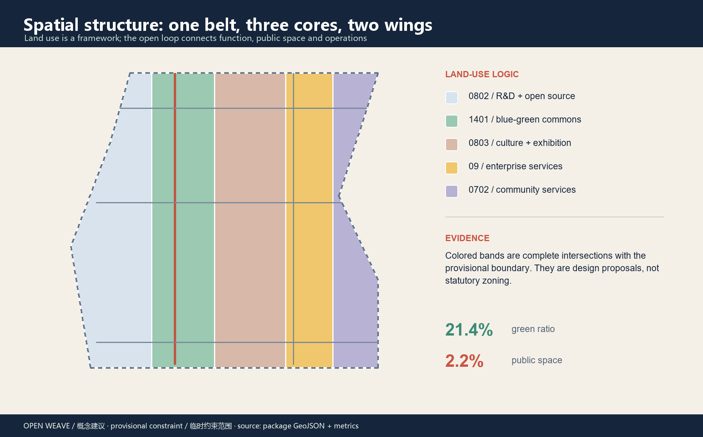

## Coordinated Research Area: Industry and Future City Research

The coordinated research area should not become another closed campus. It should be an open innovation chain: universities and research teams provide problems and prototypes; Zhongzhiyuan provides standards, safety and full-stack testing; AI Origin provides near-campus transfer and everyday talent life; Dazhongsi provides enterprise experience, consumption and global exchange; the Zhongguancun technology-service wing supports IP, compliance, capital and enterprise services; the Xiaoyuehe scenario wing brings technology into health, education, mobility and daily services. This is compatible with the “three areas, two wings” narrative, but does not state any investment, policy or招商 commitment as decided [source:SRC-2026-BJ-KW-THREE-AREAS-WINGS] [source:SRC-2026-HAIDIAN-1X1].

### Six public case mechanisms

| Case | Transferable mechanism | Reference move for Jing-Zhang |
| --- | --- | --- |
| Station F | Co-locate work, founder services and events around a legible address | Create a transfer street and open service desk in AI Origin |
| Punggol Digital District | Mix campus, industry, public life and digital operations | Use the two wings to connect campuses, companies and communities |
| 22@Barcelona | Keep productive uses in urban renewal and organize an innovation network with public space | Shift renewal from isolated buildings to public interfaces and service chains |
| AI Singapore | Close the loop between talent, public challenges and translational projects | Connect open challenges, testing and public release |
| Oodi Helsinki | Make learning, making, culture and public service everyday infrastructure | Use story stops and learning courts as low-barrier third places |
| Seoul DMC | Amplify a technology district through media, industry and city experience | Build a walkable smart-device and content interface in Dazhongsi |

These are mechanism comparisons only. No case investment, scale or performance figure is imported into the Haidian proposal [source:CASE-STATION-F] [source:CASE-PUNGGOL-DIGITAL-DISTRICT].

### Regional collaboration interface matrix: from the Haidian loop to a Jing-Jin-Ji task flow

Regional collaboration is a conceptual interface, not a signed partnership. The five interfaces below are triggered by the taskbook's regional-coordination criterion [standard:PROJECT-AGENT-OPEN-CALL-TASKBOOK]. Each row names a proposed role, observable verification and stop condition; names, contacts, venues and funding remain subject to confirmation by authorities and partners.

| Interface | Concept task flow / spatial connection | Proposed accountable role | Observable verification | Dependency and stop condition |
| --- | --- | --- | --- | --- |
| Beiwei Community | Connect AI walking guidance, paper wayfinding, community inquiry and older-adult walks to the heritage spine | Community liaison + accessibility team | One public walk per quarter; retain route issues, human handling and opt-out records | Without community authorization or route-safety review, return to desk maps and human inquiry |
| Future Science City | Turn public test questions from the safety sandbox into research-validation tasks and write rule versions back | Standards team + research liaison | Every round has a problem card, version, human conclusion and downloadable abstract | Without data authorization, test capacity or human review, create no data link |
| Huairou Science City | Connect long-cycle research, open challenges and public explanation; translate research outcomes into legible civic services | Research-transfer + public-explanation team | One cross-region translation record and one public explanation event per year | If results cannot be public or explained, keep an anonymous method retrospective and publish no outcome promise |
| Beijing E-Town | Use enterprise services, low-speed-robot safety checklists and supplier-neutral APIs as a transfer interface | Enterprise services + safety/compliance team | Every transfer scenario has RACI, interface list, failure drill and human-handover record | If vendor lock-in, insurance/safety conditions or rollback are unclear, stop field testing |
| Jing-Jin-Ji | Use the annual AI civic route, open contribution records and cross-city retrospectives as a regional outreach and attraction entry | Regional operations coordinator + event-safety team | Publish annual capacity, accessibility, safety and copyright checklist; issue a versioned retrospective | Without partner confirmation, capacity or copyright checklist, publish no cross-city route |

The verification items are design targets, not existing facts. Regional collaboration starts with public tasks, anonymized evidence, human review and reversible pilots; it does not assume investment, procurement, administrative agreements or venue commitments.

### Naming and visual identity

The main name is “Open Weave”, with “Jingzhang Civic Loop” as the English spatial descriptor. The logo direction uses two parallel lines as the railway memory, three nodes for the three cores, and an intentionally open arc for knowledge and proposals that keep entering and iterating. Suggested colors are ink blue (trust and rail), signal red (action and contribution), river green (ecology and everyday life), and warm yellow (nodes and events). Existing corporate marks and unlicensed fonts are excluded. Identity is tied to spatial tasks rather than made as an isolated slogan [standard:PROJECT-AGENT-OPEN-CALL-TASKBOOK].

#### Minimum visual standard and activity sub-brands

To turn the identity from a verbal direction into a reusable spatial grammar, this package fixes the following minimum standard. The twin-track mark uses one module between the lines; three circular nodes are numbered 01 / 02 / 03; the mark may not be stretched, rotated or replaced by a corporate symbol. The open arc is only a tail expressing continued contribution and iteration, never a closed badge.

| Visual token | Specification | Use |
| --- | --- | --- |
| Ink blue `#17283B` | Main background, rail line and high-contrast text | Thresholds, evidence sheets, formal titles |
| Signal red `#C95542` | Action, warning and contribution state | Pilot gates, stop conditions, activity actions |
| River green `#4E9B7B` | Blue-green space, pass state and public service | Slow mobility, rain gardens, accepted evidence |
| Warm yellow `#E8C35E` | Nodes, events and human-service prompts | Contribution nodes, activity routes, staffed desks |
| Twin tracks + 01/02/03 | Stroke 2, node diameter 8, one-module spacing | Wayfinding, drawing corner marks, activity badges |

Activity sub-brands use the locked form “Open Weave / [function] / [year]”: `Open Weave / Field Notes / 2026` for regional public lessons, `Open Weave / Test Commons / 2026` for testing and audit week, and `Open Weave / Civic Route Week / 2026` for the global AI week. Sub-brands reuse only the twin tracks, node numbers and four colors; every release carries provenance, copyright, accessibility and capacity checklists.

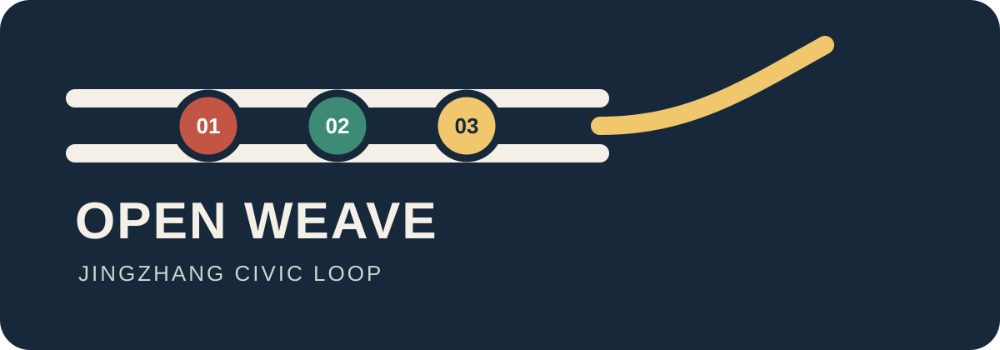

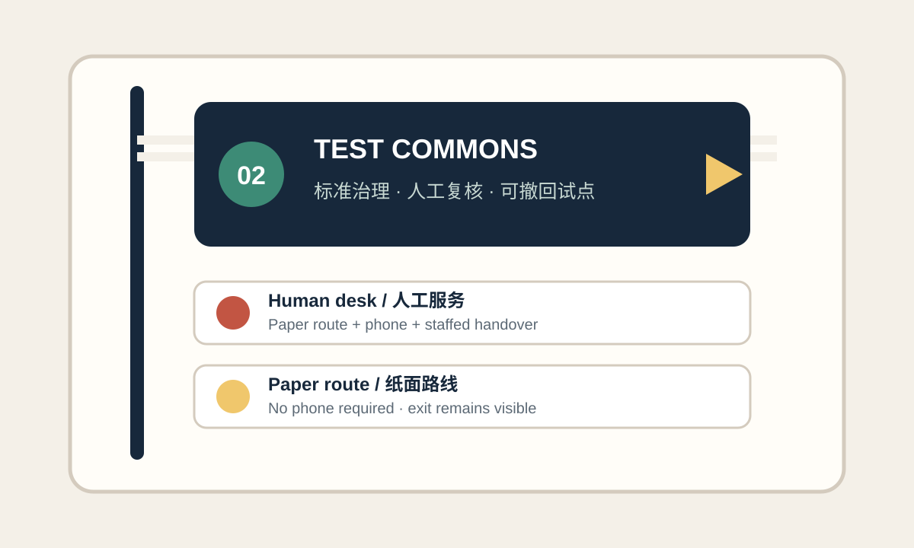

## Overall Design Area: Urban Renewal and Regulatory-Plan-Level Urban Design

The overall design area is organized by a heritage spine, commons nodes, cross-links and low-speed services. The Jingzhang Heritage Park is treated as a public-memory and slow-mobility spine; Zhongzhiyuan, AI Origin and Dazhongsi become three distinct innovation interfaces. R&D/open-source, cultural exhibition, enterprise services, community services and blue-green spaces alternate along the loop to keep work, learning, living and visiting within reach [data:geometry/land_use.geojson#LU-001] [depth:overall_spatial_structure].

No statutory FAR, height, density or setback value is proposed. The twelve building footprints are conceptual retain-review, retrofit-review and new-build prototype units for discussing interfaces, ground floors, shared halls and open testing; they are not parcel-level demolition or ownership conclusions [data:geometry/buildings.geojson#BLDG-001] [metric:building_footprint_area_sqm]. Official controls, ownership, fire safety, heritage and existing-condition surveys are prerequisites for professional parcel-level work.

## Detailed Design of Key Areas

### 01 Zhongzhiyuan AI Acceleration Area: standards commons

Zhongzhiyuan is proposed as a testable full-stack innovation interface. The Qinghe edge hosts open testing and low-carbon innovation display; the interior combines safety governance, standards, evaluation and public release; a contribution wall records public, reviewed and adopted knowledge. The spatial moves are “Qinghe innovation edge + standards commons + open-source plaza + green testing corridor”, not a closed technology campus [data:geometry/key_areas.geojson#PROV-KEY-001].

### 02 Beijing AI Origin Community: near-campus transfer street

AI Origin brings universities, start-ups, everyday life and public culture into one daily interface. A learning court hosts open classes and community events; a transfer street supports IP, enterprise services and public release; evenings remain safe, quiet and walkable. AI services use human-handover navigation, policy indexes and booking rather than personal profiling or hidden tracking [data:geometry/key_areas.geojson#PROV-KEY-002] [standard:BARRIER-FREE-ENVIRONMENT-LAW].

### 03 Dazhongsi AI Industry Cluster: urban smart-economy commons

Dazhongsi is proposed as a city-scale interface organized around station four-quadrant walking, enterprise services, content consumption and smart-device display. A global demo lounge serves developers, companies and visitors. Low-speed robotics is tested only in controlled, reversible and staffed settings; data and digital-asset displays require authorization, compliance and human explanation [data:geometry/key_areas.geojson#PROV-KEY-003] [depth:three_key_area_detailed_design].

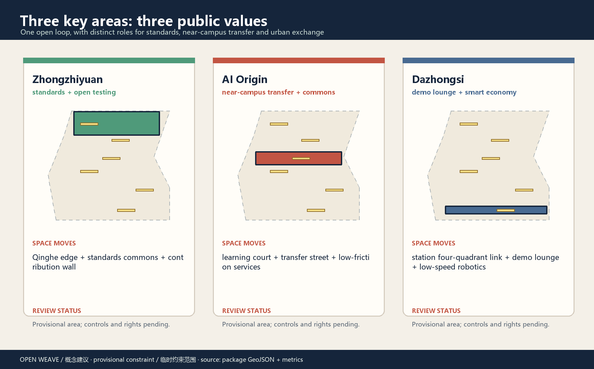

### Place-specific nodes, interfaces and section evidence

The three key areas are further translated into professional handoff tasks through “node—interface—section—acceptance evidence”: Zhongzhiyuan addresses the Qinghe edge and green testing corridor; AI Origin addresses the learning court and staffed service node; Dazhongsi addresses station quadrants and a staffed AI service desk. The board below is conceptual place-specific evidence, not an existing survey, statutory redline, engineering section or accessibility certification. Once formal boundary, ownership, heritage, road, river and municipal conditions are available, it must be rechecked, repositioned and recalculated.

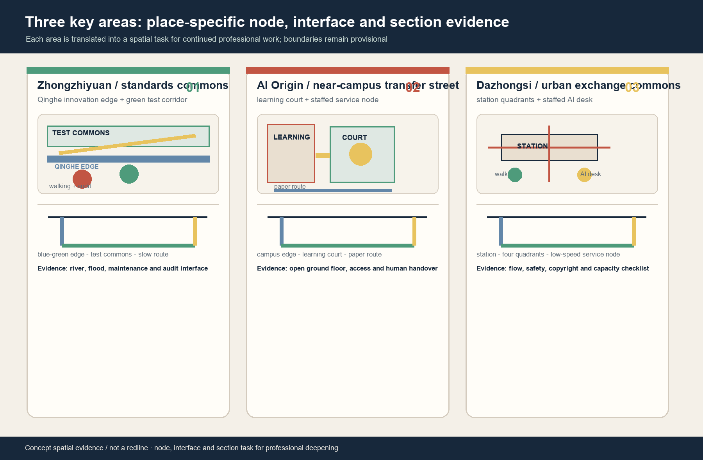

## Perspective Renderings: From Structure to Everyday Space

The following four images are concept renderings generated for this proposal. They communicate public-space scale, material language, operating atmosphere, user relationships and how AI is actually encountered in public life. AI appears as explainable, staffed and opt-out-capable civic service carriers; these are not existing photographs, official renderings or final architectural designs. They correspond to the provisional boundary, key areas and project packages. Once official boundaries, ownership, heritage, fire, municipal and accessibility conditions are available, professional teams must reposition, verify and deepen them.

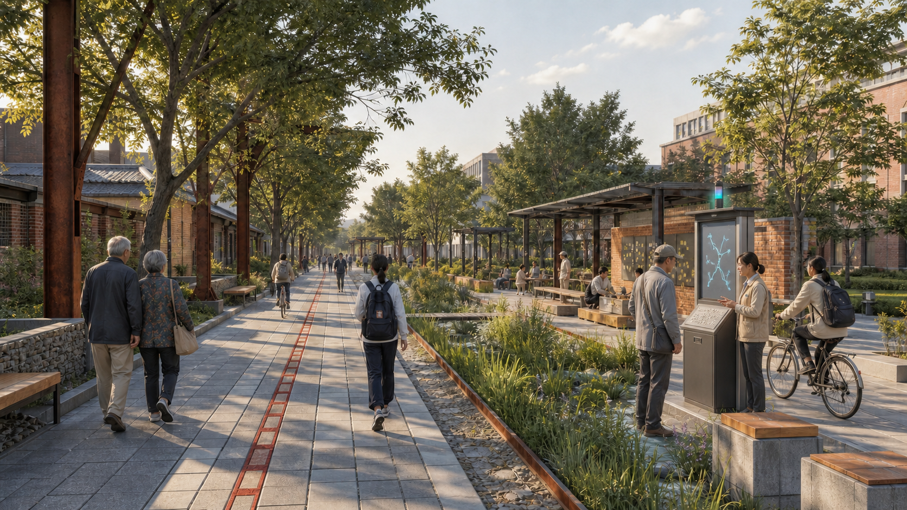

*Heritage slow-mobility spine: walking, cycling, shade, rain gardens and an open-source contribution wall form one civic loop; the right-side AI wayfinding node provides tactile maps, abstract route prompts and human guidance.*

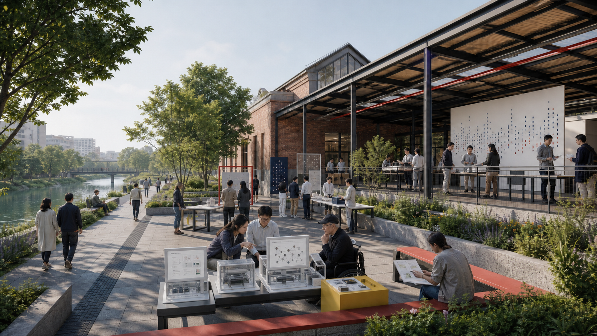

*Zhongzhiyuan: open testing tables, a riverside public edge and human review form the standards commons; the foreground AI sandbox makes model comparison, audit flow and human review visible.*

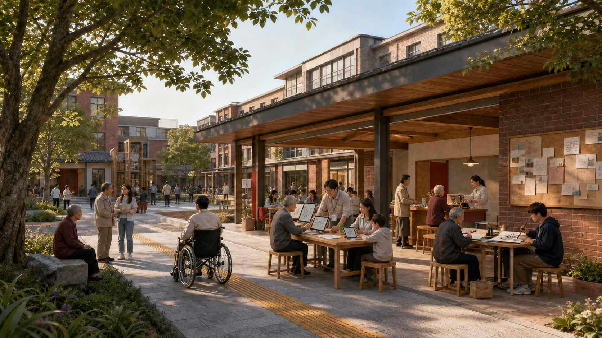

*AI Origin: learning, human inquiry, community activity and accessible everyday space share one courtyard; the co-learning workstation pairs AI assistance with human handover and a paper fallback.*

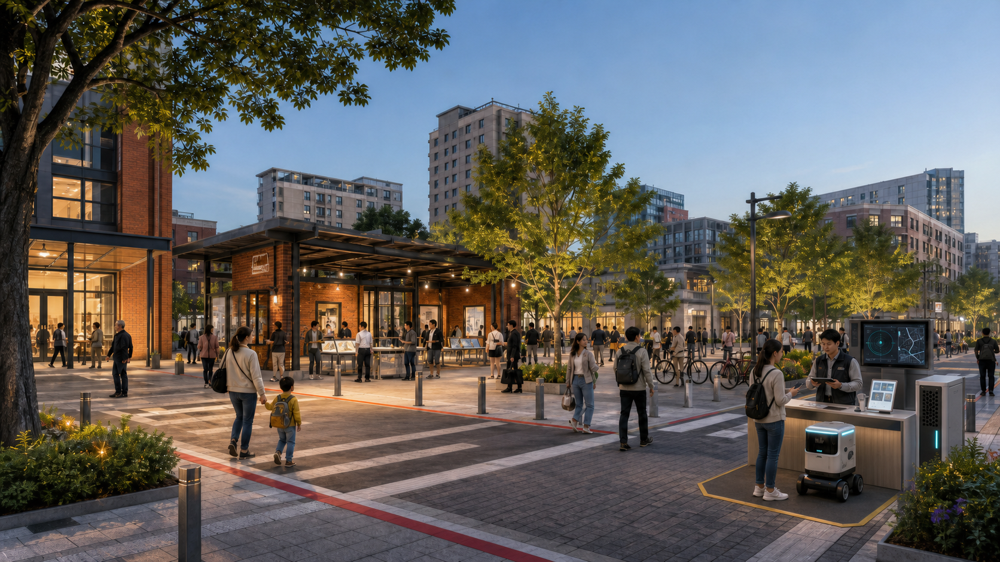

*Dazhongsi: station-quadrant walking, public demonstration and staffed low-speed service form a city-scale interface; the lower-right AI terminal, edge device and human operator make the service auditable.*

## AI Innovation Ecosystem, Personas, and AI+ Scenarios

Six personas make “AI talent friendliness” spatial and operational: an open-source student needs learning and low-friction release; a research lead needs standards, compute and testing; an SME founder needs compliance, IP and customer scenarios; residents and older adults need human service, legible wayfinding and a non-tracked daily environment; commuters and visitors need continuous, understandable walking and station connections; operators and governance teams need auditable prompts, human review and exit mechanisms [standard:PROJECT-AGENT-OPEN-CALL-TASKBOOK].

### Public-interest and inclusion acceptance matrix

“Talent-friendly” cannot mean service only for people who already use AI. The proposal therefore makes each persona’s spatial promise, offline alternative and data boundary part of acceptance. The targets below are design checks, not existing conditions or policy commitments.

| User | Spatial and service promise | Offline alternative | Design acceptance target | Data boundary |
| --- | --- | --- | --- | --- |
| Student / open-source contributor | Learning court, open release desk and low-friction contribution entry | On-site registration, paper challenge cards, human explanation | A newcomer can find learning, submission and feedback points through wayfinding | Keep public contribution and voluntary attribution only |
| Research lead | Standards commons, test booking and review seats | Human booking and printed checklist | Every test has downloadable rules, version and review status | Authorize research data by project; no personal fields by default |
| SME founder | Transfer street, IP and compliance inquiry | Human desk and phone follow-up | Every AI suggestion can hand over to professional human service | Never write business secrets into public logs |
| Resident / older adult | Continuous shaded walk, quiet rest and legible wayfinding | Paper map, phone and human desk | A person without a smartphone can ask, register, complain and opt out | No face recognition, route profiling or covert collection |
| Commuter / visitor | Station-quadrant wayfinding, bicycle parking and accessible alternatives | Printed route and on-site guidance | Understandable alternatives exist for night, rain and mobility barriers | Use public-space and authorized environmental information only |
| Operator / governance team | Audit panel, staffed point and rollback tools | Manual duty log and paper incident form | Every pilot has an owner, contact and stop button | Minimize logs, tier access and delete on schedule |

### Ten AI scenario cards

| No. | Scenario | Space and users | Human boundary |
| --- | --- | --- | --- |
| 01 | Open-source discovery | Heritage contribution wall / developers, visitors | Index public content only; maintain sources by people |
| 02 | Safety governance sandbox (test) | Zhongzhiyuan / companies, standards teams | Produce review lists only; no automatic clearance |
| 03 | Edge-compute stop | Three cores / teams, public | Verify energy, network and safety first |
| 04 | AI walking guide | Heritage spine / students, older adults, visitors | Human and accessibility review before advice |
| 05 | Dazhongsi global demo lounge | Dazhongsi / companies, investors, developers | No investment promise or business decision replacement |
| 06 | Qinghe low-carbon innovation corridor | Zhongzhiyuan / research teams, residents | Use public environmental information and explain anomalies |
| 07 | Near-campus transfer street | AI Origin / universities, start-ups | Keep legal and IP human service access |
| 08 | Data commons lounge | Dazhongsi / companies, public | Show authorization and audit trail, never personal data |
| 09 | AI daily-service street | Community/retail edge / residents | Health, education and legal information is not professional service |
| 10 | Global AI week route | Whole belt / global visitors | Recheck safety, access and copyright for each event |

Cards 02, 04, 08 and 10 are candidates for industry or governance validation. Each begins with public rules, minimum data, human review, exit conditions and a retrospective; none is an approved operation or vendor requirement [source:AGENT-TASKBOOK] [standard:GENERATIVE-AI-INTERIM-MEASURES].

### The Open Weave operating protocol: from problem to reversible pilot

AI does not replace planning, public services or professional judgment. It enters a five-gate, auditable loop. These are design targets and a working template, not a government approval process or an operating commitment; if any gate is incomplete, the scenario remains a desk exercise and cannot be executed for the public.

| Gate | Evidence to publish | Proposed responsible role | Pass / stop condition |
| --- | --- | --- | --- |
| 0. Public problem | Problem card, applicable space, beneficiaries, provenance and copyright | Scenario initiator + community liaison | No clear public problem, provenance or beneficiary: no test |
| 1. Minimum data | Data inventory, authorization boundary, retention, bias and accessibility risks | Test operator + privacy/safety reviewer | Identification, unauthorized data or unexplained critical bias: stop |
| 2. Human review | Professional opinion, public feedback, legible prompts and limits | Relevant planning, architecture, mobility, accessibility or heritage reviewers | No human review: no automatic clearance or field instruction |
| 3. Reversible pilot | Roster, on-site notice, complaint route, rollback script and log | Scenario operator + on-site safety lead | Incident, persistent misdirection, overreach or abnormal rejection: take offline |
| 4. Public retrospective | Success, failure, complaints, exit, revisions and next decision | Operations team + public/professional review group | Incomplete evidence: no expansion; return to desk testing when needed |

The first acceptance loop for four priority pilots is explicit: the safety governance sandbox must publish its rules, data scope, human conclusions and withdrawal record; the AI walking guide must field-check accessible, older-adult and night routes and go offline when it misleads; the data commons lounge may show only authorization-chain summaries, blocking personal fields or untraceable sources; the global AI week route needs a capacity, accessibility, safety and copyright checklist before opening. These are design targets; professional teams and authorities set the final thresholds.

### Concept technical architecture, interfaces and evaluation baselines

To keep AI from stopping at scenario cards and perspective images, the proposal adds a vendor-neutral conceptual architecture. It defines interface responsibilities and evidence forms; it does not claim that a production system, model, compute supply or engineering capacity already exists.

| Layer | Spatial/operational interface | Minimum data and output | Evaluation baseline | Energy/capacity and human fallback |
| --- | --- | --- | --- | --- |
| Civic access | Paper maps, phone, staffed desk, terminal and travelling exhibit | Problem type, node, language/access need; readable advice plus human route | Compare with paper and human-route baseline | No phone required; return to paper and staff when terminal fails |
| Scenario orchestration | Shared `scenario_id`, `consent_scope`, `risk_state`, `human_decision`, `withdrawal_state` fields | Pass only authorized minimum fields; output version, provenance, limits and confidence/uncertainty notice | Trace every output to a problem card, version and human conclusion | Interface, latency, concurrency and storage thresholds pending professional confirmation; block on anomaly |
| Model/rule services | Replaceable retrieval, routing, anomaly, translation and summarization services | Never execute planning, transaction, medical, legal or safety decisions; output advice, not commands | Compare with human review, paper rules and counterexample set | Model, vendor and deployment location unknown; human review precedes any release |
| Evidence registry | Provenance, authorization, version, evaluation, complaint, exit and rollback records | Downloadable evidence summary without personal fields or trade secrets | Completeness, explainability, withdrawal reachability and bilingual equivalence | Retention, deletion owner and audit cadence pending; no expansion when records are incomplete |
| Edge infrastructure | Edge node, network, power, cooling, fire safety and maintenance entry | Device list, energy reading, offline state and human-takeover state | Exercise offline, power-loss, boundary breach, failure and human takeover | Power, network, fire, energy and maintenance capacity remain unknown/null; no rollback means no field pilot |

The interface uses conceptual vendor-neutral fields and legible evidence, not a specified model, cloud supplier or procurement route. The four priority pilots use the following acceptance baselines; “100%” describes a design-completeness requirement, not a claim that a real system has already met it. Professional teams set all remaining thresholds after field baselines [standard:GENERATIVE-AI-INTERIM-MEASURES] [metric:priority_ai_pilot_count].

| Pilot | Observable acceptance | Comparison baseline | Archive required | Stop/rollback |
| --- | --- | --- | --- | --- |
| 02 Safety governance sandbox | Rules, data scope, human conclusion, version and withdrawal record are 100% complete | Human rule review + paper process | Rule card, version diff, human opinion, exit record | Unauthorized field, unexplained bias or audit gap: return to desk exercise |
| 04 AI walking guide | Accessible, older-adult, night and rain routes are field-checked; wrong advice has human takeover | Paper map + human inquiry route | Walk audit, route version, issue log, complaint and rollback record | Misdirection, missed barrier or takeover failure: take offline and return to human guidance |
| 08 Data commons lounge | Every displayed field has an authorization summary; personal fields and untraceable sources are zero | Human authorization list + redacted display | Field allow-list, authorization summary, redaction check, deletion proof | Broken provenance, overreach or failed deletion: clear display and stop |
| 10 Global AI week route | Capacity, accessibility, safety and copyright checklist is 100% complete; retrospective is downloadable | Manual event route and site checklist | Checklist, duty roster, emergency exercise, public feedback, annual retrospective | Missing item, unknown capacity/safety or insufficient authorization: do not open public route |

These interfaces and baselines are a handoff protocol for professional deepening: start with a paper/human comparison, then run a small reversible validation. Do not convert model accuracy, concurrency, energy consumption or cross-system interoperability into confirmed facts at this stage.

### Joint field walk-through and stop gate before any pilot

Before any pilot faces the public on site, the relevant professional and operating roles must complete the checklist below. It is a conceptual start gate and evidence list, not a certification of current compliance. If any item is missing, unknown or cannot be handed over to a human, retain desk testing/mobile exhibition, pause field opening and keep the rollback path.

| Joint review topic | Required field evidence | Proposed participants | Missing or failed response |
| --- | --- | --- | --- |
| Accessibility and older-adult use | Day/night/rain routes; ramp, tactile cue, seating, lighting, rest and paper fallback walk-through | Accessibility adviser + older-adult representatives + mobility/operations | Log barriers and human alternatives; no guide/event opening if it fails |
| Community and public acceptance | Inquiry, complaint, refusal and opt-out exercises with residents, students, visitors and no-phone users | Community liaison + public review group | Stop and return to staffed desk if complaint or opt-out fails |
| Mobility and station safety | Conflict points, station quadrants, route continuity, staffed boundary, evacuation and night visibility | Mobility adviser + public-safety lead | Keep paper wayfinding/temporary organization; no fixed or automatic service |
| Heritage and spatial interface | Heritage boundary, control zone, materials, wayfinding, display content and attribution/copyright review | Heritage adviser + design/copyright lead | Remove unreviewed content; no fixed installation or public release |
| Privacy and data governance | Minimum data, authorization summary, deletion owner, logs, human handover and vendor-neutral interface | Privacy/security reviewer + data-governance owner | Clear data and stop the pilot if identifying data or deletion failure appears |
| Operations, fire and capacity | Duty roster, device/power/network/fire conditions, insurance, complaint response, incident drill and rollback script | Operations + fire/safety + venue authorizer | No public operation while any capacity, insurance or authorization is unknown |

### First-round professional handoff crosswalk

The “AI pilot—project-package handoff crosswalk” in `report/copyright_statement.md` places spatial node, `scenario_id`, JZ package, proposed RACI, minimum data, manual baseline, stop trigger and archive evidence in one bilingual worksheet covering JZ-01, JZ-06, the staffed service node and all four priority pilots. It is a conceptual handoff document, not formal authorization, procurement, engineering or operating appointment.

### Annual operating calendar, developer community and international transfer path

Agent.6's “global events” are translated into a verifiable annual operating cycle. This is a conceptual calendar, not a government event schedule; every quarter first completes capacity, accessibility, safety, copyright and data-boundary checklists.

| Quarter / sub-brand | Public action | Accountable role | Observable indicators and evidence |
| --- | --- | --- | --- |
| Q1 / Field Notes | Open problem call, heritage walk audit and community human-inquiry days | Community liaison + history/accessibility advisers | At least 3 walk routes, 6 persona feedback sets, problem cards and offline alternatives |
| Q2 / Test Commons | Safety-sandbox open day, developer maintainer office hour and model-evaluation explanation class | Standards + developer-community operations | Four priority pilots each have rules, version, human conclusion and withdrawal record |
| Q3 / Regional Exchange | Task-translation week with Beiwei Community, Future Science City, Huairou Science City, Beijing E-Town and Jing-Jin-Ji interfaces | Regional-coordination lead + enterprise-services team | Five interface records, one cross-region retrospective, an owner and verification method per item |
| Q4 / Civic Route Week | Global AI week civic route, release event and annual failure/exit retrospective | Event operations + public safety + public review group | Publish capacity, accessibility, safety and copyright checklist; issue a versioned annual retrospective |

The developer-community mechanism is “monthly maintainer office hour + quarterly public challenge + versioned evidence registry”: newcomers read contribution and data boundaries before submitting a public problem card; maintainers own provenance, version and withdrawal status; the public sees only human-explained results. The international transfer path is “public-route experience → open-challenge signup → human evaluation/demo → regional task translation → professionally reviewed conceptual pilot”; it promises no investment, procurement, delivery or signed partnership.

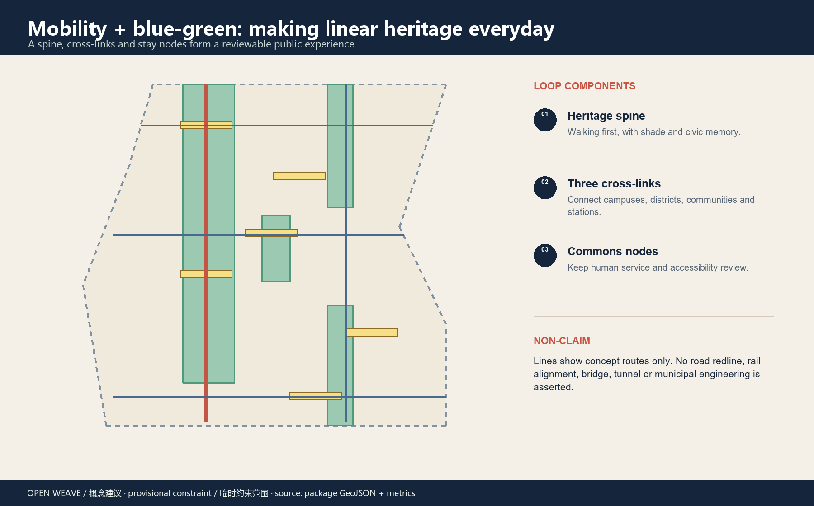

## Land Use, Building Scale, and Retain-Renovate-Demolish Strategy

Land use follows the numeric vocabulary supplied by the Ministry of Natural Resources. Five bands cover the provisional design boundary without overlap or unlabeled gaps; they are a design partition for comparing spatial relationships, not a statutory zoning or land-ownership conclusion [standard:MNR-LAND-USE-CLASSIFICATION-GUIDE] [data:geometry/land_use.geojson#LU-001].

Buildings use a three-step review: retain review for cultural value, structure, public interface and continued use; retrofit review for open ground floors, shared halls, energy and accessibility; new-build prototypes only after a public-service gap, scenario need and official controls are established. All parcel-level demolition, height, intensity, setback and total floor area remain pending official data [depth:retain_renovate_demolish].

## Transport, Rail, Municipal Infrastructure, and Public Services

Mobility is proposed as a heritage slow-mobility spine, three cross-links and station connections. The spine supports walking and cycling; cross-links connect campuses, districts, communities and stations; nodes provide legible wayfinding, bicycle parking, human information and accessible alternatives. Road centerlines only indicate conceptual service directions, not road redlines, rail alignments or bridge/tunnel engineering [data:geometry/roads.geojson#ROAD-001] [depth:traffic_rail_slow_parking].

Municipal and new-infrastructure elements are “pluggable service nodes”: edge compute, open-data display, environmental maintenance, energy and public-service prototypes start as light pilots, then deepen after capacity, safety and operations are known. Electricity, drainage, fire safety, utilities and flood conditions remain pending. Human desks, paper and phone alternatives remain part of public service [standard:BARRIER-FREE-ENVIRONMENT-LAW] [standard:ELDERLY-SMART-TECH-PLAN-2020-45].

## Blue-Green Network, Public Space, and Urban Character

The blue-green network is the proposal’s public operating system: the spine carries memory, shade, walking and events; the Qinghe edge supports low-carbon innovation; pocket gardens connect communities; commons nodes host learning, release, inquiry and contribution. Green and public-space ratios are recomputable from the submitted geometry but remain design-model outputs under the provisional boundary, not planning commitments [data:geometry/green_space.geojson#GREEN-001] [metric:green_ratio].

Character is expressed through three languages: the rhythm of railway components, the openness of Haidian campuses and the readability of AI systems. Wayfinding uses lines, nodes and contribution numbers; public elements prioritize durable, maintainable, low-glare materials. Public art does not copy Zhan Tianyou’s portrait, corporate marks or copyrighted images; it uses original linear motifs and public-history text to tell a continuous story of autonomous design, open collaboration and public contribution [standard:MOHURD-URBAN-DESIGN-MEASURES].

## Renewal Projects, Implementation Policy, and Phasing

Eight project packages can be taken forward by a professional team: JZ-01 heritage slow-mobility gap repair; JZ-02 Zhongzhiyuan Qinghe innovation edge; JZ-03 AI Origin near-campus transfer street; JZ-04 Dazhongsi station four-quadrant walking; JZ-05 AI public services and edge-compute nodes; JZ-06 open-source contribution wall and honor-display system; JZ-07 low-speed robotics and maintenance test; JZ-08 global AI week public route. Each requires official boundaries, rights, heritage, traffic, utilities, safety, accessibility and public participation review [depth:renewal_project_list].

Phasing is “public first, tests second, deeper renewal third”: Phase 1 discusses light public space, wayfinding, walking continuity and human service; Phase 2 pilots small scenarios after data, privacy, safety and professional review; Phase 3 considers ecosystem integration, building renewal and long-term operations. `phasing.geojson` is a reference sequence, not a government schedule, funding, approval or construction commitment [data:geometry/phasing.geojson#PHASE-001] [depth:phasing_implementation].

Four operating mechanisms are proposed: an open challenge and scenario-application channel; professional review plus public feedback; contribution records with revocable honor display; and annual retrospective with knowledge-base updates. Operators should record evidence, failure, exit and revision, not only successful demonstrations.

### Implementation matrix for the eight project packages

The matrix below moves the project list toward a first deliverable and a stop condition. Roles are proposed professional roles, not appointments to any institution. Every package requires official boundary, ownership, heritage, mobility, municipal, safety, accessibility and public-participation inputs before deepening.

| Package | First deliverable | Proposed lead role | Key prerequisite | Stage gate / rollback |
| --- | --- | --- | --- | --- |
| JZ-01 Slow-mobility gap repair | Gap list, continuous routes and accessibility walk audit | Urban design + mobility team | Official road, station and obstacle data | If the field audit fails, keep human guidance and do not deepen construction |
| JZ-02 Qinghe innovation edge | Riverside public interface and low-carbon display sample | Public-space + water/safety advisers | River, flood, edge and maintenance conditions | If flood, lighting or maintenance is inadequate, return to movable displays |
| JZ-03 Near-campus transfer street | Ground-floor opening and human-service node list | Building retrofit + campus/community operations | Ownership, fire, campus and community coordination | If ownership or fire conditions are unconfirmed, no fixed retrofit or data link |
| JZ-04 Station four-quadrant walking | Pedestrian conflict points and time-based organization map | Mobility + station-area coordination team | Rail interchange, road redline and demand data | If safety conflicts remain, test with wayfinding and temporary organization |
| JZ-05 Public service / edge nodes | Human service, compute and energy demand sheet | Municipal + AI infrastructure team | Power, network, fire and operations capacity | Without staffing and rollback ability, no edge pilot |
| JZ-06 Contribution wall / honor system | Public contribution fields and withdrawal prototype | Cultural narrative + knowledge-governance team | Attribution consent, copyright and history review | If consent is unclear or withdrawal impossible, use anonymous version records |
| JZ-07 Low-speed robotics test | Controlled test area and safety checklist | Mobility safety + operations team | Site, insurance, staffing and incident response | Any boundary breach or incident stops the test and returns to desk review |
| JZ-08 AI week public route | Capacity, accessibility, safety and copyright checklist | Event operations + public-safety team | Venue, emergency, copyright and public notice | If the checklist is incomplete, publish no public route or event promise |

### Package acceptance, RACI and maintenance resources

The table below moves every package from a proposed action to a minimum observable evidence set. R means responsible for execution, A accountable, C consulted and I informed; these are proposed professional roles, not institutional appointments. Maintenance resources are logged in five categories: people, place, equipment/energy, data/copyright and emergency response.

| Package | R / A | C / I | First observable acceptance | Archive and stop trigger |
| --- | --- | --- | --- | --- |
| JZ-01 | R mobility team / A urban-design lead | C accessibility, community / I public | Three routes pass day/night/rain/barrier walk audits | Route map, issue log and human alternative; stop on misdirection or safety conflict |
| JZ-02 | R public-space team / A river-edge lead | C water, flood, maintenance / I residents | One movable display sample passes maintenance and flood checks | Maintenance log and flood/lighting check; return to movable display if conditions fail |
| JZ-03 | R retrofit team / A campus-community operations lead | C fire, ownership, community / I schools and enterprises | One staffed ground-floor node passes opening-hours and exit test | Roster, fire opinion and complaint log; no fixed retrofit if ownership/fire is unclear |
| JZ-04 | R mobility team / A station-area lead | C rail, roads, safety / I commuters | Four quadrants pass pedestrian-conflict and accessible-alternative checks | Conflict map, time plan and incident record; do not expand while conflicts remain |
| JZ-05 | R municipal/AI-infrastructure team / A operations lead | C network, energy, privacy / I public | One edge node passes energy, outage and human-handover drill | Equipment list, energy sheet and rollback script; no pilot without staffing/rollback |
| JZ-06 | R knowledge-governance team / A cultural-narrative lead | C copyright, heritage, contributors / I public | Contribution can be attributed, anonymized, withdrawn and versioned | Authorization and version log; anonymize when provenance/withdrawal is unclear |
| JZ-07 | R operations-safety team / A low-speed-service lead | C insurance, mobility, equipment / I neighbors | Controlled area passes staffing, emergency-stop and incident drill | Roster, emergency-stop record and insurance conditions; stop on boundary breach/incident |
| JZ-08 | R event operations / A public-safety lead | C copyright, accessibility, regional interfaces / I visitors | One route passes capacity, accessibility, safety and copyright checks | Checklist, site retrospective and exit record; no route if any item is missing |

Every node needs at least one on-site owner, one replacement duty person, maintenance and energy records, a public complaint/exit route, and a paper or phone alternative. Exact headcount, budget, contract, equipment model and thresholds remain for professional confirmation; this proposal does not replace procurement or approval.

The sequence is not a simultaneous start of all eight packages. JZ-01, JZ-06 and human-service nodes establish public evidence first; later pilots are selected by the gates. Any package can pause, narrow or roll back because of missing data, public feedback or professional review.

### Four AI pilgrimage landmarks / contribution nodes

1. **Centennial Jingzhang Open Gate**: a public identity threshold showing the historic line and current open-source work.
2. **Zhongzhiyuan Standards Beacon**: a readable testing process and contribution record instead of an exclusive vertical “tech landmark”.
3. **Origin Learning Court**: courses, open-source release, community service and everyday rest in one accessible commons.
4. **Dazhongsi Contribution Wall**: public knowledge recorded by version, contributor and review status; no permanent inscription form is promised.

These are conceptual public-space components and memory mechanisms. Location, material, heritage treatment and permanent display require professional and authority review [source:AGENT-TASKBOOK].

## Metrics, Area Recalculation, and Compliance Matrix

The three visible core metrics are provisional site area, green ratio and public-space ratio. They are recalculated from `site_boundary.geojson`, `green_space.geojson` and `public_space.geojson`, and the visual page marks them with `data-metric` values. Building footprint, slow-mobility length, the three key areas, scenario-card count, persona count and land-use areas are also recorded with source files, formulas, confidence and assumptions [metric:site_area_sqm] [metric:green_ratio] [metric:public_space_ratio].

Statutory FAR, height and density, road redlines, utility capacity, ownership and investment remain pending official data. The compliance matrix covers announcement requirements 1.3, 1.4 and 1.5 and agent.1–agent.6; the standard and design-depth matrices keep urban design, regulatory boundaries, land-use classification, blue-green, mobility, municipal, phasing, metrics and risk evidence separate [standard:MOHURD-CONTROL-DETAILED-PLANNING] [depth:metrics_recalculation].

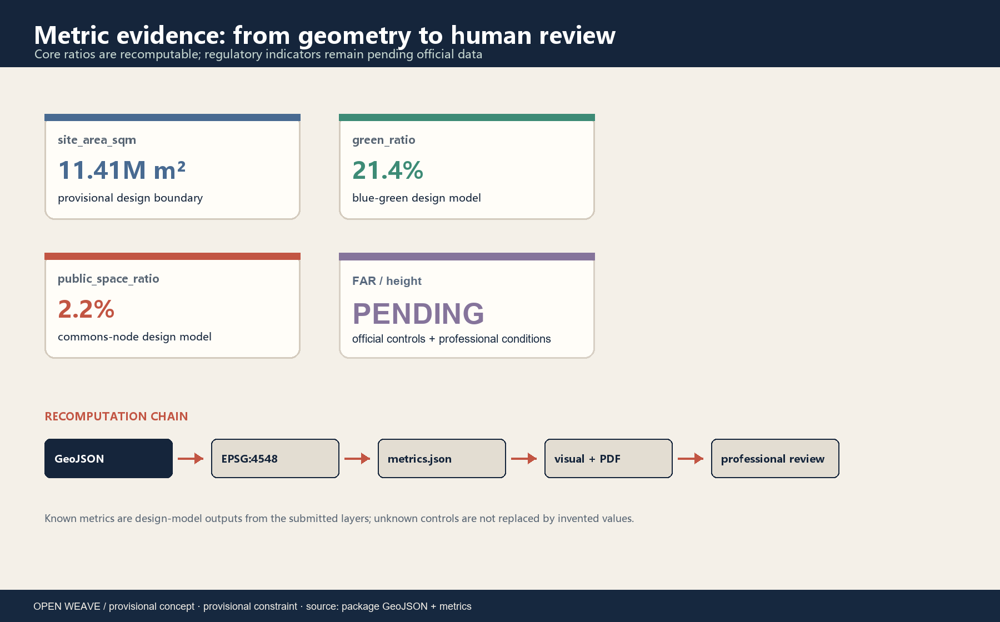

## Risk, Copyright, and Compliance

The scope of `license: COMMUNITY-DISPLAY-ONLY`—review display, professional refinement, editorial reuse, secondary publication, attribution and third-party-material limits—is itemized in `report/copyright_statement.md`; `manifest.json` `validation_claim.extensions.x-license-scope` points to the same table. The same file also contains the bilingual authoring QA checklist.

| Risk | Current reading | Control action |
| --- | --- | --- |
| Provisional geometry mistaken for a redline | High | Mark provisional in figures, text, HTML, sources and assumptions; recalculate all layers when official data arrives |
| Privacy and over-monitoring in AI scenarios | High | Minimum data, authorized feedback, human review and exit; no identification or hidden tracking |
| Heritage and historical narrative drift | Medium-high | Do not draw unpublished protection lines or copy portraits; use heritage and history review |
| Safety and public acceptance of pilots | Medium-high | Low-speed, reversible, staffed pilots with staged retrospective |
| Operations and maintenance cost | Medium | Assign owners, maintenance cycles and stop conditions to every node |
| Digital divide in public services | Medium | Keep human desks, paper, phone and accessible alternatives |

This is an open co-creation proposal. It does not replace formal planning, constitute an official conclusion, promise investment or schedule, or establish engineering feasibility. Rights and provenance for brands, fonts, figures, cases and data are in `sources.json` and `report/copyright_statement.md`; the agent proposes and humans/professionals retain final judgment [standard:PROJECT-AGENT-OPEN-CALL-TASKBOOK] [depth:risk_missing_data].

## References

- [source:OFFICIAL-ANNOUNCEMENT] Haidian Branch, Beijing Municipal Commission of Planning and Natural Resources, Centennial Jing-Zhang AI Innovation Belt prequalification announcement.
- [source:AGENT-TASKBOOK] Agent-facing open-call taskbook excerpt.
- [source:SOURCE-REGISTRY] Repository public-source registry and use boundaries.
- [source:SRC-2017-MOHURD-URBAN-DESIGN-MEASURES] Measures for Urban Design Management.
- [source:SRC-MOHURD-CONTROL-DETAILED-PLANNING] Measures for the Preparation and Approval of Regulatory Detailed Plans.
- [source:SRC-2023-MNR-LAND-USE-CLASSIFICATION] Land-use Classification Guide.
- [source:CASE-STATION-F], [source:CASE-PUNGGOL-DIGITAL-DISTRICT], [source:CASE-22@BARCELONA] public case mechanisms.
- [source:CASE-AI-SINGAPORE], [source:CASE-OODI], [source:CASE-SANGAM-DMC] public case mechanisms.
- [source:BOUNDARY-SOURCE], [source:KEY-AREA-SOURCE] maintainer-provided provisional spatial constraints.
