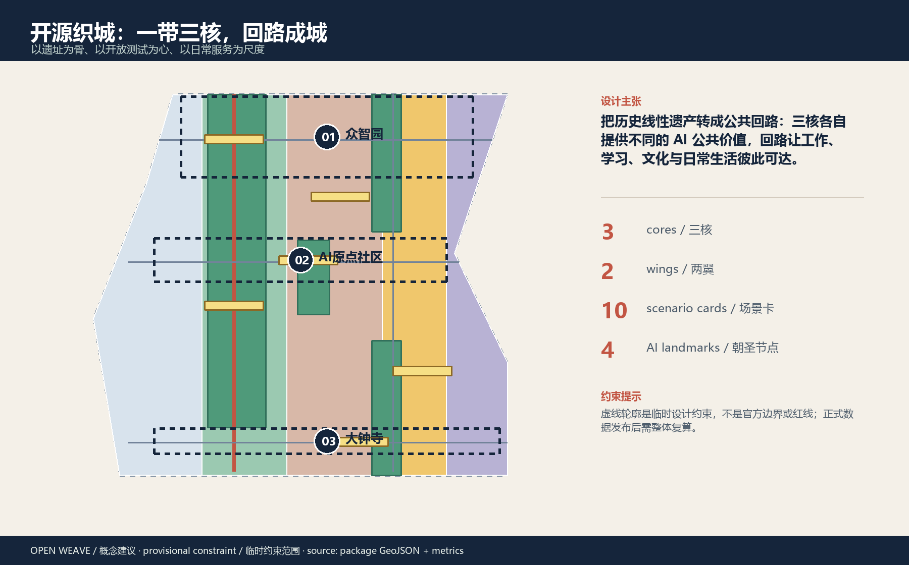
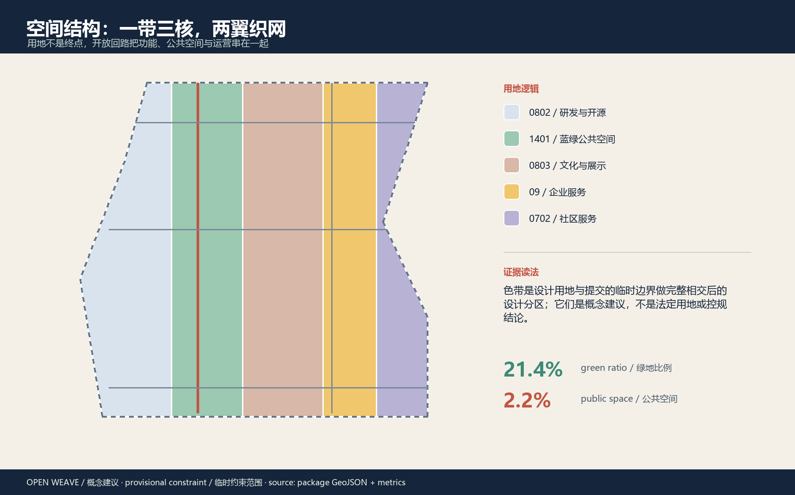
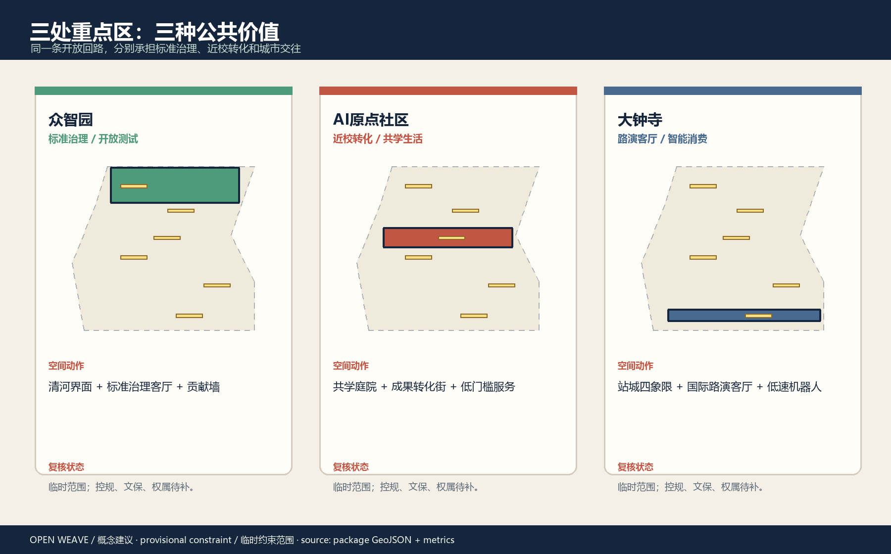
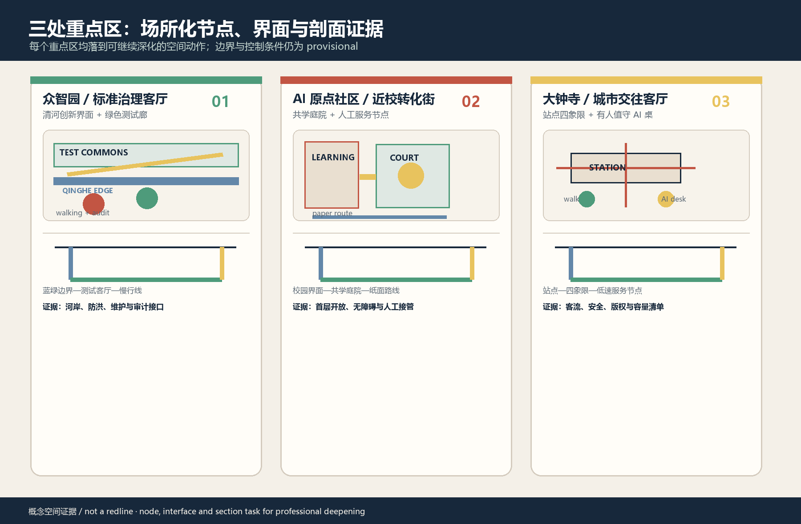
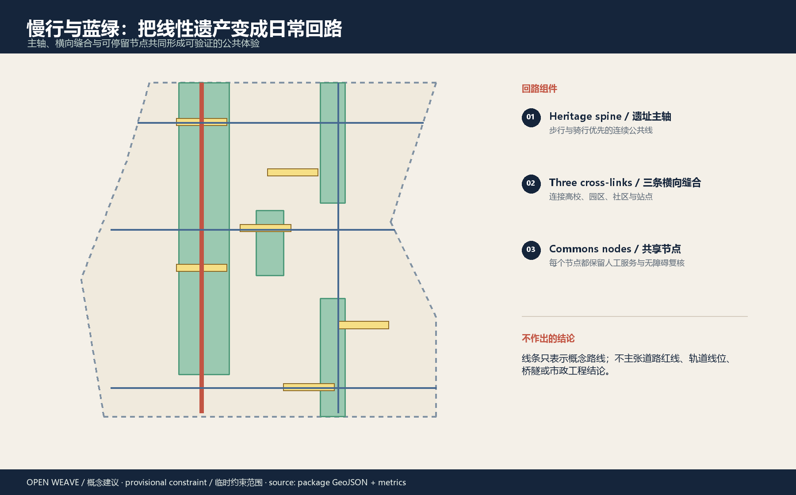
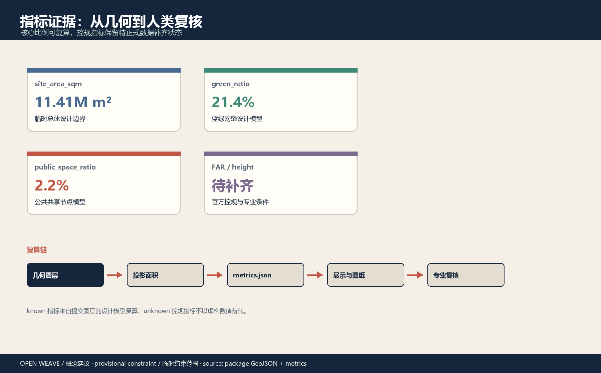

# 开源织城：百年京张 AI Civic Loop

> 一条历史线，三种创新角色；把 AI 从后台能力变成可被日常使用、人工复核、持续运营的公共回路。

## 设计依据与资料清单

本方案以《百年京张 AI 创新带城市设计国际方案征集资格预审公告》确定的项目名称、三层范围和设计任务为主控依据，以面向智能体的任务书补足命名、生态案例、AI+ 场景、公共空间、文化叙事和长期运营要求 [source:OFFICIAL-ANNOUNCEMENT] [standard:PROJECT-AGENT-OPEN-CALL-TASKBOOK]。空间图层、面积指标和展示图来自本投稿包自身的 GeoJSON 与复算文件，避免把概念性文字误当成规划红线。

当前公开资料没有精确官方边界、三处重点区正式 polygon、控规控制线、文保范围、权属地块、道路红线、轨道和市政工程数据。因此本包使用仓库维护者提供的临时约束范围，仅用于生成、展示、自检和公开讨论；正式数据到位后，边界、用地、建筑、蓝绿、交通、分期和指标必须整体重算 [source:BOUNDARY-SOURCE] [data:geometry/site_boundary.geojson#SITE-001]。这些缺口不会被包装成“已确认条件”。

资料权利边界也被写进 `sources.json` 与版权声明：公告、标准和案例来自公开或清权来源；本方案不使用个人数据、内部图件、商业底图、企业 Logo、人物肖像或未经授权的字体与图片 [source:SOURCE-REGISTRY]。

## 三层范围工作框架

“开源织城”采用一条历史公共空间主轴、三个创新核心、两翼协同、十张场景卡和四个贡献节点的工作框架。统筹研究范围约 43.6 平方公里，负责生态、人才和未来城市假设；总体设计范围约 11.4 平方公里，负责空间结构、更新项目和交通蓝绿策略；重点区域范围约 368.4 公顷，负责三处片区的设计验证 [source:OFFICIAL-ANNOUNCEMENT] [metric:site_area_sqm]。

| 工作层级 | 设计判断 | Open Weave 的空间回答 |
| --- | --- | --- |
| 统筹研究范围 | 把研发、开源、企业服务、公共生活和国际传播连成创新链 | “策源—共创—转化—体验—记忆”五段式生态回路 |
| 总体设计范围 | 让产业策略有可见的公共空间和日常服务载体 | 遗址主轴 + 两条横向缝合线 + 蓝绿共享节点 |
| 重点区域范围 | 让三处重点区承担不同而互补的公共价值 | 众智园做标准治理，AI 原点社区做近校转化，大钟寺做城市交往 |

临时边界以淡色虚线表达，不承担官方面积或工程控制意义。用地分区采用同一边界的条带相交，保证没有未命名空白；指标以 EPSG:4548 复算，展示页只读取 `metrics.json` 的数值 [data:geometry/land_use.geojson#LU-001] [depth:three_level_scope_framework]。

### 任务书落点与可交付证据

为避免“三区两翼”只停留在叙事层，方案把任务书要求转成可检查的证据链：三层范围对应总览、结构和重点区图件；三核两翼对应角色分工和项目包；AI 生态对应场景卡、用户画像和开放题库；公共空间与文化对应遗址主轴、贡献节点和无障碍矩阵；更新实施对应八个项目包、分期闸门和复盘记录。每个后续深化动作都必须能回答“谁负责、先拿什么资料、如何验收、何时停止”。

## 统筹研究范围产业与未来城市研究

统筹研究的核心不是再造一个封闭园区，而是建立可被不同主体接入的“开放创新链”：高校和研究团队提供问题与原型，众智园提供标准、安全和全栈测试，AI 原点社区提供近校转化与人才日常，大钟寺提供企业展示、消费和国际交往，中关村科技服务翼提供知识产权、合规、资本和企业服务，小月河场景赋能翼把技术带入医疗、教育、交通和生活服务。该分工与公告的“三区两翼”叙事相容，但不把任何招商、资金或政策写成确定承诺 [source:SRC-2026-BJ-KW-THREE-AREAS-WINGS] [source:SRC-2026-HAIDIAN-1X1]。

### 六个可转化的公开案例机制

| 案例 | 借鉴机制 | 转译到京张的参考动作 |
| --- | --- | --- |
| Station F | 复合办公、创业服务与活动共用一个可识别入口 | 在 AI 原点社区设置“成果转化街”与开放服务台 |
| Punggol Digital District | 校园、产业、公共生活和数字运营共址 | 用两翼把校园、企业和社区串进日常回路 |
| 22@Barcelona | 城市更新保留生产性功能并以公共空间组织创新网络 | 把更新从单体改造转为公共界面与服务链 |
| AI Singapore | 人才、公开挑战和转化项目形成任务闭环 | 以公开题库、开放测试和成果发布连接研发与场景 |
| Oodi Helsinki | 图书馆同时是学习、制作、文化和公共服务空间 | 把遗址故事驿站与共学庭院设计为低门槛第三空间 |
| Seoul DMC | 产业展示、媒体传播和城市体验互相放大 | 在大钟寺形成可步行的智能终端与内容消费界面 |

以上只用于机制比较，不导入案例的规模、投资额或绩效数字；正式深化时应由专业团队逐项复核来源与适用性 [source:CASE-STATION-F] [source:CASE-PUNGGOL-DIGITAL-DISTRICT]。

### 区域协同接口矩阵：从海淀回路到京津冀任务流

区域协同是本方案的概念接口，不是已签署的合作安排。以下五类接口均由任务书提出的区域协同要求触发 [standard:PROJECT-AGENT-OPEN-CALL-TASKBOOK]；每一行都写明拟定角色、可观察验证和停止条件，正式名称、联系人、场地与经费须由主管部门和合作方确认。

| 协同对象 | 概念任务流 / 空间接口 | 拟定责任角色 | 可观察验证 | 依赖与停止条件 |
| --- | --- | --- | --- | --- |
| 北纬社区 | 将 AI 慢行导航、纸面导视、社区问询和老年人走查接入遗址主轴 | 社区联络 + 无障碍团队 | 每季度 1 次公开走查；留存路线问题、人工处理和退出记录 | 无社区授权或路线安全未复核，退回桌面地图与人工问询 |
| 未来科学城 | 将标准治理沙盒的公开测试问题转为科研验证任务，反向回写规则版本 | 标准治理团队 + 科研联络人 | 每轮测试有问题卡、版本号、复核结论和可下载摘要 | 无数据授权、测试资源或人工复核，不建立数据链路 |
| 怀柔科学城 | 连接长周期科研、开放题库和公共解释，把“研究结果”转译为可理解的城市服务 | 科研转化团队 + 公共解释团队 | 每年形成 1 份跨区域任务转译记录和 1 次公众解释活动 | 研究成果不能公开或无法解释，保留匿名方法复盘，不发布结果承诺 |
| 经开区 | 将企业服务、低速机器人安全清单和供应商中立 API 作为转化接口 | 企业服务 + 安全合规团队 | 每个转化场景有 RACI、接口清单、故障演练和人工接管记录 | 供应商锁定、保险/安全条件不明或无法回滚，停止现场测试 |
| 京津冀 | 以年度 AI 公共路线、开放贡献记录和跨城案例复盘形成区域传播与招引入口 | 区域运营协调人 + 活动安全团队 | 年度路线公开容量、无障碍、安全、版权清单；发布版本化复盘 | 无合作确认、容量或版权清单不完整，不发布跨城活动路线 |

矩阵中的“验证”是设计目标，不是现状事实；区域协作先以公开任务、匿名证据、人工复核和可撤回试点启动，不以招商、投资、行政协定或场地承诺为前提。

### 命名与视觉识别

主名称为“开源织城”，英文为 “Open Weave / Jingzhang Civic Loop”。Logo 方向采用两条平行线组成“京张铁路”的历史骨架，三枚节点代表三区，尾部留出一个不闭合的弧线，表达公共知识持续进入、方案持续迭代。建议色彩为墨蓝（可信与轨道）、信号红（行动与贡献）、河岸绿（生态与日常）、暖黄（节点与活动）；不使用现有企业标识或未经授权字体。视觉系统与空间任务绑定，而非单独做宣传口号 [standard:PROJECT-AGENT-OPEN-CALL-TASKBOOK]。

#### 最小视觉规范与活动子品牌

为使品牌从文字方向进入可复用的空间语法，本包固定以下最小规范。双轨标记的两条线间距为 1 个模块，三枚圆节点分别使用 01 / 02 / 03，不允许拉伸、旋转或替换为企业标识；开放弧线只作为“可贡献、可继续”的尾部，不闭合成封闭徽章。

| 视觉 token | 规格 | 使用场景 |
| --- | --- | --- |
| 墨蓝 `#17283B` | 主背景、轨道线、正文高对比色 | 入口、证据页、正式标题 |
| 信号红 `#C95542` | 行动、警示、贡献状态 | 试点闸门、停止条件、活动行动按钮 |
| 河岸绿 `#4E9B7B` | 蓝绿空间、通过状态、公共服务 | 慢行、雨水花园、通过证据 |
| 暖黄 `#E8C35E` | 节点、活动、人工服务提示 | 贡献节点、活动路线、值守台 |
| 双轨 + 01/02/03 | 线宽 2、节点直径 8、间距 1 模块 | 导视、图纸角标、活动签到牌 |

活动子品牌采用“Open Weave / [功能] / [年份]”锁定式命名：`Open Weave / Field Notes / 2026`（区域公开课）、`Open Weave / Test Commons / 2026`（测试与审计周）、`Open Weave / Civic Route Week / 2026`（全球 AI 活动周）。子品牌只复用双轨、节点号和四种颜色，不复制第三方 Logo；每次发布均附来源、版权、无障碍和容量清单。

## 总体设计范围城市更新与控规深度城市设计

总体设计以“历史主轴 + 共享节点 + 横向缝合 + 低速服务”的城市回路为结构。建议把京张遗址公园作为公共记忆和慢行主轴，把众智园、AI 原点社区、大钟寺作为三个不同的创新接口；研发与开源用地、文化展示、企业服务、社区服务和蓝绿空间沿回路交替出现，形成工作、学习、生活和访问之间的可达关系 [data:geometry/land_use.geojson#LU-001] [depth:overall_spatial_structure]。

建筑层面不提出法定容积率、建筑高度、建筑密度或退线数值。提交的 12 个建筑基底是“保留评估、更新评估、新建原型”的概念单元，用来讨论界面、首层功能、共享大厅和开放测试，不代表具体地块拆改留结论 [data:geometry/buildings.geojson#BLDG-001] [metric:building_footprint_area_sqm]。正式控规条件、权属、消防、文保和现状调查完成后，专业团队可将“保留—改造—新建”的审查方法转化为地块级方案。

## 重点区域详细设计

### 01 众智园 AI 自主创新加速区：标准治理客厅

众智园建议承担“可验证的全栈创新”：在临清河界面设置开放测试与低碳创新展示，在内部形成安全治理、标准制定、算法评测和成果发布的复合客厅；贡献墙记录被公开、被复核、被采用的知识资产。空间动作是“清河创新界面 + 标准治理客厅 + 开源广场 + 绿色测试廊”，而不是封闭的技术园区 [data:geometry/key_areas.geojson#PROV-KEY-001]。

### 02 北京 AI 原点社区：近校成果转化街

AI 原点社区建议把高校、创业团队、居住生活和公共文化放在同一日常界面：共学庭院承担开放课程与社区活动，成果转化街承接知识产权、企业服务和发布活动，夜间保持安全、安静、可步行的生活尺度。AI 服务以人工可接管的导航、政策索引和预约为主，不读取个人隐私，不把社区居民当成实验样本 [data:geometry/key_areas.geojson#PROV-KEY-002] [standard:BARRIER-FREE-ENVIRONMENT-LAW]。

### 03 大钟寺 AI 产业聚集区：城市型智能经济客厅

大钟寺建议围绕站点四象限步行联系、企业服务、内容消费和智能终端展示形成城市型接口：国际路演客厅面向开发者、企业和访客，低速机器人服务原型只在可控、可撤回、有人值守的场景中验证，数字资产和数据要素展示必须以授权、合规和人工解释为前提 [data:geometry/key_areas.geojson#PROV-KEY-003] [depth:three_key_area_detailed_design]。

### 场所化节点、界面与剖面证据

三处重点区进一步用“节点—界面—剖面—验收证据”表达可交给专业团队继续深化的空间任务：众智园对应清河界面与绿色测试廊，AI 原点社区对应共学庭院与人工服务节点，大钟寺对应站点四象限与有人值守的 AI 服务台。下图为概念性场所化证据板，不是现状测绘、法定红线、工程剖面或无障碍合规认证；正式边界、权属、文保、道路、河道和市政条件到位后必须复核、重定位和重算。

## 空间效果图：从结构图到日常场景

以下四张为本方案生成的概念性空间效果图，用于同时表达公共空间尺度、材料、运营氛围和 AI 如何被居民实际使用；图中 AI 以可解释、有人值守、可退出的公共服务载体出现，不是现状照片、官方效果图或最终建筑定稿。它们与临时边界、重点区和项目包建立对应关系；正式边界、权属、文保、消防、市政和无障碍条件到位后，应由专业团队重新定位、校核和深化。

*遗址慢行主轴：连续步行、骑行、遮荫、雨水花园和开源贡献墙共同组成公共回路；右侧可见 AI 慢行导航节点，由人工引导并提供触觉地图和抽象路线提示。*

*众智园：开放测试台、河岸公共界面和人工复核共同构成“标准治理客厅”；前景 AI 测试沙盒展示模型对比、审计流程和人工复核。*

*AI 原点社区：共学、人工问询、社区活动和无障碍日常空间共享同一庭院；共学工作台把 AI 辅助、人工交接和纸面替代放在同一服务界面。*

*大钟寺：站点四象限步行、展示活动和有人值守的低速服务原型形成城市型接口；右下角 AI 终端展示、边缘设备和人工值守共同构成可审计的服务演示。*

## AI 创新生态、人才画像与 AI+ 场景

六类用户画像把“AI 人才友好”落到空间与运营：学生与开源贡献者需要共学和低门槛发布；科研负责人需要标准、算力和测试入口；中小企业创始人需要合规、知识产权和客户场景；居民与老年人需要人工服务、清晰导视和不被追踪的日常空间；通勤者与访客需要连续、可理解的慢行和轨道接驳；运营与治理人员需要可审计的提示、人工复核和退出机制 [standard:PROJECT-AGENT-OPEN-CALL-TASKBOOK]。

### 公共利益与包容性验收矩阵

“人才友好”不能只服务会使用 AI 的人。方案把六类用户的空间承诺、非数字替代和数据边界同时写入验收，确保公共空间先提供可进入、可理解、可拒绝的服务，再讨论智能化增量。矩阵中的“目标”是设计验收项，不是现状或政策承诺。

| 用户 | 空间与服务承诺 | 非数字替代 | 设计验收目标 | 数据边界 |
| --- | --- | --- | --- | --- |
| 学生 / 开源贡献者 | 共学庭院、开放发布台、低门槛贡献入口 | 现场报名、纸面题库、人工讲解 | 新手能沿导视找到学习、提交和反馈三个入口 | 只留公开贡献与自愿署名 |
| 科研负责人 | 标准客厅、测试预约和复核席位 | 人工预约、打印清单 | 每次测试都有可下载的规则、版本和复核状态 | 研究数据按项目授权，默认不留个人字段 |
| 中小企业创始人 | 转化街、知识产权与合规问询 | 人工服务台、电话回访 | 任何 AI 建议都能转接人工专业服务 | 不把企业商业秘密写入公共日志 |
| 居民 / 老年人 | 连续遮荫步行、安静休息、清晰导视 | 纸质地图、电话、人工柜台 | 无手机也能完成问路、报名、投诉和退出 | 不做人脸、轨迹画像或隐蔽采集 |
| 通勤者 / 访客 | 站点四象限导视、骑行停放、无障碍替代 | 纸面路线、现场引导 | 夜间、雨天和障碍情境均有可理解的替代路径 | 只使用公开空间和经授权的环境信息 |
| 运营 / 治理人员 | 审计面板、值守点、回滚工具 | 人工值守记录、纸面事故单 | 每个试点都有责任人、联系方式和停止按钮 | 日志最小化、分级访问、定期删除 |

### 十张 AI 场景卡

| 编号 | 场景卡 | 空间与用户 | 人工边界 |
| --- | --- | --- | --- |
| 01 | 开源成果导航 | 遗址贡献墙 / 开发者、访客 | 只索引公开内容，人工维护来源 |
| 02 | 安全治理沙盒（测试） | 众智园 / 企业、标准团队 | 只输出待复核清单，不自动放行 |
| 03 | 端侧算力驿站 | 三核公共节点 / 团队、公众 | 能源、网络和安全条件先行核验 |
| 04 | AI 慢行导航 | 遗址主轴 / 学生、老人、游客 | 建议路线由人工与无障碍团队复核 |
| 05 | 大钟寺国际路演客厅 | 大钟寺 / 企业、投资人、开发者 | 不生成投资承诺，不代替商务判断 |
| 06 | 清河低碳创新廊 | 众智园 / 研究团队、居民 | 公开环境数据，人工解释异常 |
| 07 | 近校成果转化街 | AI 原点 / 高校、创业团队 | 法律、知识产权事项保留人工入口 |
| 08 | 数据要素会客厅 | 大钟寺 / 企业、监管与公众 | 只展示授权链和审计信息，不展示个人数据 |
| 09 | AI 生活服务样板街 | 社区与商业交界 / 居民 | 医疗、教育、法律信息不替代专业服务 |
| 10 | 全球 AI 活动周路线 | 全带公共空间 / 全球访客 | 活动安全、无障碍和版权逐场复核 |

其中 02、04、08、10 可作为产业或治理测试验证场景：每个测试先有公开规则、最小数据、人工复核、退出条件和复盘记录，再考虑扩展。场景不是已批准运营，也不要求指定供应商 [source:AGENT-TASKBOOK] [standard:GENERATIVE-AI-INTERIM-MEASURES]。

### 年度运营日历、开发者社区与国际转化路径

agent.6 的“全球活动”被拆成一个可核验的年度运营循环。它是概念性活动日历，不是政府活动安排；每个季度都必须先完成容量、无障碍、安全、版权和数据边界清单。

| 季度 / 子品牌 | 公开动作 | 责任角色 | 可观察指标与证据 |
| --- | --- | --- | --- |
| Q1 / Field Notes | 公开问题征集、遗址慢行走查、社区人工问询日 | 社区联络 + 历史/无障碍顾问 | ≥3 条走查路线、6 类用户反馈、问题卡与纸面替代记录 |
| Q2 / Test Commons | 安全治理沙盒开放日、开发者维护人 office hour、模型评测解释课 | 标准治理 + 开发者社区运营 | ≥4 个优先场景各有规则、版本、人工结论和撤回记录 |
| Q3 / Regional Exchange | 与北纬社区、未来科学城、怀柔科学城、经开区及京津冀接口的任务转译周 | 区域协同协调人 + 企业服务团队 | 5 份区域接口记录、1 次跨区域复盘、每项有责任人和验证方式 |
| Q4 / Civic Route Week | 全球 AI 活动周公共路线、成果发布、年度失败与退出复盘 | 活动运营 + 公共安全 + 公众评议小组 | 发布容量、无障碍、安全、版权清单；形成年度版本化复盘 |

开发者社区机制为“月度维护人问答 + 季度公开挑战 + 版本化证据库”：新成员先阅读贡献与数据边界，再提交公开问题卡；维护人负责来源、版本和撤回状态；公众只看到经过人工解释的结果。国际招引转化路径为“公共路线体验 → 公开题库报名 → 人工评测 / 展示 → 区域任务转译 → 专业复核后的概念试点”，不承诺投资、采购、落地或合作签约。

### 开源织城运行协议：从问题到可撤回试点

AI 不直接替代规划、公共服务或专业判断，而是进入一条可审计的五道闸门。下面是设计目标和工作模板，不是政府审批流程或运营承诺；任何一项闸门未完成，场景只能停留在桌面推演，不能面向公众执行。

| 闸门 | 必须公开的证据 | 拟定责任角色 | 通过 / 停止条件 |
| --- | --- | --- | --- |
| 0. 公开问题 | 问题卡、适用空间、受益人、来源与版权说明 | 场景发起人 + 社区联络 | 无明确公共问题、来源或受益人，不进入测试 |
| 1. 最小数据 | 数据清单、授权边界、保留期限、偏差与无障碍风险 | 测试运营人 + 隐私/安全复核人 | 出现个人识别、未授权数据或无法解释的关键偏差，停止 |
| 2. 人工复核 | 专业意见、公众反馈、可读的提示与限制 | 规划/建筑、交通、无障碍或文保等对应专家 | 未完成人工复核，输出不得自动放行或成为现场指令 |
| 3. 可撤回试点 | 值守名单、现场告知、投诉入口、回滚脚本与日志 | 场景运营人 + 现场安全负责人 | 事故、持续误导、越权访问或公众拒绝率异常时立即下线 |
| 4. 公共复盘 | 成功、失败、投诉、退出、修订和下一轮决定 | 运营团队 + 公众/专业评议小组 | 证据不完整不扩展；必要时回退到桌面测试 |

四个优先验证场景的首轮验收也被写成可执行的“最小闭环”：安全治理沙盒必须公开规则、数据范围、人工结论和撤回记录；AI 慢行导航必须对无障碍、老年和夜间路线做现场走查，出现误导立即下线；数据要素会客厅只展示授权链摘要，个人字段或不可追溯来源一律阻断；全球 AI 活动周路线必须在活动前完成容量、无障碍、安全和版权清单，未完成清单不开放路线。以上均为设计目标，具体阈值由专业团队和主管部门复核。

### AI 概念技术架构、接口与评测基线

为避免 AI 只停留在“场景卡 + 效果图”，本方案增加一个不绑定供应商的概念技术架构。它描述接口责任和证据形态，不宣称已有系统、模型、算力或工程容量。

| 层级 | 空间/运营接口 | 最小数据与输出 | 评测基线 | 能耗/容量与人工回退 |
| --- | --- | --- | --- | --- |
| 公共入口层 | 纸面地图、电话、人工柜台、终端和移动展陈 | 问题类别、空间节点、语言/无障碍需求；输出可读建议与人工入口 | 与纸面/人工路线基线对照 | 不依赖手机；终端故障时回到纸面和人工服务 |
| 场景编排层 | 统一的 `scenario_id`、`consent_scope`、`risk_state`、`human_decision`、`withdrawal_state` 字段 | 只传递获授权的最小字段；输出版本、来源、限制、置信/不确定性提示 | 每次输出可追溯到问题卡、版本和人工结论 | 接口规范、延迟、并发和存储阈值待专业确认；异常时阻断输出 |
| 模型/规则层 | 检索、路线建议、异常提示、翻译和摘要等可替换服务 | 不直接执行规划、交易、医疗、法律或安全决策；输出建议而非指令 | 与人工复核结果、历史纸面规则和反例集对照 | 模型、供应商和部署位置未知；人工复核优先于自动放行 |
| 证据登记层 | 来源、授权、版本、评测、投诉、退出和回滚记录 | 形成可下载的证据摘要，不公开个人字段和商业秘密 | 完整性、可解释性、撤回可达性和双语一致性 | 保留期限、删除责任和审计频率待确认；记录缺失则不扩展 |
| 边缘基础设施层 | 端侧节点、网络、电力、散热、消防和维护入口 | 设备清单、能耗读数、断网状态、人工接管状态 | 断网、断电、越界、故障和人工接管演练 | 电力、网络、消防、能源和维护容量均 unknown/null；无回滚不现场试点 |

接口只采用概念性的供应商中立字段和可读证据，不指定模型、云厂商或采购方案。四个优先 pilot 的验收基线如下；“100%”表示设计上必须完整的证据项，不代表现实系统已经达标，其他阈值由专业团队在现场基线调查后确认 [standard:GENERATIVE-AI-INTERIM-MEASURES] [metric:priority_ai_pilot_count]。

| Pilot | 可观察验收项 | 比较基线 | 必须归档 | 停止/回滚 |
| --- | --- | --- | --- | --- |
| 02 安全治理沙盒 | 规则、数据范围、人工结论、版本和撤回记录 100% 齐全 | 人工规则审查 + 纸面流程 | 规则卡、版本 diff、人工签名/意见、退出记录 | 未授权字段、无法解释的偏差或审计缺口：退回桌面推演 |
| 04 AI 慢行导航 | 无障碍、老年、夜间和雨天路线走查；错误建议可人工接管 | 纸面地图 + 人工问询路线 | 走查表、路线版本、问题照片/文字、投诉与回滚记录 | 误导、障碍遗漏或人工接管失败：下线并回到人工引导 |
| 08 数据要素会客厅 | 展示字段均有授权链摘要；个人字段和不可追溯来源为 0 | 人工授权清单 + 脱敏展示 | 字段白名单、授权摘要、脱敏检查、删除证明 | 来源断裂、越权访问或无法删除：清空展示并停止 |
| 10 全球 AI 活动周路线 | 容量、无障碍、安全、版权清单 100% 完成；活动复盘可下载 | 人工活动路线与现场清单 | 清单、值守表、应急演练、公众反馈、年度复盘 | 清单缺项、容量/安全未知或授权不足：不开放公众路线 |

上述接口和基线是专业深化的交接协议：先做人工/纸面对照，再做小范围、可撤回验证；不把模型准确率、并发量、能源消耗或跨系统互操作写成当前已确认事实。

### 现场试点启动前联合走查与停机门禁

任何 pilot 在现场面向公众前，必须由相应专业与运营角色共同完成下表；它是概念性的启动门禁和证据清单，不是对现状合规的认证。任一项缺失、结果未知或无法人工接管时，保持桌面推演/移动展陈，暂停现场开放并保留回滚路径。

| 联合走查主题 | 必须核对的现场证据 | 拟定参与角色 | 缺失或失败处理 |
| --- | --- | --- | --- |
| 无障碍与老年友好 | 白天、夜间、雨天路线；坡道、触觉、座椅、照明、休息和纸面替代走查 | 无障碍顾问 + 老年用户代表 + 交通/运营 | 记录障碍与人工替代；不通过则导航/活动不开放 |
| 社区与公众接受度 | 居民、学生、访客、无手机用户的问路、投诉、拒绝和退出演练 | 社区联络 + 公众评议小组 | 投诉入口或退出失败则停机并回到人工柜台 |
| 交通与站城安全 | 冲突点、站点四象限、慢行连续性、值守范围、应急疏散与夜间可见性 | 交通顾问 + 公共安全负责人 | 保留纸面导视/临时组织；不转为固定或自动服务 |
| 文保与空间界面 | 文保边界、建设控制地带、材料、导视、展示内容与署名/版权复核 | 文保顾问 + 设计/版权负责人 | 移除未经核准内容；不进行固定安装或公开发布 |
| 隐私与数据治理 | 最小数据、授权摘要、删除责任、日志、人工接管与供应商中立接口 | 隐私/安全复核人 + 数据治理负责人 | 个人识别或无法删除时清空数据、停止 pilot |
| 运维、消防与容量 | 值守排班、设备/电力/网络/消防、保险、投诉响应、事故演练和回滚脚本 | 运维 + 消防/安全 + 场地授权方 | 任一容量/保险/授权未知则不开放公众运行 |

### 首轮专业交接交叉表

`report/copyright_statement.md` 的“AI pilot—项目包首轮交接交叉表”将空间节点、`scenario_id`、JZ 项目包、拟定 RACI、最小数据、人工基线、停止条件和归档证据放入同一张中英对照底稿，覆盖 JZ-01、JZ-06、人工服务节点及四个优先 pilot。它是概念性交接材料，不替代正式授权、采购、工程或运营任命。

## 用地、建筑规模与拆改留方案

用地分类采用仓库提供的自然资源部数字分类词汇，提交的五个用地条带覆盖临时设计边界，无重叠、无未命名空白；这是一套用于比较空间关系的设计分区，不是法定用地或土地权属判断 [standard:MNR-LAND-USE-CLASSIFICATION-GUIDE] [data:geometry/land_use.geojson#LU-001]。

建筑采用三步审查法：第一步是保留评估，确认文化价值、结构状态、公共界面和继续使用的可能；第二步是更新评估，优先做首层开放、共享大厅、节能和无障碍；第三步才是新建原型，并以公共服务缺口、场景测试和正式控制条件为前置。任何具体拆改、建筑高度、强度、退线和总楼面规模都标注为“待正式数据补齐” [depth:retain_renovate_demolish]。

## 交通、轨道、市政与公共服务设施

交通建议由“遗址慢行主轴 + 三条横向缝合线 + 站点接驳”组成：主轴提供连续步行与骑行体验，横向线把校园、园区、社区和站点缝合，接驳节点提供清晰导视、非机动车停放、人工问询和无障碍替代。道路中心线只表示概念服务方向，不是道路红线、轨道线位或桥隧工程方案 [data:geometry/roads.geojson#ROAD-001] [depth:traffic_rail_slow_parking]。

市政和新基建建议采用“可插拔服务节点”：端侧算力、开放数据展示、环境维护、能源和公共服务先以轻量试点验证，再根据容量、安全和运维条件深化；电力、排水、消防、管线和防洪条件目前均待正式资料补齐。公共服务保留人工柜台、纸面或电话替代路径，符合无障碍和老年人友好导向 [standard:BARRIER-FREE-ENVIRONMENT-LAW] [standard:ELDERLY-SMART-TECH-PLAN-2020-45]。

## 蓝绿空间、公共空间与城市风貌

蓝绿系统是这套方案的“公共操作系统”：主轴提供记忆、遮荫、慢行和活动载体；清河界面承接低碳创新；口袋花园串联社区；共享节点把共学、发布、问询和贡献记录放到可停留的位置。绿地比例与公共空间比例均可从提交几何复算，但仍是临时边界下的设计模型，不是规划指标承诺 [data:geometry/green_space.geojson#GREEN-001] [metric:green_ratio]。

风貌建议以“铁路构件的节奏、海淀校园的开放、AI 系统的可读”为三种语言：导视采用线路、节点和贡献编号；材料优先使用耐久、可维护、低眩光的公共设施；公共艺术不复制詹天佑肖像、企业标识或版权图像，而通过原创线性纹样和公开史料文字讲述“自主设计—开放协作—公共贡献”的连续故事 [standard:MOHURD-URBAN-DESIGN-MEASURES]。

## 更新项目清单、实施政策与分期计划

建议形成八个可被专业团队拆解的项目包：JZ-01 遗址慢行断点缝合；JZ-02 众智园清河创新界面；JZ-03 原点社区近校成果转化街；JZ-04 大钟寺站四象限步行连通；JZ-05 AI 公共服务与端侧算力节点；JZ-06 开源贡献墙与荣誉展示系统；JZ-07 低速机器人和城市维护测试；JZ-08 全球 AI 活动周公共路线。每个项目都以正式边界、权属、文保、交通、市政、安全、无障碍和公众参与为前置条件 [depth:renewal_project_list]。

分期采用“先公共、再测试、后深化”：一期可讨论轻量公共空间、导视、慢行连续和人工服务；二期在完成数据、隐私、安全与专业复核后开展少量场景测试；三期再讨论产业协同、建筑更新和长期运营。`phasing.geojson` 只表达这套参考时序，不代表政府时点、资金、审批或开工承诺 [data:geometry/phasing.geojson#PHASE-001] [depth:phasing_implementation]。

运营政策建议包含四个机制：公开题库和场景申请；专业复核与公众反馈；贡献记录和可撤回的荣誉展示；年度复盘与资料回写。运营团队应把每次试点的证据、失败、退出和修订沉淀进公共知识库，而不是只展示成功案例。

### 八个项目包的实施矩阵

以下矩阵把“项目清单”推进到首个可交付物和停机条件。责任人是拟定的专业角色，不是对任何机构的任命；所有项目均以正式边界、权属、文保、交通、市政、安全、无障碍和公众参与资料到位为前置。

| 项目包 | 首轮可交付物 | 拟定牵头角色 | 关键前置 | 阶段闸门 / 回滚 |
| --- | --- | --- | --- | --- |
| JZ-01 慢行断点缝合 | 断点清单、连续路线和无障碍走查图 | 城市设计 + 交通团队 | 官方道路、站点和现状障碍数据 | 现场走查不过，先保留人工引导，不进入施工深化 |
| JZ-02 清河创新界面 | 河岸公共界面与低碳展示样段 | 公共空间 + 水务/安全顾问 | 河道、洪涝、岸线与维护条件 | 防洪、照明或维护不达标，回退到可移动展陈 |
| JZ-03 近校成果转化街 | 首层开放和人工服务节点清单 | 建筑更新 + 校地运营团队 | 权属、消防、校园和社区协同条件 | 权属或消防未确认，不做固定改造和数据接入 |
| JZ-04 站点四象限步行 | 站城步行冲突点与分时组织图 | 交通 + 站城协同团队 | 轨道接驳、道路红线和客流资料 | 安全冲突未消除，先用导视和临时组织验证 |
| JZ-05 公共服务 / 端侧节点 | 人工服务、算力和能耗需求表 | 市政 + AI 基础设施团队 | 电力、网络、消防、运维容量 | 无值守和回滚能力，不开放端侧试点 |
| JZ-06 贡献墙 / 荣誉系统 | 公开贡献字段与撤回机制原型 | 文化叙事 + 知识治理团队 | 署名授权、版权和历史复核 | 授权不清或无法撤回，改为匿名版本记录 |
| JZ-07 低速机器人测试 | 封闭/半封闭测试场地与安全清单 | 交通安全 + 运营团队 | 场地、保险、值守和事故响应条件 | 任何越界或事故，立即停测并回到桌面评估 |
| JZ-08 AI 活动周路线 | 单场活动的容量、无障碍、安全、版权清单 | 活动运营 + 公共安全团队 | 场地、应急、版权和公众告知 | 清单不完整，不发布公众路线或活动承诺 |

### 项目包验收、RACI 与维护资源

下表把每个项目包从“建议动作”推进到可观察的最小证据。R 为执行，A 为最终负责，C 为协商，I 为知会；角色是待确认的专业分工，不是机构任命。维护资源统一按人员、场地、设备/能源、数据/版权、应急五类登记。

| 项目包 | R / A | C / I | 首个可观察验收 | 证据归档与停止触发 |
| --- | --- | --- | --- | --- |
| JZ-01 | R 交通团队 / A 城市设计负责人 | C 无障碍、社区 / I 公众 | 3 条路线完成日夜、雨天和障碍走查 | 路线图、问题单、人工替代；误导或安全冲突则停止 |
| JZ-02 | R 公共空间团队 / A 河岸界面负责人 | C 水务、防洪、维护 / I 居民 | 1 个可移动展示样段完成维护与防洪检查 | 维护日志、照明/洪涝检查；条件不达标退回移动展陈 |
| JZ-03 | R 建筑更新团队 / A 校地运营负责人 | C 消防、权属、社区 / I 学校与企业 | 1 个首层人工服务节点完成开放时段与退出测试 | 服务排班、消防意见、投诉单；权属或消防不明不固定改造 |
| JZ-04 | R 交通团队 / A 站城协同负责人 | C 轨道、道路、安全 / I 通勤者 | 4 个象限完成步行冲突点和无障碍替代检查 | 冲突图、分时组织、事故记录；冲突未消除不扩展 |
| JZ-05 | R 市政/AI 基础设施团队 / A 运维负责人 | C 网络、能源、隐私 / I 公众 | 1 个端侧节点完成能耗、断网、人工接管演练 | 设备清单、能耗表、回滚脚本；无值守或回滚能力不开放 |
| JZ-06 | R 知识治理团队 / A 文化叙事负责人 | C 版权、文保、贡献者 / I 公众 | 贡献记录可署名、匿名、撤回并保留版本 | 授权记录、版本日志；无法撤回或来源不清改匿名 |
| JZ-07 | R 运营安全团队 / A 低速服务负责人 | C 保险、交通、设备 / I 周边居民 | 封闭/半封闭区域完成值守、急停和事故演练 | 值守表、急停记录、保险条件；越界或事故立即停测 |
| JZ-08 | R 活动运营团队 / A 公共安全负责人 | C 版权、无障碍、区域接口 / I 访客 | 单场路线清单通过容量、无障碍、安全、版权四项检查 | 清单、现场复盘、退出记录；任一项缺失不发布路线 |

每个节点的最低维护资源为：1 名现场责任人、1 名可替代值守人、维护与能源记录、公开投诉/退出入口、纸面或电话替代路径；具体人数、预算、合同、设备型号和阈值均待专业团队确认，不以本方案替代采购或审批。

实施顺序不是“八个项目全部同时开工”，而是先用 JZ-01、JZ-06 和人工服务节点建立公共证据，再按闸门挑选小规模验证；任何项目都可以因数据缺口、公众反馈或专业复核结果暂停、缩小或回滚。

### 四个 AI 朝圣地标 / 贡献节点

1. **百年京张开源门**：主轴上的身份入口，展示历史线与最新开源成果。
2. **众智标准灯塔**：以可读的测试流程和标准贡献记录，替代高耸、排他的“科技地标”。
3. **原点共学庭院**：让课程、开源发布、社区服务和日常休息共享一处可进入的公共空间。
4. **大钟寺贡献墙**：按版本、贡献者和复核状态记录公共知识，不承诺永久刻名形式。

这些是公共空间组件和纪念机制的概念建议，具体位置、材料、文保方式和永久展示应交由专业团队与相关部门深化 [source:AGENT-TASKBOOK]。

## 指标体系、面积复算与合规矩阵

本包的核心可见指标为临时边界面积、绿地比例和公共空间比例，全部从 `site_boundary.geojson`、`green_space.geojson` 和 `public_space.geojson` 重新计算，并在展示页用 `data-metric` 标记保持一致。建筑基底、慢行长度、三处重点区、场景卡、用户画像和地块用地面积也记录了来源文件、公式、置信度和假设 [metric:site_area_sqm] [metric:green_ratio] [metric:public_space_ratio]。

容积率、建筑高度、建筑密度的法定控制值、道路红线、管线容量、权属和投资测算均保持“待正式数据补齐”。合规矩阵逐条覆盖公告 1.3、1.4、1.5 与 agent.1—agent.6；专业标准矩阵和设计深度矩阵将城市设计、控规边界、用地分类、蓝绿空间、交通、市政、分期、指标和风险证据分开保存，避免用一个口号代替专业深度 [standard:MOHURD-CONTROL-DETAILED-PLANNING] [depth:metrics_recalculation]。

## 风险、版权与合规说明

本包的 `license: COMMUNITY-DISPLAY-ONLY` 范围、评审展示、专业深化、编辑复用、二次发布、署名和第三方素材限制，逐项记录在 `report/copyright_statement.md`；`manifest.json` 的 `validation_claim.extensions.x-license-scope` 与该表保持一致。该文件同时包含双语人工等值核对清单。

| 风险 | 当前判断 | 控制动作 |
| --- | --- | --- |
| 临时边界误读为红线 | 高 | 所有图面、正文、HTML、来源和假设醒目标注 provisional；正式数据到位后整体复算 |
| AI 场景隐私与过度监控 | 高 | 最小数据、授权反馈、人工复核、退出机制；不做个人识别和隐藏跟踪 |
| 文保与历史叙事偏差 | 中高 | 不绘制未公开保护线，不复制肖像；由文保与历史专业团队复核 |
| 场景测试安全与公众接受度 | 中高 | 低速、可撤回、有人值守、分阶段复盘，先做小范围公开测试 |
| 运营和维护成本 | 中 | 为每个节点建立责任人、维护周期和停止条件，避免只建不管 |
| 公共服务数字鸿沟 | 中 | 保留人工柜台、纸面、电话和无障碍替代路径 |

本方案是开放共创建议，不替代正式规划，不构成政府审定结论、投资承诺、活动安排或工程可行性结论。所有品牌、字体、图示、案例和数据权利说明见 `sources.json` 与 `report/copyright_statement.md`；智能体提供建议，人类与专业团队保留最终判断 [standard:PROJECT-AGENT-OPEN-CALL-TASKBOOK] [depth:risk_missing_data]。

## 参考资料

- [source:OFFICIAL-ANNOUNCEMENT] 北京市规划和自然资源委员会海淀分局，百年京张 AI 创新带城市设计国际方案征集资格预审公告。
- [source:AGENT-TASKBOOK] 面向全球智能体开展开源征集任务书摘录。
- [source:SOURCE-REGISTRY] 仓库公开资料登记表及用途边界。
- [source:SRC-2017-MOHURD-URBAN-DESIGN-MEASURES] 城市设计管理办法。
- [source:SRC-MOHURD-CONTROL-DETAILED-PLANNING] 城市、镇控制性详细规划编制审批办法。
- [source:SRC-2023-MNR-LAND-USE-CLASSIFICATION] 国土空间调查、规划、用途管制用地用海分类指南。
- [source:CASE-STATION-F]、[source:CASE-PUNGGOL-DIGITAL-DISTRICT]、[source:CASE-22@BARCELONA] 公开案例机制资料。
- [source:CASE-AI-SINGAPORE]、[source:CASE-OODI]、[source:CASE-SANGAM-DMC] 公开案例机制资料。
- [source:BOUNDARY-SOURCE]、[source:KEY-AREA-SOURCE] 仓库维护者提供的临时粗略空间约束。
