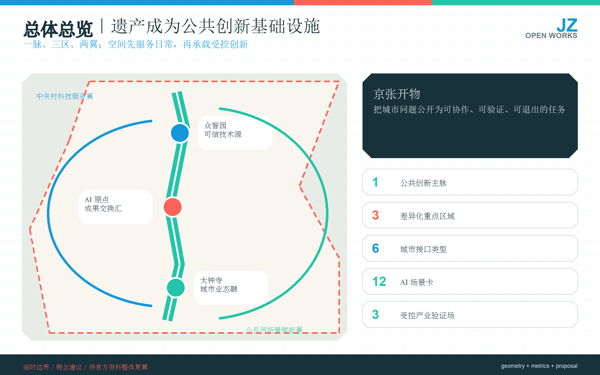
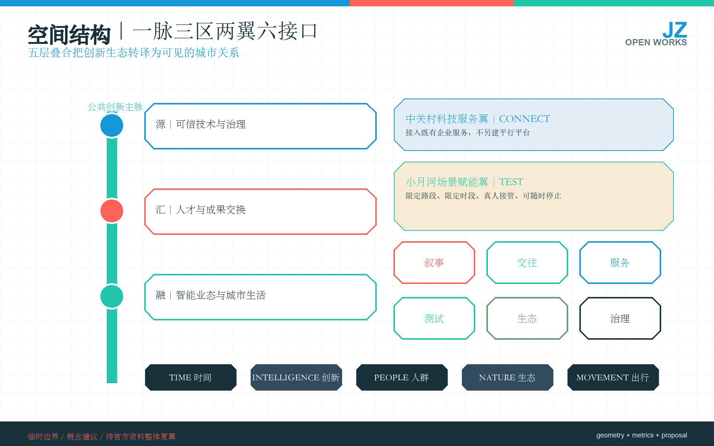
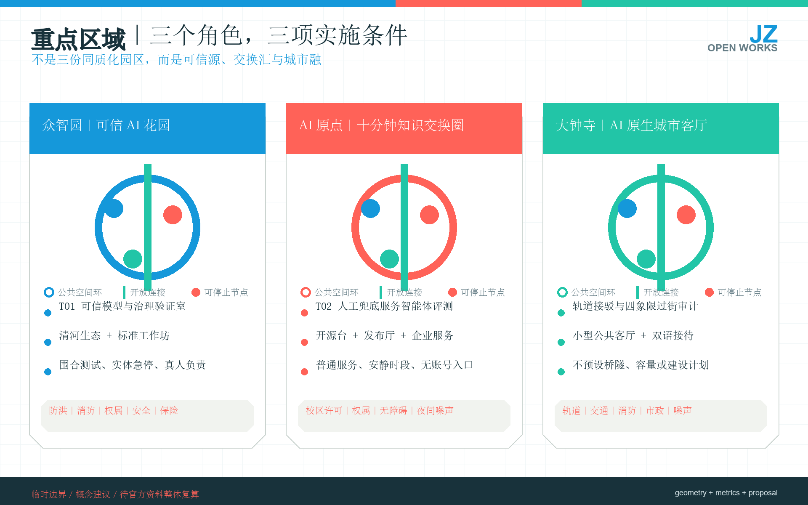
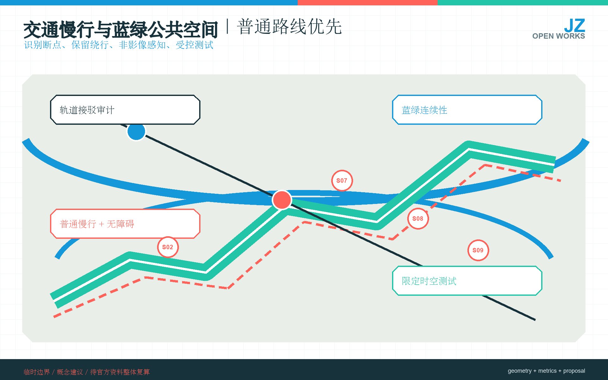
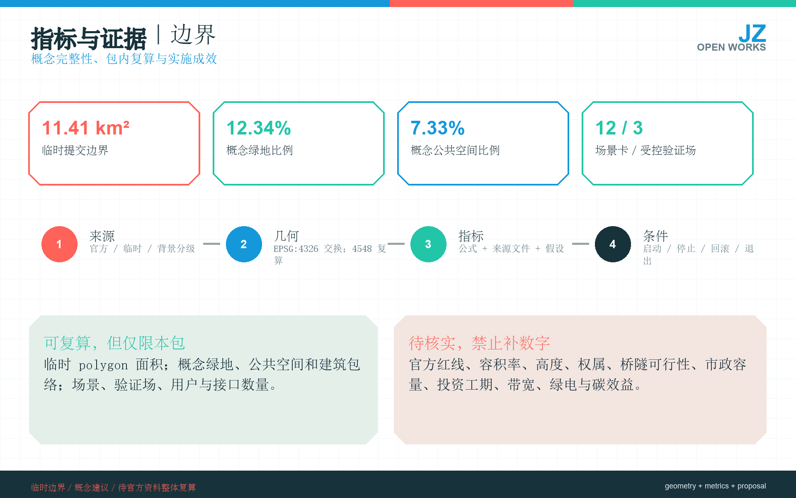

# 京张开物 / Jing-Zhang Open Works

> **核心主张**：京张开物不是把设备排成一条“科技秀带”，而是把百年铁路遗产转化为公共创新基础设施。以京张公共创新主脉串联众智园、北京 AI 原点社区和大钟寺三处重点区域，以中关村科技服务翼和小月河场景赋能翼提供支撑；每个 AI 场景都必须同时具备普通服务替代、真人责任人、最小数据、停止条件和公开复盘。所有空间动作均为概念建议，须在官方红线、控规、权属、交通、市政、消防、文保和运营主体补齐后由专业团队深化。

## 设计依据与资料清单

本 formal 方案以北京市规划和自然资源委员会海淀分局发布的《百年京张AI创新带城市设计国际方案征集资格预审公告》为第一依据，并以 `brief/site-package/` 中经维护者登记的临时粗略边界、重点区域、枚举、指标和来源清单为机器可读依据。AI agent 在生成方案前必须读取 `design_brief.json`、`allowed_design_space.json`、`sources.json`、`enums/`、`ranges/`、`schemas/`、`data/source_registry.json` 和 `data/processed/agent_fact_pack.md`，并用 `project_scope_summary.csv`、`agent_task_requirements.csv`、`source_use_matrix.csv`、`missing_data_checklist.csv` 建立任务、范围、资料用途和缺口清单。所有设计判断都要拆分为可追溯来源、可复算指标、可校验图层和可人工复核假设。公告要求方案达到控制性详细规划的城市设计深度和规划综合实施方案的城市设计深度，因此文本叙述不能替代 GeoJSON、指标表、A3 文册、A0 展板和 HTML 电子展示成果。

方案不是独立愿景文本，而是从公告、面向智能体任务书和场地资料出发组织成果；本节只把最关键依据放在判断旁边 [source:OFFICIAL-ANNOUNCEMENT] [source:AGENT-TASKBOOK] [depth:existing_conditions_diagnosis]。完整来源和标准覆盖分别保存在 `sources.json`、`standard_matrix.json` 与 `design_depth_matrix.json`，不在正文重复机器索引。

资料登记表的使用边界如下 [source:SOURCE-REGISTRY]：

- data/source_registry.json 登记公开、清权与临时资料的用途边界。
- 当前登记摘要：formal 可用资料 7 条，背景资料 1 条，provisional-only 资料 1 条。
- agent 不得把 background_only 或 provisional_only 资料升级为 official boundary、法定控规、正式评分依据或政府实施承诺。

`data/processed/agent_fact_pack.md` 是本方案的阅读导航层，不是新的权威来源 [source:PROCESSED-FACT-PACK]。它帮助 agent 把三层范围、三处重点区、公告任务、agent.1-agent.6、资料可用性和缺资料事项组织成可读方案；事实判断仍需回到已登记的原始材料 [source:OFFICIAL-ANNOUNCEMENT] [source:AGENT-TASKBOOK]，完整来源关系由 `sources.json` 保存。

本脚手架在官方 `SITE_BOUNDARY` 或三处 `KEY_AREA` 尚未取得时，使用 `brief/site-package/geometry/provisional_boundaries.geojson` 生成临时 formal 包。提交包中的 `geometry/site_boundary.geojson` 与 `geometry/key_areas.geojson` 均必须标注为 `provisional_constraint`、`official_boundary=false`，只能用于方案生成、自检、可视化和设计讨论，不能作为 official redline、审批依据、精确面积依据或法定控制结论。该组织方数据缺口本身不阻断内容评分；替换 official polygons 后，site boundary、key areas、land use、roads、green space、public space、buildings、phasing 和 metrics 均需重算。

本次脚手架生成的可评分状态为：**临时边界，保留精度警示并待正式数据发布后复算；不阻断内容评分**。因此，正文中的空间结构、场景、项目和指标均按“可讨论、可复核、可替换官方边界后重算”的原则写入；当官方边界和重点区 polygon 更新后，agent 必须重新运行脚手架、自检和图纸/HTML生成，不能只替换单个文件。

边界解释可回到总体范围图层和面积复算 [data:geometry/site_boundary.geojson#SITE-001] [metric:site_area_sqm]。

三处重点区则由独立图层和数量指标核对 [data:geometry/key_areas.geojson#PROV-KEY-001] [metric:key_area_count]。这意味着读者可以从正文进入证据，但不必先读一串机器编号。

## 三层范围工作框架

方案按照公告确定的三个层次组织工作：统筹研究范围关注 43.6 平方公里的AI产业生态、战略定位、创新链和未来城市形态；总体设计范围关注 11.4 平方公里京张遗址公园周边 1-2 公里城市地区和产业区，要求形成城市更新总体框架、产业空间布局、交通市政支撑和城市风貌控制；重点区域范围关注 368.4 公顷三处详细设计地区，要求明确功能业态、建筑规模、拆改留分类、公共空间连通和交通组织。三层范围在 `compliance_matrix.json` 中逐条映射，保证公告 1.3、1.4、1.5 与 agent.1-agent.6 的必选任务都有章节、图层、指标、图纸和 HTML 证据。

三层工作框架的深度项由 [depth:three_level_scope_framework] 和 [depth:overall_spatial_structure] 约束。

空间证据以 [data:geometry/site_boundary.geojson#SITE-001] 与 [data:geometry/key_areas.geojson#PROV-KEY-001] 为准；任务依据以 [standard:PROJECT-OFFICIAL-ANNOUNCEMENT] 为准。

范围索引以 [source:PROCESSED-FACT-PACK] 中 `project_scope_summary.csv` 的三层范围表为导航。

三层工作不是互相割裂的图纸集合。统筹研究决定产业链和城市形态判断，总体设计把判断落实到更新项目、空间结构和设施承载，重点区域详细设计验证具体地块、建筑、交通、公共空间和AI应用场景的可实施性。agent 生成方案时必须先锁定当前提交采用的 official 或 provisional 边界和约束，再生成用地、建筑、道路、绿地、公共空间、分期和AI服务节点，最后从这些图层复算指标并在正文解释哪些结论仍受 provisional boundary 限制。任何无法从结构化数据复算的面积、比例、规模或项目数量，不得写入正式结论。

本方案命名为 **“京张开物 / Jing-Zhang Open Works / JZ Works”**。“开物”既指把知识、技术和制度转化为可用之物，也指把城市问题公开为可协作的任务。总体形成“**一脉、三区、两翼、六类接口**”：以京张遗址公园及铁路遗存为公共创新主脉；众智园、北京 AI 原点社区、大钟寺分别承担可信技术源、成果交换汇、智能业态融；中关村科技服务翼连接现有企业服务平台，小月河场景赋能翼承载受控验证；叙事、交往、服务、测试、生态、治理六类接口把抽象创新链翻译成日常可感知空间。它们均是任务结构而非新增红线。[source:AGENT-TASKBOOK] [depth:overall_spatial_structure]

空间叠合采用五层方法：**Time** 保留铁路工程与中关村网络记忆；**Intelligence** 连接高校、企业、算力、开源与服务平台；**People** 优先居民、儿童、老年人、青年研究者、创业者和国际访客的日常需求；**Nature** 以遗址公园、清河、小月河和口袋空间形成韧性网络；**Movement** 把步行、骑行、无障碍和轨道接驳置于机动车展示之前。五层只表达关系，不替代控规和专项工程结论。[standard:MOHURD-URBAN-DESIGN-MEASURES]

| 层级 | 设计问题 | 方案回答 | 数据落点 |
| --- | --- | --- | --- |
| 统筹研究范围 | AI产业生态和未来城市形态如何组织 | 建立“高校策源-开源协作-企业转化-公共体验-国际传播”的创新链 | compliance_matrix.json、standard_matrix.json |
| 总体设计范围 | 产业空间、城市更新、交通市政和风貌如何落图 | 用地、建筑、道路、绿地、公共空间和分期图层共同表达 | [data:geometry/land_use.geojson#LU-001]、[data:geometry/roads.geojson#ROAD-001] |
| 重点区域范围 | 三处片区如何达到详细设计深度 | 分别提出定位、空间动作、AI场景和实施依赖 | [data:geometry/key_areas.geojson#PROV-KEY-001]、[data:geometry/key_areas.geojson#PROV-KEY-002]、[data:geometry/key_areas.geojson#PROV-KEY-003] |

## 统筹研究范围产业与未来城市研究

统筹研究范围的核心任务是构建世界级 AI 创新生态体系。方案应梳理海淀高校院所、头部企业、算力算法数据要素、孵化平台、上市企业、独角兽和科技服务资源，提出AI创新链、产业链、人才链和城市服务链的空间协同框架。命名方案和 logo 设计应服务于“百年京张文化带、都市AI生活体验带、AI融合创新带”的整体辨识度，不能只停留在口号，应说明与产业生态、公共空间和文化资源的关联。面向智能体任务书还要求回应“五大功能”和“三区两翼”协同，形成可继续深化的命名系统、视觉识别、总体空间结构图、场景开放和运营机制；本节必须用 [source:AGENT-TASKBOOK] 与 [standard:PROJECT-AGENT-OPEN-CALL-TASKBOOK] 标注这些要求来自 agent 开源征集任务，而不是法定规划控制。

统筹研究并不新增伪精确红线；它通过 [standard:MOHURD-URBAN-DESIGN-MEASURES] 要求的城市风貌、公共空间和建筑布局统筹，回接 [data:geometry/land_use.geojson#LU-001] 与 [data:geometry/public_space.geojson#PUBLIC-001]，说明产业策略最终要落到可见、可复核的空间结构。

总体结构深度由 [depth:overall_spatial_structure] 约束。京张铁路遗址公园一期已开放，公开资料给出的范围为清华东路至知春路、长约 2.5 公里、面积 16.8 公顷；2024、2025 年科技文化活动也证明“公园中的科技体验”已有真实受众，但不能据此推断全年稳定客流。[source:PARK-PHASE1] [source:PARK-EVENTS]

方案不另建平行产业平台，而是连接现有载体：北京 AI 原点社区承担近校成果转化和开源协作；大模型生态服务站提供政策、资金、算力、人才、伙伴、智力、空间和场景服务；AI 北纬社区作为区域协作对象。[source:AI-ORIGIN] [source:MODEL-SERVICE-STATION] [source:AI-NORTH-LATITUDE]

张家口与海淀已存在算力合作的官方信息，因此“张家口算力—海淀模型与场景”可作为接口方向，但带宽、绿电比例、时延和碳效益均列为待核验指标，不写成既成能力。[source:JZ-COMPUTE]

### 区域协同证据与接口矩阵

为避免把“区域协同”写成无主体、无证据的口号，本方案把任务书点名的五类协同对象拆成下表。表中“现有证据”只记录本包已登记来源能够支持的内容；“拟议交换”与“空间落点”均为待对方确认的设计建议，不构成合作协议、资源承诺或实施安排。[source:AGENT-TASKBOOK] [standard:PROJECT-AGENT-OPEN-CALL-TASKBOOK]

| 协同对象 | 本包现有证据 | 拟议交换能力（设计建议） | 京张空间落点 | 未确认、不得承诺 |
| --- | --- | --- | --- | --- |
| AI 北纬社区 | 已登记为区域协作对象；本包不掌握双方协议或运营数据 [source:AI-NORTH-LATITUDE] | 场景任务清单、社区反馈方法与公开复盘模板双向交换 | 北京 AI 原点社区的开源协作台、JZ-07 Open Works Guild | 牵头主体、常态活动、人员与经费 |
| 未来科学城 | 任务书要求建立协同关系；本包无项目级正式资料 | 研究问题清单与公共场景验证协议互换；具体学科与项目由正式协调确定 | 中关村科技服务翼的任务接口，不新增建设用地 | 参与机构、成果清单、数据授权、年度计划 |
| 怀柔科学城 | 任务书要求建立协同关系；本包无项目级正式资料 | 科学成果公共解释需求与城市公共空间原型方法互换 | 京张遗址公园叙事接口及可撤回展示窗口 | 展项、知识产权、策展主体、开放时间 |
| 北京经济技术开发区 | 任务书要求建立协同关系；本包无产品或测试合作凭证 | 智能制造/机器人需求与 S09、T03 受控测试协议互换；产品能力须另行验证 | 小月河场景赋能翼的有界验证场，不进入普通路线常态运行 | 产品性能、道路测试资格、保险、采购与落地 |
| 张家口及京津冀 | 已有海淀—张家口算力合作方向的公开信息 [source:JZ-COMPUTE] | 可核验算力服务证据与海淀模型/场景需求接口；采用同一审计和退出记录 | JZ-07 服务台与 T01 专业验证流程，不以设施图标冒充已建能力 | 带宽、时延、容量、绿电比例、碳效益、价格与 SLA |

区域接口只有在责任主体、授权范围、最小交换数据、服务基线、验收方式、退出机制和维护预算被书面确认后，才可从“设计建议”升级为试点。未确认前，不在图纸中画作既有网络，不把访问、签约意向或活动参与计为实施绩效。

六个国际案例只提取机制，不复制强度：Kendall Square 的公共空间与政策协同、King's Cross 的工业遗产日常化、one-north/Kampong AI 的设施—政策—社区一体化。[source:CASE-KENDALL] [source:CASE-KINGS-CROSS] [source:CASE-ONE-NORTH]

STATION F 的集中服务平台、MaRS 的长期策展运营、大沙河的校区—园区—社区协作进一步说明运营方的重要性。[source:CASE-STATION-F] [source:CASE-MARS] [source:CASE-DASHAHE]

京张的对应结论是“少量强节点 + 分布式公共接口 + 明确运营方”，而不是把整条走廊改造成单一孵化园。

未来城市形态研究应回答人工智能如何改变工作、生活、社交、学习、交通和公共服务。海淀城市更新政策已明确创新交往带、存量产业空间、无界首层、无障碍适老和 AI 友好方向，这为低扰动更新提供政策一致性，但不等于任何具体项目已经批准。[source:URBAN-RENEWAL] 方案应把AI交通系统、连续绿色空间、创新服务设施和国际化生活工作氛围落实为可定位的功能区、节点、廊道和场景，而不是泛泛描述技术愿景。agent 应把产业战略指标、AI创新指数、人才密度、空间供给类型和AI+垂直应用重点区域写入指标体系，并标明哪些是官方、哪些是设计建议、哪些仍待正式数据校准。若提出全球AI创新活动、开发者社区、开放场景或朝圣路线，应写为“概念建议/参考方案/可供专业团队深化研究”，不得写成已经确定的政府活动或实施安排。

## 总体设计范围城市更新与控规深度城市设计

总体设计范围要求达到控制性详细规划的城市设计深度。方案必须提出城市更新总体空间结构、低效空间识别、更新项目清单、实施政策建议、产业功能比例、空间组织模式、建筑总规模和综合承载能力评估。`geometry/land_use.geojson` 应完整覆盖设计边界且无重叠，`geometry/buildings.geojson` 应表达更新建筑基底或保留建筑基底，`geometry/roads.geojson` 应表达微循环、慢行和轨道接驳关系，`metrics.json` 应复算核心面积、比例和图层数量。

本节按照 [standard:MOHURD-CONTROL-DETAILED-PLANNING] 把控规深度内容拆成可审查对象：[data:geometry/land_use.geojson#LU-001] 表达用地结构，[data:geometry/buildings.geojson#BLDG-001] 表达建筑基底。

交通组织由 [data:geometry/roads.geojson#ROAD-001] 表达，概念建筑包络由 [metric:building_footprint_area_sqm] 复核；[depth:land_use_layout] 管理用地成果深度。

开发强度在缺少官方控规条件时待正式数据补齐，由 [depth:development_intensity_controls] 管理。

总体设计还必须支撑交通、轨道、市政和配套设施。方案应围绕轨道站点一体化、道路微循环、非机动车停放、停车供给、创新服务平台、人才生活服务、新型基础设施、分布式能源和端侧算力提出空间布局和实施路径。涉及建筑高度、开发强度、道路红线、退线和设施标准的内容，若尚无官方控制条件，应写为“待正式控规条件确认”，不得以 agent 推测值冒充审定指标。

## 重点区域详细设计

重点区域详细设计是必选项。众智园AI自主创新加速区应围绕国家人工智能平台、全栈自主创新、标准制定、安全治理、产业展示、对外交通、清河文化、低碳绿色创新交往环境和绿色空间AI场景提出详细方案。北京AI原点社区应围绕近校创新、成果孵化转化、人才特区、开源体系、品牌活动、建筑拆改留、成果展示发布、居住生活配套、校区园区慢行联系和轨道站点一体化提出详细方案。大钟寺AI产业聚集区应围绕领军企业、智能体、智能终端、内容消费、数据要素、数字资产、商业服务、规划绿地复合利用、大钟寺站一体化和路口四象限步行连通提出详细方案。

三处重点区域详细设计必须引用 [data:geometry/key_areas.geojson#PROV-KEY-001]、[data:geometry/key_areas.geojson#PROV-KEY-002]、[data:geometry/key_areas.geojson#PROV-KEY-003]。

成果由 [depth:three_key_area_detailed_design] 检查是否达到规划综合实施方案深度。若只描述“打造示范区”而没有功能、建筑、交通、公共空间和实施项目证据，应被视为未完成。

三处重点区域必须在 `geometry/key_areas.geojson` 中出现。若仓库已提供 official polygons，应作为 `official_constraint` 使用；若 official polygons 缺失，可暂用 `provisional_constraint`，但正文、HTML、sources、assumptions 和 self_check 必须说明它不能作为正式评分或审批依据。`compliance_matrix.json` 应分别覆盖公告 1.5.3.1、1.5.3.2、1.5.3.3。设计表达应包含功能业态、建筑规模、建筑形态、拆改留分类、公共空间系统、交通组织、慢行连通和实施项目。HTML 页面应能切换查看三处重点区域，A3 文册和 A0 展板应至少包含重点片区总图、局部详图和指标说明。

| 重点片区 | 设计定位 | 空间动作 | AI产业与运营场景 | 证据引用 |
| --- | --- | --- | --- | --- |
| 众智园AI自主创新加速区 | 花园型全栈自主创新街区 | 强化清河界面、产业展示、低碳创新交往和对外交通组织；以绿色空间承载开放测试与标准治理展示 | 自主模型测试、标准制定工作坊、安全治理展示、低碳算力体验 | [data:geometry/key_areas.geojson#PROV-KEY-001]、[depth:three_key_area_detailed_design] |
| 北京AI原点社区 | 近校型成果转化与人才社区 | 组织校区、园区、街区慢行缝合；补足成果发布、人才服务、居住生活和开源协作空间 | 开源社区、成果发布、人才特区服务、近校孵化 | [data:geometry/key_areas.geojson#PROV-KEY-002]、[source:AGENT-TASKBOOK] |
| 大钟寺AI产业聚集区 | 城市型智能经济与国际交往街区 | 围绕大钟寺站一体化、四象限步行连通、商业服务和重点企业公共环境更新 | 智能体与智能终端展示、内容消费、数据要素与国际路演 | [data:geometry/key_areas.geojson#PROV-KEY-003]、[metric:key_area_count] |

## AI 创新生态、人才画像与 AI+ 场景

场景库从真实用户任务出发，不从设备清单出发。公共空间场景对应 [data:geometry/public_space.geojson#PUBLIC-001]，慢行与交通场景对应 [data:geometry/roads.geojson#ROAD-001]，开放空间场景对应 [data:geometry/green_space.geojson#GREEN-001]。

已登记的空间比例只说明本次概念图层的分配关系 [metric:public_space_ratio] [metric:green_ratio]，不等于法定绿地率或审定用地比例。

| 用户画像 | 被观察到或可合理推定的任务 | 空间与服务响应 | 不可越过的边界 |
| --- | --- | --- | --- |
| P01 周边居民 | 通勤、散步、安静休息、报修与社区服务 | 连续普通慢行路线、纸质/人工报修、活动分时分区 | 不做商业画像，不以活动挤占日常通行 |
| P02 儿童与照护者 | 安全探索、科普、厕所与停留 | 可视化铁路科普、可撤回互动装置、照护者视线连续 | 不采集儿童人脸、声音或可识别轨迹 |
| P03 老年人与数字弱势群体 | 无障碍、看得懂的导视、真人帮助 | 大字导视、坐凳、人工窗口、无账号服务 | AI 不能成为唯一入口，重大决定不得自动化 |
| P04 大学生与青年研究者 | 开源协作、成果发布、低成本试验 | 原点社区开源台、预约工位、小型发布厅 | 校园数据、科研成果和代码许可需另行授权 |
| P05 创业者与研发人员 | 政策/算力/法务服务、产品验证、客户连接 | 对接既有生态服务站、受控测试场、路演客厅 | 不承诺政策资金、算力额度或政府采购 |
| P06 国际访客与专业代表团 | 双语导航、理解历史与产业、短时会面 | 双语普通导视、公共体验路线、预约讲解 | 不依赖个人画像，不把企业宣传当公共事实 |

### 12 张场景卡：7 项近期原型 + 5 项有条件试点

| ID | 场景、位置与用户 | 最小可行版本 | 数据与真人责任 | 启动/停止条件 |
| --- | --- | --- | --- | --- |
| S01 | 遗产双语导览；遗址公园；P01/P02/P06 | 二维码与无账号网页，讲清铁路遗存和中关村创新史 | 只用清权内容；公园运营方审稿 | 内容清权且人工巡检后启动；错误无法当天纠正即下线 |
| S02 | 无障碍断点共绘；全线；P01/P03 | 纸质、热线和网页并行上报坡道、路面、照明问题 | 位置最小化、公开聚合；属地管理人员派单 | 有责任部门和闭环时启动；涉及个人信息或无人接单即停止 |
| S03 | 开物问题台；原点社区；P04/P05 | 把企业/社区问题转为公开任务卡，保留线下提交 | 任务发布人确认范围和许可；开物社主持 | 权责/数据许可清楚后发布；无人负责或权利不明则撤回 |
| S04 | 既有企业服务导航；服务翼；P05 | 接入既有大模型生态服务站目录，不另建平行平台 | 官方公开目录 + 真人顾问终审 | 目录可更新、咨询责任明确时启动；过期率超阈值即暂停 |
| S05 | 公园科技活动助手；一期公园；P01/P02/P06 | 日程、容量、安静时段和纸质地图，不做人群预测 | 活动主办方维护；现场总控拥有停机权 | 许可、消防、疏散、噪声条件齐备后启动；拥挤或投诉触发降载 |
| S06 | 开源贡献与修复账本；三重点区；P04/P05 | 展示已清权代码、数据、公共问题修复记录 | 贡献者许可 + 维护人复核 | 可验证贡献才发布；争议或许可证失效立即隐藏 |
| S07 | 低技术微气候提示；蓝绿节点；P01/P03 | 温湿度/雨量等非影像传感器 + 人工告示 | 设备校准记录；物业/公园维护 | 校准和维护预算落实后启动；漂移或失修即撤下 |
| S08 | 慢行拥挤与绕行提示；站点/断点；P01/P03/P06 | 先用人工观察和非识别计数做短周期测试 | 只存聚合计数；交通/公园人员确认 | 影响评估、显著告知和普通路线保留后试点；误导或投诉超阈值即停 |
| S09 | 低速机器人封闭测试；小月河翼；P05 | 围合时段、低速、现场安全员、实体急停 | 不用公共视频画像；测试运营方负责 | 消防、保险、路权、网络隔离、接管演练齐备后启动；任一近失事故触发停测 |
| S10 | 人工兜底服务智能体评测；原点社区；P03/P05 | 在机构内评测咨询准确率、转人工率和申诉闭环 | 脱敏题库；业务机构承担最终答复 | 专业机构、隐私评估和申诉通道齐备后启动；重大误答即冻结模型 |
| S11 | 可信模型与治理验证室；众智园；P04/P05 | 红队测试、模型卡、数据卡和回滚演练，不开放公共决策 | 企业/实验室提供清权样本；独立评审 | 权利、安全和责任主体齐备后启动；证据链不完整则不发布结果 |
| S12 | 医疗/养老服务导航；合作机构；P03 | 只做挂号、地点、政策解释和转人工，不做诊断处方 | 医疗/养老机构真人终审；最小必要数据 | 机构协议、合规审查和人工值守齐备后试点；无人值守或误导即停 |

S01-S07 可依托现有公园、活动、服务平台和低风险技术逐步原型化；S08-S12 均以专业机构、封闭/受控环境、保险、隐私影响评估和真人接管为前置条件。[source:ROBOT-SCENARIOS] [source:PIPL] [source:VIDEO-REGULATION]

公共数据仍需按授权制度申请；医疗与养老服务必须由专业机构和真人承担最终责任。[source:PUBLIC-DATA-RULES] [source:AI-MEDICAL] [source:AI-ELDERLY]

### 三个产业测试验证场

- **T01 可信模型与 AI 治理验证室｜众智园**：验证模型卡、数据卡、红队测试、权限、回滚和事件复盘；面向企业和实验室，不承担公共审批或重大权益决定。
- **T02 人工兜底公共服务智能体评测站｜北京 AI 原点社区**：以脱敏任务台账检验准确率、拒答、转人工、申诉和无账号替代服务；任何“只给 AI 不给真人”的方案不得进入公共窗口。
- **T03 低速机器人与非影像环境感知测试园｜小月河场景赋能翼**：限定路段、限定时段、现场安全员、实体急停、保险和近失事故登记；未取得路权、消防、网络安全和运营许可前不进入开放公园。

数据治理遵循最小必要、目的限定、显著告知、分级授权、可解释、可申诉和可删除。公共场所不得以“创新体验”为由持续识别人脸、情绪或个体轨迹；医疗、法律、养老、规划、采购等高影响任务必须由真人作最终判断。公共数据按目录、场景价值和必要性申请，不能把“开源”误写为无条件数据调用权。[source:PIPL] [source:VIDEO-REGULATION] [source:PUBLIC-DATA-RULES]

## 用地、建筑规模与拆改留方案

用地方案应依据国土空间调查、规划、用途管制分类等公开标准表达，形成完整、闭合、无缝的用地分区。建筑方案应区分保留、改造、更新、新建或待确认对象，明确建筑基底、功能、规模、风貌、屋顶、体量和高度控制的建议层级。若缺少现状建筑、权属、控规和工程条件，方案只能提出方法和待校准清单，不能编造拆改留结论。

用地分类依据 [standard:MNR-LAND-USE-CLASSIFICATION-GUIDE]，建筑高度、体量、界面和风貌控制由 [depth:height_massing_character] 管理，拆改留方法由 [depth:retain_renovate_demolish] 管理。

用地和建筑的主要证据是 [data:geometry/land_use.geojson#LU-001]、[data:geometry/buildings.geojson#BLDG-001] 和 [metric:building_footprint_area_sqm]。

本包的 `land_use.geojson` 是为了验证拓扑、指标和三层任务传导而建立的**概念功能分配图**，不是现状土地调查、法定用地方案或地块划分；`buildings.geojson` 表达概念介入包络，不是现状建筑普查或已批准建筑基底。因此建筑基底面积、绿地与公共空间比例只在“提交设计图层内部”可复算，不得外推为现状或审定指标。总建筑规模、容积率、建筑高度、建筑密度、绿地率、退线和建筑控制线因缺少官方条件而待正式数据补齐；取得官方红线、控规和现状普查后须整体重做，而不是只改数字。[source:BOUNDARY-SOURCE] [source:KEY-AREA-SOURCE]

## 交通、轨道、市政与公共服务设施

交通方案应回应公告对轨道站点一体化、道路微循环、慢行断点、对外交通、停车、非机动车停放和绿色交通系统的要求。重点应覆盖北五环、京张遗址公园跨环路节点、五道口、清华东路西口、大钟寺站及重点企业周边交通联系。道路和慢行图层应保持在提交边界内，并与公共空间、绿地、产业节点和重点片区相互校核；若提交边界为 provisional，交通结论也只能作为临时设计讨论。

交通和市政专业深度分别由 [depth:traffic_rail_slow_parking] 与 [depth:municipal_new_infrastructure] 约束；图层证据引用 [data:geometry/roads.geojson#ROAD-001]。

公共空间与待补约束分别引用 [data:geometry/public_space.geojson#PUBLIC-001] 和 [data:geometry/constraints.geojson#CONSTRAINTS]。当道路红线、管线、消防和市政条件缺失时，应通过 assumptions 说明待补，而不是把策略写成审定条件。

现有轨道和道路确实造成部分东西向通行阻隔，但新增桥梁、隧道或贯通线只能进入“问题点 + 比选任务”，不能在概念方案中宣布可建。[source:ACCESS-BARRIER]

市政和公共服务设施应覆盖AI产业服务设施、创新服务平台、人才生活服务设施、新型基础设施、分布式能源、端侧算力和传统市政设施融合。方案应说明设施标准、空间布局、服务半径、运营模式和分期实施逻辑。缺少管线、能源、排水、防洪、消防等工程资料时，应列为正式深化前置条件。

## 蓝绿空间、公共空间与城市风貌

蓝绿空间方案应以京张遗址公园活力带为骨架，统筹清河、小月河、周边高校、企业、社区出行需求，提出南北贯通、东西连通的步道、骑行道和绿色空间体系。方案应识别慢行断点、上跨环路节点、公园南端和北端景观节点，提出停车、体育、创新交往、科技测试、应用展示和公共服务复合利用策略。

蓝绿公共空间由设计深度项和绿地、公共空间图层共同校核 [depth:blue_green_public_space] [data:geometry/green_space.geojson#GREEN-001] [data:geometry/public_space.geojson#PUBLIC-001]。

绿地与公共空间比例在正文解释设计意义，完整复算保存在 `metrics.json`；城市风貌、公共空间和建筑控制的统筹则回到专业标准矩阵 [standard:MOHURD-URBAN-DESIGN-MEASURES]。

文化叙事采用“连接的四次进化”：铁轨连接城市、园路连接社区、网络连接世界、开源连接共同创造。品牌只使用自制文字系统与几何线形，不直接使用企业商标、人物肖像或未清权历史照片。中文主名“京张开物”、英文名“Jing-Zhang Open Works”、短名“JZ Works”，社区名“开物社 / Open Works Guild”；“Works”同时表示作品、工作场与系统如何运作。

三处常设锚点和一处年度装置构成可核验的“朝圣”系统：L01 清华园站与铁路遗存解释工程史；L02 网络连接锚点解释中关村与互联网连接史，具体日期和展陈内容须经档案复核；L03 “开源一英里”只展示已清权的贡献、公共问题修复与维护责任；L04 年度智能原点装置为临时、可拆卸、通过结构/消防/用电审查的年度作品，不预设永久地标。轨距 1435 毫米只作为导视模数和身体尺度线索，不被包装为神秘数字或精确城市控制线。[source:PARK-PHASE1]

## 更新项目清单、实施政策与分期计划

实施方案应形成可审查的更新项目清单，说明项目位置、类型、功能、责任主体、依赖条件、实施阶段、风险和评估指标。政策建议应覆盖城市更新统筹实施、空间供给、运营机制、产业服务、公共参与、数据治理和产权协同。`geometry/phasing.geojson` 应表达分期范围，`compliance_matrix.json` 应把每个任务与分期和图纸挂接。

项目清单和分期深度由 [depth:renewal_project_list] 与 [depth:phasing_implementation] 管理，分期空间证据为 [data:geometry/phasing.geojson#PHASE-001]。如果没有权属、资金、实施主体和审批路径，方案必须把它写成实施风险，而不是承诺落地。

| 项目编号 | 项目名称 | 类型 | 主要依赖 | 证据引用 |
| --- | --- | --- | --- | --- |
| JZ-01 | 普通慢行与无障碍断点审计 | 公共空间/交通 | 官方红线、交通组织、无障碍审查、属地责任人 | [data:geometry/roads.geojson#ROAD-001] |
| JZ-02 | 众智园可信 AI 花园 | 蓝绿空间/受控测试 | 河道蓝线、防洪、消防、测试运营方和保险 | [data:geometry/green_space.geojson#GREEN-001] |
| JZ-03 | 原点社区十分钟知识交换圈 | 城市更新/产业服务 | 校区边界、权属、首层业态、安静时段 | [data:geometry/buildings.geojson#BLDG-001] |
| JZ-04 | 大钟寺 AI 原生城市客厅 | 轨道一体化/公共交往 | 轨道站点、四象限过街、噪声、消防与市政 | [data:geometry/public_space.geojson#PUBLIC-001] |
| JZ-05 | 三个受控产业验证场 | 新基建/产业服务 | 专业机构、清权数据、安全评估、人工接管 | [data:geometry/constraints.geojson#CONSTRAINTS] |
| JZ-06 | 开源一英里与公共体验路线 | 文化/运营 | 遗产审查、贡献许可、普通路线和活动安全 | [data:geometry/phasing.geojson#PHASE-001] |
| JZ-07 | 开物社与 JZ-PATCH 运营台 | 治理/社区 | 公共征题、维护预算、申诉和退出机制 | [source:AGENT-TASKBOOK] |

实施由 **JZ-PATCH 城市补丁协议**控制。每个补丁必须填写八个字段：问题与受益人、空间范围、普通服务基线、数据与许可、真人责任人、验收指标、停止/回滚条件、维护与退出预算。流程为“公开征题—事实核查—小范围原型—独立复核—限时公共窗口—扩展/修复/退休”，任何阶段都不能跳过责任主体和普通替代服务。

### JZ-01—JZ-07 阶段门槛与责任表

以下门槛采用“先测基线、再由有权主体设阈值”的方法，不把本包没有依据的数字写成目标。责任角色是项目启动前必须落实的岗位，不表示相应单位已经接受委托。[depth:phasing_implementation]

| 项目 | 责任角色与必需证据 | 基线/校准方法与决定权 | 停止、重启与审计交接 |
| --- | --- | --- | --- |
| JZ-01 普通步行与无障碍审计 | 授权项目业主、无障碍专业人员、道路/公园/站点维护方；官方边界、权属、路线现状、障碍记录 | 以人工踏勘、使用者陪同行走和维护记录建立基线；由设施权属方会同无障碍专业人员确认整改阈值 | 施工占路、替代路线中断或风险未闭环即停止；整改复核后重启；保留问题单、照片、复核人和移交维护方 |
| JZ-02 众智园可信 AI 花园 | 场地权属方、运营方、安全/消防/防洪/网络安全专业人员、保险责任人；许可与应急预案 | 先记录普通开放、生态与安全基线，再校准测试窗口；由权属方和相应专业审查方共同决定 | 近失事件、越界采集、校准失效或投诉无法处理即关闭；独立复核与演练通过后重启；形成版本、事件、回滚和退场档案 |
| JZ-03 原点十分钟知识交换圈 | 校园/园区/街区权属与运营方、无障碍与噪声责任人、人工服务负责人；开放许可和服务目录 | 以现有人工服务、步行可达性和安静时段记录为基线；由运营方与属地管理方确认窗口 | 普通服务被替代、夜间扰民、信息失真或无人接管即暂停；目录核验和责任人恢复后重启；交接服务台、更新周期和撤除清单 |
| JZ-04 大钟寺 AI 原生城市客厅 | 站点/道路/商业/消防/市政相关权属方和专业设计团队；交通、消防、市政与人流资料 | 先做普通步行、换乘、疏散和公共服务基线；任何工程阈值由有审批权的专业部门确定 | 阻断通行、疏散条件不足、容量不明或投诉积压即停止公共窗口；专项复核后重启；移交运营、保洁、安保和设施台账 |
| JZ-05 三个受控验证场 | 各验证场机构负责人、独立评审人、数据/安全负责人、现场接管人；测试协议、样本授权、保险与应急预案 | 使用离线/沙盒任务、人工基准和接管演练校准；由机构负责人和独立评审人共同放行 | 严重错误、越权输出、近失事件、无法回滚或申诉失效即冻结；根因修复和复测通过后重启；保存模型/数据版本、决定、事件和退役记录 |
| JZ-06 开源里程与公共路线 | 内容维护人、版权/许可复核人、公共空间维护方；来源、许可、无障碍和撤除方案 | 以人工导览、既有标识和通行基线对照；由内容责任人与空间权属方批准上线 | 权利争议、事实错误、导视干扰或维护中断即下线；清权、纠错和现场复核后恢复；移交内容仓库、版本历史与撤除责任 |
| JZ-07 Open Works Guild 与 JZ-PATCH 服务台 | 经确认的协调主体、问题发布人、受益人代表、数据/采购/维护责任人；任务章程、授权与退出预算 | 以现有投诉、报修和服务渠道为普通基线；由法定责任主体决定是否进入试点或扩大 | 无责任人、无普通替代、无预算、无申诉或超出授权即不启动/退出；补齐条件并重新核查后重启；公开保留决定、验收、维护、移交与退役摘要 |

### S08—S12 有条件场景放行表

| 场景 | 放行证据与校准 | 决定权 | 停止/重启、记录与退役 |
| --- | --- | --- | --- |
| S08 步行拥挤与绕行提示 | 先用人工观察和不识别个人的计数建立普通基线，核对告知、替代路线和误报处理 | 道路/站点/活动现场责任人及隐私负责人 | 误导绕行、识别个人、普通路线不可用即停；修正并人工复核后恢复；保存校准、提示版本、投诉和删除记录 |
| S09 低速机器人有界测试 | 明确时空围界、路权、保险、安全员、物理停机与接管演练 | 场地权属方、测试机构和安全责任人共同放行 | 任一近失、越界、停机/接管失败即停；根因闭环和重复演练后重启；测试结束即撤除设备、标识和临时数据 |
| S10 真人兜底服务智能体评估 | 去标识任务集、人工答案基线、转人工和申诉测试 | 提供服务的机构保留最终决定权，独立评审人签署评估结论 | 严重错误、无法转人工、申诉失败即冻结版本；修复复测后重启；保留版本、样本授权、错误与移交记录 |
| S11 可信模型与治理实验室 | 已清权样本、模型/数据卡、红队、回滚和独立复核 | 机构模型责任人和独立评审人共同决定，公共空间运营方无权替代 | 证据链断裂、越权发布、无法回滚即停；补链和完整复核后重启；模型退役时撤销访问并保留审计摘要 |
| S12 医疗/养老服务导航 | 仅使用经确认的地点、挂号和政策信息；以人工窗口为基线，不做诊断处方 | 持证专业机构和现场真人作最终决定 | 内容过期、用户误解、转人工失败或出现诊疗输出即停；专业复核后恢复；删除临时数据并移交维护责任 |

分五个实施阶段推进：Phase 0 先补官方红线、重点区、控规、现状建筑/权属、交通市政、文保和运营主体；Phase 1 用 S01-S07 做可撤回的低风险原型；Phase 2 只在条件齐备的机构/封闭环境启动 T01-T03；Phase 3 在证据充分后由专业团队深化公共空间和建筑更新；Phase 4 才讨论京张算力协同、国际活动与跨区域合作。投资额不在本轮编造，采用“工作包—前置条件—责任角色—验收—退出”代替伪精确造价和工期。

长期运营由“开物社 / Open Works Guild”承担社区协作层，不替代政府、产权人和专业运营机构。年度节律为：春季问题征集与无障碍审计、夏季受控场景开放、秋季开物大会与成果发布、冬季维护复盘与退休清单。企业招引的转化路径是“问题—测试—证据—服务/采购合规评估—空间承载”，不能把活动到访直接等同于落地投资。[source:AGENT-TASKBOOK]

## 指标体系、面积复算与合规矩阵

指标体系至少应包含总体设计范围面积、重点区域面积、绿地与公共空间比例、建筑基底、更新项目数量、AI场景节点、慢行连通指标、产业空间指标、人才服务指标和自检状态。所有已知指标必须能从 GeoJSON 或可信来源复算；待正式数据补齐的指标必须给出原因和正式提交前置条件。空间复核与视觉复核结果是正式自检的重要证据。

指标复算遵循统一的设计深度要求 [depth:metrics_recalculation]。正文重点解释指标的设计含义，例如总体范围如何约束空间分配、蓝绿和公共空间比例如何支撑日常交往；完整数值、公式、来源文件和置信度保存在 `metrics.json`。示例关键指标可由总体范围和绿地数据复核 [metric:site_area_sqm] [data:geometry/green_space.geojson#GREEN-001]。

合规矩阵是任务响应性的主控文件。每条公告任务和 agent_taskbook 任务必须对应到报告章节、图层、指标、图纸、HTML 页面、来源、假设和自检项。未能覆盖公告 1.3、1.4、1.5 或 agent.1-agent.6 的任一必选任务，方案不得进入 formal professional scoring。

指标分三类：第一类是可由**当前提交几何**复算的包内指标，例如临时边界面积、概念绿地/公共空间比例和概念建筑包络面积；第二类是需要官方控规和专项资料支撑的管控指标，例如容积率、建筑高度、建筑密度、退线、道路红线和设施标准；第三类是需要真实运营台账才能形成的绩效指标，例如无障碍问题闭环率、转人工率、投诉/近失事故、服务满意度、维护成本和补丁退休率。

当前只把 12 个场景、3 个验证场和 6 类用户作为方案内容计数；不把它们写成已实施成效。[metric:scenario_count] [metric:testbed_count] [metric:persona_count]

六类城市接口同样是概念分类，不是已建成设施。[metric:interface_type_count]

## 风险、版权与合规说明

**要求双语言。** 方案主文件可使用中文或英文，但必须通过 `proposal.en.md` 或 `proposal.zh.md` 提供完整对照译文；A3/A0、HTML 和含文字图件也必须提供对应语言副本，并优先使用 `docs/terminology-glossary.md` 的赛事推荐译法。v2 包缺少任一必需译稿、语言映射或有效文件时，finalize 与 CI 会阻断提交。所有图片、图纸、图标、数据和代码资产必须在 `sources.json` 或 `report/copyright_statement.md` 中说明来源、许可和授权状态。HTML 页面不得加载远程脚本、远程地图瓦片、远程字体、iframe、表单或外部 API，不得跟踪评审者行为。

风险和缺资料清单由风险深度项、约束图层和场地包共同校核 [depth:risk_missing_data] [data:geometry/constraints.geojson#CONSTRAINTS] [source:SITE-PACKAGE]。`missing_data_checklist.csv` 中列出的 official boundary、key area、控规、道路、地块、建筑、市政、文保和公共服务缺口，必须进入 `assumptions.json`、自检和正文风险章节。任何缺少官方控规、道路红线、权属、市政、消防或文保条件的结论，都必须降级为待确认事项；完整专业核对保存在标准矩阵中。

本方案不声称官方批准、审定控规、最终土地权属、最终建设规模或保证实施。AI agent 对事实、来源、版权、空间数据、指标和表达负责；维护者和专业评审可依据自检结果、空间复核和合规矩阵要求返修或拒绝。

## 参考资料

- brief/public-brief.md
- brief/site-package/design_brief.json
- brief/site-package/allowed_design_space.json
- brief/site-package/enums/
- brief/site-package/ranges/planning_limits.json
- data/processed/agent_fact_pack.md
- data/processed/project_scope_summary.csv
- data/processed/agent_task_requirements.csv
- data/processed/source_use_matrix.csv
- data/processed/missing_data_checklist.csv
- 完整机器索引：见 `sources.json`、`metrics.json`、`compliance_matrix.json`、`standard_matrix.json` 与 `design_depth_matrix.json`
- 本节书目入口依据场地包登记，完整出处和许可见结构化来源清单 [source:SITE-PACKAGE]
