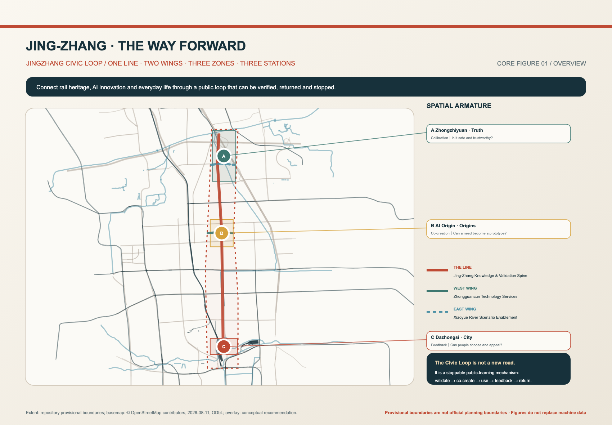
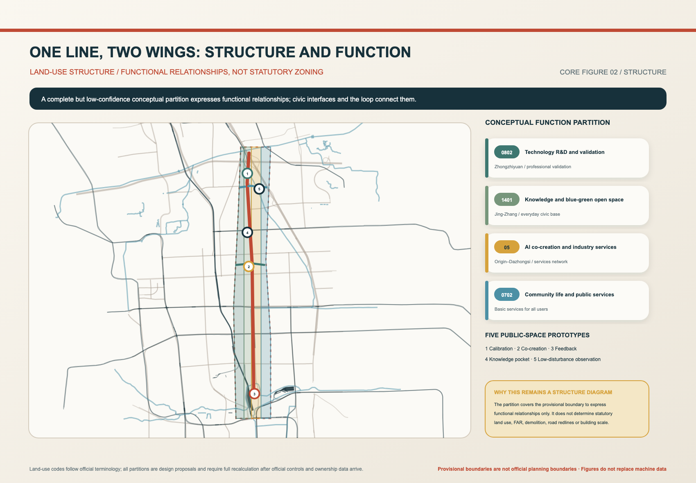
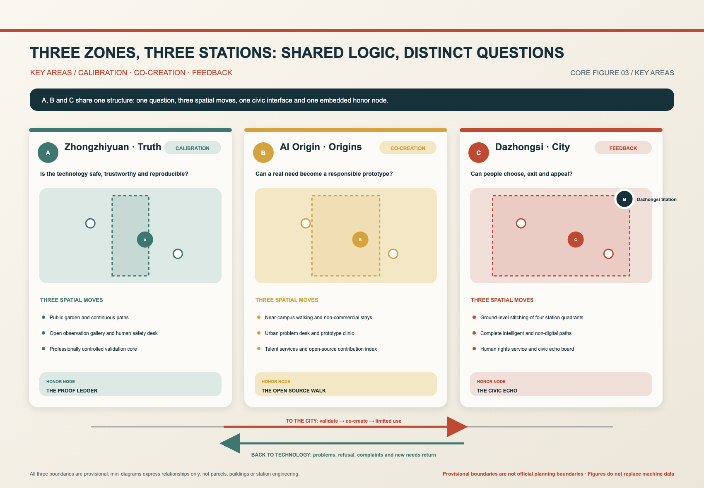
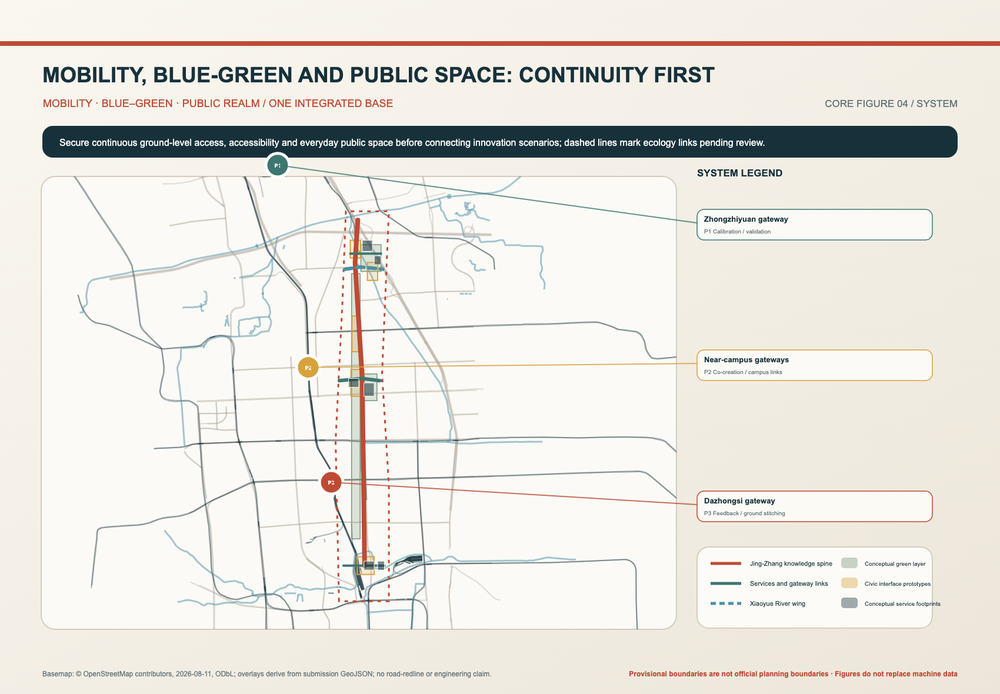
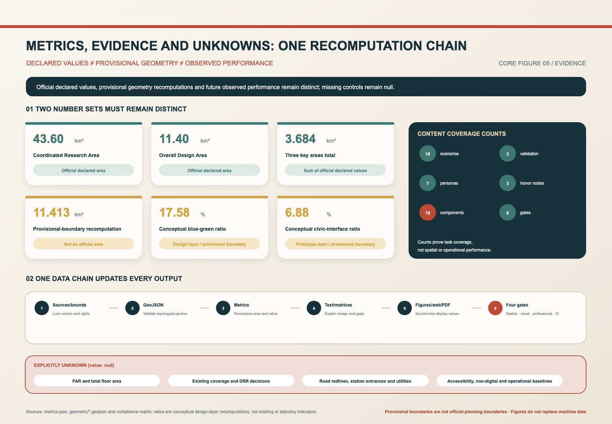

# JING-ZHANG · THE WAY FORWARD

**THE JINGZHANG CIVIC LOOP**

**Cultural proposition: A century-old railway did not end at arrival; a responsive intelligent city begins by answering back.**

“The Way” carries three meanings: the physical path of the Jingzhang Railway, a disciplined search for evidence and limits, and the public’s right to question technology. The proposal therefore treats AI neither as decoration nor as an automated endpoint. It places innovation in a civic learning loop: validate, co-create, use within limits, receive feedback, return, and revise.

## Design Basis and Source List

The official announcement and the agent-oriented taskbook establish the three spatial scopes, three key areas, required design depth, and six agent tasks covering identity, scenarios, personas, landmarks, and long-term operation [source:OFFICIAL-ANNOUNCEMENT] [source:AGENT-TASKBOOK]. The site package, source registry, and processed fact pack distinguish formal evidence from background or provisional generated content [source:SITE-PACKAGE] [source:SOURCE-REGISTRY] [source:PROCESSED-FACT-PACK].

Local snapshots of professional standards support urban-design, regulatory-plan, and land-use language but do not replace statutory planning conditions [source:URBAN-DESIGN-MEASURES] [source:CONTROL-DETAILED-PLANNING] [source:LAND-USE-CLASSIFICATION]. Generative-AI and barrier-free regulations are cited only where applicable, without extending specific provisions into universal legal conclusions [source:GENERATIVE-AI-MEASURES] [source:BARRIER-FREE-LAW].

The overall boundary and three key areas are provisional coarse polygons used only for generation, topology checks, and design discussion [source:BOUNDARY-SOURCE] [source:KEY-AREA-SOURCE]. They are not official redlines, and their rectangular edges are not streets or parcel boundaries. Low-contrast roads, railways, waterways, and stations in the core figures come from a local OSM background snapshot and provide orientation only [source:OSM-BACKGROUND].

The bilingual HTML embeds an OFL-licensed Noto Sans CJK character subset for offline rendering, avoiding remote-font dependencies and missing Chinese glyphs [source:FONT-NOTO-CJK]. The existing-conditions diagnosis separates official declarations, provisional geometry recalculations, and matters still requiring fieldwork or official data; it does not derive precise existing-condition claims from temporary boundaries [depth:existing_conditions_diagnosis].

The figure keeps provisional boundaries subordinate and moves long labels into the margins with leader lines. The temporary geometry recalculates to 11,412,825.386 square metres, serving as an input check rather than replacing the official declared area of 11.4 square kilometres [data:geometry/site_boundary.geojson#SITE-001] [metric:site_area_sqm].

## Three-Level Scope Framework

The three scopes are one nested decision system. The 43.6-square-kilometre coordinated research area addresses industrial, talent, and future-city cooperation; the 11.4-square-kilometre overall design area addresses renewal, mobility, blue-green systems, and public services; the 368.4-hectare key-area scope tests those ideas through detailed spatial interfaces [metric:coordinated_research_area_declared_sqm] [metric:overall_design_area_declared_sqm] [metric:key_detailed_design_area_declared_sqm].

The taskbook’s spatial brief is organised into a legible hierarchy [standard:PROJECT-OFFICIAL-ANNOUNCEMENT] [depth:three_level_scope_framework]:

- **One line:** the Jingzhang Public Knowledge and Innovation Validation Line, the north–south civic spine;
- **Two wings:** the Zhongguancun Technology Service Wing and the Xiaoyue River Scenario Enablement Wing;
- **Three districts:** the three detailed-design areas;
- **Three stations:** public interfaces embedded in those districts—Zhongzhiyuan for calibration, AI Origin for co-creation, and Dazhongsi for feedback;
- **One civic loop:** a mechanism through which projects may proceed, return, pause, or exit.

Four conceptual functional zones cover the provisional overall boundary in one coordinate system, linking research validation, blue-green open space, industrial services, and community services [data:geometry/land_use.geojson#LU-001] [depth:land_use_layout]. They are `design_proposal` concepts rather than statutory land-use amendments [depth:overall_spatial_structure].

## Coordinated Research Area: Industry and Future City Research

The AI ecosystem follows a non-linear sequence: issue, knowledge, validation, translation, use, feedback, and revalidation. Universities and communities articulate real issues; AI Origin convenes prototypes and teams; Zhongzhiyuan provides safety, embodied-intelligence, and data-compliance validation; Dazhongsi collects neutral feedback from actual use. The Zhongguancun wing supplies legal, intellectual-property, investment, standards, and talent services, while the Xiaoyue River wing admits only ecologically screened low-impact scenarios. Failure, refusal, and complaints return a project to an earlier step [standard:PROJECT-AGENT-OPEN-CALL-TASKBOOK].

The content layer contains 10 scenario cards, 3 industrial validation scenarios, 7 personas, 3 honour-display nodes, 19 public-space components, and 6 public validation gates [metric:scenario_card_count] [metric:industry_validation_scenario_count] [metric:persona_count]. The Proof Ledger, Open Source Walk, and Civic Echo are embedded records of origin, failure, contribution, and revision; they are not a fourth spatial hierarchy [metric:honor_display_node_count].

The identity system uses rail red, evidence teal, river blue, and co-creation gold. Wayfinding presents place, direction, distance, open status, and non-digital service before branding. The cultural narrative joins Jingzhang engineering history, Zhongguancun innovation history, and public AI validation without replacing historical evidence with promotion.

### Global AI Innovation Ecosystem Cases: Transfer Mechanisms, Not Scale

The comparison uses first-party pages from each project or operator and focuses on governance mechanisms and spatial carriers. It does not infer investment, company counts, output, government partnerships, approvals, or delivery commitments. Across seven cases, the relevant lesson for the Civic Loop is a legible sequence of entry, graded validation, plural review, public feedback, and exit—not the wholesale replication of an institution, resource base, or policy setting.

| Place and project | Governance / industry mechanism | Spatial carrier | Reliable source | Known limitation | Transferable element | Not directly transferable |
|---|---|---|---|---|---|---|
| Toronto, Canada · Vector Institute | Independent not-for-profit governed by a board, connecting research, talent, and organisational adoption | Research and collaboration space in the Schwartz Reisman Innovation Campus | Vector official overview [source:CASE-VECTOR-TORONTO] | Research space is not generally open for tours and is not a public-district governance model | Separate research, adoption services, and public communication; state access limits clearly | Institutional governance, funding conditions, and campus status cannot be assumed in Beijing |
| Montréal, Canada · Mila | Not-for-profit research institute connecting universities, open science, responsible AI, industry, and startup support | Mile-Ex research and collaboration premises plus a university network | Mila official overview [source:CASE-MILA-MONTREAL] | An institute ecosystem is not an entire urban district, and public pages do not prove public-realm outcomes | Combine open science, ethics review, and translation while recording provenance and contribution | Talent concentration, university alliances, and local institutions cannot be copied directly |
| Seoul, Republic of Korea · Seoul AI Hub | City-established specialist platform jointly operated by university and research partners, supporting talent, startups, R&D, and industry collaboration | Anchor and support spaces in Yangjae | Seoul Metropolitan Government policy archive [source:CASE-SEOUL-AI-HUB] | Authorisation, policy, and industry conditions are city-specific | Separate the public sponsor, academic / research operator, and staged support services | Its mandates, incentives, siting, and partnerships do not automatically apply to the Civic Loop |
| Singapore · AI Singapore | National programme office connecting research institutions, enterprise problems, talent, governance, and open tools | Networked programme platform hosted by the National University of Singapore | AI Singapore official website [source:CASE-AI-SINGAPORE] | A national programme is not an urban-design district and has a different mandate and eligibility model | Continuous pathway from real problem to project, talent, and reusable tools | National authority, funding, and programme eligibility are not available by implication |
| Paris-Saclay, France · Hi! PARIS | Inter-university interdisciplinary centre combining technical research with management, legal, and societal questions | Distributed Palaiseau / Saclay campus network | Hi! PARIS official governance page [source:CASE-HI-PARIS] | An academic consortium is not a public-service operator | Joint technical, business, legal, and societal review | Consortium branding, membership, and campus resources cannot be treated as callable assets |
| Zürich, Switzerland · ETH AI Center | Cross-department university hub connecting research, talent, entrepreneurship, industry, and public engagement | Zürich Oerlikon offices plus the university network | ETH AI Center official overview [source:CASE-ETH-AI-CENTER] | Relies on university organisation and academic access; it is not a city testing permit | Interdisciplinary review, public engagement, and research translation interfaces | University authority, facilities, and talent conditions cannot be transplanted |
| Berlin, Germany · Merantix AI Campus | Private operator convening workspace, residencies, events, and a practitioner community | Membership- and event-oriented AI Campus | Merantix AI Campus official overview [source:CASE-MERANTIX-BERLIN] | Operator-authored source; access is curated and private, so it is not a public-governance model | Visible participation entry, cohorts, recurring practitioner community, and residency | Private selection, investment relationships, and membership cannot replace equitable public service |

The resulting local judgement is to let AI Origin receive open issues and developer participation, Zhongzhiyuan perform graded validation, and Dazhongsi collect feedback from actual use. The Zhongguancun wing adds IP, legal, and talent services, while the Xiaoyue River wing admits only ecologically screened low-impact tests. None of the cases proves that cooperation, sites, investment, or policy permission has been secured.

### Regional Collaboration Structure: Five Proposed Interfaces

All relationships below are **conceptual cooperation pathways / recommendations**, not signed, approved, or already-open resources. External nodes retain responsibility for their facilities, data, people, approvals, and services. The Civic Loop may receive, refer, log, and validate work inside its own three stations, but it cannot grant permission on behalf of an external party.

| External node | Proposed relationship to one line, two wings, three districts / stations | Knowledge / talent / test / service / feedback flow | Proposed interface | Responsibility boundary | Trigger |
|---|---|---|---|---|---|
| Beiwei Community | Community issues enter AI Origin through the line; everyday service feedback returns through Dazhongsi | Resident issues and local knowledge → Origin; non-digital service and use feedback → Dazhongsi → issue desk | Public issue ledger, staffed rights desk, community review seat | Consent and existing services remain with their responsible parties; stations may not default-collect, replace basic service, or speak for the community | Voluntary issue with clear purpose, accountable lead, exit, and non-digital route enters G0 |
| Future Science City | Research and talent referrals connect to the Zhongguancun service wing and AI Origin | Methods / talent / prototypes → Origin; validation questions and review results ← stations | Periodic open call and joint technical review seat | No assumed access to laboratories, people, data, or name; resource managers decide availability | Cleared problem brief, named lead, and conflict disclosure before matching |
| Huairou Science City | AI-for-science methods and instrument-related needs are referred to controlled calibration at Zhongzhiyuan | Methods / test protocols / negative results ↔ Zhongzhiyuan | Controlled validation docket and reproducibility record | Stations cannot authorise external instruments, research data, or safety conditions; they record only local validation | Data, IP, safety classification, and reproducibility conditions complete before G1–G2 |
| Beijing Economic-Technological Development Area | Industrial and embodied scenarios move to Zhongzhiyuan testing and Dazhongsi service-impact review | Scenario need → Zhongzhiyuan; limited test → Dazhongsi; use / maintenance feedback → responsible party | Industry scenario permit card, emergency stop, and maintenance log | No procurement, investment, attraction, or site promise; site operator retains safety and production duties | Site, technical lead, insurance / emergency, and bypass plan named before G2–G3 |
| Beijing–Tianjin–Hebei | The line indexes cross-city knowledge, wings refer services, and stations share reviewable methods | Problem taxonomy, talent leads, test protocol, service directory, and feedback summaries move both ways | Shared challenge taxonomy, annual cross-regional review, reciprocity checklist | No assumed cross-jurisdiction approval, data sharing, or standards reciprocity; each place retains statutory and data duties | Reciprocal data licence, accountable parties, complaint, and exit channels before minimum-necessary exchange |

The proposed flow is always external issue or knowledge → AI Origin registration and matching → Zhongzhiyuan closed / controlled test → Dazhongsi use feedback → review by the original responsible party. If external permission, data rights, site safety, or an accountable owner is missing, collaboration stops at referral and does not proceed to testing.

## Overall Design Area: Urban Renewal and Regulatory-Plan-Level Urban Design

The renewal method is “public foundation first, existing assets first, reversible pilots first, evidence-triggered expansion.” Reliable parcels, ownership, existing-building surveys, road redlines, and municipal conditions are not yet available; the proposal therefore makes no precise demolition, new floor-area, underground-connection, or fixed FAR commitment [standard:MOHURD-CONTROL-DETAILED-PLANNING] [depth:development_intensity_controls].

Six reversible service prototype footprints test spatial relationships among a shared validation hall, observation walk, prototype clinic, talent services, human rights desk, and civic review space [data:geometry/buildings.geojson#BLDG-001] [depth:retain_renovate_demolish]. Their temporary total of 346,178.609 square metres is neither a survey of existing footprints nor a committed construction quantity [metric:building_footprint_area_sqm].

Controls are divided into three classes: interface, access, public-space, and reversible-use principles that can be proposed now; retain, renovate, repair, or remove recommendations that await building and field surveys; and FAR, height, density, setbacks, roads, utilities, fire safety, and heritage conditions that must await official data. Height and massing protect heritage sightlines, reduce ground-level pressure, and form walkable edges without inventing precise numbers [standard:MOHURD-ARCH-DESIGN-DEPTH-2016] [depth:height_massing_character].

## Detailed Design of Key Areas

All three key areas use the same information structure: one core question, three spatial actions, one public interface set, one honour-display node, and explicit conditions for phasing [data:geometry/key_areas.geojson#PROV-KEY-001] [depth:three_key_area_detailed_design]. There are 3 key areas, with official declared areas of approximately 192.1, 104.3, and 72.0 hectares [metric:key_area_count] [metric:zhongzhiyuan_area_declared_sqm] [metric:ai_origin_area_declared_sqm].

### A · Zhongzhiyuan / Ask the Truth — Calibration Interface

Zhongzhiyuan asks whether technology is safe, trustworthy, and reproducible. A public garden and continuous route lead to an open observation walk and staffed safety desk, with a professionally controlled core beyond. SC-05 Model Safety Range, SC-06 Graded Embodied-Intelligence Test, and SC-07 Data and Compliance Sandbox form the three industrial validation scenarios. People may observe the method but cannot be involuntarily enrolled. The Proof Ledger records versions, failures, reproduction conditions, and stop decisions.

### B · AI Origin / Ask the Source — Co-creation Interface

AI Origin asks whether real issues can become responsible prototypes. Near-campus walking and non-commercial stay space connect to a civic issue desk, prototype clinic, talent-life services, and open work network. SC-08 Prototype Clinic connects residents, universities, city services, and small teams, while mentors, resident representatives, and professional service providers review matches. The Open Source Walk shows problems, permissions, contributions, and reuse relationships and permits attribution to be withdrawn [data:geometry/key_areas.geojson#PROV-KEY-002].

### C · Dazhongsi / Ask the City — Feedback Interface

Dazhongsi asks how actual users can accept, refuse, correct, or stop an urban AI service. The station marker sits above all other graphic layers in the diagram. A daily-life forecourt, staffed rights desk, quiet interview rooms, and the Civic Echo turn use, refusal, complaint, and maintenance into traceable urban feedback [data:geometry/key_areas.geojson#PROV-KEY-003]. The declared Dazhongsi area is approximately 720,000 square metres [metric:dazhongsi_area_declared_sqm].

## AI Innovation Ecosystem, Personas, and AI+ Scenarios

Ten scenario cards cover shared knowledge and services, trustworthy validation, co-creation, civic use and rights, and ecological observation. Each card identifies the issue owner, users, AI/non-AI modes, spatial carrier, data boundary, success criteria, failure signals, accountable party, exit path, and its return station. The 6 validation gates are problem legitimacy, data permission, safety and accessibility, ecological impact, responsibility, and post-use feedback [metric:public_validation_gate_count].

Seven composite personas represent a student founder, research engineer, small-enterprise operator, nearby older resident, wheelchair user, young family member, and international visitor. They are decision lenses rather than synthetic biographies. Every scenario must retain a visible non-AI route, human assistance, and a usable exit.

The three industrial validation scenarios are deliberately limited to spaces with professional control at Zhongzhiyuan. Other scenarios remain public-service or co-creation pilots rather than loosely defined “AI industries.” Their operation follows a six-gate sequence and returns failed proposals to the responsible station instead of hiding rejection.

## Land Use, Building Scale, and Retain-Renovate-Demolish Strategy

The conceptual land-use file contains four polygons covering the provisional site [data:geometry/land_use.geojson#LU-004]. The building file contains six reversible service envelopes. It does not identify existing buildings, ownership, structural condition, heritage status, or committed new construction [data:geometry/buildings.geojson#BLDG-006].

The retain–renovate–demolish strategy is therefore procedural: survey first; retain structures with heritage, embodied-carbon, spatial, or community value; adapt safe and serviceable assets; repair interfaces before replacing buildings; and consider removal only after risk, utility, and public-benefit evidence. Before official data arrive, mapped envelopes remain reversible prototypes.

Density, FAR, total floor area, height, and setbacks remain unknown. This is a professional limitation, not an omission to be concealed; the package preserves them as `null` and defines how they will be recalculated once official control conditions and surveys are available [depth:retain_renovate_demolish].

## Transport, Rail, Municipal Infrastructure, and Public Services

The mobility network contains six conceptual links: the Jingzhang public knowledge line, the Zhongguancun service wing, the Xiaoyue River enablement wing, and three portal connections [data:geometry/roads.geojson#RD-001] [depth:traffic_rail_slow_parking]. They indicate desired continuity, not approved road or rail alignments. Railway crossings, walking catchments, parking supply, and road sections require official transport data and field surveys.

Solid lines in the figure denote proposed continuous public links; dashed lines denote conditional or provisional links and are explicitly defined in the legend. A dotted outline marks provisional key-area boundaries. The diagram does not infer a bridge, tunnel, or crossing from a graphic intersection.

New infrastructure follows minimum necessary sensing, local-first processing, open interfaces, manual override, and published maintenance responsibility [depth:municipal_new_infrastructure]. Public services include staffed issue, safety, prototype, rights, maintenance, and review desks. Digital tools may extend these services but may not replace a complete non-digital route.

## Blue-Green Network, Public Space, and Urban Character

Three conceptual green polygons form a linear greenway, ecological observation wing, and neighbourhood ecological patch [data:geometry/green_space.geojson#GREEN-001]. Five public-space prototypes form station forecourts, co-creation and feedback interfaces, and continuous public links [data:geometry/public_space.geojson#PS-001]. Temporary geometry yields 2,005,963.247 square metres of green space and 785,276.338 square metres of public space, with ratios of 0.175764 and 0.068806; none is a statutory target [metric:green_space_area_sqm] [metric:green_ratio] [metric:public_space_area_sqm].

Why emphasise entry, exit, complaint, and accountability? AI scenarios affect access, perception, data collection, service entry, and responsibility in public space. Urban design therefore arranges not only form but also openings, time, bypasses for non-participants, human service, and risk limits [standard:MOHURD-URBAN-DESIGN-MEASURES] [depth:blue_green_public_space].

Urban character is not defined by screens, robots, or spectacle. New components should be low, reversible, maintainable, and legible; provenance and uncertainty of historic material should remain visible; lighting should be low-impact and time-controlled.

## Renewal Projects, Implementation Policy, and Phasing

Five project packages cover public knowledge and basic services, trustworthy validation, origin co-creation, civic use and rights, and blue-green observation. Evidence preparation precedes reversible pilots, controlled connections, and network operation. A project moves forward only when its problem, data, responsibility, accessibility, ecology, and exit path are clear.

The phasing layer contains trigger-based zones rather than promised dates [data:geometry/phasing.geojson#PHASE-001] [depth:phasing_implementation]. If a gate fails, the proposal returns to the preceding phase, reduces scope, or stops. Each project needs an issue owner, place/service operator, technical accountable party, independent evaluator, public representatives, complaint handler, and annual auditor.

The renewal list includes the public knowledge foundation, three reversible station pilots, portal and barrier-free repairs, controlled validation facilities, ecological baselines, and annual operation [depth:renewal_project_list]. Policies address fair booking, flexible reuse of existing space, scenario permits, data minimisation, minority opinions, maintenance budgets, and archival of failed work.

### Long-Term Operation: Five Proposed Paths from Issue to Retention or Exit

Every role below is a **proposed role for future agreement**. No organisation is represented as appointed, partnered, or responsible for enterprise attraction. Each path keeps a human entry, written decision, exit, and archive. “Conversion” means passing review into a next stage; it does not mean procurement, investment, establishment, or permanent retention.

| Operating path | Proposed lead and review roles | Entry and exit | IP and attribution | Proposed cadence | Issue—test—conversion—retention / exit | Future measurable indicators; no current performance value |
|---|---|---|---|---|---|---|
| Developer community | Lead: community operations secretariat; review: technical, ethics / rights, IP, and public-representative panel | Public issue repository, code / proposal submission, or offline clinic; participants may leave future activity while licensed history remains marked with exit | Background IP stays with its owner; new work selects a licence per project; provenance ledger records contribution and permits withdrawal of future display attribution without rewriting released history | Monthly issue clinic; quarterly demonstration and maintenance review | Issue → team → G0/G1 → closed prototype → review → maintained, graduated / referred, archived, or exited | Active maintainers, first-response time, reuse, withdrawal handling time, maintainer diversity |
| Annual programme | Lead: annual assembly and event planning group; review: factual content, accessibility, safety, and public-representative group | Open calls with offline entry; insufficient evidence or safety may postpone / cancel, and participants may exit future stages | Separate permission and attribution for talks, exhibits, media, and translations; attendance never implies training or commercial reuse permission | Spring issues, summer closed validation, autumn public defence, winter review | Call → selection and conflict disclosure → test → public reasoning → continue next year, narrow, or stop | Issue-source diversity, gate completion, accessible sessions, public decisions, repeat participation |
| Scenario opening | Lead: scenario permit office and actual site operator; review: privacy, accessibility, ecology, safety, maintenance, and complaint panel | Permit-card application and staffed entry; operator, participant, or reviewer may pause; data returned / deleted under agreement at closure | Data purpose, background / foreground IP, model, and device responsibility recorded separately; only licensed material published | Monthly batches or explicit windows; G4 extended only after review | Issue → risk classification → G2 closed test → G3 controlled test → G4 limited use → G5 retain, return, or remove | Permit cycle time, stop rate, near-miss record, complaint closure, non-digital completion, retention after two cycles |
| International communication | Lead: bilingual editorial and partner liaison group; review: factual status, source, licence, and translation panel | Bilingual evidence packets and public submissions; request correction, removal of unlicensed material, or end contact | Authors, translators, data, and images attributed separately; translation does not change ownership or imply partner endorsement | Quarterly bilingual brief and annual exchange; major updates follow evidence | Register source → translate → fact / licence review → publish → external feedback → correct, continue, or archive | Source completeness, correction time, bilingual coverage, qualified responses, licensed reuse |
| Enterprise attraction and conversion | Lead: industry service and first-use coordination group; review: public interest, conflict, IP / data, procurement, and site-responsibility panel | Open challenge and first-use application with no hidden paid entry; mismatch, failed gate, or voluntary exit receives written reason and data disposition | Background / foreground IP and trial licence separated; display by mutual consent; test creates no procurement, investment, or attraction commitment | Quarterly batch review; limited first use discussed only after G3 | Issue → fit review → G1/G2 → limited trial → public-value review → service referral → local retention, expansion elsewhere, or exit | Qualified applications, decision time, gate completion, retention / exit reasons, IP / compliance disputes |

All five paths share one decision record: who raised the issue, who allowed entry, what was tested, who was affected, when it stopped, how data were disposed, how work was attributed, and the next review date. Future indicators require a defined method and responsible collector before operational facts can populate them; the proposal does not invent present performance.

## Metrics, Area Recalculation, and Compliance Matrix

Metrics are separated into official declarations, provisional geometry recalculations, and future field or operational performance. The official three-key-area total is 3,684,000 square metres; operational measures such as barrier-free completion, non-digital service completion, everyday public-space retention, adaptive reuse, and feedback closure require later surveys or operation [metric:key_detailed_design_area_declared_sqm] [depth:metrics_recalculation].

The machine-authoritative order is GeoJSON, metrics, matrices and manifest, narrative, then figures/HTML/PDF. Figures never prove boundaries or areas. Known content counts and temporary layer recalculations are explicit; total floor area, FAR, existing building density, road ratio, and operating performance remain `null`. Once official boundaries arrive, all geometry, metrics, and drawings must be updated together.

The task-coverage matrix addresses announcement clauses 1.3, 1.4, and 1.5 and agent tasks 1–6. The standards and design-depth matrices cover six registered standards and 15 required depth items. CI does not design the city; it prevents missing translations, stale hashes, invalid layers, and numerical contradictions.

## Risk, Copyright, and Compliance

Risks cover data privacy, public safety, civic rights, ecology and water, operational responsibility, and statutory spatial conditions. Each risk has a trigger, first action, and return point: stop collection and isolate data after unauthorised capture; emergency-stop and restore circulation after a near miss; suspend public experience if exit or complaint fails; remove equipment after ecological disturbance; revert to staffed/offline service if responsibility fails; and stop precise placement when official conditions contradict assumptions [depth:risk_missing_data].

The proposal does not claim government approval, committed investment, fixed construction scale, or engineering feasibility. `constraints.geojson` remains intentionally empty because an empty collection is more truthful than fabricated control geometry. All concept areas and ratios require recalculation; provisional warnings remain visible.

Figures were generated by the submitter and Codex from package data and locally cleared/public backgrounds. OSM attribution follows ODbL; public government texts are cited; no news photos, unauthorised personal materials, remote fonts, or external tracking are used. Project-level legal, data, fire, transport, water, ecology, consumer-rights, and accessibility review remains necessary.

## References

- Beijing Municipal Commission of Planning and Natural Resources, Haidian Branch, official Jingzhang AI Innovation Belt design-call announcement [source:OFFICIAL-ANNOUNCEMENT].
- Agent-oriented open-call taskbook [source:AGENT-TASKBOOK].
- Ministry of Housing and Urban-Rural Development, urban-design and regulatory-plan measures [source:URBAN-DESIGN-MEASURES] [source:CONTROL-DETAILED-PLANNING].
- Ministry of Natural Resources, land-use and sea-use classification guide [source:LAND-USE-CLASSIFICATION].
- Interim Measures for Generative AI Services and the Barrier-free Environment Construction Law [source:GENERATIVE-AI-MEASURES] [source:BARRIER-FREE-LAW].
- open-city-ai/haidian site package, source registry, local standards snapshots, and provisional boundaries [source:SITE-PACKAGE] [source:SOURCE-REGISTRY] [source:BOUNDARY-SOURCE].
- OpenStreetMap contributors, local background snapshot dated 2026-08-11, ODbL [source:OSM-BACKGROUND].
- Official institutional / project pages from Vector Institute, Mila, Seoul AI Hub, AI Singapore, Hi! PARIS, ETH AI Center, and Merantix AI Campus, used only for mechanism comparison.

Full provenance, licences, limits, and access dates are in `sources.json`; formulas and confidence are in `metrics.json` [metric:site_area_sqm]; task, standards, and design-depth coverage are in the three machine-readable matrices [depth:metrics_recalculation].
