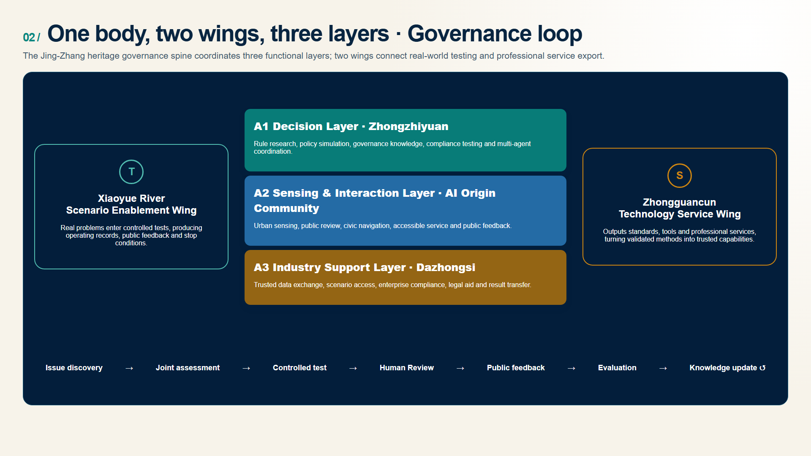
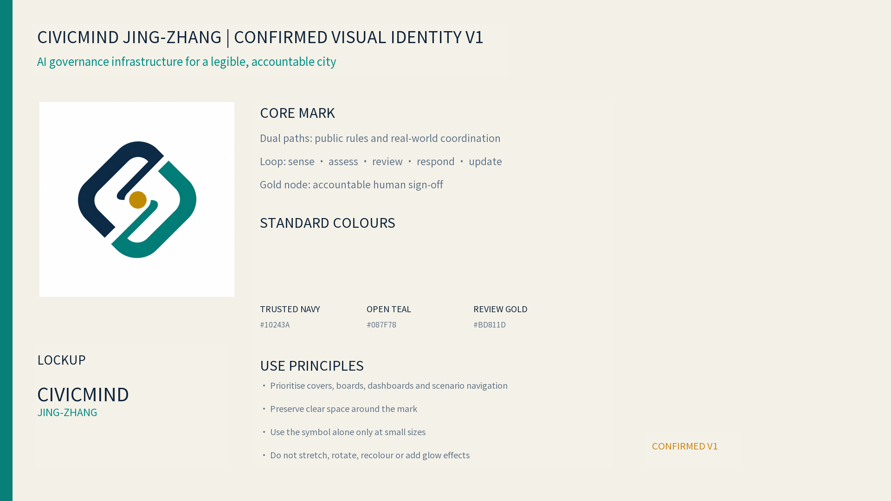
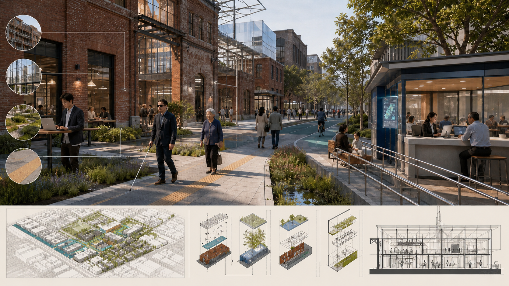
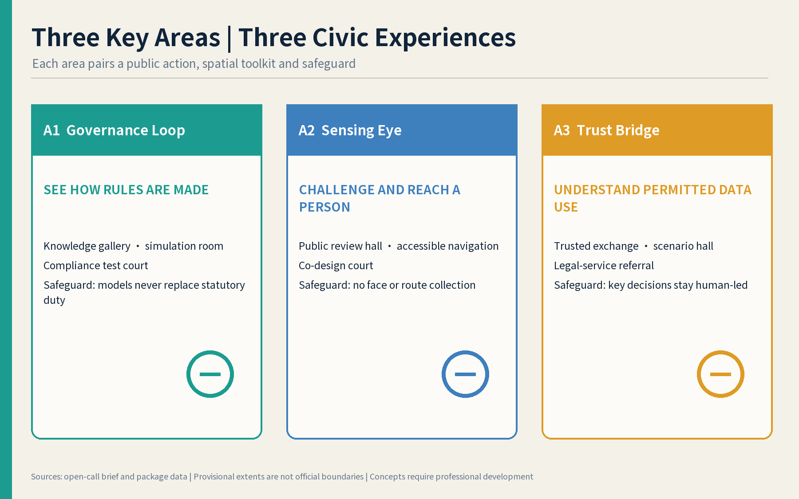
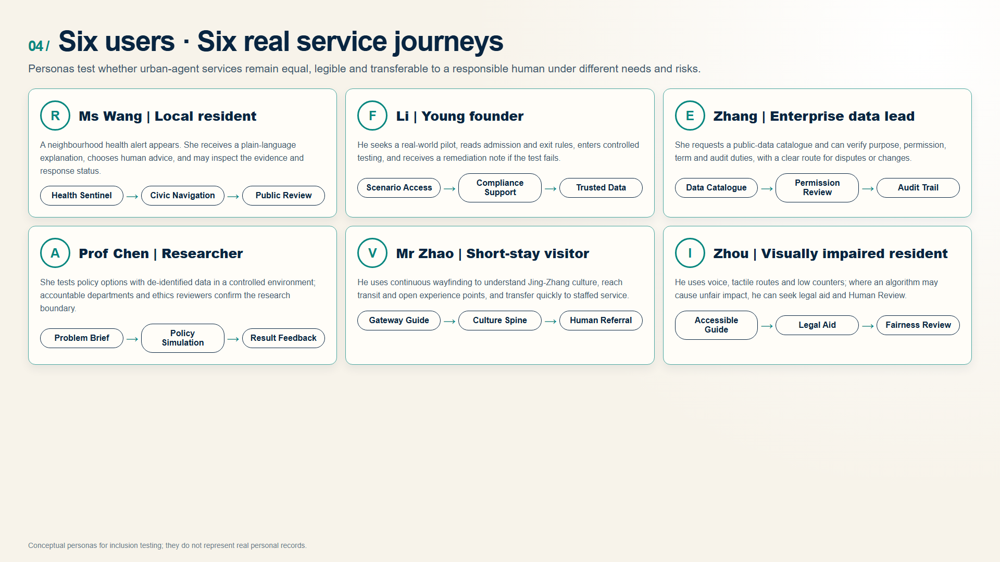
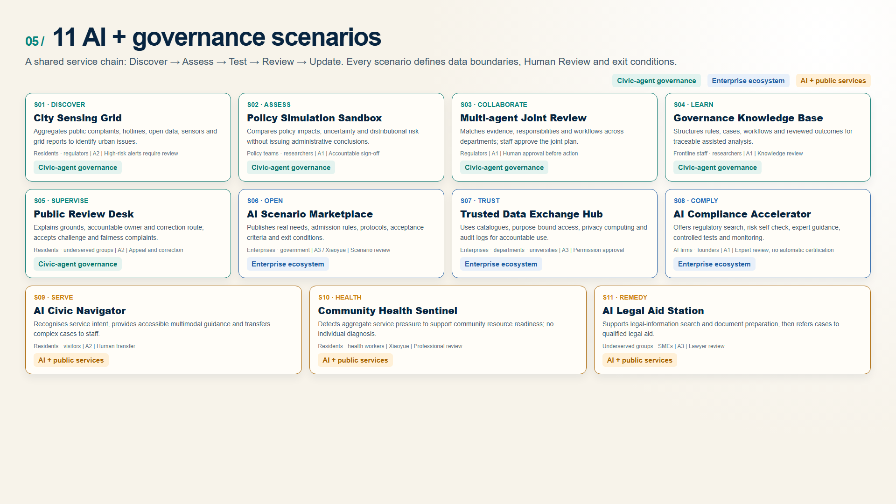
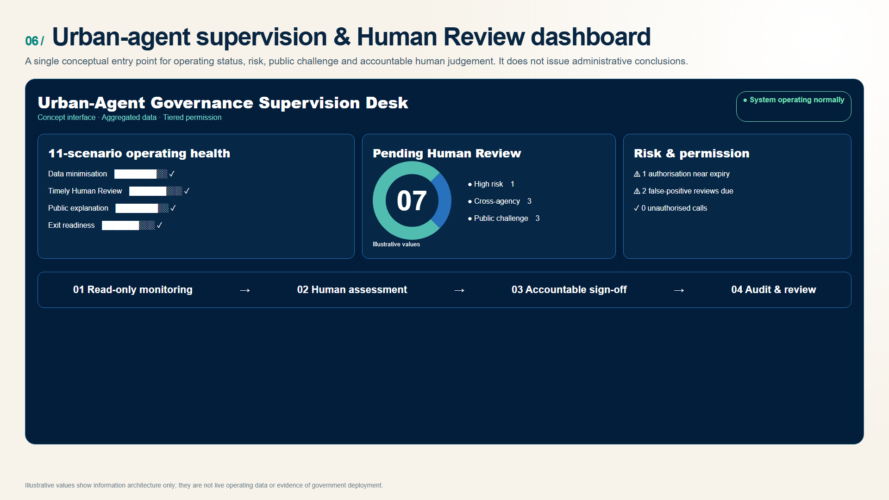
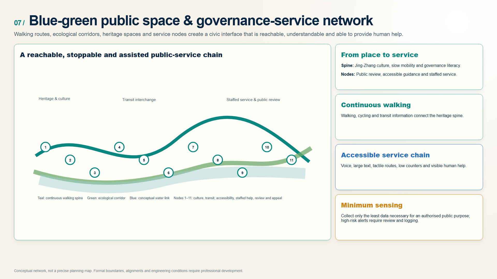
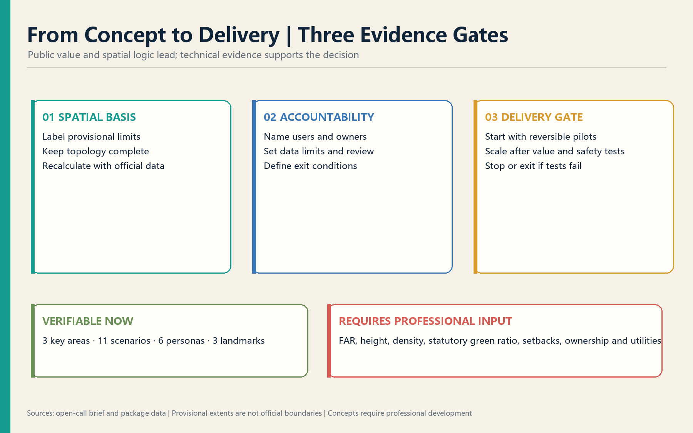

# CivicMind Jing-Zhang — A Living Lab for AI Urban Governance

> Governance as infrastructure: every urban AI scenario needs rules, accountable owners, Human Review, exit conditions, and a public return.

## Strategic Overview

*Figure: the governance spine, three functional hubs and the blue-green public realm. Boundaries, scale, architecture and delivery conditions require formal planning and professional development.*
Responding to the shift from isolated AI applications to citywide systems, CivicMind proposes a living lab that is perceivable, testable, governable and transferable. It relies on the Jing-Zhang Railway Heritage Park, existing innovation assets and public-service networks rather than large-scale new construction. A governance spine connects three functional hubs, two enablement wings and distributed scenario nodes. Its operating loop moves from problem discovery to joint assessment, controlled testing, public review and evidence-based scaling.

## Design Basis and Source List
The proposal starts with a civic question: as AI enters mobility, neighbourhood services, enterprise operations and public decisions, what must a city provide beyond computing power and offices? It proposes an infrastructure of rules that people can see, understand, challenge and correct. Publicly documented government-service workflows provide a practical point of departure, but do not imply that any existing system or dataset is deployed in Jing-Zhang [source:OFFICIAL-ANNOUNCEMENT] [source:AGENT-TASKBOOK] [depth:existing_conditions_diagnosis]. The current spatial extents support conceptual relationships only; formal boundaries and controls remain pending [source:SOURCE-REGISTRY] [standard:PROJECT-OFFICIAL-ANNOUNCEMENT].

### Evidence Hierarchy and Applicability

| Level | Principal sources | Role in this proposal | Boundary of use |
|---|---|---|---|
| Direct project basis | Official announcement, Agent taskbook, site package and source registry | Define scope, tasks, deliverable depth, review dimensions and treatment of missing data | Provisional geometry is not an official redline; missing statutory controls are not inferred |
| Domestic spatial-planning basis | MOHURD urban-design and regulatory-planning measures; MNR land-use classification guide | Check spatial structure, land-use coding, design depth and the wording of planning claims | The proposal does not replace statutory planning, specialist studies, engineering design or approval |
| Domestic governance and rights basis | Personal Information Protection Law, Data Security Law, Barrier-Free Environment Law and Interim Measures for Generative AI Services | Check data minimisation, purpose limitation, Human Review, remedy, accessibility and service boundaries | Applicability to each pilot requires review by accountable authorities and qualified legal professionals |
| International methodological references | OECD AI Principles, EU AI Act and IMDA AI Verify | Inform risk tiers, transparency, testing and accountability methods | Method references only; they neither replace Chinese law nor prove equivalent local institutions |

Urban agents therefore remain bounded support systems for aggregation, assisted analysis, workflow guidance and operational monitoring. Decisions that affect rights, resource allocation, administrative action or high-risk warnings require Human Review, accountable sign-off, audit trails and routes for challenge and correction. Policy sources constrain design claims; they do not create approval, funding or implementation commitments.

## Three-Level Scope Framework

The 43.6 km² Coordinated Research Area frames regional and industry collaboration; the announced 11.4 km² Overall Design Area organises public space and infrastructure; and the announced 368.4 ha Key-Area Detailed Design Area turns governance mechanisms into three tangible prototypes [data:geometry/site_boundary.geojson#SITE-001] [metric:site_area_sqm] [depth:three_level_scope_framework]. These scales work as one chain. Current polygons remain provisional and will be recalibrated when formal boundaries arrive.

## Coordinated Research Area: Industry and Future City Research

“One body, two wings, three layers” connects the heritage governance spine, Zhongzhiyuan decision layer, AI Origin sensing/interaction layer, Dazhongsi industry-support layer, Xiaoyue River testing wing, and Zhongguancun standards/services wing [source:AGENT-TASKBOOK] [standard:PROJECT-AGENT-OPEN-CALL-TASKBOOK] [depth:overall_spatial_structure]. The original identity combines rail lines, a governance loop, indigo trust, green openness, and gold Human Review.

Seven precedents remain distinct from proposed mechanisms: Singapore AI Verify, the EU AI Act, Shenzhen Data Exchange, OECD AI Principles, Estonia e-Governance, Hangzhou City Brain, and Barcelona DECODE. They inform testing, risk tiers, trusted exchange, accountability, cross-agency coordination, and citizen data control; they do not prove local implementation [source:CASE-AI-VERIFY] [source:CASE-EU-AI-ACT] [source:CASE-OECD-AI].

### Regional Collaboration Tasks and Evidence Return

Regional collaboration follows a five-part chain: **public issue entry → reciprocal resource list → controlled joint task → verifiable output → governed knowledge return**. The matrix below defines proposed counterpart types, inputs, outputs and return destinations. It does not indicate that any district, institution or department has agreed to participate. Accountable entities, data permissions, funding and timing require lawful confirmation by competent authorities.

| Proposed counterpart type | Jing-Zhang input | Counterpart input | Proposed joint task | Verifiable output | Return and accountability boundary |
|---|---|---|---|---|---|
| Innovation nodes related to Future Science City | Urban-governance issue list, scenario responsibility template and Human Review rules | Public research outputs, foundation-model test methods and expert capability | Desktop replay and failure injection for higher-risk scenarios | Test log, issue register and revision recommendation | Authorised non-sensitive results return to the A1 knowledge base; stop if data authority or accountable ownership is unclear |
| Innovation nodes related to Huairou Science City | Public-service needs, explainability checklist and public-communication checks | Public scientific tools, measurement methods and science-communication experience | Test whether outputs are understandable and suitable for public display | Explanation template, public-question set and staffed-referral conditions | Return to A2 public-review and navigation interfaces; no field use before accessibility and intelligibility checks pass |
| Industry nodes related to Beijing E-Town | Scenario catalogue, compliance self-check template and exit protocol | Product documentation, public standards practice and de-identified test conditions | Compliance sandbox and delivery-acceptance rehearsal for enterprise-service agents | Compliance gap list, exit record and reusable toolkit | Return to A3 enterprise services and scenario access, with A1 reviewing compliance co-testing; creates no certification, procurement or market-access commitment |
| Jing-Jin-Ji governance and industry nodes | Transferable scenario cards, safety gates and evaluation indicators | Local service conditions, differences in applicable rules/workflows and operating feedback | Small-scale reversible replication and cross-jurisdiction difference testing | Applicability boundary, localisation revisions and stop conditions | After A1 review, update the governed knowledge version; the Zhongguancun wing may release a standards pack with explicit applicability limits |

Each proposed joint task uses a separate task card recording issue source, data authority, accountable owner, version, Human Review decision, stop condition and return destination. Only outputs that pass authority, safety, public-value and reproducibility checks may enter the knowledge base; all others remain isolated, undergo remediation or exit [source:AGENT-TASKBOOK] [depth:overall_spatial_structure].

## Overall Design Area: Urban Renewal and Regulatory-Plan-Level Urban Design

*Figure: reuse, reversible additions, continuous walking, rain gardens and staffed public service. It does not determine demolition, retention or construction on any parcel.*
The spatial framework is a governance spine, three functional layers, two feedback wings, and a public-review loop. Reversible service interfaces reuse existing space where feasible [data:geometry/land_use.geojson#LU-001] [standard:MOHURD-CONTROL-DETAILED-PLANNING] [depth:land_use_layout]. FAR, height, coverage, statutory green ratio, setbacks, ownership, existing buildings, and utility capacity remain unknown [metric:floor_area_ratio] [depth:development_intensity_controls].

## Detailed Design of Key Areas

Zhongzhiyuan is the decision layer, with conceptual knowledge, simulation, compliance-support, and multi-agent spaces [data:geometry/key_areas.geojson#PROV-KEY-001]. Beijing AI Origin is the sensing/interaction layer with public review, accessible navigation, and co-creation [data:geometry/key_areas.geojson#PROV-KEY-002]. Dazhongsi is the industry-support layer with trusted data, scenario access, and legal-service referral [data:geometry/key_areas.geojson#PROV-KEY-003] [depth:three_key_area_detailed_design]. Buildings, bridges, and transport moves require professional development.

Each key area is organised as a walkable service sequence rather than an isolated exhibition venue. A1 connects rule disclosure, controlled simulation, expert review, result explanation, appeal and exit. A2 connects the ordinary-service entrance, explanation and choice, AI-assisted service, Human Review, recovery space, challenge and exit. A3 connects demand catalogues, admission rules, purpose authorisation, isolated testing, compliance review, and safe exit or conditional transfer. These sequences use visible thresholds, status signs, staffed counters and non-digital routes so that responsibility can be read in the physical environment.

## AI Innovation Ecosystem, Personas, and AI+ Scenarios

*Figure: service journeys for older residents, visually impaired people, founders, enterprise staff, researchers and visitors. The people shown are design personas, not real personal profiles.*
Six design personas cover an older resident, young founder, enterprise data lead, university researcher, visitor, and visually impaired resident. They are design tools, not personal profiles [standard:BARRIER-FREE-ENVIRONMENT-LAW] [depth:blue_green_and_public_space]. Eleven readable cards cover sensing, policy simulation, multi-agent collaboration, governance knowledge, public review, scenario access, trusted data exchange, compliance support, civic navigation, community health, and legal-aid referral. Every scenario states data limits, accountable operations, Human Review, and exit conditions [data:geometry/scenario_nodes.geojson#SCN-01] [source:GENERATIVE-AI-MEASURES].

### Common Scenario Operating Protocol

All eleven scenarios follow one minimum public-responsibility protocol: **issue intake → triage → controlled test → Human Review → public release → correction or exit → knowledge update**. At each step the operator must identify the source and civic need, minimum necessary data, permitted agent action, accountable role, Human Review trigger, equivalent non-digital service, stop condition, and evidence receipt. A scenario with any missing item remains at concept or desktop-replay stage and cannot enter a live public-service pathway.

| Stage | Continue only when | Stop, fallback and receipt |
|---|---|---|
| Issue intake | Source, affected users and civic necessity can be explained | Reject unclear or unnecessary uses and record the reason |
| Triage | Purpose, retention, prohibited uses, risk tier and accountable role are confirmed | Route to existing human service when authority or purpose is unclear |
| Controlled test | Isolation, evaluation, failure injection and exit resources are ready | Stop on unauthorised access, material bias or unexplainable output; revoke access |
| Human Review | An authorised person independently examines the evidence version | Return to the existing workflow and record why an output was changed or rejected |
| Public release | AI involvement, scope, owner and appeal route are accessible and legible | Do not scale when explanation or remedy is inaccessible |
| Correction or exit | Remediation, deletion, revocation and recovery conditions are verified | Provide progress and a checkable receipt to affected users |
| Knowledge update | Sources, editor, version, validity period and review date are complete | Retire disputed or expired content from future automated use |

### Negative Tests and Corrective Drills

Pilot acceptance should demonstrate safe failure, not only successful operation. Four proposed test families use public, synthetic or authorised de-identified data: unauthorised-access rejection; deliberate misclassification followed by human override; cross-agency responsibility conflict that must pause automation; and accessibility failure that must switch immediately to paper, telephone, staffed or other equivalent service. Each run records input, expected refusal or pause, accountable owner, human fallback, recovery condition and public-facing receipt. These are proposed methods, not field results.

## Land Use, Building Scale, and Retain-Renovate-Demolish Strategy

Land use is a complete non-overlapping conceptual partition using national codes. Building footprints are design placeholders, not existing-building, ownership, or demolition evidence [standard:MNR-LAND-USE-CLASSIFICATION-GUIDE] [data:geometry/buildings.geojson#BLDG-001] [metric:building_footprint_area_sqm]. Statutory controls remain unknown [depth:building_renewal_classification] [depth:height_massing_character].

## Transport, Rail, Municipal Infrastructure, and Public Services
The conceptual Walking and Cycling Network links the three layers with transit information, accessibility, bicycle parking, and event-day dispersal, without claiming road redlines or engineering feasibility [data:geometry/roads.geojson#ROAD-001] [standard:MOHURD-URBAN-DESIGN-MEASURES] [depth:transport_transit_slow_traffic_parking]. Public services retain voice, large-text, tactile, low-counter, human, and non-digital options where applicable.

## Blue-Green Network, Public Space, and Urban Character

*Figure: conceptual reference imagery for transparent governance, proportionate sensing and trusted exchange; it is neither approved construction nor a determined engineering scheme.*
The Jing-Zhang Railway Heritage Park is the governance spine; Qinghe and Xiaoyue River links remain conceptual because official blue lines are unavailable [data:geometry/green_space.geojson#GREEN-001] [data:geometry/public_space.geojson#PUBLIC-001] [depth:blue_green_and_public_space]. Three conceptual pilgrimage landmarks—Governance Loop, Sensing Eye, and Trust Bridge—explain accountability, sensing limits, and data permissions. The narrative moves “from connecting cities to connecting governance,” without fictional history or unlicensed portraits.

## Renewal Projects, Implementation Policy, and Phasing
Within the initial 0–6 month phase, a reversible 12-week validation is proposed: weeks 1–2 lock the issue list, data boundary, accountable roles and ordinary-service baseline; weeks 3–4 run reproducible desktop replay; weeks 5–6 conduct isolated testing and failure injection; weeks 7–8 conduct limited public and accessibility walkthroughs; weeks 9–10 rehearse cross-agency coordination, appeal and recovery; and weeks 11–12 complete an independent stage review. Each window produces evidence and has a stop rule. Missing accountable ownership, failed access control, inaccessible non-digital service or an unresolved responsibility conflict prevents progression. Timing, participants, thresholds and public disclosure require formal authorisation and are not claimed as completed fieldwork.

Conceptual phases are 0–6 month reversible pilots, 6–18 month controlled validation, and 18–36 month conditional scaling only after evidence, formal planning, and accountable owners are in place [data:geometry/phasing.geojson#PHASE-001] [depth:renewal_project_list] [depth:phasing_plan]. Proposed activities include a governance summit, compliance camp, scenario open day, public review assembly, multi-agent challenge, and open-source week. None is a confirmed government schedule.

Implementation accountability should identify the lead, operator, approver, supervisor and exit authority for scenario admission, controlled testing, public service, stage evaluation and conditional scaling. Pilot metrics may cover audit-log completeness, Human Review, public-response closure and corrective-action completion; final definitions require approval by accountable bodies before a pilot starts.

## Metrics, Area Recalculation, and Compliance Matrix
Geometry-derived design quantities are calculated in EPSG:4548; announced areas remain separate references. Statutory green and public-space controls remain unknown [metric:site_area_sqm] [metric:key_area_total_sqm] [depth:metrics_recomputation]. Eleven scenarios, six personas, and three landmarks describe proposal content, not implementation scale.

The supervision interface is backed conceptually by three auditable ledgers rather than undefined “big data”: a **spatial ledger** for boundary versions, sources, recalculated areas, service nodes and provisional/official status; a **scenario ledger** for intake, minimum data, risk tier, accountable roles, human takeover, non-digital alternatives, pauses and correction receipts; and a **version ledger** for rule or knowledge versions, scope, change reasons, public challenges and retirement. Every dashboard value should resolve to a responsibility record; an untraceable value cannot justify pilot expansion.

## Risk, Copyright, and Compliance

Spatial-experience figures were produced with the OpenAI image generation model and are labelled as conceptual renderings. Evidence figures for boundaries, area, mobility and metrics remain data-derived; generated imagery is not used as survey or statutory planning evidence.
The eight-dimension matrix covers privacy, complexity, acceptance, operations, policy uncertainty, spatial disputes, maturity, and inclusion. No private/internal data is used; AI does not replace statutory duties; provisional geometry, landmarks, events, procurement, funding, and timing are not official decisions [source:SOURCE-REGISTRY] [standard:PROJECT-OFFICIAL-ANNOUNCEMENT] [depth:risk_and_missing_data_register]. All spatial moves are Conceptual Recommendations for professional development, not approvals, legal opinions, engineering conclusions, investment commitments, or implementation arrangements.

## References
1. Haidian Branch of the Beijing Municipal Commission of Planning and Natural Resources, official open-call announcement, 2026.
2. Rights-cleared Agent open-call taskbook, 2026.
3. MOHURD urban-design and regulatory-planning measures; MNR land-use classification guide.
4. Personal Information Protection Law; Data Security Law; Barrier-Free Environment Law; Interim Measures for Generative AI Services.
5. Official/project sources for AI Verify, EU AI Act, OECD AI Principles, e-Estonia, Shenzhen Data Exchange, Hangzhou City Brain, and Barcelona DECODE. International frameworks are methodological references only and do not replace applicable Chinese law.
