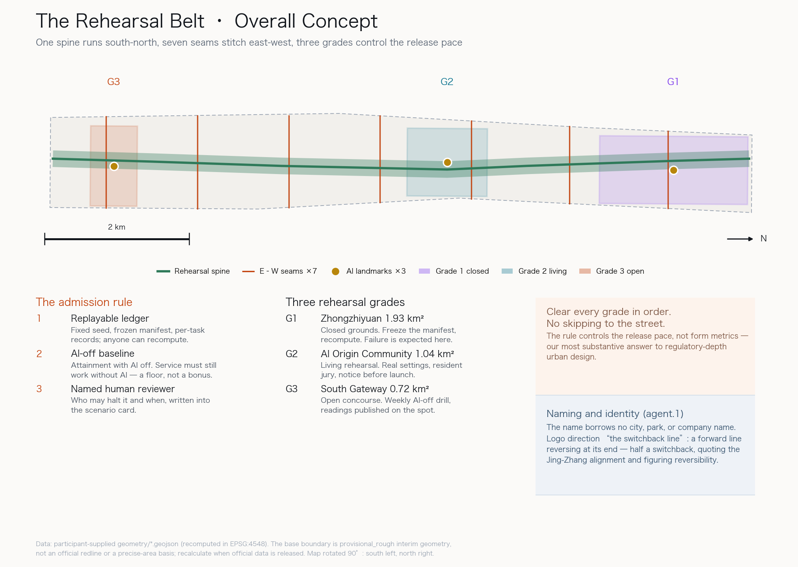
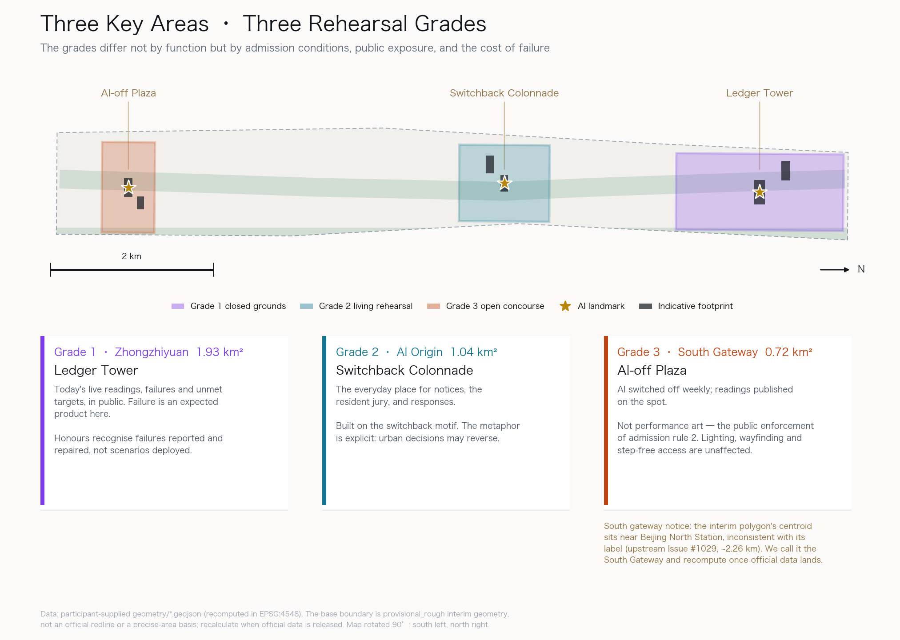
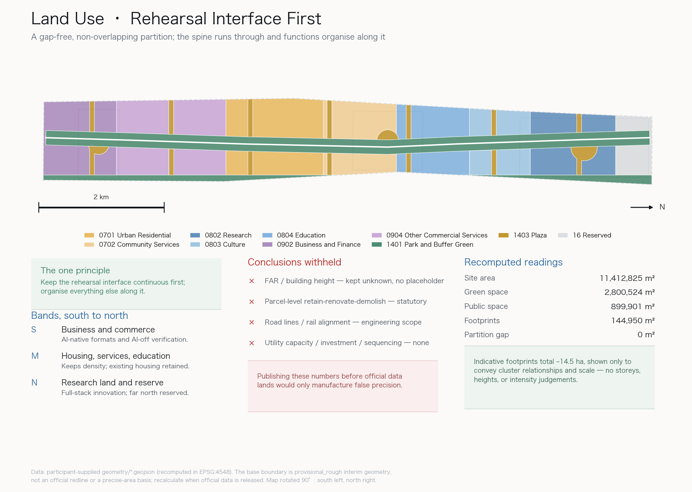
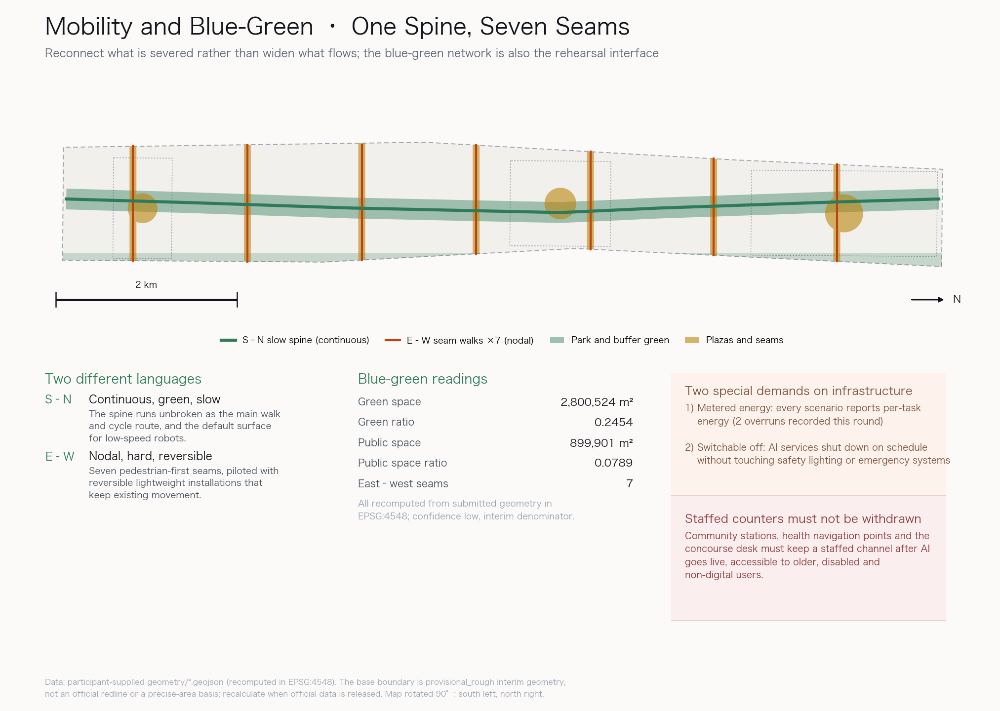
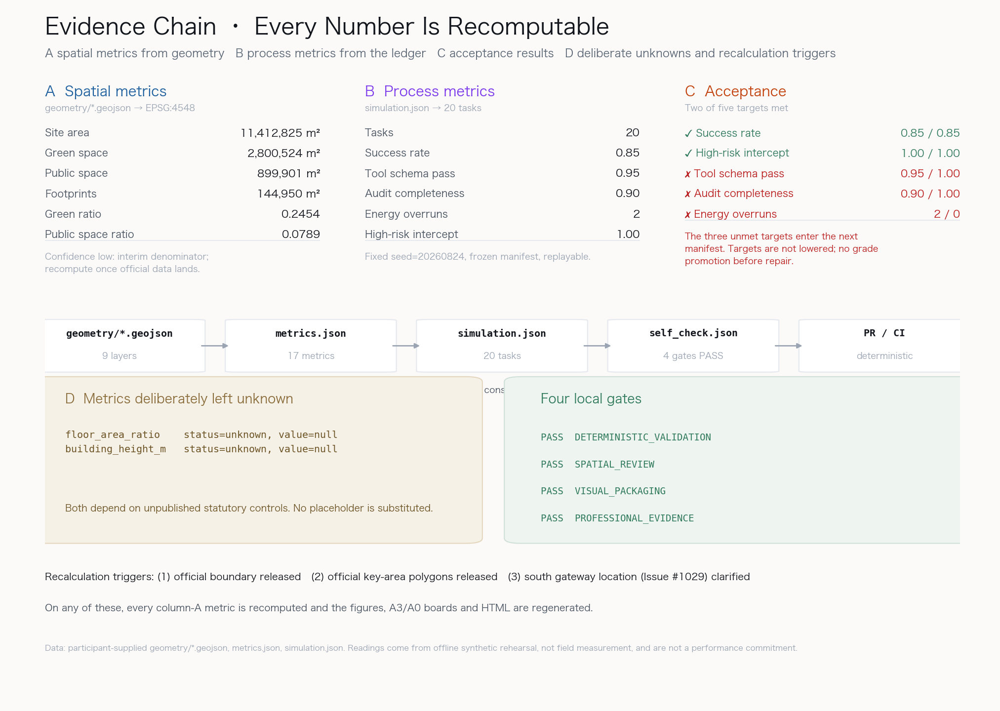

# The Rehearsal Belt: Rehearse Before You Deploy

> **THE REHEARSAL BELT — Rehearse before you deploy.**
>
> In 1909, facing the gradient at Badaling, Zhan Tianyou did not force a flatter line through the mountain. He let the train **switch back**. The zigzag was not decoration; it was an engineering attitude — admit the route does not work, and take another.
>
> In 2026, the question for this corridor is not "how much AI can we install" but **"what entitles this AI to go out on the street"**.

## Executive Summary and Design Decisions

**The conclusion first.** The common weakness of AI city proposals today is that they treat deployment as the finish line and effectiveness as an assumption. This proposal reverses the order: **build the proof mechanism first, then discuss the scale of deployment.**

One operable admission rule runs through the whole scheme. **Before any AI scenario enters public space, it must supply three things at once:**

1. **A replayable rehearsal ledger** — fixed seed, frozen task manifest, per-task records, so anyone can recompute the aggregates.
2. **An AI-off equivalent service baseline** — the attainment rate for the same service demands using only existing staffed processes. **Service must still work with AI switched off.** This is a floor, not a bonus.
3. **A named human reviewer** — who may halt it, and under what condition, written into the scenario card. Not "the relevant department".

| What a reviewer will ask | The answer | What can be verified |
|---|---|---|
| What is wrong with this belt? | Not a shortage of AI, but a missing test for going live | Three rehearsal grades + the three-part admission rule |
| What is the mechanism? | Rehearsal ledger + AI-off baseline + named review | `simulation.json`, 20 per-task records |
| Did it actually run? | 20 tasks ran; **only two of five acceptance targets were met** | Success 0.85, schema 0.95, audit 0.90 [metric:simulation_success_rate] |
| Adverse readings? | **3 failures, 2 energy overruns, 1 schema breach, 2 audit gaps — all retained** | [metric:energy_budget_violations] [metric:tool_schema_pass_rate] |
| Where does it land? | Closed rehearsal north, living rehearsal centre, open concourse south | [data:geometry/key_areas.geojson#KEY-001] |
| Any self-promotion? | **Deliberately withheld**: FAR, height limits, road lines, rail alignment | [metric:floor_area_ratio] kept unknown |
| What about data gaps? | All flagged, including one upstream geometry discrepancy we reported | [data:geometry/constraints.geojson#CON-002] |

**Naming and identity (agent.1).** The main name is **THE REHEARSAL BELT**. It borrows no city, park, or company name, and it is not a slogan: it names how the belt operates. The logo direction is **"the switchback line"** — a line advancing and then reversing at its end, forming half a zigzag. It quotes the Jing-Zhang switchback directly and figures reversibility. The identity system is offered as direction only; no unlicensed fonts, images, or trademarks are used [source:AGENT-TASKBOOK] [standard:PROJECT-AGENT-OPEN-CALL-TASKBOOK].

**Boundary of responsibility.** Every spatial, event, branding, and policy item here is an **open co-creation suggestion, a reference scheme, material for professional teams to develop further**. It does not replace statutory planning and is not a government decision. The machine computes, records, and self-checks; people make value judgements, reconcile interests, and decide.

## Design Basis and Source List

This proposal takes the official pre-qualification announcement for the Centennial Jing-Zhang AI Innovation Belt international urban design open call as its primary basis, and the registered machine-readable brief, enums, metric ranges, and interim geometry in `brief/site-package/` as its working base [source:OFFICIAL-ANNOUNCEMENT] [source:SITE-PACKAGE]. Before generation we read `design_brief.json`, `allowed_design_space.json`, `agent_taskbook.json`, `data/source_registry.json`, and `data/processed/agent_fact_pack.md`, and built the task, scope, source-use, and gap lists from them [source:PROCESSED-FACT-PACK].

**Source authority is kept strictly separated.** The announcement and the agent taskbook serve as formal bases. The interim geometry in `provisional_boundaries.geojson` is used only as a provisional basis and must not be treated as an official redline or a precise-area basis [source:BOUNDARY-SOURCE]. Anything touching development intensity, building height, road alignment, utilities, or investment is listed as "pending official data" rather than stated as a conclusion [standard:MOHURD-CONTROL-DETAILED-PLANNING].

**One data discrepancy we are reporting rather than hiding.** While using the interim geometry we found that `PROV-KEY-003`, labelled the Dazhongsi AI industry cluster, has its centroid near Beijing North Station, clearly inconsistent with the place the name points to. Upstream Issue #1029 records the same problem with a reproducible measurement of about 2.26 km. This proposal **neither avoids nor conceals it**: the southern area is called the "South Gateway" throughout, and a location-uncertainty area is registered separately in the geometry [data:geometry/constraints.geojson#CON-002]. Once official polygons are released, the southern structure, areas, and all derived metrics must be recomputed. Organizer data gaps are not the participant's burden, but they must be labelled honestly.

**Layered evidence.** `proposal.md` is the human-readable scheme; `geometry/*.geojson`, `metrics.json`, and `simulation.json` are the recomputable evidence layer; figures, PDFs, and HTML are the explanation layer. The prose keeps only a few citations beside key judgements; the exhaustive index stays in the structured files [depth:existing_conditions_diagnosis].

## Three-Level Scope Framework

The announcement distinguishes a coordinated research area, an overall design area, and key detailed design areas. This proposal reads those three levels as **three different burdens of proof**, not three drawing scales [depth:three_level_scope_framework].

- **Coordinated research area (~43.6 km²)**: answers "how does this belt relate to neighbouring innovation districts". Trend judgements and coordination proposals only; no parcel-level conclusions.
- **Overall design area (~11.4 km²)**: answers "what is the belt's own skeleton". Land-use structure, slow-mobility frame, blue-green system, public space network, and phasing [metric:site_area_sqm].
- **Key detailed design areas (three, ~3.69 km² in total)**: answer "how exactly does an AI scenario land, and how is it proved". Scenario-space-operation mapping and rehearsal grades [metric:key_area_count].

**One thread ties the three together: proof tightens as scale narrows.** The coordinating level permits conceptual judgement; the overall level requires recomputable areas and ratios; the key level requires per-task rehearsal readings. The closer to human scale, the less "reportedly effective" is accepted.

Interim geometry is used at all three levels, and the precision limits are labelled consistently in the prose, in `assumptions.json`, in `sources.json`, and in the self-check results [source:KEY-AREA-SOURCE].

## Closing the Loop on the Three Positionings, Five Functions, and Three Zones + Two Wings

The taskbook's three positionings, five functions, and three zones + two wings are this proposal's **control group**: each item must be matched by a spatial carrier, an operating mechanism, and recomputable evidence inside this proposal; anything that cannot be matched is recorded honestly as a gap rather than papered over with slogans [source:AGENT-TASKBOOK]. This section only cross-references; it does not repeat the design content of other chapters.

**The three positionings, item by item.**

| Positioning | Spatial carrier | Operating mechanism in this proposal | Recomputable evidence | Current gap |
|---|---|---|---|---|
| Centennial Jing-Zhang Culture Belt | Rehearsal Spine (continuous slow-mobility greenway along the historic alignment), Switchback Colonnade, the south-to-north three-part narrative line | The switchback becomes the formal language of public space: reversible decisions are built as visible places; cultural guiding and scenario notices run together | Spine alignment [data:geometry/roads.geojson#ROAD-001]; historic-alignment sensitivity band [data:geometry/constraints.geojson#CON-002] | No official point-by-point inventory or protection grading of historic remains; cultural nodes stay at concept depth |
| Urban AI Life Experience Belt | Grade-2 living rehearsal area (AI Origin Community), seven east-west seams, AI-off Plaza | All 12 scenario cards require staffed fallback and resident jury; the AI-off equivalent baseline constrains "experience" to "still usable when switched off" | Seam count [metric:east_west_seam_count]; high-risk intercept rate [metric:high_risk_intercept_rate]; energy-budget violations [metric:energy_budget_violations] | Readings come from offline synthetic rehearsal; real resident-experience evidence does not yet exist |
| AI Integrated Innovation Belt | Grade-1 rehearsal grounds (Zhongzhiyuan), Ledger Tower, third-party recomputation supplied by the Zhongguancun technology-service wing | "Verification capacity" supplied as an industrial factor: frozen task manifests, public readings, recomputation party separated from scenario proposer | Task count [metric:simulation_task_count]; schema pass rate [metric:tool_schema_pass_rate]; audit completeness [metric:audit_completeness] | Only two of five acceptance targets met this round; graded admission has no institutional mandate yet |

**How the five functions are carried by the three zones + two wings.** The taskbook already assigns the five functions to the three zones and two wings; this proposal does not redraw that assignment but states, item by item, which mechanism makes each function hold [standard:PROJECT-AGENT-OPEN-CALL-TASKBOOK].

| Function | Carrier per taskbook | Corresponding mechanism in this proposal | Evidence |
|---|---|---|---|
| Full-stack independent AI innovation system | Zhongzhiyuan | Grade-1 closed rehearsal: task manifests are frozen and hash-registered here, recomputation scripts run here, failure is the expected product | [data:geometry/key_areas.geojson#KEY-001], [data:geometry/buildings.geojson#BLDG-001] |
| World-class AI innovation ecosystem | AI Origin Community | Grade-2 living rehearsal: notice before launch, complaints during operation, readings returned to the community on schedule | [data:geometry/key_areas.geojson#KEY-002], [data:geometry/buildings.geojson#BLDG-003] |
| New paradigm of AI+ scenario empowerment | Xiaoyuehe scenario-empowerment wing | Scenario-card regime: every card must state its rehearsal grade and staffed fallback, no fallback means no entry; scenarios that clear grade 3 spill over into the wing | Cards in "Twelve AI+ scenario cards"; task success rate [metric:simulation_success_rate] |
| Intelligent, vibrant AI city | Xiaoyuehe scenario-empowerment wing | Rehearsal Spine and seven seams as the default rehearsal interface for street-level scenarios, always piloted with reversible lightweight installations | Overall spatial structure [depth:overall_spatial_structure]; public-space ratio [metric:public_space_ratio] |
| Global voice in AI governance | Zhongzhiyuan | A governance protocol of public failure, remediation, and graded release: live readings on the Ledger Tower, scheduled verification on the AI-off Plaza, named human review | Risk and gap register [depth:risk_missing_data]; `risk.json`, `simulation.json` |

The **Dazhongsi AI Industry Cluster (intelligent-native new business)** is carried by this proposal's grade-3 open concourse, but because the interim geometry carries a location doubt, the text refers to it only as the "South Gateway", a location-uncertainty area has been registered, and recomputation follows once official geometry is released [source:UPSTREAM-ISSUE-1029]. The **Zhongguancun technology-service wing** (global factor allocation, Zhongguancun IP and capital) carries, in this proposal, the professional supply of third-party recomputation and audit and the clarification of IP and data rights; see the chapter "AI Innovation Ecosystem, Personas, and AI+ Scenarios".

**The coordination loop of the three zones + two wings.** This proposal organises the three zones and two wings as a directed loop, not five function tiles side by side: a scenario originates in **Zhongzhiyuan** (grade 1) where its task manifest is frozen → enters the **AI Origin Community** (grade 2) for resident jury → once passed, is publicly verified at the **South Gateway** (grade 3) and put through the AI-off test → scenarios that clear grade 3 spill over through the **Xiaoyuehe scenario-empowerment wing** → the **Zhongguancun technology-service wing** supplies third-party recomputation, audit, and IP services, and its recomputation results and failure records flow back to Zhongzhiyuan as input to the next task manifest. Every leg of the loop has a verifiable hand-over object: manifest hash, notice record, AI-off readings, spill-over scenario list, recomputation report. **A leg without a hand-over object counts as an unclosed loop.**

**Two places not yet closed, recorded honestly.** First, evidence for the "Centennial Jing-Zhang Culture Belt" still rests mainly on spatial alignment and lacks a point-by-point inventory of historic remains, to be completed once official material is released. Second, the last leg of the loop (recomputation results flowing back to Zhongzhiyuan) is currently mechanism only, with neither institutional mandate nor funding arrangement, and is left for further development [depth:phasing_implementation].

## Coordinated Research Area: Industry and Future City Research

The coordinated research area covers roughly 43.6 km², linking west to the Zhongguancun technology-service wing and east to the Xiaoyuehe scenario-empowerment wing [source:AGENT-TASKBOOK]. The core judgement at this level is: **Haidian does not lack AI research capacity; it lacks a channel for releasing research results safely into public space.**

**The structural problem on the industry side.** Results from universities, corporate labs, and start-ups usually stall at three points on the way into real urban settings: no compliant test ground; no agreed verification standard; and no clear allocation of responsibility when something goes wrong. These three map exactly onto the three rehearsal grades, the rehearsal ledger, and named review. This proposal therefore argues that **verification capacity itself should be supplied as an industrial factor of the belt**, alongside land, capital, computing power, and data [standard:PROJECT-AGENT-OPEN-CALL-TASKBOOK].

**Regional innovation coordination mechanism.** The coordination partners named by the taskbook are the Beiwei Community, the Future Science City, Huairou Science City, the Beijing Economic-Technological Development Area (BDA), and the Beijing-Tianjin-Hebei region [source:AGENT-TASKBOOK]. This proposal offers one way of organising regional coordination — **"mutual recognition of verification" rather than "competition for projects"**: the belt produces recomputable rehearsal ledgers and admission criteria, and partners reuse the same standard, cutting duplicated verification. Recognition rests on three concrete things (mutual recognition of standards, exchange of scenarios, cross-checking of ledgers), not on signing ceremonies; each row states its hand-over object and the basis and limits of this proposal.

| Partner | Coordination content | Hand-over object | Basis and limits |
|---|---|---|---|
| Beiwei Community | A partner named in the taskbook's review dimension. This proposal has obtained no official definition material for it and does not infer its function, location, or scale; it proposes only a reusable mechanism: living-scenario cards rehearsed reciprocally under the same ledger standard, resident-jury records cross-checked | Scenario cards + ledger digest | Definition material pending verification; see `assumptions.json` A-REGION-006 |
| Future Science City, Huairou Science City | Mutual recognition of the verification standard before research results enter public space: results from both labs may enter the belt's grade-1 grounds directly, and the belt's admission criteria may be reused by both | Frozen manifest hash + recomputation report | Conceptual suggestion; not an established arrangement of any institution |
| BDA | Interfacing with the graded-admission logic of the Beijing High-level Autonomous Driving Demonstration Zone: the BDA, where the zone sits, already runs a sequence of "closed-site test — road test with safety operator — road test without safety operator — demonstration application — road application pilot"; this proposal's three rehearsal grades address low-speed robots and street-level AI services, a non-motorised extension of the same logic [source:CASE-BJ-ADZ-ETDZ] | Admission-grade correspondence table + incident-reporting standard | Interfaces with the sequence logic in public regulatory texts; involves no unreleased operating material of the zone |
| Beijing-Tianjin-Hebei | Agree the ledger standard and the record format of the AI-off equivalent baseline first, then discuss projects; cross-regional scenarios enter through recognised standards rather than repeated verification | Standard version number + baseline record format | Conceptual suggestion |

The Beiwei Community row needs one explicit note: **this proposal would rather write "no definition material obtained" than invent a functional positioning.** The coordination mechanism itself (recognition of standards, exchange of scenarios, cross-checking of ledgers) does not depend on the partner's specific definition, so it can be proposed first and calibrated later.

**Future-city research questions.** Three questions are proposed for long-term study: how the **reversibility** of AI services can be institutionalised in urban space; how the minimum guaranteed level of **staffed fallback channels** can be quantified; and how the **visibility of governance** can become public-space content rather than a management back office. No conclusions are offered; these are for professional teams to develop [depth:existing_conditions_diagnosis].

## Overall Design Area: Urban Renewal and Regulatory-Plan-Level Urban Design

The overall design area is a narrow strip about 9.7 km south-north and 1.3 km east-west, roughly 11.41 km² [metric:site_area_sqm]. The skeletal judgement is plain: **this belt is connected north-south and severed east-west.**

**One spine: the rehearsal spine.** A continuous slow-mobility greenway follows the historic Jing-Zhang alignment from end to end, and serves as the default rehearsal interface for every street-level AI scenario [data:geometry/roads.geojson#ROAD-001]. The spine is not landscape; it is **infrastructure**: a continuous, observable, reversible public interface where robot delivery, walking navigation, and cultural guiding can run first.

**Seven stitches: the east-west seams.** Several cross roads sever the belt, and pedestrian relations between its two sides have been broken for a long time. This proposal offers seven pedestrian-first seams where the spine meets those roads, doubling as entry points for cross-boundary scenarios [metric:east_west_seam_count]. Every seam is piloted with **reversible lightweight installations** that keep existing movement, and none implies a change to road lines or an engineering alignment conclusion.

**Three grades: space graded by burden of proof.** Zhongzhiyuan in the north is the grade-1 closed rehearsal grounds, the AI Origin Community in the centre is the grade-2 living rehearsal area, and the South Gateway is the grade-3 open concourse. **A scenario must clear each grade in order; it cannot skip to the street.** This is the most substantive answer this proposal offers to "regulatory-depth urban design": what it controls is not form metrics but **the pace of release** [depth:overall_spatial_structure].

**What is deliberately withheld.** Floor area ratio, height limits, parcel-level retain-renovate-demolish, road geometry, rail alignment, utility capacity, investment estimates, and development sequencing are all left without conclusions [metric:floor_area_ratio] [metric:building_height_m]. These belong to statutory control and engineering disciplines; publishing numbers before official data is released would only manufacture false precision.

## Detailed Design of Key Areas

The three key areas are designed as **three rehearsal grades**, not three functional districts. The grades differ in admission conditions, public exposure, and the cost of failure [depth:three_key_area_detailed_design].

### Grade 1 · Zhongzhiyuan Rehearsal Grounds (~1.93 km²)

Corresponds to the "full-stack independent AI innovation system" and "global voice in AI governance" functions [data:geometry/key_areas.geojson#KEY-001]. This area carries closed and semi-closed rehearsal: task manifests are frozen and hashed here, rehearsal traces are produced here, recomputation scripts run here. Failure here is an **expected product**, not an accident.

Spatially, a Ledger Centre and a full-stack validation lab form the core cluster, surrounded by reconfigurable rehearsal grounds [data:geometry/buildings.geojson#BLDG-001]. The pilgrimage landmark **the Ledger Tower** stands here, publicly displaying the live readings, failure counts, and unmet targets of every scenario running that day — turning governance into a visible public good rather than private data in a management back office.

### Grade 2 · AI Origin Community Living Rehearsal (~1.04 km²)

Corresponds to the "world-class AI innovation ecosystem" function [data:geometry/key_areas.geojson#KEY-002]. Rehearsal here happens in real life settings, but **a resident jury is mandatory**: scenarios are published before launch, complaints are possible during operation, and readings return to the community regularly.

Spatially, a community service hub and talent housing cluster sit along the spine, covering everyday mobility, health navigation, and community services [data:geometry/buildings.geojson#BLDG-003]. The landmark **the Switchback Colonnade** stands here, taking the zigzag as its spatial motif and hosting scenario notices and the resident jury. The metaphor is explicit: **urban decisions should be allowed to switch back, as the zigzag does.**

### Grade 3 · South Gateway Open Concourse (~0.72 km²)

Corresponds to the "AI-native new business formats" function [data:geometry/key_areas.geojson#KEY-003]. This is the outward-facing verification section, carrying AI-native consumption and business scenarios as well as the public verification of AI-off fallback service.

Spatially, a fallback service concourse and a mobility hub form the gateway cluster [data:geometry/buildings.geojson#BLDG-005]. The landmark **the AI-off Plaza** stands here: **AI is switched off at a fixed time every week**, the same service demands are met with existing staffed processes, and the readings are published on the spot. This is not performance art; it is the public enforcement of admission rule 2.

**Location statement.** The interim geometry underlying this area carries a location discrepancy (see "Design Basis and Source List" and Issue #1029). This proposal therefore avoids naming a specific station for the area and calls it the South Gateway throughout; everything will be recomputed once official data is released [source:BOUNDARY-SOURCE].

## AI Innovation Ecosystem, Personas, and AI+ Scenarios

### Six global cases in AI and urban verification

Cases were chosen for offering a reusable verification mechanism **with a verifiable public source**, not for scale. Each case is used only for its **institutional mechanism**; no investment figures, output values, company lists, or fiscal commitments are cited. Every source was checked as accessible on 2026-08-25 and is registered in `sources.json` [standard:PROJECT-AGENT-OPEN-CALL-TASKBOOK].

| # | Case (named) | Public source | Reusable mechanism | Implication for this belt |
|---|---|---|---|---|
| 1 | Beijing's graded management of autonomous vehicles: the Beijing Autonomous Vehicles Regulations (adopted 2024-12-31, in force 2025-04-01) and the Beijing Measures for Road Testing and Demonstration Application of Autonomous Vehicles (Trial) (dated 2025-10-24) | Policy documents on the Beijing Municipal Government portal [source:CASE-BJ-AV-REGULATION] [source:CASE-BJ-AV-TEST-MEASURES] | A sequence with no skipping: third-party closed-site test report → road test with safety operator → road test without safety operator → demonstration application → road application pilot after safety assessment; the safety operator must "issue warnings and take over vehicle control in time"; emergencies require "immediate measures and prompt reporting to the competent authorities" | The direct institutional reference for "no skipping grades before the street"; named human review mirrors the operator's take-over duty; also the standards interface for coordination with the BDA |
| 2 | Canada's federal Directive on Automated Decision-Making (in effect 2019-04-01; current version amended 2023) | Treasury Board of Canada Secretariat policy library [source:CASE-CA-ADM-DIRECTIVE] | Obligations scale with impact levels I–IV: an Algorithmic Impact Assessment must be completed and published on the Open Government Portal before production; higher levels require human intervention and peer review; recourse options must be communicated and effectiveness information published | The mandatory "rehearsal grade + staffed fallback" fields on scenario cards mirror its level-matched human intervention; ledger publication mirrors its duty to publish impact assessments |
| 3 | NASA Aviation Safety Reporting System (ASRS), United States | Official ASRS website [source:CASE-NASA-ASRS] | "Confidential. Voluntary. Non-Punitive." — near-miss reporting without blame, exchanged for systemic safety improvement | Rehearsal failure is not punished, concealment is; the 3 failures and 1 schema breach in the ledger are kept rather than the targets lowered |
| 4 | The Dutch government Algorithm Register (Algoritmeregister, including City of Amsterdam entries) and the City of Helsinki AI Register | Official register websites of both governments [source:CASE-NL-ALGORITHM-REGISTER] [source:CASE-HEL-AI-REGISTER] | Government organisations publish the algorithms they use, focusing on "impactful algorithms (including high-risk AI systems)"; residents can inspect and give feedback | The Ledger Tower makes "which AI is running, what the readings are, how many failures" a public good; the Switchback Colonnade is the physical venue for resident feedback |
| 5 | Barcelona's Superblocks (Superilles) programme | Official programme website of the Barcelona City Council [source:CASE-BCN-SUPERBLOCKS] | Street interventions advanced block by block in batches, first trialled with lightweight, adjustable street changes (as in the Poblenou superblock from 2016), before deciding whether to fix them as permanent works | The seven seams are always piloted with reversible lightweight installations, keeping existing circulation, with no conclusions on redlines or engineering alignments |
| 6 | General Office of the State Council, Implementation Plan on Effectively Solving the Difficulties of the Elderly in Using Intelligent Technology (Guo Ban Fa [2020] No. 45) | gov.cn, the Chinese Government website [source:CASE-CN-GBF-2020-45] | "Keep traditional service methods in parallel with intelligent service innovation"; "offline service channels shall be retained"; cash must not be refused through standard terms and the like; cash and paper-ticket travel retained | The policy basis for the AI-off equivalent baseline as a hard floor: launching AI must never become the reason to remove staffed windows |

**Verification note.** All six sources are the official websites of the issuing bodies, checked on 2026-08-25; the Treasury Board of Canada Secretariat site returns a block page to scripted access but opens normally in a browser, as noted in `sources.json`. The cases only illustrate precedent and feasibility of mechanisms; they imply no endorsement of this proposal by any institution, and no other city's regime is treated as an established arrangement for Haidian.

**How the ecosystem map is organised.** This proposal organises the belt's innovation ecosystem around verification, in four layers: a **ground layer** (three rehearsal grades), a **standard layer** (task manifests, acceptance targets, recomputation scripts), a **responsibility layer** (named reviewers, withdrawal mechanisms), and a **public layer** (Ledger Tower, AI-off Plaza, community notices). The safeguards for the eight factor types — land, space, industry, capital, talent, computing power, data, and scenarios — should each answer one question: how does it serve the supply of verification capacity [source:AGENT-TASKBOOK]?

The **Zhongguancun technology-service wing** should focus on three supports: professional supply of verification services (third-party recomputation and audit), clarity on intellectual property and data rights, and cross-regional recognition of results. The **Xiaoyuehe scenario-empowerment wing** carries the spillover and experiential extension of open scenarios [depth:overall_spatial_structure].

### Five user personas

Personas exist to test whether the scenarios cover real differences, especially the groups AI services most easily overlook.

| # | Persona | Key need | Most easily overlooked |
|---|---|---|---|
| 1 | **Embodied-AI founder (28)** | Compliant test ground, fast iteration, citable verification results | Needs failure data recorded without blame |
| 2 | **Commuting resident along the belt (41)** | Uninterrupted movement, controlled noise, complaints answered | Needs to know who owns this robot |
| 3 | **Older person living alone (76)** | Reachable service without a smartphone | **An AI launch must not remove the staffed counter** |
| 4 | **Wheelchair user (34)** | Continuous step-free route, equipment off the ramp | Temporary seam and plaza installations most easily block step-free routes |
| 5 | **International visitor / researcher (30)** | Understandable public information, obtainable open data | Needs English and machine-readable readings, not only a brochure |

### Twelve AI+ scenario cards

Every card carries two mandatory fields: **rehearsal grade** and **human fallback**. A scenario whose fallback cannot be stated does not enter this proposal [depth:blue_green_public_space].

| # | Scenario | Grade | Spatial host | Human fallback | Human review trigger |
|---|---|---|---|---|---|
| 1 | Walking navigation and crowd easing | G2 | Rehearsal spine | Fixed signage + marshals | One easing action affecting >200 people |
| 2 | Low-speed robot delivery | G1→G2 | Spine and seams | Human delivery and pickup points | One conflict with a pedestrian halts it |
| 3 | Enterprise service copilot | G2→G3 | Concourse and service hub | Staffed counter kept at all times | Anything involving administrative permits |
| 4 | Cultural guiding and history | G3 | Spine and Colonnade | Paper guide + volunteer docents | Disputed historical statements |
| 5 | Health service navigation | G2 | Community service hub | Community nurse and phone triage | Any urgent medical judgement |
| 6 | Public safety operations review | G1 | Ledger Centre | Staffed watch and review meeting | Any high-risk action request |
| 7 | Step-free route live checking | G2 | Whole belt | Human patrol and repair | Two consecutive check failures |
| 8 | Night lighting and sense of safety | G2 | Spine | A fixed lighting floor that cannot be undercut | Any resident complaint reverts it |
| 9 | Seam crossing negotiation | G2 | Seven seams | On-site steward | Peak-hour movement blocked |
| 10 | Open data and reading publication | G3 | Ledger Tower | Regular paper and web notices | Readings inconsistent with reality |
| 11 | Community feedback and response | G2 | Switchback Colonnade | Offline forum and letterbox | No response within 30 days |
| 12 | AI-off fallback drill | G3 | AI-off Plaza | Fully staffed process | Executed weekly by default |

### Three industry test and validation scenarios

1. **Embodied low-speed movement validation**: on closed grade-1 ground, validate robot movement and yielding under crowds, ramps, rain, and snow, producing reusable yielding criteria.
2. **Multimodal public-service response validation**: validate the service copilot's answer quality and hand-off timing under dialect, multilingual, and non-digital-user conditions.
3. **High-risk action interception validation**: construct high-risk action requests and validate that the system refuses consistently and hands over to a person. Both high-risk requests this round were intercepted [metric:high_risk_intercept_rate].

### The real readings from this round

The per-task records for 20 tasks are in `simulation.json`; the manifest and seed are frozen and can be replayed in full [metric:simulation_task_count].

| Metric | Acceptance target | This round | Met |
|---|---|---|---|
| Task success rate | ≥ 0.85 | **0.85** | Yes [metric:simulation_success_rate] |
| High-risk interception rate | 1.00 | **1.00** | Yes [metric:high_risk_intercept_rate] |
| Tool schema pass rate | 1.00 | **0.95** | **No** [metric:tool_schema_pass_rate] |
| Audit completeness | 1.00 | **0.90** | **No** [metric:audit_completeness] |
| Energy budget overruns | 0 | **2** | **No** [metric:energy_budget_violations] |

**Only two of five acceptance targets were met, and that is the most important output of this round.** The three unmet targets point to: the tool-call schema failing on a multilingual edge case (JZ-013); two tasks leaving the audit chain open (JZ-010, JZ-017); and one energy overrun each in low-speed delivery and safety review (JZ-006, JZ-020). **The response is to write these three into the next task manifest, not to lower the acceptance targets.** Until repair is complete, the affected scenarios may not move to a higher rehearsal grade. That is exactly how the admission mechanism is meant to work.

**The limits of these readings.** They come from offline synthetic rehearsal. They are not field measurements, they are not a performance commitment, and they do not mean any scenario has been approved for operation [source:SITE-PACKAGE].

### Privacy and the human review boundary

During rehearsal only offline synthetic traces and aggregate readings are used; no personal data is collected, stored, or inferred. Before any scenario moves into a real environment it must publish its collection list, retention period, and opt-out route, and pass a privacy boundary assessment. **No high-risk action is ever executed autonomously**; it must go to a named human reviewer [standard:PROJECT-AGENT-OPEN-CALL-TASKBOOK].

## Land Use, Building Scale, and Retain-Renovate-Demolish Strategy

The land-use structure follows one principle: **keep the rehearsal interface continuous first, and organise everything else along it.** The whole area is divided into a gap-free, non-overlapping partition that can be recomputed directly from `land_use.geojson` [depth:land_use_layout].

From south to north: the South Gateway is mainly business, finance, and commercial services, hosting AI-native new formats; the central section keeps existing housing, community service facilities, and education and research, maintaining living density; the northern section is mainly research land carrying the full-stack innovation system; and the far north stays reserved land pending official data [source:SITE-PACKAGE]. Park green space and plazas running the full length form the rehearsal spine itself.

**Building scale is handled plainly: no conclusions.** Six indicative building footprints totalling about 145,000 m² are submitted purely to convey cluster relationships and a sense of scale [metric:building_footprint_area_sqm]. **This is not an architectural scheme and contains no storey counts, heights, area indicators, or development-intensity judgements.** Floor area ratio and height limits depend on unpublished statutory controls and are kept unknown with a stated reason rather than filled with a placeholder [metric:floor_area_ratio].

**The retain-renovate-demolish strategy offers principles, not parcel conclusions** [depth:retain_renovate_demolish]. Three principles: existing residential communities are primarily **retained**, and rehearsal facilities must not displace housing under the banner of renewal; existing sheds and warehouses along the spine are primarily **converted** into rehearsal grounds and community services, because their structural spans suit reconfigurable ground; and **demolition** is discussed only where a clear safety hazard exists, and only with rehousing and alternatives already in place. **Parcel-level decisions belong to statutory planning and tenure, and are left for professional teams to develop.**

## Transport, Rail, Municipal Infrastructure, and Public Services

**The transport strategy is to reconnect what is severed, not to widen what already flows** [depth:traffic_rail_slow_parking].

**Slow mobility.** The rehearsal spine runs unbroken as the main walking and cycling route and as the default operating surface for low-speed robots [data:geometry/roads.geojson#ROAD-001]. Together with the seven east-west seam walks it forms a "one spine, seven seams" slow-mobility frame [metric:east_west_seam_count]. Every seam is piloted pedestrian-first and reversibly.

**Rail and interchange.** This proposal makes no judgement on rail alignment, station location, or engineering scheme. It proposes only a conceptual position for a mobility hub at the South Gateway, to explain movement organisation and the spatial relation of fallback service counters [data:geometry/buildings.geojson#BLDG-006]. **Rail alignment, bridge and tunnel engineering, and utility routing are engineering disciplines; no conclusions are offered.**

**Municipal and new infrastructure.** The rehearsal mechanism places two special demands on infrastructure. First, **energy must be metered** — every scenario must report per-task energy, and 2 overruns were recorded this round [metric:energy_budget_violations]. Second, **it must be switchable off** — the AI-off Plaza needs the ability to shut AI services down on schedule without affecting safety lighting or emergency systems. Both are conceptual suggestions; power and network schemes need professional development, and no capacity calculation is offered here [standard:MOHURD-CONTROL-DETAILED-PLANNING].

**Public service facilities.** One claim matters most: **staffed service counters must not be withdrawn because AI has gone live.** Community service hubs, health navigation points, and the concourse desk must keep a staffed channel after AI launches, with accessibility and notification suited to older people, disabled users, and non-digital users [depth:municipal_new_infrastructure].

## Blue-Green Network, Public Space, and Urban Character

The blue-green system and public space are not amenities; they are **the physical interface of rehearsal** [depth:blue_green_public_space].

**Blue-green structure.** The rehearsal spine greenway runs continuously along the historic alignment, and an eastern buffer green connects toward the Xiaoyuehe scenario-empowerment wing. Together they form the belt's blue-green skeleton, about 2,800,524 m² in total, a green ratio of about 24.5% [metric:green_ratio]. The green ratio is a design-model value based on interim geometry and must be recomputed once official data is released.

**Public space network.** Three pilgrimage landmark plazas and seven east-west seams form the public space network, about 899,901 m² in total, a public space ratio of about 7.9% [metric:public_space_ratio].

**Three AI pilgrimage landmarks (agent.4).** Together they form a "path of proof" rather than three photo stops:

1. **The Ledger Tower (grade-1 rehearsal grounds)** — publicly displays the live readings, failure counts, and unmet targets of every scenario running that day. Its content changes with the rehearsal, **including the ugly numbers**. The honour display system attaches here: what is publicly recognised is not "how many scenarios were deployed" but "how many failures were reported and repaired".
2. **The Switchback Colonnade (grade-2 living rehearsal area)** — takes the zigzag as its spatial motif and serves as the everyday place for scenario notices, the resident jury, and responses to feedback. Its formal language quotes the Jing-Zhang switchback directly but does not replicate railway components, avoiding turning heritage into stage scenery.
3. **The AI-off Plaza (grade-3 open concourse)** — switches AI off at a fixed time each week and publicly verifies staffed fallback service. Its design must guarantee that lighting, wayfinding, and step-free movement are entirely unaffected when AI is off.

**East-west stitching and south-north continuity.** Continuity is carried by the spine, stitching by the seven seams, and their spatial languages are deliberately different: continuity is continuous, green, and slow; stitching is nodal, hard, and reversible [data:geometry/public_space.geojson#PUB-004].

**A public space component library.** Four reconfigurable component types are proposed: reversible seam paving, closable service terminals, public information surfaces that can display readings, and fixed signage that needs no electricity. **The fourth is a hard requirement**: any AI-dependent information service must have a physical substitute that still works when the power is off.

**Urban character.** Character is controlled through "interface legibility" rather than facade style: a public interface must let a person see at a glance what is happening here, who is responsible, and how to give feedback. No mandatory requirements on facade, height, or colour are proposed [depth:height_massing_character].

## Centennial Jing-Zhang Culture and the New AI Culture Narrative

**Culture is not decoration for technology.** This proposal takes exactly one thing from Jing-Zhang heritage: **the engineering attitude the switchback represents — acknowledge the constraint, allow the reversal, do not force it through** [source:AGENT-TASKBOOK].

**Three layers of cultural resource.** First, the historic alignment and engineering heritage of the Jing-Zhang railway, which grounds the spine. Second, Zhongguancun's innovation culture, whose core is that trial and error is permitted. Third, the emerging AI culture, whose open question is how machine decisions can be understood and trusted by the public. Their meeting point is this proposal's theme: **make the process of verification itself a visible urban culture.**

**A spatial storyline.** From south to north: the gateway section tells "what happens when AI is switched off" (the AI-off Plaza); the central section tells "decisions may be reversed" (the Switchback Colonnade); the northern section tells "what evidence looks like" (the Ledger Tower). Together they form one narrative readable from either end.

**Signage and symbol direction.** The "switchback line" is proposed as the base symbol, extended into markers for the three rehearsal grades with clear visual distinction, so that the public can tell directly in space which grade they are in and whether the AI service around them has been verified. **The signage system is managed separately from the belt's overall logo system** to avoid confusion [standard:PROJECT-AGENT-OPEN-CALL-TASKBOOK]. All fonts, images, and trademarks must be cleared before use.

**International communication.** Outward messaging is built on one sentence: **"This city publishes its AI failures too."** That is a verifiable difference rather than a slogan — the Ledger Tower readings, the AI-off drills, and the public task manifests can all be independently checked from outside. Historical narrative follows public historical fact strictly, without embellishment [depth:existing_conditions_diagnosis].

## Renewal Projects, Implementation Policy, and Phasing

**Phasing is a suggested order of discussion, not a development schedule or investment decision** [depth:phasing_implementation].

| Phase | Extent | Main content | Acceptance test |
|---|---|---|---|
| 1 | South (~1/3) | South spine continuity, AI-off Plaza, fallback concourse | Eight consecutive compliant weekly AI-off drills |
| 2 | Centre (~1/3) | Living rehearsal area, Switchback Colonnade, seam pilots | Resident jury running; 30-day complaint response rate |
| 3 | North (~1/3) | Grade-1 rehearsal grounds, Ledger Tower, northern reserve | Ledger mechanism running publicly; auditable failure-reporting rate |

**Renewal project list (conceptual).** One, spine continuity works with slow-mobility priority. Two, the three landmarks. Three, seven reversible seam pilots. Four, conversion of existing sheds into rehearsal grounds. Five, accessibility upgrades to staffed fallback channels. Six, open-source construction of the ledger tools and recomputation scripts. **All are conceptual suggestions, with no investment estimates, designated delivery bodies, or approval judgements.**

**Implementation policy suggestions (agent.6).** Four core mechanisms: a **graded scenario admission system** (all three parts present before promotion); a **blame-free failure reporting system** (reporting a failure carries no penalty; concealing one does); a **fallback service floor** (an AI launch must not remove the staffed channel); and a **public readings system** (readings are published regularly, including unmet targets). All four require institutional authorisation and remain pending confirmation by competent authorities; this proposal offers them only as suggestions.

**Participating actors and division of responsibility (conceptual).** Feasibility needs more than phases and metrics; it needs to say who does the work. This proposal divides by role rather than by named organisation, leaving the actual bodies to be determined by the competent authorities:

| Role | Responsibility | Key constraint |
|---|---|---|
| **Ground provider** | Supplies grade-1 closed rehearsal ground and reconfigurable facilities | The ground must be fully isolable so failure does not spill over |
| **Ledger operator** | Maintains the manifest, seed, recomputation scripts, and reading publication | Tools open-source; readings may not be published selectively |
| **Third-party recomputer** | Independently reruns the ledger and checks the aggregates | Must not be the same body as the scenario proposer |
| **Scenario proposer** | Submits the scenario, test cases, and its AI-off fallback | No fallback, no admission |
| **Named reviewer** | Holds the power to halt one scenario | Name and trigger condition written into the card and published |
| **Resident jury representative** | Pre-launch notice and feedback response for grade-2 rehearsal | Must include older, disabled, and non-digital users |
| **Fallback service provider** | Keeps staffed counters and non-digital channels open | An AI launch is never a reason to withdraw staff |

Of the seven roles, the critical one is that **the third-party recomputer must be separate from the scenario proposer**: verifying your own result proves nothing. This division is a conceptual suggestion, designates no organisation, and is offered for professional teams to develop further.

**Long-term operations and events (agent.6).** An annual programme organised around rehearsal is suggested: a **task manifest launch** in spring (publishing next year's verification questions); an **open rehearsal week** in summer (the public may watch grade-1 rehearsal on site); an **AI-off city day** in autumn (a belt-wide fallback drill); and a **failure review conference** in winter (publishing all unmet targets and repairs for the year). **These are proposed events, not confirmed arrangements.**

**Developer community and conversion.** Open-source task manifests and recomputation scripts are proposed as the connective tissue: a developer submits a scenario and test cases, and passing grade-1 rehearsal yields a citable verification result that can be taken to professional services in the Zhongguancun wing. The conversion path is "submit a case → grade-1 rehearsal → obtain readings → grade-2 pilot → open operation", with an explicit test at each step, so there is a channel rather than only a slogan.

## Metrics, Area Recalculation, and Compliance Matrix

**Metrics fall into three classes** [depth:metrics_recalculation]:

**Class one, spatial metrics recomputable from the submitted geometry.** Site area about 11,412,825 m², green space about 2,800,524 m², public space about 899,901 m², building footprints about 144,950 m², giving a green ratio of 0.2454 and a public space ratio of 0.0789 [metric:site_area_sqm] [metric:green_ratio] [metric:public_space_ratio]. All are polygon areas computed in EPSG:4548, with formulas recorded in `metrics.json` and independently recomputable using `scripts/spatial_review.py`. **Confidence is marked low**: the denominator is an interim boundary and must be recomputed once official data is released.

**Class two, process metrics recomputable from the rehearsal ledger.** 20 tasks, success rate 0.85, tool schema pass rate 0.95, audit completeness 0.90, 2 energy overruns, high-risk interception 1.00, and a replanning P95 of 8.5 seconds [metric:replan_p95_seconds] [metric:audit_completeness]. All derive from the per-task records in `simulation.json`, with derivation rules written into the `formula` field of `metrics.json`.

**Class three, metrics deliberately kept unknown.** Floor area ratio and building height depend on unpublished statutory controls and are kept at `status: unknown`, `value: null`, with a stated reason [metric:floor_area_ratio]. **No placeholder value is substituted for either.**

**Recalculation triggers.** Class-one metrics are all recomputed, and figures and HTML updated, on any of: release of the official boundary; release of official polygons for the three key areas; or clarification of the South Gateway location discrepancy (Issue #1029) [source:BOUNDARY-SOURCE].

**Compliance matrix.** `compliance_matrix.json` covers all announcement tasks in sections 1.3, 1.4, and 1.5 plus the six agent tasks `agent.1`–`agent.6`, registering the corresponding report sections, layers, metrics, drawings, and self-check evidence for each. Professional standard responses are recorded in `standard_matrix.json` and deliverable depth in `design_depth_matrix.json` [standard:MOHURD-URBAN-DESIGN-MEASURES] [standard:MNR-LAND-USE-CLASSIFICATION-GUIDE].

## Risk, Copyright, and Compliance

**Risk matrix.** Scores, notes, mitigations, and human review requirements across eight dimensions are recorded in `risk.json`. The highest score is policy uncertainty (5): the graded scenario admission mechanism proposed here has no existing statutory basis and needs separate institutional authorisation [depth:risk_missing_data]. Four dimensions scored 4 — implementation complexity, public acceptance, technology maturity, and equity and inclusion — each carry a named human review requirement. **High risk does not mean a bad proposal; unexplained risk does.**

**The three things most worth challenging in this proposal, listed by us:**

1. **Rehearsal results may be mistaken for permission to go live.** The ledger proves performance under a frozen task manifest, not safety in a real city. Grading and stepwise admission mitigate this, but the rule that "passing rehearsal ≠ approval to operate" still needs to be made institutionally explicit.
2. **Fallback service may be squeezed out over time.** Once AI service is stable, cost pressure to remove staffed counters will persist. This proposal writes the fallback in as a hard floor, but that needs institutional protection rather than goodwill.
3. **Publishing failures may bring short-term reputational pressure.** The AI-off Plaza and the failure review conference may initially be read as "the service is unreliable". That is a real cost, and this proposal does not pretend otherwise.

**Data and source compliance.** Only public materials and registered machine-readable materials in the repository are used. No non-public planning drawings, internal control indicators, non-public corporate operating data, or personal data are used or claimed [source:SOURCE-REGISTRY]. The precision limits of interim geometry are labelled consistently in the prose, `assumptions.json`, `sources.json`, and the self-check results.

**List of items offered as non-conclusions.** Floor area ratio, building height, development intensity, parcel-level retain-renovate-demolish, road geometry and lines, rail alignment, bridge, tunnel and underground engineering, utility capacity calculations, investment estimates, development sequencing, land tenure, and approval judgements — none of these is within the conclusions of this proposal.

**Copyright and originality.** The text, spatial structure, scenario design, rehearsal mechanism, figures, and HTML in this proposal were originally generated for this submission; see `report/copyright_statement.md`. The open contribution referenced (Service Equivalence Baseline v0.5.0, CC BY-SA 4.0, upstream Issue #2549) is attributed with its source and licence in `sources.json` and the copyright statement. The Chinese HTML deliverables (`report/proposal.html`, `visual/index.html`) embed the Noto Sans SC typeface (SIL Open Font License 1.1, subset to the characters actually used and shipped inside the package, with no dependency on any remote service); its source and licence are registered in `sources.json` and the copyright statement [source:FONT-NOTO-SANS-SC]. No unlicensed fonts, images, trademarks, portraits, or paper figures are used.

**Boundary restated.** All spatial, event, branding, and policy content in this proposal is a **conceptual suggestion, a reference scheme, material for professional teams to develop further**. It does not replace statutory planning and does not constitute a government decision, an implementation commitment, or an investment arrangement.

## References

- Official pre-qualification announcement, Centennial Jing-Zhang AI Innovation Belt international urban design open call [source:OFFICIAL-ANNOUNCEMENT]
- Agent-facing open call taskbook, `brief/site-package/agent_taskbook.json` [source:AGENT-TASKBOOK]
- Machine-readable brief and allowed design space, `brief/site-package/` [source:SITE-PACKAGE]
- Public source registry, `data/source_registry.json` [source:SOURCE-REGISTRY]
- Structured fact pack, `data/processed/agent_fact_pack.md` [source:PROCESSED-FACT-PACK]
- Interim rough boundaries, `brief/site-package/geometry/provisional_boundaries.geojson` [source:BOUNDARY-SOURCE]
- Interim extents of the three key areas [source:KEY-AREA-SOURCE]
- Upstream Issue #1029: centroid discrepancy of the southern area in the interim geometry (~2.26 km, reproducible) [source:UPSTREAM-ISSUE-1029]
- Upstream Issue #2549: Service Equivalence Baseline v0.5.0, CC BY-SA 4.0 open contribution [source:SEB-OPEN-CONTRIBUTION]
- Beijing Autonomous Vehicles Regulations, Beijing Municipal Government portal, published 2025-01-03, checked 2026-08-25 [source:CASE-BJ-AV-REGULATION]
- Beijing Measures for Road Testing and Demonstration Application of Autonomous Vehicles (Trial), Beijing Municipal Government portal, published 2026-01-20, checked 2026-08-25 [source:CASE-BJ-AV-TEST-MEASURES]
- Beijing Economic-Technological Development Area Administrative Committee website: innovation in the construction model of the High-level Autonomous Driving Demonstration Zone (national case), checked 2026-08-25 [source:CASE-BJ-ADZ-ETDZ]
- Government of Canada, Treasury Board Secretariat: Directive on Automated Decision-Making, checked 2026-08-25 [source:CASE-CA-ADM-DIRECTIVE]
- NASA Aviation Safety Reporting System (ASRS) official website, checked 2026-08-25 [source:CASE-NASA-ASRS]
- Dutch government Algorithm Register, Algoritmeregister (including City of Amsterdam entries), checked 2026-08-25 [source:CASE-NL-ALGORITHM-REGISTER]
- City of Helsinki AI Register, checked 2026-08-25 [source:CASE-HEL-AI-REGISTER]
- Ajuntament de Barcelona: Superilles official programme website, checked 2026-08-25 [source:CASE-BCN-SUPERBLOCKS]
- General Office of the State Council, Implementation Plan on Effectively Solving the Difficulties of the Elderly in Using Intelligent Technology (Guo Ban Fa [2020] No. 45), gov.cn, checked 2026-08-25 [source:CASE-CN-GBF-2020-45]
- Noto Sans SC typeface (SIL Open Font License 1.1), embedded offline in the Chinese HTML deliverables [source:FONT-NOTO-SANS-SC]
- Evidence files submitted with this proposal: `geometry/*.geojson`, `metrics.json`, `simulation.json`, `risk.json`, `spatial.json`, `compliance_matrix.json`, `standard_matrix.json`, `design_depth_matrix.json`
