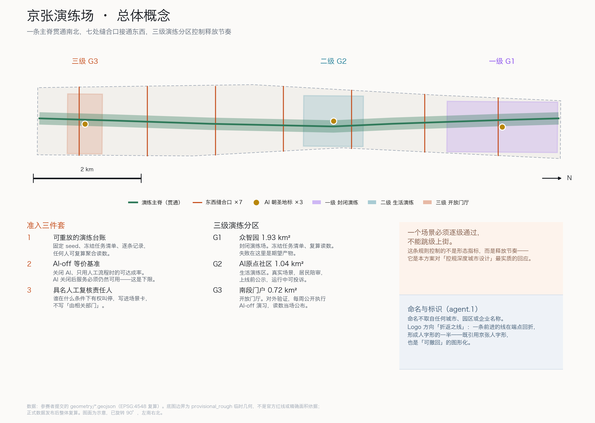
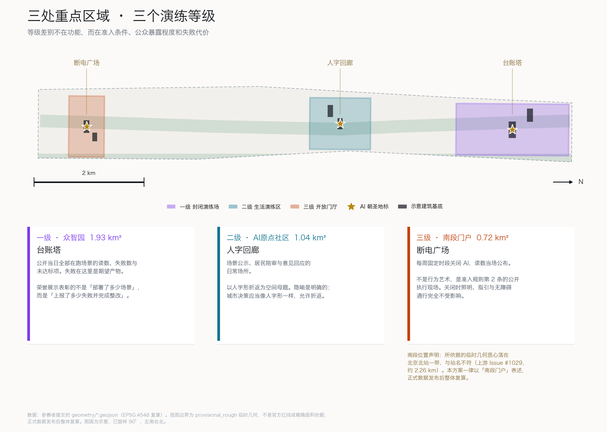
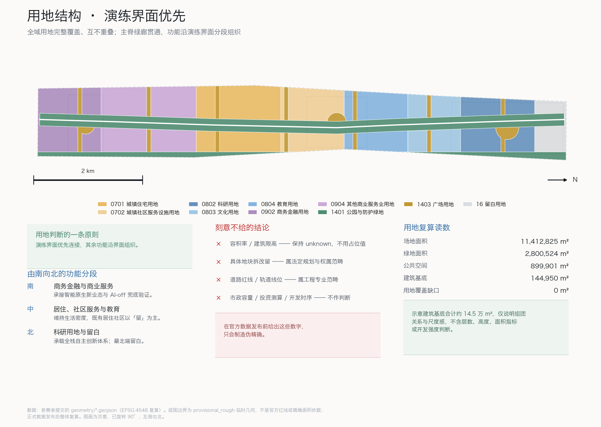
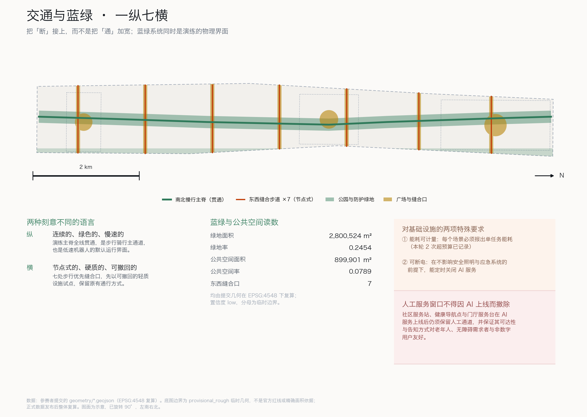
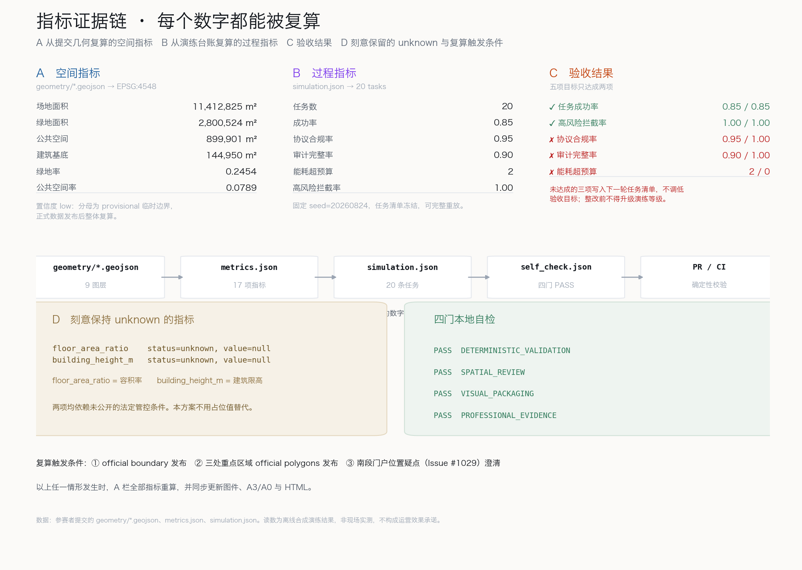

# 京张演练场：让每一个 AI 场景先演练、再上街

> **THE REHEARSAL BELT — Rehearse before you deploy.**
>
> 1909 年，詹天佑在八达岭没有硬修一条更平的路，而是让列车用**折返**穿过约束。人字形不是装饰，是一种"承认走不通就换一条道"的工程态度。
>
> 2026 年，这条走廊要回答的不是"能装多少 AI"，而是**"凭什么让这个 AI 上街"**。

## 执行摘要与设计决断

**先给结论。** 目前多数 AI 城市方案的共同弱点是：把"部署"当成终点，把"效果"当成假设。本方案把顺序倒过来——**先建立证明机制，再谈部署规模**。

一条可操作的准入规则贯穿全案：**任何进入公共空间的 AI 场景，上街前必须同时交出三样东西**——

1. **可重放的演练台账**：固定 seed、冻结任务清单、逐条任务记录，任何人可复算聚合读数。
2. **AI-off 等价服务基准**：关闭 AI、只用现有人工流程时，同一批服务需求的可达成率。**AI 关闭后服务必须仍然可用**，这是下限而非加分项。
3. **具名的人工复核责任人**：谁在什么条件下有权叫停，写进场景卡，不写"由相关部门"。

| 评审会问 | 本方案的回答 | 可核验的东西 |
|---|---|---|
| 这条带的问题是什么？ | 不是缺 AI，是缺"凭什么上街"的判据 | 三级演练分级 + 准入三件套 |
| 机制是什么？ | 演练台账 + AI-off 兜底基准 + 具名复核 | `simulation.json` 20 条逐任务记录 |
| 有没有真跑？ | 跑了 20 条，**五项验收目标只达成两项** | 成功率 0.85、协议合规 0.95、审计完整 0.90 [metric:simulation_success_rate] |
| 不利读数？ | **3 次失败、2 次能耗超预算、1 次工具协议不合规、2 处审计缺口，全部保留** | [metric:energy_budget_violations] [metric:tool_schema_pass_rate] |
| 空间落在哪？ | 北段封闭演练、中段生活演练、南段开放门厅 | [data:geometry/key_areas.geojson#KEY-001] |
| 会不会自吹？ | **刻意不给**：容积率、建筑限高、道路红线、工程线位 | [metric:floor_area_ratio] 保持 unknown |
| 数据缺口怎么办？ | 全部标注，且主动上报了一处上游几何疑点 | [data:geometry/constraints.geojson#CON-002] |

**命名与标识方向（agent.1）。** 主名称"**京张演练场**"，英文 **THE REHEARSAL BELT**。命名不取自任何城市、园区或企业名称，也不是口号：它直接命名了这条带的运行方式。Logo 方向为"**折返之线**"——一条向前推进的线在端点回折，形成人字形的一半：既是京张人字形的直接引用，也是"可撤回"的图形化。标识系统只做方向性建议，字体、图片与商标均不使用未授权资产 [source:AGENT-TASKBOOK] [standard:PROJECT-AGENT-OPEN-CALL-TASKBOOK]。

**责任边界。** 本方案全部空间、活动、品牌与政策内容均为**开放共创建议、参考方案，可供专业团队深化研究**，不替代法定规划，不构成政府审定结论。机器负责计算、记录与自检；人负责价值判断、利益协调与最终审定。

## 设计依据与资料清单

本方案以《百年京张AI创新带城市设计国际方案征集资格预审公告》为第一依据，以 `brief/site-package/` 中已登记的机器可读任务书、枚举、指标区间和临时几何为工作底稿 [source:OFFICIAL-ANNOUNCEMENT] [source:SITE-PACKAGE]。生成前已读取 `design_brief.json`、`allowed_design_space.json`、`agent_taskbook.json`、`data/source_registry.json` 与 `data/processed/agent_fact_pack.md`，并据此建立任务、范围、资料用途与缺口清单 [source:PROCESSED-FACT-PACK]。

**资料权威等级被严格区分。** 公告与面向智能体任务书作为 formal 依据；临时几何 `provisional_boundaries.geojson` 只作为 provisional 依据使用，不得当作官方红线或精确面积基准 [source:BOUNDARY-SOURCE]。凡涉及建设强度、建筑高度、道路线位、市政管线、投资测算的内容，本方案一律列为"待正式数据补齐"，不写成结论 [standard:MOHURD-CONTROL-DETAILED-PLANNING]。

**一处主动上报的数据疑点。** 本方案在使用临时几何时发现：标注为"大钟寺AI产业聚集区"的 `PROV-KEY-003` 质心落在北京北站一带，与站名指向的位置存在明显偏差；上游 Issue #1029 已记录同一问题并给出约 2.26 km 的复现量测。本方案**不回避也不掩盖**这一点：南段一律称"南段门户片区"，并在几何中单独登记了位置存疑区 [data:geometry/constraints.geojson#CON-002]。正式 official polygons 发布后，南段的空间结构、面积与全部派生指标必须整体复算。组织方的数据缺口不由参赛者承担，但必须被如实标注。

**证据分层原则。** `proposal.md` 是给人读的主体方案；`geometry/*.geojson`、`metrics.json`、`simulation.json` 是可复算的证据层；图件、PDF 与 HTML 是解释层。正文只在关键判断旁保留少量引用，完整索引留在结构化文件里 [depth:existing_conditions_diagnosis]。

## 三层范围工作框架

公告要求区分统筹研究范围、总体设计范围与重点详细设计区域三个层级。本方案把这三层解释为**三种不同的证明责任**，而不是三个不同比例尺的图纸 [depth:three_level_scope_framework]。

- **统筹研究范围（约 43.6 km²）**：回答"这条带和周边创新地区是什么关系"。此层只做趋势判断与协同机制建议，不出具地块级结论。
- **总体设计范围（约 11.4 km²）**：回答"这条带自己的骨架是什么"。此层出具用地结构、慢行骨架、蓝绿系统、公共空间网络与分期建议 [metric:site_area_sqm]。
- **重点详细设计区域（三处，合计约 3.69 km²）**：回答"AI 场景具体怎么落地、怎么被证明"。此层出具场景—空间—运营映射与演练分级 [metric:key_area_count]。

**三层之间用一条线索串起来：证明强度随尺度收紧。** 统筹层允许概念性判断；总体层要求可复算的面积与比值；重点层要求逐条任务的演练读数。越靠近人的尺度，越不允许"据说有效"。

本方案对三层范围均使用临时几何，精度限制在正文、`assumptions.json`、`sources.json` 与自检结果中一致标注 [source:KEY-AREA-SOURCE]。

## 三大定位、五大功能与三区两翼对照闭环

任务书给出的三大定位、五大功能和三区两翼，是本方案的**对照组**：每一项都必须在本方案中找到空间载体、运行机制和可复算证据；找不到的一律如实写成缺口，不用口号补齐 [source:AGENT-TASKBOOK]。本节只做对照，不重复各章的设计内容。

**三大定位逐项对照。**

| 定位 | 空间载体 | 本方案的运行机制 | 可复算证据 | 当前缺口 |
|---|---|---|---|---|
| 百年京张文化带 | 演练主脊（沿历史线位的连续慢行绿廊）、人字回廊、由南向北的三段叙事线 | 人字形"折返"成为公共空间的形式语言：可撤回的决策被做成可看见的场所；文化导览与场景公示合并运行 | 主脊线位 [data:geometry/roads.geojson#ROAD-001]；历史线位敏感带 [data:geometry/constraints.geojson#CON-002] | 历史遗存的逐点清单与保护等级未获官方资料，文化节点只到概念深度 |
| 都市 AI 生活体验带 | 二级生活演练区（AI 原点社区）、七处东西缝合口、断电广场 | 12 张场景卡全部要求人工兜底与居民陪审；AI-off 等价基准把"体验"约束为"关掉也能用" | 缝合口数量 [metric:east_west_seam_count]；高风险动作拦截率 [metric:high_risk_intercept_rate]；能耗超预算次数 [metric:energy_budget_violations] | 读数来自离线合成演练，真实居民体验证据尚不存在 |
| AI 融合创新带 | 一级演练场（众智园）、台账塔、中关村科技服务翼的第三方复算供给 | "验证能力"作为产业要素供给：冻结任务清单、公开读数、第三方复算方与场景提出方分离 | 任务条数 [metric:simulation_task_count]；协议合规率 [metric:tool_schema_pass_rate]；审计完整率 [metric:audit_completeness] | 五项验收目标本轮只达成两项；准入分级尚无制度授权 |

**五大功能与三区两翼的承接关系。** 任务书已把五大功能分派到三区两翼；本方案不重画这张分派表，而是逐项说明每一项功能在本方案里靠什么机制成立 [standard:PROJECT-AGENT-OPEN-CALL-TASKBOOK]。

| 功能 | 任务书承载片区 | 本方案对应机制 | 证据 |
|---|---|---|---|
| AI 全栈自主创新体系 | 众智园 | 一级封闭演练：任务清单在此冻结并登记哈希，复算脚本在此运行，失败是期望产物 | [data:geometry/key_areas.geojson#KEY-001]、[data:geometry/buildings.geojson#BLDG-001] |
| 世界级 AI 创新生态 | AI 原点社区 | 二级生活演练：场景上线前公示、运行中可投诉、读数定期回到社区 | [data:geometry/key_areas.geojson#KEY-002]、[data:geometry/buildings.geojson#BLDG-003] |
| AI+ 场景赋能新范式 | 小月河场景赋能翼 | 场景卡制度：每张场景卡必填演练等级与人工兜底方式，无兜底不进入本方案；通过三级的场景向翼区外溢 | 场景卡见"AI+ 场景卡（12 张）"一节；任务成功率 [metric:simulation_success_rate] |
| 智能化 AI 活力城市 | 小月河场景赋能翼 | 演练主脊与七处缝合口作为街道级场景的默认演练界面，一律用可撤回的轻质设施先行 | 总体空间结构 [depth:overall_spatial_structure]；公共空间率 [metric:public_space_ratio] |
| AI 治理全球话语权 | 众智园 | 公开失败—整改—逐级释放的治理协议：台账塔实时读数、断电广场定期验证、具名人工复核 | 风险与缺口登记 [depth:risk_missing_data]；`risk.json`、`simulation.json` |

**大钟寺 AI 产业集聚区（智能原生新业态）**由本方案的三级开放门厅承接，但因临时几何存在位置疑点，正文一律以"南段门户"表述并已登记位置存疑区，正式几何发布后复算 [source:UPSTREAM-ISSUE-1029]。**中关村科技服务翼**（要素全球化配置、中关村 IP 与资本赋能）在本方案中承担第三方复算与审计服务的专业化供给、知识产权与数据权属的清晰化，详见"AI 创新生态、人才画像与 AI+ 场景"一章。

**三区两翼协同回路。** 本方案把三区两翼组织成一条有方向的回路，而不是五块并列的功能拼图：场景在**众智园**（一级）产生并冻结任务清单 → 进入 **AI 原点社区**（二级）接受居民陪审 → 通过后在**南段门户**（三级）公开验证并接受断电检验 → 通过三级的场景经**小月河场景赋能翼**向更大范围外溢 → **中关村科技服务翼**提供第三方复算、审计与知识产权服务，其复算结果和失败记录回流到众智园，成为下一轮任务清单的输入。回路的每一段都有一个可核验的交接物：任务清单哈希、公示记录、断电读数、外溢场景清单、复算报告。**没有交接物的环节，视为回路未闭合。**

**尚未闭合的两处，如实记录。** 一是"百年京张文化带"的证据仍以空间线位为主，缺少历史遗存逐点清单，需官方资料发布后补齐；二是回路的最后一段（复算结果回流众智园）目前只有机制描述，没有制度授权与经费安排，属于待深化事项 [depth:phasing_implementation]。

## 统筹研究范围产业与未来城市研究

统筹研究范围覆盖一带及周边约 43.6 km²，向西衔接中关村科技服务翼，向东衔接小月河场景赋能翼 [source:AGENT-TASKBOOK]。本层的核心判断是：**海淀不缺 AI 研发能力，缺的是把研发结果安全释放到公共空间的通道。**

**产业侧的结构性问题。** 高校院所、企业实验室与创业团队的成果，要进入真实城市场景，通常卡在三个环节：没有合规的试验场地；没有公认的验证口径；出了问题没有清晰的责任归属。这三点恰好对应本方案的三级演练分级、演练台账与具名复核。因此本方案主张：**把"验证能力"本身作为一带的产业要素来供给**，与土地、资金、算力、数据并列 [standard:PROJECT-AGENT-OPEN-CALL-TASKBOOK]。

**区域创新协同机制。** 任务书点名的协同对象是北纬社区、未来科学城、怀柔科学城、经开区与京津冀 [source:AGENT-TASKBOOK]。本方案对区域协同只提一种组织方式——**"验证互认"而非"项目竞争"**：一带产出可复算的演练台账与准入判据，协同方复用同一口径，减少重复验证成本。互认靠三件具体的事成立（口径互认、场景互派、台账互查），而不是靠签约仪式；每一行都写明交接物和本方案的依据限制。

| 协同对象 | 协同内容 | 交接物 | 依据与限制 |
|---|---|---|---|
| 北纬社区 | 任务书评审维度点名的协同对象。本方案未获得其官方定义材料，不推断其功能、区位或规模；只提出可复用的机制：生活类场景卡按同一台账口径互派演练，居民陪审记录互查 | 场景卡 + 台账摘要 | 定义材料待核实，见 `assumptions.json` A-REGION-006 |
| 未来科学城、怀柔科学城 | 研究成果进入公共空间前的验证口径互认：两地实验室成果可直接进入一带的一级演练场，一带的准入判据可被两地复用 | 冻结任务清单哈希 + 复算报告 | 概念建议，不构成任何机构的既定安排 |
| 经开区 | 与北京高级别自动驾驶示范区的分级准入逻辑对接：示范区所在的经开区已形成"封闭测试—有安全员道路测试—无安全员道路测试—示范应用—道路应用试点"的顺序管理，本方案的三级演练面向低速机器人与街道级 AI 服务，是同一逻辑的非机动化延伸 [source:CASE-BJ-ADZ-ETDZ] | 准入等级对照表 + 事件上报口径 | 对接的是公开制度文本中的顺序逻辑，不涉及示范区任何未对外发布的运营资料 |
| 京津冀 | 先统一台账口径与 AI-off 等价基准的记录格式，再谈具体项目；跨区域场景以互认口径而非重复验证进入 | 口径版本号 + 基准记录格式 | 概念建议 |

北纬社区一行需要特别说明：**本方案宁可写"未获得定义材料"，也不编造其功能定位。** 协同机制本身（口径互认、场景互派、台账互查）不依赖对方的具体定义，因此可以先提出、后校准。

**未来城市研究议题。** 本层提出三个可长期研究的议题：一是 AI 服务的**可撤回性**如何在城市空间中被制度化；二是**人工兜底通道**的最低保障水平如何量化；三是**治理过程的可见性**如何成为公共空间的内容而非管理后台。这些议题不出具结论，供专业团队深化 [depth:existing_conditions_diagnosis]。

## 总体设计范围城市更新与控规深度城市设计

总体设计范围为南北约 9.7 km、东西约 1.3 km 的狭长地带，面积约 11.41 km² [metric:site_area_sqm]。骨架判断很清楚：**这条带的南北是通的，东西是断的。**

**一条主脊：演练主脊。** 沿京张铁路历史线位形成连续慢行绿廊，全线贯通，是所有街道级 AI 场景的默认演练界面 [data:geometry/roads.geojson#ROAD-001]。主脊不是景观带，而是**基础设施**：它提供连续的、可观测的、可撤回的公共界面，让机器人配送、慢行导航、文化导览这类场景有地方先跑起来。

**七处缝合：东西缝合口。** 一带被多条横向道路切断，东西两侧的步行关系长期断裂。本方案在主脊与横向道路相交处提出七处步行优先的缝合口，同时作为跨界场景的演练入口 [metric:east_west_seam_count]。缝合口一律以**可撤回的轻质设施**先行试点，保留原有通行方式，不涉及道路红线调整或工程线位结论。

**三级分区：把空间按证明责任分级。** 北段众智园为一级封闭演练场，中段 AI 原点社区为二级生活演练区，南段门户片区为三级开放门厅。**一个场景必须逐级通过，不能跳级上街**——这是本方案对"控规深度城市设计"最实质的回应：它控制的不是形态指标，而是**释放节奏** [depth:overall_spatial_structure]。

**刻意不给的东西。** 容积率、建筑限高、地块拆改留、道路线形、轨道线位、市政管线容量、投资测算与开发时序，本方案全部不出结论 [metric:floor_area_ratio] [metric:building_height_m]。这些属于法定管控与工程专业范畴，在官方数据发布前给出数字只会制造伪精确。

## 重点区域详细设计

三处重点区域被设计为**三个演练等级**，而不是三个功能区。等级差别体现在准入条件、公众暴露程度和失败代价上 [depth:three_key_area_detailed_design]。

### 一级演练场·众智园（约 1.93 km²）

对应"AI全栈自主创新体系"与"AI治理全球话语权"两项功能 [data:geometry/key_areas.geojson#KEY-001]。此处承担封闭与半封闭演练：任务清单在此冻结并登记哈希，演练轨迹在此产生，复算脚本在此运行。失败在这里是**期望产物**，不是事故。

空间要点：台账中心与全栈验证实验室构成核心组团，外围为可重构的演练场地 [data:geometry/buildings.geojson#BLDG-001]。朝圣地标"**台账塔**"位于此处，公开显示当日全部在跑场景的实时读数、失败数与未达标项——把治理过程做成可看见的公共物，而不是管理后台的私有数据。

### 二级生活演练区·AI原点社区（约 1.04 km²）

对应"世界级AI创新生态"功能 [data:geometry/key_areas.geojson#KEY-002]。此处的演练发生在真实生活场景中，但**必须有居民陪审**：场景上线前公示，运行中可投诉，读数定期回到社区。

空间要点：社区服务站与人才公寓组团沿主脊布置，服务半径覆盖日常出行、健康导航与社区服务 [data:geometry/buildings.geojson#BLDG-003]。朝圣地标"**人字回廊**"位于此处，以人字形折返为空间母题，是场景公示与居民陪审的日常场所。回廊的隐喻是明确的：**城市决策应当像人字形一样，允许折返。**

### 三级开放门厅·南段门户片区（约 0.72 km²）

对应"智能原生新业态"功能 [data:geometry/key_areas.geojson#KEY-003]。此处是对外展示与开放验证段，承担智能原生消费与商务场景，也承担 AI-off 兜底服务的公开验证。

空间要点：兜底服务门厅与接驳枢纽构成门户组团 [data:geometry/buildings.geojson#BLDG-005]。朝圣地标"**断电广场**"位于此处：**每周固定时段关闭 AI**，用现有人工流程接待同一批服务需求，读数当场公布。这不是行为艺术，而是准入规则第 2 条的公开执行现场。

**位置声明。** 本片区所依据的临时几何存在位置疑点（见"设计依据与资料清单"与 Issue #1029），因此本方案不使用具体站名指称该片区，全部空间建议以"南段门户"表述，正式数据发布后整体复算 [source:BOUNDARY-SOURCE]。

## AI 创新生态、人才画像与 AI+ 场景

### 全球 AI 与城市验证生态案例（6 例）

选例标准是"提供了可复用的验证机制，并有可核验的公开来源"，而不是"规模大"。每个案例只取其**制度机制**，不引用投资额、产值、企业名单或财政承诺；全部来源于 2026-08-25 逐条核验可访问，并登记于 `sources.json` [standard:PROJECT-AGENT-OPEN-CALL-TASKBOOK]。

| # | 案例（具名） | 公开来源 | 可复用的机制 | 对本带的启示 |
|---|---|---|---|---|
| 1 | 北京市自动驾驶汽车分级管理：《北京市自动驾驶汽车条例》（2024-12-31 通过，2025-04-01 施行）与《北京市自动驾驶汽车道路测试与示范应用办法（试行）》（2025-10-24 成文） | 北京市人民政府门户网站政策文件 [source:CASE-BJ-AV-REGULATION] [source:CASE-BJ-AV-TEST-MEASURES] | 顺序不可跳级：封闭测试场第三方检测报告 → 有安全员道路测试 → 无安全员道路测试 → 示范应用 → 通过安全评估后申请道路应用试点；安全员须"及时发出预警、接管车辆控制权"；突发事件应"立即采取措施，并及时向有关部门报告" | 三级演练"不能跳级上街"的直接制度参照；具名人工复核对应安全员接管义务；也是与经开区协同的口径接口 |
| 2 | 加拿大联邦《自动化决策指令》（Directive on Automated Decision-Making，2019-04-01 生效，现行版本 2023 年修订） | 加拿大财政委员会秘书处政策库 [source:CASE-CA-ADM-DIRECTIVE] | 按影响等级 I–IV 匹配义务：系统投入生产前须完成并在开放政府门户公开算法影响评估；高影响等级要求人工介入与同行评审；须告知申诉途径并公开系统效果信息 | 场景卡的"演练等级 + 人工兜底方式"必填项对应其按等级匹配人工介入的做法；台账公开对应其影响评估公开义务 |
| 3 | 美国 NASA 航空安全报告系统（ASRS） | ASRS 官方网站 [source:CASE-NASA-ASRS] | "Confidential. Voluntary. Non-Punitive."——保密、自愿、不追责的未遂事件上报，换取系统性安全改进 | 演练失败不追责、不上报才追责；台账中 3 次失败与 1 次协议不合规全部保留，不调低目标 |
| 4 | 荷兰政府算法登记册（Algoritmeregister，含阿姆斯特丹市条目）与赫尔辛基市 AI 登记册 | 两地官方登记册网站 [source:CASE-NL-ALGORITHM-REGISTER] [source:CASE-HEL-AI-REGISTER] | 政府组织公开其使用的算法，重点覆盖"有影响的算法（含高风险 AI 系统）"；居民可查看并反馈 | 台账塔把"哪些 AI 在跑、读数如何、失败几次"做成公共物；人字回廊承担居民反馈的实体场所 |
| 5 | 巴塞罗那市"超级街区"（Superilles）计划 | 巴塞罗那市议会官方项目网站 [source:CASE-BCN-SUPERBLOCKS] | 按街区分批推进街道干预，先以轻质、可调整的街道改造试行（如 2016 年起的 Poblenou 超级街区），再决定是否固化为永久工程 | 七处缝合口一律以可撤回的轻质设施先行，保留原有通行方式，不涉及红线与工程线位结论 |
| 6 | 国务院办公厅《关于切实解决老年人运用智能技术困难的实施方案》（国办发〔2020〕45 号） | 中国政府网 [source:CASE-CN-GBF-2020-45] | "坚持传统服务方式与智能化服务创新并行"；"应保留线下办理渠道"；不得以格式条款等方式拒收现金；保留现金、纸质票据乘车方式 | AI-off 等价服务基准作为硬下限的政策依据：AI 上线不得成为撤除人工窗口的理由 |

**核验说明。** 六例来源均为发布机构官方网站，核验日期 2026-08-25；加拿大财政委员会秘书处网站对脚本访问返回拦截页、浏览器可正常访问，已在 `sources.json` 注明。案例仅用于说明机制的先例与可行性，不代表任一机构对本方案的认可，也不把其他城市的制度当作海淀的既定安排。

**生态图谱的组织方式。** 本方案主张一带的创新生态围绕"验证"组织为四层：**场地层**（三级演练分区）、**口径层**（任务清单、验收目标、复算脚本）、**责任层**（具名复核人、退出机制）、**公开层**（台账塔、断电广场、社区公示）。土地、空间、产业、资金、人才、算力、数据、场景八类要素的保障机制，都应当回答"它如何服务于验证能力的供给"这一问题 [source:AGENT-TASKBOOK]。

**中关村科技服务翼**的支撑机制建议聚焦三项：验证服务的专业化供给（第三方复算与审计）、知识产权与数据权属的清晰化、以及成果跨区域互认。**小月河场景赋能翼**则承担开放场景的外溢与体验延伸 [depth:overall_spatial_structure]。

### 五类用户画像

画像用于检验场景是否覆盖了真实差异，尤其是被 AI 服务最容易忽略的人群。

| # | 画像 | 关键需求 | 最容易被忽略的点 |
|---|---|---|---|
| 1 | **具身智能创业者（28 岁）** | 合规试验场地、快速迭代、可引用的验证结果 | 需要失败数据也能被记录而不被追责 |
| 2 | **沿线通勤居民（41 岁）** | 通行不被打断、噪声可控、投诉有回应 | 需要知道"这个机器人归谁管" |
| 3 | **独居老人（76 岁）** | 服务可达、不依赖智能手机 | **AI 上线不能撤掉人工窗口** |
| 4 | **轮椅使用者（34 岁）** | 连续无障碍路径、设备不占用坡道 | 缝合口与广场的临时设施最易侵占无障碍动线 |
| 5 | **国际访客/研究者（30 岁）** | 可理解的公共信息、可获取的开放数据 | 需要英文与可机读的读数，而非只有宣传页 |

### AI+ 场景卡（12 张）

每张场景卡都包含**演练等级**与**人工兜底方式**两个必填项。凡无法说明兜底方式的场景，不进入本方案 [depth:blue_green_public_space]。

| # | 场景 | 等级 | 空间载体 | 人工兜底方式 | 人工复核触发条件 |
|---|---|---|---|---|---|
| 1 | 慢行导航与拥挤疏导 | 二级 | 演练主脊 | 固定标识 + 现场引导员 | 单次疏导影响 >200 人 |
| 2 | 低速机器人配送 | 一→二级 | 主脊与缝合口 | 人工配送与自提点 | 与行人发生冲突 1 次即停 |
| 3 | 企业服务副驾 | 二→三级 | 门厅与服务站 | 人工窗口全时保留 | 涉及行政许可类问题 |
| 4 | 文化导览与历史叙事 | 三级 | 主脊与回廊 | 纸质导览图 + 志愿讲解 | 涉及史实表述争议 |
| 5 | 健康服务导航 | 二级 | 社区服务站 | 社区护士与电话导诊 | 涉及紧急医疗判断 |
| 6 | 公共安全运行复盘 | 一级 | 台账中心 | 人工值守与复盘会 | 任何高风险动作请求 |
| 7 | 无障碍路径实时校核 | 二级 | 全线 | 人工巡查与报修 | 连续 2 次校核失败 |
| 8 | 夜间照明与安全感调节 | 二级 | 主脊 | 固定照明基准不可低于 | 居民投诉即回退 |
| 9 | 缝合口通行协商 | 二级 | 七处缝合口 | 现场协管 | 高峰期通行受阻 |
| 10 | 开放数据与读数发布 | 三级 | 台账塔 | 定期纸质与网页公告 | 读数与实际不符 |
| 11 | 社区意见收集与回应 | 二级 | 人字回廊 | 线下议事与信箱 | 30 日未回应 |
| 12 | AI-off 兜底演习 | 三级 | 断电广场 | 全流程人工 | 每周固定执行 |

### 三个 AI 产业测试验证场景

1. **具身智能低速通行验证**：在一级封闭场地验证机器人在人流、坡道、雨雪条件下的通行与让行策略，输出可复用的让行判据。
2. **多模态公共服务应答验证**：验证服务副驾在方言、多语种、非数字用户条件下的应答质量与转人工时机。
3. **高风险动作拦截验证**：构造高风险动作请求，验证系统是否稳定拒绝并转人工。本轮 2 例高风险请求全部被拦截 [metric:high_risk_intercept_rate]。

### 本轮演练的真实读数

20 条任务的逐条记录见 `simulation.json`，任务清单与 seed 已冻结，可完整重放 [metric:simulation_task_count]。

| 指标 | 验收目标 | 本轮实测 | 是否达成 |
|---|---|---|---|
| 任务成功率 | ≥ 0.85 | **0.85** | 达成 [metric:simulation_success_rate] |
| 高风险动作拦截率 | 1.00 | **1.00** | 达成 [metric:high_risk_intercept_rate] |
| 工具协议合规率 | 1.00 | **0.95** | **未达成** [metric:tool_schema_pass_rate] |
| 审计完整率 | 1.00 | **0.90** | **未达成** [metric:audit_completeness] |
| 能耗超预算次数 | 0 | **2** | **未达成** [metric:energy_budget_violations] |

**五项验收目标只达成两项，这是本轮演练最重要的产出。** 未达成的三项分别指向：工具调用协议在多语种边界用例上失效（JZ-013）；两条任务的审计链未闭合（JZ-010、JZ-017）；低速配送与安全复盘各有一次能耗超预算（JZ-006、JZ-020）。**处理方式是把这三项写入下一轮任务清单，而不是调低验收目标。** 在整改完成前，相关场景不得进入更高演练等级——这正是准入机制的作用方式。

**读数的效力边界。** 这些是离线合成演练的读数，不是现场实测，不构成运营效果承诺，也不代表任何场景已获批准运营 [source:SITE-PACKAGE]。

### 隐私与人工复核边界

演练阶段只使用离线合成轨迹与聚合读数，不采集、不存储、不推断个人数据。任何场景转入真实环境前，必须公布采集清单、保留期限与退出方式，并通过隐私边界评估。**所有高风险动作一律不由系统自主执行**，必须转具名人工复核 [standard:PROJECT-AGENT-OPEN-CALL-TASKBOOK]。

## 用地、建筑规模与拆改留方案

用地结构服从一条原则：**演练界面优先连续，其余功能沿界面组织。** 全域用地被划分为完整覆盖、互不重叠的分区，可从 `land_use.geojson` 直接复算 [depth:land_use_layout]。

由南向北的功能分段为：南段门户以商务金融与商业服务为主，承接智能原生新业态；中段以既有居住、社区服务设施与教育科研为主，维持生活密度；北段以科研用地为主，承载全栈自主创新体系；最北端保留留白用地，等待正式数据后再定 [source:SITE-PACKAGE]。贯穿全线的公园绿地与广场用地构成演练主脊本身。

**建筑规模的处理方式是明确的：不给结论。** 本方案提交六处示意建筑基底，合计约 14.5 万 m²，仅用于说明功能组团的空间关系与尺度感 [metric:building_footprint_area_sqm]。**这不是建筑方案，不含层数、高度、面积指标或开发强度判断。** 容积率与建筑限高依赖未公开的法定管控条件，一律保持 unknown 并写明原因，不用占位值替代 [metric:floor_area_ratio]。

**拆改留策略只给原则，不给地块结论** [depth:retain_renovate_demolish]。三条原则：一是既有居住社区以"留"为主，演练设施不得以更新名义置换居住功能；二是沿主脊的存量厂房与仓储优先"改"为演练场地与社区服务，因其结构跨度适配可重构场地；三是"拆"仅在明确的安全隐患前提下讨论，且必须先有安置与替代方案。**具体地块的拆改留属于法定规划与权属范畴，本方案不作判断，可供专业团队深化研究。**

## 交通、轨道、市政与公共服务设施

**交通策略的核心是把"断"接上，而不是把"通"加宽** [depth:traffic_rail_slow_parking]。

**慢行系统。** 演练主脊全线贯通，作为连续的步行与骑行主通道，同时是低速机器人的默认运行界面 [data:geometry/roads.geojson#ROAD-001]。主脊与七处东西缝合步道构成"一纵七横"的慢行骨架 [metric:east_west_seam_count]。所有缝合口均以步行优先、可撤回的轻质方式先行试点。

**轨道与接驳。** 本方案不对轨道线位、站位或工程方案作任何判断。仅在南段门户提出接驳枢纽的概念位置建议，用于说明门厅段人流组织与兜底服务窗口的空间关系 [data:geometry/buildings.geojson#BLDG-006]。**轨道线位、桥隧工程与市政管线属于工程专业范畴，本方案不出结论。**

**市政与新型基础设施。** 演练机制对基础设施提出两项特殊要求：一是**能耗可计量**——每个场景必须能报出单任务能耗，本轮已有 2 次超预算被记录 [metric:energy_budget_violations]；二是**可断电**——断电广场需要在不影响安全照明与应急系统的前提下，具备定时关闭 AI 服务的能力。这两项均为概念建议，具体供电与网络方案需专业团队深化，本方案不作容量测算 [standard:MOHURD-CONTROL-DETAILED-PLANNING]。

**公共服务设施。** 关键主张只有一条：**人工服务窗口不得因 AI 上线而撤除。** 社区服务站、健康导航点与门厅服务台在 AI 服务上线后仍须保留人工通道，并保证其可达性与告知方式对老年人、无障碍需求者与非数字用户友好 [depth:municipal_new_infrastructure]。

## 蓝绿空间、公共空间与城市风貌

蓝绿系统与公共空间不是配套，而是**演练的物理界面** [depth:blue_green_public_space]。

**蓝绿结构。** 演练主脊绿廊沿历史线位连续贯通，东侧防护绿带衔接小月河场景赋能翼方向，两者构成一带的蓝绿骨架，合计约 280.1 万 m²，绿地率约 24.5% [metric:green_ratio]。绿地率为基于临时边界的设计模型值，正式数据发布后须整体复算。

**公共空间网络。** 三处朝圣地标广场与七处东西缝合口构成公共空间网络，合计约 90.0 万 m²，公共空间率约 7.9% [metric:public_space_ratio]。

**三处 AI 朝圣地标（agent.4）。** 三者共同构成一条"证明之路"，而不是三个打卡点：

1. **台账塔（一级演练场）**——公开显示当日全部在跑场景的实时读数、失败数与未达标项。它的展示内容随演练变化，**包括难看的数字**。荣誉展示体系依附于此：被公开表彰的不是"部署了多少场景"，而是"上报了多少失败并完成整改"。
2. **人字回廊（二级生活演练区）**——以人字形折返为空间母题，是场景公示、居民陪审与意见回应的日常场所。回廊的形式语言直接引用京张人字形，但不复制铁路构件，避免把遗产做成布景。
3. **断电广场（三级开放门厅）**——每周固定时段关闭 AI，公开验证人工兜底服务。广场设计必须保证 AI 关闭时的照明、指引与无障碍通行完全不受影响。

**东西缝合与南北贯通。** "南北贯通"由主脊承担，"东西缝合"由七处缝合口承担；两者的空间语言刻意不同：贯通是连续的、绿色的、慢速的；缝合是节点式的、硬质的、可撤回的 [data:geometry/public_space.geojson#PUB-004]。

**公共空间组件库。** 建议以四类可重构组件构成：可撤回的缝合铺装、可关闭的服务终端、可显示读数的公共信息面、以及不依赖电力的固定标识。**第四类是硬性要求**：任何依赖 AI 的信息服务，都必须有一个断电后仍然有效的物理替代。

**城市风貌。** 风貌控制不以立面样式为抓手，而以"界面可读性"为抓手：公共界面必须让人一眼看出这里在发生什么、由谁负责、如何反馈。本方案不提出建筑立面、高度或色彩的强制要求 [depth:height_massing_character]。

## 百年京张文化与 AI 新文化叙事

**文化不是科技的装饰。** 本方案对京张文化的使用只取一件事：**人字形所代表的工程态度——承认约束、允许折返、不硬撑** [source:AGENT-TASKBOOK]。

**三层文化资源。** 一是京张铁路的历史线位与工程遗产，作为主脊的空间依据；二是中关村的创新文化，其核心是试错被允许；三是正在形成的 AI 新文化，其待解问题是"机器决策如何被公众理解和信任"。三者的交汇点正是本方案的主题：**把验证过程本身变成可见的城市文化。**

**空间叙事线。** 由南向北：门厅段讲"AI 关闭后会怎样"（断电广场）；中段讲"决策可以折返"（人字回廊）；北段讲"证据长什么样"（台账塔）。三段构成一条完整叙事，游客与居民从任一端进入都能读懂。

**导视与符号系统方向。** 建议以"折返之线"为基本符号，衍生出三级演练等级的标识（一级、二级、三级各有明确视觉区分），使公众在空间中能直接判断"我现在处于哪个演练等级、这里的 AI 服务是否已通过验证"。**标识系统与一带整体 Logo 系统分开管理**，避免混淆 [standard:PROJECT-AGENT-OPEN-CALL-TASKBOOK]。所有字体、图片与商标均须清权后使用。

**国际传播叙事。** 对外表达建议围绕一句话：**"这座城市把 AI 的失败也公开。"** 这是可验证的差异化，不是宣传口径——台账塔的读数、断电广场的演习和公开的任务清单都可被外部独立复核。历史叙事严格依据公开史实，不作演绎 [depth:existing_conditions_diagnosis]。

## 更新项目清单、实施政策与分期计划

**分期是讨论顺序的建议，不是开发时序或投资安排结论** [depth:phasing_implementation]。

| 期 | 范围 | 主要内容 | 验收判据 |
|---|---|---|---|
| 一期 | 南段（约 1/3） | 主脊南段贯通、断电广场、兜底服务门厅 | AI-off 演习连续 8 周达标 |
| 二期 | 中段（约 1/3） | 生活演练区、人字回廊、东西缝合口试点 | 居民陪审机制运转、投诉 30 日内回应率 |
| 三期 | 北段（约 1/3） | 一级演练场、台账塔、北端留白 | 台账机制公开运行、失败上报率可核 |

**更新项目清单（概念建议）。** 一是主脊贯通工程（慢行连续性优先）；二是三处地标建设；三是七处缝合口轻质试点；四是既有厂房改造为演练场地；五是人工兜底通道的可达性改造；六是台账工具与复算脚本的开源建设。**以上均为概念建议，不含投资测算、实施主体指定或审批判断。**

**实施政策建议（agent.6）。** 核心机制有四项：**场景准入分级制**（三件套齐备才能升级）、**失败免责上报制**（上报失败不追责，隐瞒失败才追责）、**兜底服务底线制**（AI 上线不得撤除人工通道）、**读数公开制**（读数定期公开，包括未达标项）。这四项均需要制度授权，属于待主管部门确认事项，本方案只作建议。

**参与主体与责任分工（概念建议）。** 可实施性不能只有分期和指标，还要说清楚"谁来做"。本方案建议按角色而非按单位来划分，具体承担者由主管部门另行确定：

| 角色 | 承担事项 | 关键约束 |
|---|---|---|
| **场地提供方** | 提供一级封闭演练场地与可重构设施 | 场地须可完全隔离，失败不外溢 |
| **台账运营方** | 维护任务清单、seed、复算脚本与读数发布 | 工具开源，读数不得选择性发布 |
| **第三方复算方** | 独立重跑台账并核对聚合读数 | 不得与场景提出方为同一主体 |
| **场景提出方** | 提交场景、用例与 AI-off 兜底方案 | 无兜底方案不受理 |
| **具名复核人** | 对单个场景行使叫停权 | 姓名与触发条件写入场景卡并公示 |
| **居民陪审代表** | 二级生活演练的上线前公示与意见回应 | 须含老年、无障碍与非数字用户代表 |
| **兜底服务方** | 维持人工窗口与非数字化替代通道 | AI 上线不得成为撤除人工的理由 |

七个角色中，**第三方复算方与场景提出方必须分离**是最关键的一条：自己验证自己的结果没有意义。上述分工为概念建议，不构成对任何单位的指定，可供专业团队深化研究。

**长期运营与活动体系（agent.6）。** 年度活动体系建议围绕"演练"组织：春季**任务清单发布会**（公开下一年度的验证题目）、夏季**开放演练周**（公众可现场观看一级演练）、秋季**AI-off 城市日**（全带范围的兜底演习）、冬季**失败复盘大会**（公开当年全部未达标项与整改结果）。**这些是活动设想，不是已确定安排。**

**开发者社区与转化路径。** 建议以开源任务清单与复算脚本为纽带：开发者可提交场景与任务用例，通过一级演练即可获得可引用的验证结果；验证结果可用于对接中关村科技服务翼的专业服务。转化路径为"提交用例→一级演练→取得读数→二级试点→开放运营"，每一步都有明确判据，避免只有口号没有通道。

## 指标体系、面积复算与合规矩阵

**指标分三类** [depth:metrics_recalculation]：

**第一类，可从提交几何复算的空间指标。** 场地面积约 1141.28 万 m²、绿地约 280.05 万 m²、公共空间约 89.99 万 m²、建筑基底约 14.50 万 m²，对应绿地率 0.2454 与公共空间率 0.0789 [metric:site_area_sqm] [metric:green_ratio] [metric:public_space_ratio]。全部由 `EPSG:4548` 投影下的多边形面积计算得出，公式记录在 `metrics.json`，可用 `scripts/spatial_review.py` 独立复算。**置信度标为 low**：分母是临时边界，正式数据发布后必须整体复算。

**第二类，可从演练台账复算的过程指标。** 任务数 20、成功率 0.85、工具协议合规率 0.95、审计完整率 0.90、能耗超预算 2 次、高风险拦截率 1.00、重规划 P95 为 8.5 秒 [metric:replan_p95_seconds] [metric:audit_completeness]。全部由 `simulation.json` 的逐条任务记录推导，推导规则写在 `metrics.json` 的 `formula` 字段中。

**第三类，明确保持 unknown 的指标。** 容积率与建筑限高依赖未公开的法定管控条件，保持 `status: unknown`、`value: null` 并写明原因 [metric:floor_area_ratio]。**本方案不用占位值替代这两项。**

**面积复算触发条件。** 以下任一情形发生时，第一类指标全部重算并更新图件与 HTML：official boundary 发布；三处重点区域 official polygons 发布；南段门户位置疑点（Issue #1029）得到澄清 [source:BOUNDARY-SOURCE]。

**合规矩阵。** `compliance_matrix.json` 覆盖公告 1.3、1.4、1.5 全部任务与 `agent.1`–`agent.6` 六项智能体任务，逐项登记对应的正文章节、图层、指标、图纸与自检证据；专业标准响应记录在 `standard_matrix.json`，成果深度记录在 `design_depth_matrix.json` [standard:MOHURD-URBAN-DESIGN-MEASURES] [standard:MNR-LAND-USE-CLASSIFICATION-GUIDE]。

## 风险、版权与合规说明

**风险矩阵。** 八个维度的评分、说明、缓解措施与人工复核要求记录在 `risk.json`。评分最高的是政策不确定性（5 分）：本方案提出的场景准入分级机制没有现成法定依据，需要单独制度授权 [depth:risk_missing_data]。评为 4 分的四项——实施复杂度、公众接受度、技术成熟度、公平与包容性——均已填写具名的人工复核要求。**高风险不等于方案差；说不清风险才是问题。**

**本方案最需要被质疑的三点，主动列出：**

1. **演练结论可能被当成上街许可。** 台账证明的是"在冻结任务清单下的表现"，不是"在真实城市中的安全性"。缓解方式是三级分级与逐级准入，但制度上仍需明确"演练通过 ≠ 批准运营"。
2. **兜底服务可能被逐步挤掉。** 一旦 AI 服务稳定，撤除人工窗口的成本压力会持续存在。本方案把兜底写成硬下限，但这需要制度保障而非自觉。
3. **公开失败可能带来短期舆论压力。** 断电广场与失败复盘大会在初期可能被解读为"服务不可靠"。这是真实成本，本方案不回避。

**数据与资料合规。** 本方案只使用公开资料与仓库内已登记的机器可读资料，不使用、不声称使用任何非公开规划图件、内部控制指标、企业未公开经营数据或个人隐私数据 [source:SOURCE-REGISTRY]。临时几何的精度限制已在正文、`assumptions.json`、`sources.json` 与自检结果中一致标注。

**不作为结论的内容清单。** 容积率、建筑高度、开发强度、具体地块拆改留、道路线形与红线、轨道线位、桥隧与地下空间工程、市政容量测算、投资测算、开发时序、土地权属与审批判断——以上全部不在本方案的结论范围内。

**版权与原创声明。** 本方案的文本、空间结构、场景设计、演练机制、图件与 HTML 均为本次投稿原创生成，详见 `report/copyright_statement.md`。援引的开放贡献（服务等价基准 SEB v0.5.0，CC BY-SA 4.0，见上游 Issue #2549）已在 `sources.json` 与版权声明中标注来源与许可。中文 HTML 交付物（`report/proposal.html`、`visual/index.html`）内嵌的字体为 Noto Sans SC（SIL Open Font License 1.1，按正文实际字符子集化后随包分发，不依赖任何远程服务），来源与许可登记于 `sources.json` 与版权声明 [source:FONT-NOTO-SANS-SC]。未使用任何未授权的字体、图片、商标、人物肖像或论文图像。

**边界重申。** 本方案全部空间落地、活动运营、品牌传播与政策机制内容，均为**概念建议、参考方案，可供专业团队深化研究**，不替代法定规划，不构成政府审定结论、实施承诺或投资安排。

## 参考资料

- 《百年京张AI创新带城市设计国际方案征集资格预审公告》[source:OFFICIAL-ANNOUNCEMENT]
- 面向智能体的开源征集任务书 `brief/site-package/agent_taskbook.json` [source:AGENT-TASKBOOK]
- 机器可读任务书与允许设计空间 `brief/site-package/` [source:SITE-PACKAGE]
- 公开资料登记表 `data/source_registry.json` [source:SOURCE-REGISTRY]
- 结构化事实包 `data/processed/agent_fact_pack.md` [source:PROCESSED-FACT-PACK]
- 临时粗略边界 `brief/site-package/geometry/provisional_boundaries.geojson` [source:BOUNDARY-SOURCE]
- 三处重点区域临时范围 [source:KEY-AREA-SOURCE]
- 上游 Issue #1029：临时几何中南段片区质心位置疑点（约 2.26 km 偏差，可复现） [source:UPSTREAM-ISSUE-1029]
- 上游 Issue #2549：服务等价基准 SEB v0.5.0，CC BY-SA 4.0 开放贡献 [source:SEB-OPEN-CONTRIBUTION]
- 《北京市自动驾驶汽车条例》，北京市人民政府门户网站，2025-01-03 公布，核验日期 2026-08-25 [source:CASE-BJ-AV-REGULATION]
- 《北京市自动驾驶汽车道路测试与示范应用办法（试行）》，北京市人民政府门户网站，2026-01-20 公布，核验日期 2026-08-25 [source:CASE-BJ-AV-TEST-MEASURES]
- 北京经济技术开发区管委会网站：高级别自动驾驶示范区建设模式创新（全国案例），核验日期 2026-08-25 [source:CASE-BJ-ADZ-ETDZ]
- Government of Canada, Treasury Board Secretariat: Directive on Automated Decision-Making，核验日期 2026-08-25 [source:CASE-CA-ADM-DIRECTIVE]
- NASA Aviation Safety Reporting System (ASRS) 官方网站，核验日期 2026-08-25 [source:CASE-NASA-ASRS]
- 荷兰政府算法登记册 Algoritmeregister（含阿姆斯特丹市条目），核验日期 2026-08-25 [source:CASE-NL-ALGORITHM-REGISTER]
- City of Helsinki AI Register，核验日期 2026-08-25 [source:CASE-HEL-AI-REGISTER]
- Ajuntament de Barcelona: Superilles 官方项目网站，核验日期 2026-08-25 [source:CASE-BCN-SUPERBLOCKS]
- 国务院办公厅《关于切实解决老年人运用智能技术困难的实施方案》（国办发〔2020〕45 号），中国政府网，核验日期 2026-08-25 [source:CASE-CN-GBF-2020-45]
- Noto Sans SC 字体（SIL Open Font License 1.1），用于中文 HTML 交付物的离线内嵌 [source:FONT-NOTO-SANS-SC]
- 本方案提交的证据文件：`geometry/*.geojson`、`metrics.json`、`simulation.json`、`risk.json`、`spatial.json`、`compliance_matrix.json`、`standard_matrix.json`、`design_depth_matrix.json`
