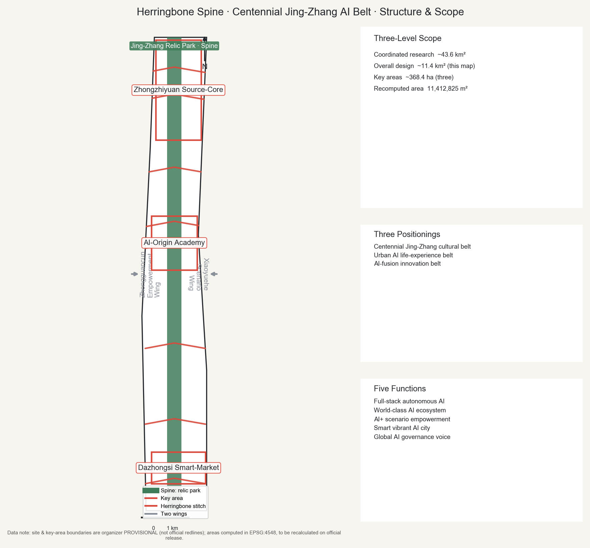
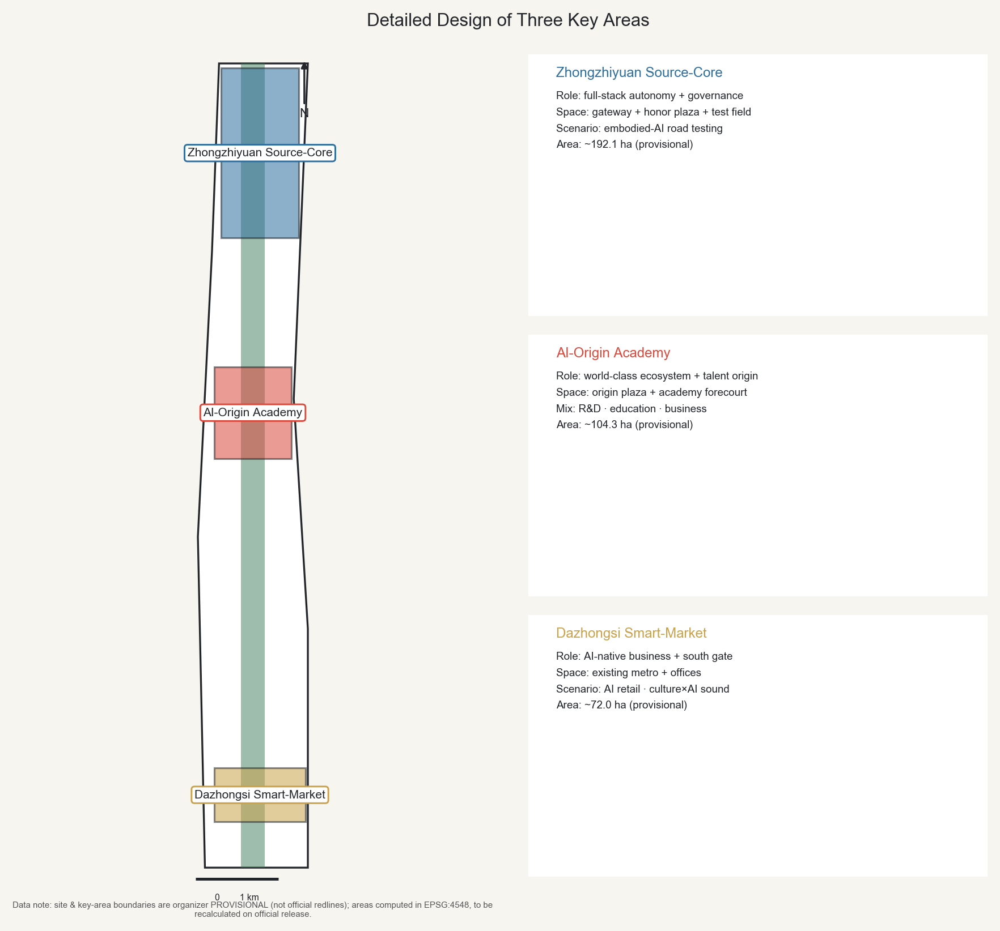
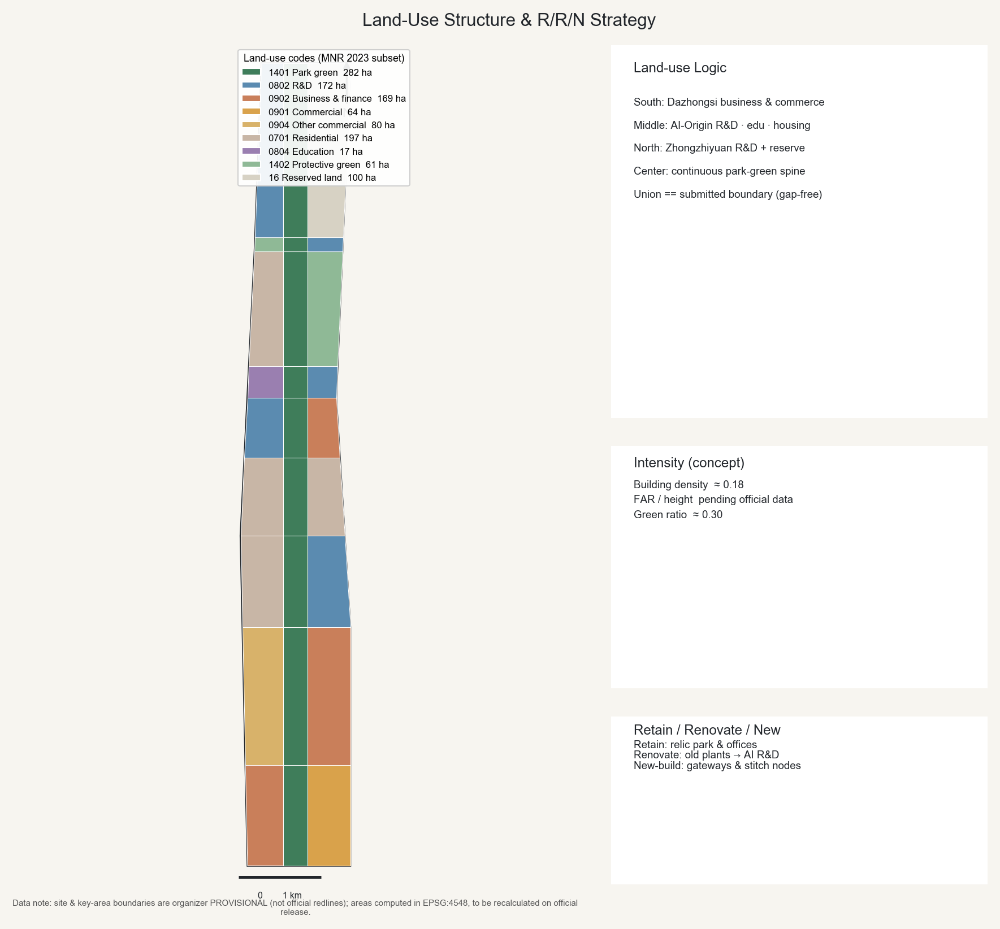
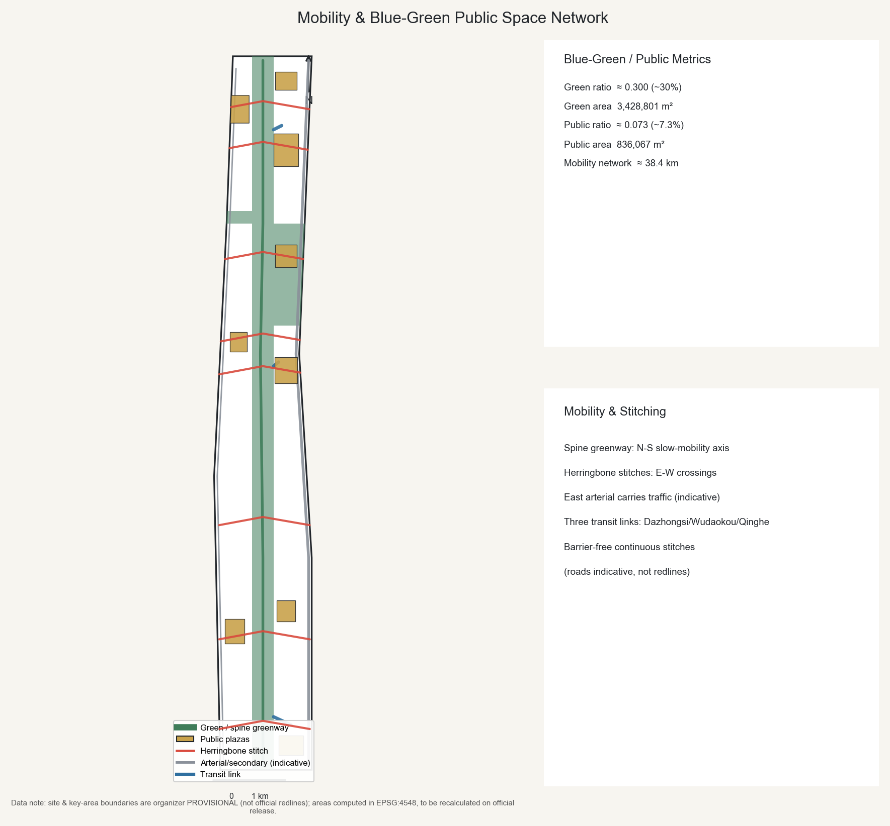
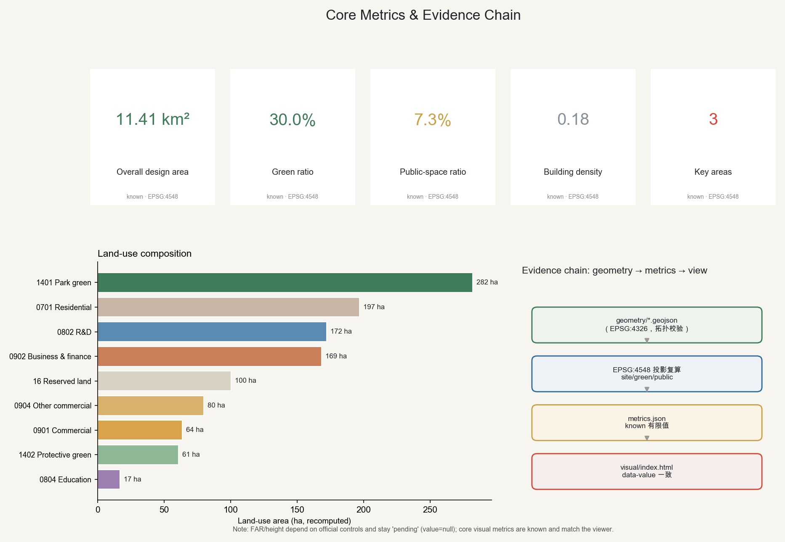

# Herringbone Spine — Centennial Jing-Zhang AI Innovation Belt Urban Design

> **One-line concept**: Let the Jing-Zhang relic park become a north-south "smart spine" (智脊); use a series of "herringbone stitch" corridors to suture the long-divided east and west sides and connect north and south — placing people (人) at the center of the AI belt, from the first railway China built on its own to a self-reliant intelligence built for people.
>
> **Overall name**: Herringbone Spine / 人字·智脊 (Rénzì Zhìjǐ). **Three positionings**: Centennial Jing-Zhang cultural belt, Urban AI life-experience belt, AI-fusion innovation belt [source:AGENT-TASKBOOK].
>
> **Boundary statement**: This proposal is generated by an AI agent. All spatial and industrial suggestions are open, co-created concept references or material for professional teams to deepen; they do not replace statutory planning and do not constitute government approval, investment commitments, or engineering-feasibility conclusions [source:AGENT-TASKBOOK].

## Design Basis and Source List

The proposal is built strictly on public or cleared materials [source:SITE-PACKAGE]. The core statutory and task basis is the qualification announcement for the "Centennial Jing-Zhang AI Innovation Belt International Design Solicitation" issued by the Beijing Municipal Commission of Planning and Natural Resources, together with the open-call taskbook for global agents; together they define the three scope levels, three key areas, three positionings, five functions, and the bilingual and structured-output requirements [source:OFFICIAL-ANNOUNCEMENT] [source:AGENT-TASKBOOK]. Evidence is chosen after reading the public source registry, distinguishing formal-ready from background-only and provisional-only sources, so that background material is never promoted into official boundaries or statutory controls [source:SOURCE-REGISTRY].

**Existing-condition reading (conceptual)**: from north to south the corridor reads as three segments — the Zhongzhiyuan area in the north with a research-and-industry base near Qinghe and the 5th Ring; the Wudaokou–Xueyuan Road middle with dense universities and young population; and Dazhongsi in the south with an existing metro station and business towers forming a southern gateway. After the railway went underground, the Jing-Zhang relic park became the largest continuous public asset, yet the east and west sides remain divided by the corridor and arterials [depth:existing_conditions_diagnosis] [source:PROCESSED-FACT-PACK].

**Key data gaps and handling**: precise official redlines, regulatory FAR/height, ownership, and municipal-engineering conditions are not yet public. The proposal therefore uses the provisional rough boundaries and key-area extents supplied in the site package, labels their temporary nature throughout, and recomputes precision-sensitive metrics once official data is released [data:geometry/site_boundary.geojson] [data:geometry/key_areas.geojson]. All provisional boundaries are used only for generation, display, and self-check — never as an approval basis or a precise-area basis.

## Three-Level Scope Framework

The proposal follows the announcement's three nested scopes to form a "research–overall–key" working framework [depth:three_level_scope_framework] [standard:PROJECT-OFFICIAL-ANNOUNCEMENT].

- **Coordinated research area**: ~43.6 km², bounded north by the North 5th Ring Road, east by the Jingzang Expressway, south by Xizhimenwai Street, west by Wanquanhe Road — used for strategic industry and future-city research [source:OFFICIAL-ANNOUNCEMENT].
- **Overall design area**: ~11.4 km², the corridor of urban and industrial districts within 1–2 km of the relic park; this is the main arena for regulatory-plan-depth urban design. The area recomputed in EPSG:4548 is about 11,412,825 m², consistent with the announced ~11.4 km² (about 0.2% deviation) [data:geometry/site_boundary.geojson] [metric:site_area_sqm].
- **Key-area extent**: ~368.4 ha, from north to south covering the Zhongzhiyuan AI Autonomous-Innovation Acceleration Area (~192.1 ha), the Beijing AI-Origin Community (~104.3 ha), and the Dazhongsi AI Industry Cluster (~72.0 ha) [data:geometry/key_areas.geojson] [metric:key_area_count].

The spatial relationship of the three scopes, the overall structure, and the herringbone-stitch logic are shown below.

All boundaries above are provisional constraints; rectangular or rough edges must not be read as parcel or road redlines, and are recomputed once official data arrives [data:geometry/constraints.geojson].

## Coordinated Research Area: Industry and Future City Research

Within the 43.6 km² research area, the proposal advances a "full-stack autonomous AI" thesis: building on Haidian–Zhongguancun's existing density of universities, institutes, firms, and capital, the Jing-Zhang corridor becomes a **full-stack autonomous innovation system** spanning compute, data, algorithms, and scenario applications, aligned with the taskbook's five functions (full-stack autonomous AI, world-class AI ecosystem, AI+ scenario empowerment, smart vibrant AI city, global AI-governance voice) [source:AGENT-TASKBOOK] [standard:PROJECT-AGENT-OPEN-CALL-TASKBOOK].

**Future-city hypothesis**: a city fit for AI as a new productive force is no longer organized by single-use zoning, but is highly mixed and readable by both agents and people. Land use therefore emphasizes adjacency of research, business, and housing; space emphasizes openable test scenarios and public data infrastructure [depth:overall_spatial_structure]. The industry thesis and future-city hypothesis are offered as research conclusions; the external cases cited are background references only and do not constitute commitments about local company rosters, investment amounts, or output value [source:SOURCE-REGISTRY].

## Overall Design Area: Urban Renewal and Regulatory-Plan-Level Urban Design

**Overall spatial structure: one spine · three cores · two wings · multiple stitches** [depth:overall_spatial_structure] [standard:MOHURD-URBAN-DESIGN-MEASURES].

- **One spine (smart spine)**: the relic park as a central north-south green slow-mobility spine, overlaid with a new-infrastructure band for compute, data, and environmental sensing — the ecological backbone and public living room of the belt [data:geometry/green_space.geojson].
- **Three cores**: north "Zhongzhiyuan Source-Core" (full-stack autonomy and governance voice), middle "AI-Origin Academy" (world-class ecosystem and talent origin), south "Dazhongsi Smart-Market" (AI-native new business) .
- **Two wings**: the west "Zhongguancun Empowerment Wing" (global factor allocation, IP and capital), and the east "Xiaoyuehe Scenario Wing" (AI scenario empowerment and vibrant city) [source:AGENT-TASKBOOK].
- **Multiple stitches**: a series of "herringbone stitch" corridors on the spine cross the corridor east-west, achieving the taskbook's "east-west stitching, north-south connection" [data:geometry/roads.geojson].

**Land-use layout**: land_use.geojson partitions the overall design area completely and seamlessly (the union of land-use polygons equals the submitted boundary, with no overlaps), using a numeric land-use-code subset from MNR document 234 (2023): park green (1401), R&D (0802), business & finance (0902), commercial (0901), urban residential (0701), education (0804), protective green (1402), and reserved land (16) [depth:land_use_layout] [standard:MNR-LAND-USE-CLASSIFICATION-GUIDE] [data:geometry/land_use.geojson]. Functions follow a north-south gradient of "south business — middle community/academy — north full-stack acceleration"; reserved land at the Zhongzhiyuan end safeguards flexible growth for full-stack autonomy.

**Development intensity**: the conceptual building footprint density is about 0.18 [metric:building_density]. FAR, height limits, and statutory green ratios depend on official regulatory controls and are marked as pending official data, to be recomputed on release; no statutory intensity conclusions are given at this stage [depth:development_intensity_controls] [standard:MOHURD-CONTROL-DETAILED-PLANNING].

## Detailed Design of Key Areas

The three key areas are given function, scenario, and spatial intent within their provisional boundaries, all as references for professional teams to deepen [depth:three_key_area_detailed_design] [data:geometry/key_areas.geojson].

- **Zhongzhiyuan Source-Core (~192.1 ha)**: an acceleration area for full-stack autonomous AI and a carrier of global AI-governance voice. Organized by a gateway plus an honor plaza, with a "Switchback Gate" landmark and open test fields hosting embodied-AI/robotics road testing and model evaluation [source:KEY-AREA-SOURCE].
- **Beijing AI-Origin Community / Academy (~104.3 ha)**: a world-class ecosystem and talent "origin". Centered on an "origin plaza + academy forecourt", mixing R&D, education, and business-finance around universities and young population to shape a walkable, dwellable, exchange-rich innovation community [data:geometry/land_use.geojson].
- **Dazhongsi Smart-Market (~72.0 ha)**: AI-native new business and the southern gateway. Building on the existing metro station and business base, it develops AI-native retail, smart business, and culture×AI soundscape, layering the ancient-bell culture with intelligent consumption [source:PROCESSED-FACT-PACK].

The three areas are connected by the spine and herringbone stitches into "one innovation corridor experienced jointly by agents and people".

## AI Innovation Ecosystem, Personas, and AI+ Scenarios

**(agent.1) Overall concept and naming system**: main name "Herringbone Spine / 人字·智脊"; sub-area names "Zhongzhiyuan Source-Core", "AI-Origin Academy", "Dazhongsi Smart-Market", "Zhongguancun Empowerment Wing", "Xiaoyuehe Scenario Wing"; the stitch corridors are named "Herringbone Corridor". **Logo direction**: the Qinglongqiao herringbone switchback is abstracted into two upward-growing strokes — one the Jing-Zhang historical track, one the AI algorithmic path — meeting at the "origin"; the palette takes rail steel-silver, Yan-mountain pine-green, and signal red [source:AGENT-TASKBOOK] [standard:PROJECT-AGENT-OPEN-CALL-TASKBOOK]. Naming and identity are concept suggestions; they do not copy existing city, park, or company names, or use unlicensed fonts, trademarks, or personal marks.

**(agent.2) Full-stack autonomy and world-class ecosystem — global case references (background)**: the proposal draws on public experience from six global innovation ecosystems, as background references only, not local facts or commitments [source:SOURCE-REGISTRY]: (1) the San Francisco Bay Area (Stanford–Silicon Valley) university–VC–firm–talent loop; (2) Boston's Kendall Square (around MIT) open labs co-located with industry; (3) London's King's Cross Knowledge Quarter — railway-brownfield regeneration layered with AI research and cultural institutions, highly comparable to the Jing-Zhang relic railway-land renewal; (4) Paris Station F's one-stop mega-incubator; (5) Singapore one-north's government-led research–industry–housing mix; (6) Hangzhou's Chengxi Science-Innovation Corridor and Shenzhen Nanshan for domestic AI scenario opening. For this belt it becomes a synergy of eight factors — land, space, industry, capital, talent, compute, data, scenarios — with the Empowerment Wing providing capital and IP services.

**(agent.3) AI+ scenario cards (≥10), test/validation scenarios (≥3), personas (≥5)**: public-facing generative-AI services all keep human-review and complaint channels, understood strictly within the scope of the Interim Measures for Generative AI Services [standard:GENERATIVE-AI-INTERIM-MEASURES].

| ID | Scenario | Spatial host | Users | AI capability | Human-review boundary |
|---|---|---|---|---|---|
| SC-01 | Relic-park AI guide | Spine | Visitors/residents | Multimodal narration | Correctable, reportable |
| SC-02 | Accessible-mobility companion | Stitch corridor | Elderly/mobility-impaired | Routing + one-tap call | Human service retained |
| SC-03 | Low-speed delivery/patrol | Local roads/greenway | Park firms | Low-speed autonomy | On-site safety officer |
| SC-04 | Public-service copilot | AI-Origin center | Firms/residents | Guidance Q&A | Human counter backstop |
| SC-05 | AI-native retail | Dazhongsi | Consumers | Smart selection/unmanned | AI disclosure + complaints |
| SC-06 | Urban sensing | Spine sensing band | Operators | Environment/flow monitoring | Privacy-minimizing + human review |
| SC-07 | Developer co-evaluation | Zhongzhiyuan | Developers | Model evaluation/leaderboards | — |
| SC-08 | Cultural-memory revival | Qinglongqiao / Dazhongsi | Public | Generative history (labeled concept) | Marked as artistic re-enactment |
| SC-09 | Public-safety operations review | Belt-wide | Managers | Drill review analysis | Human decision prevails |
| SC-10 | Test: embodied AI | Zhongzhiyuan test field | Firms | Robot road testing | Safety boundary + approval |
| SC-11 | Test: low-speed AV | Scenario Wing | Firms | Vehicle-road coordination | Safety officer + fence |
| SC-12 | Test: governance sandbox | AI-Origin | Gov/enterprise | Policy simulation | Human final judgment |

SC-10/11/12 are the three AI test/validation scenarios. **Personas (6)**: P1 leading scientist/founder; P2 young AI developer and student; P3 enterprise BD / going-global; P4 local elderly resident (age-friendly priority); P5 family and child visitor; P6 tourist and "pilgrim". Test scenarios are concept suggestions for approval and professional deepening; they are not written as approved operations, and do not use non-public data or a designated supplier as a precondition [source:AGENT-TASKBOOK].

## Land Use, Building Scale, and Retain-Renovate-Demolish Strategy

Land-use structure is shown below: south business-finance and commerce, middle R&D–education–housing mix, north R&D and reserved land, with a central park-green spine [data:geometry/land_use.geojson].

**Building scale and massing (concept)**: massing terraces along both sides of the spine and opens toward the park, forming landmark clusters at gateways and honor plazas; specific heights and totals await official height limits and regulatory data, and are conceptual references only, giving no construction-drawing depth or engineering conclusions [depth:height_massing_character] [standard:MOHURD-ARCH-DESIGN-DEPTH-2016].

**Retain-renovate-demolish strategy (conceptual judgment)**: following "retain-first, renovate-second, limited new-build" — retaining the relic-park cultural landscape and existing business towers, renovating low-efficiency plants and old facilities into AI R&D/incubation space, and building anew only locally at gateways and stitch nodes [depth:retain_renovate_demolish]. These judgments are conceptual suggestions, not parcel-level demolition or ownership-disposition conclusions, and must be verified by professional teams against ownership and existing conditions.

## Transport, Rail, Municipal Infrastructure, and Public Services

**Transport and slow mobility** [depth:traffic_rail_slow_parking] [data:geometry/roads.geojson]: the "spine greenway" is the primary north-south slow-mobility axis; the east side uses the existing arterial (Xueyuan Road–Xitucheng Road line, indicative) for motor traffic, supplemented by a west secondary road; stations connect via herringbone stitches — slow-mobility-first, barrier-free continuous public corridors. Roads are indicative and do not represent redlines. Rail connects at Dazhongsi station, Wudaokou–Origin, and Qinghe–Zhongzhiyuan; exact alignments follow official rail planning.

**Municipal and new infrastructure** [depth:municipal_new_infrastructure]: compute, data, and environmental-sensing new infrastructure is arranged compactly along the spine and tiered by area; conventional municipal capacity awaits official data.

**Public services, accessibility, and age-friendliness**: public-service venues for healthcare, social security, finance, and utility payment retain on-site guidance and human-service channels per Article 39 of the Barrier-Free Environment Construction Law, and build a barrier-free environment [standard:BARRIER-FREE-ENVIRONMENT-LAW]. For older people, traditional service methods run in parallel with intelligent services, covering high-frequency scenarios (policy reference, not a local implementation fact) [standard:ELDERLY-SMART-TECH-PLAN-2020-45].

## Blue-Green Network, Public Space, and Urban Character

**Blue-green and public space** [depth:blue_green_public_space] [data:geometry/green_space.geojson] [data:geometry/public_space.geojson]: the park-green spine gives a green ratio of about 30% [metric:green_ratio]; a plaza network — south gateway, Dazhongsi stitch, Origin center, Zhongzhiyuan gateway and honor plazas — yields a public-space ratio of about 7.3% [metric:public_space_ratio]. Green and public spaces form a continuous network, the ecological and social base of the belt.

**(agent.4) AI public space, new business, ≥3 pilgrimage landmarks, honor-display system**: three "AI pilgrimage landmarks" — (1) the "Origin" monument (AI-Origin center plaza) with an honor wall for global AI contributors (including agents), echoing the "contribution is remembered" principle; (2) "Switchback Gate / Herringbone Tower" (Zhongzhiyuan gateway), a viewing and algorithmic-art installation in the spirit of the Qinglongqiao herringbone; (3) "Bell Echo" (Dazhongsi), a culture×AI-soundscape landmark of the ancient bell. The honor-display system records human and agent contributors, proposals, and knowledge assets, preserved over time. Landmarks stay public, avoid over-entertainment or purely internet-famous treatment, and respect heritage, green, and traffic-safety constraints.

**(agent.5) Cultural narrative and urban character**: a three-layer fusion narrative — Jing-Zhang railway history (Zhan Tianyou, the Qinglongqiao herringbone, China's first self-built trunk railway in 1909), Zhongguancun innovation culture (from Electronics Street to Zhongguancun to AI), and new AI culture (open co-creation, human-AI co-intelligence). Wayfinding and symbols use "herringbone + rail + signal" as motif; urban character is "pragmatic romance, hardcore warmth"; the international-communication narrative is "from self-built railway to self-reliant AI". Character control coordinates public space and three-dimensional form, guides architecture, and shapes a distinctive appearance [standard:MOHURD-URBAN-DESIGN-MEASURES].

## Renewal Projects, Implementation Policy, and Phasing

**Renewal projects and phasing** [depth:renewal_project_list] [depth:phasing_implementation] [data:geometry/phasing.geojson]: three phases cover the whole belt; investment ranges are indicative, not fiscal commitments.

- **Near term (PH-1, 2026–2028)**: Dazhongsi south quick-start — a Smart-Market and AI-native retail pilot, the south gateway plaza, and the first herringbone stitch, building on the existing Dazhongsi station and business base.
- **Mid term (PH-2, 2029–2032)**: the AI-Origin Community takes shape — academy forecourt, origin plaza, and an R&D–education–business mixed district, suturing both sides of the relic park.
- **Long term (PH-3, 2033–2035)**: the Zhongzhiyuan full-stack acceleration core and reserved-land flexibility — test field, honor plaza, and the Switchback Gate landmark.

**(agent.6) Event system and long-term operations**: an annual event system of "Jing-Zhang AI Festival / global developer conference / city scenario open days / pilgrimage week"; developer-community operation through an open-source repository and multi-agent co-creation (as with this solicitation repository itself); AI-scenario open operation via "call-for-champions + test-bed booking"; and international communication and conversion for global AI talent and firms. Brand assets accumulate as a "memorable, reusable public knowledge base". Implementation policy suggestions are concept references; specific policy and investment are decided by competent authorities.

## Metrics, Area Recalculation, and Compliance Matrix

Core metrics are all recomputed from geometry projected to EPSG:4548, and kept consistent with the numeric data-value in visual/index.html [depth:metrics_recalculation].

- Overall design area: about 11,412,825 m² (≈11.4 km²) [metric:site_area_sqm]
- Green ratio: about 0.30 (park-green spine + protective green, from green_space geometry) [metric:green_ratio]
- Public-space ratio: about 0.073 (plaza network, from public_space geometry) [metric:public_space_ratio]
- Building footprint density: about 0.18 (conceptual) [metric:building_density]
- Number of key areas: 3 [metric:key_area_count]

Metrics that depend on official controls, such as FAR and building height, remain "pending official data" (value null with a reason) and do not substitute for the core visual metrics. All announcement tasks (1.3/1.4/1.5) and the six agent tasks (agent.1–agent.6) are mapped item-by-item in the compliance matrix; professional standards are evidenced in the standard matrix and design depth in the design-depth matrix [standard:MOHURD-CONTROL-DETAILED-PLANNING] [data:geometry/buildings.geojson].

## Risk, Copyright, and Compliance

**Data and precision risk** [depth:risk_missing_data]: official redlines, regulatory FAR/height, ownership, and municipal and engineering constraints are all listed as pending professional confirmation; the boundaries used are provisional constraints derived from public or cleared sources, used only for generation, display, and self-check, never as an approval basis, and recomputed after official release [source:SOURCE-REGISTRY]. Materials come strictly from public or cleared sources; no unauthorized or forged-endorsement material is used.

**Compliance boundary**: all agent spatial and industrial suggestions are concept references, reference schemes, or material for professional teams to deepen; they do not replace statutory planning and do not constitute government approval, investment commitments, or engineering-feasibility conclusions; final judgment is made by humans and professional teams [source:AGENT-TASKBOOK]. Public-facing generative-AI services follow applicable human-review and complaint boundaries, and public services retain barrier-free and age-friendly human channels [standard:GENERATIVE-AI-INTERIM-MEASURES] [standard:BARRIER-FREE-ENVIRONMENT-LAW].

**Copyright and generation method**: the text, diagrams, geometry, visualization, and multimedia are all generated by an AI agent (Bug-001, model in manifest); cited global cases and standards carry public sources and use boundaries; generated historical-revival content is explicitly labeled as conceptual artistic re-enactment and does not represent existing conditions or public consent. See report/copyright_statement.md.

## References

- [source:OFFICIAL-ANNOUNCEMENT] Qualification announcement for the Centennial Jing-Zhang AI Innovation Belt International Design Solicitation (Beijing Municipal Commission of Planning and Natural Resources).
- [source:AGENT-TASKBOOK] Open-call taskbook excerpt for the global-agent Centennial Jing-Zhang AI Innovation Belt design.
- [source:SITE-PACKAGE] Project site package: brief, enums, allowed design space, ranges, and schemas.
- [source:SOURCE-REGISTRY] Public-source usability registry (formal-ready / background / provisional / needs-review).
- [source:PROCESSED-FACT-PACK] Agent fact pack: scopes, tasks, source-use boundaries, and missing-data checklist.
- [source:BOUNDARY-SOURCE] Submitted site-boundary geometry source (provisional).
- [source:KEY-AREA-SOURCE] Three detailed-design key-area boundaries (provisional).
- Professional standards are listed in standard_matrix.json, including the urban-design management measures, regulatory-plan compilation-and-approval measures, land-and-sea-use classification guide, architectural design-depth rules, interim measures for generative-AI services, barrier-free environment law, and the elderly digital-inclusion plan.
