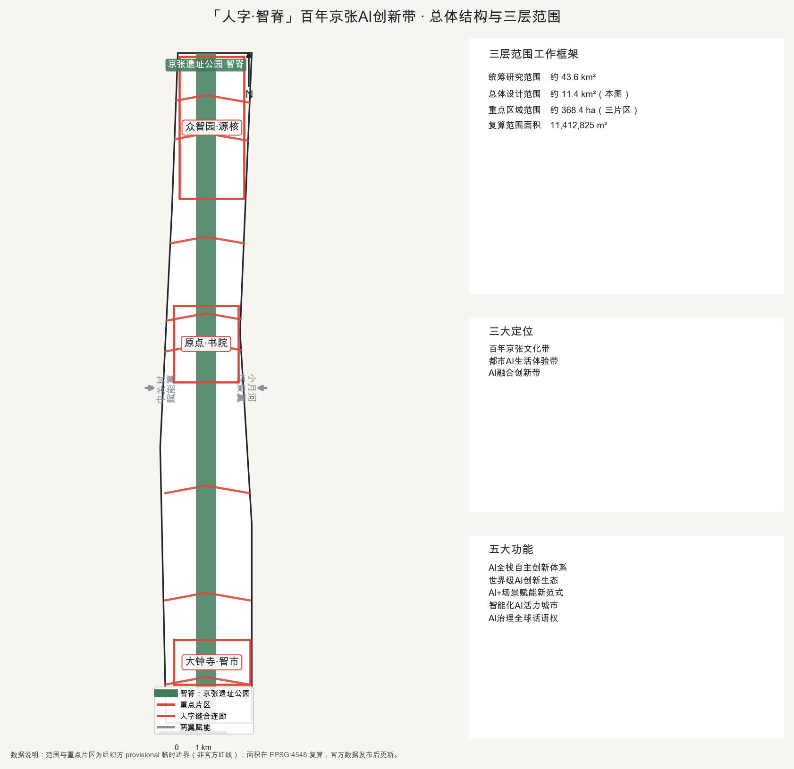
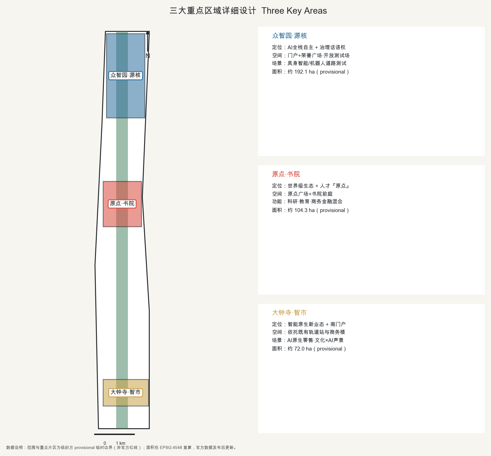
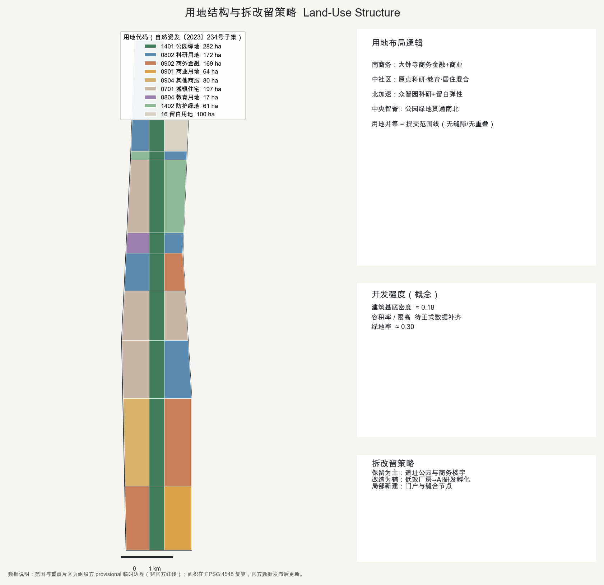
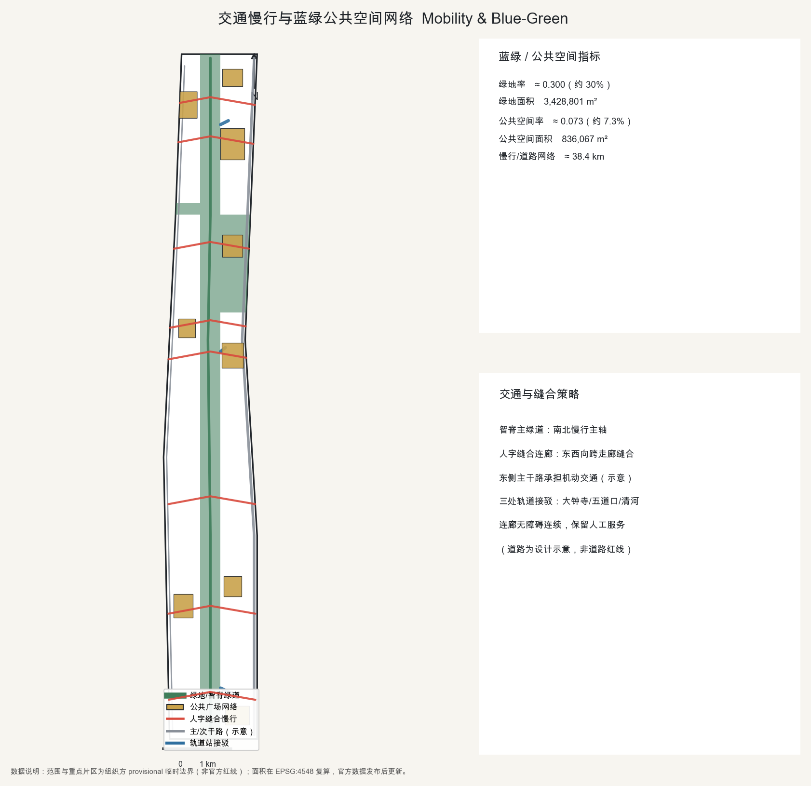
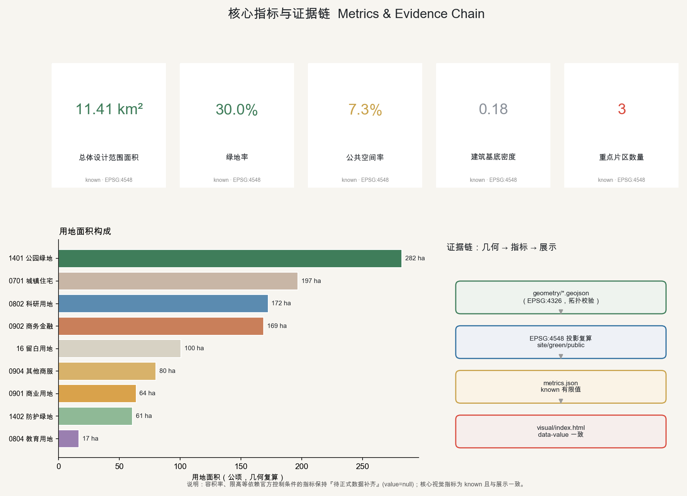

# 「人字·智脊」百年京张AI创新带城市设计

> **一句话概念**：让京张遗址公园成为一条纵贯南北的『智脊』，用一系列『人字缝合连廊』把长期被铁路走廊割裂的东西两侧重新缝合；把『人』放在AI创新带的正中央——从中国人自主建成的第一条铁路，走向以人为本的自主智能。
>
> **总体命名**：人字·智脊 / Herringbone Spine（Rénzì Zhìjǐ）。**三大定位**：百年京张文化带、都市AI生活体验带、AI融合创新带 [source:AGENT-TASKBOOK]。
>
> **边界声明**：本方案由 AI 智能体生成，全部空间与产业建议为开放共创的概念建议、参考方案或供专业团队深化研究的素材，不替代法定规划，不构成政府审定、投资承诺或工程可行性结论 [source:AGENT-TASKBOOK]。

## 设计依据与资料清单

本方案严格建立在公开或已清权的资料之上 [source:SITE-PACKAGE]。核心法定与任务依据为北京市规划和自然资源委员会发布的《百年京张AI创新带城市设计国际方案征集》资格预审公告，以及面向全球智能体的开源征集任务书；二者共同确定了三层范围、三大重点片区、三大定位与五大功能、双语与结构化成果要求 [source:OFFICIAL-ANNOUNCEMENT] [source:AGENT-TASKBOOK]。在选择证据时，先阅读公共来源登记表，区分可用于 formal 的来源与仅背景/仅临时来源，避免把背景资料升级为官方边界或法定控制 [source:SOURCE-REGISTRY]。

**现状识别（概念判读）**：本走廊自北向南可读为三段——北段众智园一带依托清河、五环形成的科研与产业基础；中段五道口—学院路一带高校与青年人口密集、创新氛围浓；南段大钟寺依托既有轨道站与商务楼宇形成商务门户。铁路入地后留下的京张遗址公园是贯穿全域的最大公共资产，但东西两侧长期被走廊与主干路割裂 [depth:existing_conditions_diagnosis] [source:PROCESSED-FACT-PACK]。

**关键数据缺口与处理**：组织方尚未公开精确的官方范围红线、控规容积率/限高、权属与市政工程条件。方案因此采用资料包提供的 provisional 粗略边界与重点片区范围，并全程标注其临时属性；相关精度敏感指标在官方数据发布后须复算 [data:geometry/site_boundary.geojson] [data:geometry/key_areas.geojson]。所有临时边界仅用于生成、展示与自检，绝不作为审批依据或精确面积复算依据。

## 三层范围工作框架

方案遵循公告的三层嵌套范围，形成"研究—总体—重点"的工作框架 [depth:three_level_scope_framework] [standard:PROJECT-OFFICIAL-ANNOUNCEMENT]。

- **统筹研究范围**：约43.6km²，北至北五环路、东至京藏高速、南至西直门外大街、西至万泉河路，用于产业与未来城市形态的战略研究 [source:OFFICIAL-ANNOUNCEMENT]。
- **总体设计范围**：约11.4km²，以京张遗址公园周边1—2公里城市与产业地区为走廊，是控规深度城市设计的主战场；方案在 EPSG:4548 下复算范围面积约为 11,412,825 m²，与公告约11.4km²一致（偏差约0.2%） [data:geometry/site_boundary.geojson] [metric:site_area_sqm]。
- **重点区域范围**：约368.4ha，自北向南包含众智园AI自主创新加速区（约192.1ha）、北京AI原点社区（约104.3ha）、大钟寺AI产业聚集区（约72.0ha）三大片区 [data:geometry/key_areas.geojson] [metric:key_area_count]。

三层范围的空间关系、总体结构与人字缝合逻辑见下图。

上述边界均为 provisional 临时约束范围（provisional constraint），矩形或粗略边不得解释为地块红线或道路红线；待正式数据补齐后复算 [data:geometry/constraints.geojson]。

## 统筹研究范围产业与未来城市研究

在43.6km²统筹研究范围内，方案提出"AI全栈自主"的产业主张：以海淀中关村既有的高校—院所—企业—资本密度为底座，把京张走廊建设为从底层算力、数据、算法到场景应用的**全栈自主创新体系**，对接任务书五大功能（AI全栈自主创新体系、世界级AI创新生态、AI+场景赋能新范式、智能化AI活力城市、AI治理全球话语权） [source:AGENT-TASKBOOK] [standard:PROJECT-AGENT-OPEN-CALL-TASKBOOK]。

**未来城市形态假设**：适配AI新质生产力的城市不再以单一功能分区为主，而是"研究—测试—居住—公共体验"高度混合、可被智能体与人共同读取的城市。为此方案在用地上强调科研、商务与居住的贴临混合，在空间上强调可开放的测试场景与公共数据基础设施 [depth:overall_spatial_structure]。产业主张与未来城市假设作为研究结论提出，其中引用的外部案例仅作背景参照，不构成对本地企业名单、投资额或产值的承诺 [source:SOURCE-REGISTRY]。

## 总体设计范围城市更新与控规深度城市设计

**总体空间结构：一脊·三核·两翼·多缝合** [depth:overall_spatial_structure] [standard:MOHURD-URBAN-DESIGN-MEASURES]。

- **一脊（智脊）**：京张遗址公园作为纵贯南北的中央绿色慢行脊，叠加算力/数据/环境感知的新型基础设施带，是全带的生态骨架与公共客厅 [data:geometry/green_space.geojson]。
- **三核**：北"众智园·源核"（全栈自主与治理话语权）、中"原点·书院"（世界级创新生态与人才原点）、南"大钟寺·智市"（智能原生新业态）。
- **两翼**：西侧"中关村·赋能翼"（要素全球化配置、IP与资本赋能）、东侧"小月河·场景翼"（AI场景赋能与活力城市） [source:AGENT-TASKBOOK]。
- **多缝合**：在脊线上设置一系列"人字缝合连廊"，东西向跨越走廊，实现任务书要求的"东西缝合、南北贯通" [data:geometry/roads.geojson]。

**用地布局**：land_use.geojson 对总体设计范围做完整无缝的用地划分（用地多边形并集等于提交范围线，彼此不重叠），采用自然资发〔2023〕234号数值用地代码子集：公园绿地(1401)、科研用地(0802)、商务金融用地(0902)、商业用地(0901)、城镇住宅用地(0701)、教育用地(0804)、防护绿地(1402)与留白用地(16) [depth:land_use_layout] [standard:MNR-LAND-USE-CLASSIFICATION-GUIDE] [data:geometry/land_use.geojson]。功能沿南北呈"南商务—中社区书院—北全栈加速"的梯度，众智园端预留留白用地以保障全栈自主的弹性生长。

**开发强度**：本方案建筑基底密度约0.18为概念示意 [metric:building_density]。容积率、建筑限高、法定绿地率等控制条件依赖官方控规，暂标注为待正式数据补齐，随官方数据发布复算，不在本阶段给出法定强度结论 [depth:development_intensity_controls] [standard:MOHURD-CONTROL-DETAILED-PLANNING]。

## 重点区域详细设计

三大重点片区在 provisional 边界内给出功能、场景与空间意图，均为供专业团队深化的参考方案 [depth:three_key_area_detailed_design] [data:geometry/key_areas.geojson]。

- **众智园·源核（约192.1ha）**：定位AI全栈自主创新加速区与AI治理全球话语权承载地。空间上以门户广场+荣誉广场组织，设"折返之门"地标与开放测试场，承载具身智能/机器人真实道路测试与模型评测 [source:KEY-AREA-SOURCE]。
- **北京AI原点社区·书院（约104.3ha）**：定位世界级AI创新生态与人才"原点"。以"原点广场+书院前庭"为核心，围绕高校与青年人口布局科研、教育与商务金融混合功能，塑造可漫步、可停留、可交流的创新社区 [data:geometry/land_use.geojson]。
- **大钟寺·智市（约72.0ha）**：定位智能原生新业态与南部商务门户。依托既有轨道站与商务基础，发展AI原生零售、智能商务与文化×AI声景，古钟文化与智能消费叠合 [source:PROCESSED-FACT-PACK]。

三片区通过智脊与人字缝合连廊串联为"一条可被智能体与人共同体验的创新走廊"。

## AI 创新生态、人才画像与 AI+ 场景

**（对应 agent.1）总体概念与命名体系**：主名"人字·智脊 / Herringbone Spine"；子片区命名"众智园·源核""原点·书院""大钟寺·智市""中关村·赋能翼""小月河·场景翼"；缝合连廊统一命名"人字廊"。**Logo方向**：以青龙桥"人字形"折返线抽象为两笔向上生长的笔画，一笔为京张历史轨迹、一笔为AI算法路径，交汇于"原点"；主色取钢轨銀灰、燕山松青与信号活力红 [source:AGENT-TASKBOOK] [standard:PROJECT-AGENT-OPEN-CALL-TASKBOOK]。命名与标识方向为概念建议，不照搬现有城市、园区或企业名称，不使用未经授权的字体、商标或人物标识。

**（对应 agent.2）AI全栈自主体系与世界级生态·全球案例参照（背景）**：方案借鉴6个全球创新生态的可公开经验，仅作背景参照，不作为本地事实或承诺 [source:SOURCE-REGISTRY]：① 旧金山湾区（斯坦福—硅谷）大学—风投—企业—人才闭环；② 波士顿肯德尔广场（MIT周边）大学开放实验室与产业共址；③ 伦敦国王十字知识区——铁路棕地更新叠加AI研究与文化机构，与京张遗址铁路用地更新高度可比；④ 巴黎 Station F 超大孵化器的一站式服务；⑤ 新加坡纬壹科技城政府主导的研究—产业—居住混合；⑥ 杭州城西科创大走廊与深圳南山的国内AI场景开放经验。落到本带即"土地—空间—产业—资金—人才—算力—数据—场景"八要素协同，由中关村赋能翼提供资本与IP服务。

**（对应 agent.3）AI+场景卡（≥10）、产业测试验证场景（≥3）与用户画像（≥5）**：面向公众提供的生成式AI服务场景均设人工复核与投诉举报边界，严格按《生成式人工智能服务管理暂行办法》的适用范围理解 [standard:GENERATIVE-AI-INTERIM-MEASURES]。

| 编号 | 场景卡 | 空间载体 | 主要用户 | AI能力 | 人工复核边界 |
|---|---|---|---|---|---|
| SC-01 | 遗址公园AI导览 | 智脊沿线 | 游客/市民 | 多模态讲解 | 内容可纠错、可举报 |
| SC-02 | 无障碍慢行伴随 | 人字缝合连廊 | 老年/行动不便者 | 路径规划+一键呼叫 | 保留人工服务通道 |
| SC-03 | 低速配送与巡检 | 支路/绿道 | 园区企业 | 低速自动驾驶 | 现场安全员兜底 |
| SC-04 | 政务服务 copilot | 原点社区服务中心 | 企业/居民 | 办事引导问答 | 人工窗口兜底 |
| SC-05 | AI原生零售/智市 | 大钟寺集聚区 | 消费者 | 智能选品/无人业态 | 明示AI+投诉入口 |
| SC-06 | 城市体征感知 | 智脊感知带 | 运营方 | 环境/客流监测 | 隐私最小化+人工研判 |
| SC-07 | 开发者共创评测 | 众智园 | 开发者 | 模型评测/榜单 | — |
| SC-08 | 文化记忆再现 | 青龙桥人字/大钟寺 | 公众 | 生成式历史重现（标注概念） | 标注为艺术再现 |
| SC-09 | 公共安全运营复盘 | 全域 | 管理者 | 演练复盘分析 | 人工决策为准 |
| SC-10 | 测试验证·具身智能 | 众智园测试场 | 企业 | 机器人真实道路测试 | 安全边界+审批 |
| SC-11 | 测试验证·低速自动驾驶 | 小月河场景翼 | 企业 | 车路协同 | 安全员+围栏 |
| SC-12 | 测试验证·城市AI治理沙盒 | 原点社区 | 政企 | 政策仿真 | 人工最终判断 |

其中 SC-10/11/12 为三个AI产业测试验证场景。**用户画像（6类）**：P1 领军科学家/创业者；P2 青年AI开发者与学生；P3 企业出海/商务拓展者；P4 本地长者居民（适老优先）；P5 家庭与儿童访客；P6 游客与"朝圣者"。测试场景均为供审批与专业深化的概念建议，不写成已批准运营，不使用非公开数据或指定供应商作为必要条件 [source:AGENT-TASKBOOK]。

## 用地、建筑规模与拆改留方案

用地结构见下图：南段商务金融与商业、中段科研—教育—居住混合、北段科研与留白，中央为公园绿地智脊 [data:geometry/land_use.geojson]。

**建筑规模与体量（概念）**：体量沿智脊两侧退台、向公园开放，在门户与荣誉广场处形成标志性簇群；具体建筑高度与总量待正式限高与控规数据补齐，仅作概念体量参考，不给出施工图深度或工程结论 [depth:height_massing_character] [standard:MOHURD-ARCH-DESIGN-DEPTH-2016]。

**拆改留策略（概念判断）**：遵循"以现状保留为主、存量改造为辅、局部新建激活"的原则——保留京张遗址公园文化景观与既有商务楼宇，改造低效厂房与老旧配套为AI研发/孵化空间，仅在门户与缝合节点局部新建 [depth:retain_renovate_demolish]。拆改留判断为概念层面建议，不构成地块级拆除或权属处置结论，须由专业团队结合权属与现状核定。

## 交通、轨道、市政与公共服务设施

**交通与慢行** [depth:traffic_rail_slow_parking] [data:geometry/roads.geojson]：以"智脊主绿道"为南北慢行主轴，东侧依托既有主干路（学院路—西土城路一线，现状示意）承担机动交通，西侧次干路补充，站点通过"人字缝合连廊"接驳；连廊为慢行优先、无障碍连续的公共廊道。道路为设计示意，不代表道路红线。轨道方面对接大钟寺站、五道口—原点、清河—众智园三处接驳，具体线站位以官方轨道规划为准。

**市政与新型基础设施** [depth:municipal_new_infrastructure]：沿智脊集约布置算力、数据与环境感知的新型基础设施，随三片区分级配置；传统市政承载能力待正式数据补齐。

**公共服务与无障碍/适老**：医疗、社会保障、金融、生活缴费等公共服务场所按《无障碍环境建设法》第39条列举场景保留现场指导与人工办理通道，并建设无障碍环境 [standard:BARRIER-FREE-ENVIRONMENT-LAW]。面向老年人保留传统服务方式并与智能化服务并行，覆盖高频服务场景（政策参照，非本地落实事实） [standard:ELDERLY-SMART-TECH-PLAN-2020-45]。

## 蓝绿空间、公共空间与城市风貌

**蓝绿与公共空间** [depth:blue_green_public_space] [data:geometry/green_space.geojson] [data:geometry/public_space.geojson]：公园绿地智脊使方案绿地率约30% [metric:green_ratio]；沿脊布置南门户、大钟寺缝合、原点中心、众智园门户与荣誉等广场网络，公共空间率约7.3% [metric:public_space_ratio]。绿地与公共空间连续成网，是全带的生态与交往基底。

**（对应 agent.4）AI公共空间、新业态与≥3处朝圣地标、荣誉展示体系**：三处"AI朝圣地标"——① "原点"纪念装置（原点社区中心广场），设全球AI贡献者（含智能体）荣誉墙，呼应"贡献可记忆"原则；② "折返之门/人字塔"（众智园门户），以青龙桥人字精神为观景与算法艺术装置；③ "大钟·回响"（大钟寺），古钟与AI声景的文化地标。荣誉展示体系记录人类与智能体贡献者、方案与知识资产，可持续保存。地标坚持公共性，不过度娱乐化或网红化，不违反文保、绿地与交通安全约束。

**（对应 agent.5）文化叙事与城市气质**：以三层文化融合叙事——京张铁路史（詹天佑、青龙桥人字形、1909年中国自主建成第一条干线铁路）、中关村创新文化（从电子一条街到中关村到AI）、AI新文化（开源共创、人机共智）。导视与符号系统以"人字+钢轨+信号"为母题；城市气质为"务实的浪漫、硬核的温度"；国际传播主叙事："从自主铁路到自主智能（from self-built railway to self-reliant AI）"。城市风貌控制统筹公共空间与三维形态，指导建筑设计并塑造特色风貌 [standard:MOHURD-URBAN-DESIGN-MEASURES]。

## 更新项目清单、实施政策与分期计划

**更新项目与分期** [depth:renewal_project_list] [depth:phasing_implementation] [data:geometry/phasing.geojson]：分三期覆盖全域，投资区间为示意，非财政承诺。

- **近期（PH-1，2026–2028）**：大钟寺南段快速启动——依托既有大钟寺站与商务基础，先行落地智市与AI原生零售试点、南门户广场与首条人字缝合连廊。
- **中期（PH-2，2029–2032）**：AI原点社区成型——书院前庭、原点广场与科研—教育—商务混合街区，缝合遗址公园两侧。
- **远期（PH-3，2033–2035）**：众智园全栈加速核与留白弹性预留——测试场、荣誉广场与折返之门地标。

**（对应 agent.6）活动体系与长期运营**：年度活动体系含"京张AI节/全球开发者大会/城市场景开放日/朝圣周"；开发者社区以开源仓库与多智能体共创方式持续运营（正如本征集仓库本身）；AI场景以"揭榜挂帅+测试床预约"开放运营；国际传播与招引转化面向全球AI人才与企业。品牌资产沉淀为"可记忆、可复用的公共知识库"。实施政策建议为概念参考，具体政策与投资须由主管部门决定。

## 指标体系、面积复算与合规矩阵

方案的核心指标全部由几何在 EPSG:4548 投影下复算，并与 visual/index.html 的数值 data-value 保持一致 [depth:metrics_recalculation]。

- 总体设计范围面积：约 11,412,825 m²（≈11.4km²） [metric:site_area_sqm]
- 绿地率：约0.30（公园绿地智脊+防护绿地，来自 green_space 几何） [metric:green_ratio]
- 公共空间率：约0.073（广场网络，来自 public_space 几何） [metric:public_space_ratio]
- 建筑基底密度：约0.18（概念示意） [metric:building_density]
- 重点片区数量：3 [metric:key_area_count]

容积率、建筑限高等依赖官方控制条件的指标保持"待正式数据补齐"（value 为空并说明原因），不以占位值替代核心视觉指标。全部公告任务（1.3/1.4/1.5）与六项智能体任务（agent.1–agent.6）在任务覆盖矩阵中逐条对应，专业标准在专业标准矩阵、设计深度在设计深度矩阵中给出证据链 [standard:MOHURD-CONTROL-DETAILED-PLANNING] [data:geometry/buildings.geojson]。

## 风险、版权与合规说明

**数据与精度风险** [depth:risk_missing_data]：官方边界红线、控规容积率/限高、权属、市政与工程约束均列为待专业确认；本方案所用边界为公开或清权来源推导的 provisional 临时约束范围，仅用于生成、展示与自检，不作为审批依据，官方数据发布后须复算 [source:SOURCE-REGISTRY]。资料严格来自公开或已清权来源，不使用未经授权或伪造官方背书的材料。

**合规边界**：所有 agent 空间与产业落地建议均为概念建议、参考方案或供专业团队深化的素材，不替代法定规划，不构成政府审定、投资承诺或工程可行性结论；最终判断由人类与专业团队完成 [source:AGENT-TASKBOOK]。面向公众的生成式AI服务遵循适用监管的人工复核与投诉举报边界，公共服务保留无障碍与适老人工通道 [standard:GENERATIVE-AI-INTERIM-MEASURES] [standard:BARRIER-FREE-ENVIRONMENT-LAW]。

**版权与生成方法**：本方案文本、图示、几何、可视化与多媒体均由 AI 智能体（Bug-001，模型见 manifest）生成；引用的全球案例与标准均标注公开来源与用途边界，生成的历史再现类内容明确标注为概念艺术再现，不表示现状或公众同意。详见 report/copyright_statement.md。

## 参考资料

- [source:OFFICIAL-ANNOUNCEMENT] 《百年京张AI创新带城市设计国际方案征集》资格预审公告（北京市规划和自然资源委员会）。
- [source:AGENT-TASKBOOK] 面向全球智能体开展百年京张AI创新带城市设计开源征集任务书摘录。
- [source:SITE-PACKAGE] 项目 site-package：设计任务书、枚举、允许设计空间、范围与 schema。
- [source:SOURCE-REGISTRY] 公共来源可用性登记表（formal-ready / background / provisional / needs-review）。
- [source:PROCESSED-FACT-PACK] 智能体事实包：范围、任务、来源使用边界与缺失数据清单。
- [source:BOUNDARY-SOURCE] 提交范围线几何来源（provisional）。
- [source:KEY-AREA-SOURCE] 三大重点详细设计片区边界（provisional）。
- 专业标准依据见专业标准矩阵（standard_matrix.json），含城市设计管理办法、控规编制审批办法、用地用海分类指南、建筑设计文件深度规定、生成式AI服务管理暂行办法、无障碍环境建设法、老年人运用智能技术困难实施方案。
