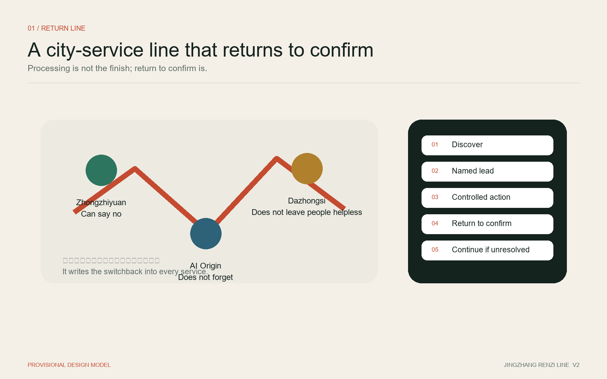
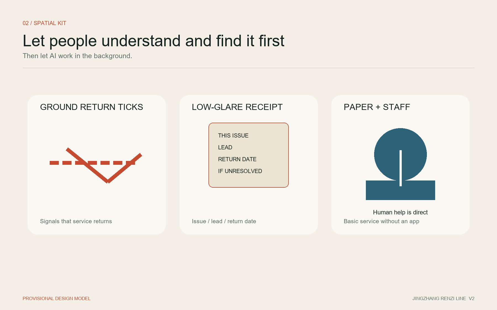
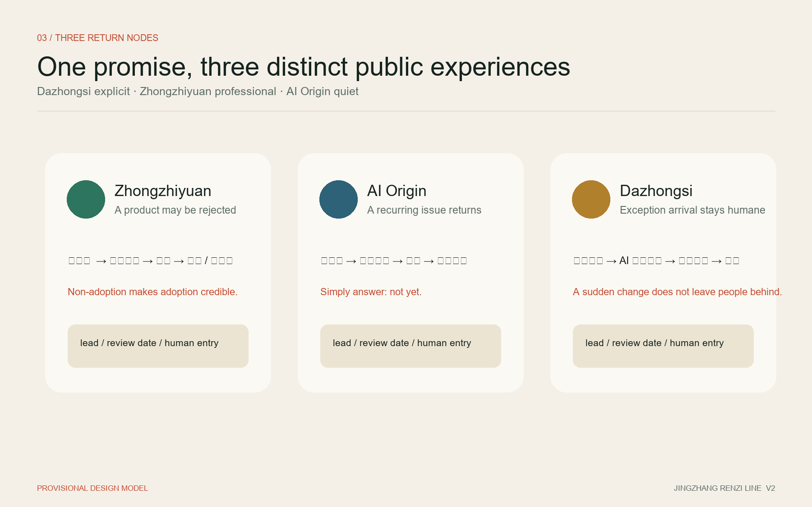
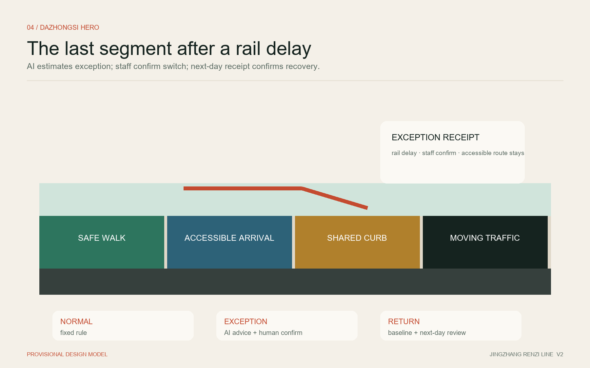
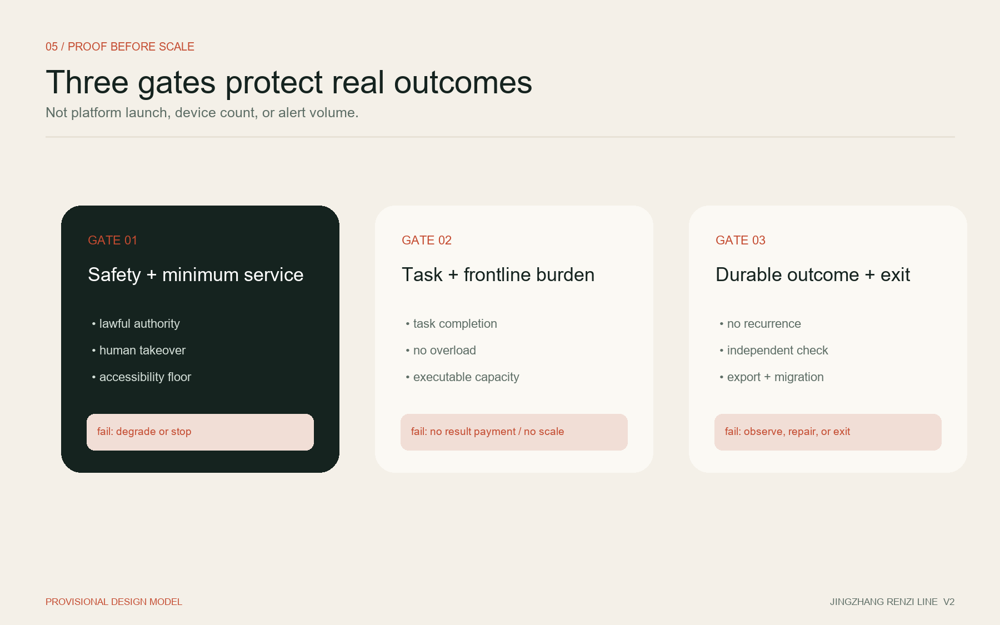

# Jing-Zhang Renzi Line: The Route May Turn; Every Task Must Land

A city should not pay merely for deploying an AI system. It should pay when a real urban task is completed safely, independently evaluated, and shown to produce a durable result.

**V2 constitution: processing is not the finish; returning to confirm is.** The system remembers, a named lead operator returns, and an affected person may reject a “resolved” result without rebuilding the entire complaint. Being alive means it remembers; warmth means it comes back.

“Renzi Line” translates the engineering spirit of the Centennial Jing-Zhang Railway: adapt the route to real terrain and remain accountable for solving the problem. The character 人 also keeps people at the beginning and end of every AI-enabled service. The famous switchback near Qinglongqiao is outside the Haidian design area. This proposal uses it only as a cultural and methodological metaphor; it neither relocates the heritage asset nor forces the masterplan into the shape of 人.

Nor does it use 人 as a map shape. A scheme may draw a switchback on a plan; this proposal writes it into every service: **discover - accept - act - return to confirm - continue if unresolved.**

## Design Basis and Source List

The official open-call announcement and the rights-cleared Agent taskbook are the primary project mandates. The proposal responds to the three positionings, five functions, Three Zones and Two Wings, and six required Agent tasks.[source:OFFICIAL-ANNOUNCEMENT] [source:AGENT-TASKBOOK]

Public materials establish textual limits and approximate areas for the three scope levels, plus the names, north-to-south sequence, and approximate areas of the three key zones. They do not provide verified official polygons, road redlines, parcel ownership, existing buildings, heritage control lines, or municipal conditions. The package therefore uses the registered provisional constraints for generation and discussion, with their status visible in drawings, metrics, and web outputs.[source:BOUNDARY-SOURCE] [source:KEY-AREA-SOURCE]

Evidence is separated into three levels: task facts come from official or rights-cleared materials; the spatial model comes from package GeoJSON and is recalculable but non-statutory; operational performance must come from future field baselines and independent evaluation and is not presented as an existing result. The source registry controls permitted use and limitations.[source:SOURCE-REGISTRY]

## Three-Level Scope Framework

The approximately 43.6 km² Coordinated Research Area addresses the innovation ecosystem, future-city model, and regional coordination. The approximately 11.4 km² Overall Design Area addresses urban renewal, public space, transport, municipal support, and urban character around the Jing-Zhang Railway Heritage Park. The three key areas, approximately 368.4 hectares in total, receive deeper scenario, spatial, and implementation design.[source:OFFICIAL-ANNOUNCEMENT]

| Scope | Core question | Spatial response | Current precision |
|---|---|---|---|
| Coordinated Research Area | What public capacity is missing between technology, adoption, exit, and reuse? | Three complete loops, two supporting wings, and open outcome standards | Strategic study based on official text and approximate area |
| Overall Design Area | How can services become visible, understandable, and contestable on site? | Distributed Urban Service Receipts form a walkable Results Line | Conceptual spatial model pending official geometry and field evidence |
| Key-Area Detailed Design Area | How can failure in one zone avoid disabling the whole system? | Each zone carries a complete loop and a distinct flagship | Provisional key-area polygons, not parcels or road boundaries |

All geometry-derived values are low-confidence design-model outputs. Once official polygons are supplied, the site, key areas, land use, buildings, roads, green space, public space, phasing, figures, and all area metrics must be recalculated as one chain.[data:geometry/site_boundary.geojson#SITE-001] [metric:site_area_sqm]

## Coordinated Research Area: Industry and Future City Research

### One Results Line, three complete loops, and two supporting wings

JINGZHANG WORKS is not a new railway or road alignment. It is a line of urban service results that people can read. Distributed receipts along walking routes, transit arrivals, communities, and innovation campuses answer five plain questions: What problem is being addressed? Who is responsible? How far has it progressed? Was it actually resolved? Who can I contact if I disagree? Receipts publish responsibility and results, never personal identities: the public sees type, responsible organization, state, review date, and recurrence; affected people see their full record; operators access only task-necessary detail under audit.

Each key zone can move independently through real problem, named responsibility, controlled exploration, live operation, independent evaluation, and adoption, repair, or exit. The zones share interfaces, evidence formats, privacy boundaries, and result recognition, but no central platform is required for continued service. The Zhongguancun Technology Services Wing supports contracts, standards, independent evaluation, intellectual property, and migration. The Xiaoyue River Scenario Enablement Wing supports low-impact observation, public dialogue, and reversible prototypes.[standard:PROJECT-AGENT-OPEN-CALL-TASKBOOK]

| Taskbook function | Proposal response |
|---|---|
| Full-Stack Independent AI Innovation System | Evaluate interfaces, logs, human takeover, export, and migration as well as models |
| World-Class AI Innovation Ecosystem | Bring real buyers, scenario owners, frontline staff, product teams, and independent evaluators into one adoption process |
| New Paradigm for AI-Enabled Scenarios | Require named responsibility, executable capacity, and accepted outcomes |
| Intelligent and Vibrant AI City | Use simple rules in normal operation and minimum necessary AI only for exceptions |
| Global Voice in AI Governance | Publish success, recurrence, non-adoption, and shutdown with reproducible evidence |

### Translating six international and cross-regional references

| Reference | Transferable lesson | What is not transferred |
|---|---|---|
| Singapore Open Innovation Platform | Problem owners define needs and evaluate competing solutions [source:SINGAPORE-OIP] | Institutional authority, funding, and contract arrangements |
| EU PCP/PPI innovation procurement | Separate research, piloting, and near-market purchasing stages [source:EU-INNOVATION-PROCUREMENT] | EU procurement procedures as a Chinese legal basis |
| EIC InnoMatch | Bring real buyers into PoC and commercialization early [source:EIC-INNOMATCH] | Treating matchmaking or intent letters as adoption |
| Test in Tallinn | One city entry point, maturity threshold, named service unit [source:TEST-IN-TALLINN] | Any promise that the city pays or purchases |
| NYC Smart Curbs | Time-shared use, legible signs, and before/after comparison [source:NYC-SMART-CURBS] | New York performance percentages, fees, and street conditions |
| Beijing scenario cultivation and access | Demand, capability, and demonstration lists with first-use and cooperative procurement interfaces [source:BEIJING-SCENARIO-OPENING-2026] [source:MOF-COLLABORATIVE-INNOVATION-PROCUREMENT] | Any claim that this proposal already has procurement or funding approval |

The shared lesson is that high-quality problems, accountable operators, controlled tests, independent evidence, and real adoption are scarcer than technology displays. The original contribution of Jing-Zhang Renzi Line is therefore not another “first-order hall,” but a system that binds frontline capacity, two-level closure, simple-rules-first operation, and evidence-based non-adoption into space and contracts.[depth:overall_spatial_structure]

## Overall Design Area: Urban Renewal and Regulatory-Plan-Level Urban Design

The overall structure uses four small, repeatable interfaces. A Problem Entry accepts explanation and correction. An Operating Interface displays the current rule, alternative route, and human takeover. An Evaluation Interface shows the baseline, metrics, and review date. An Urban Service Receipt returns responsibility and outcome to the place where the issue occurs. A central page indexes these facts but does not replace field evidence.

The spatial interface lets people **understand it and find it before AI works in the background.** Each return node has three low-tech elements: a ground “return tick” that traces the service path; a low-glare receipt sign stating “this issue / responsible party / return date / contact if unresolved”; and paper plus staff through an existing property, community, or station service point. It is not a giant screen and does not require an app.

The Results Line first reuses public ground floors, station forecourts, street corners, campus service desks, and walking interfaces. New elements remain reversible, low-glare, and maintainable. Without ownership, building assessment, regulatory planning, and fire-safety data, the proposal does not claim parcel demolition, new construction, FAR, or building-height controls.[standard:MOHURD-CONTROL-DETAILED-PLANNING] [depth:development_intensity_controls]

Renewal follows “operate first, rebuild only with evidence.” Existing human workflows and problem baselines are frozen first. Temporary rules, reversible signs, and staffed service points test whether the issue is real. Only recurring issues crossing a pre-agreed threshold become spatial, rule, resource, or cross-agency renewal projects. Design evidence comes from recurrence and repeated frontline work—not from the volume of AI detections.

Submitted land use, building, green-space, and public-space layers are a recalculable concept model derived from a provisional boundary. They are neither an existing-condition survey nor statutory zoning. Formal development must repeat the analysis once existing buildings, parcels, regulatory controls, and public-service inventories are available.[data:geometry/land_use.geojson#LU-001] [data:geometry/buildings.geojson#BLDG-001]

## Detailed Design of Key Areas

### Zhongzhiyuan: genuine adoption that can say “it did not work”

The flagship is not a roadshow. It produces a reviewable decision about whether an AI product helps a real organization complete a real task. A Problem Desk defines the owner, capacity, baseline, and stop conditions. A Shadow Test Belt allows suggestions without changing field decisions. An independent room compares safety, task result, workload, and cost. A Results Showcase publishes adoption, non-adoption, repair, and shutdown.[data:geometry/key_areas.geojson#PROV-KEY-001]

If a product or platform fails, the field service returns to human or fixed-rule operation. On termination, the service exports, retains, or deletes data according to the agreement. Proprietary interfaces cannot obstruct exit. A garden-like innovation district is expressed through calm, observable, and discussable ground-floor and walking interfaces, not unsupported construction quantities. The “Renzi Test Bench” is not a product display: it is a public receipt for a real buyer showing whether the task was solved, who reviewed it, and when it will exit or return for review. Visible non-adoption is what makes adoption credible.

### Beijing AI Origin Community: street closure that does not forget

Potential illegal parking, loading conflict, bicycle accumulation, noise, or school-gate congestion enters a candidate pool; an AI detection does not become a work order automatically. A named team must confirm people, authority, and an executable path before a formal task exists. Most capacity is pulled by capable teams, while a protected public-interest allocation and a separate safety-emergency channel prevent difficult issues from being ignored.[data:geometry/key_areas.geojson#PROV-KEY-002]

A lawful intervention creates Response Closure. Only an observation period without sustained recurrence creates Result Closure. Recurrence does not reopen the same frontline order indefinitely; it escalates into a spatial, rule, resource, or cross-agency structural task. This recognizes frontline work without misrepresenting repeated interventions as new urban outcomes. The “Problem Has Landed Point” is low-key within an existing service point: a resident can see the review date and answer simply, “not yet,” returning the original issue to the responsible party without submitting it again.

### Dazhongsi: exception arrival at a shared curb that does not leave people helpless

A shared curb is not an AI parking bay. It coordinates passenger pickup, taxi and ride-hailing, loading, short stays, and accessible arrival through transparent time and use rules. Normal operation uses fixed schedules, legible signage, and human dispatch. AI supplies forecasts and diversion suggestions only when rail delays, events, weather, or demand depart materially from the rule base.[data:geometry/key_areas.geojson#PROV-KEY-003]

The hero scene is the last segment after a rail delay: fixed rules still operate; AI only estimates the exception and available fallback places; a named dispatcher confirms the switch; visible curb state, staff, and paper guidance support non-app and accessible users; when the exception ends, the service returns to baseline and the next-day receipt confirms whether recovery truly happened. This is the most visible node because a person should immediately feel that a sudden change will not leave them behind.

Five states are defined: normal, minor variance, exception service, safety/accessibility priority, and degrade/stop. A user without an app must still understand the current purpose, time limit, fallback place, and human contact. Phase one is confined to an internal curb with clear authority. Only after independent evaluation may a limited public-node trial be submitted for formal road and traffic authorization.[source:BEIJING-PARKING-REGULATION]

## AI Innovation Ecosystem, Personas, and AI+ Scenarios

### Five core personas

| Persona | Real objective | Primary fear | Non-negotiable design condition |
|---|---|---|---|
| Commuter/arrival user | Complete the last segment safely and predictably | Unexplained change or forced app download | Field rules, alternative path, and human contact |
| Disabled or mobility-constrained user | Arrive independently without unnecessary disclosure | Accessibility being averaged away by efficiency | A separately accepted minimum service floor |
| Frontline worker | Complete work within actual authority and capacity | An unmanageable list of AI-generated tasks | Capacity-pull tasks and separate response/result accounting |
| Scenario owner/public buyer | Obtain an outcome that survives audit and public questions | Purchasing a display platform evaluated by its own vendor | Baseline, independent acceptance, staged payment, lead operator |
| Product/service team | Win adoption through real performance | Endless demonstration or platform lock-in | Transparent entry, shadow comparison, open interfaces, exit |

### Eleven scenario cards

| ID | Scenario | Primary zone | Minimum necessary AI role | Acceptance focus |
|---|---|---|---|---|
| SC-01 | Shared curb | Dazhongsi | Exception demand and diversion advice | arrival, conflict, workload, accessibility, recovery |
| SC-02 | Accessible last-segment arrival | Dazhongsi / all zones | exception resources and alternatives | minimum service and independent arrival |
| SC-03 | Rail-delay temporary diversion | Dazhongsi | prediction and ordering; human approves change | communication, comprehension, conflict, recovery |
| SC-04 | Street-issue candidate pool | AI Origin | detection and classification; no automatic task | validity, correction, added workload |
| SC-05 | Capacity-limited task board | AI Origin | capacity and public-impact matching | named owner, backlog, difficult-issue coverage |
| SC-06 | Response/result closure | AI Origin | observation support; no automatic adjudication | response, recurrence, structural escalation |
| SC-07 | Structural-upgrade workshop | AI Origin / Xiaoyue wing | evidence synthesis and prototype comparison | recurrence and repeated labor |
| SC-08 | Product shadow mode | Zhongzhiyuan | advice without field effect | safety, task, workload, cost baseline |
| SC-09 | Outcome contract | Zhongzhiyuan / service wing | evidence organization, not purchasing decision | paid adoption, non-adoption, export, migration |
| SC-10 | Urban Service Receipt | all zones | synchronize verified status | consistency, comprehension, correction |
| SC-11 | Annual public validation week | three zones and two wings | publish reproducible outcomes | adoption and correction, not attendance |

The three priority validation fields are a controlled shared curb, two-level street-issue closure, and product shadow adoption. They share evidence formats but may stop or degrade independently. Every scenario must pass six entry conditions: a real problem, named lead, executable capacity, human baseline, success definition, and stop condition.[standard:PROJECT-AGENT-OPEN-CALL-TASKBOOK] [metric:primary_task_completion_ratio]

## Land Use, Building Scale, and Retain-Renovate-Demolish Strategy

Available data cannot support parcel-level demolition, building scale, FAR, height, or coverage conclusions. The submitted building footprint is a concept-model element for package consistency, not an existing-building survey. Once footprints, use, age, structural condition, ownership, and regulatory controls are obtained, buildings will be reclassified as retain, low-impact renovation, pending professional assessment, or lawful renewal.[depth:retain_renovate_demolish]

The first spatial carriers avoid major construction: existing public ground floors, campus/community desks, station arrival spaces, street corners, and internal curbs under clear authority. Reversible signs, low-power displays, staffed service points, and movable observation tools precede fixed works. A structural intervention is studied only when operational evidence shows that spatial configuration drives sustained recurrence.

`floor_area_ratio` remains pending official data. Green and public-space ratios represent only a provisional geometric design model, not existing conditions, statutory indicators, or government commitments.[metric:floor_area_ratio] [metric:green_ratio] [metric:public_space_ratio]

## Transport, Rail, Municipal Infrastructure, and Public Services

Transport begins with completing a real arrival. Routes between transit exits and destinations must be continuous, legible, accessible, and supported by human help. Curb use must be transparent by purpose and time. Exceptions require pre-agreed fallback areas and human takeover. Engineering proposals for Dazhongsi’s four quadrants, Wudaokou, or Qinghuadongluxikou require verified exits, passenger flows, road sections, fire safety, and municipal information.[depth:traffic_rail_slow_parking]

The functional relationship is Safe Walking — Accessible Arrival — Time-Shared Curb — Moving Traffic. No unverified width is claimed. Data collection first uses manual counts and anonymous arrival, purpose, and conflict observations. Facial recognition, identity profiling, and personal trajectories are not default requirements.

Infrastructure is layered by service need. Field rules, signs, and human entry remain operational. Edge systems process only necessary arrival, overstay, and release states. The public backend retains only information required for completion, evaluation, and migration. A network or model failure returns the service to fixed rules rather than disabling it.[depth:municipal_new_infrastructure]

## Blue-Green Network, Public Space, and Urban Character

The Results Line conceptually follows the Jing-Zhang Railway Heritage Park and adjacent public interfaces. Until park implementation, heritage, green-space, and blue-line boundaries are verified, it defines node types and a walking-reading experience rather than occupying specific land. Provisional boundaries remain faint and dashed; tasks, responsibilities, node networks, and implementation logic carry visual priority.[standard:MOHURD-URBAN-DESIGN-MEASURES]

Three AI pilgrimage landmarks are public promises rather than monuments to technology. The Renzi Test Bench at Zhongzhiyuan explains why a product was adopted or rejected. The Problem Has Landed Point at AI Origin publishes responsibility, response, observation, and escalation. The Arrival Has a Route Point at Dazhongsi uses the independent and safe arrival of a mobility-constrained person as the test of value. Their visibility is deliberately different: Dazhongsi is most explicit, Zhongzhiyuan is professionally visible, and AI Origin is quiet within daily life.

Visual identity draws on railway calibration marks, the double stroke of a switchback, and the relationship of 人. It uses legible, low-glare, maintainable information design:

> JINGZHANG WORKS
> The route may turn; every task must land.

Field language stays plain: “How far has this task progressed?” “This task has been completed.” “The problem has recurred and is being handled again.” “This AI did not work and has been stopped.” The cultural narrative explicitly locates the Qinglongqiao switchback outside the Haidian site.

## Renewal Projects, Implementation Policy, and Phasing

| Project | First move | Condition to scale | If not achieved |
|---|---|---|---|
| P-01 Controlled shared curb | internal site, fixed rules, staff, shadow AI | independent safety, task, workload, complaint and accessibility review | return to rules, repair, or stop |
| P-02 Two-level street closure | select one verified recurring issue and freeze capacity/observation | every formal task has an owner and recurrence is escalated honestly | pause new signals and repair capacity first |
| P-03 Product shadow adoption | one buyer, one scenario, one product | independently verified paid adoption or evidenced non-adoption | export data and restore human/rule service |
| P-04 Distributed receipts | one low-technology prototype per flagship | timely, consistent, understandable, correctable information | paper/human fallback and withdraw false status |
| P-05 Three public landmarks | reuse existing space and reversible display | site, heritage, green, fire, and operating review | do not construct a fixed object |
| P-06 Annual validation week | show qualified successes and failures | everyday service remains undisturbed and evidence is reproducible | reduce or cancel the event |

The public buyer conceptually funds the base service and result payment. The scenario owner contributes place, people, process, baseline data, and acceptance collaboration. Commercial users pay only for premium reservation or incremental services. Because the cost of disorder cannot be reliably priced, the scenario owner is not assumed to have automatic cash purchasing intent; its first obligation is to provide real operating conditions. Before activation, every scenario names one lead operator; collaboration cannot dissolve responsibility for returning to confirm.

Phasing follows evidence gates: baseline and fixed rules, shadow mode, human-approved limited operation, independent acceptance, result observation, and conditional scale. “Approximately 100 days” is a conceptual first validation cycle, not an official construction schedule. The annual public event is “What did Jing-Zhang actually accomplish this year?” and reports success, recurrence, non-adoption, and shutdown.[data:geometry/phasing.geojson#PHASE-001] [depth:phasing_implementation]

## Metrics, Area Recalculation, and Compliance Matrix

Acceptance has three gates. Gate One covers safety, legality, human takeover, and minimum service; failure triggers degradation or shutdown. Gate Two covers the primary task and frontline burden; failure withholds result payment and scaling. Gate Three covers durable outcomes, independent replication, export, and migration; failure triggers further observation, structural escalation, or exit.

Core operational metrics are not deployment, device count, model calls, alerts, work orders, or model accuracy. They are primary-task completion, response closure, result closure, frontline workload, complaint-rate ratio, human fallback success, accessible-service completion, public rule comprehension, independent evidence coverage, and data-export verification.[depth:metrics_recalculation]

Only package geometry areas and ratios are currently recalculable. Field performance awaits baseline collection and is not shown with fabricated values. Core spatial metrics remain synchronized with site, green-space, and public-space geometry and must be recalculated when official boundaries arrive.[metric:site_area_sqm] [metric:green_ratio] [metric:public_space_ratio]

Before shadow mode, every test creates a jointly frozen baseline record: problem, space, human workflow, capacity, exception classes, service floor, data fields, observation periods, metrics, stop conditions, and dispute handling. A vendor cannot select its own favorable baseline or self-certify with self-produced evidence.

## Risk, Copyright, and Compliance

Primary risks are task flooding, attractive metrics without real change, high-impact AI error, new curb conflict, accessibility hidden by averages, commercialization of public curb rights, vendor lock-in, conflicted evaluation, receipt-as-propaganda, excessive personal data, common-mode failure across zones, provisional geometry presented as official, incorrect cultural geography, similarity to “first-order” proposals, and unsustainable operating cost.[depth:risk_missing_data]

- Personal-information processing is purpose-limited, necessary, role-controlled, audited, and time-limited. High-impact outputs retain explanation, objection, and human-decision paths.[source:PIPL]
- Public services retain field, telephone, or staffed access. Basic service is not denied for lack of an app or refusal of additional data processing.
- Any public-road curb use, timing, device, or trial requires authorization from the competent authority. Controlled-space evidence does not grant public-road permission.
- One lead operator is named in advance. Multiple suppliers do not dilute final responsibility. The evaluator cannot be the product’s principal seller or implementer.
- Public interfaces and migration standards remain open. A commercial first-phase platform must still support complete export, standard interfaces, and future migration.
- Generated figures, diagrams, PDFs, HTML, and brand assets document tool, source, license, and limits. Conceptual media is not represented as a site photograph or public opinion. This is not an autonomous-vehicle demonstration zone and does not authorise automated driving.[source:BEIJING-AUTONOMOUS-VEHICLE-REGULATION]

Official boundaries, road redlines, existing transport, buildings and ownership, regulatory controls, municipal systems, and heritage constraints remain missing. A provisional model does not convert these gaps into official facts. Every spatial move is a conceptual recommendation for professional development; it is not government approval, a procurement promise, a construction permit, or guaranteed implementation.[source:SITE-PACKAGE]

## References

1. Haidian Branch of the Beijing Municipal Commission of Planning and Natural Resources, open-call announcement for the Centennial Jing-Zhang AI Innovation Belt.[source:OFFICIAL-ANNOUNCEMENT]
2. Rights-cleared Agent taskbook for the Centennial Jing-Zhang AI Innovation Belt Open Call.[source:AGENT-TASKBOOK]
3. Project Source Registry and processed fact pack, distinguishing formal evidence, background material, provisional data, and gaps.[source:SOURCE-REGISTRY] [source:PROCESSED-FACT-PACK]
4. Beijing public materials on scenario cultivation, access, and cooperative innovation procurement; structured records are maintained in the package source list.
5. Singapore IMDA Open Innovation Platform, European Commission Innovation Procurement, EIC InnoMatch, Test in Tallinn, and NYC Smart Curbs, used only for mechanism comparison.
6. Registered professional references on urban design, regulatory planning, accessibility, AI service, and land-use classification; applicability is recorded in the professional standards matrix.
