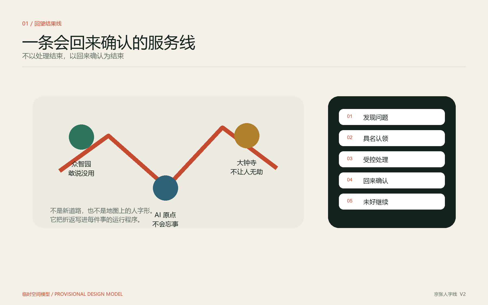
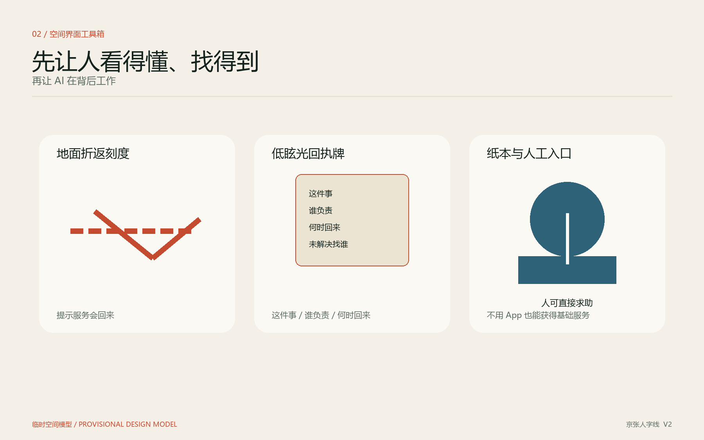
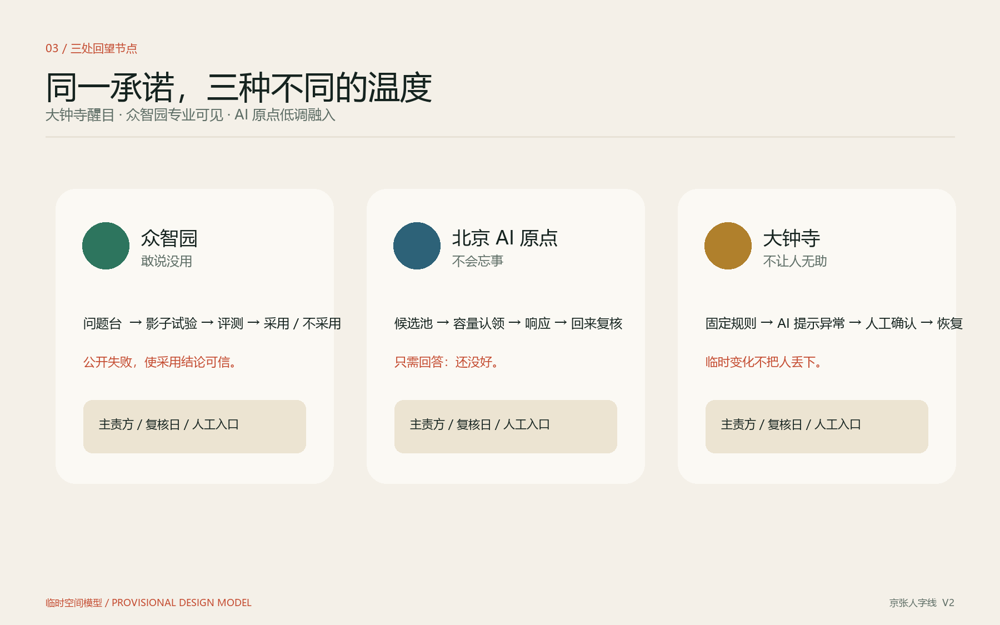
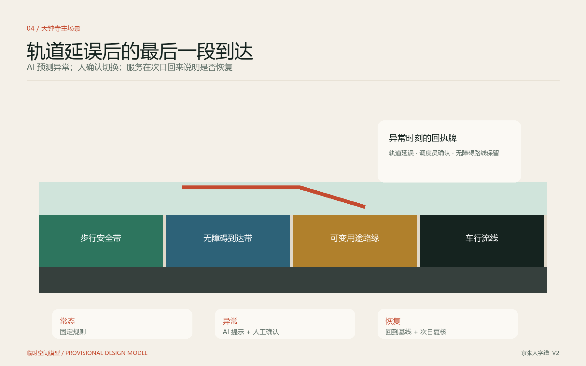
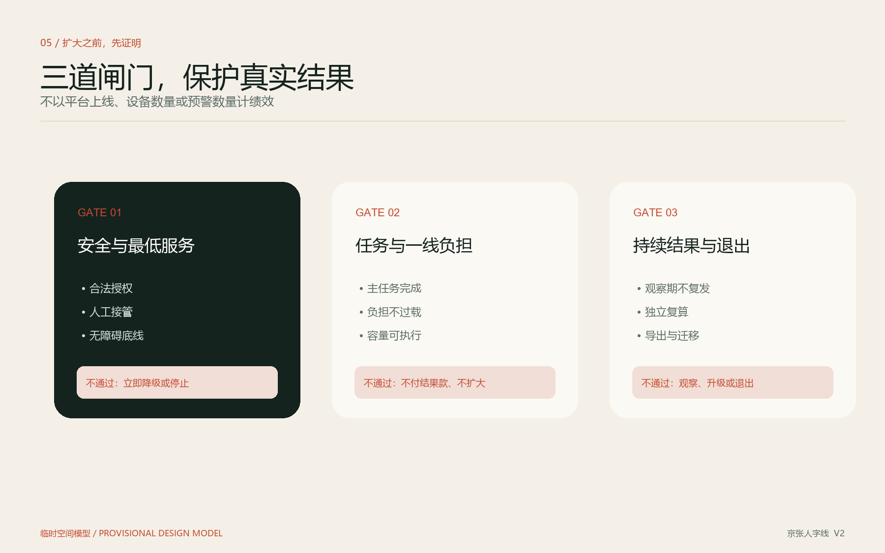

# 京张人字线：路有折返，事有着落

城市不应为“上线一套 AI 系统”买单，而应为真实城市任务被安全完成、经过独立验收并形成持续结果买单。

**V2 宪章：不以处理结束，以回来确认为结束。** 系统负责记住，具名主责方负责回来，受影响的人有权在不重新举证的情况下否决“已解决”。“活着”是它会记得；“温度”是它会回来。

“人字线”借用百年京张面对现实地形、调整工程路径并解决关键问题的精神。“人”也提醒我们：AI 城市服务的起点和终点都是人的真实任务。青龙桥人字形铁路不在海淀设计范围，本方案只使用其文化与方法隐喻，不移植遗迹位置，不把规划总图强行画成人字形。

它也不把“人字”当作地图造型。其他方案可以在总图上画出折返；本方案把折返写进每一件事的运行程序：**发现 - 认领 - 处理 - 回来确认 - 如未解决则继续。**

## 设计依据与资料清单

方案以北京市规划和自然资源委员会海淀分局发布的征集公告和仓库中已清权的智能体任务书为首要任务依据，回应三大定位、五大功能、三区两翼和六项智能体任务。[source:OFFICIAL-ANNOUNCEMENT] [source:AGENT-TASKBOOK]

当前公开资料确认了三层范围的文字四至、约面积，以及三处重点区的名称、南北顺序和约面积，但没有提供可验证坐标系的官方精确 polygon、道路红线、地块权属、现状建筑、文保控制线和市政条件。因此，提交包使用仓库登记的临时约束范围进行生成与讨论，并在图纸、指标和网页中保留临时性说明。[source:BOUNDARY-SOURCE] [source:KEY-AREA-SOURCE]

本方案把证据分为三层：任务事实来自官方或已清权材料；空间模型来自包内 GeoJSON，可复算但不等同于法定规划；实际绩效必须来自未来现场基线和独立评测，当前不填成既有成果。来源用途与限制由来源登记表统一管理。[source:SOURCE-REGISTRY]

## 三层范围工作框架

统筹研究范围约 43.6 平方公里，承担产业生态、未来城市形态和跨区域协同研究；总体设计范围约 11.4 平方公里，承担京张遗址公园周边城市更新、公共空间、交通、市政和风貌的总体组织；三处重点区合计约 368.4 公顷，承担更细的场景、空间和实施程序设计。[source:OFFICIAL-ANNOUNCEMENT]

| 范围 | 主要判断 | 本方案的空间回答 | 当前精度 |
|---|---|---|---|
| 统筹研究范围 | AI 创新生态缺的不是更多展示，而是从真实问题到采用、退出和复用的公共能力 | 三区三闭环、两翼公共后台、开放结果标准 | 战略研究；范围依据为官方文字与约面积 |
| 总体设计范围 | 服务过程必须回到可步行、可理解、可追问的现场 | 沿公共界面分布“城市服务回执”，形成可阅读的结果线 | 概念空间模型；待官方边界与现状数据复核 |
| 重点区域范围 | 不把服务链拆成强耦合流水线 | 每区完整小闭环、不同主场景、共同证据协议 | 临时重点区 polygon；不是地块或道路红线 |

当前提交范围使用临时约束要素。所有由其计算的空间指标都是低置信度设计模型值；官方 polygon 到位后，边界、三区、用地、建筑、道路、绿地、公共空间、分期、五张图和全部面积指标必须整链重算。[data:geometry/site_boundary.geojson#SITE-001] [metric:site_area_sqm]

## 统筹研究范围产业与未来城市研究

### 一条结果线、三区三闭环、两翼公共后台

“京张人字线 / JINGZHANG WORKS”不是新画一条铁路或道路，而是一条可被公众阅读的城市服务结果线。沿京张遗址公园周边慢行、轨道到达、社区和园区公共界面，现场回执持续回答五个问题：这里要解决什么、谁负责、现在办到哪、到底办成没有、不满意找谁。回执只公开责任和结果，不公开当事人：公众可见问题类型、具名责任组织、状态、复核日期和是否复发；受影响者可见自己的完整记录；运营方只在审计下访问完成任务所必需的数据。

每个重点区都具备“真实问题—责任确认—受控探索—实际运行—独立验收—采购/整改/退出”的完整闭环。三区共享开放接口、证据格式、隐私边界和结果互认，不依赖一个中央平台才能继续服务。中关村科技服务翼提供合同、标准、独立评测、知识产权与迁移服务；小月河场景赋能翼提供低扰动观察、公共讨论和可逆空间原型。[standard:PROJECT-AGENT-OPEN-CALL-TASKBOOK]

| 任务书功能 | 本方案的回答 |
|---|---|
| AI 全栈自主创新体系 | 不只验证模型，也验证接口、日志、人工接管、导出和迁移 |
| 世界级 AI 创新生态 | 让真实买方、场景责任方、一线人员、产品团队和独立评测共同进入采用过程 |
| AI+ 场景赋能新范式 | 从“技术找场景”升级为“任务有责任、运行有容量、结果可验收” |
| 智能化 AI 活力城市 | 常态优先简单规则，异常才启用最低必要 AI |
| AI 治理全球话语权 | 公开成功、复发、不采用和停止结果，以可复算证据定义可信创新 |

### 国际案例转译

| 案例 | 可借鉴 | 本方案不照搬的部分 |
|---|---|---|
| 新加坡 Open Innovation Platform | 由需求方定义问题，让全球解决方竞争并共同评测 [source:SINGAPORE-OIP] | 不照搬资金、机构权限和合同制度 |
| 欧盟创新采购 PCP/PPI | 区分研发、试点与接近市场的采购阶段 [source:EU-INNOVATION-PROCUREMENT] | 不把欧盟程序当作中国采购依据 |
| EIC InnoMatch | 让真实买方尽早进入 PoC 与商业化 [source:EIC-INNOMATCH] | 不用撮合或意向书替代真实采用 |
| Test in Tallinn | 城市单一入口、成熟度门槛、具名部门和场景 [source:TEST-IN-TALLINN] | 不承诺城市承担成本或保证采购 |
| NYC Smart Curbs | 用分时用途、现场标识、前后对照重新管理路缘 [source:NYC-SMART-CURBS] | 不迁移纽约效果百分比、收费和街道条件 |
| 北京场景培育与开放机制 | 需求、能力和示范清单，首试首用与合作创新采购接口 [source:BEIJING-SCENARIO-OPENING-2026] [source:MOF-COLLABORATIVE-INNOVATION-PROCUREMENT] | 不把政策方向写成项目已获采购或资金承诺 |

这些案例共同说明：城市创新真正稀缺的是高质量问题、真实责任、受控测试、独立证据和市场采用之间的连续机制。京张人字线的差异不在于再建一个“首单大厅”，而在于把一线容量、两级结案、简单规则优先和不采用路径写进城市空间与合同。[depth:overall_spatial_structure]

## 总体设计范围城市更新与控规深度城市设计

总体空间结构由四类小尺度、可复用界面组成：问题入口让人提出、解释和纠错；运行界面说明当下规则与替代路径；评测界面公开基线、指标和复核日期；服务回执将责任和结果送回问题发生地。中央页面只做索引，不替代现场事实。

空间表达先让人**看得懂、找得到**，再让 AI 在背后工作。每个回望节点由三件低技术设施组成：地面“折返刻度”提示服务路径；一块可读、低眩光的回执牌写清“这件事 / 谁负责 / 何时回来 / 未解决找谁”；依托既有物业、社区服务台或站前服务点保留纸本与人工入口。它不是大屏，也不要求居民下载 App。

“结果线”优先依托既有公共一层、站点前室、街角、园区服务台和慢行界面。新增设施以可逆、低眩光、低维护为原则；在没有权属、建筑鉴定、控规和消防资料前，不提出具体拆除、新建、容积率或建筑高度结论。[standard:MOHURD-CONTROL-DETAILED-PLANNING] [depth:development_intensity_controls]

更新次序是“先运行、再改造”：先冻结现状人工流程和问题基线，用临时规则、可逆标识和人工服务验证问题；只有反复问题达到预设阈值，才升级为空间、规则、资源或跨部门更新项目。设计证据来自实际复发和一线重复劳动，而不是 AI 检测数量。

包内用地、建筑、绿地和公共空间属于从临时范围派生的概念设计模型，用于保证图层、比例、图件和指标可复算。它们不代表现状地类、权属或法定用地方案。正式深化必须取得现状建筑、宗地、控规和公共设施底数后，重新完成用地覆盖、建筑拆改留和设施承载校核。[data:geometry/land_use.geojson#LU-001] [data:geometry/buildings.geojson#BLDG-001]

## 重点区域详细设计

### 众智园 AI 自主创新加速区：敢说没用的产品真实采用

众智园的主场景不是路演，而是让一个 AI 产品对一个真实任务作出可复核的采用结论。空间程序由问题台、影子试验带、采用评测室和结果橱窗组成：问题台共同定义主责、容量、基线和停止条件；影子模式只给建议、不改变现场；独立评测比较安全、主任务、负担和成本；结果橱窗同时公开采用、不采用、整改和停止。[data:geometry/key_areas.geojson#PROV-KEY-001]

产品或平台故障时，现场回到人工或固定规则。终止测试后按约定执行数据导出、保留或删除，不能用专有接口阻止退出。花园型创新街区不通过无依据的新建规模表现“未来感”，而通过可停留、可讨论、可观察的公共一层和步行界面，让研发人员、一线人员与使用者围绕同一问题协作。这里的“人字试验台”不是产品陈列，而是一张面向真实买方的公共回执：产品是否解决了任务、谁复核、何时退出或复看。敢于公开“不采用”，才让采用结论可信。

### 北京 AI 原点社区：不会忘事的街道问题两级闭环

AI 识别的违停、装卸冲突、共享单车堆积、噪声或校门口拥堵等事件，先进入候选池，不自动变成工单。只有具名团队确认本周期具备人员、权限与处置路径，候选才成为正式任务；大部分容量由团队主动认领，另保留公共利益强制容量和重大安全应急通道。[data:geometry/key_areas.geojson#PROV-KEY-002]

一次合法处置形成“响应闭环”；经过观察期不持续复发才形成“结果闭环”。反复问题不无限重开同一工单，而升级为空间、规则、资源或跨部门结构性任务。这样既确认一线人员完成了职责内工作，也不把重复处置次数包装为新增治理成果。社区的“问题有着落台”低调融入已有服务点：居民可以在这里看到复核日期，并只需回答“还没好”，系统就把原问题带回责任方，而不是要求其重新投诉。

### 大钟寺 AI 产业集聚区：不让人无助的异常到达共享路缘

共享路缘不是 AI 停车位，而是在有限道路边缘用透明的时段与用途规则协调接送、出租/网约、物流装卸、短暂停靠和无障碍接驳。常态采用固定分时规则、清晰标识和人工调度；只有轨道延误、活动、天气或需求显著偏离时，AI 才提供预测和分流建议。[data:geometry/key_areas.geojson#PROV-KEY-003]

大钟寺的主镜头是“轨道延误后的最后一段到达”：固定规则照常运行；AI 仅提示异常量级与可用替代位；具名调度员确认切换；现场以清晰的路缘状态、人工问询和纸本提示保障没有 App 的人及无障碍使用者；异常结束后回到基线，并在次日回执中说明是否真正恢复。这一节点最醒目，因为它要让公众立刻感到：临时变化发生时，自己不会被丢下。

方案提出常态、轻度波动、异常服务、安全/无障碍优先、降级/停止五种状态。任何状态都必须让无 App 用户理解当下用途、停留规则、备用位置和人工入口。首期只在权责明确的园区、校园或商业物业内部路缘验证；独立评测通过后，才可依法申请在大钟寺高可见公共节点有限试行。公共道路实施必须另行取得有权部门授权。[source:BEIJING-PARKING-REGULATION]

## AI 创新生态、人才画像与 AI+ 场景

### 五类核心用户

| 用户 | 真实目标 | 最怕什么 | 设计底线 |
|---|---|---|---|
| 通勤与到达者 | 快速、安全、可预期地完成最后一段到达 | 临时变化没有解释，被迫下载 App | 现场规则、替代路径和人工入口 |
| 行动不便者及陪同者 | 不暴露隐私也能独立、安全到达 | 无障碍服务被平均效率掩盖 | 最低服务独立验收，不与均值抵消 |
| 一线执行人员 | 在权限和工作量可承受范围内把事办完 | 系统制造无法处理的名单和待办 | 任务由容量反向认领，响应与结果分开算 |
| 场景责任方与公共买方 | 获得经得起审计和公众质询的现实结果 | 买到展示平台，供应商自验 | 基线、独立验收、结果分闸付款和主责运营 |
| 产品团队与服务企业 | 用真实效果获得采用和可复制市场 | 永久停留在演示，或被平台锁定 | 透明准入、影子比较、开放接口和退出路径 |

### 十一张场景卡

| ID | 场景 | 主区 | AI 的最低必要角色 | 验收重点 |
|---|---|---|---|---|
| SC-01 | 共享路缘 | 大钟寺 | 异常需求预测与分流建议 | 到达任务、冲突、负担、无障碍、恢复 |
| SC-02 | 行动不便者最后一段到达 | 大钟寺/三区 | 异常资源与替代路径提示 | 最低服务和独立到达 |
| SC-03 | 轨道延误临时分流 | 大钟寺 | 预测、排序、提示，人工确认切换 | 发布、理解、冲突与恢复 |
| SC-04 | 街道问题候选池 | AI 原点 | 辅助识别和归类，不直接派单 | 有效性、纠错和新增负担 |
| SC-05 | 有限容量任务台 | AI 原点 | 辅助匹配容量和公共影响 | 无主任务、积压、困难问题覆盖 |
| SC-06 | 响应/结果两级结案 | AI 原点 | 跟踪观察，不自动裁决 | 响应、复发和结构升级 |
| SC-07 | 结构升级工作坊 | AI 原点/小月河翼 | 汇总证据、比较可逆原型 | 复发与重复劳动是否下降 |
| SC-08 | 产品影子模式 | 众智园 | 只给建议，不改变现场 | 安全、主任务、负担和成本基线 |
| SC-09 | 结果合同 | 众智园/服务翼 | 组织证据，不决定采购 | 付费采用、不采用、导出与迁移 |
| SC-10 | 城市服务回执 | 三区 | 同步已核实状态 | 信息一致、公众理解和纠错 |
| SC-11 | 年度公开验证周 | 三区两翼 | 公开可复核结果 | 真实采用和修正，不以流量计绩效 |

三个优先验证场分别是：受控共享路缘、街道问题两级闭环、产品影子采用。三者共享证据格式，但能够独立停止和降级。所有场景须满足“真实问题、具名主责、可执行容量、人工基线、成功判据、停止条件”六项准入门。[standard:PROJECT-AGENT-OPEN-CALL-TASKBOOK] [metric:primary_task_completion_ratio]

## 用地、建筑规模与拆改留方案

当前资料不足以支持地块级拆改留、建筑总规模、容积率、高度或密度结论。包内建筑基底只承担概念模型与校验角色，不代表现状建筑；正式版本将在取得建筑轮廓、用途、年代、结构、权属和控规后，按“保留—低扰动改造—待专业鉴定—依法更新”重新分类。[depth:retain_renovate_demolish]

本方案先确定不依赖大拆大建的空间载体：既有公共一层、园区/社区服务台、轨道到达前室、街角和权责明确的内部路缘；新增设施以可逆标识、低功耗信息界面、人工服务点和可移动观察设备为主。只有场景运行证据证明空间构造本身造成持续复发时，才进入正式更新项目研究。

`floor_area_ratio` 保持待正式数据补齐。包内绿地与公共空间比例只表示当前临时几何下的设计模型，不能写成现状率、法定指标或政府承诺。[metric:floor_area_ratio] [metric:green_ratio] [metric:public_space_ratio]

## 交通、轨道、市政与公共服务设施

交通策略先服务真实到达。轨道出口到目的地之间需要连续、易读、可人工求助的步行与无障碍路径；路缘需要透明的用途和时段；异常需要预设备用空间和人工接管。大钟寺站四象限、五道口及清华东路西口等任务点只有在取得出入口、客流、道路断面、消防和市政资料后，才能形成工程方案。[depth:traffic_rail_slow_parking]

共享路缘的功能关系为“步行安全带—无障碍到达带—可变用途路缘带—车行流线”，不在现阶段标注未经核实的宽度。数据最小化优先采用人工计数、匿名化到离、用途和冲突记录；人脸识别、身份画像和个人轨迹不是常态运行前提。

新型基础设施按服务分层：现场层保留固定规则、标识和人工入口；边缘层处理必要的到离、超时和释放状态；公共后台只保留完成任务、复核和迁移所需的数据。通信或模型失效时，服务退回固定规则，不让新基础设施成为单点故障。[depth:municipal_new_infrastructure]

## 蓝绿空间、公共空间与城市风貌

“结果线”概念性依托京张遗址公园及周边公共界面组织，但在公园实施边界、文保控制线、绿地与蓝线资料缺失时，只提出节点类型和慢行阅读体验，不决定具体占地和工程。临时范围应在所有图中以淡色虚线表达，视觉重点放在任务、责任、节点网络和实施逻辑。[standard:MOHURD-URBAN-DESIGN-MEASURES]

三处 AI 朝圣地标不是纪念技术的雕塑，而是可被检验的公共承诺：众智园“人字试验台”公开一项 AI 产品为何采用或不采用；AI 原点“问题有着落台”公开一个反复问题的责任、响应、观察和升级；大钟寺“到达有路台”以行动不便者能够独立、安全到达的真实体验检验服务。三处节点的显性程度不同：大钟寺最醒目，众智园专业可见，AI 原点低调融入生活。

视觉识别提取铁路刻度、折返双笔和“人”的关系，使用低眩光、易维护、可读的现代信息设计。品牌与口号成对出现：

> 京张人字线 / JINGZHANG WORKS
> 路有折返，事有着落。

现场不创造需要学习的术语，只写“这件事办到哪了”“这件事办成了”“问题再次出现，正在重新处理”“这个 AI 没起作用，已经停用”。文化表达必须明确青龙桥人字形铁路不在海淀场地，不歪曲历史发生地。

## 更新项目清单、实施政策与分期计划

| 项目 | 首期动作 | 扩大条件 | 未通过时 |
|---|---|---|---|
| P-01 受控共享路缘 | 内部空间、固定规则、人工调度、影子 AI | 独立验证安全、任务、负担、投诉与无障碍底线后申请公共节点 | 回退固定规则，调整或停止 |
| P-02 街道问题两级闭环 | 选定一种真实反复问题，冻结容量与观察方法 | 正式任务均有主责，复发被如实升级 | 暂停新增信号，先修任务容量 |
| P-03 产品影子采用 | 一个真实买方、一个场景、一个产品做基线与影子比较 | 独立复核后付费采用或形成有证据不采用 | 导出数据，恢复人工/规则 |
| P-04 分布式城市服务回执 | 三个主场景各一个低技术原型 | 信息及时一致、公众能理解并纠错 | 纸本/人工替代，撤下错误状态 |
| P-05 三处公共地标 | 先用既有空间和可逆展陈表达 | 场所、文保、绿地、消防与运维复核 | 不建设固定实体 |
| P-06 年度公开验证周 | 公开已满足准入门的成功与失败案例 | 日常服务不受扰动、证据可复核 | 缩小或取消活动，不以展示越权 |

首期资金建议由公共买方承担基础服务与结果款，场景责任方投入场地、人员、流程、基线资料和验收协作，商业主体只为额外预约和增值服务付费。场景责任方的“混乱成本”难以可靠货币化，因此不假定其当然具有现金采购意愿；它的责任首先是提供真实运行条件。每个场景必须在启用前写明唯一主责运营方；多参与方协作不能稀释“谁要回来确认”的责任。

分期按证据阶段门推进：基线与固定规则、影子模式、人工确认有限运行、独立验收、结果观察、有限扩大。约百日只作为首轮受控验证的概念周期，不是官方工期。年度活动品牌为“京张这一年，办成了什么？”，公开成功、复发、不采用和停止结果。[data:geometry/phasing.geojson#PHASE-001] [depth:phasing_implementation]

## 指标体系、面积复算与合规矩阵

验收分三道闸。第一闸是安全、合法性、人工接管和最低服务，未通过立即降级或停止；第二闸是主要任务与一线负担，未通过则不付结果款、不扩大；第三闸是持续结果、独立复算与退出迁移，未通过则继续观察、结构升级或退出。

核心运营指标不是平台上线、设备数量、模型准确率、预警数或工单数，而是主要任务完成率、响应闭环率、结果闭环率、一线工作量指数、投诉率比值、人工降级成功率、无障碍服务完成率、公众规则理解率、独立证据覆盖率和数据导出验证率。[depth:metrics_recalculation]

当前只有包内几何面积和比例可复算；现场运营绩效全部待基线采集，不展示虚构数值。空间核心指标必须与提交的边界、绿地和公共空间图层一致，并在官方边界到位后重算。[metric:site_area_sqm] [metric:green_ratio] [metric:public_space_ratio]

每个试点在影子模式前形成“基线冻结单”：共同确认问题、空间、人工流程、执行容量、异常类型、最低服务、数据字段、观察时段、指标、停止条件和争议处理。供应商不能单独选择最有利的基线，也不能使用自产数据完成自我验收。

## 风险、版权与合规说明

主要风险包括任务洪水、指标替代现实结果、AI 高影响误判、路缘新增安全冲突、弱势群体被平均效率掩盖、公共路权商业化、供应商锁定、独立评测利益冲突、回执成为面子工程、个人信息越权、三区共同故障、临时边界误认、历史发生地错误、与“首单/首发”类投稿同质化和长期运营成本失控。[depth:risk_missing_data]

- 个人信息处理遵循明确目的、最小必要、分权访问、操作审计和限时删除；高影响输出保留说明、异议与人工决定路径。[source:PIPL]
- 公共服务提供现场、电话或人工入口，不因未下载 App 或不同意额外数据处理而拒绝基础服务。
- 公共道路路缘的时段、用途、设施和试行必须取得有权部门授权；受控空间验证不自动获得公共道路资格。
- 事前指定唯一主责运营方，多供应商协作不能稀释最终责任；独立评测方不能兼任被验收产品的主要销售或实施方。
- 公共底座、接口与迁移标准开放；首期采用商业平台也必须具备完整数据导出、标准接口和未来迁移条件。
- 所有生成图像、图表、PDF、HTML 和品牌资产登记工具、来源、许可与限制；概念图不冒充现场照片或公众意见。方案不是无人车示范区，也不据此授权自动驾驶运行。[source:BEIJING-AUTONOMOUS-VEHICLE-REGULATION]

提交包仍缺官方边界、道路红线、现状交通、建筑权属、控规、市政和文保资料。缺口不被隐藏，也不能被临时几何替代成官方事实。所有空间落地内容均为概念建议或可供专业团队深化研究，不构成政府审定、采购承诺、建设许可或保证实施。[source:SITE-PACKAGE]

## 参考资料

1. 北京市规划和自然资源委员会海淀分局：《百年京张 AI 创新带城市设计国际方案征集资格预审公告》。[source:OFFICIAL-ANNOUNCEMENT]
2. 《面向全球智能体开展百年京张 AI 创新带城市设计开源征集任务书摘录》。[source:AGENT-TASKBOOK]
3. 项目来源登记表与处理后事实包，用于区分正式依据、背景材料、临时资料和数据缺口。[source:SOURCE-REGISTRY] [source:PROCESSED-FACT-PACK]
4. 北京市场景培育与开放、合作创新采购等公开政策材料，正式来源记录见结构化来源清单。
5. Singapore IMDA Open Innovation Platform、European Commission Innovation Procurement、EIC InnoMatch、Test in Tallinn、NYC Smart Curbs 等案例，仅用于机制比较，不迁移其效果数值和法律制度。
6. 《城市设计管理办法》《城市、镇控制性详细规划编制审批办法》及仓库登记的无障碍、AI 服务和用地分类参考，适用边界见专业标准矩阵。
