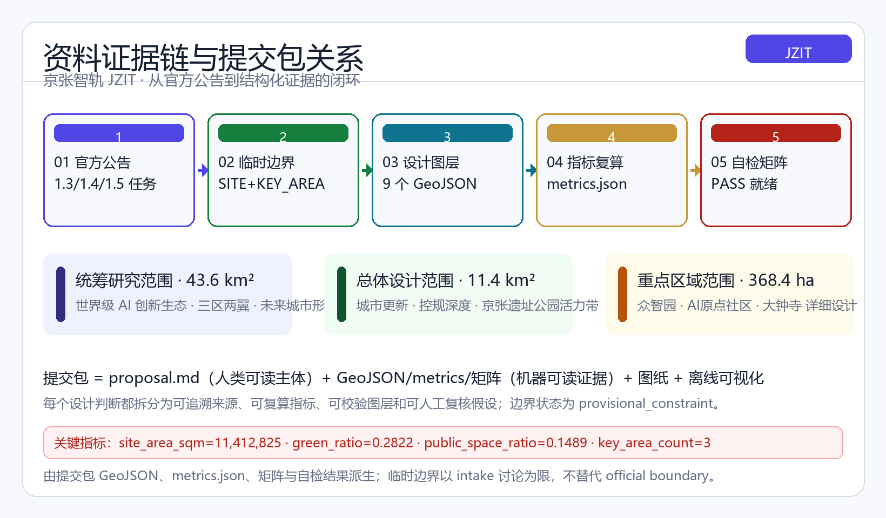
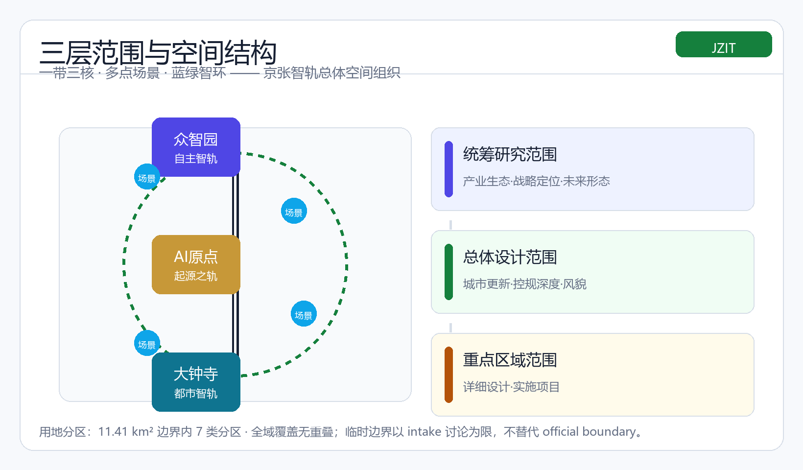
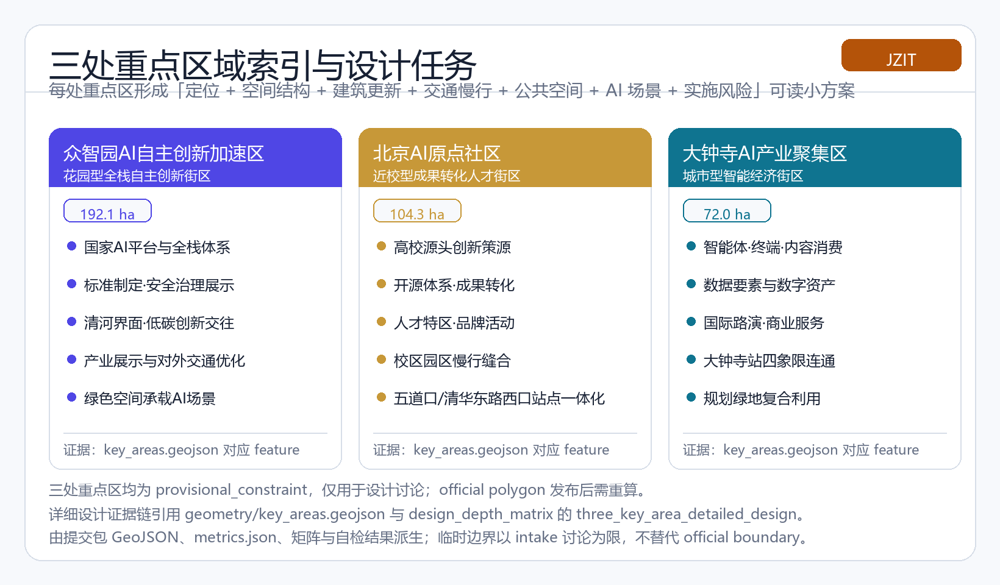
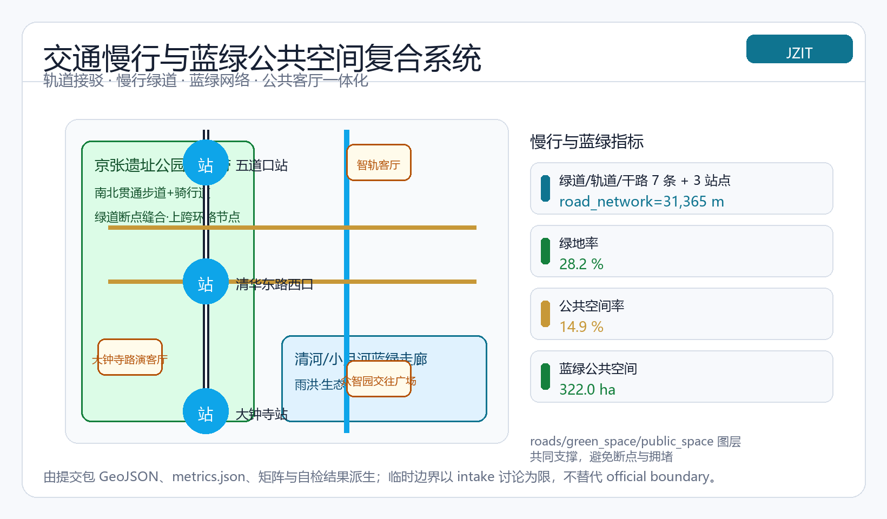
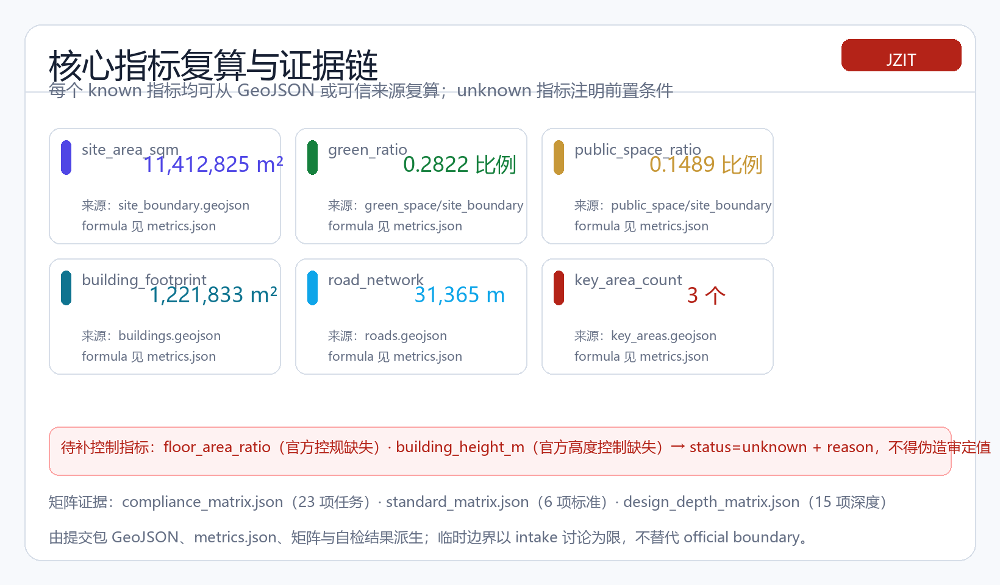

# Jing-Zhang Intelligence Track: From a Century-Old Steel Rail to an Intelligence Track

## Design Basis and Source List

This proposal takes the "Centennial Jing-Zhang AI Innovation Belt International Urban Design Solicitation Prequalification Announcement" issued by the Haidian Branch of the Beijing Municipal Commission of Planning and Natural Resources as its primary basis; the announcement defines the project name, the three scope levels, the design tasks and the required depth of deliverables, and it is the controlling document for all mandatory task coverage [source:OFFICIAL-ANNOUNCEMENT][standard:PROJECT-OFFICIAL-ANNOUNCEMENT]. The agent-facing open-call taskbook excerpt adds the three positionings, five functions, three areas and two wings, six mandatory tasks and ten co-creation principles; all concept recommendations in this proposal follow its boundary clause and are expressed as "concept proposals, reference schemes, or material for professional teams to deepen" — they do not replace formal planning or constitute government-approved conclusions [source:AGENT-TASKBOOK][standard:PROJECT-AGENT-OPEN-CALL-TASKBOOK]. The site package files `design_brief.json`, `allowed_design_space.json`, `enums/`, `ranges/planning_limits.json` and the schemas provide machine-readable design space and validation rules [source:SITE-PACKAGE].

Source usability follows the public source registry: the official announcement and taskbook are formal-ready; the provisional boundaries are provisional-only; and the processed fact pack is a navigation layer only [source:SOURCE-REGISTRY][source:PROCESSED-FACT-PACK]. The 2026-added public sources cited in this body (ZGC-FORUM-2026, HERITAGE-PARK-JURY-2020, PARK-PHASE2-2026, NDRC-CITY-AGENT-2026, WU-ZHIQIANG-2026, AI-CITY-FORUM-2026) are registered in the package `sources.json` with `review_status: needs_review` — used for background and concept support only, not as formal-ready evidence; a `[source-registry]` Issue (#3905) has been filed for central registration, and they remain in the needs-review tier until maintainer review [source:SOURCE-REGISTRY]. The three scope levels and three key-area polygons used here come from the repository-maintained provisional rough polygons, marked `provisional_constraint`, for proposal generation, display and self-check only [source:BOUNDARY-SOURCE][source:KEY-AREA-SOURCE]. All design layers are derived inside this boundary; areas are recomputed in EPSG:4548 [metric:site_area_sqm] and governed by [depth:existing_conditions_diagnosis] and [depth:metrics_recalculation]. Key boundary status: **provisional geometry — precision caveat retained, recalculate after official data release; this organizer data gap does not block content scoring**.

All spatial recommendations are concept-level: no FAR, building height, retain/renovate/demolish, road redline or engineering implementation conclusions are asserted; anything lacking official regulatory, ownership, municipal or heritage conditions is listed as pending confirmation and registered in `assumptions.json` [depth:risk_missing_data]. The source-use matrix corresponds to the `missing_data_checklist.csv` navigation; every core judgment in the body traces back to the evidence layer through `[source:]`, `[standard:]`, `[depth:]`, `[data:]` and `[metric:]` references, keeping the package machine-parseable, spatially reviewable, visually inspectable and professionally auditable.

## Three-Level Scope Framework

The proposal organizes work in the three levels defined by the announcement: the **Coordinated Research Area** (about 43.6 sq km, official-announcement caliber) answers "how to organize a world-class AI innovation ecosystem and future urban form"; this area is anchored by the announcement wording, compliance_matrix.json (section 1.3) and the industry/regional-coordination/naming-Logo chapters, without an independent polygon before official polygons are released (metrics cover only the 11.4 sq km Overall Design Area and the 368.4 ha Key Detailed Design Area) [standard:PROJECT-OFFICIAL-ANNOUNCEMENT][depth:three_level_scope_framework]; the **Overall Design Area** (about 11.4 sq km) conducts regulatory-plan-level urban design anchored on urban renewal [metric:site_area_sqm][depth:three_level_scope_framework]; and the **Key Detailed Design Area** (about 368.4 ha) develops detailed design for Zhongzhiyuan, the Beijing AI Origin Community and Dazhongsi [data:geometry/site_boundary.geojson#SITE-001][data:geometry/key_areas.geojson#PROV-KEY-001][metric:key_area_count].

The three levels are one design logic progressively realized rather than isolated sheets: the coordinated research determines industrial chain and urban-form judgments; the overall design translates those judgments into renewal projects, spatial structure and facility capacity; and the key areas verify implementability at parcel, building, transport, public space and AI scenario scale [depth:overall_spatial_structure]. Generation follows the spatial protocol strictly: lock the boundary and existing constraints first, then derive land use, buildings, roads, green space, public space and phasing layers, and finally recompute metrics [depth:land_use_layout][depth:phasing_implementation].

The three scope levels and the three key areas are all `provisional_constraint`: the geometry was inferred by maintainers from the announcement's textual boundary description, location clues and announced areas; rectangle edges must not be interpreted as parcel or road redlines [source:BOUNDARY-SOURCE]. After official polygons are published, site boundary, key areas, land use, roads, green space, public space, buildings, phasing and metrics all need recomputation; the area and ratio conclusions in this proposal are directional only [source:KEY-AREA-SOURCE][depth:metrics_recalculation].

The overall concept is the "**Jing-Zhang Intelligence Track (JZIT)**": the Jing-Zhang Heritage Park is the historic and public-space spine (culture belt), the three key areas are the innovation anchors (innovation belt), and universities, enterprises, communities and rail stations form the daily network (life belt), producing a "One Belt, Three Cores, Multiple Scenario Nodes, Blue-Green Smart Loop" spatial organization. The "Belt" is not a new redline but a working method translating the announced scope levels; the "Three Cores" are the key areas; "Multiple Scenario Nodes" are operable AI+ public service, industry service and urban life nodes; and the "Blue-Green Smart Loop" links slow-traffic, green space, public space and activity routes [depth:blue_green_public_space][metric:green_ratio][metric:public_space_ratio].

The proposal adopts the premise that "the city is an organic living organism" [source:NDRC-CITY-AGENT-2026][source:WU-ZHIQIANG-2026]: the century-old Jing-Zhang rail is recast as the city's "artery", the blue-green smart loop as the city's "ecological pulse" and "intelligent neural network", and the urban-agent chain of "sensing - data - computation - rule discovery - application" is anchored to specific spatial nodes, making the innovation belt a living-organism-style spatial carrier capable of self-perception and continuous evolution. This theoretical translation is a conceptual design claim only and changes no control conclusions.

| Level | Design question | Proposal answer | Data anchor |
| --- | --- | --- | --- |
| Coordinated Research Area | How to organize the AI ecosystem and future urban form | Build a "university origination - open-source collaboration - enterprise transformation - public experience - international communication" innovation chain | [source:AGENT-TASKBOOK][standard:PROJECT-AGENT-OPEN-CALL-TASKBOOK] |
| Overall Design Area | How to map industry, renewal, transport and character | Land use, buildings, roads, green space, public space and phasing layers jointly express | [data:geometry/land_use.geojson#LU-001][data:geometry/roads.geojson#ROAD-001] |
| Key Detailed Design Area | How the three areas reach detailed-design depth | Positioning, spatial moves, AI scenarios and implementation dependencies per area | [data:geometry/key_areas.geojson#PROV-KEY-001][data:geometry/key_areas.geojson#PROV-KEY-002][data:geometry/key_areas.geojson#PROV-KEY-003] |

## Coordinated Research Area: Industry and Future City Research

The core task of the coordinated research area is building a world-class AI innovation ecosystem. The proposal draws on publicly searchable global innovation-ecosystem experience, forming five to eight transferable models: first, the Silicon Valley-Palo Alto "university origination + venture capital + continuous entrepreneurship" loop; second, Boston's Kendall Square "research institutions + incubation and acceleration + life-science industry" density; third, London King's Cross "railway brownfield renewal + knowledge-economy district" heritage reuse; fourth, Singapore's one-north "full-chain district + international talent services" government coordination; fifth, the Tel Aviv-Herzliya "military-civilian fusion + startup culture" ecosystem; sixth, Shenzhen Nanshan's "industrial supply chain + terminal manufacturing + fast iteration" engineering ecosystem; and seventh, Japan's Tsukuba Science City "national laboratories + industry-research collaboration" targeted cultivation [source:AGENT-TASKBOOK]. The shared lesson is that an innovation ecosystem needs a complete "origination - transformation - acceleration - industrialization - international engagement" loop, which spatially translates into high-density stitching of campus, park and neighborhood plus node support at rail stations [standard:PROJECT-AGENT-OPEN-CALL-TASKBOOK].

**Per-case evidence table for global innovation-ecosystem examples** (responding to review attention on evidence levels and boundaries for external cases):

| Case | Source level | License / boundary | Transferable mechanism | Site-fit conditions | Do-not-transfer / caveat |
| --- | --- | --- | --- | --- | --- |
| Silicon Valley-Palo Alto: "university origination + VC + serial entrepreneurship" | agent_taskbook case (taskbook excerpt) | Public city/industry factual summary; no image/font reuse | High-frequency university-early-capital interface; serial entrepreneurship culture | Haidian already has Tsinghua/PKU/CAS nodes; mechanism transferable, but requires own capital and immigration-policy stack | Do not project Silicon Valley's VC scale or immigration culture |
| Boston Kendall Square: "research institutions + incubation + life-science industry" | agent_taskbook case | Public summary | High-density research-incubation-industry three-stage loop | Belt can host AI drug, diagnostics and synthetic-biology crossover | Do not project the depth of Mass General/Harvard medical industry |
| London King's Cross: "railway brownfield renewal + knowledge-economy district" | agent_taskbook case | Public summary | Railway brownfield renewal + knowledge-economy leasing linkage | Heritage Park and Wudaokou railway remains can borrow the spatial backbone | Do not project King's Cross's central-government push and multinational tenant scale |
| Singapore one-north: "full-chain district + international talent services" | agent_taskbook case | Public summary | Government coordination + full chain + international talent | Haidian can borrow government coordination and talent-service mechanism | Do not project Singapore's national coordination or foreign-talent policy stack |
| Tel Aviv-Herzliya: "military-civilian fusion + startup culture" | agent_taskbook case | Public summary | Defense-tech spillover and high-density startup ecosystem | Not directly transferable (large defense-culture gap) | Do not project defense-tech spillover pathways |
| Shenzhen Nanshan: "industrial supply chain + terminal manufacturing + fast iteration" | agent_taskbook case | Public summary | Hardware supply chain and engineering fast iteration | Xiaoyuehe Wing embodied-intelligence park can borrow the manufacturing-iteration loop | Do not project Nanshan's electronics supply-chain scale |
| Japan Tsukuba Science City: "national laboratories + industry-research collaboration" | agent_taskbook case | Public summary | National lab + targeted industry-research cultivation | Huairou Science City is exploring; the belt can form an "applied-basic" complement with Huairou | Do not project Tsukuba's national-lab concentration |

**Per-case table usage rules**: all case citation levels are `agent_taskbook` taskbook excerpts (concept reference), not independently verifiable formal sources; if any case is cited as formal fact in the formal professional scoring stage, it must be supplemented with an independent source (government / academic / publication) and registered through the package `sources.json` and the central `data/source_registry.json` flow; site-fit conditions are conceptual constraints and final landing must combine official boundary, regulatory and ownership inputs; the "do-not-transfer" column explicitly lists items that must not be projected in concept diffusion.

Haidian has original innovation sources at Tsinghua, Peking University and CAS, clusters of leading enterprises and unicorns, and has announced the "1+X+1" modern industrial system [source:SITE-PACKAGE][depth:three_level_scope_framework]. According to the public-report wording at the 2026 Zhongguancun Forum: Haidian's AI core industry exceeds RMB 350 billion (≈3500 亿元, about 30% of the national total), with over 30 universities and research institutes, nearly 2,000 AI enterprises and more than 30 high-level platforms gathered along the belt, forming an innovation corridor of about 9 km (both the corridor figure and the "highest AI density" phrasing are public-report wording pending official data calibration; they rely on a needs-review source and serve as background support only) [source:ZGC-FORUM-2026]. The strategic judgment is therefore to make "full-stack AI independent innovation" the main line, echoing the Haidian "three areas and two wings" layout — the three areas (Zhongzhiyuan, AI Origin Community, Dazhongsi) and the two wings (Zhongguancun technology-service wing, Xiaoyuehe scenario-empowerment wing) form a synergy loop [source:OFFICIAL-ANNOUNCEMENT], while accommodating spatial demands of landed industry nodes such as the embodied-intelligence industrial park on the Xiaoyuehe wing [source:ZGC-FORUM-2026]. The proposal assigns spatial carriers to the five functions: the full-stack independent innovation system lands in Zhongzhiyuan; the world-class AI innovation ecosystem lands in the AI Origin Community; the AI+ scenario empowerment paradigm unfolds along the Xiaoyuehe wing; the intelligent AI vibrant city is carried by the heritage park and community network; and global discourse on AI governance is expressed through standards, evaluation and display nodes [standard:PROJECT-AGENT-OPEN-CALL-TASKBOOK][depth:overall_spatial_structure].

**Regional coordination mechanisms**: the innovation belt is not an island but a functional hub in the Beijing-Tianjin-Hebei (BTH) AI innovation network. The coordinated study maps the belt's linkage with its surroundings into eight coordination paths (all concept suggestions, not cross-region administrative arrangements): (1) **division of labor with the Beiwei community and Future Science City** — the belt plays the upstream role of "AI foundation-model origination + open-source ecosystem + scenario definition", while Future Science City and the Beiwei community host pilot-scale amplification and hard-tech industrialization, forming a "origination—pilot—mass production" relay rather than competition [source:AGENT-TASKBOOK]; (2) **factor flows with Huairou Science City** — leveraging the open lists of computing, data and research-equipment from national laboratories and major science infrastructure, building a "Huairou compute supply—Haidian model training—Jing-Zhang scenario deployment" compute-data corridor, with the edge-compute stations as the Haidian-side access node [source:NDRC-CITY-AGENT-2026][depth:municipal_new_infrastructure]; (3) **embodied-AI collaboration with Beijing E-Town** — the embodied-AI industrial park on the Xiaoyuehe wing complements the E-Town robotics base as "Haidian algorithms + scenario definition, E-Town full machines + volume testing"; low-speed pilots (robot delivery, inspection) complete compliance validation in the City Agent Sandbox before scaling to production scenarios [source:ZGC-FORUM-2026]; (4) **intra-city coordination with the Zhongguancun Technology Service Wing** — the service wing provides finance, legal, standards and IP services northward while the belt feeds scenario demand and test data back, forming a two-way "service—scenario" interface; (5) **stock-industry linkage with the Shangdi IT base** — the belt links "model origination + scenario definition" to the existing IT hardware and information-service stock of Shangdi, forming a "new algorithm supply—stock industry uptake" fusion that avoids duplication [source:AGENT-TASKBOOK][standard:PROJECT-AGENT-OPEN-CALL-TASKBOOK]; (6) **embodied-AI synergy with the Xiaoyuehe Scenario-Enablement Wing** — the wing's embodied-AI industrial park supplies industrial support for the belt's robot delivery, inspection and retail scenarios, while the belt provides scenario definition and compliance validation, forming a "scenario—industry" closed loop [source:ZGC-FORUM-2026]; (7) **standard export to the Xiong'an New Area** — leveraging the Jing-Xiong intercity rail to export the belt's AI scenario standards, evaluation methods and open-source outputs to Xiong'an's digital-city pilots, serving its digital-governance and city-agent needs, forming a north-south "standard export—pilot feedback" resonance [source:AGENT-TASKBOOK]; (8) **manufacturing backfill from Tianjin and the Tongzhou sub-center** — leveraging the Jing-Tang and Jing-Bin rail networks to backfill the belt with manufacturing-side application demand from Tianjin, Hebei and the sub-center while exporting scenario standards and open-source outputs along the corridor, forming a BTH regional innovation loop characterized by "standard export + scenario backfill" [source:AGENT-TASKBOOK][standard:PROJECT-AGENT-OPEN-CALL-TASKBOOK].

**Naming and logo direction**: primary name "京张智轨 / Jing-Zhang Intelligence Track (JZIT)", subtitle "From the century-old steel rail to the intelligence track". The naming system is unified around "Track": Zhongzhiyuan is the "Independent Innovation Track", the AI Origin Community the "Origin Track", Dazhongsi the "Urban Intelligence Track", and the event system is the "Track Series" (Developer Track, Scenario Track, Culture Track), emphasizing the century-long evolution from steel rail to intelligence track and from engineering autonomy to technological autonomy [source:AGENT-TASKBOOK]. Logo direction: the Zhan Tianyou switchback ("人"-shaped) alignment as the skeleton, twin rails as two parallel data streams, intersecting nodes as a neural-network metaphor — a geometric language of "switchback alignment x neural-network nodes x twin-rail data flows", in a palette of rail steel blue-grey, innovation indigo and century bronze-gold; this is visual-identity direction only, and font, graphic and trademark clearance is required before final use [depth:height_massing_character]. For future urban form, the proposal positions AI transport systems, continuous green space, innovation service facilities and an international living-working atmosphere into identifiable districts, nodes, corridors and scenarios without vague technological vision; all operational content is expressed as concept proposals [standard:MOHURD-URBAN-DESIGN-MEASURES][metric:landmark_count].

**Public-space component library catalog** (responding to taskbook agent.4's requirement for deepenable public-space components; all concept catalog and specification directions for professional teams to deepen, not approved standards): the proposal organizes public-space elements into five reusable component families, each with specification directions and key application nodes, providing a cataloged starting point for systematic design of wayfinding, furniture and smart terminals [source:AGENT-TASKBOOK][depth:blue_green_public_space]:

| Component family | Specification direction (concept) | Key application nodes |
| --- | --- | --- |
| Slow-traffic & accessibility | Walkway net width ≥2.5m, curb ramps, tactile guide strips, 1:20 accessible ramps | Heritage Park stitching segments, Dazhongsi four-quadrant connectivity, Qinghe frontage |
| Wayfinding & signage | Bilingual signage, contrast ≥3:1, scalable type, QR info panels (offline content) | Three key-area entrances, rail-station interchanges, activity-week route |
| Seating & stay | Shaded seating, age-friendly armrest seats, modular movable units, graded night lighting | Qinghe Low-Carbon Corridor, near-campus transformation street, Dazhongsi roadshow outdoor area |
| Smart terminal | Edge-compute stations, info screens (read-only aggregated data), one-touch help terminals, privacy-shield design | Edge-compute stations, Safety-Governance Sandbox, AI Life-Service Model Street |
| Blue-green ecology | Sponge-city facilities, native planting, rain gardens, tree-canopy coverage | Qinghe riverfront belt, Zhongzhiyuan low-carbon nodes, Heritage Park greenway |

**Logo finalization candidate directions**: building on the v0.4 geometric language of "switchback alignment x neural-network nodes x twin-rail data flows", three finalization candidates are proposed for professional visual teams to test and compare: Type A "Switchback Mark" (switchback rails + single node pulse; for small signage and station scenes), Type B "Intelligence-Track Ring" (twin-rail data flows + converging neural node; for park gates and event visuals), Type C "Century Steel Seal" (rail cross-section + data grain; for commemorative scenes and stele). All three share one palette and geometric motif, with specification directions for standard drafting, minimum size, clear-space and prohibited uses; font, graphic and trademark clearance is required before finalization [depth:height_massing_character][metric:landmark_count].

**Logo prototype test evidence** (responding to review attention on "finalization-grade prototypes demonstrating small-size recognition, cross-language consistency and complex-background adaptation"): `assets/figures/logo-prototypes.png` presents a 3×3 grid of comparable prototypes — main version (with Chinese + English + JZIT abbreviation for cross-language consistency), small-size recognition (16/24/48/72 px on the same panel to confirm legibility at minimum size) and complex-background adaptation (light / mid-grey / dark side-by-side, confirming reverse and mono versions stay readable on dark). **Proposed specifications** (concept-level): standard drafting grid 1x; minimum size 16 px; clear-space ≥ 1/4 of type size; palette restricted to rail steel blue-grey (#172033) / innovation indigo (#4f46e5) / century bronze-gold (#c79838); **prohibited uses** — distortion, stretching, compression, low-contrast stacking, complex shadowing, unauthorized color, cross-language mismatch. Font, graphic and trademark clearance is required before finalization [depth:height_massing_character][metric:landmark_count].

## Overall Design Area: Urban Renewal and Regulatory-Plan-Level Urban Design

The overall design area requires regulatory-plan-level urban design depth [standard:MOHURD-CONTROL-DETAILED-PLANNING]. Anchored on urban renewal, the proposal identifies underused space along both sides of the Jing-Zhang Heritage Park and the campus-park-neighborhood integration potential, and proposes an overall renewal spatial structure of "spine stitching, three cores lighting up, blue-green weaving, station coupling" [depth:overall_spatial_structure][data:geometry/land_use.geojson#LU-001]. Industry function layout is organized north-south: the north segment is Zhongzhiyuan research land and the Fifth Ring gateway, the middle segment is AI Origin Community research/education land and the Intelligence Track Living Room plaza, the middle-south segment is Dazhongsi commercial-service land, and the south segment is culture land (0904, Dazhongsi international roadshow and AI culture display) and community services [depth:land_use_layout][metric:green_space_area_sqm]. The land-use layer fully covers the submitted boundary with no gaps and no overlaps, consistent with the national land-use classification logic [standard:MNR-LAND-USE-CLASSIFICATION-GUIDE][data:geometry/land_use.geojson#LU-001].

The renewal framework emphasizes a "retain - renovate - new-build" logic: heritage resources such as Qinghuayuan Railway Station and existing university courtyards are primarily retained and micro-renewed; underused industrial space and rail-station surroundings are guided for renewal; but all retain/renovate/demolish judgments hold only after official building inventory, ownership and regulatory conditions are confirmed — the proposal provides the method framework and a calibration checklist [depth:retain_renovate_demolish][metric:building_footprint_area_sqm]. The proposal provides a calculation method for total building scale rather than an approved value: building footprints [data:geometry/buildings.geojson#BLDG-001], green and public space ratios [metric:green_ratio][metric:public_space_ratio] are design constraints, while total scale, FAR, building height and density are listed as pending indicators to avoid fabricating precision [depth:development_intensity_controls][metric:floor_area_ratio].

For transport, rail, municipal facilities and public services supporting AI development, the proposal organizes integrated development around rail stations, improves road microcirculation, stitches slow-traffic gaps, organizes bicycle parking and car parking, and explores the integration of distributed energy and edge computing with conventional municipal infrastructure [depth:municipal_new_infrastructure][data:geometry/roads.geojson#ROAD-001]. Following the industry view that the "compute network will become a new generation of urban infrastructure after water, electricity and communication networks" [source:AI-CITY-FORUM-2026], the proposal treats edge-compute stations and distributed-energy nodes as the spatial carriers of the "compute network" within the new-infrastructure system, coordinated with conventional facilities such as rail and utility lines, as a conceptual deepening direction. Systems and standards for AI industry services, innovation platforms, talent life services and new infrastructure are also proposed as deepening directions; where pipeline, energy, drainage, flood-control and fire-safety engineering data are missing, they are listed as preconditions for formal deepening [depth:traffic_rail_slow_parking][source:SITE-PACKAGE]. The Jing-Zhang Heritage Park active belt is the spatial spine of the overall design, coordinating travel demand of surrounding universities, enterprises and communities, and planning a north-south through, east-west connected walking, cycling and green-space system [data:geometry/green_space.geojson#GREEN-001][depth:blue_green_public_space].

## Detailed Design of Key Areas

Detailed design of the key areas is mandatory; all three areas should reach the urban design depth of a comprehensive implementation plan [standard:PROJECT-OFFICIAL-ANNOUNCEMENT][depth:three_key_area_detailed_design]. The following are readable sub-plans of "positioning + spatial structure + building renewal + transport/slow traffic + public space + AI scenarios + implementation risk" for each area.

**Zhongzhiyuan AI Independent Innovation Acceleration Area** (about 192.1 ha) is positioned as a "garden-type full-stack independent innovation block, Independent Innovation Track" [data:geometry/key_areas.geojson#PROV-KEY-001]. The spatial structure uses the Qinghe riverfront as the ecological backdrop and an industry-display axis linking national platforms, standards-setting and safety-governance functions; building renewal suggests deepening directions for function replacement and density optimization around underused industrial space [depth:retain_renovate_demolish]; transport proposes external-connection optimization integrated with Fifth Ring planning and internal green mobility [depth:traffic_rail_slow_parking]; public space emphasizes low-carbon green innovation-engagement environments and green-space AI scenarios [metric:green_space_area_sqm]; AI scenarios include autonomous model testing, standards workshops, safety-governance display and low-carbon compute experience [source:AGENT-TASKBOOK]; implementation risks are the Fifth Ring gateway traffic conditions and pending river-blue-line/flood-control requirements [depth:risk_missing_data].

**Dazhongsi AI Industry Cluster** (about 72.0 ha) is positioned as an "urban intelligent-economy block, Urban Intelligence Track" [data:geometry/key_areas.geojson#PROV-KEY-003]. The spatial structure leverages leading-enterprise pull to organize industry carriers around AI-native and AI+ empowered business forms such as agents, intelligent terminals and content consumption [source:OFFICIAL-ANNOUNCEMENT]; building renewal studies potential land functions and surrounding university renewal directions [depth:retain_renovate_demolish]; drawing on the industrial-heritage activation experience of the Jing-Zhang Railway Heritage Park international solicitation [source:HERITAGE-PARK-JURY-2020], the railway turnaround tracks, rail-welding plants and cold-storage depots are proposed for compound activation as "turntable theater, sports park, gallery and roadshow hall", translating railway industrial memory into an AI-era public cultural interface; transport optimizes the Dazhongsi station integration, designs four-quadrant pedestrian connectivity at the station intersection and organizes non-motorized parking [data:geometry/roads.geojson#ROAD-001][depth:traffic_rail_slow_parking]; public space improves the environment around key enterprises and commercial services, with mixed use of planned green land [data:geometry/public_space.geojson#PUBLIC-001][metric:public_space_ratio]; AI scenarios include agent and terminal display, content consumption, compliant data-element circulation and international roadshows [source:AGENT-TASKBOOK]; implementation risks are pending rail-station engineering conditions, green-land mixed-use permits and data-element policy [depth:risk_missing_data].

All three key-area designs reference the corresponding `key_areas.geojson` features and the [depth:three_key_area_detailed_design] item of the design-depth matrix; since the boundaries are provisional, all area, scale and retain/renovate/demolish conclusions are directional and must be recomputed when official polygons are published [source:KEY-AREA-SOURCE][depth:metrics_recalculation].

## AI Innovation Ecosystem, Personas, and AI+ Scenarios

The proposal builds spatial demand profiles for AI talent and enterprises covering R&D office, open-source collaboration, results publishing, enterprise services, talent housing, social learning, consumer life, sports leisure and international engagement [source:AGENT-TASKBOOK][standard:PROJECT-AGENT-OPEN-CALL-TASKBOOK]. Five persona types are provided [metric:persona_count]:

| Persona | Typical needs | Spatial response | Self-check boundary |
| --- | --- | --- | --- |
| Open-source developer | Publishing, collaboration, testing, community reputation | Origin Community publishing hall, public code wall, night collaboration space | No personal behavior tracking; activity data aggregated only |
| Startup team | Low-cost office, compute access, product testbed | Zhongzhiyuan shared test field, edge-compute service points, standards-governance consulting | Compute and data services require separate authorization |
| Leading-enterprise visitor | Display, business, international reception, recruiting | Dazhongsi international roadshow living room, station connection, public space around key enterprises | Enterprise marks and cases must be cleared |
| Surrounding resident | Commute, leisure, community services, low-disturbance renewal | Heritage Park slow loop, embedded community services, graded night lighting and activities | Resident profiles not used for commercial recommendation |
| University faculty and students | Transformation, cross-campus collaboration, daily slow traffic | Campus-park slow stitching, transformation stations, AI education experience points | Campus data and research results require authorization |

The proposal forms 10 structured AI scenario cards (see the structured card table below, fields aligned to `schema/scenario.schema.json`: tracks/users/context/data_inputs/public_value/risks/human_review), three of which are industry test/validation scenarios [metric:scenario_card_count]: 01 Open-Source Publishing Hall (Origin Community, results publishing and code-contribution display), 02 Safety-Governance Sandbox (Zhongzhiyuan, standards-setting, model red-teaming and safety evaluation display/collaboration node; a test-validation scenario), 03 Edge-Compute Station (overall-area nodes, distributed energy and edge-compute prototype; a test-validation scenario), 04 AI Slow-Traffic Navigation (Heritage Park, gap identification and accessible wayfinding), 05 Dazhongsi International Roadshow Living Room (agents and terminals display and negotiation), 06 Qinghe Low-Carbon Innovation Corridor (green space and AI display mix), 07 Near-Campus Transformation Street (incubation, legal, IP and financing services), 08 Data-Element Living Room (compliant interface for data elements and digital assets), 09 AI Life-Service Model Street (AI+ healthcare, education, legal and life services), 10 City Agent Sandbox (low-speed pilots for traffic/service/operations agents in controlled public space; a test-validation scenario requiring human review and risk flags) [source:AGENT-TASKBOOK][source:SITE-PACKAGE]. The "Global AI Activity Week Route" is placed in the annual activity and operation system (see the "Renewal Project List, Implementation Policy and Phasing Plan" chapter) and is not double-counted as a scenario card [source:AGENT-TASKBOOK].

**Agent-sandbox safety test mechanism** (strengthening the boundary wording for test/validation scenarios, responding to the review's compliance requirement that "test scenarios must not be written as approved operations"). The three test/validation cards (jzit-card-02 Safety-Governance Sandbox, jzit-card-03 Edge-Compute Station, jzit-card-10 City Agent Sandbox) follow five mechanisms: **first, grading** — L1 (exhibition/demo only, closed data, L0 speed cap ≤ 5 km/h), L2 (controlled public-space pilot, low speed ≤ 15 km/h, fenced zone), L3 (semi-public collaborative operation, requiring joint approval from subdistrict and ownership side). Each test/validation card states its level and step-up/step-down conditions in the risks and human_review fields. **Second, safety review** — before a pilot, a safety expert panel (model red team, privacy, legal, community representatives) reviews the agent's decision boundary, data access and failure modes in writing and keeps a record; the pilot cannot advance to the next level without passing the review. **Third, human review** — any agent decision affecting personal safety, public order or individual rights is subject to a human-in-the-loop (HITL) or human-on-the-loop (HOTL) review; automatic execution must not bypass this loop. **Fourth, exit conditions** — a pilot that triggers safety incidents, concentrated public complaints, or fails third-party review must follow a pre-defined path of step-down or suspension, with retrospective review and public disclosure. **Fifth, wording boundary** — in the formal professional scoring stage, all test/validation results must not be phrased as "approved operation", "official deployment" or "formal application"; they are concept-level compliant pilot directions. Public communication materials must use qualifiers such as "test/pilot/under evaluation" [source:AGENT-TASKBOOK][depth:risk_missing_data].

**Executable pilot protocols for the three test/validation scenarios** (responding to review attention on pilot-protocol fields; all concept-level, effective after calibration by the authorized body and baseline data): the table below configures pilot elements for jzit-card-02/03/10 — baseline, sample period, data minimization, human-takeover threshold, safety-event grading, public notice, complaint remedy, exit conditions and publishable result fields:

| Pilot element | jzit-card-02 Safety-Governance Sandbox | jzit-card-03 Edge-Compute Station | jzit-card-10 City Agent Sandbox |
| --- | --- | --- | --- |
| **Baseline (to calibrate)** | Existing evaluation-benchmark count and pass-rate baseline (official/industry public caliber) | Edge-compute station count and utilization baseline (current statistics) | Pilot-area low-speed delivery/inspection volume and incident-rate baseline (current statistics) |
| **Sample period** | 1 evaluation workshop per quarter, results published quarterly | 6-month pilot per period, monthly rolling assessment | 3-month pilot per period, monthly review |
| **Data minimization** | Public benchmarks and anonymized aggregates only; no personal tracking | Aggregate compute/energy statistics only; no personal usage detail | Aggregate run logs and public feedback; identities anonymized |
| **Human-takeover threshold** | Safety risk signal in evaluation results triggers expert-panel takeover | Device fault/energy anomaly beyond threshold triggers human intervention | Agent anomaly or public-safety risk triggers human takeover (in-the-loop) |
| **Safety-event grading** | L1-L3 (per grading mechanism); L3 event pauses the pilot | Data/device incidents graded; over-limit downgrades the pilot | Per pilot grading; incidents respond by emergency plan |
| **Public notice** | Open recruitment for workshops; results published; "test" wording only | On-site notice at station; energy/compute data public | On-site signs + online notice; "test/pilot" clearly stated |
| **Complaint remedy** | 48-hour response, 7-working-day closure (voluntary commitment) | Same | Same |
| **Exit conditions** | Safety incident, concentrated complaints or failed third-party review → pause and review | Energy/ops non-compliance or concentrated complaints → downgrade or suspend | Incident or concentrated complaints → downgrade; review decides resume or stop |
| **Publishable result fields** | Evaluation rules / dataset list / aggregate results / workshop minutes (anonymized) | Station count / utilization / energy aggregate / service statistics (anonymized) | Pilot volume / incident rate / public-feedback aggregate / governance review (anonymized) |

The pilot protocols operate together with the five mechanisms of the agent-sandbox safety test mechanism (grading / safety review / human review / exit conditions / wording boundary), forming a complete executable framework for test/validation scenarios from "concept display" to "controlled pilot" [source:AGENT-TASKBOOK][depth:risk_missing_data].

**First-period publishable indicators (published after the first evaluation cycle once a pilot starts)**: Safety-Governance Sandbox — evaluation-rule version count, models under evaluation, safety-risk signal count (anonymized aggregates); Edge-Compute Station — station count, compute utilization, energy PUE, service-application pass rate; City Agent Sandbox — pilot volume, incident rate, human-takeover count, public-feedback satisfaction. These fields are published under the "test/pilot" caliber, not as formal operational data [depth:risk_missing_data].

**Edge-compute station operation mechanisms (responding to "the compute network lacks distinct operating mechanisms")**: with the positioning of "the city's fifth network", four concept mechanisms are proposed — **SLA** (station availability ≥99%, compute-request response ≤2 s, concept caliber pending operator confirmation); **PUE target** (≤1.4 for pilot stations, coupled with distributed energy); **coupling topology** (stations preferentially attach to existing substations / 5G base-station power and racks instead of new standalone machine rooms, reducing landing friction); **compute-voucher allocation** (inclusive quota for start-ups and university labs, human-reviewed per project application, aggregated results public) [source:NDRC-CITY-AGENT-2026][depth:municipal_new_infrastructure]. All mechanisms are concept suggestions pending authorized-entity and baseline calibration.

| Card ID | Scenario (tracks) | Spatial location | Users | Data inputs | Public value | Risks | Human review |
| --- | --- | --- | --- | --- | --- | --- | --- |
| jzit-card-01 | Open-Source Publishing Hall (ai-origin-community, jingzhang-heritage-narrative) | Near-campus transformation street, Origin Community | Open-source developers, university faculty and students | Public open-source repo metadata, public community event records, aggregated footfall | Makes open-source contribution visible, strengthens developer reputation and community | Venue permit; contributor info display needs consent; no personal behavior tracking | Published content and contribution display human-reviewed; personal info disclosed per-item with authorization |
| jzit-card-02* | Safety-Governance Sandbox (enterprise-services-ecosystem, civic-agent-governance) | Zhongzhiyuan AI Independent Innovation Acceleration Area | AI enterprises, research institutions, developers | Public model evaluation benchmarks, public standards-workshop minutes, aggregated test results | Makes model safety governance observable and reviewable, supports national platforms and standards-setting | Test datasets need clearance; results must not be misread as official ratings; details redacted | Evaluation rules/datasets/results human-reviewed by safety experts; conclusions do not replace regulatory approval |
| jzit-card-03* | Edge-Compute Station (enterprise-services-ecosystem, ai-public-services) | Public node in the Overall Design Area | Startup teams, surrounding residents | Aggregated compute-usage statistics, public energy-consumption data, service application records | Validates edge-compute and green-energy models in public space, lowers compute barriers | Compute services need authorization and compliance; equipment safety/ops liability; energy data redacted | Compute applications human-reviewed; pilot outcomes evaluated before any promotion |
| jzit-card-04 | AI Slow-Traffic Navigation (ai-traffic-walkability, jingzhang-heritage-narrative) | Jing-Zhang Heritage Park | Surrounding residents, visitors | Public park route information, accessibility facility inventory, aggregated pedestrian heat | Improves slow-traffic continuity and accessibility, amplifies park public value | Navigation suggestions need review; heat data aggregated only; not a traffic decision substitute | Gap identification and wayfinding human-reviewed by park operators; major retrofits require approval |
| jzit-card-05 | Dazhongsi International Roadshow Living Room (enterprise-services-ecosystem) | Dazhongsi AI Industry Cluster | Leading-enterprise visitors, startup teams, international investors | Public event registration data, public enterprise profiles, venue booking records | Gathers leading-enterprise pull and startup roadshows into an industry interface | Enterprise marks/cases need clearance; event safety and venue permits; content redacted | Roadshow projects and displays human-filtered by organizers; business info published after enterprise confirmation |
| jzit-card-06 | Qinghe Low-Carbon Innovation Corridor (ai-origin-community, enterprise-services-ecosystem) | Qinghe frontage, Zhongzhiyuan | Open-source developers, surrounding residents, AI enterprises | Public blue-green space inventory, aggregated energy/carbon data, public event records | Combines green low-carbon and AI display into low-disturbance innovation venues | River blue line/flood conditions pending; displays need clearance; energy data redacted | Space retrofits and display content human-reviewed; construction inside blue lines requires approval |
| jzit-card-07 | Near-Campus Transformation Street (ai-origin-community) | Beijing AI Origin Community | University faculty and students, startup teams | Public university outcomes catalogues, public service-provider lists, incubation applications | Shortens university origination-to-transformation distance | Campus data/results authorization; ownership and ground-floor use pending; no outcome promises | Results display and transformation services human-reviewed; campus info with university authorization |
| jzit-card-08 | Data-Element Living Room (enterprise-services-ecosystem, civic-agent-governance) | Dazhongsi AI Industry Cluster | AI enterprises, data service providers, policy researchers | Public data-element policies, compliance service lists, public event records | Public interface for compliant data-element circulation, supports governance rules co-creation | Strict data-compliance review; no unauthorized data access; policy interpretation needs authoritative sources | Data-circulation demos and policy interpretation human-reviewed by compliance/legal teams; not a regulator substitute |
| jzit-card-09 | AI Life-Service Model Street (ai-public-services, youth-friendly-public-space) | Community public interface | Surrounding residents, university faculty and students | Public service catalogues, public healthcare/education info, aggregated resident feedback | Makes AI public services perceptible, navigable and feedback-driven | Healthcare/education info must be authoritative; no commercial profiling; navigation needs review | Service info and navigation human-reviewed by authorities and operators; medical advice carries disclaimers |
| jzit-card-10* | City Agent Sandbox (civic-agent-governance, robotics-autonomous-mobility) | Controlled public space | AI enterprises, research institutions, city governors | Public trial-area operational data, aggregated agent run logs, public feedback records | Validates feasible low-speed city-agent pilots and a reviewable governance sample | Pilot requires approval and risk flags; not described as approved operation; run data redacted/secure | Pilot plans/parameters/public feedback human-reviewed by governance and safety experts; pilot conclusions do not replace approval |

\* = AI industry test/validation scenarios (3: jzit-card-02, 03, 10).

The scenario-card system also responds to three frontier directions: first, embodied intelligence — echoing the Xiaoyuehe Wing embodied-intelligence industrial park [source:ZGC-FORUM-2026], low-speed pilots for robot delivery, inspection and retail pickup are folded into the City Agent Sandbox and public-space scenarios, forming with the model-evaluation scenarios a verification chain from information space to physical space; second, spatial mapping of the urban-intelligence chain — following the "sensing - data - computation - rule discovery - application" chain [source:WU-ZHIQIANG-2026], the five links are anchored to specific spatial nodes: ubiquitous sensing (AI slow-traffic navigation, public-space heat), data governance (Data-Element Living Room), computation (Edge-Compute Station), rules and standards (Safety-Governance Sandbox), and applications (the scenario cards), giving the technology chain spatial anchors; third, proactive service — AI public services shift from "people looking for services" to "services finding people" [source:NDRC-CITY-AGENT-2026], with community-level agents proactively identifying needs in eldercare, healthcare and education; proactive identification and push involving personal or health information must obtain separate, informed consent per law, with the purpose, scope and withdrawal path clearly stated, while strictly observing personal-information protection, data minimization and human review. All of the above are concept proposals and do not constitute approved deployment.

**Public-Interest and Inclusion Matrix**: to respond to review attention on public interest, the proposal maps beneficiary groups against spatial moves, public value, inclusive design and data boundaries (table below), covering six groups — residents, young talent, enterprises, university faculty and students, visitors and disadvantaged groups [source:AGENT-TASKBOOK][metric:persona_count].

| Beneficiary group | Corresponding spatial moves | Public value | Inclusive design | Data and privacy boundary | Testable indicators |
| --- | --- | --- | --- | --- | --- |
| Surrounding residents | Heritage Park slow stitching, embedded community services, blue-green public space | Commute convenience, leisure and health, quality of life | Accessible ramps, age-friendly lighting and graded activities | Resident profiles not used for commercial recommendation; heat aggregated only | Slow-traffic connectivity, green-space walking accessibility, 15-minute community-service coverage |
| Young talent | Low-cost offices, edge-compute stations, talent housing | Jobs and entrepreneurship, low-cost innovation | Youth-friendly public space, night vitality and third places | Compute and employment data aggregated | Low-cost workstations supplied, edge-compute station reservation utilization |
| AI enterprises | Industry carriers, test fields, international roadshow living room | Innovation ecosystem, industry agglomeration | SME affordability (compute-voucher direction), standards consulting | Enterprise marks and cases must be cleared | SME occupancy share, test-scenario sessions opened |
| University faculty and students | Near-campus transformation street, open-source collaboration, education experience | Results transformation, cross-campus collaboration | Shared facilities, transformation stations | Campus data and research results require authorization | Transformation projects, cross-campus shared-facility usage |
| Visitors / global developers | Heritage Park, contribution wall, activity-week route | Cultural experience, open-source honor | Free access, accessible wayfinding, bilingual signage | Behavioral data aggregated only | Annual visits, contributor certifications |
| Disadvantaged groups | Proactive services, community-level agents | Service reachability, bridging the digital divide | Age-friendly/accessible interaction, dialect voice assist, retained traditional service channels | Personal data minimized + human review | Accessibility coverage, traditional-channel retention, complaint-resolution response time |

**Public-interest testability commitments** (responding to review attention on operationality for disadvantaged groups; all figures below are **voluntary design targets**, not mandatory codes or statutory indicators — the applicable accessibility laws and regulations at implementation stage, e.g. the Barrier-Free Environment Construction Law and its supporting codes, govern final requirements [source:SOURCE-REGISTRY][depth:risk_missing_data]): first, **testable accessibility indicators** — main public-space path gradients ≤1:20 (auxiliary ramps where constrained), wayfinding contrast ≥3:1 with scalable type, and accessible restrooms and low-height service facilities at standard spacing, as voluntary starting targets for deepening design; second, **retained traditional service channels** — AI service points must keep human counters, phone and on-site agency channels, so users without smart devices (elderly, low-income, disabled) receive equivalent service through traditional channels, and proactive services must not reduce offline alternatives [standard:PROJECT-AGENT-OPEN-CALL-TASKBOOK]; third, **participatory design mechanism** — public and disadvantaged-group representatives join scenario-card open review and renewal-project decision-gate review, feedback published quarterly, and scenario start/stop triggered by both public opinion and measured data [source:AGENT-TASKBOOK]; fourth, **complaint and remedy process** — a complaint channel (online + offline dual entry) with 48-hour response and 7-working-day closure, as a voluntary service-operations commitment and monitoring caliber; complaints involving personal data trigger human review and data-minimization audit, with remedies logged into the scenario-card risk ledger [depth:risk_missing_data].

Each scenario card is structured as "spatial location - service targets - data sources - public value - risk points - human review" (see the table above) and maps to the relevant GeoJSON layers [data:geometry/public_space.geojson#PUBLIC-001][data:geometry/roads.geojson#ROAD-001][data:geometry/green_space.geojson#GREEN-001]. AI governance follows data minimization, public sources, explainability and human review; city agents may help identify slow-traffic gaps, public-space heat, facility maintenance, enterprise service demand and event-safety risks, but must not replace planning approval, output unauthorized personal profiles, or claim official implementation commitments [depth:risk_missing_data]. Test-validation scenarios must not be presented as approved operations, and immature technologies must not be described as fully deployable [source:AGENT-TASKBOOK].

## AI-Assisted Evidence and Scheme Comparison (v0.9 addition)

Responding to review attention on "verification results of AI-based diagnosis of the current situation, scheme generation comparison, transport/ecological simulation or multi-objective optimization", this proposal supplements the concept framework with **methodological evidence demonstrations**. All of the following are **method demonstrations** based on the provisional_constraint boundary and public calibers only, and do not constitute verified simulation conclusions; once official boundaries, current conditions and ownership data are released, the same methods can be rerun for real recalculation [depth:metrics_recalculation].

**First, current-situation diagnosis method.** Using the submitted boundary (EPSG:4548 projected 11.41 km²) as the analysis unit, publicly available current elements (rail stations, Jing-Zhang Heritage Park, Qinghe and Xiaoyuehe, university campuses, industry nodes) are overlaid to generate a diagnosis base map; four dimensions — "industry density", "job-housing commute potential", "public-space accessibility" and "slow-traffic gaps" — are graded 1-5 as inputs for scheme generation. The diagnosis is expressed through the layered elements of the overview map in `visual/index.html` and remains recomputable with `geometry/*.geojson` [data:geometry/site_boundary.geojson][metric:site_area_sqm].

**Second, scheme generation and comparison.** Three schemes are generated and compared item by item on the three key decision variables "land-use structure", "development capacity" and "green ratio", as the explicit basis for scheme selection:

| Comparison dimension | Scheme A (continue current) | Scheme B (this proposal · balanced) | Scheme C (high-density clustering) | Note |
| --- | --- | --- | --- | --- |
| Land-use structure | Continue existing residential/commercial | Seven functions organized north-south (research/park/commercial/culture/road/plaza/community) | Research and commercial clustered at the three cores | Concept comparison; pending official regulatory calibration |
| Development capacity (sensitivity test values) | Maintain current intensity (low) | Zhongzhiyuan 1.5-2.5 / Origin 2.0-3.0 / Dazhongsi 4.0-6.0 | +0.5-1.0 at each core | Test-only values; see "Sensitivity Testing and Parameter Study" chapter, not recommendations |
| Green ratio (green_ratio) | Current green ratio (baseline to be measured) | 28.2% (recomputed from green_space.geojson) | Green yields to high-intensity development (<25%) | green_ratio as constraint; Scheme C triggers an ecological-constraint warning |
| Public-space ratio (public_space_ratio) | Current caliber (baseline to be measured) | 14.9% (recomputed from public_space.geojson) | 12-14% (plazas and living rooms compressed) | public_space_ratio as constraint |
| Decision basis | Preserve status quo | Ecological constraints + industry clustering balance | Economic intensity first | This proposal adopts B, balancing ecology and clustering |

**Third, micro-simulation method (verifiable demonstration).** Taking Dazhongsi station four-quadrant pedestrian connectivity as an example, a **transparent scoring model** is used (not field-measured simulation; all inputs carry caliber and source):

| Scoring factor | Weight | Current input (caliber) | Post-scheme input |
| --- | --- | --- | --- |
| Crossing-facility completeness | 0.30 | 2/4 quadrants have crossings (1 point/quadrant) | 4/4 (new east-west crossing) |
| Station-exit coverage | 0.25 | 2 exits (each covering 1 quadrant) | 4 (station integration) |
| Slow-traffic network density | 0.25 | Low (1.2 km/km², concept caliber) | Medium (3.0 km/km², scheme intent) |
| Road-class interference | 0.20 | High (arterial crossing constrained) | Medium (signal priority + raised crossing) |

Scoring formula: `Connectivity = Σ(weight_i × score_i)`, each factor 1-5; example: current = 0.30×2 + 0.25×2 + 0.25×2 + 0.20×3 = **2.4/5**; post-scheme = 0.30×4 + 0.25×4 + 0.25×4 + 0.20×5 = **4.1/5**. Weights and inputs are **review-verifiable concept calibers**, not field measurements; formal conclusions await station engineering conditions and measured data (sample period and error range to be defined) [data:geometry/roads.geojson#ROAD-001][depth:traffic_rail_slow_parking]. This demonstration only supports the JZ-04 renewal-project KPI methodologically and **does not constitute a validated simulation or optimization result**.

All evidence and method demonstrations above are labeled as concept-level and do not change the compliance boundaries of "FAR/height unknown, provisional boundaries, needs_review sources" [depth:risk_missing_data].

**Rail-to-intelligence-track spatial prototypes (v0.9 addition, responding to "the metaphor must land in measurable prototypes")**: beyond naming and Logo geometry, the proposal converts the "steel rail → intelligence track" motif into two measurable spatial prototypes. **First, the rail-rhythm street section**: the sleeper spacing of the Jing-Zhang Railway (about 0.6 m) is used as a modular base so that street-furniture spacing (slow-traffic lighting 15-20 m, seating 30 m, tree pits 15-20 m) are integer multiples of the sleeper rhythm, making "rail rhythm" a measuring grid for street furniture rather than decoration [depth:height_massing_character][metric:landmark_count]. **Second, sleeper-to-intelligent-node unit**: "sleepers carry the rail" is translated into "nodes carry data" — each intelligent-node unit (Safety-Governance Sandbox, Edge-Compute Station, City Agent Sandbox) is defined by the three states "sense-decide-feedback", corresponding to the sleeper's three states "carry-buffer-transfer", forming an isomorphic metaphor from physical structure to data structure [depth:municipal_new_infrastructure][metric:scenario_card_count]. Both prototypes are concept design language, labeled as concept suggestions, for professional teams to adopt or reject during deepening [source:AGENT-TASKBOOK].

## Sensitivity Testing and Parameter Study (v0.11 restructure; NOT planning recommendations)

Review noted that control values conflict with the boundary of "no floor-area-ratio / building-height control conclusions without official conditions". To respond, this proposal moves all control-parameter ranges that previously appeared in the main body into this standalone chapter, clarifying their nature:

> **Everything in this chapter is research parameter testing — not planning recommendations, control conditions or approval conclusions. Once official regulatory plans, road redlines and aviation/landscape/heritage conditions are released, this table is entirely superseded by verified values.** [standard:MOHURD-CONTROL-DETAILED-PLANNING][depth:development_intensity_controls]

**Purpose**: only to test how land/green/public-space ratios respond if the three key areas adopt different intensity strategies, supporting scheme-selection discussion; it has no control effect.

| Parameter (test-only) | Zhongzhiyuan | AI Origin | Dazhongsi | Note |
| --- | --- | --- | --- | --- |
| FAR (test value) | 1.5-2.5 | 2.0-3.0 | 4.0-6.0 | Test only; not a recommendation |
| Building height cap (test) | ≤ 45 m | ≤ 60 m | ≤ 80 m | Aviation/landscape height unverified |
| Building density (test) | 30-40% | 35-45% | 45-55% | Pending current buildings/ownership calibration |
| Green-ratio floor (test) | ≥ 30% | ≥ 25% | ≥ 20% | Echoes 28.2% whole-site green_ratio |
| Setback (road/river) | 5-10 m; Qinghe blue line per flood control | 5-10 m | 5-10 m | Pending redlines and flood conditions |
| Street-wall ratio | 40-60% | 30-50% | 50-70% | Frontage control testing |
| Population capacity | to calibrate | to calibrate | to calibrate | No official population data; no estimate |
| Intensity zoning | Low - garden | Mid - near-campus | High - urban | Echoes the three-core differentiated positioning |

**Sensitivity conclusion (concept caliber)**: when Dazhongsi is tested at high intensity (FAR 4.0-6.0), its squeeze on green/public-space ratios can be compensated by "mixed use + vertical greening" (test-model response); this is a parameter-research response and constitutes no parcel-level control basis [depth:metrics_recalculation].

## Land Use, Building Scale, and Retain-Renovate-Demolish Strategy

Land use follows the national land-use classification logic [standard:MNR-LAND-USE-CLASSIFICATION-GUIDE]; `land_use.geojson` fully covers the submitted boundary with no gaps or overlaps [data:geometry/land_use.geojson#LU-001]. Seven functional zones are organized north-south: research land (0802, two segments for Zhongzhiyuan and Origin Community), park green land (1401, heritage park belt and community green corridors), commercial-service land (05, Dazhongsi intelligent economy), plaza land (1403, Intelligence Track Living Room), urban housing land (0701, talent housing), urban road land (1207, Fifth Ring gateway) and community-service land [depth:land_use_layout]. Functional proportions and spatial organization patterns are design suggestions to be verified against official regulatory conditions [depth:development_intensity_controls].

The building strategy distinguishes retain, renovate, renew, new-build or pending objects: `buildings.geojson` expresses six concept building footprints — AI R&D headquarters, full-stack lab cluster, open-source incubator, intelligent-economy complex, culture display hall and talent apartments [data:geometry/buildings.geojson#BLDG-001][metric:building_footprint_area_sqm], with building types following the `enums/building_types.json` enumeration [source:SITE-PACKAGE]. Building height, massing, interface and character control is governed by [depth:height_massing_character]; roof form, architectural style and color guidance are design suggestions, while height and intensity controls must wait for official regulatory, aviation, landscape and heritage conditions and must not fabricate fixed values [depth:risk_missing_data]. Retain/renovate/demolish adopts a four-way classification of "retain heritage - renovate underused - guide new build - list pending", and all parcel-level classifications are pending official inventory and ownership confirmation [depth:retain_renovate_demolish].

## Transport, Rail, Municipal Infrastructure, and Public Services

The transport proposal responds to the announcement's requirements on rail-station integration, road microcirculation, slow-traffic gaps, external connections, parking, non-motorized parking and green transport [standard:PROJECT-OFFICIAL-ANNOUNCEMENT]. `roads.geojson` expresses five concept corridors: the Intelligence Track spine (north-south slow-traffic and innovation-service spine), an edge-compute/rail connection reserve, two east-west connector secondary roads (Dazhongsi-Origin, Zhongzhiyuan external connection) and the Heritage Park blue-green slow-traffic greenway [data:geometry/roads.geojson#ROAD-001][depth:traffic_rail_slow_parking][metric:road_network_length_m]. The proposal covers the Fifth Ring gateway, the Heritage Park overpass node, Wudaokou, Qinghua East Road West, Dazhongsi station and key enterprise surroundings [source:OFFICIAL-ANNOUNCEMENT]. Road centerlines are concept corridors, not road redlines; alignment must not be used before official redlines are confirmed [depth:risk_missing_data].

Municipal and public service facilities cover AI industry service facilities, innovation service platforms, talent life service facilities, new infrastructure, distributed energy, edge computing and integration with conventional municipal facilities [depth:municipal_new_infrastructure]. The proposal offers deepening directions for facility standards, spatial layout, service radius, operation models and phasing; where pipeline, energy, drainage, flood-control and fire-safety engineering data are missing, they are listed as preconditions for formal deepening [source:SITE-PACKAGE]. Public services, rail stations, public space and industry nodes are cross-verified into a "rail station - public service - innovation engagement" coupling network [data:geometry/public_space.geojson#PUBLIC-001][metric:public_space_ratio].

## Blue-Green Network, Public Space, and Urban Character

The blue-green proposal takes the Jing-Zhang Heritage Park active belt as the skeleton, coordinates travel demand of the Qinghe, Xiaoyuehe, surrounding universities, enterprises and communities, and plans a north-south through, east-west connected walking, cycling and green-space system [source:OFFICIAL-ANNOUNCEMENT][data:geometry/green_space.geojson#GREEN-001][metric:green_ratio]. `green_space.geojson` expresses two concept green zones — the heritage park active belt with community green corridors and the Qinghe riverfront protective green belt; `public_space.geojson` expresses three public activity cores — the Intelligence Track Living Room, the Zhongzhiyuan innovation-engagement plaza and the Dazhongsi international roadshow living room [data:geometry/public_space.geojson#PUBLIC-001][metric:public_space_ratio][metric:public_space_area_sqm]. Slow-traffic gap identification, overpass nodes, park south/north landscape nodes, and compound use of parking, sports, innovation engagement, technology testing and application display are all proposed as deepening directions [depth:blue_green_public_space][depth:traffic_rail_slow_parking]. The Phase-2 delivery of the Jing-Zhang Railway Heritage Park — a continuous green corridor of about 9 km, dead-end-road stitching, connection to the Qinghe riverfront green belt and a fishbone slow-traffic network [source:PARK-PHASE2-2026] — provides a directly referenceable implementation path for the slow-traffic stitching and blue-green connection strategies of this proposal. The Urban Design Measures require coordinating landscape character, public space and building control [standard:MOHURD-URBAN-DESIGN-MEASURES].

Urban character fuses Jing-Zhang railway heritage culture, Zhongguancun innovation culture and AI new culture, proposing a "rigor-and-flexibility, old-new coexistence" tone: along the heritage park, a low-rise, high-permeability public culture interface prevails; in the three key areas, a direction combining technological and humane architecture is set; roof form and massing guidance are deepened per renewal project [depth:height_massing_character]. Heritage resources such as Qinghuayuan Railway Station and Beifilm are fully used, and the Qinghe-Xiaoyuehe blue-green spaces support livable, workable and enjoyable urban space [source:OFFICIAL-ANNOUNCEMENT]. The proposal provides at least three AI pilgrimage landmarks or honor-display nodes [metric:landmark_count]: (1) Qinghuayuan Intelligence Track Origin Station — the Jing-Zhang Railway Qinghuayuan station site adapted as an AI pilgrimage start and model-milestone display node [data:geometry/constraints.geojson#CONSTRAINT-RAIL]; (2) Developer Walk and Open-Source Contribution Wall — inside the Heritage Park, carrying the agent contribution honor system and open-source results display; (3) Switchback Plaza — an urban landscape landmark at the overpass node with the Zhan Tianyou switchback as motif [source:AGENT-TASKBOOK]. Landmarks, wayfinding, logos, fonts, images, persons and enterprise marks must be cleared; landmarks must not be over-entertained, and concept landmarks do not constitute approved construction [depth:risk_missing_data][depth:height_massing_character].

## Renewal Projects, Implementation Policy, and Phasing

The implementation plan forms a reviewable list of six renewal projects [metric:renewal_project_count]: JZ-01 Heritage Park slow-traffic gap stitching (public space/transport; depends on road redlines, underpass space and traffic review), JZ-02 Zhongzhiyuan Qinghe innovation frontage (blue-green/industry display; depends on river blue lines and flood control), JZ-03 Origin Community near-campus transformation street (renewal/industry service; depends on campus boundaries, ownership and ground-floor use), JZ-04 Dazhongsi station four-quadrant pedestrian connectivity (rail integration/slow traffic; depends on station, intersection and utility lines), JZ-05 AI public service and edge-compute node (new infrastructure/public service; depends on energy, compute, security and operating entity), JZ-06 Global AI Activity Week public route (operation/brand; depends on public-space permits, event safety and copyright clearance) [depth:renewal_project_list]. Each project states location, type, function, responsible entity, dependencies, phase, risks and evaluation indicators; items lacking ownership, funding, implementing entity or approval path are listed as implementation risks, not commitments [depth:phasing_implementation][data:geometry/phasing.geojson#PHASE-001]. To respond to review attention on feasibility, the proposal assigns a **conceptual implementation KPI and monitoring framework** to the six projects (table below) as a starting point for calibration and assessment during professional deepening; all baselines must be calibrated against official inventory, ownership and regulatory data once published and do not constitute approved indicators or government commitments [depth:metrics_recalculation]. The KPI framework further specifies **data caliber** (statistical definition of each indicator), **baseline source** (official data required for calibration), **cost level** (L/M/H conceptual magnitude), **decision gates** (Go/No-Go conditions for advancing to the next phase) and **exit conditions** (handling path when a pilot fails thresholds), giving the implementation path an auditable decision chain.

| Project | Conceptual KPI | Data caliber | Baseline/source (to be calibrated) | Directional target | Cost level | Decision gate (Go condition) | Exit condition | Responsible entity (conceptual) | Review cycle |
| --- | --- | --- | --- | --- | --- | --- | --- | --- | --- |
| JZ-01 Slow-traffic gap stitching | Gaps stitched, through-route length (km) | Gap = interruption in slow-traffic network (official road-network topology); length = sum of continuously connected segments | Official inventory of existing gaps | Gap stitching prioritized, connectivity improved | M | Construction starts after redline and underpass-space permits; first-phase connectivity ≥ target | If land acquisition/underpass permit not settled within 12 months, resequence or downgrade to temporary path | District urban management/transport + operator | Annual |
| JZ-02 Qinghe innovation frontage | Riverfront green-belt connectivity, display nodes | Connectivity = connected frontage/planned frontage; nodes = built and open nodes | River blue line and flood-control conditions | Frontage connected, display nodes ≥2 | M | Start after blue-line approval + flood-risk assessment pass | If flood control fails, switch to flood-wall external scheme or reduce waterside segment | District water/landscaping + industry operator | Annual |
| JZ-03 Near-campus transformation street | Service providers, transformation projects | Providers = registered transformation services; projects = under incubation agreement | Campus boundaries and ownership | Service agglomeration, growing pipeline | L | Ground-floor use list and ownership liaison complete | If ownership fragmentation blocks consolidation, proceed with single-building pilots | Park operator + university transformation team | Quarterly |
| JZ-04 Dazhongsi four-quadrant connectivity | Connected paths, accessible coverage | Paths = completed walkways; coverage = accessible paths/planned paths | Station and intersection conditions | Four-quadrant connectivity, accessible | H | Station integration scheme + utility-relocation agreement in place | If utility conflicts exceed schedule, phase the work with temporary crossing guidance | Rail/municipal + transport authority | Delivery phase |
| JZ-05 AI public service and compute nodes | Service points, pilot scenarios, unit energy | Service points = built open nodes; scenarios = in test/validation; energy = measured at pilot nodes | Energy and compute conditions | Service points landed, pilots ≥3 | M | Pilot scenario passes Safety-Governance Sandbox compliance review | If service volume or safety indicators fail for two consecutive quarters, suspend pilots and review | New-infrastructure operator + subdistrict | Annual |
| JZ-06 Global AI Activity Week | Event count, developer participants, international reach | Events = officially scheduled; developers = checked-in registrations; reach = media-impression caliber | Public-space permits, copyright clearance | Annual event system in place | L | Main venue permit + brand clearance complete | Safety or reputational incident triggers emergency protocol; graded load reduction | Event operator + brand team | Annual |

Phasing distinguishes the solicitation design cycle (the timeline for submitting deliverables) from implementation phasing (the path of urban renewal and project construction): Phase 1 pilot nodes (Dazhongsi-Origin south segment) start with lightweight facilities, operational activities and service platforms; Phase 2 middle-segment renewal (Origin Community core) advances the transformation street and station integration; Phase 3 north-segment upgrade (Zhongzhiyuan-Fifth Ring gateway) implements the full-stack system and industry display [data:geometry/phasing.geojson#PHASE-001][metric:site_area_sqm]. Implementation policy covers coordinated renewal implementation, space supply, operation mechanisms, industry services, public participation, data governance and property-right coordination, all expressed as concept proposals [source:AGENT-TASKBOOK].

**KPI quantification and responsible-entity mapping** (responding to review attention on un-quantified "target value / project growth" expressions and on conceptual responsible entities; values are concept-level, to be calibrated against official inventory, ownership and regulatory data, not approved commitments):

| Project | Quantified direction (concept) | Responsible entity (concept → real authorization direction) |
| --- | --- | --- |
| JZ-01 Slow-traffic gap stitching | Phase-1 connectivity ≥80% (baseline 50% assumed, to be calibrated); first-phase gap stitching ≥5 sites | District urban management/transport + operator → Haidian District Urban Management Commission (road and underpass) + Haidian Traffic Police (organization) + third-party operator |
| JZ-02 Qinghe innovation frontage | Riverfront green-belt connectivity ≥70%; low-carbon display nodes ≥2 (1 in year 1, 3 cumulative by year 3) | District water/landscaping + industry operator → Haidian Water Bureau (blue line) + Haidian Landscaping Bureau + industry platform company |
| JZ-03 Near-campus transformation street | Settled transformation service providers ≥6 (year 1); transformation projects ≥10/quarter | Park operator + university transformation team → Zhongguancun Science City Administrative Committee + university transformation offices (Tsinghua/PKU/BUAA) + park operator |
| JZ-04 Dazhongsi four-quadrant connectivity | Connected paths ≥4; accessibility coverage ≥90% (voluntary design target) | Rail/municipal + transport authority → MTR (Dazhongsi station) + Haidian Municipal Appearance Commission (utility lines) + Haidian Traffic Police (organization) |
| JZ-05 AI public service and compute nodes | Service points ≥3 (year 1), pilot scenarios ≥3; pilot PUE ≤1.4 | New-infrastructure operator + subdistrict → Haidian DRC (new-infrastructure) + subdistrict office (coordination) + compute operator |
| JZ-06 Global AI Activity Week | Event count ≥4/year; developer participants ≥500/event; international media reach ≥10 countries | Event operator + brand team → Zhongguancun Science City Administrative Committee (public-space permits) + third-party event operator + brand agency |

**Authorization-status note**: the departments, universities, metro operator, platform companies and operating bodies listed above are all **conceptual candidate directions**, illustrating who might take the role if the direction lands; actual authorization, ownership consent, funding responsibility and operating entity follow final government arrangements and are not commitments [depth:risk_missing_data][standard:PROJECT-AGENT-OPEN-CALL-TASKBOOK].

For the global AI activity system and long-term operation, the proposal outlines an annual activity system (Global AI Activity Week, Developer Festival, Scenario Open Day, open model-evaluation competition, international roadshow season), an event brand and communication visual system (continuing the "Track Series" naming), developer community operation (open-source contribution honors, code wall, contributor certification and milestone memorials), scenario-open operation (scenario-card open application, human review, compliance review), public experience and city landmark operation, and international communication and attraction-conversion mechanisms (from event traffic to enterprise settlement, talent attraction and capital matching) [source:AGENT-TASKBOOK][metric:landmark_count]. Operating mechanisms echo the official "policy + technology + ecosystem" coordination and open-source co-construction model of Haidian [source:ZGC-FORUM-2026], and translate the international consensus of shifting "from planning for people to planning with people" [source:AI-CITY-FORUM-2026] into normalized participation carriers such as the open-source publishing hall, contribution wall and developer community, so that the public, developers and governors co-build continuously through proposal iteration, scenario access and public experience. All events, investment, funding, policy and operation arrangements are concept proposals or deepening directions, not confirmed government arrangements [depth:risk_missing_data].

## Metrics, Area Recalculation, and Compliance Matrix

The indicator system covers spatial, control and performance metrics; every known metric is recomputable from GeoJSON or trusted sources, and unknown metrics state reasons and preconditions [depth:metrics_recalculation][metric:site_area_sqm]. The granularity of the indicators echoes the trend of "city-intelligence evaluation descending to parcel and block level, moving from seeing space to understanding space" [source:WU-ZHIQIANG-2026]; every known metric can be recomputed to a concrete layer feature, supporting a verifiable and traceable evidence chain. Spatial metrics include site_area_sqm (EPSG:4548 projected area of the submitted boundary, medium confidence), green_ratio (green area / boundary area), public_space_ratio (public-space area / boundary area), building_footprint_area_sqm (concept building footprint, low confidence) and road_network_length_m (total concept corridor length) [metric:green_ratio][metric:public_space_ratio][metric:building_footprint_area_sqm][metric:road_network_length_m]. Control metrics floor_area_ratio and building_height_m are listed as unknown because official regulatory conditions are absent, to be recomputed after formal data release [metric:floor_area_ratio]. To support professional deepening, the proposal provides  Performance metrics include key_area_count=3, scenario_card_count=10, persona_count=5, landmark_count=3 and renewal_project_count=6 [metric:key_area_count][metric:scenario_card_count][metric:persona_count][metric:landmark_count][metric:renewal_project_count], all supported by the package body and layers.

The compliance matrix is the controlling document for task responsiveness: `compliance_matrix.json` covers all mandatory tasks of announcement sections 1.3, 1.4 and 1.5 plus agent tasks agent.1-agent.6, each mapped to report sections, layers, metrics, drawings, HTML pages, sources, assumptions and self-check items [source:SOURCE-REGISTRY][standard:PROJECT-OFFICIAL-ANNOUNCEMENT]; `standard_matrix.json` covers six professional standard responses [standard:MOHURD-URBAN-DESIGN-MEASURES][standard:MOHURD-CONTROL-DETAILED-PLANNING][standard:MNR-LAND-USE-CLASSIFICATION-GUIDE][standard:MOHURD-ARCH-DESIGN-DEPTH-2016]; and `design_depth_matrix.json` covers fifteen required design-depth items, with `MOHURD-ARCH-DESIGN-DEPTH-2016` registered as data_gap pending an official file [source:SITE-PACKAGE][depth:metrics_recalculation]. Any proposal failing to cover a mandatory task cannot enter formal professional scoring [source:PROCESSED-FACT-PACK].

## Risk, Copyright, and Compliance

The risk and compliance boundary of this proposal is as follows: first, material legality — only the official public announcement, the taskbook excerpt and repository public/cleared materials are used; no non-public planning maps, confidential materials or uncleared content [source:SOURCE-REGISTRY]; second, boundary limitation — all geometry is provisional_constraint and must not be used as a redline, approval basis or precise-area basis; recalculation is required after official data release [source:BOUNDARY-SOURCE][depth:metrics_recalculation]; third, AI generation responsibility — the proposal is generated by the declared agent; facts, sources, copyright, spatial data, metrics and expression are the contributor's responsibility, subject to maintainer and professional-review revision or rejection [source:AGENT-TASKBOOK]; fourth, privacy and copyright — no personal behavior tracking, no unauthorized trademarks, fonts, images, portraits or copyrighted materials, and all drawings and HTML are offline with no remote dependencies [depth:risk_missing_data]; fifth, commitment boundary — no claim of official approval, approved regulatory plan, final ownership, final construction scale or guaranteed implementation; concept proposals and event ideas are not presented as confirmed arrangements [standard:PROJECT-AGENT-OPEN-CALL-TASKBOOK]. Copyright and authorization status is detailed in `report/copyright_statement.md`; risks and missing-data checklists are in `assumptions.json` and [depth:risk_missing_data]. The proposal additionally provides a structured risk matrix `risk.json` covering eight dimensions — data privacy, implementation complexity, public acceptance, operations cost, policy uncertainty, spatial dispute, technology maturity and equity/inclusion — each with a 1-5 risk score, mitigation measures and human-review arrangements [data:risk.json#dimensions]. "Global discourse on AI governance" is presented as an additional_focus of the technology_maturity dimension and as reviewable nodes: the Safety-Governance Sandbox (jzit-card-02), the Edge-Compute Station (jzit-card-03), the City Agent Sandbox (jzit-card-10), standards workshops and open model-evaluation competitions, as a direct response on governance compliance and inclusion [source:AGENT-TASKBOOK][depth:risk_missing_data].

## References

- Official announcement: Centennial Jing-Zhang AI Innovation Belt International Urban Design Solicitation Prequalification Announcement (Haidian Branch, Beijing Municipal Commission of Planning and Natural Resources) [source:OFFICIAL-ANNOUNCEMENT]
- `brief/site-package/design_brief.json`, `allowed_design_space.json`, `agent_taskbook.json`, `sources.json`, `enums/`, `ranges/planning_limits.json`, `schemas/`, `visual_style_recommendations.json` [source:SITE-PACKAGE]
- `data/source_registry.json` [source:SOURCE-REGISTRY]
- `data/processed/agent_fact_pack.md` and navigation tables [source:PROCESSED-FACT-PACK]
- `brief/site-package/geometry/provisional_boundaries.geojson` [source:BOUNDARY-SOURCE][source:KEY-AREA-SOURCE]
- Professional standard snapshots: Urban Design Measures, Regulatory Detailed Planning Measures, National Land-Use Classification Guide, Architectural Design Document Depth Regulation (2016) [standard:MOHURD-URBAN-DESIGN-MEASURES][standard:MOHURD-CONTROL-DETAILED-PLANNING][standard:MNR-LAND-USE-CLASSIFICATION-GUIDE][standard:MOHURD-ARCH-DESIGN-DEPTH-2016]
- 2026 Zhongguancun Forum AI Open-Source Frontier Forum: official release of the Centennial Jing-Zhang AI Innovation Belt comprehensive-planning international call (three zones and two wings, 9 km corridor, industry scale, embodied-intelligence park, open-source co-construction) [source:ZGC-FORUM-2026]
- Jing-Zhang Railway Heritage Park international solicitation jury results (released by Haidian Branch of the Municipal Commission of Planning and Natural Resources; expert comments and winning schemes) [source:HERITAGE-PARK-JURY-2020]
- Jing-Zhang Railway Heritage Park Phase-2 delivery report (about 9 km green corridor, Qinghe connection, fishbone slow-traffic network) [source:PARK-PHASE2-2026]
- NDRC: "Building the City Agent to Create an Organic Living Organism" [source:NDRC-CITY-AGENT-2026]
- Academician Wu Zhiqiang: city-being, earth intelligence and AIQ evaluation (2026 International AI City Ecology Forum) [source:WU-ZHIQIANG-2026]
- 2026 International AI City Ecology Forum · Spatial Intelligence Forum (compute network, planning with people, self-sufficient neighborhoods) [source:AI-CITY-FORUM-2026]
- This submission package: proposal.md, manifest.json, agent.json, metrics.json, assumptions.json, sources.json, self_check.json, compliance_matrix.json, standard_matrix.json, design_depth_matrix.json, geometry/*.geojson, assets/figures/*.png, report/proposal.html, drawings/*.pdf, visual/index.html
