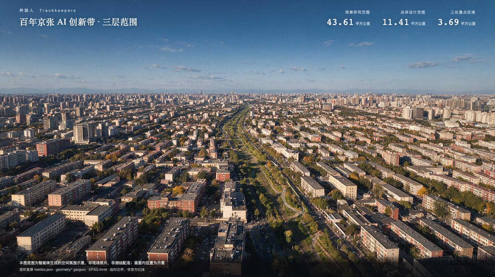
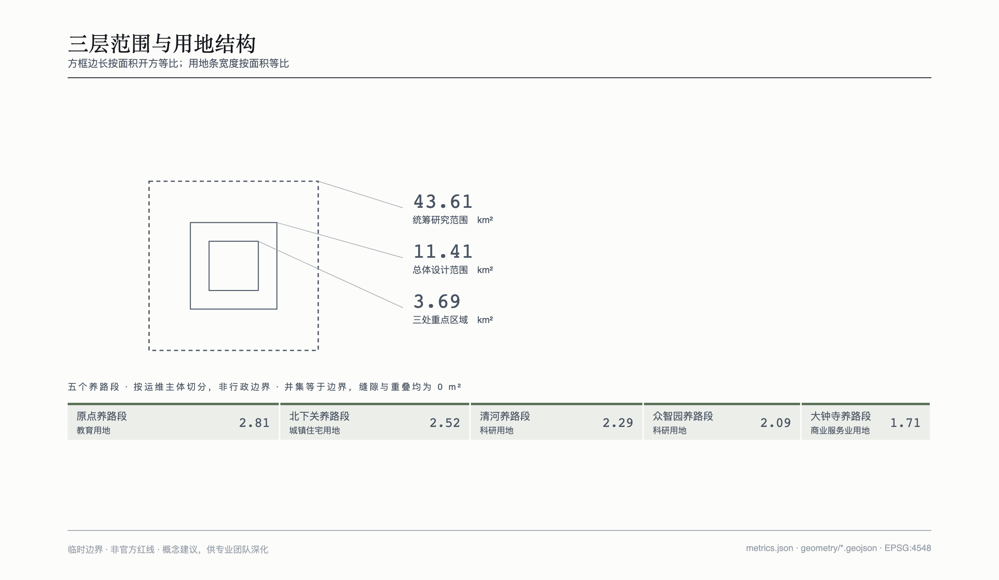
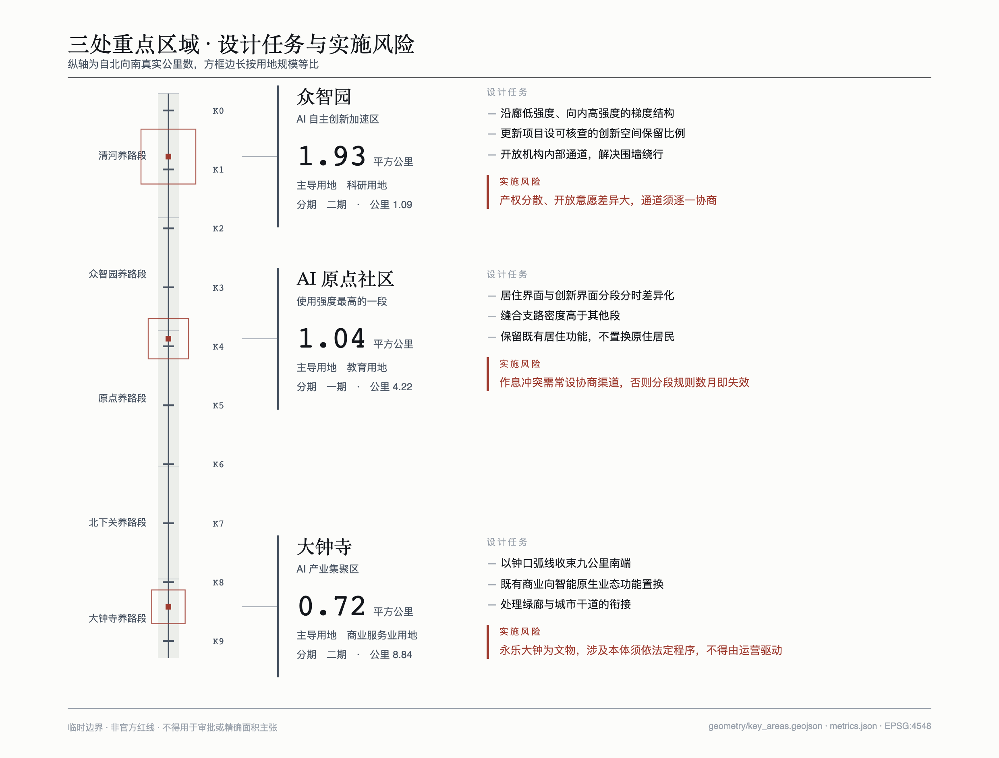
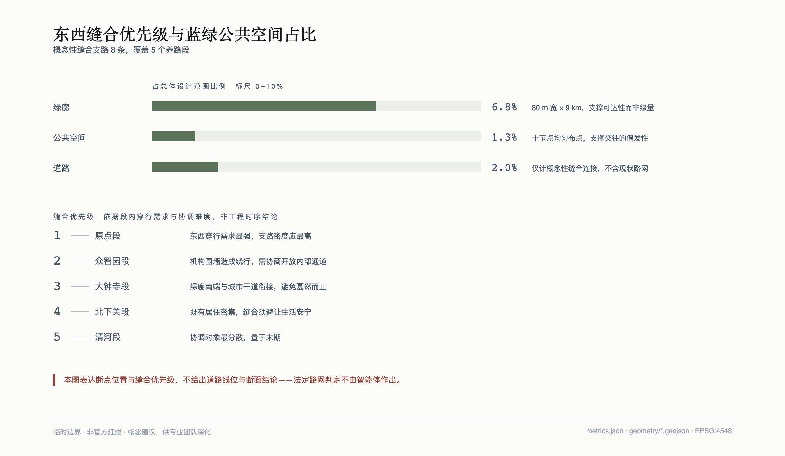
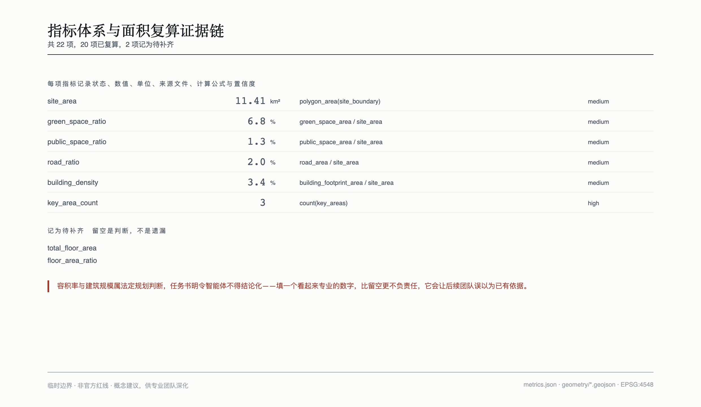

# Trackkeepers · Maintenance-Oriented Urban Design for the Centennial Jing-Zhang AI Innovation Belt

The difference between a corridor that has been built and a corridor that is alive is not the ribbon-cutting day. It is whether anyone tends it on every day that follows. Every judgement in this proposal follows from that.

## Design Basis and Source Inventory

The basis of this proposal has three layers. The first is the official announcement and the agent-facing taskbook, which set the three-level scope, the three positionings, the five functions, the Three Zones and Two Wings layout, and six mandatory tasks [source:OFFICIAL-ANNOUNCEMENT] [source:AGENT-TASKBOOK]. The second is the site package supplied by the repository, containing provisional boundary geometry, land-use code enumerations, the standards list and the source registry [source:SITE-PACKAGE] [source:SOURCE-REGISTRY]. The third consists of public materials retrieved to answer specific questions, used mainly for global case references and registered item by item.

One thing must be stated first: **every spatial boundary used in this proposal is provisional, and not one derives from an official red line.** All six boundary features in the site package are marked as non-official with coarse precision [data:geometry/site_boundary.geojson#SITE-001]. Our independent recomputation agrees with the announced figures — a Coordinated Research Area of 43.61 square kilometres, an Overall Design Area of 11.41 square kilometres, and three key areas totalling about 369 hectares against the announced 368.4 hectares [metric:site_area]. The agreement indicates the geometry was fitted backwards from the announced extents and is credible in magnitude; the 0.6-hectare discrepancy indicates it is a fit rather than the original drawing. All areas, ratios and derived indicators therefore carry systematic uncertainty and must not be used for approval or precise area claims [source:BOUNDARY-SOURCE].

Three disciplines govern how sources are used here. **First, leave a value empty rather than invent one.** Floor area ratio, building scale, building height, retain-renovate-demolish decisions, road red lines and development sequencing are all statutory planning judgements that the taskbook forbids an agent to conclude. These indicators are recorded as unknown with a stated reason rather than filled with a number that merely looks professional [depth:development_intensity_controls]. **Second, weaken the wording rather than inflate the source.** Some case figures rest on a single or second-hand source; the text always names the source and uses qualified phrasing. The frequently quoted economic projections for the Toronto project are excluded entirely, because the project was terminated and the figures were the proponent's own forecast. **Third, take the most conservative reading when sources conflict.** Authoritative accounts disagree on the exact opening date and ceremony location of the Jing-Zhang Railway in 1909, so this proposal states only the year.

What is still missing is stated here as well: official precise boundaries, current regulatory planning indicators, existing buildings and tenure, municipal pipelines, road red lines and rail alignments have not been obtained. Each gap is registered together with the layers and indicators that must be recomputed once the data arrives.

## Three-Level Scope Framework

The three levels are not three resolutions of the same task. They are three different kinds of work.

The **Coordinated Research Area of about 43.61 square kilometres** asks what role this corridor plays in the regional innovation structure; its outputs are strategies and mechanisms, not parcel-level decisions. The **Overall Design Area of about 11.41 square kilometres** — the one-to-two-kilometre band on either side of the heritage park — addresses spatial structure, land-use organisation, the public space network and east-west stitching, at the urban design depth of regulatory detailed planning [metric:site_area] [standard:MOHURD-CONTROL-DETAILED-PLANNING]. The **three key areas totalling about 369 hectares** carry implementable detailed design at the depth of an integrated planning implementation plan [metric:key_area_count].

The logic connecting the levels is this: industrial strategy determines what kind of public life the corridor needs; public life determines spatial structure and land-use organisation; spatial structure determines what each of the three key areas must carry [depth:three_level_scope_framework].

**The limits on provisional boundaries must be stated up front.** The boundaries used here come from the repository site package, are coarse polygons fitted to the announced extents, and serve only to establish indicator conventions and relative relationships. They are not official red lines, not for approval, and not for precise area claims [data:geometry/constraints.geojson#CS-001]. Once official polygons are published, the following must be recomputed: the coordinates and areas of all nine geometry layers, the seventeen of twenty-two indicators derived from geometry, the areas of the three key areas and the phasing aggregation, and every argument resting on area proportions. Each indicator records its formula and source files, so the whole set can be recomputed after a boundary replacement [metric:green_space_ratio].

In drawings, provisional boundaries appear only as dashed lines and pale constraints, never as principal compositional elements — the boundary is a rectangular fit, and drawing it as a solid red line would mislead the reader.

## Coordinated Research Area: Industry and Future City Study

### Overall Concept: From Event to State

The history of this corridor can be told in three acts.

**1909 — affordable to build.** The Jing-Zhang Railway was the first trunk line designed and built by Chinese engineers, with Zhan Tianyou as chief engineer, using a zigzag alignment to shorten the Badaling tunnel and completing two years ahead of schedule. What it broke was the claim of the day that Chinese engineers could not build their own railway. The keyword is autonomy. Tsinghua Yuan Station was a third-class station added after opening rather than one of the original stations, and the cultural narrative should not confuse the two.

**1994 — able to connect.** A 64K international line at the Chinese Academy of Sciences Computer Network Information Center brought China onto the international internet, a few hundred metres from the heritage park. The same ground reached the world a second time: first by building, then by connecting.

**2026 — able to be sustained.** The first two acts asked whether connection was possible. The third asks something else. Nine kilometres cross several sub-district jurisdictions with fragmented ownership on both sides. Who waters the planting, who replaces the lamps, who pays when something breaks, who reads the data — none of these has a ribbon-cutting, yet together they decide what the corridor looks like in ten years.

**The first two acts are events; the third is a state.** That inversion is the argument of this proposal. The chronic failure of urban renewal is precisely that everything is treated as an event to be celebrated, after which no one is responsible.

### Naming System

The principal name is **Trackkeepers**. Trackkeepers were a real occupation on the Jing-Zhang Railway, walking the line, tightening bolts and replacing sleepers. This proposal redefines the term: a century ago a trackkeeper was a worker tightening bolts along the line; a century later a trackkeeper is anyone — and any agent — that keeps the corridor running.

The system has four layers plus a set of occupations. **Maintenance Segments** are the responsibility districts, divided by maintenance operator rather than administrative boundary, five from north to south. **Mileposts K0 to K9** form the node system, using the real notation of railway mileposts, matching the roughly nine-kilometre length; each is a scenario anchor and a legible location code. **The Spike Wall** is the honours system, where a contributor or an agent is recorded by driving in one spike — continually extended rather than completed once. **Seven occupations** correspond to agent functions: patrol for daily inspection, flaw detection for latent-defect prediction, lookout for risk warning, switching for resource allocation, braking for safety limits, dispatch for multi-party coordination, and bell-keeping for rhythmic reference.

The four layers support one another and extend without limit: a new node is a new K number, a new contributor is another spike, a new agent function is another occupation. The brand asset does not depend on the success of any single event [standard:PROJECT-AGENT-OPEN-CALL-TASKBOOK].

**The origin of bell-keeping requires explanation.** Six occupations come from the railway; only bell-keeping comes from a bell — and the key area it corresponds to is likewise only Dazhongsi. The Yongle Bell was cast in the Ming Yongle era and moved into Jueshengsi Temple in the Qing period, after which the temple became known as Dazhongsi, the Great Bell Temple. The proper work of a bell is to keep time, which here becomes the rhythmic reference of the innovation belt. This asymmetry has a documented origin. To be clear, the Ming element enters only through the Dazhongsi area and is not used for belt-wide naming: grafting Ming officialdom onto a late-Qing railway would distort historical fact.

### Visual Identity Direction

The core symbol is **the cross-section of a rail spike seen from above after it has been driven into the sleeper**: a solid square head, four short lines radiating outward to express the spread of force, and two concentric squares suggesting compressed wood grain. Three reasons for this form: the geometry is minimal and remains legible at sixteen pixels once the grain is dropped; it expresses the act of fastening rather than the object of a nail; and it echoes a documented fact — on 12 December 1905, at the start of track laying, Zhan Tianyou drove the first spike himself.

The numerals K0 to K9 are **constructed from straight lines and quarter-circle arcs on a module derived from the spike head, using no existing typeface**. This is the most practical decision in the identity: it eliminates font licensing risk, which most proposals incur by reaching for a commercial typeface as their wordmark.

As the taskbook requires, **the cultural identity system and the overall identity system must remain separate**; one symbol cannot serve every purpose. The cultural identity takes the six-bolt array of a rail fishplate, used for heritage wayfinding, historical nodes and artefact interpretation panels; the overall identity serves branding, events, digital interfaces and node numbering. Their geometric languages do not overlap: the overall identity uses only right angles and squares, the cultural identity only circles and arcs. The bell-mouth arc at Dazhongsi is the single curved element in the cultural system and the only visual outlet for the Ming thread.

**The risk of formal collision with an existing trademark cannot be excluded.** We have no trademark search capability, so this section delivers an identity direction rather than a final mark; a professional trademark search must precede any implementation [source:AGENT-TASKBOOK].

### Five Global Cases, Chosen for Evidentiary Value Rather Than Fame

The selection criterion is whether a case says something about who maintains a place after completion. Three of the five carry an explicit failure or cost.

**Quayside, Toronto** (negative · governance failure). A smart community project between an Alphabet subsidiary and the waterfront authority. The original proposal covered as much as 190 acres before the board voted the scope back to 4.8 hectares. In October 2019 the proponent agreed to abandon its urban data trust proposal and to comply with existing law. In May 2020 the project was terminated, publicly attributed to economic uncertainty. Multiple accounts identify the deeper cause as a crisis of public trust over data collection and use boundaries; a citizens' group formed specifically to oppose the project [source:CASE-QUAYSIDE] [source:CASE-QUAYSIDE-TERMS]. **The lesson: the fatal risk in a smart city project is not technical feasibility but public authorisation for data governance. Once boundaries are seen as set unilaterally by a company, the project loses its social licence before it obtains any technical result.**

**DECODE and Decidim, Barcelona** (positive · data sovereignty). Decidim is an open-source participatory platform developed by the city council under an AGPL licence with publicly reusable code. DECODE was an EU pilot programme; one Barcelona pilot integrated its modules into Decidim so that residents could sign petitions anonymously while still satisfying residency verification, and another had residents collect noise and pollution data with environmental sensors and share it under their own encrypted terms [source:CASE-DECODE] [source:CASE-DECIDIM]. **The lesson: data utility and privacy protection are not zero-sum. Separating verification from identity can preserve validity without identifying individuals. What matters is writing the boundary into the technical architecture rather than into a promise.**

**The High Line, New York** (positive · maintenance funding, with an explicit cost). An elevated freight line built in the 1930s and closed in 1980; in 1999 neighbourhood residents founded the non-profit Friends of the High Line. The park is city property, but under a licence agreement the organisation carries daily maintenance and the great majority of the operating budget. Public reporting puts annual operating costs in the tens of millions of dollars, most of it borne by donations, corporate partnerships and earned income, with philanthropy accounting for over half [source:CASE-HIGHLINE]. The counter-case is the Lowline in the same city, which stalled because no public funding commitment was made and expected local value uplift was insufficient. **The lesson: the real difficulty in converting a disused railway into public space arrives after completion. The High Line's answer was to hand both maintenance responsibility and fundraising capacity to a standing organisation with local roots, rather than to a handover checklist. But the model depends heavily on local wealth density and philanthropic culture and cannot be transplanted directly.**

**Kendall Square, Cambridge** (positive · fixing an ecosystem through rules). A federal research centre established in the 1960s closed five years later under budget cuts, leaving large vacancies; a university and the city subsequently worked together on renewal. In May 2016 the planning board unanimously approved the relevant special permit covering six new buildings with open space and retail. **That approval followed roughly six years of regulatory process and hundreds of public hearings and community meetings.** According to the university's alumni publication, the plan required five per cent of floor area in all projects to be set aside as innovation space [source:CASE-KENDALL] [source:CASE-KENDALL-5PCT]. **The lesson: an innovation ecosystem cannot be sustained by investment-promotion aspirations. Writing "keep space for small teams" into the permit as a condition frees the ecosystem from the intentions of any particular administration. But six years of approval and hundreds of hearings show how expensive establishing such a rule can be.**

**Sewoon Sangga, Seoul** (positive · retaining existing industry, with an explicit cost). Eight connected buildings completed in 1966 began declining in the late 1970s; low rents in a central location gradually attracted light manufacturing and repair trades. Local open data indicate that about three-quarters of businesses saw declining sales between 2010 and 2015. Successive mayors had considered wholesale demolition, which existing tenants and surrounding communities opposed. In 2014 the city turned to inclusive regeneration around three pillars — improving walkability, reviving innovative manufacturing and empowering the community — repairing parts of the buildings and reconnecting a pedestrian deck that had earlier been removed [source:CASE-SEWOON]. **The lesson: existing industries and existing users are assets rather than obstacles. The decisive choice was not to clear and restart, but to keep the small manufacturing and repair economy in place and connect it to new public space. The cost is a long process and high coordination effort.**

**In four of the five cases, success or failure turned on organisational and financial arrangements after completion rather than on the design itself.** That is the direct warrant for bringing maintenance forward into the design stage.

### The Coordination Loop of Three Positionings, Five Functions and Three Zones with Two Wings

The three positionings — the Centennial Jing-Zhang Cultural Belt, the Urban AI Life Experience Belt and the AI Integrated Innovation Belt — are not three parallel themes here but three stages of one loop. The cultural belt supplies the **reason** the corridor deserves continued care; the life experience belt supplies **daily use**; the innovation belt supplies the **technical and industrial capacity that sustains maintenance**. Remove any one and the others degrade: culture without use becomes a monument; use without industry leaves maintenance costs unfunded; industry without culture loses the public willingness to pay for it.

The spatial division of the three zones and two wings follows. **Zhongzhiyuan carries the spatial provision for the independent innovation system**, the source of technical capacity. **The Beijing AI Origin Community carries talent and daily life**, the most intensively used segment and the choice for phase one. **Dazhongsi carries AI-native consumption and cultural closure**, the southern outlet of the corridor. **The Zhongguancun Technology Services Wing** provides enterprise services and factor support; **the Xiaoyue River Scenario Enablement Wing** carries technical validation that is bounded, registered and terminable — diverting testing off the spine is what allows the spine to remain stable daily public life [standard:PROJECT-OFFICIAL-ANNOUNCEMENT].

On factor support: for land and space the key is a verifiable space-reservation rule rather than an investment target, following the Kendall Square precedent; for scenarios the key is registration with termination conditions, set out below; for data the key is layered boundaries, set out under user personas. Capital, talent and computing factors are to be sought through existing public policy channels; this proposal makes no commitment and predicts no outcome.

## Overall Design Area: Urban Renewal and Urban Design at Regulatory Planning Depth

### Spatial Structure: One Spine, Five Segments, Ten Nodes, Two Wings

Within about 11.41 square kilometres the spatial structure has four layers [metric:site_area] [depth:overall_spatial_structure].

**One spine** is the nine-kilometre continuous green corridor — the heritage park itself — about eighty metres wide, 0.78 square kilometres, or 6.8 per cent of the Overall Design Area [metric:green_space_ratio] [data:geometry/green_space.geojson#GS-001]. It is the only element running the full length, and therefore carries north-south continuity.

**Five segments** are the Maintenance Segments, the most consequential structural choice in this proposal: **they are divided by maintenance operator, not by administrative boundary.** From north to south they are Qinghe, Zhongzhiyuan, Origin, Beixiaguan and Dazhongsi. The reasoning is practical. An administrative boundary is a boundary of governance, not of maintenance work. Planting crews, lighting maintenance routes and irrigation zones do not coincide with sub-district jurisdictions. Assign responsibility by administrative boundary and duplicated work orders and responsibility vacuums appear at every junction; assign it by maintenance operator and the boundary aligns with the actual working unit [data:geometry/land_use.geojson#LU-001].

**Ten nodes** are Mileposts K0 to K9, evenly spaced along the corridor, together 0.14 square kilometres or 1.3 per cent [metric:public_space_ratio]. Each node is simultaneously a scenario anchor, a location code and a wayfinding point.

**Two wings** connect west to Zhongguancun technology services and east to Xiaoyue River scenario validation, linked to the spine by stitching branch roads.

### Land-Use Organisation

The land-use layout is a complete partition of the Overall Design Area: the five segments sum exactly to the boundary, with zero gap and zero overlap [depth:land_use_layout] [standard:MNR-LAND-USE-CLASSIFICATION-GUIDE]. Dominant uses by segment are research at 4.37 square kilometres (Qinghe and Zhongzhiyuan), education at 2.81 (Origin), urban residential at 2.52 (Beixiaguan) and commercial services at 1.71 (Dazhongsi) [metric:land_use_area_0802_科研用地].

This is not an idealised even distribution of functions but an acknowledgement of what exists: research institutions cluster in the north, universities in the middle, existing housing and commerce in the south. **Urban renewal begins from an existing fabric, not a blank canvas** — the most direct lesson from the Sewoon Sangga case.

Land-use codes are taken from the repository enumeration rather than invented. Land-use boundaries here are a conceptual partition used to establish indicator conventions and relative relationships, and do not constitute a planning conclusion on the use of any specific parcel.

### Overall Urban Renewal Framework

The framework addresses three classes of object. **The green corridor itself**, where the question is not whether to build but what maintenance standard applies and who is responsible. **East-west discontinuities**, since a linear space inevitably severs lateral movement; stitching branch roads restore it, with eight placed conceptually, giving a road area of 0.23 square kilometres or 2.0 per cent [metric:road_ratio]. That is far below the fifteen to twenty-five per cent typical of built-up areas, because this proposal expresses only conceptual lateral connections and does not cover the existing network — **an agent should not conclude road alignments, so the limited scope is deliberate rather than an omission** [depth:traffic_rail_slow_parking]. **Existing districts on both sides**, where the principle is stitching rather than clearance.

Building footprint area is 0.39 square kilometres, a coverage of 3.4 per cent [metric:building_density]. This is a design quantity recomputed from conceptual renewal parcels, a low-confidence conceptual suggestion, and **not equivalent to any statutory control value**.

### Matters That Must Be Recorded as Pending

Under the taskbook boundary clause, this proposal draws no conclusions on: total building scale and floor area ratio, building height, parcel-level retain-renovate-demolish classification, road red lines and cross-sections, rail alignments, municipal pipeline capacity, investment estimates and development sequencing. The corresponding indicators are recorded as pending with a stated reason [depth:development_intensity_controls].

This is not evasion. **Supplying a professional-looking number in the absence of official regulatory conditions is less responsible than leaving it empty** — it would lead subsequent professional teams to believe a basis already exists.

## Key-Area Detailed Design

The three key areas measure 1.93, 1.04 and 0.72 square kilometres, together about 369 hectares [metric:key_area_count] [depth:three_key_area_detailed_design]. All three polygons are provisional, so the conclusions below can only be directional design.

### Zhongzhiyuan AI Independent Innovation Acceleration Area

**Positioning**: spatial provision for the full-stack independent innovation system and the source of the corridor's technical capacity. At 1.93 square kilometres it is the largest of the three [data:geometry/key_areas.geojson#PROV-KEY-001].

**Spatial structure**: research uses dominate, extending along the west side of the corridor and linked to the spine by two stitching branch roads. Internally a gradient of lower intensity along the corridor and higher intensity inland is suggested, keeping the corridor-facing edge open and permeable.

**Building renewal**: existing research buildings should mainly be adapted rather than replaced. Following the Kendall Square precedent, renewal projects should carry a **verifiable innovation-space reservation ratio** — turning space for small teams into a condition rather than an aspiration. The specific ratio must follow current policy and local conditions; this proposal specifies no figure.

**Movement**: the priority is the detour caused by institutional walls. Opening selected internal routes at renewal opportunities would allow permeation from the spine into institutional grounds.

**Public space**: nodes K1 and K2 fall in this segment and should support informal exchange — outdoor seating, shelter and power for those still working late or at weekends.

**AI scenarios**: this segment is one of the principal areas for registered technical testing, together with the Xiaoyue River wing.

**Implementation risk**: fragmented institutional ownership and uneven willingness to open mean route opening must be negotiated case by case, at high coordination cost. This segment is assigned to phase two.

### Beijing AI Origin Community

**Positioning**: the core of talent and daily life and the most intensively used segment. At 1.04 square kilometres, education is the dominant use [data:geometry/key_areas.geojson#PROV-KEY-002].

**Spatial structure**: located in the university district, this segment is where the corridor overlaps campus life. Nodes K3 and K4 are the focus; K3 also hosts the Spike Wall, near the former Tsinghua Yuan Station.

**Building renewal**: the objects are campus fringes and ageing housing, with the principle of retaining existing residential function and not displacing existing residents in the name of attracting talent.

**Movement**: east-west crossing demand is highest here, so stitching branch road density should exceed other segments.

**Public space**: the central conflict here is one of daily rhythm — long-term residents need quiet and low light at night, while settlers in transit need space usable late. The answer is not compromise but **differentiation by segment and by time**: residential edges reduce illuminance and quiet earlier, innovation edges retain night lighting and usable seating, with planting and level change between them [depth:blue_green_public_space].

**AI scenarios**: segmented lighting rhythm, slow-mobility discontinuity notices and the Spike Wall honours display all land here.

**Implementation risk**: reconciling rhythms depends on continuing dialogue rather than one-off design; without a standing consultation channel any segmentation rule will lapse within months. **This segment is phase one**, at 2.81 square kilometres, because it combines the highest use intensity with the clearest responsible party [metric:phasing_area_一期].

### Dazhongsi AI Industry Cluster

**Positioning**: AI-native consumption and cultural closure, the southern outlet of the corridor. At 0.72 square kilometres it is the smallest of the three, with commercial services dominant [data:geometry/key_areas.geojson#PROV-KEY-003].

**Spatial structure**: node K9 and the Bell Mouth plaza form the closure. The spatial motif is the bell-mouth arc of the Yongle Bell, the only area in the proposal that uses curves.

**Building renewal**: existing commercial facilities shift mainly by function substitution toward AI-native formats. Format change is market behaviour; this proposal offers spatial conditions only and makes no investment-promotion commitment.

**Movement**: as the southern end of the corridor, the junction with the arterial network must be handled so that the corridor does not simply stop.

**Public space**: the Bell Mouth plaza carries cultural closure and connects to the existing annual programme of the Ancient Bell Museum, **without inventing a new festival**.

**Implementation risk and heritage boundary**: the Yongle Bell is a protected artefact, and anything touching the artefact itself must follow statutory heritage procedures and must not be driven by operational demand. This proposal draws no engineering conclusion regarding the artefact. This segment is assigned to phase two.

## AI Innovation Ecosystem, Personas and AI+ Scenarios

### Five Kinds of Trackkeeper, Segmented by Responsibility Time Scale

Personas are usually segmented demographically — age, income, occupation. This proposal segments by **time scale of responsibility toward the corridor**, because that axis explains conflicts of interest and demography does not [depth:existing_conditions_diagnosis].

**P1 Residents on the Segment (ten years and beyond).** Long-term residents of existing communities on either side of the heritage park. They do not use the corridor; they live inside it. Their concerns are night-time light spill, irrigation flooding, crossing routes severed by hoarding, and planting maintenance quality. They **generate almost no personal data** and are only passively affected by environmental data. The main risk is being treated as background in a narrative written for talent. Automated adjustments affecting residential hours require confirmation through the sub-district or residents' committee.

**P2 Maintenance Crews (by day, by shift).** Sub-district municipal offices, property planting teams, lighting maintenance crews. **The actual daily custodians of the corridor, and the most consistently overlooked role.** Their concerns are whether faults can be foreseen, how cross-segment responsibility is divided, and whether work orders are duplicated. What they generate are inspection records, work-order flows and equipment states — **asset data, not data about people**.

There is a deliberately unconventional boundary here: **no collection of crew location, duration rankings or efficiency profiles.** Most smart-maintenance schemes do exactly this. We do not, first because the taskbook prohibits excessive monitoring, and second for a more practical reason — **a crew under surveillance will not cooperate, and the system will be abandoned within three years.** This boundary is a judgement about sustainability, not a moral posture.

**P3 Settlers in Transit (one to three years).** Researchers, engineers and start-up teams; the most mobile group, who may put down roots or may leave. Their concerns are commuting routes, informal meeting places, space usable late at night, and whether technical testing is possible in public space. They are the only group both able and willing to contribute data actively, but only with explicit consent and a right of withdrawal.

**P4 Passers-through (once, or occasionally).** Commuters crossing, weekend cyclists, visitors to cultural nodes. They owe the corridor no long-term obligation. Their data boundary is hard: **anonymous aggregation only, no individual identification, no facial recognition, no cross-point trajectory stitching.** Functions requiring individual identification are not given a review process; they are simply not implemented.

**P5 Patrolling Agents (continuous, daily).** The agents of the seven occupations. Their concerns are whether inputs are trustworthy, whether judgements are traceable, and who bears responsibility for error. **Listing agents as stakeholders rather than tools is a direct response to the premise of this open call.**

**Four conflicts must be answered by the spatial and temporal proposals**: P1 needing quiet against P3 needing late-night usability; P4's transit efficiency against P1's residential calm on peak-hour crossing routes; P3's testing demands against P2's maintenance burden and P1's disturbance; P5's continuous automation against P2's working autonomy. The real problem of urban design is reconciling these, not wishing them away.

**Data boundaries are layered by persona**: P1 generates no personal data, P2 faces assets rather than people, P3 contributes only with explicit consent, P4 is aggregated anonymously only, P5 is traceable throughout. That layering is itself the privacy and human-review boundary of this proposal [depth:municipal_new_infrastructure].

### Ten Scenario Cards

Each card carries users, spatial location, operating data, public value, risk and human review. For readability only the most critical risk is listed here; full content is in the structured files.

**1 · Segmented lighting rhythm** (P1, P4, P5; along segment interfaces; operated by sub-district municipal offices and lighting crews). Nine kilometres cross residential, university and commercial segments whose night-time needs are opposite. A patrol agent adjusts intensity and switching sequence by segment rule. Inputs are luminaire state, segment schedule rules, ambient illuminance and sub-district confirmations. The public value is meeting both rest and late-work needs with one rule set instead of a single line-wide switch. **Most critical risk: sacrificing night-time walking safety to save energy.** Human review: residential-segment timing and brightness changes require sub-district or residents' committee confirmation; adjustments are traceable and objections are recorded.

**2 · Irrigation window avoidance** (P1, P2, P5; the green corridor; operated by property planting teams). Irrigating during commuting hours causes standing water and conflict. Soil moisture and segment flow intensity together place the watering window in low-disturbance periods. **Most critical risk: sensor drift causing over- or under-irrigation.** Human review: schedule changes are confirmed by the planting crew, and flow intensity is used only as anonymous aggregate.

**3 · Defect assignment and rejection** (P2, P5; segment junctions; operated jointly by segment maintenance parties). The same defect is easily duplicated or left unclaimed. Flaw-detection and dispatch agents generate suggested work orders from the responsibility boundary table, and crews may reject them directly. **Most critical risk: automated assignment becoming a crew assessment tool by another name.** Human review: every suggested order can be rejected with a recorded reason, and **system output must not constitute an assessment basis for individual workers**.

**4 · Plant inspection and adoption** (P1, P2, P5; corridor planting; operated by planting teams with resident adoption). Tagging establishes a plant ledger, growth changes are recorded, and residents can adopt plants and receive care reminders. **Most critical risk: adoption records linked to home addresses leaking privacy.** Human review: adoption records retain contact details only, can be cancelled at any time, and are never linked to address or identity.

**5 · Slow-mobility discontinuity notice** (P1, P4, P5; discontinuities and nodes; operated by municipal authorities and node managers). Hoarding and temporary closures break the network while information lags. A lookout agent gathers closure information and posts detours at nodes. **Most critical risk: detour advice ignoring accessibility needs.** Human review: **accessible detour routes require human review and must not be decided by automated routing alone.**

**6 · Public-space technical test registration** (P2, P3, P5; registrable test segments; operated by site managers and sub-districts). Universities and start-ups need to test in real public space but have no application route. Registration establishes period, extent, impact and termination conditions. **Most critical risk: treating public space as a free laboratory.** Human review: registration is confirmed by the site manager and sub-district; during testing any party may halt work under the termination conditions, with the halt recorded.

**7 · Heritage node interpretation** (P1, P3, P4; cultural nodes; operated by cultural and heritage authorities). Historical information is scattered and partly contradictory. Human-curated, traceable text supports layered interpretation that marks what is disputed. **Most critical risk: factual error or repeated misinformation.** Human review: all interpretive text passes cultural, copyright and fact-checking review; **disputed content must be marked visibly and must not be completed by a model.**

**8 · Milepost wayfinding** (P1, P4, P5; nodes K0–K9; operated by segment maintenance parties). Without a shared reference, reporting a fault or asking for help is hard to locate. K0 to K9 provide a unified location code serving both wayfinding and fault reporting. **Most critical risk: damaged markers left unreplaced for long periods.** Human review: content and accessibility labelling are reviewed jointly by maintenance staff and representatives of disabled users.

**9 · Open maintenance data** (all five; the K0 marker and online; operated by a coordinating body). Maintenance status is normally invisible, leaving residents unable to judge whether the corridor is being cared for. Facility integrity rates, work-order response and energy use are published as periodic aggregates. **Most critical risk: indicators used to rank and pressure frontline crews.** Human review: publication conventions and the indicator set are agreed in advance and released as a whole; **selective disclosure is not permitted.**

**10 · Agent action logging** (all five; no ground footprint; operated by a coordinating body). The seven occupations generate executable actions. Every action must bind to a responsible human role and retain inputs, reasoning basis and confidence. **Most critical risk: logs recording outcomes but not reasoning.** Human review: every executable action must trace to a specific human role; log retention and access rights are published, and logs must not contain personal identity information.

### Three Industrial Test and Validation Scenarios

What separates a test scenario from an application scenario is that **a test scenario must have a failure criterion**. All three below carry a validation question, success and failure criteria and termination conditions, and none specifies a vendor.

**Segmented lighting rhythm validation.** Location: one segment between K4 and K5 spanning adjacent residential and innovation interfaces. Duration: one heating season and one summer, to avoid sampling a single season. **Question**: can differentiated lighting meet two opposing needs without reducing perceived night-time safety? **Measures**: illuminance deviation, before-and-after resident disturbance survey, night-time safety perception scores, segment energy use, night-time fault and complaint counts. **Success**: disturbance falls, safety scores do not, and energy use falls measurably. **Failure**: safety perception scores fall, or safety complaints appear that relate to the illuminance change. **Termination**: any illuminance-related safety incident restores the original settings immediately.

**Cross-segment work-order attribution validation.** Location: the junction band between two adjacent Maintenance Segments. Duration: three consecutive months covering one seasonal maintenance cycle. **Question**: can suggested orders generated from the responsibility boundary table reduce duplication and responsibility vacuums without increasing crew burden? **Measures**: duplicate order share, dwell time of unclaimed defects, rejection rate and reason distribution, before-and-after handling time per order, boundary table correction count. **Success**: duplication and dwell time fall, handling time does not rise, and the rejection channel is genuinely used. **Failure**: **a rejection rate approaching zero** — which would show the rejection channel exists in name only. **Termination**: if crews report increased burden and review confirms it, revert to the previous process.

**Anonymous aggregation granularity validation.** Location: node K7 alone. Duration: six weeks including a two-week baseline. **Question**: subject to non-reidentifiability, what is the finest spatial and temporal granularity of aggregated flow data that remains useful for maintenance scheduling? **Measures**: reidentification risk assessment at each granularity, information gain for scheduling decisions, aggregation conventions and minimum sample thresholds. **Success**: a granularity that passes both the risk assessment and the usefulness test, with publishable conventions. **Failure**: no granularity meeting decision needs passes reidentification risk assessment — **in which case the conclusion is that the data should not be collected.** **Termination**: failure of risk assessment stops collection and deletes data already gathered.

**The third deliberately permits itself to conclude that something should not be done, and a negative result carries the same standing as a positive one and must be recorded faithfully.** A validation with only a success path is not a validation.

### Xiaoyue River Scenario Enablement Wing

The wing is the principal space for registrable test segments, dividing work with the spine: the spine carries daily maintenance and public life, the wing carries bounded, registered and terminable technical validation. A public experience route runs east from node K2, with registration notice boards along it publishing the period, extent and termination conditions of current tests. **The public can observe without entering the test area, so that residents are never made involuntary test subjects.**

To be explicit: hosting technical validation does not lower the standard of rights for residents of that area. P1's data boundaries and human-review requirements apply equally in the wing.

## Land Use, Building Scale and Retain-Renovate-Demolish

Land-use layout and dominant functions are set out above; this section adds scale and the treatment of retain-renovate-demolish.

**Recomputable design quantities**: building footprint area 0.39 square kilometres and coverage 3.4 per cent, recomputed from conceptual renewal parcels in a projected coordinate system [metric:building_footprint_area]. **These are low-confidence conceptual suggestions and not statutory control values.**

**Control indicators recorded as pending**: total building scale and floor area ratio are marked pending with a stated reason — current regulatory building scale indicators are unavailable, and floor area ratio is a statutory planning judgement the taskbook forbids an agent to conclude [depth:development_intensity_controls]. Building height is treated likewise, with qualitative guidance on edge continuity and view corridors replacing numerical heights [depth:height_massing_character].

**Principles rather than conclusions on retain-renovate-demolish**: this proposal identifies no disposal for any specific parcel and offers criteria only [depth:retain_renovate_demolish]. There are three. **First, existing users take priority over existing buildings.** The Sewoon Sangga experience is that the value retained lay not in the fabric but in the small manufacturing and repair economy inside it; buildings can be repaired, but a dispersed economy does not return. **Second, maintainability takes priority over formal consistency.** A renovation requiring specialist technique to maintain will probably not be maintained three years later. **Third, do not adjudicate without conditions.** Existing buildings, tenure and engineering conditions are all unavailable, so any retain-renovate-demolish decision would lack basis.

**Space provision and operating strategy**: a verifiable space-reservation rule is proposed in place of investment-promotion targets, following the Kendall Square approach. It must equally be recorded that the approach there involved roughly six years of regulatory process and hundreds of public hearings — **the benefit of fixing a rule is real, and so is its cost.**

## Transport, Rail, Municipal and Public Service Facilities

### Transport and Slow Mobility

Road area is 0.23 square kilometres, or 2.0 per cent [metric:road_ratio]. **The convention must be stated**: this covers only conceptual east-west stitching connections, not the existing network, and offers no conclusion on road alignments or cross-sections — an agent should not adjudicate the statutory network [depth:traffic_rail_slow_parking].

The core problem of slow mobility is **the tension between north-south continuity and east-west stitching**. As a linear space the corridor naturally connects north to south and naturally severs east from west. Eight stitching branch roads are placed conceptually, with spacing adjusted to segment use intensity and the highest density in the Origin segment.

Rail station integration and external transport require official alignment data before deepening; this proposal offers no alignment conclusion. The principle for parking and cycle storage is that **cycle parking must be provided for within node design**, or it will spontaneously occupy slow-mobility space — one of the most common maintenance failures in heritage park projects.

### Municipal and New Infrastructure

New infrastructure here has an explicit boundary: **it faces assets and the environment, not people.** It covers lighting state, soil moisture, facility condition, ambient illuminance and noise — and excludes facial recognition, individual counting, trajectory tracking or any other person-identifying device [depth:municipal_new_infrastructure].

The reasoning is twofold. **On compliance**, the taskbook prohibits privacy intrusion and excessive monitoring. **On effectiveness**, the Toronto case shows that once a data boundary is seen as unilaterally defined, the project loses its social licence first.

Edge computing and distributed energy should be deployed to serve maintenance needs locally rather than for display. Conventional municipal facilities should share poles and cabinets to reduce the number of ground structures — **every structure removed is one fewer object requiring long-term maintenance.**

For public services, the key to talent-oriented provision is not building new high-specification facilities but **opening existing ones at defined hours**: university canteens, sports facilities and libraries opened to the neighbourhood at set times are faster and cheaper than new equivalents, and consistent with stitching rather than building anew. This requires inter-institutional agreement and is a mechanism suggestion, not an arrangement.

## Blue-Green Space, Public Space and Urban Character

### The Jing-Zhang Heritage Park Vitality Belt

The green corridor covers 0.78 square kilometres at about eighty metres wide, 6.8 per cent of the Overall Design Area [metric:green_space_ratio] [depth:blue_green_public_space]. That width embodies a judgement: **a heritage park should not covet width.** Maintenance cost for linear green space rises with width, while use value comes mainly from length and continuity. Eighty metres accommodates a footpath, a cycle path and buffers on both sides; beyond that the marginal use value falls away quickly while the marginal maintenance cost does not.

Connections to the Qinghe and Xiaoyue watercourses are handled as nodes rather than forced hydrological continuity, since water connection involves hydraulic and municipal conditions on which this proposal draws no engineering conclusion.

### Public Space: Ten Nodes

Nodes K0 to K9 total 0.14 square kilometres, 1.3 per cent [metric:public_space_ratio]. Nodes are not meant to be large but **even and reachable**: one resting point per kilometre across nine kilometres is more useful than two or three concentrated plazas. This is reasoned backwards from user time scales — a passer-through's need to pause is unpredictable and will not justify a detour to a plaza.

Node specification is deliberately maintainable: seating, shelter, lighting, wayfinding, waste collection and cycle parking. **Nothing requiring specialist technique to maintain** — the maintainability-first principle expressed in physical terms.

### Three Pilgrimage Landmarks

**The Spike Wall**, at K3 in the Origin Maintenance Segment near the former Tsinghua Yuan Station. A long wall composed of an array of spikes, each corresponding to a contributor or an agent, where recognition takes the form of driving in one spike — **continually extended rather than completed once.** It echoes the documented first spike driven at the start of track laying in 1905. Operation is annual addition timed with open-source community activity, with the list and its basis published. **The risk is that if additions stop, the wall becomes an expired roster** — the failure mode of an honours system is not that no one comes, but that no one comes back.

**Milepost Zero**, at the northern end of the Qinghe segment. The origin point of the nine kilometres, whose marker doubles as a physical display of maintenance data, showing current segment facility integrity rates and work-order response as aggregates. **It turns an abstract maintenance condition into a fact visible in passing** — the most direct materialisation of this proposal. Data update on published conventions, synchronised with the online release. **The risk is that data left stale damages credibility more than not displaying it at all.**

**The Bell Mouth**, at K9 in the Dazhongsi segment. The southern closure of the nine kilometres, taking the bell-mouth arc of the Yongle Bell as its spatial motif. The proper work of a bell is timekeeping, translated here into the rhythmic reference of the innovation belt and the ground counterpart of the bell-keeping occupation. It connects to the existing annual programme of the Ancient Bell Museum, **without inventing a new festival**. **The Yongle Bell is a protected artefact; anything touching the artefact itself must follow statutory heritage procedures, and this proposal draws no engineering conclusion.**

All three landmarks are conceptual suggestions; actual form, location and construction depend on the organiser's selection, approval and eventual realisation. Identity, wayfinding and imagery used are original geometric constructions containing no unlicensed typefaces, images, trademarks or likenesses.

**One structural gap must be named**: the three landmarks fall under different Maintenance Segments and different authorities, and no cross-segment coordinating role exists in the current arrangement. This proposal states the gap honestly and **does not invent an administrative body to fill it.**

### Urban Character

Character control here points at an unusual target: **maintainability rather than stylistic uniformity** [depth:height_massing_character].

Conventional urban design character control governs appearance — coordinated colour, material and roof form. This proposal governs upkeep. Three criteria: **materials chosen for in-place repairability**, avoiding assemblies that must be replaced wholesale; **components standardised** so a single failure can be replaced with a stock part; and **avoidance of high-level construction requiring specialist equipment to clean or inspect.**

Building height and massing are not concluded numerically, replaced by qualitative guidance on edge continuity and view corridors. The suggested register is restrained, durable and low-maintenance, which does not conflict with the technical character of an innovation belt — **genuine technical quality comes from working well, not from novel form.**

## Renewal Project List, Implementation Policy and Phasing

### Phasing

Three phases aggregated by Maintenance Segment [depth:phasing_implementation] [data:geometry/phasing.geojson#PH-001].

**Phase one is the Origin segment, 2.81 square kilometres** [metric:phasing_area_一期]. It is chosen because it combines the highest use intensity with the clearest responsible party — without both, a demonstration segment becomes a burden segment.

**Phase two is Zhongzhiyuan and Dazhongsi, 3.80 square kilometres together** [metric:phasing_area_二期], carrying technical capacity and cultural closure respectively and able to proceed in parallel.

**Phase three is Qinghe and Beixiaguan, 4.80 square kilometres together** [metric:phasing_area_三期]. These have the most dispersed coordination partners and are placed last so that the first two phases can establish a working method for cross-segment collaboration.

Phasing is a conceptual suggestion and does not constitute a development sequencing conclusion.

### Renewal Project List

Projects fall into four classes, all conceptual suggestions [depth:renewal_project_list]. **Corridor works**: footpath and cycle path continuity, node construction, lighting and irrigation systems. **Stitching works**: conceptual east-west branch connections and negotiated opening of institutional routes. **Existing district works**: environmental improvement in ageing housing areas and spatial conditions for commercial function substitution. **Operational support works**: the Spike Wall, Milepost Zero and registration notice boards.

Implementation bodies, dependencies and policy suggestions for each class require deepening against current policy; this proposal offers no investment estimate or timing commitment.

**One mechanism suggestion drawn from the cases**: following Kendall Square, set a verifiable innovation-space reservation ratio within renewal approvals, turning space for small teams from a target into a condition. The cost must be recorded alongside — roughly six years of regulatory process and hundreds of public hearings locally.

### Long-Term Operation: Annual Event System

**The core judgement is not to invent a festival.** A new festival without a host body and sustained funding becomes a slogan, whereas existing channels already have published application rules that are verifiable and repeatable.

The annual system therefore attaches to three existing anchors. **The Zhongguancun Forum annual meeting**, held each spring with five sections covering conferences, achievement releases, technology trading, frontier competitions and supporting events, can serve as the corridor's annual release and international exchange window. **The Zhongguancun Forum's year-round series**, held outside the annual meeting and solicited publicly on a half-yearly basis, explicitly accepts applications from universities, research institutes, industry associations and industrial alliances, and can carry developer activities and scenario matching **without establishing a separate approval route** [source:EVENT-ZGC-FORUM]. **The existing annual programme of the Ancient Bell Museum**, to which cultural activity at the Bell Mouth attaches.

On that basis three rhythms are suggested. **Milepost Day**, annually, for the addition and updating of markers K0 to K9, releasing the previous year's segment maintenance data at the same time. **Patrol Week**, annually, placed in the spring or autumn maintenance window, when members of the public may register to accompany a frontline crew along one segment and see maintenance work directly. **Spike Wall Addition**, annually, timed with the open-source community rhythm.

All of the above are suggested schemes, **unconfirmed by any organiser and not constituting settled arrangements**, with no predictive commitment on outcomes.

### Developer Community Operation

**The open call this proposal participates in is itself a working sample**, and its mechanisms can be cited rather than imagined: a public taskbook, structured submission specifications, deterministic validation, human review, honours display and continuing revisits.

Transposed to the corridor, the mechanisms are: maintenance problems published as structured tasks with data conventions and acceptance criteria, open to anyone; submissions requiring recomputable evidence and source registration; format and convention checked automatically so human review addresses substance only; contributions recorded on the Spike Wall with online records matched to the physical wall; and contributors revisiting on a set rhythm to check whether their work still holds.

**The failure mode must be stated**: the principal cost of community operation lies not in the platform but in review and reply. Without sustained review capacity, open submission degrades quickly into an unanswered pile.

### AI Scenario Opening Mechanism

Opening scenarios requires clear boundaries, or opening becomes risk transfer. Five mechanisms: **registration rather than licensing**, where testing may proceed on registration but must declare period, extent, impact and termination conditions; **an obligation to publish**, with registration information posted on site and online simultaneously; **any party may halt**, so residents, maintenance parties or applicants may stop work under the termination conditions with the halt recorded; **vendor neutrality**, expressed through interfaces and data specifications with no named vendor and no exclusivity; and **failure on record**, so a negative validation result still counts as a result.

**Registration is not approval to operate, and a test scenario must not be described as approved for operation.**

### Attraction and Conversion Pathways

Events are not the objective. The taskbook forbids omitting follow-on conversion pathways for talent, enterprises and developers, so each group requires explicit steps and responsible parties from contact to retention [depth:phasing_implementation].

**Developers**: claim a published task online and submit → pass validation and review, recorded on the Spike Wall → invited to Patrol Week or a parallel forum → enter a registrable test segment for field validation → form a continuing working relationship with local maintenance parties. The first three steps rest on the open-source platform; the last two need cooperation from local site managers. Measurable indicators: share of repeat contributors, and conversions from online to on-site.

**AI talent**: encounter the corridor through public space and events → conduct technical testing in a registrable segment → results enter the open scenario catalogue → establish cooperation with local enterprises or institutions. This requires a matching mechanism among universities, enterprises and the locality. Measurable indicators: number of registered tests, and years of retention after testing.

**Enterprises**: participate in scenario validation by interface specification with no exclusivity → publish validation results as reusable public outcomes → apply for landing support through existing policy channels. Support follows existing published policy, on which this proposal makes no commitment. Measurable indicator: number and diversity of participating parties.

**A pathway alone is not enough — without a way of knowing whether it worked, it remains a slogan.**

International communication attaches to the Zhongguancun Forum's existing international channels, whose year-round series carries an established requirement on the share of overseas speakers at forum conferences, so no separate channel is needed. The English forms of the naming system are directly comprehensible, lowering the cost of cross-linguistic explanation.

**All events, investment promotion, funding, policy and operational arrangements are conceptual suggestions or directions for deepening, and do not constitute settled government arrangements.**

## Indicator System, Area Recomputation and Compliance Matrices

### Method

All indicators are recomputed in a projected coordinate system, each recording status, value, unit, source files, formula and confidence [depth:metrics_recalculation] [standard:MOHURD-CONTROL-DETAILED-PLANNING]. Of twenty-two indicators, twenty are known and two are recorded as pending.

**Topological verification is the precondition of geometric credibility**: the land-use layer is a complete partition of the Overall Design Area, the five segments sum exactly to the boundary, and gap and overlap are both zero square metres. This does not happen automatically — adjacent polygons drawn independently will produce gaps or overlaps through floating-point error. This proposal partitions with a single set of cut lines, so shared edges share coordinates by construction.

### What the Core Indicators Mean

Indicators are not a table of numbers; each corresponds to a design judgement.

**Green space ratio 6.8 per cent.** The figure looks modest because it measures an eighty-metre linear corridor rather than a district green ratio. **What it supports is reachability rather than green quantity** — nine continuous kilometres put most residents along the corridor within a few minutes' walk of continuous green space, which is far more useful than the same area concentrated [metric:green_space_ratio].

**Public space ratio 1.3 per cent.** Ten evenly distributed nodes, one resting point per kilometre. **What it supports is the incidental quality of innovative encounter** — informal exchange does not detour to a plaza; it happens where people already pass [metric:public_space_ratio].

**Building footprint 3.4 per cent.** A design quantity from conceptual renewal parcels, reflecting **the restraint of the renewal**: the value of this corridor lies in openness rather than in being filled [metric:building_density].

**Road area 2.0 per cent.** Far below the usual built-up figure because it counts only conceptual stitching connections. **The low value is itself a statement** — this proposal does not adjudicate the statutory network [metric:road_ratio].

**Key areas of 1.93, 1.04 and 0.72 square kilometres.** The descending sizes correspond to changing functional character: an acceleration area needs scale, a community needs density, a cluster needs precision [metric:key_area_count].

**Two pending indicators**: total building scale and floor area ratio. **Leaving them empty is a judgement, not an omission** — floor area ratio is a statutory planning judgement the taskbook forbids an agent to conclude, and supplying a number would itself be a breach.

### Matrix Coverage

**The compliance matrix** covers twenty-three requirements, comprising all design tasks in the announcement and the six agent tasks, each recording the corresponding proposal sections, geometry layers, indicators, drawings, display sections, sources, assumptions and self-check items. **The standard matrix** covers five mandatory standards, all with review status addressed. **The design depth matrix** covers fifteen required depth items, all with status complete.

**Nine of those depth items carry a declared limitation on completeness**, covering development intensity, height and massing, retain-renovate-demolish, transport alignments and municipal pipelines. The reasons are recorded uniformly: either official data is unavailable, or the matter is a statutory planning judgement an agent must not conclude. **Declaring a limitation is not diffidence; it states honestly which conclusions an agent should not supply.**

## Risk, Copyright and Compliance

### Source Legality and Copyright

All material derives from the official announcement, the agent-facing taskbook, the repository site package and public web pages, with no non-public material, no personal data and no named-vendor information [source:SITE-PACKAGE] [source:SOURCE-REGISTRY]. External sources are registered individually with their use boundary: factual citation and source attribution only, with no reproduction of original passages and no republication of images.

Imagery and identity are original geometric constructions using no existing typefaces, images, trademarks or likenesses. The numeral system is constructed on a module, avoiding font licensing risk. The copyright statement is provided separately in `report/copyright_statement.md`.

### Agent Generation Responsibility

This proposal is generated by an agent, with authorship and model identity declared truthfully. **Images, diagrams and text generated by an agent are an interpretive layer and must not be passed off as site photography, resident opinion, official boundaries or measured evidence.** All statements of historical fact carry sources; where sources conflict, only the conservative reading is stated.

### Pending Material and Professional Review Requirements

**Matters requiring professional teams**: full recomputation once official boundaries are published; building scale and intensity determination once regulatory conditions are supplied; retain-renovate-demolish determination after survey of existing buildings and tenure; transport deepening once road red lines and rail alignments are fixed; facility deepening once municipal capacity is verified; and **a trademark search for the identity direction**.

**An identified but unresolved mechanism gap** [depth:risk_missing_data]: no cross-segment coordinating role exists in the current arrangement. The gap affects cross-segment work-order attribution, unified publication of maintenance data, and coordinated operation of the three landmarks. This proposal states it rather than inventing a body.

### Matters on Which No Commitment Is Made

This proposal constitutes no commitment on behalf of any government body and contains no approval conclusion, implementation commitment, investment estimate, investment-promotion commitment or policy commitment. All spatial suggestions are conceptual proposals and reference schemes for professional teams to deepen. All three-level areas rest on provisional boundaries and must not be used for official red line claims or as a basis for precise areas [data:geometry/constraints.geojson#CS-001] [metric:site_area].

## References

**Beijing Municipal Commission of Planning and Natural Resources et al.** Prequalification Announcement, Centennial Jing-Zhang AI Innovation Belt Open Call for Urban Design. 2026. — The basis for the three-level scope, three positionings, five functions, Three Zones and Two Wings layout and all design tasks.

**Agent-Facing Open Call Taskbook, Centennial Jing-Zhang AI Innovation Belt.** 2026. — The basis for the six mandatory tasks, countable minimums and boundary clauses.

**Public reporting on Waterfront Toronto and Sidewalk Labs.** 2019–2020. — Used for the data governance counter-case, focusing on the abandonment of the urban data trust proposal and the termination process.

**DECODE Project pilot documentation and the Decidim open-source repository.** — Used for the data sovereignty case, focusing on the separation of verification from identity.

**Public reporting on Friends of the High Line operations and funding.** — Used for the maintenance funding case. Operating costs and funding proportions are second-hand accounts without access to annual reports, and the text is qualified accordingly.

**MIT News and alumni publications on Kendall Square.** 2015–2016. — Used for the rule-fixing case, focusing on the scale of the approval process and the innovation space requirement.

**Brookings reporting on the regeneration of Sewoon Sangga, Seoul.** — Used for the existing-industry retention case, focusing on the choice not to clear and restart, and its cost.

**Public solicitation notice for the Zhongguancun Forum year-round series.** 2026. — Used for the annual event system, evidencing the existence and rules of the application channel.

The complete machine-readable index is in `sources.json` and the three matrix files [source:OFFICIAL-ANNOUNCEMENT] [source:AGENT-TASKBOOK] [standard:PROJECT-AGENT-OPEN-CALL-TASKBOOK].
