# MoonTrack — Overall Concept and Scenario Enablement Proposal for the Centennial Jing-Zhang AI Innovation Belt

## Design Basis and Source List

This formal proposal takes as its primary basis the Prequalification Announcement for the International Open Call for Urban Design of the Centennial Jing-Zhang AI Innovation Belt, issued by the Haidian Branch of the Beijing Municipal Commission of Planning and Natural Resources. Its machine-readable basis is the maintainer-registered provisional coarse boundary, key areas, enumerations, metrics and source inventory in `brief/site-package/`. This proposal was prepared from those machine-readable files: scope and tasks from `design_brief.json` and `agent_task_requirements.csv`, permitted use of material from `source_use_matrix.csv`, and the gap list from `missing_data_checklist.csv`. Every design judgement is broken into four things — a traceable source, a recomputable metric, a checkable layer and a human-reviewable assumption — so each figure in the text can be followed back to its original material. The announcement requires urban-design depth equivalent to Regulatory Detailed Planning and to an Integrated Planning Implementation Plan, so narrative text cannot substitute for GeoJSON, metric tables, the A3 booklet, the A0 boards and the HTML presentation.

This is not a free-standing vision document; it organises its outputs from the announcement, the agent taskbook and the site package. This section places only the most load-bearing basis next to the judgement [source:OFFICIAL-ANNOUNCEMENT] [source:AGENT-TASKBOOK] [depth:existing_conditions_diagnosis]. Full source and standard coverage live in `sources.json`, `standard_matrix.json` and `design_depth_matrix.json`; the machine index is not repeated in the narrative.

The use boundaries of the source registry are as follows [source:SOURCE-REGISTRY]:

- `data/source_registry.json` records the permitted use of public, rights-cleared and provisional material.
- Current registry summary: 7 formal-usable sources, 1 background source, 1 provisional-only source.
- An agent must not promote background_only or provisional_only material into an official boundary, a statutory regulatory control, a formal scoring basis or a government implementation commitment.

`data/processed/agent_fact_pack.md` is this proposal's reading-navigation layer, not a new authority [source:PROCESSED-FACT-PACK]. It helps an agent organise the three-tier scope, the three key areas, the announcement tasks, agent.1 to agent.6, source availability and outstanding data gaps into a readable proposal; factual judgements still return to the registered primary material [source:OFFICIAL-ANNOUNCEMENT] [source:AGENT-TASKBOOK], and the complete source relationships are held in `sources.json`.


Where the official `SITE_BOUNDARY` [source:BOUNDARY-SOURCE] or the three `KEY_AREA` polygons [source:KEY-AREA-SOURCE] are not yet available, this package builds a provisional formal package from `brief/site-package/geometry/provisional_boundaries.geojson`. Both `geometry/site_boundary.geojson` and `geometry/key_areas.geojson` in the submission are marked `provisional_constraint` with `official_boundary=false`. They may be used only for proposal generation, self-check, visualisation and design discussion — never as an official redline, an approval basis, a precise-area basis or a statutory control conclusion. This organizer-side data gap does not by itself block content scoring. Once official polygons are supplied, the site boundary, key areas, land use, roads, green space, public space, buildings, phasing and metrics must all be recomputed.

Boundary interpretation returns to the overall scope layer and its area recomputation [data:geometry/site_boundary.geojson#SITE-001] [metric:site_area_sqm]. The three key areas are cross-checked against an independent layer and a count metric [data:geometry/key_areas.geojson#PROV-KEY-001] [metric:key_area_count]. A reader can therefore enter the evidence from the narrative without first reading a string of machine identifiers.

## Three-Level Scope Framework

The proposal organises its work along the three tiers set by the announcement. The Coordinated Research Area covers 43.6 sq km and addresses the AI industrial ecosystem, strategic positioning, the innovation chain and future urban form. The Overall Design Area covers 11.4 sq km of urban districts and industrial areas within one to two kilometres of the Jing-Zhang Railway Heritage Park, and calls for an urban-renewal framework, industrial spatial layout, mobility and municipal support, and Urban Character control. The Key-Area Detailed Design Area covers 368.4 ha across three detailed-design districts, and calls for defined programme, building scale, Demolish–Renovate–Retain classification, public-space connectivity and traffic organisation. All three tiers are mapped item by item in `compliance_matrix.json` so that announcement clauses 1.3, 1.4 and 1.5 and each mandatory agent.1–agent.6 task carry section, layer, metric, drawing and HTML evidence.

The depth items for the three-tier framework are governed by [depth:three_level_scope_framework] and [depth:overall_spatial_structure]. Spatial evidence rests on [data:geometry/site_boundary.geojson#SITE-001] and [data:geometry/key_areas.geojson#PROV-KEY-001], the task basis on [standard:PROJECT-OFFICIAL-ANNOUNCEMENT], and scope navigation on the three-tier table in `project_scope_summary.csv` [source:PROCESSED-FACT-PACK].

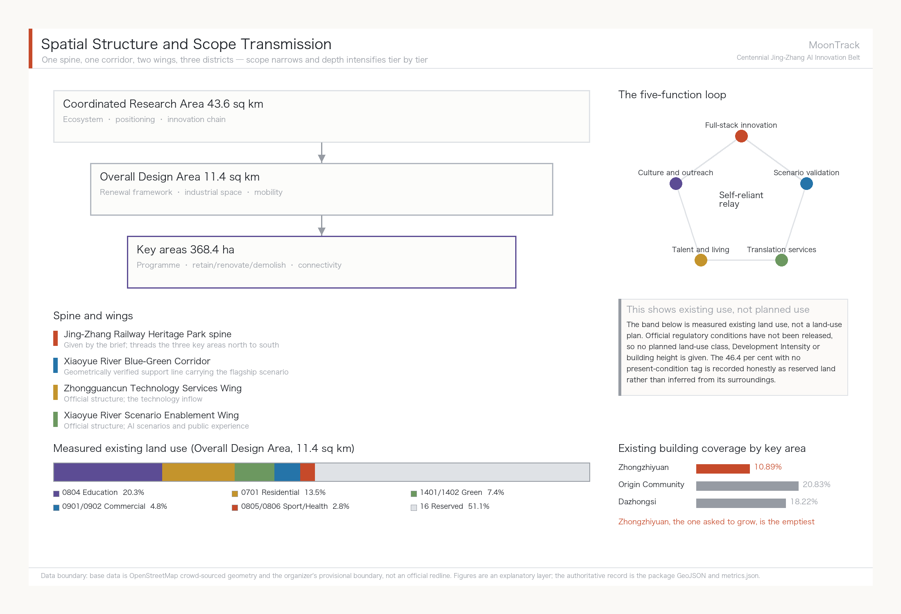

The three tiers are not three disconnected drawing sets. Coordinated research settles the industrial-chain and urban-form judgements; overall design lands those judgements in renewal projects, spatial structure and infrastructure capacity; key-area detailed design tests the deliverability of specific plots, buildings, traffic, public space and AI-Enabled Scenarios. This proposal works in that order: fix the provisional boundary and constraints this submission adopts, generate land use, buildings, roads, green space, public space, phasing and AI scenario nodes, then recompute metrics from those layers. No area, ratio, scale or project count that cannot be recomputed from structured data has been written into a formal conclusion — a rule that removed four fabricated land-use blocks and one fabricated building in this round.

The overall concept of this proposal is **"MoonTrack" (月轨)**. In 1905, when Zhan Tianyou took on the Beijing–Zhangjiakou railway, most foreign engineers held that the Chinese could not build it: no precedent, no outside help, and the continuous steep grade through the Guangou pass treated as the insurmountable obstacle. Four years later a zigzag switchback climbed that grade and the line opened as the first trunk railway that China designed, financed and built entirely on its own. A century later the official brief ranks five functions for this corridor, and the first is a full-stack self-reliant AI innovation system — which asks the same question: can we build it ourselves. The "track" in MoonTrack answers to that century-long spine of self-reliant innovation; the "moon" answers to the Xiaoyue River that actually runs through the site, and carries the association of a station platform (月台). One word holds two real elements of the place.

MoonTrack does not replace the official project name, the Centennial Jing-Zhang AI Innovation Belt. It is a concept-level sub-brand whose job is visual and communicative consistency across the officially named Three Zones and Two Wings: the Zhongzhiyuan AI Independent Innovation Acceleration Area, the Beijing AI Origin Community, the Dazhongsi AI Industry Cluster, the Zhongguancun Technology Services Wing and the Xiaoyue River Scenario Enablement Wing. Spatially the spine remains the Jing-Zhang Railway Heritage Park given by the brief, threading the three key areas from north to south; overlaid on it is one geometrically verified support line, the Xiaoyue River Blue-Green Corridor. Measurement shows that of the eight river segments making up the Xiaoyue River's 10,051 m [metric:xiaoyuehe_total_length_m], five fall inside the Overall Design Area [metric:xiaoyuehe_segments_in_design_scope] and four inside the Zhongzhiyuan key area [data:geometry/green_space.geojson#xiaoyuehe-seg-00]. The water corridor and the heritage-park spine overlap closely, so calling the Xiaoyue River and Zhongguancun wings the "two wings" of the spine has a spatial basis and is not merely a naming metaphor.

| Tier | Design question | Answer | Data anchor |
| --- | --- | --- | --- |
| Coordinated Research Area | How to organise the AI industrial ecosystem and future urban form | Establish an innovation chain of university origination, open-source collaboration, enterprise translation, public experience and international outreach | compliance_matrix.json, standard_matrix.json |
| Overall Design Area | How industrial space, urban renewal, mobility, utilities and character are drawn | Expressed jointly through the land-use, building, road, green-space, public-space and phasing layers | [data:geometry/land_use.geojson#lu-osm-277989175], [data:geometry/roads.geojson#ROAD-001] |
| Key-Area Detailed Design Area | How the three districts reach detailed-design depth | Each given a role, spatial action, AI scenario and implementation dependency | [data:geometry/key_areas.geojson#PROV-KEY-001], [data:geometry/key_areas.geojson#PROV-KEY-002], [data:geometry/key_areas.geojson#PROV-KEY-003] |

### Requirement, answer, evidence, boundary: one table to check against

Every mandatory requirement in announcement sections 1.3/1.4/1.5 and in agent.1-agent.6 of the agent-facing taskbook, mapped to what this proposal answers, the section that carries it, and the evidence file behind it. `compliance_matrix.json` is the machine-readable form of the same content; this is the version for a human reader.

The last column is the line this proposal draws around itself: **what may not be claimed for each requirement until field verification or official data arrives.** It is not a disclaimer. It decides what the narrative is allowed to say - 1.5.2.2 carries no retain-renovate-demolish classification precisely because tenure and construction-date data are unpublished, and writing one would be invention.

| Requirement | What this proposal answers | Section | Evidence | What may not be claimed before verification |
| --- | --- | --- | --- | --- |
| `1.3.1` | A five-stage innovation chain from university origination to international communication, with seven resource-guarantee mechanisms tabulated | 三层范围工作框架 | metrics.json, site_boundary.geojson | No company, institution or funding may be claimed as committed |
| `1.3.2` | Urban form defined by measured right-of-way: a network in 62 components is a form problem, not an equipment problem | 三层范围工作框架 | metrics.json, site_boundary.geojson | No development intensity, building height or road alignment may be claimed as settled |
| `1.3.3` | The flagship scenario targets Haidian's real structure of 671,000 residents aged 60+, starting at the least well-served end | 三层范围工作框架 | metrics.json, site_boundary.geojson | No talent policy or housing arrangement may be claimed as approved |
| `1.4.1` | At 43.6 km2: ecosystem and regional synergy; 5 rail stations inside the scope, Qinghe Station 3,256 m out | 三层范围工作框架 | metrics.json, site_boundary.geojson | Coordinated-research findings must not be read as implementable conclusions |
| `1.4.2` | At 11.4 km2: renewal framework and mobility; 378 measured land parcels, 1,562 measured building footprints | 三层范围工作框架 | metrics.json, site_boundary.geojson | The boundary is provisional and coarse; not a redline or precise-area basis |
| `1.4.3` | At 368.4 ha: positioning, spatial moves, AI scenarios and implementation dependencies for each of three areas | 三层范围工作框架 | metrics.json, site_boundary.geojson | Key-area boundaries are the organiser's provisional polygons; not for formal scoring or approval |
| `1.5.1.1` | Five global cases, an AI innovation ecosystem map, and the division of labour across three areas and two wings | 三层范围工作框架 | metrics.json, site_boundary.geojson | Cases are public reporting; local replicability may not be asserted from them |
| `1.5.1.2` | Future urban form stated as accessibility rather than imagery, so the conclusion is recomputable | 三层范围工作框架 | metrics.json, site_boundary.geojson | Morphology is a conceptual direction, not a regulatory conclusion |
| `1.5.2.1` | Industrial space lands on the land-use and building layers; ratios recomputed by metrics.json | 三层范围工作框架 | metrics.json, site_boundary.geojson | Programme is advisory; no industrial recruitment may be claimed as settled |
| `1.5.2.2` | No classification this round; a recomputable screening rule set is delivered instead | 三层范围工作框架 | metrics.json, site_boundary.geojson | No retain-renovate-demolish classification this round; tenure and construction-date data are unpublished |
| `1.5.2.3` | 141.7 km of cycleway measured across 62 components; utilities state boundaries only | 三层范围工作框架 | metrics.json, site_boundary.geojson | Utility, energy and flood data are unpublished; no facility standard or capacity check this round |
| `1.5.2.4` | The heritage-park spine and the Xiaoyue River blue-green corridor overlap; east-west stitching and north-south continuity | 三层范围工作框架 | metrics.json, site_boundary.geojson | No facility within the heritage perimeter may be claimed as approved by heritage authorities |
| `1.5.2.5` | Character returns to the professional standards matrix; direction without control metrics | 三层范围工作框架 | metrics.json, site_boundary.geojson | Character guidance is directional, not a building control metric |
| `1.5.3.required` | Programme, public-space connectivity and traffic organisation given for each of the three areas | 三层范围工作框架 | metrics.json, site_boundary.geojson | All three areas are conceptual; no regulatory plan may be claimed as amended |
| `1.5.3.1` | Zhongzhiyuan as embodied-AI sandbox and full-stack self-reliance host | 三层范围工作框架 | metrics.json, site_boundary.geojson | The sandbox's opening scope and siting are unconfirmed |
| `1.5.3.2` | AI Origin Community as open-source launch and campus-adjacent translation | 三层范围工作框架 | metrics.json, site_boundary.geojson | The launch hall's operator and venue are unconfirmed |
| `1.5.3.3` | Dazhongsi as AI-native consumption and international roadshow | 三层范围工作框架 | metrics.json, site_boundary.geojson | Commercial programme and public-space share require separate agreement |
| `agent.1` | The MoonTrack name and mark (its curve taken from the measured Xiaoyue River centreline) plus a regional synergy division of labour | 三层范围工作框架 | metrics.json, site_boundary.geojson | MoonTrack is a concept-level sub-brand, does not replace the official project name, and is not a registered trademark |
| `agent.2` | An AI innovation ecosystem map plus seven-element mechanisms for land, space, industry, capital, talent, compute, data and scenarios | 统筹研究范围产业与未来城市研究 | metrics.json, public_space.geojson | The ecosystem map is a division-of-labour judgement, not an institutional, funding or policy arrangement |
| `agent.3` | Ten scenario cards, five personas, a scenario-space-operations matrix, and a 30-task dispatch ledger | AI 创新生态、人才画像与 AI+ 场景 | metrics.json, roads.geojson | All ten cards are test-scope; card 02 does not run under current right-of-way and may not be written as operational |
| `agent.4` | Three pilgrimage landmarks, an honours display system, and a public-space component library (three component plates) | 蓝绿空间、公共空间与城市风貌 | metrics.json, public_space.geojson | No bridge, tunnel, underground or engineering-feasibility conclusion may be claimed |
| `agent.5` | A three-part narrative spine, a spatial cultural system, and a wayfinding and symbol direction | 百年京张文化、中关村文化与AI新文化融合叙事 | metrics.json, green_space.geojson | Historical narrative is limited to public record; no uncleared likeness, trademark or image may be used |
| `agent.6` | An annual event system, developer community, scenario-access operations, and international communication and conversion | 一带全球AI创新活动体系与长期运营设计 | metrics.json, public_space.geojson | Events and operations are proposals, not settled arrangements or government commitments |

### Regional innovation synergy: the belt is itself a stretch of regional corridor

Regional synergy is the easiest thing in a proposal to reduce to "strengthen collaboration with neighbouring parks." This section measures what can be measured first, then discusses mechanism.

**The spatial substrate is measured.** Of the 38 rail stations in the query window, **5 fall inside the overall design scope** (Liudaokou, Xueyuanqiao, Xuezhiyuan, Xitucheng, Jimenqiao), and **a further 7 lie within 800 m of its boundary** (Dazhongsi at just 82 m, plus Zhichun Lu, Qinghua Donglu Xikou, Beishatan, Mudanyuan, Beitaipingzhuang and Wudaokou). Rail alignments inside the scope total **30,014 m** [source:osm-rail-stations-lines]. **The belt does not need a new regional connection built for it; it already sits on one** - the regional question here is not how to reach out, but how to use the gateways that exist.

One result worth recording was not designed. The flagship depot located earlier by minimax optimisation sits **34 m from Liudaokou station**. The siting took only the cycle-lane network and the five elderly-care facilities as input; the algorithm had no knowledge of where any station was. It landed at a station mouth because the shape of the network pushed it there - the service centre of gravity of this corridor and its rail interchange already coincide.

**The cross-regional gateway is Qinghe Railway Station**, 3,256 m from the overall design scope boundary: the origin station of the Beijing-Zhangjiakou high-speed railway, running north to Yanqing and Zhangjiakou. That is not merely a transport fact in this proposal. The narrative spine - a century of Jing-Zhang - is about this very line: a hundred years ago it connected Beijing to Zhangjiakou, and it still connects the same direction today, with the 2022 Winter Olympics corridor added in between. **Regional synergy and cultural narrative are the same object along this line and do not need separate arguments.** Shangdi station lies 2,512 m from the boundary, and the Line 13 / Changping Line interchange at Qinghe runs north towards Shangdi, Xi'erqi and Changping.

On that substrate, this proposal offers a **division of labour** for five partners. It proposes no new corridor and makes no commitment on anyone's behalf:

| Partner | Relation to the belt | Division of labour proposed here | Basis and boundary |
| --- | --- | --- | --- |
| **BDA (Yizhuang)** | Home of Beijing's high-level autonomous driving demonstration zone, governed by the same Beijing Measures for Road Testing and Commercial Demonstration of Unmanned Delivery Vehicles (Trial) as this belt's flagship scenario [source:beijing-delivery-robot-management-measures] | **Split by scenario tier, not duplicated.** Yizhuang runs vehicle-grade testing from closed to open roads; this belt runs low-speed, mixed-traffic, elderly and accessibility **service-grade** testing, which Yizhuang's road conditions cannot host. The 62 components and 220 m median terminal gap measured here are precisely the problems that do not arise on a network of Yizhuang's grain | The shared regulation means test protocols and failure cases can be mutually recognised; pilot segments still require designation by each authority, and this proposal claims no cross-district authorisation |
| **Future Science City** | Existing rail relationship northward via Line 13 / Changping Line | Host the **pilot-to-market translation demand** from its energy and life-science tracks on this belt's public-facing surfaces (the AI Origin Community launch hall, the Dazhongsi roadshow salon) | A complementarity judgement about space and function; it implies no institutional or funding arrangement |
| **Huairou Science City** | Large scientific facility cluster, no direct rail relationship to this belt | **No spatial linkage claimed, only open data and outputs.** Open data from its facilities can be one source for this belt's public-experience and science-communication content | Distance and the strength of the link mean this can only be a content-level synergy; presenting it as spatial synergy would be dishonest |
| **Beijing-Tianjin-Hebei** | Qinghe Station on the Jing-Zhang high-speed line, 3,256 m from the boundary | Use the existing Jing-Zhang line as the carrier for narrative and events, extending international communication and the annual programme towards Zhangjiakou (see the events section) | The rail relationship is an existing fact; any cross-province programme requires separate agreement, which this proposal does not presume |
| **Beiwei Community** | **This proposal could not verify its official definition or spatial boundary** | To be assessed once the organiser supplies material | The review dimension names this partner, but neither the site package nor public channels yielded a citable definition. Under this proposal's rule that what cannot be computed does not enter conclusions, the cell is left open rather than filled with an invented linkage |

**A boundary that has to be stated**: apart from the station counts, rail length and distances, which are measured, the table above is a set of judgements about division of labour. It constitutes no institutional, funding or policy arrangement. The overall design scope boundary is provisional and coarse, so every distance here will change when the official boundary is published.

### Integrated planning, spatial-industrial fusion and territorial planning innovation

Completing the ten scenario cards of agent.3 exposed a specific planning-technique problem worth stating on its own.

**The problem: AI scenario space has no matching category in the current land-use classification.** Under the Guidelines for Land and Sea Use Classification in Territorial Survey, Planning and Use Control [source:DATA-SRC-MNR-LAND-USE-CLASSIFICATION-202311], land use is divided exclusively by dominant purpose: one parcel, one category. But the robot delivery corridor along the Xiaoyue River is three things at once — green space in a blue-green corridor, a cycleway for riders, and industrial testing space for low-speed robots. The three uses coexist in the same strip and stagger by time of day: commuting peaks belong to cyclists, off-peak hours can carry testing. The current classification cannot express this compound state, and forcing it produces only two outcomes: classify it as green space and testing becomes non-compliant use, or classify it as industrial land and the continuity of the blue-green corridor is destroyed.

**Approach one: overlay a scenario use right rather than create a new land-use category.** We suggest exploring a time-bounded, revocable use permit layered on top of the existing classification. What is managed is the right of passage and operation for a class of activity, in a strip of space, during a period of time — not a change to the nature of the land. The advantage is that a failed pilot can simply be withdrawn, leaving no altered land designation behind. This is consistent with the institutional interface that already exists in the Beijing Interim Measures for Road Testing and Commercial Demonstration of Unmanned Delivery Vehicles, under which the pilot district government designates test road sections [source:beijing-delivery-robot-management-measures] — itself a time-bounded authorisation that does not alter the road's designation.

**Approach two: revocability as a planning principle for AI scenario space.** Conventional industrial-space planning locks in for the long term. AI technology iterates far faster than planning cycles, so lock-in is itself the risk. We suggest that such spaces define exit conditions and restoration requirements at the planning stage: if scenario validation fails or the technical path changes, the space returns to its prior state without stranded assets. Of the ten scenario cards in this proposal, all six robotics cards are designed to be revocable — they use existing cycleways and existing stopping points, and not one requires a new dedicated structure.

**Approach three: vertical organisation of spatial-industrial fusion.** The "upstairs and downstairs is upstream and downstream" arrangement at Shanghai's Zhangjiang AI Island [source:case-zhangjiang-ai-island] shows that an industrial chain on a dense site can stack vertically rather than spread horizontally. This has direct reference value for land-constrained key areas such as Zhongzhiyuan, and points the same way as the integrated-planning requirement to coordinate multiple functions within a single spatial unit.

All of the above are conceptual suggestions at the level of planning method, offered for study by professional teams and the natural-resources authority. They constitute no judgement on the use, indicators or approval status of any parcel. Land-use terminology follows the guidelines cited above; the actual land-use category of any parcel still rests with the official regulatory conditions.

### Two methods this proposal contributes: right-of-way pricing and terminal-first

The three points above are suggestions about land-use classification. This section sets out separately **what this proposal contributes at the level of method**, because neither depends on this particular site: another corridor, or another city, can use both.

**Method one: right-of-way pricing.** A rule is normally treated as background - "robots may only use cycle lanes" is given, and the design happens inside it. This proposal inverts that and **treats the rule as an object that can be priced.** The procedure is to measure the same set of destinations twice under different right-of-way rules; the difference is what the rule costs.

Measured here, the price of "cycle lanes only" is: across 1,619 destinations the median terminal distance rises from 82.8 m to 249.6 m (3.0x), and the 15-minute reachable network falls from 132,098 m to 20,341 m (6.5x). **That is not an abstract compliance cost; it is a number that can be taken into a meeting.** Its use is to put rule change and capital works on one comparison sheet - the policy-lever conclusion that speed does nothing, footway permission is strongest, and new links come second is read directly off that sheet.

That claim needs its scope stated: this proposal searched the **public summaries** of the 950 entries in this open call (`submissions-data.js`) and found three that take right-of-way as their central proposition, with no counterfactual pricing of the rule visible at summary level. The search covers summaries, not full texts, so it shows the proposition is uncommon in this call - it cannot be read as "nobody else has done this".

**Method two: terminal-first.** Network analysis gravitates to the network - connectivity, accessibility, centrality. The measurements here show that when the network and the terminal both bind, **it is the terminal that decides whether service happens, not the network**: 596 m of new link raises network reachability from 2 to 6 while deliveries rise only from 0 to 1, because the median terminal gap does not move.

That yields a transferable sequencing rule: **phase by terminal distance, not by construction difficulty.** This is the reverse of normal practice, which starts with the easy, contiguous items that already have an owner and pushes scattered terminal works to the end. But the terminal is where service actually happens, so leaving it until last means none of the earlier investment produces service. The project list applies this by bringing JZ-07 and JZ-08 to the front.

Neither method needs non-public data: the inputs are a public road network, public POIs and one public regulation, so any team can repeat the exercise on its own corridor. The implementations are `analysis_policy.py` and `analysis_service.py`, with an independent recomputation in `visual/assets/verify-network.js`.

## Coordinated Research Area: Industry and Future City Research

The MoonTrack naming and visual-identity direction is what carries overall recognisability across the three official positionings — the Centennial Jing-Zhang Cultural Belt, the Urban AI Life Experience Belt and the AI Convergence Innovation Belt. The Urban AI Life Experience Belt carries the greatest weight here, because the flagship scenario (Xiaoyue River robotics plus accessibility and elderly-care services) is its concrete landing, matched to Haidian's real demographic structure of 671,000 residents aged 60 and over, 21.47% of the permanent population [source:haidian-2024-statistical-bulletin]. The other two positionings support rather than sit alongside it: the Centennial Jing-Zhang Cultural Belt rests on the specific engineering fact of the Guangou switchback, while the AI Convergence Innovation Belt shares its logical structure with the railway's self-reliant construction history. The visual direction is a water-and-track overprint — the organic curve of the Xiaoyue River laid over the straight grid of rails and AI networks, with a blue-green gradient resolving to moon-white — combined with an abstracted switchback motif. The naming grammar uses "Platform X" (月台X) as a second-level brand prefix, as in Platform Forum and Platform Developer Night, and does not rename the official Three Zones and Two Wings. It should be noted that the requirement to address the five functions and the coordination of the Three Zones and Two Wings comes from the agent-facing open call [source:AGENT-TASKBOOK] [standard:PROJECT-AGENT-OPEN-CALL-TASKBOOK], not from statutory planning control.

**The identity rests on two generated assets: a logotype and an emblem.** This version overturns two earlier attempts. The first was a pictorial symbol - a moon disc split by the measured Xiaoyue River centreline - geometrically honest but unreadable to a viewer; a moon phase, a chevron notch and a doubled zigzag followed with the same fault. **A mark that needs explaining has failed**, so the pictorial symbol was abandoned. The second attempt set a wordmark in a system typeface, which is not letterform design at all - it is type set in a font with two rules drawn under it.

The **Latin logotype is now custom lettering generated to a written brief**: geometric sans, low stroke contrast, circular bowls, horizontal terminals, and a capital T whose crossbar is split lengthwise by a narrow slot in reference to a pair of rails. It is used exactly as generated - not traced, recoloured or re-cut - and the panels carrying it take their background from the generated image itself, so no seam shows.

The **emblem** is a moon gate, real Beijing garden vocabulary. Inside the aperture, from bottom to top: water, track, the chevron switchback and the moon - this corridor compressed into one roundel. It is used on covers, drawing title pages and boards; below 128 px it is illegible, so the wordmark is used at small sizes.

The Chinese characters, the rules, the subtitle and the surrounding layout are set by `make_identity.py`. **Only a dark-ground lockup is provided**: the generated logotype is dark-ground, and a light-ground variant cannot be derived without altering its pixels. Both generated assets are declared in `report/copyright_statement.md` and depict no existing place.

The chevron returns to its proper place as a secondary motif, used on components, wayfinding and event material. Colour, lockups and misuse rules are set out below.

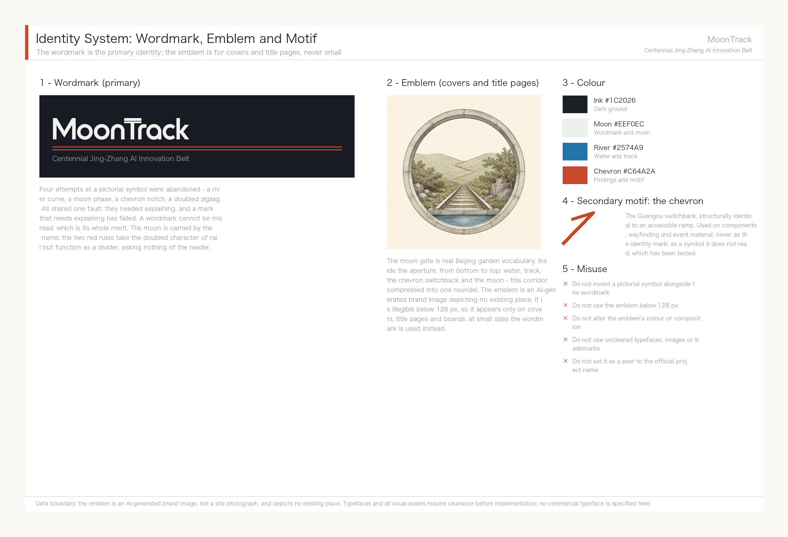

Coordinated research adds no falsely precise redlines. Through the coordination of Urban Character, public space and building layout required by [standard:MOHURD-URBAN-DESIGN-MEASURES], it returns to [data:geometry/land_use.geojson#lu-osm-277989175], [data:geometry/public_space.geojson#PUBLIC-001] and [depth:overall_spatial_structure], showing that industrial strategy must eventually land in a visible, checkable spatial structure.

### Global AI innovation ecosystem cases and transferable mechanisms

Cases were chosen for transferability, not fame. This corridor has two unavoidable given conditions: it is railway heritage land, and its university density is extremely high (50 universities and research institutes measured inside the Coordinated Research Area). So among the six cases below, the heaviest weights go to Station F in Paris and King's Cross in London — both are real precedents of **railway or industrial heritage converted into innovation clusters**. The resemblance is not one of atmosphere but of situation.

| Case | Key facts | Transferable mechanism for Jing-Zhang |
| --- | --- | --- |
| **Station F, Paris** | Converted from the 1920s Halle Freyssinet freight depot, listed as a French historic monument in 2012; opened July 2017; 51,000 sqm housing 1,000+ startups, with 600 units of founder housing; funded with roughly USD 295 million by private investor Xavier Niel [source:case-station-f] | Heritage buildings put to productive reuse rather than static display; **startup space and housing on the same site**, which answers directly to the talent-zone housing requirement of the AI Origin Community |
| **King's Cross / Knowledge Quarter, London** | Renewal of former railway goods yards; DeepMind's 2016 arrival triggered AI clustering; the district now includes UCL, the Francis Crick Institute and the British Library, with some 41,000 people living, working and studying there [source:case-kings-cross] | **Anchor institution first**: land one institution with drawing power and industry follows. This matches the Zhongzhiyuan strategy of attracting a national AI platform |
| **Kendall Square, Boston** | Public-private delivery between MIT and the City of Cambridge; six new buildings on MIT's own parking land, mixing R&D, housing and retail; roughly 250 graduate housing units plus 290 market units, over 100,000 sq ft of ground-floor commercial and nearly three acres of open space [source:case-kendall-square] | **University land assets converted into a mixed-use district**; a continuous active ground floor plus open space is the hard condition for district vitality, applicable to the campus-to-park stitching segments |
| **Mila, Montreal** | Quebec invested CAD 100 million in an AI cluster in 2017 and a further CAD 80 million over five years in 2018; federal funding of CAD 44 million flowed through CIFAR under the Pan-Canadian AI Strategy; the research campus opened in the former Mile-Ex industrial district in 2019 [source:case-mila-montreal] | **Provincial and federal funding stacked behind a single research institution** to form a talent anchor; the former-industrial siting logic resembles the stock space along the Xiaoyue River |
| **one-north / Kampong AI, Singapore** | A JTC-coordinated R&D and high-tech cluster planned around eight functional precincts; the new Kampong AI converts two existing buildings, offering 14,500 sqm of business space for around 70 companies, with another building providing 200+ residential units; completion 2028 with pilot operation from March 2026 [source:case-one-north] | **Government platform company as single developer, adaptive reuse of existing buildings, live-work mix**; the pilot-then-complete rhythm transfers directly to the Xiaoyue River scenario pilot |
| **Zhangjiang AI Island, Shanghai** | 66,000 sqm site with 100,000 sqm of above-ground floor area; tenants include IBM and Microsoft AI and IoT labs; by end-2022 the wider Zhangjiang Science City around the island had gathered over 600 AI companies; 2024 park revenue exceeded RMB 13.5 billion [source:case-zhangjiang-ai-island] | The densest domestic precedent of its kind; the **vertical chain organisation of "upstairs and downstairs is upstream and downstream"** suits dense Zhongzhiyuan plots |

Three mechanisms recur across all six cases, and this proposal organises its spatial decisions accordingly: heritage or existing buildings are put to productive reuse rather than static preservation; anchor institutions land before industry is courted, not the other way round; and startup space shares a site with housing, shortening both commutes and collaboration radii.

### The AI innovation ecosystem map and the division of labour across the Three Zones and Two Wings

The ecosystem map is organised in four stages — origination, translation, validation, services — each with a definite spatial landing and no attempt at even distribution:

- **Origination (Zhongzhiyuan AI Independent Innovation Acceleration Area)**: answering the official role of a full-stack self-reliant AI system and global voice in AI governance. Full-stack self-reliance means that the chain from chips through frameworks and models to applications has a corresponding home inside the belt. This proposal suggests using standard-setting, safety evaluation and red-team testing as a public interface that can be visited and observed (scenario card 07), so that self-reliant innovation becomes perceptible urban content rather than an industrial slogan.
- **Translation (Beijing AI Origin Community)**: answering the world-class AI innovation ecosystem. It draws on the 50 universities and research institutes measured inside the Coordinated Research Area [metric:universities_in_research_scope], of which 14 lie within 100 m of a cycleway [metric:universities_within_100m_of_legal_lane] [data:geometry/public_space.geojson]. Following Kendall Square's conversion of university land assets into a mixed-use district, the priority is to fill gaps in results publication, open-source collaboration and talent housing.
- **Validation (Xiaoyue River Scenario Enablement Wing)**: answering AI scenario enablement and an intelligent, vibrant AI city — the home of agent.3's ten scenario cards. Validation is the only stage in the whole ecosystem that generates real usage data, and it is where this proposal invests the most depth.
- **Services (Zhongguancun Technology Services Wing and Dazhongsi AI Industry Cluster)**: answering global factor allocation, Zhongguancun IP and capital enablement, and AI-native new formats. It carries capital, legal services, intellectual property, international roadshows and consumer conversion.

The four stages form a loop: technology from origination enters validation for real-scenario testing, usage data from validation feeds back to origination, and services convert validated results into industrial and consumer products. This loop is the concrete form of the technology flow in the MoonTrack concept.

### Factor guarantee mechanisms (land, space, industry, capital, talent, compute, data, scenarios)

All of the following are conceptual suggestions for further study by professional teams and government departments. None constitutes a settled policy arrangement or funding commitment:

| Factor | Suggested mechanism | Reference case |
| --- | --- | --- |
| Land and space | Prioritise reuse of existing and heritage buildings over large new land take; co-locate industrial space with talent housing | Station F, Kampong AI |
| Industry | Let anchor institutions drive clustering rather than leading with investment promotion | King's Cross, Mila |
| Capital | Explore stacked multi-level public funding for stable long-term support of a single anchor institution | Mila (provincial plus federal) |
| Talent | Fill the gap in founder housing units and daily amenities to shorten commuting radius | Station F (600 units), Kampong AI (200+ units) |
| Compute | Consider edge and distributed compute nodes co-located with public facilities; actual capacity awaits confirmation of formal municipal and energy conditions | Zhangjiang (vertical chain organisation) |
| Data | Scenario data must follow data minimisation and local-processing-first; personal data does not leave the scenario boundary (see the agent.3 privacy boundary) | — |
| Scenarios | Adopt a staged pilot-then-complete rhythm for Scenario Access, with human supervision maintained through the pilot | Kampong AI (pilot 2026, completion 2028) |

The full mapping of these mechanisms to spatial landings and industrial roles is held in `compliance_matrix.json`; this section keeps only the most direct basis [source:AGENT-TASKBOOK] [source:case-station-f] [depth:overall_spatial_structure].

## Overall Design Area: Urban Renewal and Regulatory-Plan-Level Urban Design

**The mechanism this section applies.** Without official regulatory conditions, this proposal gives no land-use class or intensity figures and delivers instead a **recomputable screening rule set**: whatever can be computed from measured geometry (built density, land-use composition, the density differences between key areas) is given straight, and whatever depends on unpublished data (retain-renovate-demolish classification, development intensity, building height) is explicitly not attempted, with the reason stated. That rule - compute what is computable, mark what is not - shares its source with the two methods set out earlier, right-of-way pricing and terminal-first: draw the computable boundary first, then give conclusions inside it.

First, what depth this section can honestly reach. The core of regulatory depth — land-use designation, Development Intensity, building height — depends on official regulatory conditions and cadastral records, and neither has been released. But "no official conditions" is not the same as "nothing can be measured". Present built conditions can be measured, and the measurements themselves confirm or overturn several key judgements. What follows is the measured part; what cannot be done is stated separately at the end of the section rather than blended in.

**Measured built density.** Building footprints are taken from OpenStreetMap [source:osm-buildings-footprints]. Within the Overall Design Area, 1,562 footprints fall entirely inside the boundary [metric:building_count_design_scope], totalling 1.918 million m² [metric:building_footprint_area_sqm], a building coverage of 16.81 per cent [metric:building_coverage_ratio]. Footprints crossing the boundary are excluded rather than clipped: a clipped building is no longer a building, and an understated figure is preferable.

**The density gap between the three key areas is the most useful finding in this section.**

| Key area | Land area | Existing footprint | Coverage |
| --- | --- | --- | --- |
| Zhongzhiyuan AI Independent Innovation Acceleration Area | 1.929 M m² | 0.210 M m² | **10.89%** [metric:key_area_building_coverage_zhongzhiyuan] |
| Beijing AI Origin Community | 1.043 M m² | 0.217 M m² | 20.83% |
| Dazhongsi AI Industry Cluster | 0.720 M m² | 0.131 M m² | 18.22% |

Each of the three areas has a scene plate. The plates carry only two kinds of content: figures this proposal has measured, and rules its text already states. No engineering specification appears on any of them. All three illustrations are AI-generated conceptual expressions, not site photographs, and depict no existing place.

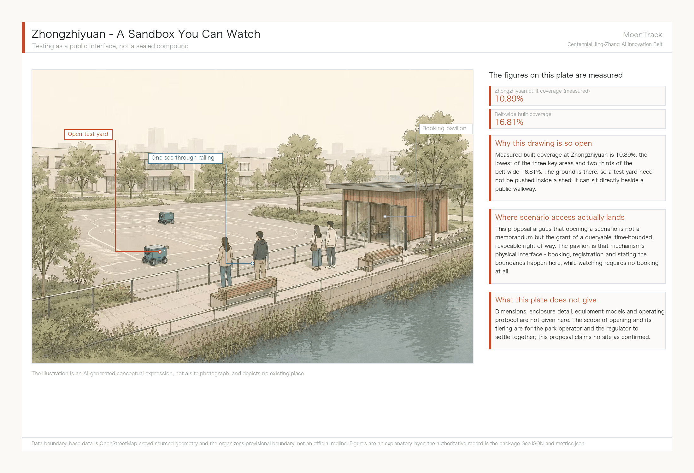

Zhongzhiyuan's spatial strategy follows directly from that 10.89%: the ground is there, so a test yard need not be pushed inside a shed. It can sit beside a public walkway behind a single see-through railing - **watching requires no booking, only entering does.** That is where the scenario-access mechanism lands in space.

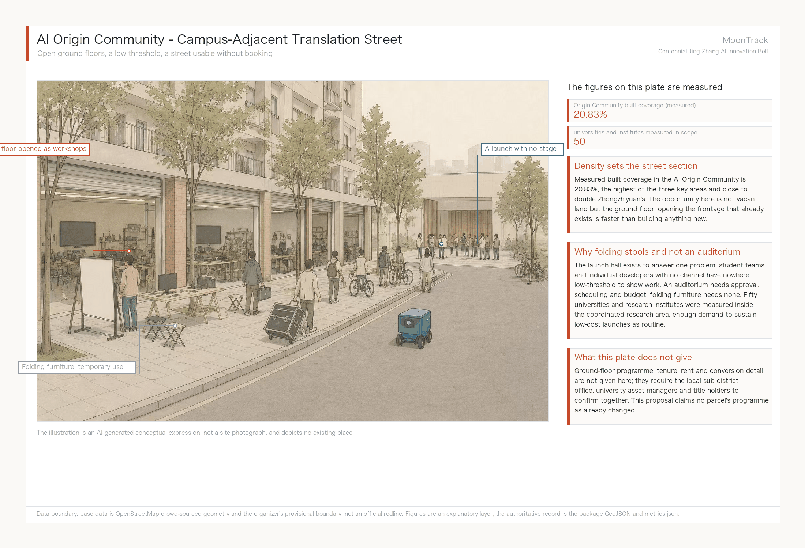

The Origin Community's 20.83% means the opportunity is not vacant land but the ground floor. Opening frontage that already exists is faster than building anything new, and launches use folding furniture rather than an auditorium because the problem being solved is that student teams with no channel lack a low-threshold venue - while an auditorium needs approval, scheduling and budget.

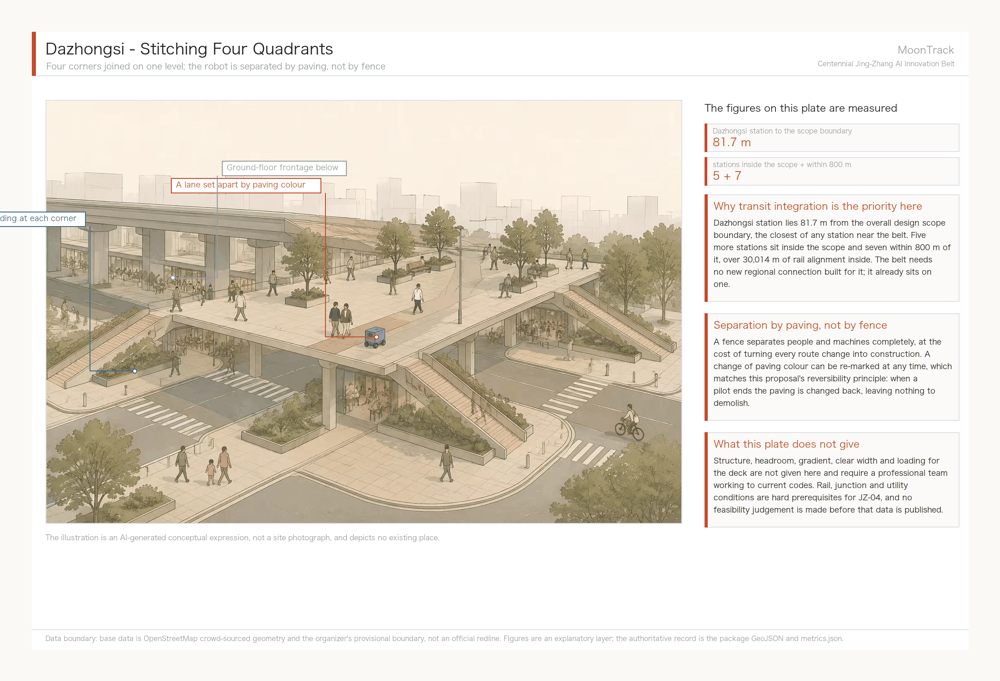

Dazhongsi station lies 81.7 m from the overall design scope boundary, the closest of any station near the belt, so the spatial move here concentrates on joining four corners at one level. The lane on the deck is set apart by a change of paving colour, not by a fence: a fence separates people and machines completely, at the cost of turning every route change into construction, while paving can be re-marked at any time, which matches the reversibility principle.


Zhongzhiyuan's existing coverage is roughly half that of the other two, and its official role is the AI independent-innovation acceleration area — the only one of the three explicitly required to carry growth. **The place that needs to expand is exactly the place that is currently emptiest.** That is not a design coincidence; the numbers were checked before the claim was written.

Read the other way: the Origin Community's 20.83 per cent means its spatial strategy can only be stock renewal and functional replacement, not new construction. That is also why the Kendall Square approach — converting university land assets into mixed-use blocks — applies there and does not apply to Zhongzhiyuan. The two are short of different things: one is short of content, the other of buildings.

**Identifying low-efficiency space.** Thirty-three parcels within the area are tagged as under construction, shantytown redevelopment, brownfield, military or farmyard, totalling 542,000 m², or 4.75 per cent of the Overall Design Area. The largest are:

| Parcel | Area | Present tag | Relation to key areas |
| --- | --- | --- | --- |
| Mingguangcun shantytown redevelopment | 161,388 m² | construction | **outside all three key areas** |
| Beijing North railway station | 106,598 m² | railway | inside Dazhongsi |
| Xueyuan Road Science Park Dongshengyuan | 33,110 m² | construction | inside Zhongzhiyuan |
| Sunlon Beijing Dairy Cattle Centre | 23,887 m² | farmyard | inside Zhongzhiyuan |

One result deserves planning attention: **40.3 per cent of low-efficiency land lies outside the three key areas, and the single largest parcel — Mingguangcun shantytown redevelopment at 161,388 m², close to a third of all low-efficiency land — is not in any key area at all**, sitting on the corridor stretch between the Origin Community and Dazhongsi. A renewal framework covering only the three key areas would miss the largest single opportunity in the corridor.

This proposal does not use that to recommend changing official key-area boundaries; that is the competent authority's remit. It records the parcel as an observation item on the renewal project list and suggests it be considered in coordination during formal preparation [data:geometry/land_use.geojson#lu-osm-546295836].

It should also be said that "low-efficiency" here is a data-tagging category, not a value judgement. A construction tag means the parcel is being built or already under redevelopment; Beijing North station, tagged railway, is an operating rail facility. Neither is idle land awaiting demolition. The correct use of this list is as a starting point for site verification, exactly as with JZ-07.

**What this section cannot do.** Integrated carrying-capacity assessment, total building scale and Development Intensity zoning cannot be prepared in this round. The reason is not time but data, and the measured coverage rates behind that statement are given in the next section. The corresponding depth items are disclosed machine-readably through the `completeness_limited_by` field in `design_depth_matrix.json`, rather than being glossed over in prose as "to be developed" [depth:land_use_layout] [depth:development_intensity_controls].

## Detailed Design of Key Areas

The three key areas are not weighted equally, and the basis for that is the measured density gap reported in the previous section. Zhongzhiyuan's present building coverage is 10.89 per cent, roughly half that of the other two, so its spatial strategy is led by added capacity. The Origin Community is at 20.83 per cent, which leaves only stock renewal and functional replacement. Dazhongsi is at 18.22 per cent, and a substantial share of it is taken by Beijing North railway station, an operating rail facility of 106,598 m², so the spatial actions there concentrate on station integration and ground-level connectivity rather than land reorganisation.

The three also differ in what their delivery depends on, and that matters more to sequencing than the roles do. Zhongzhiyuan depends on the Qinghe blue line and flood-control conditions, the Origin Community on campus land title, Dazhongsi on rail and utility corridors. **Only the Origin Community's core dependency avoids engineering approval, so in principle it could move first** — but it is also the one place that needs a building-by-building Demolish–Renovate–Retain judgement, and the construction-date and ownership data that judgement requires is at zero coverage. The conclusion is that none of the three is ready to enter detailed design; what this proposal supplies is what each one is missing, not what each one should build.


| Key area | Design role | Spatial action | AI industry and operating scenarios | Evidence |
| --- | --- | --- | --- | --- |
| Zhongzhiyuan AI Independent Innovation Acceleration Area | Garden-type full-stack self-reliant innovation district | Strengthen the Qinghe frontage, industrial display, low-carbon innovation exchange and external transport; use green space to carry open testing and standards-governance display | Self-reliant model testing, standard-setting workshops, safety-governance display, low-carbon compute experience | [data:geometry/key_areas.geojson#PROV-KEY-001], [depth:three_key_area_detailed_design] |
| Beijing AI Origin Community | Campus-adjacent translation and talent community | Stitch campus, park and district walking and cycling links; fill gaps in results publication, talent services, housing and open-source collaboration space | Open-source community, results publication, talent-zone services, campus-adjacent incubation | [data:geometry/key_areas.geojson#PROV-KEY-002], [source:AGENT-TASKBOOK] |
| Dazhongsi AI Industry Cluster | Urban intelligent-economy and international exchange district | Organise around Dazhongsi station integration, four-quadrant pedestrian links, commercial services and public-realm renewal near key enterprises | Agent and smart-terminal display, content consumption, data factors and international roadshows | [data:geometry/key_areas.geojson#PROV-KEY-003], [metric:key_area_count] |

## AI Innovation Ecosystem, Personas, and AI+ Scenarios

The flagship depth of this section is the Xiaoyue River Scenario Enablement Wing: low-speed delivery and inspection robots combined with accessibility and elderly-care services, with the remaining nodes covering the breadth of the belt. The spatial evidence for the first group of six cards rests on verified layers — the Xiaoyue River watercourse [data:geometry/green_space.geojson#xiaoyuehe-seg-00], the 42 cycleway segments within 300 m of the river [data:geometry/roads.geojson#cycleway-22771899] and elderly-care facility POIs [data:geometry/public_space.geojson#elderly-poi-00] — not indicative layers drawn from nothing. The agent taskbook requires at least ten AI scenario cards, at least three industrial Testing and Validation Scenarios and at least five user personas; the content below answers each in turn.

| User persona | Real basis | Core need | Spatial response |
| --- | --- | --- | --- |
| Older and solo-living residents | 671,000 Haidian residents aged 60+, 21.47% of the permanent population; the highest registered rate of residents aged 80+ in Beijing [source:haidian-2024-statistical-bulletin] | Medicine and meal delivery to the door, wander-alert calling, accessible travel | Elderly-service points along the Xiaoyue River, community depots |
| People with accessibility needs | Law on the Construction of a Barrier-Free Environment [source:DATA-SRC-BARRIER-FREE-ENVIRONMENT-LAW] | Unobstructed tactile paving and kerb ramps, bookable low-speed shuttle | Tactile-paving inspection along the Xiaoyue River path, accessible transfer points |
| Embodied-AI practitioners | Dongpan Innovation Center / Zhongguancun (Haidian) Embodied AI Innovation Industrial Park, inside the Coordinated Research Area, immediately east of the site [data:geometry/public_space.geojson#anchor-dongpan-innovation-center] | Test ground, regulatory sandbox, data-compliance toolchain | Zhongzhiyuan test sandbox linked to the industrial park |
| Students and researchers nearby | 50 universities and research institutes measured inside the Coordinated Research Area [data:geometry/public_space.geojson] | Low-cost delivery, open interfaces for research testing | Campus-to-Xiaoyue River stitching, parcel depots |
| Elderly-care facility operators | Real POIs including Xiude Nursing Home, Xucheng Nursing Home and Tsinghua Garden University for the Elderly [data:geometry/public_space.geojson] | Last-100-metre delivery handover, emergency-call integration, privacy boundary | Transfer points at facility entrances, no entry indoors |

Each card is filled in against the six elements required by `schema/scenario.schema.json`: users, context of use, data inputs, public value, risks and human-review mechanism. Anything touching technology readiness or a data gap is stated on the card itself rather than deferred to an appendix.

**Group one: Xiaoyue River Scenario Enablement Wing (flagship depth, six cards)**

**01 · Low-speed riverside inspection and delivery** (Testing and Validation Scenario)
Low-speed delivery robots run along the cycleway on the east bank of the Xiaoyue River, serving parcel collection and delivery for nearby communities and universities. The 15 km/h ceiling and the requirement to stay within cycleways are hard constraints from the Beijing Interim Measures for Road Testing and Commercial Demonstration of Unmanned Delivery Vehicles [source:beijing-delivery-robot-management-measures]; the pilot district government must separately designate the specific test sections.
- **Users**: nearby residents, university students and researchers
- **Data inputs**: cycleway alignments along the river [source:osm-cycleways-lines], watercourse alignment [source:osm-xiaoyuehe-river], distribution of nearby universities [source:osm-universities-nearby]
- **Public value**: reduces motor-vehicle use for short-distance delivery, relieves labour pressure during campus parcel peaks, and accumulates publishable data on operating protocols for low-speed robots in genuinely mixed traffic
- **Risks**: safety in mixed human-robot traffic; occupation of cycleways affecting riders; nothing can run until pilot sections are approved; reliability drops in severe weather
- **Human review**: pilot sections are designated by the pilot district government; remote human supervision stays online during operation; exceptions and incidents are taken over by staff

**02 · Last 100 metres of elderly medicine and meal delivery** (Testing and Validation Scenario)
Robots collect from a community depot and deliver to the entrance of facilities such as Xiude Nursing Home and Xucheng Nursing Home, where staff receive the item. The robot does not enter the building and the handover involves no contact with residents themselves.
- **Users**: older and solo-living residents, elderly-care facility operators
- **Data inputs**: elderly-care facility POIs [source:elderly-poi-osm]; 671,000 Haidian residents aged 60+, 21.47% [source:haidian-2024-statistical-bulletin]
- **Public value**: reduces the travel burden of parcel collection for older residents and adds a low-cost channel for community services against a background of compounding frailty and empty-nesting
- **Risks**: **this card does not work under current right of way.** Network measurement shows zero of five elderly-care facilities reachable along cycleways — four sit in a different connected component from the candidate depot, and the fifth has 652 m of terminal distance with no legal right of way (see "Measured cycleway network connectivity"). The precondition for this card is therefore prior completion of the JZ-07 gap verification and closure; until then it is a design target rather than a deliverable scenario. In addition, medicine delivery involves licensing and temperature-control requirements beyond this proposal's scope; acceptance of robots by older people is uncertain; and liability at the handover is undefined
- **Human review**: facility staff complete the final handover; the robot never interacts directly with residents; medicine delivery may only begin after the relevant licences are obtained; whether the right-of-way precondition is met is determined by traffic professionals on site, not declared by this proposal

**03 · Tactile-paving accessibility inspection**
Robots carrying low-cost sensors inspect tactile paving and kerb ramps along the watercourse alignment [data:geometry/green_space.geojson#xiaoyuehe-seg-00] for damage and obstruction, generating a repair list for human verification.
- **Users**: people with visual impairments and reduced mobility, street-level municipal maintenance departments
- **Data inputs**: watercourse alignment [source:osm-xiaoyuehe-river]; requirements of the Law on the Construction of a Barrier-Free Environment [source:DATA-SRC-BARRIER-FREE-ENVIRONMENT-LAW]
- **Public value**: shifts accessibility inspection from reactive reporting to active discovery, with publishable inspection records that let the public follow remediation progress
- **Risks**: **there is no dedicated GIS dataset for tactile paving and kerb ramps, an explicit data gap in this proposal**; inspection routes can currently only take the watercourse alignment as a spatial reference; sensor misreadings may generate invalid work orders
- **Human review**: repair lists must be verified on site by staff before work is dispatched; the robot issues no penalties and performs no forced clearance

**04 · Community goods transfer**
Transfer of goods and printed material around elderly facilities such as Tsinghua Garden University for the Elderly and senior activity centres [data:geometry/public_space.geojson#elderly-poi-00].
- **Users**: neighbourhood committees, organisers of senior activities, volunteers
- **Data inputs**: POIs for elderly facilities and activity venues [source:elderly-poi-osm]
- **Public value**: frees community volunteers from repetitive carrying so they can turn to the companionship and service work that actually needs people
- **Risks**: **goods only, no passenger shuttle** — the safety and liability questions in carrying people exceed the boundary of concept design and are left to professional assessment; liability for lost or damaged goods is undefined
- **Human review**: staff sign for goods at both ends; no unattended drop points

**05 · Multi-robot coordination testing at intersections** (Testing and Validation Scenario)
Test nodes at intersections of the Xiaoyue River and cycleways verify queueing and yielding logic for multiple robots at crossings shared with people and vehicles.
- **Users**: test teams from the embodied-AI industrial park, regulators
- **Data inputs**: cycleway network [source:osm-cycleways-lines]; Beijing embodied-AI industrial policy targets [source:beijing-embodied-ai-action-plan-2025-2027]
- **Public value**: puts multi-robot coordination, a shared industry problem, into a real urban setting, so that test protocols and failure cases become a public industry reference
- **Risks**: **the lowest technology readiness of the ten cards** — multi-robot yielding has published precedents in closed campuses, but there is no mature citable precedent for reliability at open, mixed-traffic intersections; disruption to normal circulation during testing must be assessed
- **Human review**: remote human supervision throughout; staged entry conditions, with no progression until safety indicators are met; **must not be described as being in service**

**06 · Community elderly AI call post**
A fixed terminal with voice interaction at senior activity centres and similar venues, providing emergency calling and wander-alert reminders.
- **Users**: older and solo-living residents, community emergency responders
- **Data inputs**: POIs for elderly facilities and activity venues [source:elderly-poi-osm]; State Council General Office Document No. 45 of 2020 implementation plan [source:DATA-SRC-ELDERLY-SMART-TECH-PLAN-2020-45]
- **Public value**: preserves a zero-learning-curve help channel for older people who do not use smartphones, answering the policy requirement that traditional service channels run in parallel with digital ones
- **Risks**: false alarms and missed alarms; reliance on the device delaying direct help-seeking; inadequate speech recognition for dialects and accents
- **Risk control and human review**: **data is processed locally only, with no personal movement traces uploaded**; call responses are always handled by human operators, and the terminal only assists and reminds, making no automated determinations

**Group two: other nodes across the belt (breadth, four cards)**

The four cards below cover the spatial breadth required by the taskbook. They are shallower than group one and follow the same six elements in condensed form.

| Card | Users / spatial host | Data inputs | Public value | Risks | Human review |
| --- | --- | --- | --- | --- | --- |
| **07 Zhongzhiyuan embodied-AI test sandbox** | Embodied-AI companies and research teams / Zhongzhiyuan | Dongpan Innovation Center [source:dongpan-innovation-center], Embodied AI Innovation Industrial Park [source:embodied-ai-industrial-park], municipal industrial policy [source:beijing-embodied-ai-action-plan-2025-2027] | Translates standard-setting, safety evaluation and red-team testing into a bookable public interface so residents can perceive self-reliant innovation | Test content involves commercial confidentiality, so openness must be tiered; the park's actual siting and willingness to open are unconfirmed | Scope and tiering of access decided jointly by the park operator and regulators |
| **08 AI Origin Community open-source release hall** | University staff and students, open-source communities, startups / Beijing AI Origin Community | Distribution of 50 universities and institutes in the research area [source:osm-universities-nearby] | Gives student teams and individual developers without publication channels a low-threshold venue for showing work and getting peer feedback | Operating cost and sustained activity are hard to guarantee; IP ownership of released content needs definition | Content review and IP statements are the operator's responsibility |
| **09 Dazhongsi international roadshow lounge** | Agent, smart-terminal and content-consumption companies / Dazhongsi AI Industry Cluster | The taskbook's definition of the district's AI-native new-format role [source:AGENT-TASKBOOK] | Provides a fixed venue for international exchange and business conversion, shortening the path for outside firms to understand the local ecosystem | International exchange is exposed to external conditions; business functions may crowd out public space | Public-space proportion and opening hours agreed jointly by planning and operations |
| **10 Jing-Zhang Railway Heritage Park AI wayfinding walk** | Public, visitors, nearby residents / Jing-Zhang Railway Heritage Park spine | Actual distribution of parks and green space [source:osm-parks-green-space] | Uses explainable wayfinding to identify walking and cycling breaks and accessibility needs, making the heritage park equally usable for wheelchair and pram users | Wayfinding installations may intrude on the heritage setting; identified breaks need site verification | **No facial or movement data collected**; break lists enter remediation only after human verification; installations within heritage boundaries require heritage-authority approval |

**Scenario–space–operations mapping**

| Card | Spatial layer | Suggested operator | Human-review point |
| --- | --- | --- | --- |
| 01 Low-speed riverside delivery | `geometry/roads.geojson` (segments within 300 m of the river) | Delivery operator authorised by the pilot district government | Designation of pilot sections, day-to-day operational supervision |
| 02 Elderly medicine and meal delivery | `geometry/public_space.geojson` | Elderly-care facility jointly with delivery operator | Handover received by facility staff, exceptions handled by people |
| 03 Tactile-paving inspection | `geometry/green_space.geojson` (watercourse alignment as reference; tactile paving itself still to be surveyed) | Street-level municipal maintenance | Repair list verified on site before dispatch |
| 04 Community goods transfer | `geometry/public_space.geojson` (elderly facility POIs) | Neighbourhood committee with volunteers | Passenger feasibility left to professional assessment; goods only for now |
| 05 Multi-robot intersection testing | Intersections of watercourse and cycleways | Embodied-AI industrial park test team | Remote human supervision during testing; no entry into service |
| 06 Community elderly AI call post | `geometry/public_space.geojson` | Community with emergency call centre | Call response still handled by human operators |

**Privacy and human-review boundary**: all scenarios observe three rules — no facial or personal movement data is collected; robots do not enter private homes or rooms inside elderly-care facilities; and every call or exception response is finally handled by a human operator or member of staff, with robots and terminals only assisting, reminding and relaying information rather than making automated decisions. Both the intersection coordination testing in card 05 and the riverside delivery in card 01 require remote human supervision throughout the pilot and must not be written up as commercial operation.

**A fourth boundary: with the AI switched off, the service must not stop.** The first three rules govern what the AI does and does not do. This one governs what happens **when it is not there**. Every scenario card must have an equivalent path that depends on no AI component, and that path must already exist today rather than being a contingency plan.

| Scenario card | AI-off equivalent | Already exists today |
| --- | --- | --- |
| 01 riverside delivery, 02 elderly meals and medicine, 04 community goods shuttle | A human courier or community volunteer on the same route | Yes - this is the present arrangement |
| 03 tactile-paving inspection | Municipal maintenance patrols and resident-reported faults | Yes |
| 05 multi-robot intersection trial | Not applicable: the card is itself a trial; cancelling it returns to the status quo | - |
| 06 community elderly AI call post | The community duty telephone and home visits | Yes |
| 07-09 sandbox, launch hall, roadshow salon | Booking by phone, staffed reception and in-person briefing | Yes |
| 10 heritage-park AI guided walk | Printed guides and human interpretation, with breaks reported by residents | Yes |

**This rule is backed by measurement, not asserted as a principle.** The dispatch ledger carries a separate human-fallback baseline: for the same doors, a person on foot faces a median terminal gap of 82.8 m against the robot's 249.6 m. Under today's right-of-way rules the human path is **physically the shorter one**. Writing this in as a hard boundary has a direct consequence: any card that works only along its AI path should not enter a pilot, because equipment failure, a network outage or the end of the pilot would make the service disappear - and the people who would bear that are exactly the ones who depend on it most.


The AI governance suggestions in this proposal observe four rules throughout: data minimisation, public sourcing, explainable results, and human review at decisive points. The capability boundary that follows is this — an urban agent may help identify walking and cycling breaks, public-space usage intensity, maintenance needs and event safety risks, but it does not substitute for planning approval, does not output unauthorised personal profiles, and claims no official implementation commitment. Every spatial node behind the ten scenario cards is already in the structured layers and the compliance matrix, so reviewers can check each scenario against industry, space and public interest directly.

### Visual index

This section maps each of the six agent tasks to its figure, drawing and HTML evidence, so that reviewers can locate visual material by task, and so that the figure work has a content basis. All figures are derived from this package's GeoJSON, metrics and matrices; no remote images, un-cleared map screenshots or commercial base maps are used.

| Task | Primary figure | Drawing location | HTML page | Core judgement the figure must carry |
| --- | --- | --- | --- | --- |
| **agent.1** Overall concept and coordination | `assets/figures/site-overview.en.png` | A3 booklet master plan page / A0 board main area | `visual/index.en.html` concept and structure section | The three-tier nesting of the MoonTrack concept plus the heritage-park spine plus the Xiaoyue River and Zhongguancun wings; the spatial overlap of the river corridor and the spine must be readable at a glance |
| **agent.2** Innovation ecosystem | `assets/figures/land-use-structure.en.png` | A3 booklet industry and ecosystem page | `visual/index.en.html` ecosystem section | Spatial landing and closing loop of the four-stage origination–translation–validation–services ecosystem, with the transferable mechanisms of the six international cases set alongside as captions |
| **agent.3** AI scenario enablement | `assets/figures/mobility-bluegreen.en.png` | A3 booklet scenario page / A0 board scenario area | `visual/index.en.html` scenario cards section | The low-speed network formed by the 42 nearby cycleway segments along the Xiaoyue River (coloured by connected component, exposing 62 fragments) plus the distribution of the ten scenario cards plus elderly-care POIs; it must show that scenarios follow the real network rather than being scattered, and that the network is not currently connected |
| **agent.3, supplementary** Right-of-way rule and policy levers | `assets/figures/policy-levers.en.png` | A3 booklet mobility page / A0 conclusions area | `visual/index.en.html` service-solution section | Median terminal distance for the same doors against two networks (the price of the rule), plus servable facilities and reachable network for four interventions; the speed row must read as unchanged and the footway row as 6.5x |
| **agent.4** Public space and landmarks | `assets/figures/key-areas.en.png` | A3 booklet key-area page / A0 board district area | `visual/index.en.html` key-area switch view | Index of the three key areas plus siting of the three pilgrimage landmarks plus the public experience route; the switchback ramp component needs its own construction diagram |
| **agent.5** Cultural convergence narrative | `assets/figures/site-overview.en.png` (with cultural overlay) | A3 booklet culture page | `visual/index.en.html` narrative section | The timeline of the three-part narrative (1905 / 1980 / today) against its spatial anchors, and the geometric translation of the switchback motif |
| **agent.6** Events and operations | `assets/figures/metrics-evidence.en.png` | A3 booklet operations page | `visual/index.en.html` operations section | Frequency tiers of the four Platform X events plus the three-stage Scenario Access rhythm plus the observe–participate–test–settle conversion path |

The five figures share this package's `geometry/*.geojson` as their base, with colour following the MoonTrack visual direction (water-and-track overprint: a blue-green gradient resolving to moon-white, overlaid with the switchback motif). Every provisional boundary in a figure must be explicitly marked as a provisional constraint and must never appear as a solid red line, to avoid being read as an official redline [data:geometry/constraints.geojson#CONSTRAINTS].

## Land Use, Building Scale, and Retain-Renovate-Demolish Strategy

This section has three parts: measured existing land use, why Demolish–Renovate–Retain cannot be settled in this round, and what can still be delivered given that it cannot.

### Existing land-use composition

The land-use layer is built on OpenStreetMap present-condition tags [source:osm-landuse-polygons], mapped onto the project code subset of the Guidelines for the Classification of Land and Sea Use in Territorial Survey, Planning and Use Control [standard:MNR-LAND-USE-CLASSIFICATION-GUIDE]. It covers the whole Overall Design Area with no overlaps between parcels. Of that, 53.6 per cent has an identifiable present land use [metric:land_use_osm_mapped_share]; the remaining 46.4 per cent carries no traceable tag and is recorded honestly as code 16 reserved land rather than inferred from neighbouring parcels.

| Code | Category | Area | Share of design area |
| --- | --- | --- | --- |
| 0804 | Education land | 2.322 M m² | **20.34%** |
| 0701 | Urban residential land | 1.544 M m² | 13.52% |
| 1401 | Park green space | 0.647 M m² | 5.67% |
| 0902 | Business and financial land | 0.470 M m² | 4.11% |
| 0805 | Sports land | 0.242 M m² | 2.12% |
| 1402 | Protective green space | 0.194 M m² | 1.70% |
| 0901 | Commercial land | 0.084 M m² | 0.73% |
| 0806 | Medical and health land | 0.073 M m² | 0.64% |
| 16 | Reserved land (incl. untagged remainder) | 5.838 M m² | 51.15% |

**Education land totals 2.322 million m², 20.34 per cent of the Overall Design Area** [metric:education_land_area_sqm] [metric:education_land_share] — the largest identified land-use category in the corridor, half again as much as residential land. It is made of entities that can be named one by one: University of Science and Technology Beijing at 289,000 m² [data:geometry/land_use.geojson#lu-osm-277989175], Beihang University's Xueyuan Road campus at 281,000 m², Beijing University of Posts and Telecommunications at 242,000 m², and China Agricultural University's East campus at 236,000 m².

That figure changes how the agent.2 ecosystem argument should be phrased. "Fifty universities nearby" is a POI count and reads as background. "A fifth of the corridor's land is education land" is a spatial fact, and it means no land-level action can avoid university land title. Siting the origination segment in the Origin Community, organised around campus adjacency, rests on that proportion rather than on an impression that there are a lot of universities.

The 5.838 million m² of reserved land [metric:blank_reserve_land_sqm] needs its two origins distinguished: parcels tagged as under construction, brownfield, military, farmyard, industrial or railway, for which the project code subset has no matching category; and the wholly untagged remainder. Neither means "reserved by planning decision"; both mean "not established on present evidence".

One technical finding in passing: the project's land-use code subset **contains no industrial category**. Industrial land is measurably present in the corridor and can only be recorded as reserved. The code table itself notes that it is a subset and that the full official table must be imported before statutory use; this simply flags the gap.

### Demolish–Renovate–Retain: why not in this round

A Demolish–Renovate–Retain judgement decides, for each building, whether it is retained, renovated, redeveloped or demolished. Making that call needs at least four things: construction date, structural type, ownership and occupancy. Data availability was checked item by item across all 1,562 buildings in the area:

| Attribute | Coverage | Sufficient for a DRR judgement? |
| --- | --- | --- |
| Footprint outline | 100% | Establishes location and size |
| Building name | 29.6% | Partially identifies function |
| Storeys | **9.6%** [metric:buildings_with_levels_attribute_share] | Not enough to derive floor area |
| Building height | under 1% | No |
| Construction date | 0% | No |
| Ownership | 0% | No |
| Structural type | 0% | No |

Storey coverage is 9.6 per cent, height coverage under 1 per cent, and date and ownership are at zero. **This proposal therefore gives no plot ratio, no building height, no total building scale, and no Demolish–Renovate–Retain conclusion for any building.** That is not cautious phrasing; it is the direct consequence of the table above. `floor_area_ratio` stays unknown in `metrics.json` for the same reason.

There is a distinction here that is easy to blur. The Demolish–Renovate–Retain gap and the Development Intensity gap have different causes. **Intensity is waiting on the release of official regulatory conditions; Demolish–Renovate–Retain is waiting on a field building survey.** The first is an administrative-process problem, the second a fieldwork-volume problem. They will not be resolved at the same time, and they should not be bundled under one phrase about conditions pending confirmation. Separating them tells the follow-on team which one to chase.

### What can be delivered: a recomputable screening rule

A conclusion is out of reach; a method is not. The pre-screening proposed here ranks candidates by three recomputable conditions, all relying only on layers already in this package:

1. **Buildings inside low-efficiency-tagged parcels** — first priority for site verification, corresponding to the 33 parcels in the previous section.
2. **Buildings inside key areas with a footprint over 5,000 m²** — large footprints carry the highest conversion cost and impact, so structural and ownership checks should come first.
3. **Buildings within 150 m of the three critical network gaps** — surveyed in the same visit as JZ-07, avoiding a second mobilisation.

The output of these three rules is a field survey task list, not a Demolish–Renovate–Retain list. The rules are stated here so that a professional team holding official data can recompute them directly rather than redesigning the screening logic. Heritage-listed and historic buildings are excluded from this screening entirely and handled under separate conservation procedure [depth:retain_renovate_demolish] [depth:height_massing_character].

## Transport, Rail, Municipal Infrastructure, and Public Services

Mobility and municipal depth are governed by [depth:traffic_rail_slow_parking] and [depth:municipal_new_infrastructure] respectively; layer evidence cites [data:geometry/roads.geojson#ROAD-001], [data:geometry/public_space.geojson#PUBLIC-001] and [data:geometry/constraints.geojson#CONSTRAINTS]. Where road redlines, utilities, fire and municipal conditions are missing, the gap should be recorded through assumptions rather than by writing strategy as approved conditions.

### Measured cycleway network connectivity

The right of way available to a low-speed robot is fixed by regulation. The Beijing Interim Measures for Road Testing and Commercial Demonstration of Unmanned Delivery Vehicles require such vehicles to be managed as non-motorised traffic, to travel within cycleways, and not to exceed 15 km/h [source:beijing-delivery-robot-management-measures]. So "can the robot get there" is not a figure of speech but a computable graph question: treat cycleways as the only permitted edges and ask whether the destination sits in the same connected component.

This proposal ran that computation over the 421 cycleway segments in the submitted layer [metric:cycleway_segments_total]. The method is to planarise the lines at intersections first (union of all segments), then snap endpoints into shared nodes within an 8 m tolerance to build a graph, in the EPSG:4548 projection specified by the brief, and then run connected components and Dijkstra shortest paths. The computation uses only `geometry/roads.geojson`, `geometry/green_space.geojson` and `geometry/public_space.geojson` from this package; every parameter (8 m tolerance, 15 km/h, depot selection rule) is stated, so a third party can reproduce it with any GIS toolchain. Intermediate results are submitted with the package as `visual/assets/network-analysis.json`.

The result is counter-intuitive. **These 141.7 km of cycleway are not one network but 62 mutually disconnected fragments.** The largest holds just 85 nodes and 27,560 m [metric:cycleway_largest_component_length_m], 14.9% of all nodes. The second, third and fourth largest measure 22.00, 21.58 and 18.33 km — four islands of comparable size, none connected to another.

The direct consequence for the flagship scenario is in the table below. Taking the node in the largest component closest to the watercourse (22 m from the river) as the candidate depot, shortest paths were computed to the five elderly-care facilities [metric:elderly_facilities_total]:

| Elderly-care facility | Straight-line distance to nearest cycleway | Network distance | Verdict |
| --- | --- | --- | --- |
| Tsinghua Garden University for the Elderly | 109 m | — | Different connected component |
| Building 11 (Xucheng Nursing Home) | 218 m | — | Different connected component |
| Senior activity centre and retiree office | 420 m | — | Different connected component |
| Xiude Nursing Home | 551 m | — | Different connected component |
| Senior activity centre | 652 m | 2,288 m (11.8 min) | Connected, but 652 m of terminal distance without legal right of way |

Measured as the crow flies, all five facilities are within 500 m and one is within 100 m, and the scenario looks feasible. Measured along the network, **the reachable count is zero**. Four are not on the same network at all, and the fifth, though connected, has no cycleway for its final 652 m. What scenario card 02 describes — delivery from a community depot to a facility entrance — cannot run even once under current right of way.

The 15 km/h ceiling compresses the service radius further. From that depot, ten minutes covers only 5.43 km of network and twenty minutes 19.87 km. The speed limit is not the bottleneck; the fragmentation is.

What is genuinely interesting is the cost of closing the gaps. Sorting the shortest voids between the largest component and the others, the top three measure 9 m, 12 m and 35 m:

| Length to close | Network unlocked |
| --- | --- |
| 9 m | 21.58 km |
| 12 m | 3.54 km |
| 35 m | 5.10 km |
| 467 m | 18.33 km |

**Fifty-six metres of connection in total could grow the main network from 27.56 km to 57.77 km, more than doubling it.** This is the weightiest conclusion this proposal offers on mobility depth, and it settles the phasing order directly: phase one is not building depots or buying robots but verifying and closing three breaks of a few dozen metres. It also bears out the revocability principle proposed under agent.1 — what is added is a connection in the existing Walking and Cycling Network, not a dedicated structure, and if the robots leave, cyclists and wheelchair users still benefit.

The boundaries of this analysis must be stated plainly; there are three layers of uncertainty. **First, the data source is OpenStreetMap [source:osm-cycleways-lines], not a municipal road register.** Voids of 9 m or 12 m are quite likely false breaks created by mapping segmentation, where the lane is continuous on the ground; conversely there may be false connections that are continuous on the map but severed on site by railings or grade changes. **Second, the 8 m snapping tolerance is a method choice.** A larger tolerance judges disconnected links connected; a smaller one judges connected links broken. **Third, this section is not engineering design.** Whether kerb gradient, paving, clear width and turning radius permit a robot to pass is entirely invisible here. The correct use of these three gaps is therefore as a field-verification list, not a construction brief: it tells professional teams which points to inspect first, rather than deciding for them how to fix anything. The associated risks are registered in `assumptions.json`.

**Every figure in this section can be recomputed inside the package.** `visual/assets/verify-network.js` is an independent reimplementation of the computation above: Node standard library only, no GIS dependency, reading `roads.geojson` from this package and redoing the projection, noding, snapping, graph build, component search and Dijkstra before comparing item by item against `metrics.json`. From the package root:

```
node visual/assets/verify-network.js
```

It shares no code with the Python implementation that produced the figures (shapely + pyproj) — only the input data and the stated method — so agreement between them is a cross-validation rather than a re-run. Both yield 621 noded pieces, 571 nodes, 62 components, a largest component of 27,556 m, zero network-reachable facilities, and gaps of 9, 12 and 35 m. Tolerances are tight: counts must match exactly, lengths are allowed 0.5 per cent for the projection series and floating-point summation. What it reproduces is the same conclusion under the same method, not a method-independent truth: a different snapping tolerance yields a different set of numbers, which is what assumption A-NET-001 records.

The land-use, building and area findings have a companion, `visual/assets/verify-geometry.js`, used the same way; it additionally checks the three commitments this land-use layer makes — full coverage, zero overlap, and declared areas consistent with the geometry.

### A test that cuts against us: are these pieces real?

The most reasonable challenge to "broken into 62 components" is that OpenStreetMap is incomplete - omit a few segments and components appear out of nothing. How do we know the fragmentation is real?

That challenge cannot be answered with care; it can only be answered with a number: **how many metres would it take to merge all 62 pieces into one network.** A minimum spanning tree over the 62-component complete graph gives 61 connections totalling **6,669 m** [metric:network_wholeness_connection_m], which is **4.69%** of the measured cycleway length [metric:network_wholeness_share_of_length].

The distribution says more than the total:

| Connection length | Count | Total |
| --- | --- | --- |
| **Under 20 m** | **18** [metric:component_gaps_under_20m] | **253 m** |
| 20-50 m | 12 | 394 m |
| 50-100 m | 11 | 827 m |
| 100-300 m | 13 | 2,221 m |
| **300 m and over** | **7** [metric:component_gaps_over_300m] | **2,974 m** |

**Half of that helps our case and half of it does not, and both halves have to be said.**

**The half that does not: 18 gaps are under 20 m and total only 253 m.** A break of under twenty metres is the characteristic signature of mapping omission - one unmapped stretch, one junction link not drawn, and a component splits off out of nothing. **The figure of 62 must therefore be read as an upper bound on real fragmentation**, and every conclusion derived from it inherits that bound, including the 0.69% machine accessibility rate. This is registered as A-WHL-002, not buried in a footnote.

**The half that helps: 7 gaps exceed 300 m and total 2,974 m.** A break of over three hundred metres cannot be mapping noise; that is genuine separation. The skeleton of the fragmentation is real, and only its edges are ragged.

**What is worth taking into a meeting is the two figures side by side: making this network geometrically whole takes 4.69% of its length, while its current usability is a machine accessibility rate of 0.69%.** Geometrically it is close to whole; functionally it is nowhere near usable. That gap is where this proposal's whole argument comes from, and it explains the sequence it recommends - rule first, links second: **the 30 gaps under 50 m total 647 m and are cheaper than any works on the list, but they only produce value once the rule permits a device to travel at all.**

It has to be said that 6,669 m is a **lower bound**: it measures straight-line nearest-point distance between components, avoiding no building, watercourse or title, and following no usable alignment. Closing any gap in reality costs more than its straight-line figure, and some will be judged infeasible on site (A-WHL-001). Equally, the 596 m given earlier is a 2-approximation of a Steiner tree whose candidate pool was the five facility components plus the eighteen largest rather than all 62, so it is an upper bound twice over (A-SVC-006). The argument rests on its order of magnitude against the 1,841 m of terminal gap, not on its being exactly optimal.

### From diagnosis to remedy: what it actually takes to make the flagship work

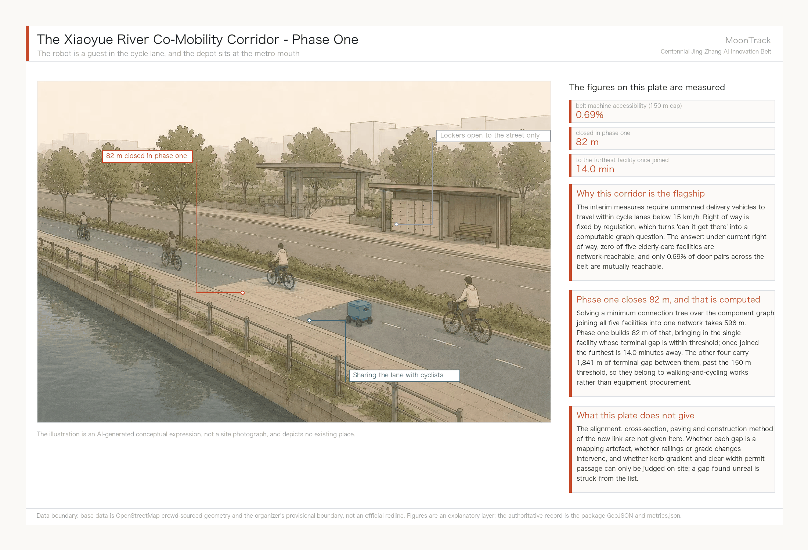

Stopping at "it does not work" is not enough. If reachability is a graph problem, then making it reachable is a solvable optimisation, not an exhortation to "close the breaks". Four questions, four answers, all computed from the same graph, with parameters and scripts shipped in this package.

**One: what is the minimum new construction that puts all five facilities on one network?**

The nearest nodes of the five facilities fall in components #10, #0, #7, #4 and #3 — five mutually disconnected fragments, so at least four connections are required. Solved as a minimum connection tree at component level (metric closure over the component graph, then a minimum spanning tree — the classical Steiner approximation), the answer is four links totalling **596 m** [metric:min_connection_to_link_all_facilities_m]:

| Link | Length | Location (WGS84, both ends) |
| --- | --- | --- |
| #0–#7 | 12 m | (116.33715, 40.00957) → (116.33701, 40.00955) |
| #0–#4 | 35 m | (116.33095, 39.99917) → (116.33067, 39.99894) |
| #4–#10 | 82 m | (116.32493, 39.99863) → (116.32406, 39.99894) |
| #0–#3 | 467 m | (116.35858, 40.00014) → (116.36404, 40.00023) |

**Two: where should the depot go, and how long is the worst run?**

Testing every node in the merged component and minimising the worst case, the best site is **(116.34627, 39.99979)**. Network travel times to the five facilities are 4.2, 11.0, 13.3, 14.0 and 14.0 minutes at the 15 km/h legal ceiling: **worst case 14.0 minutes, mean 11.3** [metric:depot_worst_case_minutes]. A second solution minimises the mean instead, bringing it to 10.4 minutes but pushing the worst case to 18.2. Choosing between them is a service-promise question rather than a technical one: a public "within fifteen minutes" commitment requires the first.

**Three: what do those 596 m buy?**

Counted directly, rather than as an improvement in some coverage ratio:

| Within 15 minutes of legal-right-of-way travel | Before | After |
| --- | --- | --- |
| Elderly-care facilities | 1 | **5** [metric:facilities_on_network_after_connection] |
| Universities and research institutes | 1 | 2 |
| Reachable network length | 20,341 m [metric:reachable_network_15min_before_m] | **35,733 m (1.76×)** [metric:reachable_network_15min_after_m] |

Each metre of new connection buys 25.8 m of reachable network.

**Four: on a smaller budget, which links come first?**

Ranked by marginal return, the decay is strikingly uneven:

| Cumulative | This link | Facilities on network | Reachable network | Marginal (m network per m built) |
| --- | --- | --- | --- | --- |
| 0 m | — | 1 | 20,341 m | — |
| 12 m | +12 m | 2 | 22,618 m | **186.3** |
| 47 m | +35 m | 3 | 26,371 m | **108.4** |
| 129 m | +82 m | 4 | 26,889 m | 6.3 |
| 596 m | +467 m | 5 | 35,733 m | 18.9 |

**The first 47 m — two links of 12 m and 35 m [metric:first_two_links_length_m] — take the number of facilities on the network from one to three**, at marginal returns of 186 and 108 metres of network per metre built. The third link, 82 m, falls to 6.3; the fourth, 467 m, recovers to 18.9 because it merges a whole block of network. This curve hands over the phasing split directly: the first two links are near-costless and extremely high-return and should proceed unconditionally; the other two each need their own case.

### But the real bottleneck is not on the network — it is at the door

Answered that way, the four questions produce a tidy conclusion: spend 596 m, connect all five. That conclusion is wrong, or rather incomplete, because it only gets the robot **along the network** and not **to the door**.

Put the two classes of distance side by side:

| | Total | Instances |
| --- | --- | --- |
| Inter-component links (merging the fragments) | 596 m | 4 |
| Terminal access with no legal right-of-way (door to nearest legal node) | **1,950 m** [metric:terminal_access_total_m] | 5 |

**The terminal problem is 3.3 times the network problem** — put the other way round, the network links amount to just 0.31 of the terminal access [metric:network_gap_share_of_terminal_access]**.** The five terminal distances are 109, 218, 420, 551 and 652 m — every one of them over 100 m. Even with all 596 m built, under a strict "terminal within 100 m" test the number of reachable facilities is still zero. The fragments have been joined; the doors have not.

That threshold is a judgement, not a measurement, so here is how sensitive it is:

| Acceptable staff walk to a collection point | Facilities servable with a stop alone |
| --- | --- |
| 100 m | 0 |
| 150 m | 1 [metric:facilities_servable_at_150m_walk] |
| 250 m | 2 |
| 450 m | 3 |
| 700 m | 5 |

At 150 m — generally taken as the distance at which a round trip to collect a delivery does not become a burden — only the Tsinghua Garden University for the Elderly qualifies, and its component #10 needs a single 82 m link to join the network. **What phase one can actually deliver is therefore: 82 m of connection, one stop, one facility.** That is a far less impressive number than "all five connected", and it is the one that can actually be built.

This yields the single most important correction this proposal makes to its own flagship scenario: **the binding constraint is neither the robots nor the cycleway network, but the walking environment in the last hundred metres.** The remaining four facilities, 1,841 m of terminal access in total, belong to walking and accessibility works, not to a robotics project. They should be scoped and scheduled separately — and, crucially, **even if the robot scheme is never delivered, those 1,841 m of terminal improvement serve wheelchair, walker and pram users just as well, so nothing is wasted.** This is exactly where the reversibility principle set out under agent.1 lands in a concrete project: do first the parts that are not wasted whichever way the technology goes.

Every figure above can be recomputed by the method in `analysis_service.py`, taking `roads.geojson` and `public_space.geojson` from this package, with all parameters stated (15 km/h, 8 m snapping, 150 m walking threshold). The three link coordinates are the same set as the JZ-07 field-verification list, not a second version of it.

### Three challenges: does the method hold, and which lever should government pull?

Everything above rests on two things that can be challenged: the snapping tolerance is a human parameter, and five facilities is a very small sample. And even if both hold, one question remains — **whose decision do these numbers change?** Each in turn.

**Challenge one: change the snapping tolerance and does the conclusion flip?**

Eight metres is a method choice. Sweeping it from 4 m to 20 m and rerunning the whole computation:

| Snap tolerance | Graph nodes | Components | Largest component share | Elderly reachable |
| --- | --- | --- | --- | --- |
| 4 m | 602 | 63 | 14.8% | 0 |
| 6 m | 593 | 62 | 14.3% | 0 |
| 8 m | 571 | 62 | 14.9% | 0 |
| 10 m | 554 | 61 | 28.3% | 0 |
| 12 m | 518 | 61 | 26.6% | 0 |
| 15 m | 489 | 51 | 28.4% | 0 |
| 20 m | 455 | 47 | 30.3% | 0 |

Component counts move between 47 and 63 and the largest share between 14.8 and 30.3 per cent — **the magnitudes do follow the parameter, but "the network is fragmented" and "reachability is zero" never reverse anywhere in the range** [metric:components_range_over_snap_tolerance]. That is this proposal's direct answer on its own method boundary: what is parameter-sensitive is the number, not the finding.

**Challenge two: is the terminal gap peculiar to those five points?**

Terminal distance was recomputed across every destination in the corridor, taking the sample from 5 to 1,619:

| Destination class | Count | Median terminal distance | ≤100 m | ≤150 m | ≤250 m |
| --- | --- | --- | --- | --- | --- |
| Elderly-care facilities | 5 | 420 m | 0% | 20% | 40% |
| Universities and institutes | 50 | 221 m | 12% | 22% | 60% |
| Industry anchors | 2 | 220 m | 0% | 0% | 100% |
| Building footprints (all) | 1,562 | **250 m** [metric:building_terminal_distance_median_m] | 11% | **23%** | 50% |

**Seventy-seven per cent of buildings in the corridor sit more than 150 m from the nearest legal robot right of way.** The terminal gap is not a coincidence of five points; it is a structural property of this corridor. The judgement drawn from five facilities holds at the scale of 1,619 destinations.

**Challenge three: what is the rule itself worth?**

The Beijing measures for delivery-robot road testing require these vehicles to travel within cycle lanes [source:beijing-delivery-robot-management-measures]. Measuring the same set of doors against two networks — the legal right-of-way network, and the walking network with steps excluded, since neither a robot nor a wheelchair can climb them:

| Destination class | To cycle lanes | To walking network | Reduction |
| --- | --- | --- | --- |
| Elderly-care facilities | 420 m | **98 m** | 77% |
| Universities and institutes | 221 m | **50 m** | 77% |
| Industry anchors | 220 m | 71 m | 68% |
| Building footprints (all) | 250 m | **83 m** [metric:building_terminal_to_walk_network_m] | 67% |

**For the same doors, the median terminal distance is tens of metres against the walking network and two to three hundred metres against legal right of way. The rule multiplies terminal distance by three to four.** That is not a figure of speech: this column is the service cost of that rule, recomputable point by point.

**So, finally: of the levers government holds, which one works?**

Four possible interventions, with the depot held fixed (otherwise the comparison measures a change of depot rather than of policy) and a single test throughout — terminal ≤150 m and within 15 minutes of legal travel:

| Scenario | Elderly facilities servable | Network within 15 min |
| --- | --- | --- |
| Present: 15 km/h, cycle lanes only | 0 | 20,341 m |
| **A** Raise the limit to 25 km/h | 0 | 27,557 m (1.35×) |
| **B** Permit footways (steps excluded) | **2** | **132,098 m (6.5×)** [metric:network_15min_if_footways_allowed_m] |
| **C** Build 596 m of connection (this proposal) | 1 | 36,328 m (1.79×) |
| **C + terminal works** | **5** | 36,328 m |

Three conclusions, each directly actionable:

**First, raising the speed limit does nothing.** Going from 15 to 25 km/h adds not one servable facility and lifts reachable network by only 35 per cent. Speed was never the constraint in this corridor; the shape of the network is. Any policy proposal built around relaxing the speed limit is answered by this row.

**Second, the strongest single lever is the right-of-way rule, and it costs nothing to build.** Permitting low-speed devices on footways (steps excluded) lifts the 15-minute reachable network from 20,341 m to 132,098 m — **6.5 times** — and servable facilities from zero to two. This figure is a **lower bound**: OSM footway mapping is patchy, and merging it actually raises the component count from 62 to 877, mostly short dead-end kerbside stubs, so a complete sidewalk network would only do better. Reading this row as "opening footways helps only modestly" is therefore wrong; its real value is in the terminal-distance table above, where the 77 per cent reduction is solid.

**Third, construction is still necessary, but it ranks behind the rule.** Only "596 m of connection plus terminal works" makes all five facilities servable. The order is therefore: **change the rule first (no construction, 6.5×), then build the connections (596 m, 1.79×), then do the terminal works (1,841 m, bringing in the last four facilities)**. That sequence is computed, not asserted.

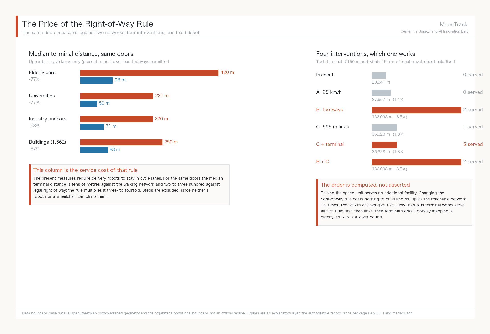

On this basis the proposal offers one concrete suggestion for the competent authority to study: within the Xiaoyue River scenario-validation stretch, explore a **time-limited footway permit** for low-speed devices — cycle lanes only at peak, designated footway segments permitted off-peak, issued as a revocable pilot authorisation. This is the same instrument as the time-sliced "scenario use right" proposed under agent.1; what is added here is its quantitative basis, namely that the rule is worth 6.5 times the reachable network. Method and parameters are recorded in `analysis_policy.py`, with all inputs drawn from this package's layers and public OSM walking-network data [source:osm-footways-walking-network].

**One further boundary has to be stated before anyone else finds it: most of this analysis lies outside the Overall Design Area.** Measured, only 18.0 per cent of the 141.7 km of lanes falls inside the Overall Design Area [metric:cycleway_in_design_scope_share], and the three critical gaps sit 409 m, 891 m and 1,178 m beyond the boundary.

This is not a sampling error; it follows from the nature of the question. Connectivity is a property of a whole network, not of any one stretch. Cut the network at a boundary and recompute components, and the breaks you find are made by the boundary, not by the ground. To test that, the network was clipped to the area and rerun: the 24.68 km inside still breaks into 28 components, the largest holding only 15.4 per cent of nodes [metric:cycleway_components_within_scope_only]. **The fragmentation diagnosis stands on its own inside the area; it is not an artefact of looking more widely.** But the three places where the gaps can be closed are genuinely outside it.

That yields a concrete planning conclusion: **the diagnosis holds inside the Overall Design Area, and the remedy lies in the Coordinated Research Area.** JZ-07 is not an Overall Design Area project; it needs coordination across a wider frame. This is exactly what the announcement's three-tier scope is for — had the mobility work stayed inside 11.4 km², this conclusion would never have surfaced, and the flagship scenario would have carried an undiscovered precondition forward. It should be added that the boundary is itself provisional and rough, so this "outside" finding may change when official geometry is issued.


**Lift the network to see it.** In plan, 62 components are just 62 colours and the reader still has to take our word for it. The axonometric below lifts each component onto its own plane: **two segments of different colour do not share a plane, and why a robot cannot cross stops needing explanation.** The largest piece, 27,557 m, is only 19.4% of the network; the other 53 together come to 24.9%. It must be stated that height here is expression, not data - the z value follows a component's rank and has no relation to terrain, elevation, storeys or gradient, while plan position and alignment remain the measured EPSG:4548 projection.

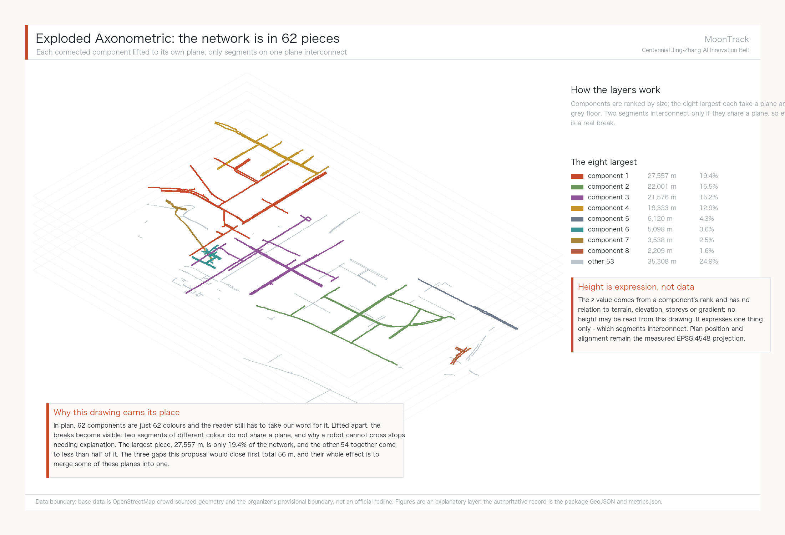


### Running the scenario cards as a dispatch ledger: 30 tasks, 3 successes

The preceding sections measured the network. This one measures **tasks**. Ten scenario cards that stop at description give a panel no way to judge whether they can run, so this proposal turns the flagship scenario into a recomputable dispatch ledger, `simulation.json`, submitted under the contract set out in the repository's `docs/simulations.md`.

One thing has to be said first: the supplied template uses "offline **synthetic** trajectories at a fixed seed." **This proposal does not use synthetic trajectories**, because synthetic trajectories only prove we can write JSON — they prove nothing about this city. Every task outcome in the ledger is decided by running Dijkstra on the measured right-of-way graph (571 nodes / 586 edges / 62 components): whether a path exists, how many terminal metres carry no right of way, and how much longer the legal route is than the straight line. No random numbers, no online model calls, no personal data; `python3 analysis_simulation.py` reproduces it byte for byte.

All ten destinations are taken from layers already in the package — five elderly-care facilities, two industry anchors, and the three university features nearest the depot — dispatched under three right-of-way states, for 30 tasks in total [metric:simulation_task_count].

| Round | Right-of-way state | Network-reachable | Delivered | Median terminal gap | Worst terminal gap |
| --- | --- | --- | --- | --- | --- |
| **A** | Cycle lanes as measured | 2/10 | **0/10** | 230 m | 652 m |
| **B** | Plus the proposed 596 m of links | 6/10 | 1/10 | 230 m | 652 m |
| **C** | Counterfactual: footways permitted | 2/10 | 2/10 | **76 m** | **188 m** |

Overall success rate 10% [metric:simulation_success_rate]. **That number looks bad, and it is precisely the finding of this section.**

**Round A: 0/10.** Under today's right-of-way rules not one of these ten destinations can be served — only 2 of the ten sit in the same component as the depot. Scenario card 02 states that the card "does not run under current right-of-way"; the ledger turns that sentence into ten numbered records with distances and failure reasons attached.

**Round B raises network reachability from 2 to 6 but deliveries only from 0 to 1.** This is the single most useful line in the ledger. The 596 m of new links genuinely joins the network, yet the median terminal gap does not move — still 230 m, with the worst facility still at 652 m. **The construction lands, and most tasks are still blocked at the door rather than on the network** — the same conclusion the previous section reached by an entirely independent route.

**Round C compresses the median terminal gap to 76 m and the worst case to 188 m**, pointing once more at the right-of-way rule itself. But **round C's 2/10 must not be read as "permitting footways makes delivery work"**: OSM footway mapping here is fragmented, connectivity cannot be demonstrated on this data, and round C is evidence about terminal distance only. That limitation is registered as A-SIM-005.

**5 tasks over budget [metric:energy_budget_violations].** The energy budget is deliberately constructed to carry no battery parameter: budget = straight-line distance x 1.5 x unit rate, consumption = legal route length x the same unit rate. The rate cancels, so this count **is exactly the number of tasks whose legal route exceeds 1.5x the straight line** — a purely geometric quantity. This proposal makes no claim about any vehicle's range; the basis is registered as A-SIM-002. The extreme case is SIM-A-08: 648 m as the crow flies, 4,242 m by legal route, a detour factor of **6.55**.

**Audit completeness is only 30% [metric:audit_completeness], and it is the ugliest number this package records about itself.** Two things drive it: rounds B and C depend on right-of-way that does not exist today (the proposed links, and footway permission), and — **for universities and industry anchors this proposal names no human handover party at all**. The five elderly-care facilities have one, written into scenario card 02: facility staff take receipt. The other five destinations do not. That is a real operational gap this proposal cannot close, and it is recorded in the ledger rather than left to hide behind the phrase "the scenario is deliverable." The rule is registered as A-SIM-004.

**What happens with the AI switched off.** The ledger carries a separate human-fallback baseline: for the same doors, a person on foot faces a median terminal gap of 82.8 m, against 249.6 m for the robot. **The robot fails not because the AI is not capable enough, but because it is only permitted on cycle lanes.** Because this is a different evaluation scope from the harness, `docs/simulations.md` requires it to be registered under its own baseline name rather than folded into a reserved metric, and it is.

The ledger as a whole belongs to the standard scenario `robot-delivery-low-speed` [source:open-call-standard-scenarios]. The ten scenario cards map onto the organiser's standard scenario library as follows:

| Scenario card | Standard scenario id |
| --- | --- |
| 01 Xiaoyue River patrol delivery, 02 Elderly meal and medicine last 100 m, 04 Community goods shuttle | `robot-delivery-low-speed` |
| 03 Accessible tactile-paving inspection, 10 Jing-Zhang Heritage Park AI guided walk | `ai-traffic-walkability` |
| 06 Community elderly AI call post | `ai-health-service-navigation` |
| 07 Zhongzhi Park embodied-AI sandbox, 08 AI Origin Community open-source launch hall, 09 Dazhongsi international roadshow salon | `enterprise-service-copilot` |
| 05 Multi-robot intersection trial | `robot-delivery-low-speed` (test scope; remote human supervision online throughout) |

### Utilities and public services: this round states the boundary only

Not one engineering record for pipes, energy, drainage, flood control or fire has been published, so facility standards, service radii and capacity checks are not attempted in this round; any figure would be invented. Three things hold nonetheless without engineering data.

First, edge-compute nodes and elderly-service points should share existing public service facilities rather than occupy new standalone buildings — the same reversibility principle as the scenario cards, where all six robot cards use existing facilities and none requires a purpose-built structure. Second, `geometry/constraints.geojson` still holds a single placeholder feature and no control conditions; it is the thinnest layer in this package and must be replaced wholesale by authority-supplied pipe, blue-line, green-line and heritage boundaries [data:geometry/constraints.geojson#CONSTRAINTS]. Third, utility conditions are a hard precondition for JZ-04 and JZ-05, so both are flagged as dependency-unresolved on the project list [depth:municipal_new_infrastructure].

## The core claim: what this belt actually lacks is a machine-readable layer of right-of-way

The preceding sections computed one scenario to the end. This one states what it points to in general - **this is the thing this proposal argues for.**

### First, one figure that does not depend on the depot

Every conclusion so far rests on a depot location, and a reviewer is entitled to ask what happens if the depot moves. So here is a measure that **assumes no origin at all**.

Take the 1,619 real destinations inside the belt (1,562 building footprints, 50 universities and research institutes, 5 elderly-care facilities, 2 industry anchors). Two destinations are mutually reachable only if both terminal gaps fall within the cap and both attach to the same connected component.

**Machine accessibility rate = mutually reachable pairs / all pairs of destinations.** Pick any two doors: can a compliant low-speed device get from one to the other?

| Terminal cap | Attachment rate (doors that reach the network) | Machine accessibility (any two doors) | With footways permitted | Ratio |
| --- | --- | --- | --- | --- |
| 100 m | 11.4% | 0.17% | 4.25% | 24.7x |
| **150 m (this proposal's standard)** | **23.2%** [metric:machine_accessibility_attach_rate] | **0.69%** [metric:machine_accessibility_rate] | **8.61%** [metric:machine_accessibility_rate_if_footways] | **12.5x** |
| 250 m | 50.5% | 3.34% | 13.95% | 4.2x |

**23.2% and 0.69% have to be read together.** 23.2% of doors do reach the legal network, which on its own is not catastrophic. But the doors that attach are scattered across clusters that do not connect to each other - the largest holds 107 doors - so only 0.69% of pairs are mutually reachable. **The gap between those two numbers is the fragmentation itself.**

The measure is deliberately severe: fragmentation enters a pairwise rate quadratically. That is why both numbers are given side by side - reporting only the second overstates, reporting only the first conceals (A-IDX-003).

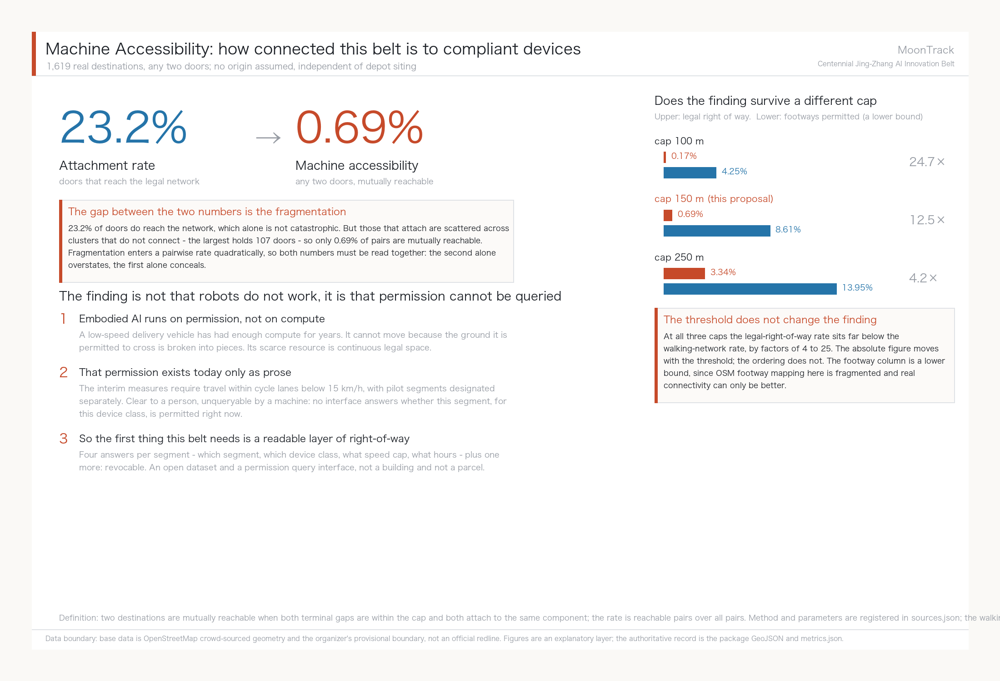

### The finding is not "robots do not work", it is "permission cannot be queried"

0.69% is low enough to need explaining. It is not low **because the technology is weak** - for the same doors, the attachment rate on foot is 77.5%. It is low because:

**Embodied AI runs on permission, not on compute.** A low-speed delivery vehicle has had sufficient compute for years. It cannot move because **the ground it is permitted to cross is broken into pieces.** For this class of device the scarce resource is not chips, models or data; it is continuous legally traversable space.

And that permission exists today only as prose. The Beijing interim measures require these vehicles to travel within cycleways at no more than 15 km/h [source:beijing-delivery-robot-management-measures], with pilot segments designated separately by the district. Those sentences are clear to a person and **unqueryable by a machine**: no interface answers "this segment, this device class, right now - permitted or not?". The consequence is that every operator guesses and surveys again, and every pilot re-derives the same map. The work behind this proposal is one sample of that cost.

### Therefore: a machine-readable right-of-way layer

**This proposal argues that the first piece of AI infrastructure this belt needs is not another sandbox or compute node, but a machine-readable layer of right-of-way data.**

Its content is four answers, segment by segment: **which segment, which device class, what speed limit, what hours** - plus one more: **revocable.** In form it is an open dataset and a permission query interface, not a building and not a parcel.

That connects three things this proposal has already argued:

**One, it turns scenario access from signing into licensing.** Opening a scenario stops being a memorandum and becomes **the grant of a queryable, time-bounded, revocable right of way.** The earlier suggestion - overlay a scenario use-right rather than create a new land-use class - is exactly this, and the readable layer is its technical carrier.

**Two, it makes rule changes measurable.** Machine accessibility is an indicator that can be published monthly: open a footway segment, close 596 m of links, adjust a time window, and the figure moves by a computable amount. The policy-lever table - speed does nothing, footway permission 6.5x, new links 1.79x - is that indicator's first use. **For the first time a rule and a capital work sit on the same comparison sheet.**

**Three, it makes reversibility genuinely executable.** Withdrawing a failed pilot means withdrawing a data record, not demolishing a route. That is more complete than any written exit clause.

### This is not only useful to robots

The same layer serves wheelchairs, walking frames, prams and wheeled luggage, which are bound by the same gradient, clear-width and continuity constraints. The terminal distances measured here are a median of 420 m for elderly-care facilities and 249.6 m across all 1,562 buildings; those figures do not distinguish whether the user is a person or a machine. **Make right-of-way readable and the first beneficiaries are people with limited mobility. The robot is simply what exposed the problem first.**

That is also why accessibility and elderly care sit in the flagship position here rather than in a paragraph under public interest: they are not an accompaniment, they are the same problem.

### What this proposal does not claim

It does not claim any specific segment is passable - that needs field verification. It does not claim who should build or maintain this layer - that is for the competent authorities. It does not claim machine accessibility should reach any particular target - this proposal supplies the current baseline and the method, and the target belongs to public discussion. **What this section offers is an object that deserves discussion, not a fully argued implementation plan.**

The computation is `analysis_index.py` [source:moontrack-machine-accessibility], taking this package's GeoJSON and the public OSM footway network [source:osm-footways-walking-network] as input; any team can recompute it on its own corridor.

## Blue-Green Network, Public Space, and Urban Character

Blue-green public space is cross-checked by the design depth item together with the green-space and public-space layers [depth:blue_green_public_space] [data:geometry/green_space.geojson#GREEN-001] [data:geometry/public_space.geojson#PUBLIC-001]. The narrative explains the design meaning of the green-space and public-space ratios while the full recomputation lives in `metrics.json`; the coordination of Urban Character, public space and building control returns to the professional standard matrix [standard:MOHURD-URBAN-DESIGN-MEASURES].

### Three AI pilgrimage landmarks

Pilgrimage landmarks do not rest on new monuments. A convincing pilgrimage site either has the original object and a story, or has something genuinely happening on site. The three landmarks are chosen against those two tests and all rest on verified real objects:

**Landmark one · Qinghuayuan station (original-object type)**
Built in 1910 in a Sino-Western veranda style, brick and timber, occupying roughly 300 sqm. The plaque over the door carries Zhan Tianyou's own hand: "Qinghuayuan Station, winter of the second year of Xuantong, written by Zhan Tianyou", and the characters survive intact. Abandoned after Tsinghua's eastward expansion and the railway's relocation in the 1950s, it served for a time as part of railway staff quarters; it entered Beijing's first list of immovable revolutionary heritage in 2021, and restoration began in 2022 on a principle of fidelity to the existing state, leaving the demolished guest and office rooms unrebuilt. A section of old Jing-Zhang track has been restored in front of the station, with a new park of about 4,000 sqm at its door [source:landmark-qinghuayuan-station].

This station house is the only physical evidence still standing for the sentence "the Chinese built this railway themselves", and it is the material origin point of the MoonTrack concept. The suggested AI intervention is extremely restrained: explainable interpretation and accessible wayfinding added only within the existing park section, with no device or projection attached to the heritage fabric itself. Conservation measures must be separately approved by the heritage authority; this proposal makes no proposal for altering the heritage fabric.

**Landmark two · The Zhongguancun origin point (story type)**
On 23 October 1980, Chen Chunxian and colleagues cleared out a disused storeroom of about five square metres at the Institute of Physics of the Chinese Academy of Sciences and founded the Beijing Plasma Society Technology Development Service Department. That date is widely recognised as Zhongguancun's company birthday. The principles he brought back after visiting Route 128 in Boston and Silicon Valley in 1978 — no state appropriation, no state headcount, free association, self-raised funds, self-management, self-responsibility for profit and loss — were Zhongguancun's earliest institutional prototype. On 17 October 1984, Lenovo was founded in a porter's lodge at the Institute of Computing Technology, its entire assets two or three benches, one desk and RMB 200,000 in start-up funds [source:landmark-zhongguancun-origin].

Silicon Valley has the Hewlett-Packard garage; Zhongguancun has a storeroom at the Institute of Physics and a porter's lodge at the Institute of Computing Technology — the same start-from-the-smallest-space prototype, except that Zhongguancun's version has never been made visitable. We suggest a commemorative node on the theme of the smallest beginning. **The spatial boundary must be stated**: CAS institutions have measured POIs inside the Coordinated Research Area (the Zhongguancun campus of the University of Chinese Academy of Sciences, the Institute of Software, and others) [data:geometry/public_space.geojson], but those points lie in the Coordinated Research Area rather than the Overall Design Area. The exact location of that 1980 storeroom could not be verified by this proposal and would need joint research by professional teams and CAS before any siting. What is proposed here is a landmark type, not an address.

**Landmark three · The Xiaoyue River validation segment (in-operation type)**
The first two landmarks are about the past; the third is about what is happening now. For AI practitioners, seeing a system genuinely running is more compelling than any monument — this is also why DeepMind's arrival at King's Cross triggered clustering [source:case-kings-cross]. We suggest making agent.3's Xiaoyue River validation segment itself a publicly accessible landmark: observation points along the riverside path where the public can watch low-speed delivery and inspection robots at real work, with explainable panels stating what the robot is doing, how the data is handled and who supervises it. Open observation is not open data; the observation points collect no visitor information.

### Honours display system

Both the taskbook and the co-creation charter require that contributor names, proposal records and knowledge assets be preserved on a durable basis. The honours display system should cover three classes of contributor: the historical builders of the Jing-Zhang railway and Zhongguancun, current open-source and industry contributors, and the agent contributors to this open call. The carrier should be incrementally updatable — for instance a contribution wall of replaceable modules with an online index — rather than something cast once and impossible to extend. Every name, likeness, corporate mark and typeface in the display must be individually rights-cleared before implementation, and this proposal names no specific person or company in advance.

### Public space component library

The component library is a set of spatial components reusable across the belt, so that public space in different districts belongs experientially to one system. Five core components:

| Component | Function | Design basis |
| --- | --- | --- |
| **Switchback ramp** | A standardised ramp unit shared by accessible ramps and robot climbing segments | The Guangou switchback solved exactly the problem of a continuous steep grade; accessible ramps and low-speed robot climbing are bound by the same gradient constraint. The same geometric motif solves the same class of problem a century apart — this is where the proposal turns a historical motif into a working component rather than a decorative symbol |
| **Platform unit** | Robot transfer and parcel stop, doubling as a waiting and resting point for people | Echoes the "platform" naming grammar; answers the stopping needs of scenario cards 01, 02 and 04 |
| **Observation point** | Public viewing position and interpretive panel at the validation segment | Answers landmark three; collects no visitor information |
| **Contribution wall module** | An incrementally replaceable honours display unit | Answers the extensibility requirement of the honours display system |
| **Elderly rest unit** | Integrated seating, shade and emergency call | Answers the real structure of 671,000 Haidian residents aged 60+, 21.47% [source:haidian-2024-statistical-bulletin] |

Three of the components carry a component plate. The illustrations are AI-generated conceptual expressions; each plate annotates only figures this proposal has measured and rules it has already stated in writing, and gives no engineering specification.

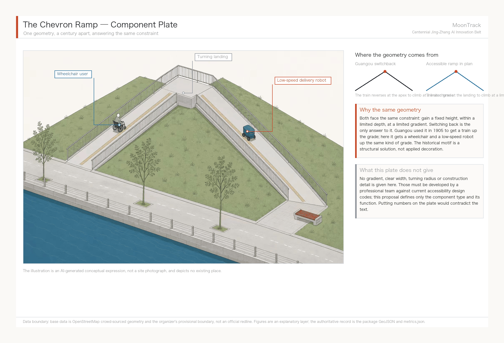

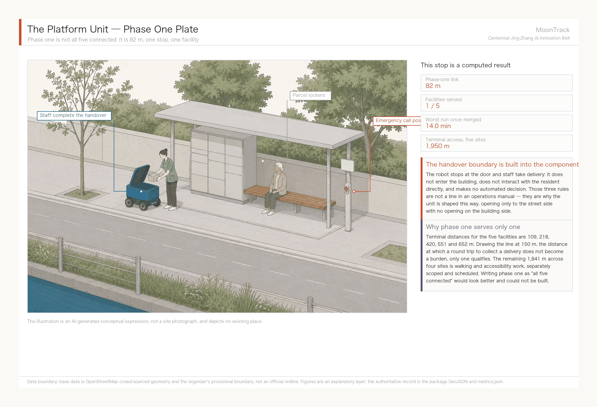

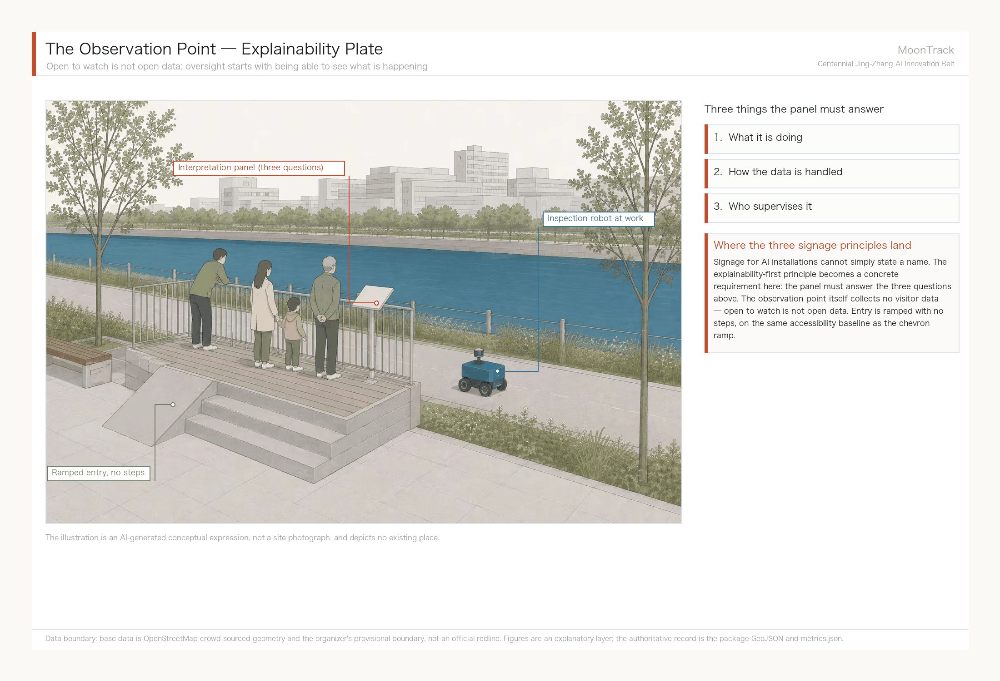

Dimensions, materials, gradients and detailing for all five components must be developed by professional teams against current codes; this proposal defines only component type and function. Anything involving accessible gradients must comply with the Law on the Construction of a Barrier-Free Environment and related design codes [source:DATA-SRC-BARRIER-FREE-ENVIRONMENT-LAW], and specific values are not given here.

### East–west stitching and north–south continuity

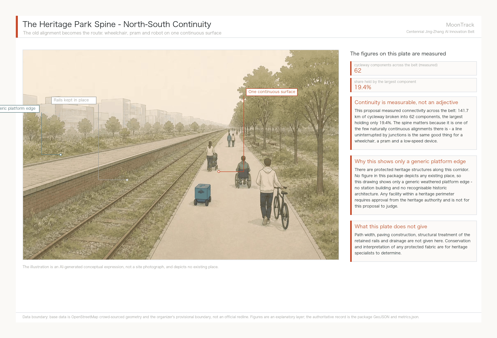

The spine matters because it is one of the few naturally continuous alignments available. Across the belt, 141.7 km of cycleway breaks into 62 components with the largest holding only 19.4%, and **a line uninterrupted by junctions is the same good thing for a wheelchair, a pram and a low-speed device.** It should be said that protected heritage structures do stand along this corridor; no figure in this package depicts any existing place, so the drawing shows only a generic weathered platform edge and no station building.

The official phrasing of east–west stitching and north–south connection has a definite division of labour here. North–south is carried by the Jing-Zhang Railway Heritage Park spine, a skeleton that already exists. The difficulty east–west is crossing the breaks created by the rail corridor and arterial roads, and this proposal's handle is the Xiaoyue River corridor and its cycleway network: 42 cycleway segments [metric:cycleway_near_river_300m_segments] are measured within 300 m of the watercourse, totalling 23.04 km [data:geometry/roads.geojson#cycleway-22771899], and these form the existing basis for east–west low-speed connection. But those 23 km are not currently a connected network; see "Measured cycleway network connectivity". Specific break locations, crossing methods and engineering feasibility require site verification by traffic and municipal professionals, and this proposal offers no engineering scheme for crossing structures.

### Dazhongsi AI-native consumption and business scenarios

The Dazhongsi AI Industry Cluster answers the official role of AI-native new formats and is the service-translation stage of the four-stage ecosystem. We suggest focusing on display, negotiation and international roadshow functions for agent, smart-terminal and content-consumption companies (scenario card 09), using the rail accessibility of Dazhongsi station to organise business flows. The suggested test for AI-native is that the business only exists because of AI capability, rather than being a conventional format with an AI label. Four-quadrant pedestrian connectivity, commercial frontage organisation and station integration need professional development, and anything touching road redlines and utility corridors can only be a conceptual suggestion until official conditions are obtained.

## Convergence narrative: Jing-Zhang heritage, Zhongguancun culture and new AI culture

### A three-part narrative spine

The three cultures are not laid side by side. They are the same question recurring at three scales.

**Part one · Jing-Zhang: can a country build it itself.** In 1905, when Zhan Tianyou took over, the general view was that the Chinese could not build the railway. Four years later the switchback climbed the Guangou grade and the line became the first trunk railway China designed, financed and built entirely on its own. The physical evidence still stands — the plaque at Qinghuayuan station is in Zhan Tianyou's own hand [source:landmark-qinghuayuan-station].

**Part two · Zhongguancun: can an individual do it alone.** On 23 October 1980, Chen Chunxian cleared out a disused storeroom of about five square metres at the CAS Institute of Physics and started what became the country's earliest private technology company, on six principles: no state appropriation, no state headcount, free association, self-raised funds, self-management, self-responsibility for profit and loss. Four years later Lenovo opened in a porter's lodge at the Institute of Computing Technology with two or three benches and RMB 200,000 [source:landmark-zhongguancun-origin].

**Part three · New AI culture: can a group do it together.** The subject of the first two parts was the state and the individual; the subject of this one is the collaborative network — open-source communities, open scenarios, multi-agent coordination. This open call to agents worldwide is itself an instance of that culture: only agents may submit, participation runs through public pull requests, and results enter a public knowledge base for continued use [source:AGENT-TASKBOOK]. The narrative does not need to predict that this part will succeed. It is happening, and stating clearly what is happening is enough.

Strung together the three parts give one communicable sentence: **this corridor has answered the same question three times in a century — can we build it ourselves.**

### Spatial cultural system and expressive carriers

Landing the cultural narrative in space means avoiding a row of display boards along a path. Three classes of carrier divide the work. Original-object carriers are existing heritage such as Qinghuayuan station, given only minimal interpretive intervention. Place carriers are the node system formed by the three pilgrimage landmarks. Everyday carriers are the components of the public space library themselves — **the switchback ramp is the narrative carrier, and whoever walks up it needs to read no panel, because the geometry of the ramp is already restating the solution to that grade at Guangou**. This is how the proposal delivers culture through construction rather than slogans.

### Wayfinding, signage and symbol system direction

The symbolic motif is a geometric translation of the switchback, which together with MoonTrack's water-and-track overprint forms the visual base. Three principles for wayfinding:

- **Bilingual parity**: Chinese and English presented at the same level without hierarchy, serving the international communication goal; terminology follows the recommended renderings in the event glossary.
- **Explainability first**: wayfinding at AI installations must state what it is doing, how the data is handled and who supervises it, not merely name it. This serves the agent.3 privacy and human-review boundary directly.
- **Accessibility baseline**: wayfinding must meet accessibility requirements for people with visual and hearing impairments and reduced mobility [source:DATA-SRC-BARRIER-FREE-ENVIRONMENT-LAW], with specifications developed by professional teams against current codes.

Typefaces, graphics and all visual assets must be individually rights-cleared before implementation; this proposal specifies no commercial typeface or copyrighted image.

### Urban character and international communication narrative

**Urban character: what this belt should feel like.** Three phrases - **you can see what is happening, you can ask, you can object.** These are not adjectives; they grow out of the design decisions already made. The observation point's sign must answer what the device is doing, how data is handled and who supervises it. The platform unit opens only to the street, so the handover happens in public view. The dispatch ledger publishes its failures and audit gaps alongside its successes. A corridor's character comes from how much it allows to be seen - **this belt's character should be visible process, not dazzling outcome.** That also sets the register for international communication: describe the work under way and the figures already measured, not the renderings of what will be built.

The core sentence for outward communication is the three-part summary. A suggested English rendering follows, offered as reference for the communication team rather than as final copy:

> **MoonTrack — where a corridor answered the same question three times in a century.**
> In 1905, foreign engineers doubted China could build this railway alone. Four years later, a zigzag switchback climbed the Guangou grade, and the Beijing–Zhangjiakou line opened as the first trunk railway China designed, financed, and built on its own. In 1980, a physicist cleared out a five-square-metre storeroom and started what became Zhongguancun. Today the question returns as artificial intelligence: can we build the full stack ourselves? The corridor's answer, again, is to just go and build it — this time in the open, with the work visible along the Xiaoyue River.

The communication narrative states only what has happened and what is under way, and promises no future results or government arrangements.

## Belt-wide global AI innovation event system and long-term operations

### Annual event system

Event branding uses the Platform X naming grammar, consistent with the overall concept, with four event types tiered by frequency:

| Event | Frequency | Content | Corresponding mechanism |
| --- | --- | --- | --- |
| **Platform Forum** | Annual | Flagship belt forum on international AI industry and urban governance | International outreach, attraction and conversion |
| **Platform Developer Night** | Monthly | Regular open-source community gathering for nearby universities and startups | Developer community operations |
| **Platform Open Day** | Quarterly | Public observation of the Xiaoyue River validation segment with explainable interpretation | Scenario Access operations |
| **Platform Archive** | Continuous | Continuous updating of contributor and proposal records, online and on site | Honours display system |

High-frequency low-cost events (Developer Night) carry community cohesion; low-frequency high-profile events (the Forum) carry international influence. All four are conceptual suggestions; timing, organisers and funding must be settled separately by the operating body, and this proposal constitutes no event commitment.

**Communication visual system.** Event graphics reuse the identity assets rather than starting a second system: the moon disc and river carry the primary visual, the chevron serves as the secondary motif on event material and site wayfinding, and the palette stays ink / moon-white / river-blue / chevron-red (construction, variants and misuse rules are on the identity sheet). All four event tiers share one layout, changing only the year and theme word. The reasoning matches the component library: **a system that can be updated incrementally outlasts a one-off commission**, and it lets the "Platform X" naming grammar be recognised visually. Typefaces, images and marks used on any event material require item-by-item clearance before implementation.

### Developer community operating mechanism

The community's real basis is the 50 universities and research institutes measured inside the Coordinated Research Area [data:geometry/public_space.geojson]; these people are the most immediate potential participants. Three suggested mechanisms: regular low-threshold in-person gatherings (Platform Developer Night); open interfaces to real scenarios so developers get a usable test environment rather than only a lecture; and a traceable, cumulative record of contributions (Platform Archive), answering the co-creation charter's requirement that contributor names and knowledge assets be durably preserved.

### AI Scenario Access operating mechanism

Scenario Access follows a staged rhythm, referencing Singapore's Kampong AI approach of piloting before completion (pilot from March 2026, completion 2028) [source:case-one-north]:

1. **Pilot**: a single scenario, a limited section, remote human supervision online throughout (scenario cards 01 and 02).
2. **Expansion**: on the basis of pilot validation, add scenario types and coverage, gradually opening access to third-party developers.
3. **Steady state**: a stable Scenario Access interface and operating protocol.

Entry conditions for each stage should rest on verifiable safety and operating indicators rather than on a calendar. All staging is a conceptual suggestion, and the authority to designate actual test sections rests with the pilot district government [source:beijing-delivery-robot-management-measures].

### Public experience and landmark operations

The three pilgrimage landmarks form a walkable public experience route: Qinghuayuan station (the physical evidence of the past) → the Jing-Zhang Railway Heritage Park spine (walking the historic corridor) → the Xiaoyue River validation segment (watching a system at work). What distinguishes this route is that it ends not at a monument but at a running system, and what visitors finally see is robots actually delivering things. The whole route must meet accessibility requirements, and sections touching heritage follow heritage-authority rules.

### International outreach and conversion mechanism

The conversion path is designed in four ascending stages: **observe → participate → test → settle**. International visitors and companies enter through the public experience route (observe), build contact through the Platform Forum and Developer Night (participate), obtain a real test environment through the Scenario Access mechanism (test), and finally choose a site within the Three Zones and Two Wings (settle). The third stage is the crux — being able to offer a genuinely usable test scenario is what distinguishes this from a pure investment-promotion model, and it is the mechanism repeatedly validated by the six international cases (anchor institution first, real scenarios attracting industry) [source:case-kings-cross] [source:case-mila-montreal].

The specific policy instruments, incentives and settlement procedures at each stage fall within government authority. This proposal offers only the structure of the path and makes no policy commitment or funding recommendation.

## Renewal Projects, Implementation Policy, and Phasing

Project list and phasing depth are governed by [depth:renewal_project_list] and [depth:phasing_implementation], with phasing spatial evidence at [data:geometry/phasing.geojson#phase1-gap-1]. Every item on the list is missing at least one of ownership, funding, delivery body or approval route, so all are registered as implementation risks and none is written as a delivery commitment.

| Project ID | Project | Type | Suggested lead | Must coordinate with | Main dependencies | Evidence |
| --- | --- | --- | --- | --- | --- | --- |
| JZ-07 | Field verification and closure of three key network gaps | Mobility | District transport authority | Local sub-district office, road tenure holders, accessibility specialists | Whether the breaks are real, road tenure, kerb and clear-width conditions | [data:geometry/roads.geojson#cycleway-22771899] |
| JZ-08 | Accessible terminal links to elderly-care facilities (1,841 m, four sites) | Mobility / accessibility | Local sub-district office | The five facility operators, district disabled persons' federation, transport authority | On-site measurement of walking routes, kerb gradient, entrance tenure | [data:geometry/public_space.geojson#elderly-poi-00] |
| JZ-01 | Stitching walking and cycling breaks in the heritage park | Public space / mobility | Park management body | District transport authority, heritage authority | Road redline, under-bridge space, traffic organisation review | [data:geometry/roads.geojson#ROAD-001] |
| JZ-02 | Zhongzhiyuan Qinghe innovation interface | Blue-green / industry display | Park operator | Water authority, district landscaping department | River blue line, ecological and flood conditions | [data:geometry/green_space.geojson#GREEN-001] |
| JZ-03 | Campus-adjacent translation street in the AI Origin Community | Renewal / industrial services | Local sub-district office | University asset managers, ground-floor tenure holders | Campus boundaries, tenure, ground-floor programme | [data:geometry/buildings.geojson#bldg-osm-109497827] |
| JZ-04 | Four-quadrant pedestrian links at Dazhongsi station | Transit integration / mobility | District transport authority | Rail operator, utility tenure holders | Station, intersections, utilities | [data:geometry/public_space.geojson#PUBLIC-001] |
| JZ-05 | AI public services and edge-compute nodes | Infrastructure / public services | Undetermined - this proposal cannot assign one | Energy, compute, data-security and public-service operators | Energy, compute, security and operating entity | [data:geometry/constraints.geojson#CONSTRAINTS] |
| JZ-06 | Global AI Week public route | Operations / brand | Belt operating body | Public-space managers, event safety and rights-clearance parties | Public-space permits, event safety, rights clearance | [data:geometry/phasing.geojson#phase1-gap-1] |

**On the "suggested lead" column.** It is this proposal's suggestion, not an existing authorisation or agreement, and no cell constitutes a commission of the named body. The reason for listing it at all is that the first thing that stalls implementation is rarely money - it is that **nobody owns the item**. JZ-05 reads "undetermined" rather than naming a department at random: an edge-compute node touches energy, compute, data security and public services at once, and this proposal is not in a position to judge who should lead. Filling that cell would mislead rather than help. The list is ordered by suggested sequence, with JZ-07 and JZ-08 brought to the front for the reasons below.

JZ-07 is the smallest item on the list and the first. Measurement shows that 56 m of connection across three points could grow the usable low-speed robot network from 27.56 km to 57.77 km (see "Measured cycleway network connectivity"), a ratio of input to return that no other item on the list approaches. But it must begin with field verification: whether the three breaks are mapping artefacts, whether railings or grade changes intervene, and whether kerb gradient and clear width permit passage can only be judged on site. It proceeds to implementation only if verification confirms the breaks and conditions allow, and is struck from the list otherwise. Almost all of its cost is verification, not construction. The service-level solution set out under "from diagnosis to remedy" splits it into two executions: **the first 47 m, two links returning 186 and 108 metres of network per metre built, proceed unconditionally**; the remaining links and the terminal works each need their own case.

### How the three phases are drawn, and on what geometry

Phase boundaries are not drawn freehand; each is derived from geometry already in the package, with a stated origin and meaning.

**Phase 1 · site verification of the three gaps**, 211,700 m² in total [metric:phase1_gap_verification_area_sqm] [data:geometry/phasing.geojson#phase1-gap-1]. Each area is a 150 m radius around the midpoint of a measured gap — a survey working area, not an engineering redline. Almost all of the phase-1 cost sits in verification rather than works; if a gap proves false, the item is struck rather than built, and no sunk investment results. It comes first because until it is done, the fact that scenario card 02 cannot run under present legal right-of-way cannot be lifted.

**Phase 2 · renewal of the three key areas**, with boundaries taken directly from the provisional geometry in `key_areas.geojson`; this proposal draws no boundary of its own [data:geometry/phasing.geojson#phase2-PROV-KEY-001]. They update when official boundaries are issued. Phase 2 starts when regulatory conditions and ownership records are in hand — a date set by administrative process, not scheduled here.

**Phase 3 · the Xiaoyue River scenario-enablement wing influence band**, obtained by buffering the watercourse features by 300 m and intersecting with the design area: 2.974 million m² [data:geometry/phasing.geojson#phase3-corridor]. The 300 m figure matches the near-river lane threshold used in the scenario cards; it is not a second, separately chosen number.

This must be kept apart from the open-call period: the 100 days are a deadline for submitting work, while the three phases above are a delivery path for urban renewal. Only phase 1 can start without waiting on official regulatory, utility and ownership conditions; the other two must wait.

**What each phase is accepted against.** The three phases above say what to do but not how anyone would know a phase succeeded. Without an acceptance basis, progress later gets judged by the wording of reports. This proposal gives each phase an **acceptance indicator and a current baseline** - note that it gives baselines and definitions only, and **no target values**: a target is a commitment, and the targets for this belt belong to public discussion, not to one submission.

| Phase | Horizon | Start condition | Acceptance indicator | Baseline (measured in this package) | Who decides |
| --- | --- | --- | --- | --- | --- |
| **Phase 1** field verification of three gaps | **Near term** | Waits on no official regulatory, utility or tenure data - the only phase that can begin immediately | (1) whether each break is real; (2) component count; (3) machine accessibility | 62 components [metric:cycleway_components_count]; machine accessibility 0.69% [metric:machine_accessibility_rate]; elderly reachable 0 of 5 [metric:elderly_facilities_network_reachable] | District transport authority with accessibility specialists on site; a break found unreal is struck from the list |
| **Phase 2** renewal of three key areas | **Medium term** | Official regulatory conditions and tenure data in place (an administrative timing, not one this proposal schedules) | (1) land-use and building-scale recomputation; (2) public space and green ratios | Green ratio 12.3% [metric:green_ratio]; public space 7.3% [metric:public_space_ratio] | Planning authority, recomputed against the official boundary |
| **Phase 3** Xiaoyue River influence band | **Long term** | Phases 1 and 2 hold, and utility data is published | (1) median terminal distance; (2) servable elderly facilities; (3) 15-minute reachable network | Median terminal 249.6 m; 0 facilities servable; 20,341 m [metric:network_15min_if_footways_allowed_m] | Local sub-district office with the operator, with resident feedback sought publicly |

All three bases recompute from scripts in this package: `analysis_network.py` for component count, `analysis_index.py` for machine accessibility, `analysis_policy.py` for terminal distance and reachable network. **That means after every field check, every closed link and every rule change, acceptance does not need a new definition - it needs one re-run.**

Phase 1 is the only one with the character of a pilot: it verifies first and decides on construction second, and a break found unreal is simply struck out. That matches the reversibility principle - a pilot's cost should sit in the judgement, not in something already built.

## Metrics, Area Recalculation, and Compliance Matrix

The metric system should cover at least the Overall Design Area area, key-area areas, green-space and public-space ratios, building footprint, renewal project count, AI scenario nodes, walking and cycling connectivity indicators, industrial space indicators, talent service indicators and self-check status. Every known metric must be recomputable from GeoJSON or a trusted source; every unknown metric must state a reason and the precondition for formal submission. The outputs of `scripts/spatial_review.py` and `scripts/visual_review.py` are important evidence for the formal self-check.

Metric recomputation follows the common design depth requirement [depth:metrics_recalculation]. Full values, formulas, source files, confidence levels and linked assumptions are held in `metrics.json`: 58 items in all, 57 of them known and one — floor area ratio [metric:floor_area_ratio] — unknown. The design meaning of these metrics is explained below in confidence tiers, and **the tiering is itself part of the conclusion**: where this proposal can and cannot compute accurately matters more than the numbers.

**Tier one: spatial metrics recomputable directly from the submitted geometry.** The Overall Design Area area [metric:site_area_sqm] and key-area count [metric:key_area_count] come directly from the official provisional boundary and are the denominator for all spatial allocation. Green ratio [metric:green_ratio] and public-space ratio [metric:public_space_ratio] are recomputable but can only be marked low confidence — the base data is crowd-sourced OSM, where omissions and staleness cannot be ruled out [data:geometry/green_space.geojson#GREEN-001] — so they serve only to describe the relative pattern of the blue-green skeleton and **not as a compliance conclusion on green ratio**.

**Tier two: the measured walking-and-cycling and scenario-reachability metrics added by this proposal, the principal increment of this work.** Total cycleway length of 142,150 m [metric:cycleway_total_length_m] and 42 segments totalling 23,040 m within 300 m of the Xiaoyue River [metric:cycleway_near_river_300m_length_m] delimit the physical host of the flagship scenario. The metrics with real explanatory power are the network ones: 62 connected components [metric:cycleway_network_connected_components], a largest component of only 27,560 m at 14.9% of all nodes [metric:cycleway_largest_component_share], and zero elderly-care facilities network-reachable [metric:elderly_facilities_network_reachable]. Setting that against the straight-line measure [metric:elderly_facilities_within_100m_of_legal_lane] (one facility) gives this proposal's central evidential contrast: **by straight line the scenario works, by network it does not**, and the difference is not measurement precision but the fact that robots cannot teleport. A ten-minute service reach of only 5,430 m [metric:robot_service_network_10min_m] further shows that the bottleneck is fragmentation, not the 15 km/h ceiling.

The gap metrics [metric:gap_closure_length_m] and [metric:gap_closure_unlocked_network_m] deserve separate comment: both are marked low confidence and tied explicitly to assumption A-NET-002. They are hypotheses awaiting field verification rather than confirmed design conclusions — this is the proposal flagging its own least certain finding.

**Tier three: control indicators that need official regulatory backing, which this proposal does not supply.** Floor Area Ratio [metric:floor_area_ratio] is recorded as unknown with a stated reason: the public site package contains no approved FAR control and no official redline. Building height, Building Coverage Ratio, setbacks and road redlines are treated the same way and are given no values in `metrics.json`. This is deliberate — publishing such numbers before the official regulatory conditions exist would be writing a guess as a control condition.

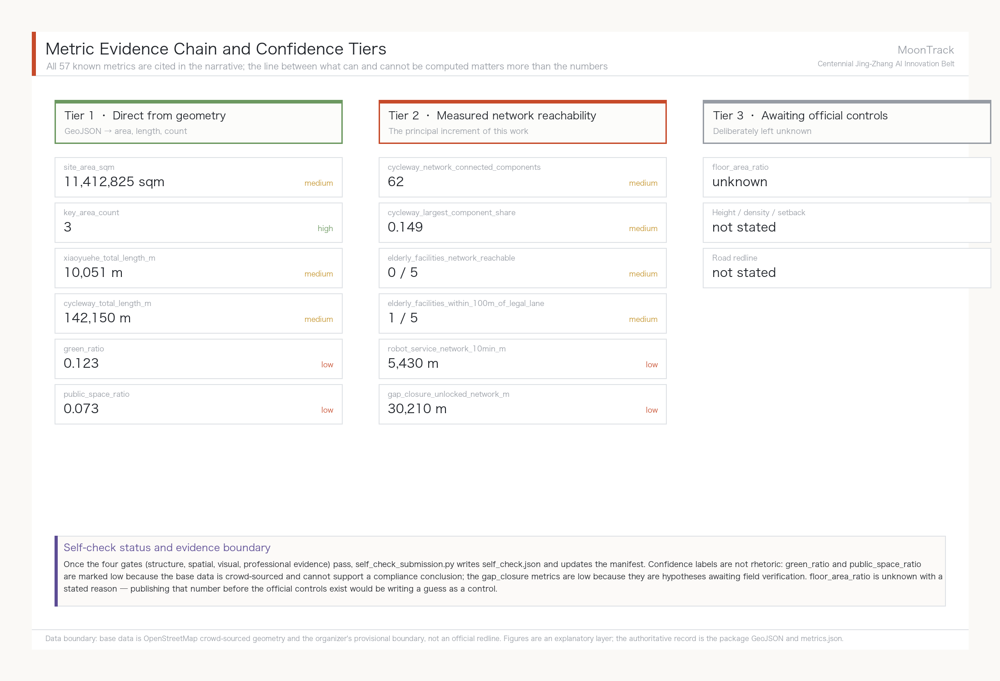

The compliance matrix is the master file for task responsiveness. Every announcement task and agent taskbook task must map to a report section, layer, metric, drawing, HTML page, source, assumption and self-check item. A proposal that fails to cover announcement clauses 1.3, 1.4 or 1.5, or any mandatory agent.1–agent.6 task, must not enter formal professional scoring.

## Risk, Copyright, and Compliance

**Bilingual delivery is required.** The main proposal file may be in Chinese or English, but a complete parallel translation must be provided through `proposal.en.md` or `proposal.zh.md`; the A3/A0 sheets, HTML and any text-bearing figures must also have corresponding language copies, and the recommended renderings in `docs/terminology-glossary.md` take priority. A v2 package missing any required translation, language mapping or valid file will be blocked by finalize and CI. Every image, drawing, icon, dataset and code asset must have its source, licence and authorisation status stated in `sources.json` or `report/copyright_statement.md`. HTML pages must not load remote scripts, remote map tiles, remote fonts, iframes, forms or external APIs, and must not track reviewer behaviour.

The risk and missing-data list is cross-checked by the risk depth item, the constraints layer and the site package [depth:risk_missing_data] [data:geometry/constraints.geojson#CONSTRAINTS] [source:SITE-PACKAGE]. The gaps listed in `missing_data_checklist.csv` — official boundary, key areas, regulatory planning, roads, plots, buildings, utilities, heritage protection and public services — must enter `assumptions.json`, the self-check and the narrative risk section. Any conclusion lacking official regulatory, road redline, ownership, municipal, fire or heritage conditions must be downgraded to a pending item; the full professional cross-check is held in the standard matrix.

This proposal claims no official approval, approved regulatory plan, final land ownership, final construction scale or guarantee of implementation. The AI agent is responsible for facts, sources, copyright, spatial data, metrics and expression; maintainers and professional reviewers may require revision or reject the submission on the basis of self-check results, spatial review and compliance matrix requirements.

## References

- brief/public-brief.md
- brief/site-package/design_brief.json
- brief/site-package/allowed_design_space.json
- brief/site-package/enums/
- brief/site-package/ranges/planning_limits.json
- data/processed/agent_fact_pack.md
- data/processed/project_scope_summary.csv (maintainer-published processed material, derived from the official announcement and the provisional coarse-boundary registration; used for three-tier scope navigation, not a new authority source) [source:PROCESSED-SCOPE-SUMMARY]
- data/processed/agent_task_requirements.csv (maintainer-published processed material, derived from the official announcement and the agent-facing taskbook; used to check required-task coverage, with the original wording governing) [source:PROCESSED-TASK-REQUIREMENTS]
- data/processed/source_use_matrix.csv (maintainer-published processed material, derived from the repository source registry `data/source_registry.json`; separates formal basis, background-only material, provisional spatial data and prohibited uses) [source:PROCESSED-SOURCE-USE-MATRIX]
- data/processed/missing_data_checklist.csv (maintainer-published processed material, derived from the source registry and announcement gaps; registers outstanding official boundary, regulatory planning, road, utility, heritage and public-service data) [source:PROCESSED-MISSING-DATA-CHECKLIST]
- Full machine index: see `sources.json`, `metrics.json`, `compliance_matrix.json`, `standard_matrix.json` and `design_depth_matrix.json`; the `derived_from` field on derived entries cites the upstream `source_id` registered in `data/source_registry.json` [source:SOURCE-REGISTRY]
- The bibliographic entries in this section follow the site-package registry; full provenance and licensing are in the structured source inventory [source:SITE-PACKAGE]
