# 月轨 · 百年京张AI创新带总体概念与场景赋能方案

## 设计依据与资料清单

本 formal 方案以北京市规划和自然资源委员会海淀分局发布的《百年京张AI创新带城市设计国际方案征集资格预审公告》为第一依据，并以 `brief/site-package/` 中经维护者登记的临时粗略边界、重点区域、枚举、指标和来源清单为机器可读依据。本方案的编制以这些机器可读文件为起点：范围与任务取自 `design_brief.json` 与 `agent_task_requirements.csv`，资料用途边界取自 `source_use_matrix.csv`，缺口清单取自 `missing_data_checklist.csv`。所有设计判断都拆成了可追溯来源、可复算指标、可校验图层和可人工复核假设四件东西，正文里出现的每个数字都能沿这条链回到原始材料。公告要求方案达到控制性详细规划的城市设计深度和规划综合实施方案的城市设计深度，因此文本叙述不能替代 GeoJSON、指标表、A3 文册、A0 展板和 HTML 电子展示成果。

方案不是独立愿景文本，而是从公告、面向智能体任务书和场地资料出发组织成果；本节只把最关键依据放在判断旁边 [source:OFFICIAL-ANNOUNCEMENT] [source:AGENT-TASKBOOK] [depth:existing_conditions_diagnosis]。完整来源和标准覆盖分别保存在 `sources.json`、`standard_matrix.json` 与 `design_depth_matrix.json`，不在正文重复机器索引。

资料登记表的使用边界如下 [source:SOURCE-REGISTRY]：

- data/source_registry.json 登记公开、清权与临时资料的用途边界。
- 当前登记摘要：formal 可用资料 7 条，背景资料 1 条，provisional-only 资料 1 条。
- agent 不得把 background_only 或 provisional_only 资料升级为 official boundary、法定控规、正式评分依据或政府实施承诺。

`data/processed/agent_fact_pack.md` 是本方案的阅读导航层，不是新的权威来源 [source:PROCESSED-FACT-PACK]。它帮助 agent 把三层范围、三处重点区、公告任务、agent.1-agent.6、资料可用性和缺资料事项组织成可读方案；事实判断仍需回到已登记的原始材料 [source:OFFICIAL-ANNOUNCEMENT] [source:AGENT-TASKBOOK]，完整来源关系由 `sources.json` 保存。

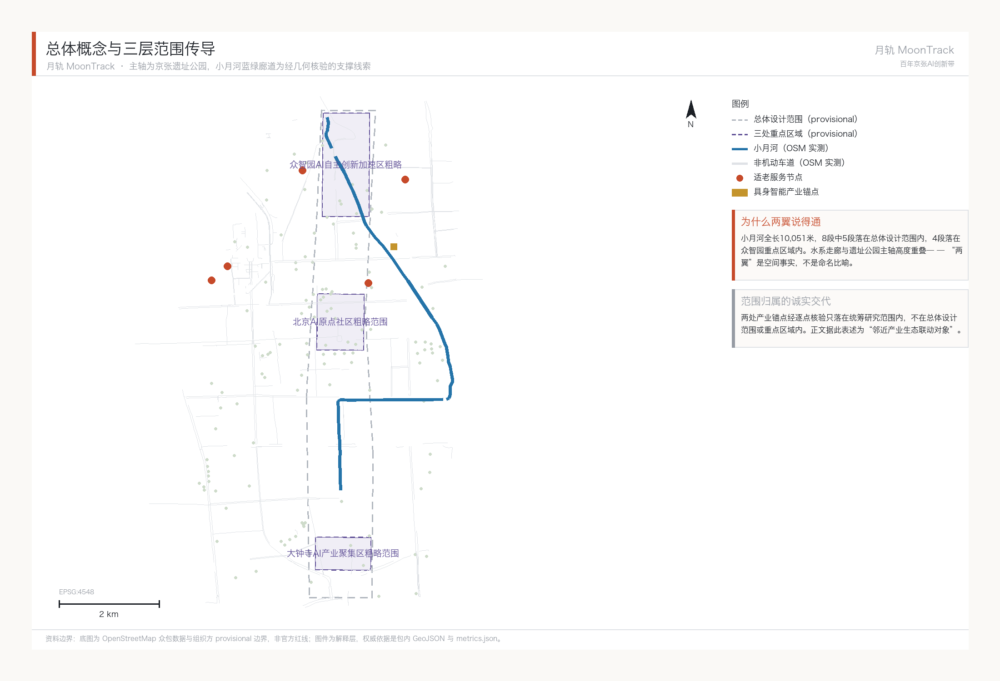

在官方 `SITE_BOUNDARY` [source:BOUNDARY-SOURCE] 或三处 `KEY_AREA` [source:KEY-AREA-SOURCE] 尚未取得时，本包使用 `brief/site-package/geometry/provisional_boundaries.geojson` 生成临时 formal 包。提交包中的 `geometry/site_boundary.geojson` 与 `geometry/key_areas.geojson` 均必须标注为 `provisional_constraint`、`official_boundary=false`，只能用于方案生成、自检、可视化和设计讨论，不能作为 official redline、审批依据、精确面积依据或法定控制结论。该组织方数据缺口本身不阻断内容评分；替换 official polygons 后，site boundary、key areas、land use、roads、green space、public space、buildings、phasing 和 metrics 均需重算。

边界解释可回到总体范围图层和面积复算 [data:geometry/site_boundary.geojson#SITE-001] [metric:site_area_sqm]。三处重点区则由独立图层和数量指标核对 [data:geometry/key_areas.geojson#PROV-KEY-001] [metric:key_area_count]。这意味着读者可以从正文进入证据，但不必先读一串机器编号。

## 三层范围工作框架

方案按照公告确定的三个层次组织工作：统筹研究范围关注 43.6 平方公里的AI产业生态、战略定位、创新链和未来城市形态；总体设计范围关注 11.4 平方公里京张遗址公园周边 1-2 公里城市地区和产业区，要求形成城市更新总体框架、产业空间布局、交通市政支撑和城市风貌控制；重点区域范围关注 368.4 公顷三处详细设计地区，要求明确功能业态、建筑规模、拆改留分类、公共空间连通和交通组织。三层范围在 `compliance_matrix.json` 中逐条映射，保证公告 1.3、1.4、1.5 与 agent.1-agent.6 的必选任务都有章节、图层、指标、图纸和 HTML 证据。

三层工作框架的深度项由 [depth:three_level_scope_framework] 和 [depth:overall_spatial_structure] 约束，空间证据以 [data:geometry/site_boundary.geojson#SITE-001] 与 [data:geometry/key_areas.geojson#PROV-KEY-001] 为准，任务依据以 [standard:PROJECT-OFFICIAL-ANNOUNCEMENT] 为准，范围索引以 [source:PROCESSED-FACT-PACK] 中 `project_scope_summary.csv` 的三层范围表为导航。

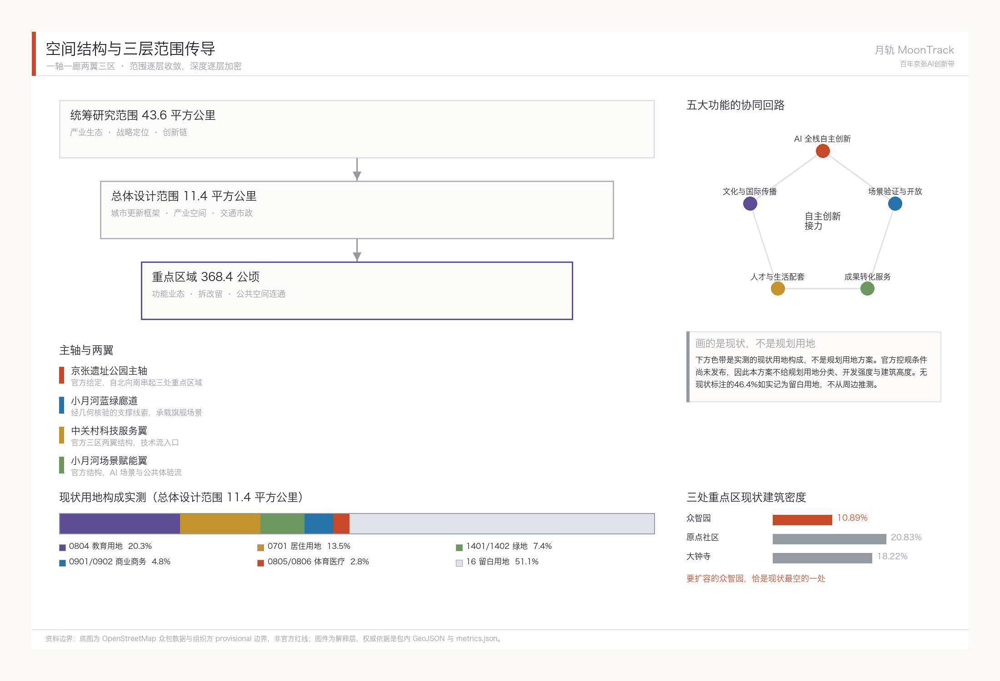

三层工作不是互相割裂的图纸集合。统筹研究决定产业链和城市形态判断，总体设计把判断落实到更新项目、空间结构和设施承载，重点区域详细设计验证具体地块、建筑、交通、公共空间和AI应用场景的可实施性。本方案按这个顺序作业：先锁定本次提交采用的临时边界与约束，再生成用地、建筑、道路、绿地、公共空间、分期和AI场景节点，最后从这些图层复算指标。任何无法从结构化数据复算的面积、比例、规模或项目数量，都没有写进正式结论——这条规矩在本轮删掉了四块虚构用地和一栋虚构建筑。

本方案的总体概念定为**“月轨”(MoonTrack)**。1905年，詹天佑接下京张铁路的时候，外国工程师大多认为中国人修不成——没有先例，没有外援，关沟段那道连续陡坡尤其被当成过不去的坎。四年后，“人”字形展线爬上了那道坡，京张铁路通车，是中国第一条完全由中国人自己设计、自己出资、自己建成的干线铁路。一百年后，官方给这条走廊的五大功能排了序，排第一的是“AI全栈自主创新体系”——问的其实是同一个问题：能不能自己做出来。“月轨”里的“轨”对应这条百年自主创新的脊梁，“月”对应场地内真实存在的小月河，也是车站“月台”的联想，一个词装下两个真实的场地元素。

“月轨”不取代官方项目全称“百年京张AI创新带”，定位是总体概念层面的子品牌，统筹官方已经命名的三区两翼（众智园AI自主创新加速区、北京AI原点社区、大钟寺AI产业集聚区、中关村科技服务翼、小月河场景赋能翼）在视觉和传播层面的一致性。空间组织上，主轴仍是官方任务书给定的京张遗址公园，自北向南串起三处重点区域；主轴之外叠加了一条经过真实几何核验的支撑线索——小月河蓝绿廊道。实测数据显示，小月河全长10,051米 [metric:xiaoyuehe_total_length_m] 的8段河道里，有5段落在总体设计范围内 [metric:xiaoyuehe_segments_in_design_scope]，4段落在众智园重点区域内 [data:geometry/green_space.geojson#xiaoyuehe-seg-00]，说明水系走廊和遗址公园主轴在空间上高度重叠，把小月河场景赋能翼和中关村科技服务翼叫作主轴的“两翼”是有空间依据的，不只是命名上的比喻。

| 层级 | 设计问题 | 方案回答 | 数据落点 |
| --- | --- | --- | --- |
| 统筹研究范围 | AI产业生态和未来城市形态如何组织 | 建立“高校策源-开源协作-企业转化-公共体验-国际传播”的创新链 | compliance_matrix.json、standard_matrix.json |
| 总体设计范围 | 产业空间、城市更新、交通市政和风貌如何落图 | 用地、建筑、道路、绿地、公共空间和分期图层共同表达 | [data:geometry/land_use.geojson#lu-osm-277989175]、[data:geometry/roads.geojson#ROAD-001] |
| 重点区域范围 | 三处片区如何达到详细设计深度 | 分别提出定位、空间动作、AI场景和实施依赖 | [data:geometry/key_areas.geojson#PROV-KEY-001]、[data:geometry/key_areas.geojson#PROV-KEY-002]、[data:geometry/key_areas.geojson#PROV-KEY-003] |

### 要求—回答—证据—边界：一张表核对到底

公告 1.3/1.4/1.5 与面向智能体任务书 agent.1–agent.6 的全部必选要求，逐条对应到方案回答、正文章节与证据文件。`compliance_matrix.json` 是机器可读的同一份内容，本表是给人读的版本。

最后一栏是本方案自己给自己划的线：**每条要求在现场核验或官方资料到位之前，不得声称什么。**这一栏不是免责声明，它决定了正文里哪些话可以写、哪些不能写——比如 1.5.2.2 拆改留本轮不做分类，正是因为权属与建成年代资料未公开，写了就是编的。

| 要求 | 要求名称 | 方案回答 | 正文章节 | 证据文件 | 核验前不得声称 |
| --- | --- | --- | --- | --- | --- |
| `1.3.1` | 构建世界级AI创新生态体系 | 高校策源—开源协作—企业转化—公共体验—国际传播五段创新链，七类要素保障逐条落表 | 三层范围工作框架 | metrics.json、site_boundary.geojson | 不得声称任何企业、机构或资金已落位 |
| `1.3.2` | 建设适配AI新质生产力的新型城市形态 | 以实测路权网络定义“可服务的城市形态”：网络碎裂 62 分量即形态问题，不是设备问题 | 三层范围工作框架 | metrics.json、site_boundary.geojson | 不得声称开发强度、建筑高度或路网线位已确定 |
| `1.3.3` | 打造全球AI创新人才向往的高品质城区 | 旗舰场景对准海淀 60 岁以上 67.1 万人的真实结构，先解决最不友好的那一端 | 三层范围工作框架 | metrics.json、site_boundary.geojson | 不得声称人才政策或住房安排已获批 |
| `1.4.1` | 统筹研究范围 | 43.6 km² 层面回答产业生态与区域协同：带内轨道站 5 个、清河站距带界 3,256 m | 三层范围工作框架 | metrics.json、site_boundary.geojson | 不得把统筹研究范围的判断当作可实施结论 |
| `1.4.2` | 总体设计范围 | 11.4 km² 层面回答更新框架与交通支撑：378 块实测用地、1,562 栋实测建筑基底 | 三层范围工作框架 | metrics.json、site_boundary.geojson | 边界为临时粗略边界，不得作为红线或精确面积依据 |
| `1.4.3` | 重点区域范围 | 368.4 ha 三片区各自给定位、空间动作、AI 场景与实施依赖 | 三层范围工作框架 | metrics.json、site_boundary.geojson | 重点区边界为组织方 provisional 多边形，不得用于正式评分或审批 |
| `1.5.1.1` | 统筹研究范围：AI创新生态体系 | 5 个全球案例 + AI 创新生态图谱 + 三区两翼分工 | 三层范围工作框架 | metrics.json、site_boundary.geojson | 案例为公开报道，不得据以主张本地可复制性 |
| `1.5.1.2` | 统筹研究范围：适配人工智能的未来城市形态 | 未来城市形态判断以可达性而非意象表述，结论可复算 | 三层范围工作框架 | metrics.json、site_boundary.geojson | 形态判断为概念方向，不得表述为控规结论 |
| `1.5.2.1` | 总体设计范围：产业目标与功能布局 | 产业空间落到用地与建筑图层，比例由 metrics.json 复算 | 三层范围工作框架 | metrics.json、site_boundary.geojson | 功能布局为建议，不得声称产业招商已确定 |
| `1.5.2.2` | 总体设计范围：城市更新总体框架 | 拆改留本轮明确不做，改交付一套可复算的筛查规则 | 三层范围工作框架 | metrics.json、site_boundary.geojson | 拆改留本轮不做分类，权属与建成年代资料未公开 |
| `1.5.2.3` | 总体设计范围：交通轨道市政配套设施 | 非机动车道网络实测 141.7 km / 62 分量；市政本轮只交待边界 | 三层范围工作框架 | metrics.json、site_boundary.geojson | 管线、能源、防洪资料未公开，设施标准与容量校核本轮不做 |
| `1.5.2.4` | 总体设计范围：京张遗址公园活力带 | 遗址公园主轴与小月河蓝绿廊道叠合，东西缝合与南北贯通策略 | 三层范围工作框架 | metrics.json、site_boundary.geojson | 不得声称文保范围内任何设施已获文保部门审定 |
| `1.5.2.5` | 总体设计范围：城市风貌 | 风貌回到专业标准矩阵，本方案给方向不给控制指标 | 三层范围工作框架 | metrics.json、site_boundary.geojson | 风貌为方向性建议，不得表述为建筑控制指标 |
| `1.5.3.required` | 重点区域范围详细设计必选项 | 三片区功能业态、公共空间连通与交通组织逐条给出 | 三层范围工作框架 | metrics.json、site_boundary.geojson | 三片区均为概念深化，不得声称控规已调整 |
| `1.5.3.1` | 众智园AI自主创新加速区 | 众智园＝具身智能测试沙盒与全栈自主体系承载区 | 三层范围工作框架 | metrics.json、site_boundary.geojson | 测试沙盒的开放范围与选址未经确认 |
| `1.5.3.2` | 北京AI原点社区 | AI 原点社区＝开源发布与近校成果转化 | 三层范围工作框架 | metrics.json、site_boundary.geojson | 发布厅运营主体与场地未确认 |
| `1.5.3.3` | 大钟寺AI产业聚集区 | 大钟寺＝智能原生消费与国际路演 | 三层范围工作框架 | metrics.json、site_boundary.geojson | 商务功能与公共空间比例须另行约定 |
| `agent.1` | 一带总体概念与功能统筹方案设计 | “月轨 MoonTrack”命名与标志（标志曲线取自小月河实测中线）+ 区域创新协同分工 | 三层范围工作框架 | metrics.json、site_boundary.geojson | “月轨”为总体概念层面子品牌，不取代官方项目全称，非注册商标 |
| `agent.2` | AI全栈自主创新体系与世界级AI创新生态设计 | AI 创新生态图谱 + 土地/空间/产业/资金/人才/算力/数据/场景七要素机制 | 统筹研究范围产业与未来城市研究 | metrics.json、public_space.geojson | 生态图谱为分工判断，不构成任何机构、资金或政策安排 |
| `agent.3` | AI+场景赋能新范式与智能化AI活力城市设计 | 10 张场景卡 + 5 类用户画像 + 场景-空间-运营映射 + 30 条调度台账 | AI 创新生态、人才画像与 AI+ 场景 | metrics.json、roads.geojson | 十张场景卡均为测试口径；第 02 张在现状路权下跑不通，不得写成已可运营 |
| `agent.4` | AI公共空间、智能原生新业态与朝圣地标设计 | 3 个朝圣地标 + 荣誉展示体系 + 公共空间组件库（三张构件图版） | 蓝绿空间、公共空间与城市风貌 | metrics.json、public_space.geojson | 不得声称桥隧、地下空间或任何工程可行性结论 |
| `agent.5` | 百年京张文化、中关村文化与AI新文化融合叙事设计 | 三段式叙事主线 + 空间文化系统 + 导视符号系统方向 | 百年京张文化、中关村文化与AI新文化融合叙事 | metrics.json、green_space.geojson | 历史叙事以公开史实为限，不得使用未清权的肖像、商标或图像 |
| `agent.6` | 一带全球AI创新活动体系与长期运营设计 | 年度活动体系 + 开发者社区 + 场景开放运营 + 国际传播转化 | 一带全球AI创新活动体系与长期运营设计 | metrics.json、public_space.geojson | 活动与运营为设想，不得表述为已确定安排或政府承诺 |

### 区域创新协同：这条带自己就是一段区域走廊

区域协同最容易写成一句"加强与兄弟园区的联动"。本方案先把能量的部分量出来，再谈机制。

**空间底盘是实测的。**查询范围内 38 个轨道站中，**5 个落在总体设计范围内**（六道口、学院桥、学知园、西土城、蓟门桥），**另有 7 个在范围外 800 米以内**（大钟寺离带界仅 82 米，知春路、清华东路西口、北沙滩、牡丹园、北太平庄、五道口）；轨道线路落在范围内的里程为 **30,014 米** [source:osm-rail-stations-lines]。**这条带不需要新建区域通道，它本身就架在一段既有的轨道走廊上**——区域协同的问题不是"怎么连过去"，而是"既有的口怎么用起来"。

这里有一个不是设计出来的结果值得记下：前面用极小化最远点算出的旗舰驿站位置，**离六道口站只有 34 米**。驿站选址的输入只有非机动车道网络和五家适老机构的位置，算法完全不知道地铁站在哪。它落在站口边上，是网络形状本身把它推过去的——这条走廊的服务重心和轨道接驳点本来就重合。

**跨区域的门户是清河站。**距总体设计范围边界 **3,256 米**，京张高铁始发站，向北接延庆与张家口。这一点在本方案里不只是交通事实：叙事主线"百年京张"讲的正是这条线——一百年前它连北京到张家口，今天它仍然连着同一个方向，中间加了 2022 年冬奥走廊。**区域协同性与文化叙事在这条线上是同一件事，不需要各写各的。**另有上地站距带界 2,512 米、清河站换乘的 13 号线与昌平线向北接上地、西二旗与昌平方向。

在这个底盘上，本方案对五个协同方向给出**分工判断**，不主张任何新建通道，也不代任何一方作承诺：

| 协同对象 | 与本带的关系 | 本方案主张的分工 | 依据与边界 |
| --- | --- | --- | --- |
| **经开区（亦庄）** | 北京市高级别自动驾驶示范区所在地，与本带旗舰场景共用同一部《北京市无人配送车道路测试与商业示范管理办法（试行）》[source:beijing-delivery-robot-management-measures] | **场景层级分工，不是重复建设。**亦庄做高级别、封闭到开放道路的车辆级测试；本带做低速、人车混行、适老与无障碍的**服务级**测试——这是亦庄的道路条件做不了的。本方案实测的 62 个连通分量、末端 220 米中位数，恰恰是亦庄那种成规模路网上不会出现的问题 | 两地共用同一部规章，因此测试规程与失败案例可以互认；但试点路段仍须各自主管部门划定，本方案不主张任何跨区授权 |
| **未来科学城** | 13 号线/昌平线向北的既有轨道联系 | 承接其能源、生命科学等方向的**中试转化需求**在本带的公共体验与发布界面落地（AI原点社区开源发布厅、大钟寺国际路演客厅） | 这是空间与功能上的互补判断，不涉及任何机构安排或资金约定 |
| **怀柔科学城** | 大科学装置集群，与本带无直接轨道联系 | **不主张空间联动，只主张数据与成果的开放对接**：其装置产出的开放数据可作为本带公共体验与科普内容的来源之一 | 距离与联系强度决定了这一条只能是内容层面的协同，写成空间协同是不诚实的 |
| **京津冀** | 清河站京张高铁，距带界 3,256 米 | 以"百年京张"这条既有铁路线为叙事与活动载体，把国际传播与年度活动体系向张家口方向延展（详见活动体系一节） | 铁路联系是既有事实；任何跨省活动安排均须相关方另行约定，本方案不作预设 |
| **北纬社区** | **本方案未能核实其官方定义与空间边界** | 待官方补充资料后再行判断 | 征集任务书的评审维度点名了这一对象，但站点资料包与公开渠道均未检索到可引用的定义。按本方案"算不出来的不写进结论"的规矩，此处留白而不是编一段联动关系 |

**必须说明的边界**：上表中除轨道站点、里程与距离为实测外，其余为分工判断，不构成任何机构、资金或政策安排。总体设计范围边界为临时粗略边界，各项距离会随官方边界发布而变化。

### 综合规划、空间产业融合与国土空间规划创新思路

做完 agent.3 的十张场景卡之后，暴露出一个具体的规划技术问题，值得单独提出来。

**问题：AI场景空间在现行用地分类里没有对应类目。** 按《国土空间调查、规划、用途管制用地用海分类指南》[source:DATA-SRC-MNR-LAND-USE-CLASSIFICATION-202311]，用地分类以主导用途排他划分，一块地对应一个类目。但小月河沿线的机器人配送走廊同时是三样东西：蓝绿廊道的绿地、供骑行者使用的非机动车道、以及低速机器人的产业测试空间。三种用途在同一段空间上并存，而且按时段错峰——通勤高峰归骑行者，平峰时段可供测试。现行分类无法表达这种复合状态，硬套的结果只有两个：要么把它划成绿地、测试活动变成违规使用，要么划成产业用地、破坏蓝绿廊道的连续性。

**思路一：用"场景使用权"叠加，而不是新划一类用地。** 建议探索在既有用地分类之上叠加一层时段性、可撤回的使用许可，管理对象是"某段时间内某类活动在某段空间的通行与作业权利"，而不是变更土地性质。这样做的好处是试点失败可以直接收回，不留下已变更的用地性质这个尾巴。这与《北京市无人配送车道路测试与商业示范管理办法（试行）》"试点区政府划定测试路段"的既有制度接口是一致的 [source:beijing-delivery-robot-management-measures]——那本身就是一种不改变道路属性的时段性授权。

**思路二：可撤回性作为AI场景类空间的规划原则。** 传统产业空间的规划逻辑是长期锁定，AI技术迭代周期远短于规划周期，锁定反而是风险。建议此类空间在规划阶段就明确退出条件与恢复要求：场景验证失败或技术路线变更时，空间能回到原状而不产生沉没资产。本方案十张场景卡里，机器人相关的六张全部按可撤回设计——用的是既有非机动车道与既有停靠点，没有一张需要新建专用构筑物。

**思路三：空间产业融合的垂直组织。** 上海张江人工智能岛"上下楼就是上下游"的组织方式 [source:case-zhangjiang-ai-island] 说明高密度地块的产业链可以垂直堆叠，而不必水平铺开。这对众智园这类用地紧张的重点区域有直接参考价值，也与"综合规划"要求的多种功能统筹在同一空间单元内是同一个方向。

以上均为规划方法层面的概念建议，供专业团队与自然资源主管部门研究，不构成对任何地块用途、指标或审批结论的判断。用地分类术语依据上述指南，具体用地类别的确定仍以官方控规条件为准。

### 本方案提出的两个方法：路权定价与末端优先

上面三条是就用地分类提的建议。本节把本方案**在方法层面提出的两样东西**单独说清楚，因为它们不依附于小月河这一个场地，换一条走廊、换一座城市同样可以用。

**方法一：路权定价（Right-of-Way Pricing）。**规则通常被当作背景条件——"机器人只能走非机动车道"是给定的，方案在这个前提下做设计。本方案反过来做：**把规则当成一个可以标价的对象。**做法是让同一批目的地在不同路权规则下各测一次，两次的差就是这条规则的价钱。

测下来，"只准走非机动车道"这条规则的价钱是：1,619 个目的地的末端距离中位数从 82.8 米涨到 249.6 米（3.0 倍），15 分钟可达网络从 132,098 米缩到 20,341 米（6.5 倍）。**这不是抽象的合规成本，是一个可以拿去开会的数字。**它的用处在于让规则调整与工程投资落在同一张比价表上——政策杠杆那一节的结论"提速无效、开放人行道最强、补建次之"，就是这张表直接读出来的。

需要限定这句话的范围：本方案检索了本次征集 950 份方案的**公开摘要**（`submissions-data.js`），其中以路权为核心命题的有 3 份，摘要层面未见对规则本身作反事实计量的做法。这只覆盖摘要，不覆盖正文，因此它说明的是这条命题在本次征集中不常见，不能读作“没有别人做过”。

**方法二：末端优先（Terminal-First）。**网络分析的惯性是关注网络本身——连通性、可达性、中心性。本方案的实测显示，当网络和末端同时构成约束时，**决定服务能否发生的是末端，不是网络**：补建 596 米把网络可达数从 2 提到 6，送达成功却只从 0 到 1，因为末端中位数纹丝不动。

由此得到一条可移植的排序规则：**分期顺序按末端距离排，不按工程难度排。**这与常规做法相反——常规是先做容易的、连片的、有主体的，末端零散工程往往被推到最后。但末端才是服务实际发生的地方，把它放到最后，等于前面所有投资都不产生服务。本方案的项目清单据此把 JZ-07、JZ-08 提到最前。

两个方法都不需要非公开数据：输入是公开路网、公开 POI 和一部公开规章，任何团队都可以在自己的走廊上重做一遍。相关实现见 `analysis_policy.py` 与 `analysis_service.py`，复算脚本另见 `visual/assets/verify-network.js`。

## 统筹研究范围产业与未来城市研究

“月轨”这套命名和视觉识别方向，正是用来承接“百年京张文化带、都市AI生活体验带、AI融合创新带”三大定位的整体辨识度：都市AI生活体验带这一条权重最重，因为旗舰场景（小月河机器人加无障碍、适老服务）就是它的具体落地，对应海淀区60岁以上人口67.1万、占常住人口21.47%的真实人口结构 [source:haidian-2024-statistical-bulletin]；另外两条定位是支撑而非并列，百年京张文化带靠关沟段人字形展线这件具体工程史实撑着，AI融合创新带则与京张铁路的自主建造史在逻辑结构上同源。视觉方向定为水系-轨道叠印（小月河有机曲线与铁轨/AI网络直线网格叠加，蓝绿渐变过渡到月白），叠加人字展线抽象化母题；命名语法用“月台X”作为二级品牌前缀（如月台论坛、月台开发者夜），不重新命名官方三区两翼。需要标明的是，“五大功能”和“三区两翼”的协同要求来自面向智能体的开源征集任务书 [source:AGENT-TASKBOOK] [standard:PROJECT-AGENT-OPEN-CALL-TASKBOOK]，不是法定规划控制。

**标识由生成的字标与徽章两件资产承担。**这一版推翻了此前两版做法。第一版是图形符号（月轮加小月河实测中线），几何上诚实但读者看不懂；此后又试过月相、人字切口、双轨折线，问题一样。**需要解释的标志就是没做成**，因此放弃图形符号。第二版改用系统字体排出的字标，但那不是字形设计，只是把字打进字体再画两条线。

现在的**拉丁字标是按书面要求定制生成的字形**：几何无衬线、低笔画对比、圆形字碗、水平截线，T 的横杠沿长度方向开一道窄缝，取自轨道的双线特征。它按生成原样使用——不描摹、不重上色、不重切字形；承载它的面板底色直接取自生成图自身，因此看不到接缝。

**徽章**是一枚月洞门，北京园林的真实语汇。门洞之内自下而上是水、轨、人字展线与月，把这条走廊压进一枚圆里。它用于封面、图纸扉页与展板；128 像素以下不可辨识，小尺寸使用字标。

中文「月轨」、分隔线、副标与版式由 `make_identity.py` 排布。**只提供深底一版**：生成的字标本身是深底，浅底版无法在不改动其像素的前提下得到。两件生成资产均在 `report/copyright_statement.md` 中声明，不描绘任何既有场所。

人字展线退回它本来的位置：次级母题，用于构件、导视与活动物料。色彩、组合应用与禁用条款见下图。


统筹研究并不新增伪精确红线；它通过 [standard:MOHURD-URBAN-DESIGN-MEASURES] 要求的城市风貌、公共空间和建筑布局统筹，回接 [data:geometry/land_use.geojson#lu-osm-277989175]、[data:geometry/public_space.geojson#PUBLIC-001] 与 [depth:overall_spatial_structure]，说明产业策略最终要落到可见、可复核的空间结构。

### 全球AI创新生态案例与可转化机制

选案例的标准不是名气，是可转化性。京张这条走廊有两个绕不开的先天条件：它是铁路遗产用地，而且高校密度极高（统筹研究范围内实测50所高校及科研机构）。所以下面六个案例里，权重最高的是巴黎 Station F 和伦敦国王十字——这两个都是**铁路/工业遗产改造成创新聚集地**的真实先例，不是气质相近，是处境相同。

| 案例 | 关键事实 | 与京张的可转化机制 |
| --- | --- | --- |
| **巴黎 Station F** | 由1920年代货运车站 Halle Freyssinet 改造，该建筑2012年列入法国历史保护建筑名录；2017年7月开业，5.1万㎡，容纳1000+初创企业，配600间创业者住房；由私人投资者 Xavier Niel 出资约2.95亿美元 [source:case-station-f] | 遗产建筑不做静态展陈而做生产性再利用；**创业空间与居住空间同址**，这一条直接对应原点社区“人才特区”的居住配套要求 |
| **伦敦国王十字 / 知识片区** | 原铁路货场用地更新；2016年 DeepMind 迁入触发AI企业集聚，现片区含UCL、Francis Crick研究所、大英图书馆；片区内居住、工作、学习人口约4.1万 [source:case-kings-cross] | **锚定机构先行**：先落一个有号召力的研究机构，产业自然跟随。对应众智园引入国家级AI平台的策略 |
| **波士顿肯德尔广场** | MIT 与剑桥市政府公私合作推进；在MIT自有停车场用地上建设6栋新建筑，含研发、住房、零售混合功能，新增约250套研究生住房+290套市场化住房、超10万平方英尺底层商业、近3英亩开放空间 [source:case-kendall-square] | **高校土地资产转化为混合功能街区**；底层连续商业界面+开放空间是维持街区活力的硬条件，可用于校区-园区缝合段 |
| **蒙特利尔 Mila** | 魁北克省政府2017年投入1亿加元建AI集群，2018年再投8000万加元/五年，联邦通过泛加拿大AI战略经CIFAR投入4400万加元；2019年在 Mile-Ex 旧工业区建成研究园区 [source:case-mila-montreal] | **省级+联邦两级财政叠加支持单一研究机构**，形成人才锚点；旧工业区选址逻辑与小月河沿线存量空间相似 |
| **新加坡 one-north / Kampong AI** | JTC 统筹开发的研发高科技集群，规划八个功能片区；新建AI园区 Kampong AI 由两栋既有建筑改造，1.45万㎡业务空间可容纳约70家企业，另一栋提供200+住宅单元，2028年建成，2026年3月起先行试点 [source:case-one-north] | **政府平台公司统一开发+存量建筑改造+产住混合**；“先试点再建成”的分阶段节奏可直接借鉴到小月河场景试点 |
| **上海张江人工智能岛** | 占地6.6万㎡、地上建筑面积10万㎡；引入IBM、微软AI与IoT实验室等；截至2022年末以AI岛为核心的张江科学城集聚AI企业600余家；2024年园区营收超135亿元 [source:case-zhangjiang-ai-island] | 国内同类先例中密度最高的样本；**“上下楼就是上下游”的垂直产业链组织**适用于众智园高密度地块 |

六个案例反复出现三条共性机制，本方案据此组织下面的空间落位：一是遗产或存量建筑做生产性再利用而非静态保护；二是先落锚定机构再吸引产业，而不是先招商再找内容；三是创业空间与居住空间同址，缩短通勤和协作半径。

### AI创新生态图谱与三区两翼的分工

生态图谱按“策源—转化—验证—服务”四段组织，四段各有明确的空间落位，不做平均分布：

- **策源段（众智园AI自主创新加速区）**：对应官方角色“AI全栈自主创新体系与AI治理全球话语权”。全栈自主的含义是从芯片、框架、模型到应用的链条都要在带内有对应载体；本方案建议以标准制定、安全评测与红队测试作为可展示、可参观的公共界面（对应场景卡07），使“自主创新”成为可感知的城市内容而非仅是产业口号。
- **转化段（北京AI原点社区）**：对应“世界级AI创新生态”。依托统筹研究范围内50所高校及科研机构 [metric:universities_in_research_scope]，其中14所在非机动车道100米内 [metric:universities_within_100m_of_legal_lane] [data:geometry/public_space.geojson]，参照肯德尔广场把高校土地资产转为混合功能街区的做法，重点补足成果发布、开源协作与人才居住配套。
- **验证段（小月河场景赋能翼）**：对应“AI场景赋能与智能化AI活力城市”，即 agent.3 的十张场景卡所在地。验证段是整套生态里唯一能产生真实使用数据的环节，也是本方案投入深度最大的部分。
- **服务段（中关村科技服务翼 + 大钟寺AI产业集聚区）**：对应“要素全球化配置、中关村IP与资本赋能”与“智能原生新业态”，承担资本、法务、知识产权、国际路演和消费转化。

四段构成闭环：策源段产出的技术进入验证段做真实场景测试，验证段产生的使用数据反馈回策源段，服务段负责把验证过的成果转化为产业和消费产品。这条闭环是“月轨”概念中技术流的具体化。

### 要素保障机制（土地、空间、产业、资金、人才、算力、数据、场景）

以下均为概念建议，供专业团队与政府部门进一步研究，不构成已确定的政策安排或资金承诺：

| 要素 | 机制建议 | 参照案例 |
| --- | --- | --- |
| 土地与空间 | 优先使用存量与遗产建筑改造，避免大规模新增建设用地；产业空间与人才居住同址布局 | Station F、Kampong AI |
| 产业 | 以锚定机构带动集聚，而非先行招商 | 国王十字、Mila |
| 资金 | 建议探索多级财政叠加支持单一锚定机构的长期稳定投入模式 | Mila（省+联邦两级） |
| 人才 | 补足创业者居住单元与生活配套，缩短通勤半径 | Station F（600间住房）、Kampong AI（200+住宅单元） |
| 算力 | 建议布局端侧与分布式算力节点，与公共服务设施复合利用，具体规模待正式市政与能源条件确认 | 张江（垂直产业链组织） |
| 数据 | 场景数据须遵循数据最小化、本地处理优先，个人数据不出场景边界（详见 agent.3 隐私边界） | — |
| 场景 | 采用“先试点、后建成”的分阶段开放节奏，试点期保持人工监管 | Kampong AI（2026试点、2028建成） |

上述机制的空间落点与产业分工，其完整映射保存在 `compliance_matrix.json`；本节只保留最直接的判断依据 [source:AGENT-TASKBOOK] [source:case-station-f] [depth:overall_spatial_structure]。

## 总体设计范围城市更新与控规深度城市设计

**这一节应用的机制。**在缺官方控规条件的前提下，本方案不给用地性质与强度数字，改为交付一套**可复算的筛查规则**：凡是能从实测几何算出来的（建成密度、用地构成、重点区域密度差）如实给出，凡是依赖未公开资料的（拆改留分类、开发强度、建筑高度）明确不做并说明原因。这套「能算的算、算不出的标明」的规则，与前面「路权定价」和「末端优先」两个方法同源：都是先把可计算的边界划清楚，再在边界内给结论。

先说清这一节能做到什么深度。控规深度的核心内容——用地性质、开发强度、建筑高度——依赖官方控规条件与地籍资料，两者都未发布。但"没有官方条件"不等于"什么都算不出来"。现状建成情况是可以实测的，而实测结果本身就能推翻或支持几个关键判断。以下是实测部分；做不到的部分放在本节末尾单独交代，不混在一起。

**建成密度实测。**建筑基底轮廓取自 OpenStreetMap [source:osm-buildings-footprints]，总体设计范围内完整落地的共 1,562 栋 [metric:building_count_design_scope]，基底总面积 191.8 万平方米 [metric:building_footprint_area_sqm]，建筑密度 16.81% [metric:building_coverage_ratio]。跨边界的建筑一律不收——把一栋建筑按边界切开，得到的形状不再是建筑，宁可让数字偏小。

**三处重点区域的密度差是这一节最有用的发现。**

| 重点区域 | 用地面积 | 现状建筑基底 | 建筑密度 |
| --- | --- | --- | --- |
| 众智园AI自主创新加速区 | 192.9 万 m² | 21.0 万 m² | **10.89%** [metric:key_area_building_coverage_zhongzhiyuan] |
| 北京AI原点社区 | 104.3 万 m² | 21.7 万 m² | 20.83% |
| 大钟寺AI产业集聚区 | 72.0 万 m² | 13.1 万 m² | 18.22% |

众智园的现状建筑密度只有另外两处的一半左右，而它的官方角色是"AI自主创新加速区"，是三处里唯一明确要求增量承载的。**要扩容的地方恰好是现在最空的地方。**这不是设计上的巧合，是先查了数才敢往下写。

反过来看原点社区：20.83% 的现状密度意味着它的空间策略只能是存量更新与功能置换，不是新增建设。这也解释了为什么肯德尔广场"高校土地资产转为混合功能街区"的做法对它适用，而对众智园并不适用——两处缺的东西不一样，一处缺内容，一处缺房子。

**低效空间识别。**范围内被标注为待建、棚改、褐地、军事或农用的地块共 33 块，合计 54.2 万平方米，占设计范围 4.75%。按面积排序，前几位是：

| 地块 | 面积 | 现状标注 | 与重点区域的关系 |
| --- | --- | --- | --- |
| 明光村棚户区改造 | 161,388 m² | construction | **不在任何一处重点区域内** |
| 北京北站 | 106,598 m² | railway | 大钟寺重点区内 |
| 学院路科技园东升园 | 33,110 m² | construction | 众智园重点区内 |
| 首农北京奶牛中心 | 23,887 m² | farmyard | 众智园重点区内 |

有一个结果值得规划层面注意：**低效用地里有 40.3% 落在三处重点区域之外，其中最大的一块——明光村棚户区改造，16.1 万平方米，接近全部低效用地的三成——完全不在重点区域范围内**，位置在原点社区与大钟寺之间的走廊段上。只覆盖三处重点区域的更新框架，会漏掉走廊里体量最大的单块机会。

本方案不据此建议调整官方重点区域边界，那是主管部门的事权。做法是把这块地列入更新项目清单的观察项，建议正式编制时纳入统筹考虑 [data:geometry/land_use.geojson#lu-osm-546295836]。

还要说明，"低效"在这里是数据标注意义上的，不是价值判断。标注为 construction 说明地块正在建设或已启动改造，标注为 railway 的北京北站是运营中的铁路设施——两者都不是"闲置待拆"。这份清单的正确用法是现场核验的起点，与 JZ-07 一致。

**这一节做不到的部分。**综合承载能力评估、建筑总规模、开发强度分区本轮无法编制。原因不是时间不够，是数据不支持，具体的覆盖率实测见下一节。相关深度项已在 `design_depth_matrix.json` 里通过 `completeness_limited_by` 字段做机器可读披露，不在正文用"待深化"这类措辞含混带过 [depth:land_use_layout] [depth:development_intensity_controls]。

## 重点区域详细设计

三处重点区域的定位不是平均分配的，依据是上一节实测出来的密度差。众智园现状建筑密度 10.89%，只有另外两处的一半左右，空间策略以增量承载为主；原点社区 20.83%，只能走存量更新与功能置换；大钟寺 18.22%，且被北京北站这块 10.7 万平方米的运营中铁路设施占去相当比重，空间动作集中在站点一体化与地面连通，而不是用地重组。

三处的实施依赖也不一样，这一点比定位本身更影响排序。众智园的依赖是清河蓝线与防洪条件，原点社区的依赖是校区权属，大钟寺的依赖是轨道与市政管线——**只有原点社区的核心依赖不涉及工程审批，理论上可以先动**，但它同时是唯一需要逐栋做拆改留判断的一处，而拆改留所需的建筑年代与产权数据当前覆盖率为零。结论是三处都不具备立即进入详细设计的条件，本方案给出的是各自缺什么，不是各自该建什么。

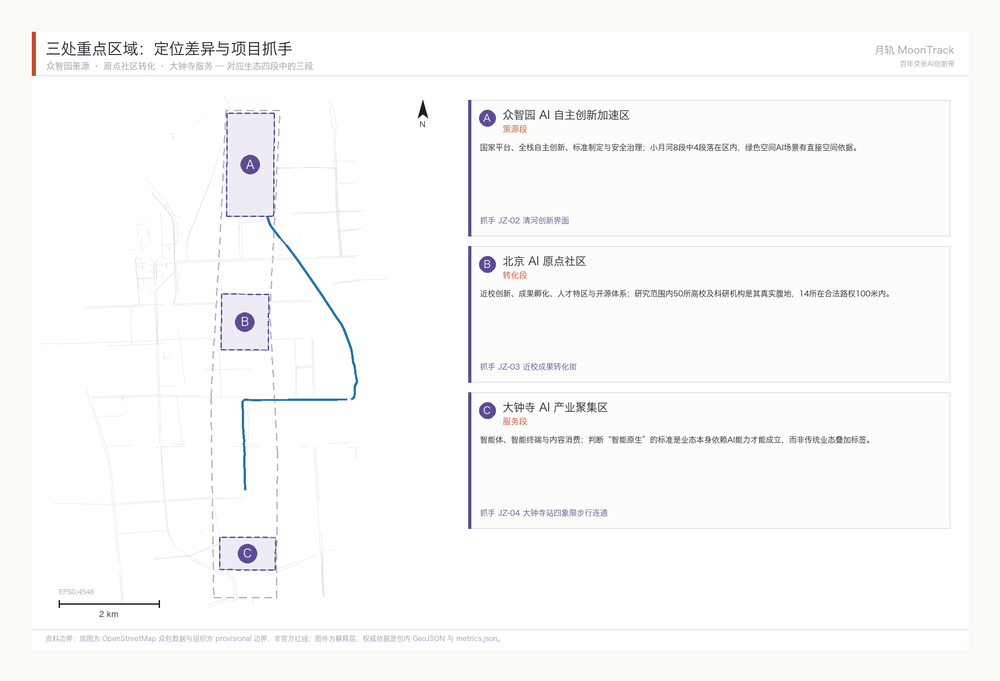

| 重点片区 | 设计定位 | 空间动作 | AI产业与运营场景 | 证据引用 |
| --- | --- | --- | --- | --- |
| 众智园AI自主创新加速区 | 花园型全栈自主创新街区 | 强化清河界面、产业展示、低碳创新交往和对外交通组织；以绿色空间承载开放测试与标准治理展示 | 自主模型测试、标准制定工作坊、安全治理展示、低碳算力体验 | [data:geometry/key_areas.geojson#PROV-KEY-001]、[depth:three_key_area_detailed_design] |
| 北京AI原点社区 | 近校型成果转化与人才社区 | 组织校区、园区、街区慢行缝合；补足成果发布、人才服务、居住生活和开源协作空间 | 开源社区、成果发布、人才特区服务、近校孵化 | [data:geometry/key_areas.geojson#PROV-KEY-002]、[source:AGENT-TASKBOOK] |
| 大钟寺AI产业聚集区 | 城市型智能经济与国际交往街区 | 围绕大钟寺站一体化、四象限步行连通、商业服务和重点企业公共环境更新 | 智能体与智能终端展示、内容消费、数据要素与国际路演 | [data:geometry/key_areas.geojson#PROV-KEY-003]、[metric:key_area_count] |

三处片区各有一张场景图版。图版上只出现两类内容：本方案实测算出的数，以及正文已明文写下的规则；任何工程规格都不在图上给出。三张插图均为 AI 生成的概念表达，非现场照片，不描绘任何既有场所。

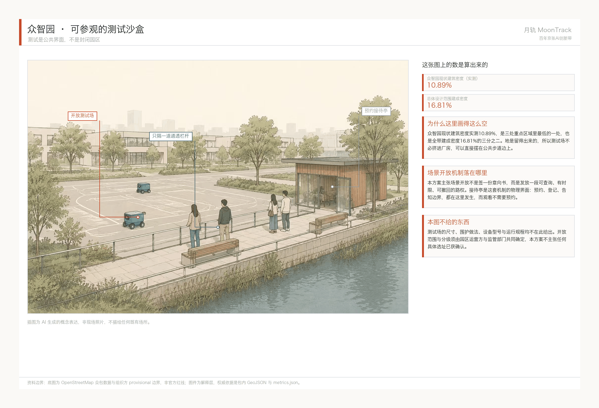

众智园的空间策略直接由那个 10.89% 决定：地是留得出来的，所以测试场不必挤进厂房，可以摆在公共步道边上，用一道通透栏杆隔开——**看不需要预约，进去才需要**。这是"场景开放机制"在空间上的落点。

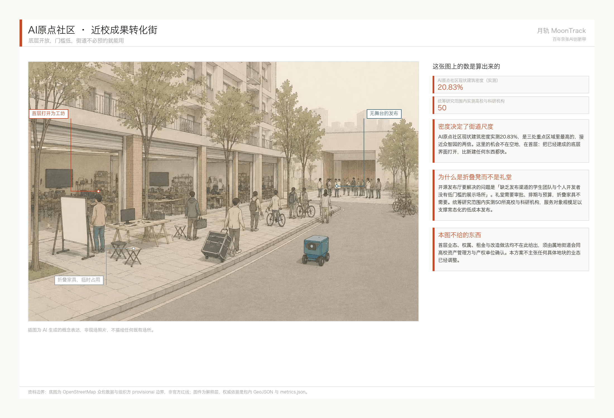

原点社区的 20.83% 意味着机会不在空地而在首层。把已经建成的底层界面打开，比新建任何东西都快；发布用折叠家具而不是礼堂，因为要解决的问题是"没有发布渠道的学生团队缺低门槛场所"，而礼堂需要审批、排期与预算。

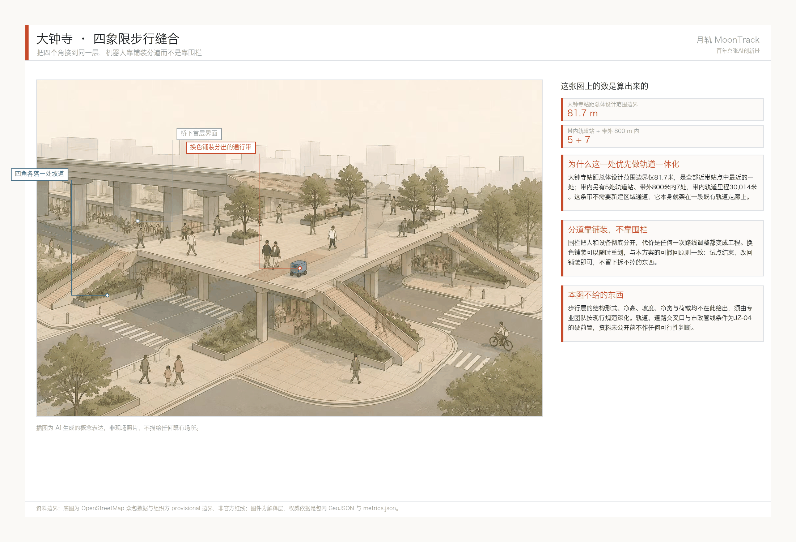

大钟寺站距总体设计范围边界仅 81.7 米，是全部近带站点里最近的一处，因此这里的空间动作集中在把四个角接到同一层。图上那条通行带靠换色铺装分出，不靠围栏——围栏把人和设备彻底分开，代价是任何一次路线调整都变成工程；铺装可以随时重划，与可撤回原则一致。

## AI 创新生态、人才画像与 AI+ 场景

本节场景以小月河场景赋能翼为旗舰深度：低速配送/巡检机器人加无障碍、适老服务，其余节点覆盖全带广度。第一组6张卡的空间证据落在真实核验过的图层上——小月河河道 [data:geometry/green_space.geojson#xiaoyuehe-seg-00]、42段邻近河道300米内的非机动车道 [data:geometry/roads.geojson#cycleway-22771899]、适老机构POI [data:geometry/public_space.geojson#elderly-poi-00]，不是凭空画的示意图层。面向智能体任务书要求不少于10张AI场景卡、不少于3个产业测试验证场景和不少于5类用户画像，以下内容逐条对应。

| 用户画像 | 真实依据 | 核心需求 | 空间响应 |
| --- | --- | --- | --- |
| 高龄/独居社区居民 | 海淀区60岁以上常住人口67.1万，占21.47%；80岁以上户籍高龄化率全市第一 [source:haidian-2024-statistical-bulletin] | 送药送餐上门、防走失呼叫、无障碍出行 | 小月河沿岸适老服务点、社区驿站 |
| 无障碍出行人士 | 《无障碍环境建设法》[source:DATA-SRC-BARRIER-FREE-ENVIRONMENT-LAW] | 盲道/缘石坡道畅通、可预约低速接驳 | 小月河慢行道盲道巡检、无障碍接驳点 |
| 具身智能产业从业者 | 东畔科创中心/中关村（海淀）具身智能创新产业园，统筹研究范围内，紧邻场地东侧 [data:geometry/public_space.geojson#anchor-dongpan-innovation-center] | 测试场地、监管沙盒、数据合规工具链 | 众智园测试沙盒，与产业园联动 |
| 周边高校学生与科研人员 | 统筹研究范围内实测50所高校/科研机构 [data:geometry/public_space.geojson] | 低成本配送、科研测试场景开放接口 | 校区-小月河慢行缝合、快递驿站 |
| 养老机构运营方 | 修德颐养园、旭诚养老院、清华园老龄大学等真实机构POI [data:geometry/public_space.geojson] | 最后100米配送对接、应急呼叫联动、隐私边界 | 机构门口接驳点，不进入室内 |

每张卡按仓库 `schema/scenario.schema.json` 的六要素填写：服务对象、使用情境、数据输入、公共价值、风险、人工复核机制。凡涉及技术成熟度或资料缺口的，在卡内直接写明，不留到附录。

**第一组：小月河场景赋能翼（旗舰深度，6张）**

**01 · 小月河低速巡河配送**（测试验证场景）
沿小月河东岸非机动车道运行低速配送机器人，服务周边社区和高校的快递代收发。速度上限15km/h、必须走非机动车道，这两条硬约束来自《北京市无人配送车道路测试与商业示范管理办法（试行）》[source:beijing-delivery-robot-management-measures]，试点区政府需另行划定具体测试路段。
- **服务对象**：周边社区居民、高校学生与科研人员
- **数据输入**：小月河沿线非机动车道线形 [source:osm-cycleways-lines]、河道走向 [source:osm-xiaoyuehe-river]、周边高校分布 [source:osm-universities-nearby]
- **公共价值**：减少短距离配送的机动车使用，缓解高校快递高峰期的人力压力，同时为低速机器人在真实混行环境中的运行规程积累可公开的数据
- **风险**：人机混行安全；占用非机动车道影响骑行者；试点路段未获批前无法实施；恶劣天气下可靠性下降
- **人工复核**：试点路段由试点区政府划定；运营期间人工远程监管在线；异常件与事故由人工接管处理

**02 · 适老送药送餐最后100米**（测试验证场景）
机器人从社区驿站取件，送到修德颐养园、旭诚养老院等适老机构门口，由工作人员接收，不进入室内、不接触老人本人完成交接。
- **服务对象**：高龄与独居老人、养老机构运营方
- **数据输入**：适老机构POI [source:elderly-poi-osm]；海淀60岁以上人口67.1万、占21.47% [source:haidian-2024-statistical-bulletin]
- **公共价值**：降低高龄老人取件的出行负担，为"失能化、空巢化"叠加背景下的社区服务补充一条低成本通道
- **风险**：**这张卡在现状路权下跑不通**。网络实测显示五家适老机构沿非机动车道的可达数为0——四家与候选驿站不在同一连通分量，剩下一家末端652米无合法路权（见"非机动车道网络连通性实测"）。因此本卡的前置条件是 JZ-07 缺口核验与连接先行完成，在此之前它只能作为设计目标而非可实施场景。此外，药品配送涉及资质与温控要求，超出本方案范围；老人对机器人接受度不确定；交接环节责任划分不清
- **人工复核**：机构工作人员完成最后交接；机器人不与老人本人直接交互；药品类配送须另行取得相应资质后方可开展；路权前置条件是否满足由交通专业团队现场核验后判定，不由本方案宣布成立

**03 · 无障碍盲道巡检**
机器人搭载低成本传感器，沿小月河河道走向 [data:geometry/green_space.geojson#xiaoyuehe-seg-00] 巡检沿线盲道和缘石坡道的破损、占道情况，生成待修清单交给人工核实。
- **服务对象**：视障与行动不便人士、街道市政养护部门
- **数据输入**：河道走向 [source:osm-xiaoyuehe-river]；《无障碍环境建设法》相关要求 [source:DATA-SRC-BARRIER-FREE-ENVIRONMENT-LAW]
- **公共价值**：把无障碍设施的巡查从被动报修变为主动发现，巡检记录可公开，便于公众监督整改进度
- **风险**：**盲道与缘石坡道本身尚无专项GIS数据，这是本方案明确的资料缺口**，当前巡检路线只能依据河道走向做空间参考；传感器误判可能产生无效工单
- **人工复核**：待修清单必须经人工现场核实后才能派工；机器人不做自动处罚、不做强制清障

**04 · 社区物资接驳**
面向清华园老龄大学、老年活动中心等适老机构周边 [data:geometry/public_space.geojson#elderly-poi-00] 的物资和宣传材料接驳。
- **服务对象**：社区居委会、老年活动组织者、志愿者
- **数据输入**：适老机构与老年活动场所POI [source:elderly-poi-osm]
- **公共价值**：把社区志愿者从重复搬运中释放出来，转向真正需要人的陪伴与服务环节
- **风险**：**只做载物，不考虑载人摆渡**——载人涉及的安全与责任问题超出概念设计边界，留给专业团队评估；物资丢失或损坏的责任划分待定
- **人工复核**：取送两端均由人工签收；不设无人值守投放点

**05 · 路口多机协同测试**（测试验证场景）
在小月河与非机动车道交叉口设测试节点，验证多台机器人在人车混行路口的排队与避让逻辑。
- **服务对象**：具身智能产业园测试团队、监管部门
- **数据输入**：非机动车道网络 [source:osm-cycleways-lines]；北京具身智能产业培育政策目标 [source:beijing-embodied-ai-action-plan-2025-2027]
- **公共价值**：把多机协同这一产业共性难题放在真实城市场景中验证，测试规程与失败案例可沉淀为公开的行业参考
- **风险**：**技术成熟度是十张卡里最低的**——多机协同避让在封闭园区已有公开案例，但开放式人车混行路口的可靠性目前没有可引用的成熟先例；测试期间对正常通行的干扰需评估
- **人工复核**：测试全程人工远程监管；分阶段设置进入条件，未达到安全指标不得进入下一阶段；**不得表述为已投入运营**

**06 · 社区适老AI呼叫亭**
固定终端，在老年活动中心等地布置语音交互装置，提供紧急呼叫与防走失提醒。
- **服务对象**：高龄与独居老人、社区应急响应人员
- **数据输入**：适老机构与活动场所POI [source:elderly-poi-osm]；国办发〔2020〕45号实施方案 [source:DATA-SRC-ELDERLY-SMART-TECH-PLAN-2020-45]
- **公共价值**：为不使用智能手机的老人保留一条无需学习成本的求助通道，回应"传统服务方式与智能化服务并行"的政策要求
- **风险**：误报与漏报；老人依赖设备而延误直接求助；语音识别对方言与口音的适配不足
- **风险控制与人工复核**：**数据只做本地处理，不上传个人轨迹**；呼叫响应始终由人工坐席处理，终端只做辅助提醒，不做自动化判断

**第二组：全带其他节点（广度，4张）**

以下四张卡覆盖任务书要求的空间广度，深度低于第一组，同样按六要素填写但从简。

| 场景卡 | 服务对象 / 空间载体 | 数据输入 | 公共价值 | 风险 | 人工复核 |
| --- | --- | --- | --- | --- | --- |
| **07 众智园具身智能测试沙盒** | 具身智能企业与研究团队 / 众智园 | 东畔科创中心 [source:dongpan-innovation-center]、具身智能创新产业园 [source:embodied-ai-industrial-park]、市级产业政策 [source:beijing-embodied-ai-action-plan-2025-2027] | 把标准制定、安全评测与红队测试转译成可参观、可预约的公共界面，让"自主创新"可被市民感知 | 测试内容涉及企业商业秘密，开放程度需分级；产业园实际选址与开放意愿未经确认 | 开放范围与分级由园区运营方与监管部门共同确定 |
| **08 AI原点社区开源发布厅** | 高校师生、开源社区、初创团队 / 北京AI原点社区 | 研究范围内50所高校及科研机构分布 [source:osm-universities-nearby] | 为缺乏发布渠道的学生团队与个人开发者提供低门槛的成果展示与同行反馈场所 | 场地运营成本与长期活跃度难以保证；发布内容的知识产权归属需明确 | 发布内容审核与知识产权说明由运营方负责 |
| **09 大钟寺国际路演客厅** | 智能体、智能终端与内容消费企业 / 大钟寺AI产业集聚区 | 官方任务书对该片区"智能原生新业态"的角色定义 [source:AGENT-TASKBOOK] | 为国际交流与商务转化提供固定场所，缩短外部企业了解本地生态的路径 | 国际交流受外部环境影响大；商务功能可能挤占公共空间 | 公共空间比例与开放时段由规划与运营方共同约定 |
| **10 京张遗址公园AI导览慢行** | 公众、游客、周边居民 / 京张遗址公园主轴 | 公园与绿地实际分布 [source:osm-parks-green-space] | 用可解释的导视帮助识别慢行断点与无障碍需求，让遗址公园对轮椅与婴儿车使用者同样可用 | 导视设施可能干扰遗址风貌；识别慢行断点需现场核实 | **不采集人脸或行踪数据**；断点清单经人工核实后进入整改流程；涉及文物范围的设施须文保部门审定 |

**场景-空间-运营映射**

| 场景卡 | 空间图层 | 运营主体（建议） | 人工复核节点 |
| --- | --- | --- | --- |
| 01 低速巡河配送 | `geometry/roads.geojson`（河道300米内路段） | 试点区政府授权的配送运营方 | 试点路段划定、日常运营监管 |
| 02 适老送药送餐 | `geometry/public_space.geojson` | 养老机构+配送运营方联合运营 | 机构工作人员接收交接、异常件人工处理 |
| 03 无障碍盲道巡检 | `geometry/green_space.geojson`（河道走向参考，盲道本身待补测） | 街道市政养护部门 | 待修清单人工核实后再派工 |
| 04 社区物资接驳 | `geometry/public_space.geojson`（适老机构POI） | 社区居委会+志愿者协同 | 载人可行性评估留给专业团队，当前只做载物 |
| 05 路口多机协同测试 | 河道与非机动车道交叉点 | 具身智能产业园测试团队 | 测试期间人工远程监管，不进入正式运营 |
| 06 社区适老AI呼叫亭 | `geometry/public_space.geojson` | 社区+应急呼叫中心 | 呼叫响应仍由人工坐席处理 |

**隐私与人工复核边界**：场景设计统一遵守三条——不采集人脸或个人行踪数据，机器人不进入私人住宅或养老机构内部房间，任何呼叫/异常响应都由人工坐席或工作人员最终处理，机器人和终端只做辅助提醒和信息传递，不做自动化决策。第05张卡的路口协同测试和第01张卡的巡河配送在测试期都需要人工远程监管，不写成已投入商业运营。

**第四条边界：AI 关掉，服务不能停。**前三条管的是 AI 做什么、不做什么，这一条管的是 AI **不在的时候**会怎样。每张场景卡都必须有一条不依赖任何 AI 环节的等价路径，而且这条路径要是现在就存在的，不是备用方案。

| 场景卡 | 无 AI 等价路径 | 现在是否已存在 |
| --- | --- | --- |
| 01 巡河配送、02 适老送药送餐、04 社区物资接驳 | 人工骑手或社区志愿者按同一路线送达 | 是，现行方式即此 |
| 03 无障碍盲道巡检 | 街道市政养护的人工巡查与居民报修 | 是 |
| 05 路口多机协同测试 | 不适用：这张卡本身就是测试，取消即回到现状 | — |
| 06 社区适老AI呼叫亭 | 社区值班电话与上门探访 | 是 |
| 07–09 沙盒、发布厅、路演客厅 | 线下预约、人工接待与现场讲解 | 是 |
| 10 遗址公园AI导览 | 纸质导览图与人工讲解，断点由居民反映 | 是 |

**这一条有实测支撑，不是原则宣示。**调度台账单列了人工兜底基线：同一批门，人走路过去末端中位数 82.8 米，机器人 249.6 米。也就是说在现状路权下，**人工路径在物理上就是更短的那条**。把它写成硬性边界的直接后果是：任何一张卡如果只有 AI 路径跑得通，它就不该进入试点——因为设备故障、网络中断或试点终止时，服务会直接消失，而承受后果的正好是最依赖它的那批人。


本方案的AI治理建议统一遵守四条：数据最小化、来源公开、结果可解释、关键环节人工复核。据此划定的能力边界是——城市智能体可以辅助识别慢行断点、公共空间使用强度、设施维护需求与活动安全风险，但不替代规划审批，不输出未经授权的个人画像，不声称取得任何官方实施承诺。十张场景卡对应的空间节点全部已进入结构化图层与合规矩阵，评审者可以直接核对每个场景与产业、空间、公共利益三者的对应关系。

### 视觉索引（visual index）

本节把六项智能体任务与其图示、图纸、HTML 页面证据一一对应，供评审者按任务定位视觉材料，也作为出图工作的内容依据。所有图示均由本包 GeoJSON、指标与矩阵派生，不使用远程图片、未清权地图截图或商业地图底图。

| 任务 | 主图示 | 图纸位置 | HTML 页面 | 图面要表达的核心判断 |
| --- | --- | --- | --- | --- |
| **agent.1** 总体概念与统筹 | `assets/figures/site-overview.png` | A3 文册总图页 / A0 展板主图区 | `visual/index.html` 概念与结构段 | "月轨"概念的三层范围嵌套 + 遗址公园主轴 + 小月河与中关村两翼；须能一眼看出小月河廊道与主轴的空间重叠关系 |
| **agent.2** 创新生态体系 | `assets/figures/land-use-structure.png` | A3 文册产业与生态页 | `visual/index.html` 生态段 | 策源—转化—验证—服务四段生态的空间落位与闭环箭头；六个国际案例的可转化机制以图注形式并列 |
| **agent.3** AI+场景赋能 | `assets/figures/mobility-bluegreen.png` | A3 文册场景页 / A0 展板场景区 | `visual/index.html` 场景卡片段 | 小月河沿线42段邻近非机动车道构成的低速网络（按连通分量着色，暴露62个碎片）+ 十张场景卡的点位分布 + 适老机构POI；须能看出场景不是撒点而是沿真实路网组织，也须能看出这张网目前并不连通 |
| **agent.3 补充** 路权规则与政策杠杆 | `assets/figures/policy-levers.png` | A3 文册交通页 / A0 展板结论区 | `visual/index.html` 服务化求解段 | 同一批门口到两张网的末端距离对比（规则的代价）＋四种干预的可服务机构数与可达网络里程；须能一眼看出提速那一行没有变化，而允许人行道那一行是 6.5 倍 |
| **agent.4** 公共空间与地标 | `assets/figures/key-areas.png` | A3 文册重点区页 / A0 展板片区区 | `visual/index.html` 重点区切换视图 | 三处重点区索引 + 三个朝圣地标定位 + 公共体验路线；"人字坡道"构件需单独出一个构造示意 |
| **agent.5** 文化融合叙事 | `assets/figures/site-overview.png`（文化图层叠加） | A3 文册文化页 | `visual/index.html` 叙事段 | 三段式叙事的时间轴（1905／1980／当下）与其空间锚点对应关系；"人"字母题的几何转译过程 |
| **agent.6** 活动体系与运营 | `assets/figures/metrics-evidence.png` | A3 文册运营页 | `visual/index.html` 运营段 | 四类"月台X"活动的频次分层 + 场景开放三阶段节奏 + 观察→参与→测试→落地四级转化路径 |

五张图示的共同底图为本包 `geometry/*.geojson`，配色遵循"月轨"视觉方向（水系-轨道叠印：蓝绿渐变过渡到月白，叠加"人"字展线母题）。图面中所有临时边界必须显式标注为 provisional constraint，不得以实线红线形式呈现，避免被误读为官方红线 [data:geometry/constraints.geojson#CONSTRAINTS]。

## 用地、建筑规模与拆改留方案

本节分三部分：现状用地实测、拆改留为什么做不了、以及在做不了的前提下能交付什么。

### 现状用地构成

用地图层以 OpenStreetMap 现状标注 [source:osm-landuse-polygons] 为底，按《国土空间调查、规划、用途管制用地用海分类指南》[standard:MNR-LAND-USE-CLASSIFICATION-GUIDE] 的项目代码子集编制，覆盖总体设计范围全部面积，地块之间无重叠。其中 53.6% 有明确的现状用地依据 [metric:land_use_osm_mapped_share]，其余 46.4% 没有可查的用地标注，如实记为 16 留白用地，不从周边地块推测。

| 代码 | 类别 | 面积 | 占设计范围 |
| --- | --- | --- | --- |
| 0804 | 教育用地 | 232.2 万 m² | **20.34%** |
| 0701 | 城镇住宅用地 | 154.4 万 m² | 13.52% |
| 1401 | 公园绿地 | 64.7 万 m² | 5.67% |
| 0902 | 商务金融用地 | 47.0 万 m² | 4.11% |
| 0805 | 体育用地 | 24.2 万 m² | 2.12% |
| 1402 | 防护绿地 | 19.4 万 m² | 1.70% |
| 0901 | 商业用地 | 8.4 万 m² | 0.73% |
| 0806 | 医疗卫生用地 | 7.3 万 m² | 0.64% |
| 16 | 留白用地（含未标注残余） | 583.8 万 m² | 51.15% |

**教育用地 232.2 万平方米，占设计范围的 20.34%** [metric:education_land_area_sqm] [metric:education_land_share]，是所有已识别用地类别里最大的一类，比住宅用地还多五成。构成它的是可以逐个点名的实体：北京科技大学 28.9 万 m² [data:geometry/land_use.geojson#lu-osm-277989175]、北京航空航天大学学院路校区 28.1 万 m²、北京邮电大学 24.2 万 m²、中国农业大学东校区 23.6 万 m²。

这个数改变了 agent.2 那套生态论述的说法方式。"周边有 50 所高校"是个 POI 计数，听起来像背景介绍；"走廊里五分之一的土地是教育用地"是个空间事实，意味着任何用地层面的动作都绕不开高校权属。策源段选在原点社区、以近校为组织原则，依据是这个比例，不是"高校多"这句印象。

留白用地 583.8 万平方米 [metric:blank_reserve_land_sqm] 需要说明它的两种来源：一是被标注为待建、褐地、军事、农用、工业或铁路的地块——项目代码子集里没有对应类目；二是没有任何用地标注的残余部分。两种都不是"规划留白"的意思，是"现有证据下无法确定"。

顺带说一个技术发现：项目提供的用地代码子集里**没有工业用地类目**。走廊内实测存在工业用地，只能暂记为留白。代码表本身注明是子集、正式编制前须导入完整官方代码表，这里只是把缺口指出来。

### 拆改留：为什么本轮做不了

拆改留要判断的是每一栋建筑保留、改造、更新还是拆除。做这个判断至少需要建筑年代、结构形式、产权归属、使用状况四项信息。本方案对范围内 1,562 栋建筑逐项查了数据可得性：

| 属性 | 覆盖率 | 能否支撑拆改留判断 |
| --- | --- | --- |
| 建筑基底轮廓 | 100% | 能确定位置与规模 |
| 建筑名称 | 29.6% | 部分可识别功能 |
| 层数 | **9.6%** [metric:buildings_with_levels_attribute_share] | 不足以推算建筑面积 |
| 建筑高度 | 不足 1% | 不能 |
| 建成年代 | 0% | 不能 |
| 产权 | 0% | 不能 |
| 结构形式 | 0% | 不能 |

层数覆盖率 9.6%，高度覆盖率不足 1%，年代与产权为零。**因此本方案不给容积率、不给建筑高度、不给建筑总规模，也不给任何一栋建筑的拆改留结论。**这不是谨慎措辞，是上面这张表的直接后果。`metrics.json` 中 `floor_area_ratio` 保持 unknown 状态，理由同此。

这里有个容易被混淆的地方值得点明：拆改留的缺口和用地强度的缺口，来源不一样。**用地强度等的是官方控规条件发布；拆改留等的是现场建筑调查。**前者是行政流程问题，后者是外业工作量问题，两者不会同时解决，也不该被同一句"待正式条件确认"打包带过。分开说，是为了让后续团队知道该去催哪一件事。

### 能交付的：一套可复算的筛查规则

做不了结论，可以交付方法。本方案提出的拆改留前置筛查按三个可复算条件排序，全部只依赖本包已有图层：

1. **位于低效标注地块内的建筑**——优先现场核验，共对应上节 33 块地。
2. **位于重点区域内、基底面积大于 5,000 平方米的建筑**——大基底建筑改造成本与影响面最大，应先做结构与产权核查。
3. **距慢行网三处关键缺口 150 米以内的建筑**——与 JZ-07 现场核验同批作业，避免两次进场。

三条规则的输出是一份现场调查任务单，不是一份拆改留清单。规则本身写在这里，是为了让专业团队拿到官方数据后可以直接复算，而不必重新设计筛查逻辑。涉及文物与历史建筑的对象一律不进入本筛查，按文保程序单独处理 [depth:retain_renovate_demolish] [depth:height_massing_character]。

## 交通、轨道、市政与公共服务设施

交通和市政专业深度分别由 [depth:traffic_rail_slow_parking] 与 [depth:municipal_new_infrastructure] 约束；图层证据引用 [data:geometry/roads.geojson#ROAD-001]、[data:geometry/public_space.geojson#PUBLIC-001] 和 [data:geometry/constraints.geojson#CONSTRAINTS]。当道路红线、管线、消防和市政条件缺失时，应通过 assumptions 说明待补，而不是把策略写成审定条件。

### 非机动车道网络连通性实测

低速机器人的路权是被写死的。《北京市无人配送车道路测试与商业示范管理办法（试行）》要求参照非机动车管理、在非机动车道内行驶、时速不超过15公里 [source:beijing-delivery-robot-management-measures]。这意味着"机器人能不能到某地"不是一个比喻问题，而是一个可以算的图论问题：把非机动车道当作唯一可行边，看目标点在不在同一个连通分量里。

本方案对提交图层里的421段非机动车道 [metric:cycleway_segments_total] 做了这项计算。方法是先在交叉处打断线形（平面化求并），再按8米容差把端点吸附成节点建图，坐标系用任务书指定的 EPSG:4548，然后跑连通分量与 Dijkstra 最短路。计算只用到本包内的 `geometry/roads.geojson`、`geometry/green_space.geojson` 和 `geometry/public_space.geojson`，参数（8米容差、15km/h、驿站选点规则）已全部写明，第三方可用任意 GIS 工具复算；中间结果同时以 `visual/assets/network-analysis.json` 随包提交。

结果和直觉相反。**这141.7公里车道不是一张网，是62个互不相连的碎片。**最大的一块只有85个节点、27,560米 [metric:cycleway_largest_component_length_m]，占全部节点的14.9%。第二到第四大的碎片分别是22.00、21.58、18.33公里——四块体量相当的孤岛，彼此不通。

对旗舰场景的直接后果写在下面这张表里。取最大连通分量中最贴近河道的节点（距河道22米）作为候选驿站，向五家适老机构 [metric:elderly_facilities_total] 求最短路：

| 适老机构 | 直线距最近车道 | 沿网络距离 | 判定 |
| --- | --- | --- | --- |
| 清华园老龄大学 | 109 m | — | 不在同一连通分量 |
| 11号楼（旭诚养老院） | 218 m | — | 不在同一连通分量 |
| 老年活动中心和离退休处 | 420 m | — | 不在同一连通分量 |
| 修德颐养园 | 551 m | — | 不在同一连通分量 |
| 老年活动中心 | 652 m | 2,288 m（11.8 min） | 网络连通，但末端652米无合法路权 |

按直线量，五家机构全部在500米内，其中一家在100米内，看起来场景成立。按网络量，**可达数是0**。四家不在同一张网上，剩下一家虽然连通，最后652米没有机动车道可走。场景卡02所写的"从社区驿站送到机构门口"，在现状路权下一次也跑不通。

15公里限速进一步压缩了服务半径。从该驿站出发，10分钟只能覆盖5.43公里网络，20分钟覆盖19.87公里——限速不是瓶颈，网络碎片才是。

真正有意思的是补缺口的代价。把最大分量与其余分量之间的最短空隙排序后，前三处分别是9米、12米、35米：

| 补建长度 | 并入分量里程 |
| --- | --- |
| 9 m | 21.58 km |
| 12 m | 3.54 km |
| 35 m | 5.10 km |
| 467 m | 18.33 km |

**合计56米的连接，可以把主网从27.56公里扩到57.77公里，翻一倍有余。**这是本方案对交通深度最有分量的一条结论，也直接决定了分期顺序：第一期该做的不是建驿站、买机器人，而是先核验并打通这三处几十米的断点。它同时印证了 agent.1 提出的"可撤回性"原则——补的是既有慢行网的连接，不是新建专用构筑物，机器人退场后这些连接对骑行者和轮椅使用者依然有用。

必须说清这项分析的边界，它有三层不确定：**第一，数据源是 OpenStreetMap [source:osm-cycleways-lines]，不是市政道路台账**，9米和12米这样的空隙很可能是制图分段造成的假断点，现实中本来就是通的；反过来也可能存在地图上连通、现场被护栏或高差隔断的假连接。**第二，8米吸附容差是方法选择**，容差取大会把不通的判成通的，取小会把通的判成断的。**第三，本节不构成工程设计**，缘石坡度、铺装、净宽、转弯半径是否满足机器人通行，图上完全看不出来。因此上述三处缺口的正确用法是"现场核验清单"，不是"施工任务书"——它告诉专业团队先去看哪几个点，而不是替他们决定怎么修。相关风险已登记进 `assumptions.json`。

**这一节的结论可以在包内当场复算。**`visual/assets/verify-network.js` 是对上述计算的独立重实现：只用 Node 标准库，不依赖任何 GIS 库，从包内 `roads.geojson` 重新投影、打断、吸附、建图、跑连通分量与 Dijkstra，再与 `metrics.json` 逐项比对。在提交包根目录执行：

```
node visual/assets/verify-network.js
```

它与生成这些数字的 Python 实现（shapely + pyproj）不共享任何代码，只共享输入数据和方法说明，因此比对结果同时是一次交叉验证：两套实现给出同样的 621 段、571 节点、62 个分量、最大分量 27,556 米、可达数 0、三处缺口 9/12/35 米。容差取紧——计数类要求完全相等，长度类留 0.5% 给投影级数展开与浮点求和。需要说清的是，它复现的是同一方法下的同一结论，不是方法无关的真值：换一个吸附容差会得到另一组数字，这一点由 A-NET-001 登记在案。

用地、建筑与面积类结论有对应的 `visual/assets/verify-geometry.js`，用法相同，另外还会当场核对用地图层的三项承诺——全覆盖、零重叠、声明面积与几何一致。

### 一个对自己不利的检验：这些碎片是真的吗

评审读到"碎成 62 个分量"时，最合理的反问是：OSM 测绘不全，少画几段就会凭空多出几个分量，你凭什么说碎裂是真的？

这个反问不能用"我们很小心"回答，只能用一个数回答：**把全部 62 片并成一张网，总共需要补多少米。**在 62 个分量的完全图上求最小生成树，答案是 61 处连接、合计 **6,669 米** [metric:network_wholeness_connection_m]，只占现状车道总里程的 **4.69%** [metric:network_wholeness_share_of_length]。

分布比总数更说明问题：

| 连接距离 | 处数 | 合计 |
| --- | --- | --- |
| **20 米以下** | **18 处** [metric:component_gaps_under_20m] | **253 米** |
| 20–50 米 | 12 处 | 394 米 |
| 50–100 米 | 11 处 | 827 米 |
| 100–300 米 | 13 处 | 2,221 米 |
| **300 米以上** | **7 处** [metric:component_gaps_over_300m] | **2,974 米** |

**结论对我们一半有利，一半不利，两半都得说。**

**不利的一半：18 处缺口不足 20 米，合计只有 253 米。**二十米以下的断口正是测绘缺失的典型形态——一段没画、一个交叉口的连接没连，就会凭空劈出一个分量。因此 **62 这个数必须读作真实碎裂程度的上界**，所有由它派生的结论都继承这个上界，包括 0.69% 的机器可达率。这一点登记为 A-WHL-002，不藏在脚注里。

**有利的一半：7 处缺口超过 300 米，合计 2,974 米。**三百米以上的断口不可能是制图噪声，那是真的够不着。碎裂的骨架是实的，只是边缘有毛刺。

**而真正值得拿去开会的，是这两个数放在一起：让这张网在几何上完整只要 4.69% 的里程，但它当前的可用性是 0.69% 的机器可达率。**几何上离完整很近，功能上离可用极远——这个落差就是本方案全部论证的由来，也解释了为什么本方案主张先改规则、再补连接：**30 处不足 50 米的缺口合计 647 米，比任何一项工程都便宜，但它们只有在规则允许设备通行之后才产生价值。**

需要一并说明的是，6,669 米是**下界**：它按分量间最近点直线距离计算，不避让建筑、河道与产权，也不要求沿可通行线位。任何一处缺口的真实补建成本都高于这个直线值，其中一部分会被现场核验判定为不可行（A-WHL-001）。同样，前面"从诊断到解法"给出的 596 米是 Steiner 树的 2 近似解，且候选池只取了五个机构所在分量加十八个最大分量而非全部 62 个，因此它在两重意义上都是上界（A-SVC-006）——本方案的论证依赖的是它与末端 1,841 米的数量级对比，不依赖它是精确最优。

### 从诊断到解法：让旗舰场景跑通，具体要做什么

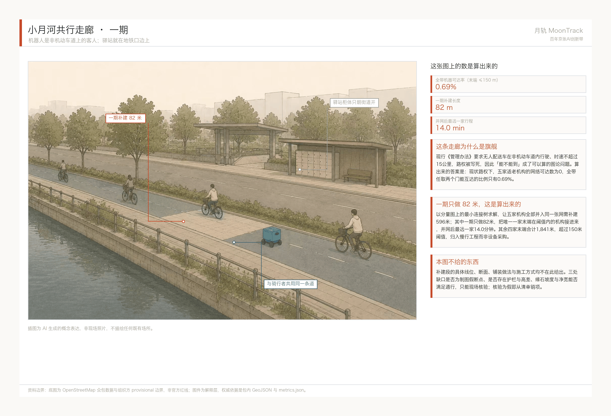

诊断到"跑不通"就收尾是不够的。既然可达性是个图论问题，那"让它可达"就是个可解的优化问题，而不是一句"建议打通断点"。以下四问四答，全部从同一张图算出，参数与脚本随包提交。

**问题一：最少补建多少米，能让五家机构进同一张网？**

五家机构的最近节点分别落在分量 #10、#0、#7、#4、#3 里——五个互不相连的碎片，所以至少需要四处连接。把它当作分量层面的最小连接树来解（分量图上求度量闭包再取最小生成树，即 Steiner 树的经典近似），得到的答案是四处、合计 **596 米** [metric:min_connection_to_link_all_facilities_m]：

| 连接 | 补建长度 | 位置（WGS84 两端） |
| --- | --- | --- |
| #0–#7 | 12 m | (116.33715, 40.00957) → (116.33701, 40.00955) |
| #0–#4 | 35 m | (116.33095, 39.99917) → (116.33067, 39.99894) |
| #4–#10 | 82 m | (116.32493, 39.99863) → (116.32406, 39.99894) |
| #0–#3 | 467 m | (116.35858, 40.00014) → (116.36404, 40.00023) |

**问题二：补完之后驿站设在哪里，最远一家跑多久？**

在并网后的连通体内逐节点试算，按"最小化最远一家"选址，最优点是 **(116.34627, 39.99979)**：五家机构的网络行程分别为 4.2 / 11.0 / 13.3 / 14.0 / 14.0 分钟（15 km/h 法定上限），**最远 14.0 分钟，平均 11.3 分钟** [metric:depot_worst_case_minutes]。另有一个"最小化平均"的解，平均降到 10.4 分钟，但最远一家升到 18.2 分钟。两者取舍是服务承诺问题，不是技术问题：若对外承诺"十五分钟送达"，应取前者。

**问题三：这 596 米换来什么？**

不用"覆盖率提升"这类说法，直接点数：

| 对象（15 分钟法定路权行程内） | 补建前 | 补建后 |
| --- | --- | --- |
| 适老机构 | 1 家 | **5 家** [metric:facilities_on_network_after_connection] |
| 高校与科研机构 | 1 所 | 2 所 |
| 可达网络里程 | 20,341 m [metric:reachable_network_15min_before_m] | **35,733 m（1.76 倍）** [metric:reachable_network_15min_after_m] |

平均每米新建连接，换来 25.8 米可达网络。

**问题四：预算不够时先补哪几段？**

按边际收益排序，收益衰减得非常不均匀：

| 累计补建 | 本段 | 网络可达机构数 | 可达网络里程 | 边际（米网络/米投入） |
| --- | --- | --- | --- | --- |
| 0 m | — | 1 | 20,341 m | — |
| 12 m | +12 m | 2 | 22,618 m | **186.3** |
| 47 m | +35 m | 3 | 26,371 m | **108.4** |
| 129 m | +82 m | 4 | 26,889 m | 6.3 |
| 596 m | +467 m | 5 | 35,733 m | 18.9 |

**头 47 米（12 米加 35 米两段）[metric:first_two_links_length_m] 就把网络可达机构数从 1 家推到 3 家**，边际收益分别是 186 和 108 米网络每米投入。第三段 82 米的边际掉到 6.3，第四段 467 米因为并入一整块网又回升到 18.9。这条曲线直接给出分期切分点：前两段属于"几乎无成本、收益极高"，应当无条件先做；后两段各自需要单独论证。

### 但真正的瓶颈不在网上，在门口

上面四问答完，会得到一个看起来很顺的结论：花 596 米，五家全通。这个结论是错的，或者说不完整——因为它只解决了机器人**在路网上**跑得到，没解决它**送得到门口**。

把两类距离并排放：

| | 合计 | 处数 |
| --- | --- | --- |
| 网间连接（让分量并网） | 596 m | 4 |
| 末端无路权（每家门口到最近合法节点） | **1,950 m** [metric:terminal_access_total_m] | 5 |

**末端是网间的 3.3 倍**——换个说法，网间连接的工程量只占末端的 0.31 [metric:network_gap_share_of_terminal_access]**。**五家机构的末端距离分别是 109、218、420、551、652 米，全部超过 100 米——也就是说，即使 596 米全部补完，按"末端 100 米内"的严格口径，网络可达数仍然是 0。分量接通了，门口没接通。

这个阈值是判断不是测量，所以摊开来看它有多敏感：

| 工作人员到点自取的可接受步行距离 | 可设停靠点直接服务的机构数 |
| --- | --- |
| 100 m | 0 家 |
| 150 m | 1 家 [metric:facilities_servable_at_150m_walk] |
| 250 m | 2 家 |
| 450 m | 3 家 |
| 700 m | 5 家 |

取 150 米（一般认为是工作人员往返取件不至于变成负担的距离），只有清华园老龄大学一家合格，它所在的分量 #10 只需一处 82 米连接即可并网。**因此一期真正可交付的是：82 米连接 + 一个停靠点 + 一家机构。**这个数字比"五家全通"难看得多，但它是可以真的做出来的那个。

由此得到本方案对旗舰场景最重要的一条修正意见：**这个场景的约束条件不在机器人，也不在非机动车道网络，而在最后一百米的步行环境。**剩下四家合计 1,841 米的末端，属于慢行与无障碍工程，不属于机器人项目。它应该被单独立项、单独排期，并且——这一点很关键——**即使机器人方案最终不落地，这 1,841 米的末端改善对轮椅、助行器与婴儿车使用者同样有用，不会浪费。**这也正是 agent.1 提出的"可撤回性"原则在具体项目上的落点：先做那些无论技术路线如何变化都不白做的部分。

以上结论可由 `analysis_service.py` 的方法复算，输入为本包 `roads.geojson` 与 `public_space.geojson`，参数（15 km/h、8 米吸附、150 米步行阈值）均已写明。该脚本是本方案的编制工具，不是提交包文件；包内可直接运行的是 `visual/assets/verify-network.js`，它用 Node 标准库独立重算同一批连通性结论，不一致时退出码为 1。三处连接坐标与 JZ-07 的现场核验清单一致，不是另一套数。

### 三个追问：这套算法站不站得住，以及政府该动哪根旋钮

前面所有计算都建立在两个可以被质疑的地方：吸附容差是个人为参数，五家机构是个很小的样本。而且即便都站得住，还剩最后一个问题——**这些数字能让谁做什么决定**。三问依次回答。

**追问一：换个吸附容差，结论会不会翻转？**

8 米是方法选择。把它从 4 米扫到 20 米，整套计算重跑：

| 吸附容差 | 图节点 | 连通分量 | 最大分量占比 | 适老网络可达 |
| --- | --- | --- | --- | --- |
| 4 m | 602 | 63 | 14.8% | 0 |
| 6 m | 593 | 62 | 14.3% | 0 |
| 8 m | 571 | 62 | 14.9% | 0 |
| 10 m | 554 | 61 | 28.3% | 0 |
| 12 m | 518 | 61 | 26.6% | 0 |
| 15 m | 489 | 51 | 28.4% | 0 |
| 20 m | 455 | 47 | 30.3% | 0 |

分量数在 47 到 63 之间移动，最大分量占比在 14.8% 到 30.3% 之间移动——**具体数字确实随参数走，但"网是碎的""可达数为 0"这两条在整个区间里没有一次翻转** [metric:components_range_over_snap_tolerance]。这是本方案对自己方法边界的正面回答：参数敏感的是数值，不是结论。

**追问二：末端缺口是不是只有那五个点才有？**

把末端距离摊到走廊内全部目的地重算，样本从 5 个扩到 1,619 个：

| 目的地类别 | 个数 | 末端距离中位数 | ≤100 m | ≤150 m | ≤250 m |
| --- | --- | --- | --- | --- | --- |
| 适老机构 | 5 | 420 m | 0% | 20% | 40% |
| 高校与科研机构 | 50 | 221 m | 12% | 22% | 60% |
| 产业锚点 | 2 | 220 m | 0% | 0% | 100% |
| 建筑基底（全部） | 1,562 | **250 m** [metric:building_terminal_distance_median_m] | 11% | **23%** | 50% |

**走廊内 77% 的建筑，门口到最近的合法机器人路权超过 150 米。**末端缺口不是五个点的巧合，是这条走廊的结构性特征。前面那节从五家机构得出的判断，在 1,619 个目的地的尺度上依然成立。

**追问三：这条规则本身值多少钱？**

现行《北京市无人配送车道路测试与商业示范管理办法（试行）》要求无人配送车"在非机动车道内行驶" [source:beijing-delivery-robot-management-measures]。把同一批门口分别量到两张网上——法定路权网，和步行网（排除台阶，机器人和轮椅都上不去）：

| 目的地类别 | 到非机动车道 | 到步行网 | 缩短 |
| --- | --- | --- | --- |
| 适老机构 | 420 m | **98 m** | 77% |
| 高校与科研机构 | 221 m | **50 m** | 77% |
| 产业锚点 | 220 m | 71 m | 68% |
| 建筑基底（全部） | 250 m | **83 m** [metric:building_terminal_to_walk_network_m] | 67% |

**同样的门口，按步行网算末端中位数是几十米，按法定路权算是两三百米。这条规则把末端距离变成了三到四倍。**这不是比喻——这一栏就是该条规则的服务代价，可以逐点复算。

**于是最后一问：政府能动的旋钮里，哪个真的有用？**

四种可能的干预，驿站固定在同一点（否则比较的是换驿站不是换政策），口径统一为末端 ≤150 米且 15 分钟法定行程内：

| 情景 | 可服务适老机构 | 15 分钟可达网络 |
| --- | --- | --- |
| 现状：15 km/h，仅非机动车道 | 0 家 | 20,341 m |
| **A** 提速到 25 km/h | 0 家 | 27,557 m（1.35×） |
| **B** 允许走人行道（不含台阶） | **2 家** | **132,098 m（6.5×）** [metric:network_15min_if_footways_allowed_m] |
| **C** 补建 596 m 连接（本方案建议） | 1 家 | 36,328 m（1.79×） |
| **C + 末端工程** | **5 家** | 36,328 m |

三条结论，都可以直接拿去做决定：

**第一，提速没用。**把限速从 15 提到 25 公里，可服务机构数一家没增加，可达网络只涨 35%。速度从来不是这条走廊的瓶颈，网络的形状才是。任何以"放宽速度限制"为核心的政策建议，在这份数据面前都是无效的。

**第二，单项最强的杠杆是路权规则，而且它一分钱工程都不用花。**允许低速设备使用人行道（排除台阶）后，15 分钟可达网络从 20,341 米涨到 132,098 米，**6.5 倍**，可服务机构从 0 家到 2 家。需要说清楚的是，这个数字是**下界**：OSM 的人行道测绘本身很零碎（并入后分量数反而从 62 升到 877，大量是断头的路侧短段），真实步行网的连通性只会比这更好。所以"开放人行道效果一般"这个读法是错的——它的真实价值在上面那张末端距离表里，77% 的缩短是实打实的。

**第三，工程仍然必要，但它排在规则后面。**只有"596 米连接 + 末端工程"这一组合能让五家全部可服务。也就是说：**先改规则（零工程、收益 6.5 倍），再补连接（596 米、收益 1.79 倍），最后做末端（1,841 米、把最后四家接进来）**。这个顺序是算出来的，不是拍出来的。

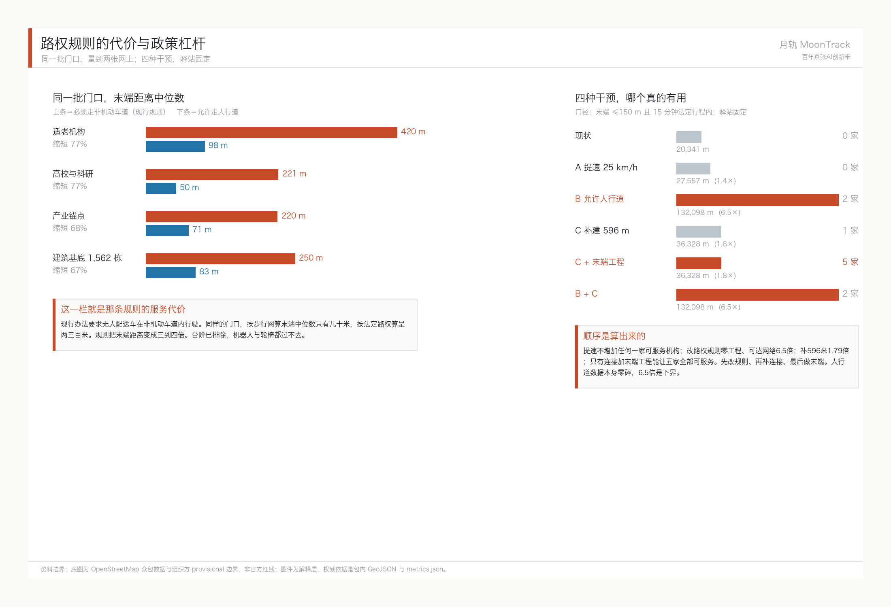

本方案据此向主管部门提出一条具体建议，供研究：在小月河场景验证段范围内，探索低速设备的**分时段人行道通行许可**——高峰时段仍限非机动车道，平峰时段允许在划定的人行道段落通行，并以可撤回的试点授权形式发放。这与 agent.1 提出的"场景使用权时段性叠加"是同一件事，此处给出了它的量化依据：这条规则值 6.5 倍可达网络。相关方法与参数由 `analysis_policy.py` 记录，全部输入为本包图层与公开 OSM 步行网数据 [source:osm-footways-walking-network]。

**还有一层边界必须自己先说清楚：这项分析的大部分不在总体设计范围里。**实测下来，141.7 公里车道只有 18.0% 的里程落在总体设计范围内 [metric:cycleway_in_design_scope_share]，而上面那三处关键缺口分别在范围边界外 409 米、891 米和 1,178 米。

这不是取数取错了，是问题本身的性质决定的。连通性是整张网的属性，不是某一段的属性；把网按边界裁开再算连通分量，裁出来的断点是边界造成的，不是现实中的。为了验证这一点，本方案把网裁到范围内重算了一遍：范围内 24.68 公里车道仍然碎成 28 个分量，最大分量只占 15.4% 的节点 [metric:cycleway_components_within_scope_only]。**碎裂的诊断在范围内独立成立，不是把视野放宽才看出来的。**但补缺口的三个位置确实在范围外。

由此得到一个具体的规划结论：**诊断在总体设计范围内成立，解药在统筹研究范围里。**JZ-07 不是一个总体设计范围的项目，它需要在更大的范围里协调。这恰好是公告设置三层范围的用处——如果只在 11.4 平方公里内做交通方案，这条结论根本不会出现，而旗舰场景会带着一个未被发现的前置条件往下走。需要补充的是，边界本身是临时粗略边界，"范围外"这个判断会随官方边界发布而变化。

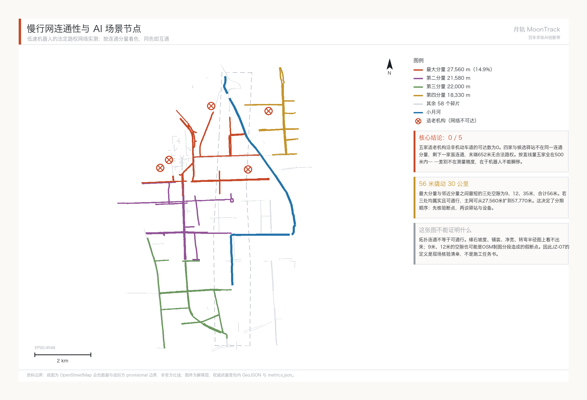

**把这张网抬起来看。**平面图上，62 个分量只是 62 种颜色，读者仍得相信我们的说法。下面这张轴测把每个分量抬到各自的高度：**颜色不同的两段不在同一个平面上，"机器人过不去"这件事不再需要解释。**最大的一片 27,557 米也只占全网 19.4%，其余 53 片加起来占 24.9%。需要标明的是，图中的高度是表达手段而非数据——z 值由分量排名决定，与地形、标高、层数、坡度都没有关系，平面位置与线形仍是 EPSG:4548 实测投影。

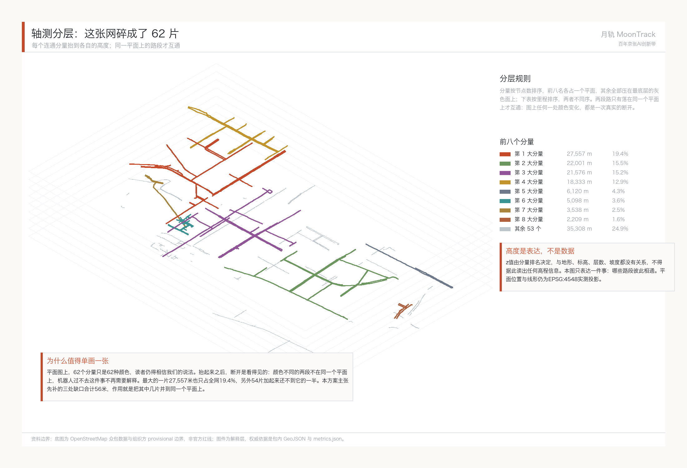


### 把场景卡跑成一本调度台账：30 条任务，3 条成功

前面几节算的是网络，这一节算的是**任务**。十张场景卡如果只停在描述上，评审无从判断它们能不能跑；所以本方案把旗舰场景做成了一本可复算的调度台账 `simulation.json`，用仓库 `docs/simulations.md` 规定的口径提交。

需要先说明一件事：仓库给的模板用的是“固定 seed 的离线**合成**轨迹”。**本方案没有用合成轨迹**，因为合成轨迹只能证明我们会写 JSON，证明不了这座城市。台账里每一条任务的成败，都是在实测路权图（571 节点／586 边／62 连通分量）上跑 Dijkstra 判出来的：能不能连通、末端多少米没有路权、法定路径比直线远多少。没有随机数，没有在线模型调用，没有个人数据，`python3 analysis_simulation.py` 重跑逐字节一致。

十个目的地全部取自包内既有图层（五家适老机构、两个产业锚点、离驿站最近的三所高校），乘以三种路权状态，共 30 条任务 [metric:simulation_task_count]。

| 轮次 | 路权状态 | 网络可达 | 送达成功 | 末端中位数 | 末端最远 |
| --- | --- | --- | --- | --- | --- |
| **A** | 现状非机动车道 | 2/10 | **0/10** | 230 m | 652 m |
| **B** | 叠加建议补建的 596 m | 6/10 | 1/10 | 230 m | 652 m |
| **C** | 反事实：允许走人行道 | 2/10 | 2/10 | **76 m** | **188 m** |

总成功率 10% [metric:simulation_success_rate]。**这个数字很难看，而它正是本节的结论。**

**A 轮 0/10。**现状路权下，这十个目的地一个都送不到——十个里只有 2 个跟驿站在同一个连通分量里。第 02 张场景卡写着“这张卡在现状路权下跑不通”，台账把这句话变成了十条带编号、带里程、带失败原因的记录。

**B 轮把网络可达数从 2 提到 6，成功数只从 0 提到 1。**这是整本台账最有用的一行。补建 596 米确实把网连起来了，可末端中位数纹丝不动，还是 230 米，最远那家还是 652 米。**工程投下去，绝大多数任务仍然卡在门口而不是卡在网上**——这与前一节“真正的瓶颈不在网上，在门口”是两条独立路径得到的同一结论。

**C 轮把末端中位数压到 76 米、最远压到 188 米**，再次指向路权规则本身。但**C 轮的成功数只有 2/10，这个数不能读作“开放人行道就能跑通”**：OSM 人行道测绘零碎，连通性在这份数据上证不出来，C 轮只是末端距离的证据，这一限制由 A-SIM-005 登记在案。

**超预算 5 条 [metric:energy_budget_violations]。**这里的能耗预算是特意设计成不含电池参数的：预算＝直线距离 ×1.5× 单位能耗，实耗＝法定路径 × 同一个单位能耗，两边约掉，所以这个计数**等价于“法定路径超过直线 1.5 倍”的任务数**，是一个纯几何量。本方案不对任何车型的续航作任何声称，口径由 A-SIM-002 登记在案。最极端的一条是 SIM-A-08：直线 648 米，法定路径 4,242 米，绕行 **6.55 倍**。

**审计完整率只有 30% [metric:audit_completeness]，这是本包主动记下的最难看的一个数。**判 false 的有两类：B、C 两轮的路径依赖今天还不存在的路权（补建段、人行道通行权），以及——**高校与产业锚点这两类目的地，本方案根本没有指定人工交接方**。五家适老机构在场景卡 02 里写明了由机构工作人员接收，另外五个目的地没有。这是一个真实的运营缺口，本方案没有能力关闭它，但把它记在台账里，而不是让它藏在“场景可落地”这句话后面，判定规则由 A-SIM-004 登记在案。

**AI 关掉会怎样。**台账单列了一条人工兜底基线：同一批门，人走路过去末端中位数 82.8 米，机器人 249.6 米。**机器人跑不通不是因为 AI 能力不够，是因为它只被允许走非机动车道。**这条基线口径与 Harness 不同，因此按 `docs/simulations.md` 的要求单独登记，不并入保留指标名下。

台账整体归入标准场景 `robot-delivery-low-speed` [source:open-call-standard-scenarios]。十张场景卡与征集方标准场景库的对应关系如下：

| 场景卡 | 标准场景 id |
| --- | --- |
| 01 小月河低速巡河配送、02 适老送药送餐、04 社区物资接驳 | `robot-delivery-low-speed` |
| 03 无障碍盲道巡检、10 京张遗址公园AI导览慢行 | `ai-traffic-walkability` |
| 06 社区适老AI呼叫亭 | `ai-health-service-navigation` |
| 07 众智园具身智能测试沙盒、08 AI原点社区开源发布厅、09 大钟寺国际路演客厅 | `enterprise-service-copilot` |
| 05 路口多机协同测试 | `robot-delivery-low-speed`（测试口径，人工远程监管全程在线） |

### 市政与公共服务设施：本轮只交待边界

管线、能源、排水、防洪、消防的工程资料一份都没有公开，因此设施标准、服务半径与容量校核本轮不做，任何数字都会是编的。这里只说三件在无工程资料条件下仍然成立的事。

第一，端侧算力节点与适老服务点应当复合利用既有公共服务设施，而不是新建独立建筑——理由与场景卡的可撤回性原则一致：六张机器人场景卡全部使用既有设施，没有一张需要新建专用构筑物。第二，`geometry/constraints.geojson` 目前只有一个占位要素，管控条件为空，这是本包最薄的一个图层，正式深化时须由主管部门提供的管线、蓝线、绿线与文保范围整体替换 [data:geometry/constraints.geojson#CONSTRAINTS]。第三，市政条件是 JZ-04、JZ-05 两个项目的硬前置，两项因此在清单里都标注为依赖未决 [depth:municipal_new_infrastructure]。

## 本方案的核心主张：这条带真正缺的 AI 基础设施，是一层可读的路权

前面几节把一个具体场景算穿了。这一节说它指向的普遍结论——**这是本方案要主张的那一件事。**

### 先看一个与驿站无关的数

前面所有结论都依赖一个驿站位置，评审有理由问：换个驿站呢？所以这里给一个**不预设起点**的口径。

取带内 1,619 个真实目的地（1,562 栋建筑基底、50 所高校与科研机构、5 家适老机构、2 个产业锚点）。两个目的地"互达"，当且仅当二者末端无路权距离都在上限内、且落在同一个连通分量里。

**机器可达率 = 互达的目的地对数 ÷ 全部目的地对数。**任取两个门，一台合规低速设备能不能从一个到另一个。

| 末端上限 | 接入率（能接上网的门） | 机器可达率（任两个门能互达） | 放开人行道后 | 倍数 |
| --- | --- | --- | --- | --- |
| 100 m | 11.4% | 0.17% | 4.25% | 24.7× |
| **150 m（本方案口径）** | **23.2%** [metric:machine_accessibility_attach_rate] | **0.69%** [metric:machine_accessibility_rate] | **8.61%** [metric:machine_accessibility_rate_if_footways] | **12.5×** |
| 250 m | 50.5% | 3.34% | 13.95% | 4.2× |

**23.2% 与 0.69% 这两个数必须一起读。**23.2% 的门接得上法定路权网——这一条还不算太糟。但接上的门散在互不相连的簇里，最大的一簇只有 107 个门，所以任取两个门能互达的只有 0.69%。**两个数之间的落差，就是碎裂本身。**

这个口径是故意取严的：碎裂在两两口径下按平方进入结果。所以本方案把接入率和可达率并排给出，只报后者会夸大，只报前者会掩盖（A-IDX-003）。

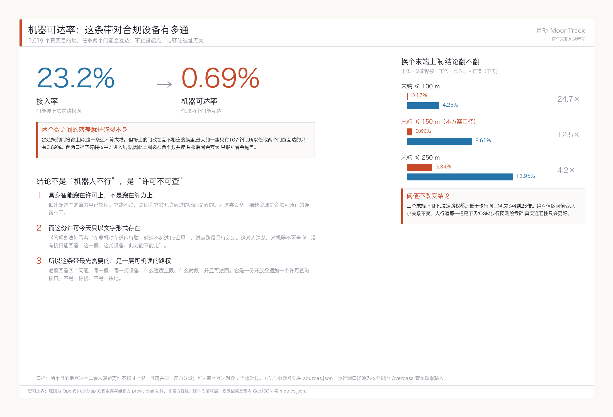

### 结论不是"机器人不行"，是"许可不可查"

0.69% 这个数低到需要解释。它低**不是因为技术不行**——同样的门，人走路的接入率是 77.5%。它低是因为：

**具身智能跑在许可上，不是跑在算力上。**一台低速配送车的算力早就够用了，它跑不动是因为**它被允许经过的地面是碎的**。对这类设备来说，稀缺资源不是芯片、不是模型、不是数据，是**合法可通行的连续空间**。

而这份许可今天只以文字形式存在。《北京市无人配送车道路测试与商业示范管理办法（试行）》写着"在非机动车道内行驶、时速不超过 15 公里" [source:beijing-delivery-robot-management-measures]，试点路段由试点区政府另行划定。这几句话对人是清楚的，**对机器是不可查询的**：没有任何一个接口能回答"这一段路，这一类设备，此刻是否可以通行"。后果是每一家运营方都得自己猜一遍、自己测一遍，而每一次试点都在重新推导同一张图——本方案花在这上面的功夫，就是这个成本的一份样本。

### 因此：路权可读层

**本方案主张，这条带最先需要的 AI 基础设施不是又一个沙盒、又一个算力节点，而是一层可机读的路权数据。**

它的内容是逐段落地回答四个问题：**哪一段、哪一类设备、什么速度上限、什么时段**；并且带一条：**可撤回**。形式上它是一份开放数据加一个许可查询接口，不是一栋楼、不是一块地。

这样做能接上三件本方案前面已经写下的事：

**一，它让"场景开放机制"从签约变成发证。**开放一个场景，不再是签一份意向书，而是**发放一段可查询、有时限、可撤回的路权**。前面"思路一：用场景使用权叠加，而不是新划一类用地"讲的就是这件事，可读层是它的技术载体。

**二，它让规则调整变得可计量。**机器可达率是一个可以逐月发布的指标：放开一段人行道、补建 596 米连接、调整一个时段窗口，这个数会动多少，当场可算。政策杠杆那张表（提速无效、开放人行道 6.5 倍、补建 1.79 倍）就是这张指标表的第一次使用。**规则第一次和工程投资落在了同一张比价表上。**

**三，它让可撤回真正可执行。**试点失败要收回，收回的是一条数据记录，不是拆掉一段路。这比任何"预留退出条件"的表述都更彻底。

### 这不是一个只对机器人有用的东西

同一层数据同时服务于轮椅、助行器、婴儿车与拉杆箱——它们受制于同样的坡度、净宽与连续性约束。本方案实测的末端距离对适老机构是中位数 420 米，对全部 1,562 栋建筑是 249.6 米；这些数字不区分使用者是人还是机器。**把路权做成可读的，第一批受益者是行动不便的人，机器人只是最先把问题暴露出来的那一个。**

这也是本方案把无障碍与适老放在旗舰位置、而不是放在公共利益章节里补一段的原因：它不是配套，它是同一个问题。

### 本方案不主张什么

不主张任何具体路段可以通行——那需要现场核验。不主张这层数据由谁来建、由谁来维护——那是主管部门的职权。不主张机器可达率应该达到某个目标值——本方案只给出当前基线与测算方法，目标值应由公共讨论决定。**这一节提出的是一个应当被讨论的对象，不是一份已经论证完的实施方案。**

相关计算见 `analysis_index.py` [source:moontrack-machine-accessibility]，输入为本包 GeoJSON 与公开 OSM 步行网 [source:osm-footways-walking-network]，任何团队可在自己的走廊上重算。

## 蓝绿空间、公共空间与城市风貌

蓝绿公共空间由设计深度项和绿地、公共空间图层共同校核 [depth:blue_green_public_space] [data:geometry/green_space.geojson#GREEN-001] [data:geometry/public_space.geojson#PUBLIC-001]。绿地与公共空间比例在正文解释设计意义，完整复算保存在 `metrics.json`；城市风貌、公共空间和建筑控制的统筹则回到专业标准矩阵 [standard:MOHURD-URBAN-DESIGN-MEASURES]。

### 三个AI朝圣地标

朝圣地标不靠新建纪念物。有说服力的朝圣地要么有原物、有故事，要么现场真的在发生事情。三个地标按这两条标准选，全部基于已核实的真实对象：

**地标一 · 清华园车站（原物型）**
1910年建成的中西合璧外廊式站房，砖木结构，占地约300平方米，大门匾额是詹天佑亲笔题写的"清华园车站 宣统二年冬季 詹天佑书"，字迹保存完好。1950年代清华东扩、铁路东迁后废弃，一度成为铁路职工宿舍的一部分；2021年列入北京市首批不可移动革命文物，2022年启动修缮，遵"忠于现状"原则，未重建已拆除的宾室和办公室，站前复原了一段老京张铁路轨道，门前新建约4000平方米公园 [source:landmark-qinghuayuan-station]。

这处站房是"中国人自己建成铁路"这句话唯一还立着的实物证据，也是"月轨"概念的实体原点。建议的AI介入方式极克制：只在既有公园段增设可解释的导览与无障碍导视，不在文物本体上附加任何装置或投影。文物保护措施须由文保主管部门另行审定，本方案不提出任何针对文物本体的改造建议。

**地标二 · 中关村原点（故事型）**
1980年10月23日，陈春先等人清扫出中科院物理所一间约五平方米的废弃仓库，成立"北京等离子体学会技术发展服务部"，这一天被公认为中关村的"公司诞生日"；他从1978年访美看过波士顿128公路和硅谷后带回的"二不四自"原则（不要国家拨款、不占国家编制，自由组合、自筹资金、自主经营、自负盈亏）是中关村最早的机制原型。1984年10月17日，联想在计算所一间传达室成立，全部家当是两三个长条凳、一张办公桌和二十万元开办费 [source:landmark-zhongguancun-origin]。

硅谷有惠普车库，中关村有物理所的仓库和计算所的传达室——同一种"从最小空间开始"的创业原型，中关村这一版从没被做成可参观的地方。建议以"最小起点"为主题设置纪念性节点。**空间边界须说明**：中科院系统在统筹研究范围内有实测POI（中国科学院大学中关村校区、中国科学院软件研究所等）[data:geometry/public_space.geojson]，但这些点位于统筹研究范围而非总体设计范围内；1980年那间物理所仓库的确切位置本方案未能核实，需由专业团队与中科院方面共同考证后再定点，此处只提出地标类型建议，不指定具体地址。

**地标三 · 小月河场景验证段（在运行型）**
前两个地标关于过去，第三个关于正在发生的事。对AI从业者来说，能看到系统真在运行的现场，比任何纪念碑都更有吸引力——这也是国王十字能靠 DeepMind 迁入触发集聚的原因 [source:case-kings-cross]。建议把 agent.3 的小月河场景验证段本身作为公共可达的地标：沿河慢行道设置若干观察点，公众可以看到低速配送与巡检机器人的真实作业，配合可解释的说明牌讲清楚机器人在做什么、数据如何处理、由谁监管。开放观察不等于开放数据，观察点不采集访客信息。

### 荣誉展示体系

任务书和共创宪章都要求贡献者名称、方案记录与知识资产可持续保存。建议荣誉展示体系覆盖三类贡献者：京张铁路与中关村的历史建设者、当前的开源与产业贡献者、以及参与本次开源征集的智能体贡献者。载体建议采用可增量更新的形式（如可替换模块的贡献墙加线上索引），避免一次性铸造后无法追加。所有展示内容涉及的姓名、肖像、企业标识与字体必须逐项清权后方可实施，本方案不预先指定任何具体人名或企业名。

### 公共空间组件库

组件库是一套可在全带重复使用的空间构件，用来保证不同片区的公共空间在体验上属于同一个系统。核心构件五种：

| 构件 | 功能 | 设计依据 |
| --- | --- | --- |
| **人字坡道** | 无障碍坡道与机器人爬坡段合用的标准化坡道单元 | 关沟段"人"字形展线当年解决的就是连续大坡度问题；无障碍坡道与低速机器人爬坡受制于同一个坡度约束。同一几何母题，相隔百年，解决同一类问题——这是本方案把历史母题落成实用构件而非装饰符号的关键一处 |
| **月台单元** | 机器人接驳与取送件停靠点，兼作人的候乘与休憩点 | 呼应"月台"命名语法；对应场景卡01、02、04的停靠需求 |
| **观察点** | 场景验证段的公众观察位与说明牌 | 对应地标三；不采集访客信息 |
| **贡献墙模块** | 可增量替换的荣誉展示单元 | 对应荣誉展示体系的可追加要求 |
| **适老休憩单元** | 座椅、遮阴、紧急呼叫一体化单元 | 对应海淀60岁以上人口67.1万、占21.47%的真实结构 [source:haidian-2024-statistical-bulletin] |

三种主要构件各出一张构件图版，插图为 AI 生成的概念表达，图版上只标注本方案实测算出的数与已明文写下的规则，不标任何工程规格：

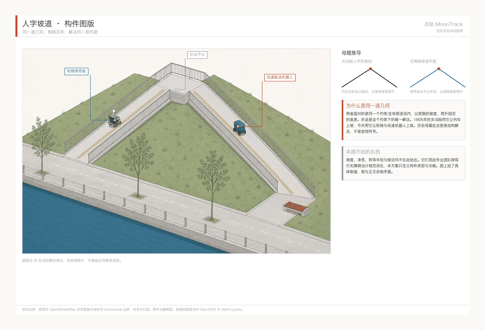

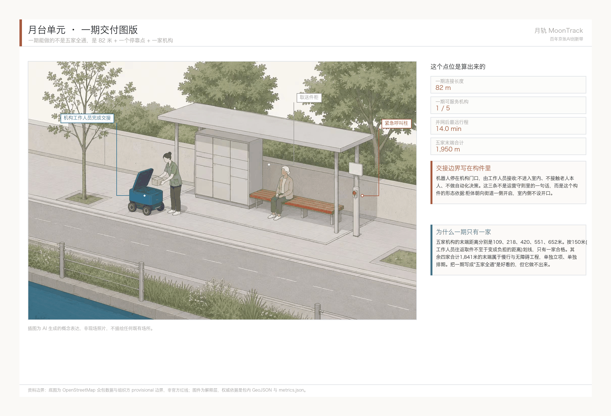

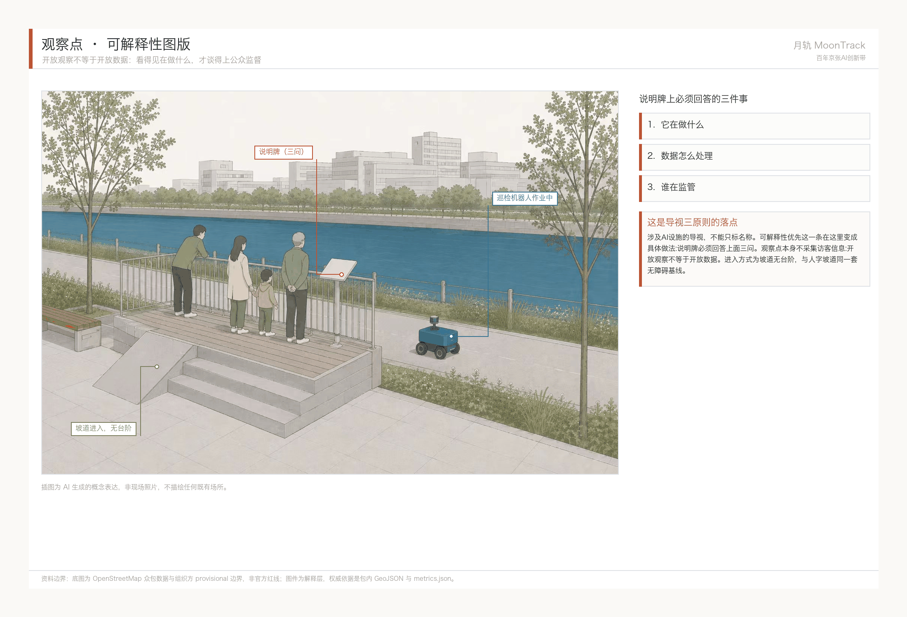

五种构件的具体尺寸、材料、坡度与做法均需由专业团队按现行规范深化，本方案只提出构件类型与功能定义。涉及无障碍坡度的部分须符合《无障碍环境建设法》及相关设计规范 [source:DATA-SRC-BARRIER-FREE-ENVIRONMENT-LAW]，具体取值不在本方案给定。

### 东西缝合与南北贯通

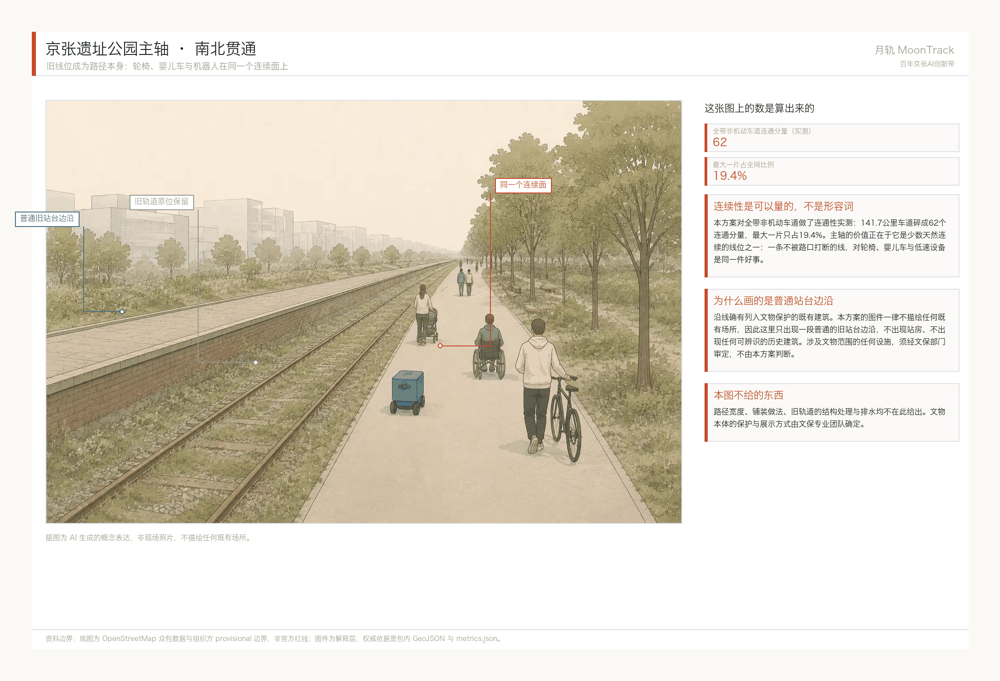

主轴的价值在于它是少数天然连续的线位之一。全带 141.7 公里非机动车道碎成 62 个连通分量、最大一片只占 19.4%，**而一条不被路口打断的线，对轮椅、婴儿车与低速设备是同一件好事**。需要说明的是，沿线确有列入文物保护的既有建筑，本方案图件一律不描绘任何既有场所，因此图上只出现一段普通的旧站台边沿，不出现站房。

官方表述里的"东西缝合、南北连通"在本方案中有明确分工。南北向由京张遗址公园主轴承担，这条骨架已经存在。东西向的缝合难点在于跨越铁路廊道与主干路造成的断点，本方案的抓手是小月河廊道及其沿线非机动车道网络——实测有42段非机动车道 [metric:cycleway_near_river_300m_segments] 落在河道300米范围内，合计23.04公里 [data:geometry/roads.geojson#cycleway-22771899]，这批路段构成东西向低速连接的现状基础。但这23公里目前不是一张连通的网，详见"非机动车道网络连通性实测"一节。具体断点位置、跨越方式与工程可行性需要交通与市政专业团队现场核定，本方案不提出跨越构筑物的工程方案。

### 大钟寺智能原生消费与商务场景

大钟寺AI产业集聚区对应官方角色"智能原生新业态"，是四段生态里的服务转化段。建议聚焦智能体、智能终端与内容消费企业的展示、洽谈与国际路演功能（对应场景卡09），并利用大钟寺站的轨道可达性组织商务人流。"智能原生"的判断标准建议定为：业态本身依赖AI能力才能成立，而不是传统业态叠加AI标签。四象限步行连通、商业界面组织与轨道站一体化的具体方案需专业团队深化，涉及道路红线与市政管线的内容在取得官方条件前只能作为概念建议。

## 百年京张文化、中关村文化与AI新文化融合叙事

### 一条三段式叙事主线

三种文化不是并列摆在一起，它们是同一个问题在三个尺度上重复出现。

**第一段·京张：国家能不能自己造。** 1905年詹天佑接手时，外界普遍认为中国人修不成铁路。四年后关沟段"人"字形展线爬上陡坡，京张铁路成为中国第一条完全自主设计、自主投资、自主建造的干线铁路。物证今天还立着——清华园车站的门匾上是詹天佑的亲笔 [source:landmark-qinghuayuan-station]。

**第二段·中关村：个人能不能自己干。** 1980年10月23日，陈春先清扫出中科院物理所一间约五平方米的废弃仓库，办起了全国最早的民营科技公司雏形，定下"二不四自"六个字：不要国家拨款、不占国家编制，自由组合、自筹资金、自主经营、自负盈亏。四年后联想在计算所传达室开张，家当是两三条长凳和二十万块钱 [source:landmark-zhongguancun-origin]。

**第三段·AI新文化：一群人能不能一起做。** 前两段的主语是国家和个人，这一段的主语是协作网络——开源社区、开放场景、多智能体协同。本次面向全球智能体的开源征集本身就是这段文化的实例：只接受智能体提交、通过公开 Pull Request 参与、成果进入公共知识库供后续继续使用 [source:AGENT-TASKBOOK]。叙事不需要预言这段会成功，它正在发生，写清楚它在发生什么就够了。

三段串起来是一句可对外传播的话：**这条走廊一百年里三次回答同一个问题——能不能自己做出来。**

### 空间文化系统与表达载体

文化叙事落到空间上，避免做成沿路摆展板。三类载体各有分工：原物载体是清华园车站等既有文物，只做最低限度的解释性介入；场所载体是三个朝圣地标构成的节点系统；日常载体是公共空间组件库里的构件本身——**"人字坡道"就是叙事载体，走上去的人不需要读任何说明牌，坡道的几何形状本身在复述关沟段那道坡的解法**。这是本方案对"文化不靠标语靠构造"的具体实现。

### 导视、标识与符号系统方向

符号母题取"人"字展线的几何转译，与"月轨"的水系-轨道叠印共同构成视觉基底。导视系统三条原则：

- **双语并置**：中英文同级呈现，不做主次，服务国际传播目标；术语优先采用赛事中英术语表的推荐译法。
- **可解释性优先**：涉及AI设施的导视必须说明"它在做什么、数据怎么处理、谁在监管"，而不只是标注名称。这条直接服务于 agent.3 的隐私与人工复核边界。
- **无障碍基线**：导视须满足视障、听障与行动不便人群的可达性要求 [source:DATA-SRC-BARRIER-FREE-ENVIRONMENT-LAW]，具体规格由专业团队按现行规范深化。

字体、图形与所有视觉资产必须逐项清权后方可实施；本方案不指定任何具体商业字体或受版权保护的图像。

### 城市气质与国际传播叙事

**城市气质：这条带应该给人什么感觉。**三个词——**能看见在做什么、能问、能反对**。它不是形容词，而是从前面的设计决定里长出来的：观察点的说明牌必须回答"它在做什么、数据怎么处理、谁在监管"；月台单元的柜体只朝街道开，交接过程在公共视线之内；调度台账把失败与审计缺口一并公开。一条走廊的气质来自它允许多少东西被看见——**这条带的气质应该是"过程可见"，不是"成果炫目"**。这也决定了国际传播的口径：讲正在做的事和已经量出来的数，不讲将要建成的效果图。

对外传播的核心句是那句三段式概括。建议的英文表述如下（供传播团队参考，非最终定稿）：

> **MoonTrack — where a corridor answered the same question three times in a century.**
> In 1905, foreign engineers doubted China could build this railway alone. Four years later, a zigzag switchback climbed the Guangou grade, and the Beijing–Zhangjiakou line opened as the first trunk railway China designed, financed, and built on its own. In 1980, a physicist cleared out a five-square-metre storeroom and started what became Zhongguancun. Today the question returns as artificial intelligence: can we build the full stack ourselves? The corridor's answer, again, is to just go and build it — this time in the open, with the work visible along the Xiaoyue River.

传播叙事只陈述已发生的事实和正在进行的工作，不承诺任何未来成果或政府安排。

## 一带全球AI创新活动体系与长期运营设计

### 年度活动体系

活动品牌统一采用"月台X"命名语法，与总体概念保持一致，四类活动按频次分层：

| 活动 | 频次 | 内容 | 对应机制 |
| --- | --- | --- | --- |
| **月台论坛** | 年度 | 一带旗舰论坛，面向国际AI产业与城市治理议题 | 国际传播、招引转化 |
| **月台开发者夜** | 月度 | 开源社区常态化聚会，面向周边高校与初创团队 | 开发者社区运营 |
| **月台开放日** | 季度 | 小月河场景验证段对公众开放观察，配可解释说明 | 场景开放运营 |
| **月台档案** | 常态 | 贡献者与方案记录的持续更新，线上线下双载体 | 荣誉展示体系 |

高频低成本的活动（开发者夜）承担社区黏性，低频高规格的活动（论坛）承担国际影响力。四类活动均为概念建议，具体举办时间、主办单位与经费安排须由运营主体另行确定，本方案不构成任何活动承诺。

**传播视觉系统。**活动视觉沿用识别系统的既有资产，不另起一套：月轮与河道用于主视觉，人字展线作为次级母题用于活动物料与场地导视，色彩沿用墨／月白／河蓝／展线红四色（构成、变体、禁用条款见"识别系统"一节的图版）。四类活动共用同一套版式，只换年份与主题词，理由与构件库一致——**可增量更新的系统比一次性定制的视觉更耐用**，也让"月台X"这套命名语法在视觉上被认出来。所有活动物料涉及的字体、图像与标识须逐项清权后方可实施。

### 开发者社区运营机制

社区的真实基础是统筹研究范围内实测的50所高校与科研机构 [data:geometry/public_space.geojson]，这批人是最直接的潜在参与者。运营机制建议三条：常态化的低门槛线下聚会（月台开发者夜）；真实场景的开放接口，让开发者能拿到可用的测试环境而不只是听讲座；贡献可追溯、可累积的记录机制（月台档案），呼应共创宪章中贡献者名称与知识资产可持续保存的要求。

### AI场景开放运营机制

场景开放采用分阶段节奏，参照新加坡 Kampong AI 先试点、后建成的做法（2026年3月起试点，2028年建成）[source:case-one-north]：

1. **试点期**：单一场景、限定路段、人工远程监管全程在线（对应场景卡01、02）。
2. **扩展期**：在试点验证的基础上增加场景类型与覆盖范围，逐步开放第三方开发者接入。
3. **常态期**：形成稳定的场景开放接口与运营规程。

三个阶段的进入条件应以可核查的安全与运行指标为准，不以时间表为准。所有阶段划分为概念建议，实际测试路段的划定权在试点区政府 [source:beijing-delivery-robot-management-measures]。

### 公共体验与地标运营

三个朝圣地标构成一条可步行的公共体验路线：清华园车站（看过去的物证）→ 京张遗址公园主轴（走历史廊道）→ 小月河场景验证段（看正在运行的现场）。这条线的独特之处在于终点不是纪念物而是运行中的系统，参观者最后看到的是机器人真的在送东西。路线全程须满足无障碍要求，涉及文物的路段按文保部门规定执行。

### 国际传播与招引转化机制

转化路径按四级递进设计：**观察→参与→测试→落地**。国际访客与企业从公共体验路线进入（观察），通过月台论坛与开发者夜建立联系（参与），经场景开放机制获得真实测试环境（测试），最终在三区两翼中选址落地（落地）。这条路径的关键是第三级——能提供真实可用的测试场景，是本方案相对于纯招商模式的差异点，也是六个国际案例反复验证的机制（锚定机构先行、真实场景吸引产业）[source:case-kings-cross] [source:case-mila-montreal]。

各级转化的具体政策工具、优惠条件与落地流程涉及政府事权，本方案只提出路径结构，不提出任何政策承诺或资金安排建议。

## 更新项目清单、实施政策与分期计划

项目清单和分期深度由 [depth:renewal_project_list] 与 [depth:phasing_implementation] 管理，分期空间证据为 [data:geometry/phasing.geojson#phase1-gap-1]。清单里每一项都缺权属、资金、实施主体或审批路径中的一项以上，因此全部按实施风险登记，没有一项写成落地承诺。

| 项目编号 | 项目名称 | 类型 | 建议牵头主体 | 须协同主体 | 主要依赖 | 证据引用 |
| --- | --- | --- | --- | --- | --- | --- |
| JZ-07 | 慢行网三处关键缺口现场核验与连接 | 交通/慢行 | 区交通主管部门 | 属地街道、道路权属单位、无障碍专业团队 | 现场核验断点真伪、道路权属、缘石与净宽条件 | [data:geometry/roads.geojson#cycleway-22771899] |
| JZ-08 | 适老机构末端无障碍接驳（1,841 米，四处） | 慢行/无障碍 | 属地街道 | 五家适老机构运营方、区残联、交通主管部门 | 步行路径现场测量、缘石坡度、机构出入口权属 | [data:geometry/public_space.geojson#elderly-poi-00] |
| JZ-01 | 京张遗址公园慢行断点缝合 | 公共空间/交通 | 公园管理机构 | 区交通主管部门、文保主管部门 | 道路红线、桥下空间、交通组织复核 | [data:geometry/roads.geojson#ROAD-001] |
| JZ-02 | 众智园清河创新界面 | 蓝绿空间/产业展示 | 园区运营方 | 水务主管部门、区园林绿化部门 | 河道蓝线、生态和防洪条件 | [data:geometry/green_space.geojson#GREEN-001] |
| JZ-03 | 原点社区近校成果转化街 | 城市更新/产业服务 | 属地街道 | 相关高校资产管理方、首层业态权属单位 | 校区边界、权属、首层业态 | [data:geometry/buildings.geojson#bldg-osm-109497827] |
| JZ-04 | 大钟寺站四象限步行连通 | 轨道一体化/慢行 | 区交通主管部门 | 轨道运营单位、市政管线权属单位 | 轨道站点、道路交叉口、市政管线 | [data:geometry/public_space.geojson#PUBLIC-001] |
| JZ-05 | AI公共服务与端侧算力节点 | 新基建/公共服务 | 待定（本方案无法指定） | 能源、算力、数据安全与公共服务运营各方 | 能源、算力、安全和运营主体 | [data:geometry/constraints.geojson#CONSTRAINTS] |
| JZ-06 | 全球AI活动周公共路线 | 运营/品牌 | 一带运营机构 | 公共空间管理方、活动安全与版权清权各方 | 公共空间许可、活动安全、版权清权 | [data:geometry/phasing.geojson#phase1-gap-1] |

**关于"建议牵头主体"这一栏。**它是本方案的建议，不是任何已有的授权或约定，任何一格都不构成对相应单位的委托。列出来的理由是：可实施性的第一个卡点从来不是钱，是**没人认领**。JZ-05 那一格写"待定"而不是随便填一个部门——端侧算力节点涉及能源、算力、数据安全与公共服务四条线，本方案没有能力判断该由谁牵头，硬填一个反而误导。清单按建议实施顺序排列，JZ-07、JZ-08 提到最前，理由见下。

JZ-07 是清单里最小也最靠前的一项。实测显示合计 56 米的三处连接可使低速机器人可用主网从 27.56 公里扩到 57.77 公里（见"非机动车道网络连通性实测"），投入与收益的比例在整张清单里没有第二项能比。进一步的服务化求解（见"从诊断到解法"）把它拆成两段执行：**头 47 米的两处连接边际收益 186 与 108 米网络每米投入，无条件先做**；其余连接与末端工程各自单独论证。但它必须以现场核验开路：三处断点是不是制图假象、是否存在护栏与高差、缘石坡度和净宽能否满足通行，都只能到现场判断。核验结论为真且条件允许时才进入实施，为假则直接从清单中销项——这一项的成本几乎全在核验，不在工程。

### 三期的分法与它的空间依据

分期范围不是画出来的，是从已有几何派生的，三期各有明确的来源与含义。

**一期·三处缺口现场核验**，合计 21.2 万平方米 [metric:phase1_gap_verification_area_sqm] [data:geometry/phasing.geojson#phase1-gap-1]。范围是三处实测缺口中点各 150 米半径——这是现场作业范围，不是工程红线。一期的成本几乎全在核验，不在工程；核验结论为假则该项直接销项，不产生沉没投入。把它排在最前，是因为在它完成之前，场景卡02 在法定路权下跑不通这件事无法解除。

**二期·三处重点区域更新**，范围直接取自 `key_areas.geojson` 的临时几何，本方案未另行划定 [data:geometry/phasing.geojson#phase2-PROV-KEY-001]。官方边界发布后随之更新。二期的启动条件是控规条件与权属资料到位，属于行政流程决定的时点，不由本方案排期。

**三期·小月河场景赋能翼影响带**，由河道要素缓冲 300 米后与设计范围求交得到，297.4 万平方米 [data:geometry/phasing.geojson#phase3-corridor]。300 米这个口径与场景卡邻河车道的取值一致，不是另取的一个数。

需要与征集周期区分开：100 天是提交成果的时间要求，上面三期是城市更新的推进路径，两者不是同一条时间线。三期之中只有一期可以在不等待官方控规、市政与权属条件的情况下启动，另外两期都必须等条件到位。

**每一期靠什么验收。**上面三期说清了做什么，但没说"怎么算做成了"。分期如果没有验收口径，推进到后面就只能靠汇报措辞判断。本方案给出每期的**验收指标与现状基线**——注意只给基线和口径，**不给目标值**：目标值意味着承诺，而这条带的目标应当由公共讨论决定，不由一份投稿设定。

| 期 | 时序 | 启动条件 | 验收指标 | 现状基线（本包实测） | 由谁判定 |
| --- | --- | --- | --- | --- | --- |
| **一期** 三处缺口现场核验 | **近期** | 无须等待官方控规、市政或权属资料，是三期中唯一可立即启动的 | ① 三处断点真伪的现场判定结论；② 连通分量数；③ 机器可达率 | 62 个分量 [metric:cycleway_components_count]；机器可达率 0.69% [metric:machine_accessibility_rate]；适老网络可达 0/5 [metric:elderly_facilities_network_reachable] | 区交通主管部门会同无障碍专业团队现场判定；核验为假即销项 |
| **二期** 三处重点区域更新 | **中期** | 官方控规条件与权属资料到位（行政流程决定时点，不由本方案排期） | ① 用地与建筑规模复算；② 公共空间与绿地比例 | 绿地率 12.3% [metric:green_ratio]；公共空间比例 7.3% [metric:public_space_ratio] | 规划主管部门按官方边界重算后判定 |
| **三期** 小月河影响带 | **远期** | 前两期结论成立 + 市政资料公开 | ① 末端距离中位数；② 可服务适老机构数；③ 15 分钟可达网络里程 | 末端中位 249.6 米；可服务 0 家；20,341 米 [metric:network_15min_if_footways_allowed_m] | 属地街道会同运营方判定，并公开征询居民反馈 |

三条口径都可以用包内脚本重算：`analysis_network.py` 出分量数，`analysis_index.py` 出机器可达率，`analysis_policy.py` 出末端与可达网络。**这意味着每一次现场核验、每一段补建、每一次规则调整之后，验收不必重新设计口径，重跑一次即可。**

一期是唯一带试点性质的一期：它先做核验、再决定要不要做工程，核验为假直接销项。这与"可撤回"原则一致——试点的成本应当集中在"判断"上，而不是集中在"已经建好的东西"上。

## 指标体系、面积复算与合规矩阵

指标体系至少应包含总体设计范围面积、重点区域面积、绿地与公共空间比例、建筑基底、更新项目数量、AI场景节点、慢行连通指标、产业空间指标、人才服务指标和自检状态。所有 known 指标必须能从 GeoJSON 或可信来源复算；unknown 指标必须给出原因和正式提交前置条件。`scripts/spatial_review.py` 和 `scripts/visual_review.py` 的结果是 formal 自检的重要证据。

指标复算遵循统一的设计深度要求 [depth:metrics_recalculation]。完整数值、公式、来源文件、置信度和关联假设保存在 `metrics.json`，共58项，其中57项为 known、1项（容积率 [metric:floor_area_ratio]）为 unknown。以下按可信度分层解释其设计含义，**分层本身就是结论的一部分**：本方案能算准的和算不准的，界线画得比数值更重要。

**第一层：可由提交几何直接复算的空间指标。**总体设计范围面积 [metric:site_area_sqm] 与重点区域数量 [metric:key_area_count] 直接来自官方 provisional 边界，是全部空间分配的分母。绿地率 [metric:green_ratio] 与公共空间比例 [metric:public_space_ratio] 虽可复算，置信度却只能标 low——底图是 OSM 众包数据，漏采与过时无法排除 [data:geometry/green_space.geojson#GREEN-001]，因此它们只用于说明蓝绿骨架的相对格局，**不作为绿地率达标结论**。

**第二层：本方案新增的慢行与场景可达性实测指标，是这次工作的主要增量。**非机动车道总里程142,150米 [metric:cycleway_total_length_m]、邻近小月河300米内42段共23,040米 [metric:cycleway_near_river_300m_length_m]，这两项界定了旗舰场景的物理载体范围。真正有解释力的是网络指标：连通分量62个 [metric:cycleway_network_connected_components]、最大分量仅27,560米、占全网节点14.9% [metric:cycleway_largest_component_share]，以及适老机构网络可达数为0 [metric:elderly_facilities_network_reachable]。把它与直线距离口径的 [metric:elderly_facilities_within_100m_of_legal_lane]（1家）并列，就是本方案最核心的一处证据对照——**直线量看场景成立，按网络量场景不成立**，差别不在测量精度，在于机器人不能瞬移。10分钟服务圈仅5,430米 [metric:robot_service_network_10min_m] 进一步说明瓶颈是网络碎片而非15公里限速。

缺口指标 [metric:gap_closure_length_m] 与 [metric:gap_closure_unlocked_network_m] 单独说明：两项置信度都标 low，并明确挂在假设 A-NET-002 上。它们是待现场核验的假设，不是已确认的设计结论——这是本方案对自己最不确定的一处结论所做的标注。

**第三层：需要官方控规支撑、本方案不给数的管控指标。**容积率 [metric:floor_area_ratio] 状态为 unknown 并写明原因：公开资料包中没有审定的容积率控制与官方红线。建筑高度、密度、退线、道路红线同理，均不在 `metrics.json` 中给值。这是有意为之——在官方控规条件发布前给出这类数字，是把猜测写成管控条件。

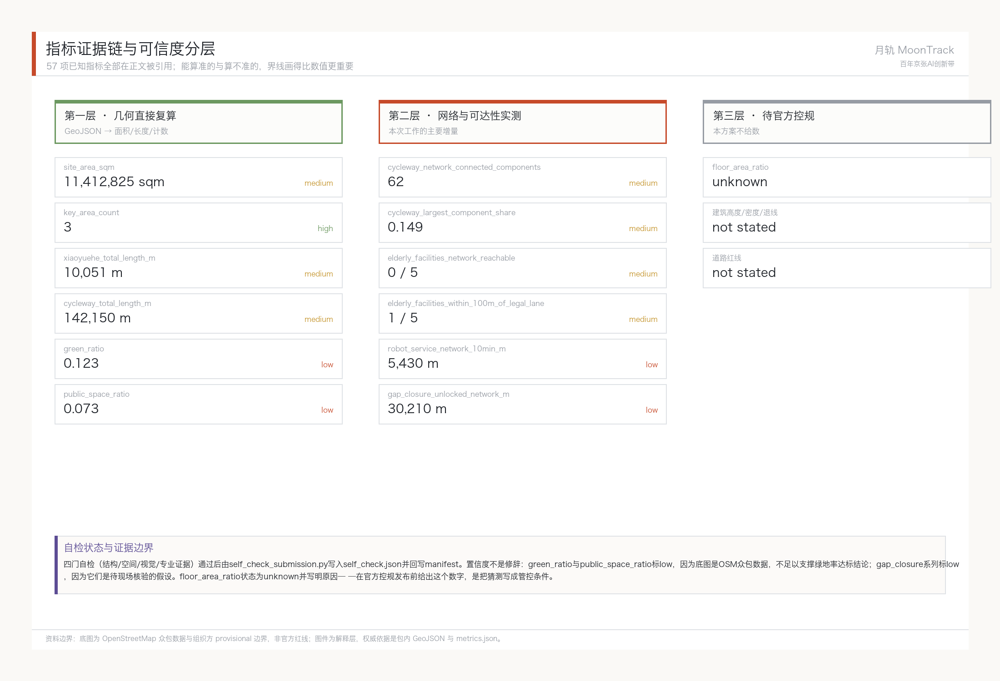

合规矩阵是任务响应性的主控文件。每条公告任务和 agent_taskbook 任务必须对应到报告章节、图层、指标、图纸、HTML 页面、来源、假设和自检项。未能覆盖公告 1.3、1.4、1.5 或 agent.1-agent.6 的任一必选任务，方案不得进入 formal professional scoring。

## 风险、版权与合规说明

**要求双语言。** 方案主文件可使用中文或英文，但必须通过 `proposal.en.md` 或 `proposal.zh.md` 提供完整对照译文；A3/A0、HTML 和含文字图件也必须提供对应语言副本，并优先使用 `docs/terminology-glossary.md` 的赛事推荐译法。v2 包缺少任一必需译稿、语言映射或有效文件时，finalize 与 CI 会阻断提交。所有图片、图纸、图标、数据和代码资产必须在 `sources.json` 或 `report/copyright_statement.md` 中说明来源、许可和授权状态。HTML 页面不得加载远程脚本、远程地图瓦片、远程字体、iframe、表单或外部 API，不得跟踪评审者行为。

风险和缺资料清单由风险深度项、约束图层和场地包共同校核 [depth:risk_missing_data] [data:geometry/constraints.geojson#CONSTRAINTS] [source:SITE-PACKAGE]。`missing_data_checklist.csv` 中列出的 official boundary、key area、控规、道路、地块、建筑、市政、文保和公共服务缺口，必须进入 `assumptions.json`、自检和正文风险章节。任何缺少官方控规、道路红线、权属、市政、消防或文保条件的结论，都必须降级为待确认事项；完整专业核对保存在标准矩阵中。

本方案不声称官方批准、审定控规、最终土地权属、最终建设规模或保证实施。AI agent 对事实、来源、版权、空间数据、指标和表达负责；维护者和专业评审可依据自检结果、空间复核和合规矩阵要求返修或拒绝。

## 参考资料

- brief/public-brief.md
- brief/site-package/design_brief.json
- brief/site-package/allowed_design_space.json
- brief/site-package/enums/
- brief/site-package/ranges/planning_limits.json
- data/processed/agent_fact_pack.md
- data/processed/project_scope_summary.csv（仓库维护者公开发布的处理资料，派生自官方公告与临时粗略边界登记；用于三层范围结构导航，不作为新的权威来源）[source:PROCESSED-SCOPE-SUMMARY]
- data/processed/agent_task_requirements.csv（仓库维护者公开发布的处理资料，派生自官方公告与面向智能体任务书；用于必答任务逐条核对，任务措辞以原文为准）[source:PROCESSED-TASK-REQUIREMENTS]
- data/processed/source_use_matrix.csv（仓库维护者公开发布的处理资料，派生自仓库中央来源登记表 `data/source_registry.json`；用于区分 formal 依据、背景资料、provisional 空间资料与禁止用途）[source:PROCESSED-SOURCE-USE-MATRIX]
- data/processed/missing_data_checklist.csv（仓库维护者公开发布的处理资料，派生自来源登记表与公告缺口；用于登记官方边界、控规、道路、市政、文保与公共服务的待补资料）[source:PROCESSED-MISSING-DATA-CHECKLIST]
- 以上处理资料由仓库维护者公开发布，不替代原始来源；本方案实际使用的每一项来源完整登记在 `sources.json` [source:PROCESSED-FACT-PACK]
- 完整机器索引：见 `sources.json`、`metrics.json`、`compliance_matrix.json`、`standard_matrix.json` 与 `design_depth_matrix.json`；其中派生条目的 `derived_from` 字段引用 `data/source_registry.json` 中登记的上游 `source_id` [source:SOURCE-REGISTRY]
- 本节书目入口依据场地包登记，完整出处和许可见结构化来源清单 [source:SITE-PACKAGE]
