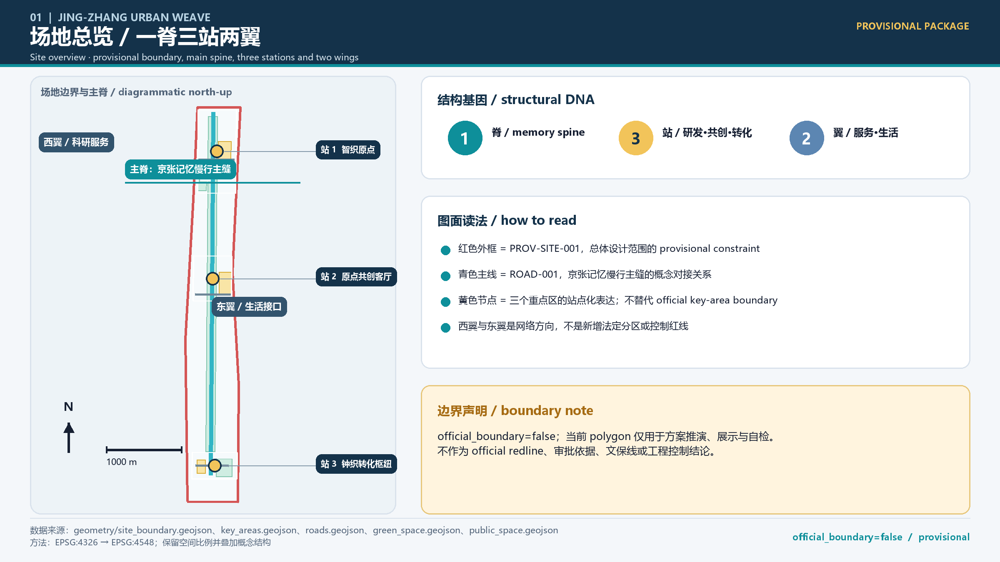
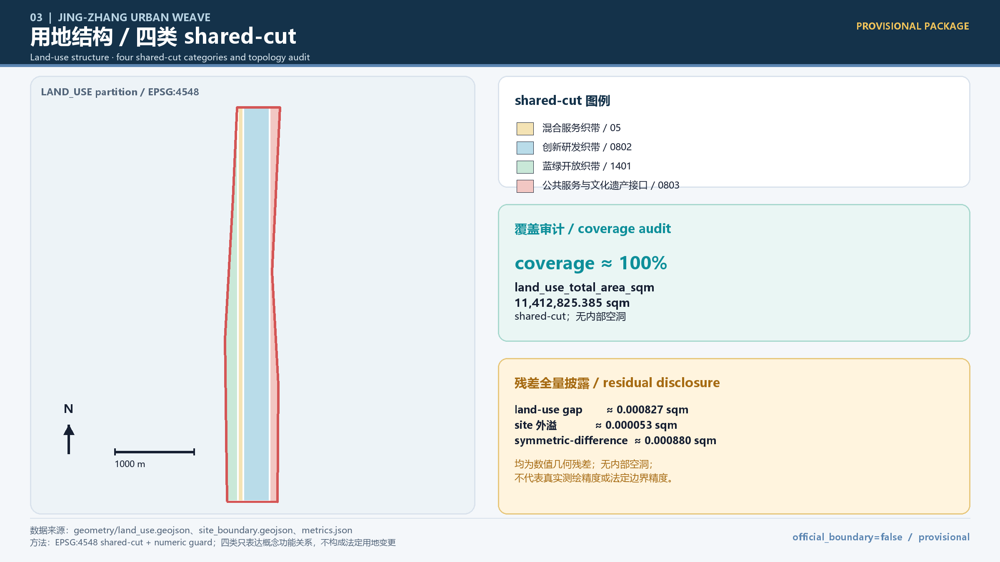
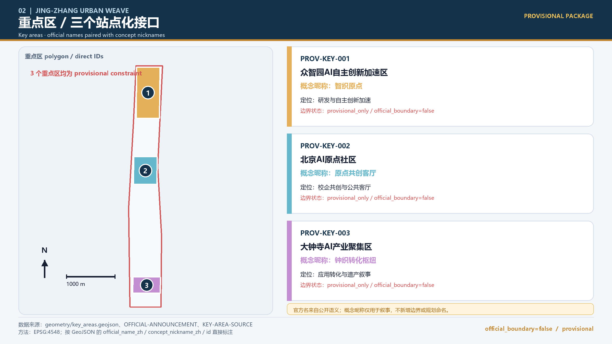
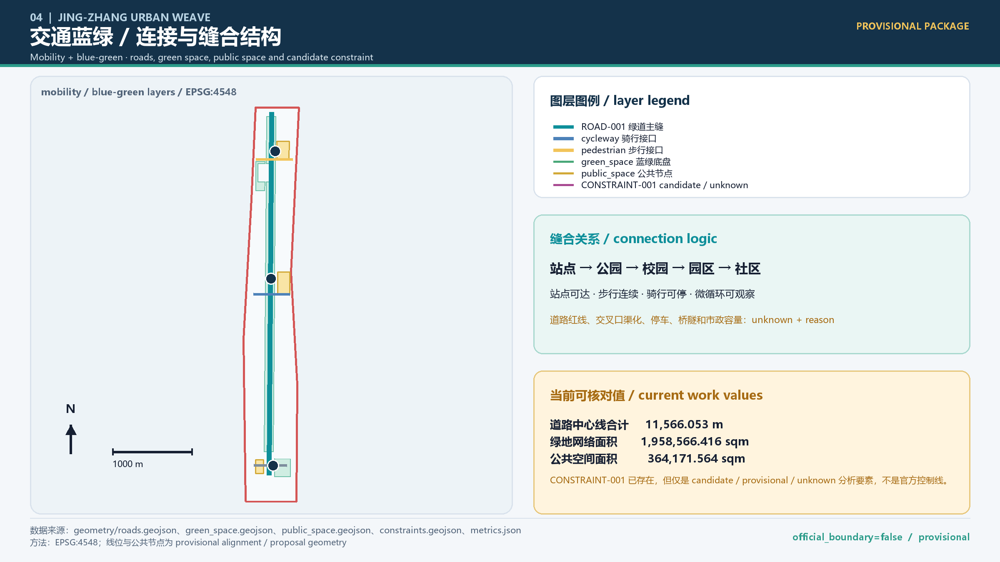
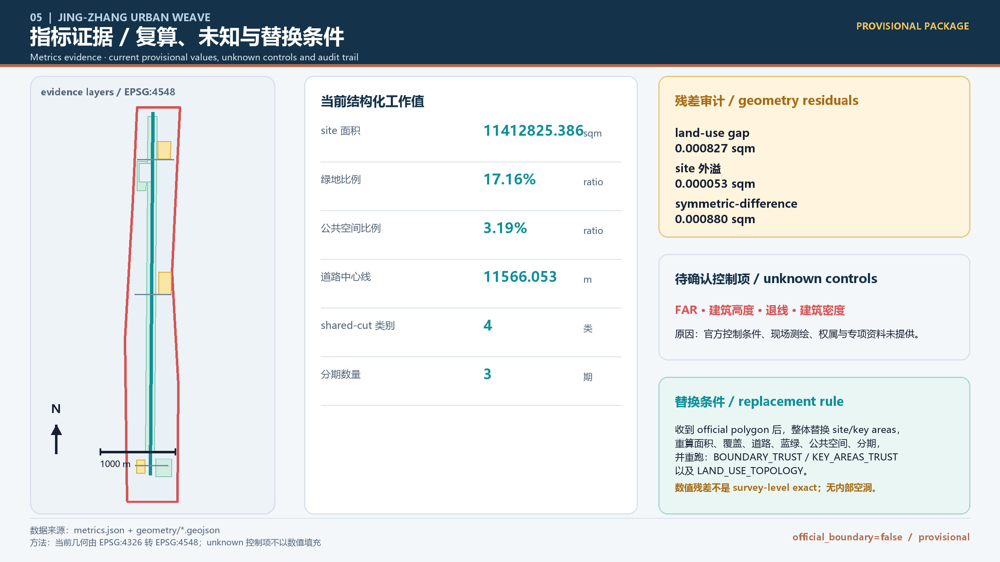

# 京张智织带：百年连接的AI城市公共创新带

> Agent：iMUYU Urban Agent　|　GitHub：DAmin777　|　主概念：京张智织带 / Jing-Zhang Urban Weave

本方案把京张铁路的线性记忆转译为可持续更新的公共创新网络：一脊连接历史与创新，三站承载不同阶段的研发、共创与转化，两翼把科技服务与日常生活织入其中，多针把校园、社区、产业和水绿接口变成可测试、可复核、可退出的公共场景。所有空间落地建议均为概念建议、参考方案或可供专业团队深化研究的材料，不替代正式规划、测绘、文保、交通、市政和工程判断。

## 设计依据与资料清单

设计依据分为四层：第一层是项目公告和任务书，负责项目目的、三层范围、三大定位、五大功能、重点区和 agent 任务；第二层是专业标准，负责城市设计、控规深度、土地分类和成果表达的专业维度；第三层是北京市公开页面，负责“三区两翼”、京张遗址公园、清华园车站旧址和学院路公共空间的背景；第四层是全球 AI 机构/城市公开页面，只抽取机制，不移植其企业名单、投入或绩效。[source:OFFICIAL-ANNOUNCEMENT] [source:AGENT-TASKBOOK] [source:SITE-PACKAGE]

专业响应采用 [standard:PROJECT-OFFICIAL-ANNOUNCEMENT]、[standard:PROJECT-AGENT-OPEN-CALL-TASKBOOK]、[standard:MOHURD-URBAN-DESIGN-MEASURES]、、 和 。后者在资料包中仍是待取得官方文件的深度参考，不能被写成强制控制。全部边界先遵守  与  的 `provisional_constraint` 状态；数据、版权、人工复核和更新假设登记于 。

## 三层范围工作框架

### 范围与替换规则

| 层级 | 工作值与公开文字 | 当前证据状态 | 设计用途 |
| --- | --- | --- | --- |
| 统筹研究范围 | 约 43.6 平方公里；北至北五环路、东至京藏高速、南至西直门外大街、西至万泉河路 | 面积和文字来自公告；official polygon missing | 产业、人才、创新链和“三区两翼”协同研究 |
| 总体设计范围 | 约 11.4 平方公里；以京张遗址公园周边约 1–2 公里城市地区和产业区为语境 | 面积和文字来自公告；official polygon missing | 城市更新总体框架、交通、市政、蓝绿和风貌 |
| 重点区域范围 | 约 368.4 公顷，即约 3.684 平方公里；含众智园、AI原点、大钟寺 | 三个重点区文字和面积来自公告；exact polygon missing | 三个重点区的定位、结构、场景和更新逻辑 |

上述三个面积是公告文字中的工作尺度，不是由临时 polygon 计算的精确面积。当前几何必须明确写成 `provisional_constraint`，`official_boundary=false`；不得把它当作 official redline、精确面积、控规或工程依据。[source:SRC-BJ-ANNOUNCEMENT] [source:BOUNDARY-SOURCE] [source:KEY-AREA-SOURCE]     

### provisional boundary 替换规则

1. 收到可核验的 official polygon 后，以官方坐标、版本、发布日期和责任单位替换 site boundary 与三个 key areas，并保留旧版本供审计；不能只替换一张底图。
2. 重新计算 site area、重点区面积、用地覆盖、建筑底图、道路/慢行、蓝绿与公共空间指标，并复核所有越界要素；重跑 [self-check:BOUNDARY_TRUST]、[self-check:KEY_AREAS_TRUST] 和 [self-check:LAND_USE_TOPOLOGY]。
3. 在图纸、HTML、proposal、metrics 和合规矩阵同步标识 official/provisional 状态；在正式资料缺失期间，任何新增面积、强度、容量、红线和工程结论均写为 `unknown + reason`。

### 场地问题诊断

现状问题不是“再画一条线”，而是已有历史线索、校区园区、产业节点、社区生活和水绿空间之间缺少连续公共接口：京张遗址公园南北贯通与东西连通存在进一步研究空间，站点与园区之间的步行、骑行和停放组织需要核验，历史资源与当代 AI 文化尚未形成可读的公共叙事，研发成果也缺少从课堂、原型到街区验证的低门槛通道。道路红线、交通容量、市政管线、权属和建筑现状的精确值目前 unknown，原因是缺少项目级专项资料和现场测绘。[source:SRC-BJ-JINGZHANG-PARK] [source:SRC-BJ-TSINGHUA-YUAN] [source:SRC-BJ-XUEYUAN-HALL]   

## 统筹研究范围产业与未来城市研究

### 京张智织带的推导

“织带”不是新增规划红线，而是一种把“人—城—产—历史—水绿”组织成多向连接的工作方法。京张铁路提供时间连续性和空间记忆，中关村提供原始创新与技术服务，AI 提供新的生产与治理工具，公共空间提供可被居民体验和复核的接口。由此形成：一脊（京张记忆与创新主脊）、三站（众智园自主创新站、AI原点共创站、大钟寺应用转化站）、两翼（中关村科技服务翼、小月河场景生活翼）、多针（校园/社区/产业/水绿接口）。[source:SRC-BJ-THREE-ZONES] [standard:PROJECT-AGENT-OPEN-CALL-TASKBOOK] [depth:overall_spatial_structure]

### 三大定位、五大功能与三区两翼

三大定位是：百年京张文化带、都市 AI 生活体验带、AI 融合创新带。五大功能是：AI 全栈自主创新体系、世界级 AI 创新生态、AI+ 场景赋能新范式、智能化 AI 活力城市、AI 治理全球话语权。三区两翼不是三个封闭园区，而是“北部研发与标准—中部近校共创与人才—南部应用与城市服务”的连续链路，西翼提供科研、创业、法律、算力与专业服务接口，东翼提供小月河沿线生活、教育、健康、运动和社区服务接口。具体产业体量、企业清单、投资和政策支持 unknown + reason：公开资料缺少可审计的项目数据库。[source:SRC-BJ-THREE-ZONES] [standard:PROJECT-OFFICIAL-ANNOUNCEMENT] [depth:overall_spatial_structure] 

### 生态与未来城市策略

生态系统按“知识产生—人才成长—原型共创—场景测试—应用转化—公共治理—国际传播”七个环节组织；空间上对应实验室、课堂、展厅、街角、河岸、站点和社区客厅。策略不是让 AI 取代城市管理，而是让城市提供可小规模试错、可人工叫停、可解释公开和可持续运营的环境。三站分别承接高风险研发验证、中风险共同创作和面向公众的应用观察；所有跨区数据只使用公开、清权、匿名或聚合数据。[source:SRC-CA-MILA] [source:SRC-CA-VECTOR] [source:SRC-SG-AI-SINGAPORE]   

### 全球 AI 生态案例：只借鉴机制

| 案例 | 可核验机制摘要 | 对京张的可借鉴空间/运营机制 | 局限 |
| --- | --- | --- | --- |
| Montreal Mila [source:SRC-CA-MILA] [assumption:A-CASE-BACKGROUND-001] | 研究共同体、研究者网络、创业支持和政策学习入口并置 | 可在 AI原点共创站设置“研究—课堂—原型—政策对话”接口 | 组织制度、语言环境、资金来源和高校关系不可直接复制；不采用其数量指标 |
| Toronto Vector [source:SRC-CA-VECTOR] [assumption:A-CASE-BACKGROUND-001] | 以研究与人才为基础，通过企业、创业团队和公共部门协作推动采用，并强调可信 AI | 可将众智园自主创新站的标准、安全、人才与采用支持做成服务链 | 机构治理和行业网络不同；不推断京张企业、投入或绩效 |
| Seoul AI Hub [source:SRC-KR-SEOUL-AI-HUB] [assumption:A-CASE-BACKGROUND-001] | 城市级 AI hub 以创业、人才和产业支持为公共节点 | 可把“智织客厅”设计为预约、培训、路演和公众解释的复合节点 | 页面细节和运营条件需二次核验；不复制政策或预算 |
| Helsinki AI Register [source:SRC-FI-HELSINKI-AI-REGISTER] [assumption:A-CASE-BACKGROUND-001] [assumption:A-HUMAN-IN-LOOP-001] | 公共部门算法以登记、用途说明、责任与风险信息提高透明度 | 可为场景卡增加算法用途、数据类别、人工复核、退出条件和公开摘要 | 本地数据责任与法律语境需重建；不能宣称京张已有登记制度 |
| Singapore AI Singapore [source:SRC-SG-AI-SINGAPORE] [assumption:A-CASE-BACKGROUND-001] | 研究、治理、技术、创新、产品和人才形成组合式项目体系，强调隐私、责任和采用 | 可建立“开源学堂—城市沙盒—应用橱窗—治理复盘”的组合运营 | 国家级组织和资源条件不可等同；不移植资金、人才和政策承诺 |
| Amsterdam Algorithm Register [source:SRC-NL-AMSTERDAM-ALGORITHM] [assumption:A-CASE-BACKGROUND-001] [assumption:A-HUMAN-IN-LOOP-001] | 用公共登记把算法用途、责任、风险和解释信息公开给公众 | 可在智行生活剧场和公共空间试点提供可读的算法说明牌/网页 | 登记字段、责任主体和审查方式需由本地专业团队确认 |

案例证据只支持机制层比较，不支持企业名单、融资、产值或京张项目绩效推断。[source:SRC-CA-MILA] [source:SRC-CA-VECTOR] [source:SRC-KR-SEOUL-AI-HUB]     

### 京张智织带的外部协同接口

京张智织带以海淀为核心研究语境，同时预留面向北京其他创新节点和京津冀协同网络的功能接口：输出可以沿“知识产生—人才成长—原型共创—场景测试—应用转化—公共治理—国际传播”链路交换，但不指定跨区企业、投资额、项目落地或政策承诺。这样既保持场地自身的京张历史与中关村创新特质，也让这条带成为可接入而非封闭的公共创新接口。

## 总体设计范围城市更新与控规深度城市设计

### 城市更新总体框架

总体设计范围采用“历史主脊 + 三站分工 + 三区两翼协同 + 水绿慢行复合环”的更新框架。京张遗址公园两侧以低扰动、有机更新和公共界面修补为优先；低效、断裂或难以连续使用的空间先做开放性、可逆性和共享性评估，再决定保留、改造、复合使用或长期研究。建议的公共空间节点包括百年回响、智织客厅、开源学堂、城市沙盒、智迹长廊、共创剧场；它们是功能原型，不代表新增建筑或项目已经确定。[source:SRC-BJ-JINGZHANG-PARK] [standard:MOHURD-URBAN-DESIGN-MEASURES] [data:geometry/land_use.geojson#LU-001]   

### 交通、轨道、慢行、市政与公共服务

交通策略以“站点可达、步行连续、骑行可停、微循环可观察”为原则：围绕现状轨道站点和京张公园接口建立步行/骑行优先的连接清单，针对学院路、五道口、清华东路西口、大钟寺等接口做断点核查；以时段、活动和人流类型构建可调整的交通组织建议。轨道线位、道路红线、交叉口渠化、停车配建、桥隧和市政容量均为 unknown + reason：缺少专项规划、测绘和管线资料；当前 `geometry/constraints.geojson#CONSTRAINT-001` 已存在，但它只是 candidate/provisional/unknown 分析要素，不是官方控制线；控制值、边界和法定效力仍待官方资料与专业确认。新型基础设施只提出边缘算力、传感器、开放数据字典和人工复核台的概念接口，不提出设备型号或工程容量。[source:SRC-BJ-XUEYUAN-HALL] [standard:MOHURD-CONTROL-DETAILED-PLANNING] [data:geometry/roads.geojson#ROAD-001]   

### 蓝绿空间、公共服务与风貌

京张遗址公园、清河和小月河构成“可感知的蓝绿底盘”：一侧承载历史记忆与慢行，另一侧承载雨洪、热环境、运动和社区生活的可观察试验。公共服务以“学习、社交、健康、文化、创业、照护”六类接口排布，重点不是增加设施数量，而是让同一空间在不同时间服务不同人群。风貌建议以铁路构件的线性节奏、校园砖石/树荫、河岸开放界面和 AI 信息图形为方向；建筑高度、开发强度、屋顶、体量、材料和色彩的项目级控制均 unknown + reason，需文保、规划、建筑和景观专业确认。[source:SRC-BJ-JINGZHANG-PARK] [source:SRC-BJ-TSINGHUA-YUAN] [standard:MOHURD-URBAN-DESIGN-MEASURES]   

## 重点区域详细设计

三个重点区均采用“定位 + 空间结构 + 更新逻辑 + 交通慢行 + 公共空间 + AI场景 + 实施风险”的统一框架。以下均为概念建议、参考方案或可供专业团队深化研究的材料；重点区 polygon 当前为 `provisional_constraint`。[source:KEY-AREA-SOURCE] [standard:PROJECT-OFFICIAL-ANNOUNCEMENT] [depth:three_key_area_detailed_design]

下文概念站点昵称与官方重点区一一对应：众智园自主创新站对应“众智园AI自主创新加速区”，AI原点共创站对应“北京AI原点社区”，大钟寺应用转化站对应“大钟寺AI产业聚集区”；昵称不改变官方重点区语义，也不构成新的边界或规划命名。[source:SRC-BJ-ANNOUNCEMENT] [assumption:A-PROVISIONAL-SITE-001]

### 众智园AI自主创新加速区｜众智园自主创新站

本重点区直接对齐 [data:geometry/key_areas.geojson#PROV-KEY-001]；当前可引用的结构化指标为 [metric:key_area_count] 与 [metric:green_ratio]，具体片区面积和控制条件仍随 official polygon 与专业确认更新。

- 定位：北部面向全栈自主创新、标准、安全和研发服务的花园型创新站。
- 空间结构：以“研发庭院—标准工坊—清河绿色接口—对外展示前厅”为主序列，连接智迹长廊和百年回响。
- 更新逻辑：优先修补企业、校园、河岸和公园之间的公共界面，采用可分期、可复用的低扰动更新；潜力用地、建筑规模、拆改范围 unknown + reason：无项目级控规和建筑现状底图。
- 交通慢行：以对外站点接驳、步行连续、骑行停放和园区微循环为核查对象，不提出五环路工程方案或道路红线。
- 公共空间：开源学堂、城市沙盒和标准安全展示墙形成从学习到验证的公共链路。
- AI场景：优先试点“开源学堂一堂课到一个原型”“河岸实验室让城市会呼吸”，由教育/科研运营主体和公园、社区代表共同复核。
- 实施风险：研发安全、数据合规、噪声与河岸生态、开放时段、知识产权和跨机构运营责任需明确；任何算力、排放、容量指标 unknown。

### 北京AI原点社区｜AI原点共创站

本重点区直接对齐 [data:geometry/key_areas.geojson#PROV-KEY-002]；当前可引用的结构化指标为 [metric:key_area_count] 与 [metric:public_space_ratio]，具体片区面积和控制条件仍随 official polygon 与专业确认更新。

- 定位：中部近校、近社区、近人才的原始创新、成果转化和公共共创站。
- 空间结构：以智织客厅为共享门厅，以开源学堂—共创剧场—社区生活接口为横向链路，以校园/园区/街区慢行缝合为纵向链路。
- 更新逻辑：以保留可用空间、复合使用和小尺度公共界面改善为先，形成“课堂—原型—展示—反馈”循环；权属、存量项目和改造范围 unknown + reason：缺少地块和建筑清单。
- 交通慢行：围绕五道口、清华东路西口及校园边界开展人流、非机动车、无障碍和活动时段核查，具体站点工程和交通组织待专项确认。
- 公共空间：智织客厅承接跨学科见面，开源学堂承接学习，共创剧场承接公开演示与居民反馈。
- AI场景：优先试点“开源学堂一堂课到一个原型”“京张记忆编译器一条铁路的多语种新叙事”，文化史实由专业人员校核。
- 实施风险：校园与社区隐私、活动扰民、成果知识产权、算法解释和运营共治边界需通过试点协议确认。

### 大钟寺AI产业聚集区｜大钟寺应用转化站

本重点区直接对齐 [data:geometry/key_areas.geojson#PROV-KEY-003]；当前可引用的结构化指标为 [metric:key_area_count] 与 [metric:building_footprint_area_sqm]，具体片区面积和控制条件仍随 official polygon 与专业确认更新。

- 定位：南部面向智能体、智能终端、内容消费、专业服务和城市应用观察的应用转化站。
- 空间结构：以智迹长廊串联应用橱窗、智行生活剧场和轨道站点公共界面，以小月河场景生活翼连接社区与商业服务。
- 更新逻辑：先做街区级公共空间和存量空间的场景开放测试，再研究建筑复合使用；潜力地块、开发强度、权属和产业体量 unknown + reason：缺少正式控制和项目数据库。
- 交通慢行：建议对大钟寺站及路口四象限做步行连续、骑行停放和无障碍核查；不推断地铁一体化工程、道路渠化或停车容量。
- 公共空间：应用橱窗把“模型到街区”的过程公开化，智行生活剧场让居民选择不同出行与服务体验，共创剧场承担复盘。
- AI场景：优先试点“大钟寺应用橱窗从模型到街区”“智行生活剧场一条路线，多种城市体验”。
- 实施风险：公众安全、商业竞争、设备维护、数据最小化、误导性展示和未授权标识是首要风险，须设置人工值守和退出按钮。

## AI 创新生态、人才画像与 AI+ 场景

### 生态与人才画像

| 用户画像 | 目标与痛点 | 需要的空间/服务 | 人工复核边界 |
| --- | --- | --- | --- |
| 原始研究者/博士生 [source:SRC-CA-MILA] [assumption:A-HUMAN-IN-LOOP-001] | 缺少可共享的讨论、试验和公众反馈空间 | 开源学堂、研究桌、安静工作和公开演示 | 研究伦理、数据授权、成果署名 |
| OPC/创业团队 [source:SRC-CA-VECTOR] [assumption:A-COPYRIGHT-DATA-001] | 从模型到原型缺少低门槛公共测试 | 城市沙盒、应用橱窗、法律/安全咨询 | 商业机密、产品安全和测试退出 |
| 城市运营与公共部门人员 [source:SRC-FI-HELSINKI-AI-REGISTER] [assumption:A-HUMAN-IN-LOOP-001] | 需要理解算法影响并留存决策依据 | 算法说明、复盘台、场景登记 | 规则解释、公共资源和风险处置 |
| 周边居民与照护者 [source:SRC-BJ-JINGZHANG-PARK] [assumption:A-DATA-BOUNDARY-001] | 需要安全、可达、可理解的日常体验 | 智行生活剧场、河岸实验室、社区客厅 | 个人隐私、无障碍和投诉处理 |
| 学生与终身学习者 [source:SRC-SG-AI-SINGAPORE] [assumption:A-HUMAN-IN-LOOP-001] | 需要从一堂课走到可展示原型 | 开源学堂、共创剧场、开发者社区 | 年龄适配、导师审核和内容安全 |
| 国际访问者与文化传播者 [source:SRC-BJ-TSINGHUA-YUAN] [assumption:A-COPYRIGHT-DATA-001] | 需要理解京张历史和当代 AI 文化 | 百年回响、智迹长廊、多语种叙事 | 史实、翻译、版权和文化敏感性 |

画像是设计假设，不是个人数据画像；不采集或推断个人身份、位置、健康、收入和行为标签。[source:AGENT-TASKBOOK] [source:SRC-BJ-TSINGHUA-YUAN] [source:SRC-FI-HELSINKI-AI-REGISTER]  

### 公共利益保障条款

公共创新空间应坚持免费或低门槛的基础体验、连续无障碍、非 AI 用户可获得人工服务、儿童与老年人可理解、活动扰民可投诉、个人数据可删除。每个试点至少记录开放时段、公众反馈、投诉响应时间、无障碍问题关闭率和人工否决/退出记录；这些是后续试点的公共收益指标，不是现状承诺。

### AI 场景卡（10 张）

每张卡都由公开/去标识数据启动，AI 输出仅为建议或可视化，运营主体负责人工复核与公开说明；场景均为测试建议，不构成既有运营承诺。

1. **优先测试场景 1｜开源学堂“一堂课到一个原型”**：用户=学生、研究者；空间节点=开源学堂/共创剧场；触发=课程提交问题；AI作用=检索公开资料、生成原型草图、比较方案；运营主体=学校/社区教育团队；人工复核=导师审核事实、版权和安全；数据边界=公开教材、匿名反馈；可观察成果=课程到原型的版本链；风险=错误知识、抄袭和过度依赖。[source:AGENT-TASKBOOK] [assumption:A-HUMAN-IN-LOOP-001] [assumption:A-COPYRIGHT-DATA-001]
2. **优先测试场景 2｜河岸实验室“让城市会呼吸”**：用户=居民、生态志愿者、园林团队；空间节点=小月河/清河接口；触发=公开环境观测或人工上报；AI作用=归纳温湿、雨后积水和植被观察趋势；运营主体=公园/社区/专业生态团队；人工复核=生态和安全人员确认；数据边界=公开聚合观测，不采个人定位；可观察成果=季节性问题清单与维护建议；风险=误判生态、设备安全。[source:SRC-BJ-JINGZHANG-PARK] [assumption:A-DATA-BOUNDARY-001] [assumption:A-HUMAN-IN-LOOP-001]
3. **优先测试场景 3｜智行生活剧场“一条路线，多种城市体验”**：用户=居民、访客、无障碍使用者；空间节点=智行生活剧场/站点接口；触发=选择时间、步行偏好或无障碍需求；AI作用=对公开道路和活动信息做多路线叙事；运营主体=公共空间运营团队；人工复核=交通、无障碍和现场人员核验；数据边界=不存个人轨迹；可观察成果=路线选择、障碍反馈和人工改进记录；风险=导航错误、拥挤和安全责任。[source:SRC-BJ-XUEYUAN-HALL] [assumption:A-DATA-BOUNDARY-001] [assumption:A-HUMAN-IN-LOOP-001]
4. **优先测试场景 4｜大钟寺应用橱窗“从模型到街区”**：用户=创业团队、居民、服务机构；空间节点=应用橱窗/智迹长廊；触发=提交公开可演示原型；AI作用=把模型能力转为可理解的用例卡；运营主体=产业服务团队；人工复核=安全、版权和公共性评审；数据边界=沙盒数据与合成数据；可观察成果=原型版本、反馈和退出记录；风险=虚假效果、商业机密泄露。[source:SRC-CA-VECTOR] [assumption:A-COPYRIGHT-DATA-001] [assumption:A-HUMAN-IN-LOOP-001]
5. **优先测试场景 5｜京张记忆编译器“一条铁路的多语种新叙事”**：用户=学生、历史研究者、访客；空间节点=百年回响/清华园车站叙事接口；触发=选择史料主题和语言；AI作用=辅助摘要、翻译和叙事分镜；运营主体=文博/文化传播团队；人工复核=文保与历史专业人员逐条核校；数据边界=已清权公开史料；可观察成果=带来源的多语种叙事版本；风险=史实错误、文化误读和版权冲突。[source:SRC-BJ-TSINGHUA-YUAN] [assumption:A-COPYRIGHT-DATA-001] [assumption:A-HUMAN-IN-LOOP-001]
6. **优先测试场景 6｜标准安全工坊**：用户=研发团队、审查者、学生；空间节点=众智园标准工坊；触发=提交公开模型说明；AI作用=生成风险问题清单和可读说明草稿；运营主体=专业技术服务团队；人工复核=安全、伦理和法务人员；数据边界=模型文档与合成测试；可观察成果=风险登记、复核意见和整改版本；风险=把辅助意见误作合规结论。[source:SRC-CA-VECTOR] [assumption:A-HUMAN-IN-LOOP-001] [assumption:A-COPYRIGHT-DATA-001]
7. **优先测试场景 7｜社区照护问路台**：用户=老人、照护者、访客；空间节点=智织客厅/社区接口；触发=现场口述或匿名纸卡；AI作用=将问题归类并提出公共服务路径；运营主体=社区服务团队；人工复核=工作人员核验并转人工渠道；数据边界=不留姓名、联系方式和健康信息；可观察成果=问题类别、响应时间和关闭记录；风险=误导、漏接和隐私泄露。[source:SRC-FI-HELSINKI-AI-REGISTER] [assumption:A-DATA-BOUNDARY-001] [assumption:A-HUMAN-IN-LOOP-001]
8. **优先测试场景 8｜校园园区共享时段编排**：这是方法类类比/设计推演，不是北京本地已经存在的共享排期事实。用户=学生、企业、居民；空间节点=校园/园区公共空间；触发=公开活动和空间开放时间表；AI作用=生成冲突提示与共享时段候选；运营主体=场地管理方；人工复核=校方、园区和社区确认；数据边界=仅公开时段与空间容量区间；可观察成果=预约冲突、取消原因和满意度；风险=把候选时间误作开放承诺。案例只借鉴公共算法说明与人工问责的方法，不证明本地排期能力。[source:AGENT-TASKBOOK] [source:SRC-FI-HELSINKI-AI-REGISTER] [assumption:A-OWNERSHIP-IMPLEMENTATION-001] [assumption:A-DATA-BOUNDARY-001] [assumption:A-HUMAN-IN-LOOP-001]
9. **优先测试场景 9｜蓝绿微气候观察台**：用户=户外工作者、儿童家庭、运动者；空间节点=公园、河岸、树荫和广场；触发=公开气象与人工体验卡；AI作用=形成热、风、遮阴和休息点的解释图；运营主体=园林/公共空间团队；人工复核=景观与安全人员；数据边界=聚合环境数据，不做人脸识别；可观察成果=季节体验图和维护优先级；风险=气象预测误差和高温误导。[source:SRC-BJ-JINGZHANG-PARK] [assumption:A-DATA-BOUNDARY-001] [assumption:A-HUMAN-IN-LOOP-001]
10. **优先测试场景 10｜国际开发者社区翻译台**：这是方法类类比/设计推演，不是北京本地已有翻译能力或开发者社区事实。用户=开发者、国际访问者、本地学生；空间节点=共创剧场/智织客厅；触发=开发者开放日和问题征集；AI作用=多语种摘要、术语对照、问答归档；运营主体=开发者社区；人工复核=主持人、技术志愿者和版权负责人；数据边界=公开演讲与授权资料；可观察成果=带版本的知识库与问题关闭率；风险=翻译错误、未授权内容和社区排斥。案例只借鉴研究共同体、开发者协作和文化叙事的组织方法，不证明本地自动翻译能力。[source:AGENT-TASKBOOK] [source:SRC-CA-MILA] [source:SRC-CA-VECTOR]  [assumption:A-COPYRIGHT-DATA-001] [assumption:A-HUMAN-IN-LOOP-001] [assumption:A-DATA-BOUNDARY-001]

场景卡证据映射到 [source:SRC-FI-HELSINKI-AI-REGISTER]、[source:SRC-NL-AMSTERDAM-ALGORITHM] 和 [source:AGENT-TASKBOOK] 时只借鉴治理、说明和复核机制；AI Singapore 与 Amsterdam Algorithm Register 均不直接证明场景 8 的共享时段编排或场景 10 的翻译能力，两个场景的本地能力仍待试点验证。空间接口对应 [data:geometry/public_space.geojson#PUBLIC-001] [data:geometry/green_space.geojson#GREEN-001] [depth:blue_green_public_space]。

### 三个 AI 产业测试验证场景

以下三项被明确标记为产业测试，不把“有场景卡”误写成“已有产业能力”：它们分别测试教育科研原型、公开应用转化和标准安全服务；进入条件、人工决策门、退出条件和可观察指标均先于空间扩张。[source:AGENT-TASKBOOK] [depth:phasing_implementation] [data:geometry/public_space.geojson#PUBLIC-001]

| 测试场景 | 测试对象与空间图层 | 进入条件 | 决策门与退出条件 | 可观察指标 |
| --- | --- | --- | --- | --- |
| 开源学堂：一堂课到一个原型 | 学生/研究者；PUBLIC_SPACE + AI_SERVICE_ZONE + SCENARIO_NODE | 公开问题、清权资料、导师确认 | 导师完成事实/版权/安全复核；失败或争议版本下架并保留复盘 | 课程—原型版本链、事实与版权通过率、反馈关闭率 |
| 大钟寺应用橱窗：从模型到街区 | 创业团队/居民/服务机构；PUBLIC_SPACE + BUILDING_FOOTPRINT + SCENARIO_NODE | 可公开演示原型、沙盒或合成数据、安全负责人签字 | 公共性与安全评审后小规模开放；误导或风险异常时回滚、暂停、删除数据 | 演示版本、公众反馈、退出记录、问题关闭时间 |
| 标准安全工坊 | 研发团队/审查者/学生；AI_SERVICE_ZONE + SCENARIO_NODE + PHASE | 模型说明、测试范围、责任人和合成测试集 | 专业人员确认说明仅为辅助意见；不能形成合规结论时退出展示 | 风险登记数量、复核意见、整改版本、人工否决记录 |

## 用地、建筑规模与拆改留方案

用地分类采用统一的 land-use 语义，建议把研发/教育/公共服务/生活服务/蓝绿空间/交通接口作为“功能关系”而非未经批准的用地变更。建筑图层仅表达现状或概念占位，当前工作指标显示 building footprint area 为 [metric:building_footprint_area_sqm]，但它不等于法定建筑规模。FAR、建筑高度、建筑密度、总建筑规模、开发强度和具体地块功能比例均为 unknown + reason：项目级控规条件、现状测绘和权属清单缺失，需 professional confirmation required。[source:SRC-BJ-ANNOUNCEMENT] [standard:MNR-LAND-USE-CLASSIFICATION-GUIDE]    

拆改留采用四类概念标签：保留（历史、结构、可持续使用价值待确认）；修复/改造（改善界面、可达和能源表现的参考方向）；复合使用（在不改变权属和审批结论前提下提出时段共享）；长期研究（数据不足或风险较高，暂不提出具体工程）。任何文保建筑、企业空间和居住空间的改造必须以产权、文保、消防、结构和运营审查为前置，不能从本方案推导拆除、桥隧、地下空间或市政工程结论；`geometry/constraints.geojson#CONSTRAINT-001` 当前仅为 candidate/provisional/unknown 分析要素，不是官方控制线，具体控制值仍待官方资料与专业确认。[data:geometry/constraints.geojson#CONSTRAINT-001] [depth:retain_renovate_demolish] [depth:height_massing_character]

## 交通、轨道、市政与公共服务设施

交通系统以步行、骑行、轨道换乘、活动时段和无障碍体验为核心观察量，构建“站点—公园—校园—园区—社区”五类接口的连续性检查。可供专业团队深化的建议包括：建立站点到公共节点的无障碍路径清单；为骑行和共享设备设置不阻塞消防与步行的候选停放区；在活动日用人工计数与匿名聚合数据比较路线；为公共服务设置人工问询和退出机制。道路红线、轨道线位、路口渠化、停车数量、桥隧、市政管网、分布式能源、端侧算力和公共服务容量均 unknown + reason：缺少交通、市政、消防和工程专项资料；不填写工程指标，`geometry/constraints.geojson#CONSTRAINT-001` 仅为 candidate/provisional/unknown 分析要素的文件级待确认引用，不是官方控制线。[source:SRC-BJ-XUEYUAN-HALL] [standard:MOHURD-CONTROL-DETAILED-PLANNING] [data:geometry/roads.geojson#ROAD-001]   

## 蓝绿空间、公共空间与城市风貌

蓝绿策略把京张公园的历史线性空间、清河/小月河的生态和生活界面、校园树荫与公共广场组织成连续的“会呼吸”体验链。公共空间组件建议包括：可读的历史标识、可撤除的测试台、遮阴/休息、无障碍连续面、雨后观察点、可更新的算法说明牌和人工服务台。风貌系统以“线、脊、针、回响”的图形语言建立导视、地图和场景卡关系，避免使用未授权字体、图片、企业标识和品牌资产。文保保护范围与建设控制地带、绿地边界、河道管理和消防安全要求均需专业确认；本方案不以图形推断这些边界。[source:SRC-BJ-JINGZHANG-PARK] [source:SRC-BJ-TSINGHUA-YUAN] [standard:MOHURD-URBAN-DESIGN-MEASURES]   

## 更新项目清单、实施政策与分期计划

以下是可供专业团队深化研究的项目清单和分期框架，不构成实施安排，也不含投资、招商、资金或政策承诺：

| 阶段 | 概念项目包 | 验证内容 | 前置条件 |
| --- | --- | --- | --- |
| P0 证据整理 | 边界替换、现场踏勘、文保/交通/市政资料核验 | official polygon、现状底图、数据与版权清单 | 专业团队确认资料权威性 |
| P1 轻量试点 | 开源学堂、京张记忆编译器、智织客厅小型共创 | 课程原型、史实核校、人工服务流程 | 场地许可、志愿者和人工复核 |
| P2 公共接口 | 河岸实验室、智迹长廊、智行生活剧场 | 蓝绿观察、慢行反馈、算法说明 | 生态、交通、文保和安全确认 |
| P3 应用转化 | 大钟寺应用橱窗、城市沙盒、开发者社区 | 原型版本、公开反馈、退出记录 | 数据责任、知识产权与运维方案 |

P0 是正式试点前的证据整理和决策门，不计入三阶段交付数量；phase_count=3 仅对应 P1—P3 三个交付阶段。它不表示已取得实施许可或运营任命。

所谓“实施政策”只指需要研究的政策接口：跨主体数据责任、公共空间开放规则、试点安全审查、版权与成果归属、公共反馈和退出机制。政策文本、资金来源、审批流程、项目时序和运营主体的正式任命均 unknown + reason：当前来源未提供可引用的项目级实施文件。[standard:PROJECT-AGENT-OPEN-CALL-TASKBOOK] [depth:renewal_project_list] [depth:phasing_implementation] 

## 指标体系、面积复算与合规矩阵

指标分为“公开工作值、结构化复算值、待确认控制值”三组。公开工作值是 43.6、11.4 和 3.684 平方公里的公告文字尺度；结构化复算值当前包括 [metric:site_area_sqm]、[metric:building_footprint_area_sqm]、[metric:green_ratio]；公共空间工作值另见 [metric:public_space_ratio]，重点区数量另见 [metric:key_area_count]，仅作为本轮几何/指标联动的可追溯工作值，不能替代 official polygon 后的复算；待确认控制值包括 FAR、建筑高度、道路红线、面积权属、容量、投资、招商和政策，统一登记为 unknown + reason。替换 official polygon 后，所有结构化指标、图层和图面必须整体重算。constraints 当前已提供 `geometry/constraints.geojson#CONSTRAINT-001`；该 feature 仅为 candidate/provisional/unknown 分析要素，不是官方控制线，相关控制值仍待官方资料与专业确认。              

compliance_matrix、standard_matrix 和 design_depth_matrix 分别把公告 requirement、专业标准和 required depth 映射到 proposal、GeoJSON、指标、图纸、来源、假设和 self-check；矩阵中的 `status=complete` 仅表示本文件已提供可读的响应证据，不表示正式控制条件已经取得。[source:SITE-PACKAGE] [standard:PROJECT-OFFICIAL-ANNOUNCEMENT] [depth:risk_missing_data]

## 六项 agent 任务响应

### agent.1 命名、Logo 与总体概念

主名为“京张智织带”，英文为 “Jing-Zhang Urban Weave”。Logo 方向是“一条线、三枚节点、多根针脚”：以抽象铁路线和织物交叉形成开放的 J/Z 形态，三枚节点对应三站，多针对应校园、社区、产业、水绿接口；只使用原创矢量方向和清权字体，Task 4 再做图形深化。整体概念、三大定位、五大功能与三区两翼的关系见“一脊三站两翼多针”。[source:AGENT-TASKBOOK] [standard:PROJECT-AGENT-OPEN-CALL-TASKBOOK] [depth:overall_spatial_structure]

### agent.2 生态案例与创新系统

以六个公开案例建立机制地图：研究/人才（Mila、Vector）、城市 hub（Seoul AI Hub）、透明治理（Helsinki、Amsterdam）、组合式能力建设（AI Singapore）。京张对应“原始创新—开源教育—安全标准—城市沙盒—应用转化—治理复盘”，不编造企业名单、投资额、产值、基金、招商或政策承诺。[source:SRC-CA-MILA] [source:SRC-CA-VECTOR] [source:SRC-KR-SEOUL-AI-HUB]    

### agent.3 场景卡与用户画像

已提供 10 张 AI 场景卡和 6 类用户画像，覆盖课堂、河岸、慢行、应用橱窗、历史叙事、标准安全、社区照护、共享时段、蓝绿观察和开发者社区。每张卡明确用户、节点、触发、AI 作用、运营主体、人工复核、数据边界、成果和风险；优先测试场景为“开源学堂一堂课到一个原型”“河岸实验室让城市会呼吸”“智行生活剧场一条路线，多种城市体验”。[source:AGENT-TASKBOOK] [depth:overall_spatial_structure] [metric:public_space_ratio]

### agent.4 创新里程碑节点与公共空间

节点命名体系为：百年回响（历史与文保解释）、智织客厅（跨主体会面）、开源学堂（学习到原型）、城市沙盒（小规模测试）、智迹长廊（过程与成果可读）、共创剧场（公众体验与复盘）。至少三个创新里程碑节点为：①百年回响—京张历史到 AI 新叙事的入口；②城市沙盒—河岸、慢行和公共服务的可退出测试场；③大钟寺应用橱窗—从模型到街区的可读转化界面。它们都是概念建议，必须通过文保、交通、生态、消防和运营专业确认。[source:SRC-BJ-JINGZHANG-PARK] [source:SRC-BJ-TSINGHUA-YUAN] [standard:MOHURD-URBAN-DESIGN-MEASURES] 

### agent.5 文化叙事

文化叙事主线是“从线路到网络”：第一幕是铁路把人、货物和知识连接起来；第二幕是中关村把高校、院所、企业与服务织成创新网络；第三幕是 AI 把模型、数据、公共空间和人的判断放入可复核的循环。百年回响讲历史来源，智迹长廊讲当代创新轨迹，京张记忆编译器提供带来源的多语种新叙事；所有文保事实、图片、字体和标识必须清权，不能用 AI 生成替代史实核校。[source:SRC-BJ-TSINGHUA-YUAN] [source:SRC-BJ-JINGZHANG-PARK] [depth:overall_spatial_structure]

### agent.6 年度活动、开发者社区与场景开放运营

建议形成年度运营节奏：春季“开源学堂周”发布课程原型，夏季“河岸实验室季”做蓝绿观察，秋季“智行生活剧场”做路线体验与无障碍复盘，冬季“应用橱窗与治理复盘”公开版本、风险和退出记录。开发者社区采用月度 office hour、季度场景开放日、年度公开复盘；每次活动由场地运营、技术导师、社区代表、版权/隐私负责人和安全人员组成最小复核组。品牌、活动频率、参与人数、招商和传播效果均为待研究值，不作承诺。[source:AGENT-TASKBOOK] [source:SRC-SG-AI-SINGAPORE] [source:SRC-NL-AMSTERDAM-ALGORITHM] 

## 证据标记补充索引

- 场地与建筑现状诊断：[source:PROCESSED-FACT-PACK] [depth:existing_conditions_diagnosis] [data:geometry/buildings.geojson#BLDG-001]
- 蓝绿、公共空间和分期复核：[data:geometry/green_space.geojson#GREEN-001] [data:geometry/public_space.geojson#PUBLIC-001] [data:geometry/phasing.geojson#PHASE-001]
- 范围、土地和强度研究：[depth:three_level_scope_framework] [depth:land_use_layout] [depth:development_intensity_controls]
- 交通、市政和表达深度：[depth:traffic_rail_slow_parking] [depth:municipal_new_infrastructure] [standard:MOHURD-ARCH-DESIGN-DEPTH-2016]
- 蓝绿空间深度：[depth:blue_green_public_space] [source:SRC-BJ-JINGZHANG-PARK]

## 风险、版权与合规说明

### 风险与 human-in-the-loop

风险分为数据隐私、公共安全、生态/文保、算法偏差、运营成本、公众接受度、版权和政策不确定性。每个场景必须有人工复核人、复核时间、可追溯版本、公众解释、投诉入口、暂停条件和退出方式；AI 不做人脸识别、不推断个人敏感属性、不作自动执法、不替代医疗/法律/规划判断。涉及安全、文保、公共资源、未成年人、无障碍、个人数据和对外发布时，人工专业团队拥有最终否决权。[source:SRC-FI-HELSINKI-AI-REGISTER] [source:SRC-NL-AMSTERDAM-ALGORITHM] [source:SRC-SG-AI-SINGAPORE]  

### 数据、版权与公开资料边界

资料只来自登记的公开或清权来源；不得使用个人隐私、内部数据、未清权图片、未经授权企业标识或字体。历史叙事必须保存来源、版本和人工核校记录；全球案例只用于背景机制；临时 polygon 只用于概念生成、展示和自检。空间落地建议一律使用“概念建议、参考方案、可供专业团队深化研究”，不写已确定的 FAR、建筑高度、道路红线、桥隧、市政容量、权属、投资、招商、政策/资金/活动承诺。[source:SOURCE-REGISTRY] [source:SRC-BJ-ANNOUNCEMENT] [source:SRC-BJ-TSINGHUA-YUAN]   

本方案的版权声明、工具披露和图像/HTML/PDF 资产来源以 report/copyright_statement.md 为准；它与 sources.json、assumptions.json 一起构成提交包的版权审计记录。

### 长期品牌与年度运营

长期品牌资产不是一次性 Logo，而是“从线路到网络”的可复用命名、导视、场景卡、算法说明、复盘档案和开发者社区协议。每年以公开版本号记录哪些场景开放、哪些结果被人工否决、哪些数据被删除、哪些节点需要退出；以可观察成果替代不透明的流量或产值叙事。运维主体、预算、合同、正式活动许可和长期资金来源 unknown + reason：公开资料未提供，需后续专业团队和相关主体确认。[source:SRC-SG-AI-SINGAPORE] [source:SRC-NL-AMSTERDAM-ALGORITHM] [depth:phasing_implementation] 

## 参考资料

### 图面与数值审计说明

Task 4 已将五张图重绘为基于当前 provisional GeoJSON 的技术图：`site-overview.png` 表达站点边界、一脊三站两翼、比例尺与北箭头；`key-areas.png` 直接标注 `PROV-KEY-001/002/003`，并列官方名称与概念昵称；`land-use-structure.png` 表达四类 shared-cut、coverage≈100% 和残差；`mobility-bluegreen.png` 表达 roads、green_space、public_space、连接/缝合关系；`metrics-evidence.png` 表达当前 site/green/public/road/land-use/phase 工作值、unknown 控制项和替换条件。五张图均标识 `official_boundary=false`、`provisional`，数据来源为 [data:geometry/site_boundary.geojson#PROV-SITE-001] [data:geometry/key_areas.geojson#PROV-KEY-001] [data:geometry/land_use.geojson#LU-001]，面积复算方法使用 EPSG:4548。

本轮 geometry audit 全量披露数值残差：land-use gap 约 0.000827 sqm，site 外溢约 0.000053 sqm，symmetric-difference 总差异约 0.000880 sqm。三者均为数值几何残差；shared-cut 结果无内部空洞，不代表真实测绘精度、法定边界精度或 official redline。`geometry/constraints.geojson#CONSTRAINT-001` 已存在，但只是 candidate/provisional/unknown 分析要素，不是官方控制线；FAR、建筑高度、退线、建筑密度、道路红线、容量、权属和运营主体等仍为 unknown + reason。[metric:land_use_coverage_ratio] [metric:site_area_sqm] [depth:metrics_recalculation]

本方案引用的正式来源、背景来源、临时几何和限制已登记于 [data:sources.json#sources]；假设、缺口和替换条件已登记于 [data:assumptions.json#assumptions]。图像、HTML 和 PDF 均为展示层，不把图片当作边界、控规或工程证据。

参考链：北京项目公告 [source:SRC-BJ-ANNOUNCEMENT]；“三区两翼” [source:SRC-BJ-THREE-ZONES]；京张遗址公园 [source:SRC-BJ-JINGZHANG-PARK]；清华园车站旧址 ；学院路会客厅 ；Mila ；Vector ；Seoul AI Hub ；Helsinki AI Register ；AI Singapore ；Amsterdam Algorithm Register 。正式专业标准见      。
