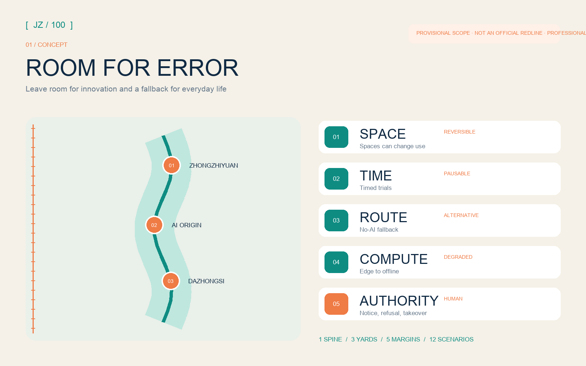
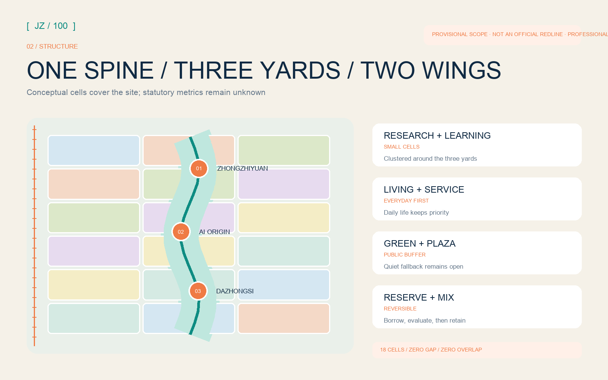
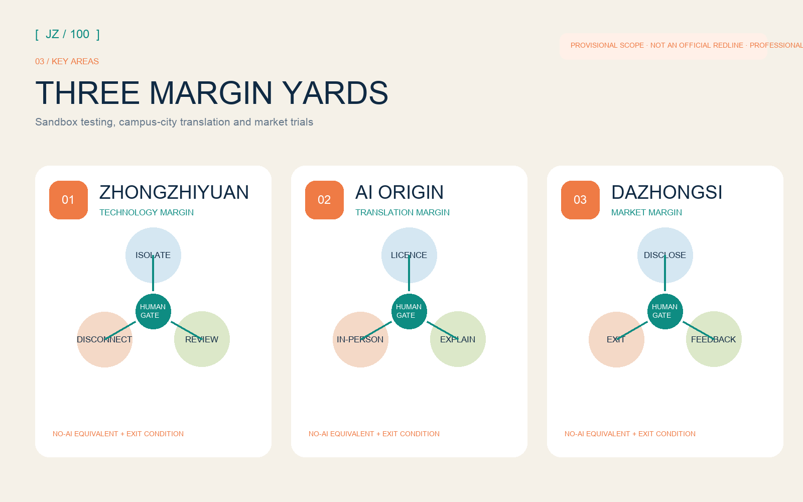
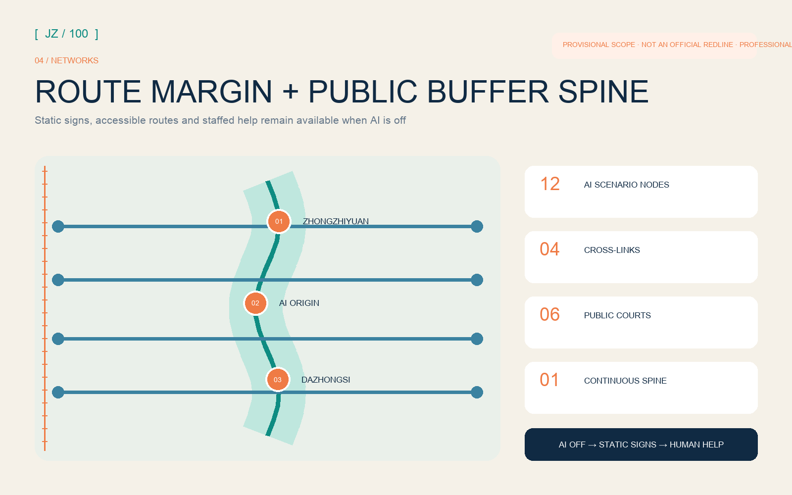
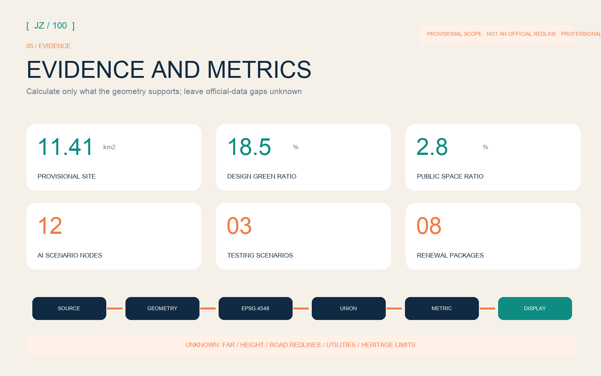

# JING-ZHANG: ROOM FOR ERROR

> Leave room for innovation and a fallback for everyday life. All spatial content is an open, conceptual contribution for further study by professional teams. It is neither a statutory plan nor a governmental approval or implementation commitment.

## Design Basis and Source List

This proposal uses a restrained test for AI urbanism: when a system fails, its evidence changes, or a resident refuses it, the city must still offer space, time, routes, compute and human authority. The official call and agent taskbook set the assignment. Local standards constrain the urban-design vocabulary, while the repository site package and source registry separate formal bases, background references and provisional material [source:OFFICIAL-ANNOUNCEMENT] [standard:PROJECT-AGENT-OPEN-CALL-TASKBOOK].

No official overall or key-area polygons are available in the repository. This package retains `PROV-SITE-001` and the three provisional key areas only for concept generation, communication and intake checks. The dashed outlines do not mark road redlines, parcels or approval limits [data:geometry/site_boundary.geojson#SITE-001] [source:BOUNDARY-SOURCE]. Issue #846 records a 412.5 m nearest gap between the provisional overall scope and an OSM-mapped Jing-Zhang Railway Heritage Park feature. Maintainers found that neither data path justified changing the provisional boundary. The issue remains a recalculation trigger and does not serve as a formal spatial basis.

The proposal draws one operating mechanism from each of six international precedents. one-north combines work, life, learning and a living lab; STATION F colocates multiple programmes; Kendall Square pairs proximity with a cross-sector association; MaRS supports ventures throughout their lifecycle; High Tech Campus Eindhoven shares research facilities; and Barcelona 22@ offers experience in industrial-district renewal. These precedents do not determine the project's boundary, building scale or statutory metrics [source:CASE-ONE-NORTH] [source:CASE-KENDALL].

## Three-Level Scope Framework

The 43.6 km² coordinated research area connects three zones and two wings so the innovation ecosystem can preserve choices. Within the 11.4 km² overall design area, one public buffer spine, three margin yards and transverse fallback routes contain experimentation without shifting risk onto everyday life. The three provisional key areas provide prototypes that a professional team can develop further: a technology sandbox, a campus-city translation yard and a market trial yard [standard:PROJECT-OFFICIAL-ANNOUNCEMENT] [depth:three_level_scope_framework].

One evidence chain links all three levels. Research defines the five margins and operating gates. Overall design maps them to a complete land-use partition, blue-green public space, a slow-mobility network and phasing. Key-area design gives every AI scenario an entry condition, human review, a no-AI equivalent and an exit condition. The structured partition covers the current provisional site; every derived area must be recomputed when official polygons arrive [data:geometry/land_use.geojson#LU-001] [metric:site_area_sqm].

An open square bracket forms the identity. Its left edge marks known constraints, while the open right edge leaves room for public challenge, professional review and future evidence. Railway Ink signals engineering restraint, Margin Teal marks blue-green space and public rights, and Warning Orange appears only on unconfirmed states. The original concept sketch uses no institutional mark, portrait or corporate trademark.

## Coordinated Research Area: Industry and Future City Research

The five margins provide reversible mixed-use space; time to test, evaluate and pause; accessible alternative routes; edge, shared and degraded compute modes; and human authority through notice, refusal, appeal and takeover. They place full-stack innovation, a world-class ecosystem, AI+ scenarios, an active AI city and governance influence into shared spatial and operating rules [source:AGENT-TASKBOOK] [depth:overall_spatial_structure].

Each precedent contributes a practical lesson. one-north connects work, living, landscape and testing. STATION F uses co-located programmes for different venture stages. At Kendall Square, an association works across transport, housing, energy and district life. MaRS connects space, public purpose, venture support and adoption, while Eindhoven lowers fixed costs through shared research facilities. The 22@ experience coordinates industrial renewal with housing, public space, existing communities and phasing. Jing-Zhang applies these lessons through small, bookable and reversible margin yards. It does not copy a megacampus [source:CASE-STATION-F] [source:CASE-MARS].

Three zones and two wings share one traceable process. Zhongzhiyuan provides full-stack testing and governance interfaces; AI Origin translates university research into open, legible outcomes; Dazhongsi hosts limited market trials of agents, devices and content; the Zhongguancun technology-services wing supports intellectual property, finance, law and international exchange; and the Xiaoyue River wing hosts public experience and low-risk scenarios. Each transfer must record evidence, complaints, energy use and exit results.

## Overall Design Area: Urban Renewal and Regulatory-Plan-Level Urban Design

The structure contains one spine, three margin yards, five margins, twelve scenario nodes and eight renewal packages. The public buffer spine links continuous green space, slow mobility and public frontage; the yards occupy the provisional key areas; transverse walking and cycling links provide route margin; adaptable ground floors, courtyards and trial plots provide space margin; operating windows and reversible installations provide time margin. Professional teams can calibrate this model, but it does not survey existing roads, buildings or heritage limits [data:geometry/roads.geojson#ROAD-001] [depth:blue_green_public_space].

Shared cut lines divide the land-use cells in projected coordinates, covering the submission boundary without overlaps or gaps. Research, education, housing, community service, commerce, culture, green space and plazas form small mixed units. Teams can borrow a space, evaluate its use, then decide whether to retain it. Conceptual building footprints show possible locations for renewal but do not decide which buildings to retain, renovate or demolish. FAR, height, density and setbacks remain unknown until regulatory plans, surveys and ownership data are supplied [standard:MNR-LAND-USE-CLASSIFICATION-GUIDE] [depth:development_intensity_controls].

The mobility plan prioritises transverse access and alternative routes. The spine carries continuous walking and cycling; four cross-links serve northern innovation, campus translation, central public life and southern interchange. Static signs and routes without smart devices remain available. Road redlines, junction engineering, structures, parking, fire access and utilities are unknown; the layer records only a conceptual centreline and public-interface model [standard:MOHURD-CONTROL-DETAILED-PLANNING] [depth:traffic_rail_slow_parking].

## Detailed Design of Key Areas

Zhongzhiyuan is a Technology Margin Yard for full-stack autonomy, standards governance and garden encounters. Large closed trials are divided into bookable micro-courts, a public explanation gallery and a conservative blue-green buffer. Models, robots and edge devices begin in isolation and enter public demonstration only after independent review. Any proposal touching the Qing River, Fifth Ring Road or external transport must await official ecological, flood and road information [data:geometry/key_areas.geojson#PROV-KEY-001] [source:OFFICIAL-ANNOUNCEMENT].

AI Origin is a Translation Margin Yard for universities, ventures, residents and international visitors. Its prototypes are an open-source release hall, divisible co-research rooms, a translation street and a talent-services courtyard. Research enters a community pilot only when licensing, risk, no-AI equivalence and maintenance responsibility are clear. Station integration and building renewal remain study topics pending official boundaries, ownership and transport conditions [data:geometry/key_areas.geojson#PROV-KEY-002] [depth:three_key_area_detailed_design].

Dazhongsi is a Market Margin Yard for agents, smart devices, content and international exchange. Adaptable ground floors host time-limited, audience-limited trials; a public appeal desk and visible exit clock protect consumer choice. A quiet alternative path separates everyday access from events. Four-quadrant station links, bicycle parking and enterprise-area renewal remain conceptual until transport, ownership and utility evidence is available [data:geometry/key_areas.geojson#PROV-KEY-003] [depth:retain_renovate_demolish].

## AI Innovation Ecosystem, Personas, and AI+ Scenarios

Six personas guide service design; they do not form a profiling database. Open-source developers need trusted collaboration; startups need affordable trials and compliance support; corporate researchers and visitors need demonstration and recruitment; students and faculty need translation and inter-campus links; neighbours need low-disturbance services they may refuse; and children, older people and disabled users need accessibility, visible human help and a no-AI equivalent. Operators must minimise and de-identify data and restrict it to the stated purpose [standard:PROJECT-AGENT-OPEN-CALL-TASKBOOK] [metric:persona_count].

Twelve scenario cards use one protocol: spatial carrier, user, minimum data, human review, no-AI equivalent, pause threshold, accountable operator and exit method must all be visible.

| Card | Type and place | Margin protocol |
| --- | --- | --- |
| S01 Public model red-team window | Test; Zhongzhiyuan | Isolated data, expert release, immediate disconnection; public sees method and summary only |
| S02 Shared low-speed robot court | Test; Zhongzhiyuan | Controlled hours, on-site safety officer, staffed delivery backup, stop on collision |
| S03 Edge-compute energy cabin | Test; buffer spine | Public energy budget, degraded mode, human power-off, no sensitive personal data |
| S04 Open-source translation desk | AI Origin | Licence check, plain-language abstract, mentor review, in-person advice retained |
| S05 Accessible slow-route assistant | Spine and cross-links | Route request only, static signs in parallel, staffed help point, appealable errors |
| S06 Public-space booking aid | Three yards | No identity scoring, on-site signup retained, overload to staff, delete after slot |
| S07 Community-service copilot | AI Origin edge | Public directory only, no professional substitution, equivalent counter, full log |
| S08 Smart-device trial desk | Dazhongsi | Trial status shown, anonymous feedback, staff takeover, removal at expiry |
| S09 Content provenance gallery | Dazhongsi | Generation and licence labels, human correction, printed explanation, remove infringement |
| S10 Public-maintenance assistant | Blue-green space | Facility issues only, no face recognition, human dispatch, reversible false reports |
| S11 Co-translated Jing-Zhang memory walk | Cultural nodes | Cleared sources, expert review, screen-free tour, contested versions side by side |
| S12 Global Margin Week | Entire belt | Public pilot register, resident observers, daily review, automatic event exit |

S01-S03 are industry testing scenarios and may operate only after isolation, insurance, human takeover and professional approval. S04-S12 are public-service and experience concepts; they do not claim technical maturity or permission. Each node is an independent Point feature and is counted in the metrics [data:geometry/constraints.geojson#SCENARIO-01] [metric:testing_validation_scenario_count].

## Land Use, Building Scale, and Retain-Renovate-Demolish Strategy

The complete model defines space margin as the ability to convert between mixed cells; it does not create a new statutory land class. Research, education and commercial cells support the three yards; housing and community-service cells support daily life; green and plaza cells form the public buffer. Every cell still uses a subset of the national land-use classification. The model tests relationships and continuity and must not be read as approved parcel use [data:geometry/land_use.geojson#LU-001] [metric:land_use_feature_count].

Small, distributed footprints represent research, incubation, education, community, culture and mixed services. Retention, renovation, demolition and construction require building-by-building evidence on footprint, age, condition, ownership, heritage and statutory controls. The present method prioritises usable structures, low-disturbance retrofit and reversible additions; it names no building for demolition. Footprint area can be recomputed but is not an approved building scale [data:geometry/buildings.geojson#BLDG-001] [metric:building_footprint_area_sqm].

## Transport, Rail, Municipal Infrastructure, and Public Services

Route margin means every smart mobility suggestion has an intelligible alternative. The buffer spine carries continuous walking and cycling; cross-links connect communities, workplaces and services to the three yards; static signs, tactile cues, ramps and staffed points parallel digital navigation. Rail integration is a framework for transfer, walking, cycling and public frontage, not a road, bridge, tunnel or construction conclusion [data:geometry/roads.geojson#ROAD-001] [metric:walking_cycling_network_length_m].

Compute margin uses tiers. Local edge devices serve low-risk short tasks, shared compute supports authorised R&D, and cloud services operate only with clear permission and transfer boundaries. Lighting, signs, access, help and essential public services must work when networks or models are unavailable. Energy, utilities, flood control, fire safety and heat rejection await official studies; the proposal states only reserve capacity, monitoring and degraded-mode principles [depth:municipal_new_infrastructure] [source:SITE-PACKAGE].

## Blue-Green Network, Public Space, and Urban Character

Everyday public use comes first along the blue-green buffer spine. A continuous green belt, six public margin courts and four cross-links support walking, cycling, rest, exercise, quiet use and small trials. Events require capacity, noise, lighting and exit rules; a quiet path always remains. Green and public-space ratios come from geometry unions. They describe the conceptual design and do not constitute statutory green-space ratios [data:geometry/green_space.geojson#GREEN-001] [metric:green_ratio].

Four AI pilgrimage and honour nodes are public landmarks open to challenge: the northern Margin Gauge shows pilot state and remaining resources; the Open-Source Rings record adopted, corrected and withdrawn contributions; the Human Takeover Pavilion makes accountability and appeal visible; the southern Exit Clock counts down to review or removal. Scale, structure, heritage relationship and exact location await professional design, and every name, image, typeface and historical source requires rights clearance [standard:MOHURD-URBAN-DESIGN-MEASURES] [metric:pilgrimage_landmark_count].

Railways need room for passing, maintenance and scheduling. The cultural narrative connects that operating slack with Zhongguancun's tradition of iteration and the duty to explain and correct AI systems. Wayfinding uses mileage, brackets and margin gauges; it avoids portraits, corporate marks and uncleared imagery. Historical claims rely on official or rights-cleared material, and generated content is labelled.

## Renewal Projects, Implementation Policy, and Phasing

Eight packages divide the proposal into work that professional teams can take forward: P01 buffer-spine continuity audit; P02 Zhongzhiyuan technology court; P03 AI Origin open-source translation street; P04 Dazhongsi market trial hall; P05 four transverse fallback routes; P06 four public landmarks; P07 no-AI equivalent component library; and P08 the Margin Ledger and annual programme. Each starts with evidence checks and public discussion, followed by a low-cost pilot, independent evaluation and an explicit decision to remove or retain it [data:geometry/phasing.geojson#PHASE-001] [metric:renewal_project_count].

The near term contains evidence calibration, walkability audits, mobile furniture and protocol rehearsals. The middle term begins key-area and cross-link work only after ownership, regulation, transport, utilities and heritage conditions are confirmed. Permanent structures, city-scale operations and international partnerships belong to the long term. Phase areas are recomputed from the provisional model and are not investment or development promises [depth:phasing_implementation] [metric:phase_1_area_sqm].

The annual operation is four seasons and one ledger: a spring Open Problems Month, a summer Trial Window, an autumn Global Margin Week, and a winter Exit and Maintenance Season that closes failed pilots and publishes an annual public ledger. Developer communities contribute methods, professionals own safety and compliance, human operators make final decisions, and resident observers may request pauses and appeal. These are conceptual mechanisms, not confirmed public programmes, funding or tenant commitments.

## Metrics, Area Recalculation, and Compliance Matrix

Metrics have three states: areas, ratios, lengths and counts recomputable from the present GeoJSON; FAR, height, road redlines and facility capacities awaiting official evidence; and satisfaction, participation, appeal handling and scenario-exit performance available only after operation. The first group is calculated in EPSG:4548; the latter groups remain unknown or conceptual so aspiration does not become false precision [depth:metrics_recalculation] [metric:public_space_ratio].

The model contains 12 scenario nodes, 3 industry testing scenarios, 6 personas, 4 public landmarks and 8 renewal packages. Geometry-union methods align area metrics and layers; core visual values carry `data-metric` attributes; and the land-use union must equal the site without overlaps. Passing self-check means the package can enter machine and content review, not that it is officially endorsed or buildable [metric:ai_scenario_node_count] [depth:risk_missing_data].

The compliance matrix maps official clauses 1.3, 1.4 and 1.5 plus agent.1-agent.6. The standards matrix separates standards already addressed from official building-depth documents that remain unavailable. The depth matrix links context, scope, structure, land use, intensity, character, retain-renovate-demolish, mobility, utilities, blue-green space, key areas, projects, phasing, recalculation and risk to prose, geometry, metrics, figures, sources, assumptions and checks.

## Risk, Copyright, and Compliance

The leading risks are misread provisional lines, conceptual figures quoted as controls, pilots that continue without an exit, events that crowd everyday public space and human takeover that exists only in prose. The proposal responds with visible provisional labels, unknown statutory metrics, a no-AI equivalent and human takeover for every scenario, priority for everyday public use, and full-package recalculation when official polygons arrive [source:ISSUE-846] [depth:risk_missing_data].

Missing evidence includes official overall and key-area boundaries, parcels and buildings, regulatory metrics, road redlines and sections, rail and utilities, fire and flood control, heritage limits, public-service baselines, ownership and delivery bodies. No specific retain-renovate-demolish decision, height, engineering alignment, underground space, energy load, investment or development schedule is a conclusion before those inputs are professionally reviewed.

Codex (GPT-5.6 Sol) generated the prose under structured checks; Shapely and PyProj derive spatial layers within public or rights-cleared inputs; Pillow draws figures; ReportLab generates PDFs; and HTML is static and offline. The package uses no remote map tiles, news photography, corporate logo, portrait or private data. The full toolchain, licences, methods and limits are recorded in `sources.json` and `report/copyright_statement.md`.

## References

The bibliography aligns with the machine-readable registry: official documents establish the task and professional vocabulary, while international cases are mechanism references only [source:OFFICIAL-ANNOUNCEMENT] [source:SOURCE-REGISTRY].

- Haidian Branch of the Beijing Municipal Commission of Planning and Natural Resources, international qualification notice for the Centenary Jing-Zhang AI Innovation Belt urban design, 2026.
- Taskbook excerpt for the global agent open call, rights-cleared task material, 2026.
- Ministry of Housing and Urban-Rural Development, local official snapshots of the Urban Design Management Measures and regulatory detailed-planning procedure.
- Ministry of Natural Resources, local official snapshot of the land-use and sea-use classification guide.
- JTC one-north; STATION F; Kendall Square Association; MaRS Discovery District; High Tech Campus Eindhoven; and Ajuntament de Barcelona 22@ public materials, retrieved 2026-08-10.
- open-city-ai/haidian Issue #846, provisional overall-scope background check and maintainer conclusion, 2026.
