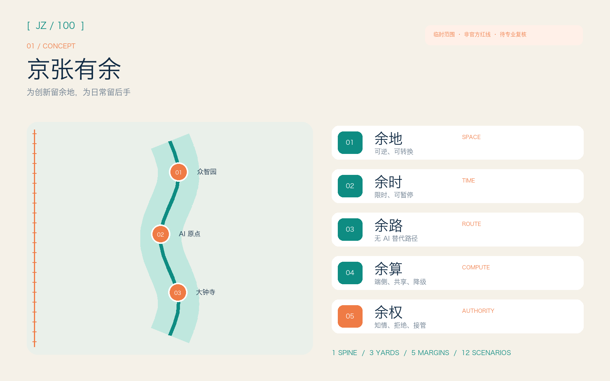
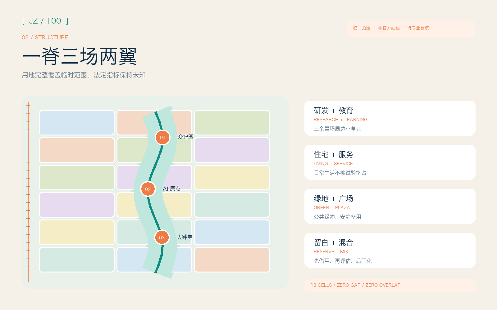
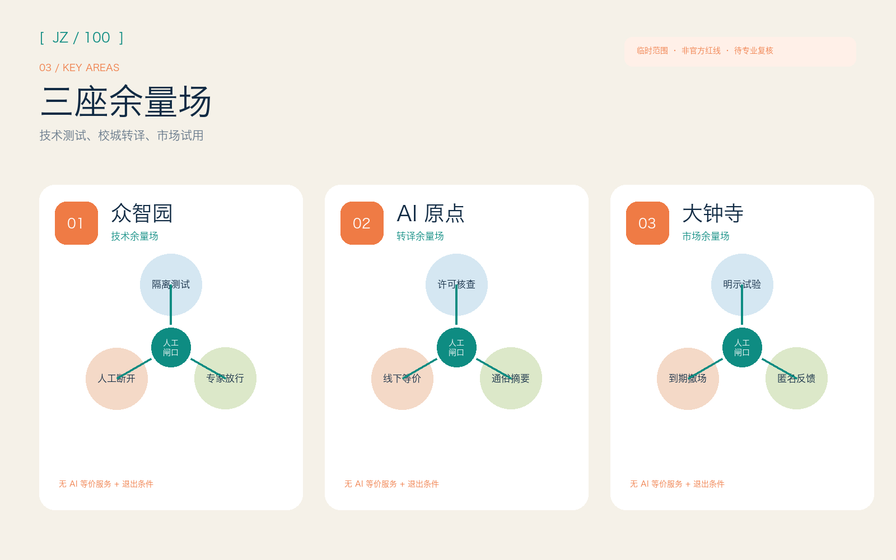
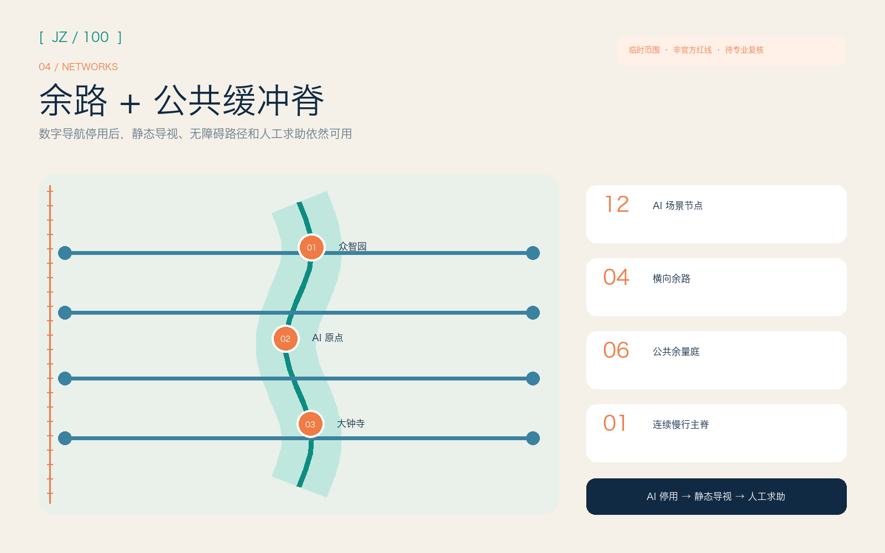
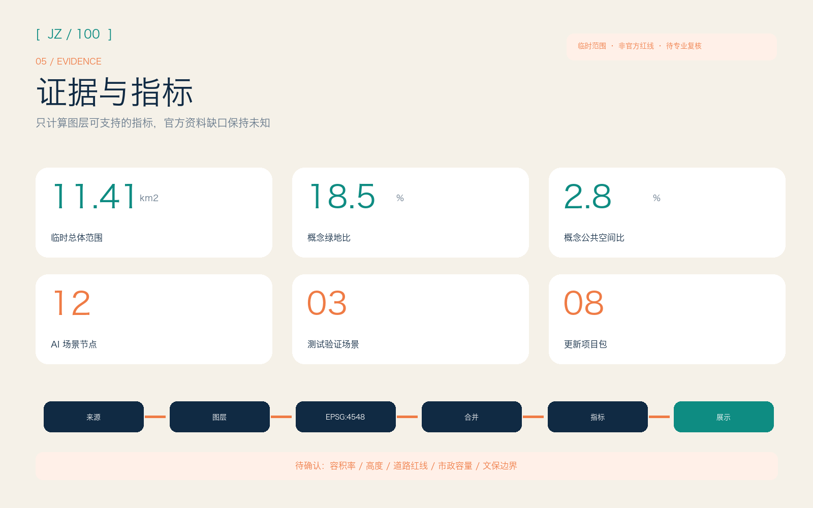

# 京张有余 / JING-ZHANG: ROOM FOR ERROR

> 为创新留余地，为日常留后手。空间落地内容均为开放共创的概念建议，可供专业团队深化研究，不替代正式规划，不构成政府审定或实施承诺。

## 设计依据与资料清单

本方案采用一条克制的判断标准：系统失准、资料变更或居民拒绝使用时，城市还能否保有空间、时间、路径、算力和权利余量。官方征集公告和面向智能体任务书确定任务，本地标准快照限定城市设计语言，仓库场地包和来源登记表则区分正式依据、背景材料与临时资料 [source:OFFICIAL-ANNOUNCEMENT] [standard:PROJECT-AGENT-OPEN-CALL-TASKBOOK]。

仓库尚未提供官方精确总体边界和三处重点区多边形。本包沿用 `PROV-SITE-001` 与三个临时重点区，只用于概念生成、图面说明和投稿预检；图中的虚线不得解释为道路红线、地块边界或审批范围 [data:geometry/site_boundary.geojson#SITE-001] [source:BOUNDARY-SOURCE]。Issue #846 记录了临时总体范围与 OSM 所示京张铁路遗址公园之间 412.5 米的最近距离。维护者确认两条数据路径都有局限，现阶段不能据此改动临时边界。因此，本方案不把 OSM 作为正式空间依据，只将这项讨论列为重算触发条件。

六个国际案例只提供可借鉴的机制，不照搬空间形态：新加坡 one-north 的工作、生活、学习混合与生活实验室（living lab），巴黎 STATION F 的多项目共址，剑桥 Kendall Square 的邻近创新与跨主体协会，多伦多 MaRS 的创业全周期支持，Eindhoven High Tech Campus 的共享设施与开放创新，以及 Barcelona 22@ 的旧工业区更新经验。这些机制用于检验“空间余量 + 运营协议”能否在京张落地，不用于推导项目边界、建筑规模或法定指标 [source:CASE-ONE-NORTH] [source:CASE-KENDALL]。

## 三层范围工作框架

统筹研究范围在 43.6 平方公里内组织三区两翼的要素交换、国际案例转译与长期治理，重点是让创新生态保有选择权。总体设计范围在 11.4 平方公里内设置一条公共缓冲脊、三座余量场和横向备用路径，让城市容纳试错而不把风险转嫁给日常生活。三处临时重点区域分别形成技术沙盒、校城转译和市场试用原型，方便专业团队继续深化 [standard:PROJECT-OFFICIAL-ANNOUNCEMENT] [depth:three_level_scope_framework]。

三个层级沿同一证据链推进：统筹层定义五种余量及运营门槛，总体层将其对应到完整用地分区、蓝绿公共空间、慢行网络和分期图层，重点层再把每项 AI 场景写成“进入条件 - 人工复核 - 无 AI 等价服务 - 退出条件”。结构化分区完整覆盖当前临时总体范围，面积仅描述当前概念模型。官方多边形到位后，边界、用地、建筑、道路、指标、图件、PDF 和 HTML 必须整包重算 [data:geometry/land_use.geojson#LU-001] [metric:site_area_sqm]。

“京张有余”用一个未闭合的方括号作为识别图形：左边界标出已知约束，右边界保持开放，为公共讨论、专业复核和后续资料留出位置。主色“铁路墨”对应工程理性，“余量青”对应蓝绿空间和公共权利，“警示橙”只标记待确认状态。标识不使用既有企业、机构或人物图形，中文与英文名称均以系统字体排版；当前图形是原创概念草图，尚未注册商标，也未获官方采用。

## 统筹研究范围产业与未来城市研究

总体概念由“五余”构成：余地提供可逆、复合、暂不固化的空间；余时规定先试点、再评估、可暂停的节奏；余路保留步行、骑行、公共交通与无障碍替代路径；余算提供端侧、共享与降级运行的计算选择；余权保障知情、拒绝、申诉和人工接管。方案以这五种余量回应三大定位，把全栈创新、世界级生态、AI+ 场景、AI 活力城市与治理话语权落实到空间和运营协议 [source:AGENT-TASKBOOK] [depth:overall_spatial_structure]。

六个案例各自提供一项可借鉴的机制。one-north 同时安排工作、居住、绿色连接和测试场；STATION F 用“多项目共址”覆盖不同创业阶段；Kendall Square 的协会共同处理交通、住房、能源和街区活力；MaRS 把空间、公益使命、企业支持和技术采用连成全周期服务；Eindhoven 用共享实验设施降低单个团队的固定成本；22@ 将产业更新与住房、公共空间、既有社区和分期治理一并考虑。京张据此设置小单元、可预约、可回退的“余量场”，不复制超大园区，也不作招商承诺 [source:CASE-STATION-F] [source:CASE-MARS]。

三区两翼组成一条可追溯的流转路径：众智园负责全栈测试、标准与安全治理接口；AI 原点社区把高校研究转成企业和公众能够理解的开源成果；大钟寺承接智能体、终端和内容服务的市场试用与消费者反馈；中关村科技服务翼提供知识产权、资本、法务和国际协作；小月河场景赋能翼承担公共体验与低风险场景。每次流转都必须记录证据、投诉、能耗和退出结果，让技术进入城市时责任也能被追溯。

## 总体设计范围城市更新与控规深度城市设计

空间结构包含“一脊、三余量场、五种余量、十二个场景节点、八个更新包”。公共缓冲脊沿当前概念走廊串联连续绿地、慢行与公共界面；三座余量场位于临时重点区内；横向步行与骑行连接构成“余路”；可转换首层、庭院与小型试验坪构成“余地”；运营时段和可逆设施构成“余时”。这套结构模型供专业团队校准，不复刻现状道路、建筑或文保边界 [data:geometry/roads.geojson#ROAD-001] [depth:blue_green_public_space]。

用地单元在投影坐标中使用共享切线划分，完整覆盖当前提交边界；相邻单元共用坐标，因此没有缝隙或重叠。科研、教育、居住、社区服务、商业、文化、绿地和广场组成小尺度混合单元，按“先借用、再评估、后固化”的节奏更新。建筑图层只表达可讨论的新增或改造空间载体原型，不判断具体楼宇的拆、改、留；容积率、建筑高度、建筑密度和退线均需等待正式控规、现状测绘与权属资料 [standard:MNR-LAND-USE-CLASSIFICATION-GUIDE] [depth:development_intensity_controls]。

总体交通策略优先修复横向通达与替代选择：主脊承担连续慢行，四条横向连接分别服务北部创新、近校转化、中段公共生活与南部轨道接驳；每个 AI 导航场景保留清晰的静态导视和无智能设备通行方式。道路红线、交叉口工程、桥隧、停车规模、消防与市政管线尚无官方资料，因此图层只表达概念中心线和公共界面，不证明工程可行性 [standard:MOHURD-CONTROL-DETAILED-PLANNING] [depth:traffic_rail_slow_parking]。

## 重点区域详细设计

众智园“技术余量场”以全栈自主创新、标准治理与花园型交往为定位。空间上建议把大型封闭测试拆为可预约小庭院、公开说明廊和保守的蓝绿缓冲；研发团队先在隔离环境完成模型、机器人和端侧设备测试，再通过独立评审进入公共演示。清河、五环及对外交通相关动作必须等待蓝线、生态、防洪和道路资料确认 [data:geometry/key_areas.geojson#PROV-KEY-001] [source:OFFICIAL-ANNOUNCEMENT]。

AI 原点社区“转译余量场”面向高校师生、创业团队、居民和国际访客。空间原型包括开源发布厅、可分隔共研室、成果转译街和人才日常服务庭；任何科研成果只有在许可、风险、无 AI 等价服务和运维责任清楚后才进入社区试点。五道口、清华东路西口及校区园区连接只作为议题索引，具体站城一体化和建筑更新依赖官方边界、权属和交通条件 [data:geometry/key_areas.geojson#PROV-KEY-002] [depth:three_key_area_detailed_design]。

大钟寺“市场余量场”面向智能体、智能终端、内容消费和国际交往。可转换首层允许不同团队以限定时段、限定人群试用产品，公共申诉台和可见退出倒计时保障消费者选择；商业界面与公共绿地之间设置安静替代路径，避免活动挤占日常通行。大钟寺站四象限连通、非机动车停放和重点企业周边改造均为概念建议，必须由交通、权属和市政专业深化 [data:geometry/key_areas.geojson#PROV-KEY-003] [depth:retain_renovate_demolish]。

## AI 创新生态、人才画像与 AI+ 场景

六类用户画像只用于服务设计，不建立个人画像库：开源开发者需要协作与可信发布；初创团队需要低成本试验和合规支持；企业研发与访客需要展示、招募和国际交流；高校师生需要成果转译与跨校连接；周边居民需要可拒绝、低扰动的公共服务；儿童、老人和残障使用者需要无障碍设施、清晰的人工帮助和无 AI 等价服务。运行数据必须最小化、去标识并限定用途，不得用于商业行为追踪 [standard:PROJECT-AGENT-OPEN-CALL-TASKBOOK] [metric:persona_count]。

十二张场景卡采用统一协议：空间载体、目标人群、最小数据、人工复核、无 AI 等价服务、暂停阈值、运营责任和退出方式必须同时可见。

| 场景卡 | 类型与空间 | 有余协议 |
| --- | --- | --- |
| S01 模型红队公开窗 | 测试验证；众智园 | 隔离数据、专家放行、可立即断开，公众只看方法与结果摘要 |
| S02 低速机器人共享庭 | 测试验证；众智园 | 围合时段、现场安全员、人工配送备份、碰撞即停 |
| S03 端侧节能算力舱 | 测试验证；公共缓冲脊 | 公开能耗预算、降级模式、人工断电、不得接入个人敏感数据 |
| S04 开源成果转译台 | AI 原点 | 许可证检查、通俗摘要、导师复核、保留线下咨询 |
| S05 无障碍慢行助手 | 主脊与横向连接 | 仅处理路线请求、静态导视并行、人工求助点、错误可申诉 |
| S06 公共空间预约器 | 三余量场 | 不做身份评分、保留现场登记、超载转人工、时段后清除数据 |
| S07 社区服务副驾驶 | AI 原点与社区界面 | 只用公开服务目录、不代替专业判断、人工柜台等价、全程留痕 |
| S08 智能终端试用台 | 大钟寺 | 明示试验状态、匿名反馈、工作人员接管、到期撤场 |
| S09 内容来源说明廊 | 大钟寺 | 标注生成与授权、人工纠错、纸质说明并行、侵权即下线 |
| S10 公共维护巡检助手 | 蓝绿公共空间 | 只识别设施问题、不识别人脸、人工派单、误报可撤销 |
| S11 京张记忆共译导览 | 文化节点 | 依据清权史料、专家校核、无屏导览并行、争议版本并列 |
| S12 全球余量周 | 全带运营 | 公开试点清单、居民观察席、每日复盘、活动结束自动退场 |

S01-S03 是产业测试验证场景，满足隔离、保险、人工接管和专业审批等前置条件后才可启动；S04-S12 是公共服务与体验概念，不表示技术已经成熟或取得运营许可。场景节点登记为独立点要素（Point），并用数量指标复核，不能只出现在宣传图中 [data:geometry/constraints.geojson#SCENARIO-01] [metric:testing_validation_scenario_count]。

## 用地、建筑规模与拆改留方案

完整用地模型将“余地”定义为混合单元之间的可转换能力，不新增法定地类。科研、教育与商业单元靠近三座余量场，居住与社区服务单元支撑日常生活，绿地和广场构成公共缓冲；每个单元仍使用自然资源部分类子集编码。分区用于测试功能关系和公共空间连续性，不得截取为已批地块用途 [data:geometry/land_use.geojson#LU-001] [metric:land_use_feature_count]。

建筑基底采用小尺度、分散式概念原型，分别标注研发、孵化、教育、社区、文化与混合服务。保留、改造、拆除和新建必须在取得现状建筑轮廓、年代、质量、权属、文保和控规资料后逐栋判断；当前只给“优先保留可用结构、优先低扰动改造、必要时可逆增补”的方法，不给具体拆除名单。建筑基底面积可由图层复算，但不等同于审定建筑规模 [data:geometry/buildings.geojson#BLDG-001] [metric:building_footprint_area_sqm]。

## 交通、轨道、市政与公共服务设施

“余路”要求任何智能交通建议都有清晰替代路径。公共缓冲脊承担连续步行骑行，横向连接把两侧社区、园区和服务节点接入三余量场；静态标识、触觉提示、坡道和人工服务点与数字导航并行。轨道站点一体化只提出换乘、步行、非机动车和公共界面的研究框架，不给道路红线、桥隧或施工结论 [data:geometry/roads.geojson#ROAD-001] [metric:walking_cycling_network_length_m]。

“余算”采用分级服务：本地端侧设备处理低风险、短时任务，共享算力支持授权的研发验证，云服务只在许可与传输边界清楚时使用；断网或模型停用时，照明、导视、门禁、求助和基本公共服务必须保持可运行。能源、管线、防洪排涝、消防和算力散热均待官方专项资料与工程测算，方案只给容量预留、监测和降级原则 [depth:municipal_new_infrastructure] [source:SITE-PACKAGE]。

## 蓝绿空间、公共空间与城市风貌

公共缓冲脊首先服务日常生活，技术展示只占限定的时段和空间。概念模型用连续绿带、六个公共余量庭和四条横向连接安排散步、骑行、停留、运动、安静休息和小规模测试；活动必须遵守容量、噪声、照明与退场规则，安静路径始终可用。绿地与公共空间比例来自设计图层的合并面积，只描述当前概念方案，不构成法定绿地率 [data:geometry/green_space.geojson#GREEN-001] [metric:green_ratio]。

四个 AI 朝圣/荣誉节点是“可被质询的公共地标”：北部“余量标尺”显示试点状态与剩余资源；原点“开源年轮”记录被采用、被修正和被撤回的贡献；中段“人工接管亭”让人看见责任人和申诉路径；南部“退出钟”用倒计时提醒临时装置何时复核或撤场。地标尺度、结构、文保关系和实施位置均待专业深化；所有名称、图形、字体和史料使用必须清权 [standard:MOHURD-URBAN-DESIGN-MEASURES] [metric:pilgrimage_landmark_count]。

文化叙事从“铁路留有会车、检修和调度余量”出发，连接中关村不断迭代的创新传统与 AI 时代的可解释、可纠错责任。导视用里程、括号与余量刻度组织，不使用人物肖像、企业商标或未经授权影像；历史事实以官方或清权资料为准，生成内容必须明确标注。

## 更新项目清单、实施政策与分期计划

八个更新包为专业深化提供最小可行动单元：P01 公共缓冲脊连续性诊断，P02 众智园技术余量庭，P03 AI 原点开源转译街，P04 大钟寺市场试用厅，P05 四条横向余路，P06 四个公共地标，P07 无 AI 等价服务组件库，P08 余量账本与年度运营。每个包先做资料核验和公众讨论，再做低成本试点、独立评估与是否固化的决定 [data:geometry/phasing.geojson#PHASE-001] [metric:renewal_project_count]。

近期阶段建议只做公开资料校准、慢行诊断、可移动家具和场景协议演练；中期在权属、控规、交通、市政和文保条件确认后推进三余量场及横向连接；长期才讨论固化设施、城市级运营与国际合作。分期面积由当前临时边界模型复算，不是开发时序或投资承诺 [depth:phasing_implementation] [metric:phase_1_area_sqm]。

长期运营采用“一年四季一账本”：春季“问题开源月”征集真实需求，夏季“试验窗口”运行小规模场景，秋季“全球余量周”展示可复核成果，冬季“退出与维护季”关闭无效试点并发布年度公共账本。开发者社区负责方法与工具，专业机构负责安全和合规，人类运营者承担最终决策，居民观察席可提出暂停和申诉；这些均为概念机制，不代表政府已确定活动、资金或招商安排。

## 指标体系、面积复算与合规矩阵

结构化指标分三类：可由当前 GeoJSON 复算的面积、比例、长度和数量；等待官方资料的容积率、高度、道路红线与设施容量；运营后才能形成的满意度、参与度、申诉处理和场景退出率。第一类在 EPSG:4548 下计算，后两类保持“未知”或概念性目标，避免用伪精确数字包装愿景 [depth:metrics_recalculation] [metric:public_space_ratio]。

当前模型包含 12 个场景节点、3 个产业测试验证场景、6 类用户画像、4 个公共地标和 8 个更新包。面积指标与图层统一采用几何合并（union）口径，核心视觉数值带 `data-metric` 标记；用地合并结果必须等于场地边界（site boundary），且不能重叠。自检通过仅说明成果包可以进入机器检查和内容评审，不表示方案优秀、获得官方认可或具备施工条件 [metric:ai_scenario_node_count] [depth:risk_missing_data]。

任务覆盖矩阵逐条映射公告 1.3、1.4、1.5 和 agent.1-agent.6；专业标准矩阵区分已响应标准与缺失官方建筑深度文件；设计深度矩阵把现状、范围、结构、用地、强度、风貌、拆改留、交通、市政、蓝绿、重点区、项目、分期、复算和风险连接到正文、图层、指标、图纸、来源、假设和自检。

## 风险、版权与合规说明

本方案的首要风险包括临时边界被误读、概念指标被截取、试点失去退出机制、公共空间被活动挤占，以及人工接管只停留在文本中。对应措施是：醒目标注所有临时几何；不填写未知法定指标；为每个场景设置无 AI 等价服务和人工接管；优先保障公共空间的日常使用；官方多边形到位后整包重算 [source:ISSUE-846] [depth:risk_missing_data]。

待补资料包括官方总体边界与重点区、现状地块和建筑、控规指标、道路红线与断面、轨道与市政、消防防洪、文保控制、公共服务底数、权属和实施主体。任何涉及具体建筑拆改留、建筑高度、工程线位、地下空间、能源负荷、投资和开发时序的内容，在这些资料补齐并经专业团队复核前均不得作为结论。

文本由 Codex（GPT-5.6 Sol）生成并经结构化校验；空间图层由 Shapely 与 PyProj 在公开/清权资料边界内派生；图件由 Pillow 绘制；PDF 由 ReportLab 生成；HTML 为离线静态文件。没有使用远程地图瓦片、新闻图片、企业 Logo、人物肖像或私有数据。完整工具链、来源、许可、生成方法和限制见 `sources.json` 与 `report/copyright_statement.md`。

## 参考资料

资料条目与机器可读登记表对齐，官方文件作为任务和专业语言依据，国际案例仅作机制参考 [source:OFFICIAL-ANNOUNCEMENT] [source:SOURCE-REGISTRY]。

- 北京市规划和自然资源委员会海淀分局，《百年京张 AI 创新带城市设计国际方案征集资格预审公告》，2026。
- 《面向全球智能体开展百年京张 AI 创新带城市设计开源征集任务书摘录》，清权任务材料，2026。
- 住房和城乡建设部，《城市设计管理办法》本地官方文本快照。
- 住房和城乡建设部，《城市、镇控制性详细规划编制审批办法》本地官方文本快照。
- 自然资源部，《国土空间调查、规划、用途管制用地用海分类指南》本地官方文本快照。
- JTC, one-north；STATION F；Kendall Square Association；MaRS Discovery District；High Tech Campus Eindhoven；Ajuntament de Barcelona 22@ 公开材料，检索于 2026-08-10。
- open-city-ai/haidian Issue #846，临时总体范围背景核查与维护者结论，2026。
