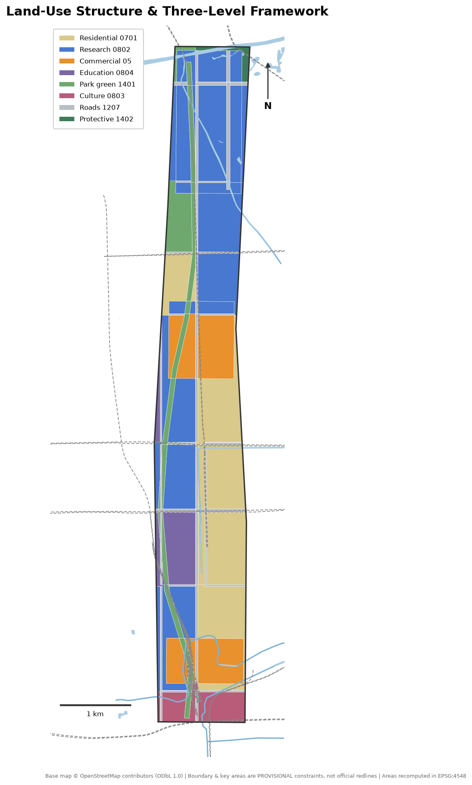
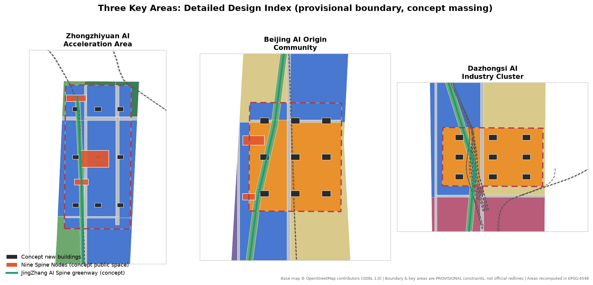
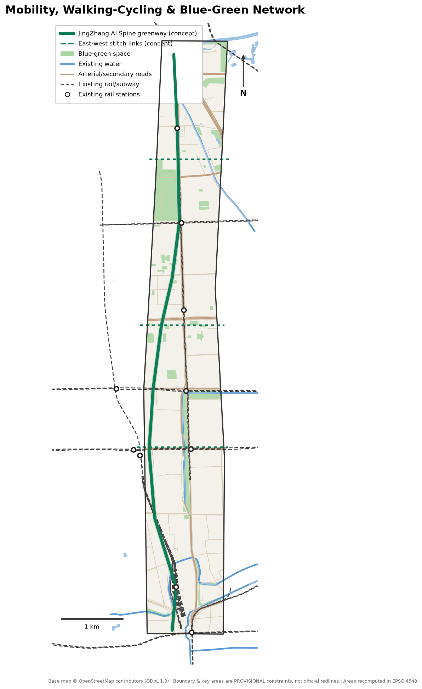
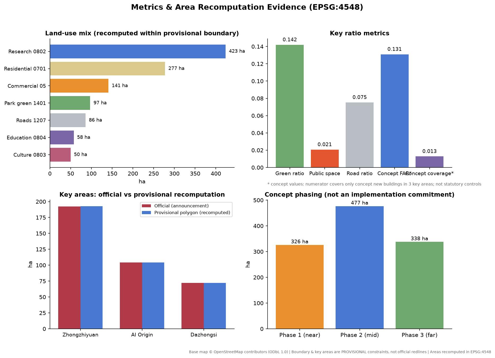

# JingZhang AI Spine

## Design Basis and Source List

Every factual judgment in this proposal rests on the repository's public site package and verifiable public data. The controlling basis is the official prequalification announcement issued by the Haidian Branch of the Beijing Municipal Commission of Planning and Natural Resources, which fixes the project name, the three scope levels, the three key areas, the design tasks, and the deliverable context [source:OFFICIAL-ANNOUNCEMENT] [standard:PROJECT-OFFICIAL-ANNOUNCEMENT]. The agent-facing open-call taskbook supplies the three positionings, five functions, Three Zones and Two Wings, six agent tasks, ten co-creation principles, and the boundary clause that governs all agent outputs [source:AGENT-TASKBOOK] [standard:PROJECT-AGENT-OPEN-CALL-TASKBOOK].

Land-use classification follows the project subset of the official MNR land-use classification guide; no self-invented codes are used [standard:MNR-LAND-USE-CLASSIFICATION-GUIDE]. Design depth references the MOHURD Urban Design Measures for overall and key-area urban design [standard:MOHURD-URBAN-DESIGN-MEASURES]; all statements about land use, development intensity, and implementation distinguish known controls, design suggestions, and pending items [standard:MOHURD-CONTROL-DETAILED-PLANNING].

The spatial base has two layers. The three scope levels and the three key areas use the repository's provisional rough boundaries, which serve only generation, visualization, and self-check; they are not official redlines or a basis for precise area claims [source:BOUNDARY-SOURCE] [data:geometry/site_boundary.geojson#PROV-SITE-001]. Existing roads, rail, water, and parks come from OpenStreetMap crowd-sourced data (ODbL 1.0, attribution preserved) and act only as an existing-condition base map and design reference [source:OSM-BASE-LAYERS].

Data gaps that must be stated plainly: exact official polygons, RDP controls (FAR, building height, building coverage, green ratio, setbacks), the existing building inventory, land ownership, heritage GIS layers, and municipal constraints have not been obtained from public channels. Wherever this proposal touches those subjects it marks the item "pending official data" and speaks only in concept-suggestion language [source:SITE-PACKAGE].

## Three-Level Scope Framework

The announcement defines three spatial levels, and this proposal works through them as strategy, overall urban design, and key-area detailed design [source:OFFICIAL-ANNOUNCEMENT].

The Coordinated Research Area covers about 43.6 km² (5th Ring Road North to the north, Jingzang Expressway to the east, Xizhimenwai Street to the south, Wanquanhe Road to the west). It carries industry-strategy and synergy research; this proposal identifies the Three Zones and Two Wings synergy loop at this level but generates no design geometry there [metric:key_area_count].

The Overall Design Area covers about 11.4 km² and is the working scope of every geometry layer in this package. The current boundary is provisional (11.41 km² recomputed in EPSG:4548): it was fitted to the announcement's textual edges and approximate area, but it is not an official redline. An OSM background cross-check shows that the mapped Jing-Zhang Railway Heritage Park section sits about 412.5 m away from the provisional boundary (Issue #846), so the true corridor relationship awaits an official polygon [data:geometry/site_boundary.geojson#PROV-SITE-001] [metric:site_area_sqm]. All area metrics in this package are recomputed from design geometry inside the provisional boundary in EPSG:4548 and must be recomputed wholesale once official boundaries arrive.

The Key-Area Detailed Design Area totals about 368.4 ha: from north to south, the Zhongzhiyuan AI Independent Innovation Acceleration Area (about 192.9 ha recomputed), the Beijing AI Origin Community (about 104.3 ha), and the Dazhongsi AI Industry Cluster (about 72.0 ha). The three provisional polygons are non-overlapping and sit inside the provisional overall boundary; detailed design targets the urban-design depth of an Integrated Planning Implementation Plan [data:geometry/key_areas.geojson#PROV-KEY-001] [metric:key_area_zhongzhiyuan_sqm].

## Coordinated Research Area: Industry and Future City Research

### Overall Concept and Naming

This proposal advances the overall concept "JingZhang AI Spine": the century-old Jing-Zhang rail corridor becomes the spatial and cultural spine of the belt, re-composing a corridor currently fragmented by expressways, rail lines, and gated compounds into one continuous innovation green spine. It starts at Zhongzhiyuan in the north, runs through the AI Origin Community, lands at Dazhongsi, and connects to the Xizhimen hub in the south — one spine linking three zones, two wings empowering the belt [depth:overall_spatial_structure] [data:geometry/roads.geojson#RD-SPA-001].

The naming system has three levels: the belt-wide name "JingZhang AI Spine"; the three key areas keep their official names and gain spatial sub-brands — "Zhiyuan Loop" (Zhongzhiyuan), "Origin Quarter" (AI Origin Community), and "Bell Quarter" (Dazhongsi); public-space nodes are collectively the "Nine Spine Nodes". Logo direction (concept suggestion): the 1909 switchback ("人"-shaped) alignment of the Jing-Zhang railway abstracted into an ascending polyline — simultaneously a rail track and a synaptic connection of a neural network. Suggested palette: "Jingzhang teal" (deep teal-grey of locomotive wheels and rails) with "Origin orange"; only open-licensed typefaces, and no unauthorized trademarks, fonts, images, or personal marks.

### Three Positionings, Five Functions, and the Synergy Loop

The three positionings (Centennial Jing-Zhang Culture Belt, Urban AI Life Experience Belt, AI Fusion Innovation Belt) are carried spatially by the cultural-narrative system, the scenarized public-space system, and the industrial space-supply system respectively [source:AGENT-TASKBOOK]. The five functions map to carriers as follows: the Full-Stack Independent AI Innovation System sits in the Zhongzhiyuan research clusters; the world-class AI innovation ecosystem sits in the AI Origin Community and its incubation network; the AI-enabled scenario paradigm sits on the spine corridor and the Xiaoyue River Scenario Enablement Wing; the intelligent AI-livable city sits in the belt-wide walking-cycling and public-space network; and AI-governance voice sits in Zhongzhiyuan's national-platform and governance-sandbox mechanisms (concept suggestions).

The synergy loop: Zhongzhiyuan supplies full-stack technology, the AI Origin Community supplies translation and talent, and Dazhongsi supplies scenario consumption and AI-native business formats; the Zhongguancun Technology Services Wing provides factor allocation and capital, the Xiaoyue River wing provides scenario testing and public experience; the spine greenway is the physical loop for people, information, and demonstration flows among them [depth:three_level_scope_framework].

### Global AI Innovation Ecosystem Cases (Transferable Lessons)

1. **Kendall Square (Cambridge, USA)**: the benchmark campus-adjacent innovation district; its lesson — walking-scale mixing of campus, incubation, and firms — transfers directly to the AI Origin Community.
2. **King's Cross Knowledge Quarter (London)**: the benchmark for turning rail heritage into an innovation district; its lesson — heritage activation with a public-realm-first order — guides the narrative activation of the heritage park and the Qinghuayuan station site (concept suggestion).
3. **Station F (Paris)**: a single megastructure holding a complete startup ecology; its lesson — one building, one value chain — informs the vertical functional organization of the Dazhongsi AI-native consumption complex.
4. **Zhangjiang Science City (Shanghai)**: national platforms coupled with industry clusters; its lesson — graded service supply around big-science facilities — applies to the Zhongzhiyuan cluster.
5. **Shenzhen Bay Super Headquarters Base**: headquarters economy composited with waterfront public space; its lesson — landmark publicness outranks corporate signage — disciplines the public character of this proposal's pilgrimage landmarks.
6. **MaRS (Toronto)**: innovation functions implanted into urban renewal stock; its lesson — low-cost conversion of retained buildings into incubators — supports this proposal's retain-first DRR strategy.

### Future Urban Form Judgment

The core spatial effect of AI is not new construction but re-mixing: the boundaries among research, living, services, and exhibition dissolve, and blocks must adapt over time. This proposal organizes the Overall Design Area as "one spine, three cores, two networks": the spine greenway as the spine, the three key areas as cores, and the walking-cycling network plus scenario-service network as the two networks, letting urban form adjust incrementally with industrial demand [depth:overall_spatial_structure].

## Overall Design Area: Urban Renewal and Regulatory-Plan-Level Urban Design

### Renewal Potential and Overall Framework

The Overall Design Area is a highly built corridor: universities and institutes, mature office stock, work-unit compounds, and aging residential blocks. With the existing building inventory missing (pending official data), this proposal assigns renewal strategies by land-use class: research and commercial land favors functional replacement and infill; existing residential blocks favor retention and upgrading; the corridor edges favor public-space stitching [data:geometry/land_use.geojson] [depth:land_use_layout].

Land-use structure (recomputed inside the provisional boundary): research land about 423.4 ha (37.1%), urban residential about 277.5 ha (24.3%), commercial services about 141.1 ha (12.4%), park green about 97.1 ha (8.5%), road land about 86.0 ha (7.5%), education about 57.5 ha (5.0%), culture about 50.0 ha (4.4%), protective green about 8.8 ha (0.8%) [metric:land_use_0802_research_sqm] [metric:land_use_0701_residential_sqm].

### Innovation Indicator System (Concept Suggestion)

Responding to the announcement's call for an AI innovation index, talent density, and output scale, a four-tier indicator set is suggested: innovation intensity (research floor area per hectare, highly cited institutions per km² — official statistics needed, currently missing); space supply (research and incubation floor area, talent apartments — concept scale given here); life quality (green ratio 14.2%, walking-cycling greenway about 9.5 km, 500 m station coverage — recomputed from this package's geometry); and scenario vitality (open scenarios, annual events — operation targets) [metric:green_ratio] [metric:spine_greenway_length_m].

### Building Scale and Renewal Path

In the absence of RDP controls this proposal draws no intensity conclusions. It provides concept massing only inside the three key areas: 27 concept buildings with a combined footprint of about 14.6 ha and concept gross floor area of about 1.49 million sqm — a discussion starting point for design capacity, to be corrected by the pending FAR, height, and ownership conditions [metric:total_floor_area_sqm_concept] [metric:building_footprint_area_sqm].

### Heritage Park Vitality Belt Strategy

OSM shows the built heritage-park section west of the provisional boundary. The strategy is therefore "borrow the corridor as spine, build the interfaces first": the spine greenway runs north-south inside the provisional boundary along the Line 13 / Changping Line corridor; three east-west stitch links at Dazhongsi, Wudaokou, and Shuangqing Road connect toward the heritage park (concept suggestions, not road redlines); and a Qinghuayuan station heritage interface node is placed east of Wudaokou, ready for physical connection once official boundaries arrive [data:geometry/roads.geojson#RD-SPA-002] [data:geometry/public_space.geojson#PS-005].

### Urban Character

The character keynote is "rail memory x code texture": industrial relic imagery along the corridor, new massing of medium height, fine grain, and openable ground floors; corridor-fronting buildings observe setback and arcade interfaces (concept control suggestions, not approved indicators); roofs consider photovoltaics and equipment integration [standard:MOHURD-URBAN-DESIGN-MEASURES].

## Detailed Design of Key Areas

### Zhongzhiyuan AI Independent Innovation Acceleration Area (~192.9 ha recomputed)

Positioned as a garden-type AI innovation quarter carrying the full-stack independent innovation system and governance-voice functions [data:geometry/key_areas.geojson#PROV-KEY-001]. The structure is "one park, nine buildings": a central innovation park (about 9 ha of concept public space) as the green heart, ringed by AI full-stack R&D buildings, national-platform laboratory buildings, accelerator clusters, and an innovation services complex — nine concept buildings in total [data:geometry/public_space.geojson#PS-008] [data:geometry/buildings.geojson#BLD-K1-01]. External access relies on Xuezhiyuan station (Changping Line) and the 5th Ring / G6 corridor; optimization of the frontage-road system should be studied with the 5th Ring integration plan (concept suggestion). Buildings, green space, and the upper Xiaoyue River are designed as one composition, drawing on Qing River culture for a low-carbon innovation-meeting environment. The AI pilgrimage landmark "Zhiyuan Loop" sits in the central park: a ring-shaped open-source honor gallery engraved with global open-source milestones (content subject to rights clearance).

### Beijing AI Origin Community (~104.3 ha recomputed)

Positioned as a campus-adjacent AI innovation quarter carrying the world-class AI innovation ecosystem function [data:geometry/key_areas.geojson#PROV-KEY-002]. Spatial organization centers on the area east of Wudaokou station: achievement-incubation buildings and university-joint R&D buildings hug the campus edge, talent apartments (concept 16-floor massing) sit to the north, and the Wudaokou mixed-use block meets the station retail interface [data:geometry/buildings.geojson#BLD-K2-01]. The renewal mode is low-disturbance organic renewal: functional replacement first, no wholesale demolition. For walking and cycling, the campus-quarter-station triangle is strengthened, responding to the Wudaokou and Qinghua East Road West Entrance station integration tasks (the stations themselves sit west of the provisional boundary; the design is interface-based) [data:geometry/public_space.geojson#PS-004]. The AI pilgrimage landmark "Origin Bell Tower" stands on the youth innovation square east of Wudaokou: a digital clock tower modeled on the Jing-Zhang station bells, visualizing the pulse of global open source (e.g., commit streams), with no corporate marks on the tower.

### Dazhongsi AI Industry Cluster (~72.0 ha recomputed)

Positioned as an urban AI innovation quarter carrying AI-native business-format functions [data:geometry/key_areas.geojson#PROV-KEY-003]. The core move answers the announcement's four-quadrant walking-connectivity task at Dazhongsi station: a station-front walking loop (concept suggestion) stitches the four quadrants cut by the North 3rd Ring Road and Dazhongsi East Road, organizing concept massing for an AI-native consumption complex, leading-enterprise headquarters offices, a Dazhongsi culture gallery, and AI-experience retail [data:geometry/public_space.geojson#PS-002] [data:geometry/buildings.geojson#BLD-K3-01]. Planned green space is compositely used as an "AI experience garden" hosting robot services and AR guiding; non-motorized parking is organized as static traffic (concept suggestion). The ancient-bell culture and the temple's historic imagery feed the place narrative; no religious space is altered.

## AI Innovation Ecosystem, Personas, and AI+ Scenarios

### Personas (Five)

1. **AI researchers/engineers (25-40)**: need walkable labs, late-night food, and technical social space; served by spine nodes and mixed ground floors of research clusters.
2. **Founders/independent developers**: need low-cost desks, pitch exposure, and policy/compute matchmaking; served by accelerator clusters and the enterprise-service copilot scenario.
3. **University students and visiting scholars**: need cross-campus slow mobility, open desks, and international-community services; served by the AI Origin Community and campus interface nodes.
4. **Local residents (incl. aging blocks)**: need daily services, green space, and jobs without displacement; served by retained residential blocks and community facilities.
5. **International visitors/pilgrims**: need a readable AI-city narrative and landmark experiences; served by the pilgrimage landmarks and the AI guiding scenario.

### AI Scenario Cards (10, incl. 3 Industry Testbeds)

| # | Scenario | Location | Type | Data basis | Privacy & human review | Operator (concept) |
| --- | --- | --- | --- | --- | --- | --- |
| S1 | AI walkability assessment | Whole spine greenway | Experience | Public passenger counts & walking counts | Anonymized aggregates, quarterly human review | Sub-district + platform |
| S2 | Enterprise service copilot | Service points in 3 zones | Service | Public policy library + self-declared data | Enterprise-authorized data isolation | Park operator |
| S3 | Public-safety & event ops review | Major event nodes | Governance | Event filings + structured public video | No face recognition, human-review loop | Local administration |
| S4 | AI heritage guide & narrative | Heritage interfaces & landmarks | Culture | Cleared archives + open models | Human editorial review | Culture operator |
| S5 | Low-speed robot delivery | Designated greenway segments | **Testbed** | Closed test protocol | Safety operator on board, test zone posted | Test alliance (concept) |
| S6 | AI health-service navigation | Community service centers | Service | Public provider information | Navigation only, no diagnosis | Community health system |
| S7 | Building-energy sandbox | Zhongzhiyuan lab buildings | **Testbed** | Building-automation data (owner-authorized) | Data stays on premises, human-confirmed execution | Owner + tech partner |
| S8 | Station passenger-flow simulation | Dazhongsi four quadrants | **Testbed** | Public passenger statistics | No individual trajectory collection | Rail research partner |
| S9 | Open-source event matching | Origin Quarter streets | Service | Public event info + voluntary signup | Minimal registration data | Developer community |
| S10 | Greenway parking & bike guidance | Three station nodes | Experience | Public curbside data | Plate masking | Static-traffic operator |

Scenario-space-operation mapping: S1/S5/S10 attach to the greenway layer, S2/S9 to research and mixed-use clusters, S3/S8 to transit nodes, S4 to culture land and landmarks, S6 to retained-residential services, and S7 to laboratory buildings. All scenarios are concept suggestions; testbeds may run only after permits under current regulations [source:AGENT-TASKBOOK].

## Land Use, Building Scale, and Retain-Renovate-Demolish Strategy

Land use is organized as "research as the body, commerce as points, housing as the base, the green corridor as the vein"; every land-class area is recomputed from the design partition inside the provisional boundary (see the metrics chapter) [data:geometry/land_use.geojson] [depth:land_use_layout]. Suggested functional shares (concept values): research and R&D services dominate (37.1%); commercial services concentrate at the two rail nodes of Dazhongsi and Wudaokou (12.4%) — a profile fitting an industry corridor.

With the existing building inventory missing, the demolish-renovate-retain strategy can only be a classification logic, not parcel-level conclusions: retain — existing residential blocks, campuses, and sound office stock, the great majority; renovate — inefficient factory and wholesale-type space along the corridor, converted to incubation and exhibition; new build — the 27 concept buildings concentrated in the three key areas [data:geometry/buildings.geojson] [depth:retain_renovate_demolish]. Building height intent caps at mid-to-high rise, with landmark massing allowed at key-area landmarks; every height, FAR, and setback figure is pending RDP confirmation and no statutory conclusion is drawn here [standard:MOHURD-CONTROL-DETAILED-PLANNING].

Space-supply operation: research space in three tiers (whole building / floor / desk); talent apartments for rent; corridor-fronting ground floors required to open to the public (concept control suggestion).

## Transport, Rail, Municipal Infrastructure, and Public Services

Rail is the corridor's greatest asset: seven existing stations sit inside the provisional boundary (Xizhimen, Beijing North, Jimenqiao, Xitucheng, Xueyuanqiao, Liudaokou, Xuezhiyuan), with Wudaokou, Zhichun Road, Dazhongsi, and Qinghua East Road West Entrance immediately west of it [metric:transit_station_count_in_site] [data:geometry/constraints.geojson]. The strategy is "rail as the skeleton, slow mobility as the veins": 500 m station service areas organize integrated functions; the spine greenway (about 9.5 km) is fully walkable and rideable; three east-west stitch links repair the east-west severance caused by rail and expressways [data:geometry/roads.geojson#RD-SPA-001].

Road microcirculation: without altering existing arterial or secondary roads, this proposal suggests opening branch-road breaks between compounds and blocks (concept suggestion; exact alignments await traffic studies); the four-quadrant walking connection at Dazhongsi is a near-term key project [data:geometry/public_space.geojson#PS-002]. Parking and non-motorized transport: stacked bike parking and shared-vehicle dispatch points near stations, operated with scenario S10.

Municipal and new infrastructure integration: a combined utility strip along the spine greenway is suggested to host sensing poles, edge-compute micro-nodes, and distributed-energy interfaces (concept suggestion; loads and capacities require professional calculation and no engineering conclusion is drawn); talent life services are checked against 15-minute living-circle gaps (existing facility inventory pending) [depth:municipal_new_infrastructure].

## Blue-Green Network, Public Space, and Urban Character

The blue-green skeleton is "one spine, two rivers, many parks": the spine linear park (about 66.8 ha of concept green corridor) as the spine; the Xiaoyue River running along the eastern corridor and the Qing River across the northern end as waterfront edges; and existing parks such as the Yuan Dadu city-wall relics park, Bajia country park, and Dongsheng Qing River Peili park (OSM base) forming a green network inside and outside the boundary [data:geometry/green_space.geojson] [metric:green_ratio]. The recomputed green ratio is 14.2% (including the in-boundary parts of existing parks); corridor construction and waterfront stitching can raise it further, but the official green-ratio control is pending official data.

The public-space system is the "Nine Spine Nodes": Xizhimen south gateway square, Dazhongsi four-quadrant walking loop, Zhichun Road AI-life experiment street, Wudaokou-east youth innovation square, Qinghuayuan station heritage interface, Liudaokou science living room, Xuezhiyuan station integration node, Zhongzhiyuan central innovation park, and Qing River waterfront living room — about 23.6 ha in total [data:geometry/public_space.geojson] [metric:public_space_ratio].

Three AI pilgrimage landmarks (all concept suggestions, public character first, no corporate naming): **Origin Bell Tower** (Wudaokou), **Zhiyuan Loop** (Zhongzhiyuan), and **Jingzhang Memory Prelude** (an open-air gallery on the culture land at the Xizhimen south gateway juxtaposing 1909 opening archives with an AI chronology) [data:geometry/land_use.geojson#LU-014]. An honor-display system integrates the three landmarks through an "open-source contributor inscription program", with all inscription content subject to copyright clearance. The urban character continues the "rail memory x code texture" keynote; the wayfinding system uses rail-rivet components as its motif, related to but visually distinct from the belt logo system [standard:MOHURD-URBAN-DESIGN-MEASURES].

## Renewal Projects, Implementation Policy, and Phasing

Phasing follows "mature south first, spacious north later" (concept phasing, not an implementation commitment) [data:geometry/phasing.geojson] [depth:phasing_implementation]:

- **Near-term PH-1 (Dazhongsi-Xizhimen segment, ~326.2 ha)**: Dazhongsi four-quadrant walking loop, Jingzhang Memory Prelude, southern spine greenway completion, Zhichun Road AI-life experiment street [metric:phasing_area_ph1_sqm].
- **Mid-term PH-2 (Wudaokou-AI Origin segment, ~476.9 ha)**: Origin Quarter renewal, Wudaokou-east square and Origin Bell Tower, middle greenway completion, two stitch links [metric:phasing_area_ph2_sqm].
- **Far-term PH-3 (Zhongzhiyuan-Qing River segment, ~338.1 ha)**: Zhongzhiyuan central innovation park and Zhiyuan Loop, scaled research clusters, Qing River waterfront living room [metric:phasing_area_ph3_sqm].

Implementation policy suggestions (concept suggestions for professional teams to deepen): establish a corridor renewal coordination body across ownerships; lead with public space to build renewal consensus; run testbeds under "sandbox permits + annual evaluation"; embed public participation per urban-design publicity requirements at every stage [standard:MOHURD-URBAN-DESIGN-MEASURES].

Long-term operation and events (concept suggestions): the annual calendar is anchored by a flagship "JingZhang AI Open Week", layered with a developer hackathon, a heritage-park night season, and university open-source days; the developer community uses a "space-for-contribution" mechanism in which open-source contribution exchanges for quarter services; scenario open operation runs on a dual track of scenario pool plus test alliance; international communication builds on landmark narratives and an English content matrix. All events are proposals, not confirmed government arrangements [source:AGENT-TASKBOOK].

## Metrics, Area Recalculation, and Compliance Matrix

Every core metric in this proposal can be recomputed from the submitted geometry in EPSG:4548; metrics, formulas, and assumptions are fully registered in metrics.json [metric:site_area_sqm] [depth:metrics_recalculation]:

| Metric | Value | Note |
| --- | --- | --- |
| Overall Design Area | 11,412,825 sqm | Provisional boundary recomputation; official ~11.4 km² |
| Green space / green ratio | 1,620,288 sqm / 14.2% | Incl. in-boundary parts of OSM existing parks |
| Public space / ratio | 236,266 sqm / 2.1% | Nine Spine Nodes concept spaces |
| Road land / ratio | 859,556 sqm / 7.5% | Assumed cross-sections, major roads only |
| Concept new gross floor area | 1,490,400 sqm | Concept massing in 3 key areas only, not an RDP figure |
| Spine greenway length | 9,539 m | Walking-cycling greenway centerline |
| Key areas / area | 3 / 369.3 ha | Official total 368.4 ha, deviation +0.24% |
| Existing stations in scope | 7 | OSM base map |

Design meaning of the metrics: the 14.2% green ratio supports the garden-quarter goal but trails international innovation-district benchmarks, which is why corridor construction is a renewal priority; the 2.1% public-space share concentrates in nine highly accessible nodes serving innovation exchange; the concept FAR of 0.13 only relates key-area new massing to the whole site — true development intensity awaits RDP controls [metric:green_ratio] [metric:floor_area_ratio_concept].

Compliance and depth coverage: all 17 announcement tasks in sections 1.3/1.4/1.5 and all 6 agent taskbook tasks are registered item-by-item in compliance_matrix.json; the five mandatory professional standards are answered in standard_matrix.json; all 15 design-depth items are marked complete with evidence chains in design_depth_matrix.json [depth:three_key_area_detailed_design].

## Risk, Copyright, and Compliance

Source legality: the official announcement and national standards come from government public pages; the agent taskbook is a user-provided cleared excerpt; the base map uses OSM (ODbL 1.0, attributed in the layers); no non-public, uncleared, or non-redistributable material is used [source:SOURCE-REGISTRY].

Main risks: the deviation between the provisional boundary and the real scope (the heritage-park section sits about 412.5 m away, Issue #846) means the landing of corridor-connection segments awaits official polygons; missing RDP controls, building inventory, ownership, and heritage extents keep intensity and DRR at classification-logic level; OSM crowd-sourced data has currency and precision limits; testbed scenarios require separate permits under current regulations.

Compliance statement: every spatial proposal in this package is a concept suggestion, reference scheme, or material for professional teams to deepen; it does not replace statutory planning, constitutes no government approval, and touches none of the forbidden items (RDP adjustment, parcel-level DRR conclusions, engineering feasibility, investment commitments). AI-generated content has been edited for human readability; copyright and redistribution terms are given in report/copyright_statement.md [source:AGENT-TASKBOOK].

## References

The following are the sources that genuinely shaped the design judgments; the complete machine index lives in sources.json [source:OFFICIAL-ANNOUNCEMENT] [source:OSM-BASE-LAYERS].

1. Haidian Branch, Beijing Municipal Commission of Planning and Natural Resources: Prequalification Announcement for the Centennial Jing-Zhang AI Innovation Belt International Urban Design Call, 2026-05-09.
2. Excerpt of the Agent Open-Call Taskbook for the Centennial Jing-Zhang AI Innovation Belt (user-provided cleared document), 2026-05-18.
3. Beijing Municipal Science & Technology Commission / Zhongguancun Administrative Committee: "Three Zones and Two Wings" for a world-class AI cluster, 2026-04-03.
4. Haidian District People's Government: the "1+X+1" modern industry system layout, 2026-03-02.
5. MOHURD: Urban Design Measures (Decree No. 35), 2017.
6. MOHURD: Measures for the Preparation and Approval of Regulatory Detailed Planning of Cities and Towns (Decree No. 7), 2010.
7. Ministry of Natural Resources: Land and Sea Use Classification Guide (2023), 2023.
8. OpenStreetMap contributors: road/rail/water/park base data (ODbL 1.0), retrieved 2026-08.
9. Repository maintainers: Provisional boundary derivation and public-source verification notes, 2026-08-07.
