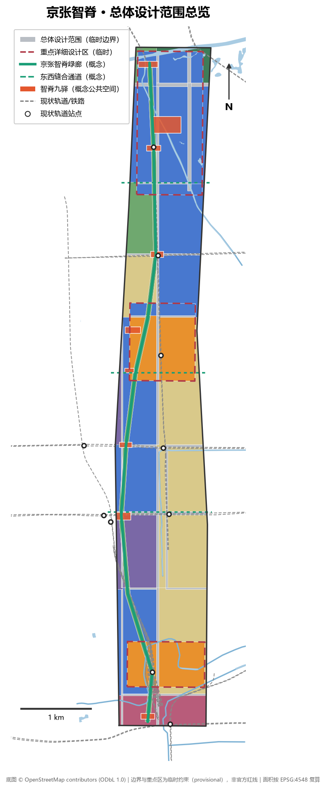
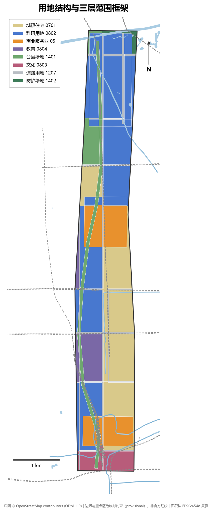
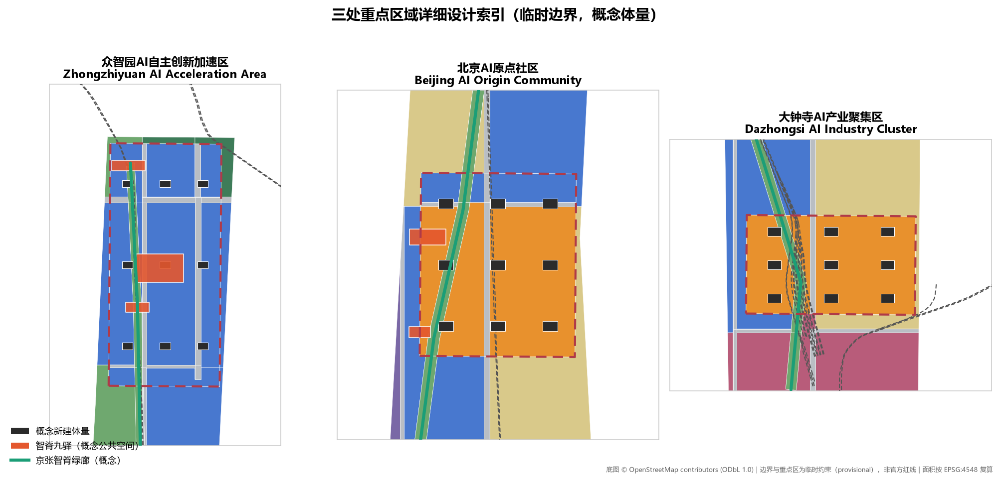
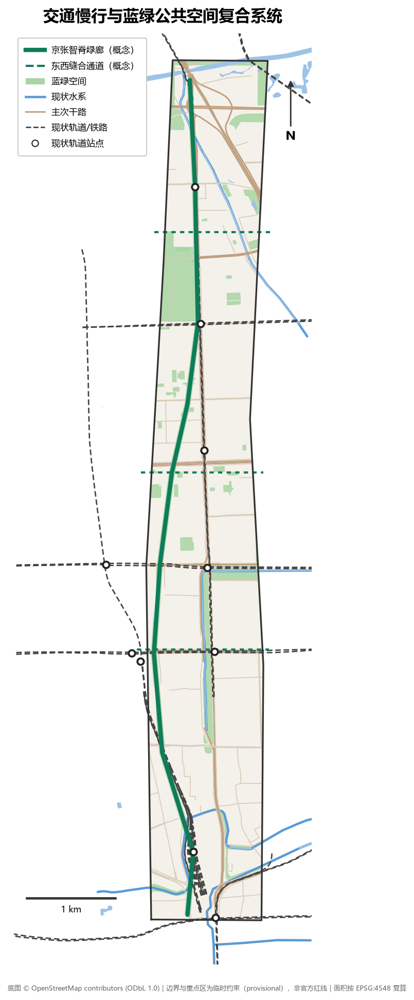
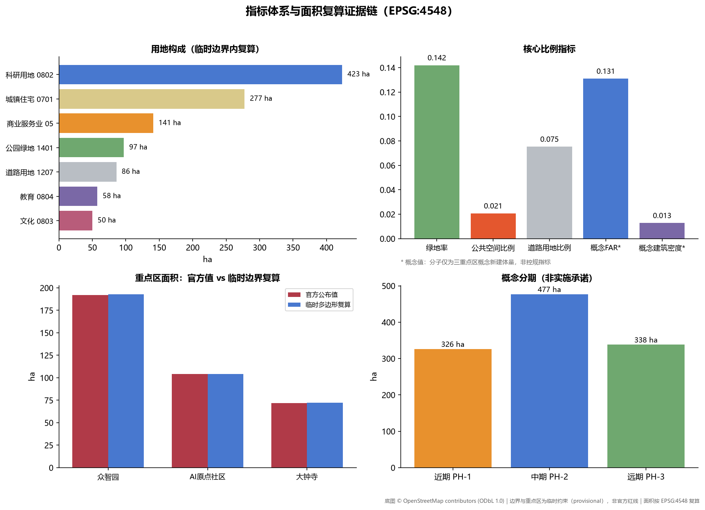

# 京张智脊 JingZhang AI Spine

## 设计依据与资料清单

本方案的全部事实性判断建立在仓库公开资料包与可复核的公开数据之上。主控依据是北京市规划和自然资源委员会海淀分局发布的资格预审公告，它确定了项目名称、三层范围、三处重点区、设计任务和成果深度语境 [source:OFFICIAL-ANNOUNCEMENT] [standard:PROJECT-OFFICIAL-ANNOUNCEMENT]。面向智能体的开源征集任务书提供了三大定位、五大功能、三区两翼、六项智能体任务、十条共创原则和统一边界条款，是本方案组织智能体成果的直接依据 [source:AGENT-TASKBOOK] [standard:PROJECT-AGENT-OPEN-CALL-TASKBOOK]。

用地分类遵循《国土空间调查、规划、用途管制用地用海分类指南》的项目子集代码，未自造分类 [standard:MNR-LAND-USE-CLASSIFICATION-GUIDE]。城市设计深度参照《城市设计管理办法》对总体城市设计与重点地区城市设计的要求 [standard:MOHURD-URBAN-DESIGN-MEASURES]；涉及用地、开发强度与实施管理的表述均区分已知控制条件、设计建议与待确认事项 [standard:MOHURD-CONTROL-DETAILED-PLANNING]。

空间底图分两层：三层范围与三处重点区使用仓库提供的临时粗略边界（provisional constraint），仅用于生成、展示与自检，不作为官方红线或精确面积依据 [source:BOUNDARY-SOURCE] [data:geometry/site_boundary.geojson#PROV-SITE-001]；现状道路、轨道、水系与既有公园来自 OpenStreetMap 众包数据（ODbL 1.0 署名），仅作现状底图与设计参照，不作为法定边界依据 [source:OSM-BASE-LAYERS]。

必须明示的资料缺口：官方精确 polygon、控规条件（容积率、建筑高度、建筑密度、绿地率、退线）、现状建筑底数、土地权属、文保范围 GIS 图层、市政与安全约束数据均未公开取得，本方案涉及这些内容时一律标注「待正式数据补齐」并以概念建议表述 [source:SITE-PACKAGE]。

## 三层范围工作框架

公告设定了三个空间层次，本方案按「战略研究—总体城市设计—重点片区详细设计」逐级落实 [source:OFFICIAL-ANNOUNCEMENT]。

统筹研究范围约 43.6 平方公里（北至北五环路、东至京藏高速、南至西直门外大街、西至万泉河路），承担产业战略与创新协同研究，本方案在其中识别「三区两翼」的产业协同回路，但不生成设计图层 [metric:key_area_count]。

总体设计范围约 11.4 平方公里，是本方案城市设计与全部几何图层的作用范围。当前使用临时边界（EPSG:4548 复算 11.41 平方公里），它与公告文字四至和约面积拟合，但不是官方红线：OSM 背景核对显示已测绘的京张铁路遗址公园段与临时边界最近距离约 412.5 米（Issue #846），说明真实廊道关系仍待官方 polygon 裁决 [data:geometry/site_boundary.geojson#PROV-SITE-001] [metric:site_area_sqm]。本方案所有面积指标均由临时边界内的设计几何在 EPSG:4548 下复算，官方边界发布后需按替换条件整体重算。

重点区域范围约 368.4 公顷，自北向南为众智园 AI 自主创新加速区（临时复算约 192.9 公顷）、北京 AI 原点社区（约 104.3 公顷）、大钟寺 AI 产业聚集区（约 72.0 公顷），三处临时 polygon 互不重叠且位于临时总体设计范围之内，达到规划综合实施方案的城市设计深度 [data:geometry/key_areas.geojson#PROV-KEY-001] [metric:key_area_zhongzhiyuan_sqm]。

## 统筹研究范围产业与未来城市研究

### 总体概念与命名

本方案提出「京张智脊」（JingZhang AI Spine）总体概念：以京张铁路百年廊道为空间与文化之脊，把目前被快速路、轨道和封闭大院切分的南北向走廊，重组为一条连续的「创新绿脊」，北起众智园、中贯 AI 原点社区、南落大钟寺并衔接西直门枢纽，形成「一线串三区、两翼齐赋能」的空间骨架 [depth:overall_spatial_structure] [data:geometry/roads.geojson#RD-SPA-001]。

命名体系采用「脊—节—坊」三级：一带总名「京张智脊」；三处重点区保留官方名称作为法定语境名称，并赋予空间子品牌「智源环廊」（众智园）、「原点里」（AI 原点社区）、「钟鸣坊」（大钟寺）；公共空间节点统称「智脊九驿」。Logo 方向（概念建议）：以 1909 年京张铁路「人」字形展线为原型，抽象为一条向上生长的折线，既是铁轨、也是神经网络的突触连接；主色建议「京张青」（取自蒸汽机车轮与铁轨的深青灰）与「原点橙」；字体建议使用开源可商用字体，不使用任何未经授权的商标、字体与人物标识。

### 三大定位、五大功能与协同回路

三大定位（百年京张文化带、都市 AI 生活体验带、AI 融合创新带）在空间上分别由文化叙事系统、场景化公共空间系统和产业空间供给系统承载 [source:AGENT-TASKBOOK]。五大功能与空间载体的对应关系为：AI 全栈自主创新体系落在众智园科研组团；世界级 AI 创新生态落在 AI 原点社区及其孵化网络；AI+场景赋能新范式落在智脊廊道与小月河场景赋能翼；智能化 AI 活力城市落在全域慢行与公共空间网络；AI 治理全球话语权落在众智园国家级平台与治理沙盒机制（概念建议）。

三区两翼协同回路：众智园输出全栈技术供给，AI 原点社区输出成果转化与人才，大钟寺输出场景消费与智能原生业态；中关村科技服务翼提供要素配置与资本赋能，小月河场景赋能翼提供场景测试与公共体验；智脊绿廊是三者之间人流、信息流与展示流的物理回路 [depth:three_level_scope_framework]。

### 全球 AI 创新生态案例（可转化经验）

1. **肯德尔广场（剑桥，美国）**：高校毗邻型创新区的标杆，经验是「校园—孵化—企业」步行尺度混合，可直接转化为 AI 原点社区的近校型街区设计。
2. **伦敦国王十字知识园区**：铁路遗产更新为创新区的范本，经验是遗产建筑活化与公共领域优先，对应京张遗址公园与清华园车站的叙事活化（概念建议）。
3. **巴黎 Station F**：单一巨构容纳完整创业生态，经验是「一栋建筑一条产业链」，可转化为大钟寺智能原生消费综合体的垂直功能组织。
4. **上海张江科学城**：国家级平台与产业集群耦合，经验是大科学装置周边的配套服务分级供给，对应众智园组团。
5. **深圳湾超级总部基地**：总部经济与滨海公共空间复合，经验是地标公共性优先于企业标识性，约束本方案朝圣地标的公共属性。
6. **多伦多 MaRS 创新区**：城市更新中的创新功能植入，经验是保留建筑改造为孵化器的低成本路径，对应本方案以保留提升为主的拆改留策略。

### 未来城市形态判断

AI 对城市空间的核心改变不是新建，而是「重混」：研发、居住、服务、展示的边界溶解，街区需要在时间上自适应。本方案把总体设计范围组织为「一脊三核两网」：智脊绿廊为脊，三处重点区为核，慢行网与场景服务网为网，使城市形态可按产业需求渐进调整 [depth:overall_spatial_structure]。

## 总体设计范围城市更新与控规深度城市设计

### 更新潜力与总体框架

总体设计范围是高度建成的走廊地带：现状以高校院所、成熟期产业楼宇、单位大院和老旧住区为主。在现状建筑普查数据缺失的条件下（待正式数据补齐），本方案按用地属性给出更新策略分区：科研与商业用地以功能置换和插建为主，现状住区以保留提升为主，绿廊沿线以公共空间织补为主 [data:geometry/land_use.geojson] [depth:land_use_layout]。

用地结构（临时边界内复算）：科研用地约 423.4 公顷（37.1%）、城镇住宅用地约 277.5 公顷（24.3%）、商业服务业用地约 141.1 公顷（12.4%）、公园绿地约 97.1 公顷（8.5%）、道路用地约 86.0 公顷（7.5%）、教育用地约 57.5 公顷（5.0%）、文化用地约 50.0 公顷（4.4%）、防护绿地约 8.8 公顷（0.8%）[metric:land_use_0802_research_sqm] [metric:land_use_0701_residential_sqm]。

### 创新指标体系（概念建议）

结合公告对 AI 创新指数、人才密度、产值规模的要求，建议设置四级指标：创新浓度（每公顷研发建筑面积、每平方公里高被引机构数——需官方统计支撑，暂缺）、空间供给（研发与孵化建筑面积、人才公寓套数——本方案给出概念规模）、生活品质（绿地率 14.2%、慢行绿道长度约 9.5 公里、轨道站点 500 米覆盖率——由本方案几何复算）、场景活力（开放场景数、年度活动场次——运营目标值）[metric:green_ratio] [metric:spine_greenway_length_m]。

### 建筑规模与更新路径

在控规条件缺失的情况下，本方案不提供开发强度结论，仅在三个重点区内给出概念性新建体量：27 栋概念建筑基底合计约 14.6 公顷、概念总建筑面积约 149 万平方米，该数字是设计体量上限的讨论起点，须以待补的控规容积率、限高与权属条件校正 [metric:total_floor_area_sqm_concept] [metric:building_footprint_area_sqm]。

### 京张遗址公园活力带策略

OSM 显示遗址公园已建成段位于临时边界西侧，本方案采用「借廊为脊、接口先行」策略：智脊绿廊沿 13 号线/昌平线走廊在临时边界内贯通南北；在大钟寺、五道口、双清路三处设置东西向缝合通道连接遗址公园（概念建议，不表达道路红线）；在五道口东侧设置清华园车站遗址接口节点，待官方边界明确后实现公园本体与智脊的实体衔接 [data:geometry/roads.geojson#RD-SPA-002] [data:geometry/public_space.geojson#PS-005]。

### 城市风貌

风貌基调定为「铁轨记忆×代码肌理」：保留廊道的工业遗存意象，新建体量以中等高度、细密网格、可开启首层为主；临绿廊建筑控制退界与骑楼界面（概念控制建议，非审定指标）；屋顶考虑光伏与设备一体化 [standard:MOHURD-URBAN-DESIGN-MEASURES]。

## 重点区域详细设计

### 众智园 AI 自主创新加速区（约 192.9 公顷，临时复算）

定位为花园型人工智能创新街区，承载 AI 全栈自主创新体系与治理话语权功能 [data:geometry/key_areas.geojson#PROV-KEY-001]。空间结构为「一园九筑」：中央创新公园（约 9 公顷概念公共空间）为绿心，周边布置 AI 全栈研发楼、国家级平台实验楼、加速器组团与创新服务综合体共 9 栋概念体量 [data:geometry/public_space.geojson#PS-008] [data:geometry/buildings.geojson#BLD-K1-01]。对外交通依托学知园站（昌平线）与北五环/G6，建议结合五环路区域一体化规划研究辅路系统优化（概念建议）；区内一体化设计建筑、绿地与小月河水系上段，挖掘清河文化，营造低碳创新交往环境。AI 朝圣地标「智源环廊」落位中央创新公园——一个环形的开源贡献者荣誉展示廊，镌刻全球开源里程碑事件（内容须取得相应授权）。

### 北京 AI 原点社区（约 104.3 公顷，临时复算）

定位为近校型人工智能创新街区，承载世界级 AI 创新生态功能 [data:geometry/key_areas.geojson#PROV-KEY-002]。空间组织围绕五道口东站区展开：成果孵化楼与高校联合研发楼贴近校园东缘，人才公寓（概念 16 层体量）布置于北侧，五道口混合功能体衔接站点商业界面 [data:geometry/buildings.geojson#BLD-K2-01]。更新模式强调低扰动、有机更新：以功能置换为主，不大拆大建。慢行上强化校园—园区—站点三角联系，回应五道口、清华东路西口站点一体化（站点本体位于临时边界西侧，为接口式设计） [data:geometry/public_space.geojson#PS-004]。AI 朝圣地标「源点钟塔」落位五道口东青年创新广场：以京张铁路站钟为原型的数字钟楼，实时可视化全球 AI 开源脉搏（如开源提交流），钟体不使用任何企业标识。

### 大钟寺 AI 产业聚集区（约 72.0 公顷，临时复算）

定位为城市型人工智能创新街区，承载智能原生新业态功能 [data:geometry/key_areas.geojson#PROV-KEY-003]。核心动作是回应公告提出的大钟寺站四象限步行连通：以站前步行环（概念建议）缝合被北三环与大钟寺东路切割的四个象限，组织智能原生消费综合体、领军企业总部办公、大钟寺文化展示馆与 AI 体验商业的概念体量 [data:geometry/public_space.geojson#PS-002] [data:geometry/buildings.geojson#BLD-K3-01]。规划绿地复合利用设计为「AI 体验花园」，提供机器人服务、AR 导览等可体验场景；静态交通方面完善非机动车停放组织（概念建议）。古钟文化与大钟寺寺庙的历史意象用于场所叙事，不涉及任何宗教空间改动。

## AI 创新生态、人才画像与 AI+ 场景

### 用户画像（五类）

1. **AI 研究员/工程师**（25-40 岁）：需要步行可达的实验室、深夜食堂、技术社交场域；对应智脊驿站与研发组团首层混合界面。
2. **创业者/独立开发者**：需要低成本办公、路演曝光、政策与算力对接；对应加速器组团与企业服务 Copilot 场景。
3. **高校学生与访问学者**：需要跨校区慢行、开放工位、国际社区服务；对应 AI 原点社区与校园接口节点。
4. **在地居民（含老旧住区）**：需要不被挤出的日常服务、绿地与就业机会；对应保留提升住区与社区服务设施。
5. **国际访客/朝圣者**：需要可阅读的 AI 城市叙事与地标体验；对应朝圣地标与 AI 导览场景。

### AI 场景卡（10 张，含 3 张产业测试验证场景）

| # | 场景 | 落位 | 类型 | 数据来源 | 隐私与人工复核 | 运营主体（概念） |
| --- | --- | --- | --- | --- | --- | --- |
| S1 | AI+交通慢行评估 | 智脊绿道全线 | 体验场景 | 公开客流与慢行计数 | 匿名化聚合，季度人工复核 | 属地街道+平台方 |
| S2 | 企业服务 Copilot | 三区企业服务点 | 服务场景 | 公开政策库+企业自主申报 | 企业授权数据隔离 | 园区运营方 |
| S3 | 公共安全与活动运营复核 | 大型活动节点 | 治理场景 | 活动报备+公开视频结构化 | 人脸识别禁用，人工复核闭环 | 属地管理部门 |
| S4 | AI 导览与京张文化叙事 | 遗址公园接口与地标 | 文化场景 | 清权史料+开源模型 | 内容人工审校 | 文化运营方 |
| S5 | 机器人低速配送 | 智脊绿道指定段 | **测试验证场景** | 封闭测试规程 | 安全员随车，测试区公示 | 测试联盟（概念） |
| S6 | AI+医疗健康服务导航 | 社区服务中心 | 服务场景 | 公开医疗机构信息 | 不做诊断，仅导航 | 社区卫生体系 |
| S7 | 建筑能耗优化沙盒 | 众智园实验楼 | **测试验证场景** | 楼宇自控数据（业主授权） | 数据不出楼宇，人工确认执行 | 楼宇业主+技术方 |
| S8 | 轨道站客流仿真推演 | 大钟寺站四象限 | **测试验证场景** | 公开客流统计数据 | 个体轨迹不采集 | 轨道运营研究方 |
| S9 | 开源社区活动智能匹配 | 原点里创新街区 | 服务场景 | 公开活动信息+自愿报名 | 报名信息最小化 | 开发者社区 |
| S10 | 绿道无感停车与非机动车诱导 | 三处轨道站节点 | 体验场景 | 路侧公开泊位数据 | 车牌脱敏 | 静态交通运营方 |

场景—空间—运营映射：S1/S5/S10 依托慢行绿道图层，S2/S9 依托研发与混合功能组团，S3/S8 依托公共交通节点，S4 依托文化用地与地标，S6 依托保留住区服务设施，S7 依托实验楼宇。所有场景均为概念建议，测试场景须依现行法规取得许可后方可运行 [source:AGENT-TASKBOOK]。

## 用地、建筑规模与拆改留方案

用地布局以「科研为体、商业为点、居住为底、绿廊为脉」组织，各地类面积均由临时边界内的设计剖分复算（见指标体系章） [data:geometry/land_use.geojson] [depth:land_use_layout]。产业功能比例建议（概念值）：科研与研发服务用地占主导地位（37.1%），商业服务业聚焦大钟寺与五道口两个轨道节点（12.4%），体现产业廊道属性。

拆改留策略在现状建筑底数缺失下只能给出分类逻辑而非地块结论：保留——现状住区、高校与质量较好的产业楼宇，占绝大多数；改造——廊道沿线低效厂房、批发市场类低效空间，功能置换为孵化与展示；新建——集中于三处重点区的 27 栋概念体量 [data:geometry/buildings.geojson] [depth:retain_renovate_demolish]。建筑高度建议以中高层为上限控制意向，重点区地标体量可作高点，但所有高度、容积率、退线均为待控规确认事项，本方案不给出法定结论 [standard:MOHURD-CONTROL-DETAILED-PLANNING]。

空间供给运营策略：研发空间采用「整栋+分层+工位」三级供给；人才公寓以租赁为主；首层界面在绿廊沿线要求公共开放（概念控制建议）。

## 交通、轨道、市政与公共服务设施

轨道是本走廊的最大资产：临时边界内有西直门、北京北、蓟门桥、西土城、学院桥、六道口、学知园 7 座现状站点，紧邻边界西侧还有五道口、知春路、大钟寺、清华东路西口等站点 [metric:transit_station_count_in_site] [data:geometry/constraints.geojson]。策略是「轨道为骨、慢行为脉」：站点 500 米服务域组织一体化功能；智脊绿道（约 9.5 公里）全线步骑贯通，三处东西缝合通道修复被轨道与快速路切断的东西联系 [data:geometry/roads.geojson#RD-SPA-001]。

道路微循环：在不改动现状主次干路的前提下，建议打通大院与住区间的支路断点（概念建议，具体线位待道路交通专项研究）；大钟寺路口四象限步行连通为近期重点项目 [data:geometry/public_space.geojson#PS-002]。停车与非机动车：轨道站点周边设置非机动车立体停放与共享车辆调度点，结合 S10 场景运营。

市政与新型基础设施融合：建议沿智脊绿道预留综合设备带，容纳感知杆件、边缘算力微节点与分布式能源接口（概念建议，负荷与容量须专业测算，本方案不作工程结论）；人才生活服务设施按 15 分钟生活圈核对缺口（现状设施底数待补齐） [depth:municipal_new_infrastructure]。

## 蓝绿空间、公共空间与城市风貌

蓝绿骨架由「一脊两河多点」构成：智脊线性公园（约 66.8 公顷概念绿廊）为脊；小月河纵贯走廊东部、清河横亘北端，构成滨水界面；元大都城垣遗址公园、八家郊野公园、东升清河培黎公园等既有公园（OSM 底图）在边界内外形成绿网 [data:geometry/green_space.geojson] [metric:green_ratio]。绿地率复算值 14.2%（含既有公园在边界内的部分），加上绿廊建设与滨水空间织补后仍有提升空间，但官方绿地率控制指标待正式数据补齐。

公共空间系统为「智脊九驿」：西直门南门户广场、大钟寺四象限步行环、知春路 AI 生活实验街、五道口东青年创新广场、清华园车站遗址接口、六道口科学客厅、学知园产城融合节点、众智园中央创新公园、清河滨水创新客厅，合计约 23.6 公顷 [data:geometry/public_space.geojson] [metric:public_space_ratio]。

三处 AI 朝圣地标（均为概念建议，公共属性优先、禁止企业冠名）：**源点钟塔**（五道口）、**智源环廊**（众智园）、**京张记忆序厅**（西直门南门户文化用地，以 1909 年通车史料与 AI 年代学并置的露天展廊） [data:geometry/land_use.geojson#LU-014]。荣誉展示体系以「开源贡献铭刻计划」整合三处地标，铭刻内容须经著作权清查。城市风貌延续「铁轨记忆×代码肌理」基调，导视系统以铁轨铆接构件为母题，与一带 Logo 系统保持「同源不同形」的关系 [standard:MOHURD-URBAN-DESIGN-MEASURES]。

## 更新项目清单、实施政策与分期计划

分期采用「南段成熟先行、北段空间后发」（概念分期，非实施承诺） [data:geometry/phasing.geojson] [depth:phasing_implementation]：

- **近期 PH-1（大钟寺—西直门段，约 326.2 公顷）**：大钟寺站四象限步行环、京张记忆序厅、智脊绿道南段贯通、知春路 AI 生活实验街 [metric:phasing_area_ph1_sqm]。
- **中期 PH-2（五道口—AI 原点社区段，约 476.9 公顷）**：原点里创新街区更新、五道口东广场与源点钟塔、绿道中段贯通、两处缝合通道 [metric:phasing_area_ph2_sqm]。
- **远期 PH-3（众智园—清河段，约 338.1 公顷）**：众智园中央创新公园与智源环廊、规模化研发组团、清河滨水客厅 [metric:phasing_area_ph3_sqm]。

实施政策建议（概念建议，供专业团队深化）：建立「廊道更新统筹主体」协调多权属更新；以公共空间先导换取更新共识；测试场景采用「沙盒许可+年度评估」机制；公众参与按城市设计公示要求嵌入各阶段 [standard:MOHURD-URBAN-DESIGN-MEASURES]。

长期运营与活动体系（概念建议）：年度活动以「京张 AI 开放周」为旗舰，叠加开发者马拉松、遗址公园夜游季、高校开源日四级活动；开发者社区采用「场地换贡献」机制，社区成员以开源贡献兑换创新街区服务权益；场景开放运营由「场景池+测试联盟」双轨运行；国际传播依托地标叙事与英文内容矩阵，所有活动安排均为设想，不构成政府确定安排 [source:AGENT-TASKBOOK]。

## 指标体系、面积复算与合规矩阵

本方案全部核心指标可由提交几何在 EPSG:4548 下复算，指标、公式与假设完整登记于 metrics.json [metric:site_area_sqm] [depth:metrics_recalculation]：

| 指标 | 数值 | 说明 |
| --- | --- | --- |
| 总体设计范围面积 | 11,412,825 sqm | 临时边界复算，官方值约 11.4 km² |
| 绿地面积 / 绿地率 | 1,620,288 sqm / 14.2% | 含 OSM 既有公园边界内部分 |
| 公共空间面积 / 比例 | 236,266 sqm / 2.1% | 智脊九驿概念节点 |
| 道路用地面积 / 比例 | 859,556 sqm / 7.5% | 主次干路假定断面，不含支路 |
| 概念新建总建筑面积 | 1,490,400 sqm | 仅三重点区概念体量，非控规结论 |
| 智脊绿道长度 | 9,539 m | 步骑复合绿道中线 |
| 重点区数量 / 面积 | 3 处 / 369.3 ha | 官方合计 368.4 ha，偏差 +0.24% |
| 范围内现状轨道站点 | 7 座 | OSM 底图 |

指标的设计含义：绿地率 14.2% 支撑「花园型街区」目标但低于国际创新区标杆，说明绿廊建设是更新重点；公共空间 2.1% 集中于九个高可达节点，服务创新交往；概念 FAR 0.13 仅反映重点区新增体量与全场地的比值，真实开发强度须待控规条件 [metric:green_ratio] [metric:floor_area_ratio_concept]。

合规与深度覆盖：公告 1.3/1.4/1.5 全部 17 项任务与智能体任务书 6 项任务在 compliance_matrix.json 中逐项登记；5 部强制专业标准在 standard_matrix.json 中逐条响应；15 项设计深度项在 design_depth_matrix.json 中全部标记 complete 并附证据链 [depth:three_key_area_detailed_design]。

## 风险、版权与合规说明

资料合法性：官方公告与国家标准来自政府公开页面；智能体任务书为用户提供清权摘录；底图使用 OSM（ODbL 1.0，已在图层署名）；未使用任何非公开、未清权或不可再分发材料 [source:SOURCE-REGISTRY]。

主要风险：临时边界与真实范围的偏差（遗址公园段约 412.5 米错位，Issue #846）意味着廊道衔接段落的落地性需官方 polygon 裁决；控规条件、现状建筑、权属、文保范围缺失使开发强度与拆改留只能停留在分类逻辑；OSM 众包数据存在现势性与精度局限；概念场景涉及测试验证的，须依现行法规另行许可。

合规声明：本方案所有空间落地建议均为概念建议、参考方案或可供专业团队深化研究的素材，不替代正式规划，不构成政府审定结论，不涉及控规调整、具体拆改留、工程可行性、投资承诺等禁止事项；AI 生成内容已经人工可读性整理，版权与再分发条件见 report/copyright_statement.md [source:AGENT-TASKBOOK]。

## 参考资料

以下材料是真正影响方案判断的主要来源，完整机器索引以 sources.json 为准 [source:OFFICIAL-ANNOUNCEMENT] [source:OSM-BASE-LAYERS]。

1. 北京市规划和自然资源委员会海淀分局：《百年京张AI创新带城市设计国际方案征集资格预审公告》，2026-05-09。
2. 《面向全球智能体开展百年京张AI创新带城市设计开源征集任务书摘录》（用户提供清权文件），2026-05-18。
3. 北京市科学技术委员会、中关村科技园区管理委员会：《「三区两翼」打造世界级AI集聚地》，2026-04-03。
4. 北京市海淀区人民政府：《海淀区发布「1+X+1」现代化产业体系建设布局》，2026-03-02。
5. 住房和城乡建设部：《城市设计管理办法》（部令第35号），2017。
6. 住房和城乡建设部：《城市、镇控制性详细规划编制审批办法》（部令第7号），2010。
7. 自然资源部：《国土空间调查、规划、用途管制用地用海分类指南》（自然资发〔2023〕234号），2023。
8. OpenStreetMap contributors, 道路/轨道/水系/公园底图数据（ODbL 1.0），2026-08 检索。
9. 仓库维护者：《临时边界推定与公开来源核查》，2026-08-07。
