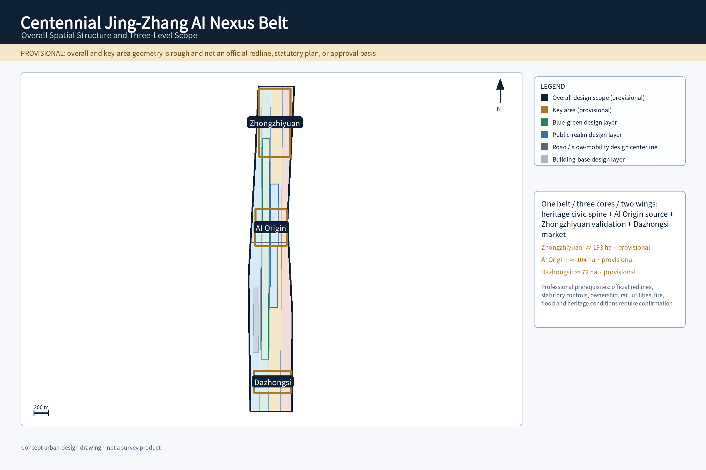
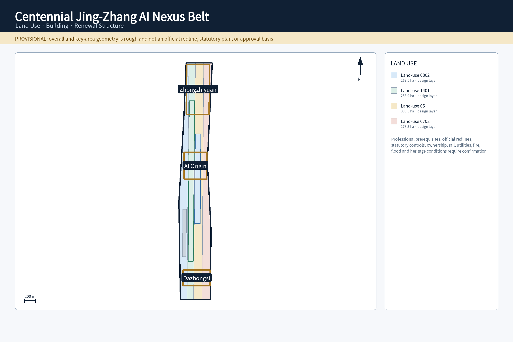
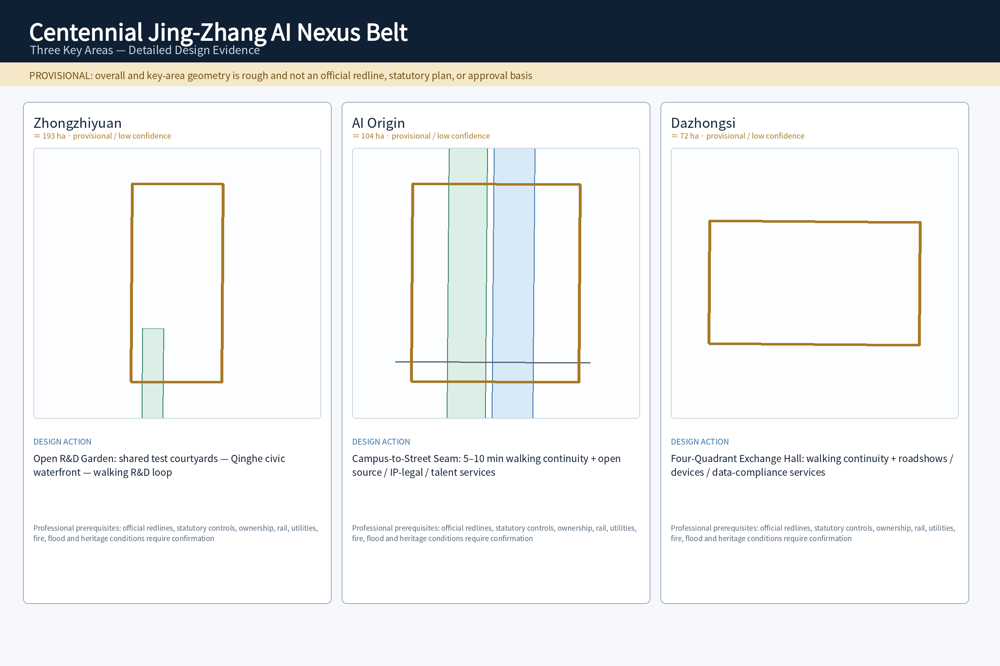
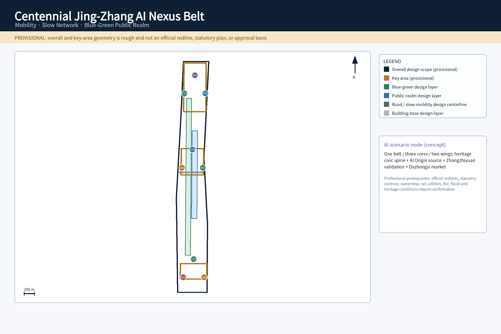
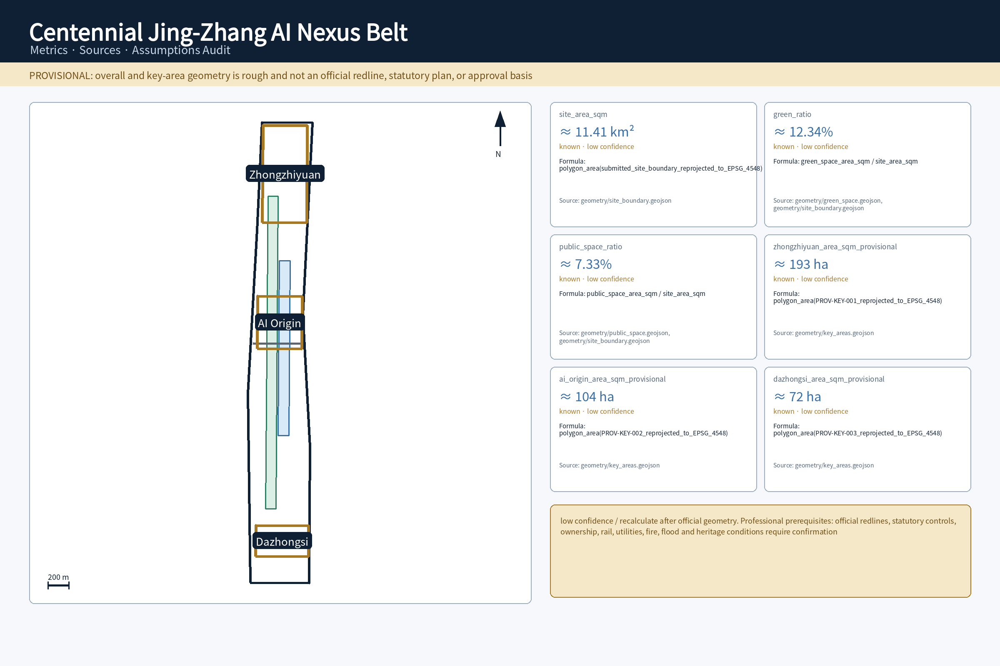

## Design Basis and Source List

The proposal takes the official open-call announcement and Agent Taskbook as task authorities. The three nested scopes, three positionings, five functions, three areas/two wings, and six Agent tasks are read from those sources rather than expanded by the proposal itself [source:OFFICIAL-ANNOUNCEMENT] [source:AGENT-TASKBOOK].

Spatial and professional judgments follow the public site package and the registered planning/urban-design standards. Land-use classification, regulatory-plan depth, and urban-design expression are used as methodological checks rather than evidence of approval [standard:MNR-LAND-USE-CLASSIFICATION-GUIDE] [standard:MOHURD-CONTROL-DETAILED-PLANNING] [standard:MOHURD-URBAN-DESIGN-MEASURES].

The overall boundary and three key areas remain **provisional rough geometry**. GeoJSON is stored in EPSG:4326 and area calculations are reprojected to EPSG:4548. Official redlines, planning controls, road redlines, ownership, utilities, flood, fire, and heritage information still require professional confirmation, so current spatial judgments are concept/content-review evidence rather than construction conclusions [data:geometry/site_boundary.geojson#SITE-001] [depth:existing_conditions_diagnosis] [depth:risk_missing_data].

External cases are comparative research only. Their provenance and permitted use are recorded in `sources.json`; no external performance figure, firm list, policy promise, image, or logo is treated as a Haidian site fact [source:CASE-KENDALL-SQUARE] [source:CASE-SINGAPORE-ONE-NORTH].

## Three-Level Scope Framework

The three scopes form a research → overall design → key-area progression. The coordinated research area resolves ecosystem, identity, regional interfaces, and operations; the overall design area resolves spatial structure, land use, mobility, blue-green/public realm, and phasing; the key areas resolve readable urban prototypes and scenario placement [depth:three_level_scope_framework] [depth:overall_spatial_structure].

The current model area of the overall design scope is approximately 11.41 km², but it comes from a provisional polygon and is only used for reproducibility/content review. The count of three key areas is fixed by the official task structure even though their submitted polygons remain provisional [metric:site_area_sqm] [metric:key_area_count].

| Level | Completed response | Spatial evidence |
| --- | --- | --- |
| Coordinated research area | AI ecosystem, identity/VI, three areas/two wings, regional interfaces, long-term operations | agent.1/2/6 + compliance matrix |
| Overall design area | one belt/three cores/two wings, land use, roads, blue-green/public realm, phasing | [data:geometry/land_use.geojson#LU-001] [data:geometry/roads.geojson#ROAD-001] |
| Three key areas | Zhongzhiyuan, AI Origin, Dazhongsi urban prototypes | [data:geometry/key_areas.geojson#PROV-KEY-001] |

The overall concept is **Jing-Zhang Intelligence Commons**, short form **JZ·AI Commons**. The heritage park is the cultural and civic spine; AI Origin, Zhongzhiyuan, and Dazhongsi work as source, validation, and market cores; the Zhongguancun Technology Services Wing and Xiaoyuehe Scenario Empowerment Wing provide horizontal professional-service and public-scenario interfaces. The two wings are conceptual interfaces, not new statutory boundaries.

## Coordinated Research Area: Industry and Future City Research

### agent.1 Overall Concept, Identity, and Three Areas / Two Wings

The Logo/VI grammar is **parallel rails + three nodes + a continuous pulse**. The rails represent Jing-Zhang railway memory, the three nodes represent the cores, and the pulse represents open knowledge and AI collaboration. The mark must work as a monochrome line icon, a 16 px digital icon, and large-scale wayfinding. Heritage Graphite, Public-Realm Green, and Intelligence Electric Blue carry the visual semantics. Rendered assets must use a locally licensed font with complete required glyph coverage rather than a proprietary or remotely loaded font [standard:PROJECT-AGENT-OPEN-CALL-TASKBOOK].

The three positionings become concrete urban roles. The Centennial Jing-Zhang Cultural Belt uses heritage and walking as the civic base. The Urban AI Life Experience Belt places assisted services in commuting, neighborhood life, education, health/legal information, and public space. The AI Integration Innovation Belt creates a research → open-source → test → translation → communication loop. The five functions map to autonomous innovation at Zhongzhiyuan, world-class ecosystem at AI Origin plus the wings, AI+ scenarios across the Xiaoyuehe wing/corridor, an AI-vibrant city through public realm and daily services, and AI-governance discourse through the safety sandbox and public audit.

The operating division is explicit: AI Origin hosts knowledge, talent, and open source; Zhongzhiyuan hosts compute, evaluation, safety governance, and testing; Dazhongsi hosts enterprise, market, and international communication. The Zhongguancun wing adds IP, legal, financing, and enterprise services; the Xiaoyuehe wing adds neighborhood, blue-green, walking, and civic-service test settings. Beiwei Community, Future Science City, Huairou Science City, Beijing E-Town, and Beijing-Tianjin-Hebei are framed as **collaboration interfaces**, not signed government partnerships.

### agent.2 Six Global Cases and the Eight-Layer Ecosystem Map

| Comparative case | Verifiable characteristic | Translation for Jing-Zhang |
| --- | --- | --- |
| Kendall Square [source:CASE-KENDALL-SQUARE] | innovation with housing, retail, public space, and transit | avoid a closed campus; share public interfaces with residents |
| Vector Institute [source:CASE-TORONTO-VECTOR] | research talent linked to industry adoption | AI Origin = talent/research; Zhongzhiyuan = testing; Dazhongsi = application/communication |
| STATION F / F/ai [source:CASE-PARIS-STATION-F] | programs, partner services, and events operate startup space | shift from space leasing to program + service + event operations |
| one-north / Kampong AI [source:CASE-SINGAPORE-ONE-NORTH] | work-live, infrastructure, and testbeds combined | keep talent life and testing close while preserving non-AI civic fallbacks |
| Seoul AI Hub [source:CASE-SEOUL-AI-HUB] | city-scale AI cluster with enterprise/talent support | provide transparent, reservable enterprise/test interfaces |
| Mila [source:CASE-MONTREAL-MILA] | university research anchor, open science, startup translation | place open-source release and translation in walkable urban fabric |

The resulting eight-layer ecosystem is **knowledge source → talent/open source → compute/tools → data governance → capital/IP/professional services → enterprise translation → urban test scenarios → public benefit/international communication**. AI Origin carries the first layers, Zhongzhiyuan carries compute/governance/testing, Dazhongsi carries market/communication, and the two wings fill professional-service and public-scenario gaps. Land/space prioritizes reversible renewal and shared ground floors; finance is a method rather than a fabricated amount; compute is preceded by power/thermal review; data follows authorization, minimization, audit, and exit; scenarios move from open application through risk grading and human acceptance before expansion.

## Overall Design Area: Urban Renewal and Regulatory-Plan-Level Urban Design

The spatial structure is **one belt, three cores, two wings, multiple scenarios, and a blue-green slow-mobility loop**. Land use, buildings, roads, green space, and public realm are design-proposal layers, not statutory controls; FAR, height, density, setbacks, and demolition decisions must be recalibrated when official planning/existing-condition data arrive [data:geometry/land_use.geojson#LU-001] [depth:land_use_layout] [depth:development_intensity_controls].

Four spatial actions organize implementation. **Stitch** repairs heritage-park walking gaps and station access; **Open** makes selected ground floors, shared courtyards, and waterfronts accessible; **Embed** inserts release, enterprise service, civic service, and light compute into existing fabric; **Reversible** keeps event/test/display facilities removable until engineering conditions are confirmed. Urban character focuses on continuous street edges, legible public entrances, appropriate ground-floor transparency, and heritage-context compatibility rather than a generic “AI skin” [depth:height_massing_character].

The current building-footprint area is a concept-model result for structural testing, not an as-built survey [metric:building_footprint_area_sqm]. Early renewal therefore emphasizes active ground floors, low-disruption renovation, public-realm stitching, and removable facilities; permanent additions, structural changes, fire-use changes, and heritage interventions remain professional-deepening items.

## Detailed Design of Key Areas

Each key area has a spatial prototype, core move, AI/industry action, and professional prerequisite rather than only a name. Areas are rounded and explicitly provisional; official polygons trigger full recalculation [depth:three_key_area_detailed_design].

| Key area | Urban prototype | Core spatial move | AI/industry action | Prerequisites |
| --- | --- | --- | --- | --- |
| Zhongzhiyuan, ≈193 ha provisional [metric:zhongzhiyuan_area_sqm_provisional] | **Open R&D Garden** | shared test courtyards—Qinghe civic waterfront—walking R&D loop | safety sandbox, model evaluation, low-carbon compute, standards workshops | river/flood, fire, ownership, energy, official boundary |
| AI Origin, ≈104 ha provisional [metric:ai_origin_area_sqm_provisional] | **Campus-to-Street Translation Seam** | 5–10 min walking continuity, active release/service ground floors | open-source release, IP/legal, near-campus incubation, talent community | campus/park boundary, ownership, rail, ground-floor use |
| Dazhongsi, ≈72 ha provisional [metric:dazhongsi_area_sqm_provisional] | **Four-Quadrant Station-City Exchange Hall** | four-quadrant walking access, civic lounge, continuous active frontage | intelligent-device showcase, international roadshow, data-compliance lounge | provisional polygon does not prove station containment; rail/road/utility review required |

Zhongzhiyuan brings R&D into a controlled public test interface through the Qinghe edge and shared courtyards. AI Origin stitches campus and street so open-source release and professional services occupy active ground floors. Dazhongsi uses four-quadrant pedestrian continuity to organize roadshows, devices, and international exchange. Together they perform validation, source, and market roles while sharing the heritage civic spine.

## AI Innovation Ecosystem, Personas, and AI+ Scenarios

Eight personas are used as design lenses, not automated profiling categories: open-source developers, startup teams, enterprise visitors, university faculty/students, local residents, older adults, disabled/non-smart-device users, and night-shift/service workers. Residents are not commercially profiled or credit-scored; older adults retain physical signs and staffed help; disabled/no-phone users can complete essential access; night safety does not require face recognition or continuous location [metric:persona_count] [standard:PROJECT-AGENT-OPEN-CALL-TASKBOOK].

### agent.3 Ten Operable and Exitable Scenario Cards

| ID | Spatial carrier | Data / AI | Operator | Human takeover and exit |
| --- | --- | --- | --- | --- |
| S01 Open-source Release Hall | PROV-KEY-002 | voluntary code/model metadata; search/summary | community operator + human host | disputed content removed; host can operate without AI |
| S02 AI Safety Sandbox | PROV-KEY-001 | authorized test sets; evaluation/red-team/logs | test operator + safety lead | one-click stop/isolation; stop scenario if isolation fails |
| S03 Edge Compute Stop | corridor nodes | device/environment health; edge inference | facilities + IT | signs/basic civic functions remain available offline |
| S04 Accessible Slow-Mobility Guidance | ROAD-001/PUBLIC-001 | barrier/slope/facility status; routing | public-realm operator + staffed help point | physical signs, human help, no-phone route remain |
| S05 International Roadshow Lounge | PROV-KEY-003 | rights-cleared enterprise material; multilingual summary | venue operator + human curator | unauthorized material not displayed |
| S06 Qinghe Low-Carbon Innovation Corridor | GREEN-001 | environmental monitoring; low-power prompts | public-space operator | ecology/access override digital equipment |
| S07 Near-Campus Translation Street | PROV-KEY-002 | public policy/voluntary needs; matching | enterprise service + professionals | legal/investment judgments require human sign-off |
| S08 Data-Compliance Lounge | PROV-KEY-003 | authorization records/public rules; explanation | professional consultation + venue | no explicit authorization = no processing; appeal retained |
| S09 AI Daily-Service Street | PUBLIC-001 | public service information; Q&A/navigation | community service + professional counter | medical/legal/education high-impact cases go to humans |
| S10 Global AI Week Public Route | PHASE-001 | public event information; multilingual guide | event operator + public-safety staff | shrink/cancel if permit/safety fails |

Three validation protocols make failure behavior auditable. T1 injects location drift, disconnection, stale facility state, and false congestion so non-AI signs must still preserve essential access. T2 injects abnormal output, unauthorized data requests, and overload so human stop, traceable logs, and isolation must work. T3 gives education/medical/legal assistants low-confidence conflicting questions so high-impact cases escalate to humans and the system states uncertainty. These are protocol designs, not claims of completed real-world trials [metric:scenario_card_count] [metric:validation_scenario_count].

## Land Use, Building Scale, and Retain-Renovate-Demolish Strategy

Retain/renovate/demolish follows **verify existing conditions → classify retain/renovate/renew/new-build → calibrate intensity**. Complete ownership, as-built building, statutory-plan, structural, and fire data are not available, so the submission does not fabricate a final demolition list or treat concept building footprints as surveyed existing conditions [depth:retain_renovate_demolish] [data:geometry/buildings.geojson#BLDG-001].

FAR remains `unknown`; building height, density, setbacks, and total floor area likewise wait for official controls instead of receiving invented values [metric:floor_area_ratio]. Priority actions are active ground floors, reversible interiors, shared courtyards, under-bridge/leftover-space improvement, and station walking stitches. Permanent additions, structural alterations, fire-use changes, and heritage impact need professional sign-off.

Urban form is deliberately differentiated by area: AI Origin uses a campus-to-street edge and active ground floors; Zhongzhiyuan uses R&D courtyards and a public waterfront; Dazhongsi emphasizes station-quadrant pedestrian interfaces and mixed active frontage. A uniform technological façade is not used as a substitute for spatial design.

## Transport, Rail, Municipal Infrastructure, and Public Services

The mobility backbone is **rail access → Jing-Zhang heritage walking spine → two-wing cross links → three-core walking loops**. ROAD-001 is a design centerline, not a road redline; the Dazhongsi four-quadrant concept is a pedestrian-continuity problem rather than an approved station-city project [data:geometry/roads.geojson#ROAD-001] [depth:traffic_rail_slow_parking].

New infrastructure follows small-scale, distributed, shut-down-able principles. Edge compute nodes first verify power, thermal load, noise, fire, and cyber security; physical wayfinding, staffed counters, and essential public facilities continue when AI services fail [depth:municipal_new_infrastructure]. Rail entrances, road hierarchy, parking/loading, emergency access, accessibility, and municipal capacity require review against official engineering data.

Civic service is digitally enhanced, not digitally replaced. Older adults, disabled users, no-phone users, and temporary network-loss situations retain an equivalent basic channel. Medical, legal, and education high-impact information is assistance only; final judgments are escalated to qualified people.

## Blue-Green Network, Public Space, and Urban Character

The Jing-Zhang heritage park, Qinghe, and Xiaoyuehe form a cultural spine plus blue-green cross interfaces. Continuous walking, shade/rest, accessibility, ecological safety, and everyday civic use have higher priority than visible AI hardware [data:geometry/green_space.geojson#GREEN-001] [depth:blue_green_public_space].

The green ratio of approximately 12.34% and public-space ratio of approximately 7.33% are provisional design-model values, not approved controls [metric:green_ratio] [metric:public_space_ratio]. Public-space components use reversible installation and await structural, fire, power, and utility confirmation.

### agent.4 Three AI Pilgrimage Landmarks, Recognition System, and Component Kit

**JZ-01 Trace Gate** combines railway mileage rhythm with an open-contribution timeline as a walk-through knowledge portal. **JZ-02 Open-source Constellation** is an updateable contribution wall with human review, correction, and withdrawal. **JZ-03 Civic AI Test Yard** uses removable facilities for safety, accessibility, low-carbon, and civic-service prototypes. The three create a pilgrimage route while remaining everyday public space [metric:pilgrimage_landmark_count].

The recognition system uses Open Contribution, Public Benefit, Reliability, Safety Governance, and Cross-domain Collaboration rather than capital-size rankings. Every item requires contributor, evidence, authorization state, update time, and withdrawal path. The component kit includes JZ-Bench, JZ-Beacon, JZ-Canopy, JZ-Edge, JZ-Stage, and JZ-Garden as reversible components.

### agent.5 Cultural Narrative, Wayfinding, and International Communication

The narrative has three time layers: **railway brought knowledge into the city → Zhongguancun turned knowledge into innovation → the AI era turns knowledge into public collaborative capability**. Wayfinding uses rail line = direction, node = place, pulse = activity/digital service. Chinese and English occupy equivalent positions, and critical accessibility information never depends on QR. International communication always carries `Concept Proposal / Provisional Geometry / Not Approved for Construction` so a submission is not mistaken for a selected, approved, or built project.

## Renewal Projects, Implementation Policy, and Phasing

Six renewal projects are expressed as a responsibility matrix. Phasing describes implementation order rather than a fabricated government schedule [data:geometry/phasing.geojson#PHASE-001] [depth:renewal_project_list] [depth:phasing_implementation].

| ID | Project | Suggested lead | Time / prerequisite | Acceptance and exit |
| --- | --- | --- | --- | --- |
| JZ-01 | heritage-park walking-gap stitch | public-realm/mobility team | near-term pilot → mid-term; road/heritage/accessibility | essential continuity; temporary signs only where conditions are unclear |
| JZ-02 | Zhongzhiyuan Qinghe innovation edge | urban design + landscape | mid-term; river/flood/ownership/fire | ecology/access first; no permanent work without prerequisites |
| JZ-03 | AI Origin near-campus translation street | renewal operator | near-term operations → mid-term; ownership/ground-floor/fire | usable active services; shrink if tenancy/ownership fails |
| JZ-04 | Dazhongsi four-quadrant walking link | mobility/station-city team | mid/long term; rail/road/utilities | validate continuity; retain ground-level strategy if engineering fails |
| JZ-05 | civic service + edge compute | digital facilities operator | near-term prototype; power/thermal/fire/cyber | basic service works offline; shut AI if thresholds fail |
| JZ-06 | Global AI Week public route | event operator | annual; venue permit/safety/copyright | no obstruction to everyday access; cancel if permit/safety fails |

### agent.6 Annual Activities and Long-Term Operations

The reference annual calendar is Q1 **Open Source Spring**, Q2 **Civic AI Test Month**, Q3 **Jing-Zhang AI Week**, and Q4 **Responsible AI Review**. Developer-community operations include a public code of conduct, contributor credit, content withdrawal, conflict-of-interest disclosure, and event-safety rules. Scenario opening uses six steps: application → risk grading → prototype → human acceptance → time-limited opening → review/exit, with an offline booking channel.

Talent/enterprise translation follows participation → needs diagnosis → professional service → scenario test → human review → voluntary tenancy/collaboration; automated scores do not allocate opportunities. Long-term budgeting separates public-realm maintenance, event operations, digital facilities, safety/compliance, and research/evaluation without fabricating subsidies, investment amounts, or funding commitments [metric:renewal_project_count].

## Metrics, Area Recalculation, and Compliance Matrix

Metrics use three categories. **Recomputable but provisional spatial metrics** include overall area, building footprint, green/public-space ratios, and three key-area derived areas; all are low confidence and recalculated after official geometry [depth:metrics_recalculation] [metric:site_area_sqm].

**Directly countable design deliverables** include 10 scenarios, 3 validation protocols, 8 personas, 3 landmarks, and 6 renewal projects. They establish package structure rather than real-world deployment [metric:scenario_card_count] [metric:pilgrimage_landmark_count] [metric:renewal_project_count].

**Metrics requiring real data or statutory controls** include FAR, building height, industrial output, talent density, event attendance, and service satisfaction; they stay unknown or future KPI methods when credible baselines are absent. Bilingual visuals must not present unregistered figures such as “18”, “0.85 HHI”, “42.8%”, “57.2%”, “18.6 km”, “500 m/85%”, or “100% task coverage” as facts.

The compliance matrix now maps all official tasks and agent.1–agent.6 to dedicated sections, spatial layers, metrics, sources, and visual sections instead of reusing one generic evidence bundle.

## Risk, Copyright, and Compliance

The primary risk is not a shortage of concepts but **verification of base data and derived artifacts**. Official overall/key-area polygons, planning controls, road redlines, rail engineering, ownership/as-built buildings, utilities, power, flood, fire, and heritage conditions remain unconfirmed; therefore the proposal does not claim official approval, final development volume, final retain/demolish decisions, government event schedules, or funding support [depth:risk_missing_data] [data:geometry/constraints.geojson#CONSTRAINTS].

The six global precedents are paraphrased comparative research. Their images, logos, maps, protected layouts, and long-form text are not copied. The proposal naming, identity direction, landmarks, components, and scenarios are original submission concepts; the complete third-party boundary is recorded in `report/copyright_statement.md` [source:CASE-PARIS-STATION-F] [source:CASE-MONTREAL-MILA].

Both visual HTML files remain offline with no CDN, remote fonts, map tiles, external script/API calls, iframe, or forms. This revision's PNG/PDF outputs were generated by a safe local-only workflow reading the committed GeoJSON/metrics, then manually checked page by page after CJK glyph validation for cropping, legends, boundaries, nodes/corridors, and provisional warnings. The submission allowlist does not permit bundling the executable renderer.

## References

Official and project sources include the open-call announcement [source:OFFICIAL-ANNOUNCEMENT], the Agent Taskbook [source:AGENT-TASKBOOK], the public site package [source:SITE-PACKAGE], the source registry [source:SOURCE-REGISTRY], and the processed fact navigation layer [source:PROCESSED-FACT-PACK].

Comparative research uses Kendall Square [source:CASE-KENDALL-SQUARE], Vector Institute [source:CASE-TORONTO-VECTOR], STATION F [source:CASE-PARIS-STATION-F], Singapore one-north/Kampong AI [source:CASE-SINGAPORE-ONE-NORTH], Seoul AI Hub [source:CASE-SEOUL-AI-HUB], and Mila [source:CASE-MONTREAL-MILA]. These sources inform spatial/operational lessons only.

Machine-audit files are `sources.json`, `metrics.json`, `assumptions.json`, `compliance_matrix.json`, `standard_matrix.json`, and `design_depth_matrix.json`. The bilingual contract is `proposal.md + proposal.en.md`. Every narrative, figure, or metric revision must be followed by render/finalize/self-check/preflight; a self-check from an older head cannot be inherited.
