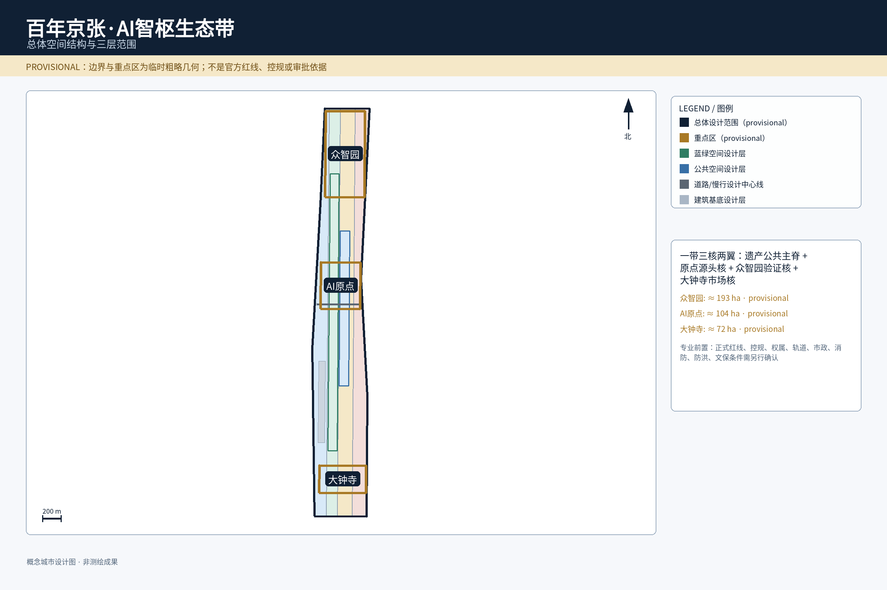
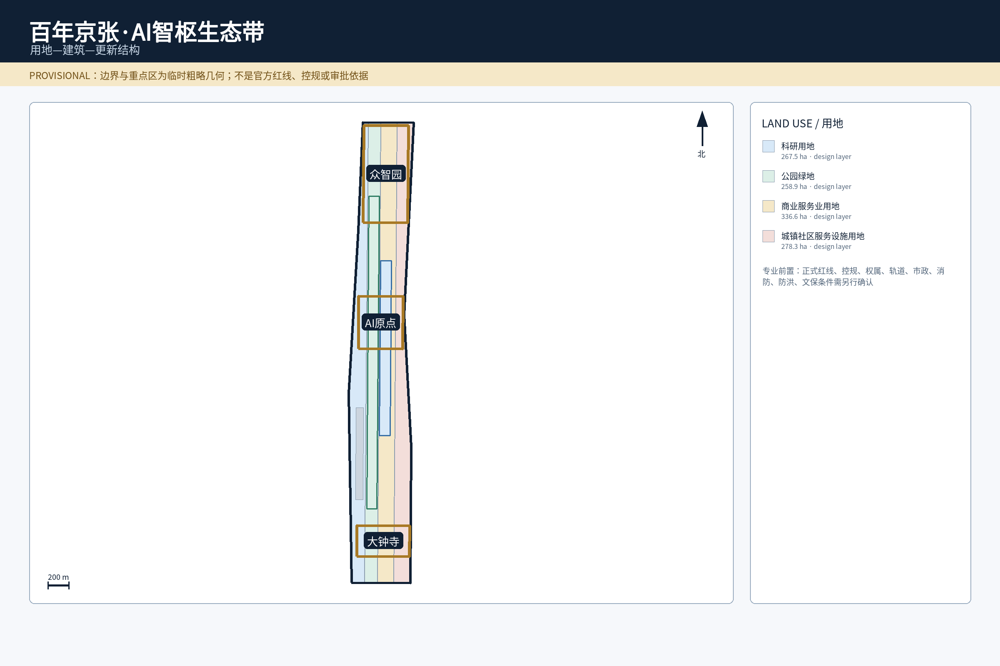
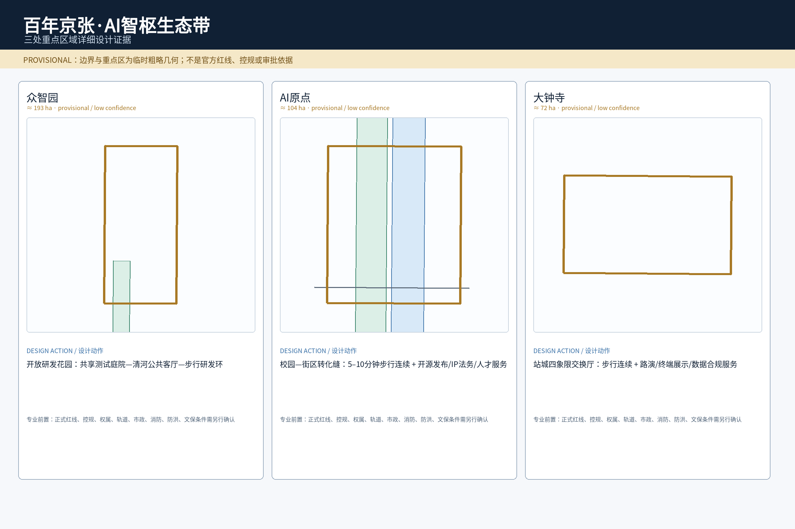
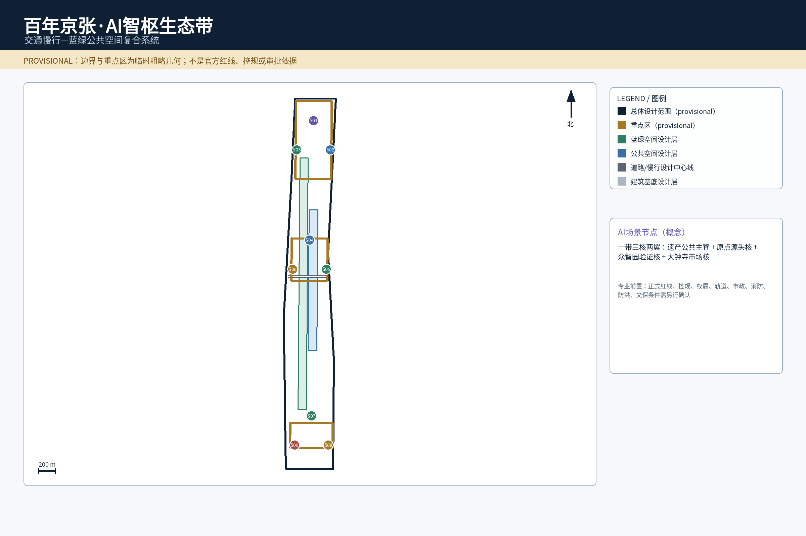
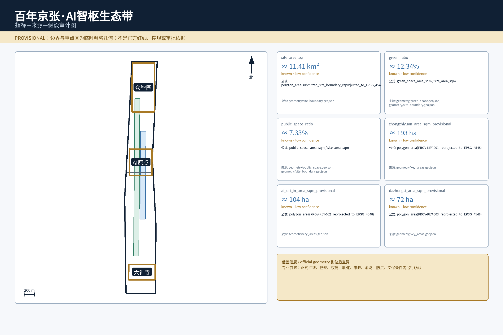

## 设计依据与资料清单

本方案以官方征集公告与面向智能体任务书作为任务依据，三层范围、三大定位、五大功能、三区两翼和六项 Agent 任务均从这两份来源读取，而不是由方案自行扩张任务边界 [source:OFFICIAL-ANNOUNCEMENT] [source:AGENT-TASKBOOK]。

空间与专业判断遵循公开场地包和法定规划/城市设计方法。用地分类、控规深度和城市设计表达分别以项目标准矩阵登记的规范为校核依据；这些标准用于约束方法，不被误写成已取得审批 [standard:MNR-LAND-USE-CLASSIFICATION-GUIDE] [standard:MOHURD-CONTROL-DETAILED-PLANNING] [standard:MOHURD-URBAN-DESIGN-MEASURES]。

现有总体范围和三处重点区均为 **provisional rough geometry**。GeoJSON 以 EPSG:4326 存储，面积复算转 EPSG:4548；官方红线、控规、道路红线、权属、市政、防洪、消防和文保等资料仍需专业补齐，因此当前空间判断属于概念/内容评审深度，不是施工或审批结论 [data:geometry/site_boundary.geojson#SITE-001] [depth:existing_conditions_diagnosis] [depth:risk_missing_data]。

外部案例只承担比较研究功能。Kendall Square、Vector Institute、STATION F、one-north/Kampong AI、Seoul AI Hub 与 Mila 的来源、用途和版权边界均登记在 `sources.json`，不把外部案例数值、企业名单或政策承诺当作海淀场地事实 [source:CASE-KENDALL-SQUARE] [source:CASE-SINGAPORE-ONE-NORTH]。

## 三层范围工作框架

三层范围被组织成“研究—总体—重点区”递进系统：统筹研究范围解决创新生态、品牌、区域接口和运营；总体设计范围解决空间结构、用地、交通、蓝绿、公共空间和分期；重点区解决可判读的片区原型与场景落位 [depth:three_level_scope_framework] [depth:overall_spatial_structure]。

总体设计范围的当前模型面积约 11.41 km²，但该值来自 provisional polygon，只用于复算和内容评审；三处重点区的数量为任务书确定的 3 个，具体 polygon 仍是临时粗略范围 [metric:site_area_sqm] [metric:key_area_count]。

| 层级 | 本方案完成内容 | 空间证据 |
| --- | --- | --- |
| 统筹研究范围 | AI生态、命名/VI、三区两翼、区域协作、长期运营 | `agent.1/2/6` + 任务覆盖矩阵 |
| 总体设计范围 | 一带三核两翼、用地/道路/蓝绿/公共空间/分期 | [data:geometry/land_use.geojson#LU-001] [data:geometry/roads.geojson#ROAD-001] |
| 三处重点区域 | 众智园、AI原点、大钟寺详细设计原型 | [data:geometry/key_areas.geojson#PROV-KEY-001] |

总体概念命名为 **“京张智脉共生带 / Jing-Zhang Intelligence Commons”**，传播短名为 **JZ·AI Commons**。京张遗址公园是文化与公共空间主脊；AI原点、众智园、大钟寺形成源头核、验证核、市场核；中关村科技服务翼和小月河场景赋能翼承担横向专业服务与公共场景接口。两翼均是概念协作接口，不是新增法定红线。

## 统筹研究范围产业与未来城市研究

### agent.1 一带总体概念、品牌与三区两翼

Logo/VI 采用“**双轨线 + 三节点 + 连续脉冲**”语法：双轨线对应京张铁路记忆，三节点对应三核，脉冲代表开源知识与 AI 协作。图形必须同时适配单色线稿、16 px 数字图标和大尺度导视；视觉语义采用遗产石墨黑、公共空间青绿、智能电光蓝。成图不得依赖专有字体，必须使用可合法嵌入且具完整中文字形覆盖的本地字体 [standard:PROJECT-AGENT-OPEN-CALL-TASKBOOK]。

三大定位具体化为：百年京张文化带以遗产与步行为公共底座；都市 AI 生活体验带把服务放进通勤、社区、教育、健康/法律信息和公共空间；AI 融合创新带建立研究—开源—测试—转化—传播闭环。五大功能分别落到众智园自主创新、原点与两翼世界级生态、小月河翼及全带 AI+ 场景、公共空间 AI 活力城市、众智园安全治理与公开审计。

三区两翼的运营关系明确为：AI原点负责“知识源—人才—开源”，众智园负责“算力—评测—安全治理—测试”，大钟寺负责“企业—市场—国际传播”；中关村科技服务翼补齐 IP、法务、投融资和企业服务，小月河场景赋能翼补齐社区、蓝绿、慢行与公共服务测试。北纬社区、未来科学城、怀柔科学城、经开区和京津冀分别作为社区服务、科研成果、制造验证和跨区域人才/供应链的**协作接口**，不声称合作已经由政府或相关主体签署。

### agent.2 六个全球案例与八层生态图谱

| 比较案例 | 可验证特征 | 对京张的转译 |
| --- | --- | --- |
| Kendall Square [source:CASE-KENDALL-SQUARE] | 创新与住房、零售、公共空间、交通共存 | 不做封闭园区，创新空间与居民共享公共界面 |
| Vector Institute [source:CASE-TORONTO-VECTOR] | 研究人才连接产业采用 | 原点负责人才/研究，众智园测试，大钟寺应用传播 |
| STATION F / F/ai [source:CASE-PARIS-STATION-F] | 项目、伙伴服务与活动持续运营创业空间 | 从“租空间”转向“项目+服务+活动”运营 |
| one-north / Kampong AI [source:CASE-SINGAPORE-ONE-NORTH] | 工作—生活、基础设施与测试床结合 | 人才生活和测试邻近，但公共服务保留非AI兜底 |
| Seoul AI Hub [source:CASE-SEOUL-AI-HUB] | 城市级AI集群、企业和人才支持 | 建立公开可预约企业/测试接口 |
| Mila [source:CASE-MONTREAL-MILA] | 大学研究锚点、开放科学与创业转化 | 开源发布、研究交流和创业转化进入可步行街区 |

由案例提炼出的八层生态图谱为：**知识源 → 人才与开源 → 算力/工具 → 数据治理 → 资本/IP/专业服务 → 企业转化 → 城市测试场景 → 公共利益/国际传播**。空间上由原点承接前两层、众智园承接算力治理测试、大钟寺承接市场传播，两翼补齐专业服务和公共场景。土地/空间优先可逆更新和共享首层；资金只提出多元投入方法而不虚构金额；算力先评估能源/散热；数据遵守授权、最小化、审计和退出；场景采用公开申请、风险分级、小样、人工验收再扩大。

## 总体设计范围城市更新与控规深度城市设计

总体结构是“**一带三核两翼、多点场景、蓝绿慢行复合环**”。用地、建筑、道路、绿地和公共空间均是设计提案图层，不替代控规；任何容积率、建筑高度、密度、退线或拆除结论必须在正式控规与现状数据到位后重新校准 [data:geometry/land_use.geojson#LU-001] [depth:land_use_layout] [depth:development_intensity_controls]。

空间动作分成四类：**缝合**京张遗址公园慢行断点与站点接驳；**打开**园区首层、共享庭院和滨水界面；**嵌入**发布、企业服务、公共服务和轻量算力；**可逆**地使用活动、测试和展示设施，避免在工程条件不清时做永久承诺。建筑风貌控制强调连续街道界面、可识别公共入口、适度首层透明度和历史环境协调，不以“AI造型”替代城市尺度判断 [depth:height_massing_character]。

当前建筑基底面积是概念模型值，只用于结构推演，不是现状测绘面积 [metric:building_footprint_area_sqm]。更新优先从首层开放、低扰动改造、公共空间缝合和可拆设施开始；涉及永久增量、结构改造、消防变化或历史文化资源的动作进入后续专业深化。

## 重点区域详细设计

三处重点区均形成“空间原型 + 核心动作 + AI/产业动作 + 专业前置”的完整设计，不只给名称。面积采用约数并明确 provisional；正式 polygon 到位后必须整体重算 [depth:three_key_area_detailed_design]。

| 重点区 | 空间原型 | 核心空间动作 | AI/产业动作 | 专业前置 |
| --- | --- | --- | --- | --- |
| 众智园，约193 ha（provisional）[metric:zhongzhiyuan_area_sqm_provisional] | **开放研发花园** | 共享测试庭院—清河公共客厅—步行研发环 | 安全治理沙盒、模型评测、低碳算力体验、标准工作坊 | 河道/防洪、消防、产权、能源、正式边界 |
| AI原点，约104 ha（provisional）[metric:ai_origin_area_sqm_provisional] | **校园—街区转化缝** | 5–10分钟步行连续、成果发布/服务首层、低扰动更新 | 开源发布、IP/法务、近校孵化、人才社区 | 校园/园区边界、权属、轨道、首层业态 |
| 大钟寺，约72 ha（provisional）[metric:dazhongsi_area_sqm_provisional] | **站城四象限交换厅** | 四象限步行接驳、公共客厅、商业/产业界面连续 | 智能终端展示、国际路演、数据合规会客厅 | 临时polygon不证明站点包含；需轨道/道路/管线复核 |

众智园以清河公共界面和测试庭院把研发从封闭楼宇带到可监管的公共展示；原点以校园与街区之间的步行缝合，把开源发布和专业服务放在首层；大钟寺以站点四象限步行连续性组织路演、终端和国际交流。三者分别承担“验证—源头—市场”，同时共享遗产公共主脊。

## AI 创新生态、人才画像与 AI+ 场景

本方案使用 8 类画像作为设计镜头，而不是自动画像系统：开源开发者、初创团队、企业访客、高校师生、周边居民、老年人、残障/非智能终端使用者、夜间劳动者/服务人员。居民不做商业画像或信用评分；老年人保留实体导视和人工窗口；残障和无手机用户可完成基本通行；夜间安全不以人脸识别或持续定位为前提 [metric:persona_count] [standard:PROJECT-AGENT-OPEN-CALL-TASKBOOK]。

### agent.3 十张可运营、可退出场景卡

| ID | 空间载体 | 数据/AI能力 | 运营角色 | 人工接管与退出 |
| --- | --- | --- | --- | --- |
| S01 开源成果发布厅 | PROV-KEY-002 | 自愿提交代码/模型元数据；检索/摘要 | 社区运营+人工主持 | 争议内容下架；人工主持可独立运行 |
| S02 AI安全治理沙盒 | PROV-KEY-001 | 授权测试集；评测/红队/日志 | 测试运营+安全负责人 | 一键停止/隔离；无法隔离即停场景 |
| S03 端侧算力驿站 | 全带节点 | 设备/环境健康；边缘推理 | 设施运营+IT | 断网时导视和基本公共设施继续工作 |
| S04 无障碍慢行导航 | ROAD-001/PUBLIC-001 | 障碍/坡度/设施状态；路径建议 | 公共空间运营+人工服务点 | 实体导视、人工问询、无手机路线常设 |
| S05 国际路演客厅 | PROV-KEY-003 | 清权企业资料；多语摘要/字幕 | 场地运营+人工策展 | 未授权内容不展示 |
| S06 清河低碳创新廊 | GREEN-001 | 环境监测；低功耗提示 | 公共空间运营 | 生态/通行优先，设备干扰即撤除 |
| S07 近校成果转化街 | PROV-KEY-002 | 公开政策/自愿需求；信息匹配 | 企业服务+专业机构 | 法律/投资判断人工签署，错误推荐可更正 |
| S08 数据合规会客厅 | PROV-KEY-003 | 授权记录/公开规则；合规解释 | 专业咨询+场地运营 | 无明确授权即不处理，保留申诉 |
| S09 AI生活服务样板街 | PUBLIC-001 | 公开服务信息；问答/导航 | 社区服务+专业窗口 | 医疗/法律/教育高影响事项转人工 |
| S10 全球AI活动周路线 | PHASE-001 | 公开活动信息；多语导览 | 活动运营+公共安全岗位 | 许可/安全不足即缩线或取消 |

三项验证协议分别覆盖失败行为：T1 模拟定位漂移、断网、设施状态过期和错误拥堵提示，要求非AI导视仍维持基本通行；T2 模拟异常输出、越权数据和高负载，要求人工停止、日志追溯和测试域隔离；T3 向教育/医疗/法律信息助手输入低置信度和冲突问题，要求高影响事项升级人工并明确“不确定”。这些是**验证协议设计**，不声称已经完成真实世界试验 [metric:scenario_card_count] [metric:validation_scenario_count]。

## 用地、建筑规模与拆改留方案

拆改留采用“**先核现状—再分保留/改造/更新/新建—最后校准强度**”的方法。由于完整权属、现状建筑、控规和结构/消防数据尚未公开，本轮不伪造最终拆除清单，也不把概念建筑基底当成现状测绘 [depth:retain_renovate_demolish] [data:geometry/buildings.geojson#BLDG-001]。

容积率当前保持 `unknown`，建筑高度、建筑密度、退界和总建筑面积也必须在正式控制条件出现后计算，而不是为了“完整”写一个无法追溯的数值 [metric:floor_area_ratio]。优先项目是首层开放、可逆内装、共享庭院、桥下/边角空间提升和站点步行缝合；永久新建、结构改变、消防用途改变和文保影响均需对应专业团队签署深化判断。

在城市形态上，原点强调校园—街区连续街墙与可进入首层，众智园强调研发庭院与滨水开放，大钟寺强调站点四象限的人行界面与复合首层。不同片区用空间原型区分，不以统一“科技皮肤”覆盖既有城市肌理。

## 交通、轨道、市政与公共服务设施

交通骨架为“**轨道接驳—京张遗产公园慢行主脊—两翼横向连接—三核步行环**”。ROAD-001 是设计中心线而非道路红线；大钟寺四象限是步行连续性设计命题，不是已批准的站城工程 [data:geometry/roads.geojson#ROAD-001] [depth:traffic_rail_slow_parking]。

新型基础设施坚持“小型、分布式、可关闭”：端侧算力节点先验证能源、散热、噪声、消防和网络安全；AI服务故障时实体导视、人工窗口和基本公共设施继续工作 [depth:municipal_new_infrastructure]。轨道口、道路等级、停车/装卸、应急通道、无障碍连续性和市政容量均须在正式工程资料到位后复核。

公共服务遵循“数字增强而非数字替代”。老年、残障、无智能终端和临时网络中断场景必须保留等价基础服务；涉及医疗、法律、教育等高影响信息时，模型只能做信息辅助，最终判断转交专业人员。

## 蓝绿空间、公共空间与城市风貌

京张遗址公园、清河和小月河共同形成“文化主脊 + 蓝绿横向接口”，以连续步行、遮荫休息、无障碍、生态安全和日常公共性为优先，而不是用密集AI设备抢占公共空间 [data:geometry/green_space.geojson#GREEN-001] [depth:blue_green_public_space]。

绿地比例约 12.34%、公共空间比例约 7.33% 均是 provisional 设计模型值，不是审定控制指标 [metric:green_ratio] [metric:public_space_ratio]。公共空间组件采用可逆安装，工程规格需结构、消防、电力和市政条件确认。

### agent.4 三个AI朝圣地标、荣誉体系与组件库

**JZ-01 Trace Gate / 轨迹之门**以铁路里程节奏和开源贡献时间轴形成可步行知识门廊；**JZ-02 Open-source Constellation / 开源星图**是可更新贡献墙，支持人工审核、更正与撤回；**JZ-03 Civic AI Test Yard / AI公共测试庭**以可拆设施承载安全、无障碍、低碳和公共服务原型。三者组成朝圣路线，但日常仍是普通公共空间 [metric:pilgrimage_landmark_count]。

荣誉体系使用“开放贡献、公共利益、可靠性、安全治理、跨域协作”五类标签，每项展示必须记录贡献主体、证据、授权状态、更新时间和撤回机制。组件库包含 JZ-Bench、JZ-Beacon、JZ-Canopy、JZ-Edge、JZ-Stage、JZ-Garden 六类可逆构件。

### agent.5 文化叙事、导视与国际传播

文化叙事采用三层时间：“**铁路把知识带进城市 → 中关村把知识变成创新 → AI时代把知识变成公共协作能力**”。导视语法使用轨线=方向、节点=地点、脉冲=活动/数字服务；中英文同位，关键无障碍信息不依赖二维码。国际传播固定显示 `Concept Proposal / Provisional Geometry / Not Approved for Construction`，防止把投稿误读为入选、批准或已建成。

## 更新项目清单、实施政策与分期计划

六项更新项目从概念动作转成责任矩阵，分期只表达实施顺序，不虚构政府年度计划 [data:geometry/phasing.geojson#PHASE-001] [depth:renewal_project_list] [depth:phasing_implementation]。

| 编号 | 项目 | 建议牵头角色 | 时间/前置 | 验收与退出 |
| --- | --- | --- | --- | --- |
| JZ-01 | 遗产公园慢行断点缝合 | 公共空间/交通团队 | 近期试点→中期；道路/文保/无障碍 | 基本通行连续；条件不明只做临时导视 |
| JZ-02 | 众智园清河创新界面 | 城市设计+景观 | 中期；河道/防洪/产权/消防 | 生态和通行优先；条件不成立不做永久工程 |
| JZ-03 | 原点近校成果转化街 | 更新运营主体 | 近期运营→中期；权属/首层/消防 | 首层服务可用；租赁/权属失败则缩小 |
| JZ-04 | 大钟寺四象限步行连通 | 交通/站城团队 | 中长期；轨道/道路/管线 | 连续性验证；工程条件不足保留地面策略 |
| JZ-05 | 公共服务与端侧算力 | 数字设施运营 | 近期小样；能源/散热/消防/网安 | 断网基本服务可用；不达标关闭AI能力 |
| JZ-06 | 全球AI活动周公共路线 | 活动运营 | 年度；场地许可/安全/版权 | 不影响日常通行；许可/安全不足则取消 |

### agent.6 年度活动与长期运营

年度参考日历为 Q1 **Open Source Spring**、Q2 **Civic AI Test Month**、Q3 **Jing-Zhang AI Week**、Q4 **Responsible AI Review**。开发者社区设置行为准则、贡献署名、内容撤回、利益冲突披露和活动安全规则；场景开放采用“申请 → 风险分级 → 小样测试 → 人工验收 → 限时开放 → 复盘/退出”六步，并保留线下预约。

人才/企业转化采用“活动参与 → 需求诊断 → 专业服务 → 场景测试 → 人工评审 → 自愿入驻/合作”，不以自动评分分配资源。长期预算只建立公共空间运维、活动运营、数字设施、安全/合规、研究评估五类成本方法，不伪造政府补贴、投资额度或资金承诺 [metric:renewal_project_count]。

## 指标体系、面积复算与合规矩阵

指标分三类管理。第一类是**可复算但 provisional 的空间指标**：总体范围、建筑基底、绿地、公共空间和三处重点区派生面积，统一标记 low confidence，官方几何发布后整体重算 [depth:metrics_recalculation] [metric:site_area_sqm]。

第二类是当前文件可直接计数的**设计交付指标**：10 场景、3 验证、8 画像、3 地标、6 项更新项目；这些计数证明方案结构完整，不代表现实世界已经部署 [metric:scenario_card_count] [metric:pilgrimage_landmark_count] [metric:renewal_project_count]。

第三类是**必须等待真实数据或控规的指标**：容积率、建筑高度、产业产值、人才密度、活动参与量、服务满意度等；缺可信基线就保持 unknown 或只写未来 KPI 方法。双语可视化不得再出现未登记的“18、0.85 HHI、42.8%、57.2%、18.6 km、500 m/85%、100%任务覆盖”等数值作为事实。

任务覆盖矩阵已把公告 17 项和 agent.1–agent.6 分别指向专属章节、空间图层、指标、来源和可视化位置，不再使用一组泛化证据机械覆盖所有任务。

## 风险、版权与合规说明

当前最高优先级风险不是“概念不够多”，而是**基础资料与派生产物可验证性**：正式总体/重点区 polygon、控规、道路红线、轨道工程、权属/现状建筑、市政、能源、防洪、消防、文保均待确认，因此本方案不声称官方批准、最终建设规模、拆改留结论、政府活动安排或资金支持 [depth:risk_missing_data] [data:geometry/constraints.geojson#CONSTRAINTS]。

六个全球案例仅作文字比较研究，未复制其图片、Logo、地图、受保护版式或长段文本；本方案命名、Logo方向、三地标、组件和场景均为投稿概念。完整版权与第三方资产边界登记在 `report/copyright_statement.md` [source:CASE-PARIS-STATION-F] [source:CASE-MONTREAL-MILA]。

双语 HTML 保持离线，不加载 CDN、远程字体、地图瓦片、脚本 API、iframe 或表单。本轮 PNG/PDF 由只读取本地 GeoJSON/metrics 的安全渲染流程生成，并在 CJK 字形检查通过后逐页人工检查字形、裁切、图例、边界、节点/廊道和 provisional 警示；按投稿文件白名单不在包内附带可执行 renderer。

## 参考资料

正式与项目内依据包括官方公告 [source:OFFICIAL-ANNOUNCEMENT]、Agent 任务书 [source:AGENT-TASKBOOK]、场地包 [source:SITE-PACKAGE]、来源登记 [source:SOURCE-REGISTRY] 与处理后的事实导航 [source:PROCESSED-FACT-PACK]。

比较研究案例包括 Kendall Square [source:CASE-KENDALL-SQUARE]、Vector Institute [source:CASE-TORONTO-VECTOR]、STATION F [source:CASE-PARIS-STATION-F]、Singapore one-north/Kampong AI [source:CASE-SINGAPORE-ONE-NORTH]、Seoul AI Hub [source:CASE-SEOUL-AI-HUB] 和 Mila [source:CASE-MONTREAL-MILA]。它们只用于提炼空间/运营机制。

机器审计文件为 `sources.json`、`metrics.json`、`assumptions.json`、`compliance_matrix.json`、`standard_matrix.json` 与 `design_depth_matrix.json`；双语合同由 `proposal.md + proposal.en.md` 构成。每次正文、图件或指标改变后，必须重新 render/finalize/self-check/preflight，旧 self-check 不得继承到新 head。
