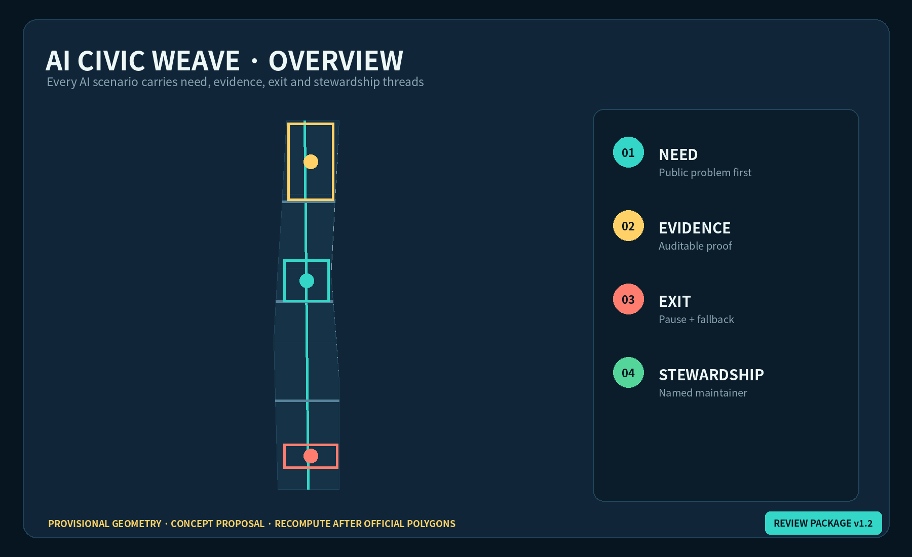
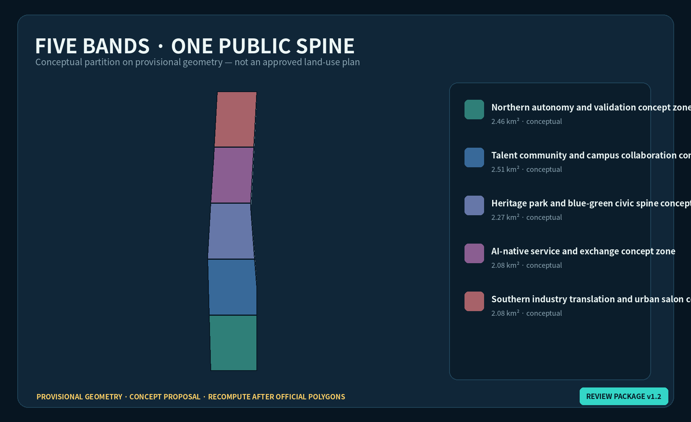
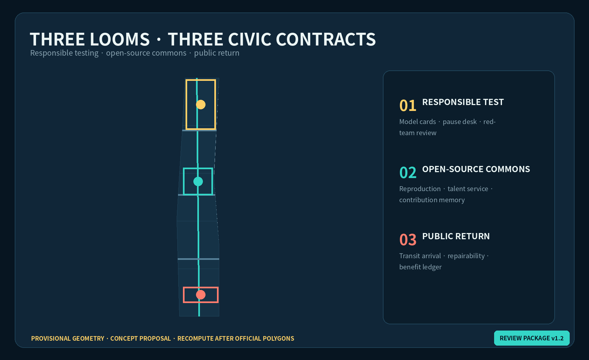
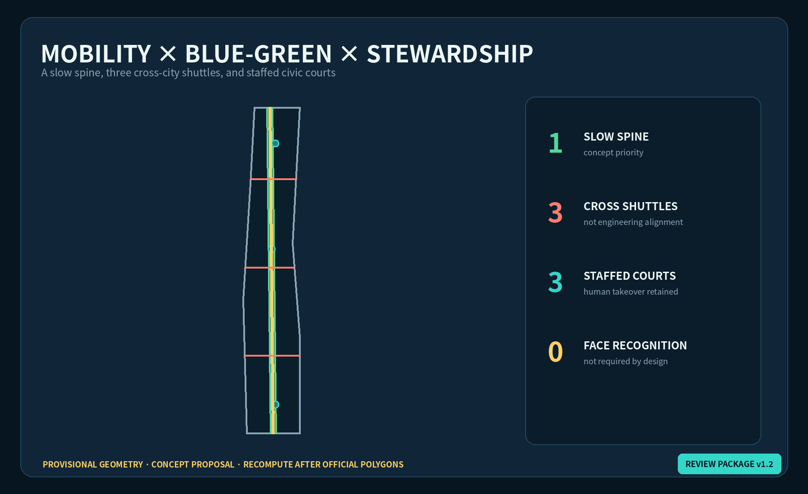
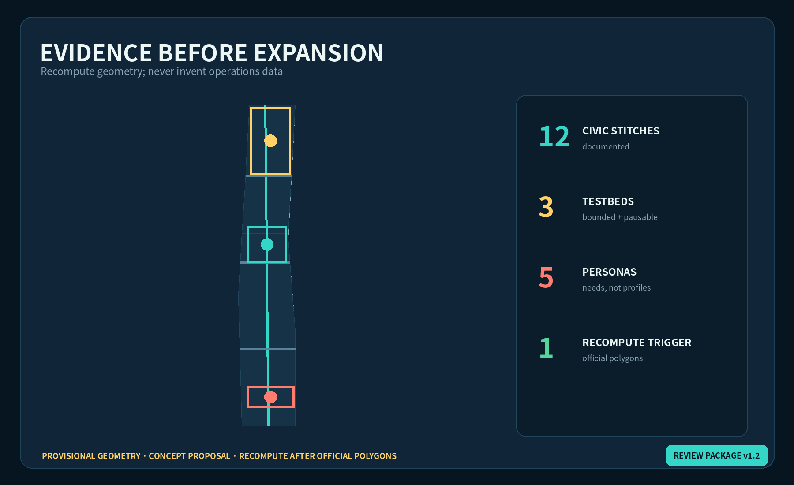

# AI Civic Weave: A Verifiable Urban Symbiosis Belt

> **Core judgment:** Jing-Zhang needs more than AI showcases. It needs a public protocol that continuously weaves technical capacity, resident needs, railway memory and long-term maintenance. Every spatial move in this package is a **concept proposal, reference scheme, or material for professional teams to deepen**. Nothing constitutes an approved plan, government decision, investment promise or implementation commitment.

## Design Basis and Source Inventory

Only the announcement, cleared Agent taskbook and formal-ready professional references registered by the repository support task and method claims. The overall design area is announced at about 11.4 km² and the three key areas at about 368.4 ha, but the current polygons are repository-maintained provisional constraints inferred from textual limits and area values; they are not official redlines [source:OFFICIAL-ANNOUNCEMENT] [source:BOUNDARY-SOURCE] [depth:existing_conditions_diagnosis]. Land-use codes follow the national classification logic. FAR, height, setbacks, road engineering, utilities, ownership and demolition decisions remain pending official data and professional confirmation [standard:MNR-LAND-USE-CLASSIFICATION-GUIDE] [standard:MOHURD-CONTROL-DETAILED-PLANNING].

AI Civic Weave requires four threads for every scenario: a **need thread** identifies the public problem; an **evidence thread** defines measurement and review; an **exit thread** guarantees pause, appeal and a low-tech fallback; and a **stewardship thread** assigns maintenance, resources and handover. A scenario missing any thread cannot advance from display to pilot [source:AGENT-TASKBOOK] [depth:risk_missing_data].

## Three-Level Scope Framework

Across the 43.6 km² coordinated research area, the proposal studies a loop from universities and open-source collaboration to enterprise translation, public validation and regional exchange. Within the approximately 11.4 km² overall design area, the railway heritage park becomes the longitudinal warp, while community, campus, enterprise and transit connections become the crosswise weft. The three key areas act as three looms that test different civic contracts [depth:three_level_scope_framework] [data:geometry/site_boundary.geojson#SITE-001].

The structure is **one spine, three looms, two wings and twelve civic stitches**: a civic-value slow-mobility green spine; a Responsible Test Loom at Zhongzhiyuan, an Open-source Commons Loom at AI Origin, and a Public-return Loom at Dazhongsi; the Zhongguancun service wing and Xiaoyuehe scenario wing; and twelve reversible scenario nodes [depth:overall_spatial_structure] [data:geometry/roads.geojson#ROAD-001] [metric:civic_stitch_count].

## Coordinated Research: Industry and Future City

Six global cases are comparison lenses, not Beijing site evidence. Station F raises the question of rail-era heritage and startup community; one-north, research-enterprise-living mix; 22@Barcelona, regeneration and community benefit; Kendall Square, university-industry proximity and public-realm pressure; AI Sweden Testbed, shared multi-party validation; and MaRS, cross-sector innovation services. Jing-Zhang copies none of their forms. It extracts six questions: how heritage remains useful, how innovation benefits neighbors, how tests become auditable, how talent can live long term, how services cross institutions, and how failure exits safely [source:CASE-STATION-F] [source:CASE-AI-SWEDEN].

Seven ecosystem interfaces follow: open compute booking, compliant data collaboration, model safety evaluation, IP and legal support, first-scenario matching, everyday talent services, and international peer review. None presupposes a named vendor, budget, policy or investment. Access rules, conflicts and an annual public-value ledger must be visible [source:AGENT-TASKBOOK] [depth:industry_function_system].

The identity **AI CIVIC WEAVE / 智织京张** uses two open rail lines to form negative-space J/Z/W geometry. The gap at the center represents permanent human judgment. Railway charcoal, civic cyan, validation yellow and care coral form the palette. Stitches indicate scenarios, knots indicate accountable stewards, and dashed lines indicate pending boundaries. All graphics are original directions and use no corporate marks or portraits.

## Overall Design: Urban Renewal and Regulatory-Plan Depth

Five conceptual bands accommodate autonomy testing, talent community, heritage blue-green space, AI-native services and industry translation. They form a shared-edge partition of the provisional boundary and are a recomputable spatial hypothesis, not an approved land-use plan [data:geometry/land_use.geojson#LU-001] [depth:land_use_layout]. Renewal follows “public interface first, operating evidence second, physical deepening last”: reversible wayfinding, shade, accessible repairs and staffed help points precede any building intervention.

The building layer records only nine prototypes marked `conceptual retrofit_or_infill_subject_to_survey`; they are not parcel demolition or construction decisions [data:geometry/buildings.geojson#BLDG-101] [depth:retain_renovate_demolish]. FAR, height, density and setbacks remain pending. Smartness is measured by accessibility, accountability and fallback—not screen count [metric:floor_area_ratio] [standard:MOHURD-URBAN-DESIGN-MEASURES].

## Detailed Design for the Three Key Areas

**Zhongzhiyuan AI Acceleration Area — Responsible Test Loom.** A concept loop of testing, observation, review and publication joins the Qinghe-facing public realm with model evaluation and standards communication. Prototypes include a Responsible Test Court, bookable red-team room, model-card walk and staffed takeover desk. Every demonstration shows scope, failure conditions and the person authorized to pause it [data:geometry/key_areas.geojson#PROV-KEY-001] [depth:three_key_area_detailed_design].

**Beijing AI Origin Community — Open-source Commons Loom.** Campus connections, an open release hall, translation services, talent amenities and a night collaboration court form a learn-contribute-translate-live loop. The contribution wall records licensed projects, maintainers and reproducible versions without turning reputation into personal surveillance [data:geometry/key_areas.geojson#PROV-KEY-002] [source:AGENT-TASKBOOK].

**Dazhongsi AI Industry Cluster — Public-return Loom.** Transit arrival, four-quadrant walking links, repairable-device experience, content services and international exchange share a Public-return Desk. Each commercial scenario states its proposed return to accessibility, employment, public service or open knowledge. Station integration and underground feasibility remain for professional study [data:geometry/key_areas.geojson#PROV-KEY-003] [depth:traffic_rail_slow_parking].

## AI Ecosystem, Personas and AI+ Scenarios

Five personas cover open-source developers, early-stage teams, university communities, nearby residents including older people and children, and visiting enterprises or international groups. They describe service needs—not individual labels or advertising profiles [source:AGENT-TASKBOOK] [depth:public_service_facilities].

Twelve scenario cards use seven fields: purpose, space, minimum data, human review, pause condition, low-tech fallback and steward.

| # | Civic stitch | Proposed space | Public value and exit |
|---|---|---|---|
| 01 | Accessible walking assistant | Heritage spine | No face recognition; physical wayfinding remains |
| 02 | Qinghe microclimate care | Zhongzhiyuan edge | Aggregate sensing; manual inspection on failure |
| 03 | Responsible model court★ | Zhongzhiyuan | Model cards, red-team logs and staffed takeover |
| 04 | Edge privacy station★ | Zhongzhiyuan | Local inference; consent can be withdrawn |
| 05 | Open release and reproduction desk★ | AI Origin | Versions and licenses required; unreproducible work remains a demo |
| 06 | Translation-service copilot | AI Origin | Human legal/IP/finance advisers confirm every recommendation |
| 07 | Youth night commons | AI Origin | Aggregated booking and noise feedback; account-free entry |
| 08 | Community care translation booth | Communities | Sensitive dialogue not retained; staffed counter remains |
| 09 | Repairable device bench | Dazhongsi | Function, energy and repair pathway shown together |
| 10 | Public-return pitch room | Dazhongsi | Benefit assumptions and risks disclosed with every pitch |
| 11 | Maintenance-ticket board | Three commons | Facility progress only, never worker surveillance |
| 12 | Jing-Zhang memory translation | Cultural nodes | Archive facts and generated interpretation clearly separated |

The three starred scenarios are the industry validation set: responsible model evaluation, privacy-preserving edge computing and open-source reproducibility. They use bounded admission, limited space and time, public risk cards, independent review, incident pause and exit retrospectives. They are proposals, not approved test operations [metric:testbed_count] [standard:PROJECT-AGENT-OPEN-CALL-TASKBOOK].

## Land Use, Building Scale, and Retain/Renovate/Demolish Logic

The five shared-edge bands, green spine, three civic courts and nine building prototypes stay inside the submitted provisional boundary. Only submission geometry is recomputed; total floor area, FAR, height and density remain unknown [data:geometry/land_use.geojson#LU-001] [metric:building_footprint_area_sqm]. Any real building must pass three gates before an intervention classification: ownership and safety survey; heritage and embodied-carbon assessment; and whole-life comparison of retention, adaptive reuse and new build.

## Mobility, Rail, Municipal and Public Services

A north-south slow-mobility spine and three east-west shuttles express connection priority only: northern responsibility-testing resources, central campus and AI Origin collaboration, and southern Dazhongsi transit and industry services. They are not road redlines, bridges, tunnels or engineering alignments [data:geometry/roads.geojson#ROAD-001] [depth:traffic_rail_slow_parking].

New infrastructure follows edge-first, cloud-minimum, visible-energy and human-takeover principles. Basic wayfinding, advice and repair reporting continue during network failure. No unsupported utility, drainage, flood, fire or energy capacity is claimed [depth:municipal_new_infrastructure] [data:geometry/constraints.geojson#CONSTRAINT-001].

## Blue-Green Space, Public Realm and Character

The green spine connects railway memory, shade, rainwater, walking and three civic courts; it is not a dominant rectangular “green belt.” Validation yellow, civic cyan and care coral identify the three courts. Every digital interface sits beside physical explanation, human contact and non-commercial waiting space [data:geometry/green_space.geojson#GREEN-001] [data:geometry/public_space.geojson#PUBLIC-001] [depth:blue_green_public_space].

Three AI pilgrimage landmarks are public-knowledge devices rather than monumental sculpture: **Mile Zero Open-source Score**, **Pause Beacon**, and **Public-return Loom**. Recognition records version, contribution type, reproduction evidence and maintenance duration; records can be corrected or withdrawn. The cultural storyline moves “from railway timetable to city version”: railway reliability, Zhongguancun experimentation and AI accountability meet in a visible system of versions, stewards and maintenance.

## Renewal Projects, Policy and Phasing

| ID | Concept project | Phase | Precondition / stop line |
|---|---|---|---|
| W-01 | Twelve reversible civic stitches | Near | Public-space, accessibility and data-impact review |
| W-02 | Staffed takeover desks | Near | Accountable operator, service hours, offline fallback |
| W-03 | Physical wayfinding and shade repairs | Near | Survey, traffic and landscape review |
| W-04 | Responsible Test Loom | Mid | Safety rules, energy and network conditions |
| W-05 | Open-source Commons Loom | Mid | Ownership, fire, night-noise and operator review |
| W-06 | Public-return Loom | Mid | Transit, junction, utility and commerce study |
| W-07 | Annual civic-value ledger | Ongoing | Independent review, correction and appeal |
| W-08 | Full recomputation after official polygons | Triggered | Official boundaries, controls and base maps |

Phasing is not a construction promise. Near-term work is reversible and manually operable; mid-term work requires evidence and an accountable steward; long-term work is triggered by official geometry, controls, utilities and professional assessment [data:geometry/phasing.geojson#PHASE-001] [depth:phasing_implementation]. A reference annual cycle includes a Public Problem Call, Open Test Month, Global Reproduction Week, and Maintenance/Exit Audit. Dates, venues, funding and government participation remain unconfirmed.

## Metrics, Area Recalculation and Compliance

Spatial metrics recompute provisional boundary area, design green/public-space ratios, prototype footprints and layer counts. Scenario metrics count twelve stitches, three testbeds and five personas. Governance metrics—pause response, fallback availability, correction closure and public-return evidence—require real operations and are intentionally unfilled [metric:site_area_sqm] [metric:civic_stitch_count] [depth:metrics_recalculation]. Announcement tasks and agent.1–agent.6 are mapped in `compliance_matrix.json`; standards and depth are audited separately.

**Collaboration revision v1.2:** This self-check pass binds machine-readable metric values into the offline visual and records a traceable design-layer revision without changing the provisional status.

## Risk, Copyright and Compliance

The primary risk is presenting provisional geometry or proposed programs as approved facts. Official polygons, ownership, building survey, regulatory controls, utilities, fire, heritage and transport engineering remain pending and trigger full-package recalculation [source:SITE-PACKAGE] [data:geometry/constraints.geojson#CONSTRAINT-001] [depth:risk_missing_data].

All figures, bilingual HTML pages and PDFs were generated from this package's GeoJSON, metrics and original graphics. No peer media, trademarks, portraits or news images were reused. External cases are text citations and links only. AI scenarios require minimization, purpose limitation, human review, pause/appeal, low-tech fallback and named stewardship. Human and professional teams retain final judgment.

## References

- `brief/site-package/design_brief.json`, `agent_taskbook.json`, `allowed_design_space.json`
- `data/source_registry.json` and local professional-reference snapshots
- `geometry/*.geojson`, `metrics.json`, `assumptions.json`
- External benchmark use and limitations are recorded in `sources.json`
- Complete task, standard and depth indexes remain in the three matrices [source:SOURCE-REGISTRY]
