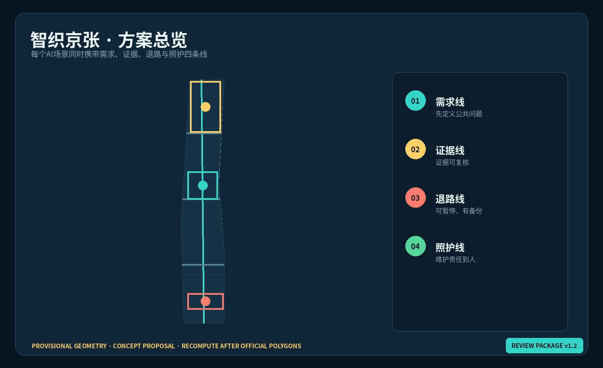
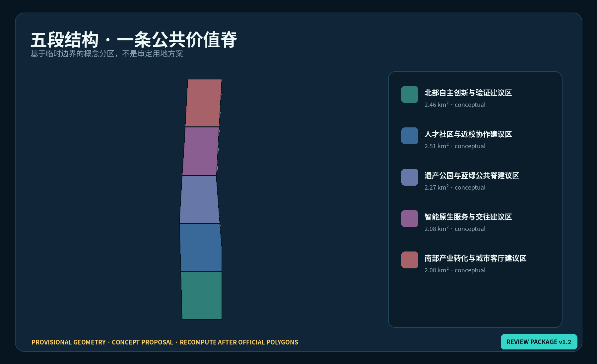
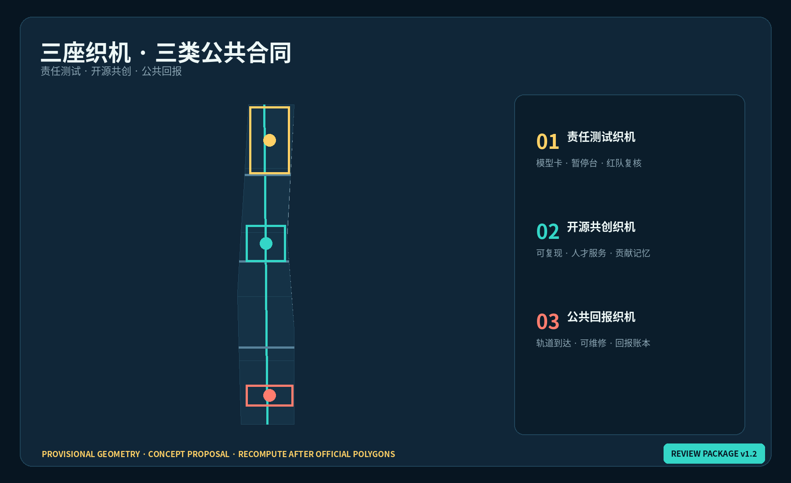
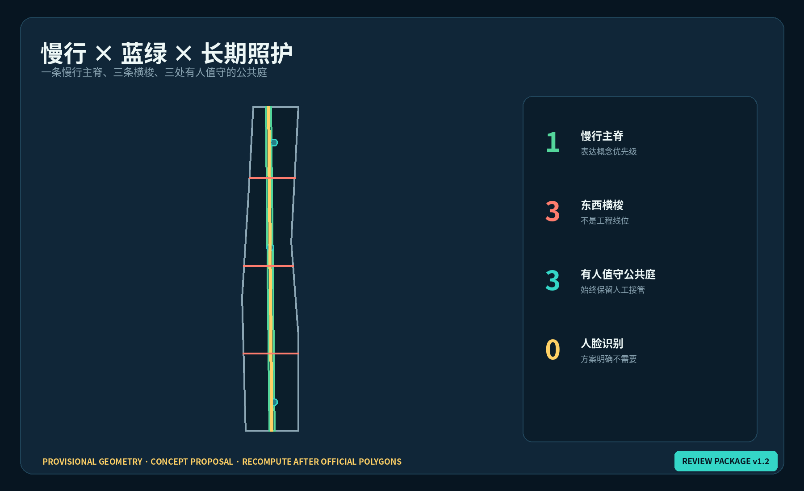
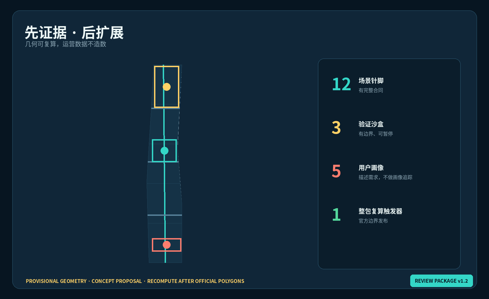

# 智织京张：可验证的AI城市共生带 / AI Civic Weave

> **一句话判断：** 京张不缺“AI展示点”，更需要一套把技术供给、居民需要、铁路记忆和长期维护持续织在一起的公共协议。所有空间落地建议均为**概念建议、参考方案或可供专业团队深化研究**，不替代正式规划，不构成政府审定、投资或实施承诺。

## 设计依据与资料清单

方案只把仓库登记为 formal-ready 的公告、任务书和专业标准用于任务及方法判断；临时边界仅用于生成、展示和自检。总体设计范围公告约 11.4 km²，三处重点区合计公告约 368.4 ha，但当前 GeoJSON 为维护者根据文字四至和面积推定的粗略范围，不能解释为官方红线 [source:OFFICIAL-ANNOUNCEMENT] [source:BOUNDARY-SOURCE] [depth:existing_conditions_diagnosis]。用地代码遵循国土空间分类逻辑，涉及容积率、高度、退线、道路、市政、权属和拆改留的结论全部留待正式资料与专业核查 [standard:MNR-LAND-USE-CLASSIFICATION-GUIDE] [standard:MOHURD-CONTROL-DETAILED-PLANNING]。

“智织”不是给传统园区贴上 AI 标签，而是为每一个场景增加四条必须同时出现的线：**需求线**说明谁的问题被解决；**证据线**说明如何测量、由谁复核；**退路线上**保留暂停、申诉和低技术备份；**照护线**明确维护、经费与移交。四线缺一，场景不得从展陈转为试点。完整来源、假设、指标和任务映射分别保存在 `sources.json`、`assumptions.json`、`metrics.json` 与三类矩阵中 [source:AGENT-TASKBOOK] [depth:risk_missing_data]。

## 三层范围工作框架

在 43.6 km² 统筹研究范围，方案研究“高校策源—开源协作—企业转化—公共验证—区域协同”的创新回路；在约 11.4 km² 总体设计范围，以京张遗址公园为纵向“经线”，以社区、高校、企业与轨道联系为横向“纬线”；在三处重点区，以三座“织机”验证不同类型的公共价值合同 [depth:three_level_scope_framework] [data:geometry/site_boundary.geojson#SITE-001]。

空间骨架为“**一脊、三织机、两翼、十二针脚**”：一条公共价值慢行绿脊；众智园责任测试织机、AI原点开源共创织机、大钟寺公共回报织机；中关村科技服务翼提供人才、资本、法务与知识产权服务，小月河场景赋能翼承接公共服务验证；十二个可撤回场景针脚把技术与日常连接 [depth:overall_spatial_structure] [data:geometry/roads.geojson#ROAD-001] [metric:civic_stitch_count]。

## 统筹研究范围产业与未来城市研究

六个全球案例仅作为比较镜头，不作为北京场地事实：Station F 提醒我们关注铁路工业遗产与创业社群的复合使用；one-north 关注研发、企业与生活混合；22@Barcelona 关注更新与社区收益；Kendall Square 关注高校产业邻近带来的公共空间压力；AI Sweden Testbed 关注多方共享验证；MaRS 关注跨行业创新服务。京张不复制其形态，而提取六条问题：遗产如何持续使用、创新收益如何回到周边、测试如何可审计、人才如何长期生活、服务如何跨机构、失败如何安全退出 [source:CASE-STATION-F] [source:CASE-AI-SWEDEN]。

据此形成七类生态接口：开放算力预约、合规数据协作、模型安全评测、知识产权与法务、首试场景撮合、人才日常服务、国际传播与同行评议。接口不预设指定企业、资金或政策承诺；每项服务都需公开准入、利益冲突披露和年度公共价值账本 [source:AGENT-TASKBOOK] [depth:industry_function_system]。

品牌采用 **AI CIVIC WEAVE / 智织京张**。标志方向由两条不闭合的轨线交织成“J/Z/W”负形，中间留出可见空隙，象征人类判断始终在环。基础色为铁路炭黑、公共青、验证黄与照护珊瑚；图标系统以“针脚”表示可定位场景，以“结点”表示责任主体，以虚线表示待确认边界。所有字体与图形在本提交中为自主生成方向稿，不使用企业商标或人物肖像 [standard:PROJECT-AGENT-OPEN-CALL-TASKBOOK]。

## 总体设计范围城市更新与控规深度城市设计

五段概念性用地结构从北到南分别承接自主验证、人才社区、遗产蓝绿脊、智能服务交往和产业转化。五段共同完整覆盖临时边界，作为空间—产业关系的可复算假设，而不是用地审批结论 [data:geometry/land_use.geojson#LU-001] [depth:land_use_layout]。更新优先顺序是“先公共界面、再运营验证、后实体深化”：先以可逆导视、共享首层、遮荫座椅和无障碍修补测试公共价值；再以可暂停场景验证使用；只有在测绘、权属、控规、消防和市政条件完整后，才由专业团队研究建筑改造或新建。

建筑图层只表达九个“空间原型基底”，统一标为 `conceptual retrofit_or_infill_subject_to_survey`，不对应现实地块拆改留决定 [data:geometry/buildings.geojson#BLDG-101] [depth:retain_renovate_demolish]。高度、容积率、密度和退线保持待正式数据补齐；公共空间界面强调首层可达、全天候步行、可见人工服务点和低技术备份，不以屏幕数量衡量“智慧化” [metric:floor_area_ratio] [standard:MOHURD-URBAN-DESIGN-MEASURES]。

## 重点区域详细设计

**众智园AI自主创新加速区——责任测试织机。** 概念建议把清河界面、标准治理展示、模型安全评测和低碳交往空间组织为“测试—观察—复盘—发布”环。核心原型包括责任测试庭、可预约红队室、模型卡长廊和人工接管台；任何演示均显示适用范围、失败条件和暂停责任人 [data:geometry/key_areas.geojson#PROV-KEY-001] [depth:three_key_area_detailed_design]。

**北京AI原点社区——开源共创织机。** 概念建议以近校步行联系、开源发布厅、成果转化服务台、人才生活补给和夜间协作庭构成“学习—贡献—转化—居住”环。贡献墙只记录经授权的项目、维护者和可复现版本，不把排名变成个人监控 [data:geometry/key_areas.geojson#PROV-KEY-002] [source:AGENT-TASKBOOK]。

**大钟寺AI产业集聚区——公共回报织机。** 概念建议围绕轨道到达、四象限步行联系、智能终端体验、内容消费和国际路演，设置“城市回报柜台”：每个商业或企业场景同步说明对无障碍、就业、公共服务或开放知识的回报。工程连通方式、站城结构与地下空间可行性均待专业深化 [data:geometry/key_areas.geojson#PROV-KEY-003] [depth:traffic_rail_slow_parking]。

## AI 创新生态、人才画像与 AI+ 场景

五类用户画像为：开源开发者（需要贡献可见与夜间协作）、初创团队（需要低成本验证和合规入口）、高校师生（需要成果转化与跨校联系）、周边居民及长者儿童（需要低扰动、无障碍和线下替代）、来访企业与国际社群（需要清晰到达、翻译和可信展示）。画像只描述服务需求，不形成个体标签或商业推荐 [source:AGENT-TASKBOOK] [depth:public_service_facilities]。

十二张场景卡均遵守“目的—空间—最小数据—人工复核—暂停条件—低技术备份—维护者”七栏合同：

| # | 场景针脚 | 建议空间 | 公共价值与退出条件 |
|---|---|---|---|
| 01 | 无障碍慢行助手 | 遗址公园主脊 | 提醒坡度与断点；不做人脸识别，地图失效时保留实体导视 |
| 02 | 清河微气候照护 | 众智园公共界面 | 聚合温湿与遮荫反馈；传感故障即退回人工巡检 |
| 03 | 责任模型测试庭★ | 众智园 | 公开模型卡、红队记录和人工接管；无责任主体不得测试 |
| 04 | 端侧隐私体验站★ | 众智园 | 展示本地推理与数据最小化；数据授权可随时撤回 |
| 05 | 开源发布与复现台★ | AI原点 | 发布需附版本、许可与复现说明；不可复现则降级为演示 |
| 06 | 成果转化服务副驾 | AI原点 | 辅助匹配法务、知识产权和融资咨询；人工顾问最终确认 |
| 07 | 青年夜间协作庭 | AI原点 | 聚合预约与噪声反馈；保留无账号入场方式 |
| 08 | 社区照护翻译亭 | 沿线社区 | 多语与无障碍转译；敏感对话不留存，人工窗口常开 |
| 09 | 智能终端可维修展台 | 大钟寺 | 同时展示功能、能耗和维修路径；不可维修产品不得标“公共示范” |
| 10 | 公共回报路演厅 | 大钟寺 | 企业路演同时披露公共收益假设与风险；无证据不得宣传成效 |
| 11 | 城市维护工单公示 | 三处公共庭 | 只显示设施级进度，不展示个人绩效；保留电话与现场报修 |
| 12 | 京张记忆共译站 | 文化节点 | 史料与AI生成内容分层标识；争议内容进入人工策展复核 |

带★的 03、04、05 构成三类产业测试验证场景：模型责任评测、隐私保护端侧计算、开源成果复现。试点采用沙盒准入、限定时段与空间、公开风险卡、独立复核、事故暂停和退出复盘；它们是运营参考方案，不是已获批准的测试活动 [metric:testbed_count] [standard:PROJECT-AGENT-OPEN-CALL-TASKBOOK]。

## 用地、建筑规模与拆改留方案

提交以共享边界的五个分区表达概念结构，绿脊、公共庭和九个建筑原型均在临时总体边界内。已复算的只是本次设计几何面积；建筑总量、容积率、高度和建筑密度保持 `unknown` [data:geometry/land_use.geojson#LU-001] [metric:building_footprint_area_sqm]。拆改留采用“三道门”：先做权属与现状安全调查，再做历史文化和碳排评估，最后比较保留、适应性再利用与新建的全寿命公共价值；任何现实建筑在三道门完成前均不得被标记为拆除。

五段结构的设计意图不是切出五块互不相干的园区，而是让每一段至少与绿脊、一条横梭和一类公共服务相交。研发和产业空间必须共享可进入的首层界面，人才社区必须保留日常生活与非消费空间，公园绿地必须承担文化解释、热舒适和慢行，而商业服务必须披露无障碍、维修和公共回报。分区面积写入 GeoJSON 并在 EPSG:4548 下复算；它们只证明提交包内部拓扑闭合，不证明现实用地可以调整。

九个建筑原型分别表达实验室、孵化协作和社区服务三类空间需求。原型几何避免覆盖临时边界之外，但不对应实际建筑轮廓，也不提供层数、建筑面积或造价。正式深化需补充现状测绘、结构安全、文保价值、产权、租赁关系、消防疏散、日照、能源和市政容量；每项资料缺失都应使方案停留在“保留优先、可逆介入”的默认状态 [depth:development_intensity_controls] [data:geometry/buildings.geojson#BLDG-101]。

## 交通、轨道、市政与公共服务设施

一条南北慢行主脊与三条东西“横梭”仅表达连通优先级：北部连接责任测试资源，中部连接高校与原点社区，南部连接大钟寺轨道到达与产业服务。线路不是道路红线、桥隧或工程方案；跨路、过站和消防组织须在正式资料下复核 [data:geometry/roads.geojson#ROAD-001] [depth:traffic_rail_slow_parking]。

市政与新基建采用“边缘优先、云端最少、能耗可见、人工可接管”：端侧算力嵌入可维护的公共服务点，网络中断时保留基本导视、咨询和报修；能耗、排水、防洪、管线和消防容量不做未经资料支持的数值承诺 [depth:municipal_new_infrastructure] [data:geometry/constraints.geojson#CONSTRAINT-001]。

## 蓝绿空间、公共空间与城市风貌

绿脊不是一条占满画面的矩形绿带，而是连接铁路记忆、遮荫、雨洪、慢行和三个公共庭的连续设计意图。三庭分别用验证黄、公共青和照护珊瑚识别；所有电子界面旁设置实体说明、人工联系与可坐可等的非消费空间 [data:geometry/green_space.geojson#GREEN-001] [data:geometry/public_space.geojson#PUBLIC-001] [depth:blue_green_public_space]。

三处“AI朝圣地标”是公共知识装置而非巨型雕塑：**里程零号·开源谱**记录经授权的京张与AI时间线；**可暂停灯塔**实时显示场景运行、维护和暂停状态；**公共回报织机**把年度公共价值账本转成可读图谱。荣誉系统以版本、贡献类型、复现证据和维护时长记名，允许更正和撤回，避免只奖励曝光度 [source:AGENT-TASKBOOK] [depth:height_massing_character]。

文化叙事为“从铁路时刻到城市版本”：铁路把站点、时刻、责任和维护组织成可靠系统；中关村文化把问题、实验、开放协作和迭代组织成创新系统；AI新文化应继承两者的可复核精神，而不是只借用怀旧符号。导视以公里标、版本号和责任结点构成三级信息，不伪造历史史实，不使用未授权肖像与企业标识。

## 更新项目清单、实施政策与分期计划

| 编号 | 概念项目 | 阶段 | 前置条件与止损线 |
|---|---|---|---|
| W-01 | 12针脚可逆开场包 | 近期 | 公共空间许可、无障碍与数据影响评估；可无损撤除 |
| W-02 | 三庭人工接管台 | 近期 | 明确责任主体、服务时段与线下备份 |
| W-03 | 主脊实体导视和遮荫修补 | 近期 | 现状测绘、交通与园林复核 |
| W-04 | 众智园责任测试织机 | 中期 | 安全评测制度、能耗和网络条件 |
| W-05 | 原点开源共创织机 | 中期 | 权属、消防、夜间扰动与运营团队 |
| W-06 | 大钟寺公共回报织机 | 中期 | 轨道、路口、市政和商业协同研究 |
| W-07 | 公共价值年度账本 | 持续 | 独立复核、纠错与申诉机制 |
| W-08 | 官方边界发布后的整包复算 | 触发式 | official polygon、控规和专业底图到位 |

分期不是建设承诺。近期优先可逆、低成本、可人工运行的公共界面；中期只推进通过场景复盘且责任主体清晰的空间深化；长期以官方边界、控规、市政、权属和专业评估为触发器，重新生成全部 GeoJSON、指标、图件和报告 [data:geometry/phasing.geojson#PHASE-001] [depth:phasing_implementation]。

年度运营参考方案包括春季“公共问题征集”、夏季“开放测试月”、秋季“全球复现周”、冬季“维护与退出审计”。开发者社区采用问题悬赏、导师轮值、公开复现和维护积分；企业转化从公共问题定义开始，经沙盒、独立复核、公开反馈后才讨论扩大。活动品牌与资金、场地、政府安排均待确认 [source:AGENT-TASKBOOK] [depth:renewal_project_list]。

## 指标体系、面积复算与合规矩阵

指标分三层：空间层从 GeoJSON 复算临时边界面积、绿地和公共空间比例、原型建筑基底与图层数量；场景层统计 12 个针脚、3 个产业测试和 5 类画像；治理层建议跟踪暂停响应时间、低技术备份可用率、纠错完成率、公共回报证据完整率。前两层仅说明提交包一致性，第三层须由真实运营数据产生，当前不填造数值 [metric:site_area_sqm] [metric:civic_stitch_count] [depth:metrics_recalculation]。

所有公告 1.3、1.4、1.5 与 agent.1—agent.6 的覆盖保存在 `compliance_matrix.json`；强制专业标准在 `standard_matrix.json`；设计深度在 `design_depth_matrix.json`。机器矩阵不替代正文判断，正文也不替代几何和指标复算。

**协作修订 v1.2：** 根据本轮自检，指标已在离线展示中绑定机器可读值，所有设计图层增加可追踪修订标识；该修订不改变临时边界属性。

## 风险、版权与合规说明

最大风险不是“AI不够多”，而是把临时边界、概念测试或活动设想写成已批准事实。当前 official polygon、地块权属、现状建筑、控规、市政、消防、文保和交通工程资料仍待补；这些缺口会触发整包复算和专业核查 [source:SITE-PACKAGE] [data:geometry/constraints.geojson#CONSTRAINT-001] [depth:risk_missing_data]。

五张图、双语网页和 PDF 均由本方案基于提交 GeoJSON、指标与自制图形生成；未复用同行图件、商标、人物肖像或新闻图片。外部案例只保留文字引用与链接。AI 场景必须遵守数据最小化、目的限定、人工复核、暂停申诉、低技术备份和维护责任；人类与专业团队拥有最终判断权。

## 参考资料

- `brief/site-package/design_brief.json`、`agent_taskbook.json`、`allowed_design_space.json`
- `data/source_registry.json` 与本地专业标准快照
- `geometry/*.geojson`、`metrics.json`、`assumptions.json`
- 六个国际案例的用途和限制见 `sources.json`
- 完整任务、标准与设计深度索引见三类矩阵 [source:SOURCE-REGISTRY]

资料使用遵循三层权威边界：官方公告用于项目名称、三层范围文字、公告面积和设计任务；清权任务书用于 agent.1—agent.6、场景数量、品牌与运营要求；专业标准用于方法、分类和成果深度。临时边界只能支撑生成、可视化和 intake 自检，六个国际案例只能支撑问题比较，二者都不能升级为本项目法定控制或实施承诺 [source:OFFICIAL-ANNOUNCEMENT] [source:AGENT-TASKBOOK] [standard:PROJECT-OFFICIAL-ANNOUNCEMENT]。

每个结构化文件都有明确角色：`site_boundary` 与 `key_areas` 保存不可误认的临时约束；设计图层保存可替换、可复算的空间假设；`metrics.json` 区分 known 与 unknown；`assumptions.json` 记录触发重算的资料缺口；矩阵保存穷尽覆盖。若后续来源发生更新，先核对许可与权威等级，再重裁设计图层、重算指标、重绘中英图件并重新执行全套自检，而不是仅修改正文 [depth:metrics_recalculation] [data:geometry/site_boundary.geojson#SITE-001]。
