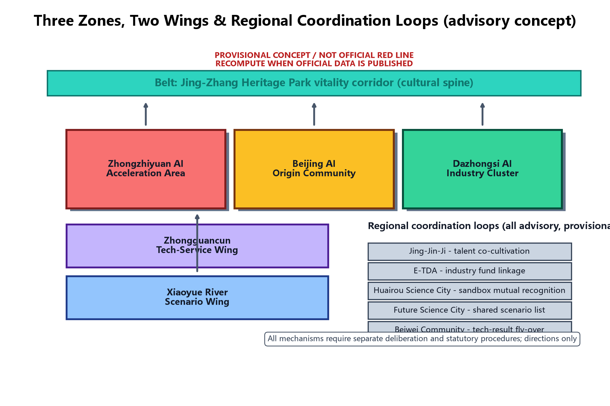
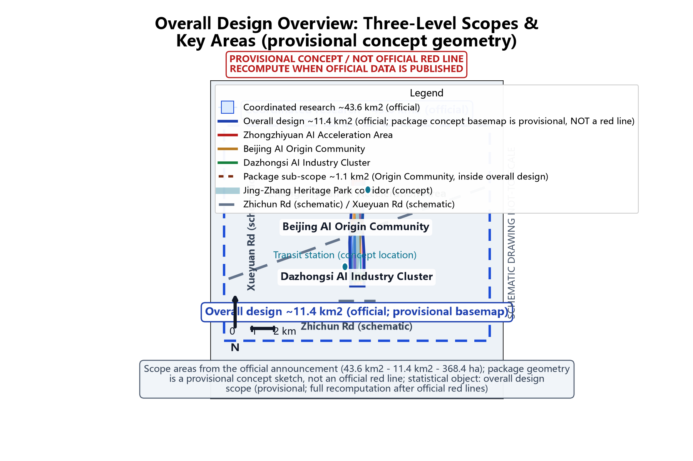
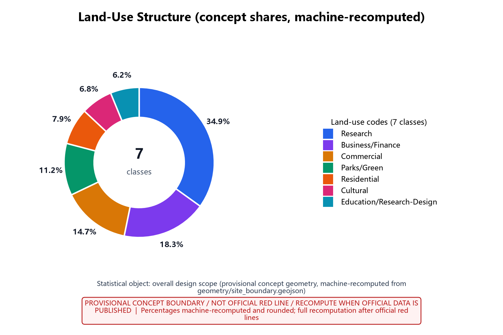
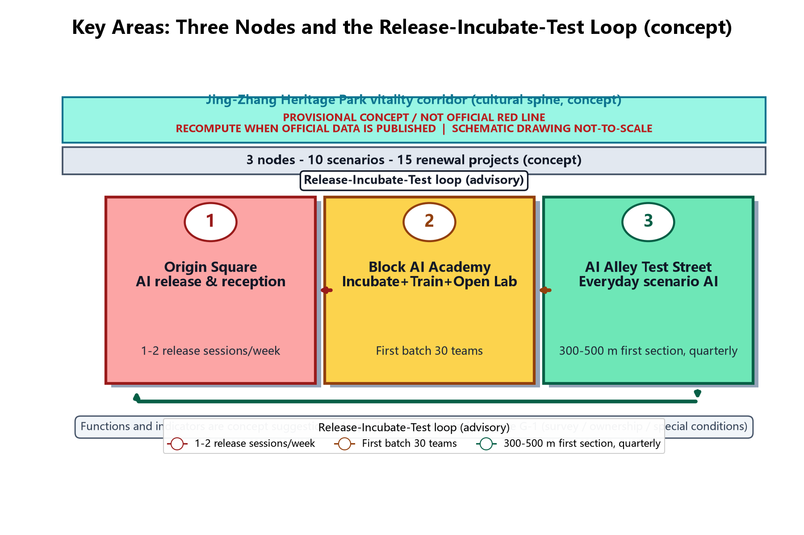
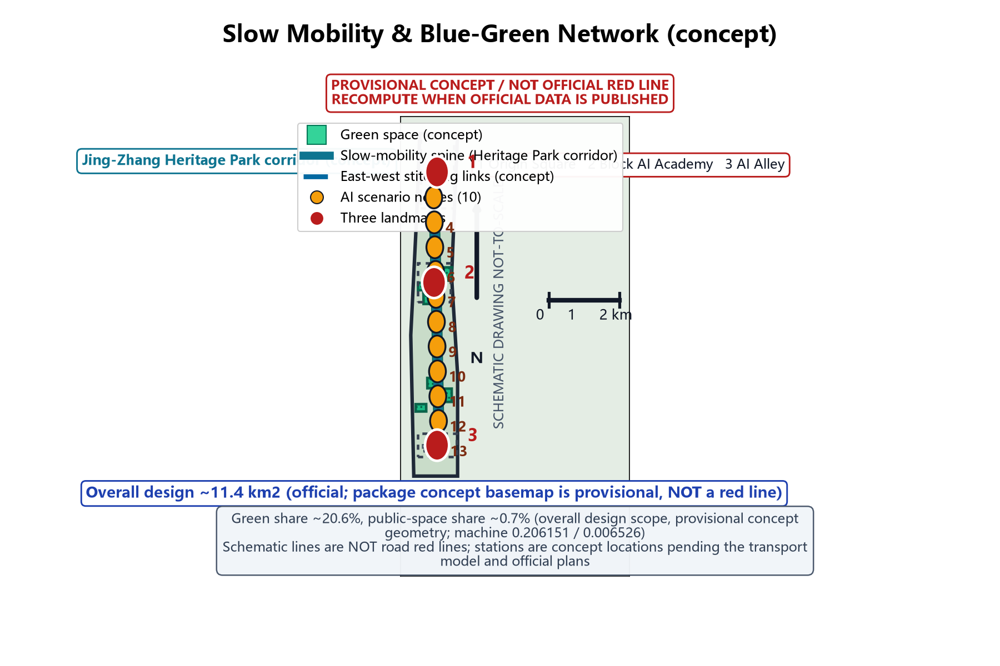
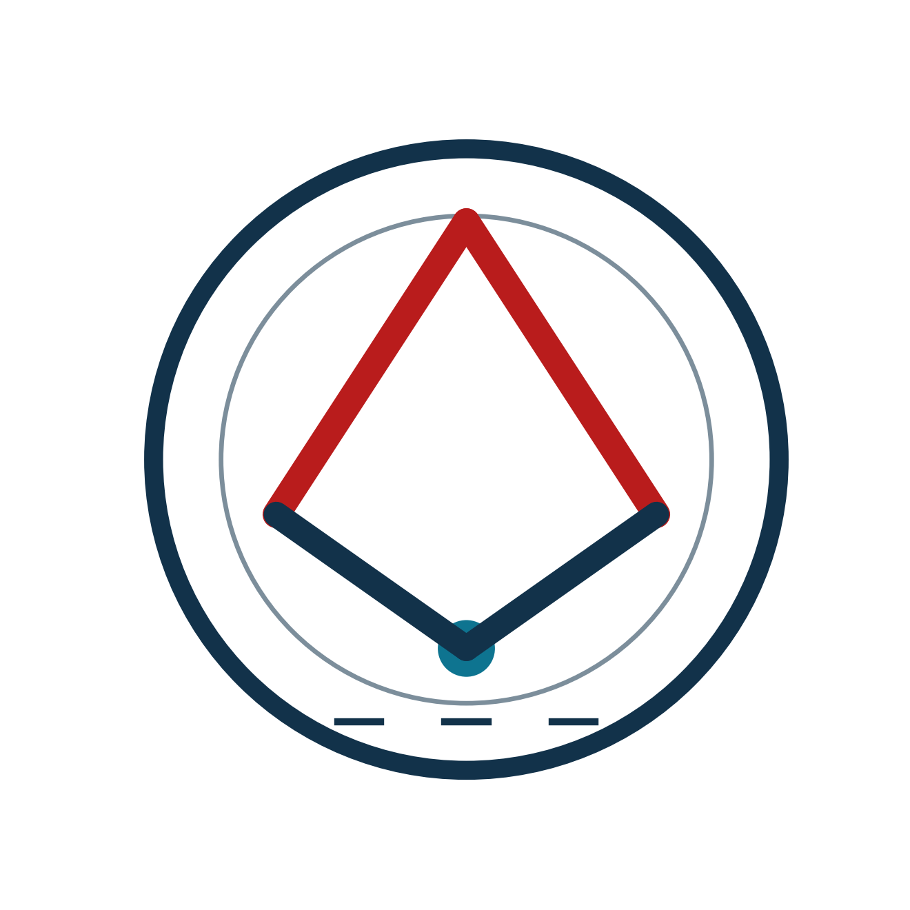
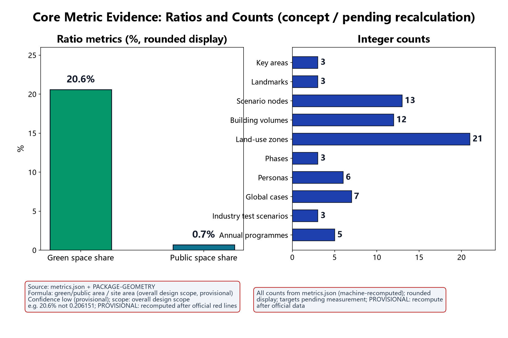

This proposal responds to the Centennial Jing-Zhang AI Innovation Belt initiative and focuses on the AI Origin Community block in Haidian District. It maps the three stated positions (Centennial Jing-Zhang Culture Belt, Urban AI Life Experience Belt, AI-Integrated Innovation Belt) and five functions (full-stack AI self-reliance, world-class AI ecosystem, AI+ scenario empowerment, intelligent vibrant AI city, global AI governance voice). Everything here is provisional concept advice: scopes, indicators and data are recalculated after official data is published, and nothing constitutes an approval commitment. Version 1.2 fixes the round-2 review findings: the three-level scope names and nesting now follow the official announcement (coordinated research about 43.6 km² - overall design about 11.4 km² - key areas about 368.4 ha); the package's custom research sub-scope (about 1.1 km²) is renamed the "package sub-scope" and explicitly nested inside the overall design scope; all figures were redrawn to readability standards with per-figure ink self-checks; all four HTML files embed a static font subset to fix Chinese tofu boxes; the 15 renewal projects now state qualitative cost tiers with estimation basis instead of unsupported RMB ranges; and the Chinese and English PDFs were re-laid-out to font-size standards. [source:DATA-SRC-OFFICIAL-ANNOUNCEMENT-20260509] [source:DATA-SRC-AGENT-TASKBOOK-20260518]

## Design Basis and Source List

The proposal builds on the national New-Generation AI Development Plan and the "AI+" action, the Beijing Regulations on Building an International Science and Technology Innovation Centre, the Beijing Urban Renewal Regulations, and Haidian district policies for a world-leading science park and AI industry cluster; the taskbook and its annexes define scope, depth and deliverables as the first-priority basis. The Barrier-Free Environment Law is applied per concrete service scenario, not as a blanket statement. The source list is organised in four categories: planning (in-progress and approved regulatory plans, block renewal action plans, special plans); existing conditions (topographic maps, ownership surveys, building surveys, utility and transport surveys); industry (AI enterprise directories, talent data, rents and vacancy, innovation-platform operations); cases and policy (domestic and international AI innovation districts and future-city cases, latest policy documents). The list is provisional and rolls forward with site visits, interviews and data collection; final sources appear in the appendix. All official data citations are registered per entry in sources.json; unverified numeric values are stated as unknown or as concept ranges with a recalculation trigger.

> **Evidence**: [source:DATA-SRC-OFFICIAL-ANNOUNCEMENT-20260509], [source:DATA-SRC-AGENT-TASKBOOK-20260518], [source:DATA-SRC-BARRIER-FREE-ENVIRONMENT-LAW].

## Three-Level Scope Framework

This proposal uses a three-level framework - coordinated research, overall design, key-area detailed design - mirroring the taskbook chapters so conclusions flow top-down and are verified bottom-up. The scope names and nesting follow the official announcement (area values from the official prequalification announcement, [source:DATA-SRC-OFFICIAL-ANNOUNCEMENT-20260509]; all package scopes are concept sketches only, not official red lines; recalculation triggers stated at the end of this section): the coordinated research scope is about 43.6 square kilometres (official) and covers regional industry and future-city research; the overall design scope is about 11.4 square kilometres (official), for urban renewal and regulatory-plan-level urban design, and this package uses the concept boundary in geometry/site_boundary.geojson (rough provisional geometry, machine area about 11412825.386 square metres, provisional, not an official red line) as that layer's concept basemap and statistical object; the key detailed-design scope is about 368.4 ha (official), covering the three key areas - Zhongzhiyuan AI Acceleration Area, Beijing AI Origin Community, and Dazhongsi AI Industry Cluster. Within the overall design scope (about 11.4 km²) the package additionally focuses on the package sub-scope - the AI Origin Community neighbourhood, about 1.1 square kilometres (a participant-defined concept sub-scope) - for street-scale detailed concept design; this sub-scope sits inside the overall design scope, which in turn sits inside the coordinated research scope (about 43.6 km²), giving the nesting "43.6 km² coordinated - 11.4 km² overall - 368.4 ha key areas / 1.1 km² package sub-scope"; every occurrence of these four areas in the text, matrices, figure captions and Chinese/English deliverables uses this hierarchy. The three levels share one coordinate system, data foundation and indicator system, and any adjustment to one level is written back to the others; all three sit inside the belt-level context of the Centennial Jing-Zhang AI Innovation Belt. Recalculation triggers: when official red lines and scope drawings are published, when in-progress regulatory plan results are publicised, and when ownership and building survey data arrive, all scopes, areas and share ratios are recomputed and written back to the text, figures and metrics.json. All outcomes are concept-level and do not replace statutory planning or approval procedures. [source:DATA-SRC-OFFICIAL-ANNOUNCEMENT-20260509] [source:DATA-SRC-PROVISIONAL-BOUNDARIES-20260605]

## Coordinated Research Area: Industry and Future City Research

The coordinated research scope (about 43.6 square kilometres, official announcement) analyses how innovation flows, talent flows and capital flows between the Zhongguancun Science City AI belt and the new research institutes of universities meet in the block, and positions the block in the regional industrial division of labour. The research vision is a world-class AI innovation ecosystem neighbourhood, organised as three ecosystem layers - core innovation, scenario testing, service support - so the block hosts release, incubation, training, testing and co-creation functions without duplicating neighbouring parks. Future-city research covers AI-driven urban governance, smart mobility, low-altitude economy and urban twins, with forward reservations of flexible land and shared facilities. The research also benchmarks representative AI parks and innovation districts (see the Global Case Benchmarking section, 7 sourced real cases) and distils transferable operation models and spatial prototypes. Outputs include an industry ecosystem map, talent demand forecast, future scenario list, and regional coordination suggestions (see the three-zone two-wing section); all coordination mechanisms are advisory and provisional and constitute no agreement or policy arrangement. This layer is a regional-scale research layer: its area and boundary follow the official announcement and are not machine-recomputed from this package's geometry. [source:DATA-SRC-OFFICIAL-ANNOUNCEMENT-20260509] [source:DATA-SRC-PROVISIONAL-BOUNDARIES-20260605]

## Belt Coordination: Three Zones, Two Wings (agent.1)

Belt-level functional coordination: the Centennial Jing-Zhang AI Innovation Belt uses the Jing-Zhang Heritage Park vitality corridor as its cultural spine and connects three zones and two wings. The three zones are: Zhongzhiyuan AI Acceleration Area (source innovation and pilot production), Beijing AI Origin Community (a neighbourhood-scale release-incubate-test loop), and Dazhongsi AI Industry Cluster (industry scenarios and professional services). The two wings are the Zhongguancun Tech-Service Wing (technology transfer, capital and talent services) and the Xiaoyue River Scenario Wing (scenario co-building and open testing). Regional coordination loops (all advisory, provisional): with Beiwei Community, a tech-result fly-over mechanism (shared low-cost incubation space with results flowing back); with Future Science City, a shared scenario list mechanism (large science facilities and AI product test scenarios cross-listed); with Huairou Science City, mutual recognition of anonymous-aggregation data sandbox admission; with the Economic-Technological Development Area, industry fund linkage (joint funding and follow-on windows, conceptual); and with the Jing-Jin-Ji urban agglomeration, talent co-cultivation (joint training bases and interconnected developer communities, conceptual). All mechanisms require separate deliberation through proper procedures; this proposal only suggests directions. The mechanism diagram below shows the relationships.

> **Evidence**: [source:DATA-SRC-AGENT-TASKBOOK-20260518], [data:PACKAGE-GEOMETRY].

## Overall Design Area: Urban Renewal and Regulatory-Plan-Level Urban Design

The overall design scope (about 11.4 square kilometres, official announcement; this package uses the concept boundary in geometry/site_boundary.geojson as the layer's concept basemap, machine area about 11412825.386 square metres, provisional, not an official red line) is the urban-renewal and regulatory-plan-level urban design layer: it establishes the inventory framework of existing buildings, roads, open space and utilities, the retain-renovate-demolish base-map method, mixed-use and compatibility rules, intensity, height and massing guidance, character control principles and the blue-green/slow-mobility system skeleton, avoiding large-scale demolition and real-estate-led development. Within this layer the package focuses on the package sub-scope - the AI Origin Community neighbourhood, about 1.1 square kilometres (a participant-defined concept sub-scope, inside the overall design scope and the coordinated research scope) - for street-scale detailed concept design: the block's "one axis, two belts, three nodes" structure is formed within the taskbook-delimited land, with the axis organising the main pedestrian flow, the two belts organising blue-green and vitality interfaces, and the three nodes anchoring public life; the character design reconciles tech-savvy facades, preserved neighbourhood fabric and heritage elements, with street-section, interface-continuity and fifth-facade control principles. All outcomes are a draft concept urban design guideline; boundaries and indicators are provisional and will be deepened once aligned with the in-progress regulatory plan; text indicators state the "overall design scope (provisional)" denominator and are fully recalculated after official red lines and regulatory-plan results are publicised. [source:DATA-SRC-OFFICIAL-ANNOUNCEMENT-20260509] [source:DATA-SRC-MOHURD-CONTROL-DETAILED-PLANNING] [source:DATA-SRC-PROVISIONAL-BOUNDARIES-20260605]

## Detailed Design of Key Areas

The key areas are built around three nodes. Origin Square is positioned as "AI release and reception": a public square, AI release hall and city reception complex hosting result releases, international exchange, public gathering and media communication, and the neighbourhood's spiritual landmark. Block AI Academy is positioned as "incubate, train, open lab": incubation space, AI training classrooms, open laboratories and shared test floors forming a vertical innovation unit integrating industry, academia, research and use. AI Alley is positioned as "a scenario-based AI everyday test street": the alley itself is the stage, with replaceable, iterative AI scenario devices and data-collection facilities bringing AI innovation into daily life. The three nodes are connected by pedestrian-priority streets in a release-incubate-test loop with reserved extension interfaces. Deepening of the three landmark buildings, the Jing-Zhang Heritage Park public-space connection, east-west stitching and north-south connection suggestions, Dazhongsi new-business suggestions and the public component library appear in the section "Key Area Deepening: Landmarks and Component Library (agent.4)". This version provides concept master plans, functional mixes, massing intentions and key sections; deepening may proceed only after concept decision gate G-1 (verified survey, ownership and special conditions) passes. [data:PACKAGE-GEOMETRY]

## AI Innovation Ecosystem, Personas, and AI+ Scenarios

The block is built on six talent personas: leading researchers and academic heads, serial entrepreneurs and early teams, engineers and algorithm talent, industry operations and service talent, artists and cross-disciplinary creators, and neighbouring residents and visitors; their differing needs drive the mix and flexibility of space supply, matching [metric:persona_count]=6 in metrics.json (persona table below). A work-live mixed talent community allocates talent apartments, shared living, family support and community services in proportion, achieving a 15-minute work-live-innovate circle. Ten AI scenarios are created: startup pitch, hackathon, talent station, prototype test field, street-corner AI gallery, smart commute assistant, community AI deliberation, digital-twin government consultation, accessible AI guided tour, and Origin White Paper co-creation - covering everything from innovation incubation to social governance. Scenarios are sequenced by "high-frequency need first, technology maturity match, operable and iterable", each with space carrier, technology configuration, operator and experience metrics in a 10-card «scenario card» system (below). The library stays open for additions and replacements; before any card enters implementation it must pass in-package scenario registration (an internal mechanism, not equivalent to government approval or statutory filing) and human review-point confirmation, and evaluation results enter the annual public disclosure.

| Talent persona (six) | Core needs | Space and service mapping (concept) | Key metric (concept) |
| --- | --- | --- | --- |
| Leading researchers / academic heads | Academic exchange, open labs, result release | Origin Square release hall, Block AI Academy open labs | Annual flagship events, lab utilisation |
| Serial entrepreneurs / early teams | Low-cost start, fast validation, funding | Incubation floors, pitch centre, talent station | Graduate rate, funding rounds, block AI points |
| Engineers / algorithm talent | Compute environment, code collaboration | Shared labs, code workshop, Open Source Alliance | Open-source contributions, review rounds |
| Industry ops / service talent | Industry services, training, jobs | Service desks, training rooms, job matching | Trainee completions, placement rate |
| Artists / cross-disciplinary creators | Creation space, exhibition, collaboration | Corner galleries, culture gallery, co-creation studio | Exhibition sessions, cross-works, satisfaction |
| Residents and visitors | Convenient life, public participation, digital inclusion | Community centre, AI deliberation hall, accessible tour | Reply rate, participation, accessibility usage |

Around the ecosystem loop "source innovation - pilot validation - scenario application - governance feedback", four innovation carriers are cultivated. The AI start-up incubator takes innovation overflow from universities and firms, offering flexible desks, legal/tax agency and paired mentoring. The open-source community co-builds and shares base models and toolchains through the Open Source Alliance, which protects contribution rights and organises code review. The AI data sandbox provides a controlled environment for testing under anonymous aggregation, opened only to entities completing in-package scenario registration, under pilot-admission tiered authorisation (an internal mechanism, not equivalent to government approval or statutory filing), with periodic audits of data use. The AI experience network uses corner galleries and Origin Square with booked visits and volunteer guided tours. AI Alley devices rotate on the booking-based rotation scheme to keep experiences fresh and devices iterable. Three AI governance baselines guard the boundary between innovation and trust: (1) only anonymous aggregated data is processed; structured details are pseudonymised before storage and no individual-level retention occurs; (2) key decisions always include human review; AI output is advice only, and decisions about public resource allocation or individual rights are made by humans; (3) no excessive monitoring: no individual-identifying tracking, no mass behaviour profiling, and sensors in public space serve only their scenario function. These carriers, mechanisms and baselines are written into the Origin Co-creation Pact, confirmed through residents' deliberation and opinion collection, disclosed annually, and supervised by the Dual-Review Deliberation Seat. Terminology note on filing/licensing: every filing or tiered-licence expression in this proposal falls into one of three categories - (a) in-package scenario registration (an internal mechanism, not equivalent to government approval or statutory filing); (b) pilot admission (entry review for pilot operators, not an administrative licence); (c) statutory filing (only where a statutory procedure is genuinely intended, with the specific law and scope cited; this proposal claims none). [source:DATA-SRC-GENERATIVE-AI-INTERIM-MEASURES] applies only to generative-AI services (public-facing use of generative AI foundation models) and is not generalised to all urban AI scenarios. The ten scenario cards follow, each with location, operation mechanism, human review point, technology configuration and experience metrics:

| Scenario card | Location | Operation mechanism | Human review point | Technology config (concept) | Experience metrics (concept) |
| --- | --- | --- | --- | --- | --- |
| Startup pitch card | Origin Square AI release hall | Booked pitch weeks, mentor feedback, block AI points | Admission screening and subsidy review | Smart interpretation subtitles, stage capture (pseudonymised) | Annual sessions, event frequency, satisfaction |
| Hackathon card | Block AI Academy base | Season-based themes, open-source promotion, public judging | Topic compliance review, code review | Shared compute pool, version collaboration platform | Seasons/year, teams, graduate outputs |
| Talent station card | Talent station and apartments phase 1 | Admission matching, work-life services, community pact | Eligibility review and public disclosure | Online booking, smart access (pseudonymised) | Occupancy, job-search duration, satisfaction |
| Prototype test field card | Test field data-sandbox area | Pilot-admission tiered authorisation (internal, non-administrative), anonymous data supply, rotation schedule | Pseudonymisation and use audit | Controlled sandbox, simulation, audit log | Projects tested, compliance pass rate, releases |
| Corner AI gallery card | Corner gallery network | Booked visits, volunteer tours, monthly renewal | Content and safety statement review | Touch terminals, audio guide, provenance screen | Visitors, renewal rate, tour satisfaction |
| Smart commute assistant card | Transit interchanges and slow streets | Dynamic travel information, manual intervention on anomaly | Per-case travel advice review | Anonymous flow sensing, dynamic displays | Punctuality, slow-mobility use, response time |
| Community AI deliberation card | Community AI deliberation hall | Dual-Review Seat, opinion collection and public reply | Deliberation conclusions and annual disclosure | Topic summaries (anonymous), vote records | Participation, reply rate, disclosure rate |
| Digital-twin consultation card | Digital-twin government consultation station | Manual fallback hours, itemised service list | Answer review, transfer-to-human channel | Controlled Q&A model, human desks | Volume, first-contact resolution, transfer share |
| Accessible AI tour card | Heritage park and key streets | Voice + large-type + human in parallel; deposit-free device loan | Tour content and accessibility adaptation review | Audio guide, large-type terminals, non-smart backup | Usage, response time, satisfaction |
| Origin White Paper card | Co-creation platform | Annual topic call, expert review, public publication | Data scope and attribution review | Collaborative editing, citation tracing, version archive | Topics/year, partners, citations |

The scenario-space-operator matrix aligns the ten cards with space carriers, suggested operators and experience metrics:

| Scenario | Space carrier | Operator (suggested) | Experience metric (concept) |
| --- | --- | --- | --- |
| Startup pitch | Origin Square release hall | Block operator + rotating investors | Annual pitch sessions |
| Hackathon | Academy base | Open Source Alliance + university clubs | Seasons/year |
| Talent station | Station and apartments | District talent service platform | Occupancy |
| Prototype test field | Sandbox area | Sandbox operator | Projects tested |
| Corner gallery | Gallery network | Curatorial operator | Visitors |
| Smart commute | Transit points | Transit operator + tech supplier | Punctuality |
| Community deliberation | Deliberation hall | Community committees + Dual-Review Seat | Reply rate |
| Digital-twin consultation | Consultation station | Government service + tech support | First-contact resolution |
| Accessible tour | Heritage park and streets | Volunteer accessibility team | Response time |
| White Paper co-creation | Platform | Research consortium | Partners/year |

Technology-readiness assessment (TRL is an estimate, not a measurement): each scenario is listed with current TRL, target TRL, main gaps and validation path, linked to the industry test protocols section:

| Scenario | Current TRL (est.) | Target TRL (est.) | Main gaps | Validation path (concept) |
| --- | --- | --- | --- | --- |
| Startup pitch | 7-8 | 9 | Standardised process and space integration | First-release pilot |
| Hackathon | 7-8 | 9 | Permanent venue and season operations | Annual season operation |
| Talent station | 6-7 | 8 | Work-life service integration | Phase-1 station pilot |
| Prototype test field | 6-7 | 8 | Sandbox admission and audit | Sandbox protocol testing |
| Corner gallery | 7-8 | 9 | Renewal supply chain | Gallery network rotation |
| Smart commute assistant | 6-7 | 8 | Multi-modal data fusion | Pilot corridor validation |
| Community deliberation | 6-7 | 8 | Rules and algorithmic explanation | Dual-review pilot |
| Digital-twin consultation | 6-7 | 8 | Knowledge base and accountability | Itemised pilot |
| Accessible AI tour | 5-6 | 8 | Multi-modal adaptation and backup devices | Heritage park pilot |
| White Paper co-creation | 6-7 | 8 | Collaborative governance and attribution | Annual cycle operation |

> **Evidence**: [source:DATA-SRC-GENERATIVE-AI-INTERIM-MEASURES], [metric:persona_count], [metric:scenario_node_count].

## Industry Test & Scenario Operations Protocols (agent.3)

The prototype test field, AI Alley devices and first-store/first-release events must pass industry test protocols before release. This version provides three concept protocols matching [metric:industry_test_scenario_count]=3: (1) the prototype test field data-sandbox protocol (validating AI product behaviour and performance under anonymous aggregation); (2) the AI Alley device rotation protocol (validating public acceptance and operation sustainability); and (3) the first-store/first-release protocol (validating traffic and conversion of industry release events). Each protocol includes validation goals, test metrics, data and admission requirements, cycle and scale, and exit/release conditions:

| Industry test protocol | Validation goal | Test metrics | Data and admission requirements | Cycle and scale | Exit and release conditions |
| --- | --- | --- | --- | --- | --- |
| Test field data sandbox | Correctness, stability, compliance of AI products under anonymous data | Accuracy, false-positive rate, sandbox compliance, privacy audit pass | Anonymous aggregate data only; entity must complete in-package scenario registration and sign a pilot-admission agreement (tiered authorisation, non-administrative); use audited | 2-6 months per project; up to pilot capacity (first batch 3) | Exit on any hard-metric failure or audit boundary breach with disclosure; release to AI Alley pilot after pass |
| AI Alley device rotation | Public acceptance, iterability, operation cost curve | Usage, failure rate, rotation queue, monthly labour hours | In-package scenario registration and safety statement (internal, not statutory filing); sensing data anonymous only | Quarterly rotation; up to 3 devices in parallel | Removal if two consecutive rounds below threshold or safety event; pass devices join standing list |
| First-store/first-release | Traffic, conversion, spatial capacity of release events | Attendance, media exposure, conversion, load compliance | Operator and emergency plan required; content human-reviewed | 1-3 days per event; tied to Origin Square booking system | Circuit-break on load or safety alert; qualified events move to annual Origin Open Day main stage |

Scenario open operations (concept): the open list is managed by "scenario item - open object - open time - data boundary"; public data and device open days serve all residents, controlled test resources serve registered entities; admission follows five steps - application, in-package scenario registration, pilot-admission review (non-administrative), data-boundary terms, test window - and the data boundary is uniformly anonymous aggregation with pseudonymised structured details and no individual-level retention. Failed-exit arrangements: every pilot sets an observation period and exit threshold (see rows above); exited sites return to the rotation pool and evaluation reports are disclosed annually, so pilots can enter and exit quickly. [metric:industry_test_scenario_count] [source:DATA-SRC-GENERATIVE-AI-INTERIM-MEASURES]

## Global Case Benchmarking and Industry Factor Support (agent.2)

This version provides seven real global cases (name, city, year, operator, transferable mechanism and source), exactly matching [metric:global_case_count]=7. Case information is a public-source overview; the participant only offers conceptual interpretation, not an official description of those projects; exact figures follow the cited source entries in sources.json:

| Case | City/Country | Year | Operator | Transferable mechanism | Source |
| --- | --- | --- | --- | --- | --- |
| Station F | Paris, France | 2017 | Station F S.A.S. | Release+incubation campus operations and resident programmes | CASE-STATION-F-2017 |
| One-North | Singapore | 2001 | JTC Corporation | Industry-layered park and test-bed space reservation | CASE-ONE-NORTH-2001 |
| Toronto Quayside | Toronto, Canada | 2017-2020 (ended) | Sidewalk Labs / Waterfront Toronto | Data-governance agreements, public-interest review, exit arrangements | CASE-TORONTO-QUAYSIDE-2020 |
| King's Cross Central | London, UK | 2008 | Argent LLP / KCCLP | Station-led regeneration and university-enterprise-city stitching | CASE-KINGS-CROSS-2008 |
| 22@ district | Barcelona, Spain | 2000 | Barcelona City Council | Innovation district transition, public space, maker labs | CASE-22B-BARCELONA-2000 |
| Hong Kong Cyberport | Hong Kong | 2004 | HK Cyberport Management Co. | Government platform + incubation + fund + event IP | CASE-CYBERPORT-2004 |
| Zhangjiang Hi-Tech Park | Shanghai, China | 1992 | Shanghai Zhangjiang (Group) Co. | Park-city integration, talent housing, cluster platforms | CASE-ZHANGJIANG-1992 |

The industry ecosystem map (concept) organises four layers - base models and toolchains (open-source community), applications and industry models (start-up teams), data and compute services (sandbox and compute pool), scenario operations and content (galleries, devices, events) - with flow paths for IP, capital, talent and data; it is illustrative until the enterprise survey arrives. The industry factor support table gives responsible bodies (suggested), admission conditions and mechanisms (concept) for land, capital, talent, compute, data and scenarios, all advisory:

| Factor | Responsible body (suggested) | Admission conditions (suggested) | Mechanism (concept) |
| --- | --- | --- | --- |
| Land | District government/state platform coordinating with owners | Clear ownership or included in renewal plan | Flexible supply, compatible use, phased transfer |
| Capital | District guidance fund + private capital + operator | Negative-list and risk control compliance | Fund linkage, invest-loan-subsidy linkage, risk sharing |
| Talent | Universities + district platform + firms | Talent recognition and community pact | Joint cultivation, training bases, apartment allocation |
| Compute | Compute operator + carriers | Filed entity, green energy commitment | Shared compute pool, compute vouchers (concept), tiered quota |
| Data | Sandbox operator + supervisor | Anonymous aggregation, use registration (internal) | Pilot-admission tiered authorisation (internal), cross-zone recognition, periodic audit |
| Scenarios | Scenario operator + agencies | In-package scenario registration, safety statement, human review | Open list, rotation booking, first-store pilots |

> **Evidence**: [metric:global_case_count], [source:DATA-SRC-AGENT-TASKBOOK-20260518].

## Land Use, Building Scale, and Retain-Renovate-Demolish Strategy

The block's existing land is mainly research-office, residential, commercial and a small amount of industrial heritage. Existing gross floor area: unknown (pending measurement); estimation method: per-building "footprint x floors" from the official building survey, cross-checked with rent and vacancy data; data required: official building survey, ownership ledger, floor and age ledger; recalculation trigger: publication of measured data and official statistics. Retainable stock share: concept range about 50-60% (unknown precision, pending measurement), under "retain and renovate first, demolish as the exception": retain buildings with intact structure or historic/emotional value and insert new functions; renovate layouts, equipment and facades for AI office and testing needs; demolish only dilapidated, low-efficiency buildings with no renovation value, freeing space for public space or new carriers. The planned total GFA and functional mix use a concept baseline of about 60% innovation space, 30% residential support, 10% public services (provisional, pending recalculation). Phase-1 talent apartments: unknown (pending demand modelling); estimation method: parametric range model from job forecasts, work-housing ratio parameters and unit mixes; data required: job forecasts, household structure survey, rent affordability; recalculation trigger: publication of job and population forecast baselines. FAR and height guidance balances intensity and liveability with height limits near view corridors and protection requirements; statutory controls are unknown (pending publicised regulatory plan), so no numeric conclusions are given. Concept land-use shares (statistical object: the overall design scope provisional concept geometry, machine-recomputed from geometry/site_boundary.geojson; provisional; recalculated after official red lines are published): research ~34.9%, business/finance ~18.3%, commercial ~14.7%, parks/green ~11.2%, residential ~7.9%, cultural ~6.8%, education/research-design ~6.2%, shares are category area over the land-use total inside the overall design scope concept geometry, using the same machine-recomputation pipeline as the figures and visualisation page (geometry/land_use.geojson aggregated within geometry/site_boundary.geojson), rounding to about 100%; the figures and visualisation carry the machine recomputation. All areas are concept-level estimates, recomputed after measurement and ownership verification. [source:DATA-SRC-MNR-LAND-USE-CLASSIFICATION-202311] [data:PACKAGE-GEOMETRY]

## Transport, Rail, Municipal Infrastructure, and Public Services

The block builds a rail + bus + shared mobility + slow mobility interchange around the existing transit station, improves station exits and station-to-block walking links, and provisions the dynamic travel information facilities needed by the smart commute assistant scenario (conceptual position in figures; not a verified official station drawing). The internal network follows small blocks and dense streets, compresses through traffic, and applies traffic calming and speed management for a safe environment for AI Alley testing. Parking moves toward shared guidance and underground concentration to protect public space. Municipal renewal upgrades stormwater, sewage, power, telecom and heating networks in step with urban renewal, reserving interfaces for AI compute and energy-dispatching facilities, with sponge-city and resilience requirements. Public services fill gaps with compact shared facilities for education, health, culture/sports, elderly care and childcare aligned with the talent community. Transport and municipal plans are concept-level; road red lines, utility and station drawings are unknown (pending special-stage survey and transport modelling); recalculation triggers are the publication of special surveys and official drawings. [source:DATA-SRC-MOHURD-URBAN-DESIGN-MEASURES]

## Blue-Green Network, Public Space, and Urban Character

Existing green space, attached green space and idle corner plots feed a four-level public-space system - park, square, street, courtyard - with pocket parks, vertical greening and tree-lined streets, targeting a concept goal of green within 300 m and a park within 500 m (pending verification). Public space is designed for all-day, all-age use with movable furniture, smart lighting and AI interactive devices. The character direction is "tech texture, human warmth, Haidian temperament": tech in materials, interfaces and night lighting; warmth in preserved fabric and corner details; Haidian temperament in the science-and-innovation narrative and signage. A district character guideline manages colour, shop signs, street furniture and accessibility facilities, securing the accessibility basis for the accessible AI tour scenario. Concept indicators: green share about 20.6% and public-space share about 0.7% (machine values 0.206151 and 0.006526, statistical object the overall design scope provisional concept geometry, provisional, pending recalculation). Blue-green and character works enter the renewal project list and prioritise near-term quick wins. [metric:green_ratio] [metric:public_space_ratio] [source:DATA-SRC-MOHURD-URBAN-DESIGN-MEASURES]

## Key Area Deepening: Landmarks and Component Library (agent.4)

Jing-Zhang Heritage Park public-space connection (concept): the slow-mobility spine connects north through the northern section and the heritage corridor, focusing on park slow-mobility gaps with east-west and north-south stitching directions across expressways and railways (bridges/underpasses/overpasses are concept options requiring special studies); the southern and northern ends and the over-ring-road area reserve landmark landscape nodes linked with the accessible AI tour scenario. East-west stitching and north-south connection (concept): east-west stitching links along AI Alley and the two-wing directions reconnect pedestrian gaps cut by expressways and railways, connecting Origin Community to the Zhongguancun service wing and the Xiaoyue River wing at walking scale; gap connections follow "assess first, implement later", and crossings over railways and expressways require special project approval. Dazhongsi new business suggestions (concept): suggest a mix of industry services, professional offices and 24-hour consumption, with an AI enterprise service desk, a professional testing and certification showcase, and an industry convention hall; the mix is recomputed after the industry survey. Three landmarks deepened (concept): Origin Release Hall (core building of Origin Square with release, reception and media functions), Block AI Academy Tower (vertical unit for incubation, training and open labs with a public viewing and achievement floor at the top), and AI Alley Gateways (device-like gateways at both alley ends carrying rotation previews and wayfinding). Achievement display (concept): a "block honour gallery" at Origin Square and the Academy (tenant milestones, incubation graduation exhibitions, annual achievement awards). Public component library (concept): a reusable component list with a unified operation interface:

| Public component | Specification direction (concept) | Reusable scenarios | Investment and operation (concept) |
| --- | --- | --- | --- |
| Smart light pole | Modular lighting + sensing (pseudonymised) + info screens | All streets and squares | Phased per pole; monthly labour in operation budget |
| Scenario device module | Replaceable box, standard interface, reversible fixing | AI Alley rotation, corner galleries | Modular procurement; rotation by operator |
| Wayfinding component | Three-level signage (region/block/node), bilingual, braille and large type | Whole block and accessible tour | Unified design language; annual budget |
| Accessibility service facility | Voice + large-type terminals, non-smart backup, low counters | Galleries, stations, heritage park | Linked to accessibility patrols |
| Data collection node | Anonymous aggregation, pseudonymised storage, use audit | Scenario tests and governance feedback | Data-boundary terms; annual audit |

> **Evidence**: [source:DATA-SRC-AGENT-TASKBOOK-20260518], [source:DATA-SRC-BARRIER-FREE-ENVIRONMENT-LAW].

## Renewal Projects, Implementation Policy, and Phasing

Fifteen renewal projects are proposed: 1) Origin Square redevelopment (AI release and reception); 2) Block AI Academy conversion (incubate-train-open-lab); 3) AI Alley scenario test street; 4) Startup pitch centre; 5) Permanent hackathon base; 6) Talent station and talent apartments (phase 1 of the mixed community); 7) Prototype test field; 8) Corner AI gallery network; 9) Smart commute assistant infrastructure; 10) Community AI deliberation hall; 11) Digital-twin government consultation station; 12) Accessible AI tour system; 13) Origin White Paper co-creation platform; 14) Blue-green and public space upgrade; 15) Transit interchange and municipal renewal works. Each project is deepened with elements - preconditions (decision gate), cost tier (qualitative), estimation method, price base, cost scope, confidence level, ownership dependence, pilot capacity (concept), operation posts (concept), procurement method (suggested), and failed-exit arrangement - to avoid dangling list-level descriptions. Cost basis: this version no longer gives unsupported RMB ranges; costs are qualitative tiers only (low/medium/high, relative concept magnitude bands, not precise amounts); the estimation method is a participant concept judgement by unit-price analogy with similar projects; the price base is uniformly 2025 Beijing price levels (concept); the cost scope is uniformly design + construction works (excluding operation/maintenance, taxes and land cost; the White Paper platform additionally includes platform development); the confidence level is uniformly low (pending professional verification); the recalculation trigger is uniformly a professional re-estimate after project approval estimates and design development - any specific amount must come from a special feasibility study, and this table constitutes no investment commitment:

| Renewal project | Preconditions (gate) | Cost tier (qualitative) | Estimation method (concept) | Price base | Cost scope | Confidence | Ownership dependence | Pilot capacity (concept) | Operation posts (concept) | Procurement (suggested) | Failed-exit arrangement | Recalculation trigger |
| --- | --- | --- | --- | --- | --- | --- | --- | --- | --- | --- | --- | --- |
| Origin Square | Survey + utility verification | Medium | Unit-price analogy with similar urban-square renewal works (RMB/m2 x magnitude) | 2025 Beijing price levels (concept) | Design + construction (excl. O&M/taxes/land) | Low (pending professional verification) | Square ownership and setbacks | Full-space showcase | 2-3 | Agency-build + operator tender | Phase-gated acceptance; adjust function mix on shortfall | After approval estimates and design development
| Block AI Academy | Building appraisal + leases | High | Unit-price analogy with stock-building conversion (RMB/m2 x magnitude) | 2025 Beijing price levels (concept) | Design + construction (excl. O&M/taxes/land) | Low (pending professional verification) | Stock building ownership | 30 teams first batch | 4-6 | State platform conversion + market operation | Above-threshold vacancy converts to training/public use | After approval estimates and design development
| AI Alley | Traffic-calming permit + utilities | Medium | Unit-price analogy with traffic-calming works and device modules | 2025 Beijing price levels (concept) | Design + construction (excl. O&M/taxes/land) | Low (pending professional verification) | Frontage interface | First section 300-500 m | 2-3 | Staged packages + operation rights bid | Rotation protocol exit backs out devices | After approval estimates and design development
| Pitch centre | Event licence + safety plan | Low | Unit-price analogy with venue fit-out and AV integration | 2025 Beijing price levels (concept) | Design + construction (excl. O&M/taxes/land) | Low (pending professional verification) | Venue ownership | 1-2 sessions/week | 1-2 | Shared venue + professional organiser | Low attendance converts to regular meeting use | After approval estimates and design development
| Hackathon base | University/Alliance agreement | Low | Unit-price analogy with shared-lab conversion | 2025 Beijing price levels (concept) | Design + construction (excl. O&M/taxes/land) | Low (pending professional verification) | Lease | 50-100 teams/season | 1-2 | Co-build and share | Paused season converts base to shared lab | After approval estimates and design development
| Talent station phase 1 | Housing certification + demand model | High | Unit-price analogy with stock-housing conversion or leasing (RMB/unit x magnitude) | 2025 Beijing price levels (concept) | Design + construction (excl. O&M/taxes/land) | Low (pending professional verification) | Ownership or lease agreement | ~300-500 units direction (pending) | 5-8 | Housing pooling + professional operator | Low occupancy converts to market rental | After approval estimates and design development
| Prototype test field | Sandbox rules and in-package scenario registration system (non-administrative) | Medium | Unit-price analogy with controlled-site conversion and compute equipment | 2025 Beijing price levels (concept) | Design + construction (excl. O&M/taxes/land) | Low (pending professional verification) | Site ownership | 3 parallel projects | 2-3 | Platform operator tender | Sandbox audit failure pauses release | After approval estimates and design development
| Corner gallery network | Site ownership + power permit | Low | Unit-price analogy with small gallery modules and terminals | 2025 Beijing price levels (concept) | Design + construction (excl. O&M/taxes/land) | Low (pending professional verification) | Street frontage | First 5-8 points | 3-5 | Network operation package | Low output points merge | After approval estimates and design development
| Smart commute infrastructure | Transport model + facility check | Medium | Unit-price analogy with transport information facilities | 2025 Beijing price levels (concept) | Design + construction (excl. O&M/taxes/land) | Low (pending professional verification) | Road/station facilities | Pilot interchange section | 1-2 + platform | Transport special + supplier | Failed pilot reverts to standard facilities | After approval estimates and design development
| Community deliberation hall | Deliberation rules + privacy terms | Low | Unit-price analogy with community-room conversion and terminals | 2025 Beijing price levels (concept) | Design + construction (excl. O&M/taxes/land) | Low (pending professional verification) | Community room | First 2-3 communities | 1-2 | Community service purchase | Low participation converts to notice board + human deliberation | After approval estimates and design development
| Digital-twin consultation | Itemised service list + accountability | Low | Unit-price analogy with service-station software/hardware | 2025 Beijing price levels (concept) | Design + construction (excl. O&M/taxes/land) | Low (pending professional verification) | Service room | First 2 stations | 2-3 | Government purchase | Accuracy shortfall -> full-time human desks | After approval estimates and design development
| Accessible tour system | Accessibility patrol + adaptation | Low | Unit-price analogy with tour devices and accessibility adaptation | 2025 Beijing price levels (concept) | Design + construction (excl. O&M/taxes/land) | Low (pending professional verification) | Park/street facilities | Heritage park lead section | 2-4 volunteer | Public-benefit purchase + volunteers | High device damage reverts to human tours | After approval estimates and design development
| White Paper platform | Data scope + attribution rules | Low | Manpower analogy for platform development and annual operation | 2025 Beijing price levels (concept) | Platform development + annual operation (concept) | Low (pending professional verification) | Platform data rights | Annual co-creation | 1-2 | Research consortium | Topic exhaustion merges into content columns | After approval estimates and design development
| Blue-green upgrade | Green ownership + water level check | Medium | Unit-price analogy with greening and sponge-city works | 2025 Beijing price levels (concept) | Design + construction (excl. O&M/taxes/land) | Low (pending professional verification) | Green and corner plots | Near-term showcase section | 3-5 | Greening works package | Annual acceptance; maintenance funding tied to results | After approval estimates and design development
| Transit and municipal works | Utility survey + agency coordination | High | Unit-price analogy with utility/road works (RMB/m x magnitude) | 2025 Beijing price levels (concept) | Design + construction (excl. O&M/taxes/land) | Low (pending professional verification) | Utility/road ownership | First interchange section | 3-5 | Municipal special works | Phased; adjusts with special plans | After approval estimates and design development

Implementation follows a concept rhythm of near-term (1-3 years), mid-term (3-5 years) and long-term (5-10 years): near-term focuses on low-risk quick wins (Origin Square, talent station, corner galleries, deliberation hall) with Origin Square and the first AI Alley section as the pilot area, establishing the Origin Co-creation Pact and block AI points and the block brand; mid-term advances the Academy, full AI Alley, the permanent hackathon base and the prototype test field to close the ecosystem loop; long-term completes the work-live community, full coverage of the accessible AI tour and normalised White Paper co-creation. Phase-end attribution rule: stage reviews and phase-transition decisions occur at the end of Year 3 and Year 5; projects from an earlier phase enter the next phase only after passing key-node assessments, removing endpoint-overlap ambiguity. Multi-stakeholder participation is maintained: government and state platforms lead planning coordination, policy tools and public services; firms carry market investment and scenario operation; universities provide R&D and talent; residents exercise co-governance through deliberation, opinion collection and volunteering. Each phase sets rolling measurable indicators (AI enterprise settlement, release frequency, incubation graduation, scenario test counts, block AI point participation, reply rate, public-space satisfaction, carbon intensity, annual disclosure completion) with target values pending measurement and official data. The annual event brand system appears in the section "Annual Events, Developer Community, and Talent Pipeline". The project list and phasing are provisional and adjust with project conditions, funding and ownership negotiations; cost tiers are participant qualitative concept judgements (low/medium/high, RMB magnitude bands, excluding tax and inflation) and constitute no investment commitment. [source:DATA-SRC-AGENT-TASKBOOK-20260518] [data:PACKAGE-GEOMETRY]

## Annual Events, Developer Community, and Talent Pipeline (agent.6)

Annual event brand system (five brand events matching [metric:annual_program_count]=5): Origin Open Day, Block AI Points Annual Exchange Festival, AI Alley Rotation Release Season, Open-Source Developer Conference, and Origin White Paper Annual Release form the annual rhythm with predictable public participation and international communication windows:

| Annual event brand | Time (suggested) | Space carrier | IP elements | Public participation |
| --- | --- | --- | --- | --- |
| Origin Open Day | Every May | Origin Square + AI Alley first section | Main visual, main-stage releases | Walk-in visits, on-site opinion collection, volunteer tours |
| Block AI Points Exchange Festival | Every November | Corner galleries + community centre | Exchange badges, annual points board | Points exchange, annual disclosure, deliberation summary |
| AI Alley Rotation Release Season | First week of Mar/Jun/Sep/Dec | AI Alley full line | New-device unveiling, check-in | Device voting, trial-experiencer recruitment, surveys |
| Open-Source Developer Conference | Every September | Block AI Academy + hackathon base | Conference themes, contribution awards | Project pitches, public code review, developer registration |
| Origin White Paper Annual Release | Every December | Origin Square release hall | Cover identity, annual ranking | Open topic call, launch livestream, Q&A |

Developer community (concept): the Open Source Alliance is the organisational carrier, with charter essentials (membership, decision-making, contribution rights, dispute arbitration); contribution rules follow a three-stage flow - contribution registration, code review, version release - with senior-member rotating reviews and public records; a biweekly code-review session and quarterly roadmap review create a depositable developer network. Talent and enterprise pipeline (concept suggestions): university-result transfer (a channel of result pitch - incubator admission - pilot release with Haidian universities); corporate pairing (leading firms pair with start-up teams with priority scenario purchase windows); graduate-out mechanism (graduated start-ups are first-recommended into the Zhongzhiyuan acceleration area or Dazhongsi cluster, keeping the block's spatial stock in dynamic circulation). All three paths are advisory and require separate deliberation with fund and policy tools. [metric:annual_program_count] [source:DATA-SRC-AGENT-TASKBOOK-20260518]

## Brand and Visual Identity (agent.1)

Stable English brand name: "AI Origin Community" (Chinese brand: Origin Commune / 原点公社, abbreviated "Origin Commune"), used alongside the administrative context of Beijing AI Origin Community for international communication (provisional brand suggestion; the formal brand name follows confirmation by the organisers and authorities). Naming system (concept rules): block level uses "Origin + term" (Origin Square, Origin Release Hall); node level uses "function + place" (Block AI Academy, AI Alley); event level uses "noun + verb" (AI Alley Rotation Release Season); English uniformly "Origin + function word". Logo direction (design intent; original geometric mark generated by the participant): a ring symbolises the community origin, a switchback double-line pays tribute to the Jing-Zhang "人" (switchback) railway and Zhan Tianyou's spirit, and an origin dot at the junction symbolises the AI technology origin - conveying "centennial Jing-Zhang, AI origin, everyday street life" in one mark; the logo is a concept, not an official identity authorisation.

Visual identity rules (concept): colours use Jing-Zhang blue (deep blue #12324A), origin red (#B91C1C) and intelligence cyan (#0E7490) for history, innovation and technology; typefaces use Source/Noto Sans SC (SIL OFL-1.1, embedding terms complied with; see the per-asset ledger in sources.json); icons use a unified rounded linear style; applications cover wayfinding, digital interfaces, exhibition materials and event visuals, all labelled "concept". International communication copy (Chinese/English): Chinese slogan "AI 生于街巷，原点点亮日常"; English slogan "Where AI Origin Meets Everyday Life"; three key messages: (1) a neighbourhood-scale AI ecosystem of three nodes and ten scenarios; (2) a release-incubate-test loop in a Beijing neighbourhood; (3) human review and data boundaries by design. Suggested channels (concept): international technology media and developer communities, university and international-student talent communities, industry exhibitions and international exchange events in the capital, and bilingual digital galleries and social media. The brand story is anchored in the centennial Jing-Zhang narrative (the railway, the switchback, the spirit of Zhan Tianyou) - see the heritage narrative section. [source:DATA-SRC-AGENT-TASKBOOK-20260518] [data:PACKAGE-GEOMETRY]

## Heritage Narrative, Wayfinding, and International Communication (agent.5)

Heritage narrative (brand-story base, concept): the centennial Jing-Zhang Railway is the historical origin of self-reliance - completed in 1909, its switchback solved the mountain crossing with ingenuity, and the spirit of Zhan Tianyou (self-reliance, ingenuity, responsibility) resonates across a century with today's AI self-reliance; Haidian's Zhongguancun, as one of China's science-and-technology origins, joins the Jing-Zhang heritage belt in the complete narrative of "self-reliant innovation - technology strength - AI origin". The Origin Commune brand story rests on this: superimposing "the origin of self-reliant innovation in the centennial Jing-Zhang era" and "the origin of innovation in the AI era" in space and narrative, making heritage the spiritual foundation of the block rather than static display. Wayfinding system (concept): level 1 (belt level: directions to the belt and three zones), level 2 (block level: Origin Community entrances and functional districts), level 3 (node level: landmark and device descriptions), with bilingual, braille and large-type compatible configuration sharing the information layer with the accessible AI tour. International communication copy and channel suggestions appear in the brand section; cultural narrative components (switchback sculpture narrative points, the Jing-Zhang story wall, heritage corridor commentary nodes) are managed within the public component library. [source:DATA-SRC-AGENT-TASKBOOK-20260518] [source:DATA-SRC-OFFICIAL-ANNOUNCEMENT-20260509]

## Accessibility and Inclusive Design (six key service groups)

Six key service groups (a second persona table alongside the six talent personas): older adults (silver-age), children, people with visual or hearing impairments, people with low digital literacy, people without smart devices, and frontline service staff. Each group has testable journey points, traditional-channel fallbacks and co-creation feedback mechanisms (concept acceptance scope, not a blanket compliance claim; the Barrier-Free Environment Law is applied per concrete service scenario and this table does not claim that all spaces are compliant):

| Key service group | Typical scenario | Journey points (concept) | Traditional-channel fallback | Co-creation feedback |
| --- | --- | --- | --- | --- |
| Older adults | Community deliberation, consultation, health services | Large type + voice + assisted handling | Human counters, phone hotline, volunteer home visits | Annual opinion collection, silver-age sessions |
| Children | Corner galleries, hackathon experience, park tours | Age-graded content, guardian accompaniment, interactive learning | On-site staff guidance, family service desk | Child-friendly opinion cards, family workshops |
| Visual/hearing impaired | Accessible AI tour, release events | Voice + text + sign-language/subtitles in parallel; non-smart backup | Sign-language volunteers, accessibility desk, phone relay | Accessibility patrols, joint expert-user review |
| Low digital literacy | Digital-twin consultation, community services | One-tap human transfer, stepwise guidance, neighbourhood points | Human counters, volunteer assistance | Digital literacy classes, monthly open Q&A |
| No smart device | Booking, inquiry, points exchange | Non-smart channel: phone, counters, paper cards | Hotline, human counters, non-smart backup cards | Physical + online opinion boxes |
| Frontline service staff | Stations, galleries, talent station operations | Duty lists, ticketing (pseudonymised), shift norms | Internal training and supervision, Dual-Review Seat | Ticket review sessions, service-star selection |

Concept acceptance checklist (physical and digital interfaces; all participant-controllable): continuous accessible circulation on main public paths (walk-through checks record gaps); voice + large-type + human service in parallel (at least two channels at key service points); non-smart backup for tour devices (paper maps, human tours, phone tours); all digital interfaces provide one-tap human transfer and privacy statements; these items enter the preconditions of the relevant renewal projects and are not released until met; legal accessibility compliance follows the authorities and a special accessibility assessment - this checklist is not a legal compliance conclusion. [source:DATA-SRC-BARRIER-FREE-ENVIRONMENT-LAW] [metric:persona_count]

## Metrics, Area Recalculation, and Compliance Matrix

An indicator system of about 30 items across three categories - innovation ecosystem, spatial quality, operation efficiency - is established: innovation (AI enterprise settlement, release frequency, incubation graduation, scenario test counts), spatial (public-space share, work-housing ratio, 15-minute facility coverage), operation (occupancy, rents, carbon intensity), all with target values and unified calculation scopes (targets pending measurement and official data; display rounds and labels "concept / pending recalculation"). Area recalculation uses measured data as the base, reviewing existing and planned land and floor areas plot by plot with confidence labels. This version's scope vocabulary follows the official announcement: coordinated research about 43.6 square kilometres, overall design about 11.4 square kilometres (package concept basemap machine area about 11412825.386 square metres, provisional), key areas about 368.4 ha; the package sub-scope (AI Origin Community neighbourhood) is about 1.1 square kilometres and sits inside the overall design scope; text indicators state the overall design scope (provisional) denominator; recalculation triggers are official red lines, regulatory plans and survey data. The compliance matrix maps each item against superior plans, regulatory plans, renewal regulations and accessibility, fire and green-building requirements with "compliant / needs alignment / needs special study"; statutory matters note "per the competent authority"; concept indicators are not approval commitments. This section rolls forward with deepening as the quantitative base of the deliverable. [metric:green_ratio] [metric:public_space_ratio] [source:PACKAGE-GEOMETRY]

## Risk, Copyright, and Compliance

Risks identified include: policy and planning adjustment (in-progress regulatory plan, renewal policy change), market and operation (AI industry cycles, rent and vacancy shortfalls), technology iteration (quickly outdated scenario devices, algorithm compliance), implementation conditions (fragmented ownership, relocation negotiations, funding) and safety/ethics (data privacy, algorithm bias, AI device safety in public space). Responses include flexible use and phased elasticity, "small steps, show first", scenario admission and ethics review, risk sharing among multiple stakeholders, and observation periods, exit thresholds and failed-exit arrangements for every pilot (see industry test protocols and the project list). Compliance is explicit: this proposal is concept-level research; all scopes, indicators, phasing and costs are provisional, constitute no commitment, approval basis or investment basis to any government body, and implementation follows statutory plans, special assessments and government decisions.

Per-asset rights ledger (summary; the full ledger lives in sources.json asset entries): fonts (Noto Sans SC, SIL OFL-1.1, subset embedding permitted with attribution; ASSET-FONT-NOTOSANSSC-OFL); logo and figures (participant-generated originals; ASSET-LOGO-ORIGIN, ASSET-FIGURES-AI-GEN); maps and geometry (provisional concept geometry derived from the repository's provisional boundaries plus participant design envelopes, not official red lines; ASSET-GEOMETRY-MAPS); HTML/PDF deliverables (generated by this participant via renderer scripts and matplotlib; ASSET-HTML-PDFS); code and dependencies (Python stdlib, matplotlib, pillow, fontTools etc. under their open-source licences; ASSET-CODE-DEPS); generation tools (OpenCode/DeepSeek under platform terms, disclosed in agent.json; ASSET-GEN-TOOL); policy snapshots (official public documents retained for offline retrieval only; ASSET-POLICY-SNAPSHOTS). COMMUNITY-DISPLAY-ONLY scope: this package (text, figures, geometry, PDFs, HTML) authorises the organiser to use it non-commercially in review, disclosure, display, compilation, publicity and archival contexts with attribution to participant JohnXu22786 (agent-oc-haidian) and retained PROVISIONAL labels; the organiser may not cite the package as an approved plan or statutory basis; third-party assets (fonts, policy snapshots) follow their own licences and cannot be sub-licensed. Copyright: cited policies and public data are attributed; figures are originals or licensed material of the compiler; deliverable copyright follows the commission contract. Unverified data is stated as unknown with estimation methods and recalculation triggers, not placeholders. English counterparts are equivalent translations of the same deliverable; the Chinese text governs, and equivalence has been verified manually by the participant. [source:DATA-SRC-OFFICIAL-ANNOUNCEMENT-20260509]

## References

National: New-Generation AI Development Plan, State Council "AI+" action opinions and annual AI white papers. Beijing: Beijing Master Plan (2016-2035) and Haidian district plan, Beijing Urban Renewal Regulations and special plans, Beijing Regulations on Building an International Science and Technology Innovation Centre and supporting policies, Barrier-Free Environment Law (applied per scenario). Haidian: world-leading science park implementation plan, AI industry cluster policies, Zhongguancun Science City plans and research. Industry and research: case studies of domestic and international AI parks and innovation districts (source registrations for the 7 real cases in sources.json: Station F, One-North, Toronto Quayside, King's Cross, 22@ Barcelona, Hong Kong Cyberport, Zhangjiang), annual reports on urban innovation ecosystems and talent employment, AI industry scale and talent demand statistics. Spatial data: topographic maps, cadastral/ownership surveys, building surveys, utility surveys (pending field verification). Internet and media: government portals, public news and industry sites, with citation links and access dates in sources.json. The list rolls forward during preparation and will be fully listed in the appendix. [source:DATA-SRC-OFFICIAL-ANNOUNCEMENT-20260509]