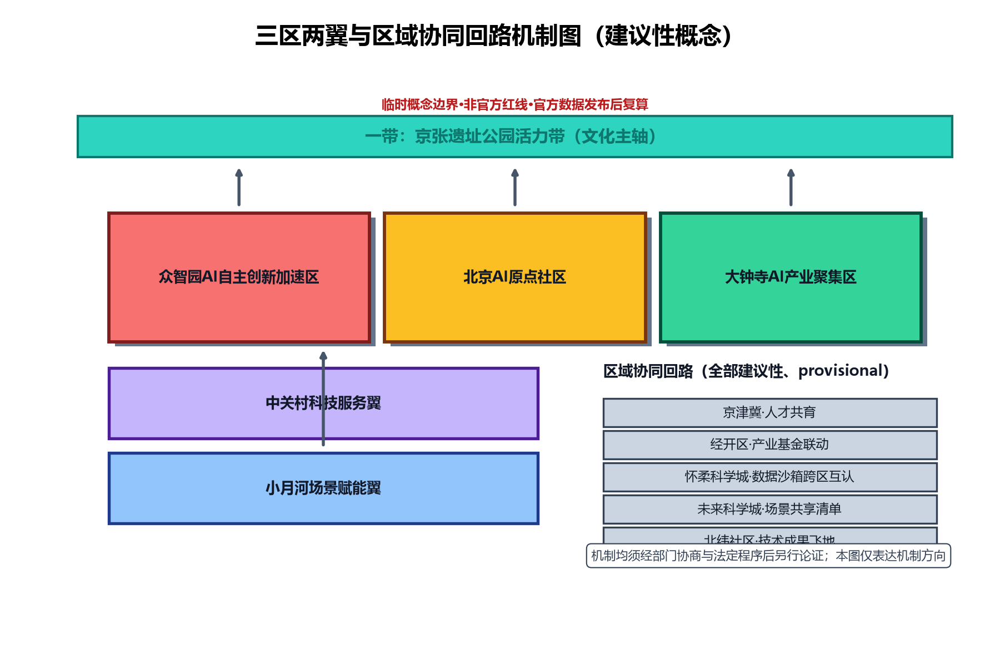
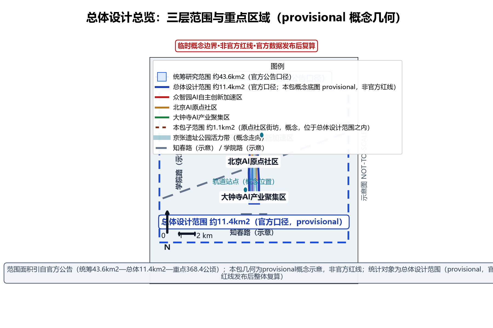
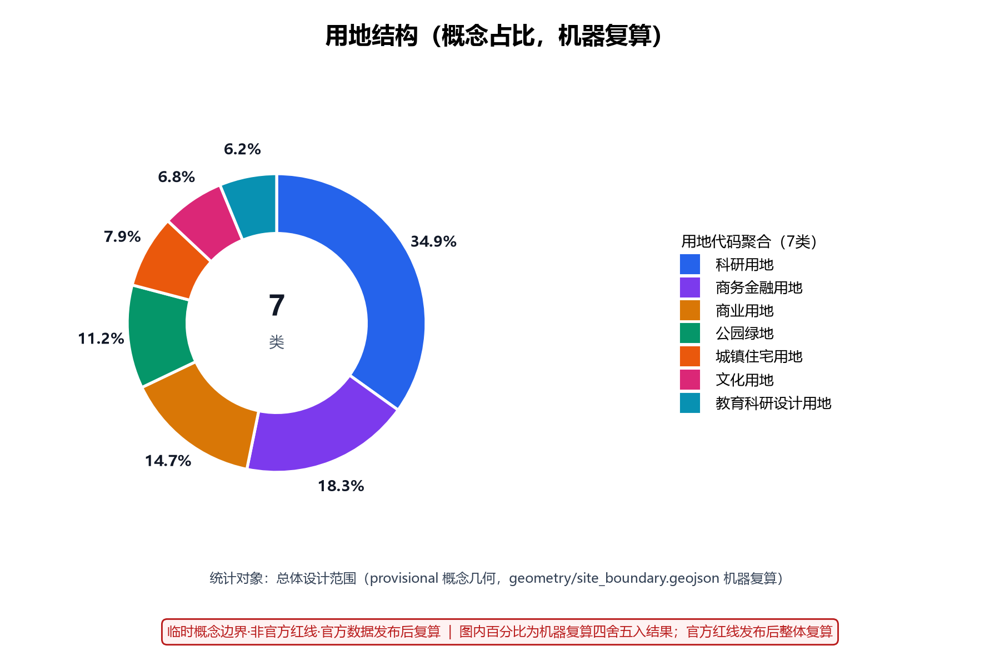
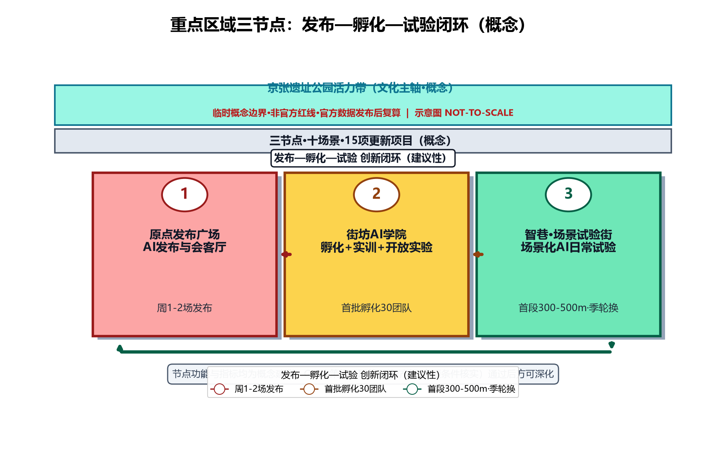
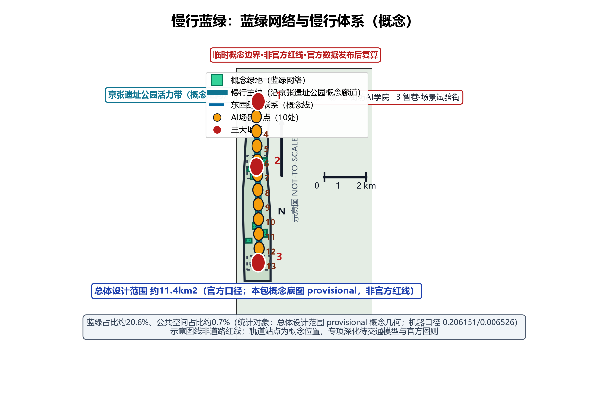
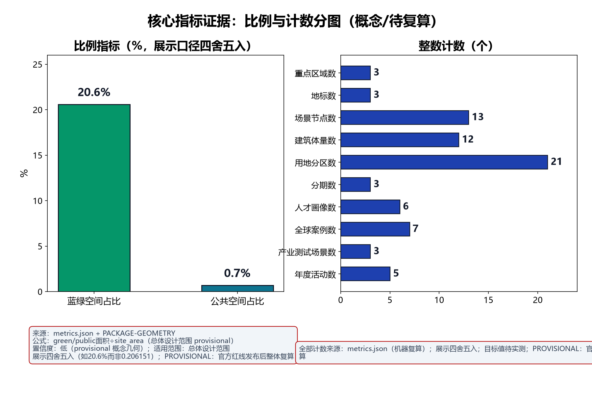

本方案紧扣百年京张AI创新带总体定位，聚焦海淀区AI原点社区板块，并按任务书口径形成三大定位与五大功能的概念映射：三大定位即百年京张文化带（文化叙事主线）、都市AI生活体验带（空间载体）、AI融合创新带（产业引擎）；五大功能即AI全栈自主创新体系（源头创新与中试转化）、世界级AI创新生态（人才、资本与平台集聚）、AI+场景赋能新范式（场景驱动的跨界融合）、智能化AI活力城市（智慧基础设施与宜居品质）、AI治理全球话语权（数据边界、人工复核与伦理先行）。全案表述均为概念建议（provisional），范围、指标与数据待官方资料发布后复算，不构成审批承诺。本版（v1.2）按第二轮评审意见修复：三层范围名称与嵌套关系改为官方公告口径（统筹研究范围约43.6平方公里—总体设计范围约11.4平方公里—重点区域约368.4公顷），本包自定义研究子范围（约1.1平方公里）改称"本包子范围"并明确位于总体设计范围之内；全部图件按可读性标准重绘并逐张自检墨量；中英HTML嵌入静态字体子集修复方框缺字；15项更新项目成本改为定性等级并补齐估算依据列；中英PDF按字号标准重排。

## 设计依据与资料清单

本提案以国家《新一代人工智能发展规划》及"人工智能+"行动、《北京国际科技创新中心建设条例》和《北京市城市更新条例》、海淀区建设世界领先科技园区及AI产业集聚区相关政策文件为上位依据，任务书及其附件所明确的范围、边界、深度与成果要求为本提案的第一依据，另对照《无障碍环境建设法》精神按具体服务场景适用。资料清单按四类编制：规划类（在编及已批控规、街区更新行动计划、专项规划）；现状类（地形图、产权与权属调查、建筑普查、市政管线、交通调查）；产业类（AI企业名录、人才数据、楼宇租金与空置率、创新载体运营数据）；案例时政类（国内外AI创新街区与未来城市案例、最新政策文件）。本清单为暂定清单（provisional），编制过程中将随现场踏勘、部门访谈与数据补充滚动更新，最终以成果附件《资料汇编》为准。全部官方数据引用以 sources.json 逐条登记为准，未经核实的数值一律以 unknown 或概念区间表述并注明复算触发条件。

> **证据锚点**：[source:DATA-SRC-OFFICIAL-ANNOUNCEMENT-20260509]、[source:DATA-SRC-AGENT-TASKBOOK-20260518]（组织方公告与任务书为文本口径依据）、[source:DATA-SRC-BARRIER-FREE-ENVIRONMENT-LAW]（无障碍条款按场景适用）。

## 三层范围工作框架

本提案建立"统筹研究—总体设计—重点设计"三层递进工作框架，与任务书章节一一对应，确保研究结论自顶向下传导、自底向上校验。三层范围的名称与嵌套关系采用正式公告口径（面积值引自官方资格预审公告，见 [source:DATA-SRC-OFFICIAL-ANNOUNCEMENT-20260509]；本包全部范围仅作概念标绘，非官方红线，复算触发条件见后）：**统筹研究范围约 43.6 平方公里**（官方公告口径），为区域产业与未来城市研究层，承担AI产业生态、战略定位、创新链与未来城市形态研究；**总体设计范围约 11.4 平方公里**（官方公告口径），为城市更新与控规深度城市设计层，本包以 geometry/site_boundary.geojson 概念边界（临时粗略几何，机器口径约 11412825.386 平方米，provisional，非官方红线）作为该层概念展示底图与指标统计对象；**重点区域范围约 368.4 公顷**（官方公告口径），为众智园AI自主创新加速区、北京AI原点社区、大钟寺AI产业聚集区三处重点区域详细设计层。此外，本包在总体设计范围（约 11.4 平方公里）之内聚焦**本包子范围：北京AI原点社区所在街坊，约 1.1 平方公里（参与方自定义概念子范围）**开展街巷尺度详细概念设计；该子范围位于总体设计范围（约 11.4 平方公里）之内，总体设计范围再位于统筹研究范围（约 43.6 平方公里）之内，与其余两层、三处重点区构成"统筹 43.6 平方公里 ＞ 总体 11.4 平方公里 ＞ 重点区域 368.4 公顷 / 本包子范围 1.1 平方公里"的嵌套包含关系，全案凡出现上述四个面积的正文、矩阵、图注与中英成果均按此口径使用。三层共享同一坐标系、数据底座与指标体系，任一层调整均回写更新，保证方案整体一致；三层统一置于百年京张AI创新带总体语境与海淀区AI原点社区板块范围内，任务书三大定位（百年京张文化带、都市AI生活体验带、AI融合创新带）与五大功能自上而下逐层分解、自下而上双向校验，确保文化叙事、生活体验与创新引擎在空间上同构落位。**复算触发条件**：官方红线与范围图件发布、控规在编成果公示、产权调查与现状普查数据到位后，全部范围、面积与占比指标整体复算并回写正文、图件与 metrics.json。全部成果为概念级（concept-level），不替代法定规划与审批程序。

> **证据锚点**：[source:DATA-SRC-OFFICIAL-ANNOUNCEMENT-20260509]（三层范围名称与面积值引自官方公告：统筹约43.6平方公里、总体约11.4平方公里、重点区域约368.4公顷）、[source:DATA-SRC-PROVISIONAL-BOUNDARIES-20260605]（本包范围标绘为 provisional 概念示意，非官方红线，官方公告口径对照见该源说明）。

## 统筹研究范围产业与未来城市研究

统筹研究范围（约 43.6 平方公里，官方公告口径）覆盖街区及周边区域创新腹地，重点分析中关村科学城AI产业带与高校院所的新型研发机构之间创新流、人才流、资本流在街区的交汇关系，研判街区在区域产业格局中的生态位。研究以"世界级AI创新生态街区"为目标愿景，提出"核心创新—场景试验—服务配套"三层产业生态圈层，明确街区承载发布会、孵化、实训、试验、共创等平台职能，避免与周边园区同质竞争。未来城市研究关注AI驱动的城市治理、智慧出行、低空经济、城市孪生等趋势对空间与设施的前瞻性预留，提出弹性用地与共享设施策略。研究同步开展国内外代表性AI园区与创新街区的对标分析（见「全球案例对标与产业要素保障」章节，7 个有来源的真实案例），提炼可复用的运营模式与空间原型。本层产出包括产业生态图谱、人才需求预测、未来场景清单与区域协同建议（见「一带功能统筹与三区两翼协同」章节），作为总体设计的上位输入。本层为区域尺度研究层，面积与边界以官方公告口径表述、不以本包几何复算；区域协同全部为建议性机制（provisional），不构成合作协议或政策安排。

> **证据锚点**：[source:DATA-SRC-OFFICIAL-ANNOUNCEMENT-20260509]（统筹研究范围约43.6平方公里为官方公告口径）、[source:DATA-SRC-PROVISIONAL-BOUNDARIES-20260605]（本层不依赖本包几何复算，范围仅作概念示意）。

## 一带功能统筹与三区两翼协同（agent.1 深化）

**一带功能统筹**：百年京张AI创新带以京张遗址公园活力带为文化主轴，串联"三区"与"两翼"形成一带统筹的功能结构，"三区"即众智园AI自主创新加速区（源头创新与中试）、北京AI原点社区（发布、孵化、试验的街坊尺度闭环）、大钟寺AI产业聚集区（产业场景与专业服务）；"两翼"即中关村科技服务翼（技术转化、资本与人才服务）与小月河场景赋能翼（场景共建与试验开放）。**区域协同回路**（全部为建议性机制、provisional）：与北纬社区建立「技术成果飞地」机制（低成本孵化空间共享与成果落地回流）；与未来科学城建立「场景共享清单」机制（大科学装置与AI产品试验场景互挂清单）；与怀柔科学城建立「数据沙箱跨区互认」机制（匿名聚合数据沙箱准入结果互认）；与经开区探索「产业基金联动」机制（联合出资与跟投窗口，概念建议）；与京津冀城市群探索「人才共育」机制（实训基地共建、开发者社区互通，概念建议）。上述机制均须经部门协商与法定程序后另行论证，本方案仅提供机制方向。三区两翼与区域协同的机制关系见图。

> **证据锚点**：[source:DATA-SRC-AGENT-TASKBOOK-20260518]（三区两翼为任务书概念口径）、[data:PACKAGE-GEOMETRY]（三区示意几何来自本包 geometry/key_areas.geojson）。

## 总体设计范围城市更新与控规深度城市设计

总体设计范围（约 11.4 平方公里，官方公告口径；本包以 geometry/site_boundary.geojson 概念边界作为该层概念展示底图，机器口径约 11412825.386 平方米，provisional、非官方红线）为城市更新与控规深度城市设计层：对现状建筑、道路、开放空间与市政设施进行盘点框架设计，形成"拆改留"三分类工作底图方法，明确用地功能混合与兼容规则、开发强度与建筑高度体量分区引导、风貌控制通则与蓝绿慢行系统骨架，防止大拆大建与地产化倾向。本包在该层内聚焦**本包子范围——北京AI原点社区所在街坊（约 1.1 平方公里，参与方自定义概念子范围，位于总体设计范围之内、统筹研究范围之内）**开展街巷尺度详细概念设计：以任务书划定用地为界形成街区"一轴两带三节点"空间结构，轴线串联主要人流方向，两带组织蓝绿与活力界面，三节点锚定街区公共生活；风貌上协调科技感立面、存量街区肌理与历史要素，制定街道断面、界面连续性与第五立面等控制通则。本层成果为概念级城市设计导则草案，边界与指标均为暂定（provisional），待与在编控规衔接后深化；正文指标分母一律注明"总体设计范围（provisional）"口径，官方红线与控规成果公示后整体复算。

> **证据锚点**：[source:DATA-SRC-MOHURD-CONTROL-DETAILED-PLANNING]、[source:DATA-SRC-PROVISIONAL-BOUNDARIES-20260605]。

## 重点区域详细设计

重点区域围绕三大节点展开：原点广场定位为"AI发布与会客厅"，以公共广场、AI发布厅与城市会客厅复合体承载成果发布、国际交流、公共交往与媒体传播功能，塑造街区精神地标。街坊AI学院定位为"孵化实训开放实验"，整合创业孵化空间、AI实训教室、开放实验室与共享试验场地，形成产学研用一体的垂直创新单元。智巷定位为"场景化AI日常试验街"，以街巷空间为舞台，沿线布置可替换、可迭代的AI场景试验装置与数据采集设施，让AI创新进入市民日常。三节点之间以步行优先的活力街道串联，构成"发布—孵化—试验"的完整创新闭环，并预留向更大范围延伸的接口。三个地标建筑的深化方向、京张遗址公园公共空间衔接、东西缝合与南北贯通建议、大钟寺新业态建议与公共组件库见「公共空间、地标与组件库深化」章节。各节点在本版给出总平面概念、功能配比、建筑体量意向与关键剖面示意，达到概念方案深度；按概念决策门（G-1：现状测绘、产权与专项条件核实）通过后，方可进入下一阶段深化设计，本版不声明"可随时进入深化设计"。

> **证据锚点**：[data:PACKAGE-GEOMETRY]（三节点示意多边形来自本包 geometry/key_areas.geojson）。

## AI 创新生态、人才画像与 AI+ 场景

街区以六类人才画像为人群基础：顶尖研究者与学术带头人、连续创业者与初创团队、工程师与算法人才、产业运营与服务人才、艺术家与跨界创意者、周边居民与访客，六类人群的需求差异决定空间供给的混合度与弹性，人才画像与 metrics.json 的 [metric:persona_count]=6 一一对应，详见下表。为承接多元人群，街区建设职住混合人才社区，按比例配置人才公寓、共享居住、家庭配套与社区服务，实现"工作—生活—创新"十五分钟圈层。围绕人才与市民日常，提案创设十大AI落地场景：创业路演、黑客松、人才驿站、原型试验场、街角AI展厅、智能通勤助手、社区AI议事、数字分身政务咨询、无障碍AI导览、原点白皮书共创，覆盖从创新孵化到社会治理的完整链条。十场景按"高频刚需优先、技术成熟度匹配、可运营可迭代"原则排序落地，逐一明确空间载体、技术配置、运营主体与体验指标，形成「场景卡」体系（10 张完整卡片见下）。场景库保持开放，允许随技术迭代增补替换，防止场景沦为静态展陈；每个场景进入实施前须完成「方案内部场景登记」（机构内部机制，不等同于政府审批或法定备案）与人工复核点确认，实施后评估结果纳入年度公示。

| 人才画像（六类） | 核心需求 | 空间与服务对应（概念） | 关键指标（概念） |
| --- | --- | --- | --- |
| 顶尖研究者与学术带头人 | 学术交流、开放实验室、成果发布 | 原点广场发布厅、街坊AI学院开放实验室 | 年度领军活动场次、开放实验室使用率 |
| 连续创业者与初创团队 | 低成本启动、快速验证、融资对接 | 创业孵化层、路演中心、人才驿站 | 孵化毕业率、融资事件数、街区AI积分 |
| 工程师与算法人才 | 算力环境、代码协作、技术社区 | 共享实验室、代码工坊、开源联盟 | 开源贡献数、代码评审轮次、算力配额 |
| 产业运营与服务人才 | 产业服务、职业培训、就业网络 | 产业服务台、实训教室、招聘对接 | 实训完成人次、岗位对接率 |
| 艺术家与跨界创意者 | 创作空间、展陈舞台、跨界合作 | 街角AI展厅、文化展廊、联创工作室 | 展陈场次、跨界作品数、公共空间满意度 |
| 周边居民与访客 | 便利生活、公共参与、数字包容 | 社区中心、AI议事厅、无障碍AI导览 | 意见答复率、议事参与人次、无障碍服务使用量 |

围绕"源头创新—中试验证—场景应用—治理反馈"构建AI生态闭环，街区重点培育四类AI创新载体：AI初创孵化器承接高校院所与企业创新溢出，为早期团队提供弹性工位、法务财税代办与「结对」导师辅导；开源社区聚合开发者共建共享基础模型与工具链，以「开源联盟」维护贡献权益并组织代码评审；AI数据沙箱在匿名聚合口径下为测试提供受控环境，仅向经「方案内部场景登记」的合规主体按「试点准入·分级授权」（机构内部机制，不等同于政府审批或法定备案）开放，并定期审计数据用途；AI体验展示网络依托街角展厅与原点广场，推行「预约」参观与「志愿」讲解轮班，让市民直观感知AI前沿成果。智巷沿线的场景装置按「智巷场景轮换预约制」定期轮换，保持体验新鲜感与装置可迭代性。为守住创新与信任的边界，街区确立三条AI治理基线：其一，仅处理匿名聚合数据，结构化明细一律先脱敏再入库，不做个体级留存；其二，关键决策一律人工复核，AI输出仅作为决策建议，涉及公共资源分配或个体权益的决定均由人工作出；其三，禁止过度监控，不进行个体识别式追踪、不建立大规模行为画像，公共空间感知设施仅服务于场景功能本身。上述载体、机制与治理基线统一写入「原点共创公约」，经「居民议事」与意见征集确认后按年度公示，由「双复核议事席」监督执行。**备案与许可用语分类说明**：本方案中出现的备案/分级许可类表述一律按下列三类理解，不构成对法定程序的泛化主张：(a) 方案内部场景登记——机构内部机制，不等同于政府审批或法定备案；(b) 试点准入——试点运营主体的准入审查，非行政许可；(c) 法定备案——如确指向法定程序，须注明具体法规与适用范围（本方案当前无任何条目主张法定备案）。[source:DATA-SRC-GENERATIVE-AI-INTERIM-MEASURES] 仅适用于生成式人工智能服务（生成式AI大模型面向公众提供服务的情形），不泛化适用于所有AI城市场景。十大场景的「场景卡」如下，每卡含落位空间、运营机制、人工复核点、技术配置与体验指标五要素，均为概念设计：

| 场景卡 | 落位空间 | 运营机制 | 人工复核点 | 技术配置（概念） | 体验指标（概念） |
| --- | --- | --- | --- | --- | --- |
| 创业路演卡 | 原点广场AI发布厅 | 预约路演周、导师点评、街区AI积分激励 | 入孵筛选与补贴对接复核 | 智能同传字幕、舞台采集（脱敏） | 年度路演场次、发布活动频次、观众满意度 |
| 黑客松卡 | 街坊AI学院黑客松常设基地 | 主题赛季制、开源促进、成果公开评议 | 赛题合规审查、代码评审 | 共享算力池、版本协作平台 | 年度赛季数、参赛团队数、毕业成果数 |
| 人才驿站卡 | 人才驿站及人才公寓一期 | 入住匹配、职住服务、社区公约 | 资格审核与公示复核 | 在线预约、智能门禁（脱敏） | 入住率、平均求职周期、驿站满意度 |
| 原型试验场卡 | 原型试验场数据沙箱区 | 试点准入（分级授权，内部机制，非行政许可）、匿名聚合数据供给、轮换排期 | 脱敏效果与用途审计复核 | 受控沙箱、仿真环境、审计日志 | 测试项目数、沙箱合规通过率、放行项目数 |
| 街角AI展厅卡 | 街角AI展厅网络 | 预约参观、志愿讲解轮班、按月换展 | 展示内容与安全声明审查 | 触控终端、语音导览、展品溯源屏 | 参观人次、展陈轮换率、讲解满意度 |
| 智能通勤助手卡 | 轨道接驳与慢行道路口 | 动态信息服务、异常人工介入 | 出行建议个案复核 | 匿名流量感知、动态信息屏 | 接驳准点率、慢行使用量、人工介入及时率 |
| 社区AI议事卡 | 社区AI议事厅 | 双复核议事席、意见征集与公开答复 | 议事结论与年度公示内容 | 议题摘要（匿名聚合）、表决记录 | 议事参与人次、意见答复率、公示达成率 |
| 数字分身政务咨询服务卡 | 数字分身政务咨询服务站 | 人工服务时段兜底、事项清单化管理 | 答复内容人工复核、转人工通道 | 政务问答模型（受控）、人工坐席 | 咨询量、一次解决率、人工转接占比 |
| 无障碍AI导览卡 | 京张遗址公园与重点街巷沿线 | 语音+大字+人工服务并联、设备免押借用 | 导览内容与无障碍适配复核 | 语音导览、大字终端、非智能备选卡 | 使用量、求助响应时间、满意度 |
| 原点白皮书共创卡 | 原点白皮书共创平台 | 年度选题征稿、专家评议、公开出版 | 数据口径与署名审核 | 协作编辑、引用溯源、版本存档 | 年度选题数、共创参与机构数、引用数 |

场景-空间-运营矩阵把十张场景卡与空间载体、运营主体和体验指标对齐，避免"场景有名无实"：

| 场景 | 空间载体 | 运营主体（建议） | 体验指标（概念） |
| --- | --- | --- | --- |
| 创业路演 | 原点广场AI发布厅 | 街区运营公司+投资机构轮值 | 年度路演场次 |
| 黑客松 | 街坊AI学院基地 | 开源联盟+高校社团 | 年度赛季数 |
| 人才驿站 | 人才驿站及公寓 | 区人才服务平台 | 入住率 |
| 原型试验场 | 原型试验场沙箱 | 数据沙箱运营方 | 测试项目数 |
| 街角AI展厅 | 街角展厅网络 | 策展运营机构 | 参观人次 |
| 智能通勤助手 | 交通接驳点位 | 交通运营方+技术供应商 | 接驳准点率 |
| 社区AI议事 | 社区AI议事厅 | 社区两委+双复核议事席 | 意见答复率 |
| 数字分身政务咨询 | 政务咨询服务站 | 政务服务部门+技术支持方 | 一次解决率 |
| 无障碍AI导览 | 遗址公园与街巷 | 无障碍服务志愿团队 | 求助响应时间 |
| 原点白皮书共创 | 共创平台 | 研究机构联合体 | 年度共创机构数 |

技术成熟度判断采用估算口径（TRL 为推理估算，非实测结论）：十场景按「现况 TRL / 目标 TRL / 主要差距 / 验证路径」四要素列示，验证路径与「产业测试验证协议」章节联动：

| 场景 | 现况TRL（估算） | 目标TRL（估算） | 主要差距 | 验证路径（概念） |
| --- | --- | --- | --- | --- |
| 创业路演 | 7—8 | 9 | 标准化流程与空间集成 | 首发发布会模式试点 |
| 黑客松 | 7—8 | 9 | 常设场地与赛季运营 | 年度赛季制运营 |
| 人才驿站 | 6—7 | 8 | 职住服务集成度 | 人才驿站一期试点 |
| 原型试验场 | 6—7 | 8 | 数据沙箱准入与审计 | 沙箱协议测试 |
| 街角AI展厅 | 7—8 | 9 | 换展供应链 | 展厅网络轮换运营 |
| 智能通勤助手 | 6—7 | 8 | 多方式数据融合 | 接驳试点路段验证 |
| 社区AI议事 | 6—7 | 8 | 议事规则与算法解释 | 双复核议事试点 |
| 数字分身政务咨询 | 6—7 | 8 | 知识库与责任边界 | 服务事项清单化试点 |
| 无障碍AI导览 | 5—6 | 8 | 多模态适配与备选设备 | 遗址公园导览试点 |
| 原点白皮书共创 | 6—7 | 8 | 协作治理与署名机制 | 年度共创周期运营 |

> **证据锚点**：[source:DATA-SRC-GENERATIVE-AI-INTERIM-MEASURES]（AI 生成内容治理表述的参照依据）、[metric:persona_count]、[metric:scenario_node_count]。

## 产业测试验证与场景开放运营协议（agent.3 深化）

原型试验场、智巷装置与首发/首店发布均须经「产业测试验证协议」约束后放行，本版按 [metric:industry_test_scenario_count]=3 提供三份概念协议：其一绑定原型试验场数据沙箱（验证AI产品的匿名聚合数据条件下的行为与性能）；其二绑定智巷装置轮换（验证场景装置的公共接受度与运维可持续性）；其三绑定首店/首发发布（验证产业发布活动的引流与转化）。每份协议均含验证目标、测试指标、数据与准入要求、周期与规模、退出与放行条件：

| 产业测试验证协议 | 验证目标 | 测试指标 | 数据与准入要求 | 周期与规模 | 退出与放行条件 |
| --- | --- | --- | --- | --- | --- |
| 原型试验场·数据沙箱协议 | 验证AI产品在匿名聚合数据条件下的正确性、稳定性与合规性 | 正确率、误报率、沙箱合规通过率、隐私审计通过率 | 仅匿名聚合数据；主体须完成「方案内部场景登记」并签订「试点准入协议」（分级授权，非行政许可）；用途受审计日志约束 | 单项目 2—6 个月；并行测试项目不超过试点容量（概念：首批 3 个） | 任一硬指标未达或审计发现数据边界违规即退出并公示；达标后放行进入智巷试点 |
| 智巷装置轮换协议 | 验证场景装置的公共接受度、可迭代性与运维成本曲线 | 装置使用量、故障率、轮换候补队列、月度运维人时 | 装置须提交方案内部场景登记与安全声明（内部机制，不等同于法定备案）；感知数据仅匿名聚合 | 每季度轮换一次；每轮不超过 3 组装置并行 | 连续两轮使用量低于阈值或安全事件即下架；达标装置进入常设清单 |
| 首店/首发发布协议 | 验证产业发布活动的引流、转化与空间承载力 | 到场人次、媒体曝光、转化率、空间荷载达标率 | 活动须有运营主体与应急预案；发布内容人工复核 | 单场 1—3 天；首发场次与原点广场预约系统联动 | 荷载或安全预警即熔断；连续评估达标者列入年度「原点开放日」主舞台 |

**场景开放运营**（概念建议）：开放清单按「场景名目—开放对象—开放时间—数据边界」四要素管理，原则上公共数据与装置开放日面向全体市民，受控测试资源面向完成「方案内部场景登记」的主体；准入流程为"申请—方案内部场景登记—试点准入审查（非行政许可）—签订数据边界条款—发放测试窗口"五步；数据边界统一为匿名聚合口径，结构化明细脱敏后入库，不做个体级留存。**失败退出安排**：每个试点设定观察期与退出阈值（如上表），退出后场地回收进入轮换池，评估报告按年度公示，保证"小步快跑、能进能退"。

> **证据锚点**：[metric:industry_test_scenario_count]、[source:DATA-SRC-GENERATIVE-AI-INTERIM-MEASURES]（生成式人工智能服务备案与分级管理表述的方法参照；仅适用于生成式人工智能服务，不泛化到全部AI城市场景）。

## 全球案例对标与产业要素保障（agent.2 深化）

本版提供 7 个真实全球案例（姓名、城市、年份、运营主体、可迁移机制与来源俱全），[metric:global_case_count]=7 与之严格对应。案例信息均为公开渠道概述，参与方仅作概念解读，不构成对相关项目现状的官方描述，具体数值以来源文件为准：

| 案例 | 城市/国家 | 年份 | 运营主体 | 可迁移机制 | 来源 |
| --- | --- | --- | --- | --- | --- |
| Station F 创业社区 | 巴黎/法国 | 2017 | Station F S.A.S. | 大型"发布+孵化"复合体的运营动线与企业入驻计划 | CASE-STATION-F-2017 |
| One-North 科学园 | 新加坡 | 2001 | JTC Corporation | 产业分层园区与场景测试床的空间预留 | CASE-ONE-NORTH-2001 |
| Toronto Quayside 码头区 | 多伦多/加拿大 | 2017—2020（终止） | Sidewalk Labs / Waterfront Toronto | 数据治理协议、公共利益审查与失败退出安排 | CASE-TORONTO-QUAYSIDE-2020 |
| King's Cross Central | 伦敦/英国 | 2008 | Argent LLP / KCCLP | 站城一体存量更新与知识街区的校-企-城缝合 | CASE-KINGS-CROSS-2008 |
| 22@ 创新区 | 巴塞罗那/西班牙 | 2000 | 巴塞罗那市政府 | 创新区产业转型、公共空间与maker实验室网络 | CASE-22B-BARCELONA-2000 |
| 香港数码港 | 香港 | 2004 | 香港数码港管理有限公司 | 政府平台+孵化+基金+年度活动IP的运营组合 | CASE-CYBERPORT-2004 |
| 张江高科技园区 | 上海/中国 | 1992 | 上海张江（集团）有限公司 | 园城融合、人才公寓与产业集群的平台联动 | CASE-ZHANGJIANG-1992 |

**产业生态图谱**（概念）：街区内形成"基础模型与工具链（开源社区）—应用层与行业模型（初创团队）—数据与算力服务（沙箱与算力池）—场景运营与内容（展厅、装置、活动）"四层图谱，对应知识产权、资本、人才、数据四类要素的流转路径；图谱为示意，具体企业名录待产业调查后补充。**产业要素保障表**按土地、资金、人才、算力、数据、场景六要素给出责任主体（建议）、准入条件与机制（概念），全部为建议性安排：

| 要素 | 责任主体（建议） | 准入条件（建议） | 机制（概念） |
| --- | --- | --- | --- |
| 土地 | 区政府/国企平台统筹、产权主体合作 | 产权清晰或已纳入更新计划 | 弹性供地、用途兼容、分期出让 |
| 资金 | 区引导基金+社会资本+运营公司 | 符合投资负面清单与风控要求 | 产业基金联动、投贷补联动、共担机制 |
| 人才 | 高校院所+区人才服务平台+企业 | 符合人才认定与社区公约 | 人才共育、实训基地、人才公寓配给 |
| 算力 | 算力运营主体+运营商 | 完成方案内部场景登记的主体、绿色用能承诺 | 共享算力池、算力券（概念）、分级配额 |
| 数据 | 数据沙箱运营方+监督机构 | 匿名聚合口径、用途登记（内部机制） | 试点准入（分级授权，内部机制）、跨区互认、定期审计 |
| 场景 | 场景运营主体+相关部门 | 方案内部场景登记、安全声明、人工复核点 | 场景开放清单、轮换预约、首店首发试点 |

> **证据锚点**：[metric:global_case_count]、[source:DATA-SRC-AGENT-TASKBOOK-20260518]（产业生态与要素机制的任务口径）。

## 用地、建筑规模与拆改留方案

基于现状普查，街区现状用地以科研办公、居住、商业及少量工业遗存为主。现状建筑面积：unknown（待实测）；估算方法：按官方现状建筑普查底图逐栋以"底面积×层数"推算，叠加楼宇租金与空置率数据交叉校核；所需数据：现状建筑普查、产权台账、层数与年代台账；复算触发条件：实测数据与官方统计发布后。可利用存量比例：概念估算区间约五至六成（unknown 精度，待实测），以"留改为主、拆为辅"为原则：保留主体结构完好、具历史或情感价值建筑并植入新功能；改造平面形态、设备与立面以适配AI办公与试验需求；仅对危旧、低效且确无改造价值的建筑实施拆除，腾挪为公共空间或新建载体。规划总建筑面积与功能配比以"创新空间约六成、居住配套约三成、公共服务约一成"为概念基准（provisional，待复算）。职住混合人才社区首期规模：unknown（待需求测算）；估算方法：按就业岗位预测、职住比参数与户型配比建立参数化区间模型；所需数据：岗位预测、家庭结构调查、租金承受力数据；复算触发条件：岗位与人口预测基准发布后。容积率与建筑高度分区引导兼顾强度与宜居，重要视廊与保护要求范围内限高；法定控制条件 unknown（待控规在编成果公示），本版不给出具体数值结论。用地结构的概念占比（统计对象：总体设计范围 provisional 概念几何，即 geometry/site_boundary.geojson 内用地代码聚合机器复算，provisional，官方红线发布后复算）：科研用地约 34.9%、商务金融用地约 18.3%、商业用地约 14.7%、公园绿地约 11.2%、城镇住宅用地约 7.9%、文化用地约 6.8%、教育科研设计用地约 6.2%，占比为各用地代码面积占总体设计范围概念几何内用地面积合计的比例，与图件、可视化页同一机器复算管线（geometry/land_use.geojson 在 geometry/site_boundary.geojson 内聚合），四舍五入后合计约 100%。本方案全部面积为概念级估算，待实测与产权核实后复算，形成后续章节指标体系的输入。

> **证据锚点**：[source:DATA-SRC-MNR-LAND-USE-CLASSIFICATION-202311]（用地分类名称参照现行国标口径）、[data:PACKAGE-GEOMETRY]（用地占比为本包 geometry/land_use.geojson 机器复算）。

## 交通、轨道、市政与公共服务设施

街区依托既有轨道站点构建"轨道+公交+共享出行+慢行"多方式接驳体系，优化站点出入口与街区步行联系，并配置智能通勤助手场景所需的动态出行信息服务设施（概念位置见图件，未核实为正式站点图则）。内部路网坚持小街区密路网，压缩机动车过境交通，推行稳静化街道与限速管理，为智巷场景试验提供安全环境。停车引导共享化与地下集约化，减少对公共空间的挤占；市政结合更新同步改造雨污、电力、通信与供热管网，预留AI算力与能源调度设施接口，落实海绵城市与韧性要求。公共服务设施按"补齐短板、复合共享"原则配置教育、医疗、文体、养老托育与社区服务中心，与人才社区需求匹配。本层交通与市政方案为概念级布局，道路红线、管线与站点图则均 unknown（待专项阶段实测与交通模型深化），复算触发条件为专项实测与官方图则发布。

> **证据锚点**：[source:DATA-SRC-MOHURD-URBAN-DESIGN-MEASURES]（市政与慢行设计表述的方法参照）。

## 蓝绿空间、公共空间与城市风貌

充分挖掘现状绿地、附属绿地与闲置边角地，构建"公园—广场—街巷—庭院"四级公共空间体系，以口袋公园、立体绿化与林荫街道织补蓝绿网络，实现三百米见绿、五百米见园的概念目标（待实测校核）。公共空间设计强调全天候使用与全龄友好，配置可移动家具、智慧照明与AI互动装置，激发街巷日常活力。风貌上提出"科技质感、人文温度、海淀气质"三大取向：科技感体现于材料、界面与夜景照明，人文温度体现于存量肌理延续与街角细节，海淀气质体现于科创精神的文化叙事与标识系统。编制分区风貌导则，对建筑色彩、广告店招、街道家具与无障碍设施作通则管控，重点保障无障碍AI导览场景的可达性基础；蓝绿空间与公共空间占比的概念指标为：蓝绿空间占比约 20.6%、公共空间占比约 0.7%（机器口径 0.206151 与 0.006526，统计对象为总体设计范围 provisional 概念几何，provisional，待复算）。蓝绿与风貌方案一并纳入更新项目清单实施，优先安排近期见效项目。

> **证据锚点**：[metric:green_ratio]、[metric:public_space_ratio]、[source:DATA-SRC-MOHURD-URBAN-DESIGN-MEASURES]（蓝绿空间组织的方法参照）。

## 公共空间、地标与组件库深化（agent.4 深化）

**京张遗址公园公共空间衔接**（概念建议）：沿遗址公园北段与遗产廊道设置慢行主轴的南北贯通衔接，聚焦公园慢行断点提出跨快速路、跨铁路的缝合联系方向（天桥/地道/上跨环路均为概念方案，须专项论证）；公园南端、北端及上跨环路区域预留标志性城市景观节点，与「无障碍AI导览」场景联动。**东西缝合与南北贯通**（概念建议）：沿智巷与两翼方向设置东西向缝合联系，贯通被快速路与铁路切分的步行断点，将原点社区与中关村科技服务翼、小月河场景赋能翼在步行尺度上连接；断点贯通均以"先评估、后实施"为原则，涉及铁路与快速路的跨线设施须专项立项。**大钟寺新业态建议**（概念）：大钟寺AI产业聚集区建议以"产业服务+专业办公+24小时消费"为组合，配置AI企业服务前台、专业检测与认证展示区、产业会展小馆等业态，具体业态配比待产业调查后复算。**三个地标深化**（概念）：原点发布厅（原点广场核心建筑，发布+会客+媒体功能）、街坊AI学院塔（孵化+实训+开放实验的垂直单元，塔顶设公共观景与成果展示层）、智巷门户（智巷两端入口的标志性装置化门户，承载场景轮换预告与导视）。**荣誉展示**（概念）：在原点广场与街坊AI学院设置"街区荣誉廊"（入驻企业里程碑、孵化毕业展、年度成果奖），形成可更新的荣誉展示体系。**公共组件库**（概念）：建立可复用的公共组件清单，统一运维界面：

| 公共组件 | 规格方向（概念） | 可复用场景 | 投资与运维（概念） |
| --- | --- | --- | --- |
| 智慧灯杆 | 照明+感知（脱敏）+信息屏模块化组合 | 全街区道路与广场 | 按杆位分期投入；月度巡检人时纳入运维预算 |
| 场景装置模块 | 可替换箱体、标准接口、可逆固定 | 智巷轮换、街角展厅 | 模块化采购；轮换调度由运营方执行 |
| 导视组件 | 分级导视（区域/街区/节点），双语，盲文与大字兼容 | 全街区及无障碍AI导览 | 统一设计语言；维护纳入年度预算 |
| 无障碍服务设施 | 语音+大字终端、非智能备选卡、低位服务台 | 展厅、咨询站、遗址公园 | 与无障碍专项巡检联动 |
| 数据采集节点 | 匿名聚合、脱敏入库、用途审计 | 场景试验与治理反馈 | 数据边界条款管控；年度审计 |

> **证据锚点**：[source:DATA-SRC-AGENT-TASKBOOK-20260518]（公共空间、新业态与地标任务口径）、[source:DATA-SRC-BARRIER-FREE-ENVIRONMENT-LAW]（无障碍条款按场景适用）。

## 更新项目清单、实施政策与分期计划

本提案形成15项更新项目清单：1）原点广场重塑（AI发布与会客厅）；2）街坊AI学院改建（孵化实训开放实验）；3）智巷场景化试验街建设；4）创业路演中心；5）黑客松常设基地；6）人才驿站及人才公寓（职住混合社区一期）；7）原型试验场；8）街角AI展厅网络；9）智能通勤助手基础设施；10）社区AI议事厅；11）数字分身政务咨询服务站；12）无障碍AI导览系统；13）原点白皮书共创平台；14）蓝绿空间与公共空间提升工程；15）轨道接驳与市政设施更新工程。每项均按"前置条件（决策门）—成本等级（定性）—估算方法—价格基期—包含范围—置信等级—产权依赖—试点容量（概念）—运维岗位（概念）—采购方式（建议）—失败退出安排"要素深化，避免清单化悬空。**成本口径说明**：本版不再给出无依据的人民币区间，一律改为定性成本等级（低/中/高，指概念量级相对档位，非精确金额）；估算方法为按同类项目单价类比的参与方概念判断，价格基期统一为 2025 年北京市价格水平（概念），包含范围统一为设计+建安工程（不含运营维护、税费与土地费用，白皮书平台另含平台开发），置信等级统一为"低（待专业校核）"，复算触发条件统一为立项估算与限额设计完成后由专业机构复算——任何具体金额均须在专项可研后给出，本表不构成投资承诺：

| 更新项目 | 前置条件（决策门） | 成本等级（定性） | 估算方法（概念） | 价格基期 | 包含范围 | 置信等级 | 产权依赖 | 试点容量（概念） | 运维岗位（概念） | 采购方式（建议） | 失败退出安排 | 复算触发条件 |
| --- | --- | --- | --- | --- | --- | --- | --- | --- | --- | --- | --- | --- |
| 原点广场重塑 | 现状测绘+地下管线核实 | 中 | 同类城市广场更新工程单价类比（元/㎡×规模量级） | 2025年北京市价格水平（概念） | 设计+建安工程（不含运营维护/税费/土地） | 低（待专业校核） | 广场权属与周边建筑退界 | 全空间示范 | 2—3 岗 | 代建+专业运营招标 | 分阶段验收；效果不达则调整功能配比 | 立项估算与限额设计完成后复算
| 街坊AI学院改建 | 建筑鉴定+产权租约 | 高 | 存量建筑改造单价类比（元/㎡×改造面积量级） | 2025年北京市价格水平（概念） | 设计+建安工程（不含运营维护/税费/土地） | 低（待专业校核） | 存量建筑产权与租期 | 首批孵化 30 个团队 | 4—6 岗 | 国企平台改造+市场化运营 | 空置率超阈值转为实训与公共功能 | 立项估算与限额设计完成后复算
| 智巷场景化试验街 | 交通稳静化许可+管线核实 | 中 | 道路稳静化与装置模块单价类比 | 2025年北京市价格水平（概念） | 设计+建安工程（不含运营维护/税费/土地） | 低（待专业校核） | 沿线产权界面 | 首段 300—500 米 | 2—3 岗 | 分期包+运营权竞价 | 装置轮换协议退出机制兜底 | 立项估算与限额设计完成后复算
| 创业路演中心 | 活动牌照与安全预案 | 低 | 场地改造与声光设备集成单价类比 | 2025年北京市价格水平（概念） | 设计+建安工程（不含运营维护/税费/土地） | 低（待专业校核） | 场地权属 | 每周 1—2 场 | 1—2 岗 | 场地共用+专业公司承办 | 上座不达标转为常态会议功能 | 立项估算与限额设计完成后复算
| 黑客松常设基地 | 高校与开源联盟共建协议 | 低 | 共享实验室改造单价类比 | 2025年北京市价格水平（概念） | 设计+建安工程（不含运营维护/税费/土地） | 低（待专业校核） | 场地租约 | 每赛季 50—100 队 | 1—2 岗 | 共建共享 | 赛制停办则基地转为共享实验室 | 立项估算与限额设计完成后复算
| 人才驿站及人才公寓一期 | 房源认定+职住需求测算 | 高 | 存量房源改造或整租单价类比（元/套×规模量级） | 2025年北京市价格水平（概念） | 设计+建安工程（不含运营维护/税费/土地） | 低（待专业校核） | 房源产权或租赁协议 | 首批约 300—500 套指向（待测算） | 5—8 岗 | 房源统筹+专业公寓运营商 | 入住率不足转市场化租赁 | 立项估算与限额设计完成后复算
| 原型试验场 | 数据沙箱规则与方案内部场景登记制度（非行政许可） | 中 | 受控场地改造与算力设备单价类比 | 2025年北京市价格水平（概念） | 设计+建安工程（不含运营维护/税费/土地） | 低（待专业校核） | 场地权属 | 并行测试 3 个项目 | 2—3 岗 | 平台运营方招标 | 沙箱审计失败即暂停放行 | 立项估算与限额设计完成后复算
| 街角AI展厅网络 | 点位产权与用电许可 | 低 | 小型展厅模块与终端单价类比 | 2025年北京市价格水平（概念） | 设计+建安工程（不含运营维护/税费/土地） | 低（待专业校核） | 沿街产权富余界面 | 首批 5—8 个点位 | 3—5 岗 | 网络化运营一体招标 | 点位坪效不达则并点 | 立项估算与限额设计完成后复算
| 智能通勤助手基础设施 | 交通模型与设施点位核实 | 中 | 交通信息服务设施单价类比 | 2025年北京市价格水平（概念） | 设计+建安工程（不含运营维护/税费/土地） | 低（待专业校核） | 道路与站点设施权属 | 接驳试点路段 | 1—2 岗+平台 | 交通专项+技术供应商 | 试点评估不达则回退常规设施 | 立项估算与限额设计完成后复算
| 社区AI议事厅 | 社区议事规则与隐私条款 | 低 | 社区用房改造与终端单价类比 | 2025年北京市价格水平（概念） | 设计+建安工程（不含运营维护/税费/土地） | 低（待专业校核） | 社区用房 | 首批 2—3 个社区 | 1—2 岗 | 社区服务购买 | 议事参与不足则转为公告栏+人工议事 | 立项估算与限额设计完成后复算
| 数字分身政务咨询服务站 | 服务事项清单与责任界定 | 低 | 政务服务站点软硬件单价类比 | 2025年北京市价格水平（概念） | 设计+建安工程（不含运营维护/税费/土地） | 低（待专业校核） | 服务用房 | 首批 2 个站点 | 2—3 岗 | 政务购买服务 | 准确率不达则人工坐席全时兜底 | 立项估算与限额设计完成后复算
| 无障碍AI导览系统 | 无障碍专项巡检与环境适配 | 低 | 导览设备与适老化改造单价类比 | 2025年北京市价格水平（概念） | 设计+建安工程（不含运营维护/税费/土地） | 低（待专业校核） | 公园与街巷设施权属 | 遗址公园先导段 | 2—4 岗志愿团队 | 公益购买+志愿运营 | 设备损坏率高则回退人工导览 | 立项估算与限额设计完成后复算
| 原点白皮书共创平台 | 数据口径与署名机制 | 低 | 平台开发与年度运营人力类比 | 2025年北京市价格水平（概念） | 平台开发与年度运营（概念） | 低（待专业校核） | 平台数据权责 | 年度共创 | 1—2 岗 | 研究机构联合体 | 选题枯竭则并入口碑内容栏目 | 立项估算与限额设计完成后复算
| 蓝绿与公共空间提升工程 | 绿地权属与水位核实 | 中 | 绿化与海绵城市工程单价类比 | 2025年北京市价格水平（概念） | 设计+建安工程（不含运营维护/税费/土地） | 低（待专业校核） | 绿地与边角地权属 | 近期示范段 | 3—5 岗 | 绿化建安包 | 分年验收；养护经费挂钩绩效 | 立项估算与限额设计完成后复算
| 轨道接驳与市政更新工程 | 管线实测与部门协调 | 高 | 管线与道路工程单价类比（元/延米×长度量级） | 2025年北京市价格水平（概念） | 设计+建安工程（不含运营维护/税费/土地） | 低（待专业校核） | 管线与道路权属 | 首期接驳改造段 | 3—5 岗 | 市政专项工程 | 分期实施，随专项规划调整 | 立项估算与限额设计完成后复算

实施按「近期（1-3年）—中期（3-5年）—远期（5-10年）」三期概念节奏滚动推进：近期（对应启动期）聚焦原点广场、人才驿站、街角AI展厅、社区AI议事厅等低风险快见效项目，以原点广场及智巷首段为试点区域先行示范，建立「原点共创公约」与「街坊AI积分」运营机制并树立街区品牌；中期（对应成长期）推进街坊AI学院、智巷全线、黑客松常设基地与原型试验场，形成创新生态闭环；远期（对应成熟期）完成职住社区建设、无障碍AI导览全覆盖及白皮书共创治理常态化，呈现世界级街区完整形态。各期端点归属规则：第3年末、第5年末进行阶段评估与转段决策，前期项目完成关键节点考核后进入下一期，避免端点重叠歧义。各期项目坚持多元主体共同参与：政府与国企平台负责规划统筹、政策工具与公共服务供给，企业承担市场化投入与场景运营，高校院所提供研发与人才支持，社区居民通过居民议事、意见征集与志愿参与行使共治权利。各期设置可测指标名称滚动评估，如AI企业入驻数、发布活动频次、孵化毕业率、场景试验数量、「街坊AI积分」参与人数、意见答复率、公共空间满意度、碳排强度与年度公示达成率，目标值均待实测与官方数据发布后复算。政策方面联动城市更新实施细则、弹性用途转换、容积率奖励与共建共治基金等工具，明确政府、国企平台、社会资本与运营机构的权责界面；年度活动品牌体系见「年度活动、开发者社区与人才转化运营」章节。项目清单与分期均为初步方案（provisional），随立项条件、资金安排与产权谈判动态调整，成本等级为参与方定性概念判断（低/中/高，单位人民币量级档位，未含税费与通胀），不构成投资承诺。

> **证据锚点**：[source:DATA-SRC-AGENT-TASKBOOK-20260518]（分期与实施条目对应任务书要求）、[data:PACKAGE-GEOMETRY]（分期多边形见 geometry/phasing.geojson）。

## 年度活动、开发者社区与人才转化运营（agent.6 深化）

**年度活动品牌体系**（5 项品牌活动，[metric:annual_program_count]=5 与之对应）：以「原点开放日」「街坊AI积分年度兑换节」「智巷场景轮换发布季」「开源开发者大会」「原点白皮书年度发布」构成年度节奏，形成可预期的公众参与节点与国际传播窗口：

| 年度活动品牌 | 时间（建议） | 空间载体 | IP要素 | 公众参与方式 |
| --- | --- | --- | --- | --- |
| 原点开放日 | 每年 5 月 | 原点广场+智巷首段 | 原点开放日主视觉、主舞台发布 | 免预约参观、现场意见征集、志愿讲解 |
| 街坊AI积分年度兑换节 | 每年 11 月 | 街角展厅+社区中心 | 积分兑换徽章、年度积分榜 | 积分兑换礼品、年度公示、居民议事总结 |
| 智巷场景轮换发布季 | 每年 3/6/9/12 月首周 | 智巷全线 | 轮换装置新装揭幕、体验打卡 | 装置投票、试体验官招募、问卷反馈 |
| 开源开发者大会 | 每年 9 月 | 街坊AI学院+黑客松基地 | 大会议题、开源贡献奖项 | 开源项目路演、代码评审公开场、开发者注册 |
| 原点白皮书年度发布 | 每年 12 月 | 原点广场发布厅 | 白皮书封面、年度成果排行 | 共创选题公开征稿、发布直播、评论区问答 |

**开发者社区**（概念）：以「开源联盟」为组织载体，拟定联盟章程要点（成员资格、决策机制、贡献权益、冲突仲裁）；贡献规则采用"贡献登记—代码评审—版本发布"三级流程，代码评审由资深成员轮值并公开记录；社区设立周会（每两周一次代码评审例会）与季度路线图评议，形成可沉淀的开发者网络。**人才与企业转化路径**（概念建议）：高校成果转化对接（与海淀高校院所建立"成果路演—孵化入孵—中试放行"通道）、大企业结对（龙头企业与初创团队"结对"辅导、场景采购优先窗口）、毕业出园机制（孵化毕业企业优先推荐进入众智园加速区或大钟寺聚集区续接，保持街区空间动态循环）；三类路径均为建议性安排，须结合基金与政策工具另行论证。

> **证据锚点**：[metric:annual_program_count]、[source:DATA-SRC-AGENT-TASKBOOK-20260518]（年度活动与长期运营任务口径）。

## 品牌与视觉识别（英文名称、Logo与VI方向）

**稳定英文品牌名**：本方案采用 "AI Origin Community"（中文品牌名：原点公社·AI Origin Community，街区级名称缩写"原点公社"），与"北京AI原点社区（Beijing AI Origin Community）"行政语境并列使用，作为国际传播的稳定英文名（provisional 品牌建议，正式品牌名以组织方与主管部门确认为准）。**命名体系**（概念规则）：街区级以"原点+"命名（如 原点广场、原点发布厅）；节点级以"功能+场所"命名（如 街坊AI学院、智巷）；活动级以"名词+动词"命名（如 智巷场景轮换发布季）；英文名统一 "Origin + 功能词"（如 Origin Square、Block AI Academy、AI Alley）。**Logo方向**（设计意图，原创几何图形，参与方自产）：以"圆环"象征社区原点，以"人字形"双线结构致敬京张铁路「人字形铁路」与詹天佑精神，双线交汇处设"原点圆点"象征AI技术原点，整体传达"百年京张、AI原点、街巷日常"三层含义；Logo 为概念方案，不构成官方标识授权。

**视觉识别规则**（概念）：色彩采用"京张蓝（深蓝 #12324A）—原点红（#B91C1C）—智联青（#0E7490）"三色体系，分别对应历史、创新与科技；字体选用思源/Noto Sans SC（SIL OFL-1.1 许可，嵌入许可合规，见 sources.json 逐资产台账）；图标采用统一圆角线性风格；应用覆盖导视系统、数字界面、展陈物料与活动视觉，应用稿均标注"概念示意"。**国际传播文案**（中英）：中文口号"AI生于街巷，原点点亮日常"；英文口号 "Where AI Origin Meets Everyday Life"；关键信息三条：一是"三节点+十场景"的街坊尺度AI生态（Three nodes, ten scenarios, everyday AI），二是"发布—孵化—试验"闭环（A release-incubate-test loop in a Beijing neighbourhood），三是"数据边界与人工复核"治理基线（Human review and data boundaries by design）；传播渠道建议（概念）：国际科技媒体与开发者社区、高校与留学生人才社群、产业会展与首都国际交往活动、双语数字展馆与社交媒体。品牌故事以百年京张叙事为内核（京张铁路、人字形铁路、詹天佑精神），详见「历史文化叙事、导视系统与国际传播文案」章节。

> **证据锚点**：[source:DATA-SRC-AGENT-TASKBOOK-20260518]（agent.1 对英文名称与Logo/VI的任务要求）、[data:PACKAGE-GEOMETRY]（Logo为参与方自产原创图形，见 sources.json 资产台账）。

## 历史文化叙事、导视系统与国际传播文案（agent.5 深化）

**历史文化叙事**（品牌故事底本，概念）：百年京张铁路是自主创新的历史原点——1909 年京张铁路建成，"人字形铁路"以智慧化解山势难题，詹天佑精神（自主、巧思、担当）与当代AI自主创新形成跨世纪回响；海淀中关村作为中国科技创新的策源地之一，与京张遗产带共同构成"自主创新—科技自强—AI原点"的完整叙事。「原点公社」的品牌故事即基于此展开：把"百年京张的自主创新原点"与"AI时代的创新原点"在空间与叙事上叠合，让历史遗产成为街区的精神基座而非静态展陈。**导视系统分级**（概念）：一级导视（带域级：创新带与三区方向指引）、二级导视（街区级：原点社区入口与功能分区）、三级导视（节点级：地标与场景装置说明），三级导视采用双语、盲文与大字兼容配置，与「无障碍AI导览」共享信息层。**国际传播文案**与渠道建议同「品牌与视觉识别」章节，文化叙事组件（人字形雕塑叙事点、京张故事墙、遗产廊道解说节点）纳入公共组件库统一管理。

> **证据锚点**：[source:DATA-SRC-AGENT-TASKBOOK-20260518]（agent.5 文化叙事与导视任务口径）、[source:DATA-SRC-OFFICIAL-ANNOUNCEMENT-20260509]（京张遗址公园活力带为官方任务主题）。

## 无障碍与包容设计（六类重点服务人群）

**六类重点服务人群**（与人才画像六类并列的另一张人群表，本节口径）：老年人（银龄）、儿童、视听障碍者、低数字技能人群、非智能设备用户、一线服务人员。针对每一类给出可测试的服务旅程要点、传统渠道兜底与共创反馈机制（概念验收口径，非泛化合规声明，对照《无障碍环境建设法》精神仅按具体服务场景适用，不宣称全部空间已合规）：

| 重点服务人群 | 典型场景 | 服务旅程要点（概念） | 传统渠道兜底 | 共创反馈机制 |
| --- | --- | --- | --- | --- |
| 老年人（银龄） | 社区AI议事、政务咨询、健康服务 | 大字界面+语音播报+人工陪伴办理 | 人工柜台、电话热线、社区志愿者上门 | 年度意见征集、银龄议事专场 |
| 儿童 | 街角AI展厅、黑客松体验、公园导览 | 内容分级、监护人陪同、互动化学习 | 现场工作人员引导、家庭服务台 | 儿童友好意见卡、亲子共创工作坊 |
| 视听障碍者 | 无障碍AI导览、发布会场 | 语音+文字+手语/字幕并联，导览设备非智能备选 | 手语志愿者、无障碍服务台、电话转接 | 无障碍巡检、专家与使用者联合评议 |
| 低数字技能人群 | 数字分身政务咨询、社区服务 | 一键转人工、分步引导、就近服务点 | 人工柜台、社区志愿者代办 | 数字扫盲培训班、月度开放答疑 |
| 非智能设备用户 | 预约、查询、积分兑换 | 非智能通道：电话、柜台、纸质卡 | 电话热线、人工柜台、非智能备选卡 | 意见征集箱线上+线下并行 |
| 一线服务人员 | 咨询站、展厅、驿站运营 | 职责清单、工单系统（脱敏）、轮班规范 | 内部培训与督导、双复核议事席 | 工单复盘例会、服务之星评选 |

**概念验收清单**（实体空间与数字界面，均为参与方可控验收项）：全路径连续无障碍通行（轮椅与婴儿车可贯通主要公共路径，验收时逐段走查并记录断点）；语音+大字+人工服务三通道并联（关键服务点至少两条通道可用）；导览设备提供非智能备选（纸质地图、人工讲解、电话导览）；所有数字界面提供一键转人工与隐私说明；上述验收项进入「更新项目清单」相关项目的前置条件，未达标不予放行；无障碍合规的实际法律适用以主管部门与无障碍专项评估为准，本表不构成法定的合规结论。

> **证据锚点**：[source:DATA-SRC-BARRIER-FREE-ENVIRONMENT-LAW]（无障碍条款按具体服务场景适用，不泛化）、[metric:persona_count]（人才画像与重点服务人群两套人群表均与公开可核数据一致）。

## 指标体系、面积复算与合规矩阵

建立涵盖创新生态、空间品质、运营效能三大类约30项指标体系：创新类包括AI企业入驻数、发布活动频次、孵化毕业率、场景试验数量等；空间类包括公共空间占比、职住比、十五分钟设施覆盖率等；运营类包括入驻率、租金水平、碳排强度等，全部给出目标值与统一测算口径（目标值均待实测与官方数据发布后复算，展示口径四舍五入并标注"概念/待复算"）。面积复算以实测数据为基准，对现状与规划两套口径逐地块复核用地和建筑面积，形成复算表并标注数据置信度；本版范围口径统一为官方公告口径：统筹研究范围约 43.6 平方公里、总体设计范围约 11.4 平方公里（本包概念展示底图机器口径约 11412825.386 平方米，provisional）、重点区域范围约 368.4 公顷；本包子范围（北京AI原点社区所在街坊）约 1.1 平方公里，明确位于总体设计范围之内；正文指标分母一律写明"总体设计范围（provisional）"，复算触发条件为官方红线、控规与普查数据发布。合规矩阵逐项对照上位规划、控规、城市更新条例及无障碍、消防、绿建等规范要求，标注"符合／需衔接／需专题论证"三级结论；凡涉及法定审批事项均注明"以主管部门意见为准"，概念级指标不构成审批承诺。本部分随方案深化滚动更新，是成果质量的量化底座。

> **证据锚点**：[metric:green_ratio]、[metric:public_space_ratio]、[source:PACKAGE-GEOMETRY]。

## 风险、版权与合规说明

本提案识别的风险包括：政策与规划调整风险（控规在编、更新政策变动）、市场与运营风险（AI产业周期波动、去化与租金不及预期）、技术迭代风险（场景设备快速过时、算法合规）、实施条件风险（产权分散、腾退谈判、资金筹措）以及安全伦理风险（数据隐私、算法偏见、公共空间AI设备安全）。应对策略包括：预留弹性用途与分期弹性，坚持"小步快跑、示范先行"，建立场景准入与伦理审查机制，以多元主体共担资金，并为每一项试点设定观察期、退出阈值与失败退出安排（见「产业测试验证与场景开放运营协议」与「更新项目清单」章节）。合规方面明确：本提案为概念级研究成果，所有范围、指标、分期与成本均为 provisional 性质，不构成对任何政府部门的承诺、审批准入或投资依据，后续实施均须以法定规划、专项评估与政府决策为准。

**逐资产权利台账**（概要，完整台账见 sources.json 资产条目）：字体（Noto Sans SC，SIL OFL-1.1，含子集嵌入许可与署名要求，见 ASSET-FONT-NOTOSANSSC-OFL）；Logo与图件（参与方原创几何图形，见 ASSET-LOGO-ORIGIN、ASSET-FIGURES-AI-GEN）；地图与几何（本包 provisional 概念几何，源自仓库 provisional_boundaries.geojson 概念示意与参与方自产设计几何，非官方红线，见 ASSET-GEOMETRY-MAPS）；HTML/PDF 成果（参与方由渲染脚本与 matplotlib 生成，见 ASSET-HTML-PDFS）；代码与依赖（Python 标准库、matplotlib、pillow、fontTools 等开源许可，见 ASSET-CODE-DEPS）；生成工具（OpenCode/DeepSeek 等按平台使用条款，agent.json 已披露，见 ASSET-GEN-TOOL）；政策快照（官方公开文件仅作引用与离线检索，见既有官方条目）。**COMMUNITY-DISPLAY-ONLY 适用范围**：本包成果（文本、图件、几何、PDF、HTML）授权组织方在评审、公示、展示、汇编、宣传与存档场景中非商业性使用，使用时应署名"参与方 JohnXu22786（agent-oc-haidian）"并保留 provisional 标注；组织方不得将本包成果作为获批方案或法定依据引用；第三方素材（字体、政策快照等）的权利与限制按各自许可条款执行，不得转授权。版权方面，引用政策文件与公开数据均注明出处，图表为编制方原创或已获授权素材，成果版权依委托合同约定归属；文中不确定数据以 unknown（待实测）加估算方法与复算触发条件表述，不再使用占位符，承诺在下一阶段实测补齐。英文版本、英文图纸与英文HTML为同一成果的对应翻译件，语义以中文版本为准，翻译等值性由参与方人工核对。

> **证据锚点**：[source:DATA-SRC-OFFICIAL-ANNOUNCEMENT-20260509]（征集规则为权属与合规表述的依据）。

## 参考资料

国家层面：《新一代人工智能发展规划》、国务院"人工智能+"行动相关意见及各年度人工智能白皮书。北京市层面：《北京城市总体规划（2016年—2035年）》及海淀分区规划、《北京市城市更新条例》及城市更新专项规划、《北京国际科技创新中心建设条例》及相关配套政策、《无障碍环境建设法》（按场景适用）。海淀区层面：建设世界领先科技园区实施方案、AI产业集聚区相关政策、中关村科学城相关规划与研究。行业与研究层面：国内外AI园区与创新街区案例研究（7 个真实案例的来源登记见 sources.json：Station F、One-North、Toronto Quayside、King's Cross、22@ 巴塞罗那、香港数码港、张江高科技园区）、城市创新生态与人才就业年度报告、AI产业规模与人才需求统计报告。空间数据类：地形图、权籍调查、现状建筑普查与市政管线资料（待现场踏勘后补充确认）。互联网与媒体类：政府门户、公开新闻报道与行业网站，引用链接与检索日期见 sources.json。上述资料清单随编制进程持续补充更新，最终以附件形式完整列示。

> **证据锚点**：[source:DATA-SRC-OFFICIAL-ANNOUNCEMENT-20260509]（本清单首条即组织方公开资料包）。