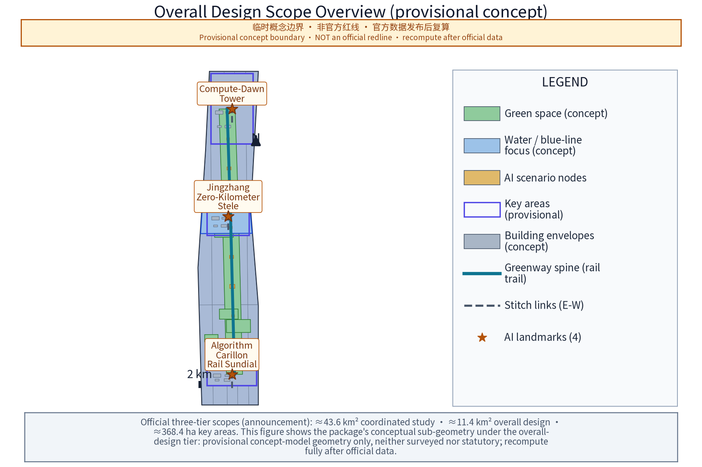
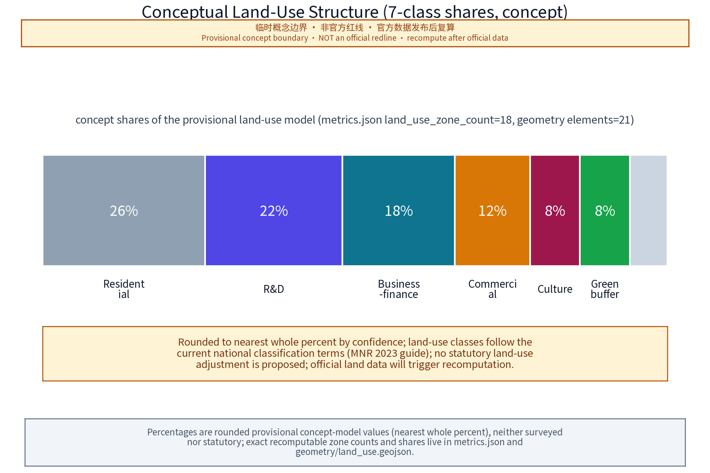
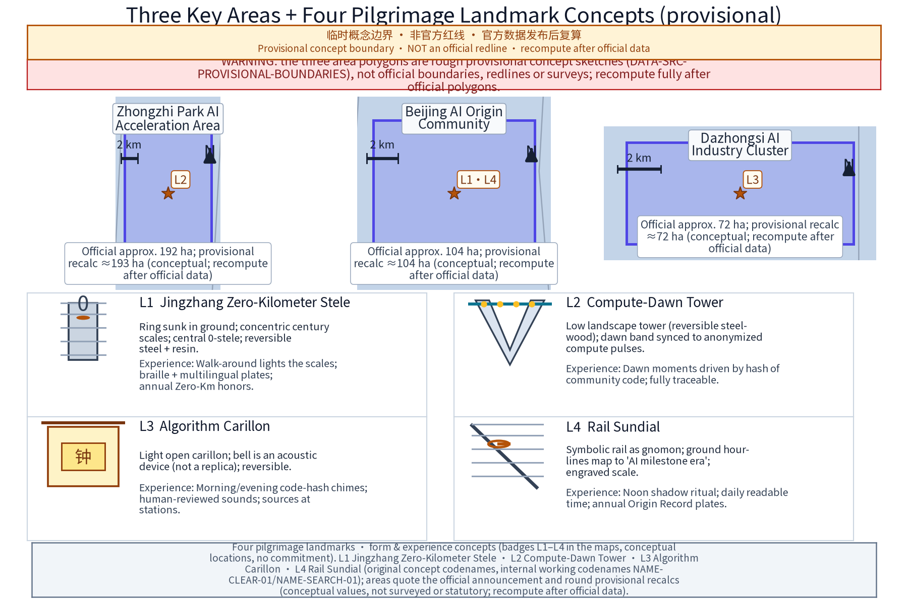
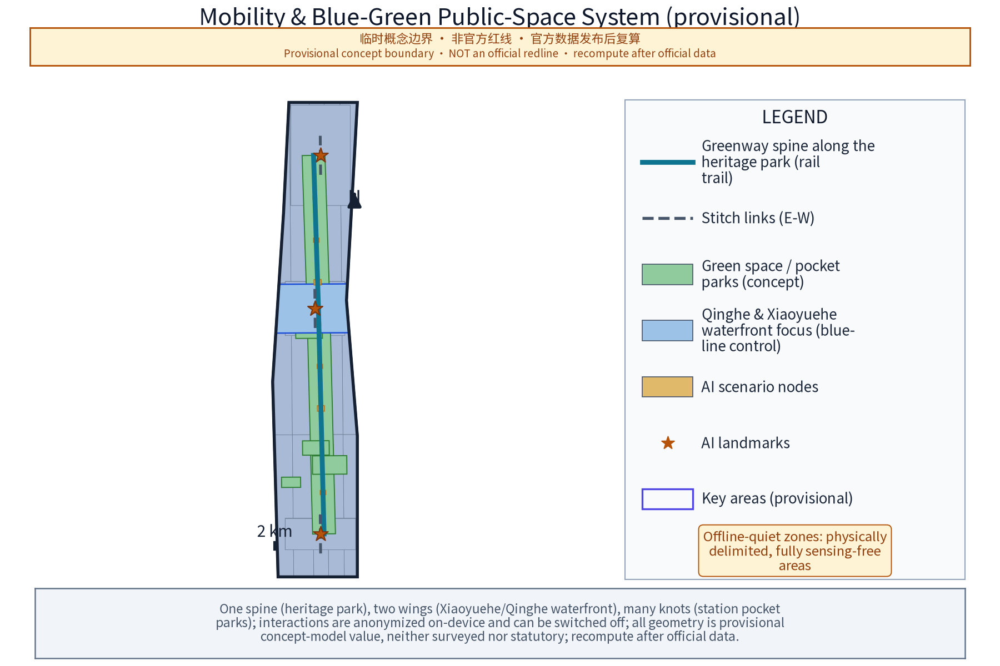
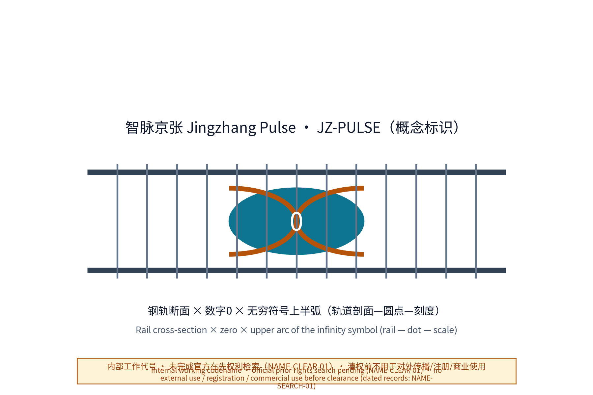
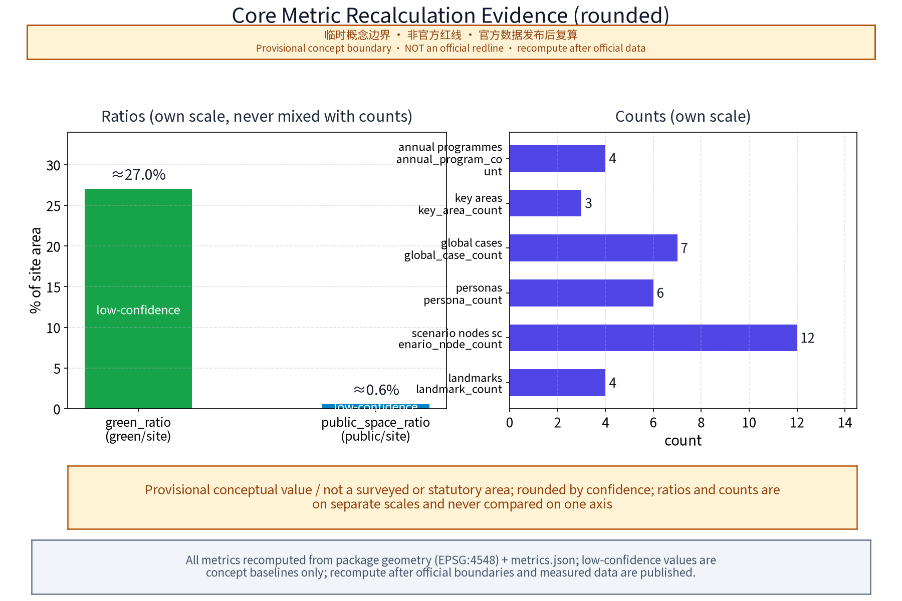
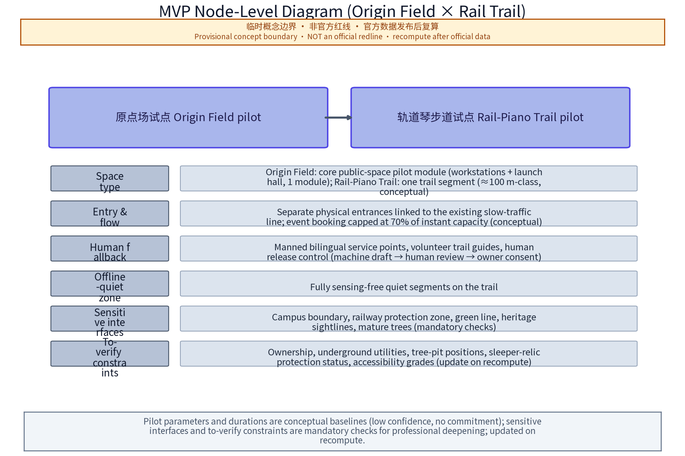

**Primary concept name:** "智脉京张——百年京张AI创新带" (Jingzhang Pulse - Centennial Jing-Zhang AI Innovation Belt); **English primary name:** "Jingzhang Pulse - AI Innovation Belt", abbreviated **JZ-PULSE**. "Zhimai (Pulse)" carries the double image of "the city's intelligent-computation pulse" and "the railway artery"; "Pulse" echoes pulse, heartbeat, and the continuous heartbeat of an open-source community - a corridor throbbing with code. Sub-slogan (concept): **"From Steel Rails to Compute Trails"**, with "Kilometre Zero, Infinite Compute".

**Naming system (concept):** one primary name, three areas, two wings, one network of many stations. The three areas carry working names on top of the official names: Zhongzhi Park's working name "众智台"; the Beijing AI Origin Community's "原点场" (Origin Plaza); the Dazhongsi AI Industry Cluster's "钟声里" (Inside the Bell). The two wings are "智服翼" (Service Wing) and "场景翼" (Scenario Wing). Stations along the belt form a "rail-cluster station" system with names such as "0-km Station", "Algorithm Station", "Echo Station", "Morning Bell Station" and "Ark Station", numbered J-01 to J-n (concept numbers, subject to detailed design). The four original pilgrimage landmarks (concept; the naming direction follows the official task wording, and the word-for-word comparison against detailed task-book text is pending verification; they shall not be arbitrarily renamed): **"Jing-Zhang Zero-Kilometre Monument" ("京张零公里坐标碑"), "Dawn of Compute Tower" ("算力曙光塔"), "Algorithm Bell Tower" ("算法钟楼") and "Rail Sundial" ("轨道日晷")**. Event brands (concept): "0-km AI Festival", "Rail Open-Source Conference", "Zhongzhi Origin Day", "Time-Capsule Sealing Ceremony". International residency brand (concept): "Rail Residency".

**Logo direction (evaluable graphic-system direction, concept):** a fusion of a rail cross-section and the mathematical symbol "0" - a dot embedded between two parallel rails, simultaneously reading as a track profile, the digit "0" and the upper arc of the infinity sign; steel-blue body colour with signal red and signal yellow accents (from railway safety colours). The graphic system is organised by evaluable elements: (1) monochrome and reversed versions - no gradient or multi-colour dependence; (2) scalability - minimum recognition sizes (e.g. 2 cm badge tier and 60 cm wayfinding tier), with internal detail removed at small sizes, keeping only the rail-dot-scale triad; (3) braille contact points and tactile version, with braille-point accuracy verified by human checks; (4) rail symbol vocabulary - rail cross-section, dot, scale ticks, switch and sleeper as the five base motifs, together with the "three-line co-rail" motif (rail/data/people flows). Contrast ratio suggestion no lower than 3:1 (referring to accessibility contrast methods). The final graphic is to be developed by a professional design team; **the prior-rights search status of names, marks and graphic symbols is honestly recorded as pending (pending_trademark_search); no search conclusion or registration result is claimed**; a dated preliminary public-web scan was executed on 2026-08-25 (NAME-SEARCH-01) and recorded with results and risk disposition - an official registry search remains mandatory before any external adoption or registration.

**Overall concept:** the belt should simultaneously gain three identities - a world-class AI pilgrimage landmark route, a daily-use urban park, and a global open-source collaboration site. All spatial expressions are presented as "concept suggestions and reference designs" for professional teams to develop; they do not constitute statutory planning conclusions.

## Design Basis and Source List

This proposal is a conceptual text. The working basis is classified as follows (to be verified and updated by a professional team; the definitive list follows the organiser's data pack):

1. **Organiser materials**: the international open-call announcement, task book and later releases. The organiser has not yet published official boundary polygons; existing geometry is a temporary rough base map. All zone descriptions here rely only on official text and public narrative context and must not replace official boundaries.
2. **Higher-level plans and regulations**: the Beijing Master Plan (2016-2035) and Haidian district plan, Zhongguancun Science City plans and policy documents, blue-line/green-line control rules, rail-transit protection zone regulations, and accessibility/age-friendly standards (current valid versions).
3. **Historical literature**: Jing-Zhang Railway construction history, Zhan Tianyou engineering literature, and station history of the Xizhimen-Qinghe section (Qinghuayuan etc. per authoritative sources and the heritage list published by cultural-relics authorities).
4. **Public project materials**: public notices and reports on the Jing-Zhang Railway Heritage Park, and public information of the Ancient Bell Museum (Dazhongsi).
5. **Case materials**: public materials on global AI innovation ecosystems (see case table; individual figures marked "unverified" where applicable).

**Machine-readable package note:** this package includes `geometry/` (9 GeoJSON layers: site boundary, key areas, land use, buildings, roads, green space, public space, constraints, phasing), `metrics.json` (recomputable metrics), `compliance_matrix.json` / `standard_matrix.json` / `design_depth_matrix.json` (task and depth coverage), `assumptions.json`, `sources.json`, `drawings/` (A3 booklet and A0 boards) and `visual/index.html`. All geometry is provisional concept layer data: `official_boundary=false`; areas and ratios are used only for generation, self-check and visualisation and must not be treated as official redlines, approval bases or statutory control conclusions. Full recalculation is required once the organiser publishes official boundaries and key-area polygons.

> Evidence anchor: [source:DATA-SRC-OFFICIAL-ANNOUNCEMENT-2026-05-09], [source:DATA-SRC-AGENT-TASKBOOK-2026-05-18] (organiser announcement and task book are the basis for all textual wording).

## Three-Level Scope Framework

The three-level scope follows the official text: **coordinated research area 43.6 km²** (north to the 5th Ring Road, east to the Jingzang Expressway, south to Xizhimen Outer Street, west to Wanquanhe Road); **overall design area 11.4 km²** (1-2 km urban and industrial belts around the heritage park); **key areas totalling 368.4 ha** (Zhongzhi Park AI Innovation Acceleration Area ~192 ha, Beijing AI Origin Community ~104 ha, Dazhongsi AI Industry Cluster ~72 ha). Exact boundaries follow the organiser's publication.

Suggested three-level working framework (concept):

- **Level 1 (coordinated)**: a four-network overlay study (industry, transport, ecology, culture) producing belt structure, corridor system and node hierarchy;
- **Level 2 (overall design)**: an urban-design guideline draft and public-space-system study using the "regulatory-plan-depth" research method; plot-level content is developed by qualified teams through statutory procedures;
- **Level 3 (key areas)**: each of the three areas gets a place-making concept, demonstration units and a scenario-site list;
- **Cross-cutting mechanism**: a "one-case-one-plan" node list and an "official-text area check table" linking the three levels to prevent scope misreading.

The proposal responds to the task book's three positions (centennial Jing-Zhang cultural belt, urban AI lifestyle experience belt, AI-integrated innovation belt) and five functions (AI full-stack independent innovation system, world-class AI innovation ecosystem, new AI+ scenario empowerment paradigm, intelligent AI-vibrant city, global AI governance voice) on the public-space and AI-ecosystem dimensions, as one spatial carrier of "AI+ scenario empowerment" and "AI-vibrant city" (concept mapping).

> Evidence anchor: [source:DATA-SRC-AGENT-TASKBOOK-2026-05-18] (three-level scope follows official task-book wording).

## Coordinated Research Area: Industry and Future City Research

(43.6 km²) Suggested concept structure: **"one belt, two wings, multiple cores"**.

- **One belt**: the heritage-park AI public-space main belt (culture, ecology, vitality);
- **Two wings**: the Zhongguancun technology-service wing (global allocation of elements, Zhongguancun IP and capital empowerment) and the Xiaoyue River scenario-empowerment wing (AI+ scenario empowerment and intelligent AI-vibrant city);
- **Multiple cores**: real city nodes - Qinghe, Shangdi/Zhongguancun Software Park, Zhichun Road, Zhongguancun Avenue, Xueyuan Road - as narrative anchors and traffic sources (narrative background, not new statutory zones).

> Evidence anchor: [source:DATA-SRC-PROVISIONAL-BOUNDARIES-2026-06-05] (provisional boundaries; the study scope is a concept only).

Future-city research topics (concept): (1) "work-create-live-tour" mixed corridor trends; (2) public-service forms for AI professionals and global talent (bilingual services, flexible offices, international communities - concept directions only); (3) a proposal that computing-energy heat dissipation and power-supply coordination be studied as a municipal topic (no engineering conclusions); (4) block-level landing research for urban-running AI simulation and governance scenarios. This section states research topics only.

## Overall Design Area: Urban Renewal and Regulatory-Plan-Level Urban Design

(11.4 km²) This level is positioned as a **research-method and principle framework**; it gives no statutory conclusions on FAR, building height, road redlines or retain/renovate/demolish.

Four suggested principles (concept): (1) **rail-first** - the heritage park is the stitching spine organising functions on both sides; (2) **stock-first** - evaluate first, retain first; retain/renovate/demolish conclusions always follow statutory procedures; (3) **scenario-first** - each renewal unit binds 1-2 AI scenario sites; (4) **resilience-first** - green and open spaces also serve storm-water retention and heat-island relief.

> Evidence anchor: [source:DATA-SRC-MOHURD-CONTROL-DETAILED-PLANNING] (control-plan-depth wording references the national regulatory detailed planning measures).

"Regulatory-plan-depth" working method: build a four-step research chain "existing-conditions assessment - scenario implantation - form deduction - compliance check"; split the area into study units by the organiser's final boundary, and compile a "unit scenario card" and "unit compliance self-check table" per unit as inputs to downstream statutory planning and urban design.

## Detailed Design of Key Areas

> Evidence anchor: [source:DATA-SRC-PROVISIONAL-BOUNDARIES-2026-06-05], [data:PACKAGE-GEOMETRY] (the three key-area polygons come from this package's geometry/key_areas.geojson).

This level gives concept-level detailed design for the three key areas (areas and positions per official text, not measured boundaries), sharing one "rail narrative" spine: the Jing-Zhang railway culture provides the structural thread connecting the four original landmarks (Zero-Km Monument, Dawn of Compute Tower, Algorithm Bell Tower, Rail Sundial) with walking paths, open space and building frontages into a continuous spatial sequence. Three design intentions: first, AI-industry narratives become everyday public space (release stages, review halls and contributor paths as low-barrier public facilities); second, all landmarks and installations keep offline manual fallback paths and accessibility-parallel design - no digital divide; third, building massing, height and land use are form suggestions only, with no regulatory-plan conclusions. At the geometry/metric level, geometry/key_areas.geojson gives provisional polygons and metrics.json's key_area_count, landmark_count and scenario_node_count derive from that geometry; everything is recalculated after official polygons are released. Data gaps are honestly recorded: surveyed buildings, ownership and regulatory indicators are not public at concept stage.

### Zhongzhi Park AI Innovation Acceleration Area

(~192 ha, official text) Carries the AI full-stack independent innovation system and AI governance voice (concept position).

"Three-tier terrace" spatial narrative: the heritage-park greenbelt is the low public tier, with R&D piloting and public services organised on both sides (form intention, not height conclusions). A "full-stack corridor" route concept links basic software/hardware, toolchains and evaluation nodes into a walkable narrative - making "full stack" a tangible spatial experience.

Governance-voice space: the "AI Governance Simulation Hall" concept - public rule-sandbox exercises, hearing rehearsals, review-report release halls; spatial expression emphasises "auditable and reviewable": transparent assembly hall, public agenda screens, minutes boards (all content human-reviewed). Complemented by the "Dawn of Compute Tower" landmark and the "Zhongzhi Contributor Honour Wall".

### Beijing AI Origin Community

(~104 ha, official text) Positioned as the "origin" narrative of a world-class AI innovation ecosystem.

"Origin Plaza" concept: a multi-function origin plaza organising 24-hour vitality units (concept): open workbenches, pop-up labs, release halls, coffee-book bars and developer service points; operator to be decided. Ecosystem elements: "Release Stage", mentor duty rota corner, developer honour wall, and a ritual "contributor path" (signed styles chosen by the community with the individual's consent; concept).

The "Zero-Km Monument" and "Rail Sundial" landmarks are suggested here (see public-space chapter); the "Zhongzhi Ark" open-source forum gallery (deck-shaped boat component, not a landmark) hosts open-source assemblies, proposal boards and releases. Adjacent to universities and research institutes, the area conceptually emphasises a seamless slow-traffic campus-street link (no change to statutory land-use or management boundaries).

### Dazhongsi AI Industry Cluster

(~72 ha, official text) Positioned as an AI-native business cluster (concept).

Cultural anchor: the Ancient Bell Museum and the Yongle Bell tradition (per the cultural-relics body's published information; the Yongle Bell is about 6.75 m tall, about 46.5 t and carries over 230,000 characters of inscriptions, with dimension wording differing between official sources - see the registration table), working theme "Inside the Bell" - a dialogue between bell rhythm and algorithm rhythm; the "Algorithm Bell Tower" landmark is suggested at the seam with the heritage park (see public-space chapter), hosting the "morning bell" ritual and code-traceability experience.

AI-native consumption concepts: "Rail Bazaar" night market (AI-curated music, smart-product pop-up experience stalls), "Smart Window" (window curation based on aggregated public footfall data - aggregated only, never identifying), "Smart Kiosk" (convenience point with product trials and human attendants), and a consumer-AI compliance review concept store (making the "review-disclosure" process a public programme). Business concepts: product release galleries, vertical application showrooms, and a fast-service window for small developers (mechanism suggestion, not a policy commitment).

**All-age inclusion (concept):** public space and interactive facilities serve seniors, children, students, commuters, visitors and people with disabilities; guides and accessibility cover all ages; vulnerable groups get a dedicated channel in resident consultation and deliberation mechanisms.

## AI Innovation Ecosystem, Personas, and AI+ Scenarios

**1. AI innovation ecosystem map (concept framework):** four layers - **foundation** (compute, data, open-source foundations and toolchains), **model** (R&D and evaluation of foundation and vertical models), **application** (industry AI, AI-native consumption and city-level scenarios), and **governance and ecosystem** (evaluation compliance, community organisation, talent cultivation and honour systems). A "scenario-open catalogue" is the horizontal interface: each scenario carries a site, an open-data scope, a suggested operator and a compliance boundary. The map names no specific companies, keeping an open "platform + ecosystem niche" phrasing.

**2. Global AI innovation ecosystem case table (real cases; case existence and institutional facts are itemised with sources CASE-REF-01…07; comparison conclusions are research hypotheses; statistics follow source pages):**

| Case | Country/City | Comparable points with Haidian | Differences & lessons | Verification status |
|---|---|---|---|---|
| Silicon Valley | USA | University-capital-company coupling in a self-grown innovation ecosystem | Highly market-driven growth; Haidian needs proactive collaboration density via public space and scenario openness | Institutional page verified (CASE-REF-01); statistics per that page |
| King's Cross Knowledge Quarter | London, UK | Railway-heritage regeneration driving the knowledge economy; station-knowledge-institution-public space integration | Single-owner regeneration; Haidian is multi-owner stock renewal needing "stitching" mechanisms | Institutional page verified (CASE-REF-02); scale figures per that page |
| Seoul Digital Media City (DMC) | Seoul, South Korea | Digital-content agglomeration plus district event operations | Flagship-district model; Haidian emphasises interlocking with existing urban fabric | City-government policy archive verified (CASE-REF-03) |
| one-north | Singapore | Walkable, park-like R&D agglomeration with lifestyle support | Greenfield district versus Haidian's infill; "research as life" is transferable | JTC institutional page verified (CASE-REF-04) |
| Munich Quantum Valley | Germany | Basic-research anchors organising big-science collaboration around a frontier | Single-theme depth; Haidian should combine full-stack and multi-scenario | MQV page verified (CASE-REF-05) |
| Cloud Town (Yunqi Xiaozhen) | Hangzhou, China | Annual-conference IP driving agglomeration; town-company co-operation | Single-IP pull; Haidian can learn the "conference - permanent space - industry service" chain | Xihu District government article verified (CASE-REF-06, 2024-10-03) |
| Kendall Square | Boston, USA | Dense university-lab-incubator-pharma corridor | Tower-based economy with limited street publicness; Haidian should compensate with park public space | MIT page verified (CASE-REF-07) |

**3. Personas (6 persona groups, matching persona_count=6 in metrics.json):**

| Persona | Profile | Core needs | Related scenarios |
|---|---|---|---|
| P1 Algorithm engineers / independent developers | 24-38, deep open-source participants, flexible time | Low-barrier workbenches, compute experience, honours, peer exchange | Origin Plaza workbenches, Release Stage, Zhongzhi Origin Day, Rail Open-Source Conference |
| P2 University faculty, students, researchers | Along Xueyuan Road and Zhongguancun Avenue | Scenario data interfaces, joint evaluation, results display and transfer windows | Full-stack corridor, AI Governance Simulation Hall, review concept store |
| P3 Generation-Z digital natives | 18-30, creators and heavy smart-product users | Insta-worthy experiences, pop-up consumption, create rather than watch | Rail Bazaar, Smart Window, Algorithm Bell Tower, 0-km AI Festival |
| P4 Older residents and original inhabitants | 55+, familiar with old Jing-Zhang memory | Age-friendly services, nostalgia narrative, daily rest and health activity | Age-friendly trail sections, manual service stations, Echo Station |
| P5 International digital nomads and foreign founders | Short-term stays, multilingual | Bilingual services, international events, community acceptance, visa facilitation (concept) | Rail Residency, international guides, Zhongzhi Ark forum |
| P6 Local merchants and families | Nearby merchants, families with children, commuters | Business traffic, child-friendly facilities, convenience services | Rail Bazaar, Smart Window, Smart Kiosk, night-run light band |

**4. AI+ scenario cards (12, concept; matching scenario_node_count=12 in metrics.json):**

| No. | Scenario card | Spatial carrier | Data flow | Model capability boundary | Interface & evaluation | Operator | Data & privacy boundary |
|---|---|---|---|---|---|---|---|
| S1 | Rail Classroom | J-series stations along the park | Voluntary work/quizzes -> edge anonymisation -> aggregated statistics -> public display | Retrieval and general Q&A only; no individual profiling or identification | Booking interface; evaluation = completion & satisfaction survey (n>=50/period), human content review | Culture/heritage bodies + university volunteers | Anonymous questionnaires and voluntary outputs only; withdrawal anytime |
| S2 | Rail Multilingual Guide | All stations and checkpoints | Local TTS/ASR -> edge processing -> no audio retention | Offline multilingual model; no cloud upload; no conversation capture | Offline SDK; evaluation = human multilingual review + accuracy spot checks, version registry | Park operator + content team | Location processed locally, can be switched off, retention disclosed |
| S3 | Smart Window | Dazhongsi street windows | Public footfall counts -> edge aggregation -> anonymised display | Counting only, no faces or individual trajectories | Daily aggregated interface; evaluation = count vs manual sample <=10% deviation | Merchant alliance + platform service provider | Counts only, anonymised, one-touch shutdown |
| S4 | Rail Bazaar | Dazhongsi / south park market ground | Merchant data handled by each merchant; organiser collects anonymous participation statistics only | No AI pricing or footfall decisions on individuals | Application interface; evaluation = safety/noise checklist | Curator company + merchants | Transaction data per merchant platforms; organiser retains none |
| S5 | Algorithm Bell | Algorithm Bell Tower (Dazhongsi-park seam) | Public code submissions -> hash -> bell sequence -> traceable display | Hash mapping and preset timbres only; no generative composition | Open-source submission interface, human code review; evaluation = sound level & schedule (day <=65 dB(A) etc.) | Community committee + arts team | Public submissions, human-reviewed, anonymous option |
| S6 | Zhongzhi Ark Deliberation | Zhongzhi Ark forum gallery (Origin Community) | Proposals & minutes -> pseudonymised summaries -> human review -> public display | Topic aggregation and retrieval only; no automatic decision advice | Proposal interface + human deliberation; evaluation = closure cycle (<=30 days) | Developer community self-governance committee | Voluntary public speech, anonymous option, reviewed minutes |
| S7 | Rail Sundial Time Capsule | Rail Sundial node (Origin Community-Zhichun Road seam) | Annual milestone entries -> academic committee decision -> local archive sealing | Entry retrieval only; no prediction models | Nomination + review disclosure; evaluation = 100% completeness of approved and archived entries | Committee + library institutions | Reviewed content, personal authorisation, withdrawal |
| S8 | Low-Speed Smart Equipment Trail | Zhongzhi outer ring to Xiaoyue River wing (physically separated) | Equipment test data -> controlled alliance environment -> anonymised release | Low-speed navigation/obstacle avoidance, <=6 km/h, physical separation, no sensing in pedestrian zones | Test application & data interface; evaluation = third-party safety review report | Test alliance + operator | Test zones physically separated, marked, speed-limited; no pedestrian data |
| S9 | Accessible AI Voice Station | Main stations (Origin Plaza, Algorithm Station) | Voice interaction -> immediate processing -> no recording retention | STT + sign-language video point playback; no facial recognition | Large-type/voice/sign-language usability tests (n>=30 disabled & senior sample) | Park operator + disability federation | No recording retention; one-touch off |
| S10 | Developer Pop-Up Workbench | Origin Community pop-up modules | Access time records -> local retention -> deletion at expiry | No behaviour analysis, no usage profiling | Booking interface; evaluation = satisfaction survey + monthly vacancy stats | Community operator | Access times only; retention disclosed, appealable |
| S11 | AI Governance Simulation Hall | Zhongzhi Park hall (echoing Dawn of Compute Tower) | Sandbox topics & anonymised data -> pseudonymisation -> reviewed minutes | Rule sandbox and retrieval aids only; no automatic administrative conclusions | Topic booking; evaluation = minutes timeliness and 100% review pass | Research institutions + operator | Discussions pseudonymised; minutes reviewed before release |
| S12 | Night-Run Light Band | Xiaoyue River scenario wing trail | Cadence/lamp triggers -> edge anonymous aggregation -> rhythm statistics only | Cadence aggregation only; no identification | Lamp self-test + manual patrol; evaluation = self-test coverage >=95% | Street renewal node operator | Anonymous counts only; no trajectories; one-touch off |

> Evidence anchor: [source:DATA-SRC-GENERATIVE-AI-INTERIM-MEASURES] (reference for AI-generated-content governance wording).

**5. AI industry test & verification scenarios (3, concept; matching industry_test_scenario_count=3 in metrics.json):**

| No. | Test protocol | Verification carrier (concept) | Protocol essentials | Evaluation & release mechanism |
|---|---|---|---|---|
| T1 | Low-speed smart equipment & robot demonstration corridor | Zhongzhi-Xiaoyue River wing trail (physically separated) | Low-speed navigation/obstacle avoidance, <=6 km/h, physical separation, no sensing in pedestrian zones; limits per S8 | Third-party safety review before opening; labelled, separated zones |
| T2 | AI dialogue quality & consumer-product review/disclosure | Dual-line hall (multilingual dialogue quality + compliance review & disclosure) | Multilingual AI dialogue evaluation for export products + consumer AI compliance review; human + machine dual track | Public standards and data scope; human-reviewable conclusions; public results display |
| T3 | City-operations AI simulation sandbox | Inside the AI Governance Simulation Hall | Anonymised-data city simulations; no automatic administrative conclusions | Topic booking, pseudonymised minutes, human review before release |

All follow "rules first, then opening"; conclusions are human-reviewable.

**6. Scenario-open operation mechanism (concept):** a "scenario-open catalogue" (site, open-data scope, compliance duties, candidate operators per scenario). Enterprises, teams and individuals enter via application-review-contract; all open data follows the minimum-necessary principle; face capture and individual behaviour tracking are prohibited.

**7. Scenario-domain coverage (concept):** the scenario cards cover industry, space and governance domains, with light demonstrations extending to transport connection (wayfinding and interactive trail), public services (accessible guidance, multilingual signs, convenience services) and culture (Rail Piano, sleeper rhythm and other sound interactions); all domains share one compliance boundary - minimum necessity, anonymous aggregation, human review.

## Land Use, Building Scale, and Retain-Renovate-Demolish Strategy

> Evidence anchor: [source:DATA-SRC-MNR-LAND-USE-CLASSIFICATION-202311] (land-use classification names follow the current national standard).

This proposal gives **no** land-use adjustment, building-scale figures or retain/renovate/demolish conclusions; below are working-method suggestions (concept):

**"Three assessments, one list" method:** (1) existing-building assessment (quality, structure, intensity); (2) heritage-value assessment (railway remains, old station buildings, industrial structures, per the cultural-relics published list); (3) ecological-value assessment (big trees, existing woodland, waterfront, bird corridors). The three assessments feed a rolling "retain/renovate/demolish list" formed by professional teams through statutory procedures.

**Scale-deduction method:** scenario-based "conservative / balanced / aggressive" tiers for professional teams and authorities to discuss; no values are preset. All scenarios treat the landscape-ecology bottom line (green line, blue line, big-tree protection) and rail-protection zones as hard constraints. **Untouchable bottom line:** heritage objects and protection ranges, planned green/blue lines, existing mature trees, and rail-protection zones (Jing-Zhang HSR and urban rail, per regulatory requirements).

## Transport, Rail, Municipal Infrastructure, and Public Services

> Evidence anchor: [source:DATA-SRC-MOHURD-URBAN-DESIGN-MEASURES] (method reference for slow-traffic and public-space wording).

(Concept directions; no engineering conclusions)

- **Slow-traffic first:** a continuous "walk+bike" corridor along the heritage park; east-west ease of crossing the rail, north-south continuity; short connections to existing stations (Xizhimen, Zhichun Road, Wudaokou, Shangdi, Qinghe) as context only - no new-line conclusions.
- **Accessibility (verifiable concept target):** continuous accessible movement and information access use a task-based, verifiable target - an **accessibility task completion rate**: pilot task = "independently reach a target station from the nearest bus/rail stop and complete one voice/sign-language/large-type information task"; sample: people with disabilities (wheelchair, visual, hearing, >=5 each), seniors (>=15), nearby residents (>=10), total >=35; acceptance = human accompaniment + structured questionnaire + human verification of voice/sign/large-type content, target completion >=95% (pilot sections). Existing inaccessible sections inside heritage or rail-protection zones are not promised to be removed; they are listed in an "accessibility gap improvement list" for professional assessment. Stations provide accessible toilets, baby-care facilities, AEDs and human bilingual service points.
- **Municipal topics:** professional studies on utility corridors, sponge city, heat-island relief and compute-power supply coordination are suggested (no engineering scheme); Xiaoyue River and Qinghe waterfronts strictly follow blue-line control.
- **Smart-traffic concept:** shared-bike electronic fences, physical separation of low-speed test equipment from pedestrians, dynamic aggregated traffic-information screens (aggregated data only).

## Blue-Green Network, Public Space, and Urban Character

**1. Blue-green system (concept):** the heritage-park greenbelt is the "spine", the Xiaoyue River and Qinghe waterfronts are the "wings", and rail-station pocket parks are the "knots" - a "one spine, two wings, many knots" network; blue/green lines and heritage constraints are respected throughout; existing mature trees are protected; waterfronts are near-natural.

**2. East-west stitching and north-south connection (concept):** visual and walking links across the park sides via "cross-rail galleries" - level pedestrian-priority crossings and "rail gate" structures at key nodes (concept intentions; final form and any bridge/tunnel decisions are for professional teams through statutory procedures). North-south continuity runs along the park: a "Memory - Vitality - Future" three-segment narrative sharing one station-numbering system, sustaining the ~9 km linear experience (length per official wording).

**3. Interactive rail trail (concept):** preserved old rails and sleepers are the trail motif with three low-intensity interactions: **Rail Piano** (stepping on sleepers triggers tones; sound assets co-created by local artists and developers), **Switch Plaza** (movable switch models change trail light themes), **Sleeper Rhythm** (walking rhythm drives local lighting; cadence aggregates only). All interaction data is anonymised at the edge, one-touch-off, and **sensor-free offline zones** are designated - physically delimited areas with no active sensing devices for citizens seeking digital silence.

**4. AI public-space component library (concept):**

- **Smart benches:** heating/cooling (climate-triggered), rest reminders, on-demand call for human service; no biometrics; call records' retention disclosed;
- **Interactive light poles:** light breathing with footfall rhythms, anonymous counts only, no identification; self-test and manual patrol in parallel;
- **Honour display installations:** QR/NFC readers; displayed content is **voluntarily submitted with the person's authorisation**, braille/voice/sign-language versions, withdrawal anytime;
- **Accessibility and age-friendliness (verifiable concept target):** organised as task-sample-acceptance - task (one station round trip + one voice/large-type/sign-language information task), sample (>=35 total, stratified per the transport chapter), acceptance (human accompaniment + structured questionnaire + human verification, target >=95%); age-friendly handrails and seat heights, large-type and voice guides, resident "Rail Guide" volunteers; digital interfaces pass age-friendly evaluation before launch; all auto-generated content (narration, lists, minutes) **must be human-reviewed before release**.

**5. Privacy and human-review boundary (general principles):** on-site sensing only aggregates counts; no faces, plates or individual trajectories; local retention with periodic public anonymised statistics; no "scoring, profiling, tracking" descriptions; honour display, auto-narration and review conclusions always follow "machine drafts, human reviews, individual authorisation, withdrawal anytime". The proposal excludes any over-monitoring or non-reviewable scenario design and performs no individual-identifying tracking.

**6. AI pilgrimage landmarks (4 original concepts; positions are concept suggestions)**

**1. "Jing-Zhang Zero-Kilometre Monument"** - suggested in the Origin Plaza core of the Origin Community (concept position). History is stated carefully: the railway's actual starting point is Liucun (per authoritative sources); this monument is a themed "cultural coordinate", not an official origin. **Form concept:** a steel rail ring set in the ground, concentric scales reading "1909 - Now - Future", a central "0" stele in weathering steel and translucent resin, prefabricated and reversible. **Experience:** circling triggers a ring-light "century scale"; braille and multilingual inscriptions. **Honours:** annual "0-km tribute" names on replaceable plaques around the stele, with consent and human review.

**2. "Dawn of Compute Tower"** - suggested at the north end of Zhongzhi Park on the edge of open green facing the Qinghe (concept position), with minimal grading and no intrusion into the greenline core. **Form concept:** a low landscape tower structure (prefabricated steel-wood), with a "dawn light band" pulsing in sync with anonymously aggregated compute status. **Experience:** each dawn-dusk "dawn moment" is driven by hash sequences of community-submitted code from the previous day; audio-visual assets are preset by the arts team and human-approved; code provenance is queryable at nearby stations. **Honours:** weekly "dawn code" selected names and abstracts on the tower-foot wall - public submissions with voluntary attribution.

**3. "Algorithm Bell Tower"** - suggested at the seam of the Dazhongsi cluster and the heritage park (concept position), dialoguing with the museum's "bell culture - algorithm rhythm" (museum rules respected; an independent lightweight installation, not a replica). **Form concept:** lightweight open bell tower; the bell is an acoustic installation (not a heritage replica), prefabricated and reversible. **Experience:** each dawn-dusk bell sequence is driven by hashes of community-submitted code; timbres preset by the arts team and human-approved; provenance queryable at nearby stations. **Honours:** weekly "morning-bell code" names and abstracts under the tower - public, voluntary, human-reviewed.

**4. "Rail Sundial"** - suggested at the Origin Community-Zhichun Road node (concept position). **Form concept:** a symbolic steel rail as gnomon, hour lines corresponding to "AI milestone chronology" (entries decided by an academic committee), a giant scale in the plaza paving. **Experience:** noon light calibration ritual; everyday foot-readable time. **Honours:** annual "Origin Record" individuals/teams engraved on annual plates, with human verification and consent.

> Evidence anchor: [source:DATA-SRC-MOHURD-URBAN-DESIGN-MEASURES] (method reference for blue-green organisation).

Common landmark principles: no occupation of heritage objects or protection ranges, no green-area reduction, prefabricated reversible installation, dimmed night lighting to protect birds (light-pollution control); exact positions and structures are for professional teams to develop with heritage, landscape and rail-safety requirements.

**7. Urban character guidance (concept):** steel, stone, wood and recycled concrete as primary materials continuing the railway industrial vocabulary; steel-blue-grey base with signal red/yellow accents; skyline following "low along the park, rising towards the sides" (form image, not height conclusions); night scene built on "rail light band + landmark point lights" with strict light-pollution control.

**8. Cultural narrative, wayfinding and symbol system (agent.5):** three narrative lines - (1) the century relay "from the first state-owned trunk railway to the open-source AI age"; (2) "a global AI living room in a park"; (3) "measuring innovation with the rail as ruler". Wayfinding uses the rail motif: the continuous rail line is the guide line; station numbers J-01... and distance ticks ("so far to 0-km") form the positional language; the symbol system includes the "0∞" primary mark and the "three-line co-rail" motif (rail/data/people), sharing one specification with the logo system (see the logo direction at the top). International communications emphasise real scenarios, real evaluation, real honours - all external materials are labelled "concept stage" and subject to review.

## Brand and Visual Identity (VI) Direction (Concept)

**Brand hierarchy (concept):** primary name "智脉京张 / Jingzhang Pulse - AI Innovation Belt (JZ-PULSE)" -> three-area working names (Zhongzhi Tai / Origin Plaza / Inside the Bell) -> two wings (Service Wing / Scenario Wing) -> station system (J-01...J-n) -> four landmark names -> event brands and the Rail Residency. All are concept naming suggestions; no brand is adopted.

**Core graphic "0∞" (concept):** rail cross-section fused with the mathematical symbol "0" - a dot embedded between two parallel rails, reading at once as a track profile, the digit "0" and the upper arc of infinity; complemented by the "three-line co-rail" motif (rail/data/people) and a braille contact version. Monochrome/reversed tiers, minimum recognition sizes (2 cm badge / 60 cm wayfinding), contrast ratio suggestion no lower than 3:1 (referring to accessibility contrast methods).

**Brand prior-rights and use boundary (honest record):** as of this version (concept stage), **no official trademark/copyright prior-rights search has been completed** for "智脉京张/Jingzhang Pulse/JZ-PULSE", the four landmark names (Jingzhang Zero-Kilometer Stele, Compute-Dawn Tower, Algorithm Carillon, Rail Sundial) or the "0∞" core graphic (register NAME-CLEAR-01). A **dated preliminary public-web scan was executed on 2026-08-25** (register NAME-SEARCH-01; objects, region/class scope, channels, executor, results and risk disposition are recorded in sources.json): **no identical prior trademark/brand use was found for the searched names**, but component-word near-matches exist (e.g. "智脉" is a component of existing platforms such as BrainCog; "曙光" is an industry brand component of Sugon; "脉动" is a Danone registered mark), sector neighbours exist (e.g. "rail service station" style names are in actual use by SF+Shenzhen Metro and Chengdu Rail Group), near-identical naming exists within the same open-collection ecosystem (peer submissions on 2026-08-18/19 use "Qi-Pulse" / "zhimai-jingzhang" style names), and the "0+∞" combined-graphic concept has multiple prior public uses (e.g. the Zero2infinity mark, the InfiniteZero rail-software wordmark) - this proposal therefore **does not claim novelty or registrability for the graphic symbol**. This preliminary scan is **not equivalent to an official registry search (CNIPA/WIPO etc.)**, which remains mandatory before any external adoption or registration. Handled honestly: (1) the names and marks are used in this evaluation package only as **internal working codenames** for review display and professional discussion; (2) until an official prior-rights search and clearance is completed, they are **not to be adopted externally, registered, used in external communications, marketing or commercial use**; (3) if search results do not support current use, the names or marks will be replaced immediately per professional advice or further demoted to inactive candidates; (4) where similar to existing marks or corporate identities, no prior right is claimed. This status is also recorded in sources.json (NAME-CLEAR-01, NAME-SEARCH-01) and assumptions.json (A-BRAND-001) and will be updated honestly in later versions.

## Renewal Projects, Implementation Policy, and Phasing

**Project-library framework (concept):** five categories - public space (greenbelt upgrades, pocket parks), stations (J-series), scenarios (S-series cards), landmarks (four landmarks), events (annual system). Rolling management, implemented item by item; timing follows competent-authority decisions; no schedule or investment estimates are given.

> Evidence anchor: [source:DATA-SRC-AGENT-TASKBOOK-2026-05-18] (phasing and implementation items correspond to task-book requirements).

**Event system (agent.6, concept; matching annual_program_count=4 in metrics.json):**

| Event brand | Season/frequency | Content (concept) | Main carrier |
|---|---|---|---|
| 0-km Open Day | Spring (annual) | Trail walk + kick-off run + open community experience | Origin Plaza, 0-km node |
| 0-km AI Festival | Summer (annual) | Exhibitions, market, pop-ups, open pitches | Origin Plaza, Rail Bazaar |
| Rail Open-Source Conference | Autumn (annual) | Topics, release ceremonies, honours, developer forum | Zhongzhi Ark, release halls |
| Time-Capsule Sealing Ceremony | Winter (annual) | Annual milestone review, sealing, tribute | Rail Sundial node, library institutions |

Monthly "Zhongzhi Origin Day" (last weekend, open pitches + mentor duty); landmark rituals (dawn, morning bell, noon calibration, sealing) form the annual rhythm.

**Developer-community operation (concept):** open-source collaboration charter (topic - review - implement - disclose), biweekly meetings, honour ladder (contributor -> steward -> honorary mentor), annual "Steel Rail Medal" (public selection process, human-reviewed results).

**AI scenario-open operation (concept):** scenario-open catalogue + sandbox evaluation + results disclosure; minimum-necessary open data with auditable traces.

**International communication and attraction (concept):** multilingual content hub, overseas community co-events, "Rail Residency" (open selection); single service interface - scenario applications, policy information and honour applications via one entry (not a policy commitment; formal policies prevail).

**Phasing suggestion (concept rhythm, not a commitment):** near-term (1-3 years) pilot demonstration - the "0-km" and Origin Plaza surroundings first; low-intensity installations and scenario catalogue pilots; resident deliberation points and open days. Mid-term (3-5 years) network expansion - complete trail, stations and four landmarks; annual operations and service disclosure; regular resident feedback with public replies. Long-term (5-10 years) full normalisation - three industry-verification scenarios and the event system in place; annual disclosure with resident oversight.

**Responsible parties (concept):** government coordination (planning, approval), enterprise operation (market operation of scenarios and facilities), universities and research institutes (evaluation and talent), communities and volunteers (daily maintenance and events), professional teams (detailed design and engineering) - specific duties follow statutory procedures.

## Metrics, Area Recalculation, and Compliance Matrix

**1. Directional indicator system (concept targets, not commitments):** greenbelt connectivity, station coverage and service radius, accessibility task completion (>=95%, pilot-verified), interaction anonymisation compliance rate (100% baseline), honour-display human review rate (100%), event counts and attendance, international visitor residency. Calibration with professional teams and authorities later.

**2. Area table (official text wording):**

| Level | Official text area | Notes |
|---|---|---|
| Coordinated research area | 43.6 km² | N to 5th Ring Rd, E to Jingzang Expwy, S to Xizhimen Outer St, W to Wanquanhe Rd |
| Overall design area | 11.4 km² | 1-2 km urban and industry belts around the heritage park |
| Key areas total | 368.4 ha | Three areas; exact boundary per organiser release |
| incl. Zhongzhi Park | ~192 ha | Official text |
| incl. Beijing AI Origin Community | ~104 ha | Official text |
| incl. Dazhongsi AI Industry Cluster | ~72 ha | Official text |

> Evidence anchor: [metric:green_ratio], [metric:public_space_ratio], [source:PACKAGE-GEOMETRY] (metrics recomputed from this package's metrics.json and geometry).

This proposal claims no precise coordinates or new area figures; professional teams re-check zone descriptions after official polygons are published. **Display precision commitment:** machine-readable files (metrics.json, geometry) keep recomputable finite values; all human-visible outputs (this text, HTML, charts and PDFs) round provisional values by confidence (areas to whole km²/ha scale, ratios to whole percent or one decimal) and annotate "provisional conceptual value / not a surveyed or statutory area" adjacent to the value; this is consistent with the "no precise figures claimed" statement above; full recalculation after official data is released.

**3. Counting conventions (consistent with metrics.json):** `land_use_zone_count=18` counts the 18 conceptual zone features in geometry/land_use.geojson (21 features minus the three standalone key-area features; the land-use chart shows 7 conceptual shares - a different denominator, geometry features prevail); `landmark_count=4` = four original landmarks; `scenario_node_count=12` = 8 scenario nodes + 4 landmarks in geometry/public_space.geojson, matching scenario cards S1-S12; `persona_count=6` = personas P1-P6. The files are the single authoritative scope; the text stays consistent; full recalculation after official geometry.

**4. Compliance matrix (self-check direction):** heritage (Jing-Zhang remains, old stations, Ancient Bell Museum, per published lists) - no occupation of objects or protection ranges; green - no reduction, no core-zone occupation; blue line - Qinghe/Xiaoyue riverfronts per control requirements; rail safety - construction and installation limits in HSR and urban-rail protection zones; accessibility - current standards with task-based verification; privacy - anonymisation and 100% human review of sensing. Formal compliance follows authority conclusions.

**Data-boundary commitment (concept):** sensing data of interactions and scenario systems remains anonymously aggregated and human-reviewed; no individual-identifying tracking; no over-monitoring; real measurements are tested and verified before opening; sensor-free offline zones and one-touch shutdown are provided.

> Evidence anchor: [source:DATA-SRC-OFFICIAL-ANNOUNCEMENT-2026-05-09] (collection rules are the basis for ownership and compliance wording).

## Risk, Copyright, and Compliance

**Concept risk notes:** (1) names and symbols may conflict with third-party rights; official trademark/copyright searches are required before formal use (status: a dated preliminary public-web scan was executed on 2026-08-25 - NAME-SEARCH-01, finding no identical prior use but several near-matches; official registry search still pending, honestly recorded as pending); (2) honour mechanisms carry fairness and review-liability risks - public rules and appeal channels required; (3) AI-generated content risks error and bias - always human review; (4) interactive installations carry failure/maintenance risk - fully offline manual fallback paths required; (5) everything here is concept-stage; no statement constitutes a determination of development timing, investment scale, policy arrangement or government commitment.

**Copyright note:** the text is original conceptual work; cited public material is attributed per rules; ownership vis-a-vis the organiser follows the collection rules. Uncertain case-table data is marked "unverified"; unverified figures must not be reused as fact.

**Risk register and recalculation triggers:** all risks are registered in assumptions.json with mitigations; "spatial dispute" and "policy uncertainty" score highest because the organiser has not published official boundaries or control indicators. Explicit triggers: official boundary polygons published; control indicators published; any landmark entering implementation. **Human-review commitment:** all areas, ratios and case data in text, matrices and figures carry scope and source labels; unverified figures never enter metrics.json or sources.json (both admit only verifiable entries).

> Evidence anchor: [source:DATA-SRC-OFFICIAL-ANNOUNCEMENT-2026-05-09] (collection rules as the basis for ownership and compliance wording).

## Regional Cooperation Matrix (Concept)

Below are **conceptual cooperation mechanisms** with external areas, mapping the pilgrimage route into the larger innovation network - the **three-district, two-wing ("三区两翼") extension** concept (North Latitude Community, Future Science City, Huairou Science City, Economic-Technological Development Area and the Jing-Jin-Ji network; the three-district/two-wing phrasing is a concept, not an official administrative conclusion). Names follow the task book (e.g. "North Latitude Community") without asserting equivalence; this matrix is not a government agreement or policy commitment.

| Partner | Cooperation type & mechanism (concept) | Participants (concept) | Interface carrier | Cooperation indicators (concept baseline) |
|---|---|---|---|---|
| North Latitude Community | Scenario-open and co-intelligence feedback loop into the scenario-open catalogue -> bimonthly deliberation -> apply-review-contract -> feedback reply | Community reps, scenario operators, developer community, street deliberation groups | Scenario-open catalogue, community deliberation, bimonthly joint meeting | >=3 topics adopted/year; feedback closure <=30 days |
| Future Science City | Research-industry linkage: joint AI scenario verification, talent and compute matching | Science-city operator, innovation actors, developer community | Joint verification, results channels | Joint verification scenarios/year |
| Huairou Science City | Big-science-facility related scenarios and data-compliance cooperation (concept level) | Science-city administration, research institutions | Data-compliance cooperation framework (concept) | Cooperation scenarios |
| Economic-Technological Development Area | Industrial landing and transfer channel for pilot scenarios | Park operators, resident companies | Single service interface | Transferred projects |
| Jing-Jin-Ji network | Experience exchange and standard alignment (concept discussions) | Relevant city and park organisations | Case exchange and discussion mechanisms | Mutual-learning events/year |

## Minimum Viable Pilot and Decision Logic (Concept)

**Pilot targets (concept):** landmark node: **Origin Plaza** (core public space of the Origin Community, including a Zero-Km Monument pilot module); AI public-space scenario: **Rail Piano Trail** (interactive rail trail segment). Both are original nodes already defined in this package with the physical boundaries and candidate operators needed for a minimum pilot.

**Pilot definition (concept):** prefabricated, reversible facilities first: one module each of the Origin Plaza open workbench and launch hall; one ~100 m Rail Piano Trail segment (concept length). Period and budget are concept baselines, not investment commitments.

Node-level diagram notes (for professional development): the diagram expresses both pilot nodes with six element classes - spatial types, entrances and flows, manual fallback points, sensor-free offline zones, sensitive interfaces (campus boundary, rail-protection boundary, green line, heritage sightlines, mature trees) and constraints to verify (ownership, utilities, tree-pit positions, sleeper-remains protection status, accessible grades) - a mandatory verification list for detailed design; recalculated with the official geometry release.

**Three-phase decision logic (concept):** (1) pilot phase (about 6-12 months, concept): install reversible facilities per plan, run real data collection; (2) evaluation phase: external evaluation against the go/no-go indicators below and public feedback; (3) scale-up phase: only when all go/no-go criteria pass and the competent authority approves, expand to other landmarks and scenarios.

**Pilot feasibility parameters (concept baselines, not commitments; each value gives type, basis or derivation, applicable standard, confidence level and recalculation trigger):**

| Parameter | Type | Value or tier (concept baseline) | Basis or derivation | Applicable standard | Confidence | Recalculation trigger |
|---|---|---|---|---|---|---|
| Cost tier (pilot, per site) | Qualitative tiering | Low (standardised off-the-shelf items + human-service, e.g. smart benches, service points) / Medium (custom interactive devices + basic site works, e.g. 100 m Rail Piano, dawn light device) / High (lightweight structures + system integration, e.g. Algorithm Bell Tower lightweight structure, basic Governance Hall) | Qualitative analogy of similar public-facility cases; **no specific amounts published**; amounts pending professional cost consulting | No mandatory standard (design assumption) | Low (pending professional costing) | Any item entering implementation; professional cost estimate issued |
| Capacity assumption | Design assumption (range) | Origin Plaza pilot module 200-500 person-visits/day; Rail Piano 100 m segment <=50 concurrent; landmark plaza events <=300 | Derived from pilot area, entrances and service capacity; event caps at 70% of instantaneous capacity | No mandatory standard (operational; density per industry practice) | Low (pending measurement) | First-quarter pilot data; official boundary release |
| Equipment lifetime | Design assumption (range) | Outdoor interactive devices design life 5 years (3-5 years in heavy use); electrical/sensing components 3-year replacement; reversible assemblies designed for 10 cycles | Derived from vendor warranty and inspection practice for similar devices | Vendor warranty terms (verification basis) | Low (pending vendor confirmation) | After equipment selection and warranty confirmation |
| Maintenance response | Concept target (range) | Fault response <=2 h (08:00-20:00), repair <=72 h; monthly inspection, annual overhaul; spare-part localisation >=80% | Service-agreement-draft assumption per public-facility maintenance practice | Service agreement (self baseline; no mandatory standard) | Medium (upgradable after contracting) | After agreement signing and pilot measurement |
| Acoustic/light safety test items | Design assumptions awaiting professional verification (limits) | (1) sound level day <=65 dB(A), night <=55 dB(A) (A-weighted equivalent); (2) flicker <=3 Hz, avoiding 5-30 Hz high-sensitivity band; (3) glare UGR<=19; (4) extreme-weather auto-degradation/shutdown plan | Candidate values referencing common ranges in relevant national/industry standards | GB 3096 Environmental Quality Standard for Noise etc. (final limits per qualified-body tests) | Low (pending professional acoustic/lighting tests) | Entering implementation; professional tests; official noise-zone data |
| Accessibility target | Verifiable concept target | Task completion >=95% (pilot sections); sample >=35 (disabilities >=5 each of wheelchair/visual/hearing, seniors >=15, residents >=10) | Task-sample-acceptance method (see transport and blue-green chapters) | Barrier-Free Environment Law principles + current accessibility standards | Medium | After pilot measurement |

**Conceptual RACI (responsibility matrix; not a statutory division; one accountable owner A per activity):**

| Activity (concept) | Operator | Designer | Developer community | Public | Competent authority |
|---|---|---|---|---|---|
| Pilot installation | A | R | C | I | R |
| Data collection and anonymised disclosure | A | C | C | I | R |
| Human review and content approval | A | C | I | C | R |
| Pilot evaluation and scale-up decision | C | C | I | C | A |

**Operation and maintenance model (concept):** layered O&M - facility (reversible installations inspection and repair per the response table), data (anonymous aggregation, disclosed retention, periodic public anonymised statistics), content (honour display and auto-narration: "machine drafts, human reviews, individual authorisation, withdrawal anytime").

**go/no-go indicators (concept baselines; ranges are not commitments; each gives type, basis or derivation, applicable standard, confidence level and recalculation trigger):**

| Indicator | Value (concept baseline) | Type | Basis or derivation | Applicable standard | Confidence | Recalculation trigger |
|---|---|---|---|---|---|---|
| Average monthly participation | >=1500 (Origin Plaza + Rail Piano combined, 3-month rolling) | Operational target assumption | Derived from capacity assumptions and analogy with similar open-district events | No mandatory standard (operational goal) | Low (pending measurement) | After first-quarter pilot data |
| Mean fault recovery time | <=72 h | Concept target | Consistent with the maintenance response table; into the O&M agreement draft | Service agreement (self baseline) | Medium | After agreement signing and pilot measurement |
| Public satisfaction | >=4.0/5 (structured questionnaire >=300, stratified disability/senior samples) | Concept target | Questionnaire design assumption; stratification approximating population | No mandatory standard (self-defined method) | Medium | After pilot questionnaires |
| Accessibility task completion | >=95% (human-accompanied verification; sample per transport chapter) | Verifiable concept target | Task-sample-acceptance method | Barrier-Free Environment Law principles + current standards | Medium | Recompute after pilot measurement |
| Privacy & compliance audit | Pass (data retention, anonymisation and withdrawal mechanisms tested; 100% human-review pass) | Compliance baseline | Item-by-item testing of anonymous-aggregation and human-review mechanisms | Interim Measures for Generative AI Services (Art. 2/14/15/17 boundaries) + package privacy principles | Medium | After audits; new regulations or official wording |

Relevant areas and metrics are recalculated after official geometry release.
**Pilot stop and exit mechanism (concept):** the pilot has explicit **stop conditions and exit mechanisms** - (1) any go/no-go criterion failing for two consecutive evaluation periods triggers a stop-item assessment, with the competent authority and professional teams deciding to continue, adjust or terminate; (2) privacy/compliance audit failure, public-safety incidents, major negative public sentiment or an authority halt immediately lead to deactivation and removal of the installations concerned; (3) removal follows the "restore to original state" principle: reversible dismantling of prefabricated facilities, site re-greening, restoration of reserved utility entries, and deletion of data at retention expiry; (4) early termination is not treated as failure; conclusions and data are disclosed and feed the scale-up revisions; (5) the government, operators and community deliberation bodies may all initiate a deactivation motion, with the final decision by the competent authority (concept mechanism, not a commitment of rights or obligations).

## References, Citation and Evidence Registration (Concept)

This package's sources.json holds verifiable sources. In response to the review finding that "the seven international cases and railway-history statements lack item-level authoritative origins", the principle is: **do not fabricate origins** - each international case and history statement now has an item-level source entry (CASE-REF-01…07, HIST-REF-01…03) with the publisher/institution page URL, published and accessed dates, and reuse boundaries; anything not verifiable item by item is marked "to be verified" or explicitly demoted to a "pending research hypothesis".

| Registration item | Statement location | Status | Reference anchor |
|---|---|---|---|
| Case 1 Silicon Valley (university-capital-company coupling; 1951 Stanford Research Park etc.) | Case table | registered_in_sources (case existence and institutional facts verified; some statistics unverified) | CASE-REF-01 (Stanford Research Park) |
| Case 2 King's Cross Knowledge Quarter (railway-heritage regeneration; 2001/2006/2008/2011 milestones) | Case table | registered_in_sources (institutional page verified; scale figures per that page) | CASE-REF-02 (King's Cross development) |
| Case 3 Seoul Digital Media City (landfill redevelopment, 2000 plan, 2002-2014 budget) | Case table | registered_in_sources (Seoul government policy archive verified) | CASE-REF-03 (Seoul Solution) |
| Case 4 one-north (walkable R&D cluster; 8 precincts, 400+ companies etc.) | Case table | registered_in_sources (JTC page verified) | CASE-REF-04 (JTC) |
| Case 5 Munich Quantum Valley (basic-research anchors; founded 2022) | Case table | registered_in_sources (MQV page verified) | CASE-REF-05 (MQV) |
| Case 6 Cloud Town (2014 special-town concept; 2015 conference relocated) | Case table | registered_in_sources (Xihu District government article verified, 2024-10-03) | CASE-REF-06 (Xihu gov portal) |
| Case 7 Kendall Square (2010 MIT community planning; five parking lots) | Case table | registered_in_sources (MIT page verified) | CASE-REF-07 (MIT) |
| Jing-Zhang Railway history (1905-1909, Zhan Tianyou, first self-built trunk line; Liucun start) | Cultural narrative, landmarks | registered_in_sources (NRA page verified; Liucun is a caption statement, treated as "per authoritative sources") | HIST-REF-01 (National Railway Administration) |
| Heritage park today (HSR underground ~6 km; 2017 approval; 2019 launch and international call) | Design basis, blue-green chapter | registered_in_sources (BMPDU interpretation page verified, 2021-12-16) | HIST-REF-02 (Beijing Municipal Planning & Natural Resources Commission) |
| Ancient Bell Museum (Juesheng Temple; Yongle Bell 6.75 m / 46.5 t / 230,000+ characters) | Key areas, cultural anchor | registered_in_sources (Beijing government portal museum page verified; dimension differences between official sources noted in text) | HIST-REF-03 (Capital Window) |
| Concept names JZ-PULSE, four landmark names, 0∞ mark | Brand & VI chapter | pending_trademark_search (internal working codenames; no external use or registration until official clearance; dated preliminary public-web scan recorded 2026-08-25 - no identical prior use found, near-matches noted) | NAME-CLEAR-01 / NAME-SEARCH-01 (sources.json records) |

All entries' publisher, URL, published/accessed dates and reuse boundaries follow sources.json (schema 0.1.0 extended); this table records the status of the corresponding statements.

## References

1. Organiser's announcement, task book and public data pack (including the three-level official wording);
2. Beijing Master Plan (2016-2035) and other higher-level plan texts (current versions);
3. Public reports and notices on the Jing-Zhang Railway Heritage Park (incl. BMPDU planning interpretation, HIST-REF-02);
4. Jing-Zhang Railway construction history and Zhan Tianyou engineering literature (incl. NRA feature "Centennial Jing-Zhang", HIST-REF-01);
5. Ancient Bell Museum public materials (incl. Capital Window museum page, HIST-REF-03);
6. Silicon Valley (Stanford Research Park), King's Cross, Seoul DMC, one-north, Munich Quantum Valley, Cloud Town and Kendall Square institutional/government pages (CASE-REF-01…07; verification status per the case table and registration chapter);
7. Accessibility and age-friendly national and industry standards (current versions);
8. Open-source governance and AI-ethics literature (incl. official text of the Interim Measures for Generative AI Services).

(Note: this is a purely conceptual text; all spatial suggestions are "concept suggestions / reference designs for professional development"; no unverified precise data is used; area values are labelled as official text wording.)

> Evidence anchor: [source:DATA-SRC-OFFICIAL-ANNOUNCEMENT-2026-05-09] (first entry is the organiser's public data pack).