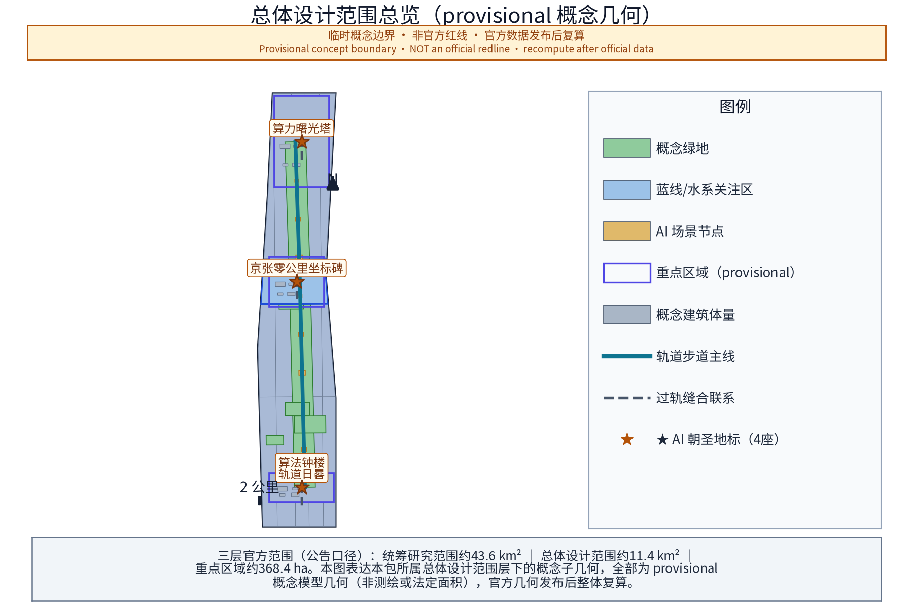
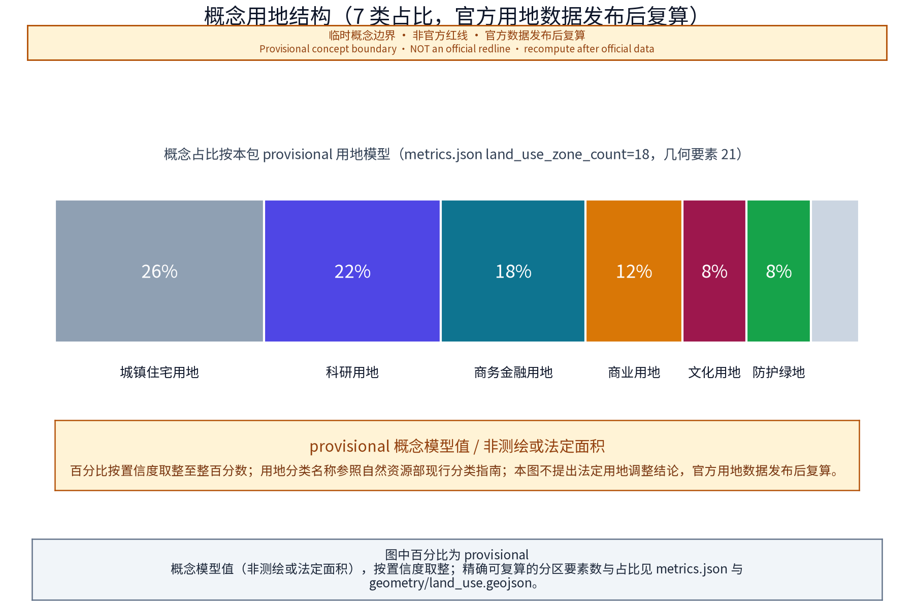
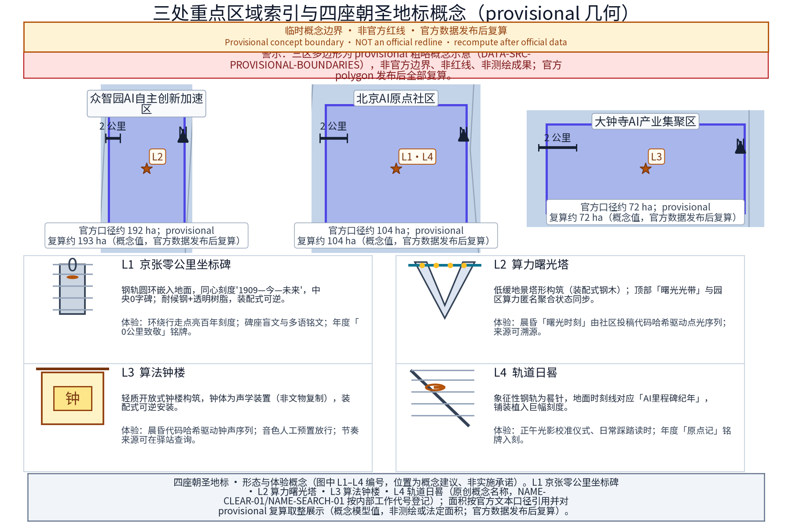
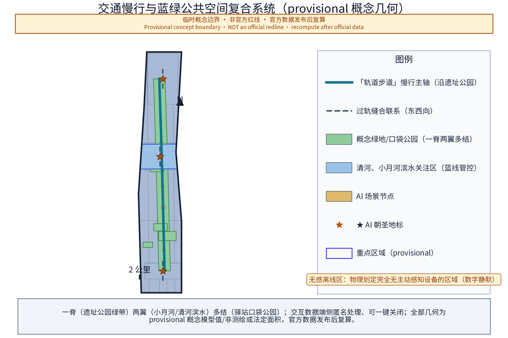
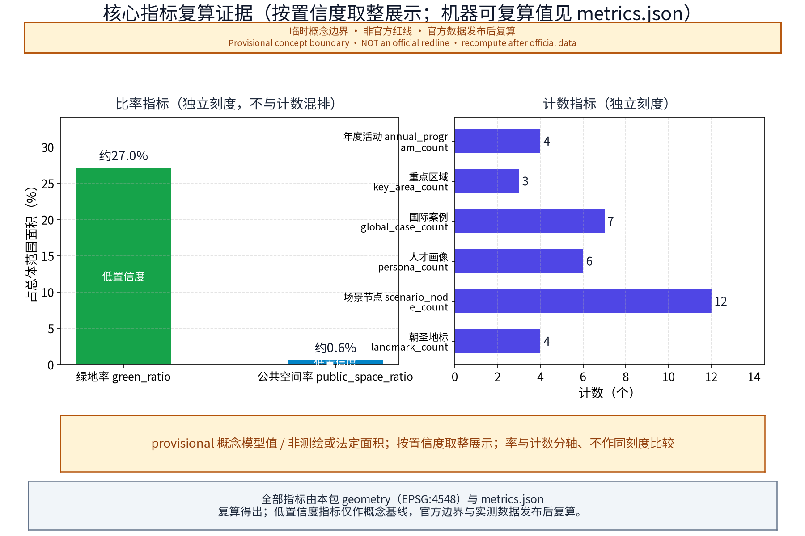
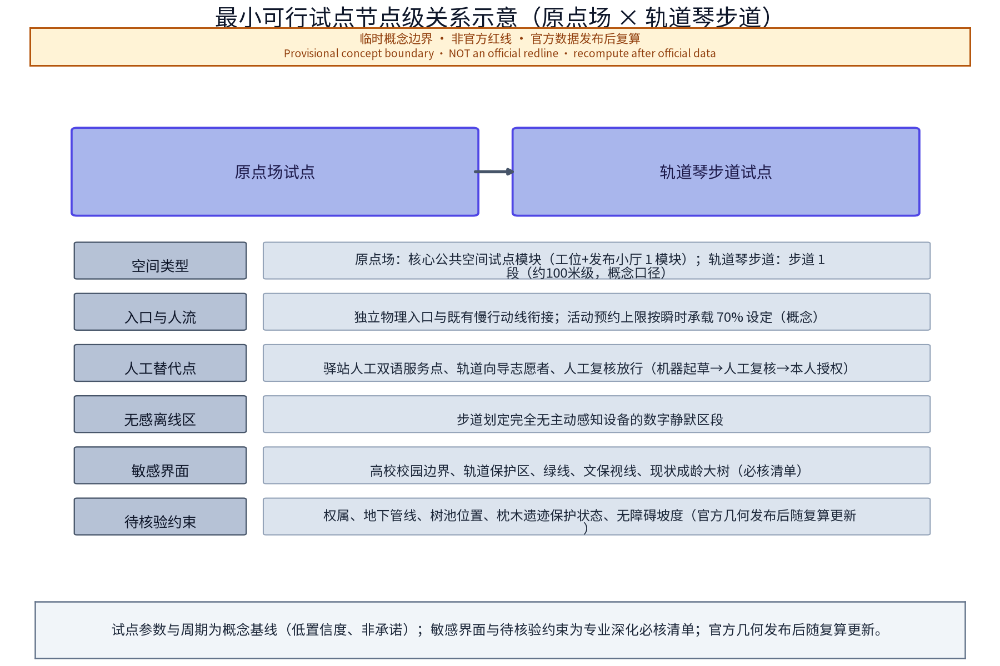

**主名称（概念建议）：**「智脉京张——百年京张AI创新带」；**英文主名：**「Jingzhang Pulse · AI Innovation Belt」，简称 JZ-PULSE。「智脉」取"城市智算之脉"与"铁路动脉"双重意象；「Pulse」呼应脉冲、脉搏与开源社区的持续心跳——一座因代码而搏动的城市走廊。副标语（概念）：**"From Steel Rails to Compute Trails——从钢轨到比特"**，辅以"0公里，无限算力（Kilometer Zero, Infinite Compute）"。

**命名体系（概念）：**一主名、三区、两翼、一网多驿。三区在官方名称基础上设工作雅称：众智园雅称「众智台」、北京AI原点社区雅称「原点场」、大钟寺AI产业集聚区雅称「钟声里」；两翼雅称「智服翼」与「场景翼」；沿带站点统一为"轨道驿站"体系，站名如「0公里驿」「算法驿」「回声驿」「晨钟驿」「方舟驿」，编号 J-01 至 J-n（概念编号，以深化设计为准）。四座原创朝圣地标（概念；名称方向与官方任务口径保持一致，与任务书细则文字的逐字对照待核实，不得随意改名）：**「京张零公里坐标碑」「算力曙光塔」「算法钟楼」「轨道日晷」**。活动品牌（概念）：「0公里AI节」「轨道开源大会」「众智原力日」「时间胶囊封存仪式」。国际驻留品牌（概念）：「轨道驻留计划（Rail Residency）」。

**Logo方向（可评估图形系统方向，概念）：**以铁轨断面与数学符号"0"融合——两条平行钢轨之间嵌入一枚圆点，整体同时呈现轨道剖面、数字"0"与无穷号的上半弧；配色建议钢青色为主体、信号红与信号黄为点缀（源自铁路安全色）。图形系统按以下可评估要素组织：①**单色与反白**——主标提供正色/反白两档单色版本，禁止渐变与多色依赖；②**可缩放**——设定最小识别尺寸（如 2cm 标识档与 60cm 导视档），小尺寸档删除内部细节仅保留"钢轨—圆点—刻度"三要素；③**盲文触点与触觉版本**——主标附盲文点位说明与可触摸浮雕版（点位正确率由人工核验）；④**轨道符号语汇**——钢轨断面、圆点、刻度、道岔、枕木五种基础语汇构成辅助纹样系统（「三线并轨」铁轨/数据流/人流），并给出黑白对比度建议（不低于 3:1，参照无障碍对比度方法）。图形方案由专业设计团队深化，**名称、标识与图形符号的在先权利检索状态如实登记为待核验（pending_trademark_search），不声称已获检索结论或注册结果**；2026-08-25 已执行日期化初步公开网络检索（NAME-SEARCH-01）并记录结果与风险处置，正式采用或注册前须完成官方登记机构检索。

**方案总体构想（概念）：**让这条带同时获得三种身份——世界级AI朝圣地标之路、可日常使用的城市公园、面向全球的开源协作现场。所有空间表达均以"概念建议、参考方案"呈现，供专业团队深化研究，不构成法定规划结论。

## 设计依据与资料清单

本方案为概念性文本，工作依据分类如下（由专业团队核验更新，具体清单以组织方资料包为准）：

1. **组织方资料**：本次国际方案征集公告、任务书及后续发布资料。组织方尚未发布官方边界多边形，现有几何为临时粗略底图；本方案所有分区描述仅基于官方文本口径与公开叙事背景，不得替代官方边界。
2. **上位规划与法规**：《北京城市总体规划（2016年—2035年）》及海淀分区规划、中关村科学城相关规划与政策文件、蓝线绿线管控规定、轨道交通保护区管理法规、无障碍与适老化相关标准（均以现行有效版本为准）。
3. **历史文献**：京张铁路修建史料、詹天佑工程技术文献、西直门至清河段站史沿革（清华园等站史以权威史料和文物部门公布名单为准）。
4. **公开项目资料**：京张铁路遗址公园相关公示信息与公开报道、大钟寺古钟博物馆公开信息。
5. **案例资料**：全球AI创新生态案例的公开资料（详见案例表，个别数据标注"未核实"）。

**机器可读提交包说明：** 本方案随附 `geometry/`（site boundary、key areas、land use、buildings、roads、green space、public space、constraints、phasing 共 9 个 GeoJSON 图层）、`metrics.json`（可复算指标）、`compliance_matrix.json` / `standard_matrix.json` / `design_depth_matrix.json`（任务与深度覆盖）、`assumptions.json`、`sources.json`、`drawings/`（A3 文册与 A0 展板）与 `visual/index.html`。全部几何均为 provisional 概念图层：`official_boundary=false`，面积与比例仅用于方案生成、自检与可视化，不得作为官方红线、审批依据或法定控制结论；组织方发布官方边界与重点区域 polygon 后必须全量复算。

> **证据锚点**：[source:DATA-SRC-OFFICIAL-ANNOUNCEMENT-2026-05-09]、[source:DATA-SRC-AGENT-TASKBOOK-2026-05-18]（组织方公告与任务书为全部文本口径依据）。

## 三层范围工作框架

三层范围为官方文本口径：**统筹研究范围43.6平方公里**（北至北五环路、东至京藏高速、南至西直门外大街、西至万泉河路）；**总体设计范围11.4平方公里**（京张遗址公园周边1—2公里城市地区和产业区）；**重点区域合计368.4公顷**（众智园AI自主创新加速区约192公顷、北京AI原点社区约104公顷、大钟寺AI产业集聚区约72公顷）。精确边界以组织方发布为准。

三层工作框架建议（概念）：

- **第一层（统筹研究）**：建立"产业—交通—生态—文化"四网叠加研究，输出带域结构、廊道体系与节点分级；
- **第二层（总体设计）**：编制城市设计导则草案与公共空间体系研究，按"控规深度"研究方法推进，地块尺度内容由具备资质的专业团队依法定程序深化；
- **第三层（重点区域）**：三区各设空间营造概念与示范单元建议、场景落点清单；
- **贯穿机制**：以"节点一处一案"清单与"官方口径面积校核表"衔接三层，防止范围误读与口径混淆。

本方案按任务书三大定位（百年京张文化带、都市AI生活体验带、AI融合创新带）与五大功能（AI全栈自主创新体系、世界级AI创新生态、AI+场景赋能新范式、智能化AI活力城市、AI治理全球话语权）中的公共空间与AI生态相关方向展开，作为「AI+场景赋能新范式」与「智能化AI活力城市」的空间载体之一，与地标叙事、场景开放、治理公示等能力结合（概念映射）。

> **证据锚点**：[source:DATA-SRC-AGENT-TASKBOOK-2026-05-18]（三层范围划分依据任务书官方文本口径）。

## 统筹研究范围产业与未来城市研究

（43.6平方公里）建议概念结构：**"一带两翼多核"**。

- **一带**：京张遗址公园AI公共空间主带，承担文化、生态与活力功能；
- **两翼**：中关村科技服务翼（要素全球化配置、中关村IP与资本赋能）、小月河场景赋能翼（AI场景赋能与智能化AI活力城市）；
- **多核**：清河、上地/中关村软件园、知春路、中关村大街、学院路等真实城市节点，作为空间叙事的背景锚点与功能流量来源（属叙事背景，非新增法定分区）。

> **证据锚点**：[source:DATA-SRC-PROVISIONAL-BOUNDARIES-2026-06-05]（边界为 provisional，研究范围仅作概念示意）。

未来城市研究课题方向（概念）：①"职—创—居—游"混合功能走廊趋势研究；②面向AI从业者与全球人才的公共服务形态（双语服务、弹性办公、国际社区等仅作概念方向）；③算力能耗与城市散热、供配电协同研究纳入市政专题的必要性提示（不给工程结论）；④城市运行AI仿真与治理场景的街区级落地研究。本节均为研究课题表述，供专业团队深化。

## 总体设计范围城市更新与控规深度城市设计

（11.4平方公里）本层定位为**研究方法与原则框架**，不给容积率、建筑高度、道路红线、拆改留等法定结论。

四条原则建议（概念）：①**轨道优先**——以遗址公园为缝合主轴组织两侧功能；②**存量优先**——对现状建筑与用地"评估先行、以留为主"，拆改留结论一律依法定程序形成；③**场景优先**——每个更新单元绑定1—2个AI场景落点，让更新有可体验的内容；④**韧性优先**——绿地与开放空间同时承担雨水滞蓄、热岛缓解等韧性功能。

> **证据锚点**：[source:DATA-SRC-MOHURD-CONTROL-DETAILED-PLANNING]（控规深度表述以国家控制性详细规划办法为参照）。

"控规深度"工作方法建议：建立"现状评估—场景植入—形态推演—合规校核"四步研究链；按组织方最终边界细分为研究单元，逐单元编制"单元场景卡"与"单元合规自查表"，作为后续法定规划与城市设计的输入文件。

## 重点区域详细设计

> **证据锚点**：[source:DATA-SRC-PROVISIONAL-BOUNDARIES-2026-06-05]、[data:PACKAGE-GEOMETRY]（三区示意多边形来自本包 geometry/key_areas.geojson）。

本层针对众智园AI自主创新加速区、北京AI原点社区、大钟寺AI产业集聚区三处重点区域（面积与定位均按组织方官方文本口径，非实测边界）给出概念级详细设计。三区共享一条「轨道叙事」主线：以京张铁路文化元素为结构线索，把"京张零公里坐标碑、算力曙光塔、算法钟楼、轨道日晷"四座原创地标与步行路径、开放空间、建筑界面组织为可连续体验的空间序列。设计意图上强调三件事：一是把AI产业叙事转化为公众可感知的日常空间（发版台、评测厅、贡献者步道等均为低门槛公共设施）；二是所有地标与装置均预留离线人工替代路径与无障碍同步设计，不制造数字鸿沟；三是对建筑体量、高度与用地性质只作形态示意，不预设控规结论。几何与指标层面，本包 geometry/key_areas.geojson 以 provisional 边界给出三区示意多边形，metrics.json 中的 key_area_count、landmark_count、scenario_node_count 即取自该几何；官方多边形发布后需全部复算。数据缺口已如实记录：现状建筑实测、地权属、控规指标均未公开，属概念阶段。

### 众智园AI自主创新加速区

（约192公顷，官方文本口径）承载AI全栈自主创新体系与AI治理全球话语权（概念定位）。

空间概念「三层台地」叙事：以遗址公园绿带为低层公共层，向两侧渐进组织研发中试、公共服务等功能（系形态意向，非高度结论）。建议组织「全栈走廊」动线概念——将基础软硬件、工具链、评测验证节点串联为一条可步行参观的叙事动线，让"全栈"成为可感知的空间经验。

治理话语权空间：「AI治理模拟厅」概念——公众可参与的规则沙盘推演、议题听证演练、评测报告发布厅；空间强调"可审计、可复核"的表达：透明议事厅、公开议程屏、纪要公示栏（内容发布均经人工复核）。配套「算力曙光塔」地标与「众智贡献榜」荣誉铭墙（详见公共空间章）。

### 北京AI原点社区

（约104公顷，官方文本口径）定位世界级AI创新生态的"原点"叙事区。

空间概念「原点场」：以一处原点多功能广场为中心组织24小时活力单元（概念）：开放式工位、快闪实验室、发布小厅、咖啡书吧与开发者服务点，运营主体另定。生态要素：「Release Stage」发版发布台、导师轮值角、开发者荣誉墙、礼仪性"贡献者步道"（步道上铭刻由社区评选并经本人同意的贡献者签名样式，概念）。

「京张零公里坐标碑」与「轨道日晷」两座地标建议设于本区（详见公共空间章）；「众智方舟」开源议事廊（甲板式船形公共空间组件，非地标）承载露天开源议事、提案板与发布功能。本区紧邻高校与科研院所集聚带，概念上强调"校园—街区"无边界慢行联系（不改变法定用地性质与管理边界）。

### 大钟寺AI产业集聚区

（约72公顷，官方文本口径）定位智能原生新业态集聚区（概念）。

文化锚点：大钟寺古钟博物馆及永乐大钟文化传统（以文物单位公布信息为准；永乐大钟通高约6.75米、重约46.5吨、铭文23万余字，不同官方来源对尺寸表述存在差异，详见引用与证据登记表），工作主题「钟声里」——钟文化节律与算法节律的对话；「算法钟楼」地标建议设于本区与遗址公园衔接处（详见公共空间章），承接"晨钟"仪式与代码溯源体验。

智能原生消费场景概念：「轨道市集」夜间市集（AI策展音乐、智能产品快闪体验摊）、「智感橱窗」（基于公开聚合客流数据的橱窗策展，仅聚合不识别）、「智造报亭」便民服务点（智能产品试用+人工值守）、消费级AI产品合规评测概念店（把"评测—公示"过程做成可参观的公共节目）。商务场景概念：新品发布廊、垂直领域应用展示厅、面向中小开发者的服务快线窗口（机制建议，不构成政策承诺）。

**全龄与包容（概念）**：公共空间与交互设施面向长者、儿童、学生、通勤者、游客与残疾人等多元人群设计，导览与无障碍配置覆盖全龄需求，弱势群体诉求在居民意见征集与议事机制中单独设通道。

## AI 创新生态、人才画像与 AI+ 场景

**一、AI创新生态图谱（概念框架）**

建议按四层组织生态图谱：**底座层**（算力、数据、开源基础件与工具链）、**模型层**（基础模型与垂直领域模型的研发评测）、**应用层**（行业AI、智能原生消费与城市级场景）、**治理与生态层**（评测合规、社区组织、人才培育与荣誉体系）。四层之间以"场景开放目录"作为横向接口——每个场景对应一个落点、一组开放数据范围、一个运营主体建议与一组合规边界。图谱不指认具体企业，保持"平台+生态位"的开放表述。

**二、全球AI创新生态案例表（真实案例；案例存在性与机构事实逐项登记来源 CASE-REF-01…07，比较结论为待研究假设，具体统计数字以来源页为准）**

| 案例 | 国家或城市 | 与海淀可比点 | 差异与启示 | 数据核实状态 |
|---|---|---|---|---|
| 硅谷 | 美国 | 大学—资本—企业高度耦合的自主创新生态 | 高度市场化自发生长，海淀需依托公共空间与场景开放主动组织协作密度 | 机构页已核实（CASE-REF-01）；统计数字以机构页为准 |
| 国王十字知识区 | 英国伦敦 | 以铁路遗迹再开发带动知识经济；站点—知识机构—公共空间一体 | 单一主体统筹更新，海淀为多主体存量更新，需强化"缝合"机制 | 机构页已核实（CASE-REF-02）；开发规模以机构页为准 |
| 首尔数字媒体城（DMC） | 韩国首尔 | 以数字内容产业集聚+园区公共事件运营见长 | 旗舰园区模式，海淀更强调与既有城市肌理咬合 | 市政府政策档案已核实（CASE-REF-03） |
| 纬壹科技城（one-north） | 新加坡 | 步行化、公园化的科研聚合区，注重生活配套 | 新区成片建设，海淀为既有城区织补，情景不同但"科研即生活"理念可鉴 | JTC机构页已核实（CASE-REF-04） |
| 慕尼黑量子谷 | 德国 | 以基础研究机构为锚、围绕前沿方向组织大科学协作 | 单一前沿主题纵深发展，海淀宜"全栈+多场景"并举 | MQV机构页已核实（CASE-REF-05） |
| 云栖小镇 | 中国杭州 | 以年度大会IP驱动产业集聚、镇企共营 | 单点IP带动，海淀可借鉴"大会—常设空间—产业服务"三级转化链 | 西湖区政府门户已核实（CASE-REF-06，2024-10-03） |
| 肯德尔广场 | 美国波士顿 | 大学实验室—孵化—药企的密集转化走廊 | 以楼宇经济为主、街道公共性有限；海淀应以公园公共空间弥补此类短板 | MIT机构页已核实（CASE-REF-07） |

**三、人才画像（6类人才画像，与 metrics.json 的 persona_count=6 一致）**

| 画像 | 特征 | 核心诉求 | 涉及场景 |
|---|---|---|---|
| P1 算法工程师/独立开发者 | 24—38岁，开源社区深度参与者，时间弹性 | 低门槛开放工位、算力体验、荣誉激励、同行切磋 | 原点场工位、Release Stage、众智原力日、轨道开源大会 |
| P2 高校师生与科研人员 | 学院路、中关村大街沿线高校及科研院所 | 场景数据接口、联合评测、成果展示与转化窗口 | 全栈走廊、AI治理模拟厅、评测概念店 |
| P3 Z世代数字原住民 | 18—30岁，内容创作者与智能产品重度用户 | 打卡级空间体验、快闪消费、参与创作而非仅观看 | 轨道市集、智感橱窗、算法钟楼、0公里AI节 |
| P4 周边中老年市民与原住民 | 55岁以上，熟悉老京张记忆 | 适老化服务、怀旧叙事、日常休憩与健康活动 | 轨道步道适老段、人工服务驿站、回声驿 |
| P5 国际数字游民与外国创业者 | 短期驻留，多语种需求 | 双语服务、国际活动、社区接纳与签证便利（概念） | 轨道驻留计划、国际导览、众智方舟议事廊 |
| P6 本地商户经营者与亲子家庭 | 周边商户、带儿童家庭，通勤与日常消费人群 | 经营流量机会、儿童友好设施、便民服务 | 轨道市集、智感橱窗、智造报亭、夜跑光带 |

**四、AI+场景卡（12张，概念；与 metrics.json 的 scenario_node_count=12 对应）**

| 编号 | 场景卡名称 | 空间载体 | 数据流 | 模型能力边界 | 接口与评测 | 运营主体 | 数据与隐私边界 |
|---|---|---|---|---|---|---|---|
| S1 | 轨道课堂 | 遗址公园沿线「算法驿」等J系列驿站 | 自愿提交作品/问卷→端侧匿名化→聚合统计→公开展示 | 仅检索与通识问答，不生成个体画像、不识别参与者 | 课堂预约接口；评测=完成率与满意度问卷（样本n≥50/期）、内容人工复核抽检 | 文博机构+高校志愿者 | 仅匿名问卷与自愿提交成果，可随时撤回 |
| S2 | 轨语多语导览 | 遗址公园全线驿站与沿线打卡点 | 本地语音合成/识别→端侧处理→不留存音频 | 离线多语种语音模型，禁止云端回传、不采集对话内容 | 离线语音接口（SDK）；评测=多语种文本人工复核+准确率抽测、内容版本登记 | 公园运营方+内容团队 | 定位数据本地处理、可随时关闭、留存期明示 |
| S3 | 智感橱窗 | 大钟寺片区沿街橱窗节点 | 公开客流聚合计数→边缘聚合→脱敏统计展示 | 仅计数不识别，无面部/个体轨迹模型 | 橱窗主题数据接口（逐日聚合值）；评测=聚合计数与人工抽样对照误差≤10% | 商户联盟+平台服务商 | 只计数不识别个体、公开脱敏、可一键关停 |
| S4 | 轨道市集 | 大钟寺片区/公园南段市集场地 | 商户交易数据各商户自行处理，主办方仅收匿名参与统计 | 无AI定价或客流预测介入个体决策（仅公开聚合统计） | 市集入驻申请接口；评测=安全与噪声达标检查清单逐项核验 | 策展公司+商户 | 交易数据由各商户平台依法处理，主办方不留存 |
| S5 | 算法钟声 | 算法钟楼（大钟寺片区与遗址公园衔接处） | 公开投稿代码→哈希→驱动钟声序列→来源可溯源展示 | 仅哈希映射与预制音色编排，无生成式作曲 | 开源仓库投稿接口，代码人工审核后放行；评测=声压级与时段标准（日间≤65dB(A)等） | 社区组委会+艺术团队 | 投稿代码公开、经人工审核、可匿名投稿 |
| S6 | 众智方舟议事 | 众智方舟开源议事廊（北京AI原点社区） | 提案与议事记录→化名纪要→人工复核后公示 | 仅议题文本聚合与检索摘要，不自动生成决策建议 | 提案提交接口与人工议事流程；评测=议题闭环周期（≤30天答复） | 开发者社区自治委员会 | 发言自愿公开、可匿名参与、纪要经复核 |
| S7 | 轨道日晷时间胶囊 | 轨道日晷节点（北京AI原点社区与知春路衔接处） | 年度里程碑条目→学术委员会审定→本地归档封存 | 仅条目检索展示，无预测模型 | 提名接口与评审公示；评测=审定条目完整率与归档完整率100% | 组委会+图书馆机构 | 内容经审核、展示须本人授权、可撤回 |
| S8 | 低速智能装备漫步道 | 众智园外围至小月河翼慢行道（分段物理隔离） | 装备测试数据→测试联盟受控环境→脱敏后开放 | 低速导航与避障模型，限速≤6km/h、物理分隔，行人区无感知 | 测试申请与数据开放接口；评测=第三方安全测评报告 | 测试联盟+运营方 | 测试区与行人区物理分隔、明确标识、限速，不采集行人数据 |
| S9 | 无障碍AI语音驿站 | 全线主要驿站（含原点场、算法驿） | 语音交互→即时处理→不留存录音 | 语音转文字+手语视频点播，无人脸识别 | 大字版/语音/手语人工辅助可用性测试（残障与老年样本n≥30） | 公园运营方+残联机构 | 语音服务不留存录音、可一键关闭 |
| S10 | 开发者快闪工位 | 原点社区快闪工位模块 | 门禁出入时段→本地留存→留存期届满删除 | 无行为分析、无使用画像模型 | 工位预约接口；评测=使用满意度问卷与空置率月度统计 | 社区运营方 | 门禁仅记录出入时段，数据留存期明示、可查阅与申诉 |
| S11 | AI治理模拟厅 | 众智园「AI治理模拟厅」（与算力曙光塔呼应） | 沙盘议题与脱敏数据→化名处理→纪要复核后发布 | 仅规则沙盘推演与检索辅助，不自动形成行政结论 | 议题预约接口；评测=纪要及时性与复核通过率100% | 研究机构+运营方 | 讨论内容化名化，纪要经复核发布 |
| S12 | 夜跑光带 | 小月河场景赋能翼步道 | 步频/灯柱触发→端侧匿名聚合→仅节律统计 | 仅感知步频聚合值，不识别个体 | 灯带自检与人工巡检并行；评测=故障自检覆盖率≥95% | 街道更新节点运营方 | 仅匿名聚合计数、不采集轨迹、一键关闭 |

> **证据锚点**：[source:DATA-SRC-GENERATIVE-AI-INTERIM-MEASURES]（AI 生成内容治理表述的参照依据）。

**五、AI产业测试验证场景（3个，概念；与 metrics.json 的 industry_test_scenario_count=3 一致）**

| 编号 | 测试协议名称 | 验证载体（概念） | 协议内容要点 | 评测与放行机制 |
|---|---|---|---|---|
| T1 | 低速智能装备与机器人示范走廊协议 | 众智园—小月河翼慢行道（分段物理隔离） | 低速导航与避障模型，限速≤6km/h、物理分隔、行人区无感知；限速与标识见场景卡S8 | 第三方安全测评报告合格后开放；测试区与行人区物理分隔并明确标识 |
| T2 | AI对话质量与消费级产品评测公示协议 | AI质量评测与合规评测公示双线合一厅 | 面向出海产品的多语种AI对话质量评测 + 消费级AI产品合规评测与公示；人工+机器双轨 | 评测标准与数据范围公开，评测结论可人工复核，公示厅同步公开结果 |
| T3 | 城市运行AI仿真沙盘协议 | AI治理模拟厅内仿真沙盘 | 脱敏数据驱动的城市运行仿真，不自动形成行政结论 | 沙盘议题预约、纪要化名化、人工复核后发布 |

以上均须"先规则、后开放"，评测结论可人工复核。

**六、场景开放运营机制（概念）**：建立"场景开放目录"（每场景标注落点、开放数据范围、合规义务、运营主体候选），企业、团队与个人以申请—评审—签约方式进入；所有开放数据遵循最小必要原则，禁止采集人脸与个体行为轨迹。

**七、场景域覆盖（概念）**：场景卡示例覆盖产业、空间与治理三大域，并延伸至交通接驳（步行导引与轨道步道交互）、公共服务（无障碍导乘、多语种指引与便民服务）与文化（轨道琴、枕木节拍等声景交互）等方向的轻量示范；各域均遵守同一合规边界——最小必要、匿名聚合、人工复核。

## 用地、建筑规模与拆改留方案

> **证据锚点**：[source:DATA-SRC-MNR-LAND-USE-CLASSIFICATION-202311]（用地分类名称参照现行国标口径）。

本方案**不给出**用地分类调整、建筑规模数值、拆改留结论；以下为工作方法建议（概念）：

**"三评估一清单"方法**：①现状建筑评估（质量、结构、使用强度）；②历史价值评估（铁路遗迹、老站房、工业构筑，以文物部门公布名单为准）；③生态价值评估（大树、现状林地、滨水岸线、鸟类通道）。三评估结果汇入"拆改留滚动清单"，由专业团队依法定程序形成结论。

**规模推演方法建议**：采用情景法——"保守情景/均衡情景/进取情景"三档规模情景供专业团队与主管部门讨论，本方案不预设数值；所有情景以景观生态底线（绿线、蓝线、大树保护）与轨道保护区为硬约束。**底线清单（不可触碰）**：文物本体及保护范围、规划绿地与蓝线、现状成龄大树、轨道保护区范围（京张高铁及城市轨道交通沿线，以法规要求为准）。

## 交通、轨道、市政与公共服务设施

> **证据锚点**：[source:DATA-SRC-MOHURD-URBAN-DESIGN-MEASURES]（慢行与公共空间设计表述的方法参照）。

（概念方向，无工程结论）

- **慢行优先**：以遗址公园为主体构建"步行+骑行"连续廊道，东西向强调过轨联系便捷度，南北向强调贯通性；与西直门、知春路、五道口、上地、清河等既有轨道交通站点形成短距接驳（仅描述既有站点现状背景，不涉及新增线路结论）。
- **无障碍（可验证化的概念目标）**：无障碍连续通行与信息获取采用任务化、可验证的概念目标，即**无障碍任务完成率**导向——试点任务定义为"从最近公交站/轨道站独立到达目标驿站，并完成一次语音/手语/大字版信息获取"；试点样本为残障人士（轮椅、视障、听障各≥5人）、老年人（≥15人）、周边居民（≥10人），合计≥35人；验收方法为人工陪测+结构化问卷+语音/手语/大字版内容人工核验，目标完成率≥95%（试点区段）。文物本体与轨道保护区范围内的既有不可达段不承诺消除，单独列入"无障碍缺口改善清单"由专业团队评估。驿站设无障碍卫生间、母婴设施、AED与人工双语服务点。
- **市政专题**：建议专业团队开展管线综合、海绵城市、热岛缓解、算力设施供配电协同等专项研究（不预设工程方案）；小月河、清河滨水段严格按蓝线管控要求处理。
- **智慧交通概念**：共享单车电子围栏、低速测试装备与行人物理隔离、动态路况聚合提示屏（仅聚合数据）。

## 蓝绿空间、公共空间与城市风貌

**一、蓝绿体系（概念）**：以京张遗址公园绿带为"脊"，以小月河、清河滨水绿带为"翼"，以轨道驿站口袋公园为"结"，形成"一脊两翼多结"的蓝绿网络；设计全程遵守蓝线、绿线与文保约束，保护现状成龄大树，滨水岸线以近自然化为主。

**二、东西缝合与南北贯通策略（概念）**：遗址公园两侧城市功能通过"过轨通廊"概念建立视觉与步行联系——在关键节点设置平交式步行优先通道与"过轨门"构筑（系概念意向，具体通道形式与是否上跨下穿由专业团队依法定程序研究，不预设工程结论）。南北贯通依托公园纵向动线：划分为"记忆段—活力段—未来段"三段式叙事，各段共享同一套驿站编号系统，保证9公里级长距离线性空间（长度以官方口径为准）的连续体验。

**三、可交互轨道步道（概念）**：保留的旧轨与枕木遗迹作为步道母题，设置三类低强度交互：**轨道琴**（踩踏枕木触发音阶，声音素材由本地艺术家与开发者共创）、**道岔广场**（可拨动的道岔模型切换步道灯色主题）、**枕木节拍**（步行节律驱动局部灯光，仅感知步频聚合值）。所有交互数据在端侧匿名处理，可一键关闭，并设置**无感离线区**——物理空间中划定完全无主动感知设备的区域，供追求"数字静默"的市民使用。

**四、AI公共空间组件库（概念）**：

- **智慧长椅**：座椅加热/降温（气候条件触发）、预约休憩提示、按需呼叫人工服务；不采集生物信息，呼叫记录留存期明示；
- **互动灯柱**：光随人流节律呼吸，仅作匿名计数，不识别身份；故障自检与人工巡检并行；
- **荣誉展示装置**：二维码/近场卡片读取式，展示内容由被展示者**自愿提交并本人授权**，支持盲文、语音与手语视频版本，可随时撤回；
- **无障碍与适老化（可验证化的概念目标）**：无障碍连续通行与信息获取按**任务—样本—验收**组织——任务（独立完成一次驿站往返+一次语音/大字/手语信息获取）、样本（残障/老年/周边居民三类合计≥35人，分层见交通章）、验收（人工陪测+结构化问卷+人工核验，目标完成率≥95%）；适老扶手与座椅高度、大字版与语音导览、人工"轨道向导"志愿者常驻；数字界面须通过适老化评测方可上线；所有自动生成内容（解说、名单、纪要）**必须经运营方人工复核后发布**。

**五、隐私保护与人工复核边界（总体原则）**：现场感知设备仅做聚合计数，不采集人脸、车牌与个体轨迹；数据本地留存、定期公开脱敏统计；禁止任何"评分、画像、追踪"类描述；凡涉及荣誉展示、自动解说、审核结论，一律"机器起草、人工复核、本人授权、随时撤回"。本方案反对并排除任何过度监控或不可人工复核的场景设计，不进行个体识别式追踪。

**六、AI朝圣地标（4个原创概念，空间位置为概念建议）**

**1. 「京张零公里坐标碑」**——建议位于北京AI原点社区原点场核心（概念位置）。历史说明须严谨：京张铁路实际起点在柳村（以权威史料为准），本碑为主题化"文化坐标"，不宣称官方原点。**形态概念**：钢轨圆环嵌入地面，同心刻度由内向外标注"1909—今—未来"，中央"0"字立碑，材质为耐候钢与透明树脂，装配式、可逆安装。**体验方式**：环绕行走触发环形点亮的"百年刻度"，碑座内置盲文与多语种铭文。**荣誉展示**：年度"0公里致敬"名单以可更换铭牌环布碑座，须经个人同意并人工审核。

**2. 「算力曙光塔」**——建议位于众智园北端、面向清河方向的开敞绿地边缘（概念位置），利用现状地形微处理，不侵占绿线核心区。**形态概念**：低缓地景塔形构筑（装配式钢木结构），顶部"曙光光带"与园区算力匿名聚合状态同步的点光节奏。**体验方式**：每日晨昏"曙光时刻"由前一日社区公开投稿代码的哈希值驱动点光序列，音画素材由艺术团队预置并人工放行；代码来源可在周边驿站查询，全程可溯源。**荣誉展示**：每周"曙光代码"入选者名单与代码摘要陈列于塔脚展墙，均为公开投稿与自愿署名。

**3. 「算法钟楼」**——建议位于大钟寺AI产业集聚区与遗址公园衔接处（概念位置），与古钟博物馆"钟文化—算法节律"形成对话（馆方遵守文保要求，钟楼为独立轻质装置，不复制文物）。**形态概念**：轻质开放式钟楼构筑，钟体为声学装置（非文物复制）、装配式可逆安装。**体验方式**：每日晨昏由社区公开投稿代码的哈希值驱动钟声序列，音色由艺术团队预置并人工放行；钟声节奏可在周边驿站查询其"代码来源"，全程可溯源。**荣誉展示**：每周"晨钟代码"入选者名单与代码摘要陈列于钟楼底廊，公开投稿、自愿署名，经人工审核。

**4. 「轨道日晷」**——建议位于北京AI原点社区与知春路节点衔接处（概念位置）。**形态概念**：以一段象征性钢轨为晷针，地面时刻线对应"AI里程碑纪年"（事件条目由学术委员会审定），广场铺装植入巨幅刻度。**体验方式**：正午光影校准仪式、日常可踩踏读时。**荣誉展示**：年度"原点记"人物/团队以年度铭牌入刻，评审与展示均经人工核验与本人同意。

> **证据锚点**：[source:DATA-SRC-MOHURD-URBAN-DESIGN-MEASURES]（蓝绿空间组织的方法参照）。

四座地标共同遵循：不占文物本体与保护范围、不减少绿地面积、装配式可逆安装、夜间照明压暗保护鸟类（光污染控制），具体点位与结构由专业团队结合文保、园林、轨道安全要求深化研究。

**七、城市风貌引导（概念）**：材质以钢、石、木、再生混凝土为主，延续铁路工业语汇；色彩体系为钢青灰底+信号红/信号黄点缀；天际线遵循"沿公园低、向两侧渐升"的基本秩序（形态意象，非高度结论）；夜景以"轨道灯带+地标点光"为骨架，严格控制光污染指标。

**八、文化叙事、导视与符号系统（agent.5）**：三条叙事线——①"从第一条国有干线铁路到开源AI时代"的百年接力叙事；②"一座公园里的全球AI客厅"；③"以轨为尺：丈量创新的尺度"。导视系统以"轨道符号"为母题：连续钢轨线即导视线，驿站编号 J-01…与距离刻度（"至0公里××"）构成位置语言；符号系统含"0∞"主标、"三线并轨"辅助纹样（铁轨/数据流/人流），图形语汇（钢轨断面、圆点、刻度、道岔、枕木）与Logo图形系统共用一套规范（见方案开头"Logo方向"）。国际传播叙事强调：真实场景、真实评测、真实荣誉——所有对外传播素材均标注"概念阶段"并接受复核。

## 品牌与视觉识别（VI）方向（概念）

**品牌层级（概念）**：主名「智脉京张 / Jingzhang Pulse · AI Innovation Belt（JZ-PULSE）」→ 三区雅称（众智台/原点场/钟声里）→ 两翼雅称（智服翼/场景翼）→ 驿站体系（J-01…J-n）→ 四座地标名 → 活动品牌与「轨道驻留计划」。以上均为概念命名建议，不构成已采用品牌。

**核心图形「0∞」（概念）**：以钢轨断面与数学符号"0"融合——两条平行钢轨之间嵌入一枚圆点，整体同时呈现轨道剖面、数字"0"与无穷号的上半弧；配套「三线并轨」辅助纹样（铁轨/数据流/人流）与盲文触点版。单色/反白两档、最小识别尺寸（2cm 标识档 / 60cm 导视档）、黑白对比度建议不低于 3:1（参照无障碍对比度方法）。

**品牌在先权利与使用边界（如实登记）**：截至本版（概念阶段），**未完成**「智脉京张/Jingzhang Pulse/JZ-PULSE」、四座地标名称（京张零公里坐标碑、算力曙光塔、算法钟楼、轨道日晷）及「0∞」核心图形的官方商标/著作权在先权利检索（登记编号 NAME-CLEAR-01）。已于 **2026-08-25** 执行**日期化初步公开网络检索**（登记编号 NAME-SEARCH-01，列明检索对象、地域/类别或适用范围、检索渠道、执行者、结果与风险处置，详见 sources.json）：**未发现与被检索名称完全一致的在先商标/品牌使用**，但存在成分词近似（如「智脉」为 BrainCog 等既有平台名称成分、「曙光」为中科曙光行业品牌成分、「脉动」为达能注册商标）、行业近邻（如「轨道驿站」式称谓已被深圳顺丰+深铁、成都轨道集团等实际使用）与同一开源征集生态内的近似命名（2026-08-18/19 另有提交使用 Qi-Pulse/zhimai-jingzhang 等近似称呼）；「0+∞」组合图形概念亦存在多项在先公开使用先例（如 Zero2infinity 标志、InfiniteZero 铁路软件字标等），本方案**不宣称该图形符号具有新颖性或可注册性**。该初步扫描**不等同于官方登记机构（CNIPA/WIPO 等）检索**，正式采用或注册前必须完成官方交互式检索。按诚实原则处理如下：①上述名称与图形在本包内一律作为**内部工作代号（internal working codenames）**使用，仅用于本次评审展示与专业讨论；②在完成官方在先权利检索与清权（clearance）之前，**不对外采用、不申请注册、不用于对外传播及商业使用**；③若检索结果不支持当前使用，将按专业团队意见立即更换名称或图形，或进一步降级为暂不使用的候选代号；④如与既有商标、机构或企业形象近似，本方案不主张任何在先权益。本段的登记状态同步记录于 sources.json（NAME-CLEAR-01、NAME-SEARCH-01）与 assumptions.json（A-BRAND-001），后续检索完成情况将在更新版中如实更新。

## 更新项目清单、实施政策与分期计划

**项目库框架（概念）**：分五类——公共空间类（段落绿带提升、口袋公园）、驿站类（J系列驿站）、场景类（S系列场景卡）、地标类（四大朝圣地标）、活动类（年度活动体系）。项目库实行滚动管理，成熟一项实施一项，具体时序以主管部门决策为准，本方案不给出时间表与投资测算。

> **证据锚点**：[source:DATA-SRC-AGENT-TASKBOOK-2026-05-18]（分期与实施条目对应任务书要求）。

**活动体系（agent.6，概念；与 metrics.json 的 annual_program_count=4 一致）**

| 活动品牌 | 季节/频次 | 内容（概念） | 主载体 |
|---|---|---|---|
| 0公里开放日 | 春季（年度） | 踏青 + 开工跑 + 社区开放体验 | 原点场、0公里节点 |
| 0公里AI节 | 夏季（年度） | 展览、市集、快闪体验、公开路演 | 原点场、轨道市集 |
| 轨道开源大会 | 秋季（年度） | 议题发布、发版仪式、荣誉典礼、开发者论坛 | 众智方舟、发布小厅 |
| 时间胶囊封存仪式 | 冬季（年度） | 年度里程碑条目审定、封存归档、年度致敬 | 轨道日晷节点、图书馆机构 |

月度常设「众智原力日」（每月最后一个周末，开放路演+导师轮值）；地标仪式（曙光、晨钟、正午校准、封存）构成全年节律。

**开发者社区运营机制（概念）**：开源协作章程（议题提案—评审—实施—公示）、双周例会制、荣誉晋升通道（贡献者→主理人→荣誉导师）、"钢轨勋章"年度评定（评选与授予程序公开，结果经人工复核）。

**AI场景开放运营（概念）**：场景开放目录+沙盒评测+结果公示三级机制；开放数据最小必要、留痕可审。

**国际传播与招引转化机制（概念）**：多语种内容中台、海外社区联办活动、「轨道驻留计划」（国际开发者/艺术家短期驻留，名额公开选拔）；招引转化遵循"单一服务接口"概念——场景入驻申请、政策信息、荣誉申报统一入口（不构成政策承诺，具体支持以正式政策为准）。

**分期实施建议（概念节奏，非官方承诺）**：近期（1-3年）试点示范——以「0公里」及「原点场」周边为首批试点区域，完成低强度交互装置与场景开放目录试点，设立居民议事点并开展开放日试点；中期（3-5年）扩面成网——贯通轨道步道、驿站与四大朝圣地标体系，试行年度运营与服务公示，常态化开展居民意见征集与公开答复；远期（5-10年）全域常态化——三类产业验证场景与活动体系完整落位，运行与服务按年度公示并接受居民监督。

**实施主体责任建议（概念）**：政府统筹（规划选址与审批协调）、企业运营（场景与设施市场化运营）、高校与科研机构（评测与人才培育）、社区与志愿者（日常维护与活动组织）、专业团队（深化设计与工程实施）多方协作，具体权责以依法定程序确定为准。

## 指标体系、面积复算与合规矩阵

**一、方向性指标体系（概念目标，非承诺指标）**：绿带贯通度（可达性与连续性）、驿站覆盖与服务半径、无障碍任务完成率（≥95%，试点核验）、交互装置匿名化合规率（100%达标为底线）、荣誉展示人工复核率（100%）、活动场次与参与人次、国际访客驻留人次。以上指标由专业团队与主管部门共同校核后确定口径。

**二、面积复算表（官方文本口径）**

| 层次 | 官方文本面积 | 备注 |
|---|---|---|
| 统筹研究范围 | 43.6平方公里 | 北至北五环路，东至京藏高速，南至西直门外大街，西至万泉河路 |
| 总体设计范围 | 11.4平方公里 | 遗址公园周边1—2公里城市地区和产业区 |
| 重点区域合计 | 368.4公顷 | 三区合计；精确边界以组织方发布为准 |
| 其中：众智园 | 约192公顷 | 官方文本口径 |
| 其中：北京AI原点社区 | 约104公顷 | 官方文本口径 |
| 其中：大钟寺AI产业集聚区 | 约72公顷 | 官方文本口径 |

> **证据锚点**：[metric:green_ratio]、[metric:public_space_ratio]、[source:PACKAGE-GEOMETRY]（指标由本包 metrics.json 与 geometry 计算得出）。

本方案未自行声称任何精确坐标或新增面积数值；边界多边形发布后应由专业团队重新校核分区描述。**显示精度承诺**：机器可读文件（metrics.json、geometry）保留可复算的有限值；一切人类可见输出（本正文、HTML、图表与 PDF）对 provisional 数值按置信度取整（面积取整至平方千米/公顷整数级，比率取整至百分数或一位小数），并在数值紧邻处标注「provisional 概念模型值 / 非测绘或法定面积」；该承诺与上文"未声称精确数值"的表述一致，官方数据发布后整体复算。

**三、计数口径说明（与 metrics.json 一致）**：本包 metrics.json 中，`land_use_zone_count=18` 指 geometry/land_use.geojson 内 21 个要素中除三处重点区域整区要素单列之外的 18 个概念分区要素（含概念轨道带 1 项与按概念用地编码细分的网格地块 17 项；正文用地结构图以 7 类概念占比展示，与几何要素数口径不同，数值以几何要素为准）；`landmark_count=4` 指四座原创朝圣地标（公共空间章的四个地标概念）；`scenario_node_count=12` 指 geometry/public_space.geojson 中 8 个 AI 场景节点与 4 座地标之和，正文 12 张场景卡（S1—S12）与其一一对应；`persona_count=6` 指正文六类用户画像（P1—P6）。以上数值以实际几何与指标文件为唯一权威口径，正文表述与其保持一致；官方几何发布后整体复算。

**四、合规矩阵（自查方向）**：文保（京张铁路相关遗迹、老站房、大钟寺古钟博物馆，以文物部门名单为准）—不占本体、不越保护范围；绿地—不减绿、不占核心区；蓝线—清河、小月河岸线按管控执行；轨道安全—京张高铁与城市轨道交通保护区施工与构筑限制；无障碍—按现行标准执行并有任务化核验；隐私—感知设备匿名化与人工复核100%。正式合规以主管部门审查结论为准。

**数据边界承诺（概念）**：交互装置与场景系统的感知数据坚持匿名聚合与人工复核，不进行个体识别式追踪，禁止过度监控；实测数据先测试验证后开放，装置设「无感离线区」并可一键关闭。

> **证据锚点**：[source:DATA-SRC-OFFICIAL-ANNOUNCEMENT-2026-05-09]（征集规则为权属与合规表述的依据）。

## 风险、版权与合规说明

**概念风险提示**：①命名与符号可能与他方权益冲突，正式使用前应做官方商标与著作权检索（当前状态：2026-08-25 已执行日期化初步公开网络检索 NAME-SEARCH-01，未发现完全一致的在先使用但存在近似项；官方登记机构检索仍待办，状态如实登记为待核验）；②荣誉机制存在公平性与审核责任风险，须公开评审规则并保留申诉渠道；③AI生成内容存在错误与偏见风险，一律人工复核；④交互装置存在故障与维护风险，须保留完全离线的人工替代路径；⑤本方案所有建议均处概念阶段，任何表述不构成对开发时序、投资规模、政策安排或政府承诺的认定。

**版权说明**：本方案文本为原创概念成果，引用公开资料处应按规定标注来源；与组织方的权属关系按征集规则执行。案例表数据凡不确定处均标注"未核实"，严禁未经核实的数字被后续文件引用为事实。

**风险登记与复算触发**：本方案全部风险已在 assumptions.json 中登记并给出缓解措施；其中"空间争议"与"政策不确定性"两项风险评分最高，直接原因是组织方尚未发布官方边界与控规指标。触发复算的明确条件包括：官方边界多边形发布、控规指标公开、任一地标进入实施流程。**人工复核承诺**：正文、矩阵与图件中所有面积、比例与案例数据均标注口径与来源；凡未经核实的数字一律不进入 package 的 metrics.json 与 sources.json（后两者只收录可查证条目）。

> **证据锚点**：[source:DATA-SRC-OFFICIAL-ANNOUNCEMENT-2026-05-09]（征集规则为权属与合规表述的依据）。

## 区域协作矩阵（概念）

以下为与创新带外部区域的**概念性协作机制**，用于把「朝圣之旅」沿线节点接入更大创新网络，即**三区两翼**外延协作的概念映射（北纬社区、未来科学城、怀柔科学城、经开区与京津冀五类区域对象；三区两翼为区域协作的概念表述，非官方行政区划结论）；协作对象名称与关系表述按组织方任务书口径（如「北纬社区」）核对，不自行臆断等同关系；本矩阵不构成政府协议或政策承诺，具体以正式政策与协议为准。

| 协作对象 | 协作类型与机制（概念） | 参与主体（概念） | 接口载体 | 协作指标（概念基线） |
|---|---|---|---|---|
| 北纬社区 | 场景开放与共智反馈闭环：社区议题进入「场景开放目录」→双月议事→申请—评审—签约→反馈答复，形成"议题提出—采纳—实施—反馈"回路 | 社区代表、场景运营主体、开发者社区、街道议事组织 | 场景开放目录、社区议事、双月联席会 | 年度议题采纳数≥3 个/年、反馈闭环周期≤30 天 |
| 未来科学城 | 科研与产业联动：AI 场景联合验证、人才与算力资源对接 | 科学城运营机构、创新主体、开发者社区 | 联合验证机制、成果发布通道 | 年度联合验证场景数 |
| 怀柔科学城 | 大科学装置关联场景与数据合规协作（概念层面） | 科学城管理机构、研究机构 | 数据合规协作框架（概念） | 协作场景数 |
| 经济技术开发区 | 产业落地转化：试点场景向园区转化的通道 | 园区运营主体、入驻企业 | 单一服务接口 | 转化项目数 |
| 京津冀网络 | 经验互鉴与标准协同（概念性研讨） | 相关城市与园区组织 | 案例互鉴与研讨机制 | 年度互鉴活动数 |

## 最小可行试点与决策逻辑（概念）

**试点对象（概念）**：地标节点选「原点场」（北京AI原点社区的核心公共空间，含京张零公里坐标碑试点模块）；AI 公共空间场景选「轨道琴步道」（可交互轨道步道，三类低强度交互之一）。二者均为本包已定义的原创节点，具备最小试点所需的物理边界与运营主体候选。

**最小可行试点定义（概念）**：在试点节点范围内，以装配式、可逆设施先行：原点场开放式工位与发布小厅的1个模块、轨道琴步道1段（约100米级，概念口径）。周期与预算为概念基线，不构成投资承诺。

节点级关系示意说明（供专业深化转化）：上图以「空间类型／入口与人流／人工替代点／无感离线区／敏感界面／待核验约束」六类要素表达两个试点节点的相互关系；其中敏感界面（高校校园边界、轨道保护区边界、绿线、文保视线、现状成龄大树）与待核验约束（权属、地下管线、树池位置、枕木遗迹保护状态、无障碍坡度）为专业团队深化时的必核清单，官方几何发布后随复算更新。

**三期决策逻辑（概念）**：①试点期（约6—12个月，概念周期）：按方案口径安装可逆设施，运行真实数据采集；②评估期：对照下方 go/no-go 指标与公众反馈做外部化评估；③推广期：仅当所有 go/no-go 判据达标并经主管部门审定后，分区扩展至其他地标与场景。

**试点可实施性参数（概念基线，非承诺；逐项给出类型、依据或推导方法、适用标准、置信等级与复算触发）**：

| 参数 | 类型 | 数值或分级（概念基线） | 依据或推导方法 | 适用标准 | 置信等级 | 复算触发 |
|---|---|---|---|---|---|---|
| 成本分级（试点期，每处） | 定性分级 | 低档（标准化成品件+人工服务类，如智慧长椅、人工服务点）/ 中档（含定制交互装置与基础土艺，如轨道琴100米段、曙光点光装置）/ 高档（含轻质构筑与系统集成，如算法钟楼轻质构筑、治理模拟厅基础版） | 同类公共设施公开案例定性类比；**不发布具体金额**，金额待专业造价核算 | 无强制标准（设计假设） | 低（待专业造价） | 任一项目进入实施流程、专业造价咨询输出后 |
| 容量假设 | 设计假设（区间） | 原点场试点模块 200—500 人次/天；轨道琴步道100米段同时在线 ≤50 人；地标广场单场 ≤300 人 | 按试点空间面积、出入口与服务能力估算，活动预约上限按瞬时承载的 70% 设定 | 无强制标准（运营假设；人群密度按行业惯例校核） | 低（待实测） | 试点首季运行数据、官方边界发布后 |
| 装备寿命 | 设计假设（区间） | 户外交互装置设计寿命 5 年（高用强度段 3—5 年）；电气与传感部件 3 年更换周期；可逆装配件按拆装 10 次设计 | 参照同类公共装置厂商质保与巡检惯例推导 | 厂商质保条款（校核依据） | 低（待厂商确认） | 设备选型确定、厂商质保文件确认后 |
| 维护响应时限 | 概念目标（区间） | 故障报修响应 ≤2 小时（8:00—20:00）、修复完成 ≤72 小时；月度巡检、年度大修；备件本地化率 ≥80% | 按运维服务协议草案假设，参照公共服务设施运维惯例 | 运营服务协议（自定基线，无强制标准） | 中（协议化后可升级） | 运维协议签署、试点运行实测后 |
| 声光安全测试建议项 | 待专业校核的设计假设（限值） | ①声压级日间 ≤65 dB(A)、夜间 ≤55 dB(A)（A计权等效声级）；②灯光频闪 ≤3 Hz 且避开 5—30 Hz 高敏区间；③眩光限制（UGR≤19）；④极端天气自动降级/关停预案 | 参照声/光环境相关国家与行业标准的常用限值区间提出的待校核候选值 | GB 3096《声环境质量标准》等现行标准限值（正式测试与限值以资质机构结论为准） | 低（待专业声光测试） | 进入实施、专业声学与照明测试完成、官方控规噪声分区数据发布后 |
| 无障碍目标 | 可验证化的概念目标 | 无障碍任务完成率 ≥95%（试点区段）；样本：残障人士（轮椅、视障、听障各≥5人）、老年人（≥15人）、周边居民（≥10人），合计≥35人 | 任务化验收方法（任务—样本—验收），方法见交通章与蓝绿空间章 | 《无障碍环境建设法》原则性要求 + 现行无障碍设计标准执行 | 中 | 试点实测后按实测值复算 |

**概念性 RACI（责任矩阵，非法定职责划分；每个活动仅设一个问责主体 A）**：

| 活动（概念） | 运营主体 | 设计主体 | 开发者社区 | 公众 | 主管部门 |
|---|---|---|---|---|---|
| 试点设施安装 | A | R | C | I | R |
| 数据采集与脱敏公示 | A | C | C | I | R |
| 人工复核与内容审定 | A | C | I | C | R |
| 试点评估与推广决策 | C | C | I | C | A |

**运营维护模型（概念）**：分层运维——设施运维（可逆设施巡检与维修，响应时限见上表）、数据运维（匿名聚合、留存期明示、定期公开脱敏统计）、内容运维（荣誉展示与自动解说「机器起草、人工复核、本人授权、随时撤回」）。

**go/no-go 指标（概念基线，具体区间非承诺口径；逐项给出类型、依据或推导方法、适用标准、置信等级与复算触发）**：

| 指标 | 数值（概念基线） | 类型 | 依据或推导方法 | 适用标准 | 置信等级 | 复算触发 |
|---|---|---|---|---|---|---|
| 月均参与人次 | ≥1500（原点场与轨道琴步道合计，近3个月滚动均值） | 运营目标假设 | 按试点容量假设与同类开放街区活动人次类比推导 | 无强制标准（运营目标） | 低（待实测） | 试点首季运行数据发布后 |
| 设施故障平均恢复时长 | ≤72小时 | 概念目标 | 与维护响应时限表一致，写入运维协议草案 | 运营服务协议（自定基线） | 中 | 运维协议签署、试点实测后 |
| 公众满意度 | ≥4.0/5（结构化问卷≥300份，含残障与老年分层样本） | 概念目标 | 结构化问卷设计假设，分层抽样按人口构成近似 | 无强制标准（问卷方法自定） | 中 | 试点问卷实测后 |
| 无障碍任务完成率 | ≥95%（人工陪测核验，样本见交通章） | 可验证化的概念目标 | 任务化验收方法（任务—样本—验收） | 《无障碍环境建设法》原则 + 现行无障碍标准执行 | 中 | 试点实测后按实测值复算 |
| 隐私与合规审计 | 通过（数据留存、匿名化与撤销机制实测，人工复核通过率100%） | 合规基线 | 匿名聚合与人工复核机制逐项实测 | 《生成式人工智能服务管理暂行办法》第2/14/15/17条表述边界 + 包内隐私原则 | 中 | 审计执行后、新法规或官方口径发布后 |

官方几何发布后，相关面积与指标复算。
**试点退出与撤收机制（概念）**：为试点设置明确的**停止条件与退出机制**——①任一 go/no-go 判据连续两个评估周期不达标，触发**停项评估**，由主管部门与专业团队复核后决定继续、调整或终止；②隐私与合规审计不通过、公共安全事件、重大负面舆情或主管部门叫停等情形，立即**停用并撤收**相关装置；③撤收以"恢复原状"为原则：装配式设施可逆拆除、场地复绿复铺、预留管线封堵恢复、数据按留存期届满删除；④试点提前终止不视为方案失败，评估结论与数据公开，作为推广期修订输入；⑤政府、运营方、社区议事会均可发起停用动议，最终以主管部门审定为准（概念机制，不构成权利义务承诺）。

## 引用与证据登记（概念）

本包 sources.json 收录可查证来源；对评审指出的「七项国际案例与铁路历史陈述缺乏条目级权威出处」，按下列原则处理：**不虚构出处**——已为每个国际案例与历史陈述登记**条目级来源条目**（CASE-REF-01…07、HIST-REF-01…03），逐条给出发布方/机构页面 URL、发布与访问日期、复用边界；凡未能逐条核实的陈述，一律在对应来源条目与正文中标注「待核实」或明确降级为「待研究假设」，不升格为已证实事实。

| 登记项 | 陈述位置 | 状态 | 引用锚点 |
|---|---|---|---|
| 国际生态案例①硅谷（大学—资本—企业耦合、1951年斯坦福研究园等机制） | 全文案例表 | registered_in_sources（案例存在性与机构事实已核实；具体统计数字部分未核实） | CASE-REF-01（斯坦福研究园机构页） |
| 国际生态案例②国王十字知识区（铁路遗迹再开发，2001/2006/2008/2011 关键节点） | 全文案例表 | registered_in_sources（机构页已核实；开发规模数字以机构页为准） | CASE-REF-02（国王十字发展机构页） |
| 国际生态案例③首尔数字媒体城（垃圾填埋场再开发、2000年规划、2002—2014预算） | 全文案例表 | registered_in_sources（首尔市政府政策档案页已核实） | CASE-REF-03（首尔市政府 Seoul Solution） |
| 国际生态案例④纬壹科技城（步行化科研聚合区、8个片区/400+企业等） | 全文案例表 | registered_in_sources（裕廊集团机构页已核实） | CASE-REF-04（新加坡 JTC 机构页） |
| 国际生态案例⑤慕尼黑量子谷（基础研究机构锚点、2022年组建） | 全文案例表 | registered_in_sources（MQV 机构页已核实） | CASE-REF-05（慕尼黑量子谷官网） |
| 国际生态案例⑥云栖小镇（2014年特色小镇概念、2015年云栖大会永久落户等） | 全文案例表 | registered_in_sources（杭州市西湖区政府门户文章已核实，2024-10-03 发布） | CASE-REF-06（西湖区政府门户） |
| 国际生态案例⑦肯德尔广场（2010年MIT社区规划、五处停车场更新等） | 全文案例表 | registered_in_sources（MIT 机构页已核实） | CASE-REF-07（MIT 肯德尔广场倡议页） |
| 京张铁路历史陈述（1905—1909年詹天佑主持修建、中国人自主建设的第一条国有干线铁路；起点柳村） | 文化叙事、地标章节 | registered_in_sources（国家铁路局发布页已核实；柳村起点为图注表述，正文按"以权威史料为准"处理） | HIST-REF-01（国家铁路局） |
| 京张铁路遗址公园今昔（高铁入地约6公里、2017年底获同意利用释放空间、2019年启动与启动区、国际征集） | 设计依据、蓝绿空间章节 | registered_in_sources（北京市规划自然资源委规划解读页已核实，2021-12-16） | HIST-REF-02（北京市规划自然资源委） |
| 大钟寺古钟博物馆（觉生寺、永乐大钟通高6.75米/重46.5吨/铭文23万余字） | 重点区域、文化锚点章节 | registered_in_sources（首都之窗/北京市人民政府门户博物馆页已核实；永乐大钟尺寸在不同官方来源间存在差异，正文以博物馆口径并注明） | HIST-REF-03（首都之窗） |
| 概念名「智脉京张/JZ-PULSE」、四座地标名称与「0∞」图形符号 | 品牌与VI章节 | pending_trademark_search（按内部工作代号处理，未完成官方清权前不对外采用或注册；2026-08-25 已记录日期化初步公开网络检索，未发现完全一致在先使用、存在近似项） | NAME-CLEAR-01 / NAME-SEARCH-01（sources.json 登记记录） |

全部来源条目的发布方、URL、发布/访问日期与复用边界以 sources.json（schema 0.1.0 扩展）为准；本表对应正文陈述的登记状态。

## 参考资料

1. 本次国际方案征集组织方发布的公告、任务书及公开资料包（含三层范围官方文本口径）；
2. 《北京城市总体规划（2016年—2035年）》等上位规划公开文本（以现行有效版本为准）；
3. 京张铁路遗址公园相关公开报道与公示信息（含北京市规划和自然资源委员会规划解读，HIST-REF-02）；
4. 京张铁路修建史料与詹天佑工程技术文献（含国家铁路局「百年京张 世纪经典」专题，HIST-REF-01）；
5. 大钟寺古钟博物馆公开资料（含首都之窗博物馆页，HIST-REF-03）；
6. 硅谷（斯坦福研究园）、国王十字、首尔数字媒体城、纬壹科技城、慕尼黑量子谷、云栖小镇、肯德尔广场等案例的机构/政府公开页面（CASE-REF-01…07；数据核实状态见案例表与引用与证据登记章）；
7. 无障碍与适老化设计相关国家与行业标准（以现行版本为准）；
8. 开源社区治理与AI伦理治理公开文献（含《生成式人工智能服务管理暂行办法》官方文本）。

（注：本方案为纯概念性文本，全部空间建议均属"概念建议、参考方案，可供专业团队深化研究"之列；文中未采用任何未经核实的精确数据，面积数值均标注为官方文本口径。）

> **证据锚点**：[source:DATA-SRC-OFFICIAL-ANNOUNCEMENT-2026-05-09]（本清单首条即组织方公开资料包）。
