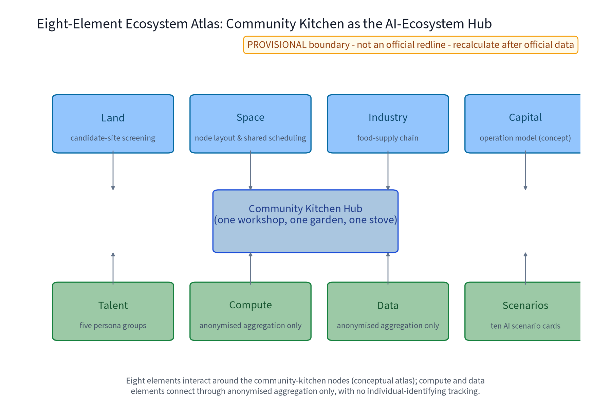
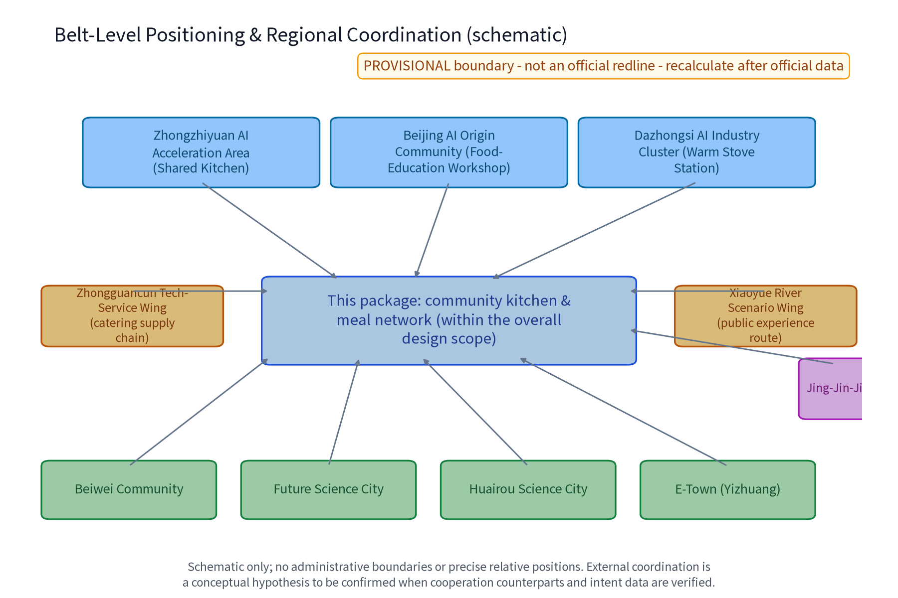
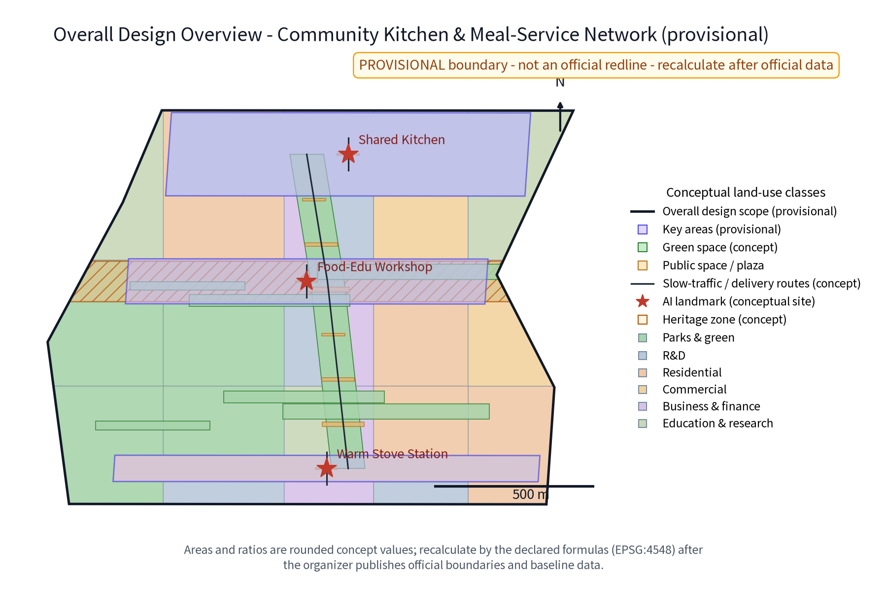
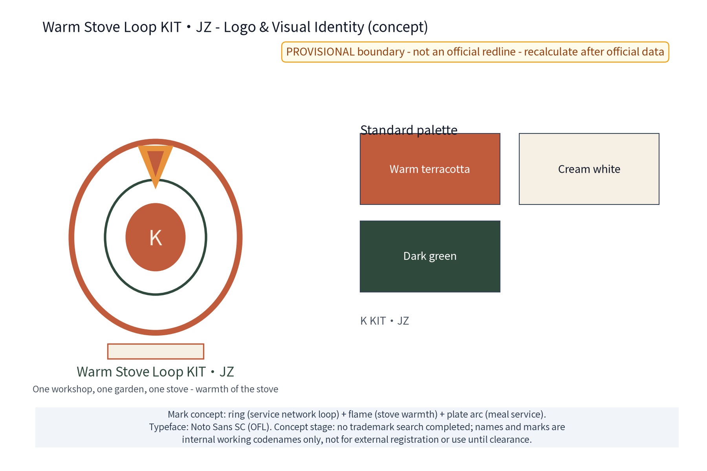
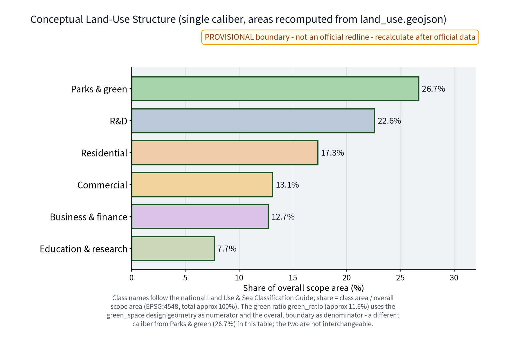
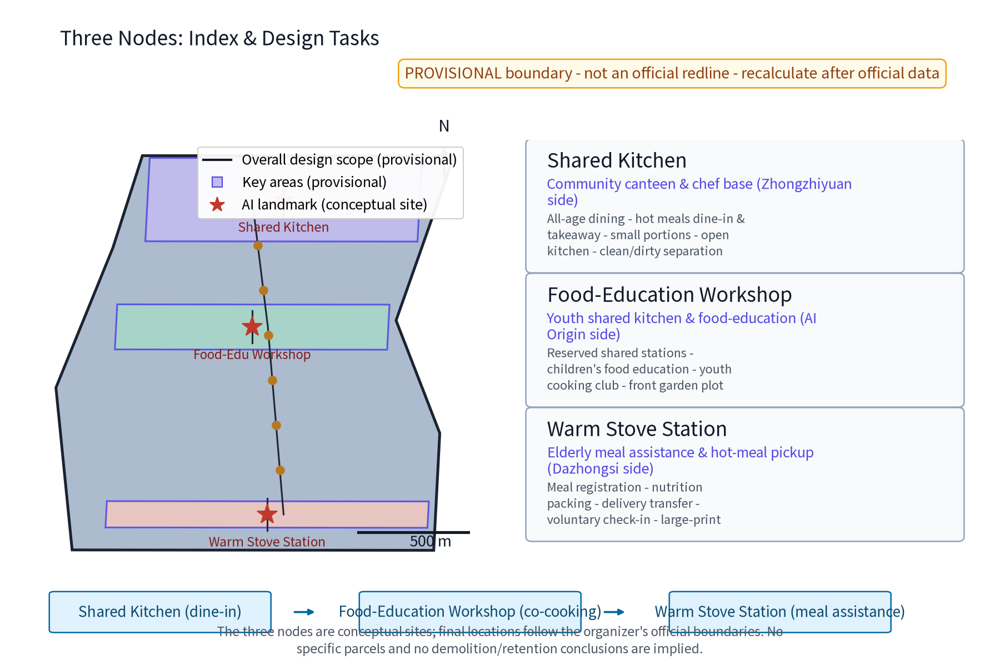
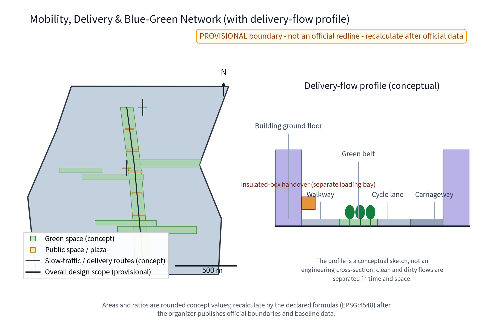
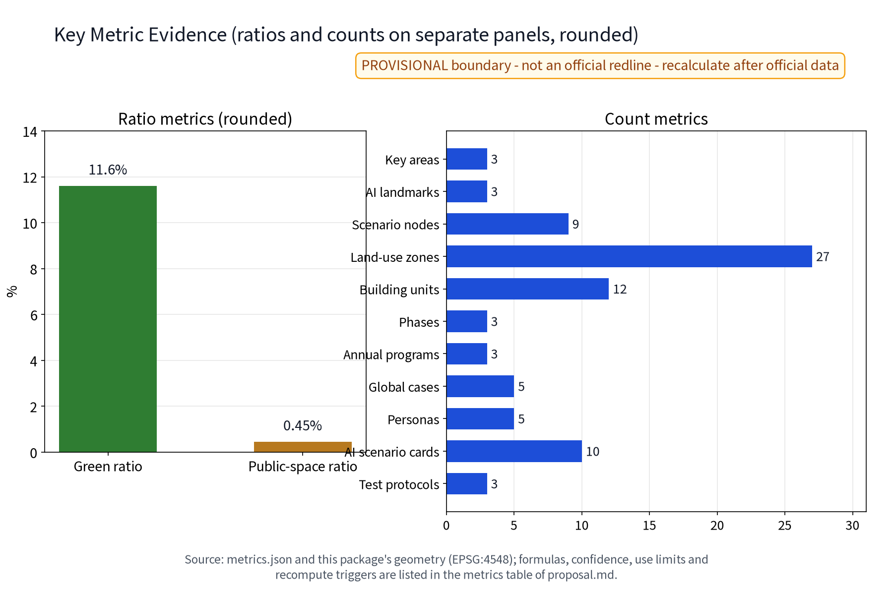

Package No. 49 - concept proposal draft. Core structure: "one workshop, one garden, one stove" - the Shared Kitchen, the Food-Education Workshop and the Warm Stove Station weave into the 15-minute community life circle, with ten AI scenario cards, three test-and-validation protocols and five mechanism elements. All content is an open co-creation concept proposal for professional teams to deepen; it does not constitute planning approval, engineering implementation or investment conclusions. The brand name and mark are treated as internal working codenames until a prior-rights search is completed.

## Design Basis and Source List

The primary basis is the call-for-proposals announcement and the agent-oriented taskbook excerpt, including the three positioning statements (Centennial Jing-Zhang Culture Belt, Urban AI Life Experience Belt, AI-Integrated Innovation Belt), the five major functions, the three-zone-two-wing layout and tasks agent.1-6, together with co-creation charter and boundary clauses such as "concept-suggestion nature", "public-information boundary" and "final human judgment". Public policy directions on the 15-minute community life circle and community elderly meal-assistance services are used as directional references only. The source list comprises: taskbook excerpts, submission skill files (proposal structure, hard rules, formal package requirements), reference sample proposals, the site-package public source registry and provisional boundary geometry (PROV-SITE-001 etc.), and per-case source registration for the five benchmark cases (publisher, link, date, license, applicable mechanism and non-copied content; see sources.json and the risk-section table). No official overall boundary or key-area polygon is published in the repository, so all scopes use temporary coarse constraints (official_boundary=false, geometry_role=provisional_constraint) for content design and display only; once official geometry arrives, the same algorithms replace and recompute. This package is a formal bilingual delivery: Chinese and English narratives, bilingual figures and drawing sets, and bilingual HTML are complete, with language and translation mappings registered in manifest.json. All text and figures are original AI-generated works; fonts use OFL-licensed Noto Sans SC; per-item rights statements are in report/copyright_statement.md. Indicators depending on unpublished official control conditions (FAR, heights) remain pending; no false precision is created.

> Evidence anchors: [source:DATA-SRC-OFFICIAL-ANNOUNCEMENT-2026-05-09], [source:DATA-SRC-AGENT-TASKBOOK-2026-05-18] (organizer announcement and taskbook are the textual basis).

## Three-Level Scope Framework

The official three-level scopes, per the announcement text: coordinated research area approx. 43.6 km2, overall design area approx. 11.4 km2, and key detailed-design areas approx. 368.4 ha. This package's sub-scope sits inside the overall design area, focused on the community-kitchen and meal-service network; it does not claim full professional coverage of the whole range. The three levels are linked by a "problem - space - operation - evidence - exit" responsibility chain. The coordinated research level asks how the meal-service network becomes a belt-level public-value and AI-ecosystem interface, producing five mechanism elements, the eight-element ecosystem atlas and five benchmark-case translations. The overall design level asks how the built-up city weaves in the 15-minute life circle, implementing land-use, transport, municipal and public-space concepts through the three nodes and the slow meal-delivery route. The key-area level asks how the three areas differ in implementation: the Shared Kitchen (Zhongzhi Park side), the Food-Education Workshop (Beijing AI Origin Community side) and the Warm Stove Station (Dazhongsi side) become three public prototypes - dining hall, shared cooking, meal assistance - with AI scenario anchor points. Each level is accepted by resident-perceivable outcomes: mechanism transferability at the coordination level, walking-circle continuity and node accessibility at the overall level, service fulfilment, food-safety compliance and feedback closure at the key-area level. Any evidence gap (ownership, heritage protection, municipal interfaces, operating entities) is recorded as a stop condition and never assumed away. The three levels feed each other: coordination mechanisms decide node grading; overall space decides key-area interface depth; key-area feedback corrects the mechanisms - a rolling loop calibrated in both directions.

| Level | Core question | This proposal's answer | Main outputs |
| --- | --- | --- | --- |
| Coordinated research area | How the meal network becomes an ecosystem interface | Five mechanisms, eight-element atlas, five case translations | Mechanism and translation tables |
| Overall design area | How the built-up city weaves in the life circle | Three nodes plus slow meal-delivery route | Land, transport, municipal, phasing concepts |
| Key detailed-design areas | How the three areas differ in implementation | Dining, co-cooking, meal-assistance prototypes | Node details and scenario anchors |

> Evidence anchor: [source:DATA-SRC-AGENT-TASKBOOK-2026-05-18] (three-level scopes follow the official taskbook wording).

## Coordinated Research Area: Industry and Future City Research

The three positioning statements are translated into meal-service expressions. The Centennial Jing-Zhang Culture Belt: the railway's schedules, handovers and service discipline become a community table culture. The Urban AI Life Experience Belt: meals are a daily, high-frequency, all-age AI life experience. The AI-Integrated Innovation Belt: AI scenarios validate the governance pattern of "anonymised aggregation only, human review of key decisions, no excessive monitoring" on a real food-supply chain. The five major functions map as follows: the Zhongzhi Park full-stack independent innovation system validates scheduling and food-safety tool stacks at the Shared Kitchen; the world-class innovation ecosystem creates a developer-resident co-creation interface at the Food-Education Workshop; AI scenario enablement and the intelligent vibrant city land as meal nodes inside walking circles; AI-governance discourse derives from the public practice of "registration for service fulfilment only, AI aggregation only". The three-zone-two-wing loop: the three nodes serve the three key areas, the Zhongguancun technology-service wing addresses catering supply-chain capability, and the Xiaoyue River scenario-enablement wing links public experience routes. Mechanism interfaces extend conceptually to Beiwei Community, Future Science City, Huairou Science City, the Economic-Technological Development Area and Beijing-Tianjin-Hebei partners (concept level; specific partners and intentions await verifiable materials). The eight-element ecosystem atlas: land, space, industry, capital, talent, computing, data and scenario elements form an interaction network around community-kitchen nodes (see figure below); computing and data elements connect anonymously aggregated only. Five mechanism elements - meal-service points, shared-kitchen reservation and usage convention, surplus-ingredient exchange and anti-waste, food-safety and nutrition disclosure, resident food-education deliberation - are concept mechanisms pending community and authority confirmation. Benchmark cases are summarised from public channels only and constitute neither endorsement nor scale evidence.

| Case (public-channel summary) | Borrowed mechanism | Jing-Zhang translation | Not copied |
| --- | --- | --- | --- |
| Beijing elderly-care station and meal-assistance direction | Stations embedded in communities, graded meal coverage | Warm Stove Station embedded in community service clusters | Subsidy and assessment calibers |
| Shanghai community senior canteen practice | Dine-in plus takeaway, senior priority hours | All-age dining and small portions at the Shared Kitchen | Density and operation scale |
| Singapore hawker centre experience | Central management, transparent pricing, public hygiene | Open-kitchen and disclosure mechanisms | Business and spatial model |
| Japan meal delivery and voluntary check-in practice | Delivery linked with voluntary care | Check-in limited to voluntary registration fulfilment | Any continuous monitoring practice |
| Finland school meal public system | Institutionalised public meals and nutrition standards | Food-education classes and nutrition disclosure | Free provision and fiscal arrangements |

> Evidence anchor: [source:DATA-SRC-PROVISIONAL-BOUNDARIES-2026-06-05] (boundaries are provisional; the research scope is conceptual only).

## Overall Design Area: Urban Renewal and Regulatory-Plan-Level Urban Design

The overall structure is the triangular node network of "one workshop, one garden, one stove", connected by slow meal-delivery routes inside the 15-minute community life circle. All three nodes follow stock-first, reversible light-retrofit principles: concept site types are community supporting premises, spaces adjacent to elderly-care stations, and convertible ground-floor shops - no specific plots are presupposed and no demolition conclusion is made. Five candidate-space screening criteria apply: ownership and current-use compatibility, floor area and storey-height fit, fire evacuation and fume-exhaust feasibility, accessibility and municipal interface availability, and walking proximity to elderly-care and meal-assistance facilities; a candidate point failing any criterion is excluded until field investigation. Regulatory-plan depth is expressed as "problem - spatial object - indicator - data gap - recalculation path": each node records its service problem, functional envelope, concept indicators, pending surveys and the recalculation method once official data arrives; this does not replace statutory regulatory plans and makes no FAR, height or setback judgment. The renewal approach is small-cut, quick-win and transferable: validate the meal convention at the Warm Stove Station first, then expand to kitchen dining and food-education co-cooking; any action touching heritage sites, protected structures, ownership or municipal interfaces awaits formal investigation and professional repositioning. The concept scope is based on a provisional overall boundary with a recomputed area of about 11.41 million m2 (low confidence) - an alternative geometry, not an official red line.

### Brand and Visual Identity (Logo/VI)

The brand names "Warm Stove Loop KIT.JZ" and "one workshop, one garden, one stove" are original concept names. The logo direction is a "ring-and-stove flame" symbol: the ring represents the closed service-network loop, the stove flame the warmth of daily meals, and the plate arc the meal service. Standard colours are warm clay red, off-white and dark green, with standard typography, clear space and horizontal/vertical layout rules (see logo-brand.png). VI components cover the mark, wordmark, palette, supporting graphics and entrance signage applications - all concept level. Brand prior-rights and use boundary: no official trademark search has been completed at concept stage; the names and mark are treated as internal working codenames and are not registered or used commercially until clearance; all external display carries the concept label.

> Evidence anchors: [source:DATA-SRC-MOHURD-CONTROL-DETAILED-PLANNING], [source:DATA-SRC-PROVISIONAL-BOUNDARIES-2026-06-05].

## Detailed Design of Key Areas

Shared Kitchen (Zhongzhi Park side): a community canteen and head-chef base providing all-age dining, hot dine-in and takeaway, small portions and an open kitchen. The concept flow plan is front-hall/back-stage: dining hall, open cooking area, tray return route, takeaway window and back-stage storage, with clean/contaminated flows separated (ingredient intake and kitchen-waste exit independent of customer flows). The public interface is a continuous glass kitchen, daily menu and nutrition board, comment book and human-help desk. Food-Education Workshop (Beijing AI Origin Community side): a youth shared kitchen and food-education classroom with reservation-based shared worktops, children's food-education classes and a youth cooking community. The concept flow plan is a one-way clean flow from wash-up to worktop island to teaching demo area, with personal lockers and a front garden plot. The interface offers a reservation board, convention wall and recipe gallery. Warm Stove Station (Dazhongsi side): an elderly meal-assistance and hot-meal pickup station covering registration, nutrition meal packing, delivery transfer and voluntary check-in linkage. The concept flow plan is a "receive - pack - hold - transfer" line from registration desk to packing bench to insulated cabinet to transfer rack to short-stay seating; returning delivery vehicles complete insulated-box handover at a separate unloading bay, staggered from customer flows. The interface pairs large high-contrast signage and insulated pickup cabinets with a human desk and a check-in explanation card (voluntary registration, service fulfilment only). All three nodes follow low-rise stock-first, durable-repairable, low-glare principles and are child-friendly and inclusive. Node locations rely only on three provisional key-area clues (coarse replacement geometry of about 193 ha, 104 ha and 72 ha) and are not written as specific plots. The licensing and compliance checklist below is conceptual; every item must be re-verified against current regulations before implementation.

| Checklist item | Concept requirement | Suggested owner | Stop condition |
| --- | --- | --- | --- |
| Food business licence | Obtain licence, open kitchen, food retention samples | Operating entity | Stop if licence cannot be obtained |
| Fire and evacuation | Evacuation routes, extinguishers, stove fire separation | Professional fire review | Stop if evacuation fails |
| Fume and odour | Fume purification, noise reduction, outlet sequencing | Municipal and environmental review | Stop if emissions fail |
| Accessibility | Ramps, low counters, large signage | Accessibility review | Relocate if no alternative path |
| Heritage and ownership | Survey heritage, protection, ownership first | Professional team | Withdraw on conflict |

> Evidence anchor: [data:PACKAGE-GEOMETRY] (node polygons are from this package's geometry/key_areas.geojson).

## AI Innovation Ecosystem, Personas, and AI+ Scenarios

Five persona groups (persona_count=5): elderly living alone (hot-meal pickup, delivery transfer, voluntary check-in), dual-income families (small portions, reserved pickup), postgraduate and self-study youth (shared worktops, off-peak hot-meal windows), children with parents (food-education classes, parent-child cooking), and new employment groups (fast pickup, off-peak meals). Every persona has on-site, telephone and paper non-digital paths and may decline digital tools; vulnerable groups receive priority assistance. The eight-element ecosystem atlas connects land, space, industry, capital, talent, computing, data and scenario elements around community kitchens (see ai-ecosystem.png): land and space feed candidate-node screening; industry and capital feed supply chain and operation models; talent and scenario feed the personas and ten scenario cards; computing and data connect anonymously aggregated only. AI spans six domains: industry (ingredient surplus scheduling), space (node siting and shared scheduling), transport (delivery scheduling and slow-mode connection), public services (meals, nutrition, food safety), culture (food-education content and railway dining-culture narrative), and governance (disclosure, deliberation and human-review assistance). The ten AI scenario cards below share the boundary of "anonymised aggregation only, human review of key decisions, no excessive monitoring (no individual-identifying tracking)": AI only drafts candidates, never decides automatically, and can be removed at any time.

| AI scenario card | Data input | Failure mode | Exit threshold | Human review |
| --- | --- | --- | --- | --- |
| Meal-scheduling AI | Anonymised reservation time distribution | Shift conflicts, route duplication | Stop if review rate below threshold | Dispatcher reviews shifts and routes |
| Ingredient-surplus AI | Anonymised stock and near-expiry summary | Surplus misreporting | Stop if error rate exceeds threshold | Head chef confirms exchange direction |
| Nutrition-planning AI | Public dietary guidance and recipes | Nutrition deviation | Stop if nutritionist vetoes | Nutritionist signs off |
| Food-safety alert AI | Shelf life and retention records | Missed or false alerts | Stop if safety officer vetoes | Safety officer reviews |
| Order-service AI | FAQs and order status | Irrelevant answers | Stop if human fallback rate exceeds | Human agent fallback |
| Off-peak meal recommendation AI | Anonymised pickup-time distribution | Poor recommendations | Stop if acceptance too low | Store manager reviews |
| Senior voice ordering AI | Anonymised speech transcription | Recognition failure | Stop if transfer-to-human fails | Human desk takes order |
| Food-education content AI | Public nutrition knowledge and course library | Inaccurate content | Stop if teacher vetoes | Teacher signs off |
| Anti-waste points AI | Small-portion and surplus registration | Wrong points | Stop if dispute rate exceeds | Duty manager reviews |
| Volunteer scheduling AI | Volunteer availability | Schedule conflicts | Stop if conflicts persist | Volunteer leader reviews |

Three test-and-validation protocols (industry_test_scenario_count=3) run at the pilot nodes in the order "shadow validation - human review - keep or remove"; each protocol registers data input, failure mode, exit threshold and validation indicators. Protocol 1 is model evaluation, with order-to-delivery cycle time and food-safety incident counts as indicators; Protocol 2 is data-quality evaluation, using wrong-order rate, duplicate-order rate and missing-field rate; Protocol 3 is error stratification and runtime monitoring, observing false-alarm rates by time period and persona group, with a human-review rate and a one-click kill switch. The protocol details below require operation and compliance review before any go-live.

| Test and validation protocol | Data input | Failure mode | Exit threshold | Validation indicators |
| --- | --- | --- | --- | --- |
| Model evaluation | Anonymised pilot run logs | Cycle-time deterioration, safety events | Stop after continuous failure | Order-to-delivery cycle time |
| Data quality evaluation | Anonymised orders and registrations | Wrong, duplicate, missing-field orders | Stop if quality score too low | Wrong-order and duplicate rates |
| Error stratification and monitoring | Time-slice and persona anonymous stats | Abnormal false-alarm rate | Stop if false-alarm rate exceeds | False-alarm rate, human-review rate |

> Evidence anchor: [source:DATA-SRC-GENERATIVE-AI-INTERIM-MEASURES] (reference for AI-generated-content governance wording).

## Land Use, Building Scale, and Retain-Renovate-Demolish Strategy

Land use is expressed as plug-in community service nodes: the three nodes are functional and service-responsibility structures embedded in existing buildings or community supporting spaces, without changing statutory land-use categories. This package uses a single land-use classification caliber (six classes in land_use.geojson, named after the current national land-use classification guide): park and green land about 26.7%, scientific-research land about 22.6%, urban residential land about 17.3%, commercial land about 13.1%, business-finance land about 12.7%, and education-science-design land about 7.7%, totalling about 100%. Aggregation and recomputation rule: each class area equals the EPSG:4548 ring-area sum of the land_use.geojson features; the ratio equals class area divided by the overall scope area (same boundary as site_area_sqm). Confidence is low; once official regulatory plans, green lines and land-recognition rules are published, the same algorithm fully re-slices and recomputes. Caliber note: green_ratio (about 0.116, i.e. 11.6%) uses the green_space design geometry as numerator over the overall boundary; it differs from the park-and-green land-use class in this table, and the two are not interchangeable. Building scale is given as level concepts only, not numbers: the Shared Kitchen is the largest (dining plus back stage), the Food-Education Workshop mid-sized (worktop islands plus classrooms), and the Warm Stove Station smallest (registration, packing, insulation). No footprint, storey count or total scale is promised. Retain-renovate-demolish follows four steps: verify current conditions, ownership and heritage first; retain where safe and functional; lightly renovate where accessibility, fire, fume and energy retrofits are needed; relocate or delete concept components where unsuitable or conflicting. Without surveys, no demolition area is proposed; FAR, heights and specific retain-renovate-demolish conclusions remain pending until official boundaries, regulatory plans and building surveys arrive. All spatial proposals are phrased as "concept suggestions, reference schemes, for professional teams to deepen".

> Evidence anchor: [source:DATA-SRC-MNR-LAND-USE-CLASSIFICATION-2023-11] (land-use class names follow the current national standard).

## Transport, Rail, Municipal Infrastructure, and Public Services

Slow meal-delivery route concept: the Warm Stove Station is the delivery transfer origin, with slow delivery branches reaching surrounding residential areas and forming a last-kilometre connection of "rail + slow mode + insulated box" with nearby rail stations (Dazhongsi station etc., as public clues only). No road alignment, rail alignment or engineering conclusions are given. Clean/contaminated and delivery flows: insulated hot-chain boxes enter the station transfer rack through a separate unloading bay, and returning delivery vehicles leave off-peak; ingredient intake and kitchen-waste removal at the Shared Kitchen use independent back-stage entrances separated from dining crowds. Node and walking-circle relations: all three nodes sit within reachable walking circles and form a "one station, multiple functions" service cluster with elderly-care stations, community health and community service centres. Node spacing and service radii follow the public 15-minute life-circle direction as indications, not commitments. Municipal interfaces are conceptual: fume purification (purifier, noise reduction, outlet sequencing) and water/drainage interfaces (grease traps, sedimentation) follow "survey first, design second, connect third", with no energy, capacity or quantity conclusions. Slow branches provide shaded seating, insulated storage points and large signage for all-weather and night pickup; node traffic uses a flexible community-shared management concept with no new independent vehicle facilities. Public services stress large multilingual signage, phone-free equivalent paths and open-kitchen visual oversight; facilities must have maintenance owners, inspection frequencies and decommissioning conditions. Accessible ramps, low pickup counters and waiting seats are standard node components (concept).

> Evidence anchor: [source:DATA-SRC-MOHURD-URBAN-DESIGN-MEASURES] (method reference for municipal and slow-mode wording).

## Blue-Green Network, Public Space, and Urban Character

The "one garden" is realised as the front plot of the Food-Education Workshop and a community co-built vegetable garden, forming the blue-green anchor among the three nodes: the plot carries food-education observation and herb/leafy-vegetable growing experiences, and with the kitchen's surplus-ingredient exchange forms a "garden-stove" cycle narrative. Nodes are linked by movable planters, shaded seating and continuous accessible paving. Public space is layered into three interfaces - the kitchen's outdoor dining area, the station's waiting seats and the food-education plot - all fully usable without network or AI, and sensors are never a precondition for opening. The reversible public-space component library has seven standard component types (movable planters, shaded seating, modular meal kiosks, insulated storage cabinets, signage posts, lamp-bracket baskets, boundary railings) that are demountable, replaceable and decommissionable; maintenance ownership is assigned to people, and no single component's removal affects a node's basic function. Honor-display system: community honor walls and a "Warm Stove Star" display area at node entrances for annual disclosure of convention fulfilment, volunteer hours and anti-waste results (no personal information collected; anonymised honor records only). Cultural wayfinding: station-number-style node signage and information boards designed in Jing-Zhang railway vocabulary, bilingual, continuing the railway service culture. International communication: "The Warm Kitchen Belt" is the bilingual narrative spine, with an English figure set, English guide copy and overseas-visitor community-kitchen experience route copy (concept drafts, labelled "concept"). Character theme: "warm stove" - warm brick-and-clay textures, continuous eaves, transparent kitchen interfaces and low-glare night lighting, expressing everyday vitality and order without internet-fad or fast-food-style skins. Green and public space are drawn as design geometry homologous with the overall boundary: green ratio and public-space ratio equal the relevant geometry area divided by the overall scope area (EPSG:4548 recomputation), currently provisional at low confidence; when official boundaries, regulatory plans and green-recognition rules arrive, full recomputation updates the visual indicators.

> Evidence anchor: [source:DATA-SRC-MOHURD-URBAN-DESIGN-MEASURES] (method reference for blue-green organisation).

## Renewal Projects, Implementation Policy, and Phasing

Three concept project categories: dining-hall type (Shared Kitchen), covering dining-area retrofit, open kitchen, small portions and anti-waste mechanisms; shared-kitchen type (Food-Education Workshop), covering shared worktops, reservation and usage conventions, and food-education classes; meal-station type (Warm Stove Station), covering meal registration, nutrition packing, delivery transfer and the check-in service desk. Each project package records content, lead type, acceptance conditions and stop conditions, with no investment estimates or procurement commitments. Pilot areas are the Warm Stove Station (Dazhongsi side) and the Food-Education Workshop (Beijing AI Origin Community side), which start first. Phasing is a concept rhythm: near-term 1-3 years, the Warm Stove Station pilot starts, meal registration, food-safety licensing and disclosure flows are established, the workshop opens reserved worktops, and the three test protocols run in the "shadow validation - human review - keep or remove" order; mid-term 3-5 years, Shared Kitchen dining and small portions mature, the ten scenario cards go live in grades by validation results, mechanisms become institutional, and promotion to other nodes follows pilot evaluation; long-term 5-10 years, the three nodes form a network, the garden-stove cycle, surplus exchange and meal points run steadily, and a replicable community-kitchen network template emerges. All phase statements are concept rhythms and constitute no start, investment or policy commitment. The operation RACI (responsibility matrix) below is conceptual.

| RACI | Street and community | Operating entity | Volunteers | Resident assembly |
| --- | --- | --- | --- | --- |
| Meal registration and fulfilment | Support | Lead | Support | Oversee |
| Food-safety and nutrition disclosure | Oversee | Lead | Support | Informed |
| AI scenario acceptance and decommission | Approve | Lead | Support | Informed |
| Annual disclosure and feedback closure | Lead | Support | Support | Participate |
| Event organisation and volunteer scheduling | Support | Support | Lead | Participate |

Developer-community and scenario-open mechanisms: a developer community (concept) co-creates recipe nutrition algorithms, surplus-exchange rules and ordering interfaces, with scenario open days and a test sandbox (anonymised aggregated data only); the attraction-and-conversion mechanism is an "incubate - pilot - promote" ladder with intention registration, annual review and disclosure; merchant and community-kitchen alliances and volunteer rotation scheduling are concept mechanisms. The annual programme system below is conceptual and disclosed annually; any phase stopping (including licence failure, ownership conflict, heritage limits, insufficient municipal capacity and other stop conditions) or exit-mechanism trigger leaves other phases advancing independently, with the package chain of "receivable, visible, withdrawable" starting from the Warm Stove Station.

| Annual programme | Content | Lead | Support |
| --- | --- | --- | --- |
| Community Kitchen Week | Open day, tasting, convention signing | Street and community | Operating entity |
| Anti-waste Day | Surplus exchange showcase, points redemption | Operating entity | Volunteers |
| Senior Meal Open Day | Nutrition consultation, check-in briefing, feedback | Volunteers | Resident assembly |

> Evidence anchor: [source:DATA-SRC-AGENT-TASKBOOK-2026-05-18] (phasing and implementation items correspond to taskbook requirements).

## Metrics, Area Recalculation, and Compliance Matrix

The concept indicator system has three layers: spatial (three nodes, slow meal-delivery routes, number of public interfaces), operational (small-portion supply, food-safety and nutrition disclosure, feedback closure - concept operational indicators, not commitments), and data (AI scenario anonymised aggregation indicators). All values fall into three classes: known values recomputable from the submitted geometry; unknown values depending on unpublished official control conditions (FAR, heights - left empty with reasons); and performance thresholds to be set after an operation baseline exists. The three formal core metrics are recomputed on provisional geometry: site_area_sqm is the EPSG:4548 ring-area value of the temporary overall boundary PROV-SITE-001, about 11.41 million m2 (low confidence; formula: polygon ring-area accumulation); green_ratio and public_space_ratio use the same boundary as denominator and this package's green_space and public_space geometry as numerators (formula: green-ratio = green geometry area / overall area; public-space-ratio = public geometry area / overall area). When official data (boundary, regulatory plans, green-recognition rules) is published, full recalculation triggers and visual/index.html data-values are synchronised. The indicator details below give value, origin, formula, confidence level, use limits and recalculation triggers for every item; ratios and counts are listed in separate tables and never share one axis.

| Metric | Value | Origin | Formula | Confidence | Use limit | Recompute trigger |
| --- | --- | --- | --- | --- | --- | --- |
| site_area_sqm | about 11.41 million m2 | site_boundary.geojson | polygon ring-area sum (EPSG:4548) | low | concept display only | official boundary release |
| green_ratio | about 11.6% | green_space.geojson | green geometry area / overall area | low | concept display only | official green recognition |
| public_space_ratio | about 0.45% | public_space.geojson | public geometry area / overall area | low | concept display only | official recognition rules |
| road_network_length_m | about 10.2 km | roads.geojson | concept path length sum (EPSG:4548) | low | concept display only | official road red lines |
| key_area_count | 3 | key_areas.geojson | feature count | medium | concept display only | official key areas |
| land_use_zone_count | 27 | land_use.geojson | feature count | high | concept display only | official regulatory plan |
| scenario_node_count | 9 | public_space.geojson | scenario nodes plus landmarks | high | concept display only | node adjustment |
| landmark_count | 3 | public_space.geojson | AI landmark count | high | concept display only | node adjustment |
| persona_count | 5 | proposal.md | persona group count | high | concept display only | demand survey update |
| global_case_count | 5 | proposal.md, sources.json | case translation table rows | high | concept display only | source update |
| industry_test_scenario_count | 3 | proposal.md | test protocol count | high | concept display only | pilot adjustment |
| annual_program_count | 3 | proposal.md | annual programme count | high | concept display only | annual plan update |
| scenario_card_count | 10 | proposal.md | scenario card table rows | high | concept display only | scenario change |
| phase_count | 3 | phasing.geojson | phase feature count | high | concept display only | phasing adjustment |
| building_unit_count | 12 | buildings.geojson | concept building feature count | high | concept display only | survey update |

The compliance matrix links the announcement, the taskbook (agent.1-6), narrative, metrics and sources item by item; this package also provides the standard matrix and design-depth matrix (standard_matrix.json, design_depth_matrix.json) covering professional standards and design-depth requirements. The taskbook delivery checklist below maps each agent task to its deliverables and locations (all concept-level; detailed mapping in compliance_matrix.json).

| Taskbook item | Deliverable | Location |
| --- | --- | --- |
| agent.1 Overall structure | Three-level scope framework, belt-level positioning and regional coordination figure, brand and visual identity | Three-Level Scope Framework; Coordinated Research section; regional-coordination.png; logo-brand.png |
| agent.2 Global AI ecosystem | Eight-element ecosystem atlas, five benchmark-case translations | Coordinated Research section; ai-ecosystem.png; case translation table |
| agent.3 AI scenarios and testing | Ten AI scenario cards, three test-and-validation protocols, three AI landmarks | AI Innovation Ecosystem section; scenario-card table; protocol table; public_space.geojson |
| agent.4 Public-space experience | Honor display, reversible public-space component library, cultural wayfinding | Blue-Green section (honor wall, Warm Stove Star, seven component types, station-style signage) |
| agent.5 International communication | Bilingual narrative, English drawing set and HTML | proposal.en.md; proposal.en.html; visual/index.en.html; English figures |
| agent.6 Operation and conversion | Operation RACI, annual programs, developer community, incubation-pilot-rollout conversion ladder | Renewal Projects section (RACI table, annual-program table, developer community and scenario open days) |

> Evidence anchors: [metric:green_ratio], [metric:public_space_ratio], [metric:site_area_sqm].

## Risk, Copyright, and Compliance

Main risks: the temporary boundary being misread as a statutory red line; operation risk from missing food-safety licensing and practices; meal points being mistaken for subsidy commitments; AI scenarios drifting from anonymised aggregation into individual tracking; concept activities being misread as confirmed implementation arrangements. Countermeasures: shiftable spaces, independently stoppable nodes, AI drafts and candidates only, registration for fulfilment only. Operation compliance baseline: meal and kitchen operation must obtain a food business licence by law, implement open kitchens, food retention samples and the Anti-Food-Waste Law; nutrition meal packing and special elderly diets follow nutrition and medical professional advice; resident feedback channels (comment book, telephone, food-education deliberation) are publicly checkable and answered item by item, with annual disclosure of feedback handling. Check-in linkage is limited to voluntary elderly registration: agreed human care callbacks for fulfilment cases such as uncollected meals, with no location tracking or image monitoring. Meal and registration information is used for service fulfilment only; AI scenarios are anonymised aggregated only, with no individual-identifying tracking and no excessive monitoring; the privacy boundary follows personal-information-protection law, with professional compliance review before implementation. The three-sentence AI governance rule applies to all scenarios: anonymised aggregation only; human review of key decisions; no excessive monitoring. Copyright and rights: all text and figures are original AI-generated works, with generation method and tools registered in report/copyright_statement.md; fonts are OFL-licensed Noto Sans SC; code and pages use open-source templates and our own code; maps use only organizer public materials and self-produced provisional geometry, with no third-party map or material copied; the five benchmark cases are registered source by source (table below) with explicit non-copied content; the brand name and logo have not completed prior-rights search and are treated as internal working codenames, not registered or used externally until clearance. All outputs are open co-creation suggestions that do not replace formal planning or constitute government conclusions.

| Case | Publisher | Link | Date | License | Applicable mechanism | Not copied |
| --- | --- | --- | --- | --- | --- | --- |
| Beijing elderly meal-assistance direction | Beijing Civil Affairs Bureau et al. | registered in sources.json | 2023-12-14 | publicly released | station embedding, graded coverage | subsidy and assessment calibers |
| Shanghai senior canteen practice | Shanghai Civil Affairs Bureau et al. | registered in sources.json | 2024-03-04 | publicly released | dine-in takeaway, senior priority | construction subsidies and density |
| Singapore hawker centre experience | National Environment Agency | registered in sources.json | not stated | site terms | central management, transparent pricing | business and spatial model |
| Japan meal delivery and check-in practice | Ministry of Health, Labour and Welfare | registered in sources.json | 2017-03-30 | site terms | delivery with voluntary care | continuous monitoring practice |
| Finland school meal system | Finnish National Agency for Education | registered in sources.json | not stated | site terms | institutionalised public meals | free provision and fiscal arrangements |

> Evidence anchor: [source:DATA-SRC-OFFICIAL-ANNOUNCEMENT-2026-05-09] (call rules are the basis for ownership and compliance wording).

## References

The human-readable source index follows; machine-readable registries are in sources.json, metrics.json, compliance_matrix.json, assumptions.json, self_check.json and manifest.json.

| Category | Description |
| --- | --- |
| Taskbook | Agent taskbook excerpt and full excerpt: three positioning statements, five functions, three-zone-two-wing, agent.1-6, boundary clauses and prohibited expressions |
| Call rules | Submission skills and formal guide: proposal structure, hard rules, formal package structure and self-check requirements |
| Samples | Reference sample proposals: chapter style, indicator system, compliance and copyright expression |
| Site package | Provisional boundary geometry (PROV-SITE-001, PROV-KEY-001-003 etc.) and public source registry |
| Public policy direction | 15-minute community life circle and community elderly meal-assistance public direction (directional basis) |
| Benchmark cases | Official public pages of the five cases (Beijing, Shanghai, Singapore, Japan, Finland); per-case publisher, link and date in sources.json and the risk-section table |
| Professional standards | Urban Design Measures, regulatory detailed planning measures, land-use classification guide, generative-AI interim measures (public texts) |
| Pending materials | Official boundary and regulatory plans, ownership, heritage, municipal and building surveys; verified meal-demand baselines around the three nodes; Beiwei Community and E-Town cooperation materials; operating entities and baseline conditions |

Bilingual substantive-equivalence checklist (version-2 bilingual delivery, checked item by item):

| Surface | Chinese | English | Check result |
| --- | --- | --- | --- |
| Narrative | proposal.md | proposal.en.md | Substantively equivalent: scope, values, mechanisms, boundary statements |
| Figures (8) | assets/figures/*.png | assets/figures/*.en.png | Values and legends match; English versions contain no Chinese |
| Booklet | drawings/a3-booklet.pdf | drawings/a3-booklet.en.pdf | Pages and content correspond |
| Boards | drawings/a0-boards.pdf | drawings/a0-boards.en.pdf | Pages and content correspond |
| Report HTML | report/proposal.html | report/proposal.en.html | Content equivalent; no Chinese in English page |
| Visual page | visual/index.html | visual/index.en.html | Content equivalent; no Chinese in English page |
| Mapping registry | manifest.json (language/translation_of) | same | Bidirectional translation mappings registered |

The benchmark cases summarise mechanism directions from public channels only; specific practices and data follow each official release. All area values quoted here are provisional geometry recomputations for concept expression and are replaced after official data release. Brand names and marks are treated as internal working codenames until a prior-rights search is completed. Everything in this proposal is a concept suggestion: no floor-area-ratio, height, demolition, pricing, patronage, capacity, investment or construction conclusions; no fabricated official data; nothing presented as a confirmed arrangement. The provisional-boundary warning applies to all figures and values: temporary concept boundary, not an official red line; full recomputation after official data release. The bilingual delivery mappings (narratives, figures, drawing sets, HTML and manifest) are registered in manifest.json; all figures and drawing sets are conceptual, available in both Chinese and English with provisional warnings. Substantive Chinese-English equivalence has been manually checked (see table above); the English HTML pages and English figures contain no functional Chinese.

> Evidence anchor: [source:DATA-SRC-OFFICIAL-ANNOUNCEMENT-2026-05-09] (first entry is the organizer's public material pack).
