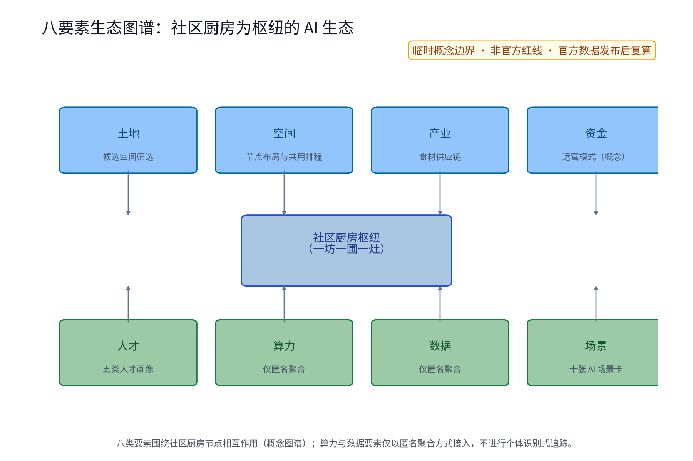
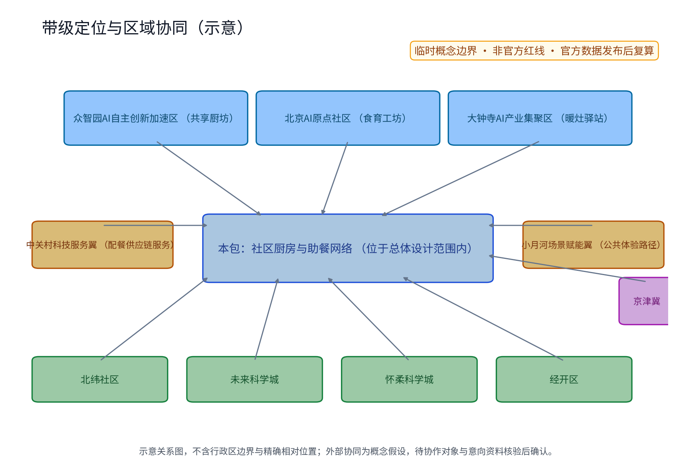
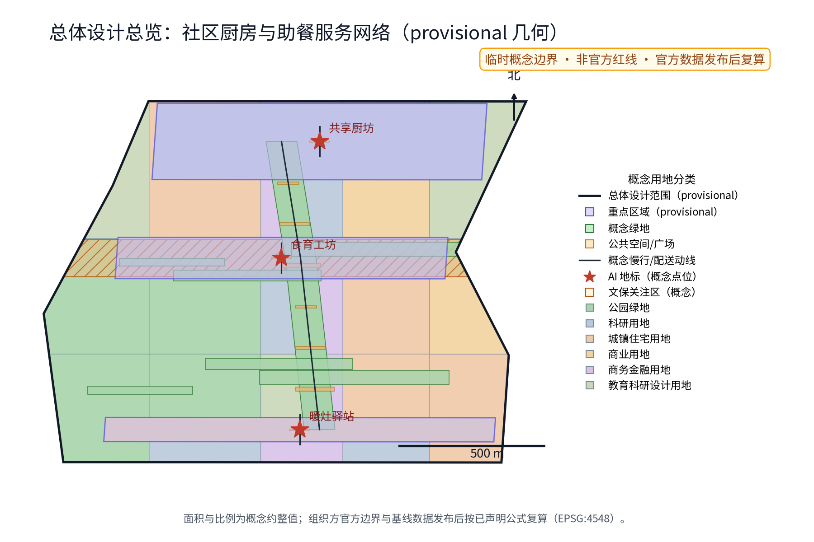
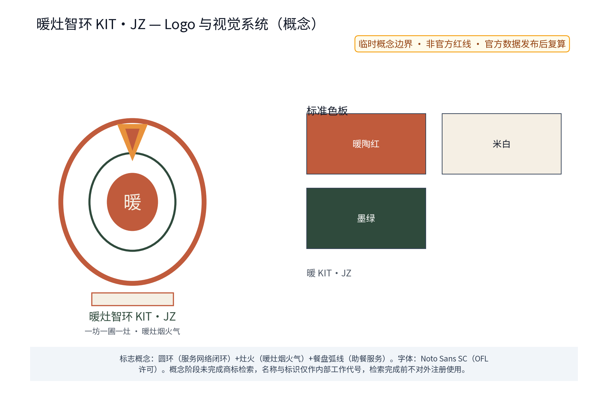
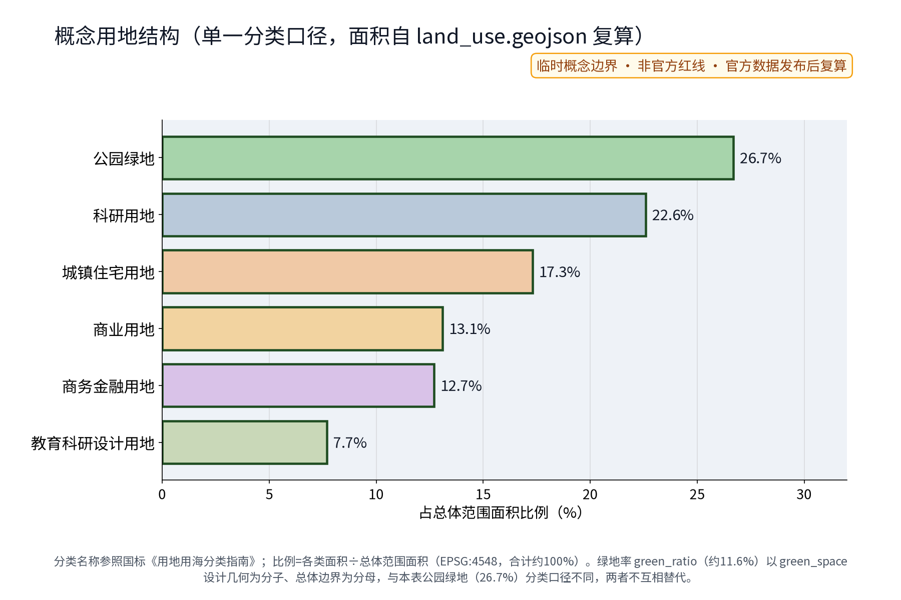
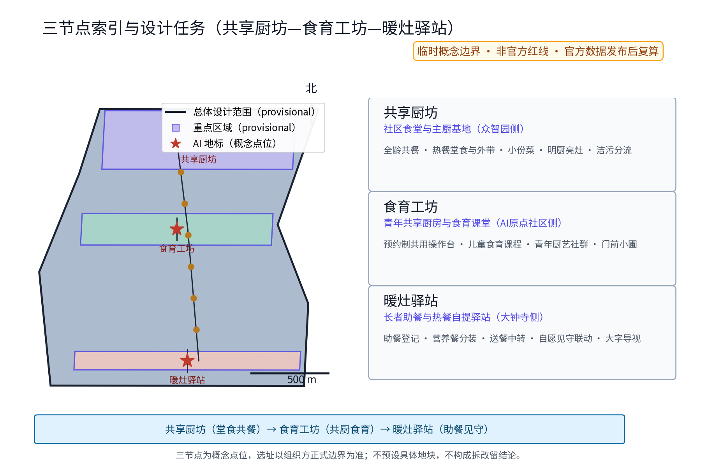
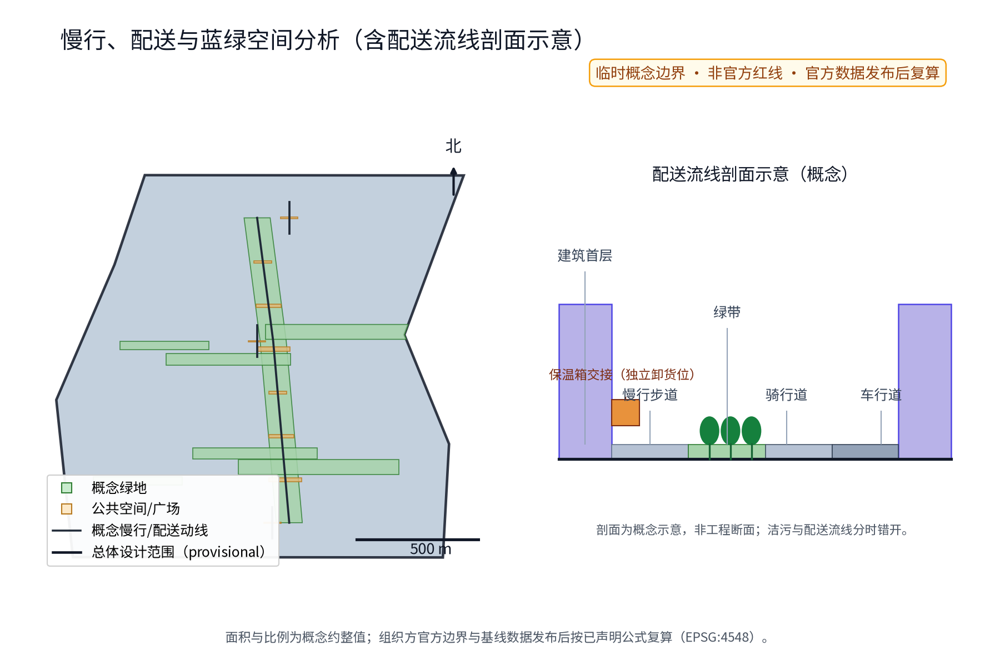
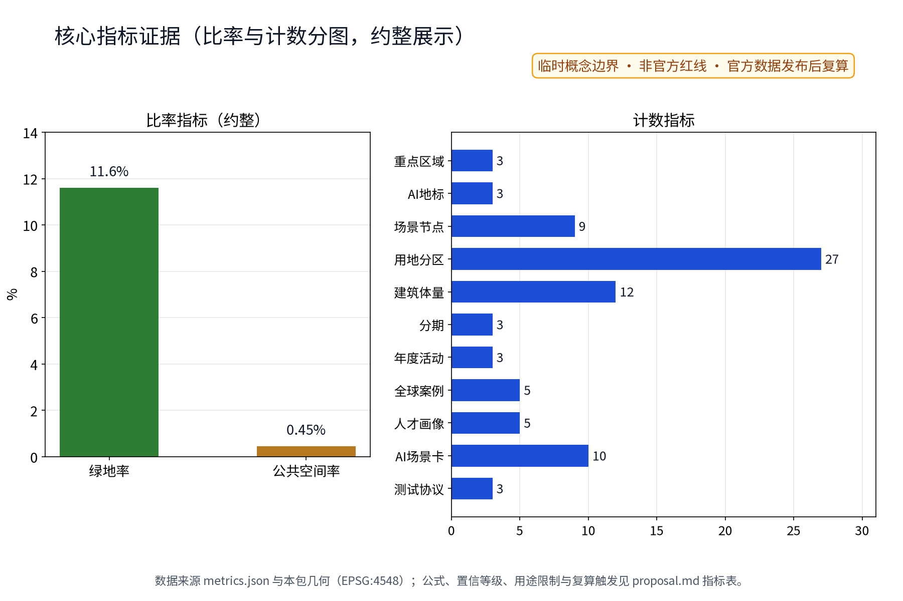

> 第49号方案包·概念建议草案。核心结构为"一坊一圃一灶"：共享厨坊、食育工坊、暖灶驿站三个节点织入一刻钟便民生活圈，配套十张 AI+ 场景卡、三个测试验证协议与五项要素机制。本文全部内容为开放共创的概念建议与参考方案，供专业团队深化研究，不构成规划审批、工程实施或投资结论；品牌名称与标识在完成在先权利检索前按内部工作代号处理。

## 设计依据与资料清单

主控依据为征集公告与面向智能体任务书摘录，含三大定位（百年京张文化带、都市AI生活体验带、AI融合创新带）、五大功能、三区两翼布局与 agent.1—6 任务，以及"概念建议属性、公开资料边界、人类最终判断"等共创章程与边界条款；海淀区内的京张AI创新带、中关村地区背景与一刻钟便民生活圈、社区养老助餐服务的公开政策方向仅作方向性依据。资料清单包括：任务书摘录与全文摘录、投稿技能文件（提案结构、硬规则与正式包要求）、参考样例方案、场地包公开来源登记及临时边界几何（PROV-SITE-001 等）、五个对标案例的逐案来源登记（发布者、链接、日期、许可、适用机制与不搬用内容，见 sources.json 与本文风险章节表格）。仓库当前没有官方总体边界与重点区 polygon，本草案范围一律采用临时粗略约束（official_boundary=false、geometry_role=provisional_constraint），仅用于内容设计与展示；官方图形到位后按同一算法替换复算。本包为正式版双语交付：中文正文、英文正文、中英图件与图册、中英 HTML 均齐备，manifest.json 登记语言与翻译映射；文本与图件均为 AI 原创生成，字体采用 OFL 许可的 Noto Sans SC，逐项权利说明见 report/copyright_statement.md。容积率、建筑高度等依赖未公开官方控制条件的指标保持待确认，不制造精确感。

> **证据锚点**：[source:DATA-SRC-OFFICIAL-ANNOUNCEMENT-2026-05-09]、[source:DATA-SRC-AGENT-TASKBOOK-2026-05-18]（组织方公告与任务书为文本口径依据）。

## 三层范围工作框架

官方公告文本口径下的三层范围：统筹研究范围约 43.6 平方公里、总体设计范围约 11.4 平方公里、重点区域约 368.4 公顷；本包子范围明确位于总体设计范围以内，以社区厨房与助餐服务网络为专项主题，不声称覆盖全范围全部专业内容。三层范围由"问题—空间—运营—证据—退出"责任链贯通：统筹研究范围回答助餐服务网络如何成为带级公共价值与 AI 生态接口，产出五项要素机制、八要素生态图谱与五个对标案例转译；总体设计范围回答存量城市如何织入一刻钟便民生活圈，以"一坊一圃一灶"三节点与助餐慢行动线落实用地、交通、市政与公共空间概念；重点区域范围回答三处片区如何差异化落地：共享厨坊（众智园侧）、食育工坊（AI原点社区侧）、暖灶驿站（大钟寺侧）分别形成堂食、共厨、助餐三种公共原型与 AI+ 场景落点。每一层都以居民可感知结果验收：统筹层看机制可移交性；总体层看步行圈连续与节点可达；重点层看服务履约、食安合规与意见闭环。任何证据缺口（权属、文保、市政接口、运营主体）均记为停止条件，不假设成立。三个范围的成果相互输入：统筹层机制决定总体层节点分级，总体层空间决定重点层界面深度，重点层反馈修正机制设计，形成双向校准的滚动闭环。

| 层级 | 核心问题 | 本方案回答 | 主要成果 |
| --- | --- | --- | --- |
| 统筹研究范围 | 助餐网络如何成为生态接口 | 五项要素机制、八要素生态图谱、五个案例转译 | 机制清单与转译表 |
| 总体设计范围 | 存量如何织入便民生活圈 | 三节点加助餐慢行动线 | 用地、交通、市政、分期概念 |
| 重点区域范围 | 三片区如何差异化落地 | 堂食、共厨、助餐三原型 | 节点详设与场景落点 |

> **证据锚点**：[source:DATA-SRC-AGENT-TASKBOOK-2026-05-18]（三层范围划分依据任务书官方文本口径）。

## 统筹研究范围产业与未来城市研究

三大定位转译为助餐表达：百年京张文化带，延续京张铁路的班次、交接与服务纪律，把铁路服务文化转为社区餐桌文化；都市AI生活体验带，助餐是每日高频、全龄可感知的 AI+ 生活体验；AI融合创新带，AI 场景在真实餐饮供应链上验证"仅匿名聚合、关键决策人工复核、禁止过度监控"的治理范式。五大功能映射：众智园全栈自主创新体系在共享厨坊验证调度与食安工具栈；世界级创新生态借食育工坊形成开发者与居民共创界面；AI+ 场景赋能与智能化活力城市落实为步行圈内的助餐节点；AI治理话语权来自"登记仅履约、AI仅聚合"的公开治理实践。三区两翼与区域协同回路：三节点分别服务三处重点片区，中关村科技服务翼面向配餐供应链服务能力，小月河场景赋能翼串联公共体验路径；机制接口向北纬社区、未来科学城、怀柔科学城、经开区及京津冀协作对象延伸（概念级，具体协作对象与合作意向待核验资料到位后确认）。八要素生态图谱：土地、空间、产业、资金、人才、算力、数据、场景八类要素围绕社区厨房节点形成相互作用网（见下图），其中算力与数据要素仅以匿名聚合方式接入。要素机制五项：助餐服务积分、共享厨房预约与使用公约、食材余量调剂与反浪费、食安与营养公示、居民食育议事，均为概念机制，待社区与主管部门确认。对标案例仅按公开渠道概述机制方向，不构成背书与规模依据。

| 案例（公开渠道概述） | 可借机制 | 京张转译 | 不搬 |
| --- | --- | --- | --- |
| 北京养老服务驿站与长者助餐公开方向 | 驿站嵌入社区、助餐分级覆盖 | 暖灶驿站嵌入社区服务簇 | 补贴与考核口径 |
| 上海社区长者食堂公开实践 | 堂食加外带、长者优先时段 | 共享厨坊全龄共餐与小份菜 | 密度与运营规模 |
| 新加坡小贩中心公开经验 | 集中管理、明码公示、公共卫生 | 明厨亮灶与公示机制 | 经营与空间模式 |
| 日本独居老人配餐与见守公开实践 | 配餐与自愿关怀联动 | 见守仅限自愿登记履约 | 任何持续监控做法 |
| 芬兰学校午餐公共制度公开经验 | 制度化公共餐饮与营养标准 | 食育课堂与营养公示 | 免费供应与财政安排 |

> **证据锚点**：[source:DATA-SRC-PROVISIONAL-BOUNDARIES-2026-06-05]（边界为 provisional，研究范围仅作概念示意）。

## 总体设计范围城市更新与控规深度城市设计

总体结构为"一坊一圃一灶"三角节点网络，以助餐慢行动线相连，嵌入一刻钟便民生活圈。三节点均按存量优先、可逆轻改造原则落位：概念选址类型为社区配套用房、养老驿站邻接空间与可改造底商，不预设具体地块，不作出任何拆改留结论。候选空间筛选准则为五项：权属与现状用途兼容、面积与层高适配、消防疏散与排烟条件可行、无障碍与市政接口可达、与养老及助餐设施的步行关联；任一准则不满足即排除候选点，待实地调查后重新筛选。控规深度以"问题—空间对象—指标—资料缺口—复算路径"表达：每个节点记录服务问题、功能包络、概念指标、待补调查与官方数据到位后的复算方式，不替代法定控规，不作容积率、高度、退线判断。城市更新思路为小切口、快见效、可迁移：先以暖灶驿站验证助餐公约，再扩展厨坊堂食与食育共厨；涉及遗址、文保、权属与市政接口的动作，一律留待正式调查后由专业团队重新定位。概念范围基于临时总体边界的复算值约 1,141 万平方米（低置信度），仅描述替代几何，不是官方红线。

### 品牌与视觉识别（Logo/VI）

品牌名「暖灶智环 KIT·JZ」与「一坊一圃一灶」为原创概念名；Logo 方向为"圆环灶火"符号（圆环代表服务网络闭环，灶火代表暖灶烟火气，餐盘弧线代表助餐服务），标准色为暖陶红、米白与墨绿三色，配套标准字、安全间距与横竖版式规则（见 logo-brand.png）。VI 组件包括标识、标准字、色板、辅助图形与门头导视应用示意，全部为概念级。品牌在先权利与使用边界：概念阶段未完成官方商标检索，名称与标识按内部工作代号处理，在先权利检索完成前不对外注册、不用于正式商业使用；对外展示均标注概念属性。

> **证据锚点**：[source:DATA-SRC-MOHURD-CONTROL-DETAILED-PLANNING]、[source:DATA-SRC-PROVISIONAL-BOUNDARIES-2026-06-05]。

## 重点区域详细设计

共享厨坊（众智园侧）：功能为社区食堂与主厨基地，提供全龄共餐、热餐堂食与外带、小份菜与明厨亮灶；概念流程平面为前堂后场格局——堂食区、明厨操作区、取餐回盘动线、外带窗口与后场仓储，洁污流线分离（原料进货与餐厨垃圾出口独立于顾客动线）；公共体验界面为连续玻璃明厨、当日菜单与营养公示栏、意见簿与人工求助位。食育工坊（AI原点社区侧）：功能为青年共享厨房与食育课堂，预约制共用操作台、儿童食育课程与青年厨艺社群；概念流程平面为清洗间—操作岛—授课演示区的单向洁净流线，配个人储物柜与门前小圃；界面为预约公示栏、使用公约墙与食谱作品展示。暖灶驿站（大钟寺侧）：功能为长者助餐与热餐自提驿站，含助餐登记、营养餐分装、送餐中转与见守联动；概念流程平面为登记台—分装台—保温柜—中转架—短暂停留座椅的"收—分—保—转"流线，配送返回车辆在独立卸货位完成保温箱交接，与顾客流线错开；界面为大字高对比导视、保温取餐柜与人工台并置、见守联动说明卡（自愿登记，仅服务履约）。三节点均采用低层存量优先、耐久可修、低眩光原则，兼顾儿童友好与包容性设计；节点定位仅依据三处临时重点区范围线索（约 193 公顷、104 公顷、72 公顷的粗略替代几何），不写成具体地块结论。许可与合规检查表如下，均为概念检查项，正式实施前须按现行法规逐项核验。

| 检查项 | 概念要求 | 责任建议 | 停止条件 |
| --- | --- | --- | --- |
| 食品经营许可 | 依法取得许可，明厨亮灶、食品留样 | 运营主体 | 无法取得许可则停项 |
| 消防与疏散 | 疏散通道、灭火设施、油灶防火分隔 | 专业消防复核 | 疏散不满足则停项 |
| 排烟与异味 | 油烟净化、降噪、排放口位序 | 市政与环境复核 | 排放不达标则停项 |
| 无障碍 | 坡道、低位台面、大字导视 | 无障碍专业复核 | 无替代路径则移位 |
| 文保与权属 | 遗址、文保、权属调查先行 | 专业团队 | 冲突则撤收 |

> **证据锚点**：[data:PACKAGE-GEOMETRY]（三节点示意多边形来自本包 geometry/key_areas.geojson）。

## AI 创新生态、人才画像与 AI+ 场景

五类人才画像（persona_count=5）：独居长者，热餐自提、送餐中转与自愿见守联动；双职工家庭，外带小份菜与预约取餐；考研与自习青年，食育工坊共用操作台与错峰热餐窗口；儿童与家长，食育课堂与亲子共厨；新就业群体，快速取餐动线与错峰热餐。每类画像均有现场、电话、纸本等非数字路径，可拒绝数字工具，并对弱势群体提供优先协助。八要素生态图谱以社区厨房为枢纽连接土地、空间、产业、资金、人才、算力、数据、场景八类要素（见 ai-ecosystem.png）：土地与空间要素对应候选节点筛选，产业与资金要素对应供应链与运营模式，人才与场景要素对应画像与十张场景卡，算力与数据要素仅匿名聚合。AI×六域结合：产业（食材供应链余量调度）、空间（节点选址与共用排程）、交通（送餐调度与慢行接驳）、公共服务（助餐、营养、食安）、文化（食育内容与铁路饮食文化叙事）、治理（公示、议事与人工复核辅助）。十张 AI 场景卡如下，全部遵守"仅匿名聚合、关键决策人工复核、禁止过度监控（不进行个体识别式追踪）"的共同边界，AI 只出草案与候选，不自动决定、可随时移除。

| AI场景卡 | 数据输入 | 失败模式 | 退出阈值 | 人工复核 |
| --- | --- | --- | --- | --- |
| 助餐调度AI | 预约时段匿名分布 | 排班冲突、路线重复 | 复核率低于阈值即停用 | 调度员复核班次路线 |
| 食材余量AI | 库存与临期匿名汇总 | 余量误报 | 误报率超标即停用 | 厨师长确认调剂去向 |
| 营养配餐AI | 公开膳食指引与菜谱 | 营养偏差 | 营养师否决即停用 | 营养师审签 |
| 食安提示AI | 保质期、留样记录 | 漏报、误报 | 食安专员否决即停用 | 食安专员复核 |
| 订餐客服AI | 常见问答与订餐状态 | 答非所问 | 人工兜底率超标即停用 | 人工客服兜底 |
| 错峰热餐推荐AI | 取餐时段匿名分布 | 推荐失真 | 接受率过低即停用 | 店长复核 |
| 适老语音点餐AI | 语音指令匿名转写 | 识别失败 | 转人工成功率不足即停用 | 人工台接单 |
| 食育内容AI | 公开营养知识与课程库 | 内容不准确 | 教师否决即停用 | 食育教师审签 |
| 反浪费积分AI | 小份菜与余量登记 | 积分错记 | 争议率超标即停用 | 值班长复核 |
| 志愿者排班AI | 志愿者可服务时段 | 排班冲突 | 冲突无法消解即停用 | 志愿组长复核 |

三个测试验证协议（industry_test_scenario_count=3）在试点节点以"影子验证—人工复核—决定去留"次序运行，每项协议均登记数据输入、失败模式、退出阈值与验证指标：协议一为模型评测，以接单—出餐—送达周期与食安事件数为验证指标；协议二为数据质量评测，以错单率、重复单率与缺失字段率为指标；协议三为误差分群与运行监测，按时段与人群分群观察误报率，设置人工复核率与一键停用开关。协议明细如下表，正式上线前须经运营与合规复核。

| 测试验证协议 | 数据输入 | 失败模式 | 退出阈值 | 验证指标 |
| --- | --- | --- | --- | --- |
| 模型评测 | 试点节点运行日志（匿名） | 周期恶化、食安事件 | 连续不达标即停用 | 接单—出餐—送达周期 |
| 数据质量评测 | 匿名订单与登记记录 | 错单、重复单、缺字段 | 质量分过低即停用 | 错单率、重复单率 |
| 误差分群与运行监测 | 分时段分人群匿名统计 | 误报率异常 | 误报率超标即停用 | 误报率、人工复核率 |

> **证据锚点**：[source:DATA-SRC-GENERATIVE-AI-INTERIM-MEASURES]（AI 生成内容治理表述的参照依据）。

## 用地、建筑规模与拆改留方案

用地表达为插入式社区服务节点概念：三节点是功能与服务责任结构，嵌入存量建筑或社区配套空间，不改变法定用地性质。本包采用单一用地分类口径（land_use.geojson 六类，名称参照现行国标用地用海分类指南）：公园绿地约 26.7%、科研用地约 22.6%、城镇住宅用地约 17.3%、商业用地约 13.1%、商务金融用地约 12.7%、教育科研设计用地约 7.7%，合计约 100%。聚合与复算规则：各类面积=land_use.geojson 要素在 EPSG:4548 下的环面积累加值，比例=各类面积÷总体范围面积（与 site_area_sqm 同一边界）；置信等级为低，官方控规、绿线与用地认定规则发布后按同一算法全量重切复算。口径说明：green_ratio（约 0.116，即 11.6%）以 green_space 设计几何为分子、总体边界为分母，与本表的公园绿地用地分类口径不同，两者不互相替代。建筑规模只给层级概念、不给数值：共享厨坊体量最大（堂食加后场）、食育工坊居中（操作岛加课堂）、暖灶驿站最小（登记加分装加保温）；不承诺基底面积、层数与总规模。拆改留执行四步：先核实现状、权属与文保；满足安全与功能则保留；需要无障碍、消防、排烟与节能改造则轻改；不满足或冲突则移位或删除概念部件。没有调查就不提出拆除面积，容积率、建筑高度与具体拆改留结论保持待确认，待官方边界、控规与建筑调查后复算。全部空间落地建议表述为"概念建议、参考方案、可供专业团队深化研究"。

> **证据锚点**：[source:DATA-SRC-MNR-LAND-USE-CLASSIFICATION-2023-11]（用地分类名称参照现行国标口径）。

## 交通、轨道、市政与公共服务设施

送餐慢行动线概念：以暖灶驿站为配送中转原点，向周边居住区延伸送餐慢行支线，与就近轨道站点（大钟寺站等，仅作公开线索示意）形成"轨道+慢行+保温箱"的最后一公里接驳概念；不给出道路线形、轨道线位与工程结论。洁污与配送流线：热链保温箱经独立卸货位进入驿站中转架，配送返回车辆错峰离场；共享厨坊的食材进货与餐厨垃圾清运使用后场独立出入口，与堂食人流分离。助餐节点与社区步行圈关系：三节点均布局于社区步行圈内可达位置，与养老驿站、社区卫生与社区服务中心构成"一站多能"服务簇概念；节点间距与服务半径按一刻钟便民生活圈公开方向示意，不作为承诺。市政接口为概念示意：共享厨坊与食育工坊的排烟净化（油烟净化、降噪、排放口位序）与给排水接口（隔油、沉淀概念）均按"先调查、后设计、再接入"表述，不给出能耗、容量与工程量结论。慢行支线沿途设置遮阴座椅、保温暂存点与大字导视，保证风雨与夜间条件下的取送体验；节点车流采用与社区共享的柔性管理概念，不新增独立车行设施。公共服务设施强调大字多语言导视、无手机等价路径与明厨亮灶可视监督；设施须有维护责任人、巡检频率与停用条件；无障碍坡道、低位取餐台与等候座椅列为节点标配（概念）。

> **证据锚点**：[source:DATA-SRC-MOHURD-URBAN-DESIGN-MEASURES]（市政与慢行设计表述的方法参照）。

## 蓝绿空间、公共空间与城市风貌

"一圃"落实为食育工坊门前小圃与社区共建菜园概念，构成三节点中的蓝绿锚点：小圃承担食育观察与香草叶菜种植体验，与厨坊食材余量调剂形成"圃—灶"循环叙事；节点间以可移动花箱、遮阴座椅与连续无障碍铺装联系。公共空间分层设置三处公共界面：厨坊外摆堂食区、驿站停留座椅、食育小圃，均满足不依赖网络与 AI 也完整可用，不把传感器作为开放条件。可逆公共空间组件库为七类可拆装、可替换、可停用的标准组件（移动花箱、遮阴座椅、模块化餐亭、保温暂存柜、导视立牌、灯杆挂篮、围合栅栏），维护责任落实到人，任何组件停用不影响节点基本功能。荣誉展示系统：节点入口设置社区荣誉墙与「暖灶之星」展示区，用于居民共餐公约履约、志愿时长与反浪费成果的年度公示（不采集个人信息，仅展示匿名化荣誉记录）。文化导视：沿京张铁路语汇设计站台编号式节点导视与信息牌，中英双语，延续铁路服务文化。国际传播：以"一带烟火气（The Warm Kitchen Belt）"为双语叙事主线，提供英文图册、英文导览文案与面向海外游客的社区厨房体验路线文案（概念稿，标注 concept 属性）。风貌以"暖灶"为主题：暖色砖陶质感、连续檐下空间、明厨透明界面与低眩光夜景，体现烟火气与秩序感，不搞网红化与快餐化表皮。绿地与公共空间将绘制为与总体边界同源的设计几何：绿地率与公共空间率按相关几何面积除以总体范围面积计算（EPSG:4548 投影复算），当前为 provisional 低置信度状态；官方边界、控规与绿地认定规则到位后全量复算，视觉指标同步更新。

> **证据锚点**：[source:DATA-SRC-MOHURD-URBAN-DESIGN-MEASURES]（蓝绿空间组织的方法参照）。

## 更新项目清单、实施政策与分期计划

三类概念项目清单：食堂堂食类（共享厨坊），含堂食区改造、明厨亮灶、小份菜与反浪费机制；共享厨房类（食育工坊），含共用操作台、预约与使用公约、食育课堂；助餐驿站类（暖灶驿站），含助餐登记、营养分装、送餐中转与见守服务台。每类项目包记录内容、牵头类型、验收条件与停止条件，不包含投资测算与采购承诺。试点区域为暖灶驿站（大钟寺侧）与食育工坊（AI原点社区侧）两处节点先行。分期实施为概念节奏：近期 1—3 年，暖灶驿站试点起步，建立助餐登记、食安许可与公示流程，食育工坊开放预约操作台，三个测试验证协议按"影子验证—人工复核—决定去留"运行；中期 3—5 年，共享厨坊堂食与小份菜机制成熟，十张 AI 场景卡按验证结果分级上马，要素机制制度化，试点评估通过后向其余节点推广；远期 5—10 年，三节点连片成网，"圃—灶"循环、余量调剂与助餐积分机制稳定运行，形成可复制推广的社区厨房网络模板。各期表述均为概念节奏，不构成开工、投资与政策承诺。运营 RACI（责任矩阵）如下，均为概念分工。

| RACI | 街道社区 | 运营主体 | 志愿者 | 居民议事会 |
| --- | --- | --- | --- | --- |
| 助餐登记与履约 | 协作 | 牵头 | 协作 | 监督 |
| 食安与营养公示 | 监督 | 牵头 | 协作 | 知情 |
| AI 场景验收与停用 | 审批 | 牵头 | 协作 | 知情 |
| 年度公示与意见闭环 | 牵头 | 协作 | 协作 | 参与 |
| 活动组织与志愿排班 | 协作 | 协作 | 牵头 | 参与 |

开发者社区与场景开放机制：组建开发者社区（概念），围绕菜谱营养算法、余量调剂规则与订餐界面开放共创与场景开放日，提供测试数据沙箱（仅匿名聚合数据）；招引转化机制为"孵化—试点—推广"阶梯，配意向备案、年度评审与公示；商户与社区厨房联盟、志愿者轮换排班均为概念机制。年度活动体系见下表，均为概念活动并保持年度公示；任何一期停项（含许可未通过、权属冲突、文保限制、市政容量不足等停止条件）或退出机制触发时，其余各期独立推进，项目包之间以暖灶驿站为起点形成"接得住、看得见、撤得回"的传导逻辑。

| 年度活动 | 内容 | 牵头 | 协作 |
| --- | --- | --- | --- |
| 社区厨房周 | 开放日、试吃、公约签署 | 街道社区 | 运营主体 |
| 反浪费日 | 余量调剂展示、积分兑换 | 运营主体 | 志愿者 |
| 长者助餐开放日 | 营养咨询、见守说明、意见征集 | 志愿者 | 居民议事会 |

> **证据锚点**：[source:DATA-SRC-AGENT-TASKBOOK-2026-05-18]（分期与实施条目对应任务书要求）。

## 指标体系、面积复算与合规矩阵

概念指标体系分三层描述：空间层（三节点、助餐慢行动线、公共界面数量）、运营层（小份菜供应、食安与营养公示、意见闭环，作概念运营指标不作承诺）、数据层（AI 场景匿名聚合指标）。所有数值分三类：可从提交几何复算的 known；依赖未公开官方控制条件的 unknown（容积率、建筑高度，数值置空并说明原因）；需运营基线后设定的绩效阈值。三项 formal 核心指标以 provisional 几何复算：site_area_sqm 取自临时总体边界 PROV-SITE-001 在 EPSG:4548 下的复算值约 1,141 万平方米（低置信度，公式为多边形环面积累加）；green_ratio 与 public_space_ratio 以同一边界为分母、以本包 green_space 与 public_space 几何为分子复算（公式：绿地率=绿地几何面积÷总体面积，公共空间率=公共空间几何面积÷总体面积）；正式数据（官方边界、控规与绿地认定规则）发布后触发全量复算，并同步 visual/index.html 的 data-value。指标明细如下，每项均给出数值、出处、公式、置信等级、用途限制与复算触发；比率与计数分列不同表格，不共用坐标轴。

| 指标 | 数值 | 出处 | 公式 | 置信等级 | 用途限制 | 复算触发 |
| --- | --- | --- | --- | --- | --- | --- |
| site_area_sqm | 约 1,141 万平方米 | site_boundary.geojson | 多边形环面积累加（EPSG:4548） | 低 | 仅概念展示 | 官方边界发布 |
| green_ratio | 约 11.6% | green_space.geojson | 绿地几何面积÷总体面积 | 低 | 仅概念展示 | 官方绿地认定 |
| public_space_ratio | 约 0.45% | public_space.geojson | 公共空间几何面积÷总体面积 | 低 | 仅概念展示 | 官方认定规则 |
| road_network_length_m | 约 10.2 公里 | roads.geojson | 概念路径长度累加（EPSG:4548） | 低 | 仅概念展示 | 官方道路红线 |
| key_area_count | 3 | key_areas.geojson | 要素计数 | 中 | 仅概念展示 | 官方重点区 |
| land_use_zone_count | 27 | land_use.geojson | 要素计数 | 高 | 仅概念展示 | 官方控规发布 |
| scenario_node_count | 9 | public_space.geojson | 场景节点与地标计数 | 高 | 仅概念展示 | 节点调整 |
| landmark_count | 3 | public_space.geojson | AI 地标计数 | 高 | 仅概念展示 | 节点调整 |
| persona_count | 5 | proposal.md | 画像分组计数 | 高 | 仅概念展示 | 需求调研更新 |
| global_case_count | 5 | proposal.md、sources.json | 案例转译表行数 | 高 | 仅概念展示 | 来源更新 |
| industry_test_scenario_count | 3 | proposal.md | 测试验证协议数 | 高 | 仅概念展示 | 试点调整 |
| annual_program_count | 3 | proposal.md | 年度活动数 | 高 | 仅概念展示 | 年度计划更新 |
| scenario_card_count | 10 | proposal.md | 场景卡表行数 | 高 | 仅概念展示 | 场景增删 |
| phase_count | 3 | phasing.geojson | 分期要素计数 | 高 | 仅概念展示 | 分期调整 |
| building_unit_count | 12 | buildings.geojson | 概念建筑要素计数 | 高 | 仅概念展示 | 调查更新 |

合规矩阵逐条连接公告、任务书（agent.1—6）、正文、指标与资料来源；本包同时提供标准矩阵与设计深度矩阵（standard_matrix.json、design_depth_matrix.json），覆盖专业标准与设计深度要求。任务书交付对照表如下，逐项给出交付物与位置（全部为概念交付，具体核对见 compliance_matrix.json）。

| 任务书条目 | 交付物 | 位置 |
| --- | --- | --- |
| agent.1 总体结构 | 三层范围框架、带级定位与区域协同图、品牌与视觉识别 | 三层范围工作框架、统筹研究范围章节、regional-coordination.png、logo-brand.png |
| agent.2 全球AI生态 | 八要素生态图谱、五个对标案例转译 | 统筹研究范围章节、ai-ecosystem.png、案例转译表 |
| agent.3 AI场景与测试 | 十张 AI 场景卡、三个测试验证协议、3 个 AI 地标 | AI 创新生态章节、场景卡表、测试协议表、public_space.geojson |
| agent.4 公共空间体验 | 荣誉展示、可逆公共空间组件库、文化导视 | 蓝绿空间章节（荣誉墙、「暖灶之星」、七类组件、站台式导视） |
| agent.5 国际传播 | 双语叙事与英文图册、HTML | proposal.en.md、proposal.en.html、visual/index.en.html、英文图件 |
| agent.6 运营与转化 | 运营 RACI、年度活动、开发者社区、招引转化阶梯 | 更新项目清单章节（RACI 表、年度活动表、开发者社区与场景开放机制） |

> **证据锚点**：[metric:green_ratio]、[metric:public_space_ratio]、[metric:site_area_sqm]。

## 风险、版权与合规说明

主要风险：临时边界被误读为法定红线；食安许可与操作规范缺失导致运营风险；助餐积分被误解为补贴承诺；AI 场景由匿名聚合漂移为个体追踪；概念活动被误读为确定实施安排。对应措施：空间可移位、节点可独立停项、AI 仅出草案与候选、登记仅用于履约。运营合规底线：助餐与厨房运营须依法取得食品经营许可，落实明厨亮灶、食品留样与《反食品浪费法》要求；营养餐分装与长者特殊饮食遵循营养与医疗专业意见；居民意见通道（意见簿、电话、食育议事）公开可查并逐条回应，年度公示意见处理情况。见守联动仅限长者自愿登记，按约定对未取餐等履约情形作人工关怀回访，不做位置追踪与图像监控；订餐与助餐登记信息仅用于服务履约，AI 场景仅匿名聚合，不进行个体识别式追踪、禁止过度监控；隐私边界以个人信息保护相关法律为底线，正式实施前须专业合规复核。AI 治理三句式适用于全部场景：仅匿名聚合、关键决策人工复核、禁止过度监控。版权与权利说明：本文文字与全部图件为本智能体原创生成，生成方式与工具登记于 report/copyright_statement.md；字体采用 OFL 许可的 Noto Sans SC，代码与页面为开源模板与自有代码；地图仅使用组织方公开资料与自产 provisional 几何，未复制第三方地图与素材；五个对标案例逐案登记来源（下表），明确不搬用内容；品牌名与 Logo 在先权利检索未完成，按内部工作代号处理，检索完成前不对外注册使用。全部成果为开放共创建议，不替代正式规划，不构成政府审定结论。

| 案例 | 发布者 | 链接 | 日期 | 许可 | 适用机制 | 不搬用 |
| --- | --- | --- | --- | --- | --- | --- |
| 北京养老助餐工作方向 | 北京市民政局等 | sources.json 登记链接 | 2023-12-14 | 公开发布 | 驿站嵌入、分级覆盖 | 补贴考核口径 |
| 上海长者食堂实践 | 上海市民政局等 | sources.json 登记链接 | 2024-03-04 | 公开发布 | 堂食外带、长者优先 | 建设补贴与密度 |
| 新加坡小贩中心经验 | 新加坡环境局 | sources.json 登记链接 | 未标注 | 官网条款 | 集中管理、明码公示 | 经营与空间模式 |
| 日本配餐与见守实践 | 厚生劳动省 | sources.json 登记链接 | 2017-03-30 | 官网条款 | 配餐与自愿关怀 | 持续监控做法 |
| 芬兰学校午餐制度 | 芬兰国家教育署 | sources.json 登记链接 | 未标注 | 官网条款 | 制度化公共餐饮 | 免费与财政安排 |

> **证据锚点**：[source:DATA-SRC-OFFICIAL-ANNOUNCEMENT-2026-05-09]（征集规则为权属与合规表述的依据）。

## 参考资料

以下为人类可读的来源索引，机器登记索引见 sources.json、metrics.json、compliance_matrix.json、assumptions.json、self_check.json 与 manifest.json。

| 类别 | 说明 |
| --- | --- |
| 任务书 | 面向智能体任务书摘录与全文摘录：三大定位、五大功能、三区两翼、agent.1—6、边界条款与禁止性表述清单 |
| 征集规则 | 投稿技能与正式投稿指南：提案结构、硬规则、正式包结构与自检要求 |
| 样例 | 参考样例方案：章节风格、指标体系、合规与版权表达 |
| 场地包 | 临时边界几何（PROV-SITE-001、PROV-KEY-001—003 等）与公开来源登记 |
| 公开政策方向 | 一刻钟便民生活圈建设公开方向与社区养老助餐服务公开表述（方向性依据） |
| 对标案例 | 北京、上海、新加坡、日本、芬兰五个案例的官方公开页面（逐案发布者、链接与日期见 sources.json 与风险章节登记表） |
| 专业标准 | 城市设计管理办法、控规编制审批办法、用地用海分类指南、生成式AI服务管理暂行办法（公开文本） |
| 待补资料 | 官方边界与控规、权属、文保、市政与建筑调查；三节点周边助餐需求基线；北纬社区与经开区等协作对象资料；运营主体与基线条件 |

中英实质等价核对表（版本2双语交付，逐项人工核对）：

| 交付面 | 中文 | 英文 | 核对结果 |
| --- | --- | --- | --- |
| 正文 | proposal.md | proposal.en.md | 实质等价：范围、数值、机制、边界表述一致 |
| 图件（8幅） | assets/figures/*.png | assets/figures/*.en.png | 数值与图例一致，英文版无中文 |
| 图册 | drawings/a3-booklet.pdf | drawings/a3-booklet.en.pdf | 页面结构与内容对应 |
| 展板 | drawings/a0-boards.pdf | drawings/a0-boards.en.pdf | 页面结构与内容对应 |
| 报告HTML | report/proposal.html | report/proposal.en.html | 内容一致，英文版无中文 |
| 可视化页 | visual/index.html | visual/index.en.html | 内容一致，英文版无中文 |
| 映射登记 | manifest.json（language/translation_of） | 同左 | 双向翻译映射已登记 |

以上对标案例仅概括公开渠道的机制方向，具体做法与数据以各官方发布为准；本方案引用的面积数值均为临时几何复算值，仅用于概念表达，正式数据发布后复算替换；品牌名称与标识在在先权利检索完成前按内部工作代号处理。中英实质等价已人工核对（见上表），英文 HTML 与英文图件不含功能性中文。本方案全部内容为概念建议与参考方案：不给容积率、建筑高度、具体拆改留、餐食定价、客流、产能、投资测算或工程实施结论，不编造官方数据与承诺，不把设想写成确定安排。provisional 边界警示适用于全部图件与数值：临时概念边界、非官方红线，官方边界、控规与认定规则发布后全量复算。中英双语正式交付的对应关系（正文、图件、图册、HTML 与 manifest 映射）在 manifest.json 中登记；图件与图册均为概念示意，均含中英双语版本与 provisional 警示；机器登记索引另见 metrics.json、compliance_matrix.json、assumptions.json 与 self_check.json，本表仅列人类可读来源类别。

> **证据锚点**：[source:DATA-SRC-OFFICIAL-ANNOUNCEMENT-2026-05-09]（本清单首条即组织方公开资料包）。
