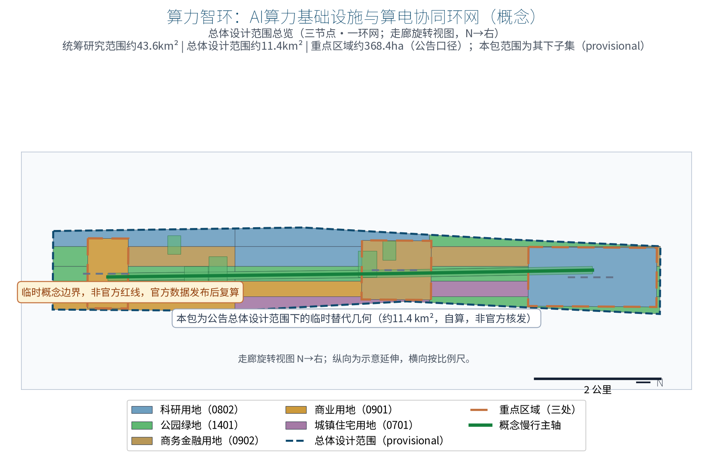
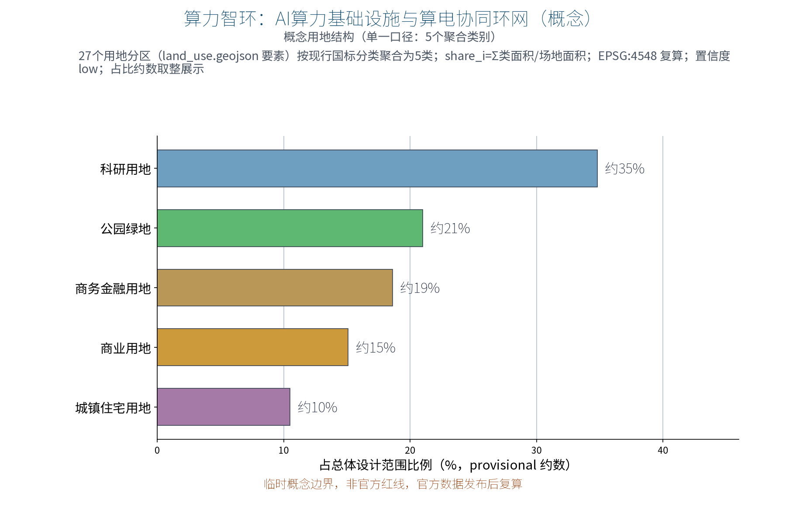
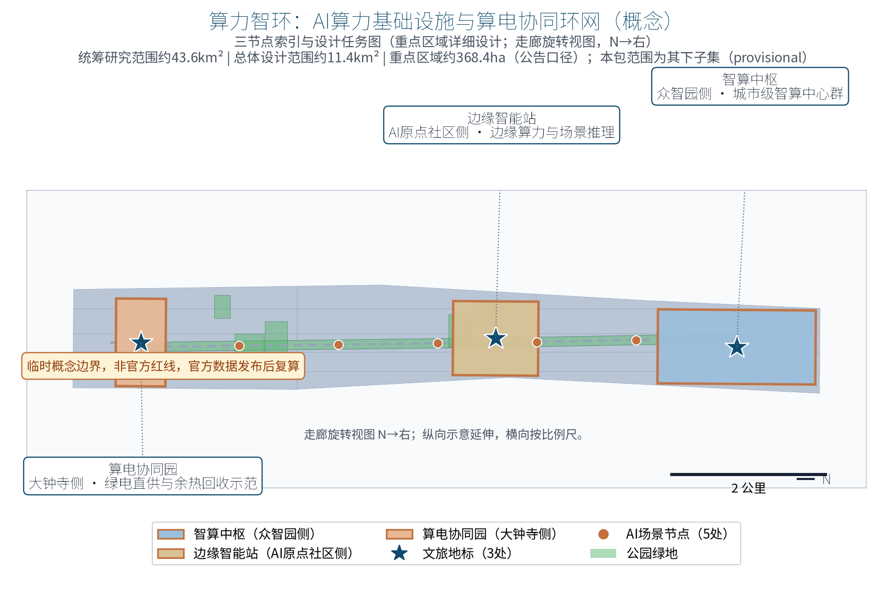
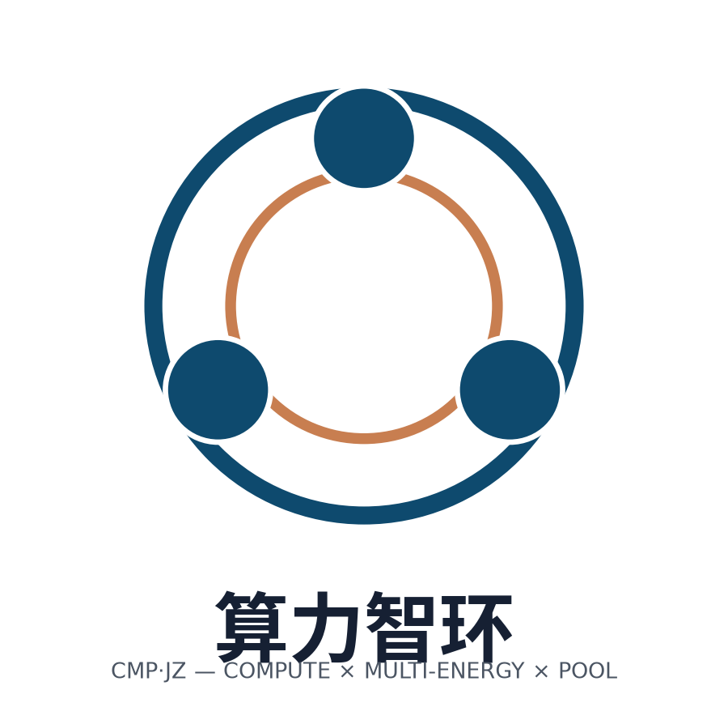
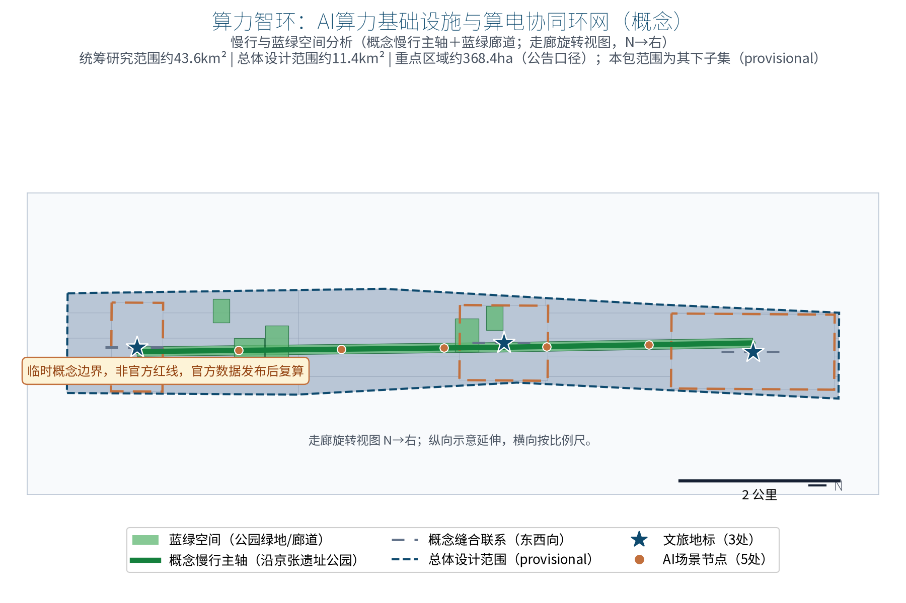
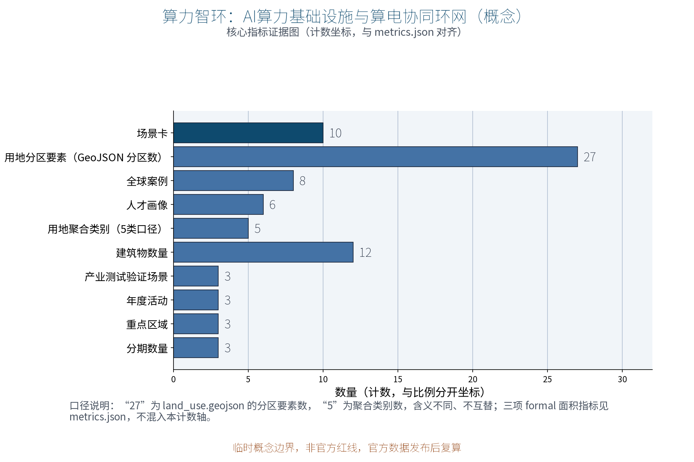

> Make compute a loop, make energy a loop, make heat and data loops too — every calculation becomes a visible city cycle.

Concept draft of submission package no. 37. CMP·JZ is an original naming proposal: CMP stands for Computing × Multi-energy × Pool, and JZ stands for Jing–Zhang; the Chinese name is "Compute-Energy Loop" (Chinese rendering appears in the zh proposal and zh figures) and means the three nodes form closed loops of four kinds of "flows": compute, green power, waste heat and data. This proposal focuses on the compute dimension of agent.2 mechanism elements in the taskbook and echoes the "smart AI vibrant city" positioning. All content is an open co-creation concept suggestion and reference scheme: for professional teams to deepen, it does not replace formal planning, does not constitute a government-approved conclusion, and does not constitute an engineering, investment or policy commitment.

## Basis and source list

This draft is primarily governed by the taskbook excerpt of the open call: three positioning statements, five functions, the three-zone two-wing layout, the six agent tasks (agent.1–agent.6) and boundary clauses. This project mainly addresses the compute element dimension of agent.2 "AI full-stack independent innovation system and world-class AI innovation ecosystem design", while also covering agent.3 scenario enablement, agent.4 public space, agent.5 cultural narrative and agent.6 long-term operation and public experience requirements. The structure and expression follow the proposal structure requirements of the submission skill and the chapter organization of the reference example.

Source list: ① the public announcement and the agent-facing taskbook excerpt (cleared public sources); ② the submission skill and review-dimension documents; ③ eight public cases each registered with publisher, link, date, claim and license boundary in sources.json (LUMI, Fugaku, Stockholm waste-heat district heating, Iceland's renewable energy endowment, the Guian data-center cluster, the East-Data-West-Compute / national integrated compute network, Beijing's public AI compute platform, and Shanghai Lingang's smart-compute center); ④ rights registration of display assets and fonts (the SIL OFL licensed Noto Sans SC font; all figures, drawings, logo and HTML pages are self-produced by this package and registered in report/copyright_statement.md).

Boundary statement: the overall scope and the three node locations of this package are provisional reference geometry under public clues only — not an official red line, ownership or engineering position; a full recalculation and relocation is required after the official boundary and regulatory plans are published. Current power and heat-network data and parcel ownership are missing; this is a registered data gap, so no irreversible works should be based on it in the near term.

> **Evidence anchors**: [source:DATA-SRC-OFFICIAL-ANNOUNCEMENT], [source:DATA-SRC-AGENT-TASKBOOK] (announcement and taskbook are the textual basis).

## Three-level scope framework

The three levels are connected by the responsibility chain of four flows — compute, power, heat and data — so that macro ecosystems, master plans and node designs do not contradict each other. Scope wording follows the announcement: **the coordinated research area is about 43.6 km², the overall design area about 11.4 km², and the key areas about 368.4 hectares** (subject to official publication; this package never mixes the level wording).

The coordinated research level answers "how compute elements become regional public value": it studies demand synergy between Haidian and the Beiwu community, Future Science City, Huairou Science City, the economic development zone and the Beijing–Tianjin–Hebei region — large training loads conceptually toward time-shifted coordination with the East-Data-West-Compute program and the Guian region, while local inference and data-sensitive loads remain local; it also studies the conceptual feasibility of green power availability and waste-heat reuse. The overall design level organizes the "three nodes, one loop network" concept along the belt, connecting the Zhongzhiyuan, AI Origin Community and Dazhongsi key areas, and defines three conceptual corridors: green-power direct supply, waste-heat recovery and shared cooling source. The key-area level develops the three nodes in three dimensions — function, space and public experience interface — and each node provides a relocatable spatial prototype and operation interface. The three key areas of this package total about 369 hectares of provisional geometry, self-computed from announcement clues and consistent with the announced about-368.4-hectare figure (not officially issued), subject to official publication.

Feedback loop: compute-scheduling AI dispatches loads between the Smart Compute Hub and Edge Intelligence Stations (concept); the Compute-Energy Synergy Park receives the energy side through green-power direct-supply access and waste-heat interface concepts; carbon-tracking AI feeds annual recomputation and disclosure back into scheduling and procurement decisions. At this level, model areas are recomputed from the provisional geometry in EPSG:4548, marked as provisional low-confidence values, and trigger recomputation when official data is published.

> **Evidence anchors**: [source:DATA-SRC-AGENT-TASKBOOK] (three-level scoping follows the official taskbook wording).

## Coordinated research level: industry and future-city study

Positioning-function mapping: facing the "AI fusion innovation belt" and "smart AI vibrant city" positioning, the five functions land as follows — the Smart Compute Hub supports "AI full-stack independent innovation system" and "global discourse on AI governance" (data sandbox and carbon-efficiency disclosure mechanisms); the shared compute pool shapes the "world-class AI innovation ecosystem"; edge inference and scenario experience carry the "AI+ scenario enablement new paradigm". In the three-zone two-wing loop, the three nodes carry the Zhongzhiyuan, AI Origin Community and Dazhongsi zones; the Zhongguancun tech-service wing provides factor allocation and capital support, and the Xiaoyuehe scenario-enablement wing hosts scenario experience and public paths.

Regional cooperation — role, resource flow, cooperation interface and spatial relation (conceptual framework; no data or investment commitments):

| Partner | Role | Resource flow | Cooperation interface | Spatial relation |
| --- | --- | --- | --- | --- |
| Beiwu community | Scenario and talent hinterland | Talent, scenario demand | Community scenario-opening list, co-design council | Westward link via green-belt slow paths |
| Future Science City | Compute and technology source | Research load, compute demand | Research compute service agreement, pool access | Northward link, hub interface reserved |
| Huairou Science City | Big-science facilities and data source | Joint sandbox computing | Sandbox mutual recognition interface | Northeast time-shifted collaboration |
| Economic development zone | Manufacturing and edge inference | Industrial inference load | Edge station service catalog | Eastward industrial corridor interface |
| Beijing–Tianjin–Hebei | Time-shifted training-load nodes | Large training loads (East-Data-West-Compute direction) | Integrated compute-network scheduling access | Regional scheduling; no local commitment |

Global cases are used only for mechanism comparison, summarized from public sources without numeric detail; all eight cases are individually registered in sources.json (publisher/link/date/claim/license boundary):

| Case | Public profile | Transferable mechanism | Source |
| --- | --- | --- | --- |
| LUMI (Finland) | Public sources show it runs on renewable hydropower with waste heat used for town heating in Kajaani | Green-power-driven + waste-heat-to-network | [source:CASE-LUMI] |
| Fugaku (Japan) | National public research compute platform open to researchers at home and abroad by law | Public compute open system | [source:CASE-FUGAKU-RIKEN] |
| Stockholm waste-heat heating | District heating publicly integrates data-center waste heat | Heat interface and metering mechanism | [source:CASE-STOCKHOLM-EXERGI] |
| Iceland geothermal data centers | Renewable grid endowment (published shares) attracts data centers | Energy-endowment siting synergy | [source:CASE-ICELAND-ENERGY] |
| Guian cluster | Published direction of a national data-center cluster (official figures) | Cluster scale effect | [source:CASE-GUIAN] |
| East-Data-West-Compute / integrated network | National public policy direction (hub green-power share targets) | National compute scheduling framework | [source:CASE-NDRC-SUANLI] |
| Beijing public compute platform | Public reports of Beijing launching a public AI compute platform | City compute as a service | [source:CASE-BEIJING-COMPUTE] |
| Shanghai Lingang smart-compute center | Public reports of Lingang advancing a public smart-compute center | Open smart-compute infrastructure | [source:CASE-LINGANG] |

Eight-factor mechanism concepts (deepened from the original compute and energy factors to land, space, industry, capital, talent, compute, data and scenarios; all are mechanism suggestions, not policy commitments): compute vouchers and a shared compute pool (compute); green-power direct-supply access and waste-heat recovery network interfaces (energy); flexible land-transfer interface reservation (land); a three-node spatial prototype library with relocatable siting rules (space); a scenario-opening list with industry test scenarios (scenario); talent co-intelligence and a developer conversion path (talent); data sandbox and joint-computing rules (data); an annual budget-category framework with pilot-matched funds (capital — categories only, no amounts).

> **Evidence anchors**: [source:DATA-SRC-PROVISIONAL-BOUNDARIES] (provisional boundary; the research scope is conceptual only).

## Overall design level: urban renewal and regulatory-depth urban design

The overall concept structure is "three nodes, one loop network": the **Smart Compute Hub** (Zhongzhiyuan side) is a city-level smart-compute center cluster concept hosting training and high-density inference with a shared compute pool and scheduling service platform; the **Edge Intelligence Station** (AI Origin Community side) is an edge-compute and scenario-inference node close to labs, startups and community scenarios; the **Compute-Energy Synergy Park** (Dazhongsi side) is a green-power direct-supply and waste-heat-reuse demonstration concept and carbon-efficiency disclosure venue. The loop network is a double loop, physical and logical: compute loads can be dispatched, green power can be directly supplied, waste heat can be recovered into the network, and data can circulate inside sandboxes — the four flows feed each other and form an "compute visible, cycles tangible" innovation-belt skeleton.

Renewal orientation: all three nodes follow the principles of existing-stock priority and reversible light renovation embedded in existing parks and urban-renewal spaces; no irreversible works are placed in disputed locations or heritage-sensitive areas; node locations are concept suggestions that can be relocated as a whole once the official boundary is published.

Regulatory depth follows a five-part pattern — "concept structure, spatial objects, indicators, data gaps, recalculation path". Statutory judgments (FAR, building heights, road red lines, rail alignments) remain pending official data and are never replaced by concept schemes; spatial recommendations are uniformly phrased as "concept suggestion", "reference scheme" and "available for professional teams to deepen".

> **Evidence anchors**: [source:DATA-SRC-MOHURD-CONTROL-DETAILED-PLANNING], [source:DATA-SRC-PROVISIONAL-BOUNDARIES].

## Key-area detailed design

The three nodes follow a "function, space, public experience interface" structure, with the principles of low-rise, existing-stock priority, durable and repairable, and low glare; building heights, storeys and construction details make no unsupported numeric commitments.

**Smart Compute Hub (Zhongzhiyuan side)**: conceptually a city-level smart-compute cluster — training and inference zones, shared-pool machine rooms, scheduling and monitoring premises, and a compute-voucher service desk. Spatially, a campus-level renewal organizes a "machine block, R&D podium, scheduling gallery" cluster with a moderate separation between machine rooms and public service interfaces. The public experience interface provides a bookable compute-visualization gallery and science nodes showing "how compute is dispatched" from anonymized aggregated operations data, without displaying individual information.

**Edge Intelligence Station (AI Origin Community side)**: functionally hosts edge compute and scenario inference — small-model deployment, low-latency inference and community-level AI+ scenario access. Spatially, it embeds into existing buildings and corner spaces as a compact "micro cabinet + co-intelligence lab + delivery porch" unit next to labs and community services. The public interface is a community scenario-demonstration window and a "sandbox disclosure" corner that publishes the rules and boundaries of the data security sandbox.

**Compute-Energy Synergy Park (Dazhongsi side)**: functionally a green-power direct-supply and waste-heat-reuse demonstration site — green-power access demonstration, heat-recovery exchange interface and carbon-efficiency metering and disclosure. Spatially, a small-scale composition of an "energy courtyard, heat-exchange interface well, display gallery" combined with commercial and public service spaces. The public interface hosts a "from watt to bit" science exhibition and the annual carbon-efficiency recomputation board, letting the public intuitively understand the compute-energy cycle.

> **Evidence anchors**: [data:PACKAGE-GEOMETRY] (node polygons come from geometry/key_areas.geojson in this package).

## AI innovation ecosystem, talent profiles and AI+ scenarios

User profiles (six persona types, meeting the not-less-than-five requirement): ① university and research teams needing public research compute and sandbox data environments; ② AI startups and developers needing low-cost compute, compute vouchers and pool access; ③ industry application enterprises needing edge inference and energy-optimization services; ④ public agencies and city operators needing carbon governance and energy decision support; ⑤ energy and municipal institutions as partners of green-power direct supply and waste-heat interfaces; ⑥ community residents and public visitors needing compute science communication and tangible green experience. The definition, counting method and evidence location of the six personas are aligned with metrics.json (persona_count=6) and displayed in visual/index.html.

Ten AI+ scenario cards (all "AI-assisted + human review" mode, covering transport, industry, space, public services, culture communication and governance boundaries):

| Card | Scenario | Location | AI capability & data input | Human review boundary |
| --- | --- | --- | --- | --- |
| SC-01 | Compute scheduling AI | Hub scheduling platform | Dispatch suggestions from declared load profiles (anonymized aggregation) | Dispatch confirmed by the responsible operator |
| SC-02 | Energy optimization AI | Synergy Park monitoring | Time-series anomaly detection and optimization hints (aggregated telemetry) | Adopted by maintenance personnel |
| SC-03 | Compute-service matching AI | Hub shared-pool desk | Supply-demand matching and voucher settlement assistance | No sensitive processing; human release |
| SC-04 | Data sandbox AI | Sandbox facilities at three nodes | Joint computing that keeps data in-domain | Public rules, access trail, human audit |
| SC-05 | Carbon tracking AI | Synergy Park board | Carbon-efficiency accounting and recomputation support | Source registration public; human review before disclosure |
| SC-06 | Slow-path guidance AI | Green-belt nodes | Route suggestions from facility hours and booking data | No individual tracking; human calibration |
| SC-07 | Public-space guide AI | Science interfaces | Exhibit lookup and multilingual guide generation | Content reviewed by humans before release |
| SC-08 | Accessible voice/large-type guide AI | Service desks | Convert approved content to voice and large type | Output reviewed; human service fallback |
| SC-09 | Developer support AI | Hub service desk | Voucher eligibility pre-check (form rules) | Grant decisions made by humans |
| SC-10 | Carbon disclosure Q&A AI | Synergy Park board | Q&A based on disclosed annual report data only | Cites disclosed content only; human review |

Scenario card counting: metrics.json (scenario_card_count=10) counts the ten rows of this table, aligning with the "not fewer than 10 scenario cards" requirement of agent.3.

Three industry test scenarios are presented with independent test objects, data inputs, validation metrics and exit conditions (threshold framework only; no fabricated power, heat, capacity, investment or approval data):

| Industry test scenario | Test object | Data input | Validation metrics | Exit condition |
| --- | --- | --- | --- | --- |
| Compute scheduling simulation | Scheduling algorithm prototype (pool test partition) | De-identified anonymized load samples and booking queue | Queue wait, resource utilization, human-review pass rate (thresholds preset in writing by the pilot task force) | Pause and review if any metric stays below the preset floor |
| Energy optimization + heat metering joint test | Heat-interface metering prototype and optimization model | Aggregated telemetry and heat-exchange readings | Metering error, suggestion adoption rate (preset thresholds) | Stop on metering anomaly or adoption below the preset floor |
| Sandbox joint-computing test | Sandbox rule engine and joint-computing framework | De-identified datasets and access logs from participants | Rule hit rate, audit-trail completeness, human audit pass rate (preset thresholds) | Abort on rule bypass or broken audit chain |

Scenario-to-space-to-operation mapping: compute scheduling AI, compute-service matching AI and developer support AI sit on the Hub's scheduling and service platform, run by the responsible compute operator; energy optimization AI, carbon tracking AI and disclosure Q&A AI sit on the Synergy Park energy and disclosure interface, reviewed annually by the responsible energy operator; data sandbox AI sits at the three sandbox facilities, executed by the dedicated data-security officer; slow-path guidance AI, public-space guide AI and accessible guide AI sit on the green belt and public interfaces, run by the community scenario operator. All scenarios follow the "anonymized aggregation + human review" baseline: no individual-identifying tracking, no over-monitoring.

> **Evidence anchors**: [source:DATA-SRC-GENERATIVE-AI-INTERIM-MEASURES] (reference for generative-AI content governance wording).

## Brand identity and visual system (Logo/VI)

The original concept "CMP·JZ Compute-Energy Loop" is consolidated into an extendable brand asset: a four-layer VI system — logo, symbol grammar, typography and color spec, and international application (self-produced by this package; registered in the asset ledger):

- **Logo mark**: `logo-cmpjz.png` (assets/figures/logo-cmpjz.png) — a three-node ring emblem: three dots (Hub, Edge Station, Synergy Park) connected by double ring flows; the inner ring implies compute and data loops, the outer ring green power and waste-heat loops, with the bilingual "CMP·JZ Compute-Energy Loop" wordmark (Chinese rendering on the zh side); language-neutral, shared by zh/en layouts.
- **Symbol grammar**: the three-dot-plus-double-ring motif extends to wayfinding arrows, disclosure-board corner marks and science-exhibit icons; the motif must not be used for decorative stacking.
- **Typography and color spec**: Chinese display type uses the SIL OFL licensed Noto Sans SC; Latin and numerals use the same Noto Sans family; the primary palette is "railway gray + compute cyan" (deep cyan #0E4A6E as primary, warm gray #6B7280 and waste-heat orange #C2703D as accents), presented in low-glare, installation-like ways.
- **International application**: the English proposal (proposal.en.md), English figures, English A0/A3 drawings and English HTML pages (all provided under the V2 bilingual contract of this package) use the same CMP·JZ wordmark and color spec, ensuring substantive zh/en equivalence of claims, metrics, evidence and figure positions.

**Trademark prior-rights and usage boundary**: this proposal is at the concept stage, and no official trademark prior-rights search has been completed; the CMP·JZ mark and the Chinese name "Compute-Energy Loop" are treated as internal working codenames until a clearance search is completed — they are not registered, not claimed as trademarks, and not used externally as a formal brand before clearance; all appearances in figures, drawings and HTML are concept illustrations only. Rights registration: sources.json (ASSET-PACKAGE-SELF-PRODUCED, ASSET-FONT-NOTO-SANS-SC) and report/copyright_statement.md.

> **Evidence anchors**: [source:PACKAGE-GEOMETRY] (the logo is self-produced with the package concept system and extendable into a VI manual).

## Land use, building scale and retain/renovate/demolish scheme

Land use concept: on the temporary overall boundary, five conceptual zoning classes of the current national land-use classification (GB 50137 reference) completely cover the area; classes and shares are the single package-wide caliber, all recomputed from geometry/land_use.geojson in EPSG:4548: research land (0802) about 35%, park green space (1401) about 21%, business & finance land (0902) about 19%, commercial land (0901) about 15%, urban residential land (0701) about 10% (rounded, low-precision display, summing to about 100%). Caliber note: land_use.geojson contains 27 GeoJSON zone features (land_use_zone_count=27) aggregated by land-use code into 5 classes (land_use_class_count=5); 27 and 5 have different meanings and are never interchangeable — the feature count is used only in the "feature count" context and class shares only in the "share" context. Aggregation and recompute rule: share_i = sum(area of polygons with land_use_code=i) / site_area_sqm, confidence low (provisional conceptual geometry, not official data); the same logic triggers re-cut and recompute when the official regulatory plan or formal land data arrives. This is a conceptual land-use suggestion that does not change statutory land uses.

Building scale: the envelope only describes conceptual scale relations of replaceable functional parts (public services, scheduling and exhibition) in the three nodes; no gross floor area, building height or capacity conclusions are given; such statutory and engineering indicators remain pending official data and survey/regulatory material.

The retain/renovate/demolish logic follows a four-step method: first verify existing conditions, ownership and heritage constraints; retain existing stock if safe and functional; apply reversible light renovation when accessibility, energy efficiency and public interfaces are needed; relocate or delete conceptual parts in safety or ownership conflicts. Without surveys and official red lines, no demolition areas or specific retain/renovate/demolish schemes are proposed.

Form principle: the three nodes continue the plain scale of railway industry heritage and the innovation order of Zhongguancun; energy facilities are integrated into streetscapes as installed, visitable objects; facades, setbacks and fire construction are left to professional deepening, with no "AI-shaped" decorative stacking.

> **Evidence anchors**: [source:DATA-SRC-MNR-LAND-USE-CLASSIFICATION-202311] (land-use classification names follow the current national standard).

## Transport, rail, municipal works and public services

Transport links (concept): conceptual corridors between the three nodes are suggested along existing roads and slow-moving systems — maintenance/freight routes for compute equipment are separated from public slow-moving experience routes; no road red lines, rail alignments or bridge/tunnel engineering conclusions are given.

Municipal conceptual interfaces (interface element chains and access-threshold frameworks only; no power load, capacity or works conclusions; the demand thresholds, preconditions, pilot size ranges, responsibilities, cost categories and stop rules of green-power direct supply, waste-heat grid connection and shared cooling are uniformly registered in the "Implementation and long-term operation matrix" section):

- **Green-power direct supply line**: conceptual interface chain "power source / green-power certificates — direct-supply busbar — node receiving interface — metering gateway"; access elements include green-power source registration, adjustable-load commitment and metering data disclosure; feasibility requires professional review by the grid authority.
- **Waste-heat recovery network**: conceptual interface chain "machine-room heat recovery — heat-exchange station — district-heating interface well — metering and grid-connection agreement"; interface elements include temperature-level grading, interface metering and grid-connection responsibility boundaries, as a negotiation framework for later professional design.
- **Shared cooling source**: a conceptual shared cooling-source main between the nodes using seasonal and load time-shifting; only interface locations and collaboration modes are shown, with no capacity or works extent.

Public services: each node has a human service desk, scheduling and visit-booking interfaces and an annual disclosure board; non-digital equivalent channels (paper, telephone, human reception) are guaranteed first; AI is only assistance, and public decisions are made by humans.

> **Evidence anchors**: [source:DATA-SRC-MOHURD-URBAN-DESIGN-MEASURES] (method reference for municipal and slow-mobility wording).

## Blue-green space, public space and city character

Blue-green structure (concept): relying on the Jingzhang heritage park green corridor and the Xiaoyuehe water system, two conceptual green corridors connect the three nodes so compute facilities sit within reach of greenery; a heat-science node next to the Synergy Park's green areas conveys energy-efficiency perception through a "waste heat — heating — green space" cycle, with no engineering calculation.

Public space: the three public experience interfaces form a "compute visible, cycles tangible, results checkable" public-space chain — viewing galleries, sandbox disclosure corners, carbon-efficiency boards and science exhibitions. Components follow durable, repairable, movable principles and are replaced when damaged; the green ratio and public-space ratio are conceptual values recomputed from provisional geometry (this package: green ratio about 12.2%, public-space ratio about 0.4%, both displayed at low precision with a prominent provisional warning), recomputed when official boundary, green and public-space data are published, and not treated as approved indicators.

City character: the keywords are "order, transparency, cycle" — energy and operations data are presented in low-glare, installed ways without neon sci-fi facades; the three nodes coordinate in scale, material and detail with railway heritage and Zhongguancun streetscape. Landmark perception comes from "visible cycles" rather than decorative markers.

> **Evidence anchors**: [source:DATA-SRC-MOHURD-URBAN-DESIGN-MEASURES] (method reference for blue-green organization).

## AI public space, cultural-tourism landmarks and experience components (agent.4)

Three landmark catalogs (cultural-tourism landmarks for agent.4 "pilgrimage landmark design"):

| Landmark catalog | Location | Experience theme | Opening & management |
| --- | --- | --- | --- |
| Hub science landmark | Zhongzhiyuan side | Compute-dispatch visualization and voucher desk | Booked visits + regular open days |
| Edge station scenario landmark | AI Origin Community side | Community AI+ demo window and sandbox disclosure corner | All-hours open + human service window |
| Synergy Park energy landmark | Dazhongsi side | "From watt to bit" exhibition and carbon board | All-hours open + annual disclosure event |

Honor display and experience component library (public-space components, durable/repairable/movable):

| Library | Component | Location | Material & maintenance |
| --- | --- | --- | --- |
| Disclosure | Annual carbon board, sandbox rules board, honor wall | Three-node public interfaces | Weather-resistant panels, replaced when damaged |
| Science | Compute-visualization gallery, science windows, heat node | Hub, Synergy Park | Low-glare installed presentation |
| Service | Human desk, booking corner, accessible voice column | Node entrances | Human + paper equivalent paths as fallback |
| Honor | Open co-creation honor wall (civic builds, developer events, volunteer honors) | Public-space chain | Updated annually, human-reviewed |

> **Evidence anchors**: [data:PACKAGE-GEOMETRY] (landmarks and components map to the ai_landmark and scenario_node layers of public_space).

## Cultural narrative, wayfinding system and international communication (agent.5)

The "Compute-Energy Loop" narrative: a dialogue between railway-industry power memory and digital-era compute power — the Jingzhang Railway was the power belt a century ago; compute is the belt's new power (concept narrative; no official announcements are used to support spatial red lines or engineering conclusions).

Three-level wayfinding system (concept): ① belt level — ring motifs and the bilingual "CMP·JZ Compute-Energy Loop" master motif along the green belt; ② node level — bilingual entrance signage and direction at the three nodes; ③ facility level — functional labels of disclosure boards and science exhibits, with accessible large-type versions. All wayfinding content is human-reviewed; English terms prefer the competition glossary recommendations of docs/terminology-glossary.md.

International communication copy (examples only, conceptual): "Compute in a loop, energy in a loop, heat and data in a loop — every calculation becomes a visible city cycle", mirroring the Chinese master copy (rendered in Chinese in the zh proposal and zh figures) as a substantively equivalent zh/en concept layer.

> **Evidence anchors**: [source:DATA-SRC-AGENT-TASKBOOK] (naming-system and cultural-narrative requirements follow the taskbook).

## Project list, implementation policy and phasing

Three categories of conceptual project lists (all reference schemes for professional teams to deepen):

**Compute foundation**: shared-pool expansion and scheduling-platform renovation concept; edge station existing-stock embedding renovation; Synergy Park energy-interface demonstration. **Coordination mechanisms**: compute-voucher issuance and settlement rule pilot; green-power direct-supply access process; waste-heat recovery network interface standard; data sandbox rules; annual carbon-efficiency recomputation and disclosure mechanism. **Service ecosystem**: compute-service matching platform concept; developer community and compute open competition; compute science communication and public display; talent co-intelligence and voucher-usage guidance program.

Annual program brands (aligned with metrics.json annual_program_count=3; all event designs are conceptual, with no effect commitments):

| Annual program | Frequency & venue | Content & audience | Responsibility & conversion |
| --- | --- | --- | --- |
| Global Compute Open Season | Q3 each year, Hub and along the belt | Open visits, compute-service roadshows, international communication | Human-reviewed content; lead-intent registration |
| AI Compute Science Week | May–June each year, three nodes and communities | Science exhibitions, campus student sessions, elder/child sessions, family and visitor sessions | Community volunteers; non-digital channels in parallel |
| Green Compute Exchange Day | October each year, Synergy Park | Annual carbon disclosure release, green-power open day | Human review before disclosure; public feedback into next year's plan |

Scenario opening and attraction-conversion mechanism (concept chain): voucher application (developer community) → pool trial and sandbox validation (scenario-opening list) → test-period pass (exit-condition framework of the industry test scenarios) → incubation and landing interface (professional teams and local service agencies) → annual carbon disclosure (public review of conversion outcomes). The developer community includes three carriers: open-source sandbox, competitions and co-intelligence lab; conversion commits no company lists or landing volumes. Responsibilities are concretized by actor: the government coordinating authority issues rules and runs stage gates; universities and research institutes provide validation subjects; enterprises and the developer community participate in pilots; responsible operators run daily operations; community volunteers host public interfaces; residents join annual reviews through councils and feedback channels.

The implementation-policy concept follows "mechanisms first, light renovation, mandatory disclosure": pilot compute vouchers and sandbox rules first, then interface renovation; the annual carbon disclosure serves as the standing public-commitment interface (concept).

Phasing (concept, not commitment): **near-term 1–3 years**, mechanism pilots and first-node renovation with the shared pool opening for trial; **mid-term 3–5 years**, loop-network connection, three municipal interface rules maturing, edge stations expanding; **long-term 5–10 years**, full-loop coordinated operation with cooperation interfaces to outside compute nodes, and carbon disclosure as a normal practice.

> **Evidence anchors**: [source:DATA-SRC-AGENT-TASKBOOK] (phasing and implementation items follow the taskbook).

## Implementation and long-term operation matrix (three-node pilots · governance · KPI)

Three-node pilot implementation matrix (threshold frameworks and responsibility divisions only; no fabricated power, heat, capacity, investment or approval data; generic "operator" roles are concretized below, with final organizations subject to the official procedure at the time):

| Dimension | Smart Compute Hub (Zhongzhiyuan side) | Edge Intelligence Station (AI Origin side) | Compute-Energy Synergy Park (Dazhongsi side) |
| --- | --- | --- | --- |
| Minimum pilot | One pool test partition + voucher desk | One existing corner unit + demo window | One heat-interface well + disclosure board |
| Preconditions | Green-power source and metering plan, sandbox rules, liability-insurance framework | Community council consent; cooling noise and heat standards met | Temperature-level and grid-connection feasibility study; metering agreement |
| Responsible actors | A future data & compute coordination mechanism (concept) leading — a conceptual arrangement for future coordination only, not an existing or planned government body; professional compute operator via open selection | Sub-district community service center + community volunteers | District-heating network owner + responsible energy operator (via open procedure) |
| Cooperation interfaces | Grid utility's local office (green-power agreement); universities and institutes | Sub-district, schools, startups | Grid, heating owner, commercial and public-service operators |
| Stage gates | Written milestone review per stage (pilot task force); no next stage below threshold | Expand after trial run and community-feedback review | Expand after first metering disclosure delivered and human-reviewed |
| KPI framework | Queue wait, resource utilization, human-review pass rate | Scenario usage, feedback closure rate | Metering accuracy, disclosure timeliness, feedback adoption |
| Maintenance | Equipment maintenance contract + annual recomputation | Community co-management; replace when damaged | Routine inspection of heat facilities + annual recomputation |
| Public feedback | Booking-platform feedback channel + human reception | Community council + suggestion box | Board feedback area + online disclosure |
| Exit & recovery | Pilot fails → suspend under written stop conditions and exit mechanism, revert to normal office/machine-rental use | Revert to original stock use; no irreversible works | Interface well sealable and recoverable; board retained as public facility |

Long-term operation matrix (governance, annual budget categories, maintenance, developer conversion path and continuous KPIs; categories only, no amounts):

| Governance element | Mechanism framework (concept) |
| --- | --- |
| Governance structure | Tri-node co-construction committee (government coordination, operators, community representatives, expert volunteers); annual council |
| Annual budget categories | Operations; renovation; disclosure & science; community co-building; contingency (categories only) |
| Maintenance | Equipment contracts; replace-when-damaged for disclosure fixtures; annual recomputation trigger |
| Developer conversion path | Voucher (use) → shared pool (trial) → sandbox (validate) → test scenario (prove) → landing interface (convert) |
| Continuous KPIs | Disclosure timeliness, feedback closure, scenario usage, accessibility compliance (human-review basis) |

> **Evidence anchors**: [source:DATA-SRC-MOHURD-URBAN-DESIGN-MEASURES] (method reference for implementation and operation wording).

## Indicator system, area recomputation and compliance matrix

Conceptual indicator system: three nodes; six persona types (persona_count=6); ten scenario cards (scenario_card_count=10); three industry test scenarios (industry_test_scenario_count=3); three annual programs (annual_program_count=3); eight global cases (global_case_count=8); shared-pool service items; carbon-efficiency indicator with annual recomputation and disclosure. FAR, building heights, demolition areas and other statutory/engineering indicators remain pending official data because they depend on unpublished regulatory plans and surveys.

Three formal core metrics (recomputed from provisional geometry in EPSG:4548): `site_area_sqm` (about 11.4 km², temporary overall boundary), `green_ratio` (about 12.2%, green area / boundary area), `public_space_ratio` (about 0.4%, public space / boundary area). All three are recomputed from the submitted site_boundary, green_space and public_space geometry; results retain the provisional mark, low confidence, source and formula registered with the package; display always uses low-precision rounded values with a prominent warning, consistent with the dual layer of visual/index.html (data-value for machine checks and low-precision text for display); official boundary, green and public-space data trigger recomputation, and placeholder or geometry-free values are never substituted.

Compliance matrix: item-by-item mapping of agent.1 (overall concept and naming system), agent.2 (compute mechanism elements and ecosystem cases), agent.3 (scenario cards and profiles), agent.4–agent.6 (public experience, cultural narrative and long-term operation) and boundary clauses; every statutory judgment without official data support is marked as a concept suggestion, and numbers never stand in for evidence quality.

> **Evidence anchors**: [metric:green_ratio], [metric:public_space_ratio], [source:PACKAGE-GEOMETRY].

## Inclusion, accessibility and community co-design

Concrete standards for older adults, children, persons with disabilities, low-digital-literacy groups and nearby residents (conceptual standard framework; final implementation subject to specialized design and on-site measurement):

- **All-age friendly standards**: rest seating and shade nodes along demonstration slow-path sections; low-glare lighting and no sharp corners in child and elder places; large-type and voice versions of exhibits; enlarged key information on boards with human explanation periods; families, students, visitors and nearby residents can all access services through non-digital equivalent channels (paper, telephone, human reception).
- **Accessibility standards**: accessible ramps and curb ramps on demonstration sections per passage standards; accessible voice columns in parallel with paper guides; telephone and human channels retained for booking. Accessibility compliance for all groups, including persons with disabilities, is confirmed by human review and on-site measurement — machine validation of this page and figures cannot replace accessibility human review (method reference: the Law on Building a Barrier-Free Environment and GB 55019; concrete parameters per specialized design).
- **Noise and heat impacts**: cooling facilities and heat-exchange stations are sited away from bedroom orientations and children's activity areas; noise control follows the environmental-noise functional-zone limits of the national standard (cited as method reference); waste-heat vents are placed away from dense pedestrian areas with the impact-monitoring plan disclosed annually; environmental monitoring results enter the stage-gate review during the pilot phase.
- **Community co-design mechanism**: design disclosure periods plus feedback channels (online disclosure, suggestion boxes, human reception); an annual community council; co-design workshops; public feedback enters stage gates and annual reviews, with adoption results published on the board.
- **Low-digital-literacy fallback**: all public services retain paper, telephone and human-reception equivalent paths; vulnerable and low-digital-literacy groups receive equal service through enquiry desks and volunteer guidance; AI is only assistance, and public decisions are made by humans.

## Risks, copyright and compliance

Main risks: the temporary boundary being misread as a red line; compute and energy scales being misread as engineering or investment commitments; waste-heat grid connection and green-power direct supply involving grid and heating ownership safety requiring professional agreements; mechanism suggestions being misread as settled policy; and provisional numeric display precision being misread as measured precision. Countermeasures: all statements are limited to "concept suggestion / reference scheme / available for professional teams to deepen"; interface content is presented as diagrams only; no conclusion is upgraded before formal surveys; provisional numbers are always displayed at low precision with a prominent warning; accessibility and usability statements are certified by human review, never by machine PASS alone.

Compliance bottom line: no fabricated official data, compute scales, investment amounts, company lists, policy promises or event effects; no unauthorized corporate trademarks; international and domestic cases are summarized from public channels only and registered one by one in sources.json with usage and license boundaries; display assets and fonts are registered in report/copyright_statement.md, and materials without provable reuse rights are not used; data governance uses only anonymized aggregation and human review — no individual-identifying tracking and no monitoring scenarios that cannot be human-reviewed; AI is only assistance and public decisions are made by humans, consistent with the human-centered governance charter.

Copyright: the text and concept system of this draft are original works of the author with AI collaboration, suggested for release under the community-display license; the eight public cases are used only as factual and methodological references, with no copying of copyrighted images, marks or layouts; figures, drawings, the logo, HTML pages and geometry are self-produced with open-source tools such as matplotlib; the font is the SIL OFL licensed Noto Sans SC; generated content notes its sources and limits. Before formal deepening, official boundary, regulatory plan, grid and heat-network survey data must be completed and reviewed by urban planning, energy and municipal professional teams.

> **Evidence anchors**: [source:DATA-SRC-OFFICIAL-ANNOUNCEMENT] (the call rules are the basis of ownership and compliance wording).

## References

| Category | Source and use |
| --- | --- |
| Taskbook | Agent open-call taskbook excerpt (three positioning statements, five functions, three-zone two-wing layout, agent.1–6, boundary clauses) |
| Skill | Submission skill (proposal structure requirements) and reference example (chapter style and depth) |
| International cases | LUMI, Fugaku, Stockholm waste-heat heating, Iceland energy endowment — registered one by one in sources.json |
| Domestic directions | Guian, East-Data-West-Compute / integrated network, Beijing public compute platform, Shanghai Lingang — registered one by one in sources.json |
| Indicators | Three formal metrics recomputed from in-package provisional geometry; formulas, sources and recomputation triggers registered with the package |
| Assets & fonts | Noto Sans SC (SIL OFL 1.1); self-produced figures/drawings/logo/HTML — registered in report/copyright_statement.md |
| Data gaps | Official overall boundary, key-area scope, regulatory plan, grid and heat-network survey, parcel ownership and heritage protection data pending |

The concrete URLs, publishers, access dates, licenses and limits of the above sources follow the source registry; this draft is the revised concept draft (v1.1) of submission package no. 37 and will keep being revised and recomputed as the taskbook and public data update. Formal deepening must be reviewed by professional planning, energy and municipal teams after official material is complete; this document constitutes no government endorsement, implementation approval, statutory plan or engineering feasibility conclusion.

> **Evidence anchors**: [source:DATA-SRC-OFFICIAL-ANNOUNCEMENT] (the first item of this list is the organizer's public material package).