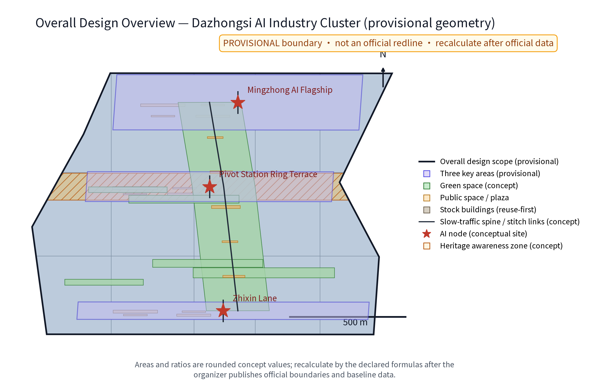
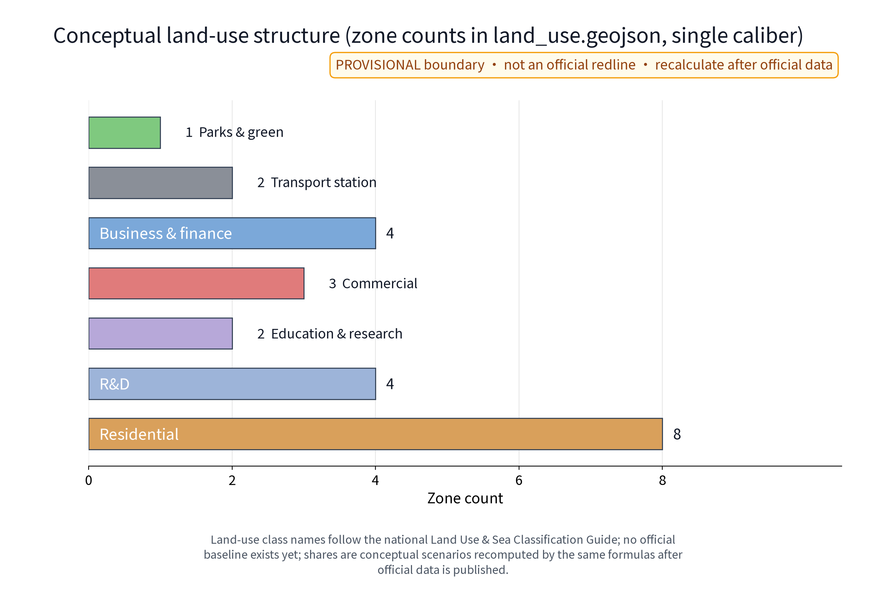
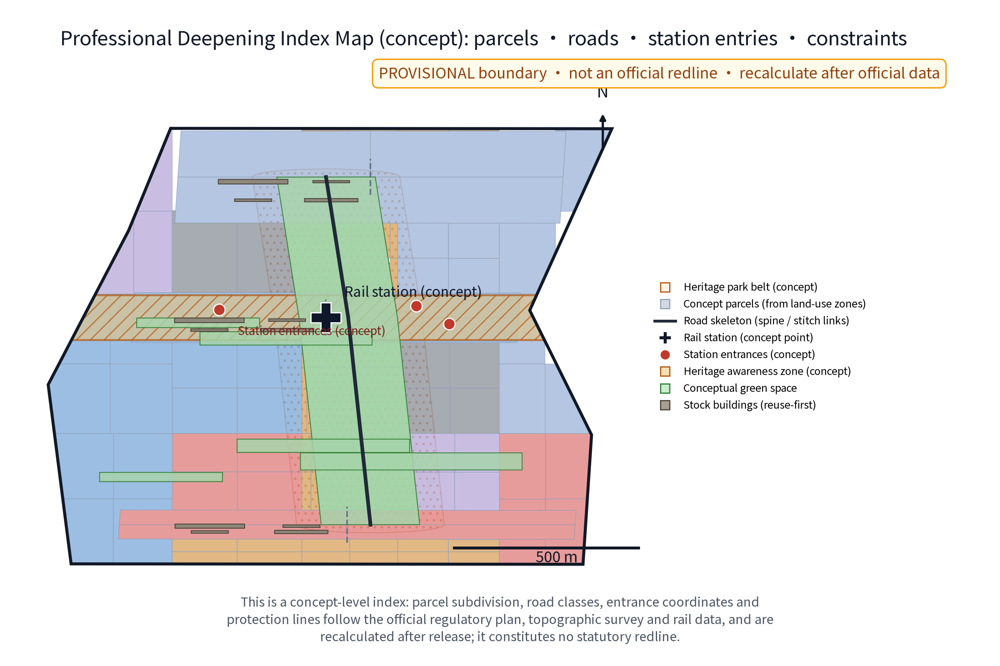
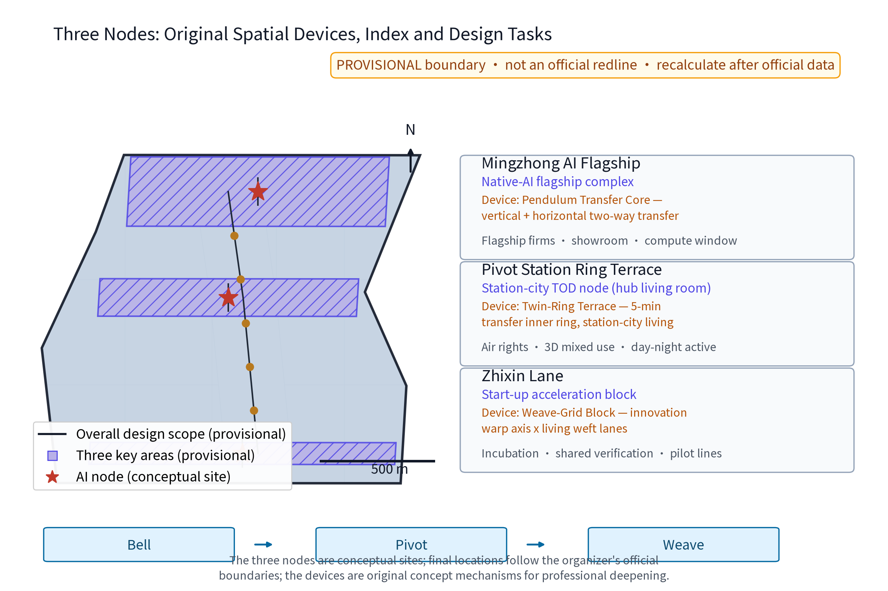
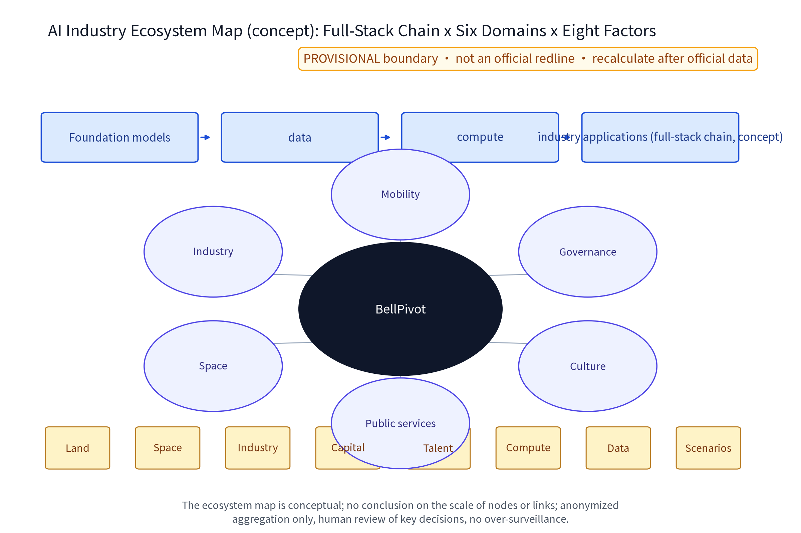
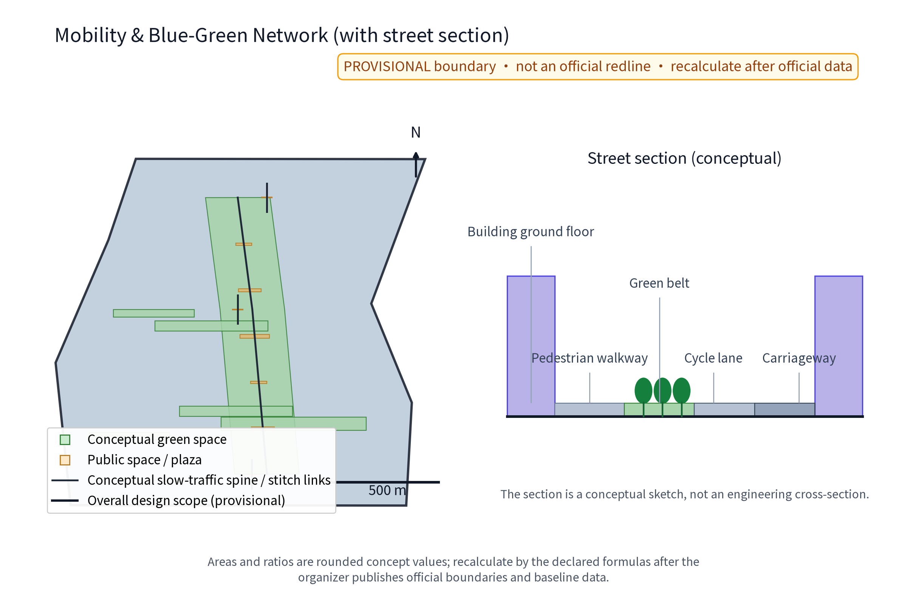
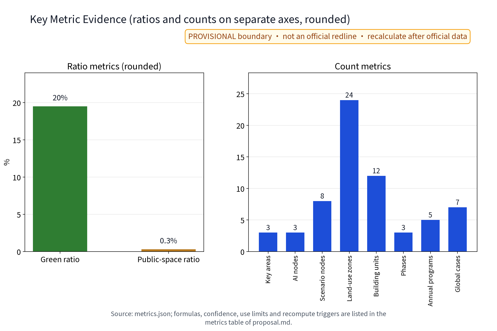
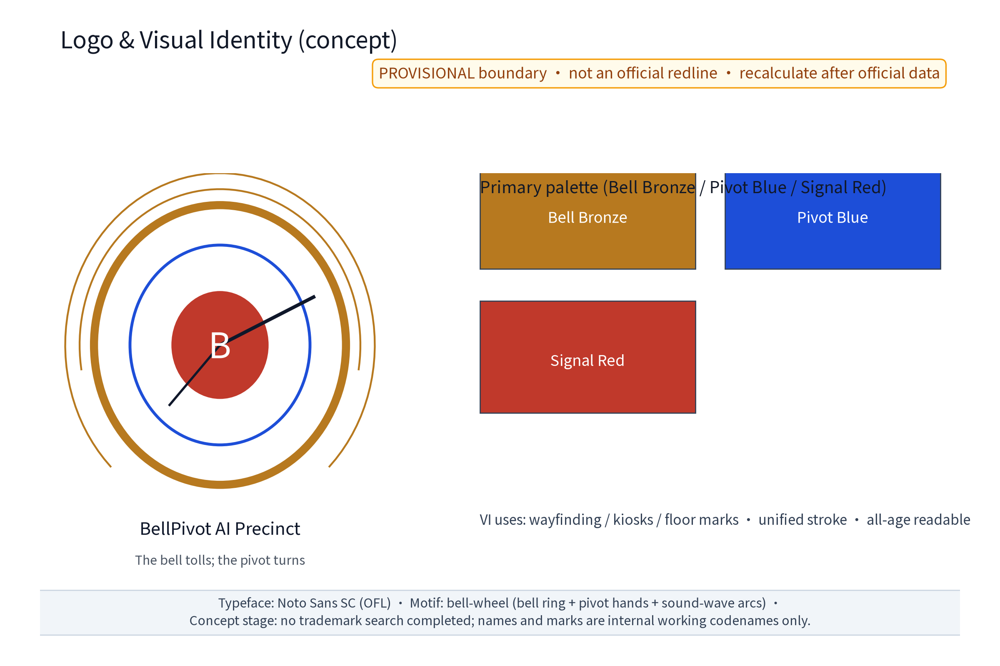

> Section note: this proposal is conceptual research advice. It does not replace statutory planning and provides no conclusion on FAR, building height, retain-renovate-demolish figures, budget, visitor capacity or engineering feasibility. All statements follow published public sources only and are recomputed item by item once official data is published. The Chinese proposal.md is the binding version; this English version is a substantively equivalent translation.

## Design Basis and Source List
The design basis relies on public sources: the official call announcement and the agent taskbook text for the Centennial Jingzhang AI Innovation Belt (registered in sources.json), public planning texts (Beijing Master Plan 2016-2035, Haidian District Plan), public AI-industry policy texts, public reporting on the Jingzhang Railway Heritage Park and on the Qinghe, Shangdi (Zhongguancun Software Park), Zhichun Road, Zhongguancun Avenue and Xueyuan Road nodes, and the national texts on personal-information protection, data security and barrier-free environment construction. Global AI ecosystem cases cited in this proposal are registered one by one in sources.json with institution pages, access dates and reuse boundaries; any detail that cannot be verified is explicitly demoted to a research hypothesis and never enters the formal evidence chain.

As of this draft the organizer has not published official boundary polygons; all geometry here is provisional, and this proposal never quotes unpublished coordinates or area values. The full reference list appears in the "References" section; official published versions govern wherever a conflict arises.

> **Evidence anchors**: [source:DATA-SRC-ANNOUNCEMENT-2026-05-09], [source:DATA-SRC-AGENT-TASKBOOK-2026-05-18].

## Three-Level Scope Framework
The official three-tier scopes are: coordinated research area approx. 43.6 km2, overall design area approx. 11.4 km2, and key detailed-design areas approx. 368.4 ha in total (official textual caliber). The key areas consist of the "three zones, two wings": the Zhongzhiyuan AI Acceleration Zone (approx. 192 ha), the Beijing AI Origin Community (approx. 104 ha) and the Dazhongsi AI Industry Cluster (approx. 72 ha), plus the Zhongguancun Tech-Service Wing and the Xiaoyue River Scenario Wing. This package deepens the Dazhongsi cluster and treats the other zones as a synergy framework; interface topics (industry, slow traffic, municipal services, data) are defined at every tier boundary so the concept can be assembled by professional teams as one whole.

All geometry in this package is provisional concept geometry. When the official polygons are published, the containment relation with the official scopes is checked first, then every area and indicator is recomputed in full; every tier keeps machine-readable evidence anchors, geometry layers and metrics mapped to the taskbook sections.

> **Evidence anchors**: [source:DATA-SRC-AGENT-TASKBOOK-2026-05-18] (the three-tier scope and area calibers follow the taskbook).

## Coordinated Research Area: Industry and Future City Research
The coordinated research (approx. 43.6 km2, official textual caliber) uses the Jingzhang Railway Heritage Park line as the spatial spine telling the centennial evolution of "railway - station - park - city": the Qinghe segment as a waterfront and gateway, Shangdi and Zhongguancun Software Park as the software and services ecosystem, and Zhichun Road, Zhongguancun Avenue and Xueyuan Road as the science-education entrepreneurship DNA. Three conceptual issues are studied: first, a chain layout of the full-stack AI self-innovation system (foundation models, compute, data and industry applications elastically allocated by function zone, forming an iterable AI ecosystem map - concept); second, global allocation of factors for a world-class AI innovation ecosystem through the Zhongguancun Tech-Service Wing (IP, capital, talent, standards); third, an intelligent AI vibrant city with a voice in AI governance, testing real scenarios along the Xiaoyue River Scenario Wing. The belt is framed as one: Centennial Jingzhang Culture Belt, Metropolitan AI Living and Experience Belt, and AI-Integrated Innovation Belt.

Regional synergy: this tier establishes synergy-loop hypotheses towards Beiwei Community, Future Science City, Huairou Science City, Beijing Economic-Technological Development Area (ETDZ) and Jing-Jin-Ji, covering factor exchange, cooperation scenarios, spatial/digital interfaces and verification indicators (see the "Regional Synergy Matrix" section). All of the above is conceptual research direction, not an industry commitment.

> **Evidence anchors**: [source:DATA-SRC-PROVISIONAL-BOUNDARIES-2026-06-05] (provisional boundary; research scope shown as concept only).

## Overall Design Area: Urban Renewal and Regulatory-Plan-Level Urban Design
The overall design area (approx. 11.4 km2, official textual caliber) is stock-first: first, a "culture - ecology - slow traffic" compound corridor along the heritage park stitching the street blocks on both sides; second, TOD density gradients organised around rail stations and the hub, with intensity and streetscape-interface control; third, stock-building industry-conversion potential identified through a "retain - renovate - renew" classification guide. In the Dazhongsi cluster the proposal anchors on station-city integration, marks the hub periphery as a priority area for higher-density mixed development (concept) and studies regulatory-plan-depth indicator transmission, including land-use compatibility, scale caps, setbacks and build-to-line ratios, and underground connections (all concept suggestions, not planning conclusions). Municipal and transport specialisations check carrying capacity in parallel.

No numeric conclusions are preset for intensity, height or interface control until official control conditions are published; all retain-renovate-demolish arrangements require statutory procedure and property-rights coordination. Figures use publicly citable station, road, park and water-system names for conceptual positioning only and never invent official red lines.

To support the regulatory-plan-depth deepening path, a "Professional Deepening Index Map" (concept) is provided: the conceptual land-use zones are further subdivided into conceptual parcels, overlaid with the road skeleton (slow-traffic spine and stitch links), rail station and entrance concept points, and constraint layers such as the heritage awareness zone and the heritage-park coordination belt, serving as the index base map for professional deepening of parcels, roads, station entries and constraints. All deepening elements are concept-level: parcel subdivision, road classes, entrance coordinates and protection lines follow the official regulatory plan, topographic survey and rail-specific data and are recalculated after official release; this map constitutes no statutory redline or approval basis and presets no intensity or height values.

> **Evidence anchors**: [source:DATA-SRC-MOHURD-CONTROL-DETAILED-PLANNING], [source:DATA-SRC-PROVISIONAL-BOUNDARIES-2026-06-05].

## Detailed Design of Key Areas
The key areas total approx. 368.4 ha (official textual caliber) under the "three zones, two wings" framework; this package deepens the Dazhongsi AI Industry Cluster (approx. 72 ha, official textual caliber). Three concept points are proposed inside the cluster (concept points for professional deepening): first, "Mingzhong AI Flagship" (Mingzhong Zhijian), a native-AI flagship complex hosting flagship enterprises, showroom experience and a compute window; second, "Pivot Station Ring Terrace" (Shuzhan Huantai), a station-city TOD node organising station air-rights and surrounding three-dimensional mixed development as a day-night active hub living room; third, "Zhixin Lane" (Zhixin Li), a start-up acceleration block with incubation, shared verification and small-scale pilot lines. The three points are conceptually linked by the "Bell Axis", and each carries an original spatial device (concept mechanism, for professional scrutiny): "Mingzhong AI Flagship" is fitted with the "Pendulum Transfer Core" - a vertical + horizontal two-way transfer core that organises peak-hour pedestrian exchange between the flagship complex and the rail hub, pendulum-style bidirectional guidance that switches to human takeover on imbalance; "Pivot Station Ring Terrace" is fitted with the "Twin-Ring Terrace" - an inner ring for five-minute transfer and an outer ring stacking station-city living terraces, joined by ramps and barrier-free slopes; "Zhixin Lane" is fitted with the "Weave-Grid Block" - a weave layout of an innovation warp axis crossed by living weft lanes that interlaces start-up functions with everyday street markets, with stall rotation and disclosure rules published annually. The three devices are linked by the original mechanism chain "Bell → Pivot → Weave" (bell awakens, pivot converts, weave grows), organising the station-city, flagship-complex and start-up-block prototypes as one narrative instead of a collage of generic prototypes; the three points also connect to the Zhongzhiyuan Acceleration Zone and the AI Origin Community. Public-space facilities follow a modular, reversible design and form a reusable public-space component library (concept); the nodes also host an honour-display system (concept) that publicly presents records of co-creators, volunteers and programme brands. Station air-rights, underground connections and trackside interfaces all require special assessments by the railway operator and competent authorities; this proposal forms no professional conclusion.

**Scenario card index (12 cards, concept)**: AI+ scenarios are delivered as scenario cards; every card states its input data, AI capability, spatial location, operator, human takeover and failure mode, and outcome indicator, forming a reviewable, iterable operating index:

| Scenario Card | Input Data | AI Capability | Spatial Location | Operator (lead/collaborate) | Human Takeover & Failure Mode | Outcome Indicator |
|---|---|---|---|---|---|---|
| S1 "Bell Hall" AI expo-roadshow centre | Registration and exhibit lists (anonymized) | Smart scheduling, multilingual live summaries | Flagship showroom floor | Operator leads; venue/volunteers collaborate | Human review of agenda and streams; manual hosting on model failure | Annual roadshow sessions, audience satisfaction |
| S2 "Pivot Ring Terrace" TOD living room | Transit crowd aggregated status | Crowd-density sensing and guidance | Around the station node | Rail operator leads; district offices collaborate | Human takeover of evacuation broadcast; manual guidance on sensor failure | Transfer smoothness, response time |
| S3 "Zhixin Market" unmanned retail street | Inventory and sales (anonymized) | Checkout and restocking AI | Zhixin Lane ground floor | Merchant alliance leads; platform collaborates | One-touch switch to human cashier; manual fix on billing error | Repeat rate, takeover response time |
| S4 "Companion" barrier-free guidance | On-device voice and image (not retained) | Multimodal voice/vision assistant | Smart Living Street | Subdistrict and volunteers lead; accessibility experts collaborate | Volunteer backstop; degrade to human enquiry on recognition failure | Completion rate, help response time |
| S5 "Low-Altitude Post" drone delivery points | Order and route aggregated data | Route planning, obstacle avoidance | Eaves and roof pads | Logistics operator leads; local filing collaborates | Stop flying and dispatch manually on weather/sensing anomaly; one-touch halt | On-time rate, anomaly stops |
| S6 "Bell Axis" crowd sensing and evacuation | Aggregated plaza crowd status | Density estimation, evacuation rehearsal | Station plaza and Bell Axis | District emergency office leads; operator collaborates | Human review of key decisions; manual takeover on threshold | Drill pass rate, sensing coverage |
| S7 "Weaver" shared verification lab | Enterprise test task lists | Compute scheduling, test report drafting | Zhixin Lane shared floor | Incubator leads; universities/enterprises collaborate | Test conclusions signed by humans; report anomalies rechecked | Pilot-cycle duration, conversions |
| S8 "Bell Score" AI library | Catalogue and booking records | Search Q&A, recommendations | Community AI library | Subdistrict/library collaborate | Human screening of recommendations; manual desk on search failure | Visits, lending activity |
| S9 "Bell Ring" multilingual guide | Multilingual site texts | Translation and narration | Heritage culture axis | Culture-tourism team leads; volunteers collaborate | Sample review of translations; one-touch error report | Language coverage, guide usage |
| S10 "Smart Valley Booth" live-stream cabin | Stream and aggregated comments | Captions and summaries | Flagship cabin | Operator leads; content-review staff collaborate | Human review of streams; take down on policy breach | Streams, viewing conversion |
| S11 "Echo" eldercare booking service | Booking and help tickets (anonymous) | Ticket routing, voice reminders | Senior service centre | Subdistrict leads; volunteer teams collaborate | Emergencies go straight to human; escalation callback | Ticket closure rate, elder satisfaction |
| S12 "Clock Keeper" rider-merchant scheduling | Delivery slots and orders (aggregated) | Slot and capacity matching suggestions | Delivery points and market | Merchant-rider alliance co-builds | Suggestions advisory only; major changes human-approved | Slot utilisation, incident rate |

> **Evidence anchors**: [data:geometry/key_areas.geojson] (concept node polygons from this package's geometry/key_areas.geojson).

## AI Innovation Ecosystem, Personas, and AI+ Scenarios
The ecosystem is organised around a full-stack AI chain - foundation models, data, compute and industry applications - attracting native-AI enterprises and open-source communities; land, space, industry, capital, talent, compute, data and scenario opening form a closed eight-factor support loop (see the AI ecosystem map figure). The map is conceptual; no node or link scale is preset. Five talent personas form the shared baseline: native-AI founders and engineers; research-to-industry translators; scenario operations and cross-disciplinary product talent; urban service workers such as riders and merchants; and all-age "AI life experience" users (including older people, people with disabilities and parent-child families), supported by flexible offices, short-stay apartments, childcare and learning spaces.

AI+ scenarios cover six domains - transport (drone delivery, crowd sensing), industry (native-AI enterprise aggregation and piloting), space (station-city living room, shared verification), public services (barrier-free accompaniment, instant fulfilment), culture (expo-roadshow, bell-and-maker storytelling) and governance (data compliance sandbox, phased licensing). The AI technical protocol (concept) fixes four machine-measurable baselines: model evaluation uses historical accuracy and multilingual quality as admission benchmarks; data quality requires traceable sources and a single caliber; error stratification is reported by persona and time slot into the monthly disclosure; runtime monitoring covers false-alarm rate, integrity rate and human-review coverage. Every scenario follows three governance bottom lines: anonymized aggregation only, human review of key decisions, and no over-surveillance - never individual tracking; every AI scenario has a non-AI fallback path with human service during outages.

> **Evidence anchors**: [source:DATA-SRC-GENERATIVE-AI-INTERIM-MEASURES] (reference for generative-AI governance wording; scope limited to generative services delivered to the mainland-China public, not generalised to all urban AI systems), [source:DATA-SRC-BARRIER-FREE-ENVIRONMENT-LAW].

## Land Use, Building Scale, and Retain-Renovate-Demolish Strategy
The retain-renovate-demolish approach follows a "retain before renovate before demolish" order: keep structurally sound buildings and heritage elements, renovate inefficient commercial and old buildings, and allow only infill construction at hub air-rights and scattered parcels with strict control of net new volume. In the approx. 72 ha cluster (official textual caliber) a concept rhythm of "high density at the hub, medium density along the corridor, low density at the interface" is proposed; no retain-renovate-demolish figures, ratios or percentages are preset - only a three-class "retain - renovate - renew" guide and decision flow are provided, and any building to be demolished requires professional appraisal and statutory procedure. Building scale caps, FAR and height follow official published texts and statutory regulatory plans; this draft only sketches conceptual ranges and never claims precise values. Any ratio-bearing statement carries its caliber, confidence level and recompute trigger to avoid a misleadingly precise appearance.

> **Evidence anchors**: [source:DATA-SRC-MNR-LAND-USE-CLASSIFICATION-202311] (land-use classification terminology follows the current national standard).

## Transport, Rail, Municipal Infrastructure, and Public Services
The transport concept organises a "rail + slow traffic + micro-circulation" trip chain around the rail hub, with a shuttle bus loop and P+R facilities to relieve through traffic; drone delivery uses dedicated time slots, dedicated routes and isolated pads, and crowd sensing serves space management and emergency evacuation only, with special safety assessment and human-handling boundaries. Three-dimensional slow traffic and underground connections link the hub, the flagship complex and the acceleration blocks via second-floor corridors and underpasses for pedestrian-vehicle separation and transfer relief; underground space reserves integrated utility corridors, and trackside and air-rights parts require special rail-safety assessment. Municipal works combine renewal with stormwater retention, reclaimed-water reuse and power reinforcement, reserving cooling and supply redundancy for compute facilities and edge-compute access points for communication corridors. Public services follow a dual circle of "hub service + community service": community-level AI library, shared labs, childcare and senior service centres, with barrier-free service facility coverage proposed as an aspirational target that must be confirmed by site verification and statutory barrier-free design review - it states no current or compliance status. Every AI decision has human review. Unmanned retail, drones, crowd sensing, rail air-rights and underground spaces each need their own safety and special-assessment boundary; this proposal only organises the concept and forms no engineering conclusion.

> **Evidence anchors**: [source:DATA-SRC-MOHURD-URBAN-DESIGN-MEASURES] (method reference for municipal and slow-traffic design wording).

## Blue-Green Network, Public Space, and Urban Character
The cluster sits next to the heritage park and the Xiaoyue River wing with a good blue-green base. Concept proposals: the heritage park works as a culture-green corridor permeating the blocks with pocket parks and street greening; ecological dry streams and rain gardens along the Xiaoyue River link a waterfront slow loop; heritage, water and park names are used as public positioning references only and no control lines are invented. Public space is organised as "five ones": one Bell Ritual Axis (a conceptual north-south main axis echoing the Dazhongsi bell history), one hub plaza group, one Smart Living Street, one roof-garden group and one community farm. Facilities are modular, reversible inserts in pre-station space and form the reusable public-space component library; the component list and rotation rules are disclosed in the annual disclosure. Urban character: renewal and new buildings follow the red-brick, steel-framed and rail-memory vocabulary of the Jingzhang railway industrial heritage with a light native-AI facade language; night lighting is functional and safety-first, with advertising and screen brightness controlled to avoid light pollution. Character guidelines are concept suggestions for professional deepening and statutory urban-design linkage; public space is configured all-age and child-friendly.

> **Evidence anchors**: [source:DATA-SRC-MOHURD-URBAN-DESIGN-MEASURES] (method reference for blue-green organisation).

## Renewal Projects, Implementation Policy, and Phasing
The concept project list (illustrative) covers ten classes: hub air-rights mixed development, flagship complex, start-up acceleration block, stock-building conversion pilot, drone delivery points, Smart Living Street, barrier-free accompaniment service points, AI expo-roadshow centre, shared verification lab and AI library. Phasing (concept rhythm): near term "anchor launch" (1-3 years) completes hub-periphery renewal planning, flagship complex siting research and the first unmanned-retail and barrier-free scenario pilots; mid term "cluster formation" (3-5 years) rolls out stock conversion, the acceleration block and routine roadshow operations to form a native-AI enterprise cluster; long term "ecosystem maturity" (5-10 years) achieves whole-precinct scenario connection and station-city integrated operation. Pilot selection follows a "small, reversible, measurable" standard, preferring parcels with clear property boundaries, low withdrawal cost and defined acceptance indicators. Policy proposals are concepts: government coordination with phased licensing, enterprise participation in operation, universities and research institutes in joint evaluation, community co-governance, volunteers and professional teams in evaluation, use compatibility and flexible planning, rent linkage and rent-first-buy-later, scenario opening lists and data compliance sandboxes. Every project states lead and collaborating roles under the RACI principle with preconditions, special assessments, resource tiers and acceptance indicators, and explicit continue-or-stop conditions (see the "Implementation and Long-Term Operation Matrix"); when a stop condition is met or a major public risk occurs, the item halts and is withdrawn immediately with public disclosure. Investment is expressed only in qualitative low/medium/high tiers (estimation method, price basis, scope, confidence and recompute trigger in the matrix notes) - no precise amounts.

> **Evidence anchors**: [source:DATA-SRC-AGENT-TASKBOOK-2026-05-18] (phasing and implementation items map to the taskbook).

## Metrics, Area Recalculation, and Compliance Matrix
A four-dimensional concept indicator system - culture, ecology, industry, governance - is proposed; every indicator states its data source, formula and confidence level, use restriction and recompute trigger to avoid a misleadingly precise appearance; ratio-type and count-type indicators are plotted separately and never share one axis (see the core metric evidence figure). Area recalculation: this proposal quotes only official textual calibers (approx. 43.6 km2 / approx. 11.4 km2 / approx. 368.4 ha total / approx. 72 ha Dazhongsi); because the official boundary polygons are not yet published, no precise area recalculation is performed and no coordinate or area precision is claimed. All provisional area-dependent indicators trigger full recomputation when official data is published; the recompute version is recorded in the annual disclosure. The compliance matrix cross-checks land, planning, heritage, transport, municipal, data and accessibility regulations and the call requirements, and marks every item "concept advice / requires statutory procedure / requires special assessment" so that the document produces no statutory planning conclusions.

| Concept Indicator | Caliber and Formula | Source and Confidence | Use Restriction | Recompute Trigger |
|---|---|---|---|---|
| Green ratio / greenery share | Concept green-wedge area / concept total area | Provisional geometry in this package; low | Concept validation only; not existing or statutory | Official boundary and control lines published |
| Slow-traffic connectivity | Concept corridor length / target length | Road geometry in this package; low | Continuity check | Official road geometry published |
| Rail and bus mode share | Concept target range (interval wording) | Official baseline unpublished; research hypothesis | No conclusion | Official traffic statistics published |
| Smart scenario coverage | Open scenario cards / 12 total cards | Operating index in this proposal; medium | Rolled forward annually | Annual disclosure cycle |
| Barrier-free compliance rate | Passing points / checked points | To be confirmed after site verification; research hypothesis | Aspirational target only | Site verification completed |
| Anonymized data utilisation | Reusable aggregated items / collected items | Data ledger; medium | Anonymized aggregates only; no individual identification | Annual data-governance review |
| Resident-opinion closure rate | Closed tickets / opinion tickets | Opinion-channel ledger; medium | Disclosed as aggregates | Annual disclosure cycle |

> **Evidence anchors**: [metric:green_ratio], [metric:public_space_ratio], [metric:persona_count] (ratio and persona count indicators); [metric:scenario_card_count], [metric:global_case_count], [metric:annual_program_count] (scenario, case and programme counts); [metric:industry_test_scenario_count], [source:PACKAGE-GEOMETRY] (test scenarios and self-produced geometry).

## Risk, Copyright, and Compliance
Industry and market cycles may affect the pace of native-AI agglomeration; rapid technology iteration may make scenario presets obsolete; fragmented stock-building ownership and rent bargaining slow conversion; boundaries and areas follow the organizer's final publication, and the provisional geometry here is for discussion only; crowd, drone and unmanned-retail operations each require their own safety and special assessments. All risks are registered in risk.json in six dimensions. Copyright: text and graphic assets belong to the submitting team; all public citations are credited; the authors, tools, licences and restrictions of fonts and graphics are registered in report/copyright_statement.md (copyright and asset-rights registry); AI-assisted content is labelled and human-reviewed. Brand prior rights and usage boundary: no trademark search or legal review has been completed at concept stage; the primary name and logo are internal working codenames - no external registration, no commercial use, no impression of official endorsement; clearance is required before formal use. AI governance in three sentences: anonymized aggregation only; human review of key decisions; no over-surveillance - with non-AI fallback paths. After implementation, a resident opinion channel opens all year with an appeal review process for complaints and suggestions, and an annual disclosure covers the recompute version, acceptance results and the scenario opening list. This proposal is an original concept text; names are self-authored and no mark claim is made; all implementation suggestions are "concept advice, reference material for professional deepening" and constitute no statutory planning conclusion or commitment.

> **Evidence anchors**: [source:DATA-SRC-ANNOUNCEMENT-2026-05-09] (the call rules ground the ownership and compliance statements).

## References
[1] Organizer's public call documents and FAQ for the Centennial Jingzhang AI Innovation Belt International Urban Design Call (official published versions and the open-city-ai/haidian open-call notes govern). [2] Public texts of the Beijing Master Plan (2016-2035) and the Haidian District Plan. [3] Public texts of the New-Generation AI Development Plan and Beijing AI innovation-source policies. [4] Public policies on Beijing International Science and Technology Innovation Centre and Zhongguancun world-leading science-park development. [5] Public reporting and site material on the Jingzhang Railway Heritage Park (Qinghe, Shangdi/Zhongguancun Software Park, Zhichun Road, Zhongguancun Avenue, Xueyuan Road). [6] Personal Information Protection Law, Data Security Law and Barrier-Free Environment Law of the People's Republic of China. [7] Organizer's clarification records. [8] Institution pages of the global AI ecosystem cases (full entries and reuse boundaries in sources.json and the "Global AI Ecosystem Cases with Sources" section). Note: official later publications govern wherever a conflict arises.

> **Evidence anchors**: [source:DATA-SRC-ANNOUNCEMENT-2026-05-09] (first entry: the organizer's public package).

## Brand Identity and Visual System (Logo/VI)
The brand direction uses "BellPivot AI Precinct / Zhongshu Zhigu" as the dual Chinese-English primary names with a unified naming system for the three nodes (Mingzhong AI Flagship, Pivot Station Ring Terrace, Zhixin Lane) and the twelve scenario cards, binding bell culture, rail hub and AI industry into an extendable brand asset. Logo direction (concept): a "bell-wheel" motif - a bell-body ring, a pivot needle and three sound-wave arcs forming the basic mark, meaning "the bell rings, the pivot turns"; primary colours are bell bronze, hub blue and signal red. Visual system (concept): unified icon stroke width and information hierarchy shared by offices, drawings, digital interfaces and event materials; a wayfinding sign system covers direction, scenario index and safety signage, readable, tactile and identifiable for all ages. Event brand architecture: the "Jingzhang AI Open Week" as the annual flagship plus "Bell Creator Contest", "AI Roadshow Marathon", "Unmanned Retail Experience Season" and "Barrier-Free Tech Day" sub-brands (see "Annual Programmes and Honour Mechanisms"). International communication copy (concept): "Let the bell toll for innovation - BellPivot." Narrative lines: station-city integration, the AI-governance experiment and the centennial Jingzhang culture; bilingual materials are prepared for international professional audiences. Brand prior rights and usage boundary: no trademark search or legal review has been completed at concept stage; the names and mark are internal working codenames restricted to this call's display and research, not for external registration or commercial use until clearance.

> **Evidence anchors**: [source:CASE-*] (brand and operation mechanism case sources in the "Global AI Ecosystem Cases with Sources" section).

## Five Personas and AI Scenario Mapping
Five talent personas are the shared baseline for scenario priority and inclusive design, consistent with persona_count in metrics.json:

| Persona (five talent groups) | Primary scenario cards | Continuous-journey check focus | Non-AI accessible path |
|---|---|---|---|
| Native-AI founders and engineers | S1, S7, S10 | Pilot-cycle duration and compute queueing | Manual tickets and booking desk |
| Research-to-industry translators | S7, S8, S1 | Data de-identification and results archiving | Document archive and manual search |
| Scenario operations and product talent | S3, S12, S2 | Peak operations and shift handover | Paper ledgers and manual scheduling |
| Urban service workers (riders, merchants) | S5, S3, S12 | Delivery slots and post-station coordination | Phone dispatch and manual assignment |
| All-age AI life experience users | S4, S6, S11 | All-age accessibility and emergency evacuation | Volunteer attendance and human guidance |

Personas cover students, parent-child families and vulnerable groups, linked to all-age-friendly, child-friendly, age-friendly and barrier-free design principles: every persona takes part in continuous-journey tests (older adults, wheelchair users, sensory-impaired and cognitively impaired users) with co-creation quotas; feedback and complaints enter the annual disclosure and appeal review. Persona data boundary: personas are design hypotheses and test-quota baselines only; no individual identification information is collected or stored; questionnaires and visit records are fully anonymized aggregates; no persona description implies behavioural prediction or profiling of any individual.

> **Evidence anchors**: [metric:persona_count] (five personas consistent with the metric).

## Global AI Ecosystem Cases with Sources
Cases serve method borrowing only; their operating figures are never extrapolated to this project; every case is registered in sources.json with institution pages, access dates and reuse boundaries, and unverifiable details are research hypotheses. The principle is "borrow mechanisms, isolate figures": only spatial organisation logic, operating mechanisms and governance arrangements are borrowed - never the cases' visitor, cost or operation numbers. Seven cases span Asia, Europe, North America and Beijing, forming a cross-verified sample for AI-industry ecosystem, station-city compound and scenario operation patterns:

| Case | City/Country | Mechanism Borrowed | Source |
|---|---|---|---|
| Punggol Digital District | Singapore | Digital-industry park with cross-agency governance | [source:CASE-PUNGGOL-DIGITAL-DISTRICT] |
| Kashiwa-no-ha Smart City | Chiba/Japan | Industry-government-academia-community co-governance and living-scenario tests | [source:CASE-KASHIWANOHA-SMART-CITY] |
| Seoul Digital Media City | Seoul/Korea | Media-tech cluster combined with expo operations | [source:CASE-SEOUL-DMC] |
| Fiksu Kalasatama | Helsinki/Finland | Residents, firms and city co-testing a smart district | [source:CASE-FIKSU-KALASATAMA] |
| High Tech Campus Eindhoven | Eindhoven/Netherlands | Open innovation campus with ecosystem service loops | [source:CASE-HIGH-TECH-CAMPUS-EINDHOVEN] |
| Station F | Paris/France | Large start-up campus with alliance and programme operations | [source:CASE-STATION-F] |
| Zhongguancun Science City | Beijing/China | Full-stack innovation chain with local scenario opening | [source:CASE-ZHONGGUANCUN-SCIENCE-CITY] |

> **Evidence anchors**: [metric:global_case_count] (seven cases consistent with the metric); case sources registered one by one in sources.json.

## Industry Test Scenario Protocol
Three industry test scenarios (concept) verify three testable hypotheses of "hub-type native-AI agglomeration"; results are concept-iteration evidence only and constitute no visitor or investment commitment. Each test is structured in three columns - target, data and permit boundary, acceptance and exit - and acceptance thresholds and exit conditions are jointly confirmed and disclosed by the participating bodies before launch. No test collects individual identification information; questionnaires and ledgers are anonymized; a test stops immediately with public explanation if a privacy risk or negative-publicity threshold is exceeded. The three tests map to three carrying spaces in the "three zones, two wings":

| Test scenario | Test target | Data and permit boundary | Acceptance and exit |
|---|---|---|---|
| Unmanned retail peak test (Zhixin Lane) | Verify unmanned retail availability and human-takeover efficiency at peak hours | Sales and crowd data anonymized; low-risk pilot within granted scope | Continue when takeover response passes; otherwise switch to human cashier and disclose |
| Roadshow live-stream pressure test (Mingzhong flagship) | Verify AI multilingual streaming quality and review closure at expo peaks | Full human review of streams; anonymous statistics | Continue below the false-alarm threshold; otherwise downgrade to conventional streaming |
| Barrier-free continuous-journey test (Smart Living Street) | Verify on-device accompaniment usability for older and disabled users over the full journey | On-device processing; no individual data retained | Expand when completion rate passes; stop and review after two failing seasons |

> **Evidence anchors**: [metric:industry_test_scenario_count] (three tests consistent with the metric).

## Regional Synergy Matrix
Responding to the taskbook's regional-synergy requirement, synergy-loop hypotheses are established from the Dazhongsi cluster towards Beiwei Community, Future Science City, Huairou Science City, the ETDZ and Jing-Jin-Ji, covering factor exchange, cooperation scenarios, spatial/digital interfaces and verification indicators; all are conceptual hypotheses and no cross-region commitments:

| Partner | Factor Exchange (concept) | Cooperation Scenario | Spatial/Digital Interface | Verification Indicator |
|---|---|---|---|---|
| Beiwei Community | Talent and residential support | International talent community and AI life experience | Slow-traffic and bus connection; shared data sandbox | Commute satisfaction, talent retention |
| Future Science City | Basic research for enterprise demand | Result piloting and scenario opening lists | Compute and data-catalogue mutual recognition | Test scenario connections |
| Huairou Science City | Large-science facilities and data factors | Sci-city results roadshown and converted at Dazhongsi | Research data compliance sandbox | Roadshow conversion contacts |
| ETDZ | Manufacturing and supply-chain capacity | Smart-hardware piloting and batch verification | Logistics delivery network interface | Pilot projects |
| Jing-Jin-Ji | Market hinterland and scenario scale | Scenario replication and standard mutual recognition | Standards and alliance mechanisms | Cities adopting scenarios |

> **Evidence anchors**: [source:DATA-SRC-AGENT-TASKBOOK-2026-05-18] (regional-synergy items map to the taskbook).

## Annual Programmes and Honour Mechanisms
The annual programme system supports long-term operation value and brand recognition, combining covenants, councils, points, disclosure, filing, alliances, volunteering, booking, rotation and tiering:

| Annual programme brand | Time window (concept) | Mechanism mix | Participants |
|---|---|---|---|
| Jingzhang AI Open Week | One week every autumn | Booked tours, volunteer guides, points check-in, annual disclosure | Government, enterprises, universities, residents, visitors |
| Bell Creator Contest | Once a year | Alliance solicitation, open judging, honour award | Founders, universities, investors |
| AI Roadshow Marathon | Quarterly | Roadshow filing, rotating exhibits, enterprise conversion | Enterprises, developer community, operators |
| Unmanned Retail Experience Season | Spring and autumn | Merchant council, points membership, tiered experiences | Merchants, residents, youth, riders |
| Barrier-Free Tech Day | Once a year | Volunteer attendance, booked experiences, resident opinion channel | People with disabilities, elders, enterprises, volunteers |

Honour mechanisms (concept): the "Bell Medal" points system (co-creation, volunteering, check-in points disclosed annually); the "Bell Covenant" signed in rotation by subdistrict councils; "Smart Valley Points" linking scenario booking and event registration. Developer community: open scenario interfaces and a data-catalogue to developers, absorbing external contributions through content licensing and the scenario opening process, serving as the intake for enterprise attraction and talent conversion (see the "Implementation and Long-Term Operation Matrix").

> **Evidence anchors**: [metric:annual_program_count] (five annual programmes consistent with the metric).

## Implementation and Long-Term Operation Matrix
The matrix states for every project and scenario its phase, responsible bodies, preconditions, special assessments, resource tier, acceptance indicators and continue-or-stop conditions; investment is expressed only as qualitative low/medium/high tiers, with estimation method, price basis, scope, confidence level and recompute trigger explained in the notes below:

| Project/Scenario | Phase (concept) | Responsible Bodies (lead/collaborate) | Preconditions | Special Assessment | Resource Tier | Acceptance Indicators (concept) | Continue/Stop Conditions |
|---|---|---|---|---|---|---|---|
| Unmanned retail pilot | Near term | Subdistrict leads; merchant alliance/platform collaborate | Pilot site confirmed; on scenario opening list | Safety and data special assessment | Low | Takeover response passes; complaint rate below threshold | Stop and withdraw after two failing seasons |
| Barrier-free accompaniment pilot | Near term | Subdistrict leads; volunteers/accessibility experts collaborate | Barrier-free site verification completed | Statutory barrier-free review | Low | Completion rate passes | Downgrade to human service if verification fails |
| Expo-roadshow centre operation | Mid term | Operator leads; venue/content-review staff collaborate | Flagship function positioning confirmed | Convention safety assessment | Medium | Annual sessions and satisfaction pass | Suspend scheduling on content-violation excess |
| Stock-building conversion | Mid-near term | District renewal office leads; owners/enterprises collaborate | Property rights and statutory procedure in place | Structural appraisal and heritage assessment | High | Converted units and rent linkage pass | Halt and disclose on ownership negotiation failure |
| Hub air-rights integration | Long term | Rail operator leads; district/professional teams collaborate | Official control conditions published, then recompute | Rail-safety and structural special assessment | High | Feasibility and economy pass after recompute | No implementation if assessment fails |
| Drone delivery points | Mid term | Logistics operator leads; local filing collaborates | Routes and pads filed | Low-altitude airspace safety assessment | Medium | On-time rate passes; anomaly stops controlled | Halt flights on weather/sensing excess |
| Developer community and scenario opening | Mid term | Platform leads; enterprises/universities collaborate | Data catalogue and content licences ready | Data security review | Low | Open interfaces and external contributions pass | Pause opening on data-boundary violation |
| Talent-enterprise conversion pathway | All phases | Park operator leads; universities/funds collaborate | Roadshow and piloting systems running | Compliance review | Medium | Conversions and pilot-cycle pass | Adjust mechanism on sustained conversion failure |

Resource tier notes (concept): Low = operating/volunteer-led with small dispersed expenditure; Medium = project-bound expenditure requiring approval; High = heavy-asset expenditure requiring statutory procedure and multi-department decisions. Estimation method, price basis (official prices of the implementation year), scope (excluding land cost and policy subsidies), confidence (low) and recompute trigger (item-by-item recompute after the official implementation plan is published) are stated; no amounts are preset. Scenario opening process: application - data and security review - disclosure - trial - acceptance - open/rollback, disclosed annually. Developer community: open interfaces, data catalogue, content licensing and points honours linked; external contributions count toward the Bell Medal. Long-term operation value: annual disclosure, resident opinion channel, honour mechanisms and rotating exhibits sustain continuous operation and avoid one-off display abandonment.

> **Evidence anchors**: [source:DATA-SRC-AGENT-TASKBOOK-2026-05-18] (implementation and operation items map to the taskbook), [data:geometry/phasing.geojson].

## Position Statement and Recalculation Note
All of the above is conceptual advice and reference material: it contains no FAR, building height, retain-renovate-demolish, investment, visitor-capacity or engineering-feasibility conclusions; it fabricates no official data and claims no official endorsement, approval or implementation commitment; all areas and ratios are provisional low-confidence rounded values to be recomputed in full with a recorded recompute version when official data is published; the primary name and logo are internal working codenames and are not registered or used commercially before prior-rights clearance. The resident opinion channel, annual disclosure and annual programmes are mechanism proposals to be implemented according to law. All sources are registered in sources.json (institution pages, access dates, reuse boundaries and per-item licences); font and graphic assets are registered in report/copyright_statement.md (copyright and asset-rights registry); unverifiable statements are explicitly demoted to "research hypothesis". The English figures, PDFs and HTML follow the same data and calibers as the Chinese version; the Chinese and English versions have been checked item by item for substantive equivalence, the Chinese version governs in case of discrepancy, and revisions are synced.

> **Evidence anchors**: [metric:phase_count], [source:DATA-SRC-PROVISIONAL-BOUNDARIES-2026-06-05] (all conclusions await official data as the recompute basis).