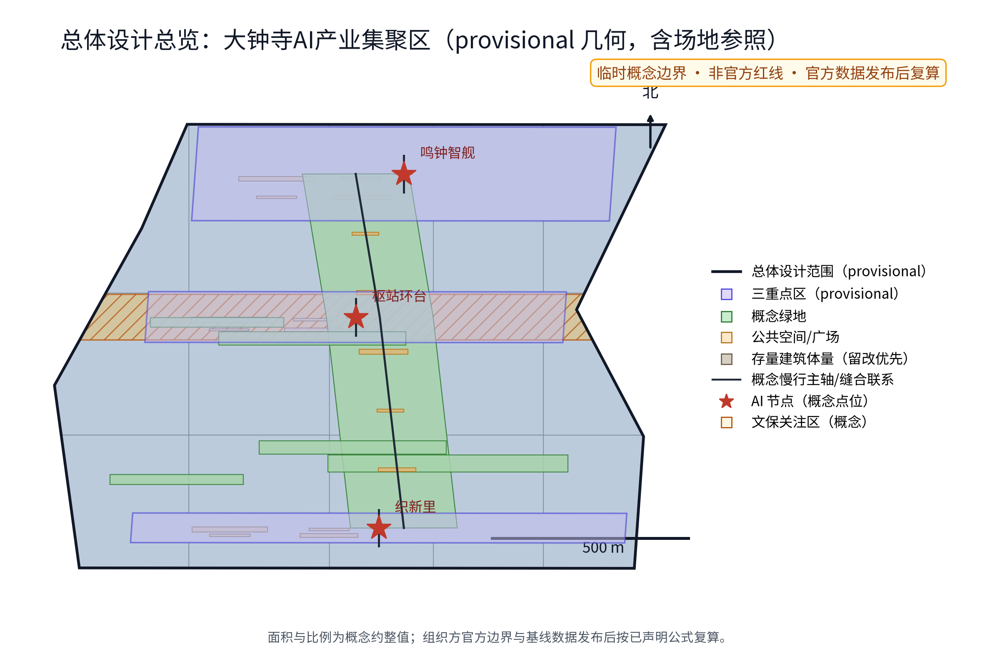
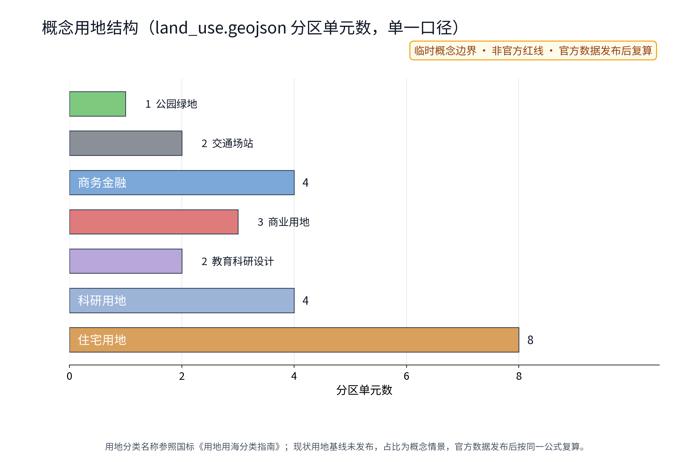
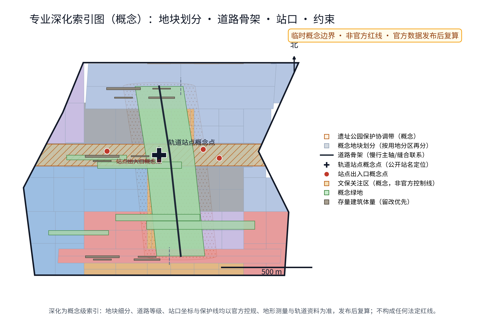
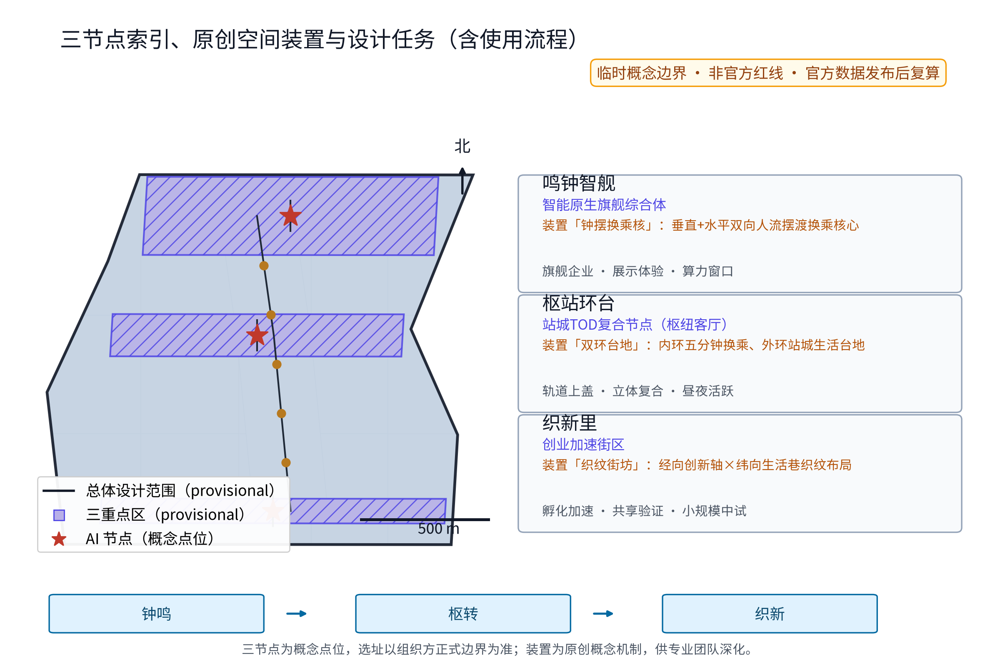
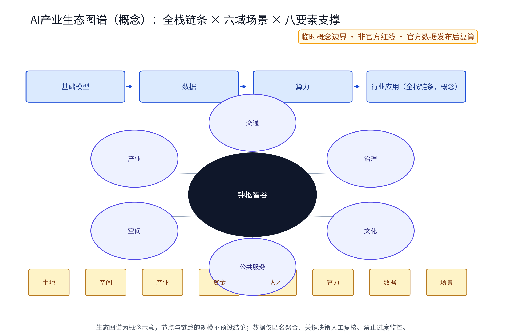
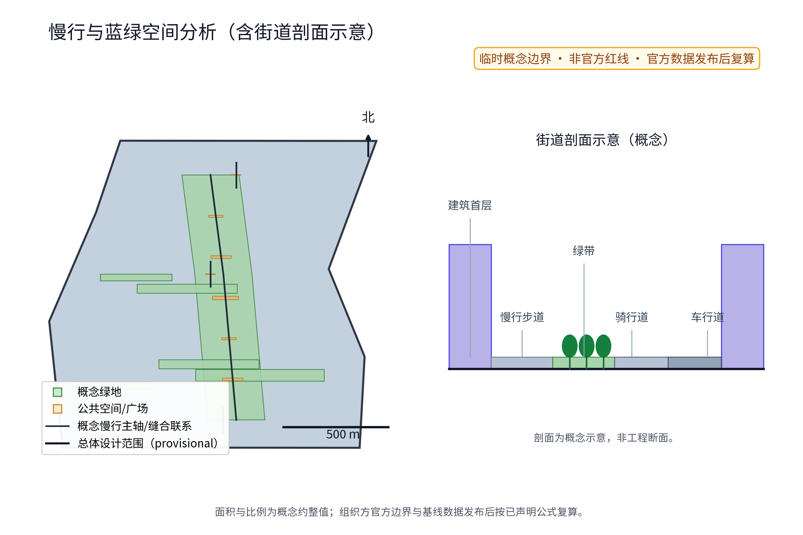
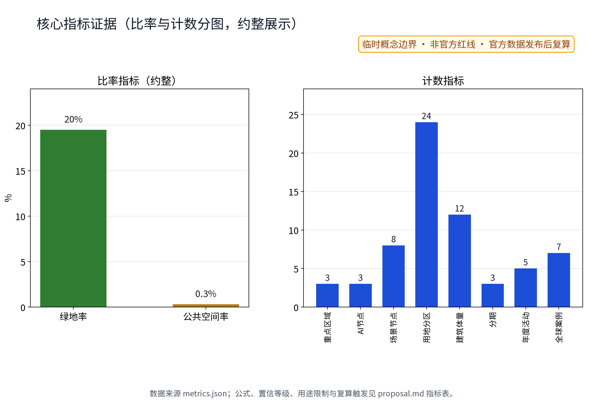
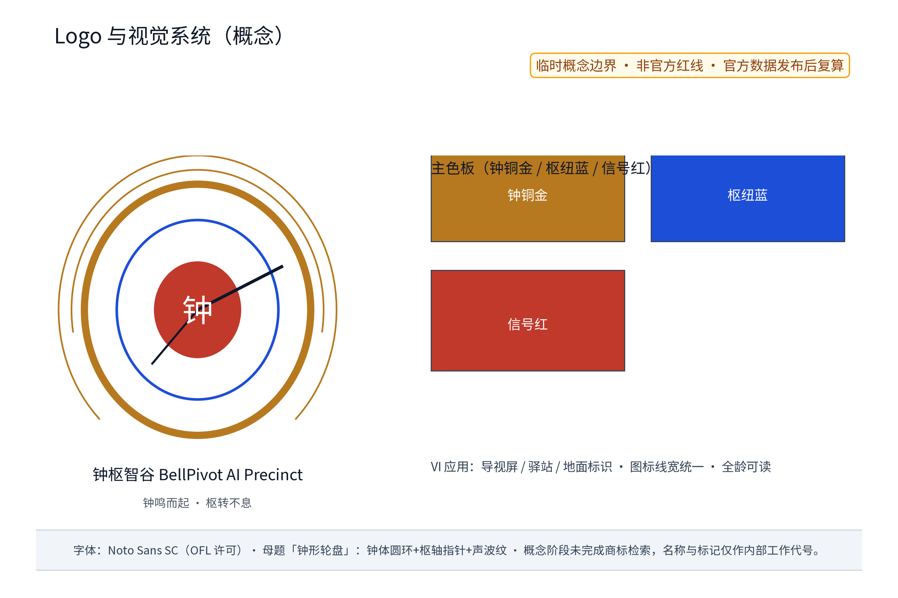

**方案名称与总体构想(概念)**——本方案自拟主名称「钟枢智谷」,英文名"BellPivot AI Precinct"(均为原创概念命名与内部工作代号,不指涉任何现实城市、园区、企业名称或商标,正式对外使用前须完成在先权利检索)。总体构想:以轨道枢纽与站城融合为锚,将大钟寺AI产业集聚区组织为"钟鸣而起、枢转不息"的智能原生新业态集聚地——以站城复合开发凝聚功能密度,以遗址文化轴延续百年京张记忆,以AI+场景与隐私友好治理塑造都市AI生活体验。方案呼应三大定位与五大功能,在"三区两翼"格局中承担智能原生新业态与AI治理话语权试验职能;全文按"统筹研究范围—总体设计范围—重点区域"三层递进,重点深化大钟寺集聚区。全文所有面积采用官方文本口径,边界几何以组织方发布为准,本文全部内容均为概念建议与参考方案,可供专业团队深化研究。

## 设计依据与资料清单

本方案依据组织方公开发布的征集公告与智能体任务书、说明及答疑材料编制(以官方发布版本为准,来源登记见 sources.json),并参考:《北京城市总体规划(2016年—2035年)》《海淀分区规划》等公开规划文本;《新一代人工智能发展规划》及北京市人工智能产业政策公开文本;《北京国际科技创新中心建设条例》、中关村世界领先科技园区建设相关公开政策;京张铁路遗址公园建设公开报道与沿线清河、上地(中关村软件园)、知春路、中关村大街、学院路等节点的公开资料;《中华人民共和国个人信息保护法》《中华人民共和国数据安全法》《中华人民共和国无障碍环境建设法》等法律法规文本。各章节引用的全球产业生态案例均逐条登记于 sources.json,标注机构页面、访问日期与复用边界;凡无法核验的细节一律降级为"待研究假设",不进入正式证据链。需说明:截至本稿,组织方尚未发布官方边界多边形,现有几何均为 provisional;本方案不将任何临时模型值作为官方事实,文中涉及面积与比例的表述均为低置信概数,仅作概念讨论,待官方边界与数据发布后整体复算,完整清单见文末"参考资料"。

> **证据锚点**：[source:DATA-SRC-ANNOUNCEMENT-2026-05-09]、[source:DATA-SRC-AGENT-TASKBOOK-2026-05-18]（组织方公告与任务书为文本口径依据）。

## 三层范围工作框架

本方案遵循"统筹研究范围—总体设计范围—重点区域"三层递进框架:统筹研究范围约43.6平方公里(官方文本口径),聚焦产业协同与未来城市议题;总体设计范围约11.4平方公里(官方文本口径),开展城市更新与控规深度城市设计研究;重点区域合计约368.4公顷(官方文本口径),由众智园AI自主创新加速区(约192公顷,官方文本口径)、北京AI原点社区(约104公顷,官方文本口径)、大钟寺AI产业集聚区(约72公顷,官方文本口径)与中关村科技服务翼、小月河场景赋能翼构成"三区两翼"。本册重点深化大钟寺集聚区,其余区域作为协同框架处理;各层交界处设置接口议题(产业、慢行、市政、数据),确保概念建议在专业团队深化时可整体拼合。本包全部几何为 provisional 概念几何,与官方范围的包含关系在官方多边形发布后首先校核,再整体复算面积与指标。三层定位与任务书分组如下:众智园承担加速验证、原点社区承担生态策源、大钟寺集聚区承担枢纽型智能原生集聚,两翼分别输出科技服务与场景试验。

> **证据锚点**：[source:DATA-SRC-AGENT-TASKBOOK-2026-05-18]（三层范围划分依据任务书官方文本口径）。

## 统筹研究范围产业与未来城市研究

统筹范围(约43.6平方公里,官方文本口径)以京张铁路遗址公园为线形主轴,叙述"铁路—站场—园区—都市"的百年演变:清河段呼应水脉与枢纽门户,上地及中关村软件园承载软件与服务生态,知春路、中关村大街、学院路串起科教双创基因,构成空间叙事背景。研究提出三项概念议题:其一,AI全栈自主创新体系的链式布局,将基础模型、算力、数据、行业应用按带内功能区弹性配置,形成可迭代的AI产业生态图谱(概念);其二,世界级AI创新生态的要素全球化配置,依托中关村科技服务翼强化IP、资本、人才与标准流动;其三,智能化AI活力城市与AI治理话语权,沿小月河场景赋能翼开展真实场景试验。带内坚持百年京张文化带、都市AI生活体验带、AI融合创新带三位一体。区域协同方面,本层建立与北纬社区、未来科学城、怀柔科学城、经开区及京津冀的协同回路假设(要素交换、合作场景、空间数字接口与验证指标见"区域协同矩阵"),作为产业与未来城市研究的检验框架。以上均为概念建议与研究方向,不构成产业承诺。

> **证据锚点**：[source:DATA-SRC-PROVISIONAL-BOUNDARIES-2026-06-05]（边界为 provisional，研究范围仅作概念示意）。

## 总体设计范围城市更新与控规深度城市设计

总体设计范围(约11.4平方公里,官方文本口径)以存量更新为主:其一,沿遗址公园建立"文化—生态—慢行"复合廊道,缝合两侧街区;其二,以轨道站点与枢纽为核心组织TOD密度梯度,控制开发强度与风貌界面;其三,识别存量楼宇产业置换潜力,建立"保留—改造—更新"分类指引。在大钟寺集聚区,方案建议以"站城融合"为首要锚点,枢纽周边列为高密度复合开发优先区域(概念),并研究控规深度的指标传导思路,包括用地兼容、规模上限、退线与贴线率、地下连通等概念指标(均为概念建议,非规划结论);市政与交通专项同步校核承载力。所有拆改留安排须经法定程序与产权协调,本稿仅提供技术框架;任何强度、高度与界面控制均不预设数值结论,待官方控制条件发布后复算。图件采用公开可引用的站点、道路、公园与水系名称作概念定位,不虚构任何官方红线。

为支撑"控规深度"的深化路径,提供「专业深化索引图」(概念):把概念用地分区进一步细分为概念地块,叠加道路骨架(慢行主轴与缝合联系)、轨道站点与出入口概念点位、文保关注区与遗址公园保护协调带等约束图层,作为后续地块、道路、站口与约束条件专业深化的索引底图。全部深化要素均为概念级表达:地块细分、道路等级、站口坐标与保护线以官方控规、地形测量与轨道专项资料为准,官方数据发布后整体复算;本图不构成任何法定红线或审批依据,亦不预设强度与高度数值。

> **证据锚点**：[source:DATA-SRC-MOHURD-CONTROL-DETAILED-PLANNING]、[source:DATA-SRC-PROVISIONAL-BOUNDARIES-2026-06-05]。

## 重点区域详细设计

重点区域合计约368.4公顷(官方文本口径)按"三区两翼"统筹,本册重点为大钟寺AI产业集聚区(约72公顷,官方文本口径),总体概念为"轨道枢纽为轴、智能原生新业态为内容"的复合集聚区。区内自拟三处概念点位(均为概念点位,供专业团队深化):其一点位「鸣钟智舰」,智能原生旗舰综合体,承载旗舰企业、展示体验与算力窗口;其二点位「枢站环台」,站城TOD复合节点,组织轨道站点上盖与周边立体复合开发,形成昼夜活跃的都市枢纽客厅;其三点位「织新里」,创业加速街区,布局孵化加速、共享验证与小规模中试。三点位以"钟声轴线"概念性串联,并各配置原创空间装置(概念机制,供深化检验):「鸣钟智舰」设「钟摆换乘核」,以垂直+水平双向摆渡组织旗舰综合体与轨道枢纽间的高峰人流换乘,钟摆式双向导流、失衡即转人工接管;「枢站环台」设「双环台地」,内环承担五分钟换乘、外环叠合站城生活台地,环间以缓坡与无障碍坡道衔接;「织新里」设「织纹街坊」,以经向创新轴×纬向生活巷的织纹布局交织创业功能与日常街市,铺位轮换与公示规则随年度披露。三装置以"钟鸣→枢转→织新"的原创机制链条(鸣钟唤醒→枢转转换→织新生长)贯通,使站城融合、旗舰综合与创业街区三类原型以统一叙事组织,而非通用原型的拼贴;三点位并与众智园加速区、原点社区衔接。公共空间设施采用模块化、可逆化设计,沉淀为可复用公共空间组件库(概念),节点内同步设置荣誉展示系统(概念),公开呈现共创者、志愿者与品牌活动的荣誉记录。轨道上盖、地下连通与临轨界面均须由运营方与主管部门依法专项评估,本方案不形成专业结论。

**场景卡索引(12张,概念)**：AI+场景以场景卡落地,每张场景卡列明输入数据、AI能力、空间落点、运营者、人工接管与失败模式、成效指标,形成可评审、可迭代的运营索引:

| 场景卡 | 输入数据 | AI能力 | 空间落点 | 运营者（牵头/协作） | 人工接管与失败模式 | 成效指标 |
|---|---|---|---|---|---|---|
| S1「钟厅」AI会展路演中心 | 报名与展项清单（匿名聚合） | 智能排期、多语直播摘要 | 「鸣钟智舰」展演层 | 运营商牵头,场馆方/志愿者协作 | 人工复核议程与直播内容;模型输出异常时切换人工主持 | 年路演场次、观众满意度 |
| S2「枢站环台」TOD枢纽客厅 | 换乘客流聚合态势 | 人潮密度感知与引导 | 「枢站环台」站点周边 | 轨道运营方牵头,区部门协作 | 人工接管疏散广播;感知失效时按预案人工疏导 | 换乘顺畅度、应急响应时长 |
| S3「织新市集」无人商业街 | 商品库存与销量（匿名聚合） | 无人零售结算、智能补货 | 「织新里」街区首层 | 商户联盟牵头,运营平台协作 | 一键关闭无人模式转为人工收银;结算异常人工介入 | 复购率、人工接管响应时长 |
| S4「伴行」无障碍伴随引导 | 端侧语音与图像（不留存） | 语音视觉多模态助手 | 智能生活大街 | 街道与志愿团队牵头,无障碍专家协作 | 志愿者值守兜底;识别失败降级为人工询问 | 服务完成率、求助响应时长 |
| S5「低空驿站」无人机配送点 | 订单与航线聚合数据 | 航线规划、避障调度 | 檐口与屋顶起降点 | 物流企业牵头,属地备案协作 | 气象或感知异常时停飞转人工配送;一键停用 | 准时率、异常停飞次数 |
| S6「钟声轴线」客流感知与疏散 | 广场区域聚合人流态势 | 密度估计、疏散预案推演 | 站前广场与钟声轴线 | 区应急部门牵头,运营方协作 | 关键决策人工复核;阈值触发即人工接管 | 疏散演练达标率、感知覆盖率 |
| S7「织谜」共享验证实验室 | 企业测试任务清单 | 算力调度、测试报告生成 | 「织新里」共享验证层 | 孵化器牵头,高校/企业协作 | 测试结论人工签发;报告异常人工复核 | 中试周期、成果转化数 |
| S8「钟谱」AI图书馆与科创阅读 | 馆藏目录与预约记录 | 检索问答、个性化推荐 | 社区级AI图书馆 | 街道与图书馆协作牵头 | 推荐内容人工筛选;检索失败转人工台 | 到馆人次、借阅活跃率 |
| S9「钟铃」多语种导览 | 景点图文语料（多语） | 多语翻译与播报 | 遗址文化轴 | 文旅团队牵头,志愿者协作 | 译文人工抽检;错误用户可一键报错 | 语言覆盖数、导览使用率 |
| S10「智谷驿站」路演直播舱 | 直播画面与弹幕聚合 | 内容摘要、字幕生成 | 「鸣钟智舰」直播舱 | 运营商牵头,内容审核岗协作 | 直播内容人工审核;生成违规即下播 | 直播场次、观看转化率 |
| S11「循声」长者关怀预约服务 | 预约与求助工单（匿名单据） | 工单分派、语音提醒 | 长者服务中心 | 街道牵头,志愿团队协作 | 紧急事项直连人工;无人响应升级人工回访 | 工单办结率、长者满意度 |
| S12「挂钟人」骑手商户协同调度 | 配送时段与订单聚合 | 时段与运力匹配建议 | 配送点与市集 | 商户与骑手联盟共建 | 排班建议仅作参考;重大调整人工审批 | 配送时段利用率、事故率 |

> **证据锚点**：[data:geometry/key_areas.geojson]（三节点示意多边形来自本包 geometry/key_areas.geojson）。

## AI 创新生态、人才画像与 AI+ 场景

生态:以"AI全栈"为纲配置基础模型、数据、算力与行业应用服务链,吸引AI原生企业与开源社区集聚,土地、空间、产业、资金、人才、算力、数据与场景开放八类要素构成支撑闭环(见AI产业生态图谱图);生态图谱为概念示意,节点与链路的规模不预设结论。人才画像:五类人才——AI原生创业者与工程师、科研转化人员、场景运营与跨界产品人才、骑手与商户等城市服务者、面向全龄的AI生活体验者(含老年人、残障人士与亲子家庭),配套弹性办公、短租公寓、托育与学习空间(详细映射见"五类人才画像与AI场景映射")。AI+场景按交通、产业、空间、公共服务、文化、治理六域组织:AI交通(无人机配送与客流感知)、AI产业(智能原生企业集聚与中试)、AI空间(站城复合客厅与共享验证)、AI公共服务(无障碍伴随与即时履约)、AI文化(会展路演与钟声创客叙事)、AI治理(数据合规沙盒与分期许可)。AI技术协议(概念)设定四项机器可测基线:模型评测以历史准确率与多语质量作准入基准;数据质量要求来源可溯、单一口径;误差分群按人群与时段上报并进入月度披露;运行监测覆盖误报率、完整率与人工复核覆盖率。场景一律遵循:数据仅匿名聚合、关键决策人工复核、禁止过度监控,不进行个体识别式追踪;每个AI场景配置非智能替代路径,服务中断时人工兜底。

> **证据锚点**：[source:DATA-SRC-GENERATIVE-AI-INTERIM-MEASURES]（AI 生成内容治理表述的参照依据，适用范围为向境内公众提供生成式AI服务的场景，不泛化至全部城市AI系统）、[source:DATA-SRC-BARRIER-FREE-ENVIRONMENT-LAW]。

## 用地、建筑规模与拆改留方案

拆改留坚持"留改拆"排序:保留结构完好建筑与遗址文化要素,改造低效商业与旧楼宇,仅作枢纽上盖与零星地块的插入式建设并严控增量;全部面积为概念口径,官方数据发布后复算。在大钟寺集聚区约72公顷(官方文本口径)范围内,按"枢纽高密、沿线中密、界面低密"组织用地节奏(概念):轨道站点周边及上盖为混合高密度开发,兼容商业、办公、会展与配套;遗址公园沿线控制高度与退线,保持界面通透;外围存量楼宇以改造置换为主。拆改留规模与比例:本方案不预设任何拆改留数值结论与百分比,仅提供"保留—改造—更新"三级分类指引与判定流程;确需拆除的建筑物须经专业鉴定并履行法定程序。建筑规模上限、容积率、高度等指标均以官方后续发布文本及法定控规为准,本稿仅给出概念区间思路,不自行声称任何精确数值;任何比例性表述均标注口径、置信等级与复算触发条件,杜绝误导性的精确外观。

> **证据锚点**：[source:DATA-SRC-MNR-LAND-USE-CLASSIFICATION-202311]（用地分类名称参照现行国标口径）。

## 交通、轨道、市政与公共服务设施

交通概念:依托轨道枢纽组织"轨道+慢行+微循环"出行链;设置接驳巴士环线与P+R设施,疏解过境交通;无人机配送采用专用时段、专用航线与隔离起降区,客流感知仅用于空间管理与应急疏散,并设置安全专项评估与人工处置边界。立体慢行与地下连通:以二层连廊与地下通道串联枢纽、旗舰综合体与加速街区,实现人车分流与换乘疏解,地下空间结合设备管廊一体化预留,临轨与上盖部分须经轨道安全专项评估。市政:结合更新同步实施雨水调蓄、再生水利用与电力增容,为算力设施预留冷却与供电冗余,通信管线预留边缘算力节点接入条件。公共服务:按「枢纽服务+社区服务」双圈配置社区级AI图书馆、共享实验室、托育与长者服务中心,提出无障碍服务设施全覆盖(目标性表述,须经场地核验与法定无障碍设计审查后确认,不构成现状或合规结论);每项AI决策均设人工复核。无人商业、无人机、客流感知、轨道上盖与地下空间分别需要各自的安全与专项评估边界,本方案仅作概念组织,不形成工程结论。

> **证据锚点**：[source:DATA-SRC-MOHURD-URBAN-DESIGN-MEASURES]（市政与慢行设计表述的方法参照）。

## 蓝绿空间、公共空间与城市风貌

大钟寺集聚区毗邻遗址公园与小月河翼,蓝绿本底良好。概念建议:以遗址公园为文化绿廊向街区渗透"口袋公园+街巷绿化";结合小月河水系布局生态旱溪与雨水花园,串联滨水慢行环;遗址、水系与公园名称仅作公开定位引用,不虚构控制线。公共空间提出"五个一":一条钟声礼仪轴(概念性南北主轴线,呼应大钟寺历史意象)、一组枢纽广场、一条智能生活大街、一组屋面花园、一处社区农园;设施以模块化、可逆设计嵌入站前空间,形成可复用公共空间组件库,组件清单与轮换规则随年度公示披露。风貌控制:更新与新建建筑宜延续京张铁路工业遗产的红砖、钢构与铁轨记忆元素,融入轻盈的AI时代立面语言;夜间照明以功能与安全为主,管控广告与屏幕亮度,避免光污染;风貌导则条款均为概念建议,供专业团队深化研究并衔接法定城市设计。

> **证据锚点**：[source:DATA-SRC-MOHURD-URBAN-DESIGN-MEASURES]（蓝绿空间组织的方法参照）。

## 更新项目清单、实施政策与分期计划

概念项目清单(示例性):枢纽上盖复合开发、旗舰综合体、创业加速街区、存量楼宇置换试点、无人机配送点、智能生活大街、无障碍伴随服务点、AI会展路演中心、共享验证实验室、AI图书馆等十类。分期(概念节奏):近期"锚点启动期"(1—3年),完成枢纽周边更新策划、旗舰综合体选址研究与无人商业、无障碍场景首批试点;中期"集聚成型期"(3—5年),推进存量置换、加速街区和路演会展常态化运营,形成智能原生企业集群;远期"生态成熟期"(5—10年),实现全域场景联通与站城一体运营。试点区域选择标准为"小、可逆、可测":优先产权边界清晰、撤销成本低、验收指标明确的街区。实施政策概念建议:政府统筹与分期许可、企业参与运营、高校与科研机构协同评测、社区共建共治,志愿者与专业团队参与评估;用途兼容与弹性规划、租金联动与先租后买、场景开放清单、数据合规沙盒。每个项目按 RACI 原则明确牵头与协作责任主体,列出前置条件、专项评估、资源等级与验收指标,并设定继续或暂停的明确条件(详见"实施与长期运营矩阵");触发停止条件或出现重大公共风险时立即停项撤收并公开披露。资金投入仅作低、中、高三档定性判断(估算方法、价格基期、包含范围、置信等级与复算触发见实施矩阵说明),不给出任何精确金额。

> **证据锚点**：[source:DATA-SRC-AGENT-TASKBOOK-2026-05-18]（分期与实施条目对应任务书要求）。

## 指标体系、面积复算与合规矩阵

建议构建"文化—生态—产业—治理"四维概念指标体系,每项指标列明数据来源、公式与置信等级、用途限制与复算触发,避免误导性精确外观;比例类与计数类指标分图表达,不共轴比较(见核心指标证据图)。面积复算原则:本方案仅引用官方文本口径数值(统筹约43.6平方公里、总体约11.4平方公里、重点区域合计约368.4公顷、大钟寺约72公顷),官方边界多边形尚未发布,本稿不进行精确面积复算,亦不声称坐标与面积精度;图件与页面中出现的面积与比例仅以舍入后的低置信概数呈现,逐项标注 provisional、非官方与复算触发,不将临时模型值作为官方事实;全部 provisional 区域类指标以官方数据发布为复算触发,复算版本随年度公示记录。合规矩阵:逐项对照土地、规划、文物、交通、市政、数据与无障碍等法规及征集要求,标注"概念建议/需法定程序/需专项评估"三类状态,确保全文不产生任何法定规划结论。

| 概念指标 | 口径与公式 | 来源与置信等级 | 用途限制 | 复算触发 |
|---|---|---|---|---|
| 绿视率/绿地占比 | 概念绿楔面积/概念范围内总面积 | 本包provisional几何,低 | 仅概念校验,非现状或法定口径 | 官方边界与控制线发布 |
| 慢行连通率 | 概念慢行廊道长度/目标长度 | 本包道路几何,低 | 连续性校验 | 官方道路几何发布 |
| 轨道与公交分担率 | 概念分担目标(区间表述) | 官方客流基线未发布,待研究 | 不作结论 | 官方客流统计发布 |
| 智能场景覆盖度 | 已开放场景卡数/场景卡总数(12张) | 本方案运营索引,中 | 逐年滚动更新 | 年度公示周期 |
| 无障碍达标率 | 达标点位/检核点位 | 场地核验后确认,待研究 | 目标性表述 | 场地核验完成 |
| 匿名数据利用率 | 匿名聚合可复用数据项/采集项 | 数据台账,中 | 仅匿名聚合,禁止个体识别 | 数据治理年度审查 |
| 居民意见办结率 | 办结工单/意见工单 | 意见通道台账,中 | 匿名聚合后披露 | 年度公示周期 |

> **证据锚点**：[metric:green_ratio]、[metric:public_space_ratio]、[metric:persona_count]（比例与画像计数指标）；[metric:scenario_card_count]、[metric:global_case_count]、[metric:annual_program_count]（场景、案例与活动计数指标）；[metric:industry_test_scenario_count]、[source:PACKAGE-GEOMETRY]（测试场景数与自产几何）。

## 风险、版权与合规说明

风险提示:产业与市场周期波动可能影响智能原生新业态集聚节奏;技术快速迭代可能导致场景预设过时;存量楼宇产权分散与租金博弈影响置换进度;边界与面积以组织方最终发布为准,现有provisional几何仅供讨论;客流、无人机与无人商业运营须通过各自安全与专项评估;全部风险登记于 risk.json 六维清单。版权说明:文本与图表素材归投稿团队所有,公开引用均已注明;字体与图形资产的作者、工具、授权与限制见 report/copyright_statement.md（版权与资产权益登记）;如采用AI辅助生成内容,已按规定标注并人工复核。品牌在先权利与使用边界:概念阶段未完成商标检索与法律审查,主名称与Logo作内部工作代号处理,不对外注册、不商业使用、不造成官方背书印象,检索与许可完成后方可正式使用。AI治理三句式:数据仅匿名聚合、关键决策人工复核、禁止过度监控;配置非智能替代路径。实施后开设居民意见通道,全年开放,投诉与建议进入救济复核流程,并执行年度公示(含复算版本、验收结果与场景开放清单)。合规说明:本方案为原创概念文本,主名称与三处概念点位名称均为自拟,不照搬现实城市、园区、企业名称或商标,不构成商标主张;全部落地建议均属"概念建议、参考方案、可供专业团队深化研究"范畴,不构成法定规划结论或承诺。

> **证据锚点**：[source:DATA-SRC-ANNOUNCEMENT-2026-05-09]（征集规则为权属与合规表述的依据）。

## 参考资料

[1] 组织方《百年京张AI创新带城市设计国际方案征集》公开征集文件与答疑材料(以官方发布版本与 open-city-ai/haidian 开源征集说明为准)。[2] 《北京城市总体规划(2016年—2035年)》《海淀分区规划》公开文本。[3] 《新一代人工智能发展规划》及北京市人工智能创新策源地相关政策公开文本。[4] 《北京国际科技创新中心建设条例》、中关村世界领先科技园区建设相关公开政策。[5] 京张铁路遗址公园建设公开报道与现场资料(清河、上地/中关村软件园、知春路、中关村大街、学院路节点)。[6] 《中华人民共和国个人信息保护法》《中华人民共和国数据安全法》《中华人民共和国无障碍环境建设法》。[7] 本次征集组织方历次答疑与澄清记录。[8] 全球AI产业生态案例的机构公开页面登记(完整条目与复用边界见 sources.json 与"全球AI生态案例与对标来源")。注:如引用内容与官方后续发布不一致,一律以官方为准。

> **证据锚点**：[source:DATA-SRC-ANNOUNCEMENT-2026-05-09]（本清单首条即组织方公开资料包）。

## 品牌识别与视觉系统（概念）

品牌识别方向:以"钟枢智谷 / BellPivot AI Precinct"为中英双主名,建立「鸣钟智舰」「枢站环台」「织新里」三节点与十二张场景卡的统一命名体系,将钟文化、轨道枢纽与AI产业结合,形成可延展的品牌资产。Logo方向(概念):以"钟形轮盘"为母题——钟体圆环、枢轴指针与声波纹三条弧线构成基本形,象征"鸣钟而起、枢转不息";主色为钟铜金、枢纽蓝、信号红三色。视觉识别系统(概念):统一图标线宽与信息层级,办公、图纸、数字界面与活动物料沿用同一套词汇;导视符号系统覆盖方向指引、场景索引与安全标识三类,全龄可读、可触摸、可识别。活动品牌架构:以「京张AI开放周」为年度旗舰,叠加「钟声创客大赛」「AI路演马拉松」「无人商业体验季」「无障碍科技日」等子品牌,形成"一周四赛五常设"的节奏(详见"年度活动体系与荣誉机制")。国际传播文案(概念,中文版):"让钟声为创新报时——BellPivot, where the bell tolls for innovation."围绕站城融合、AI治理试验、百年京张文化三个叙事线,向国际专业团体输出中英双语材料(英文版与传播要点见 proposal.en.md 及 visual/index.en.html)。品牌在先权利与使用边界:概念阶段未完成商标检索,名称与Logo均按内部工作代号处理,限定于本次征集展示与研究,不对外注册与商业使用;检索与法律审查完成前,任何外部使用均受限。

> **证据锚点**：[source:CASE-PUNGGOL-DIGITAL-DISTRICT]、[source:CASE-KASHIWANOHA-SMART-CITY]、[source:CASE-SEOUL-DMC]（智慧城区与数字产业园区治理机制案例）——[source:CASE-FIKSU-KALASATAMA]、[source:CASE-HIGH-TECH-CAMPUS-EINDHOVEN]、[source:CASE-STATION-F]（开放创新园区与居民共验机制案例）——[source:CASE-ZHONGGUANCUN-SCIENCE-CITY]（属地全栈创新链机制；品牌识别与运营机制案例对标来源共七例，逐条登记于 sources.json，详见"全球AI生态案例与对标来源"）。

## 五类人才画像与AI场景映射（概念）

五类人才画像为场景优先级与包容性设计的共享基线,与 metrics.json 的 persona_count 一致:

| 画像（五类人才） | 主用场景卡 | 连续旅程检验重点 | 非智能替代路径 |
|---|---|---|---|
| AI原生创业者与工程师 | S1、S7、S10 | 中试周期与算力排队 | 人工工单与预约台 |
| 科研转化人员 | S7、S8、S1 | 数据脱敏与成果归档 | 文献档案与人工检索 |
| 场景运营与跨界产品人才 | S3、S12、S2 | 运营峰值与交接班 | 纸质台账与人工排班 |
| 骑手与商户等城市服务者 | S5、S3、S12 | 配送时段与驿站协调 | 电话调度与人工分单 |
| 面向全龄的AI生活体验者 | S4、S6、S11 | 全龄无障碍与应急疏散 | 志愿者值守与人工指引 |

画像覆盖学生、亲子家庭与弱势群体等细分人群,并与全龄友好、儿童友好、适老与无障碍设计原则联动:每个画像均配置连续旅程测试(含老年人、轮椅使用者、感官障碍与认知障碍用户)与共创配额,反馈与投诉进入年度公示与救济复核流程。画像数据边界:画像仅为设计假设与测试配额基线,不采集、不存储任何个体识别信息;问卷与到访记录全部匿名聚合后使用,画像描述不构成对任何个体的行为预测或画像服务。

> **证据锚点**：[metric:persona_count]（五类画像与指标一致）。

## 全球AI生态案例与对标来源

案例仅作方法借鉴,其运营数据不外推至本项目;每个案例均在 sources.json 登记机构页面、访问日期与复用边界,无法核验的细节一律视为"待研究假设"。借鉴原则为"借机制、隔离数字":只借鉴空间组织逻辑、运营机制与治理安排,不引用案例的客流、投资与运营数值。七例覆盖亚洲、欧洲、北美洲与北京本地,构成"AI产业生态+站城复合+场景运营"的跨地域检验样本:

| 案例 | 城市/国家 | 借鉴机制 | 来源 |
|---|---|---|---|
| Punggol Digital District 榜鹅数码园区 | 新加坡 | 数字产业园区与跨机构协同治理 | [source:CASE-PUNGGOL-DIGITAL-DISTRICT] |
| Kashiwa-no-ha Smart City 柏之叶智慧城市 | 千叶/日本 | 产官学民共治与生活场景试验 | [source:CASE-KASHIWANOHA-SMART-CITY] |
| Seoul Digital Media City 数字媒体城 | 首尔/韩国 | 媒体科技集群与展演运营复合 | [source:CASE-SEOUL-DMC] |
| Fiksu Kalasatama 智能新区 | 赫尔辛基/芬兰 | 居民企业与城市共验的智慧城区 | [source:CASE-FIKSU-KALASATAMA] |
| High Tech Campus Eindhoven | 埃因霍温/荷兰 | 开放创新园区的生态服务闭环 | [source:CASE-HIGH-TECH-CAMPUS-EINDHOVEN] |
| Station F 站F创业园 | 巴黎/法国 | 大型创业园区的联盟与项目制运营 | [source:CASE-STATION-F] |
| 中关村科学城（海淀AI产业集聚） | 北京/中国 | 全栈创新链与属地场景开放 | [source:CASE-ZHONGGUANCUN-SCIENCE-CITY] |

> **证据锚点**：[metric:global_case_count]（七例与指标一致）;案例来源逐条登记于 sources.json。

## 产业测试验证场景协议

三项产业测试验证场景(概念)用于检验"枢纽型智能原生集聚"的三个可测假设,结果为概念迭代证据,不构成客流或投资承诺;每个测试场景以"目标—数据与许可边界—验收与退出条件"三段式结构化,验收阈值与退出条件由参与主体在启动前共同确认并披露。测试不采集个体识别信息,问卷与台账全部匿名;测试期间若触及隐私风险或负面舆情阈值,立即停止并向公众说明。三项测试分别对应"三区两翼"中的三处承载空间:

| 测试场景 | 测试目标 | 数据与许可边界 | 验收与退出条件 |
|---|---|---|---|
| 无人商业街峰值测试（织新里） | 验证无人零售在高峰时段的可用性与人工接管效率 | 销售与客流匿名聚合,权限内的低风险试点 | 人工接管响应达标则继续,否则转为人工收银并公示 |
| 会展路演直播压力测试（鸣钟智舰） | 验证AI多语直播在会展峰值下的质量与审核闭环 | 直播内容全量人工复核,匿名统计 | 误报率低于阈值则继续,否则降级为传统直播 |
| 无障碍伴随连续旅程测试（智能生活大街） | 验证端侧伴随服务对老年人及残障人群的全程可用性 | 端侧处理、不留存个体信息 | 服务完成率达标则扩点,连续两季不达标则停用并复盘 |

> **证据锚点**：[metric:industry_test_scenario_count]（三项测试与指标一致）。

## 区域协同矩阵（概念）

针对任务书要求的区域协同,以大钟寺集聚区为核心,与北纬社区、未来科学城、怀柔科学城、经开区及京津冀建立要素交换、合作场景、空间/数字接口与验证指标的协同回路假设,全部为概念假设,不作为任何跨区承诺:

| 协同对象 | 要素交换（概念） | 合作场景 | 空间/数字接口 | 验证指标 |
|---|---|---|---|---|
| 北纬社区 | 人才与居住配套 | 国际人才社区与AI生活体验 | 慢行与公交接驳、数据沙盒共享 | 通勤时长满意度、人才留存率 |
| 未来科学城 | 基础研究与企业需求 | 成果中试与场景开放清单 | 算力与数据目录互认 | 测试场景对接数 |
| 怀柔科学城 | 大科学设施与数据要素 | 科学城成果在大钟寺路演转化 | 科研数据合规沙盒 | 路演转化对接数 |
| 经开区 | 制造与供应链能力 | 智能硬件中试与批量验证 | 物流配送网络接口 | 中试项目数 |
| 京津冀 | 市场腹地与场景规模 | 场景复制与标准互认 | 行业标准与联盟机制 | 场景输出城市数 |

> **证据锚点**：[source:DATA-SRC-AGENT-TASKBOOK-2026-05-18]（区域协同条目对应任务书要求）。

## 年度活动体系与荣誉机制

年度活动体系支撑长期运营价值与品牌识别,机制词覆盖公约、议事、积分、公示、备案、联盟、志愿、预约、轮换、分级十类:

| 年度活动品牌 | 时间窗口（概念） | 机制组合 | 参与主体 |
|---|---|---|---|
| 京张AI开放周 | 每年秋季一周 | 预约导览、志愿讲解、积分打卡、年度公示 | 政府、企业、高校、居民、游客 |
| 钟声创客大赛 | 每年一次 | 联盟征集、公开评审、荣誉授牌 | 创业者、高校、投资机构 |
| AI路演马拉松 | 每季度一次 | 路演备案、轮换展陈、企业转化对接 | 企业、开发者社区、运营商 |
| 无人商业体验季 | 每年春/秋各一季 | 商户议事、积分会员、分级体验 | 商户、居民、青年、骑手 |
| 无障碍科技日 | 每年一次 | 志愿值守、预约体验、居民意见通道 | 残疾人、长者、企业、志愿者 |

荣誉机制(概念):「鸣钟勋章」积分体系(共创、志愿、打卡三类积分,年度公示);「钟声公约」由街道议事会轮值签署;「智谷积分」贯通场景预约与活动报名。开发者社区:面向开发者开放场景接口与数据集目录,以内容许可与场景开放流程吸收外部贡献,并作为企业招引与人才转化的入口(详见"实施与长期运营矩阵")。

> **证据锚点**：[metric:annual_program_count]（五项年度活动与指标一致）。

## 实施与长期运营矩阵（概念）

实施与长期运营矩阵明确每个项目与场景的阶段、责任主体、前置条件、专项评估、资源等级、验收指标与继续/暂停条件;成本投入以低、中、高三档定性表述,估算方法、价格基期、包含范围、置信等级与复算触发统一说明于表后:

| 项目/场景 | 阶段（概念） | 责任主体（牵头/协作） | 前置条件 | 专项评估 | 资源等级 | 验收指标（概念） | 继续/暂停条件 |
|---|---|---|---|---|---|---|---|
| 无人商业街试点 | 近期 | 街道牵头,商户联盟/运营平台协作 | 试点选址确认、场景开放清单入列 | 安全与数据专项评估 | 低 | 人工接管响应达标、投诉率低于阈值 | 连续两季不达标即停用撤收 |
| 无障碍伴随试点 | 近期 | 街道牵头,志愿团队/无障碍专家协作 | 无障碍场地核验完成 | 无障碍法定审查 | 低 | 服务完成率达标 | 核验不通过即降级为人工服务 |
| 会展路演中心运营 | 中期 | 运营商牵头,场馆/内容审核岗协作 | 旗舰综合体功能定位确定 | 会展安全评估 | 中 | 年场次与满意度达标 | 内容违规率超标即暂停排期 |
| 存量楼宇置换 | 中近期 | 区更新部门牵头,产权方/企业协作 | 产权与法定程序前置 | 结构鉴定与文保评估 | 高 | 置换单元数、租金联动达标 | 产权协商失败则暂缓并公开 |
| 枢纽上盖一体化 | 远期 | 轨道运营方牵头,区部门/专业团队协作 | 官方控制条件发布后复算 | 轨道安全与结构专项评估 | 高 | 复算后可行性与经济性达标 | 专项评估不通过即不进入实施 |
| 无人机配送点 | 中期 | 物流企业牵头,属地备案协作 | 航线与起降点备案 | 低空空域安全评估 | 中 | 准时率达标、异常停飞率受控 | 气象或感知异常超限即停飞 |
| 开发者社区与场景开放 | 中期 | 运营平台牵头,企业/高校协作 | 数据目录与内容许可就绪 | 数据安全审查 | 低 | 开放接口数、外部贡献数 | 数据边界违规即暂停开放 |
| 人才企业转化通道 | 全期 | 园区运营牵头,高校/基金协作 | 路演与中试体系运转 | 合规性审查 | 中 | 转化落地数、中试周期 | 转化率连续不达标即调整机制 |

成本档位说明(概念):低档指以运营与志愿投入为主、单价零散的小额支出;中档指需立项审批的专项支出;高档指需法定程序与多部门联合决策的重资产支出。估算方法、价格基期(以实施年度官方发布价格为准)、包含范围(不含土地成本与政策补贴)、置信等级(低)与复算触发(官方实施方案发布后逐项复算)均不预设金额。场景开放流程:申请—数据与安全审查—公示—试用—验收—开放/回退六步,开放结果随年度公示披露。开发者社区机制:开源接口、数据集目录、内容许可与积分荣誉联动,外部贡献计入「鸣钟勋章」。长期运营价值:以年度公示、居民意见通道、荣誉机制与轮换展陈维持持续运营,防止一次性展示后闲置。

> **证据锚点**：[source:DATA-SRC-AGENT-TASKBOOK-2026-05-18]（实施与运营条目对应任务书要求）、[data:geometry/phasing.geojson]。

## 概念定位与复核声明

本方案全部内容为概念建议与参考方案:不含容积率、建筑高度、拆改留、投资、客流与容量等结论性数字;不编造官方数据,不声称任何官方背书、审批或实施承诺;所有面积与比例为 provisional 低置信度概数,官方数据发布后整体复算并记录复算版本;主名称与Logo为内部工作代号,在先权利检索完成前不对外注册与商业使用。本方案涉及的居民意见通道、年度公示与年度活动均为机制建议,须结合实际依法实施。所有来源登记于 sources.json(含案例机构页面、访问日期、复用边界与逐项许可),字体与图形资产的作者、工具与限制登记于 report/copyright_statement.md（版权与资产权益登记）,任何无法核验的表述均显式降级为"待研究假设";本声明与正文各节的 provisional 警示共同构成诚实边界。中英双语版本已逐条人工核对实质等值,英文图件、PDF与HTML均与中文版同一数据与口径;如有出入,以中文版为准并在后续修订中同步。

> **证据锚点**：[metric:phase_count]、[source:DATA-SRC-PROVISIONAL-BOUNDARIES-2026-06-05]（全部结论以待发布官方数据为复算基准）。