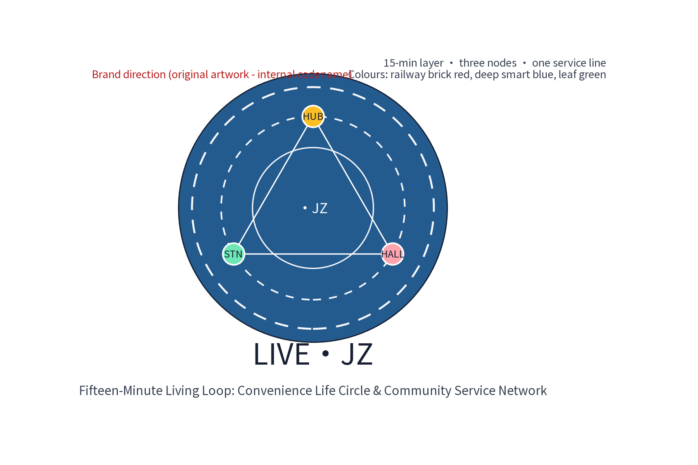
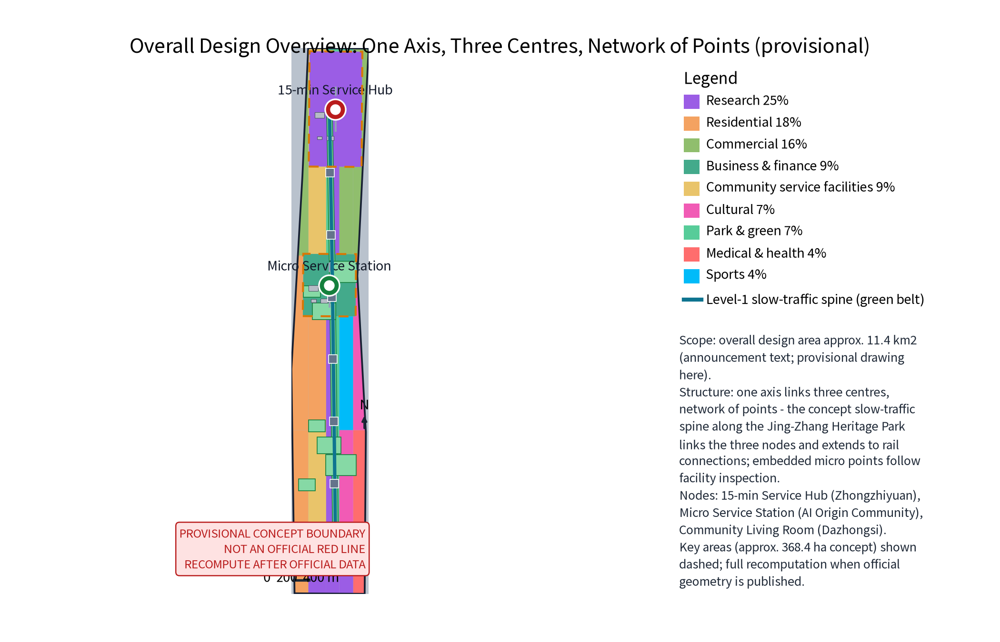
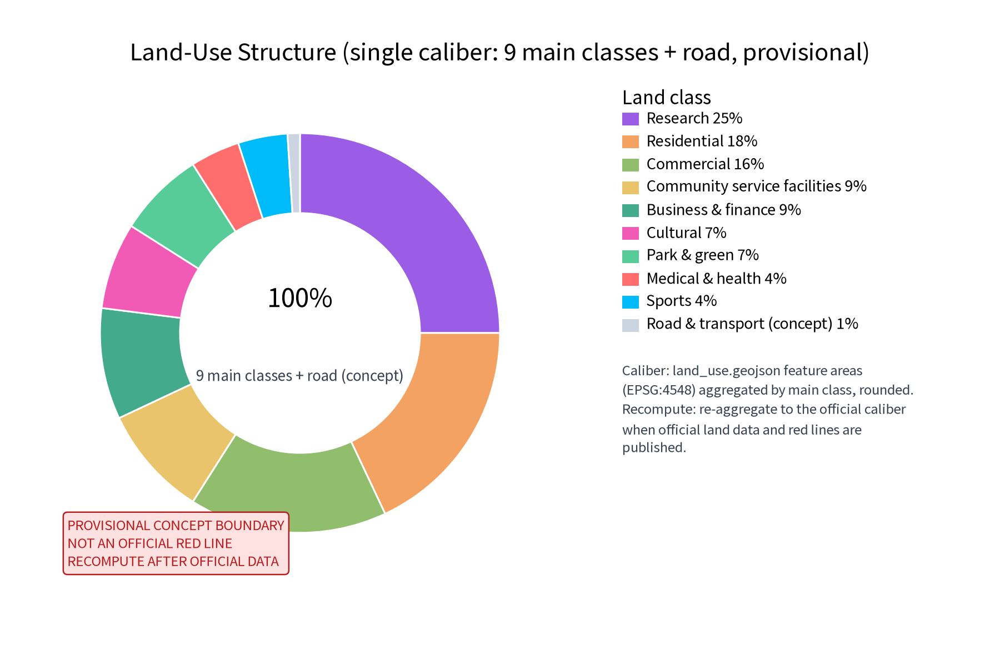
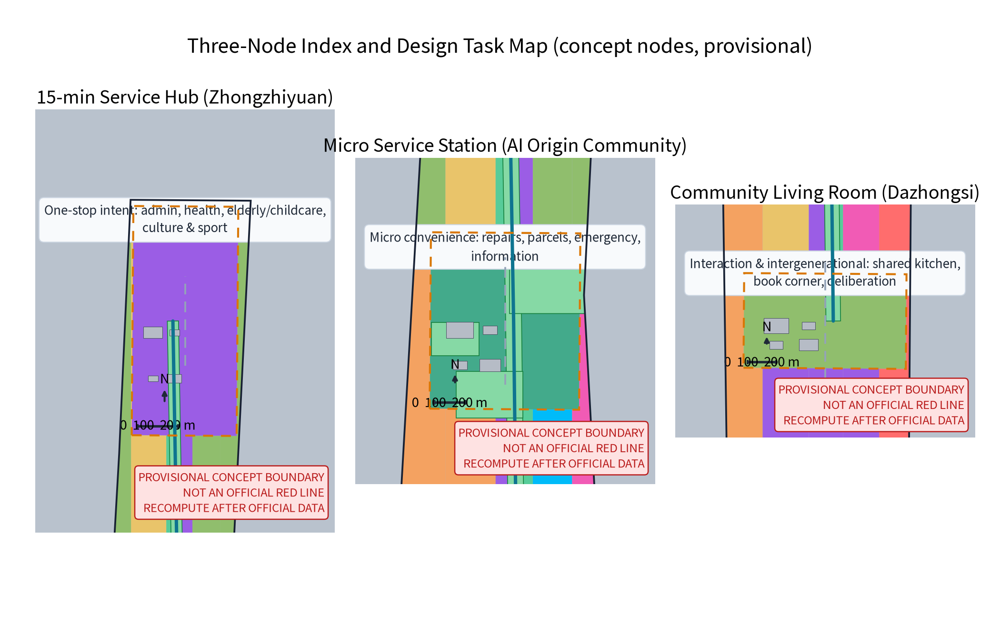
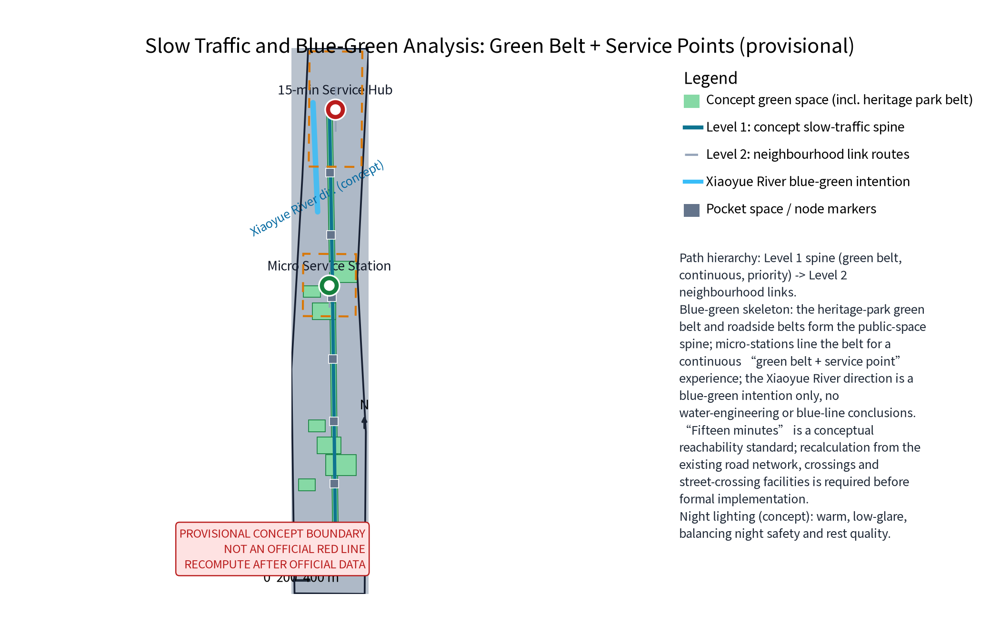
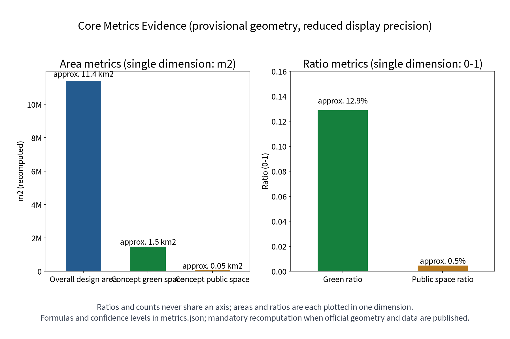

> **LIVE·JZ: make the AI Innovation Belt a living lab for a better everyday life.**
>
> One Hub, One Station, One Hall: the 15-minute service hub, neighbourhood micro-service station and community living room; six resident personas, 12 AI scenario cards and 3 industry test-and-validate scenarios; four annual programme brands: Community Service Day, Neighbourhood Market Season, Intergenerational Sports Week and the Life Festival.

This proposal uses the "fifteen-minute convenience life circle" as its spatial skeleton and organises public services and everyday community life into a perceptible, operable and recomputable service network, responding to the Centennial Jing-Zhang AI Innovation Belt's positioning as an "urban AI living experience belt" and an "intelligent, vibrant AI city". **Everything in this proposal is an open co-creation concept and reference scheme.** It does not replace formal planning, and it does not constitute government review conclusions, investment estimates or engineering implementation judgments. All areas, ratios and indicators in this document are participant provisional model data (self-computed against the announcement text, not officially issued) and must be recomputed from official data before any formal implementation. "Fifteen minutes" is a conceptual reachability standard; a network-based reachability recalculation must be performed before formal implementation.

## Design Basis and Source List

The design basis is, in order: the open-call taskbook excerpts (three positioning statements, five functions, three districts and two wings, agent tasks 1-6 and boundary clauses), the submission skill's required proposal structure and package specification, the reference sample 007xf ("Jing-Zhang Daily Living") for chapter style and depth (structure only, no copied content), and the public policy direction for China's fifteen-minute convenience life circle programme. At the national level, the programme follows the principles of "ask residents what they need, fill what is missing, adapt to each city, and tailor one circle per community". Public documents distinguish basic-guarantee and quality-upgrade business types: within "doorstep" walking distance (5-10 minutes) priority is given to shopping, dining, housekeeping, delivery and repair services; within "community surroundings" walking distance (15 minutes) culture, leisure, entertainment, social, wellness and fitness services are developed as conditions allow, with "basic / upgraded / quality" tiered evaluation (public policy overview only; the official documents govern).

**Official scope hierarchy**: this proposal states the three-tier official scopes exactly as published in the announcement text — coordinated research area approx. 43.6 km2, overall design area approx. 11.4 km2, key areas approx. 368.4 ha. The package's own sub-scope (the fifteen-minute convenience life circle and community service network) sits within the overall design area and uses the three key areas (Zhongzhiyuan, AI Origin Community, Dazhongsi) as nodes, entirely based on provisional geometry; the full recalculation is triggered when official red lines are published.

Data status is declared honestly: the repository has not published official overall or key-area polygons. This proposal uses traceable provisional geometry for conceptual research only — for content design and machine checks, not as statutory red lines, ownership, planning permission or engineering positioning. When official boundaries and data are published, all areas and indicators in this proposal must trigger recalculation and replacement. Materials fall into four groups: taskbook and skill documents, public policy directions, publicly-sourced benchmark cases, and local background materials (the public direction of the Beijing Urban Renewal Regulation and public introductions of Phase 1 of the Jing-Zhang Railway Heritage Park, used only as renewal context, not to infer local statutory conditions).

| Category | Material | Use and status |
| --- | --- | --- |
| Taskbook | Centennial Jing-Zhang AI Innovation Belt open-call taskbook excerpts (cleared excerpts) | Positioning, functions, three districts/two wings, agent 1-6, prohibited-phrase list |
| Skill | urban-design-ai-submission submission skill | Proposal structure, package and compliance requirements |
| Sample | Proposal 007xf "Jing-Zhang Daily Living" | Chapter style and depth reference; structure only, no copied content |
| Policy direction | MOFCOM and other ministries' public documents on the fifteen-minute convenience life circle (gov.cn, mofcom.gov.cn) | Concept standard, business-tier and tiered-evaluation direction |
| Benchmarks | Pilot-city public practices; Adachi-ku Tokyo composite facilities; Singapore HDB neighbourhood centres; Seoul dong-level community service centres | Mechanism overview only, for comparison, no local commitment |
| Global ecosystem cases | Smart Nation Singapore, Barcelona Sentilo, Helsinki smart district, Seoul Smart City, Toronto waterfront (discontinued), Smart Dubai, Hangzhou City Brain, Smart City Wien — public channels | AI ecosystem mechanism comparison; per-case source and reuse boundary registered |
| Local background | Beijing Urban Renewal Regulation public direction; Jing-Zhang Railway Heritage Park Phase 1 public introduction | Renewal and heritage background |

> **Evidence anchors**: [source:SRC-ANNOUNCEMENT], [source:SRC-TASKBOOK] (official announcement and taskbook are the textual basis).

## Three-Level Scope Framework

The three-level framework runs on a chain of "service layer - spatial anchor - operation mechanism - recomputation evidence": the coordinated research area answers how the service network supports the AI Innovation Belt; the overall design area answers how the network lands in the existing city; the key-area scope answers how the three nodes operate differently. Every level states its concept intent, verifiable spatial objects and remaining data gaps, so that macro positioning, master-plan structure and node design stay connected.

| Level | Official text scope | LIVE·JZ response | Main outputs |
| --- | --- | --- | --- |
| Coordinated research area (approx. 43.6 km2) | Announcement text | Community as scenario: real daily needs become an AI+ scenario testing ground feeding industry and governance | Circle concept, ecosystem map, global cases, cross-regional interfaces |
| Overall design area (approx. 11.4 km2) | Announcement text; recomputed here from provisional geometry | One axis linking three centres, many points weaving a network: a continuous slow-traffic living axis linking hub, station, hall and embedded micro-service points | Master structure, slow traffic and blue-green, land use and phasing concepts |
| Key areas (approx. 368.4 ha, concept nodes) | Announcement text; only conceptual node indications here | Hub (one-stop service intent), station (micro convenience), hall (interaction and intergenerational) | Three-node detailed design, AI scenario cards and operation mapping, landmark catalogue |

"Fifteen minutes" is interpreted as a layered service concept: 5-10 minutes on foot reaches building-level micro-services and station services; the 15-minute concept circle reaches the hub and quality-upgrade services. This is a design concept, not a reachability conclusion; a reachability recalculation based on the actual road network, intersections and crossings must be done before any formal implementation, and redone when official boundaries update. The three formal core metrics (site_area_sqm, green_ratio, public_space_ratio) are recomputed from provisional geometry in EPSG:4548 as participant provisional model data; they must be recalculated and replaced when official geometry and data are published.

> **Evidence anchors**: [source:SRC-TASKBOOK] (three-level scope per official taskbook text), [source:SRC-PROVISIONAL-BOUNDARY] (provisional boundary, concept indication only).

## Coordinated Research Area: Industry and Future City Research

### Three positioning statements and five functions

The three positioning statements map to: Centennial Jing-Zhang culture belt — everyday narrative carrier of community memory and railway culture; urban AI living experience belt — the fifteen-minute life circle as residents' daily perceptible "AI+life" interface; AI integration innovation belt — community service scenarios become real, high-frequency, low-risk validation grounds for local AI firms and universities. Among the five functions, the proposal focuses on the "AI+ scenario empowerment paradigm" and the "intelligent, vibrant AI city": all AI scenarios use "human review, reversible" as the design bottom line, and no automatic public decisions are proposed.

### Three districts, two wings, and cross-regional cooperation interfaces

The service network spans three districts: the micro-station in the AI Origin Community, the hub near Zhongzhiyuan and the living room at Dazhongsi form a shared public-life foundation; the Zhongguancun technology-service wing conceptually provides technology, data and governance methods; the Xiaoyue River scenario-empowerment wing can host scenario trials and public experience paths. The loop is: **residents' real daily needs → the network accumulates anonymised problems → industry researches and tests solutions → scenarios return to the community as pilots and evaluations**. All of this is conceptual; it does not change statutory layout or ownership.

Cross-regional cooperation is proposed as "interfaces", not agreements (conceptual only, never written as confirmed cooperation): with the **Beiwai Community** (northern community-life corridor) — sharing the pilot standard for fifteen-minute services and the slow-traffic green-link connection direction; with **Future Science City** (Changping direction) — a "scenario demand list - industry test validation" liaison intent, so that life-circle test scenarios can become real test fields for its AI firms; with **Huairou Science City** (research-facility direction) — an anonymised open-research interface for basic models and research data elements; with the **Economic-Technological Development Area** (Yizhuang direction) — scenario adaptation of intelligent hardware and vehicle-road coordination supply capacity; with the **Beijing-Tianjin-Hebei region** — direction for experience exchange and mutual recognition of fifteen-minute life-circle standards. The six interface types cover technology, talent, compute, data, scenario and operation dimensions (see "Full-stack industry support" below). All interfaces are directions for future study; none is a formal cooperation agreement.

### Full-stack industry support: compute - model - data - toolchain - evaluation - security - developer ecosystem

The "full-stack self-reliant innovation system" is expressed as seven collaborative links (concept): **compute** (no large new compute facilities at community level; a directional interface to district/city public compute services, with only light inference and local de-identification at the edge); **models** (open-source base models with vertical fine-tuning preferred; model selection and filing boundaries follow the public direction of generative-AI service management); **data** (community demand data is anonymised and aggregated into a "problem bank", exposed only as de-identified, aggregated research interfaces); **toolchain** (guide, scheduling, matching and other scenario tools co-built plug-in style by local firms and universities); **evaluation** (scenario acceptance indicators and third-party evaluation, published with the annual service evaluation); **security** (human review, minimal collection, verified deletion and incident response as the security bottom line); **developer ecosystem** (developer community, open scenario operation and hackathons, see below). The ecosystem map is the "demand - supply - governance - technology" four-party interface. The data bottom line comes first: every AI scenario does anonymised aggregation and human review only — no individual-identifying tracking, no collection of unnecessary personal information, and no mandatory supplier.

### Benchmark cases: borrowing mechanisms, not scale

| Case | Public-channel overview (mechanism only) | LIVE·JZ translation |
| --- | --- | --- |
| National fifteen-minute life circle pilots | Pilot cities generally start with facility inspection, fill basic-guarantee business types (markets, breakfast, repairs), then quality-upgrade types, with tiered evaluation | Facility inspection first; fill "one market, one repair" micro services first, then upgrade the hub |
| Adachi-ku Tokyo community service complex | Public materials show composite public facilities (administration, library, childcare, welfare, NPO support) and "function-sharing" replacing "full-set" layouts | Hub and hall share composite functions; no full-set facilities per district |
| Singapore neighbourhood centre model | HDB towns and neighbourhoods are planned around walking distance, mixing commerce, hawker centres and community facilities as daily social space | Stations and hall form a walkable "service + social" mixed interface |
| Seoul community service centres | Dong-level centres integrate administration, welfare intake and community participation as a neighbourhood one-stop front desk | Hub concept: one front desk, one interface for government and daily services |

All rows above are public-channel overviews only; no data, scale or effect details are invented, and sources are registered in sources.json.

### Global AI ecosystem cases (8 items, mechanism comparison)

Eight public, traceable global AI/smart-city ecosystem practices are compared for "mechanism - translation" only; their imagery, data and long passages are not copied. Sources, publishers, access dates and reuse boundaries are registered per case in sources.json (entry IDs in brackets). Disputes and discontinued projects are kept honestly as risk signals, not marketing.

| Case | Public-channel overview (mechanism only) | LIVE·JZ translation |
| --- | --- | --- |
| Smart Nation Singapore | "Government as platform" integrates citizen services with a unified data-sharing and AI-governance framework; public channels document its citizen-service and data-governance mechanisms | The hub's service desk and multimodal interfaces borrow the "service as platform" idea; governance stresses minimal collection and auditability |
| Barcelona Sentilo open sensor platform | City sensor data published under open licence for citizens and firms to build services; public channels document the open-data mechanism | Feedback and facility-inspection data published as anonymised aggregates borrow the open-data idea — aggregates only, never individuals |
| Helsinki Kalasatama smart district | "One-hour everyday life" organises housing, services and public transport, stressing service reachability and digital convenience; public channels document the concept | "One-hour everyday" and "fifteen-minute circle" are the same reachability family; its agile trial blocks match our pop-up pilots |
| Seoul Smart City | Known for participatory governance and shared services; public channels document its opinion platforms and open-data mechanisms | The feedback AI's per-item human responses and publication borrow its participatory-governance idea |
| Toronto waterfront smart community (discontinued) | Attempted data-driven community operation; discontinued amid privacy and governance controversy; termination is publicly documented | A key privacy/governance risk case: community data operations must rest on minimal collection, human review and opt-out, or the project is unsustainable |
| Smart Dubai | A unified city-experience portal integrates government and life services; public channels document the integration mechanism | The hub's "one interface, many services" concept borrows its integration idea |
| Hangzhou City Brain (digital governance) | A data platform supports digital coordination of transport and governance; public channels document the coordination mechanism | Anonymised aggregate demand analysis informs facility inspection and annual evaluation; macro governance reference only |
| Smart City Wien | Long-term roadmap with citizen participation and evaluation; public channels document roadmap and annual evaluation | The annual service evaluation and long-term roadmap borrow its "roadmap + annual evaluation" structure |

These 8 cases correspond to metric global_case_count=8 (consistent with metrics.json). Each case contributes mechanism only; no effect statistics are cited; disputes and risks are labelled honestly.

### International communication and investment attraction path

International communication uses "LIVE·JZ" as one narrative asset: the universally understandable theme is "fifteen-minute living circle x AI in everyday life", supported by English figures, English HTML and English A0/A3 boards (all provided in this package). The annual programme brands (Community Service Day, Neighbourhood Market Season, Intergenerational Sports Week, Life Festival) give international media and study tours a perceptible experience. The attraction path is a concept chain: **scenario list publication → developer community participation → test-validation results publication → intent matching and referral**; referral only means passing information about validated scenario suppliers to relevant authorities and firms — no investment promise, site promise or policy incentive is expressed.

> **Evidence anchors**: [source:SRC-PROVISIONAL-BOUNDARY], [source:SRC-TASKBOOK].

## Brand, Visual Identity and International Communication

The brand system is a conceptual direction and makes no trademark registration or prior-right claim: the Chinese primary name "生活智圈" (Smart Living Circle) and the English primary name LIVE·JZ (JZ anchors the Jing-Zhang geography; Living, Interaction, Vitality, Enablement extend the identity). The original logo direction is "concentric circles + nodes + connecting line": a fifteen-minute layer, three nodes, one continuous service line, in railway brick red, deep smart blue and leaf green; visuals favour durable static materials, not dynamic screens. The logo artwork is original to this proposal (below) and is used as an internal working codename; no external use or registration until prior-right clearance is completed.

The visual identity system (concept) includes: core identity (logo, wordmark, colours), application rules (wayfinding, information windows, event materials, annual brand visuals) and accessibility rules (large type, high contrast, tactile and voice directions). International communication centres on "turning the AI Innovation Belt into every resident's daily 15 minutes", avoiding jargon stacking.

> **Evidence anchors**: [source:ASSET-LOGO-LIVEJZ] (original self-drawn logo, registered in the asset ledger).

## Overall Design Area: Urban Renewal and Regulatory-Plan-Level Urban Design

### Overall structure: one axis linking three centres, many points weaving a network

The overall structure is one continuous slow-traffic living axis, three service nodes and a set of embedded micro-service points. The slow-traffic axis is walking- and cycling-first, linking the 15-minute service hub, micro-stations and the living room, extending toward rail station connections and the Jing-Zhang Railway Heritage Park public-space direction, echoing the concept strategy of "stitching east-west, connecting north-south". Micro-service points (parcel delivery, information boards, emergency corners, small repairs) are embedded in buildings, street corners and green-belt accessory spaces based on facility inspection results; locations and numbers are determined after survey, never pre-declared.

### Fifteen-minute concept layers

Three service layers: building-level micro-services (5-minute, embedded micro-points and filling gaps in existing facilities), node-level services (10-minute, stations and pocket spaces), hub-level services (15-minute, quality-upgrade and composite services). The layers are not concentric boundary lines but a concept of "business mix matching walking time"; boundaries and reachability await network recalculation.

### Urban renewal and regulatory-plan-level expression

Renewal is stock-first, embed-first, share-first: prioritise existing public buildings, commercial ground floors, enterprise accessory spaces and green-belt accessory spaces, with light, reversible construction and no large-scale demolition. Spaces involving heritage protection, enterprise ownership, green/blue lines or rail safety are never given renovation or placement conclusions; they require survey, ownership, heritage, fire and accessibility investigation before professional repositioning. Regulatory-plan depth is expressed as "concept intent - spatial object - indicator basis - data gap - recalculation path"; statutory controls such as FAR, building height and land-use change are never judged.

> **Evidence anchors**: [source:SRC-MOHURD-CONTROL-PLAN], [source:SRC-PROVISIONAL-BOUNDARY], [data:geometry/site_boundary.geojson#SITE-001].

## Detailed Design of Key Areas

The three nodes share principles: step-free access, human service first, reversible light renovation, day-and-night availability. Each node first guarantees an offline physical service interface (human desk, paper, phone, large-type signage); AI scenarios are only reversible assistance. All nodes are conceptual intentions; exact sites, scale and renovation are left to professional deepening.

| Node | Function direction | Spatial concept | Public experience interface |
| --- | --- | --- | --- |
| 15-minute service hub (Zhongzhiyuan side) | One-stop intent for administration, health, elderly/childcare, culture and sport | Public hall + time-shared universal rooms, reuse or light renovation of existing public buildings | Step-free lobby, waiting area, service desk, 24-hour information window |
| Micro-station (AI Origin Community side) | Repairs, parcels, emergency, information | Small modular reversible points along the green belt with pocket spaces | 24-hour information window, staffed hours, phone and paper channels |
| Community living room (Dazhongsi side) | Interaction and intergenerational: shared kitchen, book corner, deliberation | Open renewal of existing community rooms or commercial ground floors | Open interface, movable furniture, notice board, indoor-outdoor connection |

### Three AI landmark catalogues

Responding to the taskbook's "AI pilgrimage landmark" requirement, three conceptual landmark catalogues are proposed (one per node; concept names only, no trademark claim):

| Landmark | Node | Catalogue content (concept) | Honour display and experience interface |
| --- | --- | --- | --- |
| Circle Window (AI Origin Community side) | Micro-station | Micro AI-science corner: transparent display of the guide AI and the anonymised "problem bank" visualisation | Honour wall: community scenario contributors, developer badges, annual service stars |
| Circle Hub (Zhongzhiyuan side) | 15-minute service hub | One-stop service desk + AI scenario experience desk: public demo of scheduling and elderly/accessibility assistance | Honour display: co-creation boards for firms and universities, annual evaluation publication area |
| Circle Hall (Dazhongsi side) | Community living room | Shared kitchen, book corner, deliberation room: intergenerational activities, developer community offline space | Honour display: "echo wall" of adopted resident proposals, volunteer points annual honour list |

The honour display system (concept) has three tiers: resident tier (service stars, proposal echo wall), developer tier (co-creation badges, excellent-scenario exhibitions), institution tier (annual evaluation publication, co-creation partner list). All honours are display and incentive only — no monetary reward and no replacement of statutory welfare.

### Public space component kit

Public space uses 5-minute pocket spaces and corner spaces as concept units with a unified component kit (directional list; materials and dimensions to be deepened professionally):

| Component | Configuration | Accessibility requirement |
| --- | --- | --- |
| Shade | Green-belt trees plus reversible canopies | Clear widths and wheelchair turning space |
| Seating | Durable seats with armrests and backrests, spaced | Seat height and armrests assist standing up |
| Drinking water | Low and standard heights | Low spout and braille indication |
| Lighting | Warm, low-glare, continuous night path lighting | Even illuminance, no dark corners |
| Information | Large-type windows and multimodal wayfinding | High contrast, tactile and voice directions |
| Human service access | Physical desk or call button at every node | Step-free, phone and paper channels |

### Node details

**15-minute service hub (Zhongzhiyuan side)**: the "one-stop service intent" concept: government windows, basic medical and health consultation, elderly/childcare care, culture and sport activities organised in one building or courtyard, primarily by attracting existing service resources — not a judgment to build large new facilities. The spatial concept is a public hall plus time-shared universal rooms to reduce dedicated-room vacancy; after ownership confirmation, existing public buildings are reused or lightly renovated. The public experience interface emphasises a step-free lobby, generous waiting and rest areas, drinking water and accessible toilets, large-type multilingual signage, and a service desk visible at all hours — even offline, the human desk, paper and phone remain fully usable.

**Micro-station (AI Origin Community side)**: small convenience services: small repairs (keys, shoes, home appliances), parcel collection, emergency help and information — directly answering the "one market, one repair" community-workshop idea in the public policy direction. The spatial concept is small, modular, reversible light construction along the green belt, combined with pocket spaces, forming a continuous experience of "sit, ask, borrow anywhere". The number of points follows facility inspection results. The public experience interface is marked by a 24-hour information window; staffed hours provide repair contacts, emergency phones and announcements; no forced login, no retention of individual-identifying information.

**Community living room (Dazhongsi side)**: interaction and intergenerational fusion: shared kitchen, book corner and deliberation space; daytime reading, study and shared community dining; evenings and weekends deliberation, intergenerational activities and neighbourhood gatherings. The spatial concept is open renewal of existing community rooms or commercial ground floors, indoor-outdoor connected, with movable and storable furniture so architecture and corner public space merge. The public experience interface is open, transparent and intergenerational: elderly-child play zone, deliberation notice board, activity calendar wall, and activity sign-up and venue booking channels that do not require an app; shared-kitchen safety and responsibility rules are set by a usage compact — an operation concept, not a confirmed arrangement.

> **Evidence anchors**: [data:PACKAGE-GEOMETRY] (three-node concept polygons from geometry/key_areas.geojson), [depth:three_key_area_detailed_design].

## AI Innovation Ecosystem, Personas, and AI+ Scenarios

### Ecosystem positioning: community as scenario

The fifteen-minute life circle is a high-frequency real scenario library of "AI+life": residents' daily needs form a continuous problem stream; the network anonymises and structures it to feed industry research and testing; mature solutions return to the community as reversible pilots. Every AI scenario does anonymised aggregation and human review only — no individual-identifying tracking, no collection of unnecessary personal information, no mandatory supplier; AI-generated content must be human-reviewed before publication, respecting copyright and attribution.

### Six resident personas (persona_count=6, consistent with metrics.json)

| Persona | High-frequency needs | Main nodes | Dual-channel essentials |
| --- | --- | --- | --- |
| Older residents (incl. living alone, advanced age) | Shopping and meals, medication and clinic, bills and errands, companionship and emergency help | Hub, station, home visits | Large type, voice, phone, human first; no forced smart devices |
| Dual-income families (incl. childcare) | Pick-up/drop-off, parcel collection, ready meals, weekend culture/sport, home repairs | Station, hub | Time-shared booking and in-person in parallel |
| Young renters (incl. new employment groups) | Parcels, repairs, information, study/social, renting errands | Station, hall | Online booking and paper channels both |
| Students (schools and universities) | Lunch and study, culture/sport, volunteering, social practice | Hall, hub | Activity schedules, volunteer points |
| Emergency-need neighbours | Urgent repairs, temporary care, lost-and-found, safety information | Station emergency corner, hub | Physical emergency phone, offline channels |
| Micro-business owners and community merchants | Publicity, time-sharing, supply-demand matching | Hall, station | Login-free physical notice board |

Tourists and international talent, deaf/hard-of-hearing and low-vision users, caregivers and frontline service staff enter the experience chain of every scenario card as cross-cutting views (multilingual signage, tactile and voice directions, caregiver accompaniment channels, staff human-review authority). This proposal does not claim completed accessibility certification; experiences require professional evaluation.

### AI scenario cards (12 cards, C01-C12)

Each card registers service groups, AI assistance points, human-review boundaries, data and privacy controls, immediate-removal conditions and operation anchors; the card count matches the visible-text evidence and scenario metrics.

| Card ID | Card name | Service groups | AI assistance points | Human-review boundary | Data and privacy control | Immediate-removal condition |
| --- | --- | --- | --- | --- | --- | --- |
| C01 | Guide AI - place Q&A | All residents and visitors | Retrieval Q&A and route candidates for service points, hours and procedures | Human review before publication; paper maps and human desk as equivalent channels | Aggregate conversation statistics only; no individual conversation retention | Information expired and unverifiable on site |
| C02 | Guide AI - multilingual large type | Visitors, international talent, older residents | Voice, large type, multilingual conversion, accessible route hints | Hints human-reviewed before publication | No voice content collection; instant conversion only | Wrong guidance or unreviewed content |
| C03 | Scheduling AI - venue time-sharing | Dual-income families, young renters, community groups | Time-shared venue, slot and volunteer schedule candidates and reminders | Schedules confirmed by humans; no auto-occupancy, no auto-rejection | Anonymised booking records, 6-month retention, auto-delete with published deletion record | Rejection becomes automatic decision or involves individual profiling |
| C04 | Scheduling AI - home service scheduling | Older residents, caregivers | Time-slot candidates and reminders for home repairs, care and errands | Human confirmation by service staff; emergencies to human channel | Necessary contact only; deleted 30 days after service completion | Automatic decisions or out-of-scope retention |
| C05 | Elderly/accessibility AI - assisted communication | Older residents, deaf/low-vision users | Speech-to-text, text-to-speech, sign-language video direction, accessible navigation hints | Never replaces medical or administrative judgment; human service first | Real-time processing without retention; no individual files | Replaces human judgment or forces data collection |
| C06 | Elderly/accessibility AI - companionship and emergency reminders | Older residents living alone, emergency-need neighbours | Medication, bill, activity reminders and anomaly hints | Anomalies notify human duty staff only; no automatic dispatch | Minimal necessary information, with consent, revocable anytime | Individual behaviour profiling or retention without consent |
| C07 | Matching AI - skill mutual aid | Young renters, older residents, volunteers | Anonymous matching candidates for idle time, skills, items and needs | De-identified aggregation; human review before referral | Aggregate matching only; no individual contact display | Identifiable individuals or differential service ranking |
| C08 | Matching AI - merchant supply-demand | Micro-business owners and community merchants | Anonymous matching candidates for time-sharing, publicity and supply-demand | Merchant information human-reviewed before publication | Voluntary registration, 12-month retention, renewable or deletable | Individual profiling or forced participation |
| C09 | Feedback AI - topic clustering | All residents | Anonymous topic clustering of opinions and draft ledgers | Staff respond to every item and publish progress | Anonymised, 12-month retention, archived and deleted after annual evaluation | Minority opinions hidden or individual profiling |
| C10 | Feedback AI - satisfaction follow-up | All residents and service users | Anonymous statistics and trend hints for satisfaction surveys | Statistics human-reviewed before publication | Anonymous surveys; no identity linkage | Individual identification or leading statistics |
| C11 | Facility inspection AI - demand ledger | Community operators, sub-district offices | Anonymised structuring of inspection records and gap hints | Ledger human-verified before use; no automatic renovation conclusions | Facility data focus; no individual information | Replaces on-site verification or generates forced conclusions |
| C12 | Emergency AI - offline fallback | Emergency-need neighbours, all residents | Offline retrieval of emergency points, phones and procedures | Emergency information maintained and periodically verified by human duty staff | Offline content; no connection, no retention | Information inconsistent with current emergency procedures |

### Scenario - space - operation mapping

| Card group | Main anchors | Operation mechanism | Human bottom line |
| --- | --- | --- | --- |
| C01-C02 Guide | Three nodes and green-belt wayfinding | Service compact, annual evaluation | Human review before publication |
| C03-C04 Scheduling | Hall, hub universal rooms, time-shared venues | Time-sharing, service points | Confirmation by humans |
| C05-C06 Elderly/accessibility | Accessible interfaces and home services at three nodes | Service compact, community partners | Never replaces professional judgment |
| C07-C08 Matching | Station information points, hall | Community partners, service points | Human review before referral |
| C09-C10 Feedback | Opinion corners and online channels | Annual evaluation publication | Per-item human responses |
| C11-C12 Inspection and emergency | Community operation ledgers, station emergency corner | Facility inspection, emergency duty | Ledger and emergency information human-verified |

### Industry test-and-validate scenarios (3, testable)

Three industry test-and-validate scenarios (concept) all start as shadow trials and never operate publicly before approval; each gives a falsifiable hypothesis, data input, model boundary, sandbox process, acceptance indicators, exit threshold and technology-supplier type, satisfying the "testable scenario" requirement; they correspond to metric industry_test_scenario_count=3.

| Test scenario | Falsifiable hypothesis | Data input | Model boundary | Sandbox process | Acceptance indicators | Exit threshold | Technology-supplier type |
| --- | --- | --- | --- | --- | --- | --- | --- |
| T1 Time-shared scheduling | "Anonymised booking data can raise time-shared venue utilisation by at least 10%" (concept baseline; pilot measurement governs) | Venue ledger, anonymised occupancy records, volunteer rosters (de-identified) | Candidate schedules only; no auto-confirmation; no individual profiles | 3-6 months shadow mode; all schedules human-confirmed; comparison ledger against human scheduling | Adoption rate of suggestions, human-correction rate, utilisation change | Adoption below 50% or any individual-identification event stops the trial | Local algorithm firms, university labs |
| T2 Anonymous matching | "De-identified aggregate matching reduces idle-resource match time in the community" (concept hypothesis; pilot survey governs) | Voluntary skill/item/time registrations (de-identified) | Category-level candidates only; no contact display; no personal ranking | Human-mediated referral; referral success collected during trial | Referral success, human-review pass rate, complaint rate | Any identifiable-individual leak stops and deletes data | Platform service firms, NPO tech teams |
| T3 Feedback topic clustering | "Anonymous clustering reduces opinion-ledger processing time" (concept hypothesis; pilot measurement governs) | Anonymised opinion texts (identity clues removed) | Topic drafts only; no individual responses; no auto-rating | Staff respond to every item and re-verify labels; quarterly publication | Clustering accuracy (human-verification consistency), response-time rate | Minority opinions hidden by the system or systematic labelling bias stops the trial | LLM service firms, university teams |

### Data lifecycle and governance controls (implemented in cards and operations, not just principles)

| Lifecycle stage | Control requirement | Access roles | Retention | Deletion verification |
| --- | --- | --- | --- | --- |
| Collection | Minimal collection; only fields needed to run the scenario; no unnecessary personal information | Authorised operator | - | Collection list published with annual evaluation |
| Use | Anonymised aggregation and human review only; AI content reviewed before release | Operator plus authorised technical parties | - | Auditable use logs |
| Retention | Per-card retention periods (6/12 months, etc.) | Operator | 6-12 months per card | Automatic deletion at expiry |
| Sharing | De-identified, aggregated research interfaces only | Approved research and industry partners | Per interface agreement | Auditable interface call logs |
| Deletion | User-requested deletion; full deletion after trials end | Operator | Within 30 days of trial end | Deletion records published |
| Fairness review | Pre-launch and annual fairness review (differential service, group bias, accessibility) | Independent evaluator | - | Findings published with annual evaluation |
| Complaints and incident response | Physical plus online complaint channels; data incidents trigger response and notification | Operator plus sub-district | Response deadlines per public commitment | Incident ledger and remediation publication |

The fairness review checklist (concept): differential-service check, minority-coverage check, non-AI-equivalent-channel availability check, human-review reachability check. Findings are not legal compliance certification; formal implementation still requires professional review.

### AI technical protocols (concept thresholds, to be calibrated by pilots)

To keep AI assistance measurable and removable, this proposal pre-registers four technical-protocol directions. All thresholds below are concept baselines; they are formally fixed only after pilot measurement and annual evaluation, and do not constitute a technical specification:

1. **Model evaluation**: candidate models must first pass offline evaluation on public benchmark test sets and small task-scenario samples, and the results are published together with human-review consistency. A high offline-evaluation score does not waive pre-publication human review, avoiding any impression that "a high score means automatic go-live".
2. **Data quality**: training and evaluation data must meet minimum data-quality baselines (concept thresholds: field-completeness rate no lower than 90%, annotation-consistency rate no lower than 90%, de-identification re-check pass rate 100%). Data failing any baseline may not enter a pilot; data-quality check results are published with the annual evaluation.
3. **Error stratification**: before launch and during operation, error rates and false-positive rates are stratified by user group, time period, location and device type, with specific attention to older residents, deaf/hard-of-hearing and low-vision users and non-smart-device users. Systematic bias triggers the fairness review and a stop-use evaluation; overall accuracy is never the sole acceptance criterion.
4. **Runtime monitoring**: during pilots, runtime indicators such as false-positive rate, rejection rate, human-correction rate and complaint rate are continuously monitored against concept baselines. If any runtime indicator continuously exceeds its threshold, or any individual-identification event occurs, the process immediately escalates to human review, suspension or removal (stop and removal conditions follow the stop/exit mechanism in the "Renewal Projects, Implementation Policy, and Phasing" chapter).

Together with the T1-T3 acceptance indicators, exit thresholds and the fairness review, these protocols form the "measurable and removable" technical loop. All of it is conceptual; formal thresholds must be jointly reviewed by the sub-district office, the operator, an independent evaluator and resident representatives.

### Developer community and open scenario operation

Developer community (concept): a "LIVE·JZ Co-creation Programme" organises developers from local firms and universities around the 12 cards — quarterly hackathons, plug-in tool co-building and shared open-source components; developer outputs enter the scenario pilot candidate library after human review. Open scenario operation (concept): pilots run the five-step loop "apply - review - pilot - evaluate - keep/modify/remove"; the review committee includes sub-district staff, the operator, an independent evaluator and resident representatives. Pilot status is visible throughout (physical markers plus an online list): residents can always see whether a scenario is in trial, who supplies it, how to give feedback and how it exits.

> **Evidence anchors**: [source:DATA-SRC-GENERATIVE-AI-INTERIM-MEASURES] (reference for generative-AI content governance), [metric:persona_count], [metric:industry_test_scenario_count].

## Land Use, Building Scale, and Retain-Renovate-Demolish Strategy

**Single land-use caliber**: this proposal uses one unique classification — features of geometry/land_use.geojson aggregated by area (EPSG:4548 projected area) into 9 main land-use classes, rounded, with road/transport facilities included conceptually. The same caliber is used identically in this narrative, land-use-structure.png, the HTML pages, the A0/A3 boards and the metrics files; there is no second competing caliber. **Aggregation and recompute rule**: each class share = class feature area sum / total feature area, rounded to integer percentages; when official land data and red lines are published, re-aggregate and replace using the official caliber. Shares are conceptual approximations, not statutory land structure.

| Land-use class | Concept share | Note |
| --- | --- | --- |
| Research land | 25% | Matches the AI belt's research function direction |
| Urban residential land | 18% | Existing neighbourhoods first |
| Commercial land | 16% | Community commerce and quality-upgrade types |
| Community service facility land | 9% | Hub, hall and facility direction |
| Business and finance land | 9% | Street-facing business frontage |
| Cultural land | 7% | Culture display and activities |
| Park and green land | 7% | Including the Jing-Zhang Railway Heritage Park concept green belt |
| Medical and health land | 4% | Community health service direction |
| Sports land | 4% | Community sport direction |
| Road and transport facilities (concept) | 1% | Concept rounding to 100% |
| Total | 100% | Rounded caliber |

Building scale: no FAR, floor area, storey or height values are provided; the concept insists on small volume, many points, reversibility and composability; the three nodes favour "renovation and sharing" over "new build" and no architectural image is preset. The retain-renovate-demolish concept has four steps: first verify current conditions, ownership and heritage constraints; second, retain whenever safety and function allow; third, light renovation only when needed (accessibility, ageing-friendly, energy and public-interface improvements); fourth, relocate or delete concept components in conflicting or unusable spaces. No demolition areas, demolition judgments or site-level retain-renovate-demolish lists are proposed; spaces involving enterprise ownership, heritage, green/blue lines or rail safety are never concluded and await professional investigation. The overall principle is "service function first, building volume later", avoiding image before function.

> **Evidence anchors**: [source:SRC-MNR-LAND-CLASS] (land-use class names follow the national classification), [data:geometry/land_use.geojson] (aggregation source of shares).

## Transport, Rail, Municipal Infrastructure, and Public Services

The fifteen-minute route is walking- and cycling-first: the continuous slow-traffic axis links the three nodes and extends to rail station connections and the heritage-park public-space direction; along the route the sequence is "gap repair - shade and rain cover - seating - accessibility - night lighting - human service entry", forming an experience that works in any weather, day or night. Fifteen-minute reachability is a concept; a reachability recalculation based on the actual road network, intersections and crossings is required before formal implementation; no road red lines, alignments, rail alignments, bridges or engineering conclusions are given.

Rail and bus interchange follows the concept "smooth, accessible, clear information": continuous accessible paths and clear transfer guidance between stations and the living axis; any interchange improvements must be deepened by transport and rail authorities. No major municipal engineering is proposed: micro-facility power and water connections follow the "low-impact, reversible, clear metering" principle for professional deepening; parcel facilities consider shared use, no locked-in suppliers. Public services are expressed as "service intentions": the hub attracts existing administration, medical, elderly/childcare, culture and sport resources; the station provides emergency, repair, parcel and information services; the hall provides interaction and culture. Facility numbers and scale await facility inspection and official data and are never pre-committed; "time-sharing" is a mechanism concept, implemented voluntarily by agencies, schools, firms and merchants under a signed service compact — no ownership or opening commitment.

> **Evidence anchors**: [source:SRC-MOHURD-URBAN-DESIGN] (method reference for municipal and slow-traffic expression).

## Blue-Green Network, Public Space, and Urban Character

The blue-green skeleton uses the heritage-park green belt and roadside green belts as the public-space spine: micro-stations line the green belt, forming a continuous "green belt + service point" experience; the Xiaoyue River direction is a supplementary blue-green intention echoing the Xiaoyue River scenario-empowerment wing, without water-engineering or blue-line conclusions. The public-space component kit is given in "Detailed Design of Key Areas" (shade, seating, drinking water, lighting, information, human service access); the hall's outdoor seating and shared kitchen extend indoor activity into public space, forming an uninterrupted "home to green belt" public experience.

Public space and nodes are connected by "walking visualisation": distance and time markers along the route give residents a certain expectation of "how many more minutes to where"; pocket spaces are prioritised near concentrated elderly/child activity, and along rail and bus interchange paths, to raise daily use (concept intention). Night lighting is warm, low-glare, balancing night-time safety and rest quality.

The character continues the Jing-Zhang railway industrial memory and Zhongguancun innovation culture's plain, transparent, durable temperament, with low-glare night lighting and high-contrast accessible signage — no internet-faddish or sci-fi skins. The cultural narrative translates railway "service and connection" memory into "service timetable and neighbourhood connection": wayfinding centres on layer diagrams, point numbers and time-distance information, expressed multimodally (large type, tactile, voice directions); the proposal does not distort history or use culture as decoration.

> **Evidence anchors**: [source:SRC-MOHURD-URBAN-DESIGN] (method reference for blue-green organisation), [depth:blue_green_public_space].

## Renewal Projects, Implementation Policy, and Phasing

The three project types progress from "space" to "network" to "governance": facility projects answer "does it exist", network projects "is it usable", governance projects "can it last". All entries are concept directions, not confirmed projects; each entry requires facility inspection, ownership confirmation and necessity argument before start; priorities follow inspection results and resident opinions, never preset.

### Three project categories (concept)

| Category | Project content (concept) | Main responsibility |
| --- | --- | --- |
| A Service facilities | 15-minute hub, living room, micro-stations (count after inspection), embedded micro-service points, elderly/accessibility renovation | Sub-district and departments, operator |
| B Micro networks | Slow-traffic axis gap repair, pocket spaces along green belt, wayfinding system, accessibility and night-lighting improvements, micro power/water connections | Design-engineering team, municipal and transport departments |
| C Operation and governance | Service compact, time-sharing, service points, community partners, annual evaluation publication, feedback loop, developer community | Sub-district, operator, independent evaluator, firms and universities |

### Implementation responsibility and decision gates (RACI concept)

| Task | RACI responsibility (concept) | Decision gate and verifiable output |
| --- | --- | --- |
| Facility inspection and demand ledger | Sub-district leads (A), operator supports (R), independent evaluator verifies (C) | Gate: inspection report and priority list published; output: facility inspection ledger with gap list |
| Pilot node launch | Operator leads (R), sub-district approves (A), design team executes (I) | Gate: pilot plan confirmed by sub-district; output: pop-up/light pilot built and opened |
| Scenario pilot and evaluation | Operator leads (R), technology suppliers execute (I), independent evaluator assesses (C) | Gate: annual evaluation published, then keep/modify/remove; output: annual service evaluation report |
| Annual recalculation and publication | Professional team leads (R), sub-district and independent evaluator co-review (C) | Gate: recalculation triggered within 30 days of official data release; output: recalculation report and updated indicators |

### Phasing (concept rhythm, with baseline, output and cost tier)

| Phase | Concept focus | Pilot baseline | Verifiable output | Cost tier (qualitative) |
| --- | --- | --- | --- | --- |
| Near term (1-3 years) | Inspection and compact first; 1-2 pop-up/light pilot nodes; guide and feedback shadow trials; time-sharing and points rules research | Baseline: inspection ledger and compact signatories | Inspection ledger, compact text, pilot nodes, shadow-trial report | Low (light inputs verify demand and mechanisms; method: renovation of existing facilities + volunteer operation; price base 2026; scope: pilot nodes and mechanism design; confidence: concept; recompute trigger: official data and budget basis) |
| Mid term (3-5 years) | Three nodes and slow-traffic axis take shape; 12 scenario cards piloted and evaluated in batches; annual evaluation publication routine | Baseline: pilot evaluation findings and annual publications | Node progress, scenario evaluation reports, annual publication reports | Medium (batch construction + operation-subsidy direction; method and confidence as above) |
| Long term (5-10 years) | Network extends to surrounding districts; service standards and evaluation system completed; stable mutual feed with AI industry cluster | Baseline: service standards and institution documents | Standards, institution documents, ecosystem feedback report | Medium-high (networked operation and standard promotion; method and confidence as above) |

Phasing is a concept rhythm, not an approved sequence or engineering schedule; each phase requires the corresponding current-condition, ownership, heritage and approval procedures before start. Costs are qualitative tiers only — no specific amounts, no investment estimates, no fiscal commitment.

### Policy and mechanism concepts

Five mechanism elements are "research suggestions": the service compact is signed voluntarily by multiple parties, defining content, hours and responsibility; time-sharing operates under agreements with ownership and responsibility unchanged; service points are a universal incentive concept — not monetised, not replacing statutory welfare; community partners are a reversible collaboration of merchants, social organisations and volunteer forces; the annual evaluation invites third-party participation and is published to residents. This proposal contains no investment estimates, fiscal commitments or investment-attraction arrangements.

### Stop and exit conditions

Every project and scenario has stop and exit conditions (concept): pilots stop immediately and enter review on individual identification, differential service, automatic public decisions or unreviewed content publication; projects that continuously fail annual evaluation are stopped or adjusted after joint review by the sub-district and independent evaluator; any mechanism (compact, points, partners, time-sharing) can be exited by participants per agreement without affecting statutory public service supply; when a pilot ends or official data triggers recalculation, the corresponding temporary data is cleaned and published per the retention and deletion-verification requirements.

> **Evidence anchors**: [source:SRC-TASKBOOK] (phasing and implementation items per taskbook), [depth:phasing_implementation], [depth:renewal_project_list].

## Metrics, Area Recalculation, and Compliance Matrix

### Concept indicator system (formula, confidence and recompute trigger)

| Group | Indicator | Data source / formula | Confidence | Use restriction | Recompute trigger |
| --- | --- | --- | --- | --- | --- |
| Spatial | 15-minute service coverage | Concept standard (degree to which the 15-minute walk/cycle circle covers main residential and employment areas); formula pending road data | Low | Concept organisation only; not a reachability conclusion | When road network and official boundary are published |
| Spatial | Slow-traffic continuity, gap ledger | Gap list verification | Low | Process management tool | After on-site survey |
| Spatial | Green ratio (green_ratio) | Green area / overall design area (package geometry) | Low | Concept value; not a statutory green indicator | When official geometry is published |
| Spatial | Public space ratio (public_space_ratio) | Public space area / overall design area (package geometry) | Low | Concept value | When official geometry is published |
| Service | Service coverage list | Facility inspection against basic-guarantee and quality-upgrade directions | Medium | No quantity commitment | After inspection |
| Service | Time-sharing sessions, satisfaction | Annual evaluation survey | Medium | Baseline set after operation | Every annual evaluation |
| Governance | Compact signatories, evaluation publications | Ledger registration | Medium | At least one publication per year (concept) | Annually |
| Governance | Feedback response rate | Per-item human response ledger | Medium | 100% per-item human response (concept) | Monthly |
| AI | Pilot scenario count, human-review rate, non-AI channel coverage | Pilot ledger | Medium | 12 scenario cards (3 test-and-validate); 100% review rate and non-AI channels (concept) | Every evaluation |
| Ecosystem | Global case count (global_case_count) | Visible case-table count | High | 8 items, mechanism comparison only | When case sources update |
| Ecosystem | Annual programme count (annual_program_count) | Visible programme-brand table count | High | 4 items | When the programme system changes |
| Ecosystem | Persona count (persona_count) | Visible persona-table count | High | 6 classes | When research updates |

### Three formal core metrics and recalculation

The three formal core visual metrics required by the taskbook — site_area_sqm, green_ratio, public_space_ratio — must be finite known values recomputable from the submitted geometry. This package states honestly: official overall boundaries are not published, so the package uses traceable provisional geometry in EPSG:4548 and publishes low-confidence concept values (site_area_sqm approx. 11.4 km2, green_ratio approx. 12.9%, public_space_ratio approx. 0.5%; exact values in metrics.json and visual/index.html), marked provisional, with source and formula published alongside the geometry files. These values are not statutory areas; **recalculation and replacement are mandatory when official geometry and data are published**, and visual/index.html declares data-values consistent with the geometry recomputation. Indicators that depend on unpublished official control conditions (FAR, height, etc.) remain "unknown pending official data" with reasons, never placeholder values for the three core metrics.

### Compliance matrix overview

Agent tasks 1-6 map to: overall concept and naming (section 3), innovation ecosystem and global cases (section 3), AI+ scenarios and vibrant city (section 6), public space and character (sections 5 and 9), cultural narrative (section 9), activities and operation (section 10). The proposal contains no conclusive statements on FAR, building height, specific retain-renovate-demolish, road alignments, rail alignments, investment estimates, covered population, service volume or facility counts; the prohibited-phrase list is self-checked item by item, detailed in compliance_matrix.json.

> **Evidence anchors**: [metric:green_ratio], [metric:public_space_ratio] (recalculation caliber of the three formal core metrics in this section).
> **Evidence anchors**: [source:PACKAGE-GEOMETRY] and [standard:PROJECT-OFFICIAL-ANNOUNCEMENT] (geometry recomputation and announcement task basis).

## Risk, Copyright, and Compliance

Main risks and responses: provisional boundaries may drift from official ones — the structure is designed to shift as a whole, all materials carry provisional markers, and official data triggers mandatory recalculation; service operation may lack a stable owner — dependency is reduced by the compact, annual evaluation and reversible partner mechanisms; time-sharing liability and safety — written agreements, human review and safety rules first; data and privacy — anonymised aggregation and human review only, no individual-identifying tracking, minimal collection with deletion mechanisms, and lifecycle controls (collection, use, retention, sharing, deletion, fairness review, complaints and incident response) implemented in scenario cards and operations; AI scenarios may be misread as approved operations — all are marked concept/pilot and never operate publicly before approval.

**Brand prior-rights and use boundary**: as of this concept stage, no formal trademark search has been completed and no trademark registration exists. Names and marks including "LIVE·JZ", "生活智圈" and the landmark names "Circle Window / Circle Hub / Circle Hall" are used as **internal working codenames** for display and discussion in this proposal only; they will not be used externally for commerce, registration or licensing until a prior-right search and clearance is completed. The logo and visual system are original artwork; their sources and use boundaries are registered in report/copyright_statement.md (asset ledger) and sources.json.

Copyright and sources: all text and original graphic directions in this proposal were produced collaboratively by the submitter and AI; benchmark and global cases are paraphrased from public channels with per-item source registration (publisher, link, access date, licence and reuse boundary); no copyrighted images, logos or long passages are copied; no unauthorised real-company trademarks are mentioned; no uncleared fonts, images or portraits are used (fonts are OFL-licensed Noto Sans SC subsets; icons are original basic shapes). Data handling follows the public direction of Chinese law (Personal Information Protection Law, Data Security Law and generative-AI service management): source, purpose, retention and deletion mechanisms are reviewed before any pilot; this statement is a design control, not a legal compliance approval — formal implementation still requires professional review.

This proposal is an open co-creation suggestion; it does not replace formal planning and does not constitute government review conclusions, investment promises, engineering feasibility judgments or any approval status. All package data is participant provisional model data, consistent with the announcement text (self-computed, not officially issued); any future data-and-compute coordination mechanism is a conceptual statement and proposes no government body. Selection, review and implementation status are governed by official announcements.

> **Evidence anchors**: [source:SRC-ANNOUNCEMENT] (announcement rules are the basis for ownership and compliance statements).

## References

Readable index of public and local materials; URLs, publishers, access dates and licences are registered item by item in sources.json; no details are invented.

Material use follows the submission skill and taskbook: only public or cleared sources are cited; background and temporary materials are never upgraded to statutory bases; benchmark and global cases contribute mechanisms only — no imagery, data or long passages are copied; official documents retrieved online (gov.cn, mofcom.gov.cn, city.adachi.tokyo.jp, seoul.go.kr and others) are directional references, and the official published text governs. This list is revised as repository materials, review feedback and official data update.

The provisional geometry and spatial indications in this proposal are based on public-channel outlines, directional only — not surveying, ownership or engineering bases; map backgrounds use open-licensed schematic base maps (source entry ASSET-MAP-BACKGROUND in sources.json), credited prominently, used as background only.

| Category | Material and channel | Use |
| --- | --- | --- |
| Taskbook | Centennial Jing-Zhang AI Innovation Belt open-call taskbook excerpts (local cleared excerpts) | Positioning, functions, tasks, boundary clauses |
| Skill | urban-design-ai-submission submission skill (local SKILL.md) | Proposal structure and compliance |
| Sample | 007xf_proposal.md (proposal 007xf) | Chapter style and depth reference; structure only |
| Policy direction | MOFCOM and other ministries' public documents on the fifteen-minute convenience life circle (gov.cn, mofcom.gov.cn public channels) | Concept standard, business tiers, tiered evaluation |
| Benchmarks | Pilot-city public practices; Adachi-ku Tokyo composite facilities; Singapore HDB neighbourhood/town centres; Seoul dong-level centres | Mechanism overview only |
| Global ecosystem cases | Smart Nation Singapore, Barcelona Sentilo, Helsinki smart district, Seoul Smart City, Toronto waterfront (discontinued), Smart Dubai, Hangzhou City Brain, Smart City Wien — official/project public channels | Mechanism comparison; per-case source and boundary registered |
| Font | Noto Sans SC (SIL OFL 1.1) static subset | All HTML and figure rendering |
| Icons and logo | Original basic shapes by this proposal | Icons and logo, no third-party burden |
| Map background | Open-licensed schematic base map (sources.json ASSET-MAP-BACKGROUND) | Concept base-map background only |
| Local background | Beijing Urban Renewal Regulation public direction; Jing-Zhang Railway Heritage Park Phase 1 public introduction | Renewal and heritage background |

Before formal deepening, the following must be completed: official boundaries and key-area geometry, current-condition survey and ownership, heritage and blue/green-line controls, regulatory-plan conditions, network reachability recalculation, facility inspection and operation budgets.

> **Evidence anchors**: [source:SRC-ANNOUNCEMENT] (first entry is the organisers' public material pack).
