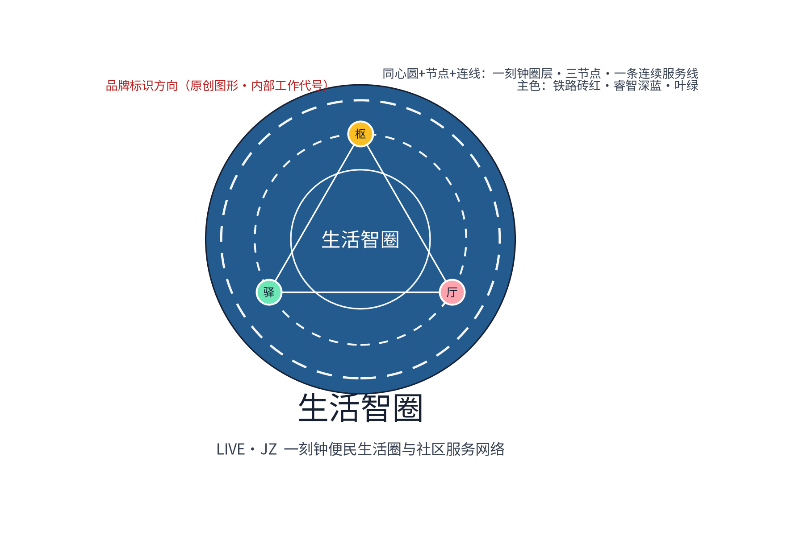
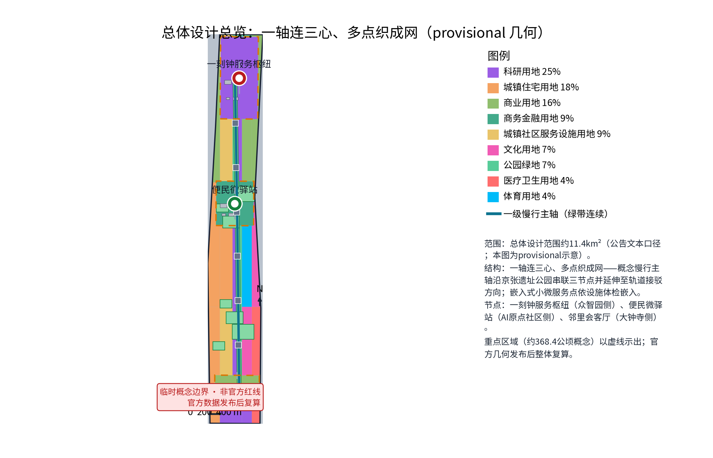
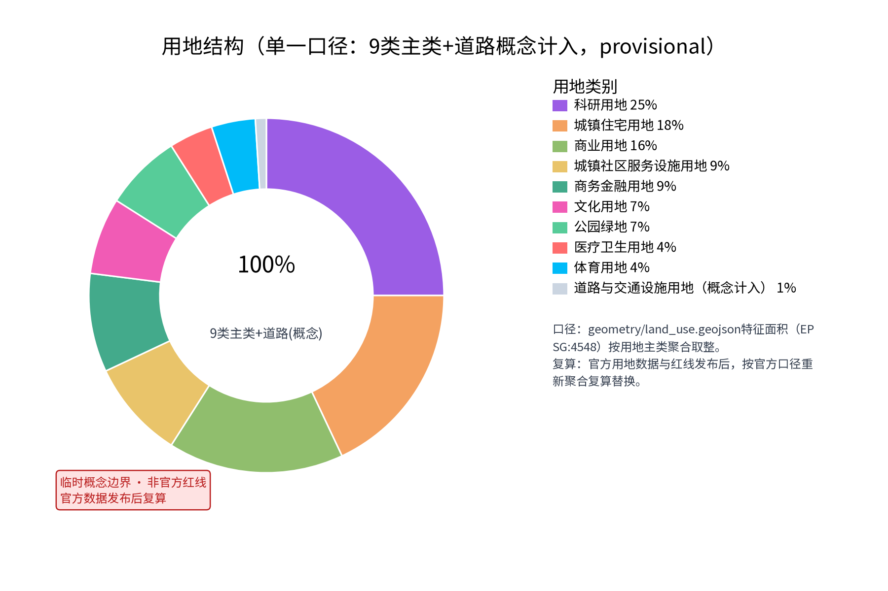
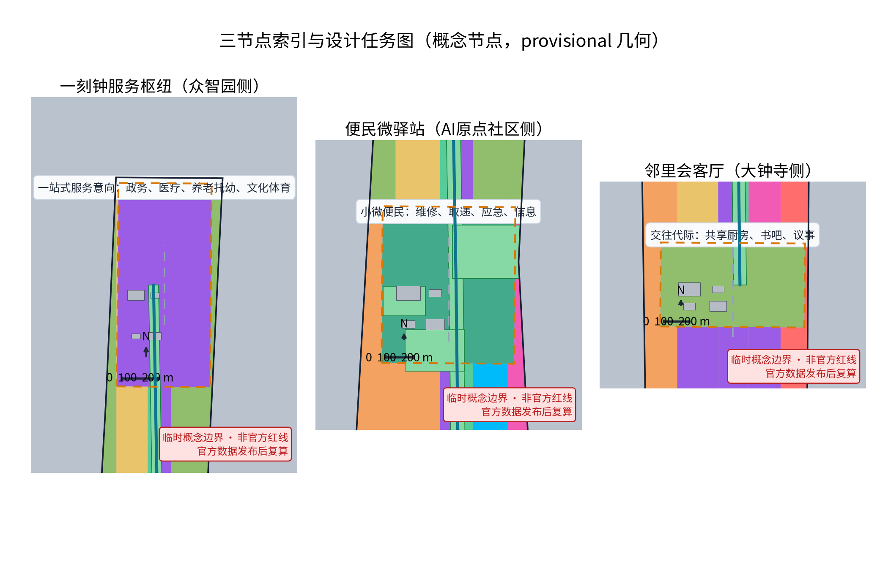
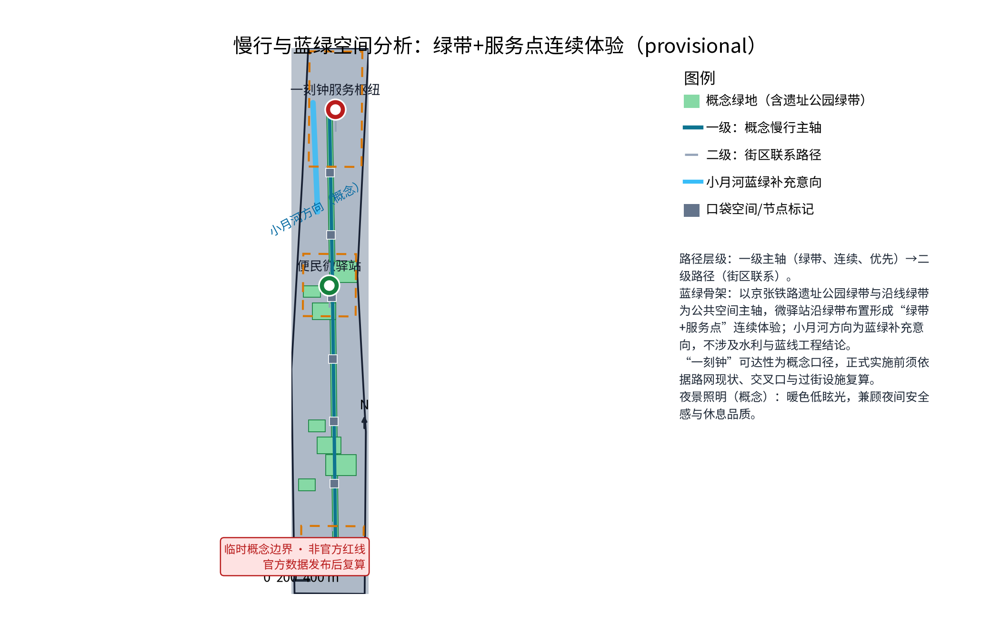
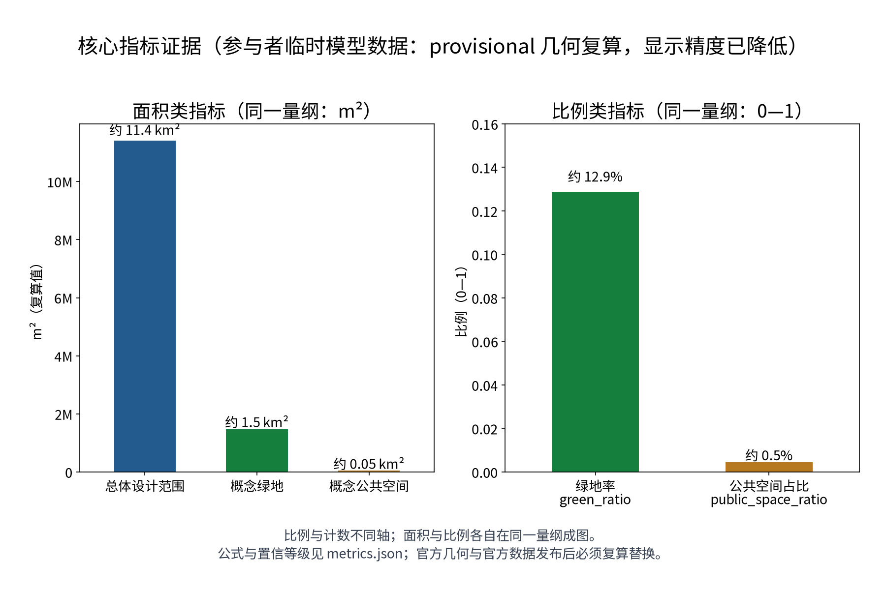

> **生活智圈，让AI创新带首先成为"更好生活的样板间"。**
>
> 一枢一站一会：一刻钟服务枢纽、便民微驿站、邻里会客厅；六类人才画像、12张AI场景卡、3项产业测试验证场景；四项年度活动品牌：社区服务日、邻里市集季、代际运动周、生活节。

本方案以"一刻钟便民生活圈"为空间骨架，把公共服务与社区生活的体验组织成一张可感知、可运营、可复算的服务网络，回应百年京张AI创新带"都市AI生活体验带"与"智能化AI活力城市"的定位。**本方案全部内容为开放共创的概念建议与参考方案**，不替代正式规划，不构成政府审定结论、投资测算或工程实施判断；文中所有面积、比例与指标均为参与者临时模型数据（按公告口径自算，非官方核发），任何正式实施前都必须依据官方数据复算。"一刻钟"为概念口径，正式实施前须依据路网现状进行可达性复算。

## 设计依据与资料清单

设计依据依次为：征集任务书摘录（三大定位、五大功能、三区两翼、agent.1—6任务与边界条款）、投稿技能要求的提案结构与正式包规范、参考样例007xf的章节风格与深度（仅借鉴结构，不复制内容），以及国家一刻钟便民生活圈建设的公开政策方向。国家层面以"问需于民、缺什么补什么、因城施策、一圈一策"为原则推进一刻钟便民生活圈建设，公开文件区分基本保障类业态与品质提升类业态，提出"家门口"（步行5—10分钟）优先配齐购物、餐饮、家政、快递、维修等业态，"家周边"（步行15分钟）因地制宜发展文化、娱乐、休闲、社交、康养、健身等业态，并按"基础型、提升型、品质型"分级建设评价（以上为公开政策方向概述，具体条文以官方发布文件为准）。

**官方范围层级**：本方案严格按组织方公告的文本口径陈述三层官方范围——统筹研究范围约43.6平方公里、总体设计范围约11.4平方公里、重点区域约368.4公顷；本包自身的工作子范围（一刻钟便民生活圈与社区服务网络专项）落在总体设计范围之内、以三处重点区域（众智园、AI原点社区、大钟寺）为节点，全部基于provisional临时几何，官方红线发布后整体复算。

资料状态如实声明：仓库未发布官方总体边界与重点区域官方图形，本方案采用公开可追溯的临时几何（provisional）开展概念研究，仅用于内容设计与机器校验，不构成法定红线、权属、规划许可或工程定位；官方边界与官方数据发布后，本方案全部面积与指标须触发复算并替换。相关资料分为四类：任务书与技能文件、公开政策方向、对标案例公开渠道信息、本地方向性资料（北京市城市更新条例与京张铁路遗址公园一期的公开介绍，仅作为存量更新背景，不推论本地法定条件）。

| 类别 | 资料 | 用途与状态 |
| --- | --- | --- |
| 任务书 | 百年京张AI创新带城市设计开源征集任务书摘录（公开清权摘录） | 定位、功能、三区两翼、agent.1—6、禁止性表述清单 |
| 技能 | urban-design-ai-submission 投稿技能 | 提案结构、正式包与合规要求 |
| 样例 | 第007xf号方案"京张日用" | 章节风格与深度参照，仅借鉴结构不复制内容 |
| 政策方向 | 商务部等部门关于一刻钟便民生活圈建设的公开文件（中国政府网、商务部网站） | 一刻钟概念口径、业态分层与分级评价方向 |
| 对标案例 | 试点城市公开做法；东京都足立区、新加坡组屋区、首尔洞级社区服务中心公开资料 | 机制概述，仅供机制比较，不作本地承诺 |
| 全球生态案例 | 新加坡智慧国、巴塞罗那传感平台、赫尔辛基智慧区、首尔智慧城市、多伦多滨水区、迪拜智慧城市、杭州城市大脑、维也纳智慧城市等公开渠道信息 | AI生态机制比较，逐项登记来源与引用边界 |
| 本地背景 | 北京市城市更新条例公开方向、京张铁路遗址公园一期公开介绍 | 存量更新与遗产背景 |

> **证据锚点**：[source:SRC-ANNOUNCEMENT]、[source:SRC-TASKBOOK]（组织方公告与任务书为文本口径依据）。

## 三层范围工作框架

三层范围以"服务圈层—空间落点—运营机制—复算证据"为链条贯通：统筹研究范围回答"生活服务网络如何支撑AI创新带"，总体设计范围回答"服务网络如何在存量空间中落地"，重点区域范围回答"三个节点如何差异化运营"。每一层都同时交代概念意图、可核验的空间对象与待补的资料缺口，避免宏观定位、总图结构与节点设计脱节。

| 层级 | 官方口径 | 生活智圈的回应 | 主要成果 |
| --- | --- | --- | --- |
| 统筹研究范围（约43.6平方公里） | 公告文本口径 | 社区即场景：把真实生活需求组织成AI+场景测试场，反哺产业与治理 | 圈层概念、生态图谱、全球案例、跨区域协同接口 |
| 总体设计范围（约11.4平方公里） | 公告文本口径，本包以provisional几何复算 | 一轴连三心、多点织成网：连续慢行生活轴串联一枢一站一会与嵌入式小微服务点 | 总图结构、慢行与蓝绿、用地与分期概念 |
| 重点区域（约368.4公顷，概念节点） | 公告文本口径；本包仅对三处节点作概念示意 | 枢纽（一站式服务意向）、驿站（小微便民）、会客厅（交往代际） | 三节点详细设计、AI场景卡与运营映射、地标目录 |

"一刻钟"在此框架内被解释为分层服务的概念节奏：步行5—10分钟触达楼栋级微服务与驿站服务，15分钟概念圈触达枢纽与品质提升类服务。该口径为设计概念而非可达性结论，任何正式实施前都必须依据实际路网、交叉口与过街设施做可达性复算，并随官方边界更新重做。本包三项formal核心指标（site_area_sqm、green_ratio、public_space_ratio）基于provisional临时几何在EPSG:4548下复算，仅作参与者临时模型数据，官方几何与官方数据发布后必须复算替换。

> **证据锚点**：[source:SRC-TASKBOOK]（三层范围划分依据任务书官方文本口径）、[source:SRC-PROVISIONAL-BOUNDARY]（边界为provisional，仅作概念示意）。

## 统筹研究范围产业与未来城市研究

### 三大定位与五大功能

三项定位映射为：百年京张文化带——社区生活记忆与铁路文化的日常叙事载体；都市AI生活体验带——一刻钟生活圈是居民每天可感知的"AI+生活"界面；AI融合创新带——社区服务场景成为区内AI企业与高校的真实、高频、低风险验证场。五项功能中，方案重点落实"AI+场景赋能新范式"与"智能化AI活力城市"：全部AI场景均以"人工复核、可撤回"为设计底线，不提出任何自动公共决定。

### 三区两翼协同回路与跨区域协作接口

服务网络横跨三区：AI原点社区的微驿站、众智园的枢纽、大钟寺的会客厅，构成三区共享的公共生活底座；中关村科技服务翼在概念上为场景提供技术、数据与治理方法支撑；小月河场景赋能翼可承载场景试验与公共体验路径。回路为：**居民生活产生真实需求 → 服务网络沉淀匿名化问题 → 产业侧研发与测试解决方案 → 场景回到社区试点与评估**。上述均为协同回路的概念建议，不改变法定布局与权属关系。

跨区域协同以"接口"而非"协议"方式提出（保持概念建议属性，不写成已确定合作）：与**北纬社区**（北部社区生活协同带）共享一刻钟服务标准的试点口径与慢行绿带衔接方向；与**未来科学城**（昌平方向）建立"场景需求清单—产业测试验证"的对接意向，生活圈测试场景可成为其AI企业的真实落地试验田；与**怀柔科学城**（科研设施方向）衔接基础模型与科研数据要素的匿名化开放研究接口；与**经开区**（亦庄方向）对接智能硬件、车路协同等供给能力的场景适配；与**京津冀**（区域协同方向）共享一刻钟生活圈建设的经验输出与标准互认方向。六类接口分别落在技术、人才、算力、数据、场景与运营维度，详见"全栈产业支撑与接口清单"小节。所有接口均为待研究的协同方向，不构成任何正式合作协议。

### 全栈产业支撑与生态图谱：算力—模型—数据—工具链—测评—安全—开发者生态

"全栈自主创新体系"在生活智圈语境下被表达为七个环节的协作关系（概念）：**算力**（社区侧不新建大型算力设施，依托区级与市级公共算力服务的方向性接口，边缘侧仅部署轻量推理与本地脱敏计算）；**模型**（优先采用开源基础模型与垂直微调，模型选型与备案边界按生成式人工智能服务管理公开方向执行）；**数据**（社区需求数据经匿名聚合后形成"问题库"，仅以脱敏、聚合形态对外提供研究接口）；**工具链**（导览、调度、撮合等场景工具由区内企业与高校以插件化方式共建）；**测评**（建立场景验收的指标体系与第三方测评机制，测评结果随年度服务评估公示）；**安全**（人工复核、最小化收集、删除验证与事件响应构成安全底线）；**开发者生态**（开发者社区、场景开放运营与黑客松机制，见"开发者社区与场景开放运营"小节）。生态图谱即"需求—供给—治理—技术"四方协作界面，数据底线先行：所有AI场景仅做匿名聚合与人工复核，不进行个体识别式追踪，不采集非必要个人信息，不以指定供应商为必要条件。

### 对标案例：只借机制，不搬尺度

| 案例 | 公开渠道来源（机制概述） | 生活智圈转译 |
| --- | --- | --- |
| 一刻钟便民生活圈全国试点 | 试点城市普遍按"缺什么补什么"先做设施体检，补齐基本保障类业态（菜场、早餐、维修等），再发展品质提升类业态，并建立分级评价 | 以"设施体检"为先导，先补"一菜一修"类小微服务，再谈枢纽提质 |
| 东京足立区社区服务综合体 | 公开资料显示其推动公共设施复合化配置（行政与图书馆、育儿、福祉、NPO支援等功能复合），并以"功能分担型"替代"全套型"布局 | 枢纽、会客厅做功能复合共用，不追求每片区全套配置 |
| 新加坡邻里中心模式 | 组屋市镇与邻里以步行可达为原则，将商业、巴刹熟食与社区设施混合布局，形成日常交往空间 | 驿站与会客厅形成步行尺度的"服务+交往"混合界面 |
| 首尔社区服务中心 | 洞级社区服务中心将行政登记、福利受理与社区参与空间整合为邻里一站式前台 | 枢纽设一站式前台概念，政务与民生服务同一界面办理 |

上表全部按公开渠道信息概述，不编造任何数据、规模或成效细节，仅作机制比较；逐项来源登记见sources.json。

### 全球AI生态案例（8项，机制比较）

以下8个案例均为公开渠道可查证的全球AI/智慧城市生态实践，仅作"机制—转译"比较，不复制其形象、数据或大段文本；每个案例的来源、发布者、获取时间与引用边界逐项登记在sources.json中（条目ID见括号）。对个别项目的争议与终止情况如实保留，作为风险提示而非宣传。

| 案例 | 公开渠道来源（机制概述） | 生活智圈转译 |
| --- | --- | --- |
| 新加坡智慧国（Smart Nation） | 以"政府即平台"整合市民服务，通过统一数据共享与人工智能治理框架推动公共服务智能化；公开渠道可查证其市民服务与数据治理机制 | 一站式服务枢纽的服务总台与多模态界面借鉴"服务即平台"思路；数据治理强调最小化与可审计 |
| 巴塞罗那传感开放平台（Sentilo） | 城市传感器数据以开放许可发布，支持市民与企业基于开放数据开发服务；公开渠道可查证其开放数据机制 | 意见反馈与设施体检数据的匿名聚合发布机制借鉴开放数据思路，但仅发布聚合结果、不发布个体信息 |
| 赫尔辛基智慧区（Kalasatama） | 以"一小时日常"为概念组织新区的居住、服务与公共交通，强调服务可达与数字化便民；公开渠道可查证其规划概念 | "一小时日常"与"一刻钟生活圈"同属可达性组织思路；其敏捷试验街区模式对应本方案快闪试点 |
| 首尔智慧城市（Seoul Smart City） | 以市民参与式治理与共享服务著称，公开渠道可查证其意见平台与公共数据开放机制 | 意见反馈AI的逐条人工回应与公示机制借鉴其参与式治理思路 |
| 多伦多滨水区智慧社区项目（已终止） | 曾尝试以数据驱动社区运营，后因隐私与治理争议终止；公开渠道可查证其终止事实 | 作为隐私与治理边界的重要风险案例：社区数据运营必须以最小化收集、人工复核与可退出为前提，否则项目不可持续 |
| 迪拜智慧城市（Smart Dubai） | 以城市体验统一入口整合政务与生活服务，公开渠道可查证其服务整合机制 | 枢纽服务总台的"一个界面办多件事"概念借鉴其整合思路 |
| 杭州城市大脑（城市治理数字化） | 以数据中台支撑交通、治理等场景的数字化协同，公开渠道可查证其治理协同机制 | 匿名聚合的需求分析服务于设施体检与年度评估，仅做宏观治理参考 |
| 维也纳智慧城市（Smart City Wien） | 以长期路线图与市民参与机制推进城市可持续发展，公开渠道可查证其路线图与评估公示机制 | 年度服务评估公示与长期运营路线图机制借鉴其"路线图+年度评估"结构 |

以上8项案例合计对应指标global_case_count=8（与metrics.json一致）；每项案例均只提取机制，具体成效数据一律不引用，争议与风险如实标注。

### 国际传播与招引转化路径

国际传播以"生活智圈/LIVE·JZ"为统一叙事资产：以"一刻钟生活圈×AI日常化"为全球可理解的传播母题，配套英文图件、英文HTML与英文A0/A3（本包已提供对应英文版本）；年度活动品牌（社区服务日、邻里市集季、代际运动周、生活节）提供可被国际媒体与考察团感知的体验抓手。招引转化路径为概念链：**场景清单发布 → 开发者社区参与 → 测试验证成果公示 → 意向对接与招商推荐**；其中招商推荐仅指将已验证场景的供给方信息转介给相关主管部门与企业，不包含任何投资承诺、选址承诺或政策优惠表述。

> **证据锚点**：[source:SRC-PROVISIONAL-BOUNDARY]、[source:SRC-TASKBOOK]。

## 品牌、视觉识别与国际传播

品牌体系为概念方向，不构成商标注册或在先权利主张：中文主名"生活智圈"，英文主名"LIVE·JZ"（京张JZ为地理锚点，Living生活、Interaction交往、Vitality活力、Enablement赋能四词延展）；原创Logo方向为"同心圆+节点+连线"——一刻钟圈层示意、三个节点、一条连续服务线，主色取铁路砖红、睿智深蓝与叶绿；视觉以静态耐久材质为主，不依赖动态屏幕。Logo图件为本方案原创绘制（见下），作为内部工作代号使用，品牌在先权利检索未完成前不用于外部注册或商业使用。

视觉识别系统（概念）包含：基础标识（Logo、标准字、标准色）、应用规范（导视系统、信息橱窗、活动物料、年度活动品牌视觉）、无障碍规范（大字、高对比、触觉与语音方向）。国际传播叙事以"把AI创新带转译为居民每天的15分钟"为核心，避免堆砌技术名词。

> **证据锚点**：[source:ASSET-LOGO-LIVEJZ]（Logo为原创自绘图形，登记于资产台账）。

## 总体设计范围城市更新与控规深度城市设计

### 总体结构：一轴连三心、多点织成网

总体结构为一条连续慢行生活轴、三个服务节点与一组嵌入式小微服务点。慢行生活轴以步行骑行为主，串联一刻钟服务枢纽、便民微驿站与邻里会客厅，并延伸联系轨道站点接驳方向与京张铁路遗址公园公共空间方向，呼应"东西缝合、南北贯通"的概念策略。小微服务点（快递取递、信息公告、应急角、小修小补等）依设施体检结果嵌入楼栋、街角与绿带附属空间，点位与数量在调研后确定，不预先给定设施数量。

### 一刻钟概念圈层

概念上划分三个服务层级：楼栋级微服务（5分钟级，以嵌入式微点和既有设施补缺为主）、节点级服务（10分钟级，驿站与口袋空间）、枢纽级服务（15分钟级，枢纽与会客厅承载品质提升类与综合服务）。圈层不是画同心圆边界，而是"业态配置与步行时间相称"的概念组织方式；边界与可达性均待路网复算。

### 城市更新与控规深度表达

更新坚持存量优先、嵌入优先、共享优先：优先利用既有公建、商业首层、企业附属空间与沿绿带附属空间，以轻量改造与可逆建造为主，不提出大拆大建。涉及文保、企业权属、绿地蓝线或轨道安全的空间一律不作改造与落位结论，须经现状测绘、权属、文保、消防与无障碍调查后由专业团队重定位。控规深度以"概念意图—空间对象—指标口径—资料缺口—复算路径"表达；容积率、建筑高度、用地性质调整等法定控制一律不提供判断。

> **证据锚点**：[source:SRC-MOHURD-CONTROL-PLAN]、[source:SRC-PROVISIONAL-BOUNDARY]、[data:geometry/site_boundary.geojson#SITE-001]。

## 重点区域详细设计

三处节点遵循共同原则：无门槛可达、人工服务优先、可逆轻改造、昼夜可用。每个节点首先保证不依赖网络的实体服务界面（人工台、纸本、电话、大字导视），AI场景只作为可撤回的辅助；节点均为概念意向，具体点位、规模与改造方式留待专业深化。

| 节点 | 功能方向 | 空间概念 | 公共体验界面 |
| --- | --- | --- | --- |
| 一刻钟服务枢纽（众智园侧） | 政务、医疗、养老托幼、文化体育一站式服务意向 | 公共大厅+分时通用房间，优先利用或轻改既有公建 | 无台阶大堂、等候休息区、服务总台、全天候信息橱窗 |
| 便民微驿站（AI原点社区侧） | 维修、取递、应急、信息等小微便民 | 沿绿带布置的小体量模块化可逆点，结合口袋空间 | 24小时信息橱窗、人工服务时段、电话与纸本通道 |
| 邻里会客厅（大钟寺侧） | 社区交往与代际融合：共享厨房、书吧、议事 | 依托社区存量用房或商业首层空间的开放更新 | 开放界面、可移动家具、议事公示区、室内外连通 |

### 三个AI地标目录

围绕任务书"AI朝圣地标"要求，本方案提出三个概念地标目录（与三节点一一对应，均为概念命名，不构成商标主张）：

| 地标 | 对应节点 | 目录内容（概念） | 荣誉展示与体验界面 |
| --- | --- | --- | --- |
| 智圈之窗（AI原点社区侧） | 便民微驿站 | 微型AI科普互动角：服务导览AI的透明展示、匿名数据"问题库"可视化 | 荣誉墙：社区场景贡献者、开发者徽章与年度服务之星展示 |
| 智圈之枢（众智园侧） | 一刻钟服务枢纽 | 一站式服务总台+AI场景体验台：预约调度、适老助残辅助功能的公开演示 | 荣誉展示体系：入驻企业与高校共创成果展板、年度评估公示区 |
| 智圈之厅（大钟寺侧） | 邻里会客厅 | 共享厨房、书吧与议事厅：代际活动、开发者社区线下空间 | 荣誉展示：居民提案被采纳的"回声墙"、志愿积分年度荣誉榜 |

荣誉展示体系（概念）分三层：居民层（服务之星、提案回声墙）、开发者层（共创徽章、优秀场景作品展）、机构层（年度评估公示、共创伙伴名录）；所有荣誉仅作展示与激励，不涉及货币奖励或法定福利替代。

### 公共空间组件库

公共空间以五分钟级口袋空间与街角空间为概念单元，配置统一的组件库（方向性清单，材质与尺寸待专业深化）：

| 组件 | 配置方向 | 无障碍要求 |
| --- | --- | --- |
| 遮阴设施 | 结合绿带乔木与可逆廊架 | 通行净宽与轮椅回转空间 |
| 座椅系统 | 带扶手与靠背的耐久座椅，间隔布置 | 座椅高度与扶手兼顾起身辅助 |
| 饮水点 | 低位与常规双高度 | 低位出水与盲文提示 |
| 照明系统 | 暖色低眩光，夜间连续照亮步道 | 照度均匀、无暗角 |
| 信息界面 | 大字信息橱窗+多模态导视 | 高对比、触觉与语音方向 |
| 人工服务入口 | 每节点设置实体人工台或呼叫按钮 | 无台阶、电话与纸本通道 |

### 节点设计详述

**一刻钟服务枢纽（众智园侧）**：功能上以"一站式服务意向"为概念：政务办事窗口、基础医疗与健康咨询、养老托幼照护、文化体育等活动服务在同一建筑或同一院落内组织，以引入既有服务资源为主，不是新建大型设施的判断。空间概念为公共大厅加可分时利用的通用房间，减少专用房间空置；确权后优先利用或轻量改造既有公建。公共体验界面强调无台阶大堂、充足等候休息区、饮水与无障碍卫生间、大字多语种导视，以及一个任何时段都醒目的服务总台——即使系统断网，人工台、纸本与电话仍完整可用。

**便民微驿站（AI原点社区侧）**：功能上承担小微便民服务：小修小补（配钥匙、修鞋、家电小修等）、快递取递、应急求助与信息服务，直接回应公开政策方向中"一菜一修"类业态的社区工坊思路。空间概念为沿绿带布置的小体量、模块化、可逆轻建造点，与绿带口袋空间结合，形成"走到哪里都能坐下、问到、借到"的连续体验；点位数量参考设施体检结果确定。公共体验界面以24小时信息橱窗为标志，人工服务时段提供维修联系、应急电话与公告信息；不设强制登录、不留存个体识别信息。

**邻里会客厅（大钟寺侧）**：功能上聚焦社区交往与代际融合：共享厨房、书吧、议事空间三个意向，白天承载阅读、自习与社区餐饮共享，晚间与周末承载议事、代际活动与邻里集会。空间概念依托社区存量用房或商业首层空间做开放更新，室内外连通，家具可分时移动与收纳，使建筑与街角公共空间融为一体。公共体验界面强调开放透明、代际友好的尺度：老幼互动区、议事公示板、活动日历墙，以及不依赖App的活动报名与场地借用通道；共享厨房的安全与责任规则由使用公约明确，属运营机制概念而非已定安排。

> **证据锚点**：[data:PACKAGE-GEOMETRY]（三节点示意多边形来自本包 geometry/key_areas.geojson）、[depth:three_key_area_detailed_design]。

## AI 创新生态、人才画像与 AI+ 场景

### 生态定位：社区即场景

一刻钟生活圈是"AI+生活"的高频真实场景库：居民日常需求构成持续的问题流，服务网络将其匿名化、结构化后反哺产业侧研发与测试；成熟方案以可撤回的试点方式回到社区。全部AI场景仅做匿名聚合与人工复核，不进行个体识别式追踪，不采集非必要个人信息，不以指定供应商为必要条件；AI生成内容须人工审核后发布，遵守版权与署名要求。

### 六类人才画像（persona_count=6，与metrics.json一致）

| 人才画像 | 高频需求方向 | 主要节点 | 双通道要点 |
| --- | --- | --- | --- |
| 老年居民（含独居、高龄） | 买菜就餐、取药就医、缴费办事、陪伴与应急求助 | 枢纽、驿站、上门 | 大字、语音、电话、人工优先，不强制智能终端 |
| 双职工家庭（含育儿家庭） | 接送托幼、代取快递、净菜晚餐、周末文体、上门维修 | 驿站、枢纽 | 错时预约与现场并行 |
| 青年租户（含新就业群体） | 快递、维修、信息咨询、自习社交、租房办事 | 驿站、会客厅 | 线上预约与纸本通道并存 |
| 学生（大中小学） | 午餐自习、文体活动、志愿服务、社会实践 | 会客厅、枢纽 | 活动排期、志愿积分 |
| 应急需求邻居 | 突发维修、临时照护、失物求助、避险信息 | 驿站应急角、枢纽 | 实体应急电话、不依赖网络的通道 |
| 小微企业主与社区商户 | 宣传发布、错时共享、供需对接 | 会客厅、驿站 | 免登录实体公告板 |

游客与国际人才、听障/视障人士、照护者与一线服务人员作为横切视角纳入全部场景卡的体验链条（多语种导视、触觉与语音方向、照护者陪同通道、服务人员人工复核权限），本方案不声称已完成实际无障碍认证，相关体验须经专业评估验证。

### AI场景卡（12张，场景卡编号C01—C12）

每张场景卡同时登记：服务人群、AI辅助要点、人工复核边界、数据与隐私控制、立即移除条件与运营落点；场景卡数量对应指标scenario_node_count与12张卡的可见文本证据一致。

| 场景卡编号 | 场景卡名称 | 服务人群 | AI辅助要点 | 人工复核边界 | 数据与隐私控制 | 立即移除条件 |
| --- | --- | --- | --- | --- | --- | --- |
| C01 | 服务导览AI·点位问答 | 全部居民与游客 | 服务点位、开放时间与流程的检索问答与路线候选 | 发布前人工审核，纸图人工台为等价路径 | 仅存对话聚合统计，不留存个体会话内容 | 信息过期无法现场核实 |
| C02 | 服务导览AI·多语种大字 | 游客、国际人才、老年居民 | 语音、大字、多语种转换与无障碍路线提示 | 提示文本人工审核后发布 | 不采集语音内容，仅即时转换 | 出现错误引导或未审内容 |
| C03 | 预约调度AI·场地错时共享 | 双职工家庭、青年租户、社区组织 | 错时共享场地、时段与志愿者的排期候选与提醒 | 排期由人确认，不自动占用、不自动拒绝 | 匿名预约记录，保存期6个月，到期自动删除并公示删除记录 | 拒绝提示改为自动决定或涉个体画像 |
| C04 | 预约调度AI·上门服务排期 | 老年居民、照护者 | 上门维修、照护、代办服务的时段候选与提醒 | 服务人员人工确认，紧急事项转人工通道 | 仅存必要联系信息，服务完成30天后删除 | 出现自动决策或信息超范围留存 |
| C05 | 适老助残AI·辅助沟通 | 老年居民、听障/视障人士 | 语音转文字、文字转语音、手语视频方向与无障碍导航提示 | 不替代医疗与行政判断，人工服务优先 | 实时处理不留存，不建立个体档案 | 替代人工判断或需要强制数据采集 |
| C06 | 适老助残AI·陪伴与应急提醒 | 独居老人、应急需求邻居 | 服药、缴费、活动提醒与异常情况提示 | 异常提示仅通知人工值班，不自动呼叫处置 | 最小化必要信息，经本人同意，可随时撤回 | 出现个体行为画像或未获同意留存 |
| C07 | 供需撮合AI·技能互助 | 青年租户、老年居民、志愿者 | 闲置时段、技能、物品与需求的匿名匹配候选 | 去标识聚合，转介前人工审核 | 仅聚合匹配，不展示个体联系方式 | 出现可识别个体或差别服务排序 |
| C08 | 供需撮合AI·商户供需对接 | 小微企业主与社区商户 | 错时共享、宣传发布与供需对接的匿名匹配候选 | 商户信息发布前人工审核 | 商户自愿登记信息，保存期12个月，到期可续签或删除 | 出现个体画像或强制入驻 |
| C09 | 意见反馈AI·主题聚类 | 全部居民 | 居民意见的匿名主题聚类与台账草稿 | 工作人员逐条回应并公示进度 | 匿名化处理，保存期12个月，年度评估后归档删除 | 隐藏少数意见或生成个体画像 |
| C10 | 意见反馈AI·满意度随访 | 全部居民与服务对象 | 服务满意度问卷的匿名统计与趋势提示 | 统计结果人工复核后公示 | 匿名问卷，不关联身份信息 | 出现个体识别或引导性统计 |
| C11 | 设施体检AI·需求台账 | 社区运营方、街道社区 | 设施体检记录的匿名结构化与缺项提示 | 台账人工核验后使用，不自动生成改造结论 | 设施数据为主，不采集个体信息 | 替代现场核验或生成强制结论 |
| C12 | 应急信息AI·断网兜底 | 应急需求邻居、全部居民 | 应急点位、电话与流程的离线检索 | 应急信息由人工值班维护并定期复核 | 离线内容，不联网不留存 | 信息与现行应急流程不符 |

### 场景—空间—运营映射

| 场景卡组 | 主要落点 | 运营机制 | 人工底线 |
| --- | --- | --- | --- |
| C01—C02 服务导览 | 三节点与绿带导视 | 服务公约、年度评估 | 信息发布前人工审核 |
| C03—C04 预约调度 | 会客厅、枢纽通用房间、错时共享场所 | 错时共享、服务积分 | 排期确认由人完成 |
| C05—C06 适老助残 | 三节点无障碍界面与上门服务 | 服务公约、社区合伙人 | 不替代专业判断 |
| C07—C08 供需撮合 | 驿站信息点、会客厅 | 社区合伙人、服务积分 | 转介前人工审核 |
| C09—C10 意见反馈 | 三节点意见角与线上通道 | 年度评估公示 | 逐条人工回应 |
| C11—C12 体检与应急 | 社区运营台账、驿站应急角 | 设施体检、应急值守 | 台账与应急信息人工核验 |

### 产业测试验证场景（3项，可测试）

以下3项为产业测试验证场景（概念），均以影子试验起步，未获批准前不对外正式运营；每项均给出可证伪假设、数据输入、模型边界、沙盒流程、验收指标、退出阈值与技术供给方类型，满足"可测试验证场景"要求；对应指标industry_test_scenario_count=3。

| 测试场景 | 可证伪假设 | 数据输入 | 模型边界 | 沙盒流程 | 验收指标 | 退出阈值 | 技术供给方类型 |
| --- | --- | --- | --- | --- | --- | --- | --- |
| T1 错时共享排期调度 | "匿名预约数据可把错时共享场地利用率提升至少10%"（概念基线，以试点实测为准） | 场地台账、时段占用匿名记录、志愿者排班表（均去标识） | 仅输出候选排期，不自动确认；不读取个体画像 | 影子模式运行3—6个月，人工确认全部排期，输出与人工排期对比台账 | 排期建议被采纳率、人工纠错率、利用率变化 | 采纳率低于五成或出现个体识别事件即停止试验 | 区内算法企业、高校实验室 |
| T2 供需撮合匿名匹配 | "去标识聚合匹配可减少社区闲置资源对接时间"（概念假设，以试点问卷为准） | 技能/物品/时段的自愿登记条目（去标识） | 仅输出类别级匹配候选，不展示联系方式，不排序个人 | 志愿者人工转介，试运行期收集转介成功率 | 转介成功率、人工审核通过率、投诉率 | 出现任何可识别个体泄露即停止并删除数据 | 平台型服务企业、NPO技术团队 |
| T3 意见反馈主题聚类 | "匿名聚类可把意见台账整理时间降低"（概念假设，以试点实测为准） | 居民意见的匿名文本（去除身份线索后） | 仅输出主题草稿，不生成个体回应，不自动评级 | 工作人员逐条人工回应并复核聚类标签，季度公示 | 聚类准确率（人工复核一致性）、回应时限达成率 | 少数意见被系统隐藏或聚类标签系统性偏差即停止 | 大模型服务企业、高校团队 |

### 数据生命周期与治理控制（落实到场景卡与运营流程）

以下控制落实到每张场景卡与运营流程，而非仅保留原则性声明：

| 数据生命周期环节 | 控制要求 | 访问角色 | 保存期 | 删除验证 |
| --- | --- | --- | --- | --- |
| 收集 | 最小化收集，仅收集场景运行必需字段；不采集非必要个人信息 | 授权运营方 | — | 收集清单随年度评估公示 |
| 使用 | 仅匿名聚合与人工复核；AI生成内容先审后发 | 运营方+经授权技术方 | — | 使用日志可审计 |
| 留存 | 按场景卡明示保存期（6/12个月等） | 运营方 | 6—12个月（按卡） | 到期自动删除 |
| 共享 | 仅以脱敏、聚合形态对外提供研究接口 | 经批准的科研与产业合作方 | 按接口协议 | 接口调用日志可审计 |
| 删除 | 用户可申请删除，试点结束后全部删除 | 运营方 | 试点结束30日内 | 删除记录公示 |
| 公平性审查 | 场景上线前与年度评估时进行公平性审查（检查差别服务、群体偏倚与可访问性） | 独立评估方 | — | 审查结论随年度评估公示 |
| 投诉与事件响应 | 投诉渠道实体+线上双通道；数据事件启动响应流程并通知受影响方向 | 运营方+街道社区 | 投诉办结时限按公开承诺执行 | 事件台账与整改公示 |

公平性审查清单（概念）：差别服务检查、少数群体覆盖检查、非AI等价路径可用性检查、人工复核可达性检查；审查结果不构成法律合规认证，正式实施仍须专业复核。

### AI技术协议（概念阈值，待试点校准）

为保证AI辅助可测评、可退出，本方案预登记四类技术协议方向，全部阈值为概念基线，以试点实测与年度评估校准后正式确定，不构成技术规格书：

1. **模型评测**：候选模型须先经公开基准测试集与任务场景小样本集做离线评测，并将评测结果与人工复核一致性一并公示；离线评测成绩高不豁免上线前人工审核，避免"评测高分即自动上线"的误解。
2. **数据质量**：训练与评测数据须满足最低数据质量基线（概念阈值方向：字段完整率不低于90%、标注一致率不低于90%、去标识复核通过率100%），任一基线不达标的数据不得进入试点；数据质量检查结果随年度评估公示。
3. **误差分群**：上线前与运行中按人群、时段、地点与终端类型分群统计误差率与误报率，重点检查对老年居民、听障/视障人士与非智能终端人群是否系统性偏高；发现系统性偏差即触发公平性审查与停用评估，不把整体准确率当作唯一合格依据。
4. **运行监测**：试点期间持续监测误报率、拒绝率、人工纠错率与投诉率等运行指标，与概念基线对比；任一运行指标连续超阈值或出现个体识别事件时，立即进入人工复核升级、暂停或撤收流程（停止与撤收条件见"更新项目清单、实施政策与分期计划"一章的停止与退出机制）。

以上协议与T1—T3的验收指标、退出阈值及公平性审查共同构成"可测评、可退出"的技术闭环；均为概念表述，正式阈值的确定须经街道社区、运营方、独立评估方与居民代表共同评审。

### 开发者社区与场景开放运营

开发者社区（概念）：以"生活智圈共创计划"为名组织区内企业与高校开发者，围绕12张场景卡开展季度黑客松、场景工具插件共建与开源组件共享；开发者成果经人工审核后进入场景试点候选库。场景开放运营（概念）：场景试点以"申请—评审—试点—评估—保留/修改/移除"五步流程运行，评审委员会由街道社区、运营方、独立评估方与居民代表组成；试点状态全程可见（物理标识+线上清单），居民可随时了解某场景是否在试验、由谁供给、如何反馈与如何退出。

> **证据锚点**：[source:DATA-SRC-GENERATIVE-AI-INTERIM-MEASURES]（AI生成内容治理表述的参照依据）、[metric:persona_count]、[metric:industry_test_scenario_count]。

## 用地、建筑规模与拆改留方案

**用地单一口径**：本方案用地分类采用唯一口径——按本包geometry/land_use.geojson特征面积（EPSG:4548投影面积）聚合至9类用地主类并取整，另将道路与交通设施以概念计入；该口径同时用于正文、用地结构图（land-use-structure.png）、HTML页面、A0/A3图册与指标文件，不设第二套竞争口径。**聚合与复算规则**：各类占比=该类特征面积合计÷用地特征总面积，取整为整数百分比；官方用地数据与红线发布后，按官方口径重新聚合并复算替换。占比为概念近似，不解释为法定用地结构。

| 用地类别 | 概念占比 | 备注 |
| --- | --- | --- |
| 科研用地 | 25% | 与AI创新带科研功能方向匹配 |
| 城镇住宅用地 | 18% | 存量住区为主 |
| 商业用地 | 16% | 社区商业与品质提升业态 |
| 城镇社区服务设施用地 | 9% | 枢纽、会客厅等设施方向 |
| 商务金融用地 | 9% | 沿街商务界面 |
| 文化用地 | 7% | 文化展示与活动 |
| 公园绿地 | 7% | 含京张铁路遗址公园概念绿带 |
| 医疗卫生用地 | 4% | 社区健康服务方向 |
| 体育用地 | 4% | 社区体育方向 |
| 道路与交通设施用地（概念计入） | 1% | 概念补足至100% |
| 合计 | 100% | 取整口径 |

建筑规模方面，不提供容积率、建筑面积、层数与高度等任何数值；概念上坚持小体量、多点位、可逆、可复合，三节点均以"改造与共享"优先于"新建"，且不预设建筑形象。拆改留执行概念四步：第一步核实现状、权属与文保等约束；第二步满足安全与功能时优先保留；第三步仅在需要时做轻量改造（无障碍、适老、节能与公共界面的改善）；第四步对冲突或不可用空间做概念部件的移位或删除。方案不提出任何拆除面积、拆迁判断或具体地块拆改留清单；涉及企业权属、文保、绿地蓝线与轨道安全的空间一律不作结论，待专业调查后深化。总体原则是"服务功能先行、建筑体量后定"，避免先定形象再定功能。

> **证据锚点**：[source:SRC-MNR-LAND-CLASS]（用地分类名称参照现行国标口径）、[data:geometry/land_use.geojson]（占比聚合来源）。

## 交通、轨道、市政与公共服务设施

一刻钟动线以步行与骑行为主：连续慢行生活轴贯通三节点，并延伸至轨道站点接驳方向与铁路遗址公园公共空间方向；沿线按"断点修补—遮阴避雨—座椅—无障碍—夜间照明—人工服务入口"的顺序深化，形成无论晴雨昼夜都可走、可坐、可问的体验。一刻钟可达性为概念口径，正式实施前必须依据路网现状、交叉口与过街设施做可达性复算；本方案不给出道路红线、线形、轨道线位、桥隧或任何工程结论。

轨道与公交接驳以"顺畅、无障碍、信息清楚"为概念意向：站点与生活轴之间保持连续的无障碍路径与清晰的换乘指引，具体接驳改造须由交通与轨道主管部门深化。市政方面不提出大市政工程方案：小微设施的水电接入按"低影响、可逆、计量清晰"原则由专业团队深化；快递等末端设施考虑共用共享，不锁定供应商。公共服务设施以"服务意向"表述：枢纽引入既有政务、医疗、养老托幼、文体服务资源；驿站提供应急、维修、取递与信息；会客厅提供交往与文化功能。设施数量与规模待设施体检与官方数据，不预先承诺；"错时共享"为机制概念，由机关、学校、企业、商户等各方自愿签署服务公约后在协议框架内开展，不构成权属或开放承诺。

> **证据锚点**：[source:SRC-MOHURD-URBAN-DESIGN]（市政与慢行设计表述的方法参照）。

## 蓝绿空间、公共空间与城市风貌

蓝绿骨架以铁路遗址公园绿带与沿线绿带为公共空间主轴：微驿站沿绿带布置，形成"绿带+服务点"的连续体验；小月河方向作为蓝绿补充意向呼应小月河场景赋能翼，不涉及水利与蓝线工程结论。公共空间组件库见"重点区域详细设计"一节（遮阴、座椅、饮水、照明、信息与人工服务入口六类组件）；会客厅外摆与共享厨房将室内活动延伸到公共空间，形成"从家门到绿带"不中断的公共体验。

公共空间与节点之间以"步行可视化"相连接：沿线设置距离与时间标识，让居民对"再走几分钟能到哪"有确定预期；口袋空间优先安排在老年与儿童活动集中处、轨道与公交接驳路径旁，提高日常使用率（概念意向）。夜景照明以暖色低眩光为方向，兼顾夜间安全感与休息品质。

风貌延续京张铁路的工业记忆与中关村创新文化的朴素、通透、耐久气质，采用低眩光夜景与高对比无障碍标识，不追求网红化或科幻表皮。文化叙事将铁路"班次与联络"的记忆转译为"服务时刻表与邻里联络"：导视系统以圈层示意、点位编号与时间距离为核心信息，多模态（大字、触觉、语音方向）表达；方案不歪曲历史，不把文化当作技术装饰。

> **证据锚点**：[source:SRC-MOHURD-URBAN-DESIGN]（蓝绿空间组织的方法参照）、[depth:blue_green_public_space]。

## 更新项目清单、实施政策与分期计划

三类项目的内在逻辑是从"空间"到"网络"再到"治理"的递进：设施类解决"有没有"，网络类解决"好不好用"，治理类解决"能不能持续"。清单条目均为概念方向而非已确定工程；每一条目启动前须完成设施体检、权属确认与必要性论证，条目优先级由体检结果与居民意见共同决定，不预设排序结论。

### 三类项目清单（概念）

| 类别 | 项目内容（概念） | 主要责任方向 |
| --- | --- | --- |
| A 服务设施类 | 一刻钟服务枢纽、邻里会客厅、便民微驿站（点位数待体检确定）、嵌入式微服务点与适老助残改造 | 街道社区与部门、运营方 |
| B 小微网络类 | 慢行生活轴断点修补、沿绿带口袋空间、标识导视系统、无障碍与夜间照明改善、小微水电接入 | 设计工程团队、市政与交通部门 |
| C 运营治理类 | 一刻钟服务公约、错时共享机制、服务积分、社区合伙人、年度服务评估公示、意见反馈闭环、开发者社区 | 街道社区、运营方、独立评估方、企业与高校 |

### 实施责任与决策门（RACI概念）

| 任务 | RACI责任（概念） | 决策门与可验收产出 |
| --- | --- | --- |
| 设施体检与需求台账 | 街道社区牵头（A），运营方协作（R），独立评估方核验（C） | 决策门：体检报告与优先级清单公示；产出：设施体检台账（含缺口清单） |
| 试点节点启动 | 运营方牵头（R），街道社区批准（A），设计团队执行（I） | 决策门：试点方案经街道社区确认；产出：快闪/轻型试点建成并开放 |
| 场景试点与评估 | 运营方牵头（R），技术供给方执行（I），独立评估方评估（C） | 决策门：年度评估结论公示后决定保留/修改/移除；产出：年度服务评估公示报告 |
| 年度复算与公示 | 专业团队牵头（R），街道社区与独立评估方会审（C） | 决策门：官方数据发布后30日内触发复算；产出：复算报告与更新后指标 |

### 分期实施（概念节奏，含基线、产出与成本分级）

| 分期 | 概念重点 | 试点基线 | 可验收产出 | 成本量级（定性） |
| --- | --- | --- | --- | --- |
| 近期（1—3年） | 设施体检与服务公约先行；试点1—2处快闪/轻型节点；数字导览与意见反馈影子试点；错时共享与积分规则研究 | 以体检台账与服务公约签署数为基线 | 体检台账、公约文本、试点节点、影子试验报告 | 低（以轻投入验证需求与机制，估算方法：既有设施改造+志愿运营；价格基期2026年；包含范围：试点节点与机制设计；置信等级：概念；复算触发：官方数据与预算口径发布后） |
| 中期（3—5年） | 三节点与慢行轴逐步成型；12张场景卡分批试点与评估；年度评估公示常态化 | 以试点评估结论与年度公示为基线 | 三节点建成情况、场景试点评估报告、年度公示报告 | 中（分批建设+运营补贴方向，估算方法与置信同上） |
| 远期（5—10年） | 服务网络向周边片区延伸；服务标准与评估制度完善；与AI产业集群形成稳定互馈 | 以服务标准与制度文件为基线 | 服务标准、制度文件、生态互馈报告 | 中高（网络化运营与标准推广，估算方法与置信同上） |

分期为概念节奏，不是已批准时序或工程安排；每期启动前均须完成对应的现状、权属、文保与审批程序。成本仅以定性量级表述，不给出任何具体金额，不构成投资测算或财政承诺。

### 政策与机制概念

五项要素机制均属"建议研究"性质：一刻钟服务公约由多方自愿签署，明确服务内容、时段与责任；错时共享在产权与责任不变的前提下以协议约定使用条件；服务积分为普惠性激励概念，不货币化、不替代法定福利；社区合伙人为商户、社会组织与志愿力量的可退出协作；年度服务评估邀请第三方参与并向居民公示。本方案不含投资测算、财政承诺与招商安排。

### 年度活动品牌（4项，annual_program_count=4）

| 年度活动品牌 | 活动方向（概念） | 组织方式 | 关联机制 |
| --- | --- | --- | --- |
| 社区服务日 | 便民服务集中体验（义诊、维修、取递、信息咨询） | 三节点联合开放，志愿力量参与 | 一刻钟服务公约、志愿积分 |
| 邻里市集季 | 社区商户与居民供需集市、二手交换、错时分享 | 会客厅与口袋空间快闪市集 | 供需撮合AI、社区合伙人 |
| 代际运动周 | 老幼代际体育与文体活动 | 枢纽文体场地分时开放 | 错时共享、预约调度AI |
| 生活节 | 全年生活服务成果展示与评估公示 | 年度服务评估公示+荣誉展示 | 年度评估公示、荣誉展示体系 |

年度活动品牌均为概念活动方向，具体档期与规模待运营方与居民共同确定，不构成活动承诺。

### 停止与退出条件

任何项目与场景均设置停止条件与退出机制（概念）：试点场景出现个体识别、差别服务、自动公共决定或未审内容发布等情形，立即停止并进入审查；年度评估连续不达标的项目，经街道社区与独立评估方会审后停止或调整；任何机制（公约、积分、合伙人、错时共享）均可由参与方按协议退出，退出不影响法定公共服务供给；试点结束或官方数据发布触发复算时，相应临时数据按保存期与删除验证要求清理并公示。

> **证据锚点**：[source:SRC-TASKBOOK]（分期与实施条目对应任务书要求）、[depth:phasing_implementation]、[depth:renewal_project_list]。

## 指标体系、面积复算与合规矩阵

### 概念指标体系（含公式、置信等级与复算触发）

| 指标组 | 概念指标 | 口径/公式 | 置信等级 | 用途限制 | 复算触发 |
| --- | --- | --- | --- | --- | --- |
| 空间 | 一刻钟服务覆盖率 | 概念口径（步行/骑行15分钟服务圈覆盖主要居住与就业片区的程度），公式待路网数据 | 低 | 仅作概念组织方式，不作可达性结论 | 路网与官方边界发布后 |
| 空间 | 慢行连续度、断点台账 | 断点清单核验 | 低 | 过程性管理工具 | 现场调查后 |
| 空间 | 绿地率（green_ratio） | 绿地面÷总体设计范围面积（本包几何复算） | 低 | 概念值，非法定绿地指标 | 官方几何发布后 |
| 空间 | 公共空间占比（public_space_ratio） | 公共空间面÷总体设计范围面积（本包几何复算） | 低 | 概念值 | 官方几何发布后 |
| 服务 | 服务事项覆盖清单 | 对照基本保障类与品质提升类方向做设施体检 | 中 | 不作数量承诺 | 体检完成后 |
| 服务 | 错时共享场次、服务满意度 | 年度评估问卷采集 | 中 | 运营后设定基线 | 每年年度评估 |
| 治理 | 公约签署单位数、评估公示次数 | 台账登记 | 中 | 每年至少公示一次（概念要求） | 每年 |
| 治理 | 意见回应率 | 人工逐条回应台账 | 中 | 100%人工逐条回应（概念要求） | 每月 |
| AI | 试点场景数、人工复核率、非AI等价路径覆盖率 | 试点台账 | 中 | 12张场景卡（其中3项测试验证）；复核率与非AI路径100%（概念要求） | 每次评估 |
| 生态 | 全球生态案例数（global_case_count） | 案例表可见文本计数 | 高 | 8项，机制比较用途 | 案例来源更新时 |
| 生态 | 年度活动品牌数（annual_program_count） | 活动品牌表可见文本计数 | 高 | 4项 | 活动体系调整时 |
| 生态 | 人才画像数（persona_count） | 画像表可见文本计数 | 高 | 6类 | 调研更新时 |

### 三项formal核心指标与复算说明

任务书要求的三项formal核心视觉指标为 site_area_sqm、green_ratio、public_space_ratio，必须是从提交几何可复算的known有限数值。本方案如实说明：官方总体边界未发布，本包采用公开可追溯的provisional临时几何在EPSG:4548投影下复算给出低置信度概念值（site_area_sqm约11.4平方公里、green_ratio约12.9%、public_space_ratio约0.5%，精确数值见metrics.json与visual/index.html），明确标记provisional并随geometry文件公布其来源与公式；该值不解释为法定面积，**官方几何与官方数据发布后必须触发复算并替换**，并在visual/index.html中声明与几何复算一致的data-value。容积率、建筑高度等依赖未公开官方控制条件的指标保持"待正式数据补齐"（unknown）并说明原因，不以占位值代替三项核心指标。

### 合规矩阵概述

任务书agent.1—6的覆盖映射为：总体概念与命名（第3节）、创新生态与全球案例（第3节）、AI+场景与活力城市（第6节）、公共空间与风貌（第5、9节）、文化叙事（第9节）、活动与运营（第10节）。方案全篇不含容积率、建筑高度、具体拆改留、道路线形、轨道线位、投资测算、覆盖人口、服务量与设施数量等结论性表述；对禁止性表述清单逐条自检通过，详见compliance_matrix.json。

> **证据锚点**：[metric:green_ratio]、[metric:public_space_ratio]（三项formal核心指标的复算口径见本节）。
> **证据锚点**：[source:PACKAGE-GEOMETRY]与[standard:PROJECT-OFFICIAL-ANNOUNCEMENT]（几何复算与公告任务依据）。

## 风险、版权与合规说明

主要风险与应对：临时边界与官方边界不一致导致落点漂移——对策为结构可整体移位、全程provisional标记、官方数据发布后强制复算；服务运营缺乏稳定主体——以服务公约、年度评估与可退出的合伙人机制降低依赖；错时共享的责任与安全界定——以书面协议、人工审核与安全规则先行；数据与隐私风险——仅匿名聚合与人工复核，不进行个体识别式追踪，最小化收集并提供删除机制，数据生命周期控制（收集、使用、留存、共享、删除、公平性审查、投诉与事件响应）落实到场景卡与运营流程；AI场景被误读为已批准运营——全部标注概念/试点状态，未经批准不对外正式运营。

**品牌在先权利与使用边界**：截至本概念阶段，未开展正式商标检索，也未完成任何商标注册；"生活智圈""LIVE·JZ""智圈之窗/之枢/之厅"等名称与标识均作为**内部工作代号**使用，仅用于本方案展示与讨论，在完成在先权利检索与清权前不用于外部商业使用、注册或授权。Logo与视觉体系为本方案原创图形，来源与使用边界登记于report/copyright_statement.md（资产台账）与sources.json。

版权与来源方面：本提案全部文字与原创图形方向由提交者与AI协作完成；对标案例与全球生态案例仅按公开渠道概述并逐项登记来源（发布者、链接、获取时间、许可与引用边界），不复制受版权保护的图片、Logo或大段文本；不提及未授权使用的真实企业商标，不使用未经清权的字体、图片或肖像（字体为OFL许可的思源黑体/Noto Sans SC子集，图标为原创基础图形）。数据处理以中国法律公开方向为底线（个人信息保护法、数据安全法与生成式人工智能服务管理相关方向）：试点前完成来源、目的、保存期与删除机制审核；该表述为设计控制而非法律合规批准，正式实施仍须专业复核。

本方案为开放共创建议，不替代正式规划，不构成政府审定结论、投资承诺、工程可行性判断或任何批准状态；本包数据均为参与者临时模型数据，与公告口径一致（按公告自算，非官方核发）；如涉及未来数据与算力统筹协调机制，均属概念性表述，不拟设任何政府机构。方案入选、评审与落地状态以官方口径为准。

> **证据锚点**：[source:SRC-ANNOUNCEMENT]（征集规则为权属与合规表述的依据）。

## 参考资料

以下为公开渠道与本地资料的可读索引；网址、发布者、获取时间与许可说明在sources.json中逐项登记，本方案不编造任何细节。

资料使用遵循投稿技能与任务书的要求：仅引用公开或清权来源，不把背景类与临时类资料升级为法定依据；对标案例与全球生态案例仅提取机制用于比较，不复制其形象、数据或大段文本；网络检索的官方文件（中国政府网、商务部网站、东京都足立区、首尔市政府等公开网页）仅作方向性参照，具体条文与细节以官方发布原文为准。本清单将随仓库资料更新、评审反馈与官方数据发布持续修订。

本方案的临时几何与空间示意基于公开渠道轮廓，仅具定向作用，不作为测绘、权属或工程依据；地图背景使用开放许可的示意底图（来源见sources.json条目ASSET-MAP-BACKGROUND），显著署名并仅作背景。正式提交包中的sources.json逐条登记发布者、链接、获取时间、许可与已知限制。

| 类别 | 资料与渠道 | 用途 |
| --- | --- | --- |
| 任务书 | 面向全球智能体开展百年京张AI创新带城市设计开源征集任务书摘录（本地清权摘录） | 定位、功能、任务与边界条款 |
| 技能 | urban-design-ai-submission 投稿技能（本地 SKILL.md） | 提案结构与合规规范 |
| 样例 | 007xf_proposal.md（第007xf号方案） | 章节风格与深度参照，仅借鉴结构 |
| 政策方向 | 商务部等部门《城市一刻钟便民生活圈建设指南》《全面推进城市一刻钟便民生活圈建设三年行动计划（2023—2025）》及后续公开通知（中国政府网、商务部网站公开渠道） | 一刻钟概念口径、业态分层与分级评价方向 |
| 对标案例 | 一刻钟便民生活圈试点城市公开做法；东京都足立区公共设施复合化公开资料；新加坡组屋邻里/市镇中心公开资料；首尔洞级社区服务中心公开资料 | 机制概述，仅作比较 |
| 全球生态案例 | 新加坡智慧国、巴塞罗那Sentilo、赫尔辛基智慧区、首尔智慧城市、多伦多滨水区（已终止）、迪拜智慧城市、杭州城市大脑、维也纳智慧城市等官方/项目公开渠道 | 机制比较，逐项登记来源与引用边界 |
| 字体 | Noto Sans SC（SIL OFL 1.1）静态子集 | 全部HTML与图件字体渲染 |
| 图标与Logo | 本方案原创基础图形 | 图标与Logo，无第三方版权负担 |
| 地图背景 | 开放许可示意底图（见sources.json条目ASSET-MAP-BACKGROUND） | 仅作概念底图背景 |
| 本地背景 | 北京市城市更新条例公开方向；京张铁路遗址公园一期公开介绍 | 存量更新与遗产背景 |

正式深化前必须补齐：官方边界与重点区域几何、现状测绘与权属、文保与蓝绿线控制、控规条件、路网可达性复算、设施体检与运营预算等资料。

> **证据锚点**：[source:SRC-ANNOUNCEMENT]（本清单首条即组织方公开资料包）。
