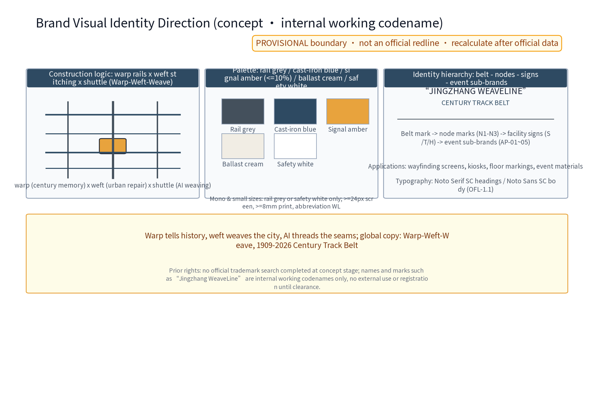
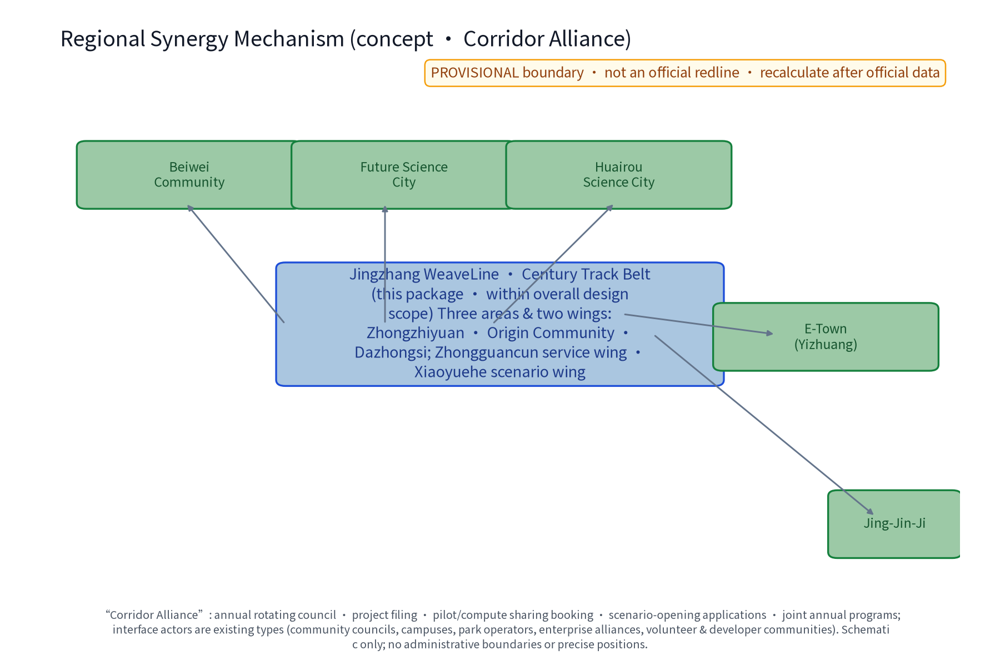
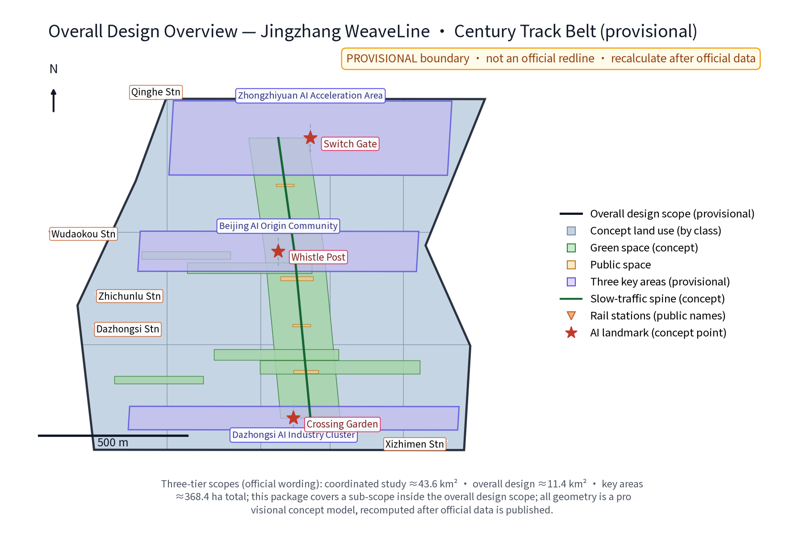
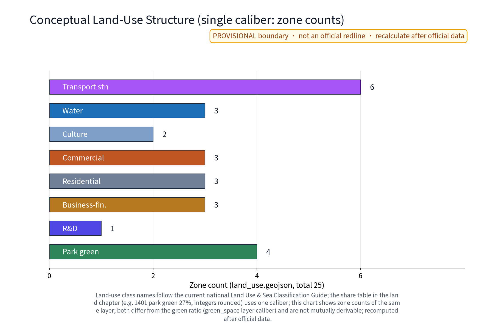
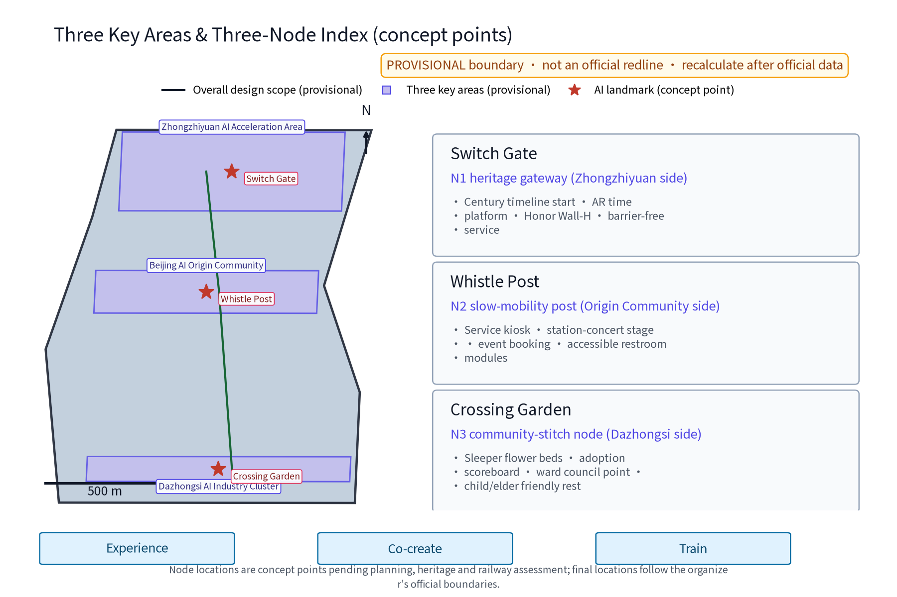
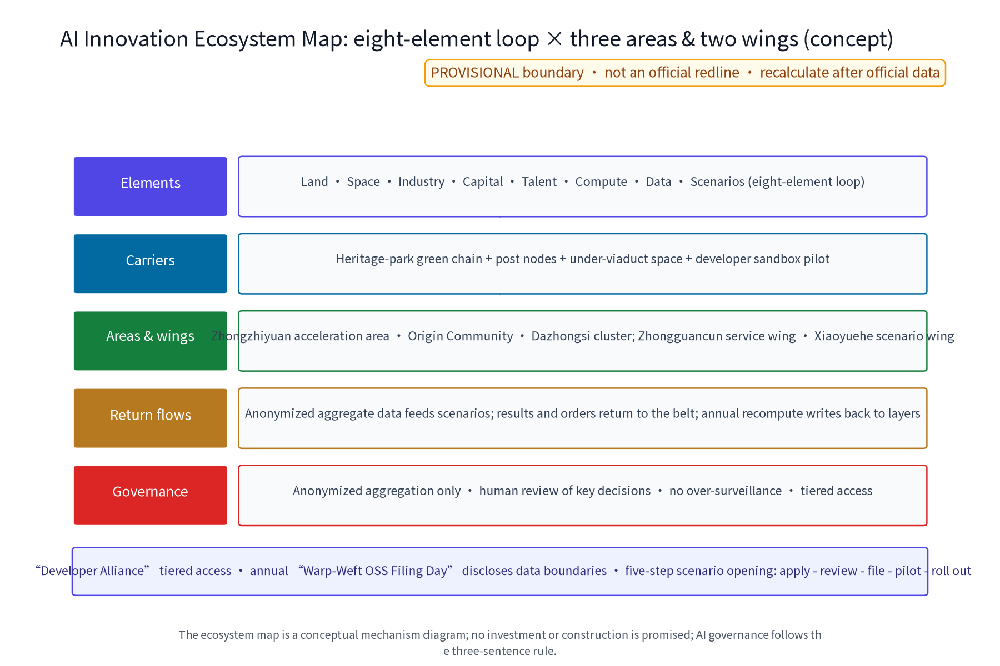
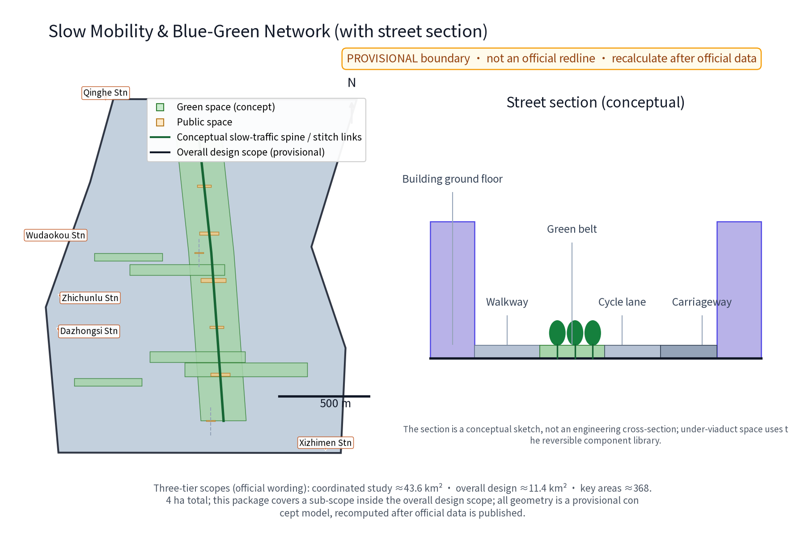
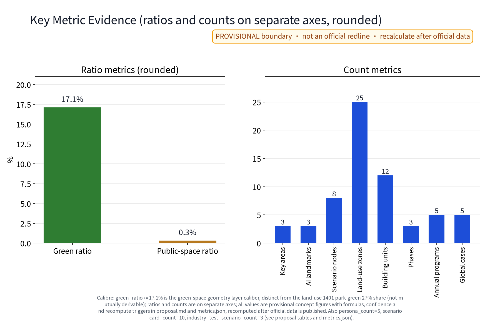

# JINGZHANG WEAVELINE - CENTURY TRACK BELT (Concept)

**Overall Concept (Proposal Name and Intent)**

The primary name is "经纬京张 · 百年轨带", English name Jingzhang WeaveLine · Century Track Belt. The concept takes the Jingzhang Railway Heritage Park as the warp line carrying century-old memory and the slow-traffic spine; east-west street stitching links as the weft line weaving communities, campuses and innovation spaces; and AI as the new shuttle weaving three overlapping belts at the crossings: the Centennial Jingzhang Cultural Belt, the Urban AI Life Experience Belt, and the AI-Convergence Innovation Belt. The three positionings, five functions and the three-area/two-wing layout are all organized within the weave framework - warp through history, weft through the city, AI as the stitching thread. Three original concept nodes run along the belt: Daocha Gate (heritage culture gateway), Whistle Post (slow-traffic vitality post) and Crossing Garden (community stitching node). All areas follow official text values only; all geometry is conceptual and carries no statutory planning conclusion. This proposal is a concept suggestion and reference scheme, not a decided commitment.

## Design Basis and Source List

The basis includes: (1) the organizer's call-for-proposals announcement and taskbook with official text scope values - coordinated research area about 43.6 km2, overall design area about 11.4 km2, and key areas totaling about 368.4 ha (Zhongzhiyuan AI Acceleration Area about 192.1 ha, Beijing AI Origin Community about 104.3 ha, Dazhongsi AI Industry Cluster about 72.0 ha); (2) the open-city-ai/haidian open repository; (3) verifiable public history entries for the Jingzhang Railway (start of construction 1905, opening 1909; sourced through the publicly verifiable encyclopedia entries DATA-SRC-HISTORY-JZ-WIKIPEDIA and DATA-SRC-HISTORY-JEME-WIKIPEDIA in sources.json, cited as fact anchors, not authoritative historiography); (4) real corridor anchors - Qinghe, Shangdi/Zhongguancun Software Park, Zhichun Road, Zhongguancun Avenue and Xueyuan Road - as spatial narrative anchors. Important statement: the organizer has not released official boundary polygons; all geometry in this package is provisional, areas are labeled with their caliber, and everything will be recalculated after official data is released. [source:DATA-SRC-OFFICIAL-ANNOUNCEMENT] [source:DATA-SRC-HISTORY-JZ-WIKIPEDIA]

### Brand Identity and Visual Direction (Concept)

The concept mark (logo-weaveline.png and its English version) uses a weave motif: warp rails, weft stitching and a shuttle-shaped node, symbolizing "century memory x urban stitching x AI weaving". Construction logic: three warp rails cross four wefts orthogonally; the shuttle node sits at the crossing and the proportions reproduce on an even grid. Primary and secondary colors: rail grey #44505C (structure/text) and cast-iron blue #2E4A62 (graphic/signage) as primaries, signal amber #E8A33D as accent (no more than 10%), ballast cream #F1EDE4 and safety white as bases. Mono and small-size rules: minimum 24px on screen, 8mm in print; at that size only rail grey or safety white is used and the mark shrinks to the abbreviation WL. Wordmarks (lawful substitute fonts): Chinese display headings recommend Noto Serif SC and body text Noto Sans SC, both SIL OFL-1.1 licensed for lawful embedding and redistribution (registered as asset entries in sources.json); every figure, drawing and HTML page in this package is rendered with the local static Noto Sans SC and subset-embedded, with no remote font dependency. The Chinese name "经纬京张 · 百年轨带" and the English name Jingzhang WeaveLine · Century Track Belt may lock up stacked or horizontal; the accent color is never used in body text. Identity hierarchy vs. cultural signage, node marks and event sub-brands: belt mark (master brand, the only master mark) - node marks N1-N3 (master plus node color) - facility signage (info post-S, guide terminus-T, honor wall-H, mono only) - event sub-brands AP-01~05 (suffix lockups, small master). The international communication direction uses the warp-weft-weave narrative with the tagline "1909-2026 Century Track Belt". Until prior-rights clearance is completed, all names and marks are treated as internal working codenames and will not be used externally or registered.

### Figure and Asset Source Registration (concept materials)

All fonts, icons, base maps and generated materials are registered in sources.json with origin and license: (1) Noto Sans SC and Noto Serif SC - SIL OFL-1.1, lawful embedding, subsetting and redistribution (ASSET-FONT-NOTO-SANS-SC / ASSET-FONT-NOTO-SERIF-SC); (2) rendering tool matplotlib - PSF-2.0 license (ASSET-RENDER-MATPLOTLIB); (3) figure icons and symbols are drawn programmatically or are Noto glyphs, no third-party icon packs (ASSET-ICON-NOTO-GLYPHS); (4) schematic base maps are self-produced; public street and station names are placed schematically and are not third-party map data (ASSET-BASEMAP-SCHEMATIC); (5) global cases, historical sources and legal provisions are each registered with publisher, link, date and reuse boundary. All HTML pages embed subsetted fonts and carry no remote resource dependency.

> **Evidence anchors**: [source:DATA-SRC-OFFICIAL-ANNOUNCEMENT] and [source:DATA-SRC-AGENT-TASKBOOK] (official text calibers).

## Three-Level Scope Framework

The three levels transfer outputs progressively: the coordinated research level outputs cultural-belt functions and slow-traffic network judgments that constrain the overall design level; the overall design level verifies gap connectivity, land-use compatibility and elastic indicators, then feeds detailed design of key areas. All three levels share the framework of "one axis, multiple wefts, AI as shuttle", organized as research-design-detailing rolling work, with boundaries to be rechecked once official polygons are released.

The three levels are progressive along one spine: the coordinated research scope of 43.6 km2 answers "industry and future city"; the overall design scope of 11.4 km2 answers "how to weave" through urban renewal and regulatory-plan-level urban design; the key areas totaling 368.4 ha (192.1 + 104.3 + 72.0) answer "where to place" the three-area/two-wing layout. This proposal expresses the three areas and two wings as an operating collaboration loop: the Acceleration Area (north, incubation and acceleration), the Origin Community (middle, talent and authentic community), the Industry Cluster (south, agglomeration and exhibition), with the Zhongguancun tech-service wing (services and IP) and the Xiaoyuehe scenario wing (scenarios and data) supporting both directions and rotating topics by season; the node-to-area correspondence follows the key-areas figure and the geometry layers. Regional synergy explicitly connects North Latitude Community, Future Science City, Huairou Science City, Beijing E-Town and Beijing-Tianjin-Hebei links as five weft-end coordination anchors, with an annual rotating corridor alliance mechanism. [source:DATA-SRC-AGENT-TASKBOOK]

### Agent.1-Agent.6 Response Checklist (concept)

| Requirement ID | Mandatory deliverables (taskbook) | This package's deliverables | Figure / table / section | Evidence anchors |
|---|---|---|---|---|
| agent.1 | Overall belt concept and function coordination design | WeaveLine overall concept + VI direction + three-tier structure figure | "Brand Identity and Visual Direction" section, this framework section, site-overview.png | [source:DATA-SRC-AGENT-TASKBOOK] |
| agent.2 | AI full-stack innovation system and world-class AI ecosystem design | Eight-element ecosystem loop map + 5 transferable global cases + mechanism table | "AI Innovation Ecosystem" section, ai-ecosystem-map.png, case table | [metric:global_case_count] |
| agent.3 | AI+ scenario paradigm (>=10 scenario cards, >=3 industry tests, >=5 personas) | SC-01~10 detail cards + TS-01~03 + scenario-space-operation matrix + persona table | Three tables and persona table in the AI section | [metric:scenario_card_count] |
| agent.4 | AI public space, intelligent-native formats and pilgrimage landmarks | N1-N3 spatial prototype cards + honor wall-H + reversible component library + station concerts | "Detailed Design of Key Areas" section, key-areas.png | [data:PACKAGE-GEOMETRY] |
| agent.5 | Jingzhang / Zhongguancun / AI new-culture narrative | Warp-through-history-weft-through-city-AI-stitching narrative + Century Timeline + three-tier signage + international copy | "Overall Design" and "Brand Identity" sections | [source:DATA-SRC-HISTORY-JZ-WIKIPEDIA] |
| agent.6 | Global AI innovation activity system and long-term operation | 5 annual programs + developer community + long-term operation model + implementation matrix | "Renewal Projects" section (matrix + operation model tables) | [metric:annual_program_count] |

> **Evidence anchors**: [source:DATA-SRC-AGENT-TASKBOOK] (three-tier scope follows the official text caliber).

## Coordinated Research Area: Industry and Future City Research

Industry research identifies the cultural-driven momentum along the heritage park corridor and synergy opportunities across the three areas and two wings, forming the future-city form judgment of the weave framework; future-city research is directional prediction only and constitutes no commitment on land or investment.

Coordinated research (concept, to be deepened by professional teams): the Qinghe and Shangdi/Zhongguancun Software Park cluster is imagined as a compute and algorithm coordination hub; Zhongguancun Avenue is a service corridor for incubation, finance and IP services; Xueyuan Road links universities and concept validation. The regional coordination mechanism proposes the corridor alliance: annual rotating assemblies and project-filing between the three areas, two wings and the five coordination anchors, sharing pilot-test and compute resources through existing-type actors (community assemblies, universities and institutes, park operators, enterprise alliances, volunteers and developer communities) and a "future data-compute coordination mechanism (concept, not a new government body)". Future-city research focuses on job-housing balance with 15-minute life circles, green slow commutes, and a trial-zone idea for AI-governance rule sandboxes. Outputs of this level are research frameworks and scenario reasoning; no industrial or land conclusions are preset, and no obligation or commitment to any region is created. [source:DATA-SRC-PROVISIONAL-BOUNDARIES]

### Regional Synergy Mechanism Table (concept, advisory)

| Synergy object | Exchanged resources (belt -> partner / partner -> belt) | Interface actors | Trigger | Return flow |
|---|---|---|---|---|
| North Latitude Community | Belt provides vitality venues and public-service operation experience <-> partner provides community life scenarios and anonymized usage-preference feedback | Community assembly + operation alliance | Annual rotating assembly + pre-pilot notice | Needs and opinions enter the next design round |
| Future Science City | Belt provides concept-validation scenarios and young talent <-> partner provides research and pilot-test capacity, big-facility booking windows | Universities and institutes + park operators | Pilot/compute sharing booking | Results and orders return to the belt |
| Huairou Science City | Belt provides data-labeling and evaluation collaboration slots <-> partner provides basic-research results and visiting scholars | Research platforms + developer community | Project filing + evaluation admission | Transferred projects return |
| Beijing E-Town | Belt provides AI product scenarios and demand lists <-> partner provides manufacturing conversion and supply-chain capacity | Enterprise alliance + industry service bodies | Scenario opening application | Products and orders return |
| Beijing-Tianjin-Hebei links | Belt provides headquarters innovation services and cultural IP <-> partner provides hinterland market, talent and cultural-tourism flows | Tourism and investment services + volunteer network | Annual event and brand linkage | Visitor flows and brand reach return |

> **Evidence anchors**: [source:DATA-SRC-AGENT-TASKBOOK] (regional synergy answers the taskbook's regional-coordination requirement).

## Overall Design Area: Urban Renewal and Regulatory-Plan-Level Urban Design

Overall design emphasizes low-intervention renewal and micro-renewal: functional replacement, interface upgrading and under-viaduct space transformation, with a retain-renovate-repair classification guide; regulatory indicators are only checked as recommendations without preset numeric conclusions.

The overall design takes the heritage park as the warp and east-west streets as the weft: the warp controls slow-traffic continuity, cultural narrative and low-intervention landscape; the weft controls block stitching, interfaces and under-viaduct space. Renewal follows "retain first, renovate second, demolish extremely rarely", premised on current-condition and ownership assessment. Regulatory-depth outputs (concept) include a mixed-use compatibility list, height-and-mass guidance, street-section library, and slow-traffic gap-connectivity rules; outputs are handed to professional teams, aligned with the ongoing regulatory detailed plan, and replace or prejudge no statutory planning conclusion. A Century Timeline (1905-2026-future) runs along the warp as the spatial storyline, with a three-tier signage system (info post-S, guide terminus-T, honor wall-H) at each node making the space perceptible and convertible. In the spatial relation figure, existing elements are shown as grey context, proposed elements in color and provisional boundaries with hatching; scale bar, north arrow and legend are provided, and slow-traffic gaps and rail stations are numbered and named. [source:DATA-SRC-MOHURD-CONTROL-DETAILED-PLANNING]

> **Evidence anchors**: [source:DATA-SRC-MOHURD-CONTROL-DETAILED-PLANNING], [source:DATA-SRC-PROVISIONAL-BOUNDARIES].

## Detailed Design of Key Areas

Facility siting at the three nodes is conceptual and must be relocated after heritage and railway authority assessment and professional review; the nodes form a complete spatial narrative through the weave framework, with detailed plans and sections expressed in the drawing set and geometry layers.

Three areas and two wings (official text) with three original concept nodes: (1) N1 Daocha Gate - heritage culture gateway (concept) at the north end of the belt (Acceleration Area side), origin of the Century Timeline with an AR time platform; the honor-display system (honor wall-H) sits beside the platform, presenting annual contribution lists of volunteers, adopting enterprises and history researchers; (2) N2 Whistle Post - slow-traffic vitality post (concept) at the mid-traffic segment (Origin Community side), with slow-mobility services, event booking and a station concert stage, operating under the concert rotation mechanism; (3) N3 Crossing Garden - community stitching node (concept) in the south residential segment (Industry Cluster side), stitching both sides through the former crossing imagery, with a Weave Assembly point and an adoption-points board. All three nodes share the reversible public-space component library: modular benches, sleeper planters, canopies and info posts are detachable installations arranged through track-mark points and rotation. Accessibility follows an all-age, elderly-friendly and child-friendly design checklist (concept), with wheelchair turning circles and low service counters at key points. [data:PACKAGE-GEOMETRY]

### Three-Node Spatial Prototype Cards (concept)

| Node | Suitable space type | Core components | Day/night use | Cultural narrative | AI interaction | Accessibility | Reversible installation |
|---|---|---|---|---|---|---|---|
| N1 Daocha Gate | Heritage park north gateway plaza and platform culture grounds | Timeline origin engraving, AR time platform, honor wall-H, reversible canopy and info post-S | Day: tours and archive access; night: timeline lighting and AR time show | Starting point of the 1905 start - 1909 opening narrative | AR history guide (historian review), booking-based flow, on-device rendering | Wheelchair turning circle, low counter, voice/tactile guidance with human option | Modular platform and canopy, relocatable |
| N2 Whistle Post | Slow-traffic service post with small performance grounds at mid-flow | Service pavilion, station-concert stage, booking screen, water/infant-care/accessible restroom module | Day: supply and bike service; night: seasonal concerts and open days | Whistle motif: train arrival-departure memory vs contemporary city sound | Event booking and time-slot flow control; edge anonymized crowd aggregation (human review) | Low counter, step-free routes, AED and staffed service | Container-module pavilion and stage, withdrawable to public facility |
| N3 Crossing Garden | Community garden on the former crossing image in the south residential segment | Sleeper planters, adoption-points board, Weave Assembly point, child-friendly play corner, elderly rest zone | Day: garden care, play and rest; night: tiered lighting with quiet hours | Crossing memory: everyday life where railway and street once crossed | Adoption points (human-reviewed), maintenance reminders; no individual tracking | All-age accessible loop, low planters, non-digital sign-up | Sleeper-module planters and facilities, rotated by points |

> **Evidence anchors**: [data:PACKAGE-GEOMETRY] (node polygons from geometry/key_areas.geojson).

## AI Innovation Ecosystem, Personas, and AI+ Scenarios

The AI innovation ecosystem (concept) proposes an eight-element loop of land-space-industry-funding-talent-compute-data-scenario: land and space carry scenarios, industry and funding drive iteration, talent and compute support R&D, and data feeds back through anonymized aggregation - an ecosystem map (ai-ecosystem-map.en.png). Five personas (concept, persona_count=5): P-A commuter & developer, P-B researcher & engineer, P-C entrepreneur & operator, P-D resident & all-age family, P-E visitor & learner, forming a composite of daytime industry flow, evening life flow and holiday visitors. AI governance keeps three sentences: anonymized aggregation only, human review of key decisions, and no over-monitoring; personal-level data never leaves the local site, no always-on recognition devices, no individual-identifying tracking, and no behavior profiling. AI technical protocols (concept): model evaluation, data quality, error stratification, runtime monitoring and benchmark tests as five gates; TS-01 to TS-03 go live in tiers after evaluation, and when false-positive rates exceed limits the system is human-reviewed and paused. [source:DATA-SRC-GENERATIVE-AI-INTERIM-MEASURES]

Five sourced global ecosystem cases with transferable mechanisms (see sources.json):

| Case ID | Case name | Location | Mechanism insight | Transferable mechanism (this belt analogy) | Source |
|---|---|---|---|---|---|
| C1 | The High Line | New York, USA | Abandoned freight rail converted to a linear park; long-term maintenance, operation and art programming by a community non-profit | Green-chain operator + annual public-art rotation (analogy AP-01/03) | thehighline.org |
| C2 | Punggol Digital District | Singapore | Industry park plus an Open Digital Platform, with industry-academia co-testing | Scenario sandbox + open APIs + tiered evaluation admission (analogy SC-10/TS-01) | jtc.gov.sg |
| C3 | Pangyo Techno Valley | Gyeonggi, Korea | Government-led cluster with startup campus and public support agencies | Incubation area + rotating service alliance (analogy Acceleration Area) | pangyotechnovalley.org |
| C4 | Toronto Quayside (terminated) | Canada | Smart-community pilot terminated over funding and governance disputes | Pilots must embed exit criteria, stop conditions and privacy boundaries (analogy P1-P6 risk gates) | sidewalkslab/waterfrontoronto |
| C5 | Promenade Plantee / Coulee verte | Paris, France | Rail greenway plus craft arcades (Viaduc des Arts) beneath the viaduct; public and commercial co-care | Merchant covenant and time-sharing under-viaduct opening (analogy P3/SC-08) | paris.fr |

### Ecosystem Mechanism Table: Eight Elements in the Three-Area/Two-Wing Loop (concept)

| Element | Carrier in this belt | Three-area/two-wing placement | Return flow |
|---|---|---|---|
| Land | Provisional land-use structure of the overall design (single caliber) | Acceleration Area (industry-led) | Annual recalculation writes back to the land_use layer |
| Space | 8 public-space nodes (3 nodes + 5 scenario nodes) | Balanced across the three areas | Scenario-card mapping and operation rotation |
| Industry | Incubation-acceleration and agglomeration-display mechanisms | Acceleration Area + Industry Cluster | Enterprise residency and scenario opening applications |
| Funding | Renewal fund and social-capital participation (concept) | Two-wing services and pilot packages | Pilot evaluation gates release the next package |
| Talent | Five personas + developer community | Origin Community | Event to residency to testing to registration conversion |
| Compute | Compute-sharing booking (concept) | Future Science City interface | Pilot tests and evaluation admission |
| Data | Anonymized aggregated data (within boundaries) | Xiaoyuehe wing | Feeds back to scenario optimization and recalculation |
| Scenario | Scenario cards SC-01~10 | Three areas, two wings, full corridor | Demand and operation feedback returns |

### Five Personas and Service Journeys (concept)

| Persona ID | Persona name | Main time window and purpose | Spatial barriers | Digital barriers | Accessibility needs | Human / non-digital alternatives | Verifiable experience metrics |
|---|---|---|---|---|---|---|---|
| P-A | Commuter & developer | Peak-hour commuting and midday rest | Gap detours, dim under-viaducts | Low (terminal-fluent) | None specific | Phone inquiry, on-site desk | Slow-through rate, post usage |
| P-B | Researcher & engineer | Weekday residency and result display | Insufficient exhibition space | Low | Wheelchair access | Booked human tours | Archive search volume |
| P-C | Entrepreneur & operator | Residency talks and event operation | Insufficient flexible venues | Medium (multi-platform) | None specific | Offline filing counter | Scenario application count |
| P-D | Resident & all-age family | Morning/evening exercise, school runs, weekend leisure | Crossing difficulties, weak night lighting | Higher for seniors | Elderly rest, child care, wheelchair access | Phone/on-site staff, volunteer escort | Garden adoption, event participation, complaint response |
| P-E | Visitor & learner | Holiday sightseeing and study visits | Wayfinding, lack of location info | Medium (multilingual UI gaps) | Multilingual guides, accessible walking | Human guides, paper leaflets | Guide volume, accessible-path condition |

### Scenario Card Details (nine elements per card, concept)

| Card ID | User | Location type | Input data | AI capability | Human fallback | Failure mode | Operator | Exit mode | Evaluation metric |
|---|---|---|---|---|---|---|---|---|---|
| SC-01 | Visitors, students | N1 platform | Booking slots, on-device position | AR history overlay and viewing-path recommendation | Historian content review; human guides replace | AR drift -> human tours | Ops alliance + university volunteers | AR off, physical guide remains | AR session count, tour satisfaction |
| SC-02 | Seniors, disabled users | Full corridor | Escort request (explicit consent) | Accessible-route recommendation | Volunteer escort service | Terminal offline -> phone channel | Volunteer alliance | Consent can exit anytime | Escort response time, exit ease |
| SC-03 | Operators, public | N2 and concerts | Edge crowd counts (anonymized) | Density estimation and flow-control suggestion | Operators review dispatch orders | False-positive above limit -> automation paused | Operator + street | Sensing paused | False-positive rate, review rate |
| SC-04 | Commuters, white-collar | Gaps and under-viaducts | Bike booking, vehicle status | Dispatch suggestion and maintenance reminders | Manual dispatch and repair | Single-point failure -> nearby manual bays | Bike firms + posts | Withdraw to public facility | Turnover rate, fault response |
| SC-05 | Residents, youth | N2 Whistle Post | Event booking, time preferences | Time-slot flow control and seating suggestion | On-site manual check-in | Booking system failure -> on-site sign-in | Ops alliance | Booking mechanism cancelled | Event count, no-show rate |
| SC-06 | Researchers, visitors | N1 Daocha Gate | Archive queries | Source retrieval and timeline mapping | Historian review | Out-of-bound materials -> refused display | Archive body + volunteers | Material updates stopped | Search volume, review rate |
| SC-07 | Seniors, children, families | N3 Crossing Garden | Adoption applications, care check-ins | Points calculation and care reminders | Points issuance human-reviewed | Check-in misreads -> paper registry | Weave Assembly | Abandonment above threshold -> custody rotated | Garden count, points activity |
| SC-08 | Residents, merchants | Weft under-viaducts | Time-slot occupancy applications | Time-sharing schedule | Merchant covenant co-management | Occupancy conflict -> human mediation | Merchant alliance | Covenant breach -> opening stopped | Activation rate, covenant compliance |
| SC-09 | Youth, commuters | Full corridor | Run/ride club registration | Tiered leader and route suggestion | Volunteer coaching | Bad weather -> reschedule | Volunteer clubs | Tier insufficient -> club suspended | Registration, safety incidents |
| SC-10 | Developers, enterprises | Pilot segments | Sandbox API requests | Tiered evaluation admission | Key decisions human-reviewed | Data breach -> immediate revocation | Developer alliance | Repeated failure -> access revoked | Sandbox projects, admission compliance |

### Industry Test and Validation Scenarios (3, concept)

| Test ID | Industry test scenario | Input and evaluation data | Evaluation and admission | Human fallback | Pause / exit condition | Participants |
|---|---|---|---|---|---|---|
| TS-01 | Post crowd-sensing model evaluation | Edge anonymized counts + benchmark datasets | Tiered go-live after false-positive/benchmark/data-quality and error-stratification gates | Operators review dispatch orders | False-positive continuously above limit -> tiered pause | Operators + universities |
| TS-02 | AR content source verification | Source entries + copyright registry | Go-live after provenance and copyright verification, reviewed by historians | Historian final review | Unclear source boundary -> not exhibited | Historians + developers |
| TS-03 | Accessible accompaniment drill | Route survey + volunteer drill records | Go-live after all-age/barrier-free path survey and drills | Street and volunteer on-site supervision | Non-compliant routes -> retest after adjustment | Streets + volunteer alliance |

Scenario-space-operation matrix (concept, IDs anchored to metrics.json): the ten scenario cards (SC-01~10, matching scenario_card_count) map onto eight space nodes (geometry/public_space.geojson, matching scenario_node_count); operation mechanisms are tiered into four types (booking/rotation/covenant/points) with three participation bodies (resident volunteers, enterprise operators, university researchers). Count anchors: persona_count=5 (objects P-A~P-E, persona journeys table), global_case_count=5 (objects C1~C5, case table and sources.json), industry_test_scenario_count=3 (objects TS-01~03, table above), annual_program_count=5 (objects AP-01~05, implementation section) - every count has a one-to-one verifiable table in the text.

AI scenario domains cover all six: AI transport (bike dispatch, crowd sensing), AI industry (corridor posts and retail operation), AI space (under-viaduct and slow-mobility posts), AI public services (accessible accompaniment, event booking), AI culture (AR time narrative, station concerts) and AI governance (time-slot flow control, human review), all backed by human review. A developer community (concept) will build a developer alliance at the pilot segment, opening sandbox interfaces with tiered access passes and holding an annual open-source filing day that discloses data-use boundaries. The AR time narrative's historical material is bounded by the two registered public history entries in sources.json (cultural-narrative material only, not authoritative historiography) and must be rechecked by professional historical institutions before formal display. [metric:global_case_count] [metric:persona_count] [metric:scenario_card_count]

> **Evidence anchors**: [source:DATA-SRC-GENERATIVE-AI-INTERIM-MEASURES], [source:DATA-SRC-HISTORY-JZ-WIKIPEDIA], [metric:global_case_count].

## Land Use, Building Scale, and Retain-Renovate-Demolish Strategy

The retain-renovate-demolish strategy orders retain-first: historical structures and buildings in good condition are registered and kept as much as possible; demolition is only argued case-by-case for dangerous buildings or the very few buildings seriously blocking slow-traffic continuity; all areas are conceptual caliber and recalculated when official data is released.

Land use (concept, single caliber): percentages below are computed as the intersection of each land_use code with the site divided by the full site area (EPSG:4548 projection), rounded to integer percent, totaling about 100%; this differs from green_ratio (17.1%, green_space layer: green polygon area / site area) and public_space_ratio (about 0.3%, public_space layer: the small node-scale polygons of 3 concept nodes and 5 AI scenario nodes / site area, excluding large park areas and reflecting node-level small public-space share) - these are different layer calibers with the same denominator but different meanings, never to be added together; recalculation with the same denominator follows official boundary and control data. Display-precision rules (concept): official text values keep one decimal place; low-confidence geometry-derived indicators keep one to two decimal places only; no unsupported multi-digit precise values appear, and mixed-unit charts are split with units stated. Building scale: based on the current building stock, increments are released mainly through renewal activation and functional replacement; site-specific figures require survey and special assessment, and this proposal gives no estimate. Retain-renovate-demolish (concept): retain - register historical structures and good-condition buildings; renovate - function and interface upgrading; demolish - limited to dangerous buildings and the very few blocking slow traffic, argued case by case. All of the above are reference schemes. [source:DATA-SRC-MNR-LAND-USE-CLASSIFICATION-202311]

| Land code | Land use | Share (single caliber) |
|---|---|---|
| 1401 | Park green | 27% |
| 0802 | R&D/science | 17% |
| 0902 | Business/finance | 15% |
| 0701 | Residential | 14% |
| 0901 | Commercial | 13% |
| 0803 | Culture | 8% |
| 16 | Water | 4% |
| 1207 | Transport station | 2% |

> **Evidence anchors**: [source:DATA-SRC-MNR-LAND-USE-CLASSIFICATION-202311] (land-use names follow the current national classification).

## Transport, Rail, Municipal Infrastructure, and Public Services

Slow traffic uses the heritage park as the north-south spine, with bridges, underpasses and under-viaduct space connecting gaps; municipal works combine sponge linear green belts and rain gardens; public services integrate toilets, water, infant care, accessibility, AEDs and bike sharing in the post network, with human review of every AI decision.

Slow traffic: the heritage park is the north-south spine; crossings and gaps are connected with pedestrian bridges, underpasses and under-viaduct space, and east-west wefts link the communities on both sides. Rail interchange (concept): strengthen walking interchange with the existing public stations - Qinghe, Shangdi, Zhichun Road - and the Jingzhang HSR Qinghe station, with reserved weather-protected corridors and accessible ramps. Municipal: sponge linear green belts, rain gardens and resilient disaster-prevention corridors. Public services: the post network integrates toilets, water, infant care, accessibility, AEDs and bike sharing, laid out by slow-traffic accessibility; the about-400m service radius is a conceptual indicator to be verified; non-digital channels (phone and on-site human service) cover seniors and disabled users who do not use smart terminals. All are reference schemes.

| Gap / interchange | Location type (concept) | Facility suggestion | Priority scenario |
|---|---|---|---|
| North gap | Crossing between Qinghe and Shangdi stations | Pedestrian bridge + weather-protected corridor | Commuting and HSR peak |
| Middle gap | Crossing near Zhichun Road / Xueyuan Road | Underpass + signal optimization | Metro transfer and midday flow |
| South gap | Under-viaduct space near Dazhongsi | Under-viaduct use + time-sharing | Commercial and event flows |

> **Evidence anchors**: [source:DATA-SRC-MOHURD-URBAN-DESIGN-MEASURES] (method reference for municipal and slow-traffic statements).

## Blue-Green Network, Public Space, and Urban Character

The blue-green network integrates the heritage park green chain, community garden green knots and the Xiaoyuehe green webs; track memory, sleeper paving and the Century Timeline shape the narrative; facilities embed along the corridor as modular and reversible elements, with restrained character expressed through material palettes and tiered lighting guides.

Blue-green space: the heritage park is the green-chain spine, flanked by community gardens and pocket parks as green knots (green_space layer, 17.1% caliber), and the Xiaoyuehe wing combines waterfront green webs (concept). Low-intervention landscape and cultural expression (concept): track memory - registered preservation of rail, track bed, signals and station remnants; sleeper paving - recycled sleepers for paving, benches and planter borders; Century Timeline - year markers from 1905 into the future along the corridor. Public space (concept): all public spaces remain open and shared, with accessible circulation rings, elderly-friendly rest zones and child-friendly play corners, priority points for vulnerable groups, and annual disclosure boards for use rules. Character: a material palette of "steel rail, ballast, brick, cast iron" with tiered color and lighting guides, avoiding over-parkification and light pollution. All are reference schemes. [source:DATA-SRC-MOHURD-URBAN-DESIGN-MEASURES]

> **Evidence anchors**: [source:DATA-SRC-MOHURD-URBAN-DESIGN-MEASURES] (method reference for blue-green organization).

## Renewal Projects, Implementation Policy, and Phasing

The three-phase project list (near 1-3 / mid 3-5 / far 5-10 years) is reorganized into six dependency-based pilot packages (P1-P6); scale and investment estimates are advisory only (costs are qualitative low/medium/high tiers with estimation method, price base, inclusion scope, confidence level and recalculation trigger columns); policy suggestions (micro-renewal list system, responsible planner and community co-governance, renewal fund) constitute no government or operator commitment.

Implementation matrix (concept; roles per RACI: lead is R/A, collaborate is C/I; cost tiers are qualitative low/medium/high; estimation method: analogy with similar projects; price base: 2026; scope: construction and annual operation; confidence: low; recalculated after official data):

| Pilot | Phase | Preconditions | Responsible/collaborating actors | Deliverables | Cost tier | Data needs | Acceptance KPIs | Risk gate | Stop / rollback |
|---|---|---|---|---|---|---|---|---|---|
| P1 Gateway demo | 1-3 yrs | Heritage/rail assessment passed | District platform company (concept, R/A); heritage/rail authorities, planner team, community assembly (C/I) | Gateway paving, AR time platform, honor wall-H, timeline origin | Medium | Source entries, anonymized booking/crowd aggregation | Slow-through rate, AR sessions, content-review pass | Assessment fails | Degrade to plain paving |
| P2 Three slow-mobility posts | 1-3 yrs | P1 siting approved, ownership confirmed | Corridor operator (concept, R/A); street, volunteer alliance, bike firms (C/I) | 3 posts incl. accessible and infant-care modules | Low-Med | Booking data, edge anonymized crowd | 3 posts covered, escort response time | Flow or operation fail | Withdraw to public facility |
| P3 Gap links & under-viaducts | 3-5 yrs | P1/P2 alignment, rail-authority consultation | District transport (concept, R/A); rail authority, merchant alliance, design team (C/I) | Bridges/underpasses, activated under-viaducts | Medium | Section and signal data (to be surveyed) | Gaps connected, activation rate | Rail safety assessment | Stop or realign |
| P4 Garden network | 3-5 yrs | P3 stitching done | Weave Assembly (co-governance, R/A); street, university volunteers, adopting firms (C/I) | Community gardens + pocket park network | Low | Anonymized adoption/care check-ins | Garden count, points activity | Care gaps | Custody rotated |
| P5 AI trial zone & sandbox | 5-10 yrs | P1-P4 data, evaluation admission | District data + Developer Alliance (concept, R/A); universities, firms, filing bodies (C/I) | Data sandbox + trial zone | Med-High | Anonymized aggregates, benchmark sets | Anonymity 100%, false-positive rate, review rate | Consecutive failed evaluations | Tiered pause to stop |
| P6 Event system | 1-10 yrs | P1-P5 progressively ready | Ops alliance + responsible planner (concept, R/A); volunteers, merchants, developer community (C/I) | 5 annual programs + booking mechanism | Low | Booking and participation anonymized stats | Events per year, non-digital channel count | Sustained low participation | Rotate or stop |

### Long-Term Operation Model (agent.6, concept)

| Module | Mechanism and flow | Responsible actors | Ongoing KPIs | Annual rhythm |
|---|---|---|---|---|
| Annual program brands | AP-01~05 run on booking/rotation/points mechanics; annual calendar disclosed | Ops alliance + volunteers | Event count, non-digital channels | Spring walk -> summer concerts -> autumn art week -> winter review |
| Developer community | Developer alliance tiered admission; annual open-source filing day discloses data boundaries | Developers + universities + firms | Sandbox projects, filing compliance | Quarterly evaluation + annual filing day |
| AI scenario opening & review | Apply -> evaluate -> go live -> human review -> annual recalculation | Data-compute coordination mechanism (concept) + network filing bodies | Evaluation pass rate, human review rate | Rolling applications, annual recalculation |
| Public-space care | Merchant covenant + volunteer roster + fault response; takeover on care gaps | Streets + merchants + volunteers | Response time, takeover count | Monthly rotation + annual disclosure |
| International outreach | Warp-Weft-Weave bilingual narrative; English pages and drawing set updated together | Ops alliance + university international offices | Bilingual content refresh rate | Synchronized with annual programs |
| Talent/enterprise/developer conversion | Booking-based full journey: event -> residency -> testing -> registration | Park operators + incubators | Conversion funnel touchpoints | Post-season evaluation |

### Community Participation and Redress Loop (concept)

| Step | Mechanism | Responsible actors | Non-digital channels | Cycle |
|---|---|---|---|---|
| Needs collection | Annual disclosure board + Weave Assembly point + online survey | Community assembly | Suggestion box and on-site registration | Annual + event-triggered |
| Co-creation review | Co-design sessions with resident representatives; comments enter revisions | Responsible planner team | On-site posting + human briefing | Before each design round |
| Pilot notice | Written notice before pilots, incl. AI sensing scope and data-handling boundary | Street + operator | Notice board + public talks | Before pilot start |
| Consent / exit | Explicit consent; exit anytime stops processing | Volunteers + service desks | Paper registry | Any time |
| Complaint / correction | 7-day response and correction (concept timeline); human service fallback | Ops alliance | Hotline + on-site records | Any time + monthly summary |
| Feedback into next round | Evaluation reports and design revisions enter the registry; annual disclosure | Responsible planner + assembly | Public annual report | Annual |

Five annual program brands (concept):

| Activity ID | Annual program | Time & mechanism | Participants |
|---|---|---|---|
| AP-01 | Heritage Walk Season | Spring, booked tours with historian guides | Visitors, universities |
| AP-02 | Station Concerts | Seasonal concerts + monthly open days, booked | Youth, residents |
| AP-03 | Track-Memory Art Week | Autumn, creation and exhibitions | Artists, developers |
| AP-04 | Community Garden Day | Annual, points exchange and results disclosure | Families, seniors |
| AP-05 | Slow-Ride Sundays | Sundays, volunteer-paced rides | Commuters, families |

Implementation policy (concept): government coordination, enterprise participation, university and research collaboration, community co-governance with the responsible planner system, volunteer and professional-team evaluation, micro-renewal list system, renewal fund and social-capital participation; pilots come first - P1 and P2 are the near-term pilot areas, running a pilot-evaluate-expand cycle, entering the next package only when evaluation passes, and following the stop/rollback conditions in the matrix otherwise. [source:DATA-SRC-AGENT-TASKBOOK]

> **Evidence anchors**: [source:DATA-SRC-AGENT-TASKBOOK] (phasing and implementation items match the taskbook).

## Metrics, Area Recalculation, and Compliance Matrix

A three-layer conceptual indicator system of target-indicator-verification enters metrics.json; area recalculation uses this package's provisional geometry as its base and recalculates as a whole, with version labeling, once official data arrives.

Indicator system (conceptual targets, non-statutory): every indicator carries data source, formula, confidence level, use limit and recalculation trigger. Area recalculation: 43.6 km2 and 11.4 km2 are official text calibers; the three key areas total 192.1 + 104.3 + 72.0 = 368.4 ha, consistent with the official 368.4 ha aggregate; this package's overall-design geometry is about 1,141 ha (provisional, about 11.41 km2), basically consistent with the official text caliber of 11.4 km2; the official boundary polygon prevails. Caliber and precision notes: the land-use pie chart uses the land_use single caliber (integer percent); green_ratio = 17.1% is the green_space layer caliber and public_space_ratio = about 0.3% is the node-scale small public-space layer caliber - same denominator, different layers, different meanings, understood per the land-use section when listed together; provisional values are always displayed at reduced precision per confidence (one decimal for official text calibers, one to two decimals for geometry-derived indicators), with no unsupported multi-digit precise numbers. Compliance matrix: three positionings x five functions x proposal sections are mapped item by item, with geometry explicitly provisional and containing no statutory conclusion. [metric:green_ratio]

| Metric name | Data source | Formula | Confidence | Use limit | Recalculate trigger |
|---|---|---|---|---|---|
| site_area_sqm | geometry/site_boundary.geojson | polygon_area(EPSG:4548) | medium | Concept only, not a redline | Official boundary |
| green_ratio | geometry/green_space.geojson | green area / site area | low | Analysis caliber only | Official geometry |
| public_space_ratio | geometry/public_space.geojson | public-space area / site area (node-scale layer) | low | Analysis caliber only; excludes large parks | Official geometry |
| scenario_node_count | geometry/public_space.geojson | node feature count | high | Maps to SC-01~10 | Official geometry |
| global_case_count | proposal.md + sources.json | sourced case count (objects C1~C5) | high | Cases as mechanism reference only | New evidence |

> **Evidence anchors**: [metric:green_ratio], [metric:public_space_ratio]
> **Evidence anchors**: [metric:site_area_sqm], [data:PACKAGE-GEOMETRY].

## Risk, Copyright, and Compliance

This proposal is conceptual research and design; it constitutes no basis for administrative approval; before formal implementation, heritage and railway authority assessment, gap-facility approval and safety assessment are required.

Risks: the official boundary polygon is not released, so all geometry and siting carry recheck risk and area-caliber differences are settled by final text; renewal touches ownership, heritage protection and railway safety setbacks and requires special assessment; crowd sensing, if deployed improperly, invites privacy disputes, hence the rules of anonymized aggregation only, human review on key decisions, no over-monitoring and no individual-identifying tracking; every pilot package has exit and stop conditions; operating costs are qualitative low/medium/high tiers only (estimation method: analogy with similar projects; price base: 2026; scope: construction and annual operation; confidence: low; recalculated when official data is released). History and material sources: the factual layer of the 1905 start, the 1909 opening and the AR history narrative is anchored to the registered public history entries in sources.json (publisher: a verifiable public encyclopedia; link and access dates registered; license CC BY-SA 4.0; reuse boundary: fact checking, not authoritative historiography), rechecked by professional historical institutions before formal display; all fonts (Noto Sans/Serif SC, SIL OFL-1.1), the rendering tool (matplotlib, PSF-2.0), schematic base maps (self-produced) and icon glyphs are registered in sources.json with origin, author, license and limits - no unregistered material is used. Copyright: this proposal is original; the primary name, English name, node names, mechanism names and related graphics belong to the author, subject to the open-city-ai/haidian open-source agreement and the call rules, with public historical facts cited. Brand prior-rights and use boundary: no official trademark clearance search has been completed at the concept stage; names and marks including "经纬京张", Jingzhang WeaveLine, Daocha Gate, Whistle Post and Crossing Garden are internal working codenames only - no external use or registration until clearance is completed. Compliance: this proposal is a concept scheme only, replacing no statutory plan and creating no approval effect; personal privacy and data handling follow the minimum-necessity principle, with reference to the corresponding boundary statements of the Personal Information Protection Law, the Data Security Law and the Interim Measures for Generative AI Services (non-generative sensing systems are outside the Measures' generative scope; only its content-governance and human-handling spirit is referenced). [source:DATA-SRC-OFFICIAL-ANNOUNCEMENT] [source:DATA-SRC-HISTORY-JZ-WIKIPEDIA]

> **Evidence anchors**: [source:DATA-SRC-OFFICIAL-ANNOUNCEMENT] (call rules are the basis for ownership and compliance statements).

## References

References follow the official published versions; sources.json in this package registers 23 verifiable entries (including 7 new history and material entries) and fabricates no official data or links; every global case, historical source, font/asset and legal entry carries publisher, URL, access date and reuse boundary.

Items: (1) the call-for-proposals announcement, the design taskbook and official text scope data (organizer-published); (2) the open-city-ai/haidian open repository; (3) verifiable public history entries for the Jingzhang Railway (start 1905, opening 1909 and Jeme Tien Yow's biography; encyclopedia entries DATA-SRC-HISTORY-JZ-WIKIPEDIA and DATA-SRC-HISTORY-JEME-WIKIPEDIA as fact anchors); (4) five global cases: The High Line (thehighline.org), Punggol Digital District (jtc.gov.sg), Pangyo Techno Valley (pangyotechnovalley.org), the Toronto Quayside termination case (Sidewalk Labs/Waterfront Toronto) and Promenade Plantee Paris (paris.fr), each with a transferable-mechanism note; (5) official pages of the Personal Information Protection Law, Data Security Law, Barrier-Free Environment Law and Interim Measures for Generative AI Services; (6) publicly verifiable Beijing and Haidian planning documents; (7) font and material license registration: Noto Sans SC / Noto Serif SC (SIL OFL-1.1, Google Fonts official pages), matplotlib (PSF-2.0, official license page), schematic base maps and icon glyphs (self-produced declaration, asset entries). Boundary-polygon information follows the organizer's official release. [source:DATA-SRC-OFFICIAL-ANNOUNCEMENT]

> **Evidence anchors**: [source:DATA-SRC-OFFICIAL-ANNOUNCEMENT] (the first reference is the organizer's public package).