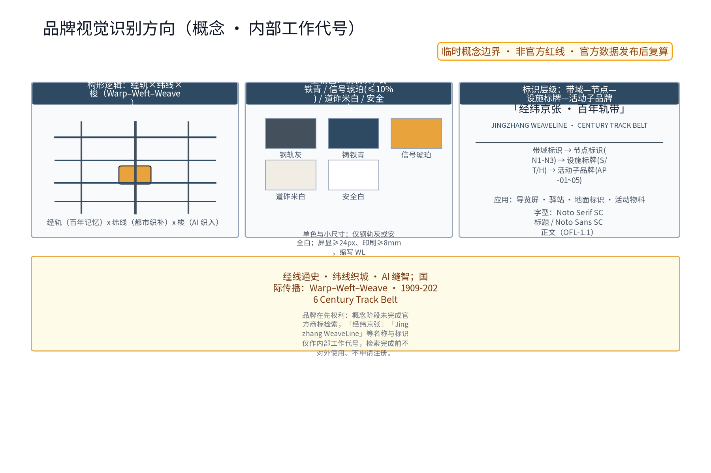
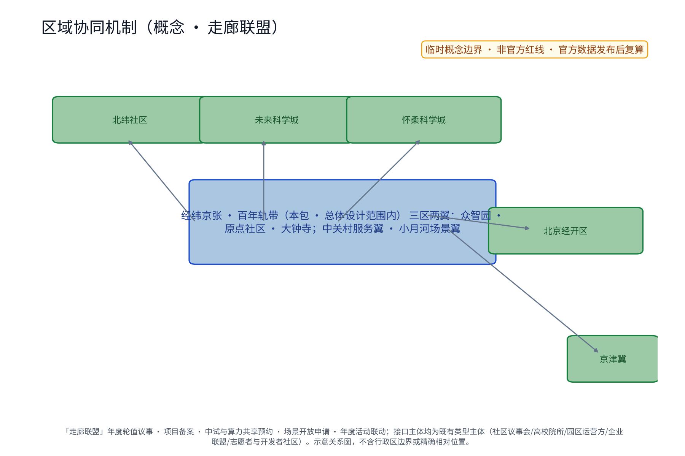
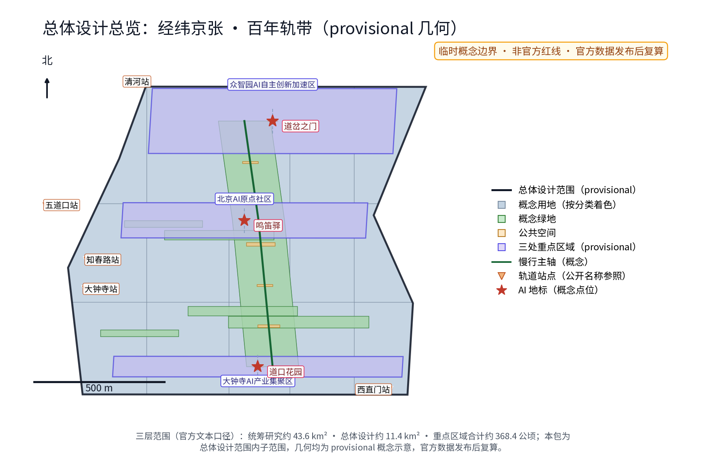
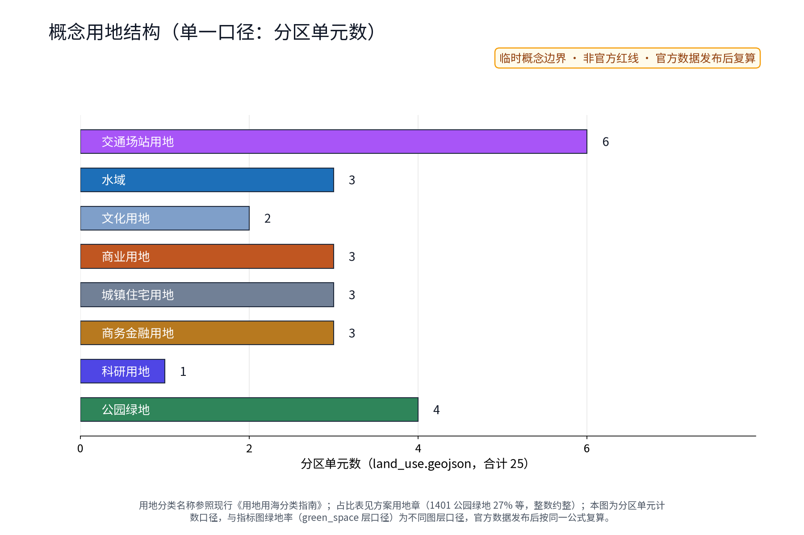
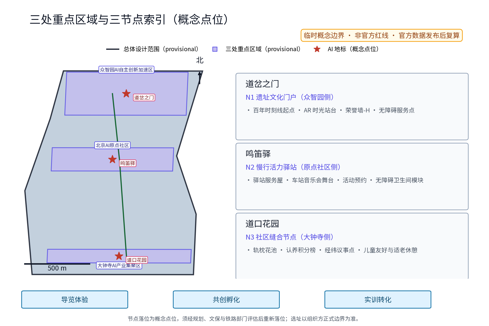
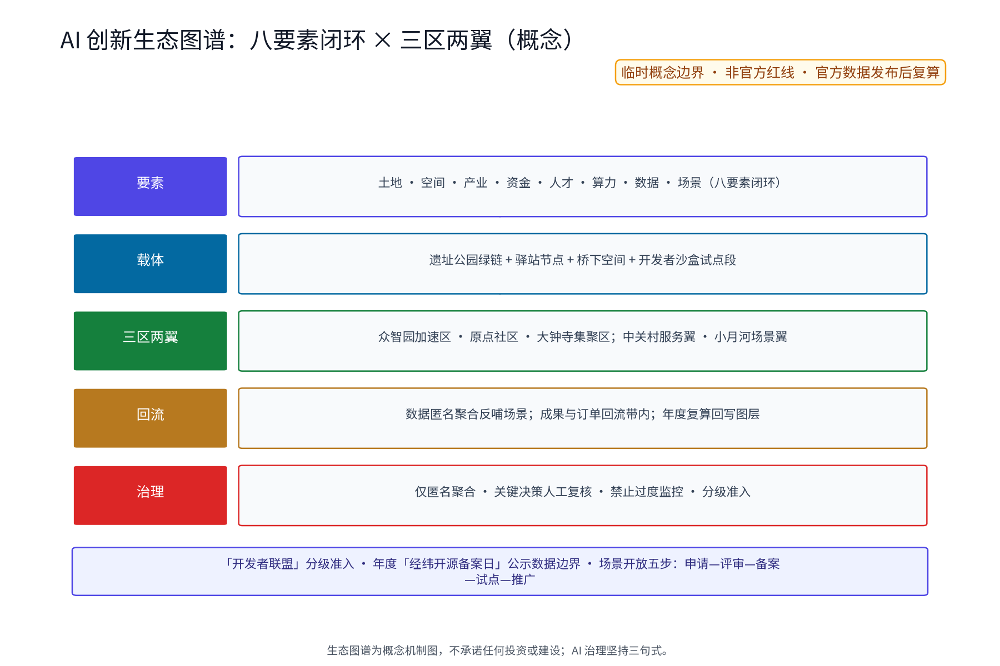
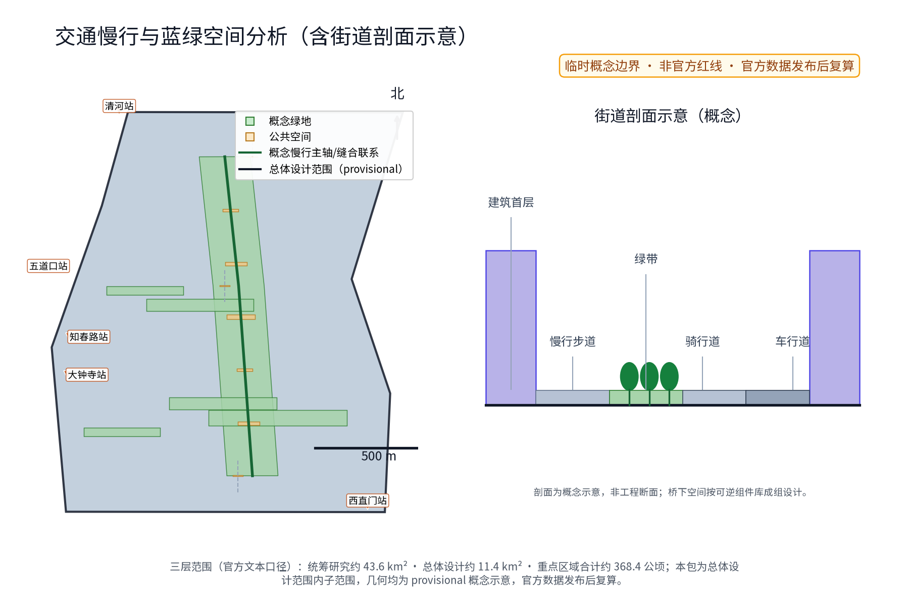
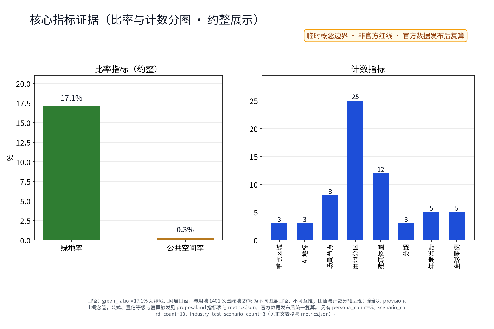

**方案名称与总体构想(概念)**

主名称「经纬京张 · 百年轨带」,英文名 Jingzhang WeaveLine · Century Track Belt。构想以京张铁路遗址公园为**经线**,承载百年记忆与慢行主轴;以东西向街区缝合通道为**纬线**,织入社区、校院与创新空间;以 AI 为新"梭",在经纬交汇处织出"百年京张文化带、都市AI生活体验带、AI融合创新带"三条叠加带。三大定位、五大功能与"三区两翼"均纳入经纬框架——经线通史、纬线织城、AI 缝智。三个原创概念节点沿带北、中、南分布:道岔之门(遗址文化门户)、鸣笛驿(慢行活力驿站)、道口花园(社区缝合节点)。全篇面积仅用官方文本口径,几何均为概念示意,不构成任何法定规划结论;本方案为概念建议与参考方案,非已确定决策。

## 设计依据与资料清单

依据:①征集公告与任务书(组织方发布,官方文本口径:统筹研究范围约43.6平方公里、总体设计范围约11.4平方公里、重点区域合计约368.4公顷,三处重点区为众智园AI自主创新加速区约192.1公顷、北京AI原点社区约104.3公顷、大钟寺AI产业集聚区约72.0公顷);②open-city-ai/haidian 开源资料库;③京张铁路公开史料条目(1905年开工、1909年通车,以维基百科公开词条为可核验锚点,来源登记见 sources.json 的 DATA-SRC-HISTORY-JZ-WIKIPEDIA 与 DATA-SRC-HISTORY-JEME-WIKIPEDIA,引用边界为事实核对而非权威史论);④沿线真实节点清河、上地/中关村软件园、知春路、中关村大街、学院路,作为空间叙事锚点。重要声明:组织方尚未发布官方边界多边形,本包几何均为 provisional,面积一律标注口径,官方数据发布后整体复算。[source:DATA-SRC-OFFICIAL-ANNOUNCEMENT] [source:DATA-SRC-HISTORY-JZ-WIKIPEDIA]

### 品牌识别与视觉方向(概念)

概念标识(logo-weaveline.png 与英文版)采用"经纬编织"几何母题:经向轨条、纬向缝合、交汇为梭形节点,寓意"百年记忆×都市织补×AI织入"。构形逻辑:三条经轨与四道纬线正交,梭形节点位于经纬交点,比例可在等分网格上复现。主辅色:钢轨灰#44505C(结构/文字)、铸铁青#2E4A62(图形/导视)为主色,信号琥珀#E8A33D为强调色(占比不超过10%),道砟米白#F1EDE4与安全白为底。单色与小尺寸规则:屏显最小24px、印刷最小8mm,此时仅用钢轨灰或安全白单色并缩为英文缩写WL。标准字(合法替代字体):中文标题建议 Noto Serif SC(思源宋体)、正文 Noto Sans SC(思源黑体),均为 SIL OFL-1.1 许可,可合法嵌入与再分发(登记见 sources.json 资产条目);本包图件、图纸与 HTML 均使用本地静态 Noto Sans SC 渲染并子集嵌入,无远程字体依赖。中文名「经纬京张·百年轨带」与英文名 Jingzhang WeaveLine · Century Track Belt 可横排或上下组合,强调色不得用于正文。标识层级与文化导视、节点标识和活动子品牌区分:带域标识(总品牌,唯一主标记)—节点标识(N1-N3,主标记+节点色)—设施标牌(信息柱-S/导览终点-T/荣誉墙-H,单色)—活动子品牌(AP-01~05,后缀式组合,主标记小号)。国际传播方向以"Warp(经)—Weft(纬)—Weave(织)"英文叙事,配合 "1909-2026 Century Track Belt" 时间口号。品牌在先权利检索未完成前,以上名称与标识均作为内部工作代号,不对外注册使用。

### 图件与素材来源登记（概念材料）

所用字体、图标、底图与生成素材均已在 sources.json 登记来源与许可:①Noto Sans SC(思源黑体)与 Noto Serif SC(思源宋体)——SIL OFL-1.1,可合法嵌入、子集化与再分发(ASSET-FONT-NOTO-SANS-SC / ASSET-FONT-NOTO-SERIF-SC);②渲染工具 matplotlib——PSF-2.0 许可(ASSET-RENDER-MATPLOTLIB);③图件图标与符号均为程序绘制或 Noto 字形,无第三方图标库(ASSET-ICON-NOTO-GLYPHS);④示意底图为程序化自产,公开路名与站名仅作示意定位,非第三方地图数据(ASSET-BASEMAP-SCHEMATIC);⑤全球案例、史料与法规条目逐条登记发布者、链接、日期与许可边界。本包 HTML 均内嵌子集化字体,无远程资源依赖。

> **证据锚点**：[source:DATA-SRC-OFFICIAL-ANNOUNCEMENT]、[source:DATA-SRC-AGENT-TASKBOOK]（组织方公告与任务书为文本口径依据）。

## 三层范围工作框架

三层成果逐级传导:统筹研究输出文化带职能与慢行网络判断,约束总体设计;总体设计校核断点连通、用地兼容与弹性指标,落实到重点区域详设。三层共享"一轴多纬、AI为梭"框架,工作组织为先研究、再设计、后深化的滚动机制,边界以官方多边形发布后校核。

三层递进、同一主轴:统筹研究范围43.6平方公里回答"产业与未来城市"之问;总体设计范围11.4平方公里以城市更新与控规深度城市设计回答"如何织"之问;重点区域合计368.4公顷(192.1+104.3+72.0)以"三区两翼"回答"何处落子"之问。本方案将三区两翼表达为运营协作环:众智园加速区(北段,主导孵化与加速)、原点社区(中段,主导人才与原真性社区)、大钟寺集聚区(南段,主导产业集聚与展示),中关村科技服务翼(服务+IP)与小月河场景赋能翼(场景+数据)双向赋能,环内按季节轮换议题;节点与区域对应关系见 key-areas 图与 geometry 层。区域协同维度明确对接北纬社区、未来科学城、怀柔科学城、北京经开区与京津冀链接,将其作为"纬线"尽端的五个协同锚点,建立「走廊联盟」年度轮值机制。[source:DATA-SRC-AGENT-TASKBOOK]

### agent.1—agent.6 任务响应核对表（概念）

| 要求ID | 必交成果（任务书） | 本包交付物 | 图/表/章节位置 | 证据锚点 |
|---|---|---|---|---|
| agent.1 | 一带总体概念与功能统筹方案设计 | 经纬京张·百年轨带总体概念+VI方向+三层总体结构图 | 「品牌识别与视觉方向」节、本框架章节、site-overview.png | [source:DATA-SRC-AGENT-TASKBOOK] |
| agent.2 | AI全栈自主创新体系与世界级AI创新生态设计 | 八要素闭环生态图谱+5项可迁移全球案例+生态机制表 | 「AI 创新生态」节、ai-ecosystem-map.png、全球案例表 | [metric:global_case_count] |
| agent.3 | AI+场景赋能新范式（≥10场景卡、≥3产业测试、≥5类画像） | SC-01~10明细卡+TS-01~03+场景-空间-运营矩阵+画像表 | 「AI 创新生态」节三张表与画像表 | [metric:scenario_card_count] |
| agent.4 | AI公共空间、智能原生新业态与朝圣地标设计 | N1-N3空间原型卡+荣誉墙-H+可逆组件库+车站音乐会 | 「重点区域详细设计」节、key-areas.png | [data:PACKAGE-GEOMETRY] |
| agent.5 | 百年京张、中关村与AI新文化融合叙事 | 经线通史-纬线织城-AI缝智叙事+百年时刻线+三级标识+国际传播文案 | 「总体设计」节与「品牌识别」节 | [source:DATA-SRC-HISTORY-JZ-WIKIPEDIA] |
| agent.6 | 一带全球AI创新活动体系与长期运营设计 | 年度活动5项+开发者社区+长期运营模型+实施矩阵 | 「更新项目清单」节（实施矩阵+运营模型表） | [metric:annual_program_count] |

> **证据锚点**：[source:DATA-SRC-AGENT-TASKBOOK]（三层范围划分依据任务书官方文本口径）。

## 统筹研究范围产业与未来城市研究

产业研究识别遗址公园沿线的文化带动能与三区两翼的协同机会,形成「经纬框架」的未来城市形态判断;未来城市研究仅作方向性预判,不构成对用地与投资的承诺。

统筹研究(概念建议,供专业团队深化):以清河、上地/中关村软件园一带为算力与算法协同枢纽的想象区;以中关村大街为创新服务走廊,配置孵化、金融与知识产权服务;以学院路衔接高校院所与概念验证。区域协同机制提出「走廊联盟」:三区两翼与北纬社区、未来科学城、怀柔科学城、北京经开区、京津冀链接建立年度轮值议事与项目备案制度,共享中试与算力资源;接口主体均为既有类型主体(社区议事会、高校院所、园区运营方、企业联盟、志愿者与开发者社区等),并依托"未来数据与算力统筹协调机制(概念,非新设机构)"承担数据与算力层面的协调。未来城市研究聚焦职住平衡与15分钟生活圈、绿色慢行通勤、面向AI治理规则沙盒的试验段设想。本层产出为研究框架与情景推演,不预设产业与用地结论,不构成任何区域的义务或承诺。[source:DATA-SRC-PROVISIONAL-BOUNDARIES]

### 区域协同机制表（概念、建议性）

| 协同对象 | 交换资源（带内→对方 / 对方→带内） | 接口主体 | 触发方式 | 回流路径 |
|---|---|---|---|---|
| 北纬社区 | 带内提供活力场所与公共服务运营经验 ↔ 对方提供社区生活场景与匿名化使用偏好反馈 | 社区议事会+运营联盟 | 年度轮值议事+试点前告知 | 需求意见进入下一轮设计 |
| 未来科学城 | 带内提供概念验证场景与青年人才 ↔ 对方提供科研与中试能力、大科学装置预约时段 | 高校院所+园区运营方 | 中试/算力共享预约 | 成果与订单回流带内 |
| 怀柔科学城 | 带内提供数据标注与评测协作位点 ↔ 对方提供基础研究成果与访问学者 | 科研平台+开发者社区 | 项目备案+评测准入 | 成果转化项目回流 |
| 北京经开区 | 带内提供AI产品场景与需求清单 ↔ 对方提供制造转化与供应链能力 | 企业联盟+产业服务机构 | 场景开放申请 | 产品与订单回流 |
| 京津冀联动 | 带内提供总部创新服务与文化IP ↔ 对方提供腹地市场、人才与文旅流量 | 旅游与招商服务机构+志愿者网络 | 年度活动与品牌联动 | 客流与品牌传播回流 |

> **证据锚点**：[source:DATA-SRC-AGENT-TASKBOOK]（区域协同为任务书"区域协同性"要求的对应成果）。

## 总体设计范围城市更新与控规深度城市设计

总体设计强调低干预更新与微更新:功能置换、界面提升与桥下空间改造,建立保留—改造—修复分类指引;对控规指标只做校核建议,不预设数值结论。

总体设计以遗址公园为经、东西向街道为纬:经线控制慢行贯通、文化叙事与低干预景观;纬线控制街区缝合、界面与桥下空间。更新坚持"留为主、改辅、拆极少",以现状质量与权属评估为前提。控规深度成果(概念建议)包括:用地混合与兼容清单、高度体量导则、街道断面库、慢行断点连通图则;成果提交专业团队深化,与在编控制性详细规划衔接校核,不替代、不预判任何法定规划结论。沿经线设置百年时刻线(1905-2026-未来)作为空间故事线,各节点配三级标识系统(信息柱-S、导览终点-T、荣誉墙-H),形成可感知、可转化的空间叙事。空间关系图上以底色区分现状要素(公开信息示意)、彩色区分建议要素、斜纹填充区分 provisional 边界,并标注比例尺、指北针与图例,慢行断点与轨道站均编号列名。[source:DATA-SRC-MOHURD-CONTROL-DETAILED-PLANNING]

> **证据锚点**：[source:DATA-SRC-MOHURD-CONTROL-DETAILED-PLANNING]、[source:DATA-SRC-PROVISIONAL-BOUNDARIES]。

## 重点区域详细设计

三节点的设施选址均为概念点位,须经文物与铁路部门评估及专业审查后重新落位;节点间由经纬框架构成完整空间叙事,详细平面与剖面以图册与 geometry 层表达。

三区两翼(官方文本口径)与三处原创概念点位:①「道岔之门」(N1)遗址文化门户——带域北端门户(概念,对应众智园侧),百年时刻线起点与 AR 时光站台,荣誉展示系统(荣誉墙-H)设于站台侧,展示志愿者、认养企业与历史研究者的年度贡献名录;②「鸣笛驿」(N2)慢行活力驿站——中人流交汇段(概念,对应原点社区侧),慢行服务、活动预约与车站音乐会舞台,配套「车站音乐会轮演制」;③「道口花园」(N3)社区缝合节点——南段居住密集段(概念,对应大钟寺侧),原道口意象缝合两侧社区,设经纬议事点与认养积分榜。三节点共享「可逆公共空间组件库」:模块化坐凳、轨枕花池、遮阳棚与信息柱均为可拆装设施,按「轨道印记积分」兑换与轮换布置。无障碍设计执行全龄友好与适老、儿童友好检查清单(概念),重要点位预留轮椅回旋与低位服务台。[data:PACKAGE-GEOMETRY]

### 三节点空间原型卡（概念）

| 节点 | 适用空间类型 | 核心组件 | 日夜使用 | 文化叙事 | AI交互 | 无障碍 | 可逆安装 |
|---|---|---|---|---|---|---|---|
| N1 道岔之门 | 遗址公园北门户广场与站台文化场地 | 时刻线起点地刻、AR时光站台、荣誉墙-H、可逆遮阳棚与信息柱-S | 日：导览与档案查阅；夜：时刻线光影与AR时光展演 | 1905开工-1909通车的"开通时刻"叙述起点 | AR史实讲解（史料专家复核）、预约限流、端侧渲染 | 轮椅回旋位、低位服务台、语音与触觉导览并行人工作 | 站台与遮阳模块化拼装，可拆装迁址 |
| N2 鸣笛驿 | 中人流交汇段慢行驿站与小型演出场地 | 驿站服务屋、车站音乐会舞台、预约登记屏、饮水/母婴/无障碍卫生间模块 | 日：补给与单车服务；夜：季演与开放日 | "鸣笛"意象：列车到发记忆与当代城市声响 | 活动预约与分时限流、客流边缘匿名聚合（人工复核） | 低位服务台、无台阶通道、AED与人工值守 | 服务屋与舞台为集装箱式模块，可撤收为公共设施 |
| N3 道口花园 | 南段居住密集段原道口意象社区花园 | 轨枕花池、认养积分榜、经纬议事点、儿童友好游戏角、适老休憩区 | 日：花园养护与游戏休憩；夜：分级照明与安静时段 | "道口"记忆：铁路与街道曾经相交的日常生活 | 认养积分（人工复核发放）、养护提醒，无个体识别追踪 | 全龄无障碍通行环、低位种植池、非数字报名通道 | 花池与设施以轨枕模块拼装，按积分轮换布置 |

> **证据锚点**：[data:PACKAGE-GEOMETRY]（三节点示意多边形来自本包 geometry/key_areas.geojson）。

## AI 创新生态、人才画像与 AI+ 场景

AI 创新生态(概念)提出"土地-空间-产业-资金-人才-算力-数据-场景"八要素闭环:土地与空间承载场景,产业与资金驱动迭代,人才与算力支撑研发,数据经匿名聚合反哺场景,形成生态图谱(见 ai-ecosystem-map.png)。五类人才画像(概念,persona_count=5):P-A 通勤白领与程序员、P-B 研究者与工程师、P-C 创业者与运营者、P-D 沿线居民与全龄家庭、P-E 游客与访学人群,构成"日间产业人流+晚间生活人流+节假客流"复合画像。AI 治理坚守三句式:仅匿名聚合、关键决策人工复核、禁止过度监控;个人级数据不出本地,不部署常开式识别设备,不进行个体识别式追踪,不做行为画像。AI 技术协议(概念):模型评测、数据质量、误差分群、运行监测与基准测试五项门槛,TS-01 至 TS-03 通过评测后分级上线,误报率超限即人工复核并暂停。[source:DATA-SRC-GENERATIVE-AI-INTERIM-MEASURES]

全球 AI 生态案例(5项,已溯源,含可迁移机制,详见 sources.json):

| 案例ID | 案例名称 | 地点 | 机制启示 | 可迁移机制（本带类比） | 来源 |
|---|---|---|---|---|---|
| C1 | 高线公园 High Line | 美国纽约 | 废弃铁路改造为线性公园,社区非营利机构长期维护运营与公共艺术策划 | 绿链运营主体+年度公共艺术轮演（类比 AP-01/03） | thehighline.org |
| C2 | 榜鹅数字区 Punggol Digital District | 新加坡 | 产业园区+Open Digital Platform 数据平台,产业与高校协同测试 | 场景沙盒+开放接口+分级评测准入（类比 SC-10/TS-01） | jtc.gov.sg |
| C3 | 板桥科技谷 Pangyo Techno Valley | 韩国京畿道 | 政府主导集群,初创园区与公共服务机构支撑成长循环 | 孵化加速区+服务联盟轮值（类比众智园轴） | pangyotechnovalley.org |
| C4 | 多伦多码头区 Quayside(终止案例) | 加拿大 | 智慧社区试点因财务与治理争议终止 | 试点包必须内置退出机制/停止条件/隐私边界（类比 P1-P6 风险闸门） | sidewalkslab/waterfrontoronto |
| C5 | 巴黎绿色漫步 Promenade Plantée | 法国巴黎 | 铁路绿廊+高架桥下手工艺街区,公共与商业共养 | 桥下空间商户公约+分时开放（类比 P3/SC-08） | paris.fr |

### 生态机制表：八要素在三区两翼的闭环（概念）

| 要素 | 本带载体 | 三区两翼落点 | 回流路径 |
|---|---|---|---|
| 土地 | 总体设计范围 provisional 用地结构（单一口径） | 众智园（产业功能为主） | 年度复算后回写 land_use 层 |
| 空间 | 8 处公共空间节点（3节点+5场景节点） | 三区均衡布点 | 场景卡位置映射与运营轮换 |
| 产业 | 孵化加速与集聚展示机制 | 众智园+大钟寺 | 企业入驻与场景开放申请 |
| 资金 | 更新基金与社会资本参与（概念） | 两翼服务与试点包 | 试点评估通过后进入下一包 |
| 人才 | 五类画像+开发者社区 | 原点社区 | 活动→入驻→测试→注册转化 |
| 算力 | 算力共享预约（概念） | 未来科学城接口 | 中试与评测准入 |
| 数据 | 匿名聚合数据（边界内） | 小月河翼 | 反哺场景优化与复算 |
| 场景 | SC-01~10 场景卡 | 三区两翼与慢行全段 | 需求与运营反馈回流 |

### 五类人才画像与服务旅程表（概念）

| 画像ID | 画像名称 | 主要时段与目的 | 空间障碍 | 数字障碍 | 无障碍需求 | 人工/非数字替代渠道 | 可验证体验指标 |
|---|---|---|---|---|---|---|---|
| P-A | 通勤白领与程序员 | 早晚高峰通勤与午间休憩 | 断点绕行、桥下昏暗 | 弱（惯用智能终端） | 无特殊 | 电话问询、现场服务台 | 慢行贯通率、驿站利用率 |
| P-B | 研究者与工程师 | 工作日驻留与成果展示 | 展陈空间不足 | 弱 | 轮椅通行需求 | 预约人工导览 | 档案检索服务量 |
| P-C | 创业者与运营者 | 入驻洽谈、活动运营 | 灵活场地不足 | 中（多平台操作） | 无特殊 | 线下备案窗口 | 场景开放申请数 |
| P-D | 沿线居民与全龄家庭 | 晨晚锻炼、接送与周末游憩 | 过街不便、夜间照明弱 | 长者较明显 | 适老休憩、儿童看护、轮椅通行 | 电话/现场人工、志愿者陪行 | 花园认养数、活动参与率、投诉响应 |
| P-E | 游客与访学人群 | 节假日观光与研学 | 寻路困难、位置信息不足 | 中（多语言界面欠佳） | 多语导览、无障碍步行 | 人工讲解、纸质导览 | 导览服务量、无障碍路径完好率 |

### 场景卡明细（每张含九要素，概念）

| 场景卡ID | 用户 | 位置类型 | 输入数据 | AI能力 | 人工兜底 | 失败模式 | 运营者 | 退出方式 | 评估指标 |
|---|---|---|---|---|---|---|---|---|---|
| SC-01 | 游客、学生 | N1 道岔之门站台 | 预约时段、位置（端侧） | AR史实叠加与观看路径推荐 | 史料专家复核内容，讲解员替补 | AR定位漂移→转人工讲解 | 运营联盟+高校志愿 | 停用AR保留实体导览 | AR试运营场次、讲解满意度 |
| SC-02 | 长者、残障人士 | 慢行全段 | 授权同行请求（明示授权） | 路径无障碍推荐 | 志愿者值守与陪行 | 终端无信号→电话通道 | 志愿者联盟 | 随时退出授权 | 伴随响应时长、退出便捷度 |
| SC-03 | 运营者、公众 | N2 鸣笛驿及音乐会 | 边缘端客流计数（匿名聚合） | 密度估计与限流建议 | 人工复核调度指令 | 误报率超限→暂停自动化 | 运营商+街道 | 暂停聚合设备 | 误报率、人工复核率 |
| SC-04 | 通勤者、白领 | 断点与桥下空间 | 预约取车、车辆状态 | 调度建议与检修提醒 | 人工调度与检修 | 单点故障→就近人工泊位 | 单车企业+驿站 | 撤收为公共设施 | 车辆周转率、故障响应 |
| SC-05 | 居民、青年 | N2 鸣笛驿 | 活动预约、时段偏好 | 分时限流与座席建议 | 现场人工签到 | 预约系统故障→现场签到 | 运营联盟 | 取消预约机制 | 活动场次、爽约率 |
| SC-06 | 研究者、游客 | N1 道岔之门 | 档案检索请求 | 史料检索与脉络图谱 | 史料专家复核| 素材边界外内容→拒绝展示 | 档案机构+志愿 | 停止语料更新 | 档案检索服务量、复核率 |
| SC-07 | 长者、儿童、家庭 | N3 道口花园 | 认养申请与养护打卡 | 积分核算与养护提醒 | 积分发放人工复核 | 打卡误判→线下登记 | 经纬议事会 | 弃养超阈值→养护权轮换 | 花园数量、积分活跃度 |
| SC-08 | 居民、商户 | 纬线桥下空间 | 时段占用申请 | 分时开放排程 | 商户公约共治 | 占用冲突→人工协调 | 商户联盟 | 违反公约→停止开放 | 桥下激活率、公约执行率 |
| SC-09 | 青年、通勤者 | 慢行全段 | 跑团/慢骑报名 | 领队分级与路线建议 | 志愿领队陪练 | 天气异常→活动改期 | 志愿跑团 | 分级不足→停止成团 | 报名人数、安全事件数 |
| SC-10 | 开发者、企业 | 沿线试点段 | 沙盒接口请求 | 评测准入分级 | 关键决策人工复核 | 数据违规→立即断权 | 开发者联盟 | 连续不达标→收回权限 | 沙盒项目数、准入合规率 |

### 行业测试验证场景（3项，概念）

| 测试ID | 行业测试场景 | 输入与评测数据 | 评测与准入 | 人工兜底 | 暂停/退出条件 | 参与方 |
|---|---|---|---|---|---|---|
| TS-01 | 驿站客流感知模型评测 | 边缘匿名计数+基准数据集 | 误报率/基准测试/数据质量与误差分群达标后分级上线 | 运营者复核调度指令 | 误报率连续超限→分级暂停 | 运营者+高校 |
| TS-02 | AR内容史料合规校验 | 史料条目+版权登记表 | 溯源与版权校验通过后上线,供史料专家复核 | 史料专家终审 | 素材边界不明→不进入展陈 | 史料专家+开发者 |
| TS-03 | 无障碍伴随服务演练 | 路径实测+志愿者演练记录 | 全龄/无障碍路径实测与演练达标 | 街道与志愿者现场督导 | 通道不合规→调整后再测 | 街道+志愿者 |

场景-空间-运营矩阵(概念,ID 与 metrics.json 锚定):10 张场景卡(SC-01~10,与 scenario_card_count 一致)映射至 8 个空间节点(geometry/public_space.geojson,与 scenario_node_count 一致);运营机制分四级(预约/轮换/公约/积分)与三种参与主体(居民志愿、企业运营、高校科研)。计数锚点:persona_count=5(对象 P-A~P-E,见画像表)、global_case_count=5(对象 C1~C5,见案例表与 sources.json)、industry_test_scenario_count=3(对象 TS-01~03,见上表)、annual_program_count=5(对象 AP-01~05,见实施章),均有一一对应的正文表格可供复核。

AI 场景域覆盖交通、产业、空间、公共服务、文化、治理六域:AI交通(共享单车调度与客流感知)、AI产业(沿线驿站与商业运营)、AI空间(桥下空间与慢行驿站)、AI公共服务(无障碍伴随与活动预约)、AI文化(AR时光叙事与车站音乐会)、AI治理(分时限流与人工复核),各域均以人工复核兜底。开发者社区(概念)将在试点段建立「开发者联盟」,开放场景沙盒接口,按通行证分级准入,并设年度「经纬开源备案日」公示数据使用边界。AR 时光叙事的史实素材以 sources.json 登记的两项公开史料条目为边界(仅作文化叙事素材,非权威史论),正式展陈前由专业史料机构复核。[metric:global_case_count] [metric:persona_count] [metric:scenario_card_count]

> **证据锚点**：[source:DATA-SRC-GENERATIVE-AI-INTERIM-MEASURES]、[source:DATA-SRC-HISTORY-JZ-WIKIPEDIA]、[metric:global_case_count]。

## 用地、建筑规模与拆改留方案

拆改留坚持留改拆排序:历史构筑物与质量较好建筑登记建档、能留尽留,仅针对危房及严重妨碍慢行贯通的极少数建筑逐栋论证拆除;全部面积为概念口径,官方数据发布后复算。

用地(概念建议,单一口径):下表百分比按 land_use 层各代码在 site 内的相交面积 ÷ site 全面积(EPSG:4548 投影)计算,四舍五入至整数,合计约100%;与 green_ratio(17.1%,green_space 层口径:绿地多边形面积÷site 面积)及 public_space_ratio(约0.3%,public_space 层口径:3个概念节点与5个AI场景节点的小规模公共空间多边形÷site 面积,不含公园绿地等大面积公共空间,反映节点级小微公共空间占比)为不同图层口径,三者并列时按此说明理解,不得加总;官方边界与控规数据发布后按同一分母复算。精度显示规则(概念):官方文本口径数值保留1位小数;低置信度几何派生指标仅保留1—2位小数;本方案不出现无来源依据的多位精确小数,混合单位图表已拆分并分别标注单位。建筑规模:以现状建设量为基数,增量主要通过更新盘活与功能置换释放,具体数据须经实测与专项评估,本方案不提供估算数值。拆改留(概念建议):留——历史构筑物与质量较好建筑登记建档、能留尽留;改——功能与界面提升;拆——仅针对危房及严重妨碍慢行贯通的极少数建筑,逐栋论证。以上均属参考方案。[source:DATA-SRC-MNR-LAND-USE-CLASSIFICATION-202311]

| 用地代码 | 用地名称 | 占比（单一口径） |
|---|---|---|
| 1401 | 公园绿地 | 27% |
| 0802 | 科研用地 | 17% |
| 0902 | 商务金融用地 | 15% |
| 0701 | 城镇住宅用地 | 14% |
| 0901 | 商业用地 | 13% |
| 0803 | 文化用地 | 8% |
| 16 | 水域 | 4% |
| 1207 | 交通场站用地 | 2% |

> **证据锚点**：[source:DATA-SRC-MNR-LAND-USE-CLASSIFICATION-202311]（用地分类名称参照现行国标口径）。

## 交通、轨道、市政与公共服务设施

慢行组织以遗址公园为南北主轴,过街连桥、下穿与桥下空间利用贯通断点;市政结合海绵化线性绿带与雨水花园;公共服务以驿站网络集成卫生间、饮水、母婴、无障碍、AED 与共享单车,AI决策均设人工复核。

慢行:以遗址公园为南北慢行主轴,打通过街与断点,建议采用人行连桥、下穿与桥下空间利用,东西向纬线接驳两侧社区。轨道接驳(概念建议):强化与既有轨道站点清河站、上地站、知春路站等(均属公开信息)及京张高铁清河站的步行接驳,预留风雨连廊与无障碍坡道。市政:海绵化线性绿带、雨水花园与韧性防灾通道。公共服务:驿站网络集成卫生间、饮水、母婴、无障碍、AED 与共享单车服务,按慢行可达性布局,服务半径约400米属概念指标、待实测校核;同步提供非数字通道(电话与现场人工服务),覆盖老年人、残障人士等不使用智能终端的群体。均为参考方案。

| 断点/接驳对象 | 位置类型（概念） | 设施建议 | 优先场景 |
|---|---|---|---|
| 北段断点 | 清河站—上地站之间过街点 | 人行连桥+风雨连廊 | 通勤与高铁接驳高峰 |
| 中段断点 | 知春路/学院路交叉附近的过街点 | 下穿通道+信号优化 | 地铁换乘与午间人流 |
| 南段断点 | 大钟寺周边桥下空间 | 桥下利用+分时开放 | 商业与活动集散 |

> **证据锚点**：[source:DATA-SRC-MOHURD-URBAN-DESIGN-MEASURES]（市政与慢行设计表述的方法参照）。

## 蓝绿空间、公共空间与城市风貌

遗址公园绿链+社区花园绿纽+小月河绿网整合蓝绿空间,轨道记忆、轨枕铺装与百年时刻线塑造文脉;设施以模块化、可逆设计嵌入沿线,风貌以材料谱系与照明分级导则克制表达。

蓝绿空间:遗址公园为绿链主轴,两侧以社区花园与口袋公园为"绿纽"(green_space 层 17.1% 口径),建议小月河翼结合滨水形成绿网。低干预景观与文化表达(概念建议):轨道记忆——登记保留轨道、道床、信号与站房残件;轨枕铺装——回收轨枕用于铺装、坐凳与花池边界;百年时刻线——自1905年至未来的年份刻度沿线铺陈。公共空间(概念):全部公共空间坚持开放与共享原则,设无障碍通行环、适老休憩区与儿童友好游戏角,弱势群体优先点位,并设年度公示栏公示使用规则。风貌:建立"钢轨、道砟、砖石、铸铁"材料谱系与色彩、照明分级导则,避免过度公园化与光污染。均为参考方案。[source:DATA-SRC-MOHURD-URBAN-DESIGN-MEASURES]

> **证据锚点**：[source:DATA-SRC-MOHURD-URBAN-DESIGN-MEASURES]（蓝绿空间组织的方法参照）。

## 更新项目清单、实施政策与分期计划

三阶段项目清单(近期1-3年/中期3-5年/远期5-10年)重组为六个依赖型试点包(P1-P6),规模与投资估算均为建议性表述(成本仅作低/中/高定性分级,含估算方法、价格基期、包含范围、置信等级与复算触发列);政策建议(微更新清单制、责任规划师与社区共治、更新基金)不构成政府或运营方承诺。

实施矩阵(概念建议,角色按 RACI 编制:牵头为 R/A,协作为 C/I;成本级别为低/中/高定性分级,估算方法为同类项目类比,价格基期为2026年,包含范围为建设与年度运营,置信等级为低,官方数据发布后复算):

| 试点包 | 阶段 | 前置条件 | 参与/责任主体 | 交付物 | 成本级别 | 数据需求 | 验收指标 | 风险闸门 | 停止/回退条件 |
|---|---|---|---|---|---|---|---|---|---|
| P1 门户示范段 | 近期1-3年 | 文物与铁路部门评估通过 | 区域平台公司(概念,R/A)、文物/铁路部门、责任规划师团队、社区议事会(C/I) | 门户铺装、AR时光站台、荣誉墙-H、时刻线起点 | 中 | 史料条目、客流预约匿名聚合 | 慢行贯通率、AR试运营场次、内容复核通过率 | 评估不通过 | 降级为纯慢行铺装 |
| P2 三处慢行驿站 | 近期1-3年 | P1 点位明确、权属确认 | 沿线运营商(概念,R/A)、街道、志愿者联盟、单车企业(C/I) | 驿站3处（含无障碍与母婴模块） | 低-中 | 预约数据、边缘匿名客流 | 驿站覆盖3处、无障碍伴随响应时长 | 客流或运营不达标 | 撤收为公共设施 |
| P3 断点连通与桥下 | 中期3-5年 | P1/P2 选线与轨道部门会商 | 区交通部门(概念,R/A)、轨道部门、商户联盟、设计团队(C/I) | 连桥/下穿、桥下空间激活 | 中 | 断面与信号数据（待实测） | 断点连通处数、桥下激活率 | 轨道安全评估 | 停项或改选线位 |
| P4 花园网络 | 中期3-5年 | P3 缝合完成 | 经纬议事会(社区共治,R/A)、街道、高校志愿团队、企业认养(C/I) | 社区花园+口袋公园网络 | 低 | 认养与养护打卡匿名记录 | 花园数量、积分活跃度 | 养护缺位 | 养护权轮换 |
| P5 AI治理试验段 | 远期5-10年 | P1-P4 数据积累、评测准入 | 区数据部门+「开发者联盟」(概念,R/A)、高校、企业、网信备案机构(C/I) | 数据沙盒与试验段 | 中-高 | 匿名聚合数据、基准数据集 | 匿名率100%、误报率、人工复核率 | 评测连续不达标 | 分级暂停直至停止 |
| P6 活动体系 | 1-10年贯穿 | P1-P5 逐步就绪 | 运营联盟+责任规划师(概念,R/A)、志愿者、商户、开发者社区(C/I) | 年度活动5项+预约机制 | 低 | 活动预约与参与匿名统计 | 年度活动场次、非数字参与通道数 | 参与度持续不足 | 轮换或停项 |

### 长期运营模型（agent.6，概念）

| 运营模块 | 机制与流程 | 责任主体 | 持续KPI | 年度节奏 |
|---|---|---|---|---|
| 年度活动品牌 | AP-01~05 按预约/轮演/积分制组织,年度公示活动日历 | 运营联盟+志愿者 | 活动场次、非数字参与通道数 | 春漫步→夏音乐会→秋艺术周→冬公示评估 |
| 开发者社区 | 「开发者联盟」分级准入,年度「经纬开源备案日」公示数据边界 | 开发者+高校+企业 | 沙盒项目数、备案合规率 | 季度评测+年度备案日 |
| AI场景开放申请与复核 | 开放申请→评测准入→上线→人工复核→年度复算 | 数据统筹机制(概念)+网信备案机构 | 评测通过率、人工复核率 | 滚动申请,年度复算 |
| 公共空间维护 | 商户公约+志愿者排班+故障响应,缺位触发接管 | 街道+商户+志愿者 | 响应时长、缺位接管次数 | 月度轮换+年度公示 |
| 国际传播 | Warp-Weft-Weave 双语叙事,英文页面与图册同步更新 | 运营联盟+高校国际交流机构 | 双语内容更新率 | 与年度活动同步 |
| 人才/企业/开发者转化 | 活动→入驻→测试→注册的预约制全链转化 | 园区运营方+孵化机构 | 转化漏斗触点数 | 活动季后评估 |

### 社区参与与救济闭环（概念）

| 环节 | 机制 | 责任主体 | 非数字渠道 | 周期 |
|---|---|---|---|---|
| 需求征集 | 年度公示栏+经纬议事点+线上问卷 | 社区议事会 | 意见箱与现场登记 | 年度+事件触发 |
| 共创评议 | 方案共创会与居民代表评议,评议意见进入修订 | 责任规划师团队 | 现场张贴与人工说明 | 每轮设计启动前 |
| 试点告知 | 试点前书面告知,包括AI感知范围与数据处理边界 | 街道+运营方 | 公告栏+人工宣讲 | 试点启动前 |
| 同意/退出 | 明示授权、随时退出,退出即停止数据处理 | 志愿者+服务终端 | 线下登记表 | 任意时点 |
| 投诉纠错 | 7日内响应与更正(概念时限),人工服务兜底 | 运营联盟 | 投诉热线+现场记录 | 随时+月度汇总 |
| 反馈入下一轮 | 评估报告与设计修订单入库,年度公示 | 责任规划师+议事会 | 公开年报 | 年度 |

年度活动品牌(5项,概念):

| 活动ID | 年度活动品牌 | 时间与机制 | 参与主体 |
|---|---|---|---|
| AP-01 | 文化漫步季 | 春季,预约讲解+史料专家导览 | 游客、高校 |
| AP-02 | 车站音乐会 | 季度季演+月度开放日,预约进场 | 青年、居民 |
| AP-03 | 轨记艺术周 | 秋季,轨道记忆主题创作与展览 | 艺术家、开发者 |
| AP-04 | 社区花园日 | 年度,认养积分兑换与成果公示 | 家庭、长者 |
| AP-05 | 慢骑星期日 | 周日,志愿陪骑与慢行体验 | 通勤者、亲子 |

实施政策(概念建议):政府统筹、企业参与、高校与科研机构协同、社区共治(责任规划师制度),志愿者与专业团队参与评估,微更新清单制、更新基金与社会资本参与机制;试点先行,试点包 P1 与 P2 为近期试点区域,采用试点-评估-扩展循环,评估通过方进入下一包,未通过则执行表内停止/回退条件。[source:DATA-SRC-AGENT-TASKBOOK]

> **证据锚点**：[source:DATA-SRC-AGENT-TASKBOOK]（分期与实施条目对应任务书要求）。

## 指标体系、面积复算与合规矩阵

目标—指标—校验三层概念指标体系进入 metrics.json;面积复算以本包 provisional 几何为底,官方数据到位后整体复算并标注复算版本。

指标体系(概念建议目标,非法定):每项指标均带数据来源、公式、置信等级、用途限制与复算触发。面积复算:43.6平方公里与11.4平方公里为官方文本口径;三处重点区 192.1+104.3+72.0=368.4公顷,与重点区域合计368.4公顷一致;本包总体设计范围几何面积约1141公顷(provisional,约11.41平方公里),与官方文本口径11.4平方公里基本一致,最终以官方边界多边形为准。口径与精度说明:用地结构饼图为 land_use 层单一口径(整数百分比);green_ratio=17.1% 为 green_space 层口径,public_space_ratio≈0.3% 为节点级小微公共空间层口径,三者分母同为 site 面积但图层不同、含义不同,并列时按用地章的说明理解;provisional 数值一律按置信度降精度显示(文本口径1位小数,几何派生指标1—2位小数),不出现无依据的多位精确数字。合规矩阵:三大定位×五大功能×本方案章节逐项对应,明确几何为 provisional、不含法定规划结论。[metric:green_ratio]

| 指标名称 | 数据来源 | 公式 | 置信等级 | 用途限制 | 复算触发 |
|---|---|---|---|---|---|
| site_area_sqm | geometry/site_boundary.geojson | polygon_area(EPSG:4548) | medium | 仅概念示意,非红线 | 官方边界发布 |
| green_ratio | geometry/green_space.geojson | 绿地面积÷site面积 | low | 仅分析口径,非控制指标 | 官方几何发布 |
| public_space_ratio | geometry/public_space.geojson | 公共空间面积÷site面积（节点级小微公共空间层） | low | 仅分析口径,不含大面积绿地 | 官方几何发布 |
| scenario_node_count | geometry/public_space.geojson | 节点要素计数 | high | 与SC-01~10映射 | 官方几何发布 |
| global_case_count | proposal.md+sources.json | 已溯源案例计数（对象C1~C5） | high | 案例仅作机制参考 | 新证据补充 |

> **证据锚点**：[metric:green_ratio]、[metric:public_space_ratio]
> **证据锚点**：[metric:site_area_sqm]、[data:PACKAGE-GEOMETRY]（本包几何层）。

## 风险、版权与合规说明

本方案为概念研究性设计,不构成行政审批依据;正式实施前须完成文物与铁路部门评估、断点设施审批及安全评估。

风险:官方边界多边形未发布,所有几何与选址存在校核风险,面积口径差异以最终文本为准;更新牵涉权属、文保与轨道安全退界,须专项评估;客流感知若部署不当易引发隐私争议,故坚持仅匿名聚合、关键决策人工复核、禁止过度监控,不进行个体识别式追踪;试点包均设退出机制与停止条件,运营成本仅作低/中/高定性分级(估算方法为同类项目类比,价格基期为2026年,包含范围为建设与年度运营,置信等级为低,官方数据发布后复算)。史料与素材来源:1905年开工、1909年通车及 AR 历史叙事的事实层,以 sources.json 登记的公开史料条目为锚点(发布者为可核验公开百科,登记链接与访问日期,许可为 CC BY-SA 4.0,引用边界为事实核对、非权威史论),正式展陈前由专业史料机构复核;所用字体(Noto Sans SC/Noto Serif SC, SIL OFL-1.1)、渲染工具(matplotlib, PSF-2.0)、示意底图(自产)与图标字形均已在 sources.json 登记来源、作者、许可与限制,无未登记素材。版权:本方案为原创,主名称、英文名、三处节点名称、机制名及相关图件版权归作者所有,遵守 open-city-ai/haidian 开源协议与征集规则,公开史实已注明来源。品牌在先权利与使用边界:概念阶段未完成官方商标检索,「经纬京张」「Jingzhang WeaveLine」「道岔之门」「鸣笛驿」「道口花园」等名称与标识一律按内部工作代号处理,未完成权利检索前不对外使用、不申请注册,正式使用前启动在先权利检索与合规评估。合规:本方案仅为概念方案,不替代法定规划、不产生审批效力;个人隐私与数据处理遵循最小必要原则,参照个人信息保护法、数据安全法与生成式人工智能服务管理暂行办法的相应边界表述(非生成式感知系统不适用该办法的生成服务范围,仅参照其内容治理与人工处置精神)。[source:DATA-SRC-OFFICIAL-ANNOUNCEMENT] [source:DATA-SRC-HISTORY-JZ-WIKIPEDIA]

> **证据锚点**：[source:DATA-SRC-OFFICIAL-ANNOUNCEMENT]（征集规则为权属与合规表述的依据）。

## 参考资料

参考资料以政府正式发布版本为准;本包 sources.json 共登记23条可查证条目(含7条新增史料与素材条目),未虚构任何官方数据或链接;全球案例、史料、字体素材与法律法规条目均含发布机构、URL、访问日期与许可边界。

①征集公告、设计任务书及官方文本口径数据(组织方发布);②open-city-ai/haidian 开源资料库;③京张铁路公开史料条目(1905年开工、1909年通车及詹天佑生平,以可核验公开百科词条为锚点,见 DATA-SRC-HISTORY-JZ-WIKIPEDIA 与 DATA-SRC-HISTORY-JEME-WIKIPEDIA);④全球案例 5 项:纽约高线公园(thehighline.org)、新加坡榜鹅数字区(jtc.gov.sg)、韩国板桥科技谷(pangyotechnovalley.org)、多伦多码头区终止案例(Sidewalk Labs/Waterfront Toronto)、巴黎绿色漫步(paris.fr),均含可迁移机制说明;⑤个人信息保护法、数据安全法、无障碍环境建设法、生成式人工智能服务管理暂行办法等法律法规官方页面;⑥北京市与海淀区公开规划文件(公开渠道可核验);⑦字体与素材许可登记:Noto Sans SC / Noto Serif SC(SIL OFL-1.1, Google Fonts 官方页)、matplotlib(PSF-2.0, 官方许可页)、程序化示意底图与图标字形(自产声明,见资产条目)。边界多边形相关信息以组织方正式发布为准。[source:DATA-SRC-OFFICIAL-ANNOUNCEMENT]

> **证据锚点**：[source:DATA-SRC-OFFICIAL-ANNOUNCEMENT]（本清单首条即组织方公开资料包）。