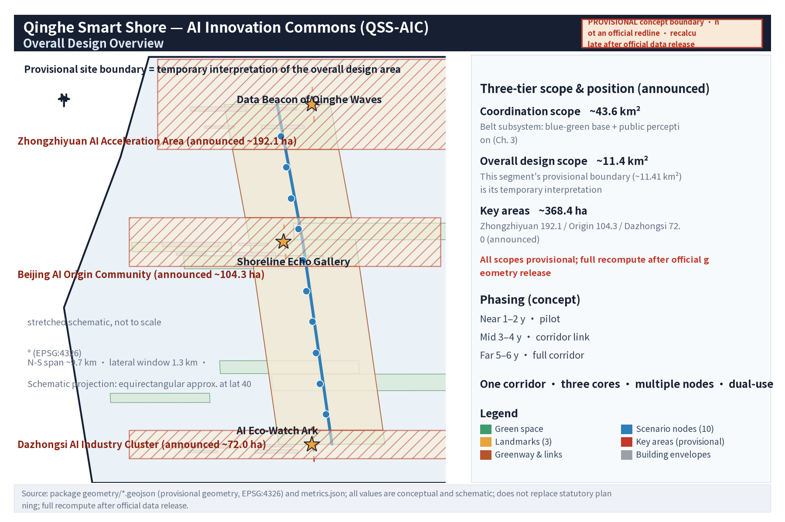
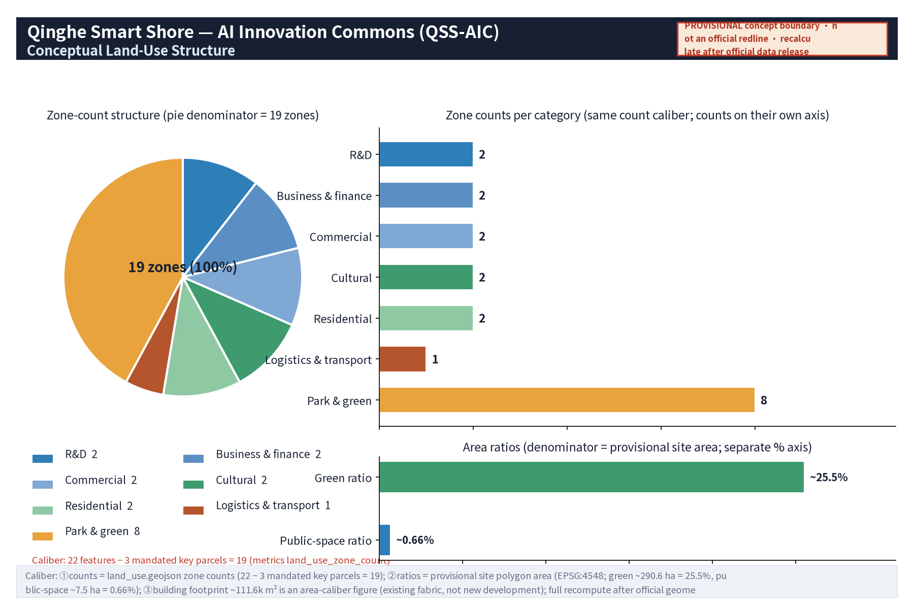
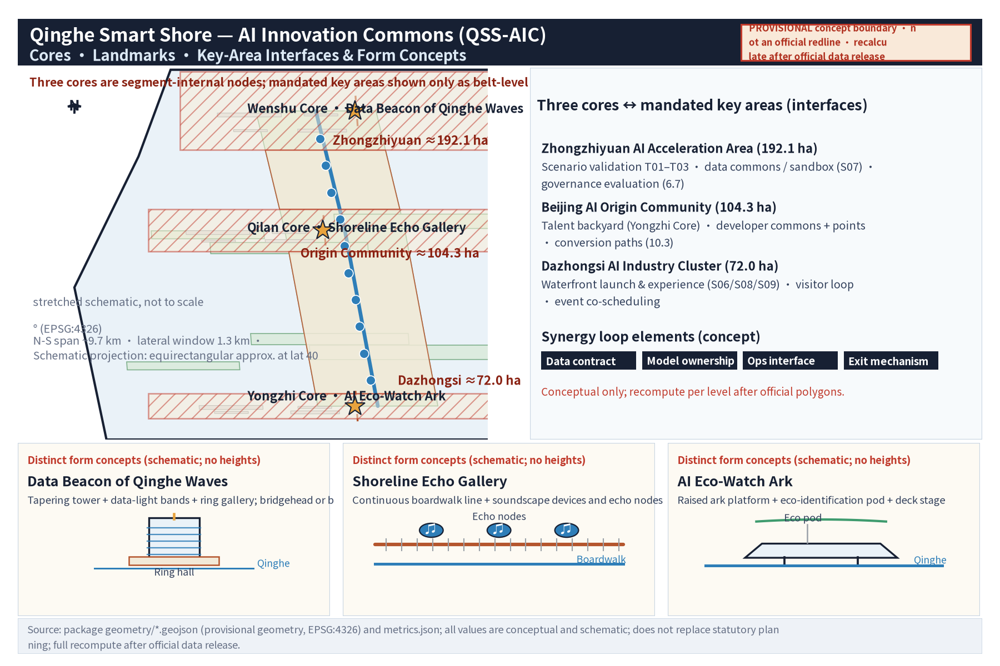
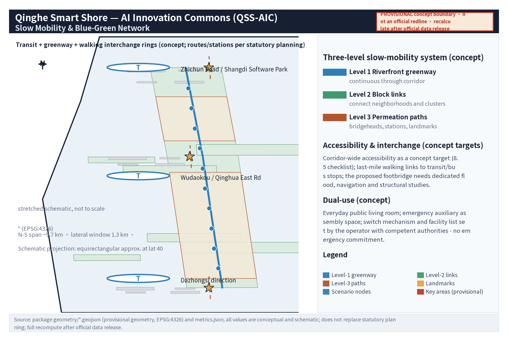
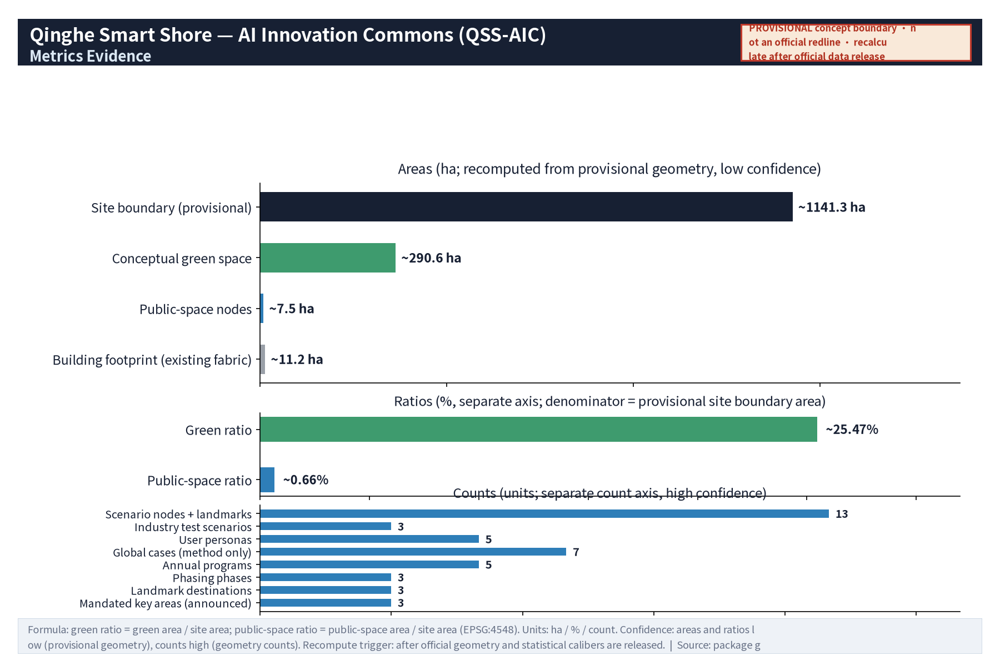
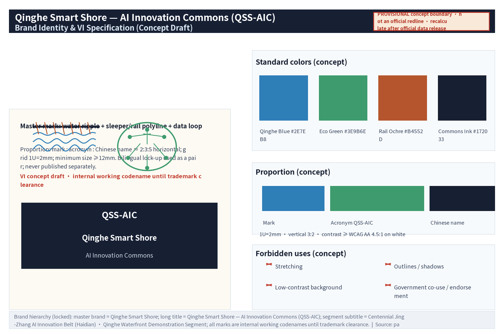

# Qinghe Smart Shore - AI Innovation Commons (QSS-AIC)

**Primary name (EN lock-up): QSS-AIC / Qinghe Smart Shore — AI Innovation Commons**
**Chinese counterpart: "清河智岸 · AI创新公地"**

**Brand naming hierarchy (locked; single caliber of this package; applied consistently to document metadata, A0/A3 covers, HTML and all figures)**:
- **Master brand**: Qinghe Smart Shore (“清河智岸”);
- **Long title**: Qinghe Smart Shore — AI Innovation Commons, acronym “QSS-AIC” (Chinese: “清河智岸 · AI创新公地”);
- **Segment subtitle**: Centennial Jing-Zhang AI Innovation Belt (Haidian) · Qinghe Waterfront Demonstration Segment;
- **Use rule**: the lock-up above is the single brand caliber of the whole package; all marks are used as **internal working codenames** until trademark clearance (Section 12.5).

**Positioning**: This submission is a **concept design** for the open call of the Centennial Jing-Zhang AI Innovation Belt (Haidian section). It is the belt's **sub-system and demonstration segment — the "Qinghe Riverfront Demonstration Segment"**: a real water system node (Qinghe River) adjacent to the northern section of the Jing-Zhang Railway Heritage Park and local innovation clusters. Its trinity is "riverfront AI ecological restoration + waterfront innovation living room + dual-use (peacetime/emergency) public space", serving the "Urban AI Life Experience Belt" and "AI+ scenario empowerment" at the **scenario-side experience and validation** level. Everything here is a **conceptual suggestion** that does not replace statutory planning: no FAR, height, road redline, engineering feasibility or investment conclusions are made. All areas/ratios are **schematic values pending recomputation with official data**. Every AI scenario has **human review / human fallback**; water-environment display data is for display and research only and does not replace official water-quality monitoring.

**Design philosophy**: "Waterfront as Commons" — the river is not only an ecological corridor but a shared **innovation commons**: shared blue-green infrastructure, open scenario data, low-threshold public space and mixed co-living functions, making the river a "wet line" for innovation flows.

**Spatial structure: One Corridor, Three Cores, Multiple Nodes**
- **One Corridor**: Qinghe Smart Blue-Green Corridor (ecology + slow mobility + innovation + culture);
- **Three Cores** (segment-internal functional nodes, NOT the three mandated key areas): **Wenshu Core** (Qinghe x Jing-Zhang Railway Heritage Park confluence, culture), **Yongzhi Core** (riverfront innovation living room, innovation), **Qilan Core** (community riverfront public space, daily life);
- **Multiple Nodes**: AI scenario points, riverside service stations, eco-observation points.

**Mapping to the six mandatory tasks**: agent.1 concept/naming/belt coordination - Chapters 2-4; agent.2 - Chapter 6 (case table, ecosystem map, eight mechanism types); agent.3 - Chapter 6 (10 scenario cards, 3 test-validation scenarios, 5 persona types); agent.4 - Chapters 4,5,6,7,9 (three landmark facilities, component library, recognition display); agent.5 - Chapter 4 (narrative, wayfinding symbol system, international communication copy); agent.6 - Chapter 10 (annual program system, conversion paths, operation mechanisms).

**Official three-level scopes (announcement basis)**: coordinated research area approx. 43.6 km2; overall design area approx. 11.4 km2; key areas approx. 368.4 ha in total (Zhongzhiyuan approx. 192.1 ha, Beijing AI Origin Community approx. 104.3 ha, Dazhongsi approx. 72.0 ha — announcement figures). This segment's provisional site boundary (recomputed approx. 11.41 km2) is a temporary geometric interpretation of the **overall design area**, located inside the official three-tier framework. The three mandated key areas are addressed through differentiated task evidence in Sections 2.3, 5 and 6 (no redraw of official geometry).

## Design Basis and Source List

### 1.1 Design basis

1. The taskbook and public background materials of the open call: the three major positionings (Centennial Jing-Zhang Culture Belt, Urban AI Life Experience Belt, AI Integration & Innovation Belt), five major functions (full-stack AI innovation system, world-class AI ecosystem, AI+ scenario empowerment paradigm, intelligent AI-energized city, global voice in AI governance), the "Three Zones, Two Wings" spatial pattern (AI Origin Community, Zhongzhiyuan AI Acceleration Zone, Dazhongsi AI Industry Cluster + Zhongguancun service wing, Xiaoyue-H small-river scenario wing), real urban nodes along the belt, and the three-level scope figures (approx. 43.6 km2 / 11.4 km2 / 368.4 ha);
2. Publicly available planning, water-affairs and eco-environment information of Beijing Municipality and Haidian District (categories in 1.2);
3. Public reporting on the Jing-Zhang Railway Heritage Park construction and operation;
4. Public AI-industry, scenario-opening and action-plan policy documents (categories in 1.2);
5. Global case-study research on innovation districts, riverfront regeneration and smart cities — method reference only; per-item traceable sources (publisher/institution page, access date, reuse boundary) are registered in sources.json and the Section 6.1 table; no unverified case data is cited.

**Basic stance**: all spatial suggestions are conceptual and for professional teams to deepen; statutory matters are referred to competent authorities and statutory plans.

### 1.2 Source list (public categories + access)

| Category | Main content | Access | Reuse boundary |
| --- | --- | --- | --- |
| Government public information | Haidian district-plan summaries, Beijing water-affairs/eco-environment public info, river-chief disclosures, three-level scope figures | Municipal/district government and water-affairs official websites | Official wording only; not professional judgement basis |
| Public news | Jing-Zhang Railway Heritage Park and Qinghe riverfront coverage | Mainstream media public search | Background narrative only; figures per official channel |
| Public statistics | Population, industry, water-quality annual reports | Statistics/eco-environment public platforms | Cite only after official recomputation |
| Public case research | Global innovation districts, riverfront projects, smart cities | Publications and institution pages (per-item in sources.json) | Method reference only; no fabricated case data |
| Policy documents | AI industry, digital economy, scenario opening | Government website public texts | Verify current validity before citation |

> **Evidence anchor**: [source:DATA-SRC-OFFICIAL-ANNOUNCEMENT-2026-05-09], [source:DATA-SRC-AGENT-TASKBOOK-2026-05-18].

## Three-Level Scope Framework

### 2.1 Three-level scopes (announcement basis + this segment's position)

| Level | Area (announcement) | This proposal's response | Depth |
| --- | --- | --- | --- |
| Coordinated research area | approx. 43.6 km2 | Chapter 3 industry & future-city research (conceptual); this segment acts as belt "blue-green base and public perception surface"; official geometry not redrawn | Strategic research (conceptual) |
| Overall design area | approx. 11.4 km2 | Our provisional site boundary is this level's **temporary geometric interpretation**: geometry/site_boundary.geojson recomputed approx. 11.41 km2 ([metric:site_area_sqm], EPSG:4548); full recomputation after official geometry release | Urban design (conceptual, regulatory-plan-depth framework) |
| Key areas | approx. 368.4 ha (Zhongzhiyuan 192.1 / Origin 104.3 / Dazhongsi 72.0) | Section 2.3 synergy loops + Chapter 5 core interfaces + Chapter 6 differentiated task evidence (T01-T03, S06-S09); official redlines not redrawn, detailed designs not invaded | Key-area detailed design (conceptual task evidence) |

**Note on basis**: official geometry (verified-coordinate boundary and key-area polygons) is not yet published; all boundaries here are provisional concepts for machine validation. Announcement area figures are quoted per the official text and recomputed after official data release.

### 2.2 Working logic

The three tiers follow a "strategy - structure - node" cascade: the coordinated tier answers how the waterfront relates to the AI belt; the overall tier organizes the corridor; the key tier makes experiences concrete. Every tier is labelled "conceptual suggestion, pending professional deepening" and does not replace statutory planning. The 11.41 km2 provisional recomputation matches the announced "overall design area approx. 11.4 km2"; earlier draft concepts (e.g., "approx. 2.3 km2 overall design") are deprecated — Section 11.4 is the single source of truth.

### 2.3 Task coverage: belt-level structure and the Qinghe demonstration segment

**Belt-level structure (taskbook basis)**: the belt combines the three positionings, five functions and the "Three Zones, Two Wings" spatial skeleton; it is a composite "culture + life + innovation" system with division of labour and loop synergies among sub-systems.

**Sub-system position of this segment**: Qinghe supplies the belt's "blue-green base and public perception surface" — a real-riverfront **AI scenario testbed and public experience field** (perception layer - platform layer - application layer in a riverfront version, Section 6.2). This yields the following **conceptual synergy loops with the three mandated key areas (item-by-item differentiated task evidence for compliance_matrix 1.5.3.1-1.5.3.3)**:

| Mandated key area (announcement area) | Taskbook role | This segment's differentiated task evidence (conceptual, non-invasive) |
| --- | --- | --- |
| Zhongzhiyuan AI Acceleration Zone (approx. 192.1 ha) | Full-stack AI innovation system and global voice in AI governance | 1) Scenario-side validation: T01-T03 test-validation scenarios open to Zhongzhiyuan technology suppliers (Section 6.5, application-audit-filing system); 2) Data commons: S07 open-API sandbox provides de-identified samples and public accounting for governance/algorithm evaluation (Sections 6.4, 10.5); 3) Governance review interface: AI governance review table (Section 6.7) with inputs, validation indicators and exit conditions |
| Beijing AI Origin Community (approx. 104.3 ha) | World-class AI innovation ecosystem | 1) Talent backyard: walkable riverside exchange, pitch and co-creation spaces (Yongzhi Core living room, S06 digital pitch wall); 2) Developer commons shared with its open-source community incl. contribution points (Sections 6.4, 10.3); 3) Talent path "volunteer guide - intern co-creation - joint research" (Section 10.3) |
| Dazhongsi AI Industry Cluster (approx. 72.0 ha) | AI-native new business types | 1) Waterfront launch & experience interface: product-launch pitches, AI public demos, multilingual digital tours (S06, S08, S09) co-scheduled with Dazhongsi businesses; 2) visitor crossover loop "industry in Dazhongsi, experience in Qinghe" (conceptual); 3) event co-scheduling with Dazhongsi precinct programs (Section 10.3) |

**Boundary statement**: the above is differentiated task evidence and interface reservation of the Qinghe segment only; it is not a claim of completed detailed design for the three key areas, whose statutory detailed design belongs to the corresponding formal planning scope. Until official polygons are published, this proposal outputs no redline, land-use or construction conclusions for them (same convention as compliance_matrix 1.5.3.1-1.5.3.3).

**Two Wings and regional coordination (conceptual)**: the Zhongguancun service wing maps onto open interfaces and standardization (data contracts, scenario open lists, T01-T03 filing, IP/capital channel reservation); the Xiaoyue scenario wing and this corridor jointly form an in-belt "waterfront + street" continuous experience loop:

| Wing (taskbook) | Interface points here (conceptual) | Sections |
| --- | --- | --- |
| Zhongguancun service wing | Data-contract templates, scenario open list, T01-T03 filing, IP/capital channel reservation | 6.7, 10.2, 10.5 |
| Xiaoyue scenario wing | "Waterfront + street" loop: slow-mobility interface, multilingual tour linkage, event co-scheduling | 4.3, 8.1, 10.3 |

Regionally, the segment links Beiwei Community, Future Science City, Huairou Science City, the Economic-Technological Development Area and the Beijing-Tianjin-Hebei direction through scenario-open standards, de-identified data contracts and event brands (directional concept only, no commitments).

**Belt-level brand and logo direction (conceptual)**: four base motifs (sleeper texture, rail polyline, data loop, water ripple); primary lock-up "QSS-AIC" + Chinese name; node/activity naming follows the "water + innovation + space type" root system (Sections 5.4, 13); all marks are internal working codenames until trademark clearance.

> **Evidence anchor**: [source:DATA-SRC-AGENT-TASKBOOK-2026-05-18], [source:DATA-SRC-OFFICIAL-ANNOUNCEMENT-2026-05-09].

## Coordinated Research Area: Industry and Future City Research

### 3.1 Regional reading

Qinghe sits in northern Haidian next to the northern Jing-Zhang Railway Heritage Park and innovation clusters (conceptual reading of public information). The railway carries a century of transport memory, Zhongguancun carries China's innovation enlightenment, AI carries the most active industrial transformation; the river's softness stitches these into a perceivable public axis. Conceptually, Qinghe is the belt's most promising northern "blue-green base" real water node because it neighbours both innovation clusters and urban communities — the spatial condition of an innovation commons. This tier corresponds to the announced "coordinated research area approx. 43.6 km2"; Chapters 3 and 6 respond conceptually without statutory research conclusions.

### 3.2 Riverside economy logic: clean water + innovation

The core is an "attraction economy of public space": scenario gravity (AI scenarios are most perceivable on the waterfront), talent gravity (walkable green vitality as a "talent backyard"), ecological premium (qualitative urban-renewal direction only — no property-value judgement or calculation), and time-axis value (rail = past speed, water = permanent infrastructure, AI = innovation in progress).

### 3.3 Future-city vision directions

Water-sensitive city (living with water: resilient banks, rain gardens, ecological purification display), dual-use space (peacetime public living room; auxiliary evacuation/assembly/logistics in emergencies — equipment per competent authorities), and a digital-governance window (open, verifiable water-environment display as "data commons" for display and research only, never replacing official monitoring).

> **Evidence anchor**: [source:DATA-SRC-PROVISIONAL-BOUNDARIES-2026-06-05].

## Overall Design Area: Urban Renewal and Regulatory-Plan-Level Urban Design

### 4.1 Overall design concept: One Corridor, Three Cores, Multiple Nodes

Corridor continuity first ("ecological bank - waterfront slow mobility - neighbourhood penetration" three parallel layers, schematic values pending recomputation); the three cores offset by a culture-innovation-daily-life spectrum; nodes and stations at walkable spacing (conceptual range) for a "walk, see, use" density experience.

### 4.2 Urban renewal and regulatory-plan-depth design (conceptual framework)

Only a working framework is offered, not a statutory regulatory plan: waterfront set-back and view-corridor study topics (final word: water-affairs management scope and statutory plans), skyline/height as a "low near water, rising toward the city" character principle only, three-category renewal intention ("retain - renovate - study", no plot-level conclusions, Chapter 7), and a point-line-surface public-space network (squares, stations, bridgeheads, alley penetration).

### 4.3 Narrative and wayfinding symbol system; international communication

Three narrative chapters — Railway Memory (Jing-Zhang: sleepers, spikes, platforms, locomotives), Innovation Enlightenment (Zhongguancun: counters, electronic components, screen light), Open-Source Commons (AI: data flows, loops, node networks). Four base motifs build four-level wayfinding (landmark level - corridor level - scenario level - paving level). AI-assisted wayfinding knowledge bases go online only after human review. International communication uses the unified bilingual narrative with QSS-AIC naming, parallel zh/en materials and multilingual human tours; English statements are cross-checked for equivalence with the Chinese figures/indicators before publication (this round completed; see proposal.en.md and en figures).

### 4.4 Character control concept

"Soft near the water, clear toward the city": naturalized banks and low-intervention structures; bridges and landmark installations may be high-recognition but light-footprint; riverside building interfaces encourage transparency and visual retreat; low-illumination ecological lighting to limit disturbance to waterbirds (character topic only, no engineering conclusions).

> **Evidence anchor**: [source:DATA-SRC-MOHURD-CONTROL-DETAILED-PLANNING], [source:DATA-SRC-PROVISIONAL-BOUNDARIES-2026-06-05].

## Detailed Design of Key Areas

> The "three nodes" in this chapter are real, identifiable **Qinghe riverside segments** (confluence, innovation living room, community waterfront) — segment-internal functional detailing, NOT the three mandated key areas (Zhongzhiyuan/Origin/Dazhongsi), whose differentiated task evidence is in Sections 2.3 and 6 and whose redlines belong to statutory scopes. Boundaries here are conceptual pending formal survey data.

### 5.1 Wenshu Core: Qinghe x Jing-Zhang Railway Heritage Park confluence

Position: riverside stretch adjacent to the heritage park's north section (schematic). Concept: "a historical handshake between rail and water" — the rail alignment and the river visually and physically meet; a proposed footbridge (concept name "Chengbo Bridge") ties the two corridors. Landmark: **Data Beacon of Qinghe Waves** (5.4). Functions: heritage narrative start, water-environment display, study-group assembly, cultural events.

### 5.2 Yongzhi Core: riverfront innovation living room

Position: riverside stretch near the Shangdi/Zhongguancun Software Park direction (schematic). Concept: "move the meeting room to the water" — open pitch deck, modular co-creation pods, 24h shared station forming a "walled-garden-free entrepreneurship commons", complementary to existing parks. Landmark: **AI Eco-Watch Ark** (5.4). Functions: open pitches, scenario shows, developer exchange, light co-creation (conceptual scale range, pending recomputation).

### 5.3 Qilan Core: community riverfront public space

Position: residential-dominated riverside stretch with improvable access (schematic). Concept: "the community's water living room" — water steps, rain gardens, children's nature classroom, age-friendly station, community gardens; also the **dual-use research focus segment**: community commons in peacetime, auxiliary evacuation/assembly in emergencies (per competent authorities). Landmark: **Shoreline Echo Gallery** (5.4). Functions: water recreation, nature education, community activities, auxiliary emergency functions.

### 5.4 Three original AI landmark facilities

| Landmark (zh/en) | Position suggestion | Form concept | Experience |
| --- | --- | --- | --- |
| **Data Beacon of Qinghe Waves** | Wenshu Core bridgehead or river-bend height (schematic) | Tower-like form, narrow at base widening upward; a readable "data waterfall" light band visualizing water-environment sensing; ring exhibition hall at the base | Day: "twin time axes" of data band and history chronology; night: ecological light rhythm; AR overlay of Jing-Zhang history (human-reviewed knowledge base); data for display/research only |
| **Shoreline Echo Gallery** | Qilan Core, continuous gallery along the community river walk (schematic) | Recycled sleeper-texture path, soundscape installations and "echo nodes" replaying water, wind, footsteps and railway-memory sounds — a walkable sound map | Braille/voice-priority design; "Ting Lan" checkpoints; children may participate in **environmental/collective soundscape collection under written guardian consent, revocable at any time** — no identifiable voices or minors' personal information, uploads de-identified and human-reviewed before release (data flow: S02 card, Section 6.4) |
| **AI Eco-Watch Ark** | Yongzhi Core river bend (schematic) | Raised/near-shore "ark" observation platform; cabin integrates ecological identification display (birds, plants, aquatic life — research/popular-science use); deck doubles as small pitch/performance stage | Public "nature identification window" and researcher co-observation interface; results labelled "AI-assisted, professional re-verification required"; night: ecology classroom and star observation |

**Naming system**: "water (清/澜/澄/听) + innovation (智/汇/创/枢) + space type (廊/桥/台/灯塔/方舟)" roots, e.g., "澄波桥", "听澜栈", "观澜台", "智汇驿" — systematic and extendable. **Declaration**: names are original concepts of this proposal; if any coincides with existing schemes or real place names, the submission-time check and competent authorities prevail; internal working codenames until trademark clearance (Chapter 12).

### 5.5 Public-space component library and recognition display (conceptual)

Five concept component types (modular station unit 30-80 m2 with info screen, drinking water, charging, first aid, accessibility interfaces; water-step and ecological-bank components; four-level wayfinding signage incl. braille/voice; data-display interface units; dual-use + recognition display composite units) — all reversible, low-intervention, modular, no construction volumes preset. The recognition display covers co-creation outcomes, events, volunteer/developer contributions and authorized public art; all content human-reviewed and publicly licensed; no personal privacy displayed; awards correspond to public recognition only, not commercial rights.

> **Evidence anchor**: [data:geometry/key_areas.geojson#key-areas].

## AI Innovation Ecosystem, Personas, and AI+ Scenarios

### 6.1 World-class ecosystem: method-reference cases (7; method only, no data cited)

| Case | Type | Method transfer (not data benchmarking) | Source (publisher/institution page) | Accessed | Reuse boundary |
| --- | --- | --- | --- | --- | --- |
| Kendall Square, Cambridge MA | University-anchored innovation district | Anchor institution + dense public space + venture proximity ("walkable innovation circle") | Brookings, "The Rise of Innovation Districts" (Katz & Wagner, 2014); kendallsquare.org | 2026-08-10 | Method reference only; no statistics cited (sources.json) |
| King's Cross, London | Railway-heritage regeneration | "Public space first, cultural landmarks shape" commons operation (highly relevant to Jing-Zhang) | King's Cross Central Limited Partnership official site, kingscross.co.uk | 2026-08-10 | Method reference only (sources.json) |
| Station F, Paris | Former rail-depot start-up community | Converting transport heritage into an open entrepreneurship commons run by events/community | Station F official site, stationf.co | 2026-08-10 | Method reference only (sources.json) |
| 22@ Barcelona | Old industrial district renewal | Mixed-use rebalancing of innovation, housing and public space | 22@Barcelona official site, 22barcelona.com | 2026-08-10 | Method reference only (sources.json) |
| one-north, Singapore | Industry-city integrated park | Park-level greenspace as "social hub"; public smart-water-management interface | JTC Corporation official site (one-north section), jtc.gov.sg | 2026-08-10 | Method reference only (sources.json) |
| Kista Science City, Stockholm | Industry-cluster community | Shared facilities and open exchange spaces among firms, universities and residents | Kista Science City official site, kistasciencecity.se | 2026-08-10 | Method reference only (sources.json) |
| Quayside Toronto (Sidewalk Labs) | Smart waterfront - cautionary case | Data governance and public-interest-first warning: technology requires public value and deliberation | Waterfront Toronto official site; Sidewalk Labs discontinuation statement 2020-05-07 | 2026-08-10 | Negative method warning only (sources.json) |

**Method conclusion (conceptual)**: world-class ecosystems share "anchor institution + open commons + low-cost trial space + high-frequency events", not building heights or firm lists. Qinghe borrows only the commons-organizing method.

### 6.2 Spatialization of the full-stack innovation system (conceptual)

Qinghe serves the "scenario-side experience and validation" function, complementing Origin (ecosystem), Zhongzhiyuan (technology/governance) and Dazhongsi (industry) per Section 2.3: a real-riverfront AI testbed with perception layer (water display, eco-identification), platform layer (open-API sandbox, data-commons interface) and application layer (slow-mobility assistant, tours, emergency drill displays). The technology systems themselves belong to the designated belt nodes. The ecosystem map and eight mechanism types (land/space/industry/capital/talent/compute/data/scenario) are all conceptual, for competent authorities and professional teams to deepen.

### 6.3 Personas (5 types, consistent with metrics.json persona_count=5)

| Persona | Core need | Typical behaviour | Spaces / scenarios |
| --- | --- | --- | --- |
| Commuting developers & engineers | Lunch break, shortcut relaxation, serendipity | Midday stroll, open-pitch watching, code-break pauses | Yongzhi station, Echo Gallery |
| Waterfront professionals & start-ups | Low-cost pitch, exposure, networking | Booked open pitches, hackathons, riverside office shuttle | Innovation living room, Ark deck |
| University faculty/researchers | Real-environment samples, outreach | Co-observations, sensor demos, study trips | Ark, Beacon exhibition |
| Eco enthusiasts & study tourists | Waterfront ecology/culture experience | Landmark check-ins, AR tours, soundscape collection, night walks | Three landmarks, wayfinding |
| Families & residents incl. seniors | Daily access, safety, being cared for | Morning exercise, chess, kids' nature class, soundscape listening | Qilan water steps, stations, classroom |

> Emergency workers are not a separate daily persona; their needs fold into dual-use mechanisms and drills (Sections 5.3, 8.4, 10.5). Personas are conceptual, to be refined after operation.

### 6.4 AI daily scenario cards (10 cards, S01-S10)

> Common boundary: all scenarios are conceptual; all AI output has human review/fallback; water-environment data is display/research only; personal data is minimized, disable-able and deletable; scenarios are "operate-and-test first, engineer later" pilots (Chapter 10).

| Card no. & name | Goal | Inputs & data flow | Outputs | Model boundary | Operator & responsibility | Data & privacy boundary |
| --- | --- | --- | --- | --- | --- | --- |
| S01 Qingbo Sensing - water-environment display | Turn sensing data into readable public knowledge ("data commons") | De-identified self-collected flow -> data-commons interface (open API, anonymous aggregation) -> visualization | Beacon light band, corridor screens, web charts (marked non-official) | Display-level visualization/trends only; no water-quality conclusions; low confidence -> "data pending review" | Operator commons + research institutions; human pre-release review | Self-collected/ public de-identified data only; no personal data collection; never replaces official monitoring |
| S02 Shoreline Echo - soundscape AI tour | Tell the waterfront and rail memory through sound; accessible cultural tour | Public sound submissions (human review) + human-reviewed history knowledge base -> retrieval/generation -> voice playback | Echo-node voice tours, braille/voice-priority UI, "Ting Lan" check-ins | Guide material only; history KB human-reviewed; out-of-scope refused | Operator content team + volunteers | Minors: **environmental/collective soundscape only, under written guardian consent, revocable at any time**; no identifiable voices, portrait or minors' personal data; all uploads de-identified and human-reviewed; explicit public license for audio materials |
| S03 Zhian Companion - accessible slow-mobility assistant | Let every ability walk the waterfront safely | Public corridor data + user-authorized location (minimized, disable-able) -> routing | Accessible route suggestions, obstacle alerts, emergency call linkage | Advisory only, not statutory accessibility compliance; human emergency fallback | Operator + local accessibility/emergency linkage | Location de-identified, disable-able, time-limited deletion; no individual-identifying tracking |
| S04 Guanlan ID - eco learning cards | Ecology popular science for the public | Near-shore self-collected imagery -> identification model -> cards | Bird/plant/aquatic learning cards, labels | AI-assisted; "professional re-verification required"; no research conclusions; low confidence -> consult experts | Research institutions + volunteer explainers; professional label review | Environmental imagery only; no identifiable personal content; publication per license |
| S05 Dual-use drill - flood situation screen | Popularize flood knowledge; demo the peacetime/emergency switch (demo only) | Official public warnings and hydrology info (attributed) -> drill model -> screen | Situation demo, switch guidance, drill info | Demo only; never replaces official warning systems; no undisclosed data | Operator + local emergency linkage | Official public sources only, attributed; no personal data |
| S06 Innovation living room - AI pitch wall | Make pitches and co-creation understandable (multilingual) | Speaker-authorized audio -> transcription/summary/translation -> wall | Bilingual subtitles, summaries, translations, authorized playback | Assistive tools; important content human-reviewed; no auto-publish | Operator commons + speaker authorization; pre-release review | Copyright stays with speakers; no attendee collection without authorization |
| S07 Developer commons - open-API sandbox | Let developers trial and co-build with de-identified data | De-identified/self-collected sets -> API gateway (apply-audit-file) -> sandbox | Data APIs, samples, quarterly reports | De-identified/self-collected data only; tiered authorization; no raw individual-level data | Operator tech team; application human-review; points honour-only | Anonymous aggregates only; time-limited logs |
| S08 Smart check-in - event badge system | Chain events and scenarios into a one-day experience | Public schedules and points -> routing and check-in | Route recommendations, badges, event map | Public-info aggregation; no behavioural profiling; human event management | Operator event team + volunteers | Minimal, anonymized participation data; opt-out and deletion anytime |
| S09 Zhongguancun Kiosk - knowledge dialogue | Answer Jing-Zhang/Zhongguancun history from trusted sources | Human-reviewed KB + public archives -> RAG dialogue -> kiosk | Domain answers, source cards, further reading (public citations) | KB scope only; out-of-scope refuses; history human-reviewed | Operator content team + cultural-institution guidance | No undisclosed archives; dialogue logs anonymized for quality |
| S10 Waterfront generative art - environmental data public-art screen | Make environment data visible as public art | Aggregated stats (wind, water temperature, anonymous crowd heat) -> generative model -> screen | Generative art, rhythm lighting (low-illumination ecological) | Template+data driven; templates human-approved; no individual data | Operator + artists; quarterly content review | Aggregates only; no individual-identifying tracking; no over-surveillance |

### 6.5 Industry test-validation scenarios (3, T01-T03, all subject to approval/filing)

| Test object | Data input | Validation indicators | Exit conditions |
| --- | --- | --- | --- |
| T01 Water-environment smart sensing demo zone (sensors + identification models) | Self-collected sensing/imagery (de-identified public) | Consistency vs official parallel monitoring, device availability, false-alarm rate | Remove and switch to manual monitoring if 3-month deviation exceeds threshold or approval withdrawn; optional low-altitude drone inspection only under separate low-altitude rules |
| T02 Riverfront autonomous shuttle & cleaning-robot demo loop (human-machine coexistence) | Segment environment data + anonymized aggregate trajectories | Human-machine conflict events, emergency-stop & safety-officer response time, satisfaction | Pause and switch to human operation on safety incidents or complaint thresholds; enclosed/semi-enclosed sections only |
| T03 Dual-use digital-twin drill (model-based) | Official public warnings + de-identified plan data | Evacuation path feasibility, response time (drill), switch-instruction correctness | Downgrade to desktop seminar if unqualified; drill conclusions never announced as official; never replaces statutory emergency plans |

### 6.6 Scenario-space-operation mapping

Landmark/node (S01, S04, S05, S06, S09) - public service + research co-building + volunteers; corridor/slow mobility (S02, S03, S08, S10) - scenario open list + public schedules; station/community (S07 etc.) - public-interest operation + community co-governance + developer adoption; test loops (T01-T03) - apply-audit-file, conditional openness.

### 6.7 Human review and data boundary principles; AI governance review table

Every scenario follows "AI-native generation, human-reviewed release, tiered data use": human review before public knowledge/history/emergency/water-quality content; water data labelled "display/research only"; personal data minimized with deletion support; AI-participation grades disclosed per card. Four cross-scenario mechanisms: data contracts, model responsibility, operation interface (open API + human-reviewed release), exit mechanism (Section 10.5). Corridor-wide: anonymous aggregation + human review; **no individual-identifying tracking; no over-surveillance**.

| Governance element | Inputs | Validation indicators (conceptual) | Exit conditions |
| --- | --- | --- | --- |
| Content & knowledge governance | Public KB + de-identified data contracts | 100% human pre-release review; public correction deadlines | Unreviewed release discovered -> suspend scenario and review |
| Data & privacy governance | Anonymous logs, deletion ledger | 100% anonymous aggregation; deletion deadlines met; quarterly governance report public | Individual-identification event -> take data interface offline and announce |
| Model & operation governance | Scenario filing list, quarterly evaluations | Availability, feedback closure rate, complaint handling times | Any of safety/satisfaction/cost below threshold -> suspend, take offline or transform (10.5) |

### 6.8 Pilot-level data dictionary, model performance baseline and multi-agent collaboration flow (conceptual)

To reach pilot-stage implementation depth, this proposal pre-configures three pilot tools as concept frameworks - "data dictionary, performance baseline, collaboration flow". All are directional frameworks with no preset numeric conclusions; after a pilot starts, the operator community together with research institutions measures and publishes them on a joint benchmark set:

**Pilot-level data dictionary (concept)**: data items of pilot scenarios (S01, S03, S04, S07, T01-T03) are registered uniformly under three columns - "caliber & source; de-identification & retention; use tier & recompute trigger". The data contract is published per this dictionary when a pilot launches; no personal data is collected:

| Data item (pilot) | Caliber & source | De-identification & retention | Use tier & recompute trigger |
| --- | --- | --- | --- |
| Water-environment sensing values (S01/T01) | Self-owned sensors; parallel comparison with official monitoring | Anonymous aggregation; limited retention, deleted after pilot evaluation | Display/research only; switch calibration after official data release |
| Slow-mobility path & obstacle events (S03) | Aggregated statistics of authorized location data | Minimized, disable-able, time-limited deletion | Accessibility assistance suggestions only; no individual-identifying tracking |
| Eco-imagery recognition records (S04) | Near-bank self-captured imagery | Natural-environment imagery only; public scope per license | Science-communication use; professional double-check labelling |
| API sandbox call logs (S07) | De-identified datasets and purpose registration | Logs retained for a limited time; anonymous aggregation | Developer trials; contribution points honour-only |
| Drill & conversion metrics (S05/T03) | Official public info and de-identified plans | No personal data processed | Demonstration only; does not replace official warnings |

**Model performance baseline (concept)**: before launch, each pilot model must complete an initial baseline measurement on the joint benchmark set; the measurement method, sample caliber, data timestamp and recompute trigger are published together, then re-measured quarterly. Baseline thresholds are expressed as "range + recompute trigger"; no specific values are preset at this concept stage to avoid false precision. Any quarterly result below baseline triggers human review and re-evaluation.

**Multi-agent collaboration flow (concept)**: pilot AI capabilities run as a four-step flow - "sense, aggregate, review, publish": the sensing agent reads de-identified data streams (anonymous aggregation only), the aggregation agent performs statistics and tiering, the review agent runs rule checks and queues human review (key decisions require human review), and the publishing agent outputs labelled interfaces. Any step with insufficient confidence falls back to human handling; the whole flow never collects personally identifiable information, does no individual-identifying tracking and performs no over-surveillance.

> **Evidence anchor**: [source:DATA-SRC-GENERATIVE-AI-INTERIM-MEASURES].

## Land Use, Building Scale, and Retain-Renovate-Demolish Strategy

> Conceptual framework only: no plot-level decisions, no FAR/height, no development-volume commitments; statutory plans and ownership surveys prevail.

### 7.1 Land-use categorization (retain - renovate - study)

Retain: heritage park, river and green spaces, public facilities, existing residential areas (authentic preservation + functional weaving). Renovate: low-efficiency riverside factories/storage/underused land (to be identified by professional teams; light interventions: culture/innovation conversion, station conversion — separate statutory procedures). Study: set-backs, bridge and station siting — deepen with water-affairs/ownership/transport data.

### 7.2 Scale ranges (conceptual)

- Corridor width: magnitude range only ("tens of metres"), pending formal data;
- Node scale: "node unit + coordination zone" concept only, no area conclusions;
- New structures: small public structures only (stations, observation platforms, display units). **New small public facility floor area: conceptual range approx. 10,000-20,000 m2** — derivable and checkable chain (demand-side - capacity-side - three phases), not a development-volume commitment:

| Derivation element | Conceptual value (range) | Basis & check | Phasing (10.4) |
| --- | --- | --- | --- |
| Demand side | Service radius approx. 500 m (5-10 min walk); station spacing 300-600 m | Walkability conceptual range; recalibrate with post-operation surveys | Near term: one sample station calibrates |
| Capacity side | 2-4 per core; 2-3 per km of corridor; 3-5 in community section | Conceptual capacity of function mix + dual-use configuration | Mid term: corridor integration |
| Facility count | Approx. 40-70 stations/observation units corridor-wide | Check: 40 ~ 3 cores x 3 + 10 km x 2.5 + 5 community; 70 is high-density scenario cap | Long term: full corridor |
| Unit size | Approx. 150-400 m2 each | Modular station 30-80 m2 + observation platform + support (low-end mix); revised by pilot | Recalibrate after pilot measurement |
| New floor area | Approx. 10,000-20,000 m2 | Low: ~50 x 200 m2 ~ 10,000 m2; high: ~60 x 330 m2 ~ 20,000 m2; extreme tails (40x150 / 70x400) excluded from public wording to avoid misleading | Rolling recalculation per phase |

- For reference, the existing building footprint totals approx. **111,600 m2** ([metric:building_footprint_area_sqm], provisional geometry recomputation; corresponds to retained/renovated fabric, not new development).

### 7.3 Principles

"Renovate more, demolish less; demolish nothing unless necessary; all retain/renovate/demolish decisions require statutory procedures" — all intentions here are reference directions for regulatory-plan deepening and urban-renewal study.

> **Evidence anchor**: [source:DATA-SRC-MNR-LAND-USE-CLASSIFICATION-202311].

## Transport, Rail, Municipal Infrastructure, and Public Services

### 8.1 Riverfront slow mobility and greenway (conceptual)

Three-tier system (tier-1 riverfront greenway + tier-2 neighbourhood trails + tier-3 penetration links); accessibility-first concept objectives for gradients, interfaces and stations; "last-1-km" connection concept with rail/bus/cycling networks (facilities per transport authorities).

### 8.2 Bridges and walkway links

A conceptual footbridge at Wenshu Core plus bridgehead spaces to connect the heritage park wings and the waterfront; any new bridge requires separate navigation, flood, landscape and structural studies — no technical conclusions here.

### 8.3 Rail and bus connection (conceptual)

Study "rail + greenway + walk" interchange continuity with the existing network (Zhichun Road, Shangdi/Zhongguancun Software Park directions etc.); specific lines and stations per statutory plans.

### 8.4 Municipal and smart-facility interfaces (conceptual)

Reservation-based smart poles/sensing/drinking-water/charging/Wi-Fi ("one pole, many uses"); sponge-city and rain gardens aligned with drainage zones (direction only); dual-use node water/power/telecom reservations per competent authorities.

### 8.5 Accessibility concept checklist (concept targets for professional teams)

> Converts accessibility goals into checkable items; final compliance per the Barrier-Free Environment Law and applicable standards ([source:DATA-SRC-BARRIER-FREE-ENVIRONMENT-LAW]).

| Check item (concept) | Concept target | Phase | Responsible (concept) |
| --- | --- | --- | --- |
| Continuous accessible main path | Gradient/width per accessibility goals; no step breaks on main route | Design development / construction docs | Design team + operator |
| Tactile paving & visual guidance | Continuous tactile paving; colour-contrast and ground guidance | Design development | Design team |
| Information accessibility | Braille/voice/multilingual tours; AR knowledge base human-reviewed | Before scenario launch | Operator content team |
| Stations & toilets | At least one accessible toilet and accessible service counter (concept) | Design development | Design team |
| Wheelchair/stroller parking | Reserved turning/parking space at water steps and pitch decks | Design development | Design team |
| Emergency help | Corridor help buttons / human-response fallback (incl. dual-use switch) | Before operation | Operator + local emergency |
| Children & seniors | Fall-guard on children's classroom; senior station seating spacing and rest cadence | Before operation | Operator with community |
| Digital accessibility | Screen-reader compatible, adjustable font size, offline human replacement | Before scenario launch | Operator tech team |

> **Evidence anchor**: [source:DATA-SRC-MOHURD-URBAN-DESIGN-MEASURES].

## Blue-Green Network, Public Space, and Urban Character

### 9.1 Ecological banks: directions and principles (no engineering conclusions)

Naturalized/near-naturalized banks preferred; existing vegetation and habitats preserved; plant communities, gentle slopes and shallows restore ecological continuity; minimal intervention, habitat first, section-by-section strategy (natural/park/urban sections). Engineering cross-sections and flood implications require dedicated water-affairs/ecological studies per flood and river-management rules.

### 9.2 Wetlands and rain gardens

Conceptual surface wetland/rain-garden demonstration units for purification display, auxiliary regulation and nature education; no quantitative purification commitments; water-function positioning per official water-function zoning; maintenance costs included in operation study to avoid "build without care".

### 9.3 Water-access public space

Water steps, viewing decks, safe observation points (no direct-contact water play; safety first), shaded seating form a "sit, see, hear, learn" sequence; graded safety signage, rescue points and human-response emergency linkage; dual-use conversion mechanisms defined by operator and authorities together.

### 9.4 Character control concept

"Low, soft, transparent, bright but not disturbing" riverside interfaces; ecological and cultural-ceremony lighting with light-pollution control; wayfinding/furniture/paving unified under the motif system (4.3); output as a "design guideline (concept draft)" — not a statutory character-control document.

> **Evidence anchor**: [source:DATA-SRC-MOHURD-URBAN-DESIGN-MEASURES].

## Renewal Projects, Implementation Policy, and Phasing

### 10.1 Project packages (conceptual list)

Blue-green foundation package (ecological bank study, wetland demo, rain gardens, ecological lighting); scenario commons package (three landmarks, station clusters, scenario-card facilities, API sandbox); slow-mobility linkage package (greenway, conceptual footbridge, accessibility retrofit); community waterfront package (water steps, children's nature classroom, age-friendly station); dual-use package (switch nodes, digital-twin drill, signage); operation & events package (event system, developer community, scenario-open operation).

### 10.2 Implementation policy concepts

- Four-party co-building (government public service + research knowledge + enterprise scenario co-building + community co-governance);
- Scenario-opening mechanism: public scenario lists, apply-audit-file participation, closed-loop evaluation;
- "Operation decides construction": operate-and-test first, then engineer; small-cost scenario validation before large investment;
- No investment/output-value promises or policy commitments;
- **Responsibility matrix (RACI concept)**:

| Activity | Accountable/Lead | Collaborator | Support |
| --- | --- | --- | --- |
| Minimum pilot operation | Operator commons | Government public service + research institutions | Community, volunteers, developers |
| Scenario filing & open list | Operator tech team | Enterprises (co-builders) | Competent authority approval |
| Data commons & API sandbox | Operator tech team | Research institutions | Developer community |
| Dual-use drills | Local emergency authority (statutory) | Operator | Fire/medical/community |
| Events & content review | Operator content team | Cultural institutions / experts | Volunteers |

### 10.3 Global AI innovation event system and long-term operation (agent.6)

**Annual event system (concept, 5 fixed programs, consistent with metrics.json annual_program_count=5)**:

| Annual program | Frequency | Core content | AI governance & operation boundary |
| --- | --- | --- | --- |
| Qinghe AI Eco-Tech Week | 1x/year incl. open day | Ecology-innovation dialogue, scenario open day, outcome display | AI-generated content labelled and human-reviewed; safety & IP rules first |
| Waterfront Light & Shadow Night Walk | 2x/year | Public art and soundscape night, low-illumination ecological lighting | Templates human-approved; no individual-identifying tracking |
| Water Data Hackathon - Zhian Developer Week | 1x/year | Hackathon + co-creation workshops + API sandbox | De-identified data only; points honour-only |
| River Study Season | 2x/year | University/school/community study trips | Minor participants via school/guardian consent process; no personal identification |
| Blue-Green Commons White Paper | 1x/year | Annual operation, indicators and governance report, published | Anonymous aggregation; human-reviewed release |

Event branding uses the four motifs and QSS-AIC (distinct from belt-level logo use, Section 2.3). Developer community: online open-source repository + offline "developer commons" station; volunteer mentor pool and contribution points (honour only). Long-term operator suggestion: a non-profit "Zhian Commons Operator" with government, research, enterprise and community representatives (concept). Conversion paths: talent (volunteer guide - intern co-creation - joint research; seniors/residents via community operator / soundscape-memory collection), enterprise (open-list application - T01-T03 filing - S06 waterfront show - belt-cluster linkage; Zhongzhiyuan/Dazhongsi/Origin as primary directions per 2.3), developer (hackathon - repository contribution - API sandbox adoption - long-term maintenance contract); all paths human-reviewed with public track records; no employment/investment/attraction commitments.

### 10.4 Phasing (conceptual)

| Phase | Years (concept) | Key tasks |
| --- | --- | --- |
| Near term | 1-2 | Minimum pilot: one node/corridor scenario trials, sample station, event system launch, data-commons interface online |
| Mid term | 3-4 | Corridor integration: greenway links, bridge concept deepening, node implementation, dual-use mechanism finalized |
| Long term | 5-6 | Full corridor: blue-green system completion, renewal projects phased, operation normalized, international event branding |

> Conceptual cadence since the concept passes review and pilot start; formal implementation plans prevail; metrics.json phase_count=3 matches the three phases.

### 10.5 Operation and phasing mechanisms (conceptual)

Roles: government (public service, statutory approvals), research (knowledge, review), enterprises (filed scenario co-building), operator commons (daily operation), community (co-governance, oversight), volunteers/developers (participation), professional teams (deepening, review) — per cooperation agreements and public rules, not administrative arrangements. Preconditions: public scheme, risk list, safety assessment, approvals and public notice before any pilot starts. Minimum pilot first ("operate-test first"). Approval & safety gates for river/low-altitude/unmanned/emergency/content scenarios; human safety officers/human review standing; reversible facilities. Maintenance from operator budget and co-building resources (concept; no fiscal commitment; annual public cost reports). Performance indicators published annually (availability, satisfaction, feedback closure, API usage, ecological observation; thresholds set after operation). Public feedback: suggestion boxes, community councils, online channels, annual open days — replies within stated timelines. Data governance per 6.7. **Failure exit mechanism**: any pilot/scenario failing safety/satisfaction/cost evaluation is paused, taken offline or transformed; reversible removal; exit process public and reported to authorities; thresholds published at start-up (written into every card and pilot plan).

> **Evidence anchor**: [source:DATA-SRC-AGENT-TASKBOOK-2026-05-18].

## Metrics, Area Recalculation, and Compliance Matrix

### 11.1 Suggested indicator system (pending official recomputation)

| Dimension | Suggested indicator | Direction (concept values pending) | Source/formula | Confidence | Use limit & recompute trigger |
| --- | --- | --- | --- | --- | --- |
| Ecology | Ecological bank share | High share preferred; values pending | Official river-management range & bank survey | Pending | Direction only; recompute after official data |
| Ecology | Wetland/rain-garden units | Several per node (magnitude) | Concept list (9.2) | Low | No engineering commitment; recalc at project initiation |
| Public | Greenway connection rate | Full connection goal; value pending | Greenway length / planned length (8.1) | Low | Concept goal; recompute with terrain/ownership data |
| Public | Node spacing | Hundreds of metres (pending) | Walkable range (4.1, 7.2) | Low | Concept range; revision after operation survey |
| Public | Accessibility coverage | Full coverage goal | Checklist 8.5 | Concept | Checklist; final per applicable standards |
| Innovation | AI scenario density | Several per corridor section (magnitude) | [metric:scenario_node_count]-related geometry | Low | Concept; recompute with geometry updates |
| Innovation | Open data interface count | Year-on-year growth goal | Data-commons ledger (S07) | Concept | Operational goal; no fixed number promised |
| Operation | Annual event count | Magnitude range pending operation | Event system (10.3) | Concept | Operational; actual statistics after launch |
| Safety | Dual-use readiness | Per competent authorities | Local emergency & drill mechanism (10.5) | Concept | Per authorities |
| Culture | Narrative node count | No fewer than 10 (concept) | Wayfinding/narrative (4.3) | Low | Concept goal; finalized in deepening |
| Environment | Ecological lighting compliance | Per lighting standards review | Light-environment special study | Pending | Per special-study conclusions |

All values are directions pending recomputation from official terrain, river-management range, ownership, water-affairs, transport and eco-baseline data — no "value commitments".

### 11.2 Area recalculation notes

All length/width/area statements are conceptual or magnitude ranges; formal areas require surveyed coordinates, ownership surveys and river-management-range confirmation; no coordinates/longitudes are output; all areas rest on provisional geometry with unified recomputation after official release, versioned.

### 11.3 Compliance matrix

| Matter | This proposal says | Statutory owner |
| --- | --- | --- |
| FAR/height/redline | Not addressed; principles and frameworks only | Statutory planning approval |
| Plot retain/renovate/demolish | Three-category intention (conceptual) | Urban-renewal & expropriation procedures |
| River & flood | Directions and principles; no engineering conclusions | Water-affairs authority & special plans |
| Water quality & monitoring | Display/research only | Official monitoring system |
| Events & scenarios | Conceptual suggestions | Operation scheme & approval/filing |
| AI content | Human review + labelling | Content safety & data compliance |

### 11.4 Fact-base comparison table (single source of truth)

> Single fact baseline for all text and structured data; on conflict this table prevails. Official scopes: approx. 43.6 km2 / 11.4 km2 / 368.4 ha; our provisional site recomputation approx. 11.41 km2 is the temporary geometric interpretation of the overall design area.

| Concept | Basis/scope | Current value | Reference baseline | Recompute trigger |
| --- | --- | --- | --- | --- |
| Coordinated research area | Tier 1 - strategic study | approx. 43.6 km2 | Announcement text (2.1) | Verify after official geometry |
| Overall design area | Tier 2 - overall design | approx. 11.4 km2 | Announcement text (2.1) | Verify after official geometry |
| Key areas | Tier 3 - three in total | approx. 368.4 ha (192.1/104.3/72.0) | Announcement text + key_areas.geojson announced areas | Recompute after official polygons |
| Segment provisional boundary | Temporary interpretation of tier 2 | approx. 11.41 km2 | [metric:site_area_sqm] / site_boundary.geojson (EPSG:4548) | Full recomputation after official boundary |
| Daily scenario cards | Daily scenarios | 10 (S01-S10) | Section 6.4 | After pilot evaluation |
| Industry test scenarios | Conditioned validation | 3 (T01-T03) | [metric:industry_test_scenario_count] | After approval/evaluation |
| Personas | Representative groups | 5 | [metric:persona_count] | After operation survey |
| Scenario nodes & landmarks | Spatial count | 13 (10 + 3) | [metric:scenario_node_count] | With geometry updates |
| Green & public-space shares | Provisional recompute | green approx. 25.5%, public approx. 0.66% (display precision) | [metric:green_ratio], [metric:public_space_ratio] | Official geometry recomputation |
| Building footprint | Provisional recompute | approx. 111,600 m2 | [metric:building_footprint_area_sqm] | Official geometry recomputation |
| New small public facility floor area | Conceptual range | approx. 10,000-20,000 m2 | Derivation table (7.2) | At project initiation & drawing stage |
| Phasing years | Concept cadence | 1-2 / 3-4 / 5-6 years | Section 10.4 | Per formal implementation plan |
| Global cases & annual programs | Counts | 7 cases, 5 programs, 3 phases | [metric:global_case_count], [metric:annual_program_count], [metric:phase_count] | On expansion/adjustment |

Counting convention: 10 scenario cards, 3 industry test scenarios, 5 personas, 7 global cases, 5 annual programs, 3 phases, 13 spatial nodes; any shorthand such as "ten scenarios" refers to the 10 daily cards, separate from the 3 test scenarios. Ratio values are shown at schematic display precision (one decimal as a rule; very small shares such as the public-space ratio approx. 0.66% keep two decimals for readability and transparency); exact model values live in metrics.json and the geometry layer.

> **Evidence anchor**: [metric:green_ratio], [metric:public_space_ratio], [source:PACKAGE-GEOMETRY].

## Risk, Copyright, and Compliance

1. **Statutory boundary risk**: concept only; statutory planning and approvals prevail; misreadings are resolved by competent authorities;
2. **Data & monitoring boundary**: display/research only; no water-quality conclusions; official data cited with source and timeliness;
3. **AI content compliance**: human review/fallback everywhere; generated public content labelled, reviewed, traceable; corridor-wide anonymous aggregation, no individual-identifying tracking, no over-surveillance; AI-assisted text in this document is disclosed per the call rules;
4. **Copyright**: an entry concept work; rights per the call rules; original names and motif systems belong to the entrant, licensed to the organizers for call-related use; public-material citations are fair use with attribution;
5. **Brand prior rights and use boundary**: **no official trademark search has been completed at concept stage**. "QSS-AIC", the Chinese primary name "清河智岸·AI创新公地" (Qinghe Smart Shore - AI Innovation Commons) and all event brands are used as **internal working codenames**: no external registration, no commercial licensing, no claim of exclusive rights before clearance; any collision with existing trademarks, other entries or real place names is resolved by submission-time checks and competent authorities; no use of any government/institution emblem or endorsement. The itemized rights and reuse boundary of brand assets are in the Asset Rights Ledger Appendix of report/copyright_statement.md, consistent with sources.json asset entries and manifest.json role notes;
6. **Privacy & security**: no undisclosed or unverified data; no personal-data collection; minimization, disable-ability and deletion support; minor-related collection only with guardian consent and withdrawal support (S02 card, Section 6.4);
7. **Force majeure & adaptation**: rail/river/rail-transit/emergency facilities follow site conditions and the latest authority requirements; statutory requirements prevail on conflict.

> **Evidence anchor**: [source:DATA-SRC-OFFICIAL-ANNOUNCEMENT-2026-05-09].

## Brand Identity and Visual Identity System (VI)

> Responds to the taskbook's brand-identity dimension with directly reviewable concept rules for logo construction, proportion, color, bilingual lock-up and forbidden uses; internal working codenames until trademark clearance (Chapter 12, item 5).

**VI-1 Logo construction (concept)**: one mark combining three motifs — water ripple (Qinghe), sleeper/rail polyline (Jing-Zhang memory), data loop (AI and open source) — locked up with "QSS-AIC" and the Chinese primary name.

**VI-2 Proportion, color and bilingual lock-up**: mark : acronym : Chinese name ~ 2:3:5 horizontal; vertical 3:2; grid 1U=2mm; minimum display size >=12mm. Standard colors (concept): Qinghe Blue #2E7EB8, Eco Green #3E9B6E, Rail Ochre #B4552D, Commons Ink #172033; white-background text contrast >= WCAG AA 4.5:1. Bilingual lock-up "QSS-AIC / Qinghe Smart Shore - AI Innovation Commons" + Chinese name used as a pair; English and Chinese never published separately for primary branding. Forbidden: stretching/squashing, outlines/drop shadows, low-contrast backgrounds, placing beside government/institution emblems, or use with official authority.

> **Evidence anchor**: [source:DATA-SRC-AGENT-TASKBOOK-2026-05-18].

## References

All references are public-channel materials; no undisclosed or unverified data is used:

1. Government public information: Beijing/Haidian planning, water-affairs, eco-environment, river-chief disclosures, announcement three-level scope figures (official websites);
2. Public news: Jing-Zhang Railway Heritage Park and Qinghe riverfront coverage (mainstream media; per-item historical statements in sources.json HIST-* entries);
3. Public statistics and annual reports (official platforms; re-verified before formal citation);
4. Public policy documents: AI industry, digital economy, scenario opening, sponge/resilient city (government websites; current-version verification on citation);
5. Public case research: the 7 global cases in Section 6.1 with per-item publisher/institution page, access date and reuse boundary registered in sources.json (CASE-* entries); method reference only;
6. Taskbook and open-call background materials (organizer-public).

**Closing**: the Qinghe is a river with memory — it witnessed the old days of shipping and irrigation, and will witness the new everyday of the AI city. "Qinghe Smart Shore - AI Innovation Commons", as the Qinghe riverfront demonstration segment of the Centennial Jing-Zhang AI Innovation Belt, offers the river's softness for innovation, the rail's history for narrative, and the commons' openness for the future: **the waterfront is a commons, innovation is everyday, and review is the baseline.** Everything here is conceptual, for the organizers and professional teams to deepen.

(This document is a concept draft; all spatial and data statements carry the "concept/pending recomputation" boundary; counts and areas follow Section 11.4.)

> **Evidence anchor**: [source:DATA-SRC-OFFICIAL-ANNOUNCEMENT-2026-05-09].