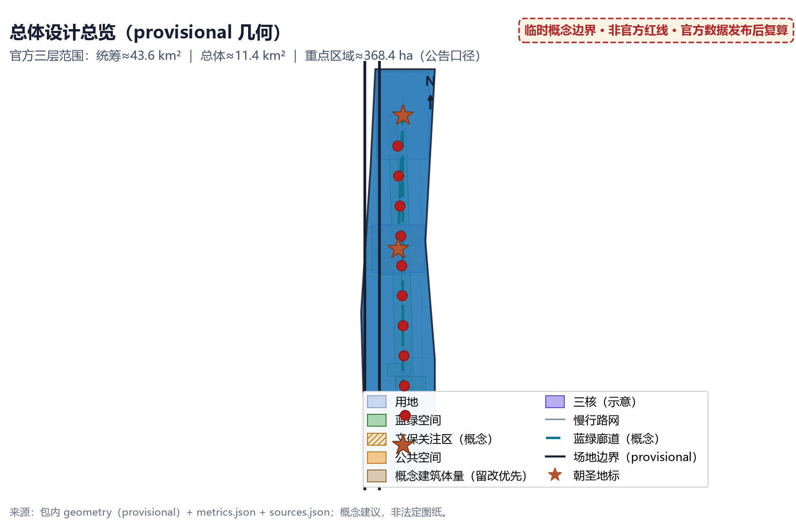
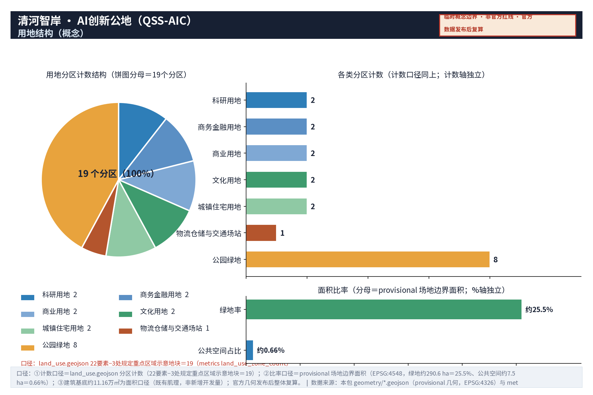
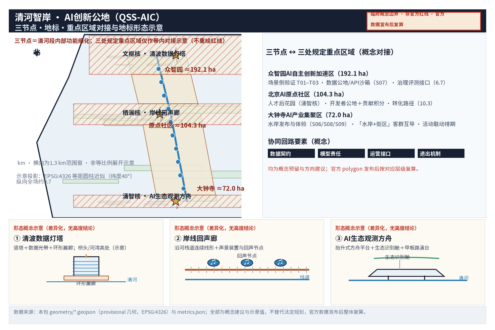
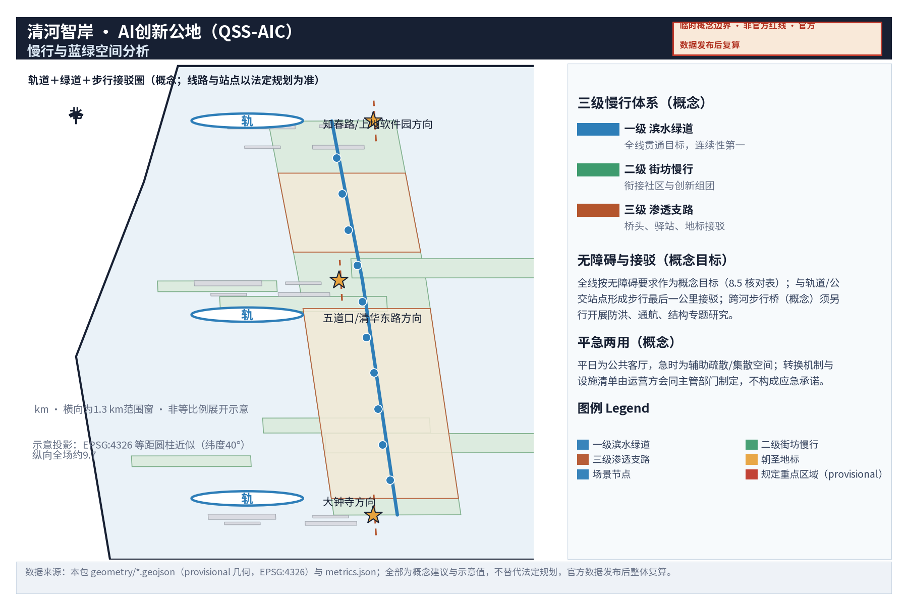
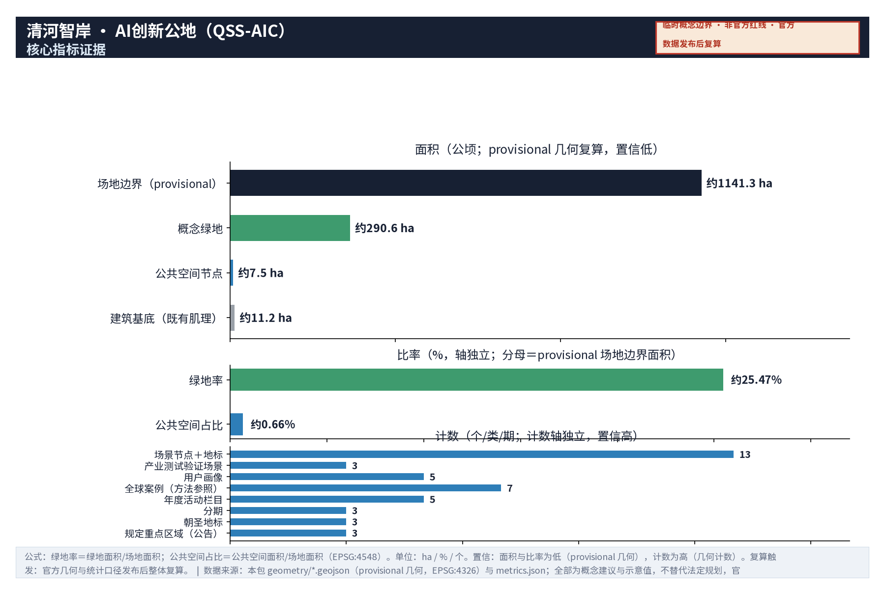
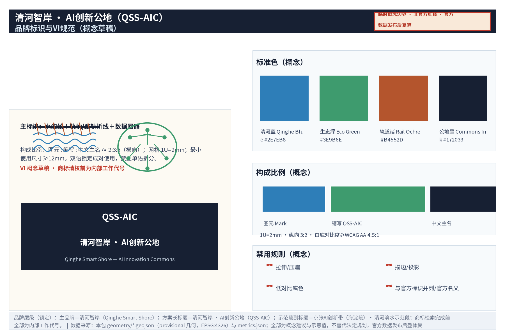

**方案主名称（中文）：清河智岸 · AI创新公地**
**英文名称：Qinghe Smart Shore — AI Innovation Commons（QSS-AIC）**

**品牌命名层级（锁定，本包唯一口径，同步用于正文元数据、A0/A3封面、HTML与全部图件）**：
- **主品牌（品牌名）**：清河智岸（Qinghe Smart Shore）；
- **方案长标题**：清河智岸 · AI创新公地（Qinghe Smart Shore — AI Innovation Commons），缩写「QSS-AIC」；
- **示范段副标题**：京张AI创新带（海淀段）· 清河滨水示范段；
- **使用规则**：以上组合为全文与图面的唯一品牌口径；商标检索完成前全部按**内部工作代号**使用（第12章第5条）。

**方案定位**：本方案是面向「百年京张AI创新带」开放征集的**概念设计方案**，是京张AI创新带（海淀段）的**子系统与示范段——「清河滨水示范段」**：聚焦真实水系节点「清河」及其与京张铁路遗址公园北段、沿线创新组团相邻的滨水段落，以「水岸AI生态修复 + 滨水科创客厅 + 平急两用」三位一体的创新公地构想，承担「都市AI生活体验带」与「AI+场景赋能新范式」在真实水岸的**场景侧体验与验证**职能。方案全部成果均为**概念建议与参考方向**，不替代法定规划，不给出控规调整、容积率、建筑高度、道路红线、工程可行性、投资测算等法定结论；所有面积、比例均为**概念示意值，待正式数据复算**；所有 AI 场景均设**人工复核/人工兜底**，水环境监测类数据仅作展示与研究用途，不替代官方水质监测。

**设计理念**：以「水岸即公地（Waterfront as Commons）」为核心理念——清河不仅是生态廊道，更是 AI 时代共享的**创新公地**：共享的蓝绿基础设施、开放的场景数据、低门槛进入的公共空间、混合共生的功能生态，让河流成为创新要素流动的「湿线」。

**空间结构：一廊三核多点**
- **一廊**：清河智慧蓝绿廊（Qinghe Smart Blue-Green Corridor）——滨水生态、慢行、科创、文化复合走廊；
- **三核**：**文枢核**（清河×京张铁路遗址公园交汇段，文化交汇）、**涌智核**（清河滨水科创客厅段，创新交汇）、**栖澜核**（滨水社区公共空间段，生活交汇）；
- **多点**：AI 场景点、滨水驿站服务点、生态观测点组成的场景网络。

**三层范围与官方公告的对应（摘要）**：按官方公告口径，三层范围为——统筹研究范围约43.6平方公里、总体设计范围约11.4平方公里、重点区域约368.4公顷（三处合计：众智园约192.1、北京AI原点社区约104.3、大钟寺约72.0公顷）。本方案的 provisional 场地边界（复算约11.41平方公里）是**总体设计范围**的临时几何诠释，位于官方三层范围框架之内；三处规定重点区域按任务书要求以第2.3、5、6章的差异化任务证据响应（详见第2章），不重绘官方几何。

**六项必答任务响应对照**：agent.1 概念、命名与一带总体统筹见摘要及第2~4章；agent.2 见第6章（案例表、生态图谱与八类机制）；agent.3 见第6章（10张场景卡、3个测试验证场景、5类人才画像）；agent.4 见第4、5、6、7、9章（三个朝圣地标、组件库与荣誉展示）；agent.5 见第4章（叙事、导视符号系统与国际传播文案）；agent.6 见第10章（活动体系、转化路径与运营机制）。

---

## 设计依据与资料清单

### 1.1 设计依据

本方案依据以下公开信息与工作框架形成，具体文件以提交时公开可查版本为准：

1. 征集任务书及公开背景材料（「百年京张AI创新带」**三大定位**（百年京张文化带、都市AI生活体验带、AI融合创新带）、**五大功能**（AI全栈自主创新体系、世界级AI创新生态、AI+场景赋能新范式、智能化AI活力城市、AI治理全球话语权）、**「三区两翼」**空间格局（AI原点社区、众智园AI自主创新加速区、大钟寺AI产业集聚区，及中关村科技服务翼、小月河场景赋能翼）、沿带真实城市节点、三层范围（统筹研究范围约43.6平方公里、总体设计范围约11.4平方公里、重点区域约368.4公顷））；
2. 北京市及海淀区公开的规划、水务、生态环境相关信息（类别见 1.2）；
3. 京张铁路遗址公园建设进展的公开报道与开园运营信息；
4. 公开的 AI 产业发展政策、行动方案与场景开放类政策文件（类别见 1.2）；
5. 全球知名创新区、滨水更新与智慧城市的公开案例研究（仅作方法参考；七个全球案例及京张/中关村历史陈述的**逐项来源出处、访问时间与复用边界**见 sources.json 条目与第6.1节表，不引用任何未经核实的案例数据）。

**基本工作立场**：本方案所有空间建议均为概念建议，供专业团队深化研究；涉及法定内容的一律指向「由主管部门与法定规划确定」。

### 1.2 资料清单（公开资料类别 + 获取方式）

| 类别 | 主要内容 | 获取方式 | 使用边界 |
| --- | --- | --- | --- |
| 政府公开信息 | 海淀区分区规划公开摘要、北京市水务与生态环境公开信息、河长制公示信息 | 市/区政府官网、水务部门官网公开检索 | 仅引用公开表述，不作专业判断依据 |
| 公开新闻报道 | 京张铁路遗址公园开园与活动报道、清河治理与滨水空间公开报道 | 主流媒体公开检索 | 仅作背景叙事，数据以官方口径为准 |
| 公开统计数据 | 人口、产业、水质公开年报类数据 | 统计部门、生态环境部门公开平台 | 需正式数据复算后方可引用 |
| 公开案例研究 | 全球创新区、滨水更新、智慧城市案例 | 公开出版物与学术文献 | 仅作方法参照，不编造案例数据 |
| 政策文件 | AI 产业、数字经济、场景开放类公开政策 | 政府网站公开文本 | 引用须核验现行有效版本 |

---

> **证据锚点**：[source:DATA-SRC-OFFICIAL-ANNOUNCEMENT-2026-05-09]、[source:DATA-SRC-AGENT-TASKBOOK-2026-05-18]（组织方公告与任务书为文本口径依据）。

## 三层范围工作框架

### 2.1 三层范围划分（官方公告口径 + 本方案定位）

| 层级 | 面积（公告口径） | 本方案响应与定位 | 成果深度 |
| --- | --- | --- | --- |
| 统筹研究范围 | 约43.6平方公里 | 第3章一带产业与未来城市研究（概念级响应）；本方案在带内承担「蓝绿基座与公众感知面」子系统职能；不重绘该范围几何 | 战略研究（概念级） |
| 总体设计范围 | 约11.4平方公里 | 本方案的 provisional 场地边界即该层级的**临时几何诠释**：geometry/site_boundary.geojson 复算约11.41平方公里（[metric:site_area_sqm]，EPSG:4548 投影复算），官方几何发布后整体复算 | 城市设计（概念级，控规深度工作框架） |
| 重点区域 | 约368.4公顷（三处合计：众智园约192.1、北京AI原点社区约104.3、大钟寺约72.0） | 第2.3节协同回路 + 第5章三核联动接口 + 第6章差异化任务证据（T01–T03、S06–S09）；不重绘官方红线，不越界编制三处详细设计 | 重点地段详细设计（概念级任务证据） |

**口径说明**：官方几何（可验证坐标系的总体边界与三处规定重点区域 polygon）尚未发布，本方案全部边界均为 provisional 概念与机器校验输入；三层范围的官方面积值（43.6平方公里/11.4平方公里/368.4公顷）按公告文字口径引用，官方数据发布后统一复算。

### 2.2 工作逻辑

三层范围遵循「战略—结构—节点」的传导逻辑：统筹层回答「滨水与 AI 创新带的关系」，总体层回答「廊道怎么组织」，重点层回答「人的体验与场景如何发生」。每层成果均标注「概念建议，可供专业团队深化研究」，不替代相应层级的法定规划。11.41平方公里（本段 provisional 边界复算值）与公告「总体设计范围约11.4平方公里」口径一致；早期草稿中的「总体设计约2.3平方公里」等旧版概念口径已废止，全文以第11.4节口径对照表为单一事实基线。

### 2.3 任务覆盖：一带总体结构与清河滨水示范段

**一带总体结构（任务书口径）**：京张AI创新带以**三大定位**（百年京张文化带、都市AI生活体验带、AI融合创新带）为总体指向，以**五大功能**（AI全栈自主创新体系、世界级AI创新生态、AI+场景赋能新范式、智能化AI活力城市、AI治理全球话语权）为功能谱系，以**「三区两翼」**（AI原点社区、众智园AI自主创新加速区、大钟寺AI产业集聚区＋中关村科技服务翼、小月河场景赋能翼）为空间骨架。一带不是单一走廊，而是「文化带＋生活带＋创新带」叠合的复合系统，各子系统沿带分工、回路协同。

**清河滨水示范段的子系统定位**：本方案将清河段定位为京张AI创新带（海淀段）的**子系统与「清河滨水示范段」**——以真实水系节点补齐一带的「蓝绿基座」与「公众感知面」：一带的其他节点提供技术体系、产业集聚与要素配置，清河段提供**真实水岸环境的AI场景试验床与公众体验场**（感知层—平台层—应用层的滨水版本，具体分工见第6.2节）。这一定位下，清河段与三处规定重点区域形成以下**概念级协同回路（逐条，即 compliance_matrix 1.5.3.1—1.5.3.3 的差异化任务证据）**：

| 规定重点区域（面积，公告口径） | 任务书角色 | 本方案的差异化任务证据（概念级，非越界设计） |
| --- | --- | --- |
| 众智园AI自主创新加速区（约192.1公顷） | AI全栈自主创新体系与AI治理全球话语权 | ①场景侧验证：T01–T03 三个测试验证场景向众智园技术供给方开放申请（第6.5节，申请—审核—备案制）；②数据公地：S07 开放API沙箱为其数据治理与算法评测提供脱敏样本与公开核算口径（第6.4、10.5节）；③治理评测接口：AI治理评测表（第6.7节）给出输入、验证指标与退出条件 |
| 北京AI原点社区（约104.3公顷） | 世界级AI创新生态 | ①人才后花园：为原点社区人才提供步行可达的滨水交流、路演与共创场域（涌智核科创客厅、S06路演数字墙）；②开发者公地：与原点社区开源开发者社群共用「开发者公地」机制与贡献积分体系（第6.4、10.3节）；③转化路径：人才路径「志愿讲解—实习共创—课题共建」（第10.3节） |
| 大钟寺AI产业集聚区（约72.0公顷） | 智能原生新业态 | ①水岸发布与体验界面：新品发布路演、AI应用公众体验、多语数字导览（S06、S08、S09）与大钟寺业态联动排期；②客群互导：「产业在大钟寺、体验在清河」的「水岸+街区」体验回路（概念级）；③活动联动：年度活动体系排期与大钟寺商圈活动互认（第10.3节） |

**边界声明**：上述内容为清河示范段的**差异化任务证据与接口预留**，不构成对三处规定重点区域的「详细设计完成」声明；三处规定重点区域的详细设计属对应层级的正式编制范围，官方 polygon 发布前本方案不输出其红线、用地或建设结论（compliance_matrix 1.5.3.1—1.5.3.3 同口径）。

**两翼与区域协同（概念方向）**：中关村科技服务翼的要素全球化配置职能，在清河段体现为**开放接口与标准化**（数据契约、场景开放清单、测试验证备案制与中关村IP、资本赋能通道的对接预留）；小月河场景赋能翼的公共体验路径可与清河滨水廊道共同组成**带内「水岸+街区」连续体验回路**——两翼接口点如下表：

| 两翼（任务书） | 本段接口点（概念） | 响应章节 |
| --- | --- | --- |
| 中关村科技服务翼 | 数据契约模板、场景开放清单、T01–T03备案制、IP与资本赋能通道预留 | 第6.7、10.2、10.5节 |
| 小月河场景赋能翼 | 「水岸+街区」连续体验回路：慢行系统接口、多语导览联动、活动排期互认 | 第4.3、8.1、10.3节 |

区域层面，清河段以场景开放标准、脱敏数据契约与活动品牌为纽带，与北纬社区、未来科学城、怀柔科学城、经开区及京津冀方向的创新组团建立**要素协同方向**（算力、测试、数据与活动资源的双向开放，概念建议，不构成任何既成安排）。

**一带整体品牌与Logo方向（概念）**：以四类基本图元（枕木纹、路轨折线、数据回路、水波纹）构建一带级标识系统，主标识以「QSS-AIC」缩写与中文主名组合，节点与活动标识延展「水＋创新＋空间类型」三词根命名体系（第5.4、13章），商标清权前全部按**内部工作代号**处理。

---

> **证据锚点**：[source:DATA-SRC-AGENT-TASKBOOK-2026-05-18]（三层范围划分与一带总体结构依据任务书官方文本口径）、[source:DATA-SRC-OFFICIAL-ANNOUNCEMENT-2026-05-09]（三层范围面积口径）。

## 统筹研究范围产业与未来城市研究

### 3.1 区域研判

沿「三区两翼」格局观察，清河位于海淀北部，与京张铁路遗址公园北段及沿线创新组团相邻。京张铁路承载百年交通记忆，中关村承载中国创新启蒙，AI 承载当下最活跃的产业变革；清河以「水」的柔性把这三条叙事缝合为一条可感知、可漫步、可发生的公共轴向。基于公开信息判断（概念级）：清河是沿带**北段最有潜力成为「蓝绿基座」**的真实水系节点，其价值不在于水体本身的大小，而在于它同时毗邻创新组团与城市社区，具备「创新公地」的空间条件。本层研究范围对应公告「统筹研究范围约43.6平方公里」，本章与第6章以概念级研究响应产业与未来城市议题，不输出该范围的法定研究结论。

### 3.2 滨水经济带逻辑：碧水+科创

滨水经济带的内核是「公共空间的吸引力经济」：

- **场景引力**：滨水公共空间是 AI 场景最容易被公众感知的舞台（生态感知、无人接驳、生成式艺术、平急演练），直接支撑「都市AI生活体验带」定位；
- **人才引力**：创新人才选择城市时看重"步行可达的绿色与活力"，滨水公地是 AI 原点社区与各创新组团之间的「人才后花园」；
- **生态溢价**：水环境改善提升相邻地段的环境品质预期，但本方案**不作出任何地产价值判断与测算**，仅作为城市更新方向的定性依据；
- **时间轴价值**：铁路是"过去的速度"，水是"永恒的基础设施"，AI 是"正在发生的创新"——三者构成的时空叙事是沿带独有的文化资产。

### 3.3 未来城市愿景方向

按照 AI 活力城市与 AI 治理话语权的定位，清河段未来城市方向建议（概念级）：

- **水敏城市**：把"治水"转为"与水共生"——弹性岸线、雨水花园、生态净化展示成为城市日常景观；
- **平急两用**：滨水空间在平日作为公共客厅，在极端天气与应急场景下承担疏散、临时集散、物资中转的**辅助功能**（具体功能配置以应急、水务、属地主管部门要求为准，不作法定承诺）；
- **数智治理窗口**：以公开、可复核的水环境感知数据展示为窗口，探索"数据公地"模式——数据向公众与研究机构开放，但仅作展示与研究用途，不替代官方监测。

---

> **证据锚点**：[source:DATA-SRC-PROVISIONAL-BOUNDARIES-2026-06-05]（边界为 provisional，研究范围仅作概念示意）。

## 总体设计范围城市更新与控规深度城市设计

### 4.1 总体设计概念：一廊三核多点

- **一廊**：以连续性为第一原则，构建「生态岸线—滨水慢行—街坊渗透」三层平行的蓝绿廊道结构，廊道宽度、岸线长度等均以**概念示意值**表达，待正式数据复算；
- **三核**：三核按「文化—创新—生活」的功能谱系错位布局，避免同质化；
- **多点**：场景点与驿站按步行可达间距（概念区间，待复算）布置，形成"走一段、遇一景、用一场景"的密度体验。

### 4.2 城市更新与控规深度设计（概念工作框架）

本方案仅提供**控规深度城市设计的"工作框架"**，不替代法定控规：

1. **滨水退距与通廊**：建议以概念性退距区间（量级区间，待正式数据复算）研究滨水公共空间连续性，最终以水务管理范围与法定规划为准；
2. **天际线与高度**：不做高度结论，仅建议「临水低、向城渐高」的风貌原则与眺望关系研究议题；
3. **地块更新意向**：以「保留—更新—可研究」三分类表达意向（见第7章），不涉及具体地块拆改留结论；
4. **公共空间体系**：广场、驿站、桥头空间、街巷渗透点构成"点—线—面"网络。

### 4.3 百年京张、中关村与 AI 新文化叙事及导视符号系统

**叙事三章**：

- **第一章·轨道记忆（百年京张）**：枕木、道钉、站台、机车的铁路符号；
- **第二章·创新启蒙（中关村）**：柜台、电子元件、屏幕光的市井创新符号；
- **第三章·开源公地（AI 新文化）**：数据流、回路、节点网络的开放符号。

**导视符号系统（概念）**：以四类基本图元构建统一语言——①枕木纹（历史）、②路轨折线（交通与延续）、③数据回路（AI 与开源）、④水波纹（清河本体）。图元组合生成分级导视：**地标级**（清波数据灯塔等三个朝圣地标）、**廊道级**（慢行标识与里程柱）、**场景级**（AI 场景点标牌）、**铺装级**（地面嵌入符号）。AI 辅助导视（语音导览、AR 叠写）的知识库须**人工审核后上线**，确保历史叙事准确。

**国际传播文案方向（概念）**：国际传播采用**中英双语叙事与面向国际访客的解说体系**——统一英文名称QSS-AIC与中英文平行导览、图册与数字界面，设国际访客自助解说与多语人工导览，以「数据可见、水岸可读、创新可参与」为传播主线；英文表述与中文口径、指标与证据图位逐项等值核对后再发布（第4、6、11章内容为核对范围）。

### 4.4 风貌控制概念

建议「水岸低柔、城侧明晰」：近水以自然化岸线与低介入构筑物为主；桥梁与地标装置允许"高识别度、轻触地面"的构筑表达；建成界面沿河一侧鼓励通透、遮蔽立面退让；照明以低照度生态照明为主，减少对水鸟栖息的光干扰（光环境控制为风貌议题之一，不作工程结论）。

---

> **证据锚点**：[source:DATA-SRC-MOHURD-CONTROL-DETAILED-PLANNING]、[source:DATA-SRC-PROVISIONAL-BOUNDARIES-2026-06-05]。

## 重点区域详细设计

> 本章「三节点」均为沿清河的**真实可指认城市段落**（交汇段、滨水科创客厅段、滨水社区公共空间段），是清河示范段**内部的功能细化**，不是任务书规定的三处重点区域（众智园/原点社区/大钟寺）；三处规定重点区域的差异化任务证据见第2.3节与第6章，其详细设计与红线属对应法定编制范围。三节点具体边界以正式地形与权属数据复算为准，本方案仅作概念建议。

### 5.1 文枢核：清河×京张铁路遗址公园交汇段

- **位置指认**：清河与京张铁路遗址公园北段相邻的滨水段落（概念示意）；
- **设计概念**：「轨道与水流的历史握手」——铁路高架/地面遗迹与河道在视觉与步行上互相"看见"，设置**跨河步行桥（概念建议，桥名建议「澄波桥」）**强化两廊交汇；
- **核心地标**：**清波数据灯塔**（见 5.4）；
- **主要功能**：京张历史叙事起点、水环境感知展示、研学集散、文化事件场地。

### 5.2 涌智核：清河滨水科创客厅段

- **位置指认**：毗邻上地/中关村软件园方向创新组团的清河滨水段落（概念示意）；
- **设计概念**：「把会议室搬到水边」——滨水科创客厅以开放路演台、模块化共创舱、24小时共享驿站构成"无围墙的创业公地"，与既有创新组团错位互补，不重复建设园区设施；
- **核心地标**：**AI生态观测方舟**（见 5.4）；
- **主要功能**：开放路演、场景展示、开发者交流、轻量化共创空间（概念建议，规模区间示意，待复算）。

### 5.3 栖澜核：滨水社区公共空间段

- **位置指认**：清河沿线以居住功能为主、滨水可达性待提升的城市段落（概念示意）；
- **设计概念**：「社区的水岸客厅」——亲水台阶、雨水花园、儿童自然课堂、银发友好驿站与社区菜园构成日常生活场景；该段同时是**平急两用**重点研究段：平日为社区公地，急时为辅助疏散与集散空间（功能与设施以主管部门要求为准）；
- **核心地标**：**岸线回声廊**（见 5.4）；
- **主要功能**：亲水游憩、自然教育、社区活动、辅助应急功能。

### 5.4 三个原创 AI 朝圣地标

| 地标名称（中/英） | 空间位置建议 | 形态概念 | 体验方式 |
| --- | --- | --- | --- |
| **清波数据灯塔**（Data Beacon of Qinghe Waves） | 文枢核·清河与京张遗址公园交汇段桥头或河湾高处（概念示意） | 竖向上小下大的"灯塔"式构筑，塔身环绕可读的数据光带：将水环境感知数据以"数据瀑布"形式可视化；塔基为环形展示厅，兼具小型展陈与休憩功能 | 白天阅读数据光带与历史年表并置的"双子时间轴"；夜间观看生态灯光节律；AR 扫码叠加京张历史影像（知识库人工审核）；可与科研机构共建展陈，水质数据仅展示与研究用途 |
| **岸线回声廊**（Shoreline Echo Gallery） | 栖澜核·社区段沿河栈道串联的连续廊道（概念示意） | 由回收再利用理念启发的枕木纹步道、声景装置与"回声节点"组成；装置采集并重放水声、风声、脚步与铁路记忆声景，形成可听的地图 | 盲文/语音导览优先设计；每个回声节点设"听澜"打卡点；社区儿童可在**监护人书面同意、可随时撤回**机制下参与**环境与集体声景**采集（不采集可识别个人的语音与未成年人个人信息，上传内容脱敏并经人工审核后发布；数据流程见第6.4节 S02 卡） |
| **AI生态观测方舟**（AI Eco-Watch Ark） | 涌智核·滨水科创客厅段河湾处（概念示意） | 抬升式/近岸式"方舟"形态观测平台，舱体集成生态识别展示（鸟类、植物、水生生物影像识别为研究与科普用途）；甲板兼作小型路演与观演台 | 面向公众的"自然识别窗口"与面向研究机构的共建观测界面；识别结果标注「AI 辅助识别，以专业人员复核为准」；方舟夜间转作生态课堂与星空观测 |

**命名体系**：全带以「水（清/澜/澄/听）+ 创新（智/汇/创/枢）+ 空间类型（廊/桥/台/灯塔/方舟）」三词根组合命名子要素，如澄波桥、听澜栈、观澜台、智汇驿等，保证系统性与可延展性。**声明**：名称均为本方案原创构思，若与既有参赛方案或实际地名重名，以提交时查重及主管部门意见为准；商标清权前按内部工作代号使用（第12章）。

### 5.5 公共空间组件库与荣誉展示体系（概念）

**公共空间组件库（5类概念组件）**：统一模数、统一图元语言，保证「走一段、认得出」的连续体验，全部组件为可逆、低介入、模块化方向，不预设工程量：

| 组件 | 形态概念 | 可逆性与材料 | 应用位置 |
| --- | --- | --- | --- |
| 模块化驿站单元 | 30–80㎡箱体式驿站：信息屏、直饮水、充电、急救包、无障碍接口 | 模块化拼装、可整体迁移，回收材料优先 | 廊道节点与三核 |
| 亲水台阶与生态岸线组件 | 缓坡亲水台阶、生态石笼护坡、雨水花园示范单元 | 天然材料、低介入、可逆，防洪影响另作专题研究 | 栖澜核与自然岸段 |
| 四级导视标牌系统 | 地标级/廊道级/场景级/铺装级图元标牌（含盲文与语音码） | 标准化模数、可更换面板 | 全廊 |
| 数据展示界面单元 | 信息屏、数据光带、二维码/AR入口（多语） | 低能耗、可关闭、离线人工替代 | 三核与驿站 |
| 平急两用与荣誉展示复合单元 | 可切换功能标识、展柜、电子荣誉墙 | 快装快拆，切换指令由运营方人工确认 | 平急两用节点与科创客厅 |

**荣誉展示体系（概念）**：展示对象限定为共建成果、活动与赛事荣誉、志愿者与开发者贡献、经授权的公共艺术作品；内容全部经**人工审核与授权公示**后发布；形式上采用数字荣誉墙＋实体展柜＋年度更新的组合；边界上不展示个人隐私信息、不夸大成果，授予与撤回规则公开可查。荣誉不直接对应商业权益，仅作公共肯定（概念建议口径）。

---

> **证据锚点**：[data:geometry/key_areas.geojson#key-areas]（三节点示意多边形来自本包 geometry/key_areas.geojson；三处规定重点区域仅作带内对接示意，不输出其红线）。

## AI 创新生态、人才画像与 AI+ 场景

### 6.1 世界级AI创新生态：方法参照案例（7个，仅作方法参考，不引用其数据）

| 案例 | 类型 | 可借鉴的方法（非数据对标） | 来源出处（出版方/机构页面） | 访问时间 | 复用边界 |
| --- | --- | --- | --- | --- | --- |
| 波士顿剑桥 Kendall Square | 大学锚定型创新区 | 锚机构+高密度公共空间+风险资本邻近的"步行创新圈"组织方式 | Brookings《The Rise of Innovation Districts》（Katz & Wagner，2014）；机构页面 kendallsquare.org | 2026-08-10 | 仅方法参照；不引用其统计数据，详见 sources.json |
| 伦敦国王十字（King's Cross） | 铁路遗产地更新 | 铁路遗产地再开发中"公共空间先行、文化地标塑形"的公地运营思路（与京张主题高度相关） | King's Cross Central Limited Partnership 官方项目页 kingscross.co.uk | 2026-08-10 | 仅方法参照；不引用其经济与人口数据，详见 sources.json |
| 巴黎 Station F | 旧铁路场站改造创业社区 | 存量交通遗存改造为开放创业公地，以"活动与社区运营"为核心资产 | Station F 官方页 stationf.co | 2026-08-10 | 仅方法参照；不引用其入驻企业统计，详见 sources.json |
| 巴塞罗那 22@ 创新区 | 旧工业区更新 | 创新与居住、公共空间再平衡的混合用地组织方式 | 22@Barcelona 官方页 22barcelona.com | 2026-08-10 | 仅方法参照；不引用其面积与投资数据，详见 sources.json |
| 新加坡纬壹科技城（one-north） | 产城融合园区 | 园区级公共绿地作为"社交中枢"，以及城市级智慧水务管理的公开界面 | JTC Corporation 官方页 jtc.gov.sg（one-north 板块） | 2026-08-10 | 仅方法参照；不引用其指标数据，详见 sources.json |
| 斯德哥尔摩 Kista 科学城 | 产业集群社区化 | 企业、高校、社区共用的公共设施与开放交流空间 | Kista Science City 官方页 kistasciencecity.se | 2026-08-10 | 仅方法参照；不引用其产业数据，详见 sources.json |
| 多伦多 Quayside（Sidewalk Labs）反思案例 | 智慧滨水区（失败案例） | 智能城市中"数据治理、公共性优先"的警示：技术介入必须以公共价值与公众审议为前提 | Waterfront Toronto 官方页 waterfrontoronto.ca；Sidewalk Labs 2020-05-07 停止声明 | 2026-08-10 | 仅作负例方法警示；不引用其技术细节数据，详见 sources.json |

**方法结论（概念级）**：世界级 AI 创新生态的共同点不是建筑高度或企业名单，而是「锚点机构 + 开放公地 + 低成本试错空间 + 高频活动」四要素。清河段不复制任何案例，只借鉴其"公地组织"方法。

### 6.2 AI全栈自主创新体系的空间化建议（概念级）

呼应「AI全栈自主创新体系」功能定位，建议清河段承担其中**「场景侧的体验与验证」**职能，与原点社区（生态）、众智园（技术体系与治理话语权）、大钟寺（产业集聚）形成分工（协同回路见第2.3节）：清河提供"真实水岸环境的 AI 场景试验床与公众体验场"，包括感知层（水环境监测展示、生态识别）、平台层（开放 API 沙箱与数据公地界面）、应用层（慢行助手、导览、应急演练展示等）。技术体系本身由指定创新组团承担，本方案不越界定义。

**AI创新生态图谱与八类要素机制（概念建议）**：图谱以「一带统筹—清河示范」为两层结构：一是带级锚点（原点社区生态、众智园体系、大钟寺业态、两翼服务），二是清河场景侧节点（感知、平台、应用三层）；要素机制按八类表述——**土地**（存量优先、轻介入，不新增开发量承诺）、**空间**（可逆模块、蓝绿叠加）、**产业**（场景共生、展示验证）、**资金**（公益与共建方向，不含投资与政策承诺）、**人才**（开发者社区、志愿与实习体系）、**算力**（开放接口与共享方向）、**数据**（匿名聚合数据公地）、**场景**（开放清单与测试验证备案制）。八类机制均为概念建议，供专业团队与主管部门深化。

### 6.3 用户画像（5类人才画像，与 metrics.json persona_count=5 一致）

| 画像 | 核心诉求 | 典型行为 | 对应空间/场景 |
| --- | --- | --- | --- |
| 通勤开发者与工程师 | 午间喘息、通勤顺路、偶遇交流 | 午休漫步、露天路演围观、代码间隙发呆 | 涌智核驿站、回声廊 |
| 水岸从业者与初创团队 | 低成本路演、曝光、找人 | 预约开放路演台、参与黑客松、水岸办公接驳 | 滨水科创客厅、方舟甲板 |
| 高校师生与科研人员 | 真实环境数据样本、科普输出 | 生态观测共建、传感器示范观察、研学课 | 观测方舟、数据灯塔展陈 |
| 生态爱好者与研学游客 | 体验水岸生态与文化、拍照记录 | 朝圣地标打卡、AR 导览、声景采集、夜行活动 | 三处地标、回声廊、导视系统 |
| 活力家庭与社区居民（含银发长者） | 日常可达、安全舒适、被照顾 | 晨练、遛弯、下棋、亲子自然课堂、听声景 | 栖澜核亲水台阶、驿站、儿童课堂 |

> 应急相关工作人员不作为日常画像单列，其需求沉淀于平急两用机制与演练场景（第5.3、8.4、10.5节）；画像为概念性整理，具体构成以运营后的调研为准。

### 6.4 AI日常场景卡（10张，S01–S10）

> 通用边界：所有场景均为概念建议；所有 AI 输出均设**人工复核/人工兜底**；涉及水环境数据仅作展示与研究用途，不替代官方水质监测；涉及个人数据遵循最小化、可关闭与注销原则；场景均为「先运营试验、后工程固化」的试点对象（第10章）。

| 场景卡编号与名称 | 目标 | 输入与数据流 | 输出 | 模型能力边界 | 运营与责任主体 | 数据与隐私边界 |
| --- | --- | --- | --- | --- | --- | --- |
| S01 清波智感·水环境感知展示 | 把水环境感知数据转化为可读的公共知识，培育"数据公地"意识 | 自采感知设备的脱敏数据流 → 数据公地界面（开放API、匿名聚合）→ 可视化引擎 | 数据灯塔光带、廊道信息屏、网页图表（标注非官方口径） | 仅做展示级可视化与趋势示意，不输出水质评价或监测结论；置信度低时显示"数据待复核" | 运营共同体+科研机构共建；发布前人工核验 | 仅使用自采或公开脱敏数据，不采集个人信息，不替代官方监测 |
| S02 岸线回声·声景AI导览 | 以声景讲述水岸与铁路记忆，提供无障碍文化导览 | 公众投稿声景（人工审核后入库）+ 人工审核历史知识库 → 检索/生成模型 → 语音播放 | 回声节点语音导览、盲文/语音优先界面、"听澜"打卡 | 生成内容仅作导览素材；历史知识库人工审核后上线；超范围问题不回答 | 运营共同体内容组+志愿者 | 未成年人数据流程：未成年人可在**监护人书面同意且支持随时撤回**的前提下参与**环境与集体声景**采集——仅采集自然环境与集体氛围声，不采集可识别个人的语音、肖像及未成年人个人信息；所有上传经脱敏与人工审核后发布；录音素材公开许可明示 |
| S03 智岸同行·无障碍慢行助手 | 让不同能力的使用者安全走完水岸 | 廊道公开地图数据 + 用户授权位置数据（最小化、可关闭）→ 路径规划模型 | 无障碍路径推荐、障碍提醒、紧急求助联动 | 路径推荐为辅助建议，不替代现场无障碍设施法定合规；紧急求助人工响应兜底 | 运营方+属地无障碍与应急联动 | 位置数据脱敏、可关闭、限期删除；不进行个体识别式追踪 |
| S04 观澜识别·生态AI学习卡 | 面向公众与研学的生态科普 | 方舟近岸自采影像 → 影像识别模型 → 学习卡生成 | 鸟类/植物/水生生物学习卡、识别标签 | 识别为AI辅助，标注"以专业人员复核为准"；不输出科研结论；低置信度提示咨询专家 | 科研机构共建+志愿者讲解；专业人员复核标签 | 仅处理自然环境影像，不拍摄可识别个人信息的内容；影像公开范围按许可 |
| S05 平急推演·洪涝态势展示屏 | 普及防汛知识、演示平急转换逻辑（演示用途） | 官方公开预警与公开水文信息（标注口径）→ 态势推演演示模型 → 展示屏 | 洪涝态势演示、平急转换指引、演练信息 | 仅演示，不替代官方预警体系；不使用任何未公开的数据 | 运营方+属地应急部门联动 | 仅引用官方公开口径并标注；不处理个人数据 |
| S06 科创客厅·AI路演数字墙 | 让路演与共创内容被更广人群理解（含多语） | 路演音频（讲者授权）→ 转写/摘要/翻译模型 → 数字墙 | 双语字幕、摘要、多语翻译、授权回放 | 转写与翻译为辅助工具，重要内容人工复核；不自动发布 | 运营共同体+讲者授权确认；发布前人工审核 | 演讲内容版权归讲者；未经授权不采集参会者信息 |
| S07 开发者公地·开放API沙箱 | 以脱敏数据接口支持开发者试错与共建 | 脱敏/自采数据集 → API网关（申请—审核—备案）→ 沙箱环境 | 数据接口、示例程序、季度运行报告 | 仅开放脱敏与自采数据；按用途分级授权；不开放原始个体级数据 | 运营共同体技术组；接口申请人工审核；贡献积分仅作荣誉激励 | 只提供匿名聚合数据；日志限期保存 |
| S08 智游打卡·活动徽章系统 | 把活动与场景串联为可感知的一日体验 | 活动排期与场景点位（公开）→ 路径推荐与打卡逻辑 | 活动路径推荐、集章徽章、活动地图 | 推荐为公开信息聚合，不涉及个人行为画像；活动秩序人工管理 | 运营共同体活动组+志愿者 | 参与数据最小化、匿名聚合；可随时退出并注销 |
| S09 中关村问答亭·知识对话 | 以可信知识回答京张与中关村史问题 | 人工审核知识库+公开史料 → 检索增强对话模型 → 亭内交互 | 限域问答、史料卡片、延伸阅读（公开出处） | 只回答知识库覆盖范围；超范围明确拒答；历史叙事人工审核后上线 | 运营共同体内容组+文化机构指导 | 不接入未公开档案；对话记录匿名聚合用于质量评估 |
| S10 水岸生成艺术·环境数据公共艺术屏 | 以实时环境数据生成公共艺术，让数据被看见 | 环境感知聚合统计值（风速、水温、人流热度匿名聚合）→ 生成模型 → 艺术屏 | 生成艺术画面、节律灯光联动（低照度生态照明） | 画面由模板与数据驱动，内容模板人工审定；不涉及个体数据 | 运营共同体+艺术家协作；内容季度审定 | 仅使用聚合统计值；不进行个体识别式追踪、禁止过度监控 |

### 6.5 产业测试验证场景（3个，T01–T03，均须合规审批）

> 三个产业测试验证场景对应 metrics.json 的 industry_test_scenario_count=3，全部实行申请—审核—备案制、限定条件开放，不视为已批准运营。

| 测试对象 | 数据输入 | 验证指标 | 退出条件 |
| --- | --- | --- | --- |
| T01 水环境智能感知设备示范验证区（感知设备+识别模型） | 自采感知数据与影像（脱敏公开） | 与官方监测并行比对的一致性、设备可用率、误报率 | 连续三个月比对偏差超阈值或审批撤销时撤除并转为人工监测；可选扩展方向：低空视觉巡检须另行满足低空管理规定 |
| T02 滨水无人接驳与环卫机器人示范环（人机共行） | 示范段环境数据与匿名聚合轨迹 | 人机冲突事件数、急停与安全员响应时间、用户满意度 | 安全事件或投诉超限即暂停并转人工接管；仅封闭或半封闭段运行 |
| T03 平急两用数字孪生演练（推演模型） | 官方公开预警与脱敏预案数据 | 疏散路径可行度、响应时间（演练场景）、转换指令正确率 | 演练评估不达标转为桌面研讨；不对外宣称演练结论，不替代法定应急预案 |

### 6.6 场景—空间—运营映射

| 空间层级 | 承载场景 | 运营模式建议 |
| --- | --- | --- |
| 地标/节点 | S01、S04、S05、S06、S09 | 政府公共服务+科研机构共建+志愿者 |
| 廊道/慢行 | S02、S03、S08、S10 | 场景开放清单+公开活动排期 |
| 驿站/社区段 | S07（儿童自然课堂等社区运营内容并入第9、10章） | 公益运营+社区共治+开发者社群认领 |
| 测试验证环 | T01、T02、T03 | 申请-审核-备案制，限定条件开放 |

### 6.7 人工复核与数据边界总原则

每个 AI 场景都遵循「AI 原生生成、人工复核发布、数据按用途分级」：①凡面向公众的知识、历史、应急、水质内容，发布前必须人工复核；②水环境数据一律标注"仅作展示与研究用途，不替代官方水质监测"；③个人数据最小化采集并支持注销；④AI 参与度分级公示（纯人工/人机协同/AI 原生）写入场景卡。跨场景机制以四项概念机制统一：**数据契约**（每场景的输入输出范围、脱敏规则与保留期限写进场景卡）、**模型责任**（模型提供方与运营共同体共同担责，责任边界公示）、**运营接口**（开放API+人工复核发布双通道）、**退出机制**（评估不达标即下线或转型，见第10.5节）。全廊数据仅作**匿名聚合**处理并**人工复核**兜底，**不进行个体识别式追踪**，**禁止过度监控**。

**AI治理评测表（概念，对应「AI治理全球话语权」的实证接口）**：

| 治理评测要素 | 输入 | 验证指标（概念） | 退出条件 |
| --- | --- | --- | --- |
| 内容与知识库治理 | 公开知识库+脱敏数据契约 | 发布前人工复核率100%、错误更正时限公开 | 连续出现未复核发布即暂停相关场景并复盘 |
| 数据与隐私治理 | 匿名聚合日志、注销台账 | 匿名聚合比例100%、注销响应时限达标、季度数据治理报告公开 | 出现个体识别事件即下线相关数据接口并公告 |
| 模型与运营治理 | 场景备案清单、季度评估报告 | 场景可用率、公众反馈闭环率、投诉处理时限 | 安全、满意度、费用任一维度不达标即暂停、下线或转型（第10.5节） |

### 6.8 试点级数据字典、模型性能基线与多智能体协作流程（概念）

为回应试点阶段的可实施深度，本方案以概念框架形式预置「数据字典—性能基线—协作流程」三项试点工具；三者均为方向性框架，不含任何预设数值结论，试点启动后由运营共同体会同科研机构在共建基准集上测定并公示：

**试点级数据字典（概念框架）**：试点场景（S01、S03、S04、S07、T01–T03）的数据条目统一按「口径与来源—脱敏与保留期—用途分级与复算触发」三列登记，凡试点启动即按本字典发布数据契约，不采集个人数据：

| 数据条目（试点） | 口径与来源 | 脱敏与保留期 | 用途分级与复算触发 |
| --- | --- | --- | --- |
| 水环境感知自采值（S01/T01） | 自采设备；与官方监测并行比对 | 匿名聚合；限期保留，试点评估后删除 | 仅展示/研究；官方数据发布后切换口径 |
| 慢行路径与障碍事件（S03） | 授权位置数据的聚合统计 | 最小化、可关闭、限期删除 | 无障碍辅助建议；不进行个体识别式追踪 |
| 生态影像识别记录（S04） | 近岸自采影像 | 仅处理自然环境影像；公开范围按许可 | 科普用途；专业人员复核标注 |
| API沙箱调用日志（S07） | 脱敏数据集与用途登记 | 日志限期保存；匿名聚合 | 开发者试用；贡献积分仅荣誉激励 |
| 演练与转换指标（S05/T03） | 官方公开信息与脱敏预案 | 不处理个人数据 | 演示用途；不替代官方预警 |

**模型性能基线（概念框架）**：各试点模型上线前须在共建基准集上完成首次基线测定，测定方式、样本口径、数据时点与复算触发一并公示；此后按季度复测更新。基线阈值采用「区间+复算触发」表述，具体数值不在此概念阶段预设，避免制造虚假精度；任一复测低于基线即触发人工复核与重新评测。

**多智能体协作流程（概念）**：试点场景的 AI 能力按「感知—聚合—复核—发布」四步流程协作运行：感知智能体读取脱敏数据流（仅匿名聚合）→ 聚合智能体完成统计与分级 → 复核智能体执行规则校验并进入人工复核队列（关键决策人工复核）→ 发布智能体输出标注界面。任何一步置信不足即转为人工兜底；全流程不采集个人识别信息、不进行个体识别式追踪、禁止过度监控。

---

> **证据锚点**：[source:DATA-SRC-GENERATIVE-AI-INTERIM-MEASURES]（AI 生成内容治理表述的参照依据）。

## 用地、建筑规模与拆改留方案

> 本章仅为**概念框架**，不涉及地块拆改留结论、不给出容积率与建筑高度、不做开发量承诺；具体用地以法定规划与权属调查为准。

### 7.1 用地分类建议（保留—更新—可研究）

| 分类 | 对象（概念性） | 建议策略 | 说明 |
| --- | --- | --- | --- |
| 保留类 | 京张铁路遗址公园、现状河道与滨水绿地、公共服务设施、现状居民区 | 原真保护、功能织补、界面改善 | 不拆改，以公共空间与设施完善为主 |
| 更新类 | 滨水沿线的低效厂房、仓储与闲置地（**须经专业团队调研识别**） | 轻介入更新：文创科创转化、驿站化改造 | 改造方案须另行专题研究并履行法定程序 |
| 可研究类 | 滨水退距内的权属与功能关系、桥梁与驿站选址 | 列入深化研究清单 | 由专业团队结合水务、权属、交通数据复算 |

### 7.2 规模区间示意（概念）

- 滨水蓝绿廊道宽度：**量级区间示意（如数十米量级），待正式数据复算**；
- 重点节点规模：均以"节点单元+周边协调区"概念表达，**无具体面积结论**；
- 新增建筑/构筑物：全部限定为驿站、观测平台、展示类**小型公共构筑物**。其中，**新增小型公共设施建筑面积为概念区间，约1万–2万平方米**——推导与校验关系如下表（需求侧—容量侧—三期安排逐项可复核，非开发量承诺，正式数值以立项与图纸阶段核算为准）：

| 推导要素 | 概念取值（区间） | 推导依据与校验 | 三期安排（第10.4节） |
| --- | --- | --- | --- |
| 需求侧 | 服务半径约500米（5–10分钟步行）；驿站沿廊间距约300–600米 | 步行可达概念区间；以运营后调研与人群分布复算 | 近期最小试点先建1处样板驿站校准 |
| 容量侧 | 三核每核约2–4处；廊道段沿线每公里约2–3处；社区段约3–5处 | 节点功能组合与平急两用配置的概念容量 | 中期廊道贯通时分批布局 |
| 设施总量 | 全廊约40–70处（驿站与观测类小型设施） | 合计校验：40 ≈ 3核×3 + 10公里廊道×2.5 + 社区5处；70 为高密度情景上限 | 远期全廊成型 |
| 单体规模 | 每处约150–400平方米 | 模块化驿站30–80㎡、观测平台与配套取低值组合；随试点调整 | 近期样板实测后修订 |
| 新增总量 | 约1万–2万平方米 | 低值：约50处×200㎡≈1.0万㎡；高值：约60处×330㎡≈2.0万㎡；区间两端（40×150=0.6万与70×400=2.8万）不入对外表述以防误导 | 随分期实施滚动核算 |

- 作为对照，本方案现行建筑基底总面积约**11.16万平方米**（[metric:building_footprint_area_sqm]，provisional 几何复算值，主要对应保留/更新类建筑轮廓，视为既有肌理而非新增开发量）。

### 7.3 原则声明

本方案遵循「少拆多改、能不拆则不拆、拆改留均须法定程序」原则；任何涉及现状用地与建筑的调整意向，均不构成规划结论，仅供后续控规深化与城市更新研究参考。

---

> **证据锚点**：[source:DATA-SRC-MNR-LAND-USE-CLASSIFICATION-202311]（用地分类名称参照现行国标口径）。

## 交通、轨道、市政与公共服务设施

### 8.1 滨水慢行与绿道贯通（概念建议）

- 构建「一级滨水绿道 + 二级街坊慢行 + 三级渗透支路」三级慢行体系，绿道贯通率作为建议指标（见第11章）；
- 无障碍优先：全线坡度、接口、驿站设计按无障碍要求作为概念目标；
- 与沿带轨道站点、公交站点、骑行网络形成**步行最后1公里接驳**概念（具体接驳设施以交通部门研究为准）。

### 8.2 桥梁与步道联系

- 建议在文枢核增设**跨河步行桥（概念建议）**及若干桥头空间，加强遗址公园两翼与滨水带的可达性；
- 新建桥梁均须单独开展通航、防洪、景观、结构专题研究，本方案不作出技术结论。

### 8.3 轨道与公交接驳（概念）

依托沿带既有轨道与公交网络（如知春路、上地/中关村软件园等方向的城市公共交通体系，**具体线路与站点以法定规划为准**），建议研究"轨道+绿道+步行"的换乘衔接关系与沿线标识连续性，提升滨水段的公共交通可达性与最后一公里体验。

### 8.4 市政与智慧设施接口（概念）

- 智慧灯杆、环境感知装置、直饮水、充电与无线网络接口按**预留原则**布设，形成"一杆多用、接口开放"的市政设施框架（设施点位与供电条件待专业团队复核）；
- 海绵城市与雨水花园结合市政排水分区布置（方向性建议，深化须以市政专项研究为准）；
- 平急两用节点的水、电、通信保障接口作为概念预留项，应急功能以主管部门规定为准。

### 8.5 无障碍概念核对表（概念目标，供专业团队接续核对）

> 本表把「无障碍目标」从原则性表述转为逐项可核对的概念清单；每一项均为**概念目标**，最终合规以《无障碍环境建设法》及无障碍设计标准执行与现行规范复核为准（[source:DATA-SRC-BARRIER-FREE-ENVIRONMENT-LAW]）。

| 核对项（概念） | 概念目标 | 核对阶段 | 责任方（概念） |
| --- | --- | --- | --- |
| 无障碍主路径连续 | 滨水主路径坡度、宽度按无障碍要求作为设计目标，全线无台阶断点 | 方案深化/施工图 | 专业设计团队+运营方 |
| 盲道与视觉导引 | 盲道连续、色彩对比导引（视觉障碍）与地面触感导引 | 方案深化/施工图 | 专业设计团队 |
| 信息无障碍 | 盲文/语音/多语导览、AR 知识库人工审核后上线 | 场景上线前 | 运营共同体内容组 |
| 驿站与卫生间 | 至少一座无障碍卫生间与无障碍服务窗口（概念） | 方案深化 | 专业设计团队 |
| 轮椅与婴儿车停放 | 亲水平台、路演区预留停放与回转空间 | 方案深化 | 专业设计团队 |
| 紧急求助 | 全廊求助按钮/人工响应兜底联动（含平急两用转换） | 运营启动前 | 运营方+属地应急联动 |
| 儿童与银发专项 | 儿童自然课堂防跌落围护、银发驿站座椅间距与休息频次 | 运营启动前 | 运营共同体会同社区 |
| 数字界面无障碍 | 屏幕阅读器兼容、字号可调、离线人工替代 | 场景上线前 | 运营共同体技术组 |

---

> **证据锚点**：[source:DATA-SRC-MOHURD-URBAN-DESIGN-MEASURES]（市政与慢行设计表述的方法参照）。

## 蓝绿空间、公共空间与城市风貌

### 9.1 生态岸线：方向与原则（不作工程结论）

- **方向**：优先自然化、近自然化岸线；保留现状植被与生境；以植物群落、缓坡与浅滩恢复岸线生态连续性；
- **原则**：最小干预、生境优先、分段施策——不同岸段（自然段/公园段/城市段）采取差异化方向；
- 所有岸线改造均为**方向性建议**，工程做法、断面形式与防洪影响必须由水务、生态专业团队开展专题研究，遵循防洪与河湖管理相关规定。

### 9.2 湿地与雨水花园

- 建议结合场地条件布置**表流湿地/雨水花园示范单元**（概念），承担雨水净化展示、雨水调蓄辅助与自然教育功能；
- 水质净化效果不作出量化承诺，仅作为示范研究方向；水体功能定位服从水功能区划与水务管理要求；
- 运行维护成本纳入运营方案研究，避免"建而不养"。

### 9.3 亲水公共空间

- 亲水台阶、观澜台、戏水观察点（不设直接接触水体的戏水设施，安全优先）、树荫座椅构成"可坐、可看、可听、可学"的日常亲水序列；
- 亲水安全：设置分级警示、救生设施点位与应急响应联动（人工响应体系兜底）；
- 公共空间考虑**平急两用**：平日为活动场地，急时为辅助疏散集散场地，转换机制与设施清单由运营方与主管部门共同制定。

### 9.4 城市风貌控制概念

- 临水界面强调「低、柔、透、亮而不扰」；
- 夜景以生态照明与人文节庆照明为主，控制光污染；
- 导视、家具、铺装统一在图元系统（第4.3节）下设计；
- 风貌管控要求以「设计导则（概念稿）」形式输出，供控规与城市设计深化采用，不替代法定风貌管控文件。

---

> **证据锚点**：[source:DATA-SRC-MOHURD-URBAN-DESIGN-MEASURES]（蓝绿空间组织的方法参照）。

## 更新项目清单、实施政策与分期计划

### 10.1 项目包（概念清单）

| 项目包 | 内容（概念） | 属性 |
| --- | --- | --- |
| 蓝绿筑基包 | 生态岸线方向研究、湿地示范单元、雨水花园、生态照明 | 生态/公共 |
| 场景公地板 | 三地标、驿站群、场景卡设施、API沙箱 | 创新/公共 |
| 慢行联通包 | 绿道贯通、跨河步行桥（概念）、无障碍改造 | 交通/公共 |
| 社区亲水包 | 亲水台阶、儿童自然课堂、银发驿站 | 社区/公共 |
| 平急两用包 | 转换节点、数字孪生演练、标识系统 | 安全/公共 |
| 运营活动包 | 活动体系、开发者社区、场景开放运营 | 运营 |

### 10.2 实施政策概念

- **多方共建**：政府公共服务+科研机构知识支撑+企业场景共建+社区共治的四方机制（概念）；
- **场景开放机制**：定期发布场景开放清单，企业按申请—审核—备案制参与，闭环评估；
- **以运营定建设**：先运营试验、后工程固化，用小成本场景验证需求再启动大投入项目；
- **不承诺投资与产值**：本方案不含任何投资测算、产值目标或政策承诺；
- **责任角色矩阵（RACI 概念）**：

| 项目环节 | 牵头 | 协作 | 配合 |
| --- | --- | --- | --- |
| 最小试点运营 | 运营共同体 | 政府公共服务+科研机构 | 社区、志愿者、开发者 |
| 场景备案与开放清单 | 运营共同体技术组 | 企业（场景共建方） | 主管部门审批 |
| 数据公地与API沙箱 | 运营共同体技术组 | 科研机构 | 开发者社群 |
| 平急两用演练 | 属地应急部门（法定职责） | 运营方 | 消防/医疗/社区 |
| 活动与内容审核 | 运营共同体内容组 | 文化机构/领域专家 | 志愿者 |

### 10.3 全球AI创新活动体系与长期运营（agent.6）

**年度活动体系（概念，5项固定栏目，与 metrics.json annual_program_count=5 一致）**：

| 年度活动栏目 | 时间与频次 | 核心内容 | AI治理与运营边界 |
| --- | --- | --- | --- |
| 清河AI生态科技周 | 年度1次（含开放日） | 生态与科创对话、场景开放日、成果公示 | AI 生成内容一律标注并人工复核；活动先制定安全与知识产权规则 |
| 水岸光影夜行 | 年度2次（春秋） | 公共艺术与声景之夜、低照度生态照明 | 内容模板人工审定；不进行个体识别式追踪 |
| 水数据黑客松·智岸开发者周 | 年度1次 | 黑客松+共创工作坊+API沙箱开放 | 仅开放脱敏数据；贡献积分仅作荣誉激励 |
| 河流研学季 | 年度2次（春/秋学期） | 高校、中小学与社区研学 | 未成年人研学须学校/监护人同意流程；不采集个人识别信息 |
| 蓝绿公地白皮书 | 年度1次 | 年度运营、指标与治理报告，公开出版 | 数据匿名聚合；报告经人工审核后发布 |

各项活动均先制定安全、知识产权与内容审核规则，AI 生成内容一律标注并人工复核。

**活动品牌与传播视觉系统（概念）**：以四图元与QSS-AIC缩写为基础制作活动主视觉与年度视觉规范（海报、导视套件、数字物料模板）；活动品牌与一带整体Logo系统区分使用（第2.3节），不混同文化标识与一带标识。

**开发者社区与场景开放**：开发者社区采用线上开源仓库+线下「开发者公地」驿站双载体；建立志愿者导师库与贡献积分体系（积分仅作荣誉激励，不涉商业承诺）；场景开放运营按"场景清单公开、数据接口开放（脱敏）、季度运行评估报告公开"执行。

**长期运营主体建议**：设立非营利性的「智岸公地运营共同体」（概念），成员由政府代表、科研机构、企业代表、社区代表组成，保证公地属性的长期稳定。

**人才/企业/开发者转化路径（概念）**：以年度活动体系、开发者社区与场景开放为三项入口，形成三条转化路径——①**人才路径**：学生与青年经「志愿讲解—实习共创—课题共建」阶梯进入带内创新组织与科研机构，银发与社区居民经「社区运营员—声景与记忆采集」参与共建；②**企业路径**：企业在「场景开放清单申请—测试验证备案（T01–T03）—水岸展示与路演（S06）—对接带内创新组团」链路中获得验证、曝光与产业对接，众智园、大钟寺与原点社区为首要对接方向（第2.3节）；③**开发者路径**：开发者经「黑客松—开源仓库贡献—API沙箱认领—长期维护契约」沉淀为公地技术共同体的稳定成员。三条路径均设人工审核与公开track记录，不构成就业、投资与招商承诺。

### 10.4 分期计划（概念分期）

| 分期 | 时间（概念年段） | 重点任务 |
| --- | --- | --- |
| 近期 | 1–2年 | 最小试点：一个节点/一段廊道的场景试验、驿站样板、活动体系启动、数据公地界面上线 |
| 中期 | 3–4年 | 廊道贯通：绿道联通、桥梁概念深化、节点空间实施、平急两用机制定型 |
| 远期 | 5–6年 | 全廊成型：蓝绿体系完善、更新项目分期实施、运营机制常态化、国际活动品牌化 |

> 分期年段为概念节奏（自概念通过评审并启动试点起算），以正式立项与建设计划为准；metrics.json 的 phase_count=3 与「近期/中期/远期」三阶段一致（计数口径见第11.4节）。

### 10.5 运营与分期机制细化（概念建议口径）

- **责任角色**：政府（公共服务职责与法定审批）、科研机构（知识支撑与复核）、企业（按备案参与场景共建）、运营共同体（日常运营）、社区（共治与监督）、志愿者与开发者（参与共创）、专业团队（深化设计与复核）；角色边界以合作协议与公示规则为准，均不构成既成行政安排。
- **前置条件**：每个试点或项目启动前须完成公开方案、风险清单、安全评估、审批备案与公众告知；未完成前不进入实施。
- **最小试点**：先选取一个节点或一段廊道开展最小试点（概念），以"先运营试验、后工程固化"验证需求与机制，再决定是否扩展。
- **审批与安全门槛**：涉及河道、低空、无人设备、应急、内容发布的场景均须主管部门审批；人工安全员/人工复核常态配置；可逆设施优先，降低退出成本。
- **维护资源**：运维由运营共同体预算与共建资源承担（概念方向），设施按低维护、抗损坏设计，运行费用按年度公开；不承诺财政投入。
- **绩效指标**：场景可用率、活动满意度、公众反馈闭环率、数据接口使用量、生态观察指标——按年度公开，具体阈值于运营后确定（指标见第11.1节）。
- **公众反馈**：设意见箱、社区议事会、线上反馈通道与年度开放日；反馈事项限期答复并公开处理结果（反馈通道与议事机制是「先运营」阶段的必备件）。
- **数据治理**：匿名聚合、最小化采集、注销支持、数据契约与脱敏规则公开、年度数据治理报告；不进行个体识别式追踪，禁止过度监控。
- **失败退出机制**：试点或场景评估不达标（安全、满意度、费用任一维度）即暂停、下线或转型；设施可逆拆除，退出过程公开并向主管部门报备，评估指标与门槛在启动时即公布（退出机制写入每张场景卡与每项试点方案）。

---

> **证据锚点**：[source:DATA-SRC-AGENT-TASKBOOK-2026-05-18]（分期与实施条目对应任务书要求）。

## 指标体系、面积复算与合规矩阵

### 11.1 建议指标体系（须待正式数据复算）

| 维度 | 建议指标 | 建议方向（概念示意值，待复算） | 出处/公式 | 置信等级 | 用途限制与复算触发 |
| --- | --- | --- | --- | --- | --- |
| 生态 | 生态岸线占比 | 较高比例优先，具体值待复算 | 官方河道管理范围与岸线测绘 | 待复算 | 仅方向参考；官方数据发布后复算 |
| 生态 | 湿地/雨水花园单元数 | 每节点若干处（量级概念） | 方案概念清单（第9.2节） | 低 | 不作工程承诺；深化立项时核算 |
| 公共 | 滨水绿道贯通率 | 目标为全线贯通，数值待复算 | 绿道长度/规划绿道总长（第8.1节） | 低 | 概念目标；地形与权属数据到位后复算 |
| 公共 | 慢行节点间距 | 数百米量级（待复算） | 步行可达区间（第4.1、7.2节） | 低 | 概念区间；运营调研后修订 |
| 公共 | 无障碍覆盖 | 全覆盖目标 | 第8.5节无障碍概念核对表 | 概念 | 概念核对清单，最终以现行规范执行 |
| 创新 | AI场景点密度 | 每廊段若干处（量级概念） | [metric:scenario_node_count]相关几何 | 低 | 概念量级；随几何更新复算 |
| 创新 | 开放数据接口数 | 逐年递增目标 | 数据公地运营台账（第6.4节 S07） | 概念 | 运营目标，不承诺具体数量 |
| 运营 | 年度活动场次 | 量级区间，待运营测算 | 年度活动体系（第10.3节） | 概念 | 运营目标；启动后按实际统计 |
| 安全 | 平急转换准备度 | 以主管部门要求为准 | 属地应急与演练机制（第10.5节） | 概念 | 以主管部门规定为准 |
| 文化 | 文化叙事节点数 | 不少于10处（概念） | 导视与叙事系统（第4.3节） | 低 | 概念目标；深化设计时核定 |
| 环境 | 生态照明达标率 | 以光环境标准复核 | 光环境影响专题 | 待复算 | 专题研究结论为准 |

**复算说明**：上述数值均为概念方向，须基于正式地形图、河道管理范围、权属、水务、交通、生态本底数据开展复算，本方案不预先给出"数值承诺"；每项指标的来源、公式、置信等级、用途限制与复算触发如上表。

### 11.2 面积复算说明

方案中所有长度、宽度、面积类表述均为**概念示意或量级区间**；正式面积数据必须在坐标测量、权属调查、河道管理范围核定后复算。设计方案中未输出任何具体坐标与经纬度。全部面积均基于 provisional 几何，仅在官方数据发布后统一复算并标注复算版本。

### 11.3 合规矩阵

| 事项 | 本方案表述 | 法定结论归属 |
| --- | --- | --- |
| 控规调整/容积率/高度 | 不涉及，仅给原则与工作框架 | 法定规划编制与审批 |
| 地块拆改留 | 三分类意向（概念性） | 城市更新与征收法定程序 |
| 河道与防洪 | 方向与原则，无工程结论 | 水务主管部门与专项规划 |
| 水质与监测 | 仅展示与研究用途 | 官方监测体系 |
| 活动与场景 | 概念建议 | 运营方案与审批备案 |
| AI内容 | 人工复核+标注 | 内容安全与数据合规 |

### 11.4 口径对照表（单一事实基线）

> 本表为全文与包内结构化数据的**单一事实表**：正文、矩阵与 metrics.json 的一切计数与面积表述以此为准，冲突时以本表为准并复核修订。统一规则：官方三层范围按公告口径（统筹研究范围约43.6平方公里、总体设计范围约11.4平方公里、重点区域约368.4公顷）；本方案 provisional 场地边界复算约11.41平方公里，即总体设计范围的临时几何诠释。

| 概念 | 口径/范围 | 数值（现行） | 出处基线 | 复算触发 |
| --- | --- | --- | --- | --- |
| 统筹研究范围（公告口径） | 一层·战略研究 | 约43.6平方公里 | 公告文字口径（第2.1节） | 官方几何发布后核对 |
| 总体设计范围（公告口径） | 二层·总体设计 | 约11.4平方公里 | 公告文字口径（第2.1节） | 官方几何发布后核对 |
| 重点区域（公告口径） | 三层·三处合计 | 约368.4公顷（众智园192.1/原点社区104.3/大钟寺72.0） | 公告文字口径+geometry/key_areas.geojson announced_area_sqm | 官方 polygon 发布后复算 |
| 本段 provisional 场地边界 | 总体设计范围的临时几何诠释 | 复算约11.41平方公里 | [metric:site_area_sqm] / geometry/site_boundary.geojson（EPSG:4548） | 官方总体边界发布后整体复算 |
| 日常AI场景卡 | 日常场景 | 10张（S01–S10） | 正文第6.4节 | 试点评估后增补 |
| 产业测试验证场景 | 限定条件验证 | 3个（T01–T03） | [metric:industry_test_scenario_count] | 审批与评估后迭代 |
| 用户画像 | 代表性人群 | 5类 | [metric:persona_count] | 运营调研后扩展 |
| 场景节点与地标 | 空间计数 | 13个（10个场景节点+3个朝圣地标） | [metric:scenario_node_count] | 随几何更新复算 |
| 绿地与公共空间占比 | provisional 几何复算 | 绿地约25.5%、公共空间约0.66%（展示精度） | [metric:green_ratio]、[metric:public_space_ratio] | 官方几何复算 |
| 建筑基底面积 | provisional 几何复算 | 约11.16万平方米 | [metric:building_footprint_area_sqm] | 官方几何复算 |
| 新增小型公共设施建筑面积 | 概念区间 | 约1万–2万平方米 | 推导校验表（第7.2节） | 立项与图纸阶段核算 |
| 分期年限 | 概念年段 | 近期1–2年、中期3–4年、远期5–6年 | 正文第10.4节 | 以正式实施计划为准 |
| 全球案例与年度活动 | 计数 | 案例7个、年度活动5项、分期3期 | [metric:global_case_count]、[metric:annual_program_count]、[metric:phase_count] | 扩建或调整时更新 |

**计数口径说明（一句）**：本方案全文与 metrics.json 的计数口径一致——场景卡10张、产业测试验证场景3个、用户画像5类、全球案例7个、年度活动5项、分期3期（近期/中期/远期）、空间节点13个（10个场景节点+3个朝圣地标）；文中如出现"十场景"等简称，均指10张日常场景卡，另列3个测试验证场景，不与几何计数冲突。比例类数值在正文与图面均以**示意精度**展示（常规保留一位小数；极小占比如公共空间占比约0.66%保留两位以保证可读与透明），精确模型值仅存于 metrics.json 与几何复算层。

---

> **证据锚点**：[metric:green_ratio]、[metric:public_space_ratio]、[source:PACKAGE-GEOMETRY]。

## 风险、版权与合规说明

1. **法定边界风险**：本方案为概念建议，不替代任何法定规划与审批；任何落地行为须经法定程序。若出现将本方案内容误读为获批结论的情形，以主管部门解释为准；
2. **数据与监测边界**：水环境感知数据仅作展示与研究用途，不替代官方水质监测；不承诺任何水质结论；引用官方数据须标注来源与时效；
3. **AI 内容合规**：本方案涉及的 AI 场景均设人工复核/人工兜底；面向公众生成内容遵循标注、审核、可追溯原则；全廊数据仅作匿名聚合处理、不进行个体识别式追踪、禁止过度监控；本方案文本本身如含 AI 辅助生成内容，按征集规则如实标注；
4. **版权声明**：本方案为应征概念作品，方案版权与使用权归属按征集规则执行；文中原创名称与图元系统归应征方所有，授权主办方用于征集相关用途；引用公开资料部分仅作合理引用并注明类别；
5. **品牌在先权利与使用边界**：**概念阶段未完成官方商标检索**。「QSS-AIC」、中文主名「清河智岸·AI创新公地」及各活动品牌均作为**内部工作代号（internal working codenames）**使用：在在先权利清权完成前，不对外注册、不授权商业使用、不声称独家权利；如与既有商标、参赛方案或实际地名重名，以提交时查重与主管部门意见为准；不冒用任何政府、园区或机构的既有标识与背书。品牌相关资产的逐项权利与复用边界见 report/copyright_statement.md「资产权利台账附录」，sources.json 资产条目与 manifest.json 角色注记同口径；
6. **隐私与安全**：不采用非公开或未核实数据、不采集个人隐私；涉及个人数据的场景遵循最小化采集、可关闭与注销；未成年人相关采集须监护人同意且支持撤回（第6.4节 S02 卡）；
7. **不可抗力与调适**：涉及铁路、河道、轨道、应急等设施的方案以现场条件与主管部门最新要求为准，如有冲突以法定要求优先。

---

> **证据锚点**：[source:DATA-SRC-OFFICIAL-ANNOUNCEMENT-2026-05-09]（征集规则为权属与合规表述的依据）。

## 品牌识别与视觉识别系统（VI 概念规范）

> 本章回应任务书「品牌识别」维度，提供可直接审查的 Logo 构成、比例、色彩、双语锁定与禁用规则（概念草稿）；商标检索完成前全部按**内部工作代号**使用（第12章第5条）。

### VI-1 Logo 构成（概念）

主标识由三类图元组合构成：①**水波纹**（清河本体，一组层叠波形线）；②**轨枕/路轨折线**（京张铁路记忆，短斜线+水平轨道线）；③**数据回路**（AI 与开源，圆形外框内的节点—连线回路）。三图元合成单一标记，配「QSS-AIC」缩写与中文主名「清河智岸 · AI创新公地」双语锁定。

### VI-2 比例、色彩与双语锁定

- **构成比例**：图元标记：英文缩写：中文主名 ≈ 2:3:5（横向锁定）；纵向锁定按 3:2 组合。网格单位 1U=2mm，最小使用尺寸≥12mm；
- **标准色（概念）**：清河蓝 #2E7EB8、生态绿 #3E9B6E、轨道赭 #B4552D、公地墨 #172033；文字环境白底对比度须满足 WCAG AA（≥4.5:1）；
- **双语锁定**：英文「QSS-AIC / Qinghe Smart Shore – AI Innovation Commons」与中文「清河智岸·AI创新公地」成对使用，禁止单语拆分发布（导视符号系统见第4.3节）；
- **禁用规则**：禁止拉伸/压扁、加描边/投影、置于低对比底色、与政府/机构标识并列或以官方名义使用。

> **证据锚点**：[source:DATA-SRC-AGENT-TASKBOOK-2026-05-18]（品牌识别维度的任务书要求为本草稿的响应依据）。

---

## 参考资料

本方案参考资料均为公开渠道可获取的资料类别，未引用任何非公开的未核实数据，具体清单如下（获取方式均为公开检索）：

1. 政府公开信息：北京市与海淀区公开的规划信息、水务与生态环境公开信息、河长制公示信息、征集公告三层范围口径（获取方式：市/区政府及部门官方网站公开检索）；
2. 公开新闻报道：京张铁路遗址公园建设与开园运营报道、清河治理与滨水空间建设报道（获取方式：主流媒体公开报道；关键历史陈述的逐项来源见 sources.json 京张/中关村条目）；
3. 公开统计与年报：人口、产业、环境质量公开年报类信息（获取方式：统计与生态环境部门公开数据平台，正式引用前须复核）；
4. 公开政策文件：人工智能产业、数字经济、场景开放、海绵城市与韧性城市相关公开政策（获取方式：政府网站公开文本，引用时核验现行有效版本）；
5. 公开案例研究：第6.1节所列7个全球案例的**逐项来源出处、机构页面、访问时间与复用边界**登记于 sources.json（source_id 前缀 CASE-* 与 HIST-* 条目），仅作方法参照，不引用其未核实数据；
6. 任务书及征集公开背景材料（获取方式：征集主办方公开发布）。

> **结语**：清河是一条有记忆的河——它见证过水运与灌溉的旧时光，也将见证 AI 时代的城市新日常。「清河智岸·AI创新公地」作为京张AI创新带的清河滨水示范段，愿以水的柔性容纳创新，以轨道的历史锚定叙事，以公地的开放承载未来：**水岸是公地，创新是日常，复核是底线。** 本方案全部内容为概念建议，供主办方与专业团队深化研究。

（全文完，本方案为纯文本概念方案草稿，所有空间与数据表述均以「概念建议/待复算」为边界；计数与面积口径以第11.4节口径对照表为准。）

> **证据锚点**：[source:DATA-SRC-OFFICIAL-ANNOUNCEMENT-2026-05-09]（本清单首条即组织方公开资料包）。

