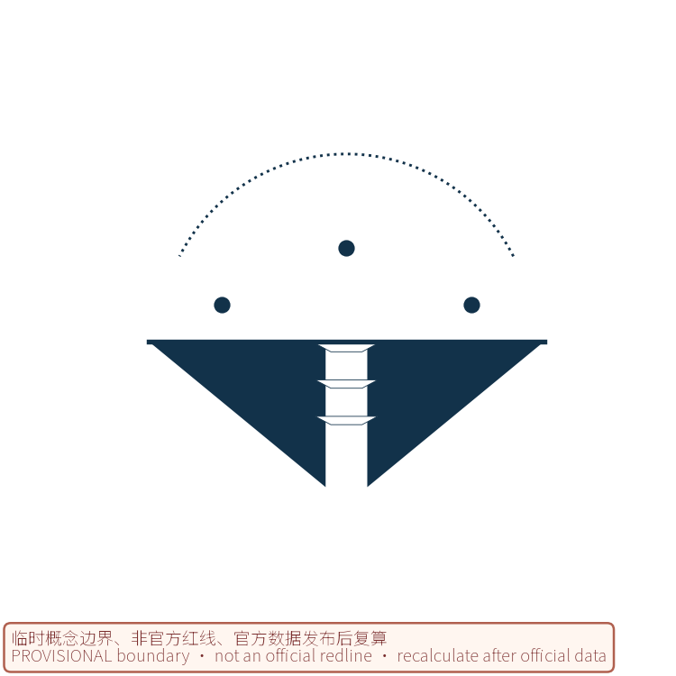
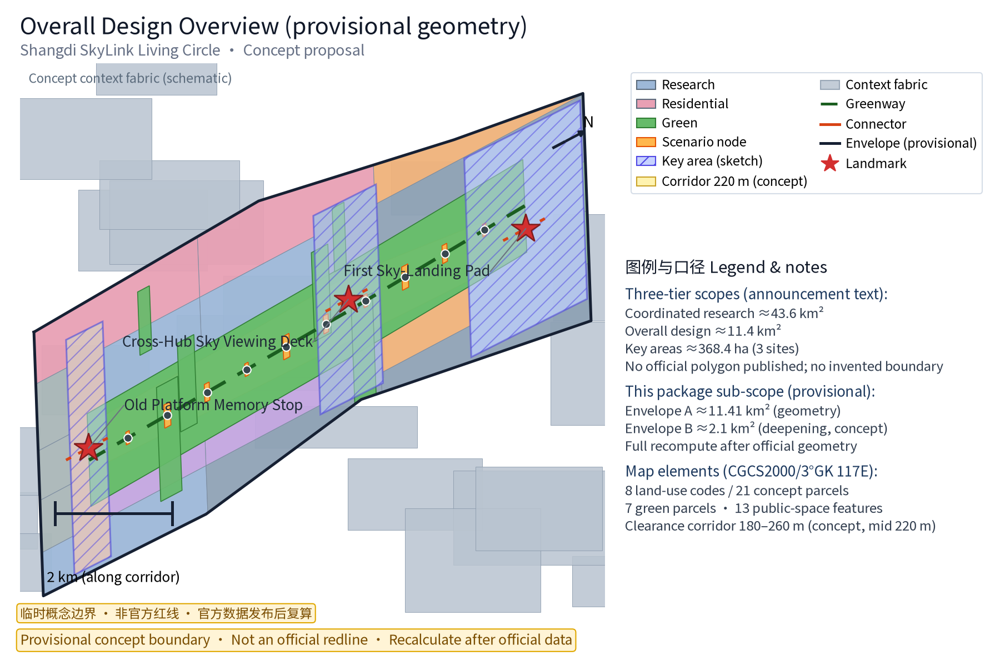
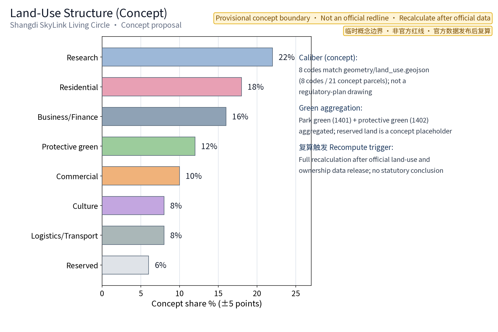
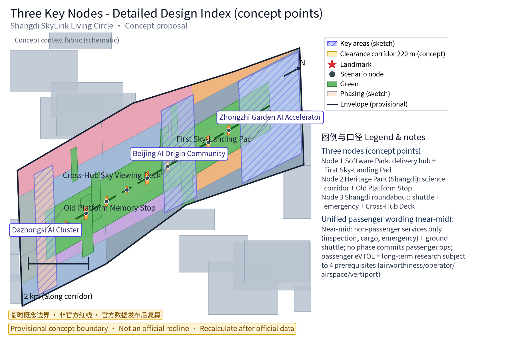
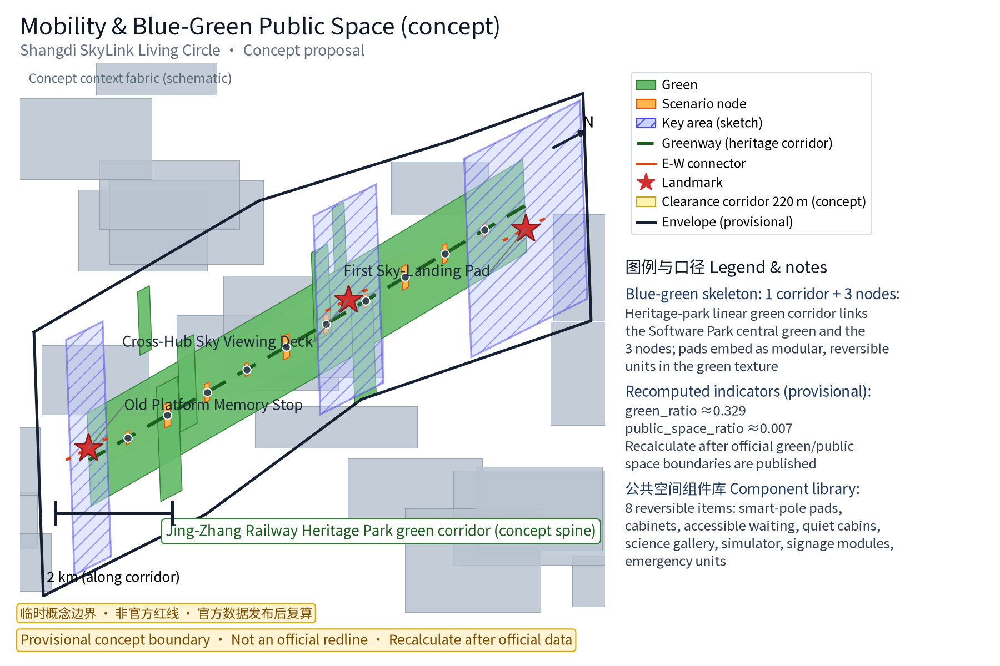
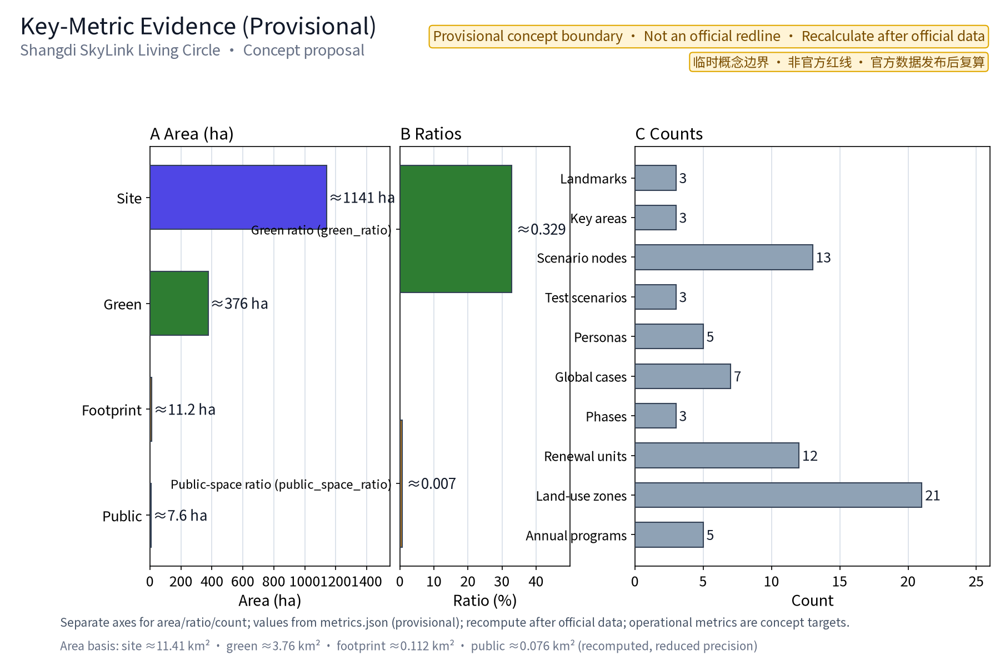

## Concept Name and Overall Framework (Concept)

Scheme name: Shangdi SkyLink Living Circle («上地智翼·低空生活圈»). "Shangdi SkyLink" means "Shangdi takes off, intelligently linked skywards"; SkyLink refers both to airspace linking and commuter linking. The "Living Circle" is a low-altitude service network carried by everyday workplace public space. The core idea is to embed the low-altitude economy (delivery, commuter shuttle, emergency response, science education) quietly into existing public space, forming a "Three Nodes + Ten Scenarios" demonstration system that pursues dual-use (peacetime/emergency), dynamic-and-static balance, and reversible renewal. The three original landmark nodes are the **First Sky-Landing Pad** (Zhongguancun Software Park delivery hub), the **Cross-Hub Sky Viewing Deck** (Shangdi roundabout shuttle/emergency), and the **Old Platform Memory Stop** (Jing-Zhang Railway Heritage Park, Shangdi section), forming a spatial narrative of "new low-altitude meets the old railway".

This proposal is an open co-creation concept for the "Centennial Jing-Zhang AI Innovation Belt". It does not replace formal planning and is not a government-approved conclusion. It follows the three positioning goals of the taskbook (Centennial Jing-Zhang Culture Belt, Urban AI Life Experience Belt, AI Integration Innovation Belt) and the five functions (AI full-stack independent innovation system, world-class AI innovation ecosystem, AI+ scenario empowerment paradigm, intelligent AI-vibrant city, global voice in AI governance), developed along the low-altitude economy direction as one carrier of the "AI+ scenario empowerment paradigm" (conceptual mapping), integrated into the "three zones and two wings" spatial synergy loop (see "Regional Synergy and Taskbook Relationship").

> **Evidence anchors**: [source:DATA-SRC-OFFICIAL-ANNOUNCEMENT], [source:DATA-SRC-AGENT-TASKBOOK] (organizer announcement and taskbook are the textual basis).

## Brand and Visual Identity Direction

Brand hierarchy: master brand «上地智翼 (Shangdi SkyLink)», subtitle «低空生活圈 (Living Circle)»; node brands «First Sky-Landing Pad», «Cross-Hub Sky Viewing Deck», «Old Platform Memory Stop»; event brands «Commuter Sky Day», «Low-Altitude Tech Experience Week» (conceptual). Visual identity direction (the logo and identity system are conceptual directions for the Belt and this scheme, to be deepened by professional design teams; not final deliverables):

- Monochrome first: single-color logo versions (deep-space blue, or solid black/reversed white) for print, engraving and engineering signage reuse, avoiding multi-color dependency; the package includes a concept mark sketch (logo-shangdi-skylink.png, see figure at the end of this section) for direction only;
- Scalable: geometric symbolic construction (not realistic artwork), legible at small sizes (pole nameplates, cabinet corner marks) and large sizes (facade graphics, ground decals);
- Wing-plus-rail symbol vocabulary: a motif combining "twin wings + railway sleepers" — the wings form a take-off dynamic and the negative space embeds rail line elements, echoing the dual narrative of the Jing-Zhang Railway heritage and low-altitude take-off; supporting graphics are route-arc grids and node dots for poles, ground signage and cabinet livery;
- Proportion and clear-space rules (conceptual): minimum use size not below 16 mm (nameplate) / 8 mm (corner mark); clear space around the mark no less than 1/2 of the mark height, with no text or other graphics inside; reversed-color use requires background contrast of at least 3:1; node application rules: pole nameplates use the monochrome reversed version, cabinet corner marks use the deep-space blue version, facade and ground decals use black/reversed white, all paired with the "SHANGDI SKYLINK" wordmark;
- International communication: the mark is recognizable without Chinese characters, paired with the "SHANGDI SKYLINK" wordmark and clear-space rules to avoid cultural misreading; colors are deep-space blue + silver grey, with signal orange for warning accents only; fonts use open-source licensed fonts (Source Han Sans / Noto Sans SC, OFL license; this package's HTML and figures actually embed a Noto Sans SC subset, see report/copyright_statement.md), with a font-license verification step before formal application;
- Trademark and prior rights: no trademark search or prior-rights review has been completed at this concept stage; the registration status, prior rights and cross-border conflicts of «上地智翼», «Shangdi SkyLink» and related names are honestly marked as pending verification, and the names are treated as **internal working codenames**, restricted from external use/registration until clearance; professional search and assessment are required before formal application; this proposal does not claim any trademark rights (see "Brand Prior Rights and Use Boundary" in "Risk, Copyright, and Compliance").

> **Evidence anchors**: [source:DATA-SRC-OFFICIAL-ANNOUNCEMENT] (the call-for-entries rules ground the ownership/compliance wording).

## Design Basis and Source List

All regulations, policies and planning documents cited here are **public directional references pending item-level verification**, not confirmed bases. Verifiable entries already registered in sources.json include: the Beijing Action Plan for High-Quality Development of the Low-Altitude Economy Industry (2024–2027) (Jing Jing Xin Fa [2024] No. 54, publicly released text) [source:DATA-SRC-BJ-LOWALT-ACTION-PLAN]; the Interim Regulation on Flight Management of Unmanned Aircraft (State Council/Central Military Commission Order No. 761, promulgated 2023-06-28, effective 2024-01-01) [source:DATA-SRC-UAS-TEMP-REGULATION]; the Safety Requirements for Civil Unmanned Aircraft Systems (GB 42590-2023, mandatory national standard, effective 2024-06-01) [source:DATA-SRC-GB42590-2023]; the Jing-Zhang Railway Heritage Park design scheme public coverage and planning interpretation [source:DATA-SRC-JZ-PARK-DESIGN][source:DATA-SRC-JZ-PARK-INTERPRETATION]; the notice on public-consultation findings for the Block Regulatory Detailed Plan along the Jing-Zhang Railway Heritage Park (AI Innovation Block Key Area) [source:DATA-SRC-JZ-TIAO-GUI]; public coverage of the Zhongguancun Software Park regulatory plan and Shangdi-area special plans; and public technical standards for vertiport construction and safe operation of low-altitude operations. The official text, current version and applicable boundaries of these provisions must be verified item by item and registered separately; formal planning design follows government-published versions. This proposal makes no administrative licensing, approval or implementation commitments on this basis.

The list of topographic maps, regulatory-plan drawings, ownership and utility-survey materials are a **conceptual working-basemap requirement list** (i.e., "to-be-acquired items"), not data already obtained by this package; all data actually used are in sources.json, and unacquired items are honestly annotated in "Risk, Copyright, and Compliance" and the assumptions list. Policy mechanism suggestions (test exemptions, operation subsidies, clearance management measures, etc.) are conceptual suggestions, not current arrangements (see "Renewal Projects, Implementation Policy, and Phasing").

> **Evidence anchors**: [source:DATA-SRC-OFFICIAL-ANNOUNCEMENT], [source:DATA-SRC-AGENT-TASKBOOK] (organizer announcement and taskbook are the textual basis).

## Three-Level Scope Framework

This proposal anchors the "Centennial Jing-Zhang AI Innovation Belt" positioning of an intelligent AI-vibrant city and global AI industry highland, focuses on the low-altitude workplace scenarios of the Shangdi area in Haidian District, and acts as a western functional block of the Belt's low-altitude application and flight-test services (conceptual positioning), echoing rail stations, industry parks and university innovation belts along the corridor.

**Official three-tier scopes (announcement text; official geometry not yet published — no boundaries are invented)**: coordinated research area approx. **43.6 km²**; overall design area approx. **11.4 km²**; key areas approx. **368.4 ha** (including the three key areas). These values follow the organizer announcement text and must not be treated as redlines or precise-area bases before official polygons are published.

**This package's own sub-scopes (provisional, explicitly not conflated with official geometry)**:

- Envelope A — package concept envelope: approx. **11.41 km²** — the site_boundary concept envelope recomputed from provisional geometry (site_area_sqm, see metrics.json; prose uses approx. 11.41 million m²). It is the same order of magnitude as the official "overall design area ~11.4 km²" but derives from provisional coarse geometry; it neither claims to coincide with nor replace the official scope; full recalculation applies when official geometry is published;
- Envelope B — low-altitude deepening scope: approx. **2.1 km²** (concept estimate range 1.8–2.5 km²) — the urban-design deepening scope covering the three nodes and their connecting corridor, derived as the closed renewal space after subtracting overlaps from "600–800 m service radius per node (8–10 min walk) plus a 180–260 m (concept bandwidth, mid 220 m) clearance-corridor continuous interface" (concept estimate, to be recomputed with official boundaries and regulatory-plan drawings);
- Key-area correspondence: the official three key areas (Zhongzhi Garden AI Independent Innovation Accelerator, Beijing AI Origin Community, Dazhongsi AI Industry Cluster; 368.4 ha scope) have provisional schematic polygons in geometry/key_areas.geojson; this package's three low-altitude nodes (delivery hub, science corridor, shuttle roundabout) are conceptual low-altitude functional carriers within those key areas, with node locations per the ai_landmark features of geometry/public_space.geojson (see "Detailed Design of Key Areas").

The "Ten Scenarios" and scenario_node_count=13 accounting: the 10 daily scenario cards correspond to 10 daily scenario nodes (scenario_type=scenario_node in the geometry); the 3 industry test/validation scenarios correspond to the test-validation functions of the 3 landmark nodes (metrics.json formula: 10 scenario nodes + 3 landmarks), totaling 13 scenario nodes (see "AI Innovation Ecosystem, Personas, and AI+ Scenarios").

> **Evidence anchors**: [metric:site_area_sqm], [source:DATA-SRC-OFFICIAL-ANNOUNCEMENT], [source:DATA-SRC-PROVISIONAL-BOUNDARIES] (three-tier scope per taskbook official wording and provisional geometry, used in layers).

## Regional Synergy and Taskbook Relationship

Role of this theme in the taskbook system: the Shangdi SkyLink Living Circle is a **western functional block and scenario carrier** of the Belt's low-altitude economy direction — it provides a perceptible low-altitude living showcase on the "Urban AI Life Experience Belt", undertakes four AI+ scenario integrations (delivery, shuttle, emergency, science education) in the "AI Integration Innovation Belt", and injects an old-meets-new narrative ("old platform memory + low-altitude new infrastructure") into the "Centennial Jing-Zhang Culture Belt". The spatial carriers and their synergy with the functional zones of the "three zones and two wings" are listed below (concept-level synergy; all are suggested directions, not any confirmed arrangement between regions):

| Taskbook element | Role of this theme (concept-level) | Example synergy |
| --- | --- | --- |
| Three positioning goals | Provides the low-altitude living interface for the Urban AI Life Experience Belt; contributes industrial scenarios to the AI Integration Innovation Belt; echoes the Centennial Jing-Zhang Culture Belt through railway heritage and the old platform | The Living Circle is a demonstrative model on the Belt's experience band, organized continuously with public space along the corridor |
| Five functions | As the low-altitude carrier of the "AI+ scenario empowerment paradigm", supports the aerial service layer of the "intelligent AI-vibrant city", provides test-validation scenarios for the full-stack system and innovation ecosystem, and participates in the "global voice in AI governance" through operational-governance demonstrations | Scenario co-creation, joint laboratories, test-validation base, anonymized data disclosure |
| Three zones and two wings | Connects with the AI Origin Community (innovation ecology source), the Zhongzhi Garden AI Independent Innovation Accelerator (full-stack system and governance voice) and the Dazhongsi AI Industry Cluster (native intelligent new businesses); relies on the Zhongguancun Science-Tech Service Wing for factor allocation and IP/capital linkage and on the Xiaoyuehe Scenario Empowerment Wing for experience-route organization | Zhongzhi Garden supplies flight-control/obstacle-avoidance/scheduling technical standards; this theme supplies scenario carriers and operation samples |
| Belt key areas | Embeds three nodes (Software Park delivery hub, heritage-park Shangdi section, Shangdi roundabout) into the Belt's east–west public-space chain | Science corridor co-built with the heritage park's AI public-space component library; Dazhongsi consumption/commerce scenarios complement this theme's delivery experience |
| Cross-regional synergy | Concept-level synergy with Beiwai Community (regional-synergy wording per taskbook, no location assertion), Future Science City, Huairou Science City, Economic-Technological Development Area and the Beijing-Tianjin-Hebei direction for low-altitude manufacturing, testing and industry resources | Mutual test-data recognition, complementary flight-test resources, supply-chain synergy (all conceptual directions) |

Concept-level synergy list: **Zhongzhi Garden** (AI full-stack independent innovation accelerator) — this theme's flight-control, obstacle-avoidance and scheduling technical interfaces connect to its full-stack system, with test-validation scenarios supplying operation data samples; **AI Origin Community** — this theme's science exhibition and experience events carry the ecosystem's public expression; **Dazhongsi** (AI industry cluster) — low-altitude delivery and roaming experiences introduced into native intelligent consumption and commerce scenarios (concept direction); **Beiwai Community** (per taskbook wording) — a nearby residential community as the coordination counterpart for delivery pilots, resident deliberation and time-slot noise mechanisms; **Future Science City, Huairou Science City, ETDA** — concept-level collaboration directions in low-altitude manufacturing, test facilities and industry support; **Beijing-Tianjin-Hebei** — long-term concept direction for route synergy and industrial division of labor. All are conceptual suggestions; specific synergy mechanisms and commitments follow official government arrangements.

> **Evidence anchors**: [source:DATA-SRC-AGENT-TASKBOOK] (three-zone-two-wing and regional synergy wording per taskbook).

## Coordinated Research Area: Industry and Future City Research

The coordinated research area (~43.6 km² per the official announcement text) and this package's concept envelope (~11.41 km², provisional geometry recomputation) are used in layers: the official scope supports directional industry and spatial-organization research; the package envelope supports machine validation and graphic expression of this proposal; both require full recalculation when official geometry is published. Industrial research focuses on the "R&D—Manufacturing—Operation—Service" chain of the low-altitude economy, identifying synergy opportunities for enterprises in UAV flight control, AI, communications and navigation inside the Software Park (concept direction only, no specific enterprise partnership commitments), and proposes an "R&D testing—Scenario demonstration—HQ incubation" industrial spatial organization (concept). Future-city research anticipates how UAV commuting and instant delivery will change job-housing time-space, ground traffic and public-space usage, proposing flexible land reserves and infrastructure reservations toward 2035 (directional foresight, not land or investment commitments). The coordinated research produces directional conclusions and presets no land conclusions; its industry directions constrain the facility composition and site preferences of the overall design, forming a "strategy—structure—implementation" loop.

> **Evidence anchors**: [metric:site_area_sqm], [source:DATA-SRC-PROVISIONAL-BOUNDARIES] (boundary is provisional; research scope is conceptual only).

## Overall Design Area: Urban Renewal and Regulatory-Plan-Level Urban Design

The overall design scope is approx. 2.1 km² (concept estimate 1.8–2.5 km²; derivation in "Three-Level Scope Framework"), covering the three nodes and their connecting corridor. The design follows regulatory-plan-depth urban design, systematically checking and optimizing node positioning, clearance safety zones, take-off/landing facility siting, landscape interfaces and street sections; regulatory-plan indicators are checked as suggestions only, with no preset numeric conclusions. Priorities for low-altitude facilities versus existing urban renewal: adding delivery cabinets and small take-off/landing points on Software Park roofs and parking-deck superstructures, laying out the low-altitude science corridor along the Jing-Zhang Railway Heritage Park green corridor, and improving shuttle and smart-pole take-off/landing networks around the Shangdi roundabout; design outputs are cross-checked against regulatory-plan indicators to form drawing-connection suggestions (concept level, for professional teams to deepen).

> **Evidence anchors**: [source:DATA-SRC-MOHURD-CONTROL-DETAILED-PLANNING], [source:DATA-SRC-PROVISIONAL-BOUNDARIES].

## Detailed Design of Key Areas

All take-off/landing facility sites of the three nodes are conceptual points that must be re-placed after airspace management and professional review; the clearance corridor between nodes (concept bandwidth 180–260 m, mid 220 m, consistent with the geometry buffer; derivation basis and professional evaluation to-dos are in the operational-threshold table of "Pilot Admission and Safety (MVP Cards)") and the slow-traffic links form the complete spatial narrative; detailed plans and sections are expressed in drawings/a3-booklet.pdf and the geometry layers. **Geometry accounting note**: the three node points (ai_landmark) come from geometry/public_space.geojson; the schematic polygons of the Belt's three key areas they fall within (Zhongzhi Garden, Beijing AI Origin Community, Dazhongsi) come from geometry/key_areas.geojson (both provisional; diagrams on figures and visual pages).

- Node 1 — Zhongguancun Software Park "Delivery Hub + Take-off Demonstration": central delivery hub, rooftop take-off pads and an operation/maintenance center, forming the "First Sky-Landing Pad" landmark (concept single-building scale range 800–1,500 m², mid 1,200 m²; derivation: combined functional area of pad + handover waiting + safety isolation buffer + accessible routes; to be recomputed with official regulatory-plan and site data), demonstrating a building—station—route three-tier delivery system;
- Node 2 — Jing-Zhang Railway Heritage Park Shangdi section "Low-Altitude Science + Leisure": a science exhibition gallery, simulator cabin and flight-test experience field laid out along the linear railway heritage, with the old platform preserved as the "Old Platform Memory Stop"; heritage and green constraints follow official heritage boundaries, and facilities use reversible, zero-excavation design (concept direction);
- Node 3 — Shangdi roundabout "Commuter Shuttle + Emergency Linkage": shuttle station, smart-pole take-off/landing points and an operations screen integrated with three-dimensional renovation, with the "Cross-Hub Sky Viewing Deck" above the roundabout.

**Commuter shuttle technology type and regulatory path (conceptual qualification)**: in the near-to-mid term, this proposal only expresses commuter shuttle as "non-passenger services (inspection, cargo, emergency delivery) + ground shuttle coordination" and makes no passenger-operation commitment; if passenger commuting is pursued in the long term, the aircraft type is studied in the direction of "electric vertical take-off and landing (eVTOL) concept aircraft (2–5 seats)", the passenger attribute is for-hire passenger transport, and the regulatory path presupposes four prerequisites: civil-aviation airworthiness certification, operator operations-certificate qualification, airspace and route approval, and vertiport facility certification (conceptual path, none are current conclusions; item-by-item verification required per [source:DATA-SRC-UAS-TEMP-REGULATION] and airworthiness rules). Without those approvals, passenger shuttling is not listed in any implementation phase; Card ① (in "AI Innovation Ecosystem, Personas, and AI+ Scenarios"), Pilot C (in "Pilot Admission and Safety") and the phasing plan (in "Renewal Projects, Implementation Policy, and Phasing") all use this identical wording, so the passenger attribute and timing are fully consistent.

**Jing-Zhang cultural heritage resource inventory and signage narrative (concept, agent.5 response)**: anchored by the "Old Platform Memory Stop", the signable cultural elements along the corridor are systematically inventoried (all subject to official heritage-protection and preservation schemes, see table), organized into a "From Jing-Zhang to Low-Altitude" tour spine with supporting signage units (ground marks, science plaques, audio guides — see the component library in "Blue-Green Network, Public Space, and Urban Character"):

| Resource element | Carrier / location (concept) | Use boundary | Narrative theme |
| --- | --- | --- | --- |
| Old platform | Heritage park Shangdi section (concept location) | Official heritage boundary governs; contact display requires heritage approval | "Old Platform Memory" stop narrative |
| Rails and sleepers | Preserved segments of the linear green corridor | Follow official preservation scheme; reversible display | "Track—Route" old-meets-new dialogue |
| Station buildings and signal elements | Conceptual points along the corridor | Replication or symbolic use requires heritage assessment | "Centennial Jing-Zhang" science narrative |
| Zigzag railway and Zhan Tianyou elements | Science gallery (concept) | Historical figures and engineering narratives require fact-checking item by item | "Zigzag Switch" tour spine |
| Jing-Zhang chronicle | Signage boards and gallery | Chronology entries verified before use | "From Jing-Zhang to Low-Altitude" timeline |
| Line 13 under-viaduct space | Under viaducts along the corridor (concept) | Ownership and structural safety pending assessment | "Under-Viaduct—Low-Altitude" two-layer narrative |

The three nodes are linked by the clearance corridor into the "First Pad—Viewing Deck—Memory Stop" spatial narrative; per the taskbook's landmark-scale requirements, all three landmarks are controlled as clustered, lightweight, reversible public facilities, not large volumes.

> **Evidence anchors**: [metric:landmark_count], [data:PACKAGE-GEOMETRY] (node points and key-area polygons from public_space.geojson and key_areas.geojson respectively).
## AI Innovation Ecosystem, Personas, and AI+ Scenarios

The scheme builds an "AI+low-altitude" innovation ecosystem, co-building joint laboratories, an open-data platform and a test-validation base with park enterprises and universities (all conceptual suggestions, no commitments to specific enterprises or operators). **Ecosystem map (concept)**: R&D—Manufacturing (flight control, obstacle avoidance, communications/navigation synergy opportunities, interfacing with the Zhongzhi Garden full-stack system) → Testing—Demonstration (T1–T3 industry test-validation scenarios and demonstration points) → Operation—Service (pilot operators and cabinet partners; unified construction, diversified operation) → Standards—Governance (participation direction in standard setting + annual anonymized-data disclosure), forming an "R&D testing—Scenario demonstration—HQ incubation" loop.

**Five persona groups (matching metrics.json persona_count=5; the five personas are a concept classification; dedicated research precedes implementation)**: ① low-altitude industry engineers (frequent inspection, flight-test validation and data debugging); ② park commuters (shuttle and instant delivery); ③ enterprise managers (operations supervision and cost optimization); ④ emergency managers (emergency delivery and joint command); ⑤ student visitors and family research groups (science gallery, simulator and experience training). The needs and journeys of surrounding residents, elderly people, people with disabilities, low-income users, non-smartphone users and park quiet-area users are detailed in "Public Interest and Inclusive Design".

**"Ten Scenarios" and scenario_node_count=13**: the 10 daily scenario cards (cards ①–⑩ in Table 1) correspond to 10 daily scenario nodes (scenario_type=scenario_node) in the geometry; the 3 industry test/validation scenarios (T1–T3 in Table 2) correspond to the spatial carriers of the 3 landmark nodes; totaling 13 scenario nodes, i.e., metrics.json scenario_node_count=13.

The ten scenario cards cover six domains — transport (commuting), industry (inspection/flight test), public space (viewing/science), public service (emergency delivery), culture (railway-heritage science narrative) and governance (operations supervision and anonymized disclosure). AI abilities appear in assisting roles: AI scheduling suggestions, AI recognition for aggregation analysis only, AI prediction driving schedules, AI models evaluated quarterly, and all AI decisions confirmed by humans.

**Table 1: Ten daily scenario cards (concept; "manual review points" are the scheme's own operational-governance design, not regulatory requirements)**

**Unified passenger-carriage wording (shared by Card ①, Node 3, Pilot C and the phasing plan)**: in the near-to-mid term (0–4 yrs), commuter shuttle in this proposal is exclusively "non-passenger services (inspection, cargo, emergency delivery) + ground shuttle coordination"; no phase commits to passenger operations. Long-term passenger eVTOL commuting is only a research direction that may start only after four prerequisites — civil-aviation airworthiness certification, operator operations-certificate qualification, airspace and route approval, and vertiport facility certification — and constitutes no implementation commitment. All wording about shuttle, take-off/landing and passenger guidance in the scenario cards below follows this unified wording.

| Scenario card | Objective | Inputs and data flows | Outputs | Model capability boundary | Operation and responsible parties | Data and privacy boundary |
| --- | --- | --- | --- | --- | --- | --- |
| Card ① Commuter shuttle (near-to-mid non-passenger) | Short job-housing trips, staggered with Metro Line 13 and Changping Line; near-to-mid term is non-passenger services (inspection, cargo, emergency delivery) + ground shuttle coordination, identical to every other carrier in this proposal (see "Unified passenger-carriage wording") | Booking orders, pad status, weather and airspace time slots | Scheduling suggestions, take-off sequencing, ground-shuttle coordination guidance (passenger guidance only after approval of a long-term passenger scenario) | Take-off scheduling and conflict alert assistance only; no automatic release; key commands human-confirmed | Park property + licensed operator jointly; local airspace and transport authorities supervise | Booking data desensitized; no identity or biometric collection; anonymized aggregation |
| Card ② Food/parcel delivery | Building—station—route three-tier delivery, cabinet handover, time-slot staggering | Desensitized order coordinates, cabinet availability, route timetable | Delivery schedule and cabinet allocation suggestions | Path-planning assistance; beyond-visual-line operations require license and approval | Pilot operator + cabinet partner; scheme-set manual review points: route changes, new cabinets | Delivery points and anonymized order counts only; no linkage to personal identity |
| Card ③ Sightseeing tour | Low-altitude viewing guide at the deck; booking-based, time-slot opening | Booking slots, weather, schedule | Tour slots and safety-staffing suggestions | Route-coverage commentary assistance; no autonomous flight | Park operator + experience provider; managed as public activity | Booking counts anonymized; no visit-behavior profiling |
| Card ④ Inspection and remote sensing | Park security inspection, facility health checks, survey assistance | Inspection plans, facility target coordinates (buildings/equipment) | Anomaly alert list (anonymized), desensitized remote-sensing patches | AI image recognition for anonymized aggregate analysis only, never individual identification | Park property + professional inspection companies; anomaly handling human-reviewed | No facial or individual-trajectory collection; results archived after human review |
| Card ⑤ Emergency delivery | Emergency supplies, dual-use, linked to emergency-management platform | Emergency orders, supply list, no-fly-slot check | Delivery task sheet (executed after human review) | Route and drop-point assistance; no autonomous decisions | Emergency authorities lead, licensed operators execute; human confirmation before every mission | Task records minimized and desensitized; no individual profiling |
| Card ⑥ Midday coffee delivery | Time-slot staggering, complementary to ground delivery | Pre-orders, cabinet status, timetable | Staggered scheduling suggestions | Scheduling assistance; auto-pause above thresholds with human review | Merchants + pilot operator; new points human-reviewed | Anonymized order counts |
| Card ⑦ Smart-pole shared take-off | Shared power/communications on pole pads, dynamic bay allocation | Bay occupancy, power load, communication status | Bay allocation and charging-schedule suggestions | Allocation-algorithm assistance; anomalies handled by humans | Municipal pole maintenance unit + operator | Equipment status anonymized; not linked to individuals |
| Card ⑧ Airspace data visualization screen | Operations screen showing anonymized aggregated airspace status for supervision and disclosure | Anonymized track aggregation, alert event stream | Status screen and monthly disclosure digest | Aggregate-statistics assistance; no individual localization | Operations center (park + regulator co-managed); public releases human-reviewed | Aggregate heat maps only; individual tracks neither collected nor stored |
| Card ⑨ Science-education simulator | Booking-based for student visitors and family research groups | Booking counts and session schedule, weather | Lecture and staffing schedule suggestions | Simulator teaching assistance; no real flight | Park operator + volunteers; schedule and flight-safety confirmation | Booking counts and time slots only; no children's personal data collected |
| Card ⑩ Flight-test service | Licensed flight-test experience training and validation | Trainee qualifications, weather windows, airspace permits | Training schedule and flight-test records (compliance evidence) | Teaching assistance; real flights by licensed instructors | Licensed training institutions + test-validation base; included in regular test plans | Certificate info minimized; flight-test records kept per regulation |

**Table 2: Three industry test/validation scenarios (conceptual targets, not field commitments; matching metrics.json industry_test_scenario_count=3; validation methods and exit thresholds per the operational-threshold table in "Pilot Admission and Safety")**

| Test object | Data inputs | Validation metrics | Exit condition |
| --- | --- | --- | --- |
| T1 Route conflict avoidance scheduling | Anonymized tracks and planned routes (simulated + small-scale field) | Conflict detection rate ≥99%, resolution success rate ≥98% (concept targets) | 30 consecutive days zero-conflict and metrics met, then routine operation |
| T2 Human-machine coexistence pedestrian protection | Anonymized pedestrian-density heat maps, nest-area perception (no recognition devices) | Isolation-zone intrusion rate ≤0.1 incidents per 100 flights, zero pedestrian contact (concept targets) | 1,000 cumulative flights without contact and safety review passed |
| T3 Adverse-weather return-and-divert | Weather-station data stream, route threshold table | Threshold trigger rate 100%, return success rate ≥99% (concept targets) | One validation round per season completed with zero failures |

**Seven global low-altitude-economy case comparisons and ecosystem mapping (agent.2 response; each case registered in sources.json with public institutional pages; comparisons extract mechanisms only and constitute no commitments)**:

| Case (mechanism) | Source | Mechanism points | Local applicability insight |
| --- | --- | --- | --- |
| Zipline (instant delivery) | [source:CASE-ZIPLINE] | Fixed-wing + hover winch instant delivery of medicine and goods; operating since 2016 in Rwanda, Ghana, etc. | Beyond-visual-line delivery needs a long safety record and public trust; local deployment requires airspace approval and cabinet networks |
| Wing (residential drone delivery) | [source:CASE-WING] | Alphabet company; residential door-to-door delivery to yards/driveways; over one million home deliveries | End-drop standardization and noise-reduction design; local adaptation to buildings and streets |
| Joby (eVTOL passenger air taxi) | [source:CASE-JOBY] | Electric VTOL passenger aircraft; Part 135 operations certificate; urban demonstrations | Passenger operations are a long chain (airworthiness+operations+facilities); only a long-term concept direction here |
| Dubai aerial taxi | [source:CASE-DUBAI-UAM] | RTA-led eVTOL passenger aerial taxi and vertiport network; 2026 target operations | The government-coordinated tripartite model (authority+operator+facility provider) is a reference |
| Singapore UAM | [source:CASE-SINGAPORE-UAM] | CAAS-led UAM regulatory standards and trials (e.g., CAAS–EASA cooperation, Skyways trials) | Regulation-first and trial-sandbox pathway |
| Shenzhen Meituan drones | [source:CASE-SHENZHEN-MEITUAN] | City-scale low-altitude network in routine operation with hub airports and intelligent scheduling; per public reporting, 43 routes in Shenzhen and other cities with over 360,000 cumulative orders by end-September 2024 | High-frequency local delivery and scheduling capability closest to this theme; a benchmark study object |
| DJI developer ecosystem | [source:CASE-DJI-DEV] | Open hardware/software ecosystem of SDKs and cloud APIs for developers | Open interfaces and developer communities can be replicated in the park ecosystem (see "Developer Community") |

Scenario spatial-operation mapping (concept): drone delivery and midday coffee (Cards ②⑥) land at the central delivery hub, rooftop pads and delivery cabinets — pilot operation, staggered dispatch, "unified construction, diversified operation"; inspection and remote sensing (Card ④) land on park inspection routes and the O&M center — scheduled inspection, anonymized results; commuter shuttle (Card ①) lands at the roundabout shuttle station and smart-pole pads — booking-based, published schedules; emergency delivery (Card ⑤) lands at the emergency supply store and operations screen — dual-use plans, periodic joint drills; science education and flight-test services (Cards ⑨⑩) land at the heritage-park gallery and flight-test field — booking-based scheduling; airspace visualization (Card ⑧) lands at the operations-center screen — anonymized aggregation, annual disclosure.

**AI data loop (concept)**: prediction and scheduling — demand-forecast models (delivery/shuttle/visits) drive take-off sequencing, forming a "sense—predict—schedule—feedback" loop; multi-agent coordination — delivery, shuttle, weather and pole-bay agents negotiate schedules in a unified scenario, with conflicts referred to human confirmation; model evaluation — quarterly offline evaluation registered in the operations ledger, metrics disclosed annually; human supervision — all key decisions (route changes, emergency triggers, external releases) keep human confirmation; governance interface — an anonymized aggregating display/appeal interface for regulators and the public (interface spec is conceptual). This part connects taskbook elements: technical-interface connection with the **Zhongzhi Garden full-stack system** (flight-control, obstacle-avoidance, scheduling stacks); support from the **Zhongguancun Science-Tech Service Wing factors** (computing, data, test facilities, cross-border-channel factor allocation directions); and public experience sequences along the **Xiaoyuehe Scenario Empowerment Wing experience route** (heritage-park science corridor and viewing path) — all conceptual directions.

**AI technical protocols (conceptual design; draft protocols for the test-validation base and operations plan to deepen; all indicators are the scheme's own concept targets, not measured results — no performance promises before field tests)**:

| Protocol | Scope and inputs | Protocol content (concept) | Acceptance wording (concept) | Trigger and recalculation |
| --- | --- | --- | --- | --- |
| Model evaluation protocol | Demand-forecast, scheduling and conflict-alert models; inputs are anonymized sample sets and baseline test sets (simulated + small-scale field) | Quarterly offline evaluation: anonymized-sample replay recording accuracy, false-alarm rate and recall; results entered in the operations ledger and disclosed annually | One evaluation report per model per quarter; indicators follow field baselines, never confused with design assumptions | Re-evaluate on model-version update, baseline-route network change or data-source change |
| Data quality protocol | Anonymized tracks, order counts, weather and bay-status data streams | Data dictionary and caliber table maintained with the package; missing rates, anomalies and duplicates counted monthly; abnormal batches flagged and human-reviewed before archiving | Monthly data-quality report; missing rate <5%, anomaly detection rate 100% (concept targets) | On data-source, collection-device or statistical-caliber change |
| Error stratification protocol | Model prediction errors and their distribution | Error statistics stratified by time slot, site, weather and aircraft type (MAE/MAPE stratification tables) to identify systematic bias and trace back to data and features | Stratification tables updated quarterly; systematic bias beyond 2σ triggers human review (concept threshold) | On season change, network expansion or new aircraft type |
| Runtime monitoring protocol | Operations metric streams (on-time rate, incidents, complaints, weather ground-stops, alerts) | Real-time alerts, auto-pause thresholds and monthly runtime monitoring report; every automated alert requires human confirmation before external release | Monthly monitoring report; 100% alert-handling closure (concept target) | After regulatory wording or official operations-safety data release |

**Developer community, scenario opening, international communication and talent/enterprise conversion paths (concept, agent.6 response)**:

- **Developer community (concept)**: open flight-task APIs, scheduling sandbox and anonymized data sample sets; quarterly developer days and an annual low-altitude maker contest (concept events within the open-day system); developer agreements and open-source compliance boundary statements (raw data involving security and privacy are not opened);
- **Scenario opening (concept)**: an "open scenario list" per Table 1 (4 categories, 10 cards), opened time-sliced to enterprises, universities and individual developers by booking and qualification review (pilot points); opening rules require regulatory and public-participation procedures;
- **International communication (concept)**: a "SHANGDI SKYLINK" bilingual package (this package's proposal.en.html, index.en.html, English figures and booklets are the base materials), international expositions and city-pair dialogues (benchmarking Dubai, Singapore cases), bilingual guided tours on open days; all external materials undergo language review and prior-rights recheck before release;
- **Talent/enterprise conversion (concept)**: university training bases and capstone workshops (linked with the university innovation belt), a start-up test-validation channel (application-based admission to the test-validation base, prioritizing low-altitude operations, obstacle avoidance and delivery scheduling), and an "experiment—demonstration—HQ landing" one-stop service window (concept; no commitment to any enterprise).

> **Evidence anchors**: [metric:scenario_node_count], [metric:industry_test_scenario_count], [metric:persona_count], [metric:global_case_count].
> Governance boundary reference: [source:DATA-SRC-GENERATIVE-AI-INTERIM-MEASURES] (reference for AI-generated-content governance wording).

## Land Use, Building Scale, and Retain-Renovate-Demolish Strategy

The scheme prioritizes stock renewal: 12 renewal units within the overall design scope (matching the 12 conceptual renewal parcels of geometry/buildings.geojson). Retain-renovate-demolish principle: "retain first, renovate second, demolish least" — preserve Software Park industrial buildings and park heritage structures; renovate parking lots, idle roofs and roundabout auxiliary spaces; demolish only a few inefficient temporary structures affecting clearance (case-by-case demonstration required), achieving a low-cost, reversible renewal path.

New low-altitude facility floor area approx. **18,000 m² (concept estimate range 15,000–20,000 m²)**, itemized (concept estimates to be recomputed with official surveys and regulatory-plan data): delivery hub 5,000–7,000 m², O&M center 3,000–5,000 m², science/training rooms 4,000–6,000 m², shuttle and service facilities 3,000–4,000 m²; pads and smart-pole points are open-air/light structures not counted as large buildings. The conceptual land-use structure has three major categories (research, urban residential, business/finance); all 8 category shares are **conceptual assumed shares** (research 22%, residential 18%, business/finance 16%, commercial 10%, culture 8%, logistics-storage & transport stations 8%, protective green 12%, reserved 6%, each ±5 percentage points), consistent with the land_use_spec, the 21 concept parcels (8 land-use codes) in the geometry and the figure land-use-structure.png; recalculation applies when official land-use and ownership data are published.

> **Evidence anchors**: [data:PACKAGE-GEOMETRY], [source:DATA-SRC-MNR-LAND-USE-CLASSIFICATION-202311] (land-use classification names per current national standard).

## Transport, Rail, Municipal Infrastructure, and Public Services

Transfer organization is ground-collection-first with low-altitude shuttle as an auxiliary layer, using Metro Line 13, the Changping Line and the Software Park bus corridor for "low-altitude shuttle + ground collection" transfers, with a new roundabout shuttle station and slow-traffic-first cross sections; pad–road links are in geometry/roads.geojson (road_class normalized to allowed enumeration). Commuter shuttle aircraft type, passenger attribute and regulatory path follow the conceptual qualification in "Detailed Design of Key Areas" (near-to-mid term: non-passenger services + ground coordination; long term: eVTOL study direction with four prerequisites). Municipal works follow a sharing principle: smart-pole pads share power and communication lines; the delivery hub connects to the park energy system; new UAV charging, flight-control network and weather-monitoring facilities; no numeric conclusions on utility capacities. Public services integrate three types — operations (low-altitude operations center), emergency (emergency supply store) and experience (science classroom, shared lockers, accessible facilities) — time-shared with existing commercial and medical facilities. Mode-share ratios, shuttle facility scale, utility capacities and public-service quantities are estimates under the provisional concept boundary (intention-based concept suggestions); recalculation triggers: official traffic surveys, rail passenger statistics, utility surveys or regulatory-plan drawings become available, then all indicators above are recalculated and the recalculation prevails.

> **Evidence anchors**: [data:PACKAGE-GEOMETRY], [source:DATA-SRC-MOHURD-URBAN-DESIGN-MEASURES] (method reference for municipal and slow-traffic design wording).

## Blue-Green Network, Public Space, and Urban Character

Relying on the Jing-Zhang Railway Heritage Park green corridor and the Software Park central green, a "one corridor, three nodes" blue-green skeleton is built: the linear heritage-park green corridor links the three nodes; indicators green_ratio≈0.329 and public_space_ratio≈0.007 (provisional geometry recomputation; see metrics.json and the indicator table in "Metrics, Area Recalculation, and Compliance Matrix"; recalculation after official geometry). Take-off/landing facilities are embedded in the green texture with modular, reversible design, with viewing zones, experience zones and quiet-isolation zones to avoid damaging ecological baselines. Public space emphasizes a low-altitude science experience that is "visible and touchable"; the urban-character motif is "tech lightness" with lightweight enclosures and night-light bands for park identity; historical rails and the old platform are fully preserved, shaping the "new low-altitude meets the old railway" character; every node provides public science/experience interfaces with human-service fallback and restrained signage.

**Public-space component library (concept catalog, agent.4 response; all components modular, reversible and non-large-scale; related drawings in the booklet)**:

| Component | Function | Modular/reversible approach | Location (concept) |
| --- | --- | --- | --- |
| Smart-pole take-off unit | Pole-integrated pad + charging/communications | Modular: reserved pole interfaces, detachable | Roads around the Shangdi roundabout |
| Delivery cabinet unit | Unmanned handover + ambient/chilled compartments | Standard cabinet sizes, replaceable points | Software Park buildings and route nodes |
| Accessible waiting unit | Seats + shade + info screen + call button | Reversible: anchor-bolted | Around the three node pads |
| Quiet cabin (acoustic unit) | Low-noise equipment enclosure + attenuation | Prefabricated steel + reversible enclosure | Nest areas and flight-test field |
| Science gallery module | Exhibits + interactive screens + models | Modular frames, updatable content | Heritage park Shangdi section |
| Simulator cabin | Science flight simulation | Container conversion, relocatable | Heritage park science zone |
| Ground marking and signage module | Pad/no-entry/waiting markings + decals | Non-excavation painting and peelable decals | Three nodes and slow-traffic axis |
| Emergency linkage terminal | Emergency instruction screen + supply interface | Reserved interfaces, dual-use | Operations center and roundabout |

> **Evidence anchors**: [metric:green_ratio], [metric:public_space_ratio].

## Renewal Projects, Implementation Policy, and Phasing

The renewal project list totals 21 items (concept; each item countable and mapped to the categories below): hub category 4 items (central delivery hub; rooftop take-off pads and O&M center; roundabout shuttle station; operations screen), facility category 8 items (smart-pole take-off points incl. pole renovation; delivery cabinet network; nests and charging facilities; clearance guards and safety-isolation facilities; weather and airspace monitoring station; emergency alternate landing points incl. roundabout emergency isolation pad; fire-safety charging isolation booth; accessible waiting and guidance facilities), public-space category 6 items (science gallery; simulator cabin; flight-test field; viewing deck; quiet-isolation belt; slow-traffic links), operation-mechanism category 3 items (resident deliberation with public responses to comments; annual operation and service disclosure; open days and experience weeks). The project list follows (conceptual responsible parties and investment tiers are suggestions, not investment commitments):

| Project | Category | Conceptual responsible party (suggested) | Investment tier | Phasing |
| --- | --- | --- | --- | --- |
| Central delivery hub | Hub | Park property + pilot operator + government guidance | High | Near term (0–2 yrs) |
| Rooftop pads and O&M center | Hub | Park property + licensed operator | Medium | Near term (0–2 yrs) |
| Roundabout shuttle station | Hub | Transport authority + park co-developed | High | Mid term (2–4 yrs) |
| Operations screen | Hub | Operations center (park + regulator co-managed) | Low | Near term (0–2 yrs) |
| Smart-pole take-off points (incl. pole renovation) | Facility | Municipal pole unit + operator | Medium | Mid term (2–4 yrs) |
| Delivery cabinet network | Facility | Pilot operator + merchants | Low | Near term (0–2 yrs) |
| Nests and charging facilities | Facility | Licensed operator | Medium | Near term (0–2 yrs) |
| Clearance guards and safety isolation | Facility | Park property + professional team | Low | Near term (0–2 yrs) |
| Weather and airspace monitoring station | Facility | Operations center + professional team | Low | Near term (0–2 yrs) |
| Emergency alternate landing (incl. roundabout pad) | Facility | Park property + emergency authority | Low | Mid term (2–4 yrs) |
| Fire-safety charging booth | Facility | Park property + fire-department joint review | Low | Near term (0–2 yrs) |
| Accessible waiting and guidance | Facility | Park property + professional team | Low | Near term (0–2 yrs) |
| Science gallery | Public space | Park operator + university volunteers | Medium | Near term (0–2 yrs) |
| Simulator cabin | Public space | Park operator + equipment supplier | Medium | Mid term (2–4 yrs) |
| Flight-test field | Public space | Licensed training institution + test-validation base | Medium | Mid term (2–4 yrs) |
| Viewing deck | Public space | Transport authority + park co-developed | Medium | Mid term (2–4 yrs) |
| Quiet-isolation belt | Public space | Landscape authority + professional team | Low | Near term (0–2 yrs) |
| Slow-traffic links | Public space | Transport authority + professional team | Medium | Long term (4–6 yrs) |
| Resident deliberation & public reply mechanism | Operation | Community + park jointly | Within annual operations budget | Near term (0–2 yrs) |
| Annual operation & service disclosure mechanism | Operation | Operations center + regulator | Within annual operations budget | Mid term (2–4 yrs) |
| Open days & experience weeks mechanism | Operation | Park operator + volunteers | Within annual operations budget | Long term (4–6 yrs) |

**Investment-estimation basis (concept, not precise costing)**: method — analogy with similar low-altitude take-off/landing and public-service facilities (concept level); price base — 2026 concept-period price level; scope — facility body and installation/connection, excluding land acquisition, airspace approval and municipal overhaul; confidence — low (concept); recalculation trigger — official budget indicators or project approval. Investment tiers: low ≈ below 0.1 billion CNY order of magnitude, medium ≈ 0.1–0.2 billion CNY, high ≈ 0.2–0.5 billion CNY (order-of-magnitude bands, no specific amounts promised).

**Annual event brand system (concept; matching metrics.json annual_program_count=5)**:

| Annual event brand | Frequency/timing | Content | Responsible party (suggested) | Linked mechanism |
| --- | --- | --- | --- | --- |
| Commuter Sky Day | Annual | Booking-based shuttle experience and commuter science | Transport authority + park operations center | Annual open day |
| Low-Altitude Tech Experience Week | Annual | Flight-test experience, science education, developer day | Park operator + training institutions + universities | Open days & experience weeks |
| Annual Open Day | Annual | Three-node open tours and resident deliberation | Park operator + community | Resident deliberation mechanism |
| Science Research Season | Quarterly | Student booking science and simulator sessions | Park operator + volunteers | Annual disclosure mechanism |
| Monthly Anonymized Data Disclosure Day | Monthly | Anonymized aggregated operations metrics and appeal window | Operations center + regulator | Annual operation & service disclosure |

**Honors display system (concept, agent.4 response; linked to the 3 operation mechanisms and the open-day system)**:

| Honor item | Frequency | Review/disclosure approach (concept) | Linked mechanism |
| --- | --- | --- | --- |
| "Low-Altitude Civil Commuting" annual honor roll | Annual | Resident deliberation nominates; plaque after disclosure (concept) | Annual operation & service disclosure |
| Science-education certification & volunteer points | Quarterly | Volunteer points disclosed and redeemable (concept) | Open days / experience weeks |
| Flight-test & innovation showcase corner | Quarterly update | Anonymized results and compliance records (concept) | Test-validation scenarios |
| Co-creation design honor wall | During events | Selected submissions exhibited (concept) | Open day |
| Corporate social-responsibility board | Annual | Anonymized operations-service metrics disclosed (concept) | Annual disclosure mechanism |

Implementation-policy suggestions (**all conceptual, not current arrangements**; to be justified per law and regulation; no government or operator commitments): low-altitude facility provision guidelines and clearance management measures (concept; whether and by whom such measures are made follows official arrangements); a "unified construction, diversified operation" model; demonstration-enterprise operation subsidies and test exemptions (concept only, no subsidy or exemption commitment).

The phasing plan is a **conceptual rhythm, not an official commitment**: near term (0–2 yrs) pilot demonstration — delivery hub and science-corridor pilots, time-sliced delivery and booking-based experiences, resident deliberation points and annual open-day pilots; mid term (2–4 yrs) network expansion — shuttle and emergency systems, trial annual disclosure, routine resident comment collection and public replies, quarterly themed experiences and monthly anonymized data disclosure; long term (4–6 yrs) full-area normalization — a complete living circle, annual open days and Low-Altitude Tech Experience Weeks normalized, annual disclosure with resident oversight. **Passenger attribute and timing (unified wording)**: across the near-to-mid term (0–4 yrs) and the long term (4–6 yrs), this proposal only implements non-passenger services (inspection, cargo, emergency delivery) + ground shuttle coordination; no phase lists passenger operations as an implementation commitment. Passenger eVTOL commuting is a long-term research direction that starts only after the four prerequisites (civil-aviation airworthiness certification, operator operations-certificate qualification, airspace and route approval, vertiport facility certification), fully consistent with Card ①, Node 3 and Pilot C. The 3 operation mechanisms are resident voice channels and public-participation design (concept): resident deliberation with public replies, annual operation and service disclosure, and open days and experience weeks matched to delivery displays, science education and flight-test themes.

> **Evidence anchors**: [metric:phase_count], [metric:annual_program_count], [source:DATA-SRC-AGENT-TASKBOOK] (phasing and implementation items per taskbook requirements).
## Pilot Admission and Safety (MVP Cards)

Each of the three priority pilots has an MVP card (all content is concept-level; statutory approvals, professional assessment and public participation are required before formal implementation):

**Pilot A — Software Park "Delivery Hub + Take-off Demonstration" (First Sky-Landing Pad)**: approval prerequisites — airspace-use and pad-site permits, operator qualifications and insurance, civil-aviation/local regulatory filing (to be obtained); operation and supervision — park property + licensed pilot operator operate; local airspace and transport authorities supervise; a safety-review meeting mechanism; human takeover — dispatchers can take over routes and take-off commands at any time; every automated schedule keeps a manual override channel; data minimization — bay status and anonymized delivery counts only, no personal trajectories; noise and weather thresholds (concept): daytime 07:00–22:00 time-limited delivery during the test phase; automatic ground-stop at wind ≥8 m/s, rain, or visibility below 1 km; fire/charging — fire-rated isolation booth with automatic suppression in the charging zone, attended charging; pedestrian isolation — 3 m safety zone and warning decals around pads; emergency alternate landing — 1 alternate point within the operations plan; stop condition — 2 consecutive safety incidents or resident complaints trigger re-evaluation; suspension if not passed; maintenance — operator for equipment, park property for site, annual safety inspection by professional teams; KPIs (concept): median delivery time ≤25 min, monthly on-time rate ≥95%, 0 safety incidents, noise complaint rate ≤2 per 1,000 flights.

**Pilot B — Heritage Park "Low-Altitude Science Corridor + Flight-Test Experience" (Old Platform Memory Stop)**: approval prerequisites — heritage, landscape and green-authority review, flight-test airspace/time-window permits, public-participation comments; operation and supervision — park operator leads; licensed training institutions run flight-test training; heritage and landscape authorities supervise; human takeover — licensed instructors on site throughout and can take over or terminate with one action; data minimization — bookings register counts and sessions only, no children's personal data; noise and weather thresholds (concept): science flights on weekends and open days in daytime only; auto-cancel at wind ≥6 m/s; fire/charging — centralized battery management, unplugged when unattended; pedestrian isolation — fully enclosed fencing for the flight-test zone, 5 m buffer for spectator seating; emergency alternate landing — shared with Pilot A; stop condition — heritage-authority objection, any safety incident, or 3 consecutive weather cancellations trigger re-evaluation; suspension until passed; maintenance — park operator for exhibits, training institution for equipment, annual joint inspection by heritage and fire departments; KPIs (concept): ≥6 annual open days, science-visitor numbers disclosed annually, 0 safety incidents, flight-test cancellation rate disclosed.

**Pilot C — Shangdi Roundabout "Commuter Shuttle + Emergency Linkage" (Cross-Hub Sky Viewing Deck)**: **passenger-attribute wording (identical to Card ①, Node 3 and the phasing plan)**: Pilot C implements only non-passenger services (inspection, cargo, emergency delivery) and ground shuttle coordination in the near-to-mid term; no passenger shuttle is implemented and no passenger operation is listed in the pilot commitment; passenger eVTOL commuting is a long-term research direction that may start only after the four prerequisites (civil-aviation airworthiness certification, operator operations-certificate qualification, airspace and route approval, vertiport facility certification). Approval prerequisites — roundabout renovation review, traffic-impact assessment, airspace permits, emergency linkage agreement; operation and supervision — transport authority + park co-manage the operations center; licensed operators run non-passenger services and ground shuttle coordination; emergency authorities lead drills; human takeover — duty officers can terminate any automated take-off command; emergency missions execute after human confirmation; data minimization — desensitized bookings, anonymized aggregation; noise and weather thresholds (concept): shuttle schedules avoid 22:00–07:00; auto-ground-stop at wind ≥8 m/s; fire/charging — pole-pad charging interfaces connected to the park fire monitoring network; pedestrian isolation — hard isolation rails and voice prompts at shuttle points and the deck; emergency alternate landing — inner-roundabout emergency isolation pad, mutual backup with Pilot A; stop condition — transport-authority assessment of excessive impact, safety incidents or major complaints trigger suspension evaluation; maintenance — municipal unit + operator split pole/station maintenance; annual electrical and fire inspections by professional teams; KPIs (concept): ground-shuttle on-time rate ≥95%, emergency response time ≤5 min, 0 incidents, monthly anonymized disclosure once.

**RACI coordination matrix (concept; adjusted per statutory procedures at implementation)**:

| Task | Lead (Responsible/Accountable) | Coordinate (Consulted/Informed) |
| --- | --- | --- |
| Pilot A delivery-hub implementation | Park property + licensed pilot operator (R/A) | Local airspace & transport authorities, resident deliberation (C/I) |
| Pilot B science corridor & flight-test | Park operator (R/A) | Heritage & landscape authorities, training institutions, volunteers (C/I) |
| Pilot C shuttle & emergency linkage | Transport authority + park operations center (R/A) | Emergency authority, municipal pole unit, operator (C/I) |
| Annual disclosure & resident replies | Operations center + community (R/A) | Resident deliberation, operators (C/I) |
| Open days & experience weeks | Park operator (R/A) | Volunteers, merchants, universities (C/I) |

**Operational thresholds and professional-evaluation to-dos (concept threshold table; except where a basis is cited, all values are the scheme's own design assumptions subject to professional evaluation before formal implementation; values that this package cannot prove are to be treated as design assumptions pending professional assessment)**:

| Parameter | Concept value | Basis and derivation | Pending professional evaluation | Recalculation trigger |
| --- | --- | --- | --- | --- |
| Clearance-corridor bandwidth | 180–260 m (mid 220 m) | Concept estimate: horizontal safety-separation reserve of common small/medium UAVs plus slow-traffic setbacks on both sides (directional overlay referencing GB 42590-2023 sense-and-avoid and wind-resistance requirements; not a standard provision) | Horizontal separation by specific aircraft type and official airspace rules | Official airspace/operations safety data |
| Pad pedestrian isolation zone | 3 m safety zone (A); 5 m spectator buffer (B) | Concept distances: analogous to security distances at similar UAV take-off points; not standard provisions | Safety assessment by type, payload and site | At pilot design approval |
| Ground-stop wind speed | 8 m/s (delivery, shuttle); 6 m/s (science flight) | Concept thresholds: referencing small-UAV wind-resistance grades (GB 42590-2023 wind resistance) with an operations safety margin | Calibration to aircraft wind grade and weather baseline | When type and baseline are determined |
| T1 exit condition | 30 consecutive zero-conflict days with metrics met | Concept monthly assessment period, scheme-set | Period and thresholds by operations-plan professional assessment | At trial-run review |
| T2 exit condition | 1,000 cumulative flights without contact + safety review | Concept sample size, scheme-set | Sample size and statistics by safety review | At trial-run review |
| Incident threshold | A: 2 consecutive incidents trigger re-evaluation; C: incident or major complaint triggers suspension evaluation | Concept thresholds, scheme-set | Refinement by incident severity class | When regulatory criteria are published |
| Complaint threshold | ≥5 effective noise complaints in one month trigger temporary grounding review | Concept threshold, scheme-set | Calibrated with resident surveys | After dedicated surveys |
| Delivery KPI | Median delivery time ≤25 min; monthly on-time rate ≥95% | Concept targets (intention-based), not field commitments | Calibrated with measured pilot data | After pilot data |

> **Evidence anchors**: [metric:landmark_count], [source:DATA-SRC-AGENT-TASKBOOK] (pilot and safety mechanisms per taskbook requirements).

## Metrics, Area Recalculation, and Compliance Matrix

A three-dimensional "space—operation—safety" indicator system totals 17 items (metrics.json): spatial (facility coverage, clearance compliance, green ratio); operational (daily flights, on-time rate, delivery time); safety (obstacle-avoidance success, emergency response time, incident rate). Operational and safety values are **concept-level targets (intention-based, not measured)**; thresholds are in the operational-threshold table of "Pilot Admission and Safety". The three formal core visual metrics are consistent with and recomputable from this package's geometry, with accounting as follows (provisional recomputation; item-by-item recalculation after official redlines):

| Metric | Value (provisional, reduced precision) | Data source/formula | Confidence | Use restriction | Recalculation trigger |
| --- | --- | --- | --- | --- | --- |
| site_area_sqm | approx. 11.41 million m² (≈11.41 km²) | geometry/site_boundary.geojson, polygon_area(EPSG:4548) | Medium | Concept reference only; not an official redline or precise-area basis | Official boundary or regulatory-plan drawings |
| green_ratio | ≈0.329 | green_space_area_sqm / site_area_sqm | Low | Concept recomputation; not the official green ratio | Official land-use/green boundaries |
| public_space_ratio | ≈0.007 | public_space_area_sqm / site_area_sqm | Low | Concept recomputation; illustrative | Official public-space boundaries |
| Other 14 items (counts) | per metrics.json (integer counts) | geometry feature counts or prose accounting | High/Medium | Concept-level design accounting | On geometry/accounting changes |

Overall recalculation triggers (concept convention): ① official redlines or regulatory-plan drawings; ② official transport, rail-passenger or municipal-survey data; ③ official land-use classification and ownership updates. Any trigger initiates full recalculation of all areas, floor-area ratios, open spaces, facility scales and related operational indicators; recalculation prevails; provisional values here are concept references only. Area recomputation uses provisional geometry and the public method polygon_area(EPSG:4548) and presets no statutory conclusions. The compliance matrix covers announcement items 1.3–1.5 and agent items 1–6, 23 tasks in total (standard matrix 5 items, design-depth matrix 15 items and the corresponding JSON, kept verifiable with this package).

> **Evidence anchors**: [metric:site_area_sqm], [metric:green_ratio], [metric:public_space_ratio]; geometry basis [data:PACKAGE-GEOMETRY].

## Public Interest and Inclusive Design

Beyond workplace users and tech-experience visitors, the scheme adds independent needs analysis and journeys for six public-interest groups (concept level; dedicated research precedes formal implementation):

- **Surrounding residents**: noise and safety. Journeys: noise time-slicing (delivery avoids 22:00–07:00 and school pick-up/drop-off hours), routes avoiding residential and school airspace, quiet-isolation belts; co-governance channels — resident deliberation, comment collection with public replies, annual operation and service disclosure; pilot exit: complaint threshold (concept: ≥5 effective noise complaints in one month or 1 safety incident) triggers temporary ground-stop review, with human-service replacement during review and public conclusions;
- **Elderly people**: accessibility and easy operation. Journeys: continuous accessible paths (no level changes, ramps, handrails), large-type signage and voice announcements, manual counters and phone booking (non-digital channels), volunteer assistance;
- **People with disabilities**: continuous accessibility and information access. Journeys: wheelchair-friendly continuous paths through the three nodes (alignment avoiding blind-guide and wheelchair crossing zones), accessible waiting seats at pads, tactile guides and human narration, info screens with voice; accessible facilities reference the public requirements of the Barrier-Free Environment Law only as scoped-scenario references, without claiming compliance;
- **Low-income users**: affordability. Journeys: free public-service quotas for science education, monthly public-access sessions, free shared experience seats and lockers, no compulsory consumption;
- **Non-smartphone users**: human and offline options. Journeys: manual service desks at every node (on-site registration, paper booking forms, phone commissions), signage boards and paper guides, equal usability without phones;
- **Park quiet-area users**: environmental quality. Journeys: quiet-isolation zones, routes avoiding morning-exercise and rest areas, booking time-slots with published schedules, quiet hours (early morning/evening) no-fly.

Public-mechanism summary (concept): continuous accessibility (three-node accessible routes), human/offline fallback (desks + phone + paper), affordability (public quotas), public feedback/complaint channels (deliberation, suggestion boxes, online anonymity, time-bound public replies), noise time-slicing (published schedules), pilot exit (threshold—review—suspension—human replacement—public conclusions). All mechanisms are scheme-set governance designs requiring statutory procedures and public participation before formal implementation.

> **Evidence anchors**: [source:DATA-SRC-BARRIER-FREE-ENVIRONMENT-LAW] (public accessibility requirements as scoped-scenario reference, no compliance claim).

## Risk, Copyright, and Compliance

This proposal is concept-level research design; it is not an administrative-approval basis and draws no conclusions on floor-area ratio, building height, retain-renovate-demolish or engineering feasibility. Main risks include airspace policy and operating-standard changes, technology maturity, public acceptance and noise complaints, and uncertain investment returns; each has response strategies and flexible interfaces; risks are registered in assumptions.json and the missing-data notes. Scheme-set AI governance boundary (conceptual commitments, subject to formal laws and regulatory requirements): all AI scenarios process anonymized aggregated data only; all key decisions are human-reviewed; no excessive surveillance — no individual-identifying tracking, no large-scale behavior profiling. Public communication uses resident deliberation, comment collection with public replies, annual operation and service disclosure, and open days/experience weeks as conflict-resolution and co-governance channels (concept).

**Brand prior rights and use boundary (honest declaration)**: no official trademark search or prior-rights review has been completed at the concept stage. «上地智翼», «Shangdi SkyLink», «First Sky-Landing Pad», «Cross-Hub Sky Viewing Deck», «Old Platform Memory Stop» and related names/marks are all treated as **internal working codenames**, restricted from external use/registration/commercialization until clearance; professional trademark, prior-rights and cross-border conflict assessment is required before formal application. This declaration neither asserts nor waives any trademark rights.

**Sources and citation boundaries**: citations of regulations, policies and planning documents are **public directional references pending item-level verification**, not confirmed bases; policy suggestions (test exemptions, operation subsidies, clearance management measures) are explicitly **concept suggestions, not current arrangements**. The seven global cases and all actually cited entries are registered in sources.json (publisher, page URL, published and accessed dates, reuse boundaries). Enterprise data, drawings and model materials used come from public channels or authorized sources; no unauthorized copyrighted material is used; the item-by-item rights ledger for figures, fonts, basemaps, data, code and AI-generated content is in report/copyright_statement.md (HTML and figures embed an OFL-licensed Noto Sans SC subset; no external basemap — the basemap is self-produced provisional geometry; no uncleared fonts such as Microsoft YaHei are used). Attribution, citation and dissemination follow relevant agreements. This proposal is not an administrative-approval basis; statutory procedures, algorithm filing, data-compliance assessment and public participation are required before formal implementation.

> **Evidence anchors**: [source:DATA-SRC-OFFICIAL-ANNOUNCEMENT] (call-for-entries rules ground the ownership/compliance wording).

## References

References follow government-published versions and are public directional references pending item-level verification; sources.json registers all verifiable entries (22 entries: organizer announcement and taskbook, regulations and policies, planning coverage and heritage-park scheme, technical standards, seven global cases, self-produced geometry), fabricating no official data or links. Main references: Beijing Master Plan (2016–2035); Zhongguancun Software Park regulatory detailed plan (public coverage); Jing-Zhang Railway Heritage Park design scheme (public coverage and planning interpretation) [source:DATA-SRC-JZ-PARK-DESIGN]; Beijing Action Plan for High-Quality Development of the Low-Altitude Economy Industry (2024–2027) [source:DATA-SRC-BJ-LOWALT-ACTION-PLAN]; Interim Regulation on Flight Management of Unmanned Aircraft [source:DATA-SRC-UAS-TEMP-REGULATION]; Safety Requirements for Civil Unmanned Aircraft Systems (GB 42590-2023) [source:DATA-SRC-GB42590-2023] and other public technical standards; Shangdi-area survey, traffic-survey and municipal-survey materials (listed as conceptual working-basemap requirements, to be acquired); public case collections of domestic and international low-altitude-economy parks (the global 7 cases: Zipline, Google Wing, Joby, Dubai aerial taxi, Singapore UAM, Shenzhen Meituan drones, DJI developer ecosystem — each registered in sources.json, matching metrics.json global_case_count=7). Government-published versions prevail; the item-level verification list updates with sources.json.

> **Evidence anchors**: [metric:global_case_count], [source:DATA-SRC-OFFICIAL-ANNOUNCEMENT] (the first entry of this list is the organizer's public package).
