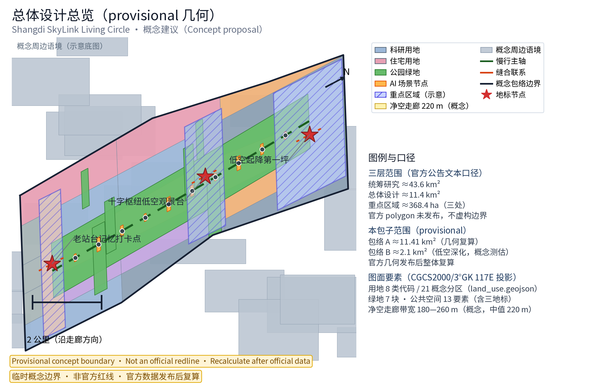
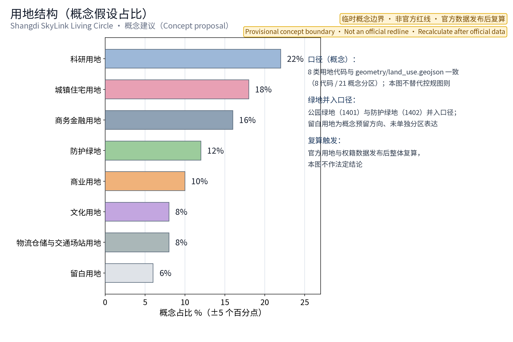
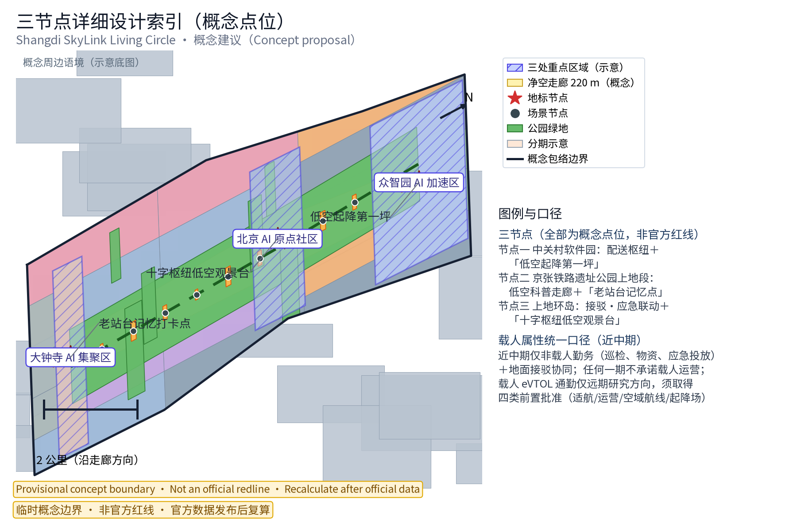
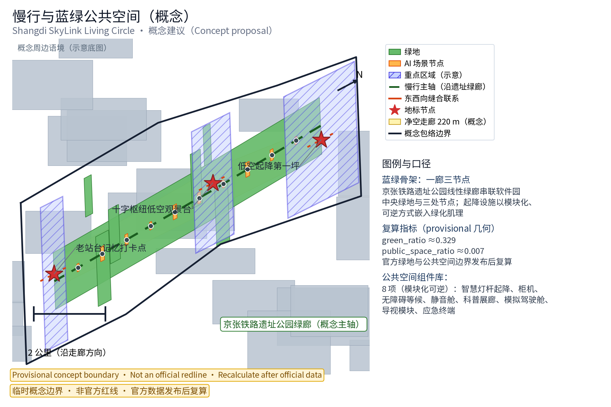
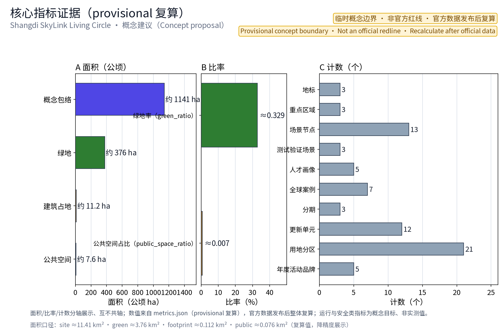

## 方案名称与总体构想（概念）

方案名称：上地智翼·低空生活圈（Shangdi SkyLink Living Circle）。「上地智翼」取"上地起飞、智联天空"之意，SkyLink 兼指空域链接与通勤链接；「低空生活圈」指以职场人日常公共空间为载体的低空服务网络。核心理念是把低空经济（配送、通勤接驳、应急、科普）平实嵌入既有公共空间，形成「三节点+十场景」的低空生活圈示范体系，追求平急两用、动静结合、可逆更新。三处原创地标节点为「低空起降第一坪」（中关村软件园配送枢纽）、「十字枢纽低空观景台」（上地环岛接驳应急）、「老站台记忆打卡点」（京张铁路遗址公园上地段），形成"新低空与旧铁路"对话的空间叙事。

本方案是面向「百年京张AI创新带」的开放共创概念建议，不替代正式规划，不构成政府审定结论。本方案按任务书三大定位（百年京张文化带、都市AI生活体验带、AI融合创新带）与五大功能（AI全栈自主创新体系、世界级AI创新生态、AI+场景赋能新范式、智能化AI活力城市、AI治理全球话语权）中的低空经济方向展开，作为「AI+场景赋能新范式」的功能载体之一，与感知、调度、测试等能力结合（概念映射），并纳入"三区两翼"的空间协同回路（详见『区域协同与任务书关系』章）。

> **证据锚点**：[source:DATA-SRC-OFFICIAL-ANNOUNCEMENT]、[source:DATA-SRC-AGENT-TASKBOOK]（组织方公告与任务书为文本口径依据）。

## 品牌与视觉识别方向

品牌层级：主品牌「上地智翼（Shangdi SkyLink）」，副题「低空生活圈（Living Circle）」；节点品牌「低空起降第一坪（First Sky-Landing Pad）」「十字枢纽低空观景台（Cross-Hub Sky Viewing Deck）」「老站台记忆打卡点（Old Platform Memory Stop）」；活动品牌「通勤天空日」「低空科技体验周」等（概念建议）。视觉识别方向（Logo 与识别体系均为一带与本方案的概念方向，供专业设计团队深化，非最终交付稿）：

- 单色优先：Logo 采用单色表述（深空蓝或纯黑/反白双版），便于印刷、刻划与工程标识复用，避免多色依赖；本包随附概念标识示意图（logo-shangdi-skylink.png，见本节末图），仅作方向示意；
- 可缩放：以几何符号化构成（而非写实图形），小尺寸（灯杆铭牌、柜机角标）与大尺寸（幕墙、地贴）均保持可辨；
- 翼形轨道符号语汇：以"双翼+铁轨枕木"的意象合一为母题，双翼构成起飞动势，负形嵌入轨道线性元素，呼应京张铁路遗址与低空起降的双重叙事；辅助图形为航线弧线网格与节点圆点，用于灯杆、地面导视与柜机涂装；
- 比例与隔离区规范（概念建议）：最小使用尺寸不低于 16 毫米（铭牌）/ 8 毫米（角标）；标识四周隔离区不小于标识高度的 1/2，隔离区内不放置文字与其他图形；反色使用时背景对比度不低于 3:1；节点应用规范：灯杆铭牌采用单色反白版、柜机角标采用深空蓝版、幕墙与地贴采用纯黑/反白版，统一搭配「SHANGDI SKYLINK」字标；
- 国际传播适配：图形不依赖汉字即可识别，配套「SHANGDI SKYLINK」字标与隔离区规范，避免文化误读；色彩以深空蓝+银灰为主、信号橙仅作警示点缀；字体方向采用开源授权字体（思源黑体/Noto Sans SC，OFL 许可；本包 HTML 与图件已实际嵌入 Noto Sans SC 子集，见 report/copyright_statement.md），正式应用前完成字体授权核验；
- 商标与在先权利：本方案未完成商标检索与在先权利核验，「上地智翼」「Shangdi SkyLink」等名称的商标注册状态、在先权利与域外冲突情况均如实标注为待核验，名称按内部工作代号处理，正式应用前须由专业机构完成检索评估，本方案不预先声称拥有任何商标权利（见『风险、版权与合规说明』章的『品牌在先权利与使用边界』条款）。

> **证据锚点**：[source:DATA-SRC-OFFICIAL-ANNOUNCEMENT]（征集规则为权属与合规表述的依据）。

## 设计依据与资料清单

本方案引用的法规、政策与规划文件均为**公开方向性参考，待条目级核验**，不构成已确认依据；已登记于 sources.json 的可查证条目包括：《北京市促进低空经济产业高质量发展行动方案（2024—2027年）》（京经信发〔2024〕54号，公开发布文本）[source:DATA-SRC-BJ-LOWALT-ACTION-PLAN]、《无人驾驶航空器飞行管理暂行条例》（国令第761号，2023年6月28日公布、2024年1月1日施行）[source:DATA-SRC-UAS-TEMP-REGULATION]、《民用无人驾驶航空器系统安全要求》（GB 42590-2023，强制性国家标准，2024年6月1日实施）[source:DATA-SRC-GB42590-2023]、《京张铁路遗址公园设计方案》公开报道与规划解读[source:DATA-SRC-JZ-PARK-DESIGN][source:DATA-SRC-JZ-PARK-INTERPRETATION]、京张铁路遗址公园沿线（人工智能创新街区重点地区）街区控规（草案）公示采信通告[source:DATA-SRC-JZ-TIAO-GUI]、中关村软件园控规及上地片区专项规划的公开报道口径，以及无人机起降场建设与运行安全相关公开标准规范。上述条文的正式条款、现行版本与适用边界须逐条核验并另行登记，正式规划设计以政府发布版本为准；本方案不据此作出任何行政许可、审批结论或实施承诺。

资料清单所列地形图、控规图则、权籍与管线普查等均为**概念工作底图需求清单**（即"待获取项"），并非本包已获取的数据；本包实际使用的全部数据见 sources.json，未获取项已在『风险、版权与合规说明』与假设清单中如实标注。政策机制建议（测试豁免、运营补贴、净空管理办法等）均为概念建议、非现行安排，详见『更新项目清单、实施政策与分期计划』章。

> **证据锚点**：[source:DATA-SRC-OFFICIAL-ANNOUNCEMENT]、[source:DATA-SRC-AGENT-TASKBOOK]（组织方公告与任务书为文本口径依据）。

## 三层范围工作框架

本方案紧扣「百年京张AI创新带」的智能化AI活力城市与全球人工智能产业高地总体定位，聚焦海淀区上地地区的低空经济工作场景，作为一带低空应用与试飞服务的西段功能板块（概念定位），与沿线轨道站点、产业园区与高校创新带协同呼应。

**官方三层范围口径（组织方公告文本口径，官方几何未发布，不虚构边界）**：统筹研究范围约 **43.6 平方公里**；总体设计范围约 **11.4 平方公里**；重点区域约 **368.4 公顷**（含三处重点区域）。以上数值以组织方公告文字为准，官方 polygon 未发布前不得作为红线或精确面积依据。

**本包子范围（provisional，明确不与官方几何混同）**：

- 【包络 A：本包概念包络】约 **11.41 平方公里**：即本包 site_boundary 概念包络由 provisional 几何复算的面积值（site_area_sqm，见 metrics.json；文字表述约 1141 万平方米），仅用于本包内容设计与机器复算。它与官方"总体设计范围约 11.4 平方公里"处于同一量级，但来源为 provisional 临时粗略几何，不宣称与官方范围重合、不替代官方范围；官方几何发布后整体复算；
- 【包络 B：本包低空深化范围】约 **2.1 平方公里**（概念测估区间 1.8—2.5 平方公里）：指三节点及其联系走廊的城市设计深化范围，推导依据为"三节点各取 600—800 米服务半径（步行 8—10 分钟）叠加 180—260 米（概念带宽区间，中值 220 米）净空走廊连续界面"后扣除重叠所得的闭合更新空间（概念估算，待官方边界与控规图则复算）；
- 【重点区域对应】官方三处重点区域（众智园AI自主创新加速区、北京AI原点社区、大钟寺AI产业集聚区，368.4 公顷口径）示意多边形见 geometry/key_areas.geojson（provisional）；本包三处低空节点（配送枢纽、科普走廊、接驳环岛）为落于该重点区域空间范围内的低空功能概念载体，节点点位以 geometry/public_space.geojson 的 ai_landmark 要素为准（见『重点区域详细设计』章）。

「十场景」与 scenario_node_count=13 的口径：10 张日常场景卡对应 10 个日常场景节点（geometry 中 scenario_type=scenario_node），3 个产业测试验证场景对应 3 处地标节点的测试验证职能（metrics.json 公式为场景节点 10 + 地标 3），合计 13 个场景节点，详见『AI 创新生态、人才画像与 AI+ 场景』章。

> **证据锚点**：[metric:site_area_sqm]、[source:DATA-SRC-OFFICIAL-ANNOUNCEMENT]、[source:DATA-SRC-PROVISIONAL-BOUNDARIES]（三层范围划分依据任务书官方文本口径与 provisional 几何，两者分层使用）。

## 区域协同与任务书关系

本主题在任务书体系中的角色：上地智翼·低空生活圈是一带低空经济方向的**西段功能板块与场景载体**——它在「都市AI生活体验带」上提供可感知、可体验的低空生活样板，在「AI融合创新带」中承担配送、接驳、应急、科普四类 AI+ 场景集成，并为「百年京张文化带」注入"老站台记忆点+低空新基建"的新旧叙事；其空间载体与三区两翼中各功能区的协同关系如下表（概念级协同，均为建议方向，不构成区域间的任何确定安排）：

| 任务书要素 | 本主题的角色（概念级） | 协同方式示例 |
| --- | --- | --- |
| 三大定位 | 承担「都市AI生活体验带」的低空生活界面，贡献「AI融合创新带」的产业场景，以铁路遗址与老站台呼应「百年京张文化带」 | 低空生活圈作为一带体验带上的示范样板，与沿线公共空间连续组织 |
| 五大功能 | 作为「AI+场景赋能新范式」的低空载体，支撑「智能化AI活力城市」的空中服务层，为全栈体系与创新生态提供测试验证场景，参与「AI治理全球话语权」的运行治理演示 | 场景共创、联合实验室、测试验证基地、匿名数据公示 |
| 三区两翼 | 与AI原点社区（创新生态策源）、众智园AI自主创新加速区（全栈体系与治理话语权）、大钟寺AI产业集聚区（智能原生新业态）互接；依托中关村科技服务翼的要素配置与IP资本衔接、小月河场景赋能翼的体验路径组织 | 众智园输出飞控/避障/调度技术标准，本主题输出场景载体与运行样本 |
| 一带重点区域 | 以软件园配送枢纽、遗址公园上地段、上地环岛三节点嵌入一带东西向公共空间链 | 科普走廊与遗址公园AI公共空间组件库共构，大钟寺消费商务场景与本主题配送体验互补 |
| 跨区域协同 | 与北纬社区（区域协同口径按任务书，不作位置断言）、未来科学城、怀柔科学城、经开区及京津冀方向的低空制造、测试与产业资源形成概念级协同 | 测试数据互认、试飞资源互补、供应链协同（均为概念建议方向） |

概念级协同关系清单：**众智园**（AI全栈自主创新加速区）——本主题的飞控、避障、调度技术接口与其全栈体系对接，测试验证场景提供运行数据样本；**AI原点社区**——本主题的科普展廊与体验活动承接创新生态的公众化表达；**大钟寺**（AI产业集聚区）——智能原生消费与商务场景中引入低空配送与巡游体验（概念方向）；**北纬社区**（以任务书口径为准）——就近的居住社区作为配送试点与居民议事、噪声分时机制的协同对象；**未来科学城、怀柔科学城、经开区**——在低空制造、测试设施、产业配套层面形成概念级协作方向；**京津冀**——面向区域内低空航线协同与产业分工的远期概念方向。以上均为概念建议，区域协同的具体机制与承诺以政府正式安排为准。

> **证据锚点**：[source:DATA-SRC-AGENT-TASKBOOK]（三区两翼与区域协同口径依据任务书）。

## 统筹研究范围产业与未来城市研究

统筹研究范围约 43.6 平方公里（官方公告文本口径）与本包概念包络（约 11.41 平方公里，provisional 几何复算值）分层使用：官方口径用于产业与空间组织框架的方向性研究，本包概念包络用于本方案内容的机器校验与图面表达；两者均待官方几何发布后整体复算。产业研究聚焦低空经济「研发—制造—运营—服务」链条，识别软件园内无人机飞控、人工智能、通信导航等企业的协同机会（概念方向，不列举具体企业合作承诺），提出「研发测试—场景示范—总部孵化」的产业空间组织（概念建议）；未来城市研究预判无人机通勤、即时配送普及后对职住时空、地面交通与公共空间使用方式的改变，提出面向2035年的弹性用地储备与基础设施预留策略（方向性预判，不构成对用地与投资的承诺）。统筹研究为方向性结论，不预设用地结论；其输出的产业方向约束总体设计的设施构成与选址偏好，形成「战略—结构—实施」闭环。

> **证据锚点**：[metric:site_area_sqm]、[source:DATA-SRC-PROVISIONAL-BOUNDARIES]（边界为 provisional，研究范围仅作概念示意）。

## 总体设计范围城市更新与控规深度城市设计

总体设计范围约 2.1 平方公里（概念测估区间 1.8—2.5 平方公里，推导依据见『三层范围工作框架』章），涵盖三节点及其联系走廊。设计遵循控规深度的城市设计方法，对节点定位、净空安全区、起降设施选址、景观界面与街道断面进行系统校核与优化；对控规指标只做校核建议，不预设数值结论。重点处理低空设施与既有城市更新的关系：利用软件园屋顶与停车场上盖增设配送柜机与小型起降点，依托京张铁路遗址公园绿廊布局低空科普走廊，在上地环岛周边完善接驳与灯杆起降网络；设计成果同步校核控规指标，形成图则衔接建议（概念建议，供专业团队深化研究）。

> **证据锚点**：[source:DATA-SRC-MOHURD-CONTROL-DETAILED-PLANNING]、[source:DATA-SRC-PROVISIONAL-BOUNDARIES]。
## 重点区域详细设计

三节点的起降设施选址均为概念点位，须经空域管理与专业审查后重新落位；节点间的净空走廊（概念带宽区间 180—260 米，中值 220 米，与 geometry 缓冲口径一致；推导依据与专业评估待办见『试点准入与安全（MVP 实施卡）』章的运行阈值表）与慢行联系构成完整空间叙事，详细平面与剖面以图册 drawings/a3-booklet.pdf 与 geometry 层表达。**几何口径说明**：三节点点位（ai_landmark）来自 geometry/public_space.geojson；其所在的一带三处重点区域示意多边形（众智园、北京AI原点社区、大钟寺）来自 geometry/key_areas.geojson（均 provisional，示意图见图件与视觉页）。

- **节点一：中关村软件园「配送枢纽+起降示范」**：设中央配送枢纽、屋顶起降场与运维中心，打造「低空起降第一坪」地标（概念单体规模区间 800—1500 平方米，中值 1200 平方米；推导依据：起降坪+交接等候+安全隔离缓冲+无障碍通道的组合功能面积，待官方控规与场地数据复算），示范楼宇—站点—路径三级配送体系；
- **节点二：京张铁路遗址公园上地段「低空科普休闲」**：利用线性铁路遗址设科普展廊、模拟驾驶舱与试飞体验场，保留老站台构筑「老站台记忆打卡点」；文保与绿地约束以官方文保边界为准，设施采用可逆、零开挖设计（概念方向）；
- **节点三：上地环岛「通勤接驳+应急联动」**：结合立体化改造设接驳站、智慧灯杆起降点与运控大屏，于环岛上空设置「十字枢纽低空观景台」。

**通勤接驳的技术类型与监管路径（概念限定）**：本方案近中期通勤接驳仅表述为「非载人勤务（巡检、物资、应急投放）+ 地面接驳协同」，不承诺载人运营；远期若推进载人通勤，航空器类型按「电动垂直起降（eVTOL）概念机型（2—5 座级）」方向研究，载人属性为取酬载人运输，监管路径以四类前置条件为前提：民航适航审定、运营人运行合格审定、空域与航线批准、起降场设施审定（概念路径，均非现状结论，须按 [source:DATA-SRC-UAS-TEMP-REGULATION] 及适航规章逐项核验）。在未取得上述批准前，本方案不将载人接驳列入任何一期的实施承诺；场景卡①（『AI 创新生态、人才画像与 AI+ 场景』章）、试点C（『试点准入与安全』章）与分期计划（『更新项目清单、实施政策与分期计划』章）均按本口径表述，载人属性与时序完全一致。

**京张历史文化资源清单与导视叙事（概念，agent.5 响应）**：以「老站台记忆点」为锚，系统梳理沿线可叙事文化要素（均以官方文保与保留方案为准，详见下表），并组织"从京张到低空"的导览主线和配套导视单元（地面标识、科普牌、语音导览，见『蓝绿空间、公共空间与城市风貌』章组件库）：

| 资源要素 | 载体/位置（概念） | 使用边界 | 叙事主题 |
| --- | --- | --- | --- |
| 老站台 | 遗址公园上地段（概念落位） | 以官方文保边界为准，接触式展示须经文保审批 | 「老站台记忆」记忆点叙事 |
| 铁轨与枕木 | 线性绿廊保留段 | 以官方保留方案为准，可逆展示 | 「轨道—航线」新旧对话 |
| 站房与信号元素 | 沿线概念点位 | 复刻或符号化使用须文保评估 | 「百年京张」科普叙事 |
| 人字形铁路与詹天佑元素 | 科普展廊（概念） | 历史人物与工程叙事需逐条核实史实 | 「人字变轨」导览主线 |
| 京张大事记 | 导视牌与展廊 | 史实条目逐条核验后使用 | 「从京张到低空」时间轴 |
| 13号线桥下空间 | 沿线桥下（概念） | 权属与结构安全待评估 | 「桥下—低空」双层叙事 |

三节点以净空走廊串联，形成「第一坪—观景台—记忆点」的空间叙事；三处地标均按任务书朝圣地标尺度要求控制为集群型、轻量化、可逆的公共设施，不追求大体量。

> **证据锚点**：[metric:landmark_count]、[data:PACKAGE-GEOMETRY]（三节点点位与重点区域示意多边形分别来自 public_space.geojson 与 key_areas.geojson）。

## AI 创新生态、人才画像与 AI+ 场景

方案构建「AI+低空」创新生态，联合园区企业与高校共建联合实验室、数据开放平台与测试验证基地（均为概念建议，不构成对具体企业或运营商的承诺）。**生态图谱（概念）**：研发—制造（飞控、避障、通信导航协同机会，接口对接众智园全栈体系）→ 测试—示范（T1—T3 产业测试验证场景与示范点位）→ 运营—服务（试点运营企业与柜机合作方，统一建设、多元运营）→ 标准—治理（标准制定的参与方向 + 匿名数据年度公示），形成"研发测试—场景示范—总部孵化"闭环。

**五类人才核心用户画像（与 metrics.json 的 persona_count=5 对应；五类人才为概念分类，专项调研待实施前开展）**：①低空产业工程师（高频巡检、试飞验证与数据调试）；②园区通勤者（通勤接驳与即时配送）；③企业管理者（运行监管与成本优化）；④应急管理者（应急投放与联动指挥）；⑤学生访客与亲子研学家庭（科普展廊、模拟驾驶与体验培训）。周边居民与老年人、残障人士、低收入使用者、非智能设备用户、公园安静使用者等群体的需求与旅程详见『公共利益与包容性设计』章。

**「十场景」与 scenario_node_count=13 的关系**：10 张日常场景卡（下表的卡①—卡⑩）对应 geometry 中 10 个日常场景节点（scenario_type=scenario_node）；3 个产业测试验证场景（表二 T1—T3）与 3 处地标节点的空间载体对应，承担测试验证职能；合计 13 个场景节点，即 metrics.json 的 scenario_node_count=13。

十张场景卡覆盖交通（通勤接驳）、产业（巡检试飞）、公共空间（观景科普）、公共服务（应急投放）、文化（铁路遗产科普叙事）与治理（运行监管与匿名公示）六类领域，AI 能力以辅助身份出现：AI 调度建议、AI 识别仅作聚合分析、AI 预测驱动排程、AI 模型按季度评估、AI 决策一律人工确认。

**表一：10 张日常场景卡（概念建议；"人工复核点"均为方案自设的运行治理设计，非监管要求）**

**载人属性统一口径（场景卡①、节点三、试点C与分期计划共用）**：本方案通勤接驳在近中期（0—4 年）一律为非载人勤务（巡检、物资、应急投放）+ 地面接驳协同，任何一期均不承诺载人运营；远期载人 eVTOL 通勤仅为研究方向，须取得民航适航审定、运营人运行合格审定、空域与航线批准、起降场设施审定四类前置批准后方可启动研究，且不构成实施承诺。以下场景卡中凡涉及接驳、起降与乘客引导的表述均按本口径理解与执行。

| 场景卡名称 | 目标 | 输入与数据流 | 输出 | 模型能力边界 | 运营与责任主体 | 数据与隐私边界 |
| --- | --- | --- | --- | --- | --- | --- |
| 卡① 通勤接驳（近中期非载人） | 职住短途接驳，与地铁13号线、昌平线错峰衔接；近中期为非载人勤务（巡检、物资、应急投放）+ 地面接驳协同，载人属性与本方案所有载体口径一致（见下方「载人属性统一口径」） | 预约订单、起降点状态、气象与空域时段 | 排程建议、起降时序、地面接驳协同引导信息（载人乘客引导仅在远期载人场景获批后启用） | 仅起降调度与冲突预警辅助，不自动放行；关键指令人工确认 | 园区物业与持证运营企业共担，属地空域与交通部门监管 | 预约信息脱敏，不采集身份与生物数据，匿名聚合 |
| 卡② 外卖快递配送 | 楼宇—站点—路径三级配送，柜机交接、分时错峰 | 订单坐标（脱敏）、柜机空闲状态、航线时段表 | 配送排程与柜机分配建议 | 路径规划辅助，超视距作业须持证并取得批准 | 试点运营企业+柜机合作方，方案自设人工复核点：路线变更、柜点增设 | 仅收货点位与匿名订单量，不关联个人身份 |
| 卡③ 观光导览 | 观景台低空视角导览，预约制、分时开放 | 预约时段、天气条件、班次表 | 导览班次与安全员配置建议 | 航线覆盖辅助解说，不自动飞行 | 公园运营方+体验服务商，监管按公共活动管理 | 预约人数匿名聚合，不建参观行为画像 |
| 卡④ 低空巡检与遥感 | 园区安防巡检与设施体检、现状测绘辅助 | 巡检计划、设施目标坐标（建筑/设备） | 异常告警清单（匿名聚合）、遥感图斑（脱敏） | AI 图像识别仅匿名聚合分析，不作个体识别用途 | 园区物业与专业巡检企业，异常处置人工复核 | 不采集人员面部与个体轨迹，成果人工复核后归档 |
| 卡⑤ 应急投放 | 应急物资投放、平急两用，与应急管理平台联动 | 应急指令、物资清单、禁飞时段检查 | 投放任务单（人工复核后执行） | 辅助路径与投放点建议，不自主决策 | 应急管理部门牵头、持证企业执行，每次任务执行前人工确认 | 任务记录按最小化留存并脱敏，无个体画像 |
| 卡⑥ 午间咖啡配送 | 分时错峰，与地面外卖互补 | 预订单、柜点状态、时段表 | 错峰排单建议 | 调度辅助，超阈值自动暂停并由人工复核 | 商户+试点运营商，点位增设人工复核 | 订单量匿名聚合 |
| 卡⑦ 智慧灯杆共享起降 | 灯杆起降点共享电力通信，动态分配机位 | 机位占用、电力负荷、通信状态 | 机位分配与充电排程建议 | 分配算法辅助，异常人工介入 | 市政灯杆维护单位+运营商 | 设备状态数据匿名，不关联个人 |
| 卡⑧ 空域数据可视化大屏 | 运控大屏呈现匿名聚合空域态势，支撑监管与公示 | 匿名航迹聚合、告警事件流 | 态势大屏与月度公示摘要 | 聚合统计辅助，不定位个体 | 运控中心（园区+监管共管），对外发布人工复核 | 只展示聚合热力，个体轨迹不采集不存储 |
| 卡⑨ 科普研学模拟驾驶 | 面向学生访客与亲子研学家庭预约开放 | 预约人数与场次表、天气条件 | 讲解与服务排期建议 | 模拟器教学辅助，无真实飞行 | 公园运营方+志愿者，培训排期与飞行安全确认 | 仅预约人数与时段，不采集儿童个人信息 |
| 卡⑩ 试飞服务 | 持证合规的试飞体验培训与测试验证 | 学员资质、气象窗口、空域批件 | 培训排期与试飞记录（合规存证） | 教学辅助，实飞由持证教员负责 | 持证培训机构+测试验证基地，纳入常态化测试计划 | 证书信息最小化留存，试飞记录按法规要求保存 |

**表二：3 个产业测试验证场景（概念建议目标，非实测承诺；与 metrics.json 的 industry_test_scenario_count=3 对应；各指标的验证方法与退出阈值见『试点准入与安全』章运行阈值表）**

| 测试对象 | 数据输入 | 验证指标 | 退出条件 |
| --- | --- | --- | --- |
| T1 航线冲突避障排程 | 匿名航迹与计划航线（模拟+小范围实测） | 冲突检出率≥99%、消解成功率≥98%（概念目标） | 连续 30 天零冲突事件且指标达标后转入常态化运行 |
| T2 人机共存行人保护 | 行人密度匿名热力、机巢周边感知（不设识别设备） | 隔离区闯入率≤0.1 起/百架次、行人零接触事件（概念目标） | 累计 1000 架次无接触事件且通过安全评审后转入常态化 |
| T3 恶劣天气返航备降 | 气象站数据流、航线阈值表 | 阈值触发率 100%、返航成功率≥99%（概念目标） | 完成四季各一轮验证且零故障后转入常态化 |

**全球低空经济七案例对照与生态图谱（agent.2 响应；逐案登记于 sources.json，来源均为公开机构页面；对照分析用于提炼机制，不构成任何承诺）**：

| 案例（机制） | 来源 | 机制要点 | 本地适用性启示 |
| --- | --- | --- | --- |
| Zipline（即时配送） | [source:CASE-ZIPLINE] | 以固定翼+悬停索降实现药品与商品即时配送，2016 年起在卢旺达、加纳等运营 | 启示：超视距配送需长期运营安全记录与公众信任建设；本地须空域批准与柜机网络支撑 |
| Wing（住宅区无人机配送） | [source:CASE-WING] | Alphabet 旗下，住宅端到端配送，交付至庭院/车道，已累计超百万单住宅配送 | 启示：末端交付标准化与降噪设计；本地须结合楼宇与街道条件改造 |
| Joby（eVTOL 载人空中出租车） | [source:CASE-JOBY] | 电动垂直起降载人飞行器，取得 Part 135 运营资质，开展城市示范 | 启示：载人运营链条长（适航+运营+设施），仅作为本方案远期概念方向 |
| 迪拜空中出租车 | [source:CASE-DUBAI-UAM] | 迪拜 RTA 主导 eVTOL 载人空中出租车与垂直起降场网络，2026 年目标运营 | 启示：政府统筹+运营商+设施商三方协议模式可参考 |
| 新加坡 UAM | [source:CASE-SINGAPORE-UAM] | 新加坡民航局主导 UAM 监管标准与试验（如与 EASA 合作、Skyways 试验） | 启示：监管先行、试验沙盒路径 |
| 深圳美团无人机 | [source:CASE-SHENZHEN-MEITUAN] | 城市低空航网常态化运营，接驳机场+智能调度；据公开报道口径，截至 2024 年 9 月底在深圳等城市开通 43 条航线、累计订单超 36 万单 | 启示：高频本地化配送与调度能力最接近本主题配送场景，可作对标研究对象 |
| 大疆开发者生态 | [source:CASE-DJI-DEV] | 面向开发者的 SDK/云 API 软硬件开放生态 | 启示：开放接口与开发者社区模式可复制到园区生态（见『开发者社区』节） |
场景空间运营映射（概念建议）：无人机配送与午间咖啡（卡②⑥）落位中央配送枢纽、屋顶起降场与配送柜机，试点运营、分时错峰派单，「统一建设、多元运营」；低空巡检与遥感（卡④）落位园区巡检航线与运维中心，按计划巡检、成果匿名聚合；通勤接驳（卡①）落位环岛接驳站与智慧灯杆起降点，预约接驳、班次公示；应急投放（卡⑤）落位应急物资库与运控大屏，平急两用预案、定期联动演练；科普研学与试飞服务（卡⑨⑩）落位遗址公园科普展廊与试飞体验场，预约制排期；空域态势可视化（卡⑧）落位运控中心大屏，匿名聚合数据、按年度公示。

**AI 数据闭环表述（概念建议）**：预测与调度——由需求预测模型（配送/接驳/参访量）驱动起降时序调度，形成"感知—预测—调度—反馈"闭环；多智能体协同——配送、接驳、气象、灯杆机位等智能体在统一场景内协商排程，冲突交由人工确认；模型评估——模型按季度离线评估并在运控台账登记评估结果，指标随年度公示；人工监督——所有关键决策（航线变更、应急触发、对外发布）保留人工确认环节；治理接口——以匿名聚合数据向监管与公众开放的展示与申诉接口，接口规范为概念设计。本部分衔接任务书要素：与**众智园全栈体系**（飞控、避障、调度技术栈）形成技术接口对接；依托**中关村科技服务翼要素支撑**（算力、数据、测试设施与跨境合作通道等要素配置方向）；并沿**小月河场景赋能翼体验路径**（遗址公园科普走廊与观景动线）组织公共体验序列（均为概念建议方向）。

**AI 技术协议（概念设计，供测试验证基地与运控方案深化时作为协议草案；全部指标为方案自设概念目标，非实测结果，实测前不对外作出性能承诺）**：

| 技术条目 | 范围与输入 | 内容要点（概念） | 验收口径（概念） | 触发与复算 |
| --- | --- | --- | --- | --- |
| 模型评测协议 | 需求预测、调度排程、冲突预警模型；输入为匿名样本集与基准测试集（模拟+小范围实测） | 季度离线评测：匿名样本回放并记录准确率、误报率与召回率，评测结果记入运控台账并按年度公示 | 每模型每季度 1 份评测报告；指标以实测基线为准，不与设计假设混淆 | 模型版本更新、基线路网变化或数据源变更时重评 |
| 数据质量协议 | 匿名航迹、订单量、气象与机位状态数据流 | 数据字典与口径表随包维护；缺失率、异常值与重复记录按月统计；异常批次标记并经人工复核后归档 | 月度数据质量报告；缺失率<5%、异常值检出率 100%（概念目标） | 数据源、采集设备或统计口径变更时 |
| 误差分群协议 | 模型预测误差及其分布 | 按时段、站点、天气与机型分群统计误差（MAE/MAPE 分群表），识别系统性偏差并回溯数据与特征 | 分群误差表季度更新；系统性偏差超过 2σ 触发人工复核（概念阈值） | 季节更替、网络扩面或新机型加入时 |
| 运行监测协议 | 运行指标流（准点率、事故、投诉、天气停航、告警） | 实时告警、自动暂停阈值与月度运行监测报告；所有自动告警须人工确认后方可对外发布 | 月度运行监测报告；告警处置闭环率 100%（概念目标） | 监管口径或官方运行安全数据发布后复算 |

**开发者社区、场景开放、国际传播与人才/企业转化路径（概念，agent.6 响应）**：

- **开发者社区运营（概念）**：开放飞行任务 API、排程沙箱与匿名数据样本集；季度开发者日与年度低空创客赛（概念活动，纳入开放日体系）；开发者协议与开源合规边界声明（不开放涉及安全与隐私的原始数据）；
- **场景开放（概念）**：按『表一』场景卡建立"开放场景清单"（配送、巡检、科普、试飞 4 类 10 卡），以预约+资质审核方式向企业、高校与个人开发者分时开放（试点点位），开放规则须经监管与公众参与程序；
- **国际传播（概念）**：「SHANGDI SKYLINK」双语资料包（本包 proposal.en.html、index.en.html、英文图件与文册即为基础素材）、国际展会与双城对话（对标研究迪拜、新加坡等案例）、开放日双语导览；所有对外材料启用前完成语言校核与在先权利复核；
- **人才/企业转化路径（概念）**：高校实训基地与毕业设计工坊（与沿线高校创新带联动）、初创测试验证通道（测试验证基地入驻申请制，优先面向低空运控、避障、配送调度方向）、"试验—示范—总部落地"一站式服务窗口（概念，不构成对任何企业的承诺）。

> **证据锚点**：[metric:scenario_node_count]、[metric:industry_test_scenario_count]（场景与测试口径）；[metric:persona_count]、[metric:global_case_count]（画像与案例口径）。
> 治理边界参照：[source:DATA-SRC-GENERATIVE-AI-INTERIM-MEASURES]（AI 生成内容治理表述的参照依据）。

## 用地、建筑规模与拆改留方案

方案以存量更新为主，总体设计范围内共 12 个更新单元（与 geometry/buildings.geojson 的 12 处概念更新地块一致）。拆改留原则：「留为主、改为辅、拆最少」——保留软件园产业建筑与公园历史构筑物，改造停车场、闲置屋面与环岛附属空间，仅拆除少量影响净空的低效临建（须经个案论证），实现低成本、可逆化的更新路径。

新增低空设施建筑面积约 **1.8 万平方米（概念估算区间 1.5—2.0 万平方米）**，分项推导（概念估算，待官方测绘与控规数据复算）：配送枢纽 0.5—0.7 万、运维中心 0.3—0.5 万、科普与培训用房 0.4—0.6 万、接驳及服务设施 0.3—0.4 万平方米；起降坪与灯杆起降点以露天与轻型构筑物为主，不计入大体量建筑。概念用地结构以三大类为主（科研用地、城镇住宅用地、商务金融用地），全部 8 类占比为**概念假设占比**（科研 22%、住宅 18%、商务金融 16%、商业 10%、文化 8%、物流仓储与交通场站 8%、防护绿地 12%、留白 6%，各 ±5 个百分点区间），其中公园绿地（代码 1401）与防护绿地（1402）并入口径、留白用地为概念预留方向未单独分区表达；geometry 含 8 个用地代码、21 个概念分区，与配置 land_use_spec 及图件 land-use-structure.png 一致，待官方用地与权籍数据发布后复算。

> **证据锚点**：[data:PACKAGE-GEOMETRY]、[source:DATA-SRC-MNR-LAND-USE-CLASSIFICATION-202311]（用地分类名称参照现行国标口径）。

## 交通、轨道、市政与公共服务设施

交通方面，换乘组织以地面集散为主、低空接驳为辅，依托地铁13号线、昌平线及软件园公交走廊组织「低空接驳+地面集散」换乘，新增环岛接驳站点与慢行优先断面；起降点与道路衔接关系见 geometry/roads.geojson（road_class 已按允许枚举归一）。通勤接驳的航空器类型、载人属性与监管路径按『重点区域详细设计』章的概念限定执行（近中期非载人勤务+地面协同，远期 eVTOL 方向研究，载人运营以四类前置条件为前提）。市政方面，以共享为原则：智慧灯杆起降点共享电力与通信管线，配送枢纽接入园区能源系统，新增无人机充电、飞控网络与气象监测设施；对市政管线容量不做数值结论。公共服务方面，配置低空运控中心、应急物资库、科普教室、共享储物柜与无障碍设施，实现运行、应急、体验三类服务集成，与既有商业医疗设施错时共享。本节涉及的换乘分担比例、接驳设施规模、市政管线容量与公共服务配置量均为 provisional 概念边界下的估算（意愿性概念建议）；复算触发条件：官方发布现状交通流量调查、轨道客流统计、市政管线普查或控规图则等正式数据后，对上述各项指标整体复算，并以复算结果为准。

> **证据锚点**：[data:PACKAGE-GEOMETRY]、[source:DATA-SRC-MOHURD-URBAN-DESIGN-MEASURES]（市政与慢行设计表述的方法参照）。

## 蓝绿空间、公共空间与城市风貌

依托京张铁路遗址公园绿廊与软件园中央绿地，构建「一廊三节点」蓝绿骨架：京张铁路遗址公园线性绿廊串联三处节点；指标 green_ratio≈0.329、public_space_ratio≈0.007（provisional 几何复算，见 metrics.json 与『指标体系、面积复算与合规矩阵』章口径表，官方几何发布后复算）。起降设施以模块化、可逆设计嵌入绿化肌理，设观景区、体验区与静音隔离区，避免破坏生态本底。公共空间强调「看得见、摸得着」的低空科普体验；风貌控制以「科技轻盈」为母题，设施采用轻量化外壳与夜景光带，塑造园区识别性；历史铁轨与老站台元素完整保留，塑造「新低空与旧铁路」对话的风貌特征；节点内均设置面向公众的科普与体验界面并配置人工服务兜底，导控克制统一。

**公共空间组件库（概念目录，agent.4 响应；全部组件为模块化、可逆、非大体量设计，相关图面见图册）**：

| 组件 | 功能 | 模块化/可逆方式 | 落位（概念） |
| --- | --- | --- | --- |
| 智慧灯杆起降单元 | 灯杆集成起降平台+充电通信 | 模块化：杆体预留接口，可拆装 | 上地环岛周边道路 |
| 配送柜机单元 | 无人配送交接+常温/冷藏舱 | 标准尺寸柜体，点位可替换 | 软件园楼宇与路径节点 |
| 无障碍等候单元 | 座椅+遮阳+信息屏+呼叫按钮 | 可逆：地脚螺栓固定 | 三节点起降点周边 |
| 静音舱（隔声单元） | 低噪设备收纳+降噪围护 | 装配式轻钢+可逆围护 | 机巢与试飞体验场 |
| 科普展廊模块 | 展陈+互动屏+实物模型 | 模块化展架，内容可更新 | 遗址公园上地段 |
| 模拟驾驶舱 | 科普模拟飞行 | 集装箱改造，可迁移 | 遗址公园科普区 |
| 地面标识与导视模块 | 起降/禁入/等候区标线+地贴 | 非开挖涂装与可揭地贴 | 三节点及慢行轴线 |
| 应急联动终端 | 应急指令屏+物资接口 | 预留接口，平急两用 | 运控中心与环岛 |

> **证据锚点**：[metric:green_ratio]、[metric:public_space_ratio]。

## 更新项目清单、实施政策与分期计划

更新项目清单共 21 项（概念，与下表所列分类逐项对应、可数核验）：枢纽类 4 项（中央配送枢纽、屋顶起降场与运维中心、环岛接驳站、运控大屏）、设施类 8 项（智慧灯杆起降点含灯杆改造、配送柜机网络、机巢与充电设施、净空护栏与安全隔离设施、气象与空域监测站、应急备降点含环岛应急隔离坪、消防充电隔离舱、无障碍等候与引导设施）、公共空间类 6 项（科普展廊、模拟驾驶舱、试飞体验场、观景台、静音隔离带、慢行联系）、运营机制类 3 项（居民议事与意见征集公开答复机制、年度运营与服务公示机制、开放日与体验周活动机制）。项目清单如下（概念责任主体与概念投资档位均为建议性表述，不构成投资承诺）：

| 项目 | 类别 | 概念责任主体（建议） | 投资档位 | 时序 |
| --- | --- | --- | --- | --- |
| 中央配送枢纽 | 枢纽 | 园区物业+试点运营企业+政府引导 | 高 | 近期（0—2年） |
| 屋顶起降场与运维中心 | 枢纽 | 园区物业+持证运营企业 | 中 | 近期（0—2年） |
| 环岛接驳站 | 枢纽 | 交通部门+园区共同深化 | 高 | 中期（2—4年） |
| 运控大屏 | 枢纽 | 运控中心（园区+监管共管） | 低 | 近期（0—2年） |
| 智慧灯杆起降点（含灯杆改造） | 设施 | 市政灯杆维护单位+运营商 | 中 | 中期（2—4年） |
| 配送柜机网络 | 设施 | 试点运营企业+商户 | 低 | 近期（0—2年） |
| 机巢与充电设施 | 设施 | 持证运营企业 | 中 | 近期（0—2年） |
| 净空护栏与安全隔离设施 | 设施 | 园区物业+专业团队 | 低 | 近期（0—2年） |
| 气象与空域监测站 | 设施 | 运控中心+专业团队 | 低 | 近期（0—2年） |
| 应急备降点（含环岛应急隔离坪） | 设施 | 园区物业+应急管理部门 | 低 | 中期（2—4年） |
| 消防充电隔离舱 | 设施 | 园区物业+消防部门联审 | 低 | 近期（0—2年） |
| 无障碍等候与引导设施 | 设施 | 园区物业+专业团队 | 低 | 近期（0—2年） |
| 科普展廊 | 公共空间 | 公园运营方+高校志愿者 | 中 | 近期（0—2年） |
| 模拟驾驶舱 | 公共空间 | 公园运营方+设备供应商 | 中 | 中期（2—4年） |
| 试飞体验场 | 公共空间 | 持证培训机构+测试验证基地 | 中 | 中期（2—4年） |
| 观景台 | 公共空间 | 交通部门+园区共同深化 | 中 | 中期（2—4年） |
| 静音隔离带 | 公共空间 | 园林部门+专业团队 | 低 | 近期（0—2年） |
| 慢行联系 | 公共空间 | 交通部门+专业团队 | 中 | 远期（4—6年） |
| 居民议事与意见征集公开答复机制 | 运营机制 | 社区+园区共同运营 | 纳入年度运营预算 | 近期（0—2年） |
| 年度运营与服务公示机制 | 运营机制 | 运控中心+监管 | 纳入年度运营预算 | 中期（2—4年） |
| 开放日与体验周活动机制 | 运营机制 | 公园运营方+志愿者 | 纳入年度运营预算 | 远期（4—6年） |

**投资估算口径（概念，非精确造价）**：估算方法——同类低空起降与公共服务设施类比（概念级）；价格基期——2026 年概念期价格水平；包含范围——设施本体与安装接入，不含征地、空域审批与市政大修费用；置信等级——低（概念建议）；复算触发——官方发布概算指标或项目立项后整体复算。投资档位定义：低≈0.1 亿元以下量级、中≈0.1—0.2 亿元量级、高≈0.2—0.5 亿元量级（量级区间，不承诺具体金额）。

**年度活动品牌体系（概念，与 metrics.json 的 annual_program_count=5 对应）**：

| 年度活动品牌 | 频次/时机 | 内容构成 | 责任主体（建议） | 衔接机制 |
| --- | --- | --- | --- | --- |
| 通勤天空日 | 年度 | 预约接驳体验与通勤主题科普 | 交通部门+园区运控中心 | 年度开放日 |
| 低空科技体验周 | 年度 | 试飞体验、科普研学、开发者日 | 公园运营方+培训机构+高校 | 开放日与体验周机制 |
| 年度开放日 | 年度 | 三节点开放参观与居民议事 | 公园运营方+社区 | 居民议事机制 |
| 科普研学季 | 季度 | 学生访客预约科普与模拟驾驶 | 公园运营方+志愿者 | 年度公示机制 |
| 月度匿名数据公示日 | 月度 | 匿名聚合运行指标公示与申诉窗口 | 运控中心+监管 | 年度运营与服务公示机制 |

**荣誉展示体系（概念，agent.4 响应；与运营机制类 3 项及开放日体系衔接）**：

| 荣誉项目 | 频次 | 评审/公示方式（概念） | 与机制衔接 |
| --- | --- | --- | --- |
| 「低空文明出行」年度荣誉榜 | 年度 | 居民议事会提名、公示后授牌（概念） | 与年度运营与服务公示衔接 |
| 科普研学认证与志愿者积分 | 季度 | 志愿者积分公示与兑换（概念） | 与开放日/体验周衔接 |
| 试飞与创新成果展示角 | 每季度更新 | 匿名成果与合规记录展示（概念） | 与测试验证场景衔接 |
| 共创设计荣誉墙 | 活动期间 | 方案征集入选作品展示（概念） | 与开放日衔接 |
| 企业社会责任公示牌 | 年度 | 运营服务指标匿名公示（概念） | 与年度公示机制衔接 |

实施政策建议（**均为概念建议、非现行安排**，须依法依规论证，不构成政府或运营方承诺）：出台低空设施配建指引与净空管理办法（概念建议、非现行安排，管理办法属部门规章层面事项，是否制定、由谁制定以政府正式安排为准）；探索「统一建设、多元运营」模式；给予示范企业运营补贴与测试豁免（均为概念建议、非现行安排，不构成对任何补贴或豁免的承诺）。

分期计划为**概念节奏，非官方承诺**：近期（0—2年）试点示范——完成配送枢纽与科普走廊试点，启动分时配送与预约制体验，设立居民议事点并开展年度开放日试点；中期（2—4年）扩面成网——建成接驳与应急体系，试行年度运营与服务公示，常态化开展居民意见征集与公开答复，引入季度主题体验与月度匿名数据公示；远期（4—6年）全域常态化——形成完整低空生活圈，年度开放日与低空科技体验周等概念活动常态化，运行与服务按年度公示并接受居民监督。**载人属性与时序（统一口径）**：本方案在近中期（0—4 年）及远期（4—6 年）内均只实施非载人勤务（巡检、物资、应急投放）+ 地面接驳协同，任何一期均不将载人运营列入实施承诺；载人 eVTOL 通勤为远期研究方向，仅在取得民航适航审定、运营人运行合格审定、空域与航线批准、起降场设施审定四类前置批准后启动研究，与场景卡①、节点三、试点C的表述完全一致。运营机制类 3 项为居民意见通道与公众参与设计（概念建议）：居民议事会与意见征集公开答复机制、年度运营与服务公示机制、年度开放日与体验周活动机制，与配送展示、科普研学、试飞服务主题匹配。

> **证据锚点**：[metric:phase_count]、[metric:annual_program_count]、[source:DATA-SRC-AGENT-TASKBOOK]（分期与实施条目对应任务书要求）。
## 试点准入与安全（MVP 实施卡）

三个优先试点各设 MVP 实施卡（内容均为概念建议口径，正式实施前须完成法定审批、专业评估与公众参与）：

**试点 A：软件园「配送枢纽+起降示范」（低空起降第一坪）**。审批前提：空域使用与起降场地批件、运营主体资质与保险、民航/属地监管备案（待审批后实施）；运营与监管角色：园区物业与持证试点企业运营，属地空域与交通部门监管，方案设安全评审例会；人工接管：调度员可随时接管航线与起降指令，任何自动排程均留有手动覆写通道；数据最小化：仅采集舱位状态与匿名配送量，不采集个人轨迹；噪声与天气阈值（概念阈值）：测试期昼间 07:00—22:00 限时配送，风速≥8 米/秒、降雨或能见度低于 1 公里自动停飞；消防充电：机巢充电区设消防隔离舱与自动灭火装置，充电作业有人值守；行人隔离：起降坪周边设 3 米安全区与警示地贴；应急备降：设 1 处应急备降点并纳入运控预案；停止条件：连续 2 起安全事故或居民投诉触发复评，复评未通过即暂停；维护责任：运营商承担设备日常维护，园区物业承担场地维护，年度安全检查由专业团队执行；KPI（概念建议）：配送时效中位数≤25 分钟、月度准点率≥95%、安全事件 0 起、噪声投诉率≤2 起/千架次。

**试点 B：遗址公园「低空科普走廊+试飞体验」（老站台记忆打卡点）**。审批前提：文保、园林与绿地主管部门审查，试飞空域与时间窗批件，公众参与意见征询；运营与监管角色：公园运营方牵头，持证培训机构执行试飞培训，文保与园林部门监管；人工接管：试飞全程持证教员在场并可一键接管或终止；数据最小化：预约仅登记人数与场次，不采集儿童个人信息；噪声与天气阈值（概念阈值）：科普飞行仅周末与开放日昼间进行，风速≥6 米/秒自动取消；消防充电：体验设备电池集中管理、离人断电；行人隔离：试飞体验区全封闭围栏，观演席位设 5 米缓冲区；应急备降：邻接试点 A 备降点共享；停止条件：文保部门提出异议、任意安全事故或连续 3 次天气取消后复评，复评通过前暂停；维护责任：公园运营方负责展陈维护，培训机构负责设备维护，年度检查由文保与消防部门联合开展；KPI（概念建议）：年度开放日不少于 6 场、科普接待人次年度公示、安全事件 0 起、试飞取消率如实公开。

**试点 C：上地环岛「通勤接驳+应急联动」（十字枢纽低空观景台）**。**载人属性口径（与场景卡①、节点三、分期计划一致）**：试点 C 近中期仅实施非载人勤务（巡检、物资、应急投放）与地面接驳协同，不实施载人接驳，也不将载人运营列入试点承诺；载人 eVTOL 通勤为远期研究方向，须取得民航适航审定、运营人运行合格审定、空域与航线批准、起降场设施审定四类前置批准后方可启动研究。审批前提：环岛改造方案审查、交通影响评估、空域批件、应急联动协议；运营与监管角色：交通部门与园区共管运控中心，持证运营企业执行非载人勤务与地面接驳协同，应急管理部门牵头应急演练；人工接管：运控中心值班员可终止任何自动起降指令，应急任务由人工确认后执行；数据最小化：预约信息脱敏，匿名聚合展示；噪声与天气阈值（概念阈值）：接驳班次避开 22:00—07:00，风速≥8 米/秒自动停航；消防充电：灯杆起降点充电接口接园区消防监测网络；行人隔离：接驳点与观景台设硬隔离护栏与语音提示；应急备降：环岛内侧设应急隔离坪，与试点 A 备降点互备；停止条件：交通部门评估影响超标、安全事故或重大投诉触发停运评估；维护责任：灯杆与接驳站由市政维护单位与运营商分工维护，年度电气与消防检测由专业团队执行；KPI（概念建议）：地面接驳准点率≥95%、应急响应时间≤5 分钟、事故 0 起、月度匿名数据公示 1 次。

**协同责任矩阵（RACI，概念建议；正式实施时按法定程序调整）**：

| 任务 | 牵头（Responsible/Accountable） | 协作（Consulted/Informed） |
| --- | --- | --- |
| 试点 A 配送枢纽试点落地 | 园区物业+持证试点企业（R/A） | 属地空域与交通部门、居民议事会（C/I） |
| 试点 B 科普走廊与试飞体验 | 公园运营方（R/A） | 文保与园林部门、培训机构、志愿者（C/I） |
| 试点 C 接驳应急联动 | 交通部门+园区运控中心（R/A） | 应急管理部门、市政灯杆单位、运营商（C/I） |
| 年度公示与居民答复 | 运控中心+社区（R/A） | 居民议事会、运营企业（C/I） |
| 开放日与体验周 | 公园运营方（R/A） | 志愿者、商户、高校（C/I） |

**运行阈值与专业评估待办（概念阈值表；除已标注依据外均为方案自设设计假设，正式实施前须经专业评估核定，无法凭本包证明的数值一律以待专业评估结果为准）**：

| 运行参数 | 概念数值 | 口径与推导依据 | 待专业评估事项 | 复算触发 |
| --- | --- | --- | --- | --- |
| 净空走廊带宽 | 180—260 米（中值 220 米） | 概念测估：常见中小型无人机水平安全间距评估储备叠加两侧慢行退让（参照 GB 42590-2023 感知避让与抗风性要求的方向性叠加，非标准规定） | 横向安全间距按具体机型与官方空域规定核定 | 官方空域与运营安全数据发布后复算 |
| 起降坪行人隔离区 | 3 米安全区（试点 A）；观演/试飞 5 米缓冲区（试点 B） | 概念间距：参照同类无人机起降点安保距离经验值，非标准规定 | 按机型、载荷与场地条件安全评估核定 | 试点设计审批时核定 |
| 停飞风速 | 8 米/秒（配送、接驳）；6 米/秒（科普试飞） | 概念阈值：参照小型无人机抗风等级要求（GB 42590-2023 抗风性）与运营安全裕度设定 | 按机型抗风等级与气象基线专业校准 | 机型与气象基线确定后复算 |
| T1 退出条件 | 连续 30 天零冲突事件且指标达标 | 概念运行考核周期（月级），方案自设 | 考核周期与指标阈值由运控方案专业评估 | 试运行评审时调整 |
| T2 退出条件 | 累计 1000 架次无接触事件且通过安全评审 | 概念考核样本量，方案自设 | 样本量与统计口径由安全评审确定 | 试运行评审时调整 |
| 事故阈值 | 试点 A：连续 2 起安全事故触发复评；试点 C：安全事故或重大投诉触发停运评估 | 概念阈值，方案自设 | 按事故等级分类细化 | 监管口径发布后对齐 |
| 投诉阈值 | 单月有效噪声投诉≥5 起触发临时停飞评估 | 概念阈值，方案自设 | 结合居民专项调查校准 | 专项调查后校准 |
| 配送 KPI | 配送时效中位数≤25 分钟、月度准点率≥95% | 概念目标（意愿性），非实测承诺 | 试点期间以实测数据校准 | 试点数据发布后复算 |

> **证据锚点**：[metric:landmark_count]、[source:DATA-SRC-AGENT-TASKBOOK]（试点与安全机制对应任务书要求）。

## 指标体系、面积复算与合规矩阵

建立「空间—运行—安全」三维指标体系，共 17 项（metrics.json）：空间类含设施覆盖率、净空达标率、绿地率；运行类含日均架次、准点率、配送时效；安全类含避障成功率、应急响应时间与事故率。上述运行与安全类数值均为**概念建议口径**（意愿性指标目标，非实测值，具体阈值见『试点准入与安全』章运行阈值表）。三项 formal 核心视觉指标与本包几何一致并可复算，口径如下（provisional 复算，官方红线发布后逐项复算）：

| 指标 | 数值（provisional，降精度展示） | 数据来源/公式 | 置信等级 | 用途限制 | 复算触发 |
| --- | --- | --- | --- | --- | --- |
| site_area_sqm | 约 1141 万平方米（约 11.41 平方公里） | geometry/site_boundary.geojson，polygon_area(EPSG:4548) | 中 | 仅概念参考，非官方红线与精确面积依据 | 官方边界或控规图则发布 |
| green_ratio | ≈0.329 | green_space_area_sqm / site_area_sqm | 低 | 概念复算值，不等于官方绿地率 | 官方用地与绿地边界发布 |
| public_space_ratio | ≈0.007 | public_space_area_sqm / site_area_sqm | 低 | 概念复算值，示意用途 | 官方公共空间边界发布 |
| 其他 14 项（计数类） | 与 metrics.json 一致（整数计数） | geometry 要素计数或正文口径 | 高/中 | 概念设计口径 | 对应几何或口径变更时 |

整体复算触发条件（概念约定）：①官方正式红线或控规图则数据发布；②官方交通、轨道客流或市政普查数据发布；③官方用地分类与权籍数据更新。任一条件触发时，对全部面积、容积率、开敞空间、设施规模及相关运行指标进行整体复算，并以复算结果为准，本方案 provisional 数值仅作概念参考。面积复算基于 provisional 几何与公开方法（polygon_area(EPSG:4548)），不预设法定结论。合规矩阵覆盖公告 1.3—1.5 与 agent 征集 1—6 共 23 项任务（标准矩阵 5 项、设计深度矩阵 15 项及对应 JSON，随本包自动保持可核验）。

> **证据锚点**：[metric:site_area_sqm]、[metric:green_ratio]、[metric:public_space_ratio]；几何依据见 [data:PACKAGE-GEOMETRY]。

## 公共利益与包容性设计

本方案在职场人与科技体验者之外，为六类公共利益相关群体补充独立需求分析与旅程（概念级，正式实施前开展专项调研）：

- **周边居民**：关注噪声与安全。旅程设计：噪声分时（配送避开 22:00—07:00 与中小学上下学时段）、配送航线避让住宅与学校上空、静音隔离带；配套居民议事会、意见征集与公开答复、年度运营与服务公示等共治通道；试点退出机制：居民投诉达到阈值（概念阈值：单月噪声有效投诉≥5 起或安全事故 1 起）即触发临时停飞评估，评估期间由人工服务替代，评估结论公开；
- **老年人**：关注可达性与操作简便。旅程设计：连续无障碍路径（无高差、坡道与扶手）、大字标识与语音播报、人工柜台与电话预约替代（非数字渠道）、志愿者协助；
- **残障人士**：关注连续无障碍与信息可达。旅程设计：轮椅友好连续路径贯穿三节点（选线避开盲道与轮椅动线交叉区）、起降点周边设无障碍等候位、触觉导览与人工讲解、信息屏配语音播报；无障碍设施按《无障碍环境建设法》的公开要求作限定场景参考，不据此声称合规结论；
- **低收入使用者**：关注可负担性。旅程设计：科普研学设公益免费预约配额、每月公益开放时段、共享体验座椅与储物柜免费使用、不设强制性消费；
- **非智能设备用户**：关注人工与离线替代。旅程设计：每节点设人工服务台（现场登记、纸质预约单、电话委托），公示牌与纸质导览并行，保证无手机人群同等可用；
- **公园安静使用者**：关注环境品质。旅程设计：静音隔离区、起降航线避让晨练与休憩区、预约分时与公开时段表、安静时段（清晨与晚间）禁飞。

公共机制汇总（概念建议）：连续无障碍（三节点无障碍动线）、人工与离线替代（服务台+电话+纸质）、可负担性（公益配额）、公众反馈与投诉通道（议事会、意见箱、线上匿名、限期公开答复）、噪声分时（公开时段表）、试点退出机制（阈值触发—评估—暂停—人工替代—结论公开）。全部机制为方案自设治理设计，正式实施前须经法定程序与公众参与。

> **证据锚点**：[source:DATA-SRC-BARRIER-FREE-ENVIRONMENT-LAW]（无障碍环境建设公开要求作限定场景参考，不据此声明合规结论）。

## 风险、版权与合规说明

本方案为概念研究性设计，不作为行政审批依据，也不构成容积率、建筑高度、拆改留或工程可行性结论。主要风险包括：空域政策与运行标准变化、技术成熟度不足、公众接受度与噪声投诉、投资回报不确定等，均配套应对策略并保留弹性接口，风险登记见 assumptions.json 与缺失数据说明。方案自设 AI 治理边界（概念承诺，以正式法律法规与监管要求为准）：所有 AI 场景仅处理匿名聚合数据；关键决策一律人工复核；禁止过度监控——不进行个体识别式追踪、不建立大规模行为画像。公众沟通配置以居民议事、意见征集与公开答复、年度运营与服务公示、开放日与体验周等活动作为矛盾化解与共治渠道（概念建议）。

**品牌在先权利与使用边界（诚实声明）**：本方案在概念阶段未完成任何官方商标检索与在先权利核查。「上地智翼」「Shangdi SkyLink」「低空起降第一坪」「十字枢纽低空观景台」「老站台记忆打卡点」等名称与标识一律按**内部工作代号**处理，限制在外部使用、注册与商用之前完成清权；正式应用前须由专业机构完成商标检索、在先权利与域外冲突评估。此项声明不构成对任何商标权利的主张或放弃。

**来源与引用边界**：本方案对法规、政策与规划文件的引用均为**公开方向性参考、待条目级核验**，未作已确认依据使用；测试豁免、运营补贴、净空管理办法等政策建议均显式标注为**概念建议、非现行安排**。全球七案例与全部实际引用条目的来源登记见 sources.json（含发布机构、页面链接、发布与访问日期、复用边界）。方案涉及的企业数据、图纸与模型素材均来自公开渠道或有授权来源，未使用任何未授权版权材料；图件、字体、底图、数据、代码与 AI 生成内容的逐项权利台账见 report/copyright_statement.md（HTML 与图件采用 OFL 授权的 Noto Sans SC 字体子集；无外部底图，底图仅为 provisional 自产几何；未使用微软雅黑等未清权字体）。成果署名、引用与传播须遵守相关协议。本方案不构成行政审批依据，正式实施前须完成法定程序、算法备案、数据合规评估与公众参与等专项评估。

> **证据锚点**：[source:DATA-SRC-OFFICIAL-ANNOUNCEMENT]（征集规则为权属与合规表述的依据）。

## 参考资料

参考资料以政府正式发布版本为准，均为公开方向性参考、待条目级核验；本包 sources.json 收录全部可查证条目（22 条，含组织方公告与任务书、法规与政策、规划报道与遗址方案、技术标准、全球七案例、自产几何等），未虚构任何官方数据或链接。主要参考资料：《北京城市总体规划（2016年—2035年）》《中关村软件园控制性详细规划》（公开报道口径）《京张铁路遗址公园设计方案》（公开报道与规划解读）[source:DATA-SRC-JZ-PARK-DESIGN]《北京市促进低空经济产业高质量发展行动方案（2024—2027年）》（公开发布文本）[source:DATA-SRC-BJ-LOWALT-ACTION-PLAN]《无人驾驶航空器飞行管理暂行条例》[source:DATA-SRC-UAS-TEMP-REGULATION]及《民用无人驾驶航空器系统安全要求》（GB 42590-2023）[source:DATA-SRC-GB42590-2023]等公开技术标准；上地片区现状测绘、交通调查与市政普查资料（列为概念工作底图需求清单，待获取）；国内外低空经济园区公开案例集（含全球 7 个案例：Zipline、Google Wing、Joby、迪拜空中出租车、新加坡 UAM、深圳美团无人机、大疆开发者生态，逐条登记于 sources.json，与 metrics.json 的 global_case_count=7 对应）。以上资料以政府正式发布版本为准，条目级核验清单随 sources.json 更新。

> **证据锚点**：[metric:global_case_count]、[source:DATA-SRC-OFFICIAL-ANNOUNCEMENT]（本清单首条即组织方公开资料包）。
