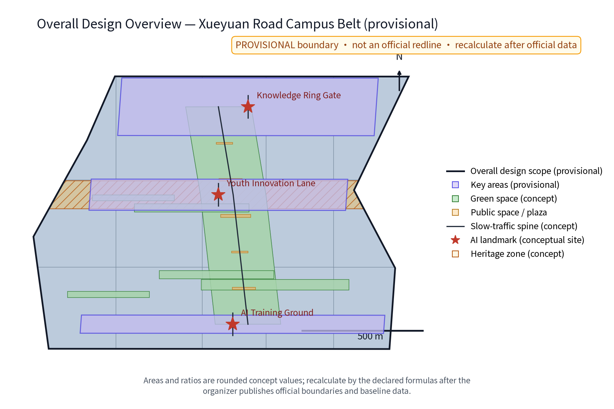
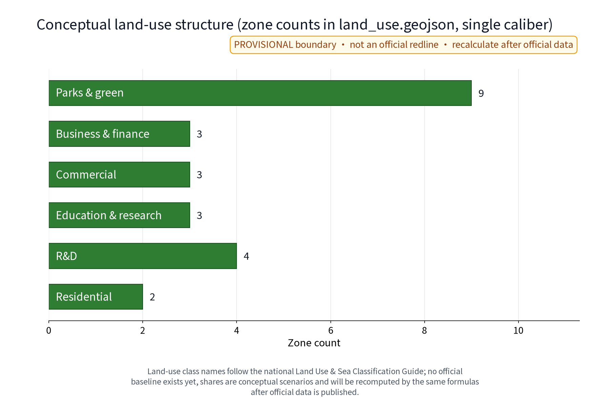
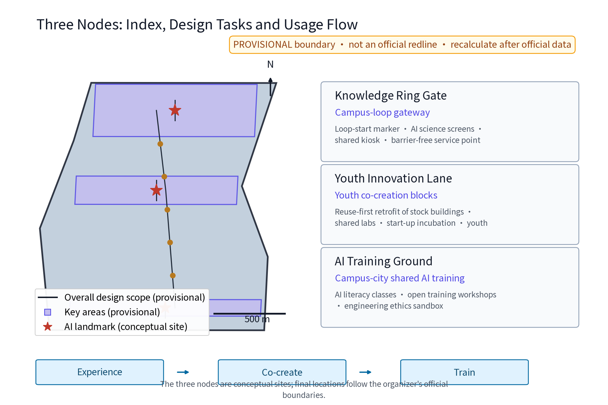
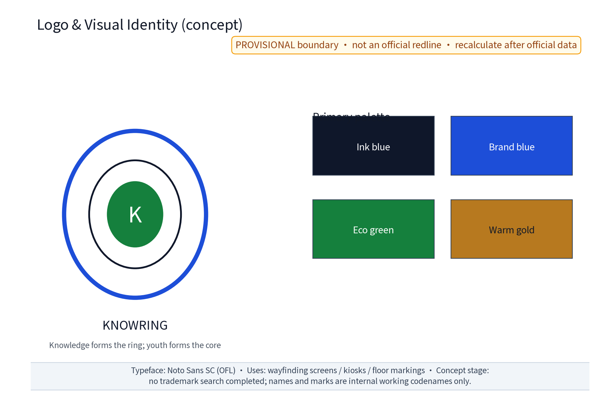
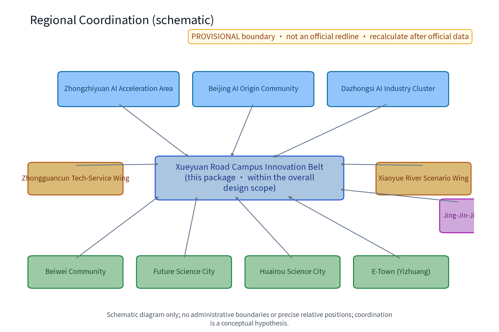
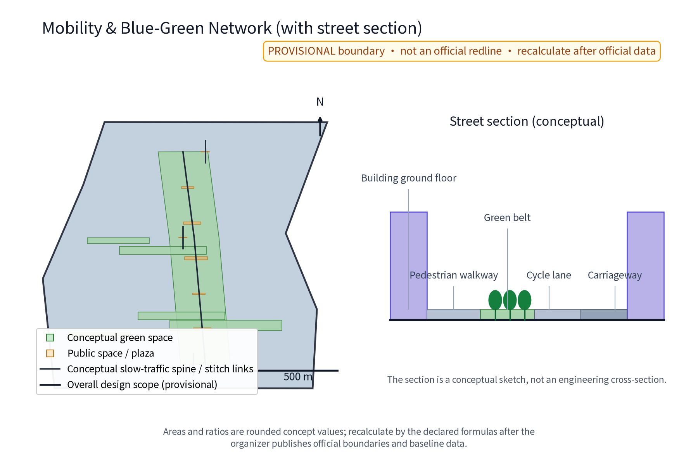
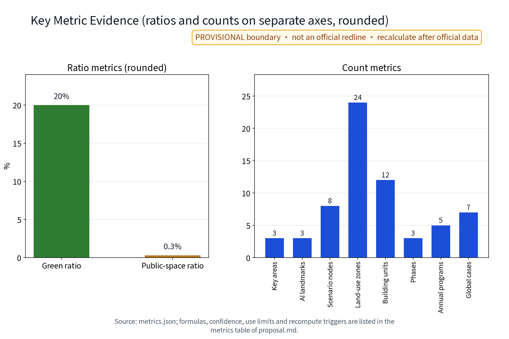

**Concept name and overall idea (concept)**: The working title is KnowRing (Chinese working codename as written in the Chinese proposal; the idea is "knowledge forms the ring, youth forms the core"). The name evokes a knowledge ring embracing universities and research institutes plus the human-scale life of old-Beijing lanes (lifang). The concept stacks a knowledge layer, a youth-creation layer and an AI-application layer into one walkable, co-creatable, sustainably growing ring along Xueyuan Road and the campus belt. It responds to the three anchor positions ("Centennial Jingzhang Culture Belt", "Urban AI Living Experience Belt", "AI Integration Innovation Belt") and the five functions, and is delivered as "one loop, three nodes, many scenarios": a campus knowledge loop linking three original concept nodes - the Knowledge Ring Gate (Zhi Huan Men), the Youth Innovation Lane (Qing Chuang Li) and the AI Training Ground (Zhi Xun Chang) - with the "Huan Zhi Ji" annual programme, an honor system and a component library supporting long-term operation. This is an international-call concept proposal; every recommendation is a concept and reference only, for professional teams to develop; it is not a statutory planning conclusion. No trademark search has been completed at concept stage: the names and marks are internal working codenames only, restricted from external use or registration until prior-right clearance ([source:DATA-SRC-OFFICIAL-ANNOUNCEMENT]).

## Design Basis and Source List
This proposal is based on public materials: the organizer's taskbook and open-source materials (open-city-ai/haidian) stating the three anchor positions, five functions and three-areas-two-wings framework ([source:DATA-SRC-OFFICIAL-ANNOUNCEMENT], [source:DATA-SRC-AGENT-TASKBOOK]); official text-caliber areas - coordinated research area approx. 43.6 km2, overall design area approx. 11.4 km2, key detailed-design areas approx. 368.4 ha in total (Zhongzhiyuan AI acceleration area approx. 192 ha, Beijing AI Origin Community approx. 104 ha, Dazhongsi AI industry cluster approx. 72 ha). Urban renewal and land-use reference public documents including the Beijing Urban Renewal Regulation and the 2023 national land-sea use classification guide; the Jingzhang Railway Heritage Park is described on the public-report caliber: Phase 1 between Tsinghua East Road and Zhichun Road, approx. 2.5 km long and 16.8 ha, opened in June 2023; the overall plan runs from Beijing North Station to the North Fifth Ring Road, approx. 9 km, with Phase 2 planning research already started by Haidian District ([source:DATA-SRC-JINGZHANG-PARK]). Note: the organizer has not published official boundary polygons; all geometry here is provisional. This proposal cites no precise coordinates or self-computed areas; area values follow official text caliber or rounded concept values only, subject to the organizer's final release.

## Three-Level Scope Framework
The proposal uses a macro-meso-micro three-level framework: the coordinated research area (approx. 43.6 km2, official text caliber) for industrial and future-city research; the overall design area (approx. 11.4 km2, official text caliber) for urban-renewal and regulatory-plan-depth urban design organised along the Jingzhang Railway Heritage Park green spine; and the key detailed-design areas (approx. 368.4 ha in total, official text caliber) for three-areas-two-wings design. This package's own sub-scope - the Xueyuan Road campus-innovation belt - lies inside the overall design area: upward it receives industrial momentum from Zhongzhiyuan, the AI Origin Community and Dazhongsi; outward it links the Zhongguancun tech-service wing and the Xiaoyue River scenario wing; and it extends coordination research toward Beiwei Community, Future Science City, Huairou Science City, the Economic-Technological Development Area (E-Town) and the Jing-Jin-Ji region (schematic relationship, see the regional coordination figure; [data:PACKAGE-GEOMETRY#site_boundary]). The three-level scope and the sub-scope are stated consistently across proposal.md, proposal.en.md, figures and matrices; none of them substitutes for the organizer's official boundary ([source:DATA-SRC-PROVISIONAL-BOUNDARIES]).

## Coordinated Research Area: Industry and Future City Research
Within the coordinated research area (official text caliber 43.6 km2), real place names such as Qinghe, Shangdi, Zhichun Road, Zhongguancun Avenue and Xueyuan Road serve only as geographic references for a spatial narrative of "source innovation - platform conversion - scenario landing", cultivating "basic algorithms - compute base - model services - industry applications" chain coordination and a five-factor loop of talent, capital, data, compute and scenarios. Benchmarking global campus-city mechanisms, the proposal consolidates 7 sourced global cases (see "Global Cases and Ecosystem Map" below) into four ecosystem-map mechanisms: university-led district redevelopment (Kendall Square, Aalto Otaniemi), university-enterprise shared parks (Stanford Research Park, TU/e Brainport), city-level start-up campuses/districts (Station F, 22@Barcelona), and government-led knowledge districts (one-north). The Xueyuan Road segment is defined as the belt's "talent supply side", whose campus-city integration determines long-term competitiveness. This layer is conceptual research for professional development, not an official conclusion ([depth:existing_conditions_diagnosis]).

## Overall Design Area: Urban Renewal and Regulatory-Plan-Level Urban Design
Within the overall design area (official text caliber 11.4 km2), the strategy is "renewal first, quality over quantity": using the Jingzhang Heritage Park green belt as the spine (Phase 1 open, publicly reported, linking universities and institutes along its route) and organising block renewal units along Xueyuan Road and the campus belt into a "green spine stringing lanes, loop connecting campus and city" structure. Regulatory-plan-depth design focuses on block scale: conceptual checks of setbacks, ground-floor functions, street sections and skyline rhythm, with a focus on flexible campus interfaces - solid walls turning into hedges, feature walls and operable shared gates, and ground floors with coffee workshops, exhibition windows and commuter passages. Following campus-city peak-hour compensations, the proposal lists time-sharing facilities (sports, libraries, canteens) with reservation systems; any sharing list remains subject to each campus's safety and ownership rules and involves no commitment ([source:DATA-SRC-MOHURD-URBAN-DESIGN-MEASURES]). Statutory matters (regulatory plan changes, setbacks, heights) must be re-checked through statutory procedures; this proposal provides reference thinking only ([standard:MOHURD-CONTROL-DETAILED-PLANNING]).

> Evidence anchors: [source:DATA-SRC-MOHURD-CONTROL-DETAILED-PLANNING], [source:DATA-SRC-PROVISIONAL-BOUNDARIES].

## Detailed Design of Key Areas
The three areas and two wings are addressed per the official text caliber (concept suggestions): Zhongzhiyuan AI acceleration area focuses on hard-tech incubation and retrofit of pilot-production space; Beijing AI Origin Community builds a human-machine co-living neighbourhood laboratory; Dazhongsi AI industry cluster uses station-city corridors for industry clusters; the Zhongguancun tech-service wing strengthens global factor allocation; the Xiaoyue River scenario wing hosts measured real-scenario experiments along the waterfront. The three key-area polygons come from this package's provisional geometry ([data:PACKAGE-GEOMETRY#key_areas]) and are not official redlines. Concept coordination relations: Beiwei Community coordinates talent housing and daily-life services; Future Science City coordinates basic research and compute facilities; Huairou Science City coordinates large-science-facility and laboratory links; E-Town coordinates smart manufacturing and scenario scaling; the Jing-Jin-Ji region provides innovation flywheels and industrial backup networks - concept assumptions only, not official arrangements ([depth:three_key_area_detailed_design]). Three original concept nodes anchor this segment: the Knowledge Ring Gate (loop portal: ring-start marker, AI science kiosk, shared rest stop and accessible service point), the Youth Innovation Lane (block node: youth-oriented retrofit of existing buildings, shared laboratories, incubation and youth housing) and the AI Training Ground (campus-city shared AI education node: general AI courses, open workshop and an engineering-ethics sandbox). Node locations are conceptual; final siting follows the organizer's official boundary.

> Evidence anchors: [metric:key_area_count], [metric:landmark_count], [metric:scenario_node_count].

## Brand and Visual Identity (Logo, VI, Regional Coordination Map)
For agent.1 delivery, this package provides an original Logo and visual-system direction (concept): the ring wordmark KNOWRING expresses "knowledge forms a ring" (the bilingual wordmark is shown in the Chinese proposal and in the logo figure); primary colours are ink blue #0f172a, brand blue #1d4ed8, ecology green #15803d and warm gold #b7791f; the typeface is OFL-licensed Noto Sans SC (embedded in the offline HTML preview). Visual application rules (guidance screens, rest stops, ground signs) are consolidated in the component library. The regional coordination map expresses, schematically, the relations with the three areas, two wings, Beiwei Community, Future Science City, Huairou Science City, E-Town and Jing-Jin-Ji, and is explicitly labelled "schematic; no administrative boundaries or precise relative positions" ([depth:risk_missing_data]). All brand assets are registered item by item (author, generation method, source, license, limits) in sources.json (PACKAGE-ASSET-LOGO, PACKAGE-ASSET-FIGURES, PACKAGE-ASSET-FONT, PACKAGE-ASSET-MAPS, PACKAGE-ASSET-COMPONENTS) and in report/copyright_statement.md.

> Evidence anchors: [source:PACKAGE-ASSET-LOGO], [source:PACKAGE-ASSET-FIGURES].

## Global Cases and Ecosystem Map (agent.2 delivery)
The table below lists 7 global campus-city cases (each with a verifiable source; see the corresponding sources.json entries; the descriptions are mechanism references only and make no commitment for or about those institutions):

| Case | Place | Campus-city mechanism (summary) | Source |
|---|---|---|---|
| Kendall Square Initiative | Cambridge, USA / MIT | University-led district redevelopment: five-year community planning process from 2010 converting MIT-owned parking lots into labs, housing, innovation space and a museum; shared campus-city governance process | [source:DATA-SRC-CASE-KENDALL] |
| Stanford Research Park | Palo Alto, USA | Origin of university-enterprise parks: 1951 Stanford-City of Palo Alto land-for-tax partnership; 150+ companies today | [source:DATA-SRC-CASE-STANFORD] |
| Station F | Paris, France | City-level start-up campus: open since 2017, hosting 1,000+ start-ups per year with university and corporate programmes | [source:DATA-SRC-CASE-STATIONF] |
| TU/e Campus (Brainport) | Eindhoven, Netherlands | Campus co-founded by university, industry and local government: students and 157 companies co-located; shared incubator and district governance | [source:DATA-SRC-CASE-TUE] |
| Aalto Otaniemi | Espoo, Finland | Campus-as-innovation-district after university merger: co-developed with the City of Espoo, shared research infrastructure; more than half of Finnish university-founded companies come from Aalto | [source:DATA-SRC-CASE-AALTO] |
| one-north | Singapore | Government-led knowledge district: 400+ companies, 15 public research institutes and institutes of higher learning, coordinated through a national innovation initiative | [source:DATA-SRC-CASE-ONENORTH] |
| 22@Barcelona | Barcelona, Spain | Institutional urban transformation: 2000 plan converting an industrial area into a knowledge-intensive district with reserved university/research sites and a quadruple-helix pact | [source:DATA-SRC-CASE-22BCN] |

Localization implications of the four ecosystem-map mechanisms: 1) flexible treatment of university asset and ownership boundaries; 2) university-enterprise-government shared governance units; 3) facility opening by reservation and time-sharing; 4) scenario opening and data sandboxes to host industrial validation ([standard:PROJECT-AGENT-OPEN-CALL-TASKBOOK]).

## AI Innovation Ecosystem, Personas, and AI+ Scenarios
The concept builds a university-enterprise-government-youth quadruple helix and five persona types: fundamental researchers, platform engineers, young entrepreneurs, young students, and international scholars/digital nomads (one combined persona). Spatial supply follows their time-space behaviour. The AI+ scenario list is delivered as 10 scenario cards (operational index; agent.3):

| Scenario card | Location | Target users | Operation mechanism (concept) | Data and compliance boundary |
|---|---|---|---|---|
| KnowRing Guide (AI science guide) | Gate loop start | Students, visitors | Reservation, annual review, monthly rotation | On-device processing, no personal identifiers retained |
| Youth Workshop (shared incubation) | Youth Lane existing buildings | Young entrepreneurs, students | Points-based entry, mentor rotation | Anonymized aggregation only, no individual tracking |
| AI Training Class | Training Ground workshop | Students, practitioners | Tiered courses, open enrolment | Human review before people-affecting decisions |
| Companion Walk (accessible accompaniment) | Whole loop | Seniors, persons with disabilities | Volunteer presence, human fallback, one-touch shutdown | No over-monitoring; one-touch shutdown |
| Ride Post (green mobility) | Loop stops | Residents, commuters, office workers | Points incentives, e-fencing | Aggregate statistics only, human review |
| Open Lab Day | Shared campus labs | Students, researchers | Reservation-based time-sharing, security and ownership checks | Labs under confidentiality rules are not opened (outside this package's scope) |
| Campus Open Season | Flexible ground floors | Residents, families | Community menu, campus approval | Real-name reservation, minimal collection |
| AI Science Night Market | Training Ground and loop | All ages | Pop-up stalls, kiosk rotation | Live demos only, no behaviour data collection |
| Community Talk Hall | Loop rest stops | Residents, merchants | Suggestion collection, answer loop | Anonymized aggregation, human review |
| Developer Sandbox | Training Ground digital twin | Developers, enterprises | Open APIs, staged release, registration | Synthetic data first; no personal-data export |

The AI domains cover six areas - transport, industry, space, public services, culture and governance - each with human review as the backstop ([source:DATA-SRC-GENERATIVE-AI-INTERIM-MEASURES]). On the ground the scenarios land on 8 points (3 AI landmarks + 5 scenario nodes, consistent with geometry/public_space.geojson); the 3 AI landmarks - Gate, Youth Lane and Training Ground - double as public space, exhibition and training nodes ([metric:scenario_node_count]). Privacy is a hard boundary: minimal collection with informed consent, anonymized aggregation only (below threshold not published), human review for people-affecting decisions, annual public audit; no individual tracking, no over-monitoring, no behaviour-tracking or passive facial recognition deployments; detailed rules for professional teams. Article 39 of the Barrier-Free Environment Law applies to on-site guidance and human-operated service in public service venues handling medical, social-security, financial or living-payment matters; this proposal uses it as a service baseline for loop guidance and rest stops only, without expanding it to every public space as a statutory duty ([source:DATA-SRC-BARRIER-FREE-ENVIRONMENT-LAW]). Inclusion mechanisms (concept): accessibility and age-friendly design involve co-design workshops with persons with disabilities and residents; the loop keeps non-digital service channels (staffed counters, phone and on-site reservations) and a complaint-answer-remedy closed loop; measured accessibility route checks are a precondition, with the measured review as a decision gate (see the "Accessible companion micro-system" project row).

## Land Use, Building Scale, and Retain-Renovate-Demolish Strategy
The retain-renovate-demolish order puts retention first: university and institute buildings and mature communities are kept; outdated buildings and low-efficiency commerce are renovated; only punctual new construction with strictly limited increment and height is contemplated. This layer is conceptual and no statutory calculation is performed; land ratios follow the single caliber of this package's geometry/land_use.geojson: each land-use code area divided by the site-boundary area (recompute with the same formula and update all charts once official boundaries arrive). Conceptual reference ratios: retention 70%, renovation 20%, demolition within 10% (conceptual reference values, not commitments, covered by the same recalculation caliber). The three lists: retention includes campus buildings with historical/character value, railway heritage and structurally sound buildings; renovation includes functional mixing of research buildings, factory-to-shared-office conversions and dormitory-to-youth-apartment conversions; demolition is limited to buildings certified as dilapidated through statutory procedures. The baseline building survey (condition, age, structure) and the official land baseline are not published; this proposal fabricates no baseline data, and all ratios are scenario assumptions ([depth:retain_renovate_demolish], [depth:land_use_layout]). Plot-level indicators await the official boundary and baseline data, to be recalculated by professional teams under statutory calibers; no precise area or scale values are provided here ([standard:MNR-LAND-USE-CLASSIFICATION-GUIDE]).

## Transport, Rail, Municipal Infrastructure, and Public Services
The slow-traffic system uses the Knowledge Loop as its spine, walk-and-cycle first, with campus-city peak-hour sharing; rail: conceptual station-city connections via existing corridors and real nodes such as Qinghe and Zhichun Road, strengthening walkable links between metro stations and the loop; surface transport: a "cycling + walking + micro-bus" green mobility system integrated by MaaS (shared bikes, feeder buses, accessible ride-hailing). Municipal: concept directions for power and compute dual expansion (AI load forecasting, green power absorption), 5G and IoT sensing, a CIM digital base and reclaimed-water use; the official rail protection zone, station-city integration controls, municipal capacity and underground-space conditions are unknown and are not fabricated ([depth:traffic_rail_slow_parking], [depth:municipal_new_infrastructure]). Public services highlight campus-city sharing: time-shared sports, libraries and canteens, plus neighbourhood health, childcare and youth services forming a 15-minute loop service circle. All of the above are references requiring statutory deepening by professional teams ([source:DATA-SRC-MOHURD-URBAN-DESIGN-MEASURES]).

## Blue-Green Network, Public Space, and Urban Character
With the Jingzhang Heritage Park as the belt-level blue-green spine (Phase 1 open, publicly reported), the concept is "one spine, one loop, many points": the green spine strings rail-memory nodes; the campus knowledge loop weaves into neighbourhoods like a humanistic ring; pocket parks, corner plazas and open campus green spaces form the network. Three character segments (concept): the rail-memory segment using rusted steel structures and sleeper-stone paving for centennial Jingzhang narratives; the AI-experience segment with tech facades, flexible-screen street furniture and shadow galleries for "urban AI living"; the youth-life segment with low-intervention, paintable, movable light design. Street furniture, wayfinding, night lighting and accessibility are integrated; all-age friendly and rain-resilient. Public-space indicators are shown rounded (public-space ratio approx. 0.3%); the baseline of public-space quality and accessibility continuity is an organizer-side data gap, treated as a concept scenario ([depth:blue_green_public_space]). Character control follows statutory character guidelines and heritage/ecology control boundaries; this proposal provides concept intentions only ([source:DATA-SRC-MOHURD-URBAN-DESIGN-MEASURES]).

> Evidence anchors: [metric:green_ratio], [metric:public_space_ratio], [source:PACKAGE-GEOMETRY].

## Metric Recalculation Caliber and Display Precision (provisional)
All provisional indicators follow two principles: official text caliber first for values that exist in official text (three-level scope areas, key-area total - never self-computed from provisional geometry); and for geometry-derived indicators (site, green, public space, building-footprint areas and ratios), rounded display (areas rounded to hectares, ratios to at most 2 decimals) with item-by-item data source / formula / confidence / use limits / recompute triggers. Count indicators (cases, scenario cards, industry tests, personas, annual programmes, phases, nodes, landmarks, land zones) match the visible tables row by row; ratios and counts are charted on separate axes. When official boundaries, baselines, rail-protection zones and municipal capacity data arrive, parties recalculate all indicators with the declared formulas, update all charts and keep a record of old-vs-new caliber differences ([depth:metrics_recalculation]).

## Renewal Projects, Implementation Policy, and Phasing
Concept project package: loop-completion works (paths, signs, rest stops, lighting), the Gate portal, the Youth Lane block renewal, Training Ground facilities, flexible campus interfaces with ground-floor sharing, accessible/green micro-mobility, and the programme operation system. Policy suggestions: campus-city co-building agreements (government coordination, campus collaboration), enterprise operation, community co-building, volunteer and professional-team evaluation, alignment with Beijing Urban Renewal Regulation procedures, ground-floor-open volume and rent incentives (concept), youth rental-housing policy alignment, AI scenario list and sandbox mechanism. The transformable project table below states, per project, the conversion elements ([standard:PROJECT-OFFICIAL-ANNOUNCEMENT]):

| Project (concept) | Lead/collaborator type | Preconditions | Permit/ownership interface | Cost tier | Stage decision gate | KPI (concept) | Acceptance evidence | Human fallback and fail-exit mechanism |
|---|---|---|---|---|---|---|---|---|
| Loop demo segment + rest stops | Government lead, enterprise collaboration | Slow-traffic redline reservation, road agreements | Walkway occupancy permits, campus-city ownership confirmation | Low: materials+operation (method: unit price x length; base 2026; no demolition) | Post-pilot review | Completion ratio >= segment, satisfaction >= 75% | Operation data + anonymized survey | Staffed rest stops; fail: retract to temporary facilities |
| Knowledge Ring Gate | Government lead, enterprise collaboration | Clear site ownership, utility checks | Construction land permit, greening occupation permit | Medium: works+equipment (method: analogous unit price; base 2026) | Scheme review + budget approval | Annual visits, accessibility pass rate | As-built drawings + third-party tests | Modular staging; stop: ownership unresolved or cost overrun >= 20% -> prototype-retrofit exit |
| Youth Innovation Lane renewal | Government+campus lead, operator collab. | Building survey, lease restructuring | Urban renewal registration, fire/structural approvals | Medium-high: phased retrofit (method: area unit price; base 2026; no tenant relocation) | Per-phase cost review | Vacancy <= 10%, youth tenant share | Lease signings + retention data | Merchant joint meeting; fail: phase 1 vacancy > 30% -> stop later phases |
| AI Training Ground | Campus lead, enterprise collab. | Curriculum and safety rules | Fire acceptance, shared-use agreement | Medium: equipment+fit-out (method: equipment quotes; base 2026) | Course accreditation + safety audit | Annual trainees, pass rate | Course records + audit report | Equipment inspection; stop: any safety incident -> suspend and rectify |
| Flexible interface and ground floors | Campus lead, government collab. | Campus ownership, security plan | Co-building agreement, ground-floor use change registration | Low-medium: interface works (method: per-metre price; base 2026) | Pilot interface review | Shared floor area, time-share usage | Use ledger + security review | One-touch shutdown and cancellation list; exit: campus may withdraw anytime |
| Accessible companion micro-system | Government lead, volunteer collab. | Accessibility baseline survey | Accessibility retrofit subsidy, city check-up | Low: software+signs (method: function-point quotes; base 2026) | Measured review | Route pass rate, response time | Measurement records + complaint loop | Volunteer human fallback; stop: fail measurement -> rectify |
| Green mobility micro-system | Enterprise lead, government supervision | E-fence agreements, parking list | Bike-launch permits, curb registration | Low-medium: operation subsidy (method: per-bike cost x scale) | Quarterly review | Slow-mode share, violation rate | Aggregate reports | Inspections + hotline; exit: operator breach -> replacement |
| Huan Zhi Ji programme system | Multi-party (campus-government-enterprise-community) | Annual programme list and safety plan | Large-event filing, campus opening request | Low: programme budget (method: lump-sum budget; base 2026) | Annual review | Events, participants | Programme ledger + anonymous survey | Volunteer and security backstop; stop on extreme weather/safety risk |

Annual programme brands (standing "Huan Zhi Ji" system; [metric:annual_program_count]):

| Annual programme brand | Frequency | Main responsibility | Audience | Budget and basis |
|---|---|---|---|---|
| Campus Open Day | 1/year | Campus lead, government collab. | Public, families | Low: single-event lump sum |
| AI Science Night Market | 2/year | Enterprise lead, campus collab. | All ages | Low: kiosk rotation |
| Youth Hackathon | 1/year | Enterprise lead, campus collab. | Developers, students | Medium: prizes + venue |
| Loop Cycling Day | 2/year | Community lead | Residents, commuters | Low: volunteer operation |
| Accessibility Partner Day | 1/year | Volunteer lead | Seniors, persons with disabilities | Low: public-good + volunteers |

The implementation mechanism states two-level responsibility (simplified RACI: government decides, campus supplies, enterprise operates, community co-builds and supervises, volunteers provide fallback services) and stage decision gates (cost review, ownership confirmation and public review before each phase). Stop/exit conditions: any project missing KPIs for two consecutive phases, unresolved ownership beyond the gate deadline, or a safety incident/major public complaint stops investment and triggers withdrawal or conversion (modular facilities can be relocated; renovation projects move to maintenance). Pilot first: "pilot + evaluation + scale-up", with low-cost pop-up tests of demand ([depth:phasing_implementation]). Phasing: near-term (2026-2028) pilot nodes and loop demo; mid-term (2029-2031) loop completion, node deepening, operation mechanism maturity; long-term (2032-2035) full loop formation and governance-pattern output. These are concept suggestions, not implementation commitments ([source:DATA-SRC-AGENT-TASKBOOK]).

## AI Public Space, Landmarks, Honor System, and Component Library (agent.4 delivery)
AI public space: the loop's public space follows a "sense - respond - review" concept, with rest stops integrating guidance, inquiry, charging and one-touch shutdown. Three AI landmarks: the Gate (portal landmark with AI science kiosk), the Youth Lane (vitality landmark with shared-lab windows and co-creation wall) and the Training Ground (training landmark with a transparent workshop and display window) ([metric:landmark_count]). Honor system (concept): the Huan Zhi Ji medal, youth points and a community contribution board, and an accessibility partner honor - rewards through titles and experience benefits, without behaviour-tracking-based point systems. Component library (concept): modular reversible components - generic rest stop (12 m2), science kiosk, shared seating modules, flexible fence and hedge units, guidance-screen brackets, accessibility ramp modules, lighting and night-sign units - designed as standard detachable parts supporting withdrawal, relocation and reuse ([depth:overall_spatial_structure]). The component list and dimensions are registered in sources.json (PACKAGE-ASSET-COMPONENTS) for professional development.

## Cultural Wayfinding and International Communication Copy (agent.5 delivery)
Cultural wayfinding (concept): a three-chapter narrative - "centennial Jingzhang - campus bookishness - AI future" - using rusted-steel structures (rail memory), book-spine signage (campus interfaces) and light-strip marks (AI experience); bilingual (Chinese-English) signage across the loop, with voice and tactile supplements. International communication copy (concept samples; Chinese and English substantively equivalent): the Chinese headline is set out in the Chinese proposal; its substantively equivalent English headline is "Knowledge forms the ring; youth forms the core. Campus and city meet on the loop." Key points: 1) the "open - co-exist - co-create" three-layer campus-city relation; 2) the AI-service boundary commitment of "on-device processing, human review, public audit"; 3) the Huan Zhi Ji annual rhythm and community co-creation. Copy and wordmarks are original concepts; no third-party slogans are used; before trademark clearance, nothing is registered or used formally ([source:PACKAGE-ASSET-LOGO]).

## Developer Community, Scenario Opening and Investment Conversion (agent.6 delivery)
Developer community (concept): the Training Ground digital twin and sandbox environment provide open APIs and a synthetic-data pool; hackathons, course accreditation and open-source component libraries grow the community; participation rules (versioning, registration, staged release) follow public rules such as the Interim Measures for Generative AI. AI technical protocols (concept thresholds, to be calibrated): model evaluation and benchmark tests are organized with public datasets and anonymized processes; data-quality baselines (completeness, annotation consistency) and error stratification (by cohort, period and scenario) serve as scenario launch gates; runtime monitoring uses false-positive rate and human-intervention rate as red-line indicators, with offline-and-retest above limits - all thresholds are concept suggestions without preset engineering precision, to be refined by professional teams and updated under the recompute triggers ([source:DATA-SRC-GENERATIVE-AI-INTERIM-MEASURES]). Scenario opening: an annual "open scenario list" (education, mobility, public services, culture, governance) runs through "apply - sandbox test - evaluate - launch - monitor - exit"; scenario scoring combines user feedback with human review only, no tracking-based incentives. Investment conversion funnel: from scenario tests to landing cooperation - passing tests lead to a concept letter of intent, then, through campus-city co-building agreements and factor matching (talent, compute, capital, data, space), to pilot operation; attraction policies are public and inclusive, with no named company list or monetary commitments. Industry test scenarios (agent.3; [metric:industry_test_scenario_count]):

| Industry test scenario | Test object | Validation indicators (concept) | Data responsibility | Failure handling | Opening conditions |
|---|---|---|---|---|---|
| Accessible companion robot pilot | Companion robot + voice guidance | Route pass rate, human intervention rate, complaint rate | On-device processing; operator annual audit | Fail -> suspend and human fallback | Accessibility measurement pass + tripartite agreement |
| Shared-mobility e-fence optimisation | E-fence + tidal scheduling algorithm | Violation rate, AM turnaround, ridership | Aggregate statistics; no individual traces | Violation above threshold -> reduce fleet | Government launch permit + campus parking list |
| AI load forecasting and green power | Campus load-forecast model | Forecast error, green share, response time | Synthetic and aggregate data; public audit | Error above limit -> manual dispatch fallback | Compute/power data agreement + registration |

> Evidence anchors: [metric:industry_test_scenario_count], [standard:PROJECT-AGENT-OPEN-CALL-TASKBOOK].

## Metrics, Area Recalculation, and Compliance Matrix
The concept indicator system is listed item by item (all official text caliber or rounded; ratios and counts are charted on separate axes in the metrics-evidence figure):

| Metric (metrics.json) | Rounded display | Data source | Formula | Confidence | Use limits | Recompute trigger |
|---|---|---|---|---|---|---|
| site_area_sqm | approx. 1141 ha | geometry/site_boundary.geojson | polygon_area(provisional site, EPSG:4548) | medium | concept only; not precise area or redline | official boundary released |
| green_space_area_sqm | approx. 223 ha | geometry/green_space.geojson | union(conceptual green) | low | same | official green baseline |
| public_space_area_sqm | approx. 4 ha | geometry/public_space.geojson | union(conceptual public space) | low | same | official public-space data |
| building_footprint_area_sqm | approx. 11 ha | geometry/buildings.geojson | union(retention-first envelopes) | low | same | building survey released |
| green_ratio | approx. 20% | green area / site area | green_space_area/site_area | low | concept discussion only | recompute per formula |
| public_space_ratio | approx. 0.3% | public area / site area | public_space_area/site_area | low | concept discussion only | same |
| road_network_length_m | approx. 10.2 km | geometry/roads.geojson | sum(conceptual paths) | low | concept discussion only | official road network |
| key_area_count | 3 | geometry/key_areas.geojson | count(features) | medium | check against official key-area caliber | official key-area boundary |
| land_use_zone_count | 24 | geometry/land_use.geojson | count(features) | high | zone-unit count, not a land conclusion | official land plan |
| building_unit_count | 12 | geometry/buildings.geojson | count(features) | high | concept volumes | baseline survey |
| landmark_count | 3 | geometry/public_space.geojson | count(ai_landmark) | high | concept landmark count | annual scenario review |
| scenario_node_count | 8 | geometry/public_space.geojson | landmarks + scenario nodes | high | concept point index | annual scenario review |
| industry_test_scenario_count | 3 | proposal table | rows of industry test table | high | text caliber | annual open-list review |
| persona_count | 5 | proposal text | persona groups | high | text caliber | demand survey |
| global_case_count | 7 | proposal table + sources.json | case-table rows | high | mechanism reference only | new cases registered |
| phase_count | 3 | geometry/phasing.geojson | count(features) | high | phasing framework | official implementation plan |
| annual_program_count | 5 | proposal table | annual programme brands | high | text caliber | annual review |

Metric anchors:
- Area and ratio anchors: [metric:site_area_sqm], [metric:green_space_area_sqm], [metric:public_space_area_sqm]
- Construction and road anchors: [metric:building_footprint_area_sqm], [metric:green_ratio], [metric:public_space_ratio]
- Space and scenario anchors: [metric:road_network_length_m], [metric:key_area_count], [metric:land_use_zone_count]
- Building and node anchors: [metric:building_unit_count], [metric:landmark_count], [metric:scenario_node_count]
- Text-caliber anchors (part 1): [metric:persona_count], [metric:global_case_count], [metric:phase_count]
- Text-caliber anchors (part 2): [metric:annual_program_count], [metric:industry_test_scenario_count]

Area recalculation: all areas follow the official text caliber (three levels above); after the official boundary is released, professional teams close the layer geometry, recheck indicators and record old-vs-new caliber differences. Compliance: compliance_matrix.json covers the 23 items of announcement 1.3-1.5 and agent.1-6, each with a distinct evidence summary; the standard and design-depth matrices cite verifiable standards and 15 deepening items ([standard:PROJECT-OFFICIAL-ANNOUNCEMENT], [standard:PROJECT-AGENT-OPEN-CALL-TASKBOOK], [depth:metrics_recalculation]).

> Evidence anchors: [source:PACKAGE-GEOMETRY], [data:PACKAGE-GEOMETRY#phasing].

## Risk, Copyright, and Compliance
This proposal is conceptual research, not an administrative approval basis; campus-city ownership coordination, safety assessments and statutory procedures must precede any implementation. Key risks (six dimensions in risk.json): geometry uncertainty until the official boundary is released (controlled by text caliber + rounded display + recompute triggers); privacy and data risks (minimal collection, anonymized aggregation, human review, annual public audit; accessible services keep volunteer fallback and one-touch shutdown as hard boundaries, anchored to the applicable service scenarios of Article 39 of the Barrier-Free Environment Law); ownership and approval risk (campus agreements and permit interfaces listed per project in the project table); operation and market risk (phased piloting, resilient design, stop and exit conditions); cost-estimate risk (all figures are tiers with method/base-period scope, not precise investment); technology risk (on-device processing, staged release, human review). Brand prior-rights and boundary of use: the original concept names (Zhi Huan Men, Qing Chuang Li, Zhi Xun Chang) and the KnowRing wordmark are original concepts of this proposal; no official trademark search has been completed at concept stage, and this package claims no trademark rights; the names and marks are treated as internal working codenames only and are restricted from external registration, licensing or formal use until prior-right clearance. Fonts, figures, maps and components are registered item by item for source, license and limits. The original copyright statement is available at report/copyright_statement.md. This document is a concept text; it is not investment advice or any statutory planning commitment ([source:DATA-SRC-OFFICIAL-ANNOUNCEMENT], [source:DATA-SRC-GENERATIVE-AI-INTERIM-MEASURES]).

## References
References follow the government's officially released versions; sources.json in this package contains only verifiable entries and fabricates no official data or links. 1. Organizer taskbook and open-source materials (open-city-ai/haidian; three anchor positions, five functions, three areas two wings, official text-caliber areas); 2. Beijing Master Plan 2016-2035; 3. Beijing Urban Renewal Regulation (2023); 4. Beijing Gardening and Greening Bureau announcement "Jingzhang Railway Heritage Park (Phase 1) fully opened" and Beijing municipal portal reports; 5. Haidian District AI-industry public documents and centennial Jingzhang public materials; 6. Official institutional pages of the 7 global campus-city cases (each case's source, channel and license in sources.json); 7. Public texts of national standards and regulations (land-sea use classification guide, urban design measures, regulatory-plan compilation and approval measures, generative-AI interim measures, barrier-free environment law). All are public materials; final data follows the organizer's release; until official boundary polygons are published, all geometry is provisional ([source:DATA-SRC-PROVISIONAL-BOUNDARIES]).