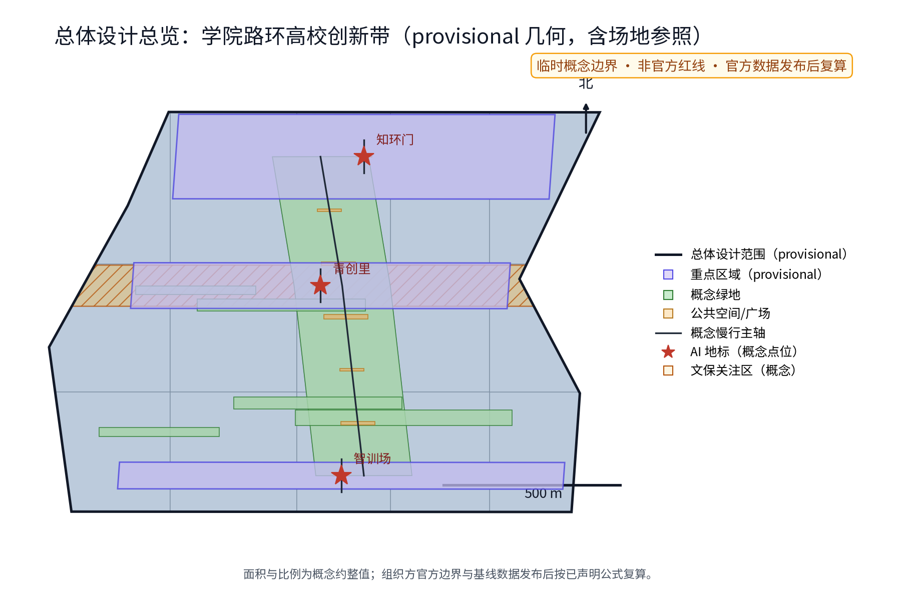
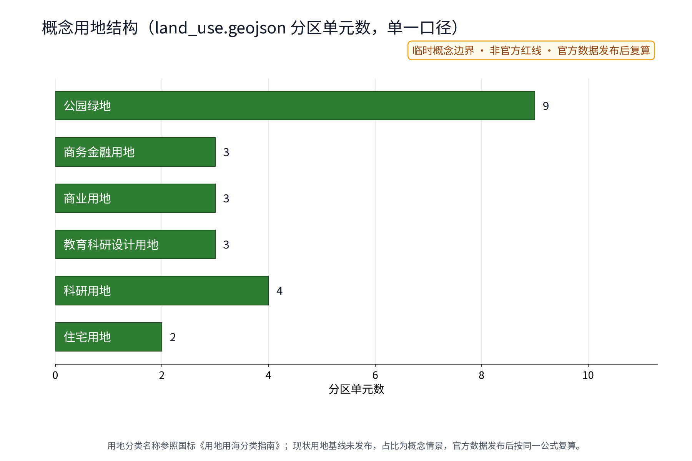
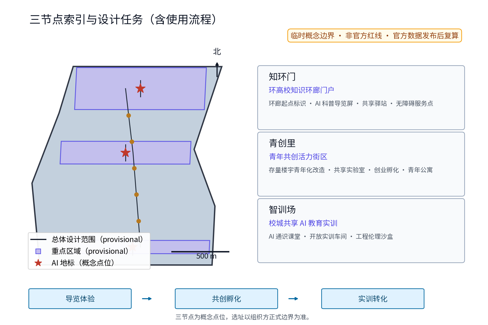
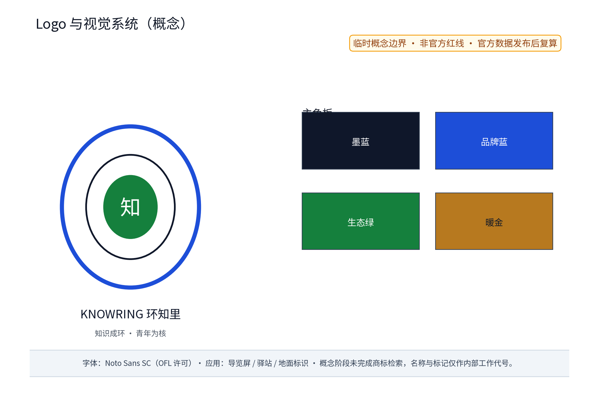
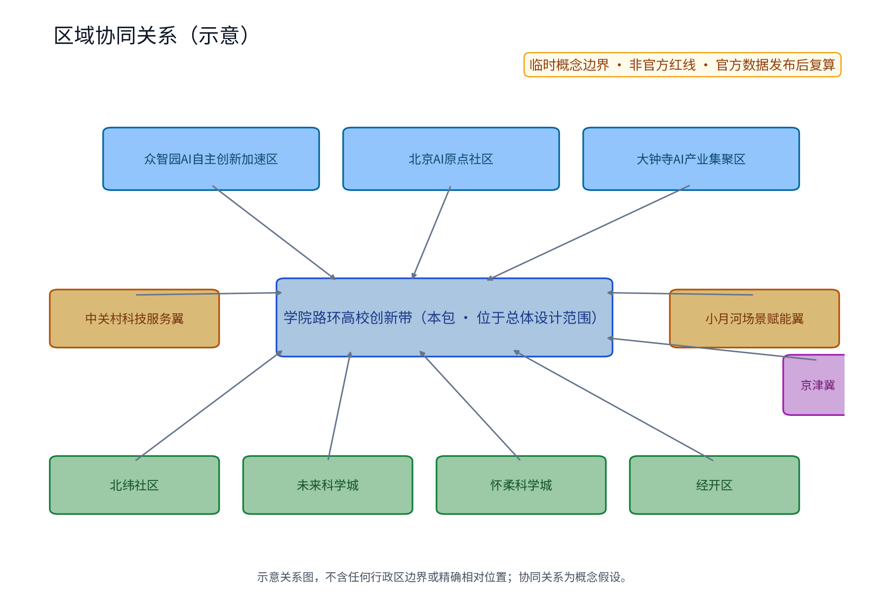
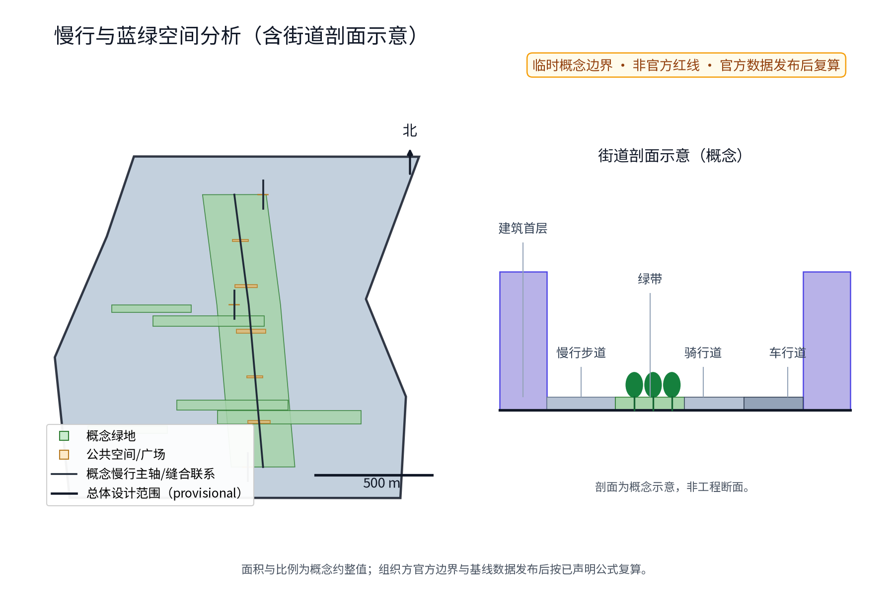
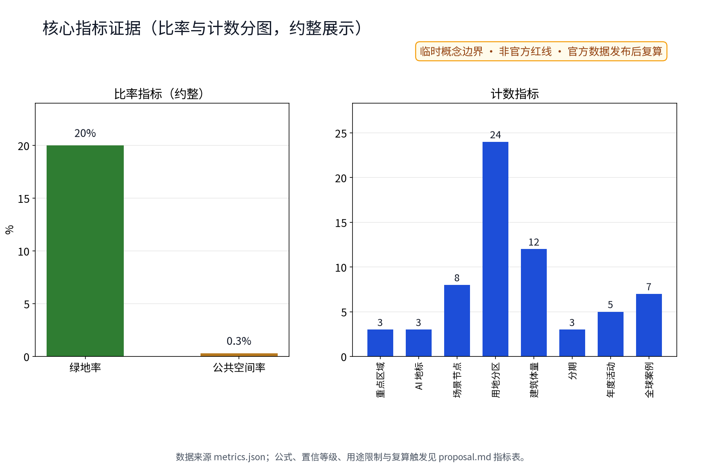

**方案名称与总体构想(概念)**:主名称「环知里」,英文名 KnowRing(Campus Knowledge Loop,理念为"知识成环、青年为核")。"环知里"取意于环抱高校院所的知识之环与老北京里坊街巷的生活尺度:以学院路及环高校地带为空间载体,将知识圈层、青年创造圈层与AI应用圈层叠合成一条可步行、可共创、可持续生长的环形知识生态。方案紧扣"百年京张文化带、都市AI生活体验带、AI融合创新带"三大定位与五大功能,落实为"一环、三节点、多场景":一条环高校知识环廊,串联「知环门」「青创里」「智训场」三个原创概念点位,并以「环知季」年度活动体系与「荣誉体系」「组件库」支撑长期运营。本方案为国际征集概念方案,所有落地建议均为概念建议、参考方案,供专业团队深化研究,不构成法定规划结论。概念阶段未完成商标检索,「环知里」「知环门」「青创里」「智训场」等名称仅作为内部工作代号使用,对外使用与注册前须完成在先权利核验([source:DATA-SRC-OFFICIAL-ANNOUNCEMENT])。

## 设计依据与资料清单
本方案依据公开资料编制:征集组织方任务书及开源材料(open-city-ai/haidian)中的三大定位、五大功能与三区两翼表述([source:DATA-SRC-OFFICIAL-ANNOUNCEMENT]、[source:DATA-SRC-AGENT-TASKBOOK]);官方文本口径面积——统筹研究范围约43.6平方公里、总体设计范围约11.4平方公里、重点区域合计约368.4公顷(众智园AI自主创新加速区约192公顷、北京AI原点社区约104公顷、大钟寺AI产业集聚区约72公顷)。城市更新与用地分类引用《北京市城市更新条例》、《国土空间调查、规划、用途管制用地用海分类指南(2023年)》等公开文件;京张铁路遗址公园采用公开报道口径:一期位于清华东路至知春路、长约2.5公里、约16.8公顷,2023年6月建成开放,整体规划南起北京北站、北至北五环、全长约9公里,海淀区已启动二期规划设计研究([source:DATA-SRC-JINGZHANG-PARK])。特别说明:组织方尚未发布官方边界多边形,现有几何均为临时数据(provisional),本方案不引述任何精确坐标或自算面积,面积类数值仅用官方文本口径及约整概念值,最终以组织方发布为准。

## 三层范围工作框架
方案建立"宏观—中观—微观"三层递进框架:统筹研究范围(约43.6平方公里,官方文本口径)承担产业格局与未来城市研究,研判创新链、人才流与空间耦合;总体设计范围(约11.4平方公里,官方文本口径)承担城市更新与控规深度城市设计,以京张铁路遗址公园为绿脊组织更新单元;重点区域(合计约368.4公顷,官方文本口径)落实三区两翼详细设计。本期"学院路环高校创新带"即本包所在子范围,位于总体设计范围内,向上承接众智园、AI原点社区、大钟寺的产业势能,向外联动中关村科技服务翼与小月河场景赋能翼,并向北纬社区、未来科学城、怀柔科学城、经开区及京津冀方向延伸协同研究(示意关系见区域协同图,[data:PACKAGE-GEOMETRY#site_boundary])。三层范围与子范围的关系在 proposal.md、proposal.en.md、图件与矩阵中保持一致表述,均不替代组织方正式边界([source:DATA-SRC-PROVISIONAL-BOUNDARIES])。

## 统筹研究范围产业与未来城市研究
在43.6平方公里统筹范围内(官方文本口径),以清河、上地、知春路、中关村大街、学院路等真实节点构成全带空间叙事锚点(名称仅作地理参照),形成"源头创新—平台转化—场景落地"的产业梯度,培育"基础算法—算力基座—模型服务—行业应用"链条协同,强化人才、资本、数据、算力、场景五要素循环。对标全球校城协同机制,本方案梳理并采用了7个有明确来源的全球案例(见"全球案例与生态图谱"一节),归纳为四类生态图谱机制:大学主导的片区再开发(Kendall Square、Aalto Otaniemi)、校企共建园区(Stanford Research Park、TU/e Brainport)、城市级创业校园或园区(Station F、22@Barcelona)、政府主导的知识产城(one-north)。学院路段被界定为全带"人才供给侧",其校城融合程度决定创新带长期竞争力。本层为概念研究,判断供专业团队深化,不构成官方结论([depth:existing_conditions_diagnosis])。

## 总体设计范围城市更新与控规深度城市设计
在11.4平方公里总体设计范围内(官方文本口径),方案提出"存量更新为主、减量提质为先"的概念策略:以京张铁路遗址公园绿带为脊(一期已建成开放并串联高校院所,为公开报道事实),沿学院路及环高校地带组织街区更新单元,形成"绿脊串里坊、环廊连校城"结构。控规深度城市设计聚焦街坊尺度:概念性校核退线、首层功能、街道剖面与天际线节奏,重点塑造高校边界"柔性界面":实体围墙转化为绿篱、景墙与可开启共享入口,首层植入咖啡工坊、展览橱窗与通勤廊道。依据城校错峰规律,提出体育、图书、食堂等设施"分时共享"清单与预约制开放机制;共享清单须按校方安全与权属规定单独确认,本方案不预设任何开放承诺([source:DATA-SRC-MOHURD-URBAN-DESIGN-MEASURES])。法定规划事宜(控规调整、退线、高度)须按法定程序另行校核,本方案仅提供参考思路([standard:MOHURD-CONTROL-DETAILED-PLANNING])。

> **证据锚点**：[source:DATA-SRC-MOHURD-CONTROL-DETAILED-PLANNING]、[source:DATA-SRC-PROVISIONAL-BOUNDARIES]。

## 重点区域详细设计
三区两翼按官方文本口径回应(概念建议):众智园AI自主创新加速区聚焦硬核孵化与中试用房改造;北京AI原点社区营造人机共生的社区生活实验室;大钟寺AI产业集聚区依托站城连廊组织产业楼宇集群;中关村科技服务翼强化要素全球化配置;小月河场景赋能翼依托滨水空间布置实测场景。三处重点区多边形均来自本包 provisional 几何([data:PACKAGE-GEOMETRY#key_areas]),非官方红线。区域协同关系(拟):北纬社区承接人才居住与生活配套协同,未来科学城承接基础研究与算力设施协同,怀柔科学城承接大科学装置与实验室协同,经开区(亦庄)承接智造与场景规模化协同,京津冀区域层面形成创新飞地与产业备份网络协同——本段为概念协同假设,非官方规划安排([depth:three_key_area_detailed_design])。本期沿线设三个原创概念点位:「知环门」(环高校知识环廊门户节点:环廊起点标识、AI科普导览屏、共享驿站与无障碍服务点)、「青创里」(青年共创活力街区节点:存量楼宇青年化改造、共享实验室、创业孵化与青年公寓)、「智训场」(校城共享AI教育实训节点:AI通识课堂、开放实训车间与工程伦理沙盒)。三节点为概念点位,选址以组织方正式边界为准。

> **证据锚点**：[metric:key_area_count]、[metric:landmark_count]、[metric:scenario_node_count]。

## 品牌与视觉识别（Logo·VI·区域协同图）
为支撑任务书 agent.1 交付,本包提供原创 Logo 与视觉系统方向(概念):环纹标识 "KNOWRING 环知里" 取"知识成环"意象,主色为墨蓝(#0f172a)、品牌蓝(#1d4ed8)、生态绿(#15803d)、暖金(#b7791f);字体采用 OFL 许可的 Noto Sans SC(嵌入 HTML 离线预览);视觉应用规范(导览屏、驿站、地面标识)以组件库形式沉淀。区域协同图以示意方式表达本包与三区两翼及北纬社区、未来科学城、怀柔科学城、经开区、京津冀的关系,明确标注"示意关系图,不含任何行政区边界或精确相对位置"([depth:risk_missing_data])。品牌资产逐项登记作者、生成方式、来源、许可与限制于 sources.json(条目 PACKAGE-ASSET-LOGO、PACKAGE-ASSET-FIGURES、PACKAGE-ASSET-FONT、PACKAGE-ASSET-MAPS、PACKAGE-ASSET-COMPONENTS)与 report/copyright_statement.md。

> **证据锚点**：[source:PACKAGE-ASSET-LOGO]、[source:PACKAGE-ASSET-FIGURES]。

## 全球案例与生态图谱（任务书 agent.2 交付）
下表为7个全球校城协同案例(均有可查证来源,详见 sources.json 对应条目;案例表述仅用于机制借鉴,不构成对相关机构的任何承诺):

| 案例 | 地点 | 校城协同机制要点 | 数据来源 |
|---|---|---|---|
| Kendall Square Initiative | 美国剑桥/麻省理工 | 高校主导片区再开发:2010年起五年代际征询规划,将自有停车场转化为实验室、住房、创新空间与博物馆;建立校城共同治理过程 | [source:DATA-SRC-CASE-KENDALL] |
| Stanford Research Park | 美国帕洛阿尔托 | 校企共建园区鼻祖:1951年斯坦福与市政府以土地换税收方式共建,企业研发总部集聚,至今150余家企业 | [source:DATA-SRC-CASE-STANFORD] |
| Station F | 法国巴黎 | 城市级创业校园:2017年启用,每年接纳千余家初创,与高校、大企业共建项目制生态 | [source:DATA-SRC-CASE-STATIONF] |
| TU/e Campus (Brainport) | 荷兰埃因霍温 | 大学、企业与政府三方共建的开放校园:700余学生与157家企业共址,孵化器与行业联盟多方共治 | [source:DATA-SRC-CASE-TUE] |
| Aalto Otaniemi | 芬兰埃斯波 | 大学合并后以"校区即创新区":与市政府共同建设,共享科研设施与开放创新屋,高校初创占全国过半 | [source:DATA-SRC-CASE-AALTO] |
| one-north | 新加坡 | 政府主导知识产城:400余家企业、15个公共研究院所与高校集聚,以全国性创新倡议统筹 | [source:DATA-SRC-CASE-ONENORTH] |
| 22@Barcelona | 西班牙巴塞罗那 | 制度性产城更新:2000年规划将工业地段转为知识密集区,预留大学与研究设施用地,四方协议共治 | [source:DATA-SRC-CASE-22BCN] |

四类生态图谱机制的本地化启示:①高校资产与权属边界柔性化;②校—企—政共建治理单元;③以预约与分时机制开放设施;④以场景开放与数据沙盒承接产业验证([standard:PROJECT-AGENT-OPEN-CALL-TASKBOOK])。

## AI 创新生态、人才画像与 AI+ 场景
概念提出"高校—企业—政府—青年"四螺旋生态与五类人才画像:基础研究员、平台工程师、青年创业者、青年学生、国际学者与数字游民(合并为一类画像)。依其时空行为规律反推空间供给。AI+场景清单以10张场景卡落地(运营索引,任务书 agent.3):

| 场景卡 | 落点 | 面向人群 | 运营机制（概念） | 数据与合规边界 |
|---|---|---|---|---|
| 「环知导览」AI科普导览 | 知环门环廊起点 | 学生、游客 | 预约制讲解、年度评估、月度轮换 | 端侧处理,不留存个体信息 |
| 「青创工坊」共享孵化 | 青创里存量楼宇 | 青年创业者、学生 | 积分入驻、导师轮值 | 匿名聚合,不进行个体识别式追踪 |
| 「智训课堂」AI实训 | 智训场实训车间 | 学生、从业者 | 分级课程、公开报名 | 涉人决策人工复核 |
| 「伴行」无障碍伴随 | 环廊全段 | 老年人与残障人士 | 志愿者值守、人工兜底、一键关闭 | 禁止过度监控,可一键关闭 |
| 「骑行驿站」绿色出行 | 沿线站点 | 居民、通勤者、白领 | 积分激励、电子围栏 | 仅聚合统计,人工复核 |
| 「实验室开放日」 | 高校共享实验室 | 学生、研究机构 | 预约制分时开放、安检与权属确认 | 按保密制度管理的实验不开放(该类不在本包开放范围) |
| 「学院开放季」 | 校园柔性界面首层 | 居民、家庭 | 社区共建菜单、校方审批 | 入校实名预约,最小化采集 |
| 「AI科普夜市」 | 智训场与环廊 | 全龄公众 | 快闪摊位、展亭轮换 | 仅现场演示,不采集行为数据 |
| 「社区议事厅」 | 环廊驿站 | 居民、商户 | 议事征集、意见答复闭环 | 匿名聚合,人工复核 |
| 「开发者沙盒」 | 智训场数字孪生 | 开发者、企业 | 开放接口、灰度发布、备案管理 | 合成数据为主,禁止个体数据外泄 |

AI场景域覆盖交通、产业、空间、公共服务、文化、治理六域:AI交通(绿色共享出行与MaaS接驳)、AI产业(青年创业孵化与产业测试验证)、AI空间(环廊公共空间)、AI公共服务(无障碍伴随与AI教育科普)、AI文化(学院开放季与AI科普夜市)、AI治理(公开审计与沙盒机制),各域均以人工复核兜底([source:DATA-SRC-GENERATIVE-AI-INTERIM-MEASURES])。场景点位在空间上落实为8个(3处AI地标+5处场景节点,与 geometry/public_space.geojson 一致);其中3处AI地标——知环门、青创里、智训场同时承担公共空间、展示与实训功能([metric:scenario_node_count])。隐私保护为硬边界:坚持最小化采集与知情同意,数据仅做匿名化聚合(低于设定阈值不发布),涉人决策设人工复核环节,每年公开审计;不进行个体识别式追踪、禁止过度监控、不部署个体行为追踪与无感人脸识别等应用,制度细则供专业团队深化。无障碍环境建设法第39条仅适用于医疗、社保、金融、生活缴费等公共服务场所的人工指导与办理场景,本方案的环廊导览与驿站服务将其作为服务基线参照,不扩大解释为全部公共空间法定义务([source:DATA-SRC-BARRIER-FREE-ENVIRONMENT-LAW])。包容性机制(概念):无障碍与适老设计引入残障人士和居民共同设计工作坊,环廊保留非智能服务渠道(人工台席、电话与现场预约),并建立"投诉—答复—救济"闭环流程;无障碍路线以专项实测为前置条件,相关机制与实测计划见项目表「无障碍伴随微系统」行(决策门含实测评审)。

## 用地、建筑规模与拆改留方案
拆改留坚持留改拆排序:保留高校与院所建筑及成龄社区,改造老旧楼宇与低效商业,仅作插入式点状新建并严控增量与高度。本层为概念建议,不进行法定测算;用地比例取自本包 geometry/land_use.geojson 单一计算口径:各用地代码面积÷site边界面积(官方边界发布后按同一公式复算并更新全部图件)。概念性参考比例:留70%、改20%、拆控制在10%以内(概念参考值,非承诺指标,同样纳入复算口径)。拆改留三类清单框架:保留类含具有历史与风貌价值的校园建筑、铁路遗产及结构完好楼宇;改造类含科研楼宇功能复合、厂房转共享办公、宿舍转青年公寓;拆除类仅限经鉴定危旧且依法定程序认定者。现状建筑调查(存量状态、年代、结构)与现状用地基线均未发布,本方案不虚构现状数据,留改拆比例与用地比例均为情景假设([depth:retain_renovate_demolish],[depth:land_use_layout])。具体地块指标须待组织方发布边界与现状基数据后,由专业团队按法定口径复算,本方案不提供任何精确面积与规模数值([standard:MNR-LAND-USE-CLASSIFICATION-GUIDE])。

## 交通、轨道、市政与公共服务设施
慢行组织以知识环廊为主线,步行与骑行优先,校城共享错峰组织;轨道层面依托既有通道与清河、知春路等真实节点组织站城衔接(概念),强化轨道站点与环高校环廊的步行接驳;地面交通打造"骑行+步行+微公交"绿色出行体系,以MaaS整合共享单车、接驳小巴与无障碍约车。市政层面提出电力与算力双扩容方向(智算负荷预测、绿电消纳)、5G与物联感知网、CIM数字底座及再生水利用,均为概念方向;正式轨道保护区、站城一体化控制条件、市政容量与地下空间条件未知,不臆造([depth:traffic_rail_slow_parking],[depth:municipal_new_infrastructure])。公共服务突出校城共享:体育场馆、图书馆、食堂等分时开放,街区补齐社区卫生、托育与青年服务设施,形成"15分钟环廊服务圈"。以上均为参考方案,实施规模与管线方案须经专业团队依据法定程序深化论证([source:DATA-SRC-MOHURD-URBAN-DESIGN-MEASURES])。

## 蓝绿空间、公共空间与城市风貌
以京张铁路遗址公园为全带蓝绿主轴(一期已开放,公开报道),概念提出"一脊一环多点":绿脊串联铁轨记忆节点,环高校知识环廊如人文之环渗入街区,口袋公园、街角广场与校园开放绿地织成蓝绿网络。风貌分三段引导(概念):铁轨记忆段强调锈色钢构、枕石铺装等百年京张叙事元素;AI体验段以科技立面、柔性屏街具与影廊呈现"都市AI生活";青年生活段以低干预、可涂装、可移动的轻型设计保持活力与弹性。街道家具、标识系统、夜景照明与无障碍设施一体化设计,强调全龄友好与雨天韧性。公共空间指标以约整值展示(公共空间率约0.3%),现状公共空间品质与无障碍连续性基线缺失,属组织方数据缺口,按概念情景处理([depth:blue_green_public_space])。风貌管控应以法定风貌导则及文保、生态管控边界为依据,本方案仅提供概念意向供深化([source:DATA-SRC-MOHURD-URBAN-DESIGN-MEASURES])。

> **证据锚点**：[metric:green_ratio]、[metric:public_space_ratio]、[source:PACKAGE-GEOMETRY]。

## 指标复核口径与展示精度（provisional）
本包全部临时指标按"官方文本口径优先、provisional 几何仅作概念展示"原则处理:①凡官方文本口径已有的数值(三层范围面积、重点区域合计),一律引用文本口径,不依据 provisional 几何自算;②由本包几何计算的指标(场地、绿地、公共空间、建筑轮廓面积及比率),统一约整后展示(面积约整至公顷、比率不超过2位小数),并逐项标注 数据来源/公式/置信等级/用途限制/复算触发条件;③计数类指标(案例、场景卡、测试场景、画像、年度活动、分期、节点、地标、用地分区等)与正文表格逐行对应;④比率类与计数类指标分图表达,不共用坐标轴。官方边界、现状基线、轨道保护区与市政容量数据到位后,参与方按已声明公式重算全部指标、更新图表并保留新旧口径差异记录([depth:metrics_recalculation])。

## 更新项目清单、实施政策与分期计划
概念项目包:环廊贯通工程(步道、标识、驿站、照明)、「知环门」门户、「青创里」街坊更新、「智训场」实训设施、校园柔性界面与首层共享改造、无障碍与绿色出行微系统、活动运营体系。实施政策建议:校地共建协议(政府统筹、高校协同)、企业参与运营、社区共建共享,志愿者与专业团队参与更新评估,与《北京市城市更新条例》程序衔接、"首层开放"容积与租金激励(概念)、青年保障性租赁住房政策衔接、AI场景清单与沙盒机制。以下为可转化项目表(概念级,逐项标注转化要素):[standard:PROJECT-OFFICIAL-ANNOUNCEMENT]

| 项目（概念） | 责任主体类型 | 前置条件 | 许可/权属接口 | 成本量级 | 阶段决策门 | KPI（概念） | 验收证据 | 人工兜底与失败退出机制 |
|---|---|---|---|---|---|---|---|---|
| 环廊示范段+驿站 | 政府牵头、企业协作 | 慢行红线预留、既有道路协议 | 步行道占用许可、校地权属确认 | 低:材料+运维(估算方法:单价×长度;价格基期2026;不含拆迁) | 试点期后评估 | 贯通率≥试段全长、满意度≥75% | 运营数据+匿名满意度调查 | 驿站人工值守;未达KPI则撤收为临时设施 |
| 「知环门」门户 | 政府牵头、企业协作 | 场地权属清晰、地下管线核查 | 建设用地规划许可、绿化占用许可 | 中:工程+设备(估算方法:类比单价;基期2026;含基础与装配) | 方案评审+预算批复 | 年使用人次、无障碍达标 | 竣工图+第三方检测 | 装配式分阶;停项条件:权属未决或超预算≥20%则退出原型改造 |
| 「青创里」街坊更新 | 政府+高校牵头、运营企业协作 | 存量楼宇鉴定评估、租约重组 | 城市更新项目备案、消防与结构审批 | 中-高:分期改造(估算方法:平米单价×改造面积;基期2026;不含商户迁改) | 每期决策门含成本复盘 | 空置率≤10%、青年租户占比 | 招商签约+租户留存数据 | 期中有商户联席会;失败退出:一期空置率>30%则停止后续期 |
| 「智训场」实训设施 | 高校牵头、企业协作 | 实训课程大纲与安全规程 | 消防验收、教育设施共用协议 | 中:设备+装修(估算方法:设备清单报价;基期2026) | 课程认证+安全审计 | 年培训人次、课程通过率 | 课程记录+安全审计报告 | 设备人工巡检;停用条件:安全事故即停用整改 |
| 柔性界面与首层共享 | 高校牵头、政府协作 | 校方权属确认、安防方案 | 校地共建协议、首层用途变更备案 | 低-中:界面改造(估算方法:延米单价;基期2026) | 试点界面评估 | 共享首层面积、分时使用率 | 使用台账+安防复盘 | 一键关闭与取消清单;退出:校方随时可收回 |
| 无障碍伴随微系统 | 政府牵头、志愿组织协作 | 无障碍专项现状实测 | 无障碍改造补贴政策、城市体检 | 低:软件+标牌(估算方法:功能点报价;基期2026) | 实测评审 | 路线实测达标率、响应时长 | 实测记录+投诉闭环数据 | 志愿者人工兜底;停用条件:实测不达标即整改 |
| 绿色出行微系统 | 企业牵头、政府监管 | 电子围栏协议、泊位清单 | 共享单车投放许可、占道备案 | 低-中:运营补贴(估算方法:单量成本×规模) | 季度运营评审 | 慢行分担率、违停率 | 聚合统计报表 | 人工巡检+投诉热线;退出:运营商违约即更换 |
| 「环知季」活动体系 | 多方共建(校-政-企-社区) | 年度活动清单与安全预案 | 大型活动报备、校园开放请示 | 低:活动经费(估算方法:预算包干;基期2026) | 年度复盘 | 活动场次、参与人次 | 活动台账+匿名问卷 | 志愿者与安保兜底;极端天气与安全风险即停 |

年度活动品牌(常设"环知季"体系,[metric:annual_program_count]):

| 年度活动品牌 | 频次 | 主要责任方 | 面向人群 | 预算与依据 |
|---|---|---|---|---|
| 学院开放日 | 年1次 | 高校牵头、政府协作 | 公众、家庭 | 低:单场预算包干 |
| AI科普夜市 | 年2次 | 企业牵头、高校协作 | 全龄公众 | 低:展亭轮换制 |
| 青年黑客松 | 年1次 | 企业牵头、高校协作 | 开发者、学生 | 中:奖金+场地支持 |
| 环廊骑行日 | 年2次 | 社区牵头 | 居民、通勤者 | 低:志愿者运营 |
| 无障碍伙伴日 | 年1次 | 志愿组织牵头 | 老年人、残障人士 | 低:公益众筹+志愿 |

实施机制明确两级责任:①牵头/协作角色表(上表"责任主体类型"列,RACI简版:政府统筹决策、高校协同供给、企业运营执行、社区共建与监督、志愿组织兜底服务);②阶段决策门:每期开工前设成本复盘、权属确认与公众评议三道门。停止条件与退出机制:任一项目连续两期未达KPI、权属未决超过决策门期限、或出现安全事故与重大舆情,即停止投入并启动撤收或转化(装配式设施可整体迁建,改造类项目转入保养维持状态)。试点先行:"试点+评估+扩面"节奏,初期以快闪活动低成本验需求([depth:phasing_implementation])。分期节奏:近期(2026—2028)试点节点与环廊示范段;中期(2029—2031)环廊贯通、节点深化、运营机制成型;远期(2032—2035)环廊整体成型,输出治理范式。以上时间均为概念建议,不构成实施承诺([source:DATA-SRC-AGENT-TASKBOOK])。

## AI 公共空间、地标、荣誉体系与组件库（任务书 agent.4 交付）
AI公共空间:环廊公共空间以"感知—响应—复盘"三幕式设计(概念),驿站集成导览、问询、充电与一键关闭;AI地标3处:知环门(门户地标,AI科普导览屏与驿站)、青创里(活力地标,共享实验室橱窗与共创墙)、智训场(实训地标,透明实训车间与展示橱窗)([metric:landmark_count])。荣誉体系(概念):「知环季勋章」年度颁发、青创积分与社区贡献榜、无障碍伙伴荣誉——以荣誉称号与体验权益激励参与,不设个体行为追踪式积分滥用。组件库(概念):模块化可逆设施组件——通用驿站(12㎡)、科普展亭、共享座椅模块、柔性围栏与绿篱单元、导览屏支架、无障碍坡道模块、照明与夜间标识单元;组件以"标准件+可拆装"设计,支持撤收、移建与复用,减少一次性建设投入([depth:overall_spatial_structure])。组件清单与尺寸示意登记于 sources.json(PACKAGE-ASSET-COMPONENTS),供专业团队深化。

## 文化导视与国际传播文案（任务书 agent.5 交付）
文化导视(概念):导视系统以"京张百年—学院书香—AI未来"三段式叙事组织,采用锈色钢构(铁轨记忆)、书脊式标牌(校园界面)、光带标识(AI体验)三种母题;双语导视(中英)覆盖环廊全线,无障碍信息以语音与触觉牌补充。国际传播文案(概念样张,中英实质等值):中文主视觉语 "知识成环、青年为核,让校园与城市在环上相遇";英文主视觉语 "Knowledge forms the ring; youth forms the core. Campus and city meet on the loop.";传播要点:①校城融合的"开放—共处—共创"三层关系;②AI服务的"端侧处理、人工复核、公开审计"边界承诺;③「环知季」年度节奏与社区共创。文案与标识字标均为概念自拟,不引用任何第三方宣传语;未完成商标检索前,不对外注册或正式使用([source:PACKAGE-ASSET-LOGO])。

## 开发者社区、场景开放运营与招引转化路径（任务书 agent.6 交付）
开发者社区(概念):依托「智训场」数字孪生与沙盒环境,建立开放接口与合成数据池,以黑客松、课程认证、开源组件库沉淀开发者社区;参与规则(版本管理、备案、灰度发布)按生成式AI临时办法等公开规定设计。AI技术协议(概念阈值,待实测校准):模型评测与基准测试按公开数据集与匿名化流程组织;数据质量基线(完整率、标注一致率)与误差分群(按人群/时段/场景拆分)纳入场景上线门槛;运行监测以误报率与人工接管率为红线指标,超限即下线复测——上述阈值均为概念建议,不预设工程精度,专业团队深化后按复算触发更新([source:DATA-SRC-GENERATIVE-AI-INTERIM-MEASURES])。场景开放运营:年度发布"场景开放清单"(教育、出行、公共服务、文化、治理五域),以"申请—沙盒测试—评估—上架—监测—退出"全流程运营;场景评分由用户反馈+人工复核组成,不采用个体追踪式激励。招引转化路径:从"场景测试"到"落地合作"的漏斗——测试通过者获得场景合作意向书(概念),再经校地共建协议与要素匹配(人才、算力、资金、数据、空间)进入试点运营;招引政策以公开普惠为主,不预设具体企业名单或金额承诺。以下为产业测试验证场景(任务书 agent.3 要求,[metric:industry_test_scenario_count]):

| 产业测试场景 | 测试对象 | 验证指标（概念） | 数据责任 | 失败处置 | 开放条件 |
|---|---|---|---|---|---|
| 无障碍伴随机器人试点 | 伴随机器人+语音导盲 | 路线成功通过率、人工接管率、投诉率 | 端侧处理,运营方负责匿名审计 | 未达标即暂停,转人工伴随兜底 | 无障碍专项实测合格+三方协议 |
| 共享出行电子围栏优化 | 电子围栏+潮汐调度算法 | 违停率、早高峰周转率、骑行人次 | 聚合统计,禁止个体轨迹留存 | 违停率超阈值即缩减投放 | 政府投放许可+校地泊位清单 |
| 智算负荷预测与绿电消纳 | 园区负荷预测模型 | 预测误差、绿电占比、响应时长 | 合成数据与聚合数据,公开审计 | 误差超限即降级为人工调度 | 算力与电力数据使用协议+备案 |

> **证据锚点**：[metric:industry_test_scenario_count]、[standard:PROJECT-AGENT-OPEN-CALL-TASKBOOK]。

## 指标体系、面积复算与合规矩阵
概念指标体系逐项列示如下(全部为概念/官方文本口径或约整值;比率与计数分图表达于 metrics-evidence 图):

| 指标(metrics.json) | 约整展示值 | 数据出处 | 公式 | 置信等级 | 用途限制 | 复算触发 |
|---|---|---|---|---|---|---|
| site_area_sqm | 约1141公顷 | geometry/site_boundary.geojson | polygon_area(provisional_site, EPSG:4548) | 中 | 仅概念,不得作精确面积或红线 | 官方边界发布后 |
| green_space_area_sqm | 约223公顷 | geometry/green_space.geojson | union(概念绿地) | 低 | 同上 | 官方绿地普查发布后 |
| public_space_area_sqm | 约4公顷 | geometry/public_space.geojson | union(概念公共空间) | 低 | 同上 | 官方公共空间数据发布后 |
| building_footprint_area_sqm | 约11公顷 | geometry/buildings.geojson | union(留改优先体量) | 低 | 同上 | 现状建筑调查发布后 |
| green_ratio | 约20% | 绿地面积÷场地面积 | green_space_area/site_area | 低 | 仅概念讨论 | 上述数据到位后按同式复算 |
| public_space_ratio | 约0.3% | 公共空间面积÷场地面积 | public_space_area/site_area | 低 | 仅概念讨论 | 同上 |
| road_network_length_m | 约10.2公里 | geometry/roads.geojson | sum(概念路径长) | 低 | 仅概念讨论 | 官方路网发布后 |
| key_area_count | 3 | geometry/key_areas.geojson | count(features) | 中 | 与官方重点区口径核对后使用 | 官方重点区边界发布后 |
| land_use_zone_count | 24 | geometry/land_use.geojson | count(features) | 高 | 分区单元数,非用地结论 | 官方用地方案发布后 |
| building_unit_count | 12 | geometry/buildings.geojson | count(features) | 高 | 概念体量数 | 现状调查发布后 |
| landmark_count | 3 | geometry/public_space.geojson | count(ai_landmark) | 高 | 概念地标数 | 随场景清单年度复核 |
| scenario_node_count | 8 | geometry/public_space.geojson | 地标数+场景节点数 | 高 | 概念点位索引 | 随场景清单年度复核 |
| industry_test_scenario_count | 3 | proposal.md 表格 | 产业测试卡行数 | 高 | 文本口径 | 每年按开放清单复核 |
| persona_count | 5 | proposal.md 文本 | 画像组数 | 高 | 文本口径 | 需求调研发布后复核 |
| global_case_count | 7 | proposal.md 表格+sources.json | 案例表行数 | 高 | 仅机制借鉴 | 新案例入库时复核 |
| phase_count | 3 | geometry/phasing.geojson | count(features) | 高 | 分期框架 | 官方实施计划发布后 |
| annual_program_count | 5 | proposal.md 表格 | 年度活动品牌数 | 高 | 文本口径 | 年度复盘时复核 |

指标锚点(逐项):
- 面积与比率锚点:[metric:site_area_sqm]、[metric:green_space_area_sqm]、[metric:public_space_area_sqm]
- 建设与道路锚点:[metric:building_footprint_area_sqm]、[metric:green_ratio]、[metric:public_space_ratio]
- 空间与场景锚点:[metric:road_network_length_m]、[metric:key_area_count]、[metric:land_use_zone_count]
- 建筑与节点锚点:[metric:building_unit_count]、[metric:landmark_count]、[metric:scenario_node_count]
- 文本口径锚点(上):[metric:persona_count]、[metric:global_case_count]、[metric:phase_count]
- 文本口径锚点(下):[metric:annual_program_count]、[metric:industry_test_scenario_count]
面积复算规则:凡涉面积一律采用官方文本口径(三层范围如上);组织方发布官方边界后,由专业团队完成图层闭合复算与指标校核,并记录新旧口径差异。合规矩阵:compliance_matrix.json 覆盖公告 1.3-1.5 与 agent.1-6 共23项要求,每项附 distinct 证据摘要;标准矩阵与设计深度矩阵分别引用可查证标准与15项深化深度([standard:PROJECT-OFFICIAL-ANNOUNCEMENT],[standard:PROJECT-AGENT-OPEN-CALL-TASKBOOK],[depth:metrics_recalculation])。

> **证据锚点**：[source:PACKAGE-GEOMETRY]、[data:PACKAGE-GEOMETRY#phasing]。

## 风险、版权与合规说明
本方案为概念研究性设计,不构成行政审批依据;正式实施前须完成校城权属协调、安全评估与法定程序。主要风险(risk.json 六维登记):官方边界未发布导致的几何不确定性(以文本口径+约整展示+复算触发控制);隐私与数据风险(最小化采集、匿名聚合、人工复核、公开审计防控;无障碍服务以人工兜底与一键关闭为硬性边界,并锚定无障碍环境建设法第39条适用场景);权属与审批风险(校地协议、许可接口逐项列于项目表前置条件);运营与市场风险(分期小步快跑、弹性设计、停止条件与退出机制);成本估算风险(全部为量级与基期口径,非精确投资);技术风险(端侧处理、灰度发布、人工复核)。品牌在先权利与使用边界:「环知里」「知环门」「青创里」「智训场」及主视觉均为本方案自拟概念,概念阶段未完成官方商标检索,本包不主张任何商标权利;上述名称与标记仅作为内部工作代号,未经在先权利核验前不对外注册、授权或正式使用;已收录的字体、图件、地图与组件逐项登记来源、许可与限制。版权声明原始文件见 report/copyright_statement.md。本方案为概念文本,不构成投资建议或任何法定规划承诺([source:DATA-SRC-OFFICIAL-ANNOUNCEMENT],[source:DATA-SRC-GENERATIVE-AI-INTERIM-MEASURES])。

## 参考资料
参考资料以政府正式发布版本为准;本包 sources.json 仅收录可查证条目,未虚构任何官方数据或链接。1. 征集组织方任务书及开源材料(open-city-ai/haidian,含三大定位、五大功能、三区两翼与官方文本口径面积);2.《北京城市总体规划(2016年—2035年)》;3.《北京市城市更新条例》(2023年);4. 北京市园林绿化局《京张铁路遗址公园(一期)全面建成开放》与北京市政府门户网站相关公开报道;5. 海淀区AI产业公开文件与"百年京张"公开资料;6. 7个全球校城协同案例的机构官方页面(各案例来源、渠道、许可见 sources.json);7. 国家标准与部门规章公开文本(用地用海分类指南、城市设计管理办法、控规编制审批办法、生成式AI办法、无障碍环境建设法)。以上均为公开资料,具体数据以组织方最终发布为准;官方边界多边形未发布前,所有几何信息均为provisional临时数据([source:DATA-SRC-PROVISIONAL-BOUNDARIES])。