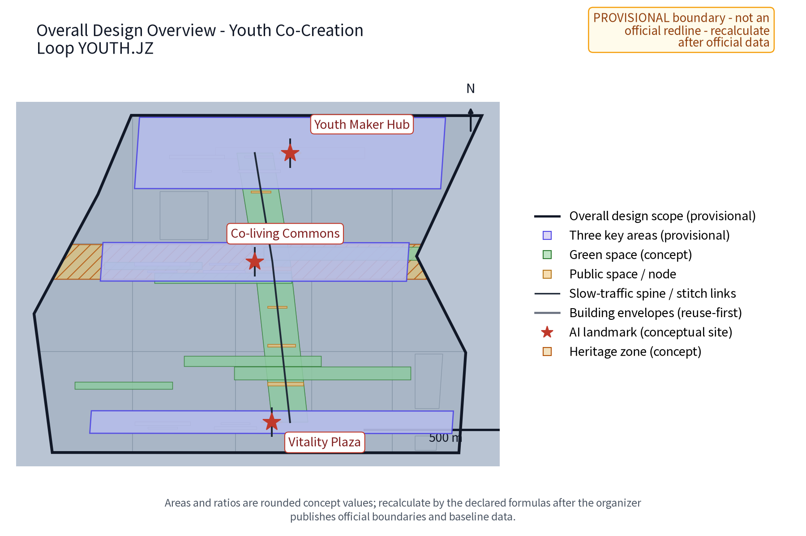
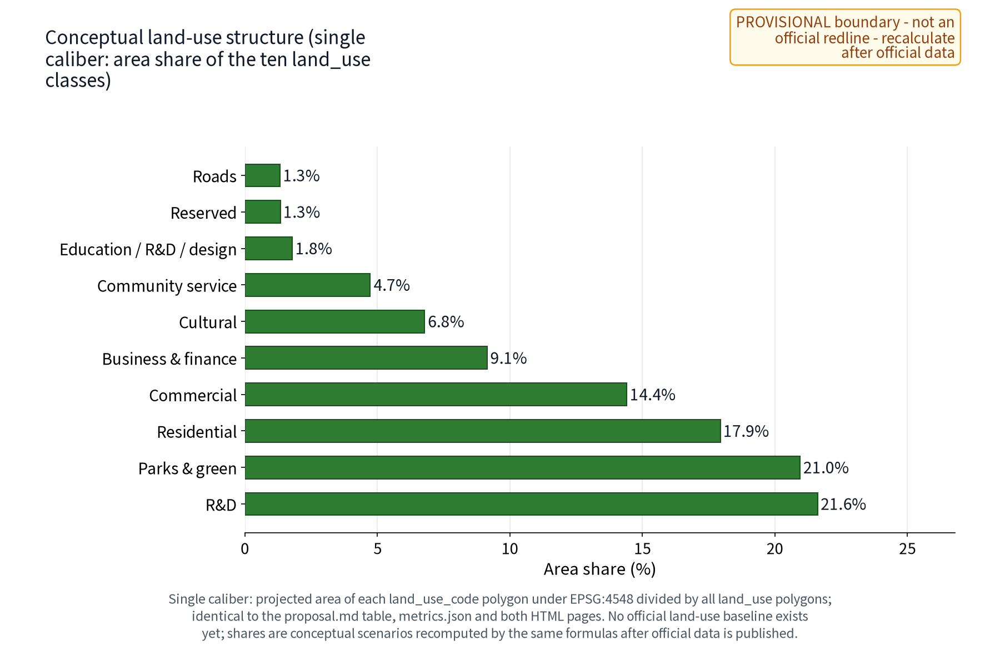
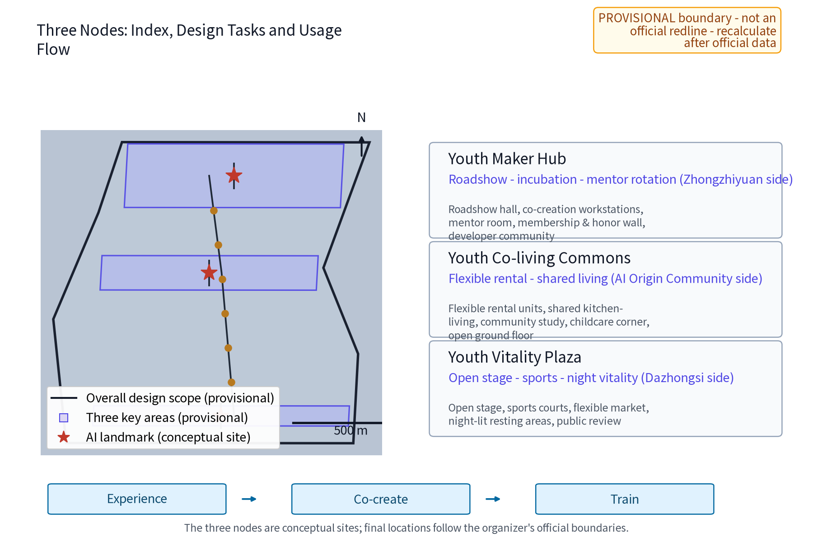
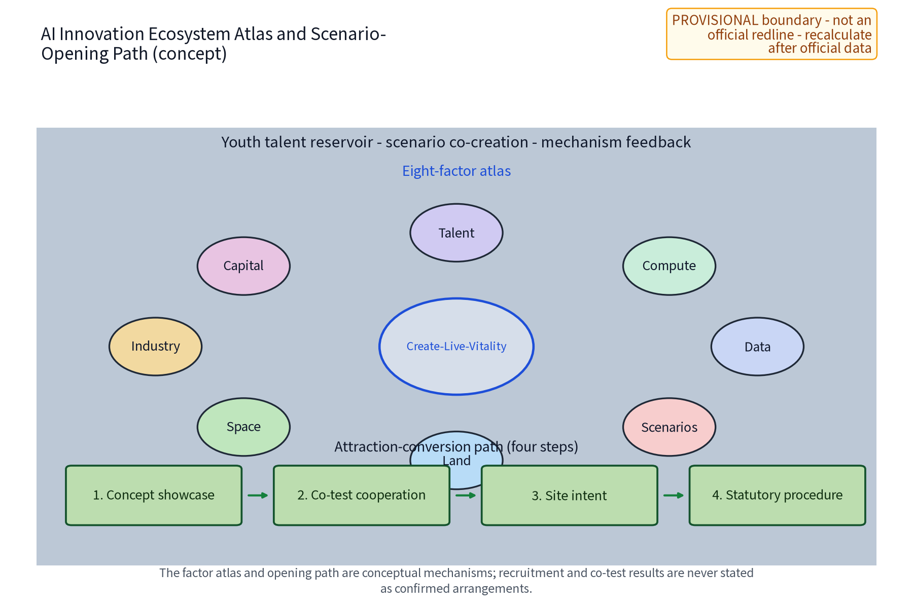
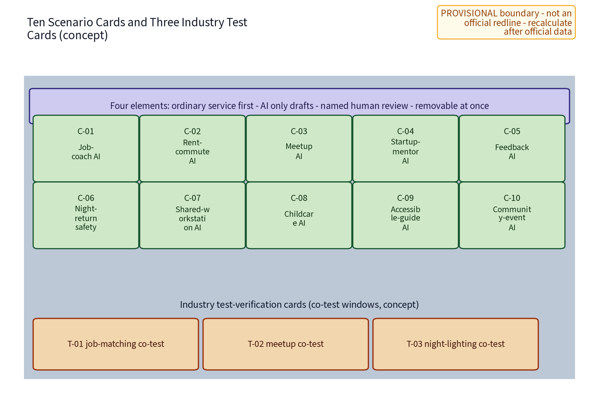
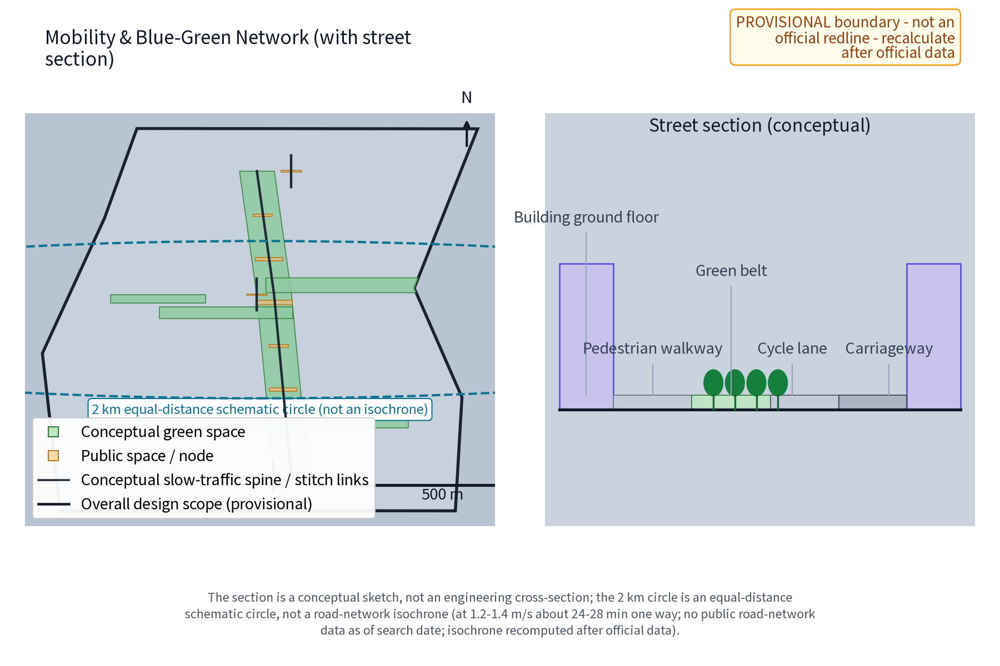
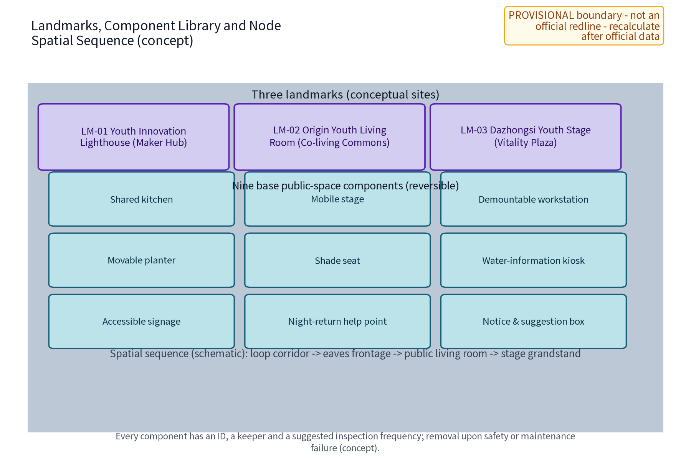
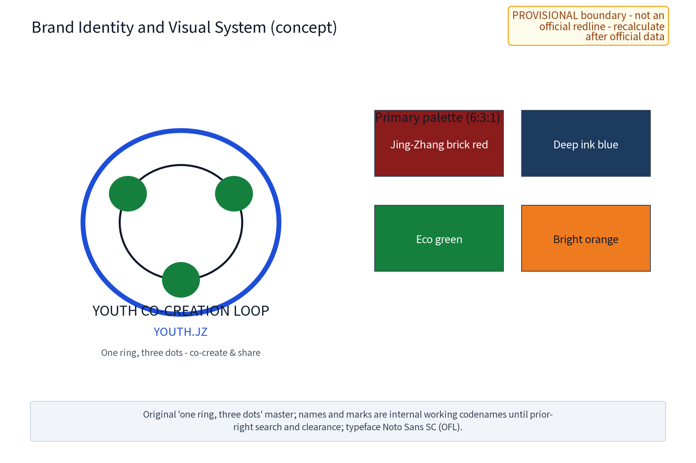
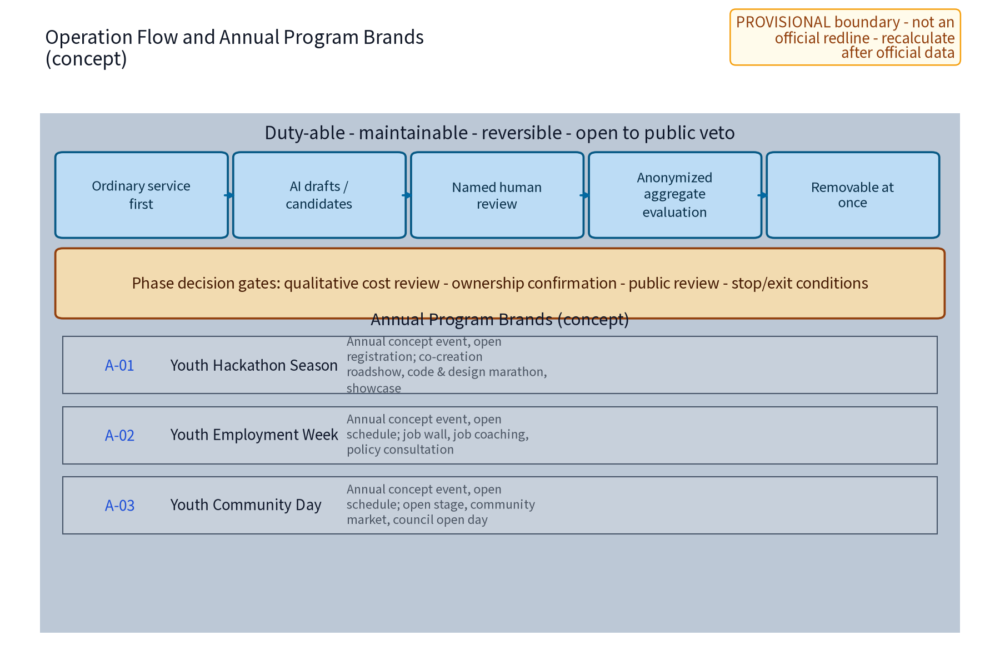
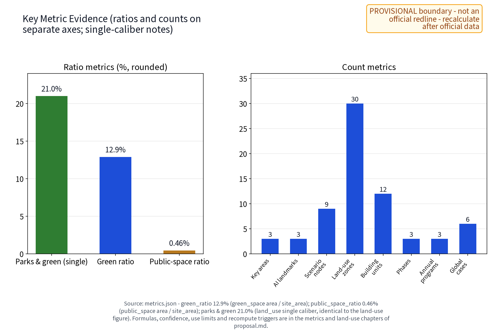

This is the complete English translation of the Chinese design proposal draft (package No. 38, "Youth Co-Creation Loop YOUTH.JZ"), corresponding to the "youth-friendly public space" track of the public task book and the youth-talent persona dimension of agent.3. The proposal organizes a "one community, one residence, one plaza" three-node system, ten scenario cards (five core AI+ scenarios and five extended scenario cards), three industry test-verification scenario cards, and five factor mechanisms. All content is concept suggestion/reference material for professional teams to deepen; it does not replace statutory planning and does not constitute a government-approved conclusion. This draft gives no FAR, building height, building intensity, specific retain-renovate-demolish decisions, rent levels, housing-unit counts, investment estimates or engineering implementation conclusions, and invents no official data, housing-unit counts, event counts or policy commitments.

## Design Basis and Source List

The controlling bases of this proposal are, in order: the excerpt of the call-for-proposals task book, which sets the three major positioning statements, five major functions, the three-zone two-wing layout, the six agent.1-agent.6 tasks and the prohibited-boundary clauses; the submission skill, which sets the chapter structure, the evidence layering and the "concept suggestion" phrasing boundary; the reference example, which sets chapter depth and honest-disclosure style; and the full text of the task book, used to check the list of prohibited expressions. Site facts used for design come only from public or cleared sources: the repository's task-book excerpt and submission-skill files, Beijing's published implementation scheme and official interpretation for government-subsidized rental housing, public reporting and design-firm material on the Shenzhen Shuiwei Ningmeng talent apartments, the Seoul Metropolitan Government's public youth-housing policy pages, public material on community spaces in Singapore's HDB estates, the public government pages of the Hong Kong Youth Hostel Scheme, the public policy direction of youth-development city pilots, and map context used only as credited directional background (no redlines, ownership, heritage, planning or engineering facts are derived from it).

No official overall boundary or key-area polygons are provided in the current repository. All overall and node design in this draft is based on provisional conceptual geometry, marked official_boundary=false, geometry_role=provisional_constraint, used only for content design and machine validation, and never interpreted as statutory redlines, ownership, planning permission or engineering positioning; the arrival of official geometry triggers a full recomputation and replacement. Current-condition diagnosis, precision limits and the recomputation path are recorded in the relevant chapters. The six benchmark cases are registered source-by-source (publisher, link, access date, specific claims, permission boundary) in sources.json and the report copyright ledger.

| Category | Material | Purpose and nature |
| --- | --- | --- |
| Task book | Agent task-book excerpt and full text | Three positioning statements, five functions, three-zone two-wing, agent.1-6, boundary clauses, prohibited expressions |
| Skill | Submission skill reference file | Proposal structure, evidence layering, compliance phrasing |
| Example | Published reference example | Chapter style, honest disclosure, metric expression |
| Policy | Beijing implementation scheme and interpretation for government-subsidized rental housing (officially published) | Youth housing policy background, conceptual interface |
| Case | Shenzhen Shuiwei Ningmeng talent apartments, public reporting and design-firm material | Stock renewal and shared public-space mechanism reference |
| Case | Seoul Metropolitan Government public youth-housing policy material | Affordability and community-space mechanism reference |
| Case | Singapore HDB community-space public material | Open ground-floor public living-room mechanism reference |
| Case | Hong Kong Youth Hostel Scheme public material | Government-organization collaboration for below-market youth housing |
| Case | Youth-development city pilot public policy | Youth-friendly city public-service interface reference |
| Data | Official boundary and key-area geometry | Missing for now; replaced by provisional conceptual geometry |

> **Evidence anchor**: [source:DATA-SRC-OFFICIAL-ANNOUNCEMENT], [source:DATA-SRC-AGENT-TASKBOOK] (organizer announcement and task book are the text-scope basis).

## Three-Level Scope Framework

The three-level scope runs through one "problem-space-operation-evidence-exit" accountability chain. The coordinated research level answers "how youth talent is converted into public value along the belt": youth employment, housing, entrepreneurship and belonging issues, and how they become deliverables through industry research, mechanism concepts and an activity system. The overall design level implements the answer in the "Youth Co-Creation Loop" spatial structure: one conceptual loop connecting three nodes plus a youth public-service network. The key-area level breaks the task down to the function, space and public-experience interface of the three nodes. All three levels share one evidence scope and provisional marks so that the macro ecology, master plan and node design never contradict each other.

The scope wording follows the official text scope uniformly (to be confirmed against official publication): coordinated research area about 43.6 km², overall design area about 11.4 km², and key areas about 368.4 ha. The overall-area figure is also recomputed from the submitted site_boundary conceptual geometry under EPSG:4548 and is a low-confidence temporary design-model value: the geometry is provisional with official_boundary=false, the source and formula are registered with the submission and used only for design organization and page-scope estimation; after the official boundary and control conditions are published, all area statements are recomputed and replaced with official geometry. The three key-area scopes are conceptual scopes under public clues and are not statutory planning areas.

| Level | Core question | This proposal's answer | Main deliverables |
| --- | --- | --- | --- |
| Coordinated research | How youth talent becomes public value along the belt | Youth triple chain (employment-housing-entrepreneurship), regional cooperation, six-case mechanism reference | Ecosystem interface and long-term operation concept |
| Overall design | How the existing city carries youth-friendliness | One loop, three nodes, youth public-service network, stock-first renewal principles | Spatial structure, renewal principles and metric scope |
| Key areas | How the three nodes land differently | Maker Hub, Co-living Commons, Vitality Plaza | Node functions, spaces and public-experience interface |

> **Evidence anchor**: [source:DATA-SRC-AGENT-TASKBOOK] (three-level scope per official task-book text scope).

## Coordinated Research Area: Industry and Future City Research

### Package scope and whole-belt coordination interface (specialty boundary)

This package is a **youth-friendly specialty package** under the Centennial Jing-Zhang AI Innovation Belt. It focuses on youth employment-housing-entrepreneurship issues and the youth-friendly public-service network, and does not duplicate the full-belt overall coordination of all industries and population groups - that overall coordination remains in the organizer's overall task book and official coordination framework. The package interfaces with the whole belt in three ways. First, it carries the "youth three chains" (employment-housing-entrepreneurship) question of the coordinated research area and specializes the youth dimension of the whole-belt talent structure. Second, through the three-zone two-wing coordination loop (the three nodes here and the Zhongguancun Tech-service Wing and Xiaoyuehe Scenario Wing) and the regional-coordination chapter, it connects with the other whole-belt industry and space packages without setting up a conflicting structure. Third, on the boundary of "specialty caliber, pluggable into the whole"; the single-caliber land-use structure, the metric recomputation path and the factor-mechanism concepts used here are merged into the whole-belt coordinated deliverables by the same logic after official data is published. The six tasks agent.1-agent.6 are mapped item by item in the compliance matrix (see the "Metrics, Area Recalculation, and Compliance Matrix" chapter), all expressed as concept suggestions and reference proposals, not replacing the whole-belt coordination conclusions.

### Three positioning statements and five major functions

The three positioning statements land on the youth dimension as spiritual inheritance, living-experience pioneer and entrepreneurship-employment; the five major functions correspond to a youth talent reservoir, scenario co-creation, public and night vitality, a deliberation-participation sample, and developer-community support.

### Three-zone two-wing loop and naming identity

The three zones correspond to the three nodes: the Youth Maker Hub by Zhongzhiyuan carries co-creation, validation and mentoring; the Youth Co-living Commons by the AI Origin Community carries housing, living and community; the Youth Vitality Plaza by Dazhongsi carries exhibition, sports and night vitality; the Zhongguancun Tech-service Wing and the Xiaoyuehe Scenario Wing act as conceptual interfaces for mentors, services and scenario testing, forming a "create-live-vitality" loop (a mechanism concept, not a commitment). The Chinese name "Youth Co-Creation Loop" and the English name YOUTH.JZ emphasize a co-creation ring network; the logo direction is an original "one ring, three dots" mark in Jing-Zhang brick red, deep ink blue and bright orange, low-glare and accessibility-friendly, not copying any existing city, park or enterprise identity; the brand system and lockup rules are detailed in the "Brand Identity and Visual System" chapter.

### Benchmark cases (summarized from public channels only)

The six cases are summarized for their public mechanisms only (see table), borrowing the directions of "stock renewal into public products", "shared public-space provision", "open ground-floor public living rooms", "policy interface with small-unit shared orientation", "government-organization collaboration for affordable housing", and "youth-friendly city service interfaces", without copying any case's ownership arrangements, subsidy standards, rent levels or management models; all figures are labeled as public-scope figures and never rewritten as commitments of this proposal; the publisher, link, access date, specific claims and permission boundary of each case are registered item by item in sources.json.

| Case | Public mechanism summary | Points borrowed | Source (claim-level links, retrieved 2026-08-25) |
| --- | --- | --- | --- |
| Shenzhen Shuiwei Ningmeng talent apartments | Public reporting describes it as the first pilot in Shenzhen of a talent-guaranteed-housing community converted from village handshake buildings (Shenzhen News, 2017-12-15 scope; an academic article calls it the first project in China combining talent housing with urban-village renewal): original fabric and structure retained, elevator corridors and shared public spaces added (youth home, roof garden, etc.), government funding, SOE renovation and operation, village collective housing cooperation, and rent at about half of market with government subsidy targeted at enterprise young talent (public-scope figures) | Stock renewal into public products, shared public space, color wayfinding | Shenzhen News 2017-12-15 (link in [source:CASE-SHENZHEN-SHUIWEI]); Shenzhen Business Daily 2018-03-28 (szsb.sznews.com/PC/content/201803/28/content_330869.html); architect DOFFICE project page (gooood.cn/lm-youth-community-china-by-doffice.htm) |
| Beijing published implementation scheme for government-subsidized rental housing | The published scheme targets people without housing including young people and focuses on new graduates; the public "14th Five-Year" target is provision of about 400,000 units (public scope); small units preferred, shared space and mixed use encouraged | Policy interface, small-unit and shared orientation | Beijing Municipal Government portal (published 2022) |
| Seoul youth housing policy | Official Seoul Metropolitan Government pages show monthly rent support for young people without housing (up to about KRW 200,000/month, once per lifetime at most 12 months), Youth Safe Housing at about 75-85% of market price and single-person shared housing at about 50-70% with community shared spaces, youth housing located near public-transit hubs | Affordability and community space together | Official English pages of the Seoul Metropolitan Government: seoul-policy-archive/youth-housing-support/, seoul-policy-archive/tailored-rental-housing-for-vulnerable-households/, policy/urban-planning/housing-construction/ (english.seoul.go.kr) |
| Singapore HDB community vitality spaces | Official and design sources show the tradition of open, unfenced, sheltered void-deck community space under HDB blocks (built since the 1970s), and recent practice of community-facing void-deck public space centered on a shared kitchen (GoodLife! Makan, completed 2016) | Open ground-floor public living room, shared kitchen | HDB design-features page (hdb.gov.sg/residential/buying-a-flat/finding-a-flat/design-features-for-new-flats); National Heritage Board Void Decks e-book (2013, nhb.gov.sg); DP Architects GoodLife! Makan project page (dpa.com.sg/projects/goodlife-makan/) |
| Hong Kong Youth Hostel Scheme | The official page shows the Government fully funds NGOs to build youth hostels which the NGOs then operate on a self-financing basis, with rent capped at no more than 60% of market rent for nearby comparable units, for employed permanent residents aged 18-30; a 2025 LegCo written reply shows tenants must contribute at least 200 hours of community/volunteer service per year, with supporting activities such as start-up training, personal development and workplace culture | Government-organization collaboration, affordable housing with community | Home and Youth Affairs Bureau official page (hyab.gov.hk/tc/policy_responsibilities/Social_Harmony_and_Civic_Education/youth_hostel_scheme.htm); LegCo written reply 2025-10-15 (link in [source:CASE-HK-YOUTH-HOSTEL]) |
| Youth-development city pilot policy | Public document Zhongqinglianfa [2022] No.1: a national pilot policy direction under the medium- and long-term youth development plan, reviewed by the inter-ministerial joint conference, requiring youth elements across urban planning, construction and management and exploring youth-friendly public-service space and facility standards; the first pilot list was published 2022-06-02 (45 pilot cities and 99 pilot counties, Xinhua scope; this proposal infers no list) | Youth-friendly city service interfaces, cross-city cooperation background | Official full text (link in [source:CASE-YOUTH-DEVELOPMENT-CITIES]); Xinhua 2022-06-02 pilot-list report (same source entry) |

### Regional cooperation and factor interfaces (concept)

This section is a concept-level regional cooperation chapter: all cooperation is expressed as "directional candidate object - factor flows - conceptual interface - phase - exit condition", nothing is written as a confirmed arrangement, and any concrete engagement must be advanced by the competent authorities and relevant parties according to law. First, the Beiwei Community area (Qinghe Street direction, candidate object): as a candidate for youth housing and community-service linkage, factor flows are housing demand, community services and night commuter flows; the conceptual interface is the flexible-renting demand list of the Co-living Commons and night-route connection; suggested start is demand research and council visits; the exit condition is failure to reach agreement on ownership or management boundaries. Second, Future Science City (candidate): factor flows are young engineering talent, lab-spillover technical results and pilot-testing demand; the interface is the open roadshow and mentor-rotation resources of the Maker Hub; the suggested start is a joint annual startup roadshow; the exit condition is a mismatch of experts or venues. Third, Huairou Science City (candidate): factor flows are basic-research young scholars, academic conferences and science-communication resources; the interface is the open stage and science exhibition of the Vitality Plaza; the suggested start is a science-communication season and young-scholar salons; the exit condition is theme mismatch with local youth demand. Fourth, the Economic and Technological Development Zone (candidate): factor flows are job demand in intelligent manufacturing and the data industry; the interface is public job aggregation through the Job-coach AI and the Career Week; the suggested start is a job-information exchange pilot; the exit condition is failure to agree on data and privacy boundaries. Fifth, the Jing-Jin-Ji region (regional background): factor flows are commuting youth, industrial collaboration and policy-pilot directions; the interface is the conceptual exploration of mutual recognition of youth service points in regional youth events; the suggested start is annual joint youth events; the exit condition is absence of approval of inter-administrative policy interfaces. All cooperation items are labeled "concept, to be confirmed by competent authorities" and constitute no commitment.

### Factor mechanisms (concept)

Five mechanism concepts: flexible rental and deposit optimization - exploring short lease flexibility, flatmate matching with credit history, institutional guarantees, installment payment and other directions that reduce one-time deposit burdens, subject to legal and authority review; co-creation membership - a low-cost membership covering shared workstations, roadshows and mentor-rotation opportunities, with rules agreed by the operator and the Youth Council; youth service points - voluntary participation, anonymized aggregation, used for timeslot redemption ordering and operation review, never for individual-identifying tracking, with anomaly human review; the Youth Council - regular public deliberation on timeslot allocation, activity content and mechanism adjustments, with decisions taken through statutory procedures; mentor rotation - based on publicly available public-interest mentors and service resources, committing to no specific organization or frequency; and a youth volunteer service team as a supplementary human-resource interface for staffing, guiding and event delivery, uniformly incorporated into training and scheduling.

> **Evidence anchor**: [source:DATA-SRC-PROVISIONAL-BOUNDARIES] (boundary provisional; research scopes are conceptual only).

## Overall Design Area: Urban Renewal and Regulatory-Plan-Level Urban Design

The overall structure is "one loop, three nodes plus a public-service network": the Youth Co-Creation Loop is a conceptual slow-traffic and service ring connecting the three nodes - the Youth Maker Hub, the Youth Co-living Commons and the Youth Vitality Plaza - overlain with a youth public-service network of secondary service points along the loop (shared study, information service, event bulletin and opinion collection, night-return duty points). The loop is a conceptual structure, not a road redline, and can be relocated as a whole once the official boundary arrives; no road alignment or intersection engineering is presupposed. The north-south connection is carried by the conceptual slow-traffic spine along the Jing-Zhang heritage park greenway, and the east-west stitching by three conceptual cross-greenway connection routes; together they form the loop's through skeleton (conceptual connections, no road-work claims).

The renewal strategy is stock-first, incremental and reversible-light: prioritize identifying buildings and spaces that can be retained or lightly adapted, and carry functions with reversible components (shared kitchens, mobile stages, demountable workstations, movable planters), never premised on large-scale demolition; specific retention, adaptation, relocation or removal must be judged one by one by professional teams after surveys of current conditions, ownership, heritage, structure, fire safety and accessibility. This draft gives no site-specific retain-renovate-demolish conclusions.

Regulatory-plan depth is expressed as "problem - spatial object - metric - data gap - recomputation path": the spatial objects and conceptual metrics this draft can provide are all based on provisional geometry, with area and ratio metrics recomputed from the submitted geometry and marked low-confidence with official recomputation triggers; metrics that depend on unpublished official control conditions (FAR, building height, intensity) remain to be confirmed and are never replaced by conceptual planning approval.

| Design layer | Spatial object (concept) | Status and recomputation path |
| --- | --- | --- |
| Overall structure | Youth Co-Creation Loop (conceptual ring: N-S spine + E-W stitches) | Provisional geometry; relocate and recompute after official data |
| Nodes | Three node conceptual envelopes, landmarks LM-01/02/03 | Provisional; judge one by one after survey and ownership |
| Network | Secondary service points (shared study, information, night-return duty) | Conceptual points, movable as a whole |
| Metrics | Area and ratio types | Provisional recompute; intensity types await official control conditions |

> **Evidence anchor**: [source:DATA-SRC-MOHURD-CONTROL-DETAILED-PLANNING], [source:DATA-SRC-PROVISIONAL-BOUNDARIES].

## Detailed Design of Key Areas

### Youth Maker Hub (beside Zhongzhiyuan)

Functionally, a co-creation space for AI young founders and developers carrying four functions - roadshows, incubation mentoring, mentor rotation and co-creation membership - receiving the youth test-verification interface of the Zhongzhiyuan full-stack system, and serving as the conceptual anchor of the developer community: regular open tech sharing, hackathon warm-ups and work showcases with open enrollment and human review. Spatially, the conceptual envelope contains a roadshow hall, co-creation workstation area, mentor room and membership desk, preferably embedded in retained buildings or using reversible light adaptation, low-rise, durable and repairable. On the public-experience interface, street-facing transparent frontages and an openable roadshow zone open public events to the public space; an honor display wall shows developers' and co-creators' public achievements with authorization; free to enter, timeslots bookable, activity content agreed by the operator and the Youth Council.

### Youth Co-living Commons (beside the AI Origin Community)

Functionally, a flexible-rental and shared-living unit carrying flatmate matching, shared kitchen-living room and community operation, using the public government-subsidized rental housing policy as a conceptual interface (no specific support committed). Spatially, the conceptual envelope contains flexible rental units (stock-adaptation oriented, with a conceptual small-unit preference), a shared kitchen and public living room, laundry and drying area, and community study; the ground floor follows the open public-living-room prototype, transparent and unfenced. On the public-experience interface, the ground-floor public living room is open to the community without access control; a bulletin wall publishes the community activity calendar, service rosters and opinion channels; rental and public areas are zoned and managed separately to protect residential tranquility and nighttime quiet; a childcare corner and accessible routes are included in the ground-floor public space concept (for young families and caregivers).

### Youth Vitality Plaza (beside Dazhongsi)

Functionally, an open stage, sports and social exchange and night-vitality venue serving as the public experience and exhibition interface of the Dazhongsi AI industry cluster. Spatially, the conceptual envelope contains an open stage, sports courts, a flexible market area and night-lit resting areas; stage and courts use demountable components; night lighting is integrated with the slow-traffic path. On the public-experience interface, free to enter with bookable timeslots and public review of activity content (Youth Council recommendations, operator decision); night vitality is premised on safety, duty staffing and noise control, avoiding over-commercialization and vulgarization, with night opening hours and adjacent residential interfaces zoned.

### Landmarks, honors and the public-space component library (concept)

Three pilgrimage landmarks are agreed as numbered objects: LM-01 the Youth Innovation Beacon (conceptual rooftop landmark of the Maker Hub carrying work displays and panoramic wayfinding, beside Zhongzhiyuan); LM-02 the Origin Youth Living Room (ground-floor living-room landmark of the Co-living Commons with transparent frontage and community bulletin wall, beside the AI Origin Community); LM-03 the Dazhongsi Youth Stage (open-stage landmark of the Vitality Plaza integrating demountable stage and night lighting, beside Dazhongsi). All three are conceptual objects corresponding to the ai_landmark features in geometry/public_space.geojson; their final form awaits the official boundary and appearance controls. The honor display system runs on an "authorize - display - review - removal" loop with no pre-set winner lists. The public-space component library follows durable-repairable, reversible-replaceable principles: shared kitchen, mobile stage, demountable workstation, movable planter, shade seat, water-information kiosk, accessible signage, night-return help point, and notice-suggestion box are the nine base components; every component has an ID, a keeper and a suggested inspection frequency, and the removal condition is safety or maintenance failure (concept).

### Site-specific form language and prototype validation (concept)

To avoid a generic, easily relocatable space template, this package distills a set of **site-specific form languages** for the three nodes (concept; to be verified by measurement once official boundaries and current-condition drawings arrive). The Maker Hub echoes the linear landscape and industrial scale of the Jing-Zhang heritage-park greenway, organizing street-front roadshows and display along an "eaves-long frontage". The Co-living Commons responds to the street-facing residential frontage of the AI Origin Community, forming a legible landmark with a "transparent ground floor plus a raised open living room". The Vitality Plaza borrows the framed relationship of the Dazhongsi track viaduct and station-city frontage, using a "stage-grandstand-light mast" for night recognition. All three form languages are built from demountable, reversible components and do not presume permanent large structures. Prototype validation is bounded and paced by an original mechanism, the **reversible prototype period**: a new scenario/component is first trialled at small scale, for a limited period, as a reversible prototype; after public trial measurement and anonymized aggregate evaluation, it is retained, adjusted or removed. The prototype period is never described as built or approved for operation; key evaluation conclusions are co-reviewed by the Youth Council and professional teams. The three landmarks, nine components, ten scenario cards and three industry test cards form an extensible product family, and the prototype-validation mechanism keeps a testable iteration loop between site adaptation and reuse.

| Node | Function | Space (concept) | Public-experience interface |
| --- | --- | --- | --- |
| Youth Maker Hub | Roadshow, incubation mentoring, mentor rotation, co-creation membership, developer community | Roadshow hall, co-creation workstations, mentor room, membership desk, honor wall | Transparent frontage, open roadshow, free entry |
| Youth Co-living Commons | Flexible rental, flatmate matching, shared kitchen-living, community operation | Rental units, shared kitchen-living, community study, childcare corner | Open ground-floor living room, bulletin wall, zoned management |
| Youth Vitality Plaza | Open stage, sports and social exchange, night vitality | Stage, sports courts, flexible market, night-lit resting areas | Free entry, bookable timeslots, public review, duty staffing |

> **Evidence anchor**: [data:PACKAGE-GEOMETRY] (the three node polygons come from geometry/key_areas.geojson in this package).

## AI Innovation Ecosystem, Personas, and AI+ Scenarios

The AI innovation ecosystem is organized as "youth talent reservoir - scenario co-creation - mechanism feedback", with an explicit factor atlas: eight factor streams - land, space, industry, capital, talent, compute, data and scenarios - flow along the "create-live-vitality" loop; the Maker Hub receives the test-verification interface of the Zhongzhiyuan system, the Co-living Commons feeds real-life problems back into the scenario list, and the Vitality Plaza carries public experience and exhibition; the Zhongguancun Tech-service Wing, the Xiaoyuehe Scenario Wing and regional public collaboration resources act as factor interfaces (mechanism concept, no commitment). Industrial support uses a "scenario opening" path: the three industry test-verification scenario cards open co-test windows to park enterprises (see table); the attraction path is expressed in four steps - "concept showcase - co-test cooperation - site intent - statutory procedures", and no attraction result is written as a confirmed arrangement.

There are six persona groups in total (see table), used only as differential service-design inputs, never for demographic inference or any individual identification.

| Persona | Core needs | Corresponding scenario cards |
| --- | --- | --- |
| Fresh graduate | Job search, transitional housing, commute adaptation | Job-coach, Rent-commute |
| Young AI developer | Co-creation, tech exchange, night return | Meetup, Startup-mentor, Desk-share |
| Freelancer | Flexible space, shared office and socializing | Meetup, Feedback, Desk-share |
| Youth entrepreneur | Roadshow, mentoring, membership | Startup-mentor, Feedback |
| Young family | Stable rental, community life, childcare | Rent-commute, Feedback, Childcare |
| Youth night-returners | Night path safety and night vitality | Night-return, Feedback |

All ten scenario cards follow the four elements "human-first ordinary service, AI drafts/candidates only, named human review, instant removal", as detailed below: any scenario is removed instantly when privacy, sourcing or human review is not satisfied, and tests/pilots are never described as approved operations. The extended cards are bound by the same four elements as the core cards.

| No. | Scenario card | Human-first service | AI assistance (draft/candidate) | Named reviewer | Removal condition |
| --- | --- | --- | --- | --- | --- |
| C-01 | Job-coach AI | Employment service window, job-information wall | Public job aggregation, resume-material search draft | Employment service officer | Infers sensitive attributes or differential ranking |
| C-02 | Rent-commute AI | Rental service desk, public housing booklet | Public-listing and commute cross-check list | Rental service officer, duty consultant | Replaces contract or legal judgment |
| C-03 | Meetup AI | Physical bulletin board, events desk | Anonymous interest-tag matching suggestion (voluntary) | Community host | Time, venue or rights unverified |
| C-04 | Startup-mentor AI | Mentor room, policy material shelf | Public-policy summary, pitch outline draft, mentor candidates | Rotating mentor | Gives financing or licensing conclusions |
| C-05 | Feedback AI | Suggestion box, council session | De-identified topic clustering, routing suggestion | Council secretary, district operation lead | Hides minority opinions or builds personal profiles |
| C-06 | Night-return AI | Physical help point, duty desk | Public lighting/staffing hours map draft | Night-duty lead | Infers individual itineraries |
| C-07 | Desk-share AI | Shared-desk counter, paper booking sheet | Free-workstation timeslot candidate list | Maker Hub administrator | Ranking tied to personal data |
| C-08 | Childcare AI | On-site registration at childcare corner, notices | Care timeslot and volunteer candidate suggestion | Childcare corner lead | Involves identifying a child |
| C-09 | Accessible-wayfinding AI | Paper guide map, human information desk | Accessible route and facility cross-check list | Accessibility service officer | Replaces accessibility facility verification |
| C-10 | Community-events AI | Events desk, bulletin board | Topic aggregation and schedule draft | Event operation officer | Venue or permission unverified |

Three industry test-verification scenario cards (the numbered objects corresponding to industry_test_scenario_count=3 in metrics), open co-test windows for enterprises and research institutions; all are conceptual verification arrangements, not described as approved operations:

| No. | Industry test-verification scenario | Test subject | Verification content | AI output and tools | Review and data boundary | Stop condition |
| --- | --- | --- | --- | --- | --- | --- |
| T-01 | Job-matching co-test window | Park employers and fresh graduates | Accuracy of public job and skill-tag aggregation | Job-match candidate list (draft only) | Employment officer review; anonymized aggregation only | Accuracy below threshold or personal profiles appear |
| T-02 | Event-scheduling co-test window | Event organizers and venue operators | Event scheduling and venue-conflict checking | Schedule candidate plan (draft only) | Event officer review; de-identified | Venue rights unverified |
| T-03 | Night-lighting co-test window | Lighting maintenance unit and university research group | Public lighting point and duty-hours cross-check | Lighting map draft (draft only) | Duty lead review; no individual tracking | Any link to individual itineraries stops it |

Scenario-to-space mapping: Job-coach AI corresponds to the employment desk at the Maker Hub; Rent-commute AI to the rental desk at the Co-living Commons; Meetup AI to the events desk at the Vitality Plaza and the bulletin walls of the three nodes; Startup-mentor AI to the mentor room at the Maker Hub; Feedback AI to the suggestion boxes of the three nodes and the Youth Council; Night-return AI to the night-return duty points; Desk-share AI to the shared-desk counter at the Maker Hub; Childcare AI to the childcare corner at the Co-living Commons; Accessible-wayfinding AI to the information desks of the three nodes; Community-events AI to the events desk at the Vitality Plaza. Privacy and human-review boundary: data is anonymized and aggregated only for operation review, with no individual-identifying tracking, no personal-profiling ranking, and a login-free equivalent ordinary-service path throughout; governance interfaces span transport, industry, space, public service, culture and deliberation culture (concept).

#### AI Technical Protocols (concept stage: model evaluation / data quality / error stratification / runtime monitoring)

Most AI-assisted functions are aggregation, drafting and candidate suggestions with no unified technical protocol yet; to avoid treating algorithmic behaviour as a black box, this proposal introduces a four-part technical-protocol framework at concept stage (a framework for professional teams to deepen, not a commitment to an already-built system):

| Item | Concept-stage requirement | Data boundary and trigger |
| --- | --- | --- |
| Model evaluation | Every AI-assisted function is evaluated on a baseline task set assembled from de-identified samples of ordinary-service records (no new collection); indicators include accuracy, completion rate, false-positive rate and false-negative rate; results are filed per function in the operation archive | Three evaluation tiers: concept baseline, co-test point, official interface; below-threshold functions never enter the official interface; thresholds are set jointly with the named reviewer during co-testing |
| Data quality | Data comes only from public information and anonymized user-provided input; quality items: source traceability (aggregation results carry source pages), update date, de-identification level, minimum sample size | Sub-standard data never enters candidate generation; expired sources are removed from candidate lists |
| Error stratification | Weekly stratification of review findings along two axes - source type (dead URL / stale data / parsing error / semantic bias / reviewer misjudgement) x scenario function - with an error list issued | Stratification feeds candidate-generation rule fixes only; never used for individual profiling or ranking |
| Runtime monitoring | Anonymous aggregate run indicators: call volume, review rate, removal count, anomalous periods; for operation review only | Accuracy regression or anomalies trigger the human-review channel, with removal under the immediate-removal clause when needed; monitoring data is unrelated to individuals |

The four protocols follow the same template as "ordinary service first - AI drafts candidates - named human review - removable at once": tests and pilots are never presented as approved operations, and any unmet protocol item exits through the removal condition.

#### Space-feedback to operation-evaluation to planning-adjustment loop and co-test baseline (concept)

In response to the review comment that the AI currently mainly generates summaries, drafts and candidate lists rather than forming a completed space-feedback to operation-evaluation to planning-adjustment loop, this package proposes a conceptual closed-loop model (not a built system and not a technology commitment): the AI outputs of the scenario cards only generate summaries, drafts and candidate lists; after named human review, the adopted operation actions (timeslot allocation, space booking, event scheduling) produce anonymized aggregate usage data; those data periodically enter operation evaluation (error stratification, review rate, threshold attainment - never individual-level); the evaluation results are fed back to the Youth Council and professional teams as planning and operation suggestions, and they make the key planning-adjustment decisions; adjustments then return to scenario configuration and spatial layout, forming a reversible "use-evaluate-adjust" loop. In the loop, AI only provides evidence and candidates; every spatial and planning adjustment is decided by humans and professional teams. Co-test baseline (concept): a three-level band (concept baseline - co-test pilot - formal interface) is established from de-identified samples of ordinary service records, with thresholds jointly defined with the named reviewer during the co-test period; after official baseline data (e.g. passenger flow, operation cost) is published, the baseline is calibrated with actual data, and no co-test score is expressed as a formal indicator before calibration.

> **Evidence anchor**: [source:DATA-SRC-GENERATIVE-AI-INTERIM-MEASURES] (reference basis for generative-AI content governance wording).

## Land Use, Building Scale, and Retain-Renovate-Demolish Strategy

Land-use expression uses conceptual zoning that fully covers the provisional overall scope (the ten land_use classes in geometry/land_use.geojson together cover approximately the submitted overall scope): the three nodes are the core land-use concepts, the two sides of the loop hold public-service network points, and the rest are existing-function extension areas; conceptual zoning does not change statutory land-use categories, and after the official regulatory plan arrives the same logic is reapplied for re-cutting and recomputation. **The land-use structure uses a single caliber**: the main text, the figures (land-use-structure zh/en), the table below, land_use_share_* (ten entries) in metrics.json and both HTML pages all use the same classification and the same share values, with the formula "projected area of each land_use_code polygon under EPSG:4548 divided by the total area of all land_use polygons"; the confidence level is low (because both the overall boundary and the land-use baseline are provisional) and the recompute trigger is "after the official boundary, regulatory-plan land use, green/blue lines and ownership data are published, recompute and replace the whole set by the same formula with official geometry". The ten conceptual class shares (rounded; sum about 100%): residential about 18%, community service facilities about 5%, R&D about 22%, cultural about 7%, commercial about 14%, business & finance about 9%, education/R&D/design about 2%, roads about 1%, parks & green about 21%, and reserved about 1%.

| Land-use code (concept) | Class name | Zone count | Area share (approx., single caliber) |
| --- | --- | --- | --- |
| 0802 | R&D | 3 | about 21.6% |
| 1401 | Parks & green | 14 | about 21.0% |
| 0701 | Residential | 3 | about 17.9% |
| 0901 | Commercial | 3 | about 14.4% |
| 0902 | Business & finance | 1 | about 9.1% |
| 0803 | Cultural | 2 | about 6.8% |
| 0702 | Community service facilities | 1 | about 4.7% |
| 0804 | Education/R&D/design (concept) | 1 | about 1.8% |
| 16 | Reserved (concept) | 1 | about 1.3% |
| 1207 | Roads (concept) | 1 | about 1.3% |

Scope-boundary note: green_ratio in metrics.json (about 12.9%) and public_space_ratio (about 0.46%) are a different geometric scope - the recomputed values of the green_space polygon area and the public_space node area divided by site_area respectively, addressing different objects from the land_use zoning scope of the table above; this proposal does not reuse any land-use ratio caliber other than the table above, to avoid presenting two different shares for the same conceptual zone. All values in the table above are provisional low-confidence rounded figures to be uniformly recomputed and replaced after official data is published.

On building scale, this draft expresses design intent as the conceptual preference "stock-first, low-rise preferred" and gives no numeric commitments for FAR, building height, building footprint area or total building scale; building envelope concepts (roadshow hall, shared kitchen-living, open stage and other components) are functional-organization illustrations only; official height, setbacks, density and fire safety are determined by subsequent professional design against the regulatory plan and surveys, and remain to be confirmed.

The retain-renovate-demolish approach follows four steps: verify current conditions and rights first; retain when safety, heritage and function are satisfied; lightly renovate when accessibility, fire safety, energy efficiency or service-interface improvement is needed; relocate or remove conceptual components when safety is not satisfied or heritage requirements conflict. Without surveys there are no demolition areas or demolition conclusions; site-specific retention, renovation and demolition judgments are made by professional teams against measured and ownership surveys; this draft does not prejudge or give site-specific retain-renovate-demolish schemes.

> **Evidence anchor**: [source:DATA-SRC-MNR-LAND-USE-CLASSIFICATION-202311] (land-use category names follow the current national standard scope).

## Transport, Rail, Municipal Infrastructure, and Public Services

This draft gives no road alignment, rail alignment, bridges/tunnels, municipal pipelines or quantities; it only proposes conceptual organizing principles. The core concept is integrated night-return slow-traffic lighting and safe-path design: connecting continuous lighting, unobstructed sightlines, night wayfinding, help points and duty staffing into one system along the three nodes and the loop. First, lighting is continuous and graded - main paths keep continuous lighting, intersections and nodes receive accent lighting, glare and dark corners are avoided; second, sightlines along paths stay open, eliminating dark corners and dead angles, with planting and facilities not blocking observation; third, help points are placed along routes as physical buttons, telephones and human duty interfaces forming an app-free help channel; fourth, night wayfinding and opening-hours information remain readable after lights-out; fifth, the night-vitality venue and residential interfaces are managed by zoning and time-of-day controls for noise, with lighting, planting and public space integrated rather than superimposed. The interface and implementation of municipal duties such as lighting, policing and emergency response are decided by competent authorities; this draft gives no engineering parameters or implementation conclusions.

For transport organization, the three nodes conceptually connect to existing rail and bus stops and the slow-traffic network (no alignment or stop-conversion claims), with the north-south spine and east-west stitches forming the loop skeleton; parking and interchange are premised on verification of current conditions. Public services use the "youth service station" as the conceptual unit: information, drinking water, charging, shared facilities, bulletins and opinion collection, each with an asset ID, keeper, inspection frequency and stop-use condition; the night-return service point (late-night duty interface) opens elastically only when staffing, safety and maintenance conditions are mature and can be closed at any time.

> **Evidence anchor**: [source:DATA-SRC-MOHURD-URBAN-DESIGN-MEASURES] (method reference for municipal and slow-traffic design wording).

## Blue-Green Network, Public Space, and Urban Character

The blue-green network is organized as "three courts, one garden, one belt": the Maker Hub green court, the Co-living Commons community garden, the Vitality Plaza tree-lined square, plus greenway strips along both sides of the loop and pocket nodes; roofs and shared spaces may carry light activities such as community planting (concept). The conceptual green-space ratio and public-space ratio are both recomputed from provisional geometry and marked low-confidence, to be recomputed and replaced after official data is published.

Public space builds the "youth 15-minute public life circle" (a conceptual name, not a verified isochrone): centered on the three nodes, continuous walking paths connect shade seats, drinking-water information, accessible signage, event bulletins and shared components; "15-minute" is this proposal's conceptual name for the service circle, not a verified time isochrone - this proposal does not equate the 2 km example radius with a 15-minute walk, and network isochrones must be recomputed with actual road networks and crossing data when official road-network data is published (no public network-level data as of retrieval 2026-08-25). Public components follow durable-repairable, reversible-replaceable principles and remain fully usable without screens or networks, with wayfinding using the original palette in high-contrast accessible design. Accessibility and inclusion paths: the three nodes and main public paths keep login-free human-service equivalent paths; dedicated accessible routes for wheelchair users and persons with disabilities, tactile and auditory wayfinding for people with sensory impairments (concept), paper equivalent information for people with low digital skills, all-age friendly public space for non-youth and elderly residents, shared public reading seats for students and fresh graduates, night-return paths for night workers and commuters, and a childcare corner for caregivers; the use paths of persons with disabilities, children, the elderly, caregivers and night-returners are verified separately in the operation manual (concept).

Urban character is grounded in the plain industrial scale of the Jing-Zhang railway heritage, with youth vitality presented through restrained color and clear interfaces: low-glare night scenes, durable materials, continuous eaves space and clear public entrances, never aiming at "AI styling" or neon skins. Color wayfinding borrows the color-identification mechanism of the cases, not their imagery, using this proposal's original palette. The cultural narrative runs on "the youth engineering spirit of the centennial Jing-Zhang railway - Zhongguancun innovation culture - contemporary young maker culture": the self-built Jing-Zhang railway by a youth-led engineering team is a public historical fact; this draft expresses spiritual inheritance rather than shape replication, never distorts history and never treats culture as tech decoration or a slogan.

> **Evidence anchor**: [source:DATA-SRC-MOHURD-URBAN-DESIGN-MEASURES] (method reference for blue-green organization).

## Brand Identity and Visual System (concept)

The brand system takes the "one ring, three dots" as its master: an original logo mark of three dots arranged along a ring as abstract youth figures, used in combination with the Chinese name "Youth Co-Creation Loop" and the English name YOUTH.JZ; primary colors are Jing-Zhang brick red (the centennial railway memory), deep ink blue (technology and night vision) and bright orange (youth vitality and night safety recognition), used in a 6:3:1 combination rule, low-glare, high-contrast and accessibility-friendly. The application rules cover the logo master, minimum size, safe distance, positive/negative versions and prohibition examples; the wayfinding system generates samples in four categories - direction, facility, events and safety (concept); cross-media extension covers walls, floors, light boxes, bulletin boards and digital screens (readable without networks). International communication uses "Work. Live. Shine. - Youth Co-Creation Loop on the Centennial Jing-Zhang AI Belt" as the conceptual tagline, with the short name YOUTH.JZ used alongside the Chinese master name; international content is human-reviewed before release (concept).

**Brand prior-rights and use boundary**: all names in this draft are original concept-stage naming (Youth Co-Creation Loop, YOUTH.JZ, the logo master mark and the wayfinding samples have not completed an official trademark search). Until a prior-right search and clearance are completed, these names and marks are treated only as internal working codenames and are not used for external registration, commercial release or official attribution; before external use, a prior-right search and clearance must be completed, with the names and visual master replaced if necessary. The in-house brand assets are registered item by item in the report copyright and asset ledger and in sources.json with an explicit reuse boundary; for any existing mark, name or layout that may conflict with prior rights, this draft does not copy, paste or assert the absence of conflict; the formal user confirms it lawfully after clearance.

> **Evidence anchor**: [source:DATA-SRC-AGENT-TASKBOOK] (naming and brand direction responds to agent.1/agent.5 of the task book).

## Renewal Projects, Implementation Policy, and Phasing

The project list is organized in three categories, all premised on surveys of current conditions, ownership, safety and maintenance, with no investment estimates or approval judgments: co-creation space category - the Youth Maker Hub (roadshow hall, co-creation workstations, mentor room and other conceptual envelopes) and shared-study seats along the loop; living support category - the Youth Co-living Commons (stock adaptation of flexible rental units, shared kitchen-living, community study) and night-return service points; vitality operation category - the Youth Vitality Plaza (open stage, sports courts, flexible market) and the event-meetup and Youth Council operation mechanisms.

| Category | Representative project (concept) | Content points |
| --- | --- | --- |
| Co-creation space | Youth Maker Hub, shared-study network | Roadshow, workstations, mentor rotation, membership, honors, developer community |
| Living support | Youth Co-living Commons, night-return points | Flexible rental, shared kitchen-living, community study, late-night duty interface |
| Vitality operation | Youth Vitality Plaza, events and council mechanisms | Open stage, sports, flexible market, meetups and council |

Phasing is a conceptual rhythm: near term (1-3 years) starts with the "one residence, one hub, one plaza" pilots - one or two nodes with mature site and ownership conditions open first, with the Youth Council, co-creation membership and youth service points piloted in parallel; mid term (3-5 years) completes the youth public-service network, densifies service points, connects the night-return safe path and extends the AI scenario testing list; long term (5-10 years) achieves full loop connection and cross-district linkage, building the annual event system and operation brand assets. Every phase is premised on "staffable, maintainable, reversible, publicly vetoable" opening conditions; the conceptual rhythm is never written as a confirmed arrangement. Annual event brands (the numbered objects corresponding to annual_program_count=3 in metrics):

| Annual event brand | Timing and form (concept) | Content points | Lead and collaborators | Stop condition |
| --- | --- | --- | --- | --- |
| A-01 Youth Hackathon Season | Annual concept event, open enrollment | Co-creation roadshows, code and design marathons, work shows | Maker Hub leads; developer community and universities collaborate | Stops when participation or safety conditions are unmet |
| A-02 Youth Career Week | Annual concept event, public schedule | Job wall, job coaching, policy consultation | Employment desk leads; enterprises and universities collaborate | Stops when job information cannot be verified |
| A-03 Youth Community Day | Annual concept event, public schedule | Open stage, community market, council open day | Vitality Plaza leads; community and volunteers collaborate | Stops when venue or duty conditions are unmet |

Pilot execution table (concept, executable starting point): every pilot must first complete preliminary surveys (current conditions, ownership, heritage, structure, fire safety, accessibility); cost grades use qualitative levels (low/medium/high, no investment amounts); maintenance frequency is graded monthly/quarterly/yearly; data minimization is "anonymized aggregation only"; key decisions receive human review; the accessibility alternative is the login-free human equivalent path; KPIs are operation baselines (baseline values set after public baseline data is published); complaints and appeals are processed one by one via the suggestion box and the Youth Council; the stop condition is withdrawal upon any of safety, maintenance or public veto being triggered.

**Phase decision gates and baseline-setting flow (concept)**: before each phase advances to the next, a decision gate is held; the gate reviews the qualitative cost review, ownership confirmation, the public-review record, and whether stop/exit conditions were triggered; the phase advances to the next only when the gate passes, otherwise it is maintained or withdrawn (concept, not a government approval). Pilot KPI baselines follow the co-test baseline flow (see the co-test baseline item in the "AI Innovation Ecosystem" chapter): first an operation baseline is built from de-identified ordinary-service samples, then calibrated after official baseline data is published; no pilot is described as implementable before the transport, fire, heritage, ownership or budget special verification is completed.

| Pilot project | Lead | Collaborators | Preliminary survey | Cost grade | Maintenance frequency | Data minimization | Human review | Accessibility alternative | KPI | Complaints and appeals | Stop condition |
| --- | --- | --- | --- | --- | --- | --- | --- | --- | --- | --- | --- | --- |
| Maker Hub pilot | Operator (concept): district operation lead | Zhongzhiyuan park, professional teams, Youth Council, university volunteers | Current conditions, ownership, heritage, structure, fire, accessibility | Medium (qualitative) | Monthly inspection + annual recompute | Anonymized aggregation only | Employment officer, rotating mentors | Login-free human equivalent path | Co-creation event achievement rate etc. (baseline pending) | Suggestion box + council, processed one by one | Safety/maintenance failure or public veto |
| Co-living Commons pilot | Operator (concept): housing and community service interface body | Rental-housing policy interface authority, community, professional teams | Current conditions, ownership, structure, fire, accessibility, residential tranquility | Medium (qualitative) | Monthly inspection + annual recompute | Anonymized aggregation only, no tracking | Rental officer, community host | Paper bulletin + human inquiry | Shared-space usage rate etc. (baseline pending) | Suggestion box + council, processed one by one | Unresolved tranquility complaints or public veto |
| Vitality Plaza pilot | Operator (concept): public-space operation body | Dazhongsi district, police and sub-district, volunteer teams | Current conditions, fire, acoustic environment, night safety | Medium (qualitative) | Weekly inspection + annual recompute | Anonymized aggregation only | Event officer, duty lead | Free physical entry path | Night-return safety perception etc. (baseline pending) | Suggestion box + council, processed one by one | Unresolved noise/safety complaints or public veto |

Implementation policy is mechanism suggestions only: Beijing's published government-subsidized rental housing policy direction and stock-renewal orientation serve as background interfaces (no specific support or units committed); spatial and mechanism adjustments are suggested by the Youth Council and decided by competent authorities under statutory procedures; no policy, funding or attraction arrangements are written as confirmed commitments.

> **Evidence anchor**: [source:DATA-SRC-AGENT-TASKBOOK] (phasing and implementation items respond to task-book requirements).

## Metrics, Area Recalculation, and Compliance Matrix

Metrics fall into three types: conceptual metrics recomputable from submitted geometry; metrics that depend on unpublished official control conditions and remain to be confirmed; and performance metrics that need operation baselines before baselines can be set. The three formal core visual metrics are described as follows. site_area_sqm: recomputed by projecting the submitted site_boundary conceptual geometry under EPSG:4548; green_ratio: green_space area divided by site_area; public_space_ratio: public_space area divided by site_area. Because the official overall boundary and key-area geometry are not yet published or cleared, all of the above geometry is provisional_constraint with official_boundary=false, and the corresponding numbers are low-confidence temporary design-model values (this draft always phrases them as approximations or ranges in the text and figures), with formulas and sources registered with the submission; the recomputation trigger is: when the official boundary and control conditions are published, recompute with official geometry and replace all area and ratio statements; before recomputation, no such value may be used for statutory areas, scoring conclusions or official external scope. FAR, building height and building intensity remain unknown (value null) because they depend on unpublished official control conditions and will be recomputed after publication.

| Metric | Scope (concept) | Status | Recomputation path |
| --- | --- | --- | --- |
| site_area_sqm | Projected area of site_boundary | Provisional low-confidence | EPSG:4548 recompute; replace after official boundary |
| green_ratio | green_space area / site_area | Provisional low-confidence | Same |
| public_space_ratio | public_space area / site_area | Provisional low-confidence | Same |
| FAR, building height, intensity | - | Unknown (value null) | Recompute after official control conditions |
| Conceptual counts | Three nodes, ten scenario cards, three test cards, six personas, six cases, three landmarks, three annual brands | Verifiable in this draft's scope | Recorded structurally with the submission |

Compliance matrix: the three positioning statements, five major functions, three-zone two-wing layout and the six agent.1-agent.6 tasks are mapped item by item - agent.1 to naming and identity, overall structure and the three-zone two-wing loop; agent.2 to the six case studies, the factor ecosystem atlas and factor mechanisms (all concept); agent.3 to the six personas, ten scenario cards, three industry test cards, scenario-space-operation mapping and privacy boundaries; agent.4 to the three-node public spaces, the three landmarks, honor display and component library concepts; agent.5 to the Jing-Zhang-Zhongguancun-AI cultural narrative, brand identity system and international communication concept; agent.6 to the three project categories, phasing, annual event brands and the council, meetup and other operation mechanism concepts. All entries declare "concept suggestion / reference proposal" attributes, comply with the task book's prohibited boundaries, and contain no over-monitoring, individual-identifying tracking, fabricated data or confirmed-arrangement phrasing.

> **Evidence anchor**: [metric:green_ratio], [metric:public_space_ratio], [source:PACKAGE-GEOMETRY].

## Risk, Copyright, and Compliance

Main risks and responses: the provisional boundary being misread as official redlines - all geometry and areas keep the provisional mark and state the recompute trigger after official data release; official data gaps invalidating metrics - intensity metrics stay unknown with reasons stated, without manufacturing precision; individual-identifying use of points or scenario data - data is anonymized and aggregated only, with human review and a login-free ordinary-service equivalent path, and any scenario can be removed instantly; public space idling from lack of duty staffing - the opening premise is "staffable, maintainable, reversible, publicly vetoable"; night vitality causing noise and equity concerns - time-of-day and soundscape management, all-age openness and transparent opinion channels; concepts being written as confirmed arrangements - all mechanisms and rhythms are phrased as "concept", "suggestion" or "pilot", with humans and professional teams holding final judgment.

Copyright and generation-method disclosure: the text, concept graphics and tables of this draft were created originally by the author and AI in collaboration; the generation method, tools and authorization scope are registered with the submission; the six benchmark cases are summarized from public channels only, with no copying, republication or collage of copyrighted images, logos, layouts or long passages; no trademark, enterprise identity, portrait or paper imagery is used without authorization; if map context is used, it is only credited directional background from which no redline, ownership, heritage, planning or engineering facts are derived; fonts use system public fonts (Microsoft YaHei etc.), icons and visual assets use self-drawn original graphics, and code dependencies are limited to open-source standard libraries (matplotlib, shapely, etc. used under their respective open-source licenses); the itemized rights status, attribution and permission boundaries of third-party content and self-produced assets are recorded in the report copyright and asset ledger, and anything whose rights cannot be proven is replaced or removed.

Compliance statement: this draft is an open co-creation suggestion that does not replace statutory planning, does not constitute a government-approved conclusion and does not bypass professional planning, government review or statutory approval; it complies with the public-data boundary, human-centered governance, generation-method disclosure and memorable-contribution requirements; it mentions no specific enterprise trademarks and fabricates no youth population, housing-unit counts, rent levels, event counts or policy commitments. Before formal deepening, the official boundary, regulatory plan, ownership, topographic-building and pipeline surveys, heritage controls, transport and municipal conditions, operation budget and legal-compliance review must be completed.

> **Evidence anchor**: [source:DATA-SRC-OFFICIAL-ANNOUNCEMENT] (the call rules are the basis for ownership and compliance wording).

## References

The readable index of machine-registered sources follows; URLs, publishers, access dates, uses and rights statements are stored in the package's structured records (sources.json registers organizer materials, regulations and standards, cases and self-produced geometry). Four local must-read reference files: the agent task-book excerpt (brief_site-package_agent_taskbook.json), the submission skill (skills_urban-design-ai-submission_SKILL.md), the reference example (007xf_proposal.md) and the full task book (taskbook.pretty.json), all used as public or cleared sources; public policy and case material was searched in August 2026 and only mechanisms and public-scope figures are summarized, with no copyrighted images, layouts or long passages retained. Metrics and self-checks follow the submission skill: the three formal core metrics are recomputed from the submitted geometry and marked provisional, to be recomputed with official geometry after official data is published; the verifiability of all citations is kept in the package self-check records for human review.

| Category | Material and use |
| --- | --- |
| Task book | Agent task-book excerpt and full text (three positioning statements, five functions, three-zone two-wing, agent.1-6, boundary clauses, prohibited expressions) |
| Skill | Submission skill reference (proposal structure, evidence layering, metric contract) |
| Example | Reference example (chapter style and honest disclosure) |
| Policy | Beijing implementation scheme and official interpretation for government-subsidized rental housing (published on the Beijing Municipal Government portal, 2022), youth housing policy background |
| Case | Shenzhen Shuiwei Ningmeng talent apartments, public reporting and design-firm material (Shenzhen News 2017-12-15, Shenzhen Business Daily 2018-03-28, DOFFICE project page; claim-level links in sources.json and the benchmark table), mechanism summary |
| Case | Seoul Metropolitan Government official English youth-housing policy pages (Youth Housing Support, Tailored Rental Housing, Housing Construction; claim-level links in sources.json), mechanism summary |
| Case | Singapore HDB community-space public material (HDB design-features page, NHB Void Decks e-book 2013, DP Architects GoodLife! Makan project page), mechanism summary |
| Case | Hong Kong Youth Hostel Scheme official government pages (hyab.gov.hk) and the 2025-10-15 LegCo written reply, mechanism summary |
| Case | Youth-development city pilot public policy (official full text Zhongqinglianfa [2022] No.1 on gqt.org.cn; Xinhua 2022-06-02), concept interface |
| Map | Map context (credited background, directional only if used) |
| Data | Official overall boundary and key-area geometry (missing for now; provisional conceptual geometry replaces it) |

The complete machine index (sources, metrics, assumptions, compliance matrix, self-check) is stored with the package; before formal deepening, the official boundary, key-area polygons, regulatory plan, ownership, heritage, transport-municipal conditions and operation budget must be completed, and all area and metric recomputation must use official geometry. This draft cites no non-public data or uncleared material; any reuse of third-party content follows its license and attribution requirements.

> **Evidence anchor**: [source:DATA-SRC-OFFICIAL-ANNOUNCEMENT] (the first entry of this list is the organizer's public package).