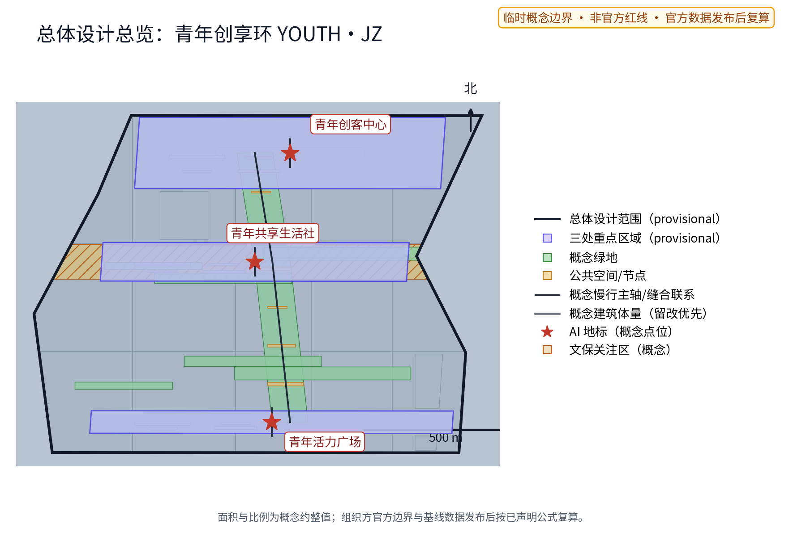
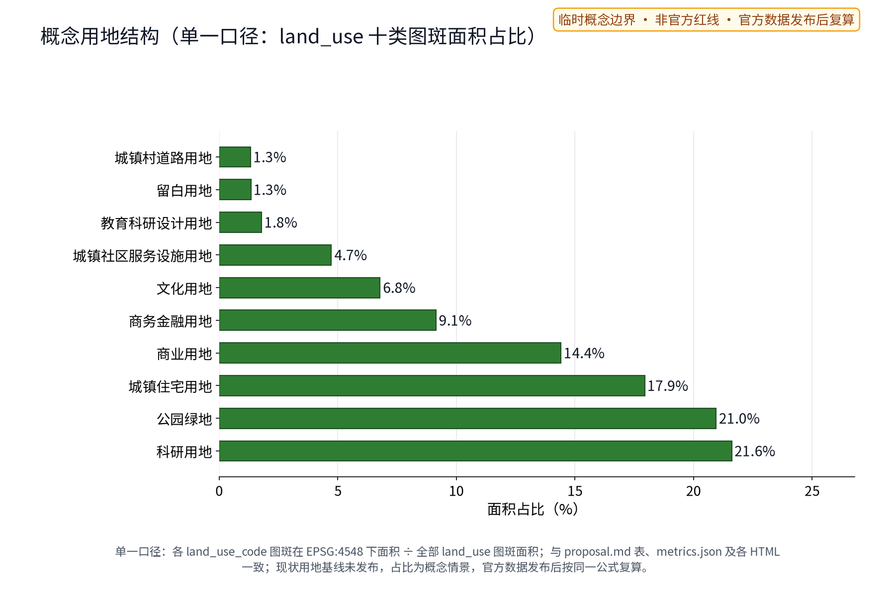
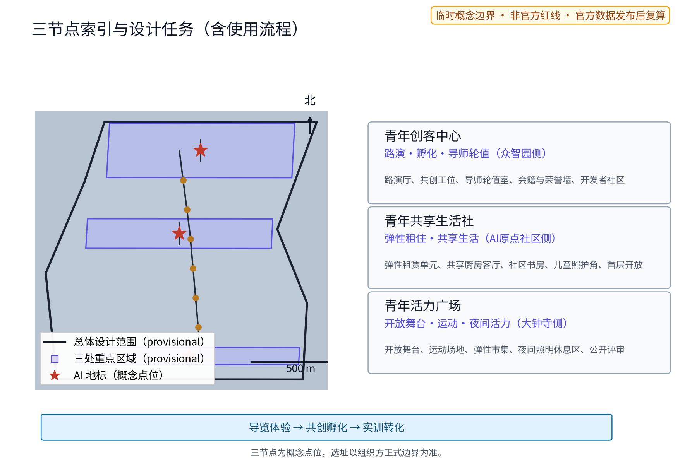
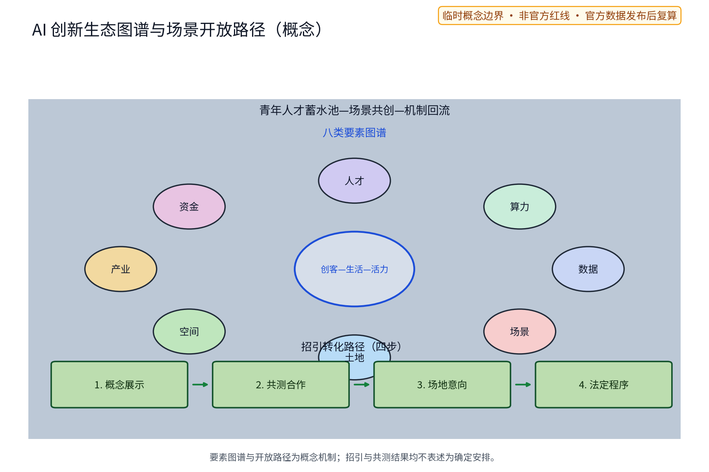
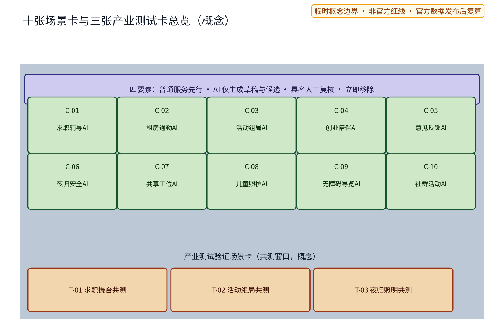
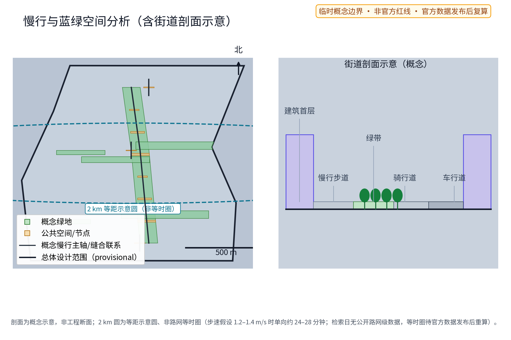
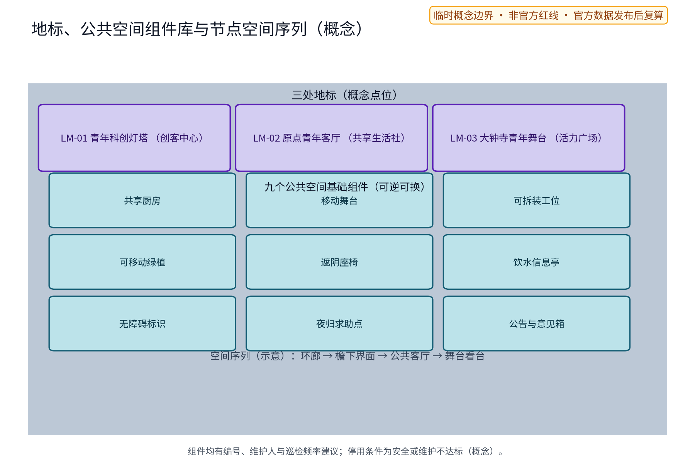
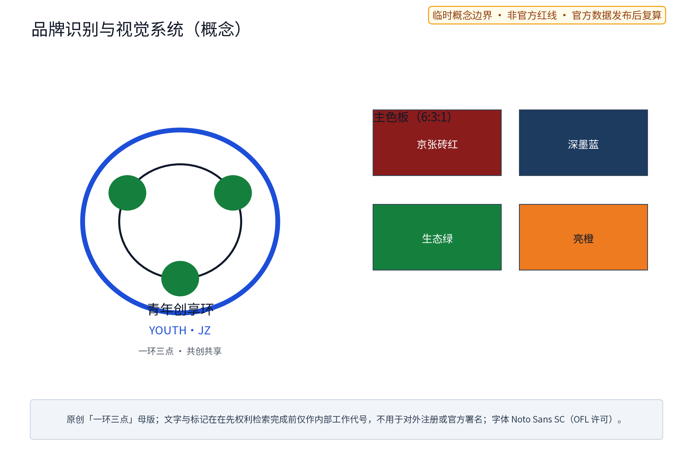
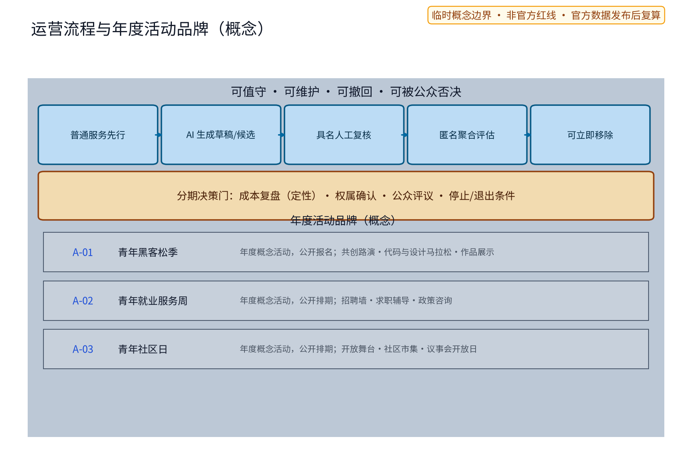
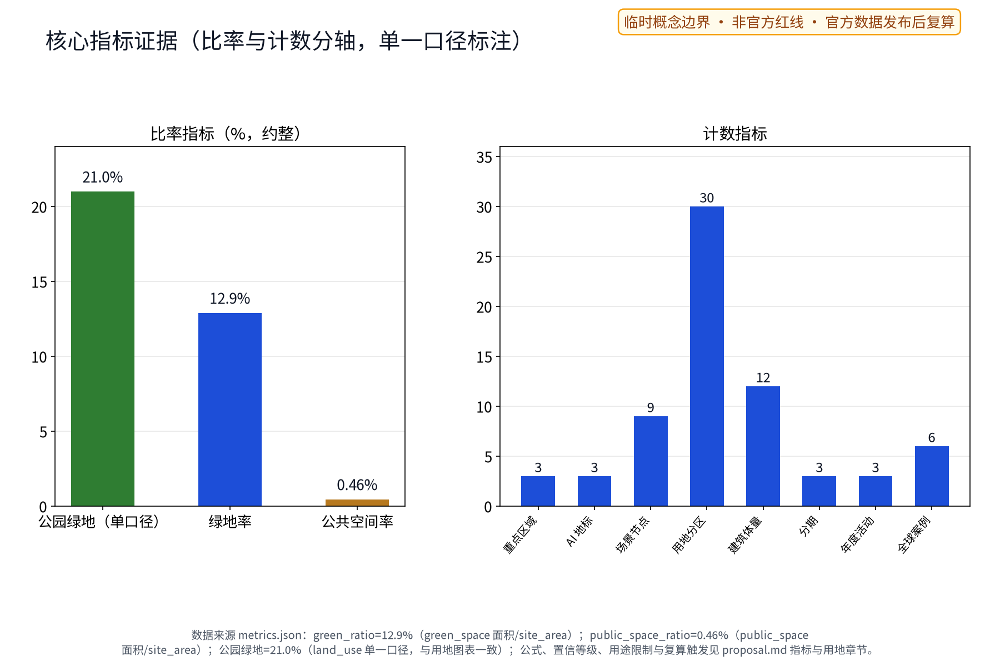

> 本稿为第 38 号方案包"青年创享环 YOUTH·JZ"的中文设计提案草案，对应公开任务书"青年友好公共空间"（youth-friendly-public-space）轨道与面向智能体任务书 agent.3 用户画像中的青年人才维度。方案提出"一社一居一场"三节点体系、十张场景卡（含五类核心 AI+ 场景与五类扩展场景卡）、三张产业测试验证场景卡与五项要素机制概念，全部内容为概念建议、参考方案，供专业团队深化研究，不替代正式规划，不构成政府审定结论；本稿不给出容积率、建筑高度、建筑强度、具体拆改留、租金水平、房源数量、投资测算或工程实施结论，不编造任何官方数据、房源数量、活动场次或政策承诺，不把设想写成已确定安排。

## 设计依据与资料清单

本提案的主控依据依次为：征集任务书摘录，确定三大定位、五大功能、三区两翼布局与 agent.1—agent.6 六项任务要求，以及禁止性边界条款；投稿技能，确定提案的章节结构、证据分层与"概念建议"表述边界；参考样例，确定章节深度与诚实披露风格；任务书全文摘录，核对禁止性表述清单。设计所需场地事实仅采用公开或清权来源：本仓库任务书摘录与投稿技能文件、北京市关于加快发展保障性租赁住房的公开实施方案及官方解读、深圳水围柠盟人才公寓的公开报道与设计机构公开资料、首尔市政府公开的青年住房政策页面、新加坡公共住区社区空间的公开资料、香港青年宿舍计划公开政府页面、青年发展型城市建设试点公开政策方向，以及仅作定向背景的地图语境（若使用，带署名呈现，不推导红线、权属、文保、规划或工程事实）。

当前仓库未提供官方总体边界与重点区多边形。本稿的全部总体与节点设计均基于 provisional 概念几何，标记为 official_boundary=false、geometry_role=provisional_constraint，只用于内容设计与机器校验，不解释为法定红线、权属、规划许可或工程定位；官方图形到位后触发整体复算与替换。现状诊断、精度限制与复算路径收录于本稿相关章节，六个对标案例的逐项来源、许可边界与获取日期登记于 sources.json 与报告版权台账。

| 类别 | 资料 | 用途与性质 |
| --- | --- | --- |
| 任务书 | 面向智能体任务书摘录与全文摘录 | 三大定位、五大功能、三区两翼、agent.1—6、边界条款、禁止性表述清单 |
| 技能 | 投稿技能参考文件 | 提案结构、证据分层、合规表述要求 |
| 样例 | 已披露参考样例 | 章节风格、诚实披露与指标表达参考 |
| 政策 | 北京市保障性租赁住房公开实施方案及解读（官方门户公开发布） | 青年居住政策背景，概念接口依据 |
| 案例 | 深圳水围柠盟人才公寓公开报道与设计机构公开资料 | 存量改造与共享公共空间机制借鉴 |
| 案例 | 首尔市政府公开的青年住房政策资料 | 居住成本可负担与社区空间机制借鉴 |
| 案例 | 新加坡公共住区社区空间公开资料 | 开放底层公共客厅机制借鉴 |
| 案例 | 香港青年宿舍计划公开资料 | 低于市价青年宿舍的政府-机构协作机制借鉴 |
| 案例 | 青年发展型城市建设试点公开政策 | 青年友好城市公共服务接口借鉴 |
| 数据 | 官方边界与重点区几何 | 缺失待补，暂以 provisional 概念几何替代 |

> **证据锚点**：[source:DATA-SRC-OFFICIAL-ANNOUNCEMENT]、[source:DATA-SRC-AGENT-TASKBOOK]（组织方公告与任务书为文本口径依据）。

## 三层范围工作框架

三层范围以一条"问题—空间—运营—证据—退出"责任链贯通。统筹研究范围回答"青年人才资源如何转化为一带公共价值"：青年的就业、居住、创业与归属问题，如何经由产业研究、机制概念与活动体系形成可交付物。总体设计范围将回答落实到"青年创享环"空间结构：一条概念环线串联三节点，叠加青年公共服务网络。重点区域范围把任务落实到三个节点的功能、空间与公共体验界面。三层共用同一套证据口径与 provisional 标记，避免宏观生态、总图与节点设计各说各话。

范围口径统一按官方文本口径表述（以官方公布为准）：统筹研究范围约 43.6 平方公里、总体设计范围约 11.4 平方公里、重点区域约 368.4 公顷。总体范围面积同时以本稿提交的 site_boundary 概念几何在 EPSG:4548 下复算产生，属于低置信度的临时设计模型值：几何为 provisional、official_boundary=false，来源与公式随提交登记，仅用于设计组织与方案篇幅测算；官方边界与控制条件发布后，以官方几何重新复算并替换全部面积类表述。三处重点区范围为公开线索下的概念范围，不构成正式规划面积。

| 层级 | 核心问题 | 本方案的回答 | 主要成果 |
| --- | --- | --- | --- |
| 统筹研究范围 | 青年人才如何成为一带公共价值 | 青年三链（就业—居住—创业）、区域协同、六案例机制借鉴 | 生态接口与长期运营概念 |
| 总体设计范围 | 存量城市如何承载青年友好 | 一环三节点、青年公共服务网络、存量优先更新原则 | 空间结构、更新原则与指标口径 |
| 重点区域范围 | 三处节点如何差异化落地 | 创客中心、共享生活社、活力广场 | 三节点功能空间与公共体验界面 |

> **证据锚点**：[source:DATA-SRC-AGENT-TASKBOOK]（三层范围划分依据任务书官方文本口径）。

## 统筹研究范围产业与未来城市研究

### 本包定位与全带统筹接口（专项界定）

本包为京张AI创新带下的**青年友好专项深化包**，聚焦青年就业—居住—创业议题与青年友好公共服务网络，不对全带所有产业与人群议题作全面统筹——全带统筹仍以组织方总体任务书与官方统筹框架为准。本包在全带框架内的接口有三：其一，承接统筹研究范围的"青年三链"（就业—居住—创业）问题，把全带人才结构中的青年维度专题化；其二，通过三区两翼协同回路（本包三节点与中关村科技服务翼、小月河场景赋能翼）及区域协同专章，与全线产业与空间各专项衔接，不另立与全带相悖的结构；其三，以"专项口径、可并网"为边界，本包所用的单一口径用地结构、指标复算路径与要素机制概念，在官方数据发布后按同一逻辑并入全带统筹成果。本包对 agent.1—agent.6 的六项任务在合规矩阵中逐条映射（见"指标体系、面积复算与合规矩阵"章），均以概念建议、参考方案表述，不替代全带统筹结论。

### 三大定位与五大功能

三大定位在青年维度分别落点为精神传承、生活体验先行与创业就业；五大功能分别对应青年人才蓄水池、场景共创、公共与夜间活力、议事参与样本与开发者社区支撑。

### 三区两翼协同回路与命名识别

三区对应三节点：众智园侧青年创客中心承载共创、验证与辅导，AI原点社区侧青年共享生活社承载居住、生活与社群，大钟寺侧青年活力广场承载展示、运动与夜间活力；中关村科技服务翼与小月河场景赋能翼作为导师、服务与场景测试的概念接口，形成"创客—生活—活力"循环回路（机制概念，不作承诺）。中文名"青年创享环"、英文名 YOUTH·JZ 强调共创共享的环形网络；Logo 方向为原创"一环三点"图形，主色为京张砖红、深墨蓝与亮橙，低眩光、无障碍对比，不照搬任何既有城市、园区或企业标识，品牌系统与组合规范见"品牌识别与视觉系统"一章。

### 对标案例（仅按公开渠道信息概述）

六个案例仅概述公开机制（细节见表），借鉴"存量改造公共产品化""共享公共空间配置""开放底层公共客厅""政策接口与小户型共享导向""政府—机构协作提供可负担住所""青年友好城市服务接口"等机制方向，不照搬案例的产权安排、补贴标准、租金水平与管理模式；数字一律标注公开口径，不转写为本方案承诺；每个案例的发布者、链接、获取日期、具体主张与许可边界逐项登记于 sources.json。

| 案例 | 公开机制概述 | 借鉴要点 | 来源（主张级链接，检索日 2026-08-25） |
| --- | --- | --- | --- |
| 深圳水围柠盟人才公寓 | 公开报道显示其为深圳首个由城中村"握手楼"改造的人才保障房社区试点（深圳新闻网 2017-12-15 口径；学术文献称其为我国第一个将人才住房与城中村更新改造相结合的项目）：保留原有肌理与结构，增设电梯连廊与共享公共空间（青年之家、屋顶花园等），政府出资、国企改造运营、村股份公司筹房协作，政府补贴后约半价定向配租企业青年人才（公开报道口径） | 存量改造公共产品化、共享公共空间、色彩导视 | 深圳新闻网 2017-12-15 报道（链接见 [source:CASE-SHENZHEN-SHUIWEI]）；深圳商报 2018-03-28（szsb.sznews.com/PC/content/201803/28/content_330869.html）；设计机构 DOFFICE 项目页（gooood.cn/lm-youth-community-china-by-doffice.htm） |
| 北京市保障性租赁住房公开实施方案 | 公开实施方案明确保租房面向无房新市民与青年群体、重点保障新毕业大学生等，"十四五"公开目标为建设筹集约四十万套（间）；小户型为主，鼓励共享空间与功能混合 | 政策接口、小户型与共享导向 | 北京市人民政府门户网站（2022年发布） |
| 首尔青年住房政策 | 首尔市政府官方页面显示其面向无房青年提供月度租金补贴（最高约 KRW 20 万/月、一生最多 12 个月），青年安心住宅约为市场价 75–85%、单人共享住宅约为 50–70% 并配置社区共享空间，青年住房邻近公共交通枢纽布局 | 居住成本可负担与社区空间并重 | 首尔市政府英文官方页面：seoul-policy-archive/youth-housing-support/、seoul-policy-archive/tailored-rental-housing-for-vulnerable-households/、policy/urban-planning/housing-construction/（english.seoul.go.kr） |
| 新加坡公共住区活力空间 | 官方与设计机构资料显示组屋底层架空空间为开放、无围栏的有顶社区空间传统（自 1970 年代起），近年出现以共享厨房为核心、面向社区开放的底层公共空间改造实践（GoodLife! Makan，2016 年建成） | 开放底层公共客厅、共享厨房 | 建屋发展局官网设计特征页（hdb.gov.sg/residential/buying-a-flat/finding-a-flat/design-features-for-new-flats）；国家文物局 Void Decks 电子书（2013，nhb.gov.sg）；DP Architects GoodLife! Makan 项目页（dpa.com.sg/projects/goodlife-makan/） |
| 香港青年宿舍计划 | 官方页面显示由政府全额资助非政府机构兴建、建成后由非政府机构自负盈亏运营，租金水平不超过邻近市场租金的六成，面向 18–30 岁在职永久居民；立法会书面答复显示租户每年须参与不少于 200 小时社区或志愿服务，并配套创业培训、身心发展、职场文化等活动 | 政府—机构协作、可负担住所与社群并重 | 民政及青年事务局官方页面（hyab.gov.hk/tc/policy_responsibilities/Social_Harmony_and_Civic_Education/youth_hostel_scheme.htm）；2025-10-15 立法会书面答复（链接见 [source:CASE-HK-YOUTH-HOSTEL]） |
| 青年发展型城市建设试点政策 | 中青联发〔2022〕1号公开文件：中长期青年发展规划框架下、经部际联席会议审议通过的全国性试点政策方向，要求在城市规划、建设、管理全过程体现青年元素并探索青年友好公共服务空间与设施建设标准；2022-06-02 公布首批试点名单（45 个试点城市、99 个试点县域，新华网口径；本方案不推断名单） | 青年友好城市公共服务接口、跨城协同背景 | 中国共青团网官方全文与新华网 2022-06-02 试点名单稿（链接见 [source:CASE-YOUTH-DEVELOPMENT-CITIES]） |

### 区域协同与要素接口（概念）

本节为概念级区域协同专章：所有合作均以"方向性候选对象—要素流—概念接口—阶段—退出条件"表达，不把任何合作写成已确定安排，具体对接须由主管部门与相关主体依法推进。其一，北纬社区（清河街道方向，候选对象）：作为青年居住与社区服务的联动候选，要素流为居住需求、社区服务与夜间通勤客流，概念接口为共享生活社的弹性租住需求清单与夜归路径衔接，阶段建议从需求调研与议事会互访起步，退出条件为权属与管理边界无法达成共识。其二，未来科学城（候选对象）：要素流为青年工程人才、实验室外溢的科技成果与中试需求，概念接口为创客中心的路演与导师轮值资源开放，阶段建议以年度创业路演联办为试点，退出条件为专家与场地资源不匹配。其三，怀柔科学城（候选对象）：要素流为基础研究青年学者、学术会议与科普资源，概念接口为活力广场的开放舞台与科普展示，阶段建议以科普季与青年学者沙龙起步，退出条件为活动主题与本地青年需求错位。其四，经开区（候选对象）：要素流为智能制造与数据产业岗位需求，概念接口为求职辅导AI的公开岗位聚合与就业服务周，阶段建议以岗位信息互换试点，退出条件为数据与隐私边界无法达成一致。其五，京津冀（区域协同背景）：要素流为通勤青年、产业协作与政策试点方向，概念接口为青年服务积分在区域青年活动中的互认探索（概念），阶段建议从年度青年活动联动起步，退出条件为跨行政区政策接口未获批准。所有协同条目均标注"概念、待主管部门确认"，不构成承诺。

### 要素机制（概念）

五项机制概念：弹性租住与押金优化，探索短租期弹性、合租匹配与信用记录、机构担保、分期缴纳等降低一次性押金负担的方向，规则须经法律与主管部门审核；共创会籍，低成本会籍含共享工位、路演与导师轮值机会，规则由运营方与青年议事会共同议定；青年服务积分，自愿参与、匿名聚合，用于时段兑换排序与运营复盘，不进行个体识别式追踪，异常人工复核；青年议事会，定期公开议事，对时段分配、活动内容与机制调整提出建议，决定按法定程序审定；创业导师轮值，依托公开公益导师与服务资源设立，不承诺具体机构与频次；青年志愿服务队作为补充人力接口，参与值守、导览与活动执行，统一纳入培训与排班。

> **证据锚点**：[source:DATA-SRC-PROVISIONAL-BOUNDARIES]（边界为 provisional，研究范围仅作概念示意）。

## 总体设计范围城市更新与控规深度城市设计

总体结构为"一环三节点加公共服务网络"："青年创享环"是一条概念环形慢行与服务结构，串联青年创客中心、青年共享生活社与青年活力广场三个节点，并叠加青年公共服务网络——沿环布置次级服务点（共享自习、问询服务、活动公告与意见收集、夜归值守点）。环线为概念结构而非道路红线，可在官方边界到位后整体重定位，不预设道路线形与交叉口工程。南北贯通由沿京张遗址公园绿带的概念慢行主轴承担，东西缝合由三处跨绿带的概念联系路径承担，二者共同构成创享环的贯通骨架（概念联系，不断言道路改造）。

更新策略为存量优先、渐进更新与可逆轻改造：优先识别可保留与可轻改的建筑与空间，以可逆部件（共享厨房、移动舞台、可拆装工位、可移动绿植）承载功能，不以大规模拆除为前提；具体保留、适配、移位或删除均须在现状、权属、文保、结构、消防与无障碍调查后由专业团队逐一判断，本稿不给具体地块的拆改留结论。

控规深度以"问题—空间对象—指标—资料缺口—复算路径"表达：本稿可提供的空间对象与概念指标均基于 provisional 几何，面积与比率类指标以提交几何复算并标记低置信度与官方复算触发条件；容积率、建筑高度、建筑强度等依赖未公开官方控制条件的指标保持待确认，不以概念方案替代控规审批。

| 设计层 | 空间对象（概念） | 状态与复算路径 |
| --- | --- | --- |
| 总体结构 | 青年创享环（概念环线，南北贯通主轴+东西缝合联系） | provisional 几何，官方数据发布后重定位复算 |
| 节点 | 三节点概念包络地标 LM-01/02/03 | provisional，待现状与权属调查后逐一判断 |
| 网络 | 次级服务点（共享自习、问询、夜归值守） | 概念点位，可整体移位 |
| 指标 | 面积与比率类 | provisional 复算；强度类待官方控制条件 |

> **证据锚点**：[source:DATA-SRC-MOHURD-CONTROL-DETAILED-PLANNING]、[source:DATA-SRC-PROVISIONAL-BOUNDARIES]。

## 重点区域详细设计

### 青年创客中心（众智园侧）

功能上，面向 AI 青年创业者与开发者的共创空间，承载路演、孵化辅导、导师轮值与共创会籍四项功能，承接众智园全栈体系的青年测试验证界面，并作为开发者社区的概念锚点：定期开放技术分享、黑客松预热与作品展示，公开报名、人工审核。空间上，概念包络含路演厅、共创工位区、导师轮值室与会籍服务台，优先嵌入可保留建筑或采用可逆轻改造，低层化、耐久可修。公共体验界面上，沿街通透界面与可开启路演区使公开活动向公共空间开放；设荣誉展示墙，经授权后展示开发者与共创者的公开成果；无门票、时段可预约，活动内容由运营方与青年议事会共同议定。

### 青年共享生活社（AI原点社区侧）

功能上，弹性租住与共享生活单元，承载合租匹配、共享厨房客厅与社群运营，以公开保障性租赁住房政策背景作为概念接口（不承诺具体支持）。空间上，概念包络含弹性租赁单元（存量改造适配、户型以小户型为宜的概念倾向）、共享厨房与公共客厅、洗衣晾晒区、社区书房；首层参考开放公共客厅原型组织，边界通透不设围栏。公共体验界面上，首层公共客厅向社区开放、不设门禁，公告墙公布社群活动日历、服务班表与意见渠道，租住区与公共区分区管理，保障居住安宁与夜间安静；儿童照护角与无障碍通道纳入首层公共空间概念（面向青年家庭与照护者）。

### 青年活力广场（大钟寺侧）

功能上，开放舞台、运动社交与夜间活力场，作为大钟寺AI产业集聚区面向公众的体验与展示界面。空间上，概念包络含开放舞台、运动场地、弹性市集区与夜间照明休息区；舞台与场地采用可拆装组件，夜间照明与慢行路径一体化布置。公共体验界面上，无门票、时段可预约，活动内容公开评审（青年议事会建议、运营方审定）；夜间活力以安全、值守与噪音控制为前提，避免过度商业化与低俗化，夜间开放时段与临近居住界面分区管理。

### 地标、荣誉与公共空间组件库（概念）

三处朝圣地标按编号对象约定：LM-01 青年科创灯塔（创客中心顶层概念地标，承载作品展示与全景导览，众智园侧）；LM-02 原点青年客厅（共享生活社首层共享客厅地标，透明界面与社区公告墙，AI原点社区侧）；LM-03 大钟寺青年舞台（活力广场开放舞台地标，可拆装舞台与夜间照明一体化，大钟寺侧）。三处地标均为概念对象，对应 geometry/public_space.geojson 中的 ai_landmark 图斑，具体形态待官方边界与风貌控制后深化。荣誉展示体系按"授权—展示—复核—撤换"流程运行，不预设获奖名单。公共空间组件库采用耐久可修、可逆可换原则：共享厨房、移动舞台、可拆装工位、可移动绿植、遮阴座椅、饮水信息亭、无障碍标识、夜归求助点、公告与意见箱为九个基础组件，组件均有编号、维护人与巡检频率建议，停用条件为安全或维护不达标（概念）。

### 场地独有形态与原型验证（概念）

为避免落入可任意替换的通用空间模板，本包为三节点各提取一组**场地独有形态语言**（概念，待官方边界与现状图到位后以实测核验）：创客中心呼应京张遗址公园绿带的线性地景与工业尺度，以"檐下长界面"组织沿街路演与展示；共享生活社回应 AI 原点社区临街住宅界面，以"透明首层+架空公共客厅"构成社区可读的地标形象；活力广场借用大钟寺片区轨道高架与站城界面的框景关系，以"舞台—看台—灯架"形成夜间识别。三组形态语言均以组件实现、可拆装可撤回，不预设永久大体量构筑。原型验证的边界与节奏以「可撤回原型期」为概念机制：新场景/组件先以小规模、限期、可逆原型试验，经公开活动实测与匿名聚合评估后再决定保留、调整或撤除；原型期不表述为已建成、已批准或已实施，关键评估结论由青年议事会与专业团队共同复核。三地标、九个组件、十张场景卡与三张产业测试卡构成可延展的产品族，原型验证机制使场地适配与复用之间保持可检验的迭代闭环。

| 节点 | 功能 | 空间（概念） | 公共体验界面 |
| --- | --- | --- | --- |
| 青年创客中心 | 路演、孵化辅导、导师轮值、共创会籍、开发者社区 | 路演厅、共创工位、导师轮值室、会籍服务台、荣誉展示墙 | 通透界面、开放路演、无门票 |
| 青年共享生活社 | 弹性租住、合租匹配、共享厨房客厅、社群运营 | 租赁单元、共享厨房客厅、社区书房、儿童照护角 | 首层公共客厅开放、公告墙、分区管理 |
| 青年活力广场 | 开放舞台、运动社交、夜间活力 | 舞台、运动场地、弹性市集、夜间照明休息区 | 无门票、时段预约、公开评审、安全值守 |

> **证据锚点**：[data:PACKAGE-GEOMETRY]（三节点示意多边形来自本包 geometry/key_areas.geojson）。

## AI 创新生态、人才画像与 AI+ 场景

AI 创新生态以"青年人才蓄水池—场景共创—机制回流"组织，并显式建立要素图谱：土地—空间—产业—资金—人才—算力—数据—场景八类要素沿"创客—生活—活力"回路流动，创客中心承接众智园体系的测试验证界面，共享生活社以真实生活问题反哺场景清单，活力广场承担公共体验与展示；中关村科技服务翼、小月河场景赋能翼与区域公开协同资源作为要素接口（机制概念，不作承诺）。产业支撑采用"场景开放"路径：三张产业测试验证场景卡向园区企业开放共测窗口（见下表），招引转化路径按"概念展示—共测合作—场地意向—法定程序"四步表达，不把任何招引结果写成确定安排。

用户画像共六类人才（见下表），仅作为服务差异设计依据，不作人口统计推断，不用于任何个体识别。

| 画像 | 核心需求 | 对应场景卡 |
| --- | --- | --- |
| 应届毕业生 | 求职、过渡居住、通勤适应 | 求职辅导、租房通勤 |
| 青年AI开发者 | 共创、技术交流、夜归 | 活动组局、创业陪伴、共享工位 |
| 自由职业者 | 弹性空间、共享办公与社交 | 活动组局、意见反馈、共享工位 |
| 青年创业者 | 路演、辅导、会籍 | 创业陪伴、意见反馈 |
| 青年家庭 | 稳定租住、社区生活与儿童照护 | 租房通勤、意见反馈、儿童照护 |
| 泛青年夜归人群 | 夜间路径安全与夜间活力 | 夜归安全、意见反馈 |

十张场景卡要点均遵循"普通服务先行、AI 仅生成草稿与候选、具名人工复核、立即移除"四要素，细节见下表：任何场景在隐私、来源或人工复核不满足时立即移除，测试与试点不表述为已批准运营。扩展场景卡与核心场景卡同等受四要素约束。

| 编号 | 场景卡 | 普通服务先行 | AI 辅助（草稿/候选） | 具名复核角色 | 移除条件 |
| --- | --- | --- | --- | --- | --- |
| C-01 | 青年求职辅导AI | 就业服务窗口、招聘信息墙 | 公开岗位聚合、简历资料检索草稿 | 就业服务专员 | 推断敏感属性或差别排序 |
| C-02 | 租房通勤导览AI | 租赁服务台、公开房源册 | 公开房源与通勤信息核对清单 | 租赁服务专员、轮值咨询 | 代替合同或法律判断 |
| C-03 | 活动组局AI | 实体公告板、活动总台 | 自愿登记的匿名兴趣标签撮合建议 | 社区主持人 | 时间地点或权利未核实 |
| C-04 | 创业陪伴AI | 导师轮值室、政策资料架 | 公开政策摘要、路演提纲草稿、导师候选 | 轮值导师 | 给出融资或许可结论 |
| C-05 | 意见反馈AI | 意见箱、议事会现场 | 去标识意见主题聚类、转派建议 | 议事会秘书、街区运营负责人 | 隐藏少数意见或生成个人画像 |
| C-06 | 夜归安全AI | 实体求助点、值守台 | 公开照明与值守时段地图草稿 | 夜归值守负责人 | 推断个体行踪 |
| C-07 | 共享工位AI | 共享工位台、纸质预订册 | 空闲工位时段候选列表 | 创客中心管理员 | 与个人信息绑定排序 |
| C-08 | 儿童照护AI | 照护角现场登记、公告单 | 照护时段与志愿者候选建议 | 照护角负责人 | 涉及儿童个体识别 |
| C-09 | 无障碍导览AI | 纸质导览图、人工问询台 | 无障碍路径与设施核对清单 | 无障碍服务专员 | 替代无障碍设施核验 |
| C-10 | 社群活动AI | 活动总台、公告板 | 活动主题聚合与排期草稿 | 活动运营专员 | 未核实场地与许可 |

三张产业测试验证场景卡（对应 metrics 中 industry_test_scenario_count=3 的编号对象），面向企业与科研机构的公开共测窗口，均为概念验证安排、不表述为已批准运营：

| 编号 | 产业测试验证场景 | 测试对象 | 验证内容 | AI 产物与工具 | 复核与数据边界 | 停止条件 |
| --- | --- | --- | --- | --- | --- | --- |
| T-01 | 求职撮合共测窗口 | 园区招聘企业与应届毕业生 | 公开岗位与技能标签聚合准确率 | 岗位匹配候选清单（仅草稿） | 就业服务专员复核；仅匿名聚合 | 准确率低于阈值或个人画像出现 |
| T-02 | 活动组局共测窗口 | 活动主办方与场地运营方 | 活动排期与场地冲突检查 | 排期候选方案（仅草稿） | 活动运营专员复核；去标识 | 场地权利未核实 |
| T-03 | 夜归照明共测窗口 | 照明维护单位与高校课题组 | 公开照明点位与值守时段核对 | 照明地图草稿（仅草稿） | 值守负责人复核；不追踪个体 | 与个体行踪关联即停 |

场景与空间运营映射：求职辅导AI对应创客中心就业服务台；租房通勤导览AI对应共享生活社租赁服务台；活动组局AI对应活力广场活动总台与三节点公告墙；创业陪伴AI对应创客中心导师轮值室；意见反馈AI对应三节点意见箱与青年议事会；夜归安全AI对应夜归值守点；共享工位AI对应创客中心共享工位台；儿童照护AI对应共享生活社照护角；无障碍导览AI对应三节点问询台；社群活动AI对应活力广场活动总台。隐私与人工复核边界：数据仅匿名聚合用于运营复盘，不进行个体识别式追踪，不做个人画像排序，全程保留免登录的普通服务等价路径；治理维度包括交通、产业、空间、公共服务、文化与议事文化的公共接口（概念）。

#### AI 技术协议（概念阶段：模型评测 / 数据质量 / 误差分群 / 运行监测）

多数 AI 辅助功能属于聚合、草稿与候选建议，尚未形成统一技术协议；为避免将算法行为当作黑箱，本方案在概念阶段即提出四项技术协议框架（均为待专业团队深化执行的框架，不作为已建成系统承诺）：

| 条目名称 | 概念阶段要求 | 数据边界与触发 |
| --- | --- | --- |
| 模型评测 | 每项 AI 辅助功能以"基准任务集"评测：任务集由普通服务记录的去标识样本构成，不新增采集；指标含准确率、完成率、误报率与漏报率；按功能名登记运营档案 | 评测档位分"概念基线—共测试点—正式界面"三级；未达阈值不进入正式界面；阈值在共测期与具名复核人共同确定 |
| 数据质量 | 数据仅来自公开信息与用户主动提供的匿名输入；质量项含来源可溯（聚合结果附来源页）、更新日期、去标识程度、样本量下限 | 质量不达标数据不进入候选生成；来源失效即从候选列表移除 |
| 误差分群 | 每周将复核发现错误按"来源类型（网址失效/时效过期/解析错误/语义偏差/复核误判）×场景功能"双维分群并出具误差清单 | 分群结果仅用于修正候选生成规则，不用于任何个体画像或个体排序 |
| 运行监测 | 记录匿名聚合运行指标：调用量级、复核率、移除次数、异常波动时段；仅用于运营复盘 | 准确率回归或异常波动触发人工复核通道，必要时按立即移除条款停用；监测数据与个人无关 |

四项协议与"普通服务先行—AI 生成候选—具名人工复核—可立即移除"统一模板一致：测试与试点均不表述为已批准运营，任何协议项不达标即按移除条件退出。

#### 空间反馈—运营评估—规划调整闭环与共测基线（概念）

为回应"AI 目前主要生成摘要、草稿和候选、尚未形成空间反馈—运营评估—规划调整闭环"的评审意见，本包提出概念级闭环模型（非已建成系统，不作为技术承诺）：场景卡的 AI 输出仅生成摘要、草稿与候选清单；经具名人工复核后被采纳的运营动作（时段分配、空间预约、活动排期）产生匿名聚合使用数据；这些数据按周期进入运营评估（误差分群、复核率、阈值达标情况，均不针对个体）；评估结果作为规划与运营建议反馈给青年议事会与专业团队，由其作关键规划调整决策；调整再回到场景配置与空间布局，形成「使用—评估—调整」的可撤回闭环。闭环中 AI 只提供证据与候选，任何空间与规划调整均由人工与专业团队决定。共测基线（概念）：以普通服务记录的去标识样本建立三级档位（概念基线—共测试点—正式界面），阈值在共测期与具名复核人共同确定；官方基线数据（客流、运营成本等）发布后再以实际数据校准基线，校准前不把任何共测成绩表述为正式指标。

> **证据锚点**：[source:DATA-SRC-GENERATIVE-AI-INTERIM-MEASURES]（AI 生成内容治理表述的参照依据）。

## 用地、建筑规模与拆改留方案

用地表达采用概念分区并完整覆盖 provisional 总体范围（geometry/land_use.geojson 十类图斑面积合计约等于提交总体范围面积）：三节点为核心用地概念，环线两侧为公共服务网络点，其余为既有功能延伸区；概念分区不改变法定用地性质，官方控规到位后以同一逻辑重切复算。**用地结构为单一口径**：正文、图件（land-use-structure 中英）、本表、metrics.json 中 land_use_share_*（十项） 与两版 HTML 均采用同一分类与同一占比数值，公式为「各 land_use_code 图斑在 EPSG:4548 下的投影面积 ÷ 全部 land_use 图斑面积合计」；置信等级为低（因总体边界与用地基线均为 provisional），复算触发为「官方边界、控规用地、绿地蓝线与权属资料发布后，以官方几何按同一公式整体复算替换」。十类概念分区占比（约数，合计约 100%）：城镇住宅用地约18%、城镇社区服务设施用地约5%、科研用地约22%、文化用地约7%、商业用地约14%、商务金融用地约9%、教育科研设计用地约2%、城镇村道路用地约1%、公园绿地约21%、留白用地约1%。

| 用地代码（概念） | 类别名称 | 分区图斑数 | 面积占比（约，单一口径） |
| --- | --- | --- | --- |
| 0802 | 科研用地 | 3 | 约 21.6% |
| 1401 | 公园绿地 | 14 | 约 21.0% |
| 0701 | 城镇住宅用地 | 3 | 约 17.9% |
| 0901 | 商业用地 | 3 | 约 14.4% |
| 0902 | 商务金融用地 | 1 | 约 9.1% |
| 0803 | 文化用地 | 2 | 约 6.8% |
| 0702 | 城镇社区服务设施用地 | 1 | 约 4.7% |
| 0804 | 教育科研设计用地（概念） | 1 | 约 1.8% |
| 16 | 留白用地（概念） | 1 | 约 1.3% |
| 1207 | 城镇村道路用地（概念） | 1 | 约 1.3% |

口径边界说明：metrics.json 中 green_ratio（约 12.9%）与 public_space_ratio（约 0.46%）为另一几何口径——green_space 图斑面积与 public_space 节点地块面积分别除以 site_area 的复算值，与上表 land_use 分区口径对象不同；本方案不复用上表之外的任何用地比例口径，避免同一概念分区出现两种占比。上表全部数值为 provisional 低置信度约数，官方数据发布后统一复算替换。

建筑规模方面，本稿以"存量优先、低层为宜"的概念倾向表达设计意图，不给出容积率、建筑高度、建筑基底面积与总建筑规模等数值承诺；建筑包络概念（路演厅、共享厨房客厅、开放舞台等部件）仅作功能组织示意，正式高度、退线、密度与消防由后续专业设计依据控规与调查确定，属待确认状态。

拆改留执行四步原则：先核实现状与权利；满足安全、文保与功能时保留；需要无障碍、消防、节能与服务界面改善时轻改；不满足安全或与保护要求冲突时移位或删除概念部件。没有调查就不提出拆除面积与拆除结论；具体地块的保留、改建与拆除判断由专业团队依据实测与权属调查作出，本稿不预判、不给具体地块拆改留方案。

> **证据锚点**：[source:DATA-SRC-MNR-LAND-USE-CLASSIFICATION-202311]（用地分类名称参照现行国标口径）。

## 交通、轨道、市政与公共服务设施

本稿不给道路线形、轨道线位、桥隧、市政管线与工程量结论，仅提出概念组织原则。核心概念是夜归慢行照明与安全路径一体化设计：以三节点及创享环为主体，将连续照明、视线通透、夜间导视、求助与值守串联为一个整体。其一，照明连续而分级——主路径保持连续照明，交叉口与节点做识别照明强化，避免眩光与暗角；其二，路径两侧保持视线通透，消除暗角与死角，绿化与设施布置不遮挡观察；其三，沿线设置求助点，以实体按钮、电话与人工值守界面构成免 App 求助通道；其四，夜间导视与开放时间信息在熄灯后仍可读；其五，夜间活力场与居住界面以分区与时段管理控制噪音，照明、绿化与公共空间一体化布置而非叠加布置。照明、治安、应急等市政职责的衔接与实施由主管部门决定，本稿不给工程参数与实施结论。

交通组织上，三节点概念性衔接既有轨道与公交站点及慢行网络（不断言线位与站点改造），南北贯通主轴与东西缝合联系构成创享环骨架，停车与接驳以现状条件核实为前提。公共服务设施以"青年服务驿站"为概念单元：问询、饮水、充电、共享设施、公告与意见收集，配套资产编号、维护人、巡检频率与停止使用条件；夜归服务点（深夜值守界面）以人员、安全与维护条件成熟为前提弹性开设，可随时关闭。

> **证据锚点**：[source:DATA-SRC-MOHURD-URBAN-DESIGN-MEASURES]（市政与慢行设计表述的方法参照）。

## 蓝绿空间、公共空间与城市风貌

蓝绿空间以"三庭一园一带"概念组织：创客中心绿庭、共享生活社社区花园、活力广场林荫广场，加环线两侧绿带与口袋节点；屋顶与共享空间可承载社区种植等轻活动（概念）。概念绿地率与公共空间率均以 provisional 几何复算并标记低置信度，官方数据发布后复算替换。

公共空间构建"青年十五分钟公共生活圈"（概念命名，非已核验等时圈）：以三节点为核心，连续的步行路径串联遮阴座椅、饮水信息、无障碍标识、活动公告与共享组件；"十五分钟"为本方案的服务圈概念命名，不代表已按步速与路网核验的等时圈——本方案不将 2 km 示例半径直接等同于 15 分钟步程，等时圈须待官方路网与交叉口数据发布后按实际路网重算（检索日 2026-08-25 无公开路网级数据）。公共组件采用耐久可修、可逆可换原则，不依赖屏幕与网络即可完整使用，视觉导视采用原创配色体系的高对比无障碍设计。无障碍与包容性路径：三节点与主要公共路径均保留免登录人工服务等价路径，规划坐轮椅的肢体残障人士与残疾人专用无障碍通道、感官障碍人士的触觉与听觉导视（概念）、低数字能力人群的纸质等价信息、非青年居民与老年居民的全龄友好公共空间、在校学生与应届毕业生共享的公共阅读位、夜间从业者与通勤人群的夜归路径，儿童照护者的照护角；残疾人、儿童、老年人、照护者与夜归人群的使用路径在运营手册中单独核验（概念）。

城市风貌以京张铁路遗产的朴素工业尺度为底，青年活力以克制用色与清晰界面呈现：低眩光夜景、耐久材料、连续檐下空间与清晰公共入口，不以"AI 造型"或霓虹表皮为目标。色彩导视借鉴案例的色彩识别机制而非照搬形象，使用本方案原创配色。文化叙事以"百年京张的青年工程精神—中关村创新文化—当代青年创客文化"为主线：京张铁路由青年为主的工程团队自主修筑是公开历史事实，本稿以精神传承而不是造型复刻来表达，不歪曲历史，不把文化当作科技装饰或口号。

> **证据锚点**：[source:DATA-SRC-MOHURD-URBAN-DESIGN-MEASURES]（蓝绿空间组织的方法参照）。

## 品牌识别与视觉系统（概念）

品牌系统以"一环三点"为母版：原创 Logo 图形为三点沿环线布置的青年剪影抽象符号，中文名"青年创享环"、英文名 YOUTH·JZ 组合使用；主色为京张砖红（象征百年京张工业记忆）、深墨蓝（象征科技与夜间视野）、亮橙（象征青年活力与夜间安全识别），三色按 6:3:1 组合规范使用，低眩光、高对比、无障碍友好。应用规范含 Logo 母版、最小尺寸、安全距离、正负形版本、禁则示例，导视系统按"方向—设施—活动—安全"四类生成导视样例（概念），跨媒介延展含墙面、地面、灯箱、公告板与数字屏（不依赖网络即可阅读）。国际传播文案以"Work. Live. Shine. — Youth Co-Creation Loop on the Centennial Jing-Zhang AI Belt"为概念口号，英文简称 YOUTH·JZ 与中文主名并列使用，国际传播内容发布前经人工审核（概念）。

**品牌在先权利与使用边界**：本稿全部名称为概念阶段原创命名（青年创享环、YOUTH·JZ、Logo 母版与导视样例均未完成官方商标检索）。在在先权利检索与清权完成前，上述名称与标记一律作为内部工作代号处理，不用于对外注册、商业化发布或官方署名；对外使用前须完成在先权利检索与清权，必要时整体替换名称与视觉母版。自产品牌资产逐项登记于报告版权与资产台账与 sources.json，明确复用边界；对可能构成在先权利冲突的任何既有标识、名称与版式，本稿不复制、不拼贴、不断言无冲突，由正式使用方在清权后依法确认。

> **证据锚点**：[source:DATA-SRC-AGENT-TASKBOOK]（命名与品牌方向对应任务书 agent.1/agent.5 要求）。

## 更新项目清单、实施政策与分期计划

项目清单按三类组织，均以现状、权属、安全与维护条件调查为前提，本稿不给投资测算与审批判断：共创空间类——青年创客中心（路演厅、共创工位、导师轮值室等概念包络）与沿环共享自习位；生活配套类——青年共享生活社（弹性租赁单元存量适配、共享厨房客厅、社区书房）与夜归服务点；活力运营类——青年活力广场（开放舞台、运动场地、弹性市集）与活动组局、青年议事会运营机制。

| 类别 | 代表项目（概念） | 内容要点 |
| --- | --- | --- |
| 共创空间类 | 青年创客中心、共享自习网络 | 路演、工位、导师轮值、会籍、荣誉展示、开发者社区 |
| 生活配套类 | 青年共享生活社、夜归服务点 | 弹性租住、共享厨房客厅、社区书房、深夜值守界面 |
| 活力运营类 | 青年活力广场、活动与议事机制 | 开放舞台、运动、弹性市集、组局与议事会 |

分期实施为概念节奏：近期（1—3年）以"一社一居一场"试点起步，选择场地与权属条件成熟的一个或两个节点先行开放，同步试点青年议事会、共创会籍与青年服务积分机制；中期（3—5年）完善青年公共服务网络，加密服务点、连通夜归安全路径、扩展 AI 场景测试清单；远期（5—10年）实现青年创享环全线贯通与跨区联动，沉淀年度活动体系与运营品牌资产。任一期均以"可值守、可维护、可撤回、可被公众否决"为开放前提，不把概念节奏写成已确定安排。年度活动品牌表（对应 metrics 中 annual_program_count=3 的编号对象）：

| 年度活动品牌 | 时间与形态（概念） | 内容要点 | 牵头与协作 | 停止条件 |
| --- | --- | --- | --- | --- |
| A-01 青年黑客松季 | 年度概念活动，公开报名 | 共创路演、代码与设计马拉松、作品展示 | 创客中心牵头，开发者社区与高校协作 | 参与与安全条件不满足即停 |
| A-02 青年就业服务周 | 年度概念活动，公开排期 | 招聘墙、求职辅导、政策咨询 | 就业服务台牵头，企业与高校协作 | 岗位信息无法核验即停 |
| A-03 青年社区日 | 年度概念活动，公开排期 | 开放舞台、社区市集、议事会开放日 | 活力广场牵头，社区与志愿团队协作 | 场地与值守条件不满足即停 |

试点执行表（概念、可执行化起点）：每个试点均须先完成前置调查（现状、权属、文保、结构、消防、无障碍），成本等级采用定性分级（低、中、高三档，不给出投资额），维护频率按月/季/年分级，数据最小化按"仅匿名聚合"执行，关键决策人工复核，无障碍替代为免登录人工等价路径，KPI 为运营基线（待公开基线数据发布后设定基准值），投诉与申诉经意见箱与青年议事会逐条处理，停止条件为安全、维护或公众否决任一触发即撤收。

**分期决策门与基线设定流程（概念）**：每一分期在进入下一期前设置决策门，门内复核成本复盘（定性）、权属确认、公众评议记录与停止/退出条件触发情况，门可通过后进入下一期，不通过则维持或撤回（概念，非政府审批）。试点 KPI 的基线以"共测基线"流程设定（见"AI 创新生态"章的共测基线条目）：先以普通服务去标识样本建立运营基线，官方基线数据发布后校准；任一试点在交通、消防、文保、权属或预算专项核验完成前不表述为可实施状态。

| 试点项目 | 牵头 | 协作 | 前置调查 | 成本等级 | 维护频率 | 数据最小化 | 人工复核 | 无障碍替代 | KPI | 投诉与申诉 | 停止条件 |
| --- | --- | --- | --- | --- | --- | --- | --- | --- | --- | --- | --- | --- |
| 创客中心试点 | 运营方（概念）：街区运营负责人 | 众智园园区、专业团队、青年议事会、高校志愿者 | 现状、权属、文保、结构、消防、无障碍 | 中（定性） | 月度巡检+年度复算 | 仅匿名聚合 | 就业服务专员、轮值导师 | 免登录人工服务等价路径 | 共创活动达成率等（基线待公布） | 意见箱+议事会逐条处理 | 安全/维护不达标或公众否决 |
| 共享生活社试点 | 运营方（概念）：住房与社区服务接口主体 | 保障性住房政策接口部门、社区、专业团队 | 现状、权属、结构、消防、无障碍、居住安宁 | 中（定性） | 月度巡检+年度复算 | 仅匿名聚合、不追踪个体 | 租赁服务专员、社区主持人 | 纸质公告+人工问询 | 共享空间使用率等（基线待公布） | 意见箱+议事会逐条处理 | 居住安宁投诉未改善或公众否决 |
| 活力广场试点 | 运营方（概念）：公共空间运营主体 | 大钟寺片区、公安与街道、志愿团队 | 现状、消防、声环境、夜间安全 | 中（定性） | 每周巡检+年度复算 | 仅匿名聚合 | 活动运营专员、值守负责人 | 无门票实体通道 | 夜归安全感知等（基线待公布） | 意见箱+议事会逐条处理 | 噪音/安全投诉未改善或公众否决 |

实施政策仅作机制建议：将北京市公开的保障性租赁住房政策方向与存量改造导向作为背景接口（不承诺具体支持与房源）；空间与机制的调整由青年议事会提出建议，并按法定程序由主管部门审定；不把政策、资金与招商安排写成确定承诺。

> **证据锚点**：[source:DATA-SRC-AGENT-TASKBOOK]（分期与实施条目对应任务书要求）。

## 指标体系、面积复算与合规矩阵

指标分三类：可从提交几何复算的概念指标；依赖未公开官方控制条件、保持待确认的指标；需运营基线后设定的绩效指标。三项 formal 核心视觉指标说明如下。site_area_sqm：以本稿提交的 site_boundary 概念几何在 EPSG:4548 下投影复算；green_ratio：以 green_space 面积除以 site_area；public_space_ratio：以 public_space 面积除以 site_area。由于官方总体边界与重点区几何尚未发布或清权，上述几何全部为 provisional_constraint、official_boundary=false，对应数值为低置信度临时设计模型值（本稿正文与图件一律作约数与区间表达），公式与来源随提交登记；复算触发条件为：官方边界与控制条件发布后，以官方几何重新复算并替换全部面积与比率表述；未复算前，任何此类数值不得用于法定面积、评分性结论或对外正式口径。容积率、建筑高度、建筑强度等指标保持未知（value null），原因：依赖未公开的官方控制条件，公布后复算。

| 指标 | 口径（概念） | 状态 | 复算路径 |
| --- | --- | --- | --- |
| site_area_sqm | site_boundary 投影面积 | provisional 低置信度 | EPSG:4548 复算，官方边界发布后替换 |
| green_ratio | green_space 面积 / site_area | provisional 低置信度 | 同左 |
| public_space_ratio | public_space 面积 / site_area | provisional 低置信度 | 同左 |
| 容积率、建筑高度、强度 | — | 未知（value null） | 官方控制条件发布后复算 |
| 概念计数类 | 三节点、十张场景卡、三张产业测试卡、六类画像、六个案例、三地标、三年度活动品牌 | 本稿口径可复核 | 随提交结构化记录 |

合规矩阵：三大定位、五大功能、三区两翼与 agent.1—agent.6 六项任务在本稿逐条映射——agent.1 对应命名与识别、总体结构与三区两翼回路；agent.2 对应六项案例研究、要素生态图谱与要素机制（均为概念）；agent.3 对应六类画像、十张场景卡、三张产业测试卡、场景—空间—运营映射与隐私边界；agent.4 对应三节点公共空间、三处地标与荣誉展示、组件库概念；agent.5 对应京张—中关村—AI 新文化叙事、品牌识别系统与国际传播概念；agent.6 对应三类项目、分期节奏、年度活动品牌与议事会、活动组局等运营机制概念。全部条目声明"概念建议、参考方案"属性，符合任务书禁止性边界，不出现过度监控、个体识别式追踪、伪造数据或把设想写成已确定安排的表述。

> **证据锚点**：[metric:green_ratio]、[metric:public_space_ratio]、[source:PACKAGE-GEOMETRY]。

## 风险、版权与合规说明

主要风险与应对：provisional 边界被误读为官方红线——所有几何与面积保持 provisional 标记并声明官方数据发布后的复算触发条件；官方数据缺口导致指标失效——强度类指标保持未知并说明原因，不制造精确感；积分与场景数据出现个体识别式使用——数据仅匿名聚合、人工复核，保留免登录普通服务等价路径，任何场景可立即移除；公共空间缺乏值守与维护而闲置——以"可值守、可维护、可撤回、可被公众否决"为开放前提；夜间活力引发扰民与公平性质疑——时段与声景管控、全龄开放、意见通道公开透明；概念被表述为已确定安排——所有机制与节奏一律以"概念""建议""试点"表述，人类与专业团队拥有最终判断。

版权与生成方法披露：本稿文字、概念图形与表格由投稿者与 AI 协作原创，生成方式、工具与授权范围随提交登记；六个对标案例仅按公开渠道信息概述其机制，不复制、转载或拼贴受版权保护的图片、Logo、版式与长段落；不未经授权使用任何商标、企业标识、人物肖像与论文图像；若使用地图语境，仅作带署名的定向背景，不从中推导红线、权属、文保、规划或工程事实；字体采用系统公开字体（微软雅黑等），图标与视觉资产采用自绘原创图形，代码依赖仅有开源标准库（matplotlib、shapely 等，按各自开源许可使用）；第三方内容与自产资产的逐项权利状态、署名与许可边界记录于报告版权与资产台账，无法证明权利的内容一律替换或移除。

合规说明：本稿为开放共创建议，不替代正式规划，不构成政府审定结论，不越过专业规划、政府审定与法定审批；符合公开资料边界、人本治理、生成方法披露与贡献可记忆要求；未提及具体企业商标，未编造青年人口、房源数量、租金水平、活动场次或政策承诺。正式深化前必须补齐官方边界、控规、权属、地形建筑与管线调查、文保控制、交通与市政条件、运营预算与法律合规复核。

> **证据锚点**：[source:DATA-SRC-OFFICIAL-ANNOUNCEMENT]（征集规则为权属与合规表述的依据）。

## 参考资料

以下为机器登记来源的可读索引；网址、发布者、获取日期、用途与权利说明随提交包的结构化记录保存（sources.json 共登记组织方资料、法规标准、案例与自产几何等条目）。本地必读参考文件共四份：任务书摘录（brief_site-package_agent_taskbook.json）、投稿技能（skills_urban-design-ai-submission_SKILL.md）、参考样例（007xf_proposal.md）与任务书全文摘录（taskbook.pretty.json），均以公开或清权来源使用；公开政策与案例资料于 2026 年 8 月检索，仅概述机制与公开口径，不保留受版权保护的图片、版式与长段落。本稿的指标与自检遵循投稿技能要求：三项 formal 核心指标以提交几何复算并标记 provisional，官方数据发布后以官方几何复算替换；全部引用的可核验性随提交包自检记录保存，供人类评审复核。

| 类别 | 资料与用途 |
| --- | --- |
| 任务书 | 面向智能体任务书摘录与全文摘录（三大定位、五大功能、三区两翼、agent.1—6、边界条款、禁止性表述清单） |
| 技能 | 投稿技能参考文件（提案结构、证据分层、指标契约） |
| 样例 | 参考样例（章节风格与诚实披露） |
| 政策 | 北京市关于加快发展保障性租赁住房的实施方案及官方解读（北京市人民政府门户网站公开发布，2022 年），青年居住政策背景 |
| 案例 | 深圳水围柠盟人才公寓公开报道与设计机构公开资料（深圳新闻网 2017-12-15、深圳商报 2018-03-28、DOFFICE 项目页；主张级链接见 sources.json 与对标案例表），机制概述 |
| 案例 | 首尔市政府英文官方青年住房政策页面（Youth Housing Support、Tailored Rental Housing、Housing Construction；主张级链接见 sources.json），机制概述 |
| 案例 | 新加坡公共住区社区空间公开资料（HDB 官网设计特征页、NHB Void Decks 电子书 2013、DP Architects GoodLife! Makan 项目页），机制概述 |
| 案例 | 香港青年宿舍计划官方政府页面（hyab.gov.hk）及 2025-10-15 立法会书面答复，机制概述 |
| 案例 | 青年发展型城市建设试点公开政策（中国共青团网官方全文 中青联发〔2022〕1号；新华网 2022-06-02），概念接口 |
| 地图 | 地图语境（如使用，带署名背景，仅作定向） |
| 数据 | 官方总体边界与重点区几何（缺失待补，暂以 provisional 概念几何替代） |

完整机器索引（来源、指标、假设、合规矩阵、自检）随提交包保存；正式深化前必须补齐官方边界、重点区多边形、控规、权属、文保、交通市政与运营预算等资料，并以官方几何完成全部面积与指标复算。本稿不引用非公开数据与未清权资料；任何第三方内容的复用须按其许可与署名要求执行。

> **证据锚点**：[source:DATA-SRC-OFFICIAL-ANNOUNCEMENT]（本清单首条即组织方公开资料包）。
